# 🚀 Product Hunt Daily Top 30 (2026-09-06)

## 오늘의 요약
오늘의 트렌드는 AI 에이전트의 성능을 고도화하고 운영 효율을 극대화하는 도구들이 주도했습니다. 특히 코드 관리, 디버깅, 학습 데이터 확보 등 개발 워크플로우에 AI를 깊숙이 통합하여 자동화와 유지보수 비용을 최적화하려는 시도가 돋보였습니다.

### 오늘의 핵심 포인트
- AI 에이전트가 실시간 피드백과 운영 환경 데이터를 학습하여 스스로 성능을 개선하고 버그를 해결하는 기술적 진보가 나타났습니다.
- 코드 작성 최소화, 재배포 없는 디버깅, 마크다운 기반 플래그 관리 등 개발 생산성을 높이는 데 초점이 맞춰진 도구들이 주목받았습니다.
- 개인 생산성 및 콘텐츠 배포 자동화와 같이 일상적인 번거로움을 해결하는 맥(Mac) 기반의 유틸리티 제품들도 꾸준한 관심을 받았습니다.

**오늘의 태그**: AI 에이전트, 개발 생산성, 자동화 워크플로우, 오픈소스, 맥 유틸리티

## 1. [dif.sh](https://www.producthunt.com/products/dif-sh)
**Votes**: 307 | **도입 난이도**: 하 | **신뢰도**: 상
**Tagline**: Markdown feature flags your coding agent installs for you
**서비스 링크**: https://www.producthunt.com/r/ZYY34UR2OF3VDX

**태그**: DevTool, OpenSource, Automation, AI-Agent, Agent, AI Tool, Analytics

### 📌 이 서비스 한눈에 보기
코드와 함께 관리되는 마크다운 기반의 오픈소스 피처 플래그 솔루션

### 🔑 주요 기능
- 모든 피처 플래그가 마크다운 파일 형태로 코드 저장소 내에 존재
- 코딩 에이전트가 한 번의 명령으로 설치 및 컨텍스트 파악 가능
- PR(Pull Request) 과정을 통해 플래그의 목적과 결정 사항을 투명하게 관리

### 🙋 사용자에게 어떤 점이 좋은가
별도의 계정 생성 없이 코드와 함께 플래그를 관리할 수 있어, 개발 흐름을 깨지 않고 에이전트 기반의 자동화된 기능 제어가 가능합니다.

### ✅ 지금 바로 써볼 기능
- 한 번의 명령으로 Dif 설치해보기
- 마크다운 파일을 통한 피처 플래그 생성 및 PR 진행
- 에이전트가 컨텍스트 파일을 읽고 작업하는 과정 확인

### ⚠️ 사용 전 확인할 점
- 데이터 분석 결과가 파일에 기록될 때의 보안 및 권한 관리 필요
- 트래픽이 발생하기 전까지는 A/B 테스트 결과 확인이 제한적임

### 🧭 확인이 더 필요한 정보
사용자 정의 분석 도구와의 연동 방식 및 Dif Cloud의 데이터 처리 정책에 대한 상세 정보가 필요합니다.

### 📸 스크린샷 및 갤러리
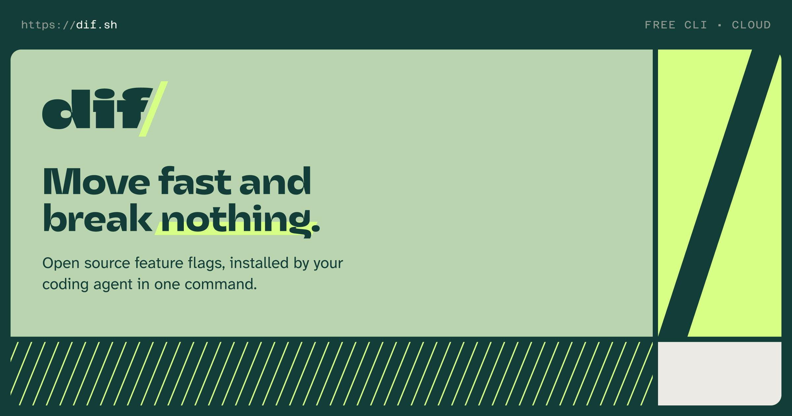
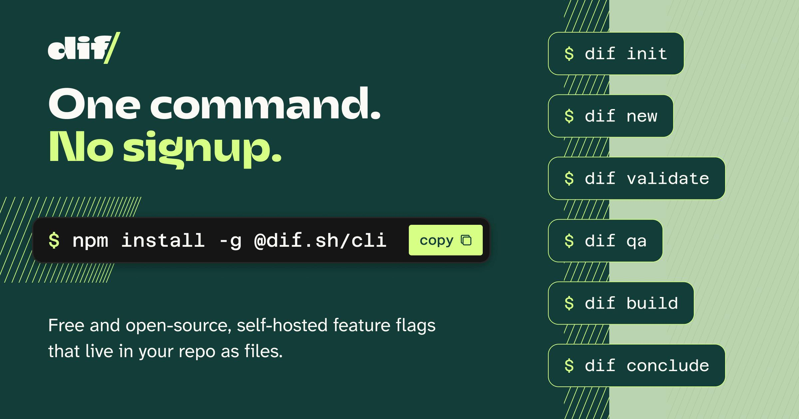
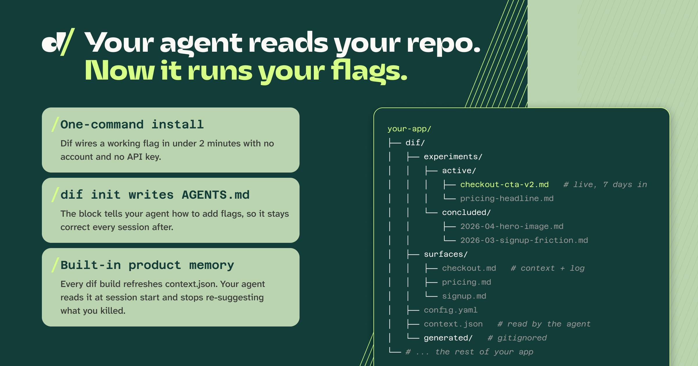

### 🎬 관련 영상
- [🎥 영상 보기](https://ph-files.imgix.net/a0ffd7da-0f2f-4bc5-a210-a6ba9b1458c7.jpeg?auto=format)

---

## 2. [Reflexio](https://www.producthunt.com/products/reflexio-2)
**Votes**: 222 | **도입 난이도**: 중 | **신뢰도**: 상
**Tagline**: Behavioral learning that makes AI agents better over time
**서비스 링크**: https://www.producthunt.com/r/3COBJOOBFV7YMA

**태그**: AI, Automation, DevTool, MLOps, Agent, AI Tool

### 📌 이 서비스 한눈에 보기
사용자의 피드백을 실시간 학습 데이터로 전환하여 AI 에이전트의 성능을 지속적으로 개선하는 도구

### 🔑 주요 기능
- 상호작용을 통한 행동 학습: 사용자의 수정이나 성공/실패 사례를 에이전트의 재사용 가능한 행동으로 변환
- 로그 데이터의 자산화: 로그에 묻혀 있던 가치 있는 교훈을 가시적이고 테스트 가능한 학습 데이터로 활용
- 효율성 극대화: 작업 실패율을 30% 이상 낮추고 토큰 소모량을 60% 이상 절감

### 🙋 사용자에게 어떤 점이 좋은가
AI 에이전트가 반복적인 오류를 범하는 문제를 해결하고, 적은 비용으로도 점점 더 똑똑해지는 자동화 워크플로우를 구축할 수 있습니다.

### ✅ 지금 바로 써볼 기능
- 기존 AI 에이전트의 실패 로그 분석하기
- 사용자 피드백 루프를 Reflexio에 연결하기
- 학습된 행동이 기존 워크플로우에 미치는 영향 테스트하기

### ⚠️ 사용 전 확인할 점
- 잘못된 사용자 피드백이 에이전트의 잘못된 행동 패턴으로 고착될 위험성
- 학습 데이터의 품질에 따른 성능 변동성

### 🧭 확인이 더 필요한 정보
기존에 구축된 다양한 AI 프레임워크 및 에이전트 플랫폼과의 구체적인 통합 방식과 기술적 요구사항을 확인해야 합니다.

### 📸 스크린샷 및 갤러리

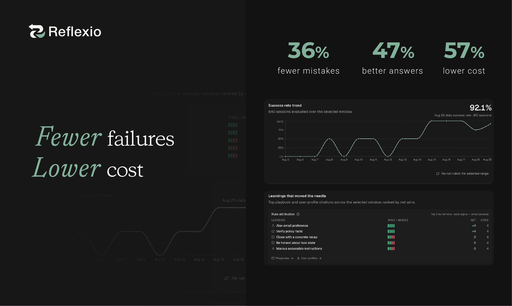
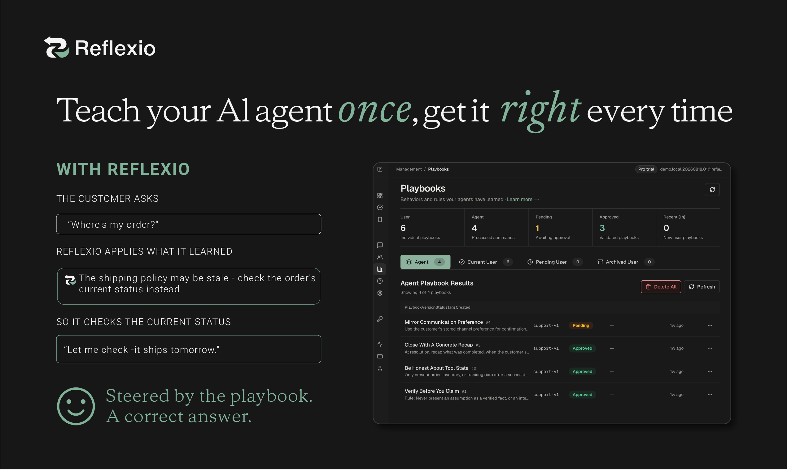

### 🎬 관련 영상
- [🎥 영상 보기](https://ph-files.imgix.net/43f16d78-93c1-418a-9ee9-19c96871b512.jpeg?auto=format)

---

## 3. [Ponytail](https://www.producthunt.com/products/ponytail)
**Votes**: 161 | **도입 난이도**: 하 | **신뢰도**: 상
**Tagline**: Make new code the last resort
**서비스 링크**: https://www.producthunt.com/r/F54V33UO2L5EHU

**태그**: DevTool, AI, Productivity, CleanCode, Agent, AI Tool, API

### 📌 이 서비스 한눈에 보기
불필요한 코드 작성을 방지하여 코드량을 최소화하는 AI 코딩 에이전트 플러그인

### 🔑 주요 기능
- 최소한의 코드로 동일한 동작을 구현하는 데 집중
- 표준 라이브러리(stdlib) 및 네이티브 API 우선 활용 검토
- 중복 코드 생성 방지 및 기존 코드 활용 최적화

### 🙋 사용자에게 어떤 점이 좋은가
코드 복잡도를 낮추고 유지보수 비용을 줄여, 더 적은 코드로도 안정적인 소프트웨어를 구축할 수 있게 돕습니다.

### ✅ 지금 바로 써볼 기능
- 기존 코드베이스에 플러그인 설치 및 연동
- AI 에이전트가 제안하는 코드의 최소화 여부 확인
- 표준 라이브러리 활용 제안 기능 테스트

### ⚠️ 사용 전 확인할 점
- 코드 최소화 과정에서 가독성이나 팀의 코딩 컨벤션과 충돌할 가능성
- 표준 라이브러리 활용이 특정 프레임워크 환경에서 제한될 가능성

### 🧭 확인이 더 필요한 정보
지원하는 IDE 및 프로그래밍 언어의 범위에 대한 구체적인 정보가 필요합니다.

### 📸 스크린샷 및 갤러리

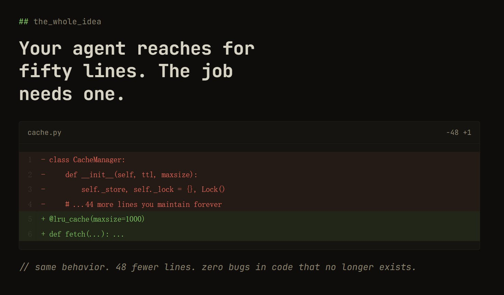
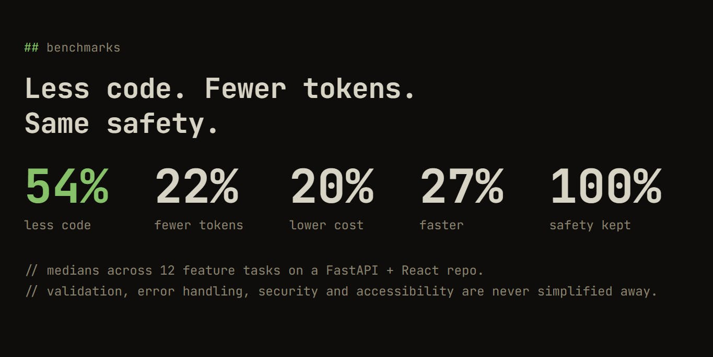

### 🎬 관련 영상
- [🎥 영상 보기](https://ph-files.imgix.net/24d585eb-d17f-4d03-854a-c262cf14baed.jpeg?auto=format)

---

## 4. [Hyperprobe](https://www.producthunt.com/products/hyperprobe)
**Votes**: 150 | **도입 난이도**: 중 | **신뢰도**: 상
**Tagline**: Lets your AI agents debug production without redeploying
**서비스 링크**: https://www.producthunt.com/r/G2JREG7FXOOWLK

**태그**: DevTool, AI, Debugging, Backend, Observability, Agent, AI Tool

### 📌 이 서비스 한눈에 보기
재배포 없이 실시간 프로브를 삽입하여 AI 에이전트가 운영 환경의 버그를 즉시 해결하게 돕는 디버깅 도구

### 🔑 주요 기능
- 로컬에서 재현 불가능한 운영 환경 이슈를 실시간으로 디버깅
- 코드 수정 및 재배포 과정 없이 읽기 전용 프로브(Probe) 삽입 가능
- Claude Code, Cursor 등 AI 에이전트와 연동하여 즉각적인 버그 수정 지원

### 🙋 사용자에게 어떤 점이 좋은가
로그를 추가하고 배포를 기다리는 번거로움 없이, 운영 중인 서비스의 변수 상태를 캡처하여 마치 로컬 환경처럼 버그를 해결할 수 있습니다.

### ✅ 지금 바로 써볼 기능
- AI 에이전트(Cursor, Claude Code 등)와 연동 설정하기
- 운영 환경에 읽기 전용 프로브 삽입 테스트하기
- 실시간 변수 상태 캡처 기능 확인하기

### ⚠️ 사용 전 확인할 점
- 운영 환경에 프로브를 삽입할 때 발생할 수 있는 성능 영향(Overhead) 확인 필요
- 읽기 전용 프로브가 보안 정책이나 데이터 접근 권한에 미치는 영향 검토

### 🧭 확인이 더 필요한 정보
프로브 삽입 시 서비스 성능에 미치는 영향과 보안 프로토콜에 대한 구체적인 정보가 필요합니다.

### 📸 스크린샷 및 갤러리
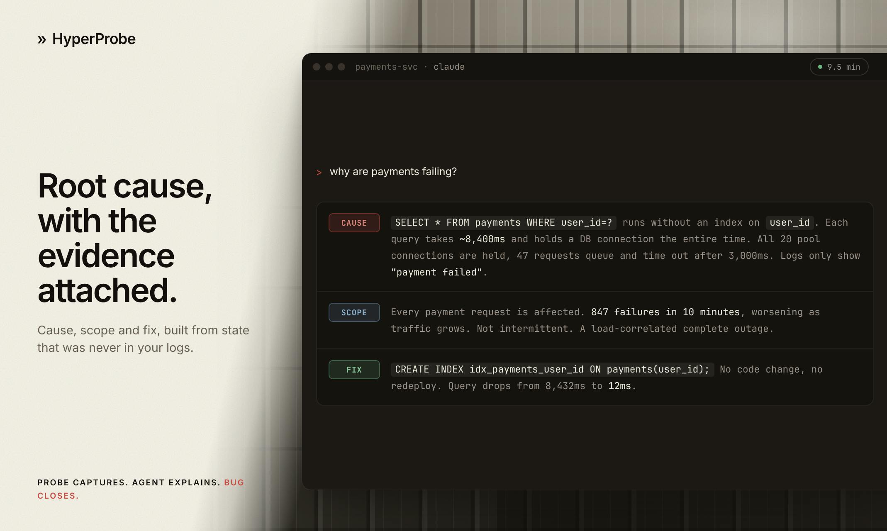
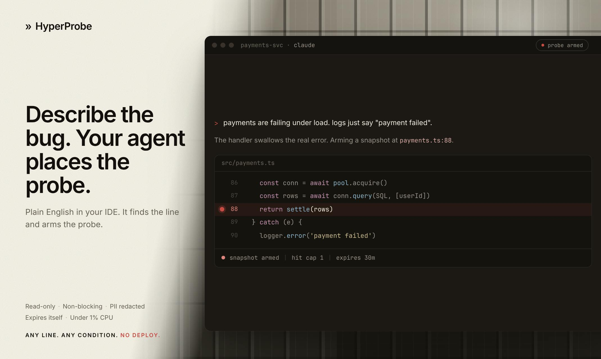
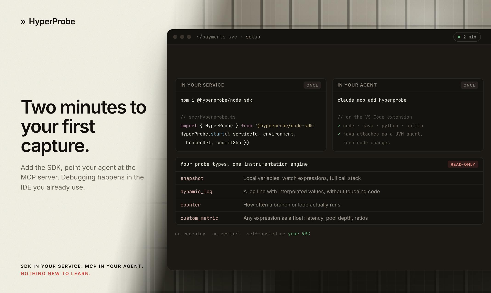

### 🎬 관련 영상
- [🎥 영상 보기](https://ph-files.imgix.net/24736056-7b29-43f5-8ecd-63912e035316.jpeg?auto=format)

---

## 5. [at8pm](https://www.producthunt.com/products/at8pm)
**Votes**: 117 | **도입 난이도**: 하 | **신뢰도**: 상
**Tagline**: Your honest journal
**서비스 링크**: https://www.producthunt.com/r/IKH2ZONP3QEURJ

**태그**: Journaling, Productivity, Privacy, Video

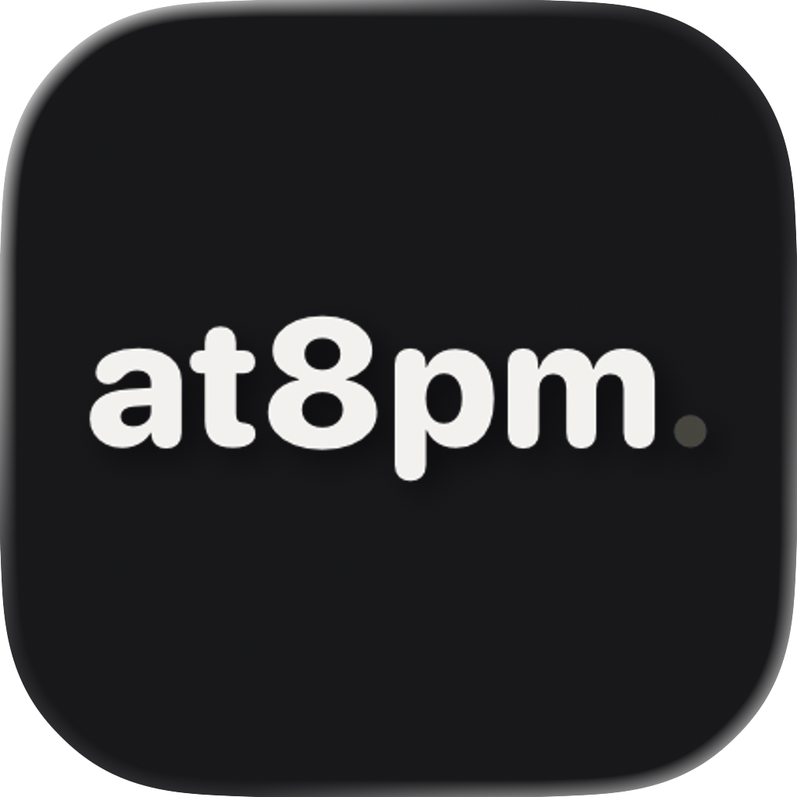

### 📌 이 서비스 한눈에 보기
설정된 시간이 되면 수정이 불가능해지는 정직한 기록을 위한 데일리 저널

### 🔑 주요 기능
- 설정된 시간이 되면 편집이 불가능해지는 '잠금' 기능으로 기록의 정직성 유지
- iCloud를 통한 개인 프라이버시 중심의 데이터 동기화
- 텍스트 외에도 영상(squope) 및 오디오 기록 지원

### 🙋 사용자에게 어떤 점이 좋은가
과거의 기록을 미화하거나 수정하려는 유혹을 차단하여, 당시의 감정과 상황을 있는 그대로 보존할 수 있습니다.

### ✅ 지금 바로 써볼 기능
- 매일 기록할 시간을 설정하여 잠금 기능 체험하기
- 텍스트 대신 영상이나 오디오로 생생한 기록 남기기
- iCloud 동기화 설정 확인하기

### ⚠️ 사용 전 확인할 점
- 하루 최대 2개 엔트리까지만 무료로 이용 가능
- 한 번 잠긴 기록은 수정이나 재작성이 불가능함

### 🧭 확인이 더 필요한 정보
무료 사용 범위를 초과하는 유료 플랜의 상세 정책은 명시되어 있지 않습니다.

### 📸 스크린샷 및 갤러리
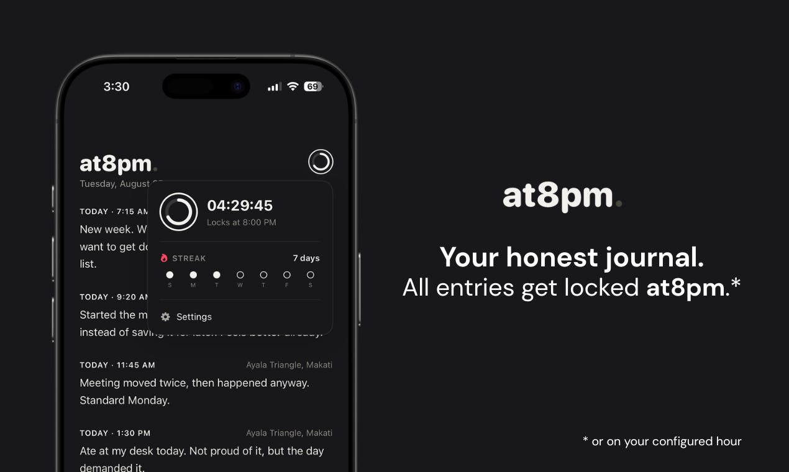

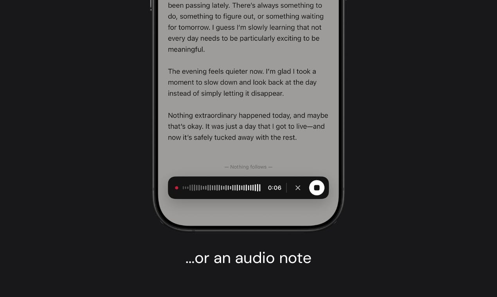

### 🎬 관련 영상
- [🎥 영상 보기](https://ph-files.imgix.net/0bd43ae8-4bf1-4046-86ed-1deea0916eb6.jpeg?auto=format)

---

## 6. [PostBox](https://www.producthunt.com/products/postbox)
**Votes**: 105 | **도입 난이도**: 하 | **신뢰도**: 상
**Tagline**: Stage and post designs from your mac
**서비스 링크**: https://www.producthunt.com/r/OIYKGBVYOM2P3Q

**태그**: DesignTool, Automation, SocialMedia, Productivity, Design

### 📌 이 서비스 한눈에 보기
맥북 노치를 활용해 디자인 결과물을 여러 SNS에 한 번에 배포하는 자동화 도구

### 🔑 주요 기능
- 맥북 노치 영역을 드래그 앤 드롭 인터페이스로 활용
- 한 번의 캡션 작성으로 X, Bluesky, Threads, Instagram 등 다수 플랫폼 동시 게시
- 디자인 작업물을 빠르게 공유할 수 있는 워크플로우 제공

### 🙋 사용자에게 어떤 점이 좋은가
디자이너나 콘텐츠 제작자가 여러 SNS 채널에 결과물을 수동으로 업로드하는 번거로움을 획기적으로 줄여줍니다.

### ✅ 지금 바로 써볼 기능
- 디자인 결과물 파일을 노치 영역으로 드래그해보기
- 동시 게시할 플랫폼들을 설정하고 캡션 작성해보기

### ⚠️ 사용 전 확인할 점
- 맥북 노치 디자인을 활용하므로 특정 하드웨어 환경에 최적화되어 있을 수 있음
- 각 SNS 플랫폼의 API 정책에 따른 게시 제한 가능성

### 🧭 확인이 더 필요한 정보
지원하는 모든 SNS 플랫폼에 대한 계정 연동 방식과 보안 정책을 확인해야 합니다.

### 📸 스크린샷 및 갤러리
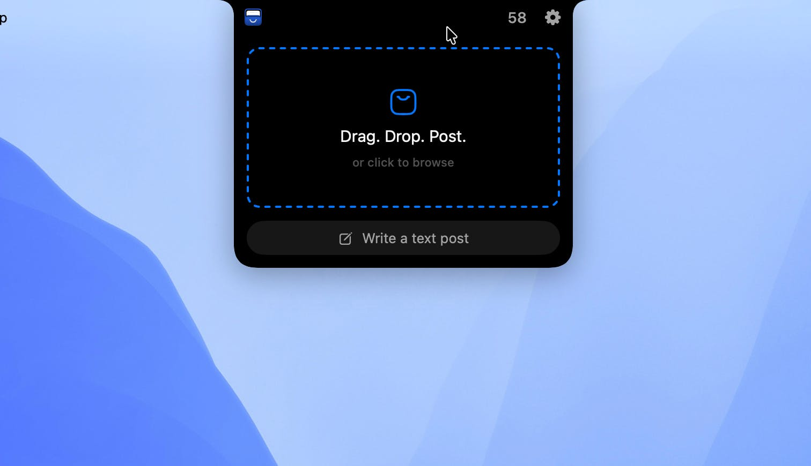
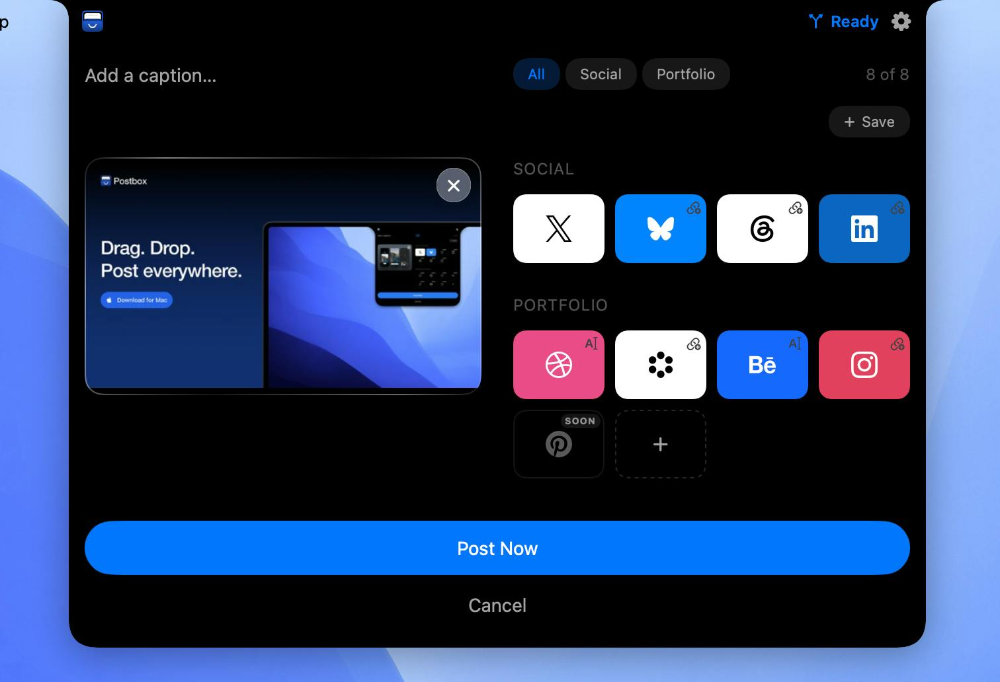
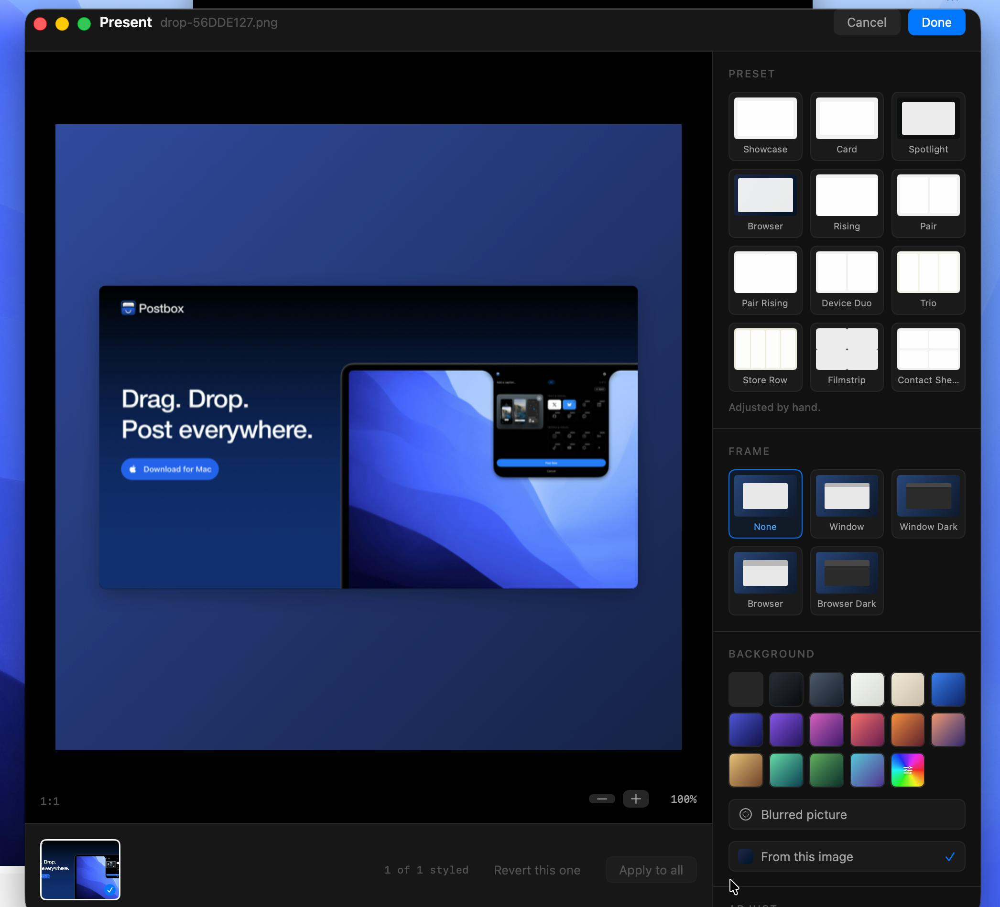

### 🎬 관련 영상
- [🎥 영상 보기](https://ph-files.imgix.net/f7b1ec75-488c-4f07-9bc5-bb8bd23fbda2.jpeg?auto=format)

---

## 7. [Experiential Labs](https://www.producthunt.com/products/experiential-labs)
**Votes**: 104 | **도입 난이도**: 중 | **신뢰도**: 상
**Tagline**: Open source AI gateway turning traffic into a better model
**서비스 링크**: https://www.producthunt.com/r/4UYNGTFOMOUGCH

**태그**: AI, OpenSource, DevOps, MLOps, AI Tool

### 📌 이 서비스 한눈에 보기
사용자 트래픽을 학습하여 비용을 절감하고 최적의 모델을 추천하는 오픈소스 AI 게이트웨이

### 🔑 주요 기능
- BYOK(Bring Your Own Key) 및 셀프 호스팅을 지원하는 제로 마진 오픈소스 게이트웨이
- 트래픽 데이터를 분석하여 비용 절감 및 더 나은 모델 추천 기능 제공
- 사용자 데이터를 기반으로 소유 가능한 특화 모델 학습 지원

### 🙋 사용자에게 어떤 점이 좋은가
다양한 AI 모델을 사용하는 환경에서 트래픽을 효율적으로 관리하고, 데이터 기반의 모델 최적화를 통해 운영 비용을 낮출 수 있습니다.

### ✅ 지금 바로 써볼 기능
- 기존 AI 워크플로우에 게이트웨이 연결하기
- 트래픽 분석을 통한 모델 추천 기능 테스트하기
- 학습된 특화 모델 생성 프로세스 확인하기

### ⚠️ 사용 전 확인할 점
- 트래픽 데이터를 학습에 활용하므로 데이터 보안 및 개인정보 정책 확인 필요
- 오픈소스 솔루션이므로 직접 호스팅 시 인프라 관리 역량 필요

### 🧭 확인이 더 필요한 정보
트래픽 데이터가 모델 학습에 사용되는 구체적인 보안 프로토콜과 데이터 격리 방식에 대한 확인이 필요합니다.

### 📸 스크린샷 및 갤러리
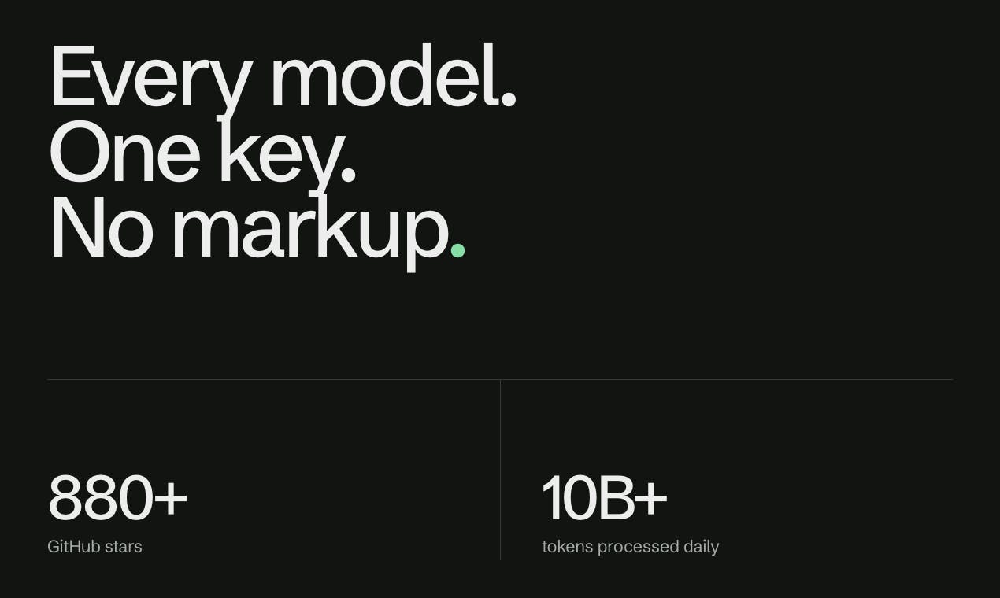

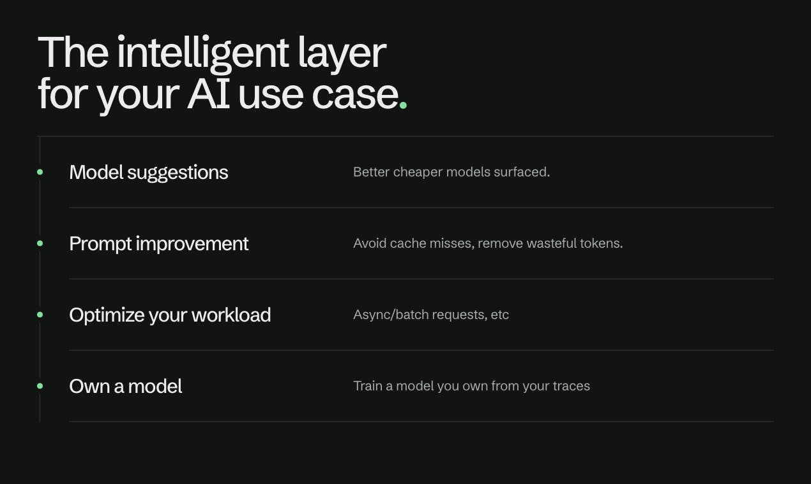

### 🎬 관련 영상
- [🎥 영상 보기](https://ph-files.imgix.net/da814783-c327-43a3-ade1-ecf352daa533.jpeg?auto=format)

---

## 8. [CommuteBar](https://www.producthunt.com/products/commutebar)
**Votes**: 97 | **도입 난이도**: 하 | **신뢰도**: 상
**Tagline**: Live commute times in your menu bar
**서비스 링크**: https://www.producthunt.com/r/QZRIQAR322JJFD

**태그**: Productivity, Mac, Travel, Automation

### 📌 이 서비스 한눈에 보기
맥 메뉴바에서 실시간 교통 상황을 확인하여 정시 출발을 돕는 출퇴근 관리 도구

### 🔑 주요 기능
- 앱 전환 없이 맥 메뉴바에서 즉시 확인 가능한 실시간 통근 시간
- 사무실, 학교, 체육관 등 여러 목적지 저장 및 자동 전환 스케줄링
- 출발 알림, 경로 비교, 교통 지연 알림 및 다양한 이동 수단 지원

### 🙋 사용자에게 어떤 점이 좋은가
매번 교통 상황을 확인하기 위해 앱을 열 필요 없이, 메뉴바를 통해 직관적으로 출발 시점을 결정할 수 있어 시간을 절약해 줍니다.

### ✅ 지금 바로 써볼 기능
- 자주 가는 목적지(회사, 학교 등) 등록하기
- 반복되는 일정에 맞춰 자동 전환 스케줄 설정하기
- 상황에 맞는 출발 알림 및 알림 설정 활성화하기

### ⚠️ 사용 전 확인할 점
- 실시간 데이터 업데이트를 위한 네트워크 연결 필요
- 목적지별 교통 상황에 따른 데이터 정확도 차이 가능성

### 🧭 확인이 더 필요한 정보
사용자의 위치 정보 접근 권한 및 배터리 소모량에 대한 구체적인 정보가 명시되지 않았습니다.

### 📸 스크린샷 및 갤러리
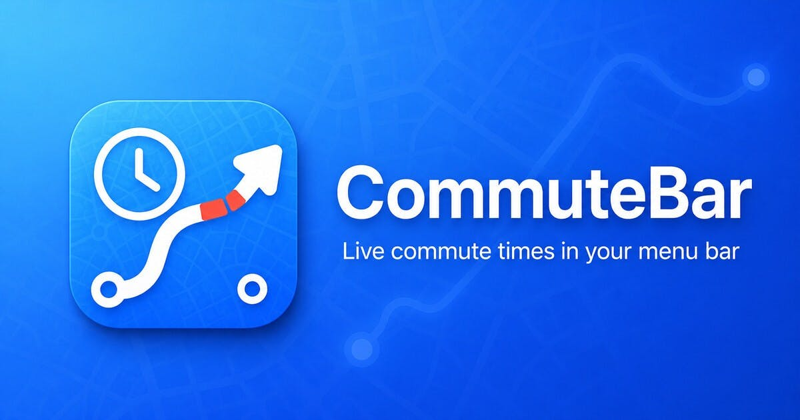
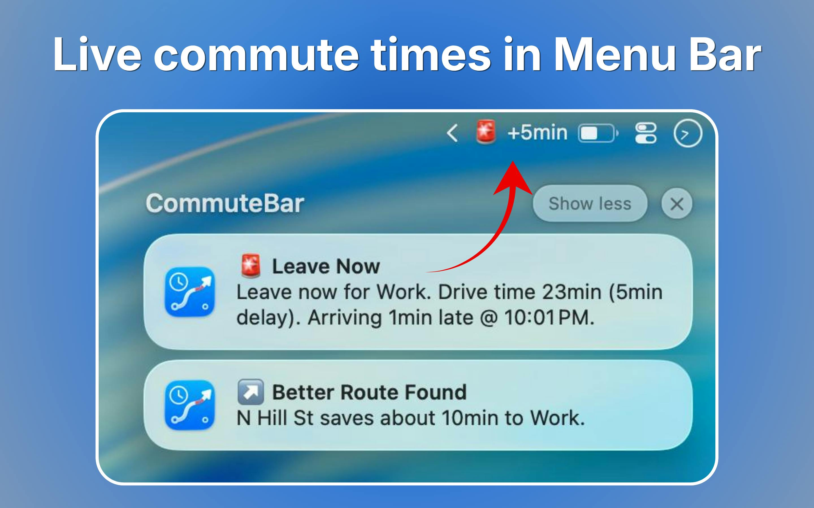
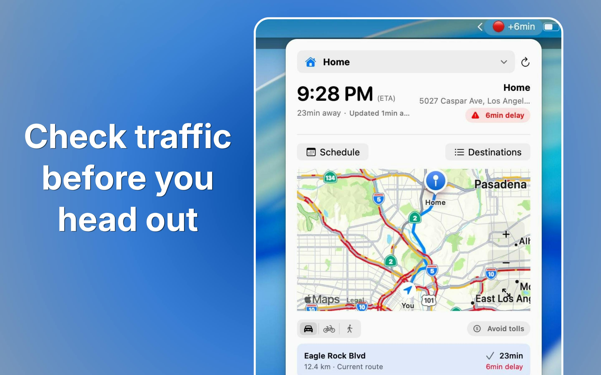

### 🎬 관련 영상
- [🎥 영상 보기](https://ph-files.imgix.net/bfe93036-1cc7-4a9a-a876-f0c0c9ab4fa2.jpeg?auto=format)

---

## 9. [Queuebrick](https://www.producthunt.com/products/queuebrick)
**Votes**: 91 | **도입 난이도**: 하 | **신뢰도**: 상
**Tagline**: The Letterboxd alternative
**서비스 링크**: https://www.producthunt.com/r/TCKW65R5TMS3PK

**태그**: Movie Tracker, Lifestyle, Personalization

### 📌 이 서비스 한눈에 보기
빠르고 우아한 인터페이스를 갖춘 영화 기록 및 관리 서비스

### 🔑 주요 기능
- 직관적인 영화 검색 및 기록 기능
- 영화 평점 부여 및 개인별 큐(Queue) 관리
- 다음 시청할 영화를 결정하는 랭킹 시스템

### 🙋 사용자에게 어떤 점이 좋은가
영화 팬들이 자신이 본 영화를 기록하고, 다음에 무엇을 볼지 효율적으로 결정할 수 있는 개인화된 관리 환경을 제공합니다.

### ✅ 지금 바로 써볼 기능
- 보고 싶은 영화를 검색하여 큐에 추가하기
- 시청 완료한 영화에 평점 매기기
- 나만의 영화 순위 리스트 만들기

### ⚠️ 사용 전 확인할 점
- Letterboxd와 비교했을 때 커뮤니티 기능이나 데이터베이스 규모가 다를 수 있음

### 🧭 확인이 더 필요한 정보
현재 제공되는 데이터베이스의 규모와 소셜 기능(커뮤니티) 포함 여부를 확인해야 합니다.

### 📸 스크린샷 및 갤러리
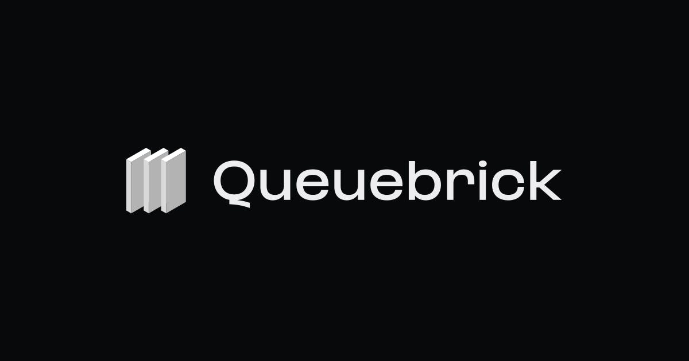

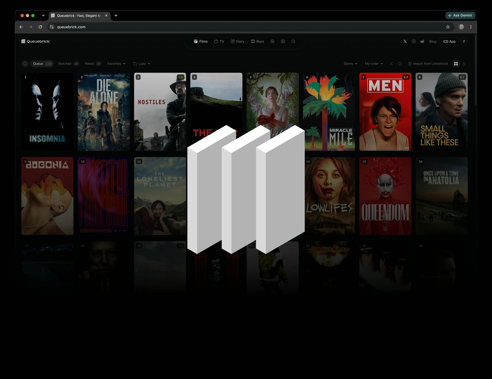

### 🎬 관련 영상
- [🎥 영상 보기](https://ph-files.imgix.net/7028a929-c9b6-497b-b4c8-8da540206f25.jpeg?auto=format)

---

## 10. [Retold](https://www.producthunt.com/products/retold)
**Votes**: 85 | **도입 난이도**: 하 | **신뢰도**: 상
**Tagline**: Turn family voices into hand-drawn story films
**서비스 링크**: https://www.producthunt.com/r/O6EWZGAHLH3P7T

**태그**: AI, Storytelling, Family, Creative, AI Tool

### 📌 이 서비스 한눈에 보기
가족의 목소리를 담은 소중한 기억을 손그림 애니메이션 영화와 책으로 변환해주는 서비스

### 🔑 주요 기능
- 음성 녹음 또는 기존 음성 파일을 통한 스토리텔링
- 실제 목소리를 유지하며 이야기에 맞춰 생성되는 손그림 애니메이션
- 디지털 영상과 읽을 수 있는 책 형태로 기록되는 가족의 추억

### 🙋 사용자에게 어떤 점이 좋은가
소중한 사람의 목소리가 담긴 이야기를 시각적인 예술 작품으로 간직할 수 있어 감성적인 기록 보관이 가능합니다.

### ✅ 지금 바로 써볼 기능
- 옛날 음성 파일 업로드해보기
- 직접 목소리 녹음하여 스토리 만들기
- 생성된 손그림 필름 감상하기

### ⚠️ 사용 전 확인할 점
- 음성 품질에 따라 생성되는 애니메이션의 디테일이 달라질 수 있음
- 물리적인 책 제작 여부 및 배송 정책 확인 필요

### 🧭 확인이 더 필요한 정보
물리적인 실물 책의 제작 방식과 배송 서비스 포함 여부에 대한 정보가 명시되지 않았습니다.

### 📸 스크린샷 및 갤러리
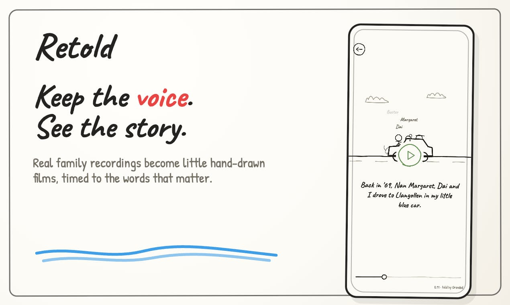
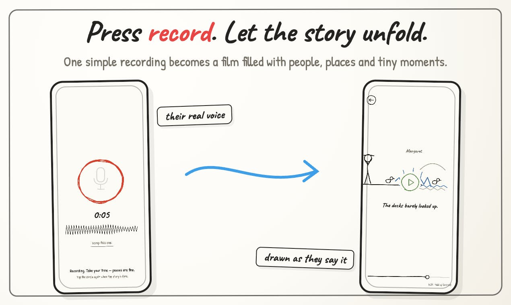

### 🎬 관련 영상
- [🎥 영상 보기](https://ph-files.imgix.net/051cb346-afda-41cb-ab71-07e5962698c1.jpeg?auto=format)

---

## 11. [BrickForgerAI](https://www.producthunt.com/products/brickforgerai)
**Votes**: 83 | **도입 난이도**: 중 | **신뢰도**: 상
**Tagline**: Turn any prompt into a brick set you can actually build
**서비스 링크**: https://www.producthunt.com/r/LZXJIZS6CXVK7O

**태그**: AI, DesignTool, 3DModeling, Automation, AI Tool, Prompting, Vision

### 📌 이 서비스 한눈에 보기
텍스트 프롬프트를 실제 조립 가능한 브릭 모델과 설계도로 변환해주는 AI 엔진

### 🔑 주요 기능
- AI 이미지 및 메쉬 생성 기술을 활용한 브릭 모델링
- 구조적 안정성(중력 하중 분석)과 실제 조립 가능성을 고려한 정밀 엔진
- 설계도(realtldr), 부품 리스트, 단계별 PDF 설명서 자동 생성

### 🙋 사용자에게 어떤 점이 좋은가
아이디어를 입력하면 실제 물리적 조립이 가능한 수준의 정교한 브릭 모델과 가이드를 즉시 얻을 수 있습니다.

### ✅ 지금 바로 써볼 기능
- 프롬프트를 입력하여 생성된 브릭 모델 확인하기
- 생성된 부품 리스트와 PDF 설명서 검토하기
- 구조적 안정성이 확보된 모델인지 분석 결과 확인하기

### ⚠️ 사용 전 확인할 점
- 현재 사용 가능한 브릭 라이브러리가 55종으로 제한적임
- 생성된 모델의 실제 물리적 조립 시 부품 수급 및 호환성 확인 필요

### 🧭 확인이 더 필요한 정보
현재 제공되는 55종의 부품 라이브러리가 향후 얼마나 확장될지 확인이 필요합니다.

### 📸 스크린샷 및 갤러리

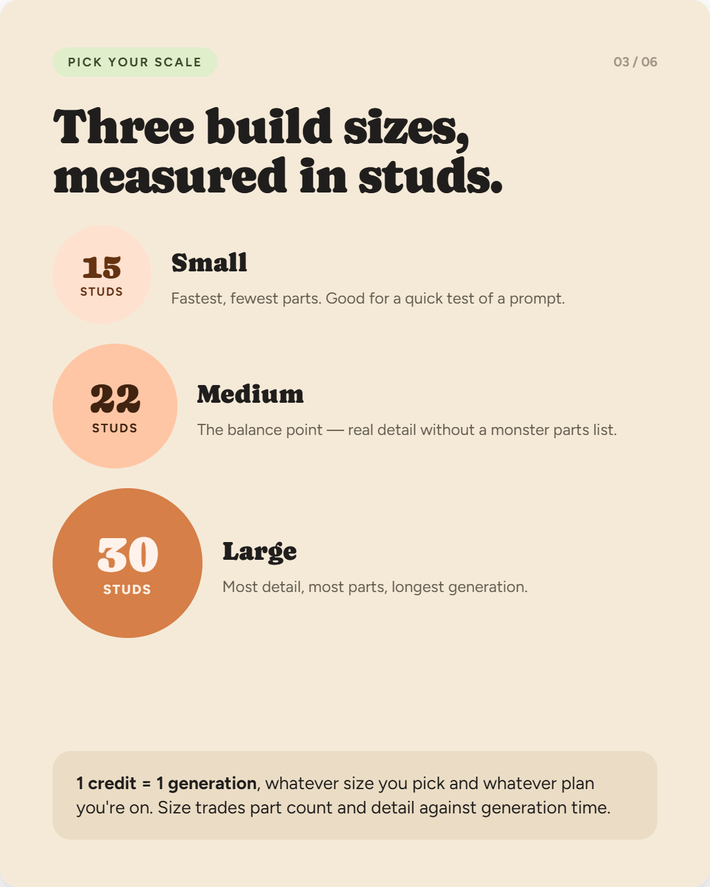

### 🎬 관련 영상
- [🎥 영상 보기](https://ph-files.imgix.net/f20f98b7-5b88-4ab6-bbef-6b4202cba9a7.jpeg?auto=format)

---

## 12. [GitWarren](https://www.producthunt.com/products/gitwarren)
**Votes**: 82 | **도입 난이도**: 하 | **신뢰도**: 상
**Tagline**: Review code with your coding agents before committing
**서비스 링크**: https://www.producthunt.com/r/NMV4NA5EFUXMR6

**태그**: DevTool, AI, CodeReview, Productivity, Agent, AI Tool

### 📌 이 서비스 한눈에 보기
로컬 작업 트리를 활용하여 푸시 없이도 AI 에이전트와 함께 코드 리뷰를 수행하는 도구

### 🔑 주요 기능
- 커밋 전 스테이징/수정 중인 코드를 대상으로 로컬 PR 방식의 리뷰 가능
- MCP를 통한 AI 에이전트 연결로 복사-붙여넣기 없는 심리스한 리뷰 경험 제공
- 코드 변경 사항에 종속된 인라인 댓글 및 스레드 관리 기능

### 🙋 사용자에게 어떤 점이 좋은가
코드를 원격 저장소에 푸시하기 전에 로컬 환경에서 즉시 리뷰를 진행하여 코드 품질을 높이고 작업 흐름을 최적화할 수 있습니다.

### ✅ 지금 바로 써볼 기능
- 로컬 작업 트리(Staged/Unstaged)에 대한 인라인 리뷰 기능 테스트
- 사용 중인 AI 에이전트와 MCP를 통한 연결 설정
- 코드 변경 사항별 스레드 관리 기능 활용

### ⚠️ 사용 전 확인할 점
- 로컬 환경 기반이므로 원격 저장소와의 동기화 방식 확인 필요
- 사용 중인 AI 모델/에이전트의 MCP 지원 여부에 따라 기능 제약 가능성 있음

### 🧭 확인이 더 필요한 정보
사용자의 특정 IDE나 로컬 개발 환경과의 호환성 및 상세 설정 방식에 대한 정보가 추가로 필요합니다.

### 📸 스크린샷 및 갤러리
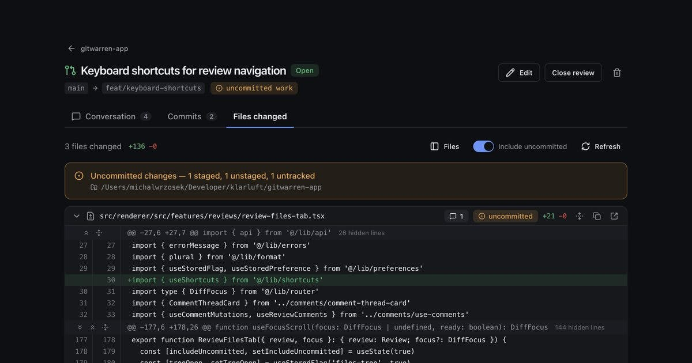
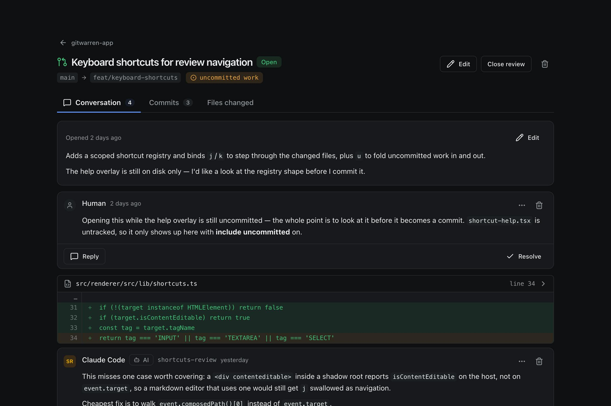
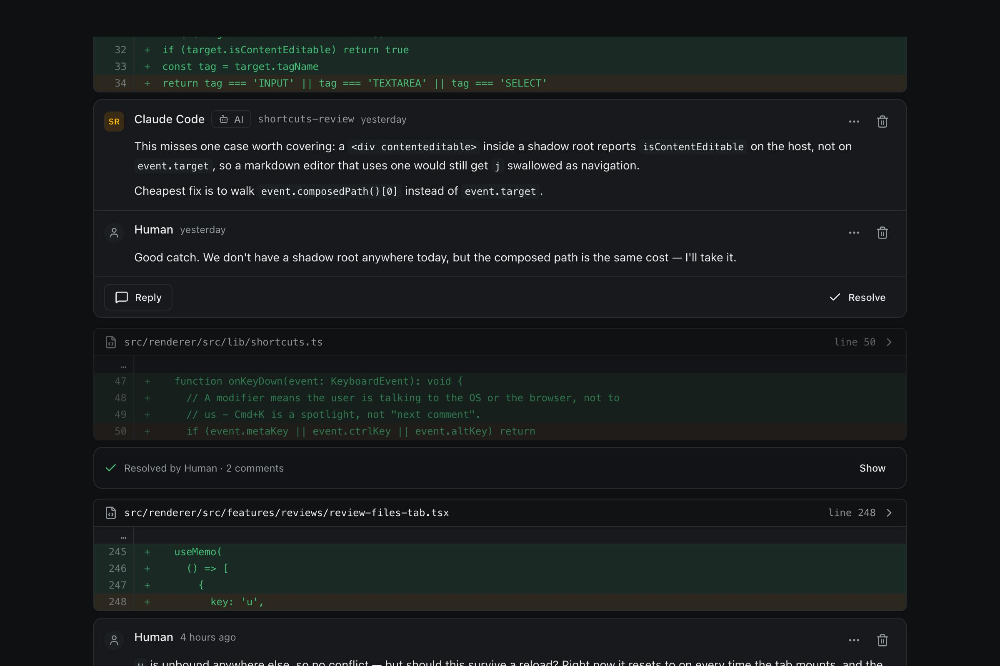

### 🎬 관련 영상
- [🎥 영상 보기](https://ph-files.imgix.net/d43e0c13-8853-4d91-aa3e-707aa68a74cc.jpeg?auto=format)

---

## 13. [​​AI Agents Listing​](https://www.producthunt.com/products/ai-agents-listing)
**Votes**: 19 | **도입 난이도**: 하 | **신뢰도**: 상
**Tagline**: ​​The agentic AI ecosystem, in one directory​
**서비스 링크**: https://www.producthunt.com/r/UR4K3G56ZRGRCH

**태그**: AI Agents, Directory, Automation, Productivity, Agent, AI Tool

### 📌 이 서비스 한눈에 보기
에이전트, MCP 서버, 스킬을 한눈에 연결하여 탐색하는 AI 에이전트 생태계 디렉토리

### 🔑 주요 기능
- 에이전트, MCP 서버, 에이전트 스킬로 구성된 3계층 구조의 통합 디렉토리
- 상호 연결된 데이터 구조를 통해 에이전트와 호환되는 도구 및 확장 기능을 쉽게 발견
- 검색, 카테고리 분류, 비교 및 대안 탐색 기능을 통한 효율적인 에이전트 스택 구축 지원

### 🙋 사용자에게 어떤 점이 좋은가
사용자는 자신의 워크플로우에 필요한 최적의 AI 에이전트와 이를 확장할 도구들을 상호 연관된 맥락 속에서 쉽게 찾고 비교할 수 있습니다.

### ✅ 지금 바로 써볼 기능
- 카테고리별 에이전트 탐색하기
- 특정 에이전트와 호환되는 MCP 서버 및 스킬 확인하기
- 필요한 에이전트 스택 비교 및 대안 찾기

### ⚠️ 사용 전 확인할 점
- 디렉토리에 등록된 도구들의 실제 성능이나 신뢰성은 개별 서비스 확인 필요
- 에이전트 간의 실제 호환성 여부는 사용 전 별도 검증 필요

### 🧭 확인이 더 필요한 정보
등록된 에이전트와 도구들의 실제 작동 품질 및 보안 수준은 개별 서비스 제공자에 따라 다를 수 있습니다.

### 📸 스크린샷 및 갤러리
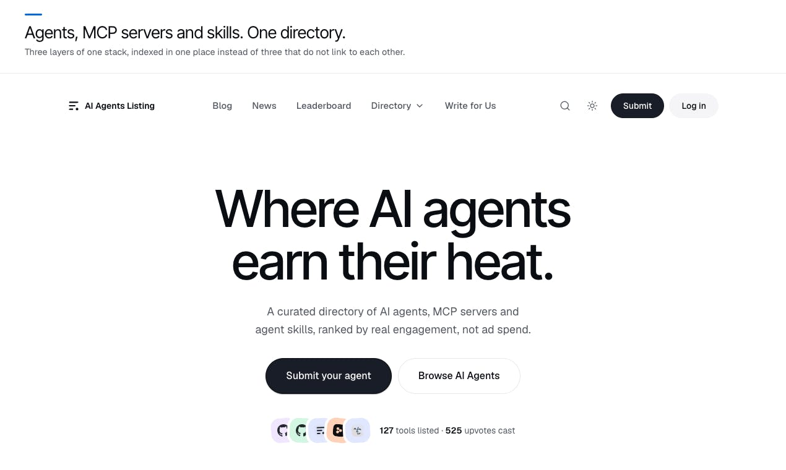
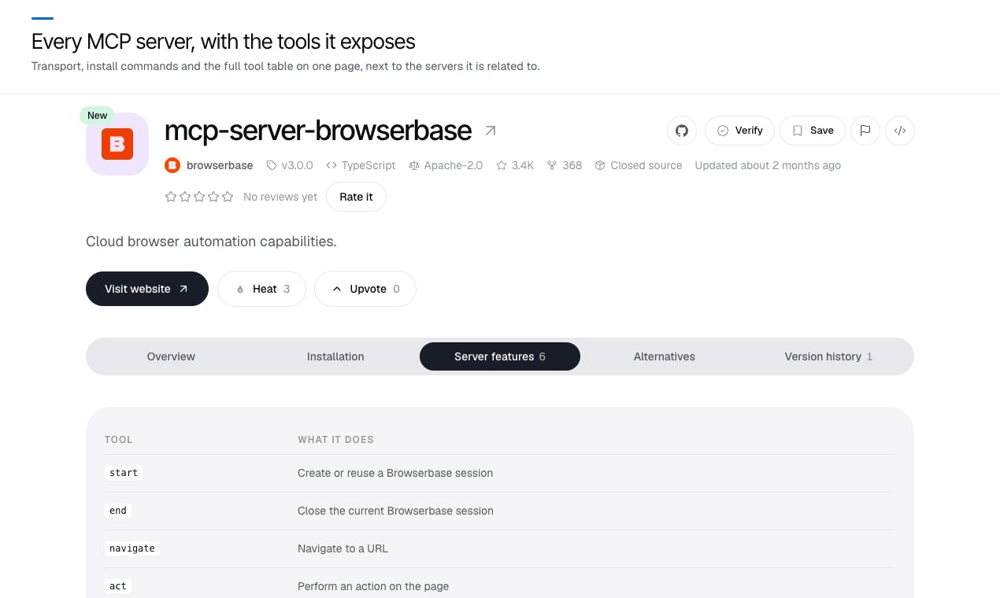
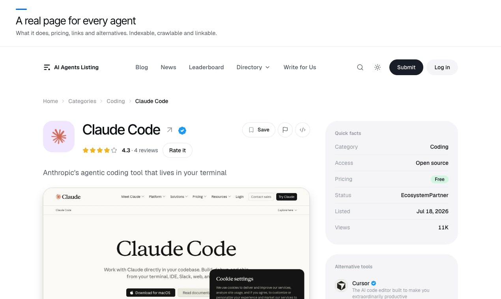

### 🎬 관련 영상
- [🎥 영상 보기](https://ph-files.imgix.net/581de604-82b7-427a-966d-8005b7b226a4.jpeg?auto=format)

---

## 14. [Malyatko — Baby tracker](https://www.producthunt.com/products/malyatko-baby-tracker)
**Votes**: 10 | **도입 난이도**: 하 | **신뢰도**: 상
**Tagline**:  Privacy-first baby tracker that works fully offline
**서비스 링크**: https://www.producthunt.com/r/SV2D7XAY32VVSQ

**태그**: BabyTracker, Privacy, Parenting, iOS, AI Tool

### 📌 이 서비스 한눈에 보기
개인정보 유출 걱정 없이 오프라인으로 안전하게 기록하는 프라이버시 중심 아기 성장 트래커

### 🔑 주요 기능
- 계정 생성이나 서버 저장 없이 기기 및 iCloud에만 저장되는 강력한 프라이버시 보호
- 수면, 수유, 기저귀 등 18가지 활동 유형 기록 및 데이터 시각화
- AI 인사이트를 통한 성장 팁 제공 및 수면 예측 기능

### 🙋 사용자에게 어떤 점이 좋은가
소중한 아이의 민감한 데이터가 서버에 남지 않아 안심할 수 있으며, 오프라인 환경에서도 끊김 없이 기록이 가능합니다.

### ✅ 지금 바로 써볼 기능
- 18가지 활동 유형별 기록 기능 테스트
- AI 기반 성장 팁 및 수면 예측 기능 확인
- Apple Watch 및 위젯 연동 설정

### ⚠️ 사용 전 확인할 점
- 데이터가 기기/iCloud에만 저장되므로 기기 분실 시 데이터 복구 여부 확인 필요
- 프리미엄 기능 사용 시 추가 비용 발생 가능성

### 🧭 확인이 더 필요한 정보
프리미엄 기능의 구체적인 범위와 비용 체계에 대한 정보가 명시되지 않았습니다.

### 📸 스크린샷 및 갤러리
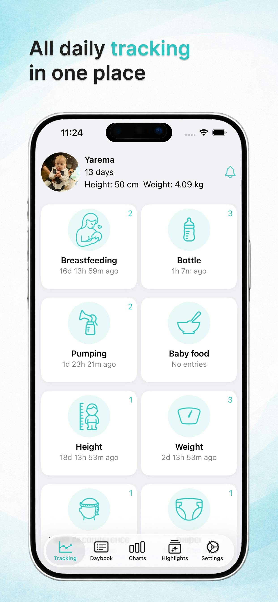
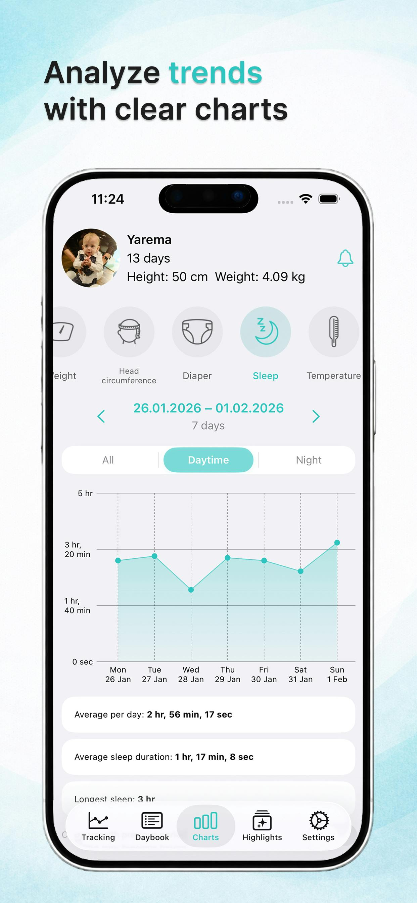
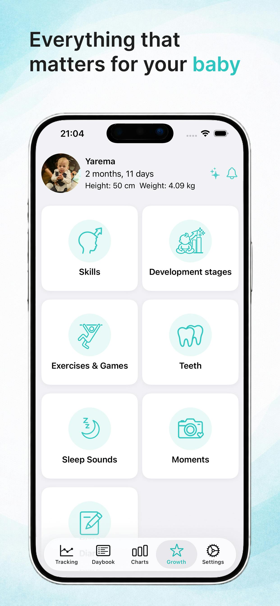

---

## 15. [LiftmyCV 3.0](https://www.producthunt.com/products/liftmycv)
**Votes**: 10 | **도입 난이도**: 하 | **신뢰도**: 상
**Tagline**: Your personal AI job search & auto-apply agent.
**서비스 링크**: https://www.producthunt.com/r/3DWTA6K5AKTGX2

**태그**: AI, Automation, JobSearch, Productivity, Agent, AI Tool

### 📌 이 서비스 한눈에 보기
AI가 직접 일자리를 찾고 지원까지 완료하는 올인원 자동 구직 에이전트

### 🔑 주요 기능
- 160만 개 이상의 채용 공고를 보유한 통합 Job Hub 제공
- 사용자 프로필 기반의 맞춤형 이력서 및 자기소개서 자동 생성
- 크롬 확장 프로그램 없이 작동하는 5가지 자동 지원(Auto-apply) 모드

### 🙋 사용자에게 어떤 점이 좋은가
구직자가 일일이 공고를 찾고 서류를 작성하는 번거로움을 줄여주며, 최신 공고에 대한 빠른 자동 지원을 통해 취업 성공률을 높일 수 있습니다.

### ✅ 지금 바로 써볼 기능
- Job Hub에서 본인에게 맞는 직무 탐색하기
- First/Stealth Apply 모드로 최신 공고 자동 지원 설정하기
- AI가 생성한 맞춤형 이력서 및 커버레터 검토하기

### ⚠️ 사용 전 확인할 점
- 자동 지원 시 생성된 서류의 품질이 사용자 의도와 일치하는지 확인 필요
- 자동화된 지원 방식이 특정 채용 플랫폼의 정책과 충돌할 가능성 검토

### 🧭 확인이 더 필요한 정보
자동 지원 모드별로 지원 방식이나 타겟 플랫폼의 차이가 어떻게 적용되는지 확인이 필요합니다.

### 📸 스크린샷 및 갤러리
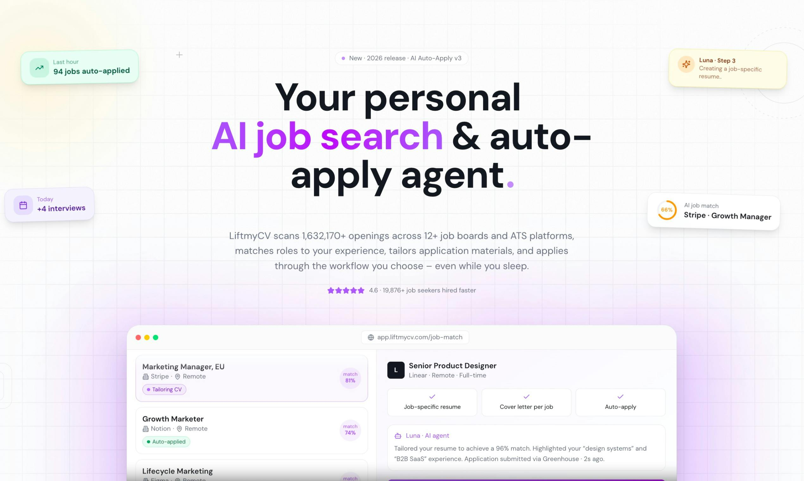
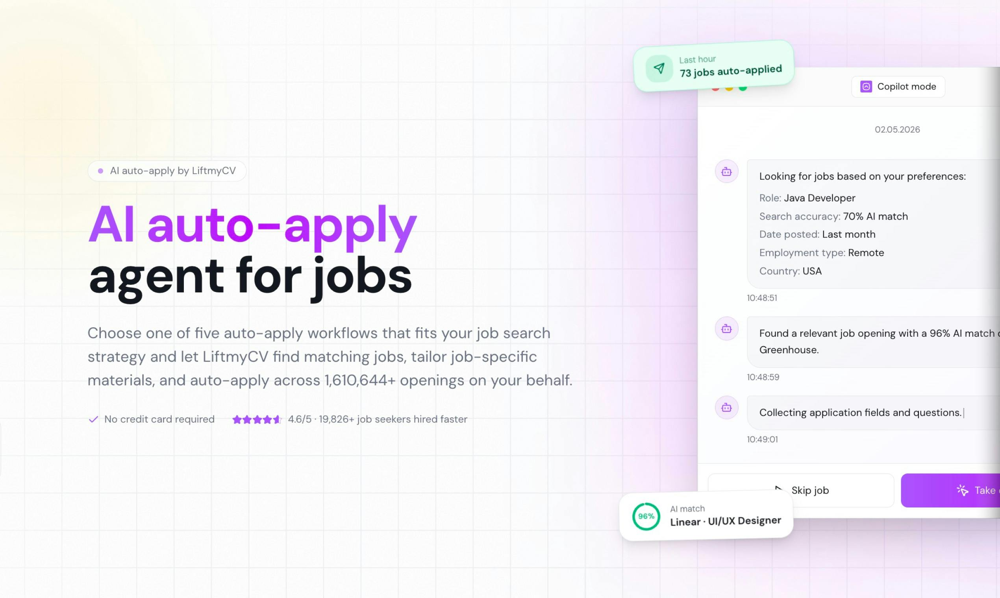
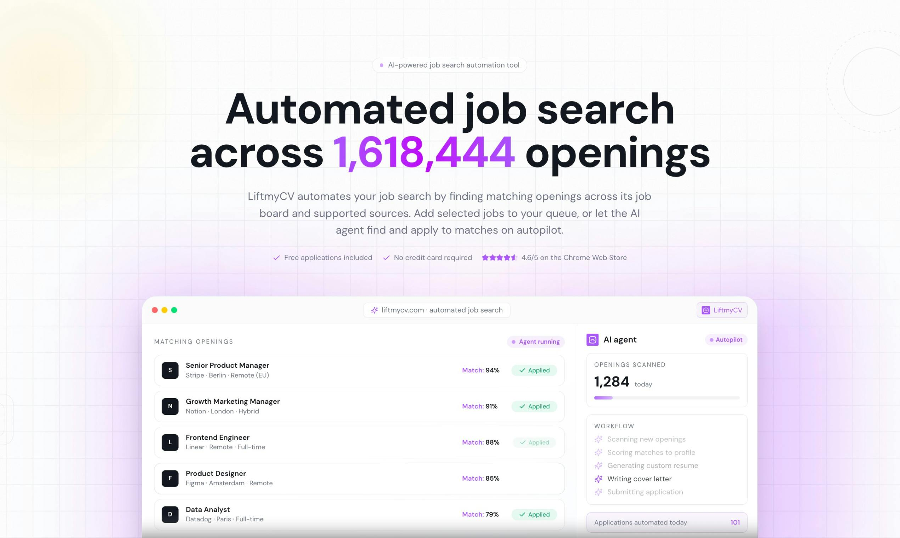

### 🎬 관련 영상
- [🎥 영상 보기](https://ph-files.imgix.net/a5911798-c915-43a7-a308-1e96d40422ac.jpeg?auto=format)

---

## 16. [Muse Spark 1.3](https://www.producthunt.com/products/muse-spark-1-3)
**Votes**: 9 | **도입 난이도**: 하 | **신뢰도**: 상
**Tagline**: Meta’s flagship for coding and long-horizon agents
**서비스 링크**: https://www.producthunt.com/r/AIHJ55ZHR6WROV

**태그**: DevTool, AI-Agent, Coding, Automation, Agent, API

### 📌 이 서비스 한눈에 보기
코딩과 에이전트 작업에 최적화된 Meta의 차세대 플래그십 모델

### 🔑 주요 기능
- 코딩 작업 시 이전 버전 대비 토큰 사용량 25% 감소 및 툴 호출 20% 감소
- DeepSWE v1.1 및 Terminal-Bench 2.1 등 주요 벤치마크에서 최상위 성능 기록
- 기존 1.2 버전과 동일한 API 가격 유지로 비용 효율성 확보

### 🙋 사용자에게 어떤 점이 좋은가
더 적은 비용과 토큰 소모로 더 빠르고 효율적인 코딩 및 에이전트 자동화 작업을 수행할 수 있습니다.

### ✅ 지금 바로 써볼 기능
- Muse Code에서 직접 코딩 성능 테스트하기
- Meta Model API를 통한 기존 워크플로우 적용
- 비용 절감을 위한 API 전환 검토

### ⚠️ 사용 전 확인할 점
- 최대 추론(Max reasoning) 기능은 안전성 테스트 이후 출시 예정
- 사용자 환경에 따른 실제 비용 절감 폭 차이 가능성

### 🧭 확인이 더 필요한 정보
안전성 테스트 결과에 따라 향후 기능 업데이트 및 가용 범위가 변경될 수 있습니다.

### 📸 스크린샷 및 갤러리

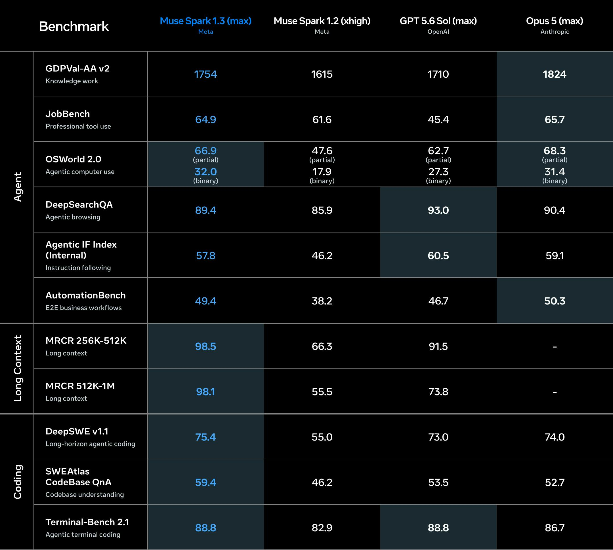
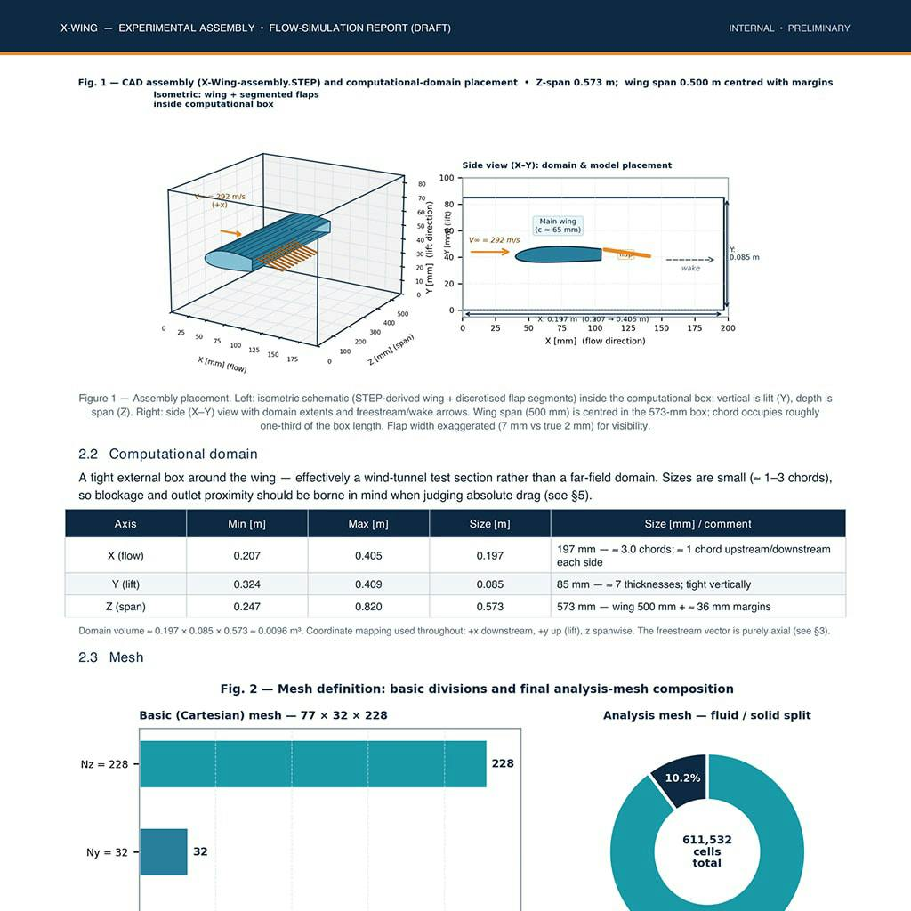

---

## 17. [Brain Rest](https://www.producthunt.com/products/brain-rest)
**Votes**: 8 | **도입 난이도**: 하 | **신뢰도**: 상
**Tagline**: Don’t let your browser rot your brain
**서비스 링크**: https://www.producthunt.com/r/VU22ZCH7PB5ZS7

**태그**: Productivity, Focus, Browser Extension, Gamification, AI Tool

### 📌 이 서비스 한눈에 보기
브라우저 사용 시간을 캐릭터 성장 요소로 시각화하여 몰입과 휴식을 돕는 생산성 도구

### 🔑 주요 기능
- 브라우저 사용 패턴을 'Brain Level' 캐릭터 상태로 시각화하여 직관적인 피드백 제공
- 사이트 제한, 차단, 포모도로 및 가이드형 휴식 기능 등 강력한 집중 모드 지원
- 업무 흐름을 방해하지 않는 온페이지 위젯을 통한 실시간 상태 확인

### 🙋 사용자에게 어떤 점이 좋은가
무의식적인 웹 서핑 습관을 게임처럼 관리할 수 있어, 업무 중 주의 분산을 막고 건강한 디지털 휴식을 유도합니다.

### ✅ 지금 바로 써볼 기능
- 대시보드에서 현재 브라우징 상태 확인하기
- 집중이 필요할 때 포모도로 또는 Focus Mode 실행하기
- 방해되는 사이트에 대한 일일 방문 제한 설정하기

### ⚠️ 사용 전 확인할 점
- Chrome 및 Edge 브라우저 환경에서만 사용 가능
- 고급 기능 사용 시 Pro 플랜 구독이 필요할 수 있음

### 🧭 확인이 더 필요한 정보
Pro 기능의 구체적인 기능 범위와 가격 정책은 명시되어 있지 않습니다.

### 📸 스크린샷 및 갤러리

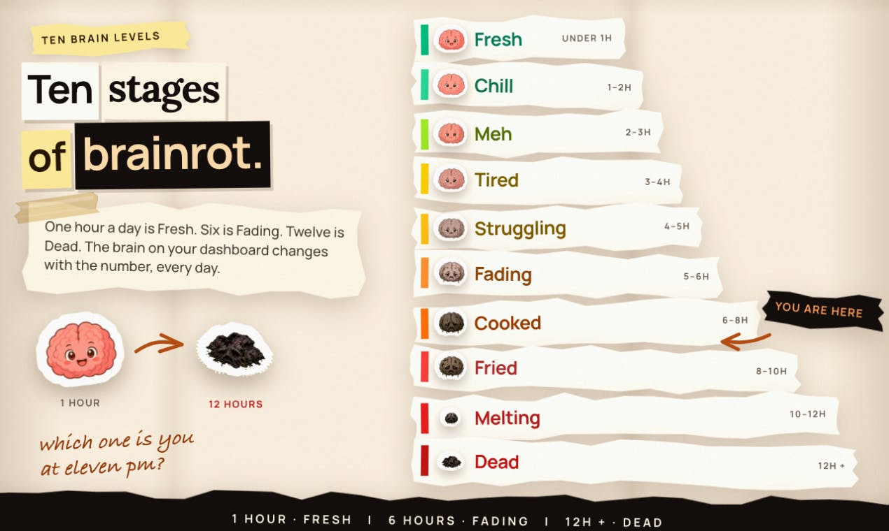
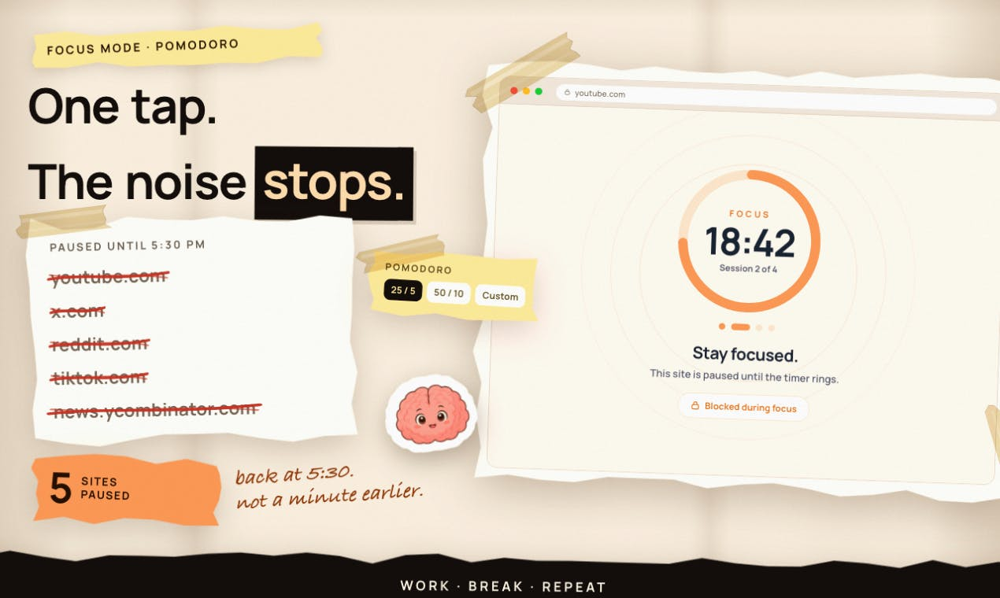

### 🎬 관련 영상
- [🎥 영상 보기](https://ph-files.imgix.net/343913dc-4a2c-4138-96f6-32aceee73396.jpeg?auto=format)

---

## 18. [Traction](https://www.producthunt.com/products/traction-9)
**Votes**: 6 | **도입 난이도**: 하 | **신뢰도**: 상
**Tagline**: helps indie founders get marketing traction
**서비스 링크**: https://www.producthunt.com/r/D3PFJ4KYZEI2XU

**태그**: Marketing, Automation, SaaS, GrowthHacking, AI Tool

### 📌 이 서비스 한눈에 보기
AI 기반 Bullseye 프레임워크를 통해 인디 파운더의 마케팅 전략을 최적화하고 실행을 돕는 도구

### 🔑 주요 기능
- AI를 활용한 Bullseye 프레임워크 기반의 마케팅 기회 압축
- 1,500개 이상의 디렉토리 등록 및 크롬 확장 프로그램을 통한 자동화된 노출
- Stripe 연동을 통한 실험별 MRR(월 반복 매출) 성과 추적

### 🙋 사용자에게 어떤 점이 좋은가
수많은 마케팅 채널 중 무엇을 시도해야 할지 고민하는 창업자에게 우선순위를 정해주고, 실행 과정을 자동화하여 효율을 높여줍니다.

### ✅ 지금 바로 써볼 기능
- Stripe 계정을 연결하여 실험별 매출 성과 확인하기
- 크롬 확장 프로그램을 설치하여 디렉토리 등록 자동화하기
- AI가 제안하는 2~3개의 핵심 마케팅 기회 검토하기

### ⚠️ 사용 전 확인할 점
- AI가 제안하는 전략이 실제 시장 상황과 일치하는지 검증 필요
- Stripe 연동 시 결제 데이터 접근에 대한 보안 검토 필요

### 🧭 확인이 더 필요한 정보
제시된 1,500개 이상의 디렉토리가 사용자의 제품 카테고리와 얼마나 일치하는지 확인이 필요합니다.

### 📸 스크린샷 및 갤러리
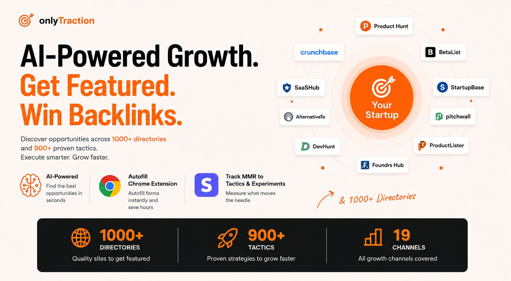
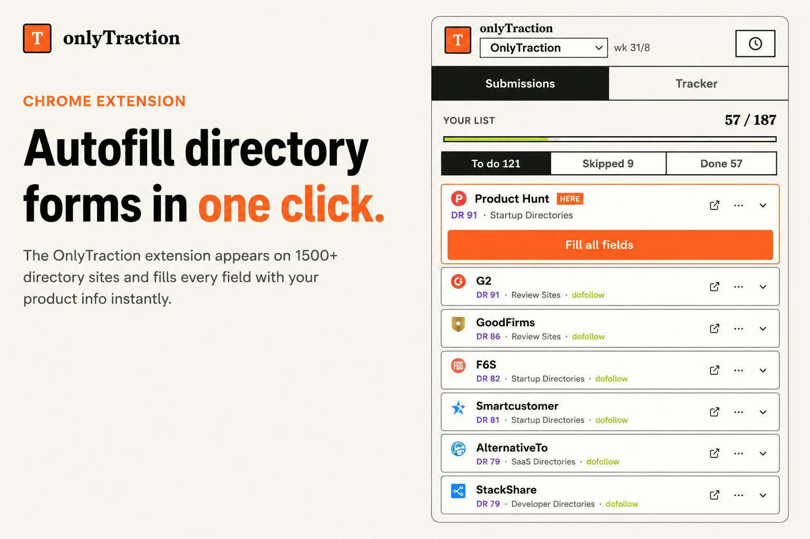

### 🎬 관련 영상
- [🎥 영상 보기](https://ph-files.imgix.net/b06f53b7-ce68-4826-baef-44b50ba8c78d.jpeg?auto=format)

---

## 19. [supatools](https://www.producthunt.com/products/supatools)
**Votes**: 5 | **도입 난이도**: 하 | **신뢰도**: 상
**Tagline**: The directory for product makers
**서비스 링크**: https://www.producthunt.com/r/RDQG5PE3GTMQM3

**태그**: DevTool, WebDev, Resource

### 📌 이 서비스 한눈에 보기
제품 제작자를 위한 최적의 웹 개발 도구 및 리소스 디렉토리

### 🔑 주요 기능
- 웹 개발에 필요한 도구, 라이브러리, 리소스 탐색
- 차세대 프로젝트 구축을 위한 검증된 자원 제공
- 제품 제작자를 위한 맞춤형 디렉토리 서비스

### 🙋 사용자에게 어떤 점이 좋은가
새로운 프로젝트를 시작할 때 필요한 기술 스택과 도구를 효율적으로 찾고 결정할 수 있습니다.

### ✅ 지금 바로 써볼 기능
- 프로젝트 주제에 맞는 개발 도구 검색하기
- 유용한 라이브러리 및 리소스 북마크하기
- 최신 개발 트렌드 확인하기

### ⚠️ 사용 전 확인할 점
- 제공되는 리소스의 최신성 및 신뢰성 개별 확인 필요
- 특정 기술 스택에 편중되어 있을 가능성

### 🧭 확인이 더 필요한 정보
제공되는 리소스의 업데이트 주기와 커뮤니티 기여 방식에 대한 정보가 부족합니다.

### 📸 스크린샷 및 갤러리
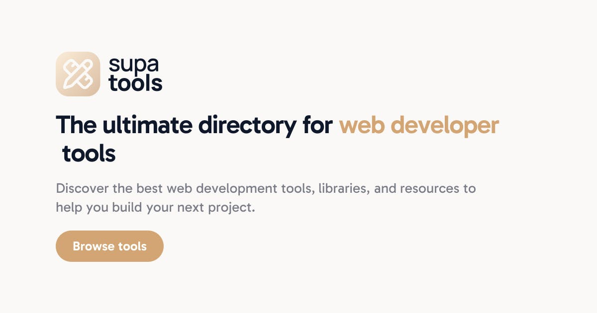

---

## 20. [VerbX Localize](https://www.producthunt.com/products/verbx-localize)
**Votes**: 5 | **도입 난이도**: 중 | **신뢰도**: 상
**Tagline**: Install Once Localize Forever
**서비스 링크**: https://www.producthunt.com/r/2MFT3S3V75Z6OC

**태그**: DevTool, Localization, Automation, SaaS, AI Tool

### 📌 이 서비스 한눈에 보기
번거로운 번역 키 관리 없이 소스 코드만으로 다국어 앱을 배포하는 자동화 도구

### 🔑 주요 기능
- 번역 키나 로케일 파일을 수동으로 관리할 필요 없는 워크플로우
- SDK, CLI, GitHub 연동을 통한 지속적인 동기화 및 자동화
- 문맥 유지, 용어집(Glossary), 번역 메모리 및 리뷰 워크플로우 지원

### 🙋 사용자에게 어떤 점이 좋은가
개발자가 번역 파일 관리 작업에서 벗어나 코드 작성에만 집중할 수 있게 하며, 비용 효율적인 다국어 지원이 가능합니다.

### ✅ 지금 바로 써볼 기능
- SDK/CLI를 통한 기존 프로젝트 연동 테스트
- GitHub 워크플로우에 자동화 파이프라인 설정
- 용어집(Glossary) 기능을 활용한 브랜드 일관성 확보

### ⚠️ 사용 전 확인할 점
- 소스 텍스트를 래핑하는 방식에 따른 기존 코드 구조 변경 필요성
- 자동화된 번역의 문맥 정확도 검증 필요

### 🧭 확인이 더 필요한 정보
구체적인 가격 정책(새로운 의미 생성 시 발생하는 비용 구조)에 대한 상세 확인이 필요합니다.

### 📸 스크린샷 및 갤러리
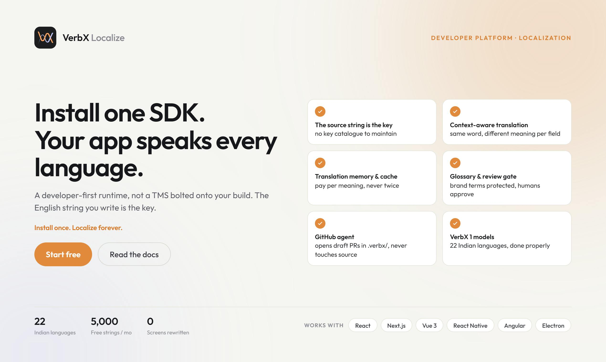
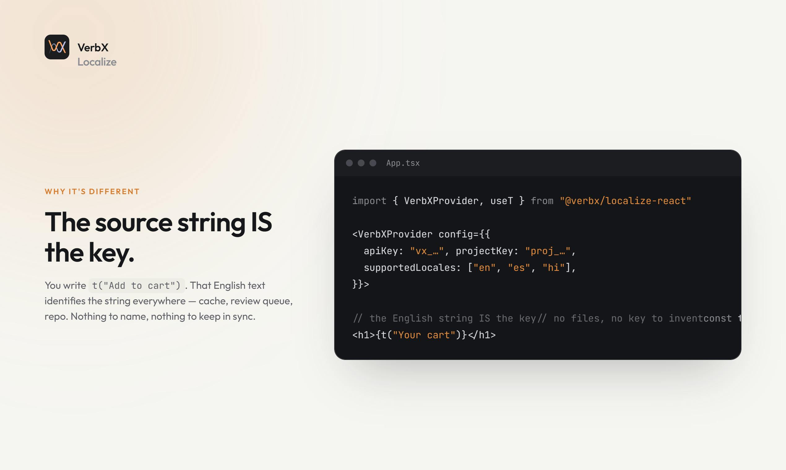
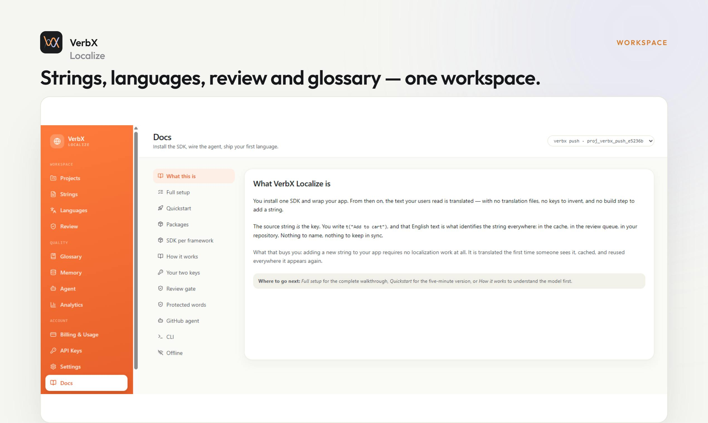

---

## 21. [Dual Subtitles](https://www.producthunt.com/products/dual-subtitles)
**Votes**: 4 | **도입 난이도**: 하 | **신뢰도**: 상
**Tagline**: Two subtitle lines at once on YouTube and Netflix
**서비스 링크**: https://www.producthunt.com/r/TU35MAS7TB3TT5

**태그**: LanguageLearning, Productivity, BrowserExtension, Video

### 📌 이 서비스 한눈에 보기
유튜브와 넷플릭스에서 원어와 번역 자막을 동시에 띄워 외국어 학습을 돕는 브라우저 확장 프로그램

### 🔑 주요 기능
- 유튜브의 모든 자막 언어 지원
- 넷플릭스에서 번역 트랙이 없는 경우에도 번역 기능 제공
- 사용자 시청 기록을 수집하지 않는 프라이버시 중심 설계

### 🙋 사용자에게 어떤 점이 좋은가
영상 시청과 동시에 원어와 번역문을 함께 볼 수 있어, 별도의 학습 도구 없이도 자연스러운 언어 습득이 가능합니다.

### ✅ 지금 바로 써볼 기능
- 유튜브에서 원어와 한국어 자막 동시 활성화하기
- 넷플릭스에서 번역 자막 기능 테스트하기
- 개인정보 보호를 위해 브라우저 확장 프로그램 권한 확인하기

### ⚠️ 사용 전 확인할 점
- 브라우저 확장 프로그램 형태이므로 모바일 앱 환경에서는 사용이 제한될 수 있음
- 서비스 제공자의 서버를 거치지 않으므로 기능 업데이트가 즉각적이지 않을 수 있음

### 🧭 확인이 더 필요한 정보
정확한 브라우저 호환성 및 모바일 기기 지원 여부에 대한 정보가 명시되지 않았습니다.

### 📸 스크린샷 및 갤러리
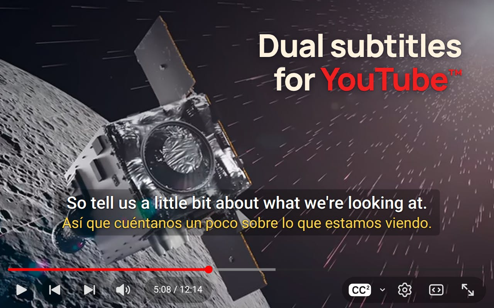
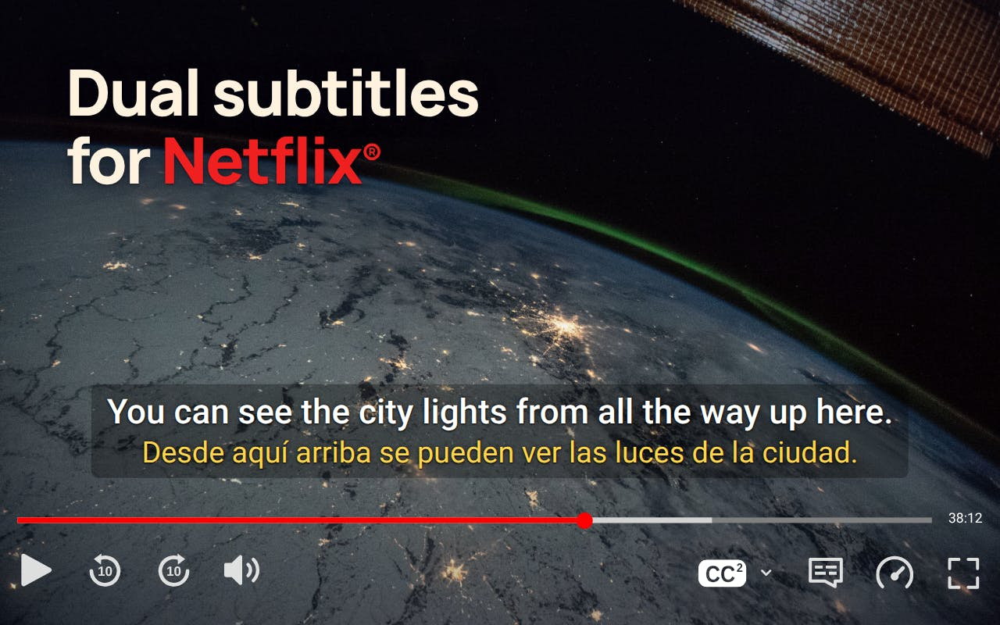
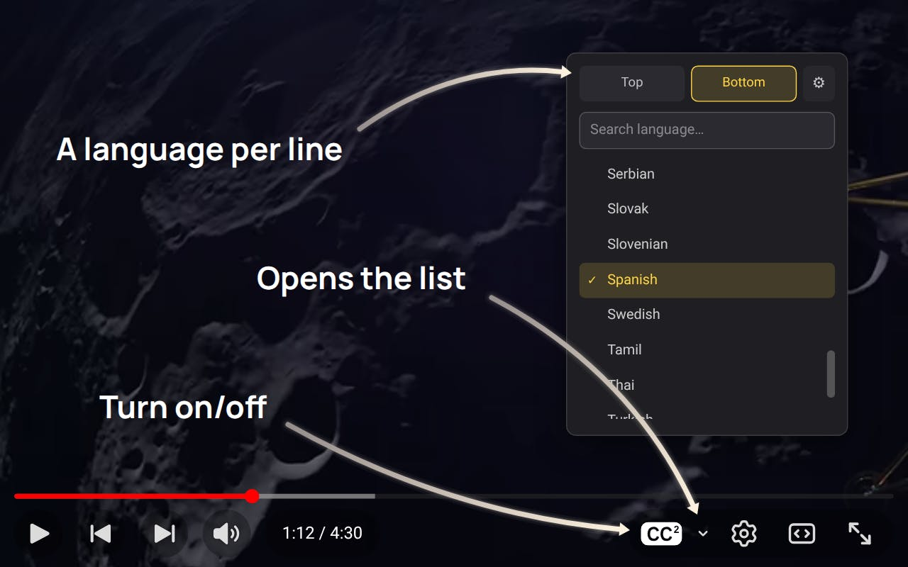

---

## 22. [Schedule & Chill](https://www.producthunt.com/products/schedule-chill)
**Votes**: 4 | **도입 난이도**: 중 | **신뢰도**: 상
**Tagline**: Let your AI write, schedule and post to LinkedIn
**서비스 링크**: https://www.producthunt.com/r/OITYZVVXNIETOE

**태그**: DevTool, Automation, AI, LinkedIn, Productivity, AI Tool, API

### 📌 이 서비스 한눈에 보기
AI 코딩 도구와 연동하여 LinkedIn 포스트를 자동으로 작성하고 예약하는 개발자용 스케줄러

### 🔑 주요 기능
- Claude Code, Cursor, Gemini CLI 등 AI 도구와 연동 가능한 MCP 서버 및 REST API 제공
- AI가 작성한 콘텐츠를 직접 LinkedIn에 예약 게시 가능
- 신용카드 등록 없이 무료로 사용 가능한 LinkedIn 포스트 스케줄러

### 🙋 사용자에게 어떤 점이 좋은가
개발 환경(IDE/CLI)을 벗어나지 않고도 AI를 통해 콘텐츠를 생성하고 즉시 예약할 수 있어 업무 흐름이 끊기지 않습니다.

### ✅ 지금 바로 써볼 기능
- MCP 서버를 설정하여 Cursor나 Claude Code에 연결하기
- REST API를 활용해 자신만의 자동화 워크플로우 구축하기
- AI로 생성한 LinkedIn 포스트 예약 기능 테스트하기

### ⚠️ 사용 전 확인할 점
- CLI/API 기반 도구이므로 기본적인 개발 지식이 필요할 수 있음
- LinkedIn 계정 보안 및 API 권한 설정 확인 필요

### 🧭 확인이 더 필요한 정보
사용자 인터페이스(UI) 제공 여부와 상세한 API 호출 제한 정책에 대한 정보가 부족합니다.

### 📸 스크린샷 및 갤러리
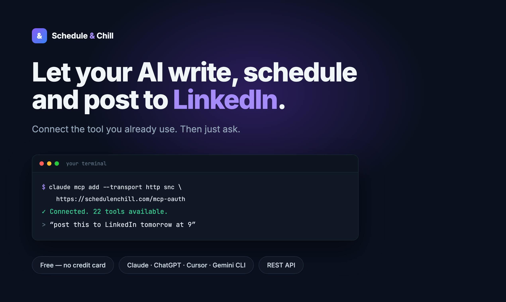
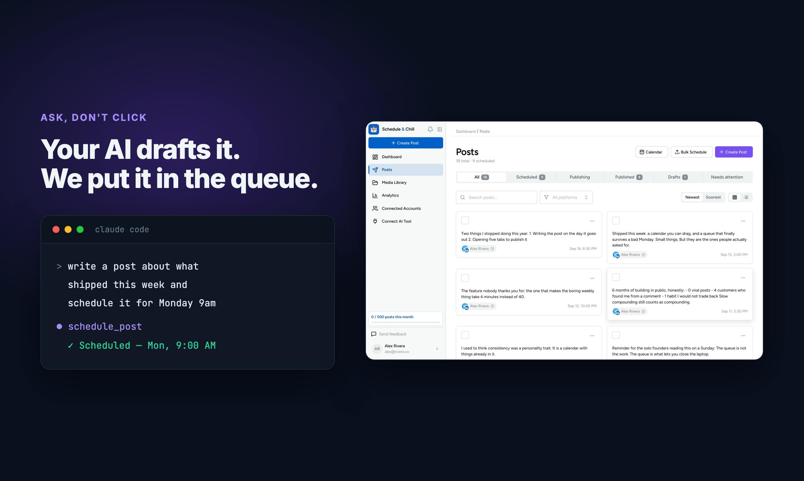
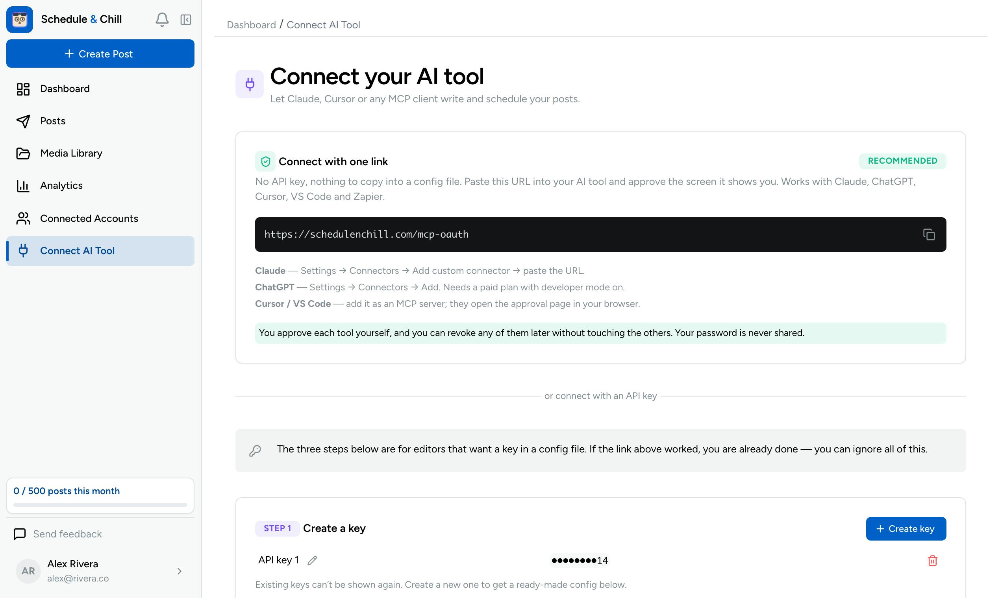

---

## 23. [DevMotion v2](https://www.producthunt.com/products/devmotion-ai-video-editor)
**Votes**: 4 | **도입 난이도**: 하 | **신뢰도**: 상
**Tagline**: The AI video agent that looks at what it builds
**서비스 링크**: https://www.producthunt.com/r/UTEGOAFXC5GGFG

**태그**: AI-Video, Automation, No-Code, DevTool, Agent, AI Tool, Chat, Video

### 📌 이 서비스 한눈에 보기
렌더링된 프레임을 직접 확인하고 스스로 수정하는 시각적 AI 비디오 에이전트

### 🔑 주요 기능
- 결과물을 직접 확인하는 시각적 피드백 루프 탑재
- 브라우저 에디터 채팅 또는 외부 AI(Claude, ChatGPT) 및 IDE(MCP) 연동 지원
- 설치가 필요 없는 웹 기반 환경 제공

### 🙋 사용자에게 어떤 점이 좋은가
AI가 단순히 코드를 짜는 것을 넘어 결과물의 시각적 오류를 스스로 감지하고 수정하므로, 영상 제작의 품질 관리 시간을 획기적으로 줄여줍니다.

### ✅ 지금 바로 써볼 기능
- 브라우저 에디터에서 채팅으로 영상 수정 요청하기
- Claude나 ChatGPT를 연결하여 워크플로우 자동화하기
- MCP를 통해 사용 중인 IDE와 연동하기

### ⚠️ 사용 전 확인할 점
- 설치 없는 웹 기반이므로 복잡한 로컬 리소스 활용에는 제한이 있을 수 있음
- 에이전트의 자가 수정 기능이 의도와 다르게 작동할 가능성

### 🧭 확인이 더 필요한 정보
상세한 요금 체계와 고급 기능의 유료 여부는 명시되지 않았습니다.

### 📸 스크린샷 및 갤러리

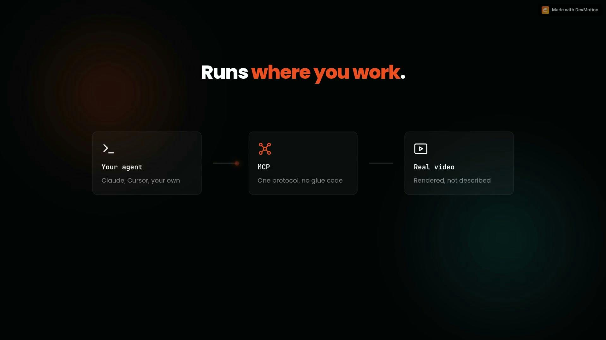

### 🎬 관련 영상
- [🎥 영상 보기](https://ph-files.imgix.net/4bfd1db3-b494-4455-9bb8-2c23aa62e9ef.jpeg?auto=format)

---

## 24. [AI Alignment Skill](https://www.producthunt.com/products/ai-alignment-skill)
**Votes**: 4 | **도입 난이도**: 하 | **신뢰도**: 중
**Tagline**: Ensure alignment when working with frontier AI models.
**서비스 링크**: https://www.producthunt.com/r/UUOMOQCW7FPLST

**태그**: AI, Safety, DevTool, Automation, Agent, AI Tool, LLM

### 📌 이 서비스 한눈에 보기
강력한 프론티어 AI 모델 사용 시 모델의 의도와 일치하도록 제어하는 정렬 기술

### 🔑 주요 기능
- Astra, Fable와 같은 고성능 프론티어 모델과의 정렬 보장
- 에이전트 기반 작업 시 발생할 수 있는 위험 방지
- 어떤 프로젝트에도 적용 가능한 범용적인 정렬 스킬

### 🙋 사용자에게 어떤 점이 좋은가
강력한 AI 에이전트가 자율적으로 동작할 때 발생할 수 있는 예기치 못한 행동을 방지하고 안전성을 확보할 수 있습니다.

### ✅ 지금 바로 써볼 기능
- 현재 진행 중인 프로젝트에 정렬 스킬 적용해보기
- 프론티어 모델(Astra 등)과의 연동 테스트
- 에이전트 작업 시의 안전 가이드라인 설정

### ⚠️ 사용 전 확인할 점
- 모델의 성능이나 특정 아키텍처에 따른 정렬 효율 차이 확인 필요
- 에이전트의 자율성이 높아질수록 정렬 유지의 난이도 증가 가능성

### 🧭 확인이 더 필요한 정보
구체적인 구현 방식(API, 프롬프트 엔트리 등)과 기술적 메커니즘에 대한 상세 정보가 부족합니다.

### 📸 스크린샷 및 갤러리

---

## 25. [Harbory](https://www.producthunt.com/products/harbory)
**Votes**: 4 | **도입 난이도**: 중 | **신뢰도**: 상
**Tagline**: Lightweight infra orchestration control plane, in Rust
**서비스 링크**: https://www.producthunt.com/r/FJJ6IPDSY5HBVD

**태그**: DevOps, Infrastructure, Rust, Automation, Cloud, Agent, AI Tool

### 📌 이 서비스 한눈에 보기
Rust로 구축된 초경량 분산 인프라 오케스트레이션 제어 플랫폼

### 🔑 주요 기능
- Rust 기반의 고성능 및 메모리 안전성을 갖춘 분산 에이전트 시스템
- 중앙 대시보드를 통한 원격 VM의 컨테이너 배포 및 서비스 관리
- Nginx와 같은 리버스 프록시의 실시간 구성 지원

### 🙋 사용자에게 어떤 점이 좋은가
최소한의 리소스만 사용하여 여러 원격 서버의 컨테이너와 네트워크 설정을 중앙에서 간편하게 관리할 수 있습니다.

### ✅ 지금 바로 써볼 기능
- 원격 VM에 에이전트 설치 및 연결 테스트
- 중앙 대시보드를 통한 컨테이너 배포 실습
- Nginx 리버스 프록시 실시간 설정 적용 확인

### ⚠️ 사용 전 확인할 점
- Rust 기반 시스템이므로 특정 OS 환경에서의 에이전트 호환성 확인 필요
- 중앙 제어 방식에 따른 네트워크 연결 안정성 의존성

### 🧭 확인이 더 필요한 정보
지원하는 컨테이너 런타임 종류와 상세한 보안 프로토콜에 대한 정보가 추가로 필요합니다.

### 📸 스크린샷 및 갤러리
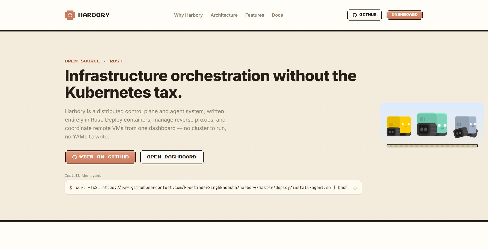
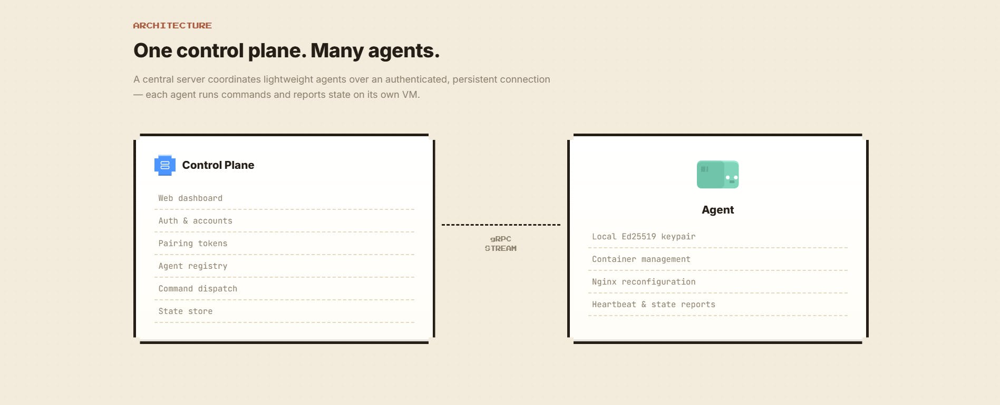

### 🎬 관련 영상
- [🎥 영상 보기](https://ph-files.imgix.net/68a856ab-cf7d-4e7d-a7a5-d174f57ecb0a.jpeg?auto=format)

---

## 26. [Any AI for Notion](https://www.producthunt.com/products/any-ai-for-notion)
**Votes**: 4 | **도입 난이도**: 하 | **신뢰도**: 상
**Tagline**: Connect any AI model to your Notion workspace
**서비스 링크**: https://www.producthunt.com/r/LILS6DNEQCZKPA

**태그**: AI, Notion, Automation, Productivity, Agent, AI Tool, Chat

### 📌 이 서비스 한눈에 보기
사용 중인 모든 AI 모델을 노션 워크스페이스와 연결하여 페이지를 읽고 쓸 수 있는 도구

### 🔑 주요 기능
- ChatGPT, Claude, Gemini 등 다양한 AI 모델 지원
- 노션 페이지 읽기 및 쓰기 기능 제공
- 보안을 위한 OAuth 방식 및 오픈 소스 기반 운영

### 🙋 사용자에게 어떤 점이 좋은가
사용자가 선호하는 AI 모델을 노션과 직접 연결하여 문서 작성 및 정보 요약 업무를 자동화할 수 있습니다.

### ✅ 지금 바로 써볼 기능
- 선호하는 AI 모델(ChatGPT, Claude 등) 연결하기
- 노션 페이지 읽기/쓰기 권한 설정하기
- 모바일 앱을 통한 워크플로우 테스트하기

### ⚠️ 사용 전 확인할 점
- 사용하는 AI 모델의 API 비용이 별도로 발생할 수 있음
- 노션 데이터 접근 권한 설정 시 보안 정책 확인 필요

### 🧭 확인이 더 필요한 정보
각 AI 모델별 API 연동 방식 및 상세 비용 구조에 대한 확인이 필요합니다.

### 📸 스크린샷 및 갤러리

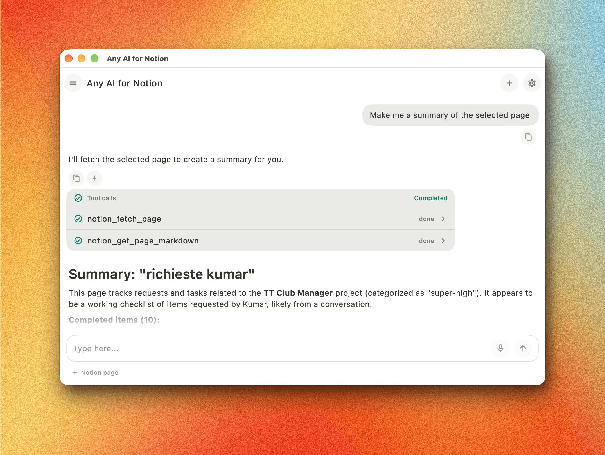
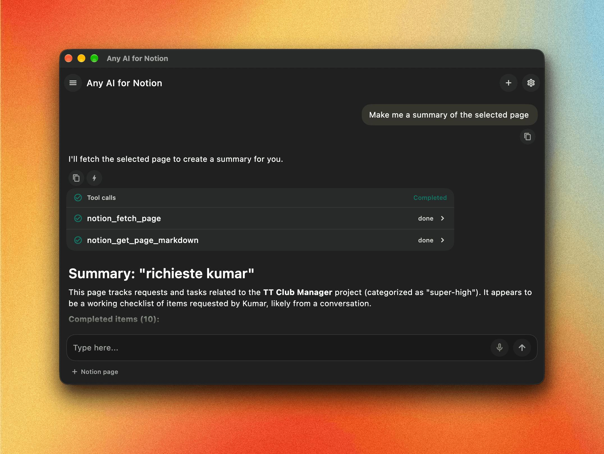

---

## 27. [LetsLaunch](https://www.producthunt.com/products/letslaunch)
**Votes**: 3 | **도입 난이도**: 하 | **신뢰도**: 상
**Tagline**: Launch your SaaS instantly for free with SEO backlink
**서비스 링크**: https://www.producthunt.com/r/JONR5BQXBPHIST

**태그**: Startup, Marketing, ProductLaunch, SEO, AI Tool

### 📌 이 서비스 한눈에 보기
창업자와 메이커를 위한 스타트업 출시 및 제품 발견 플랫폼

### 🔑 주요 기능
- SaaS, AI 도구, 사이드 프로젝트 등 신규 제품 출시 지원
- 새로운 사용자들에게 제품을 노출하여 발견 가능성 증대
- 주간 출시 경쟁 및 지속적인 가시성 확보 기회 제공

### 🙋 사용자에게 어떤 점이 좋은가
제품 출시 직후 초기 사용자를 확보하고 SEO 백링크를 통해 장기적인 검색 엔진 노출을 확보하는 데 유용합니다.

### ✅ 지금 바로 써볼 기능
- 자신의 제품 등록하기
- 주간 출시 이벤트 참여하기
- 제품 쇼케이스 페이지 구축하기

### ⚠️ 사용 전 확인할 점
- 플랫폼 내 경쟁이 치열할 수 있음
- SEO 효과가 실제 검색 엔진에 반영되는 시점은 가변적임

### 🧭 확인이 더 필요한 정보
구체적인 SEO 백링크의 품질과 검색 엔진 최적화 알고리즘에 대한 상세 정보는 명시되지 않았습니다.

### 📸 스크린샷 및 갤러리

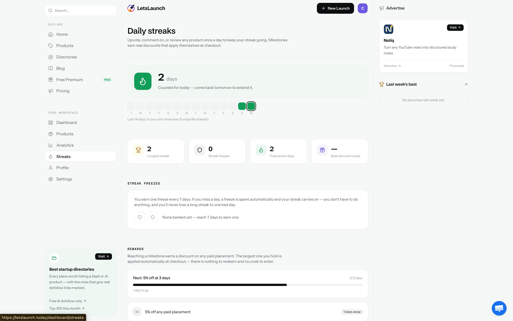
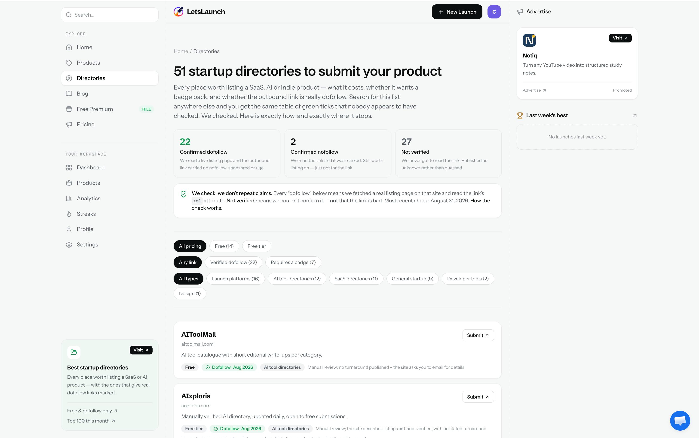

---

## 28. [Smart Calendar Feeds](https://www.producthunt.com/products/smart-calendar-feeds)
**Votes**: 3 | **도입 난이도**: 하 | **신뢰도**: 상
**Tagline**: 750+ free calendar feeds — or build your own with AI
**서비스 링크**: https://www.producthunt.com/r/47ENNFTY4GDV6Z

**태그**: Productivity, Automation, AI, Calendar, AI Tool, Prompting

### 📌 이 서비스 한눈에 보기
750개 이상의 맞춤형 일정 피드를 클릭 한 번으로 캘린더에 동기화하는 서비스

### 🔑 주요 기능
- 공휴일, 스포츠, 출시 일정 등 750개 이상의 무료 캘린더 피드 제공
- Apple, Google, Outlook 캘린더와 원클릭 구독 지원
- AI를 활용해 프롬프트, PDF, 스프레드시트 등으로 나만의 맞춤형 피드 생성 가능

### 🙋 사용자에게 어떤 점이 좋은가
계정 생성 없이도 관심 있는 정보를 실시간 일정으로 관리할 수 있으며, AI를 통해 복잡한 데이터도 손쉽게 캘린더로 변환할 수 있습니다.

### ✅ 지금 바로 써볼 기능
- 제공되는 750개 이상의 무료 피드 탐색하기
- AI 프롬프트를 사용하여 나만의 맞춤형 일정 생성해보기
- 사용 중인 캘린더(Google, Apple 등)에 원클릭으로 구독하기

### ⚠️ 사용 전 확인할 점
- 개인 정보가 포함된 PDF나 스프레드시트를 AI로 변환 시 데이터 보안 확인 필요
- 외부 피드 데이터의 정확성은 원본 소스에 따라 다를 수 있음

### 🧭 확인이 더 필요한 정보
AI를 통한 맞춤형 피드 생성 시 데이터 업데이트 주기와 보안 정책에 대한 상세 정보가 필요합니다.

### 📸 스크린샷 및 갤러리
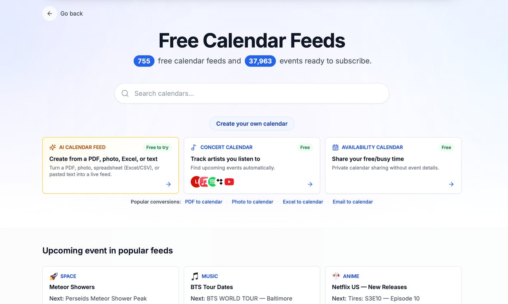
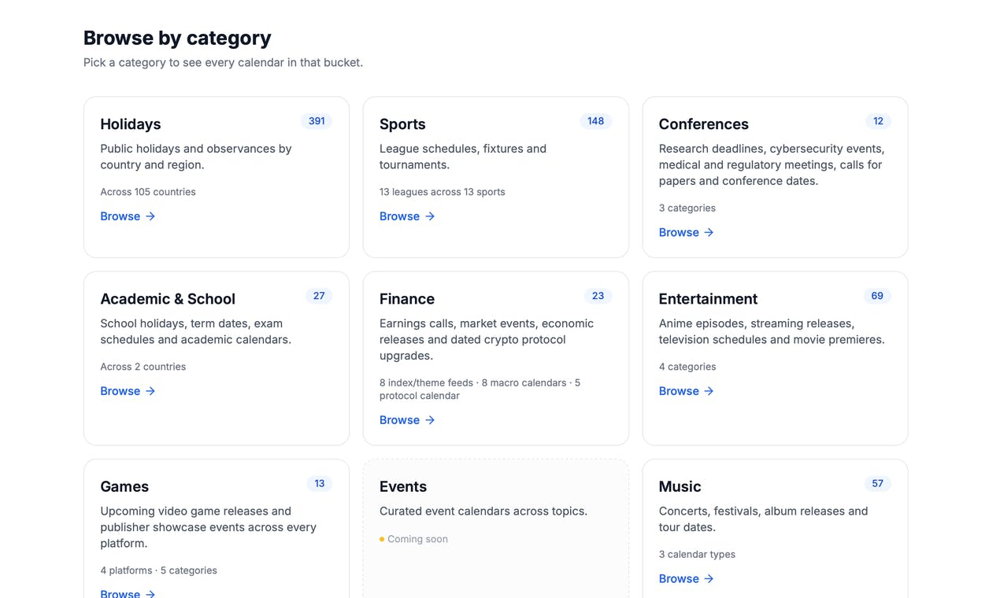
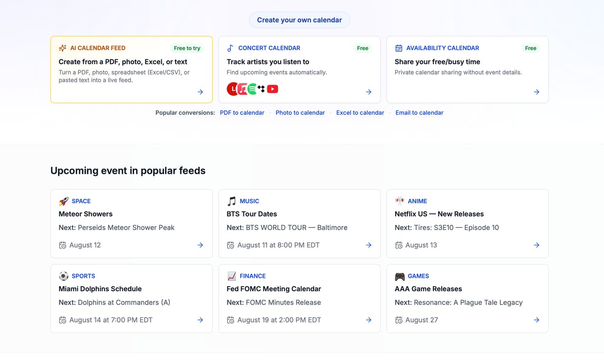

### 🎬 관련 영상
- [🎥 영상 보기](https://ph-files.imgix.net/b346ae7e-87bf-4480-ae94-4b5c484ac48c.jpeg?auto=format)

---

## 29. [Telavevodettismo](https://www.producthunt.com/products/telavevodettismo)
**Votes**: 3 | **도입 난이도**: 하 | **신뢰도**: 상
**Tagline**: "I told you so" hits different with a timestamp
**서비스 링크**: https://www.producthunt.com/r/JAMYC7MKDJTOZY

**태그**: Prediction, Social, Analytics

### 📌 이 서비스 한눈에 보기
자신의 예측을 기록하고 증명하여 신뢰도를 쌓는 예측 기록 플랫폼

### 🔑 주요 기능
- 사후에 말하는 것이 아닌, 발생 전 예측을 타임스탬프와 함께 기록
- 시간 경과에 따른 예측 정확도 추적 및 데이터화
- 단순한 자랑이 아닌 객관적인 신뢰 점수(Credibility Score) 구축

### 🙋 사용자에게 어떤 점이 좋은가
근거 없는 '말뿐인 예측' 대신 기록된 데이터를 통해 자신의 통찰력을 객관적으로 증명할 수 있습니다.

### ✅ 지금 바로 써볼 기능
- 미래의 예측 사항 기록하기
- 정확도 추적 기능 확인하기
- 기록된 예측 결과 공유하기

### ⚠️ 사용 전 확인할 점
- 예측의 성격에 따라 데이터의 객관성 확보 여부가 달라질 수 있음
- 개인적인 예측 기록 위주의 서비스로 활용 범위가 제한적일 수 있음

### 🧭 확인이 더 필요한 정보
DeepSeek Harness를 활용한 기능이 구체적으로 어떤 데이터 분석을 제공하는지 명시되지 않았습니다.

### 📸 스크린샷 및 갤러리

---

## 30. [Food Holidays ](https://www.producthunt.com/products/food-holidays)
**Votes**: 3 | **도입 난이도**: 하 | **신뢰도**: 상
**Tagline**: World food holidays on a beautiful calendar 
**서비스 링크**: https://www.producthunt.com/r/LUO4BV6M6LRRXQ

**태그**: Lifestyle, Calendar, Foodie, AI Tool

### 📌 이 서비스 한눈에 보기
전 세계의 다양한 음식 축제와 기념일을 한눈에 확인하는 아름다운 캘린더

### 🔑 주요 기능
- 미국, 이탈리아, 일본 등 전 세계 주요 국가의 음식/음료 기념일 제공
- 국가별/국제적 기념일을 망라하는 통합 캘린더 서비스
- 매일 새로운 음식 테마를 발견할 수 있는 직관적인 인터페이스

### 🙋 사용자에게 어떤 점이 좋은가
콘텐츠 크리에이터나 요리 애호가들이 매일 새로운 주제로 소셜 미디어 콘텐츠를 기획하거나 특별한 식사 계획을 세울 때 유용합니다.

### ✅ 지금 바로 써볼 기능
- 오늘의 국가별 음식 기념일 확인하기
- 관심 있는 국가의 캘린더 탐색하기

### ⚠️ 사용 전 확인할 점
- 특정 지역(미국 등)에 편중된 기념일이 있을 수 있음
- 실제 공휴일이나 법정 기념일과는 성격이 다를 수 있음

### 🧭 확인이 더 필요한 정보
사용 가능한 국가의 범위와 캘린더의 상세 기능(알림, 구독 등)에 대한 정보가 추가로 필요합니다.

### 📸 스크린샷 및 갤러리
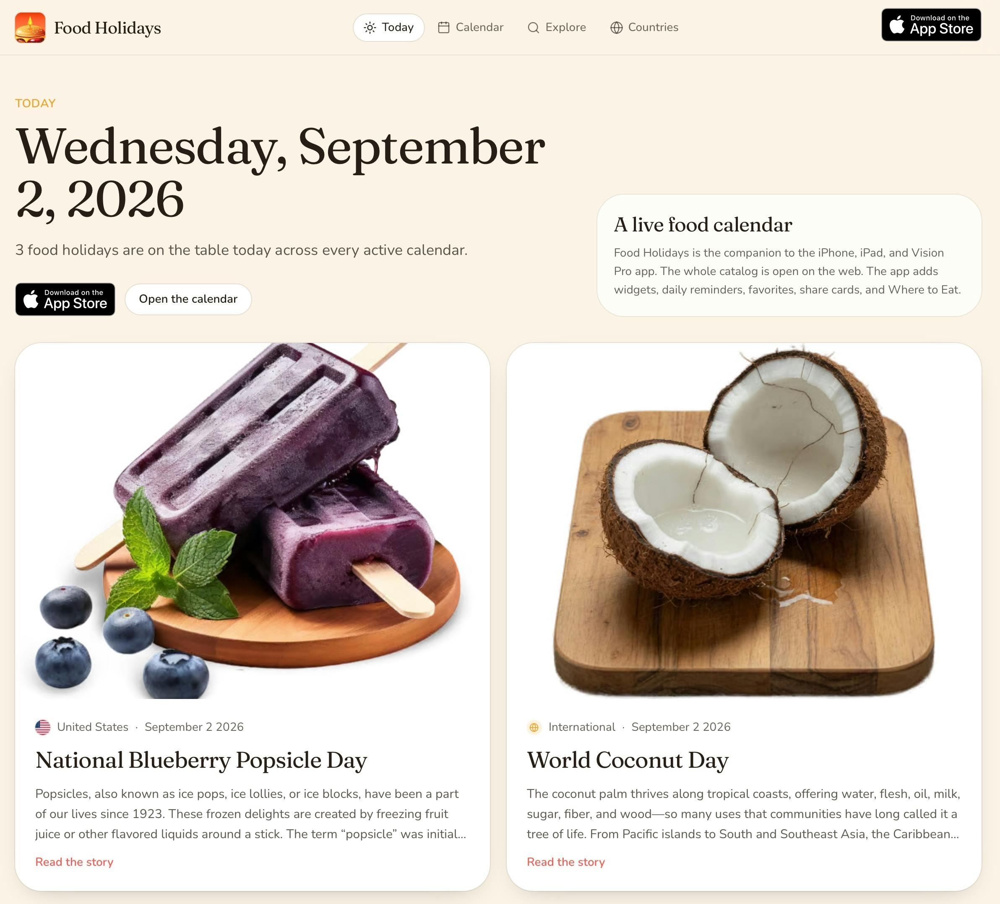
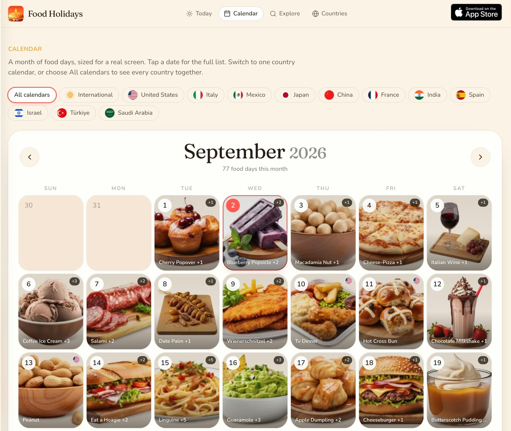
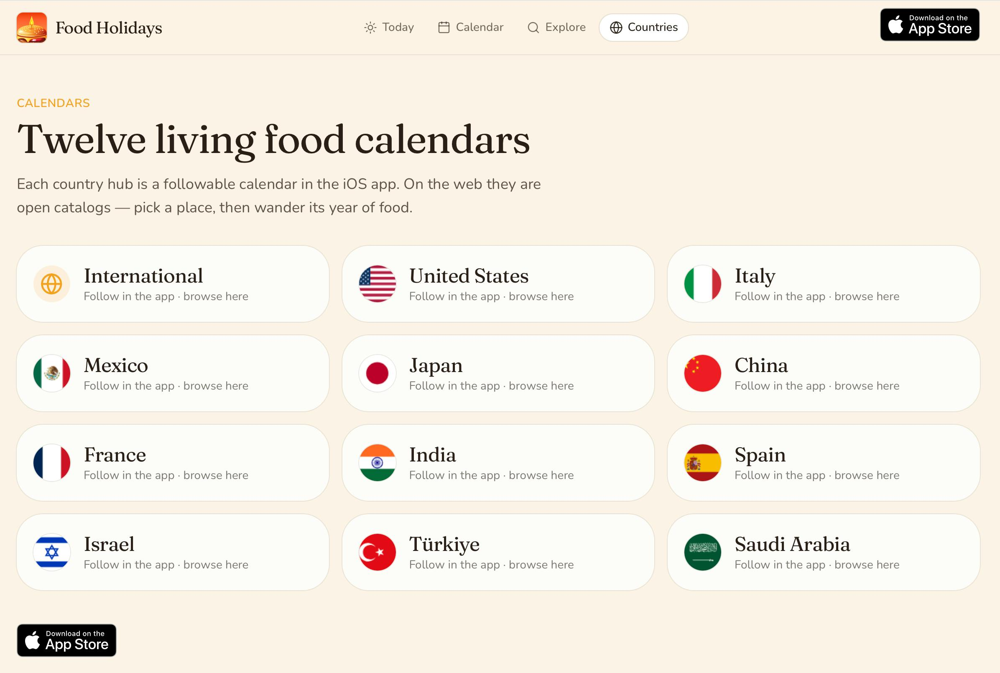

---

