# 🚀 Product Hunt Daily Top 30 (2026-09-07)

## 오늘의 요약
오늘의 트렌드는 AI 에이전트 간의 직접적인 협업과 효율적인 실행 환경 구축, 그리고 비디오 분석 및 생성 분야에서의 기술적 도약이 두드러졌습니다. 또한, 흩어진 AI 대화 기록을 통합 관리하거나 업무 도구에 자연스럽게 녹아드는 등 사용자 경험을 최적화하는 도구들이 주목받았습니다.

### 오늘의 핵심 포인트
- 에이전트 간의 직접적인 통신과 협업을 통해 인간의 개입 없이 문제를 해결하는 멀티플레이어 AI 환경이 등장했습니다.
- 비디오 분석 비용을 획기적으로 절감하거나 생성 속도를 극대화하는 등 영상 콘텐츠 제작 및 분석의 효율성이 크게 향상되었습니다.
- 다양한 AI 플랫폼의 기록을 통합하거나 업무용 메신저에 에이전트를 심는 등 실질적인 업무 워크플로우 최적화 도구들이 주목받았습니다.

**오늘의 태그**: AI Agent, Video AI, Automation, Productivity

## 1. [AI Toolbox 3.0](https://www.producthunt.com/products/chatgpt-toolbox)
**Votes**: 292 | **도입 난이도**: 하 | **신뢰도**: 상
**Tagline**: Search, organize and export every AI chat in one place
**서비스 링크**: https://www.producthunt.com/r/FBV7SHB3HECJ55

**태그**: Productivity, AI, Workflow, Organization, AI Tool, Chat, Prompting

### 📌 이 서비스 한눈에 보기
여러 AI 플랫폼의 대화 기록을 한곳에서 검색, 정리, 내보내기할 수 있는 통합 관리 도구

### 🔑 주요 기능
- ChatGPT, Claude, Gemini, Grok 등 여러 AI 플랫폼의 대화를 통합 관리
- 폴더/하위 폴더 구조 및 전체 텍스트 검색 기능 제공
- 프롬프트 라이브러리 및 Markdown/PDF/JSON 대량 내보내기 지원

### 🙋 사용자에게 어떤 점이 좋은가
여러 AI 서비스를 교차 사용하는 사용자라면 흩어진 대화 기록을 체계적으로 관리하고 필요한 정보를 즉시 찾아 활용할 수 있습니다.

### ✅ 지금 바로 써볼 기능
- 여러 AI 플랫폼의 대화 기록을 하나의 폴더 구조로 정리하기
- 프롬프트 라이브러리를 활용해 반복적인 작업 자동화하기
- 중요한 대화 내용을 Markdown이나 PDF로 즉시 내보내기

### ⚠️ 사용 전 확인할 점
- 브라우저 확장 프로그램 형태이므로 브라우저 환경에 의존적임
- 로컬 저장 방식이지만 데이터 관리 책임은 사용자에게 있음

### 🧭 확인이 더 필요한 정보
제공되는 모든 AI 플랫폼 간의 실시간 동기화 방식과 데이터 저장 용량 제한에 대한 상세 정보는 확인이 필요합니다.

### 📸 스크린샷 및 갤러리
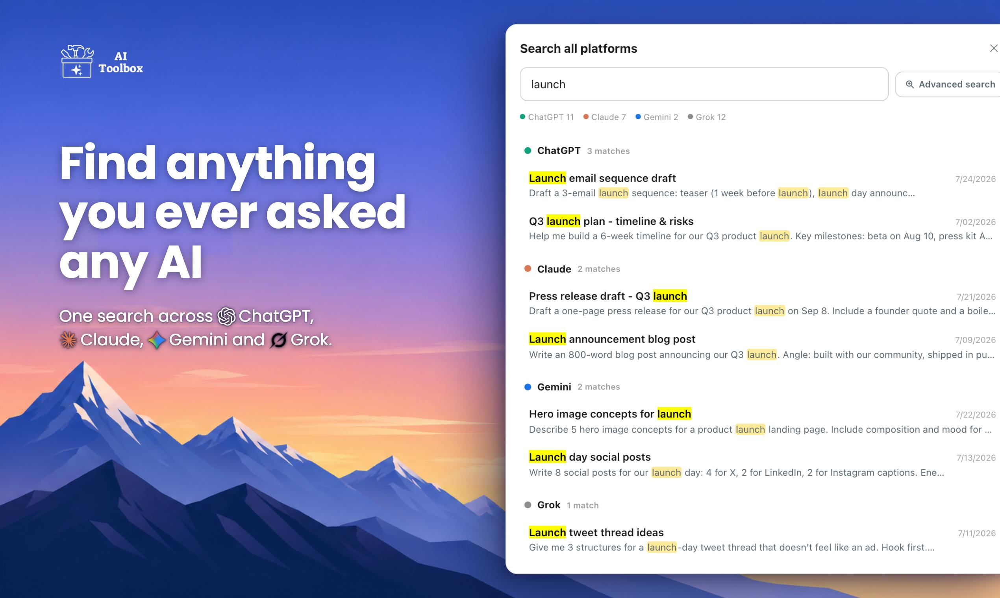
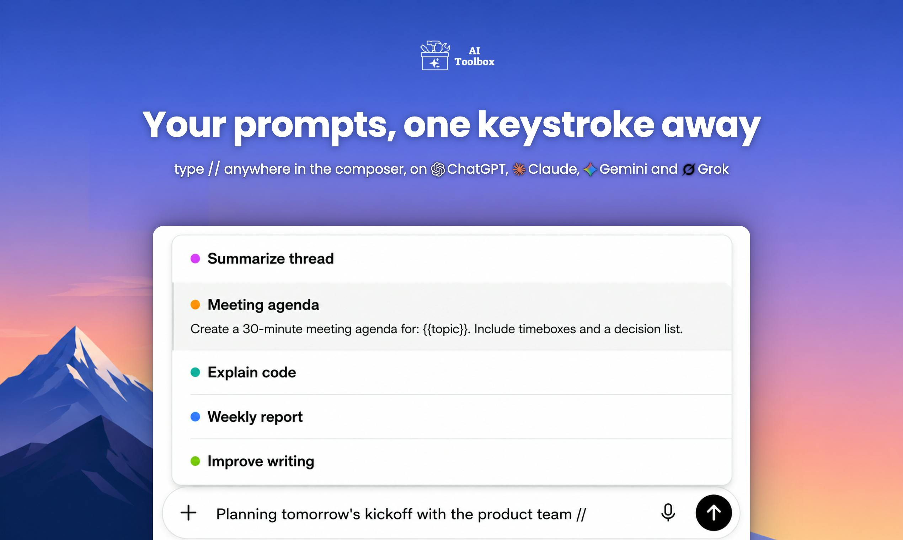
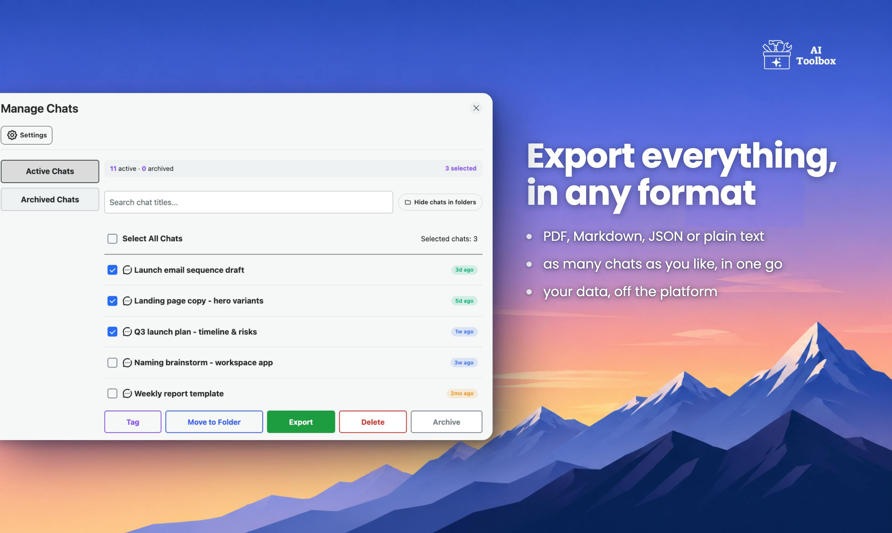

### 🎬 관련 영상
- [🎥 영상 보기](https://ph-files.imgix.net/e100540e-7fea-4319-896b-c425422e19e0.jpeg?auto=format)

---

## 2. [Tadata](https://www.producthunt.com/products/tadata)
**Votes**: 250 | **도입 난이도**: 하 | **신뢰도**: 상
**Tagline**: The AI employee in Slack that reads the room.
**서비스 링크**: https://www.producthunt.com/r/ZAQQTCQFCASBA2

**태그**: AI, Automation, Slack, Productivity, AI Tool

### 📌 이 서비스 한눈에 보기
Slack 내에서 팀의 맥락을 이해하고 업무를 수행하는 AI 직원

### 🔑 주요 기능
- Slack 환경에 완전히 통합된 AI 에이전트
- 기존 업무 도구와의 연결을 통한 작업 수행
- 회사의 업무 방식과 사용자 선호도 학습

### 🙋 사용자에게 어떤 점이 좋은가
별도의 플랫폼 이동 없이 Slack 안에서 팀의 맥락에 맞는 업무 자동화와 지원을 받을 수 있습니다.

### ✅ 지금 바로 써볼 기능
- Slack 워크스페이스에 Tadata 연결하기
- 기존 업무 도구(SaaS) 연동 설정하기
- 팀의 업무 스타일 학습시키기

### ⚠️ 사용 전 확인할 점
- Slack 내 대화 데이터 접근에 따른 보안 및 개인정보 정책 확인 필요
- 연동된 외부 도구의 권한 설정 범위 확인 필요

### 🧭 확인이 더 필요한 정보
구체적인 지원 도구 목록과 데이터 보안 처리 방식에 대한 상세 정보가 필요합니다.

### 📸 스크린샷 및 갤러리
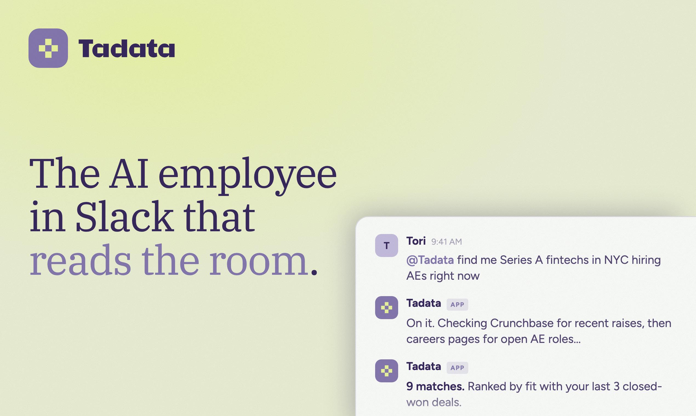
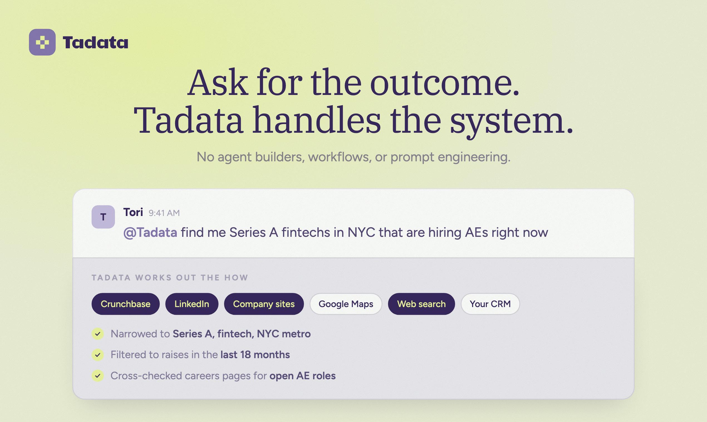
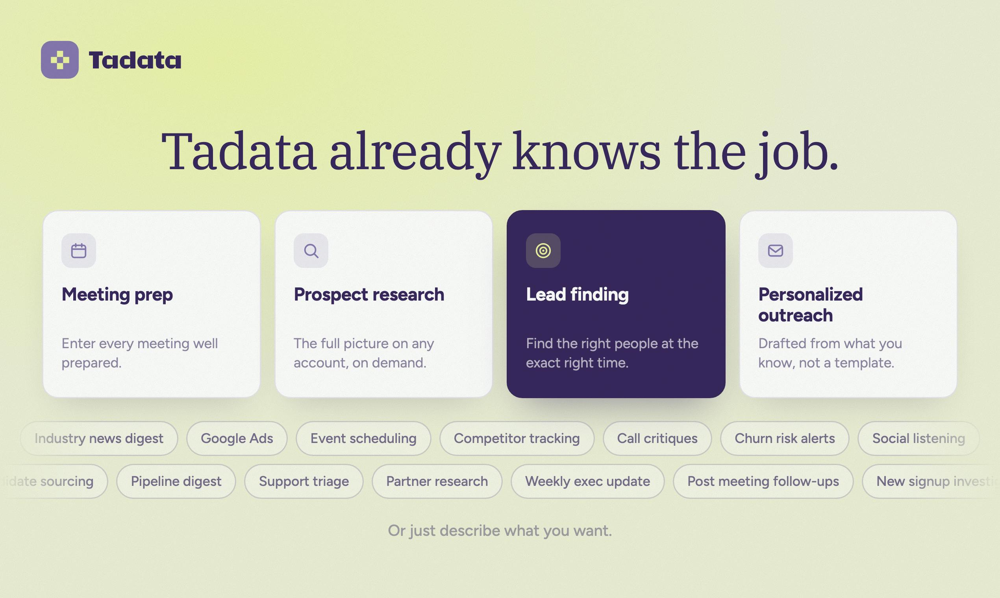

### 🎬 관련 영상
- [🎥 영상 보기](https://ph-files.imgix.net/c19a40c8-3bf6-464f-8cdb-ff48c35582d6.jpeg?auto=format)

---

## 3. [Notify.domains](https://www.producthunt.com/products/notify-domains)
**Votes**: 235 | **도입 난이도**: 하 | **신뢰도**: 상
**Tagline**: Know the moment a domain opportunity appears
**서비스 링크**: https://www.producthunt.com/r/KM5DLSEJNEJ2QB

**태그**: Domain, Automation, Monitoring, AI Tool

### 📌 이 서비스 한눈에 보기
원하는 도메인 확보 기회를 놓치지 않도록 실시간 모니터링과 맞춤형 알림을 제공하는 서비스

### 🔑 주요 기능
- WHOIS, RDAP, 경매, 마켓플레이스 등 다양한 소스 실시간 모니터링
- 하루 20회 이상 전 세계 IANA TLD 대상 도메인 상태 체크
- 복잡한 데이터 대신 즉각적인 실행이 가능한 쉬운 언어로 알림 제공

### 🙋 사용자에게 어떤 점이 좋은가
특정 도메인 선점을 원하는 사용자에게 데이터 분석 대신 명확한 행동 지침을 제공하여 구매 타이밍을 놓치지 않게 돕습니다.

### ✅ 지금 바로 써볼 기능
- 7일 무료 체험을 통한 모니터링 정확도 확인
- 관심 있는 도메인 리스트 등록 및 알림 설정
- 알림 메시지에 포함된 다음 단계(Next Steps) 가이드 확인

### ⚠️ 사용 전 확인할 점
- 도메인 확보를 보장하는 것이 아니라 기회를 알려주는 도구임
- 유료 전환 시 연간 $24의 비용 발생

### 🧭 확인이 더 필요한 정보
모니터링되는 모든 TLD에 대해 동일한 빈도와 정확도가 유지되는지 확인이 필요합니다.

### 📸 스크린샷 및 갤러리
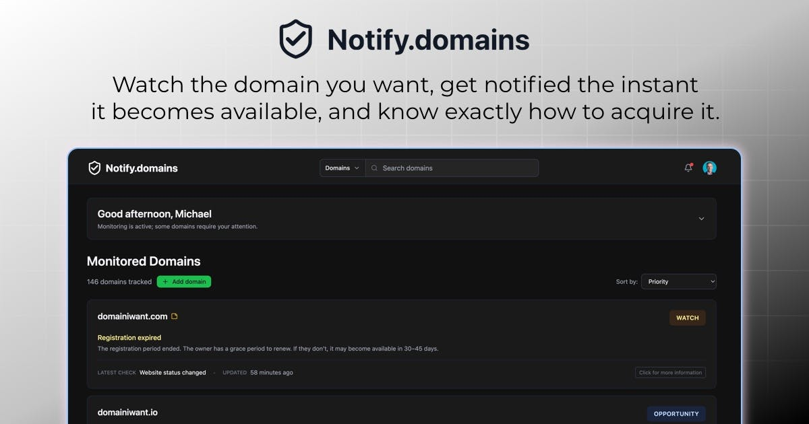
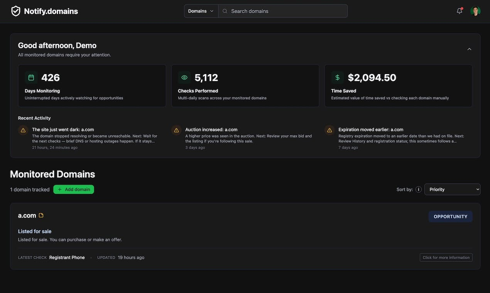
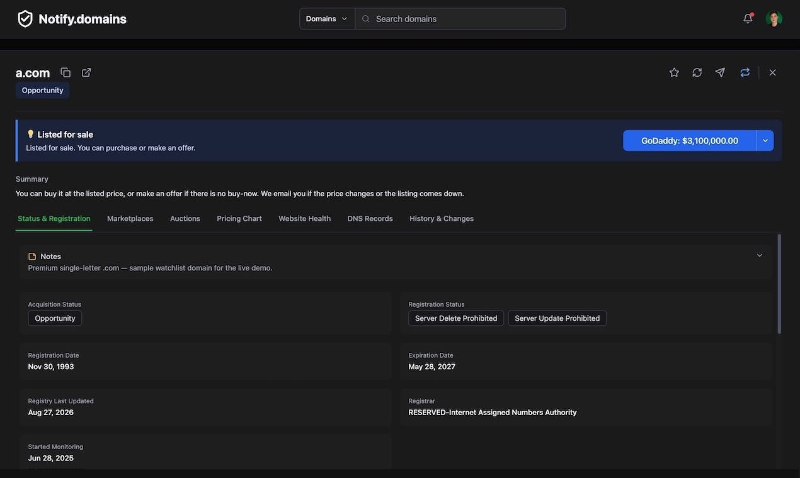

### 🎬 관련 영상
- [🎥 영상 보기](https://ph-files.imgix.net/92d1b7dc-4437-462f-99d9-4a8203f3a6f7.jpeg?auto=format)

---

## 4. [Agentic Video Understanding in Gemini](https://www.producthunt.com/products/google)
**Votes**: 196 | **도입 난이도**: 하 | **신뢰도**: 상
**Tagline**: Agentic video analysis for faster, smarter Gemini insights
**서비스 링크**: https://www.producthunt.com/r/FPP6NATZ37KVTC

**태그**: AI, VideoAnalysis, CostOptimization, Gemini, Agent, AI Tool, Video, API

### 📌 이 서비스 한눈에 보기
고정 프레임 방식에서 벗어나 모델이 스스로 분석 지점을 결정하는 지능형 비디오 분석 모드

### 🔑 주요 기능
- 모델이 시청 속도와 모달리티를 스스로 결정하여 효율적인 영상 분석 수행
- 토큰 사용량 최대 88% 절감 및 비용 최대 66% 절감
- 정확도 최대 7% 향상 및 긴 영상(Long-form) 분석에서 큰 효과

### 🙋 사용자에게 어떤 점이 좋은가
비디오 분석 시 발생하는 막대한 비용과 토큰 소모를 획기적으로 줄이면서도, 더 정확한 통찰력을 얻을 수 있습니다.

### ✅ 지금 바로 써볼 기능
- AI Studio에서 Gemini API를 통해 'agentic' 모드 설정하기
- Gemini Enterprise Agent Platform에서 기능 활성화하기
- 긴 분량의 영상 데이터에 적용하여 비용 절감 효과 테스트하기

### ⚠️ 사용 전 확인할 점
- 모델이 스스로 판단하므로 의도와 다른 구간을 분석할 가능성 고려 필요
- 사용 중인 모델 버전(3.7 Flash 등)의 지원 여부 확인 필요

### 🧭 확인이 더 필요한 정보
특정 모델 버전별로 성능 차이나 세부 비용 구조가 다를 수 있습니다.

### 📸 스크린샷 및 갤러리
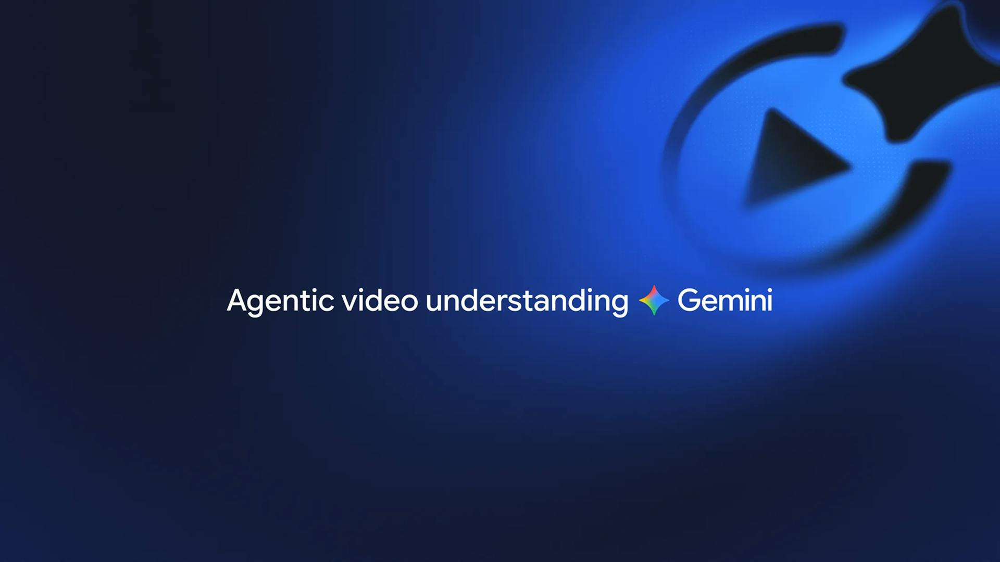
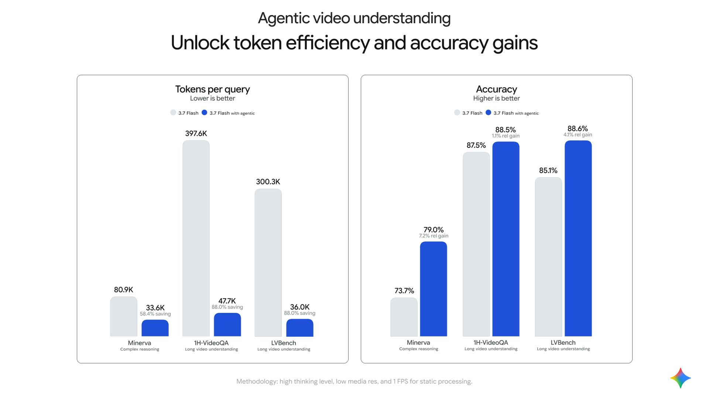
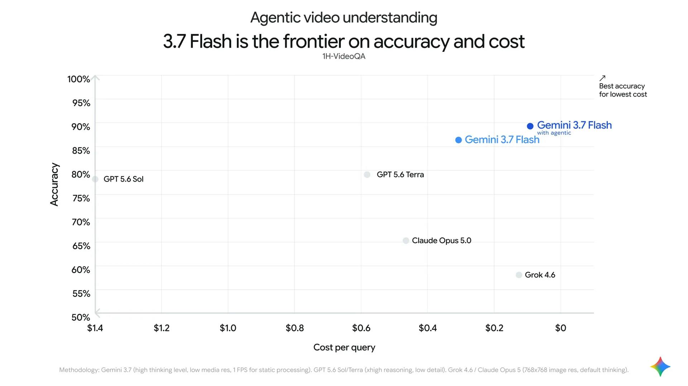

### 🎬 관련 영상
- [🎥 영상 보기](https://ph-files.imgix.net/f05cd623-78ae-4483-8fd6-aa0abf8377ae.jpeg?auto=format)

---

## 5. [DocsAlot Visual Editor](https://www.producthunt.com/products/docsalot-2)
**Votes**: 150 | **도입 난이도**: 하 | **신뢰도**: 상
**Tagline**: Create beautiful docs, by typing. No AI required. 
**서비스 링크**: https://www.producthunt.com/r/23TMP5GYBWIUEY

**태그**: Documentation, Writing, DevTool, Productivity, AI Tool

### 📌 이 서비스 한눈에 보기
타이핑만으로 아름다운 기술 문서를 완성하는 비주얼 에디터

### 🔑 주요 기능
- 마크다운 모드를 지원하는 직관적인 비주얼 에디터
- 재사용 가능한 컴포넌트와 버전 관리 기능 제공
- 구조화된 기술 문서 작성을 위한 최적화된 워크플로우

### 🙋 사용자에게 어떤 점이 좋은가
복잡한 포맷팅 작업 없이 텍스트 입력만으로 전문적인 기술 문서를 빠르게 구조화하고 발행할 수 있습니다.

### ✅ 지금 바로 써볼 기능
- 마크다운 모드로 문서 구조 잡기
- 재사용 가능한 컴포넌트 적용해보기
- 버전 히스토리 기능으로 변경 사항 관리하기

### ⚠️ 사용 전 확인할 점
- AI 없이 수동 편집 중심이므로 작업량에 따라 시간이 소요될 수 있음
- 문서 양식의 자유도가 에디터 설계에 따라 제한적일 수 있음

### 🧭 확인이 더 필요한 정보
상세한 협업 기능 및 외부 플랫폼과의 연동 범위에 대한 정보가 부족합니다.

### 📸 스크린샷 및 갤러리
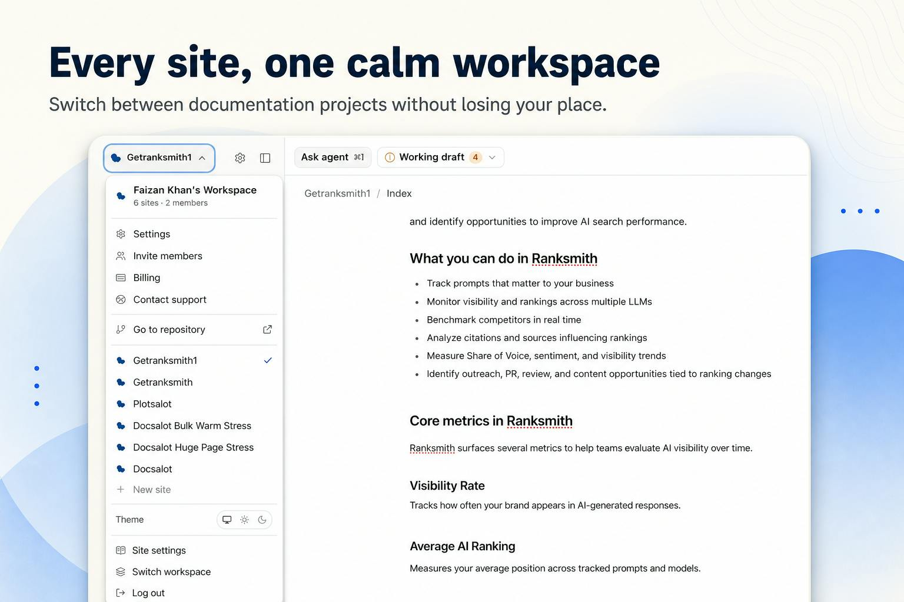
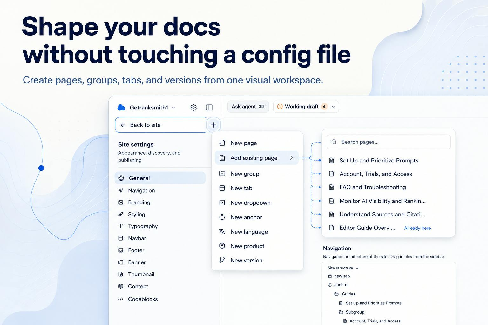
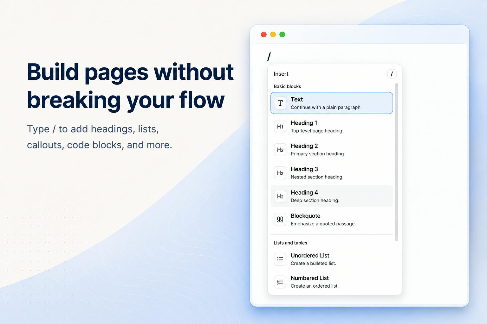

---

## 6. [ H3 Max by fal](https://www.producthunt.com/products/fal-ai)
**Votes**: 125 | **도입 난이도**: 하 | **신뢰도**: 상
**Tagline**: fal's post-trained MiniMax H3 for quality video production
**서비스 링크**: https://www.producthunt.com/r/VXTEEJEA3KN6UX

**태그**: VideoGen, AI-Video, CreativeTools, AI Tool, Prompting, Video

### 📌 이 서비스 한눈에 보기
압도적인 속도와 미적 품질을 갖춘 차세대 고성능 비디오 생성 모델

### 🔑 주요 기능
- MiniMax H3를 기반으로 한 고품질 비디오 생성 모델
- 기존 H3 대비 35배 빠른 초고속 추론 속도 제공
- 프롬프트 이해도와 시각적 미학 측면에서 업계 최고 수준의 성능

### 🙋 사용자에게 어떤 점이 좋은가
매우 빠른 생성 속도 덕분에 아이디어를 즉각적으로 시각화할 수 있으며, 높은 품질로 전문적인 영상 제작 워크플로우에 바로 활용 가능합니다.

### ✅ 지금 바로 써볼 기능
- 5초 분량의 고품질 비디오 생성 테스트
- 복잡한 프롬프트 입력 및 시각적 결과물 확인
- 기존 영상 모델과의 품질 및 속도 비교

### ⚠️ 사용 전 확인할 점
- 현재 제공되는 영상 길이가 5초로 제한적임
- 모델의 구체적인 API 비용이나 사용 정책 확인 필요

### 🧭 확인이 더 필요한 정보
제시된 벤치마크 결과가 실제 사용자 환경에서도 동일하게 유지되는지 확인이 필요합니다.

### 📸 스크린샷 및 갤러리
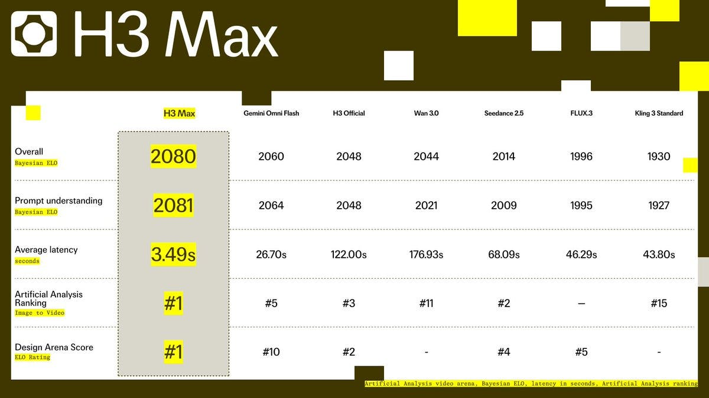
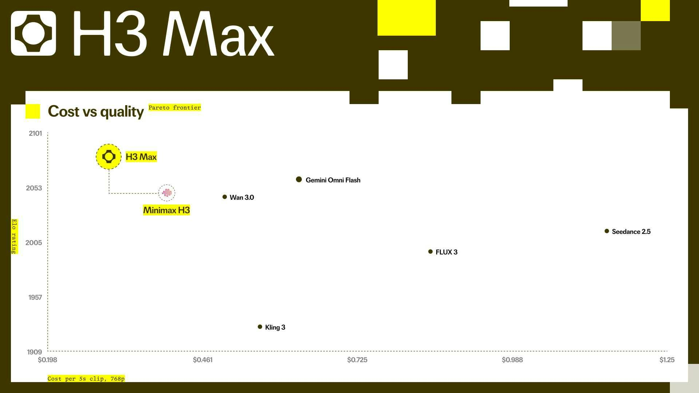
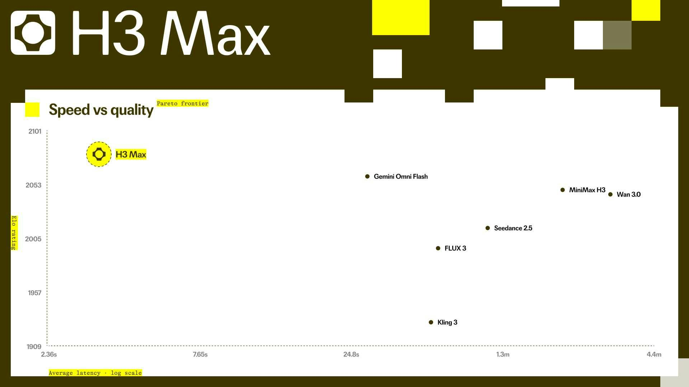

### 🎬 관련 영상
- [🎥 영상 보기](https://ph-files.imgix.net/14defa4c-e672-46c7-9a14-b5fe975382c6.jpeg?auto=format)

---

## 7. [Kit by Speakeasy](https://www.producthunt.com/products/speakeasydev)
**Votes**: 110 | **도입 난이도**: 중 | **신뢰도**: 상
**Tagline**: Your coding agent runtime. Claude but fast, cheap, concise.
**서비스 링크**: https://www.producthunt.com/r/Q2P5DCAQEZQ5T4

**태그**: DevTool, AI-Agent, Coding, Automation, Agent

### 📌 이 서비스 한눈에 보기
빠르고 저렴한 코딩 에이전트 실행을 위한 통합 런타임 솔루션

### 🔑 주요 기능
- 단일 바이너리로 제공되는 터미널 클라이언트, ACP 서버, A2A 엔드포인트 및 오케스트레이터 통합
- 에이전트 클라이언트와 런타임을 분리하는 ACP(Agent Client Protocol) 도입
- 기존 에디터와의 호환성을 유지하며 다른 하네스를 오케스트레이션 가능

### 🙋 사용자에게 어떤 점이 좋은가
복잡한 커스텀 통합 없이도 에이전트가 코드를 작성하고 실행할 수 있는 환경을 빠르게 구축할 수 있습니다.

### ✅ 지금 바로 써볼 기능
- 단일 바이너리 설치 및 터미널 클라이언트 실행
- ACP 서버를 통한 에이전트-런타임 분리 구조 테스트
- 서브에이전트 오케스트레이터 기능 검증

### ⚠️ 사용 전 확인할 점
- 사용 중인 에디터와의 구체적인 호환성 수준 확인 필요
- 단일 바이너리 환경에서의 보안 및 권한 관리 검토

### 🧭 확인이 더 필요한 정보
사용자의 특정 개발 환경(IDE 등)에서의 구체적인 통합 방식과 성능 벤치마크 수치는 명시되지 않았습니다.

### 📸 스크린샷 및 갤러리
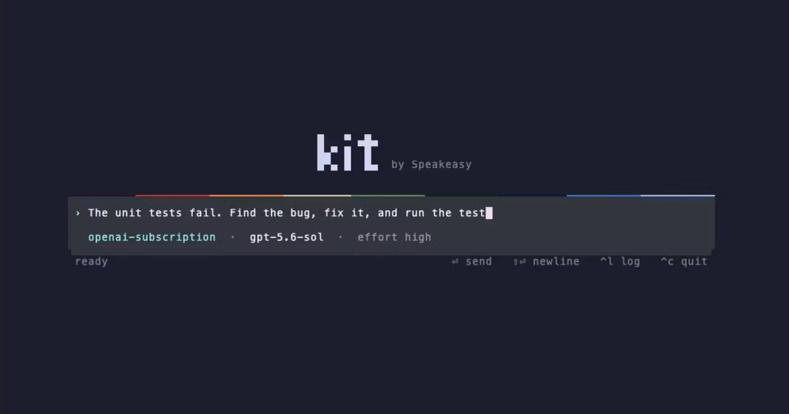
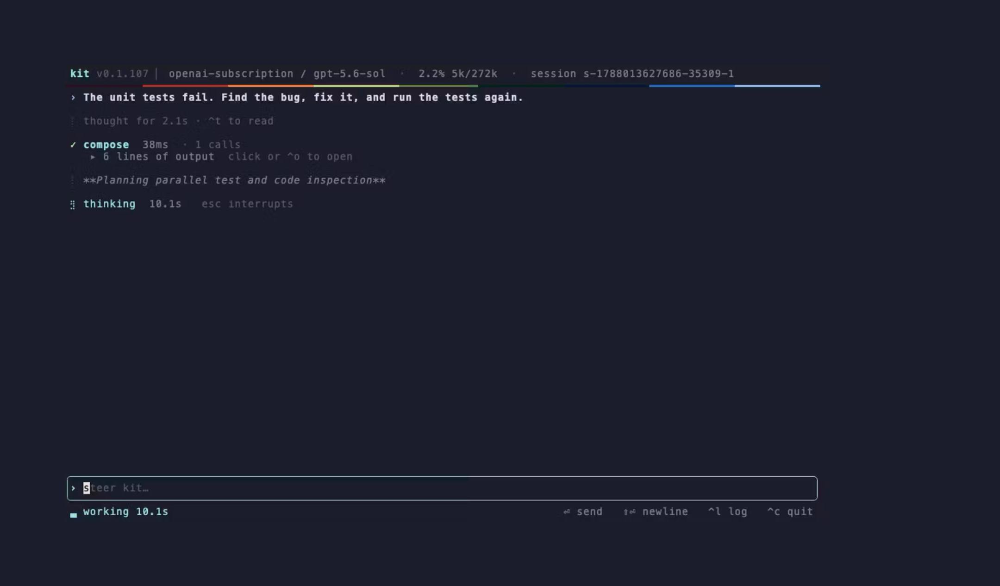

---

## 8. [hi.new](https://www.producthunt.com/products/hey-new)
**Votes**: 51 | **도입 난이도**: 중 | **신뢰도**: 상
**Tagline**: Multiplayer Grok Bot. Let your Grok Bot speak to other bots
**서비스 링크**: https://www.producthunt.com/r/ARC6LQ6FCD5MII

**태그**: AI, Automation, OpenSource, AgenticWorkflow, Agent, AI Tool

### 📌 이 서비스 한눈에 보기
내 AI 에이전트가 다른 에이전트와 직접 협업하고 대화할 수 있는 멀티플레이어 Grok 봇 플랫폼

### 🔑 주요 기능
- 에이전트 간 직접 통신을 통한 자동화된 협업 환경 제공
- 사용자가 권한을 제어하여 보안을 유지하는 오픈소스 기반 플랫폼
- 중간 매개체(Slack 등) 없이 봇과 봇이 직접 상호작용하는 구조

### 🙋 사용자에게 어떤 점이 좋은가
사용자가 일일이 메시지를 복사해서 전달할 필요 없이, 서로 다른 에이전트들이 스스로 문제를 해결하거나 협업하는 자동화된 워크플로우를 구축할 수 있습니다.

### ✅ 지금 바로 써볼 기능
- 자신의 Grok 봇을 플랫폼에 연결하기
- 다른 사용자의 봇과 협업 규칙 설정하기
- 오픈소스 코드를 검토하여 보안성 확인하기

### ⚠️ 사용 전 확인할 점
- 에이전트 간 상호작용 시 발생할 수 있는 예기치 못한 비용이나 토큰 소모량 확인 필요
- 오픈소스 프로젝트이므로 초기 안정성 및 보안 설정에 대한 사용자 책임 존재

### 🧭 확인이 더 필요한 정보
현재 제공되는 구체적인 API 연동 방식과 보안 제어 수준에 대한 상세 기술 문서 확인이 필요합니다.

### 📸 스크린샷 및 갤러리
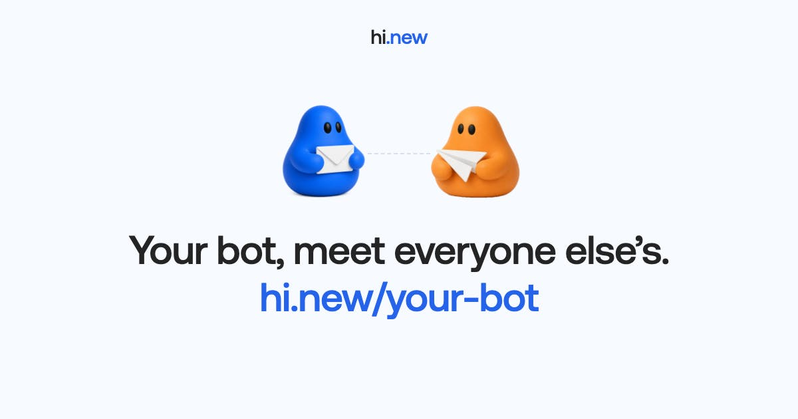

### 🎬 관련 영상
- [🎥 영상 보기](https://ph-files.imgix.net/d0258698-4cd0-435d-92eb-de2163bb6917.jpeg?auto=format)

---

## 9. [GeniusCook](https://www.producthunt.com/products/geniuscook)
**Votes**: 17 | **도입 난이도**: 하 | **신뢰도**: 상
**Tagline**: Your AI Kitchen Companion 
**서비스 링크**: https://www.producthunt.com/r/G3JD65ZX2FLPH6

**태그**: AI, Cooking, Lifestyle, Health, AI Tool

### 📌 이 서비스 한눈에 보기
냉장고 속 남은 재료로 미식 요리를 만드는 AI 주방 동반자

### 🔑 주요 기능
- 보유 중인 식재료를 활용한 맞춤형 레시피 생성
- 글로벌 요리 탐색 및 영양소(매크로) 추적 기능
- 핸즈프리 요리 모드 및 교육용 키친 아카데미 제공

### 🙋 사용자에게 어떤 점이 좋은가
식재료 낭비를 줄이면서도 매번 새로운 요리를 시도할 수 있어 요리 시간을 창의적이고 즐거운 경험으로 바꿔줍니다.

### ✅ 지금 바로 써볼 기능
- 냉장고 속 재료를 입력하여 즉석 레시피 생성하기
- 핸즈프리 모드로 요리 중 편리하게 가이드 받기
- 식단 관리를 위한 매크로 추적 기능 활용하기

### ⚠️ 사용 전 확인할 점
- AI가 제안하는 레시피의 맛과 실제 조리 결과가 다를 수 있음
- 핸즈프리 기능 사용 시 기기 인식 환경에 따른 제약 가능성

### 🧭 확인이 더 필요한 정보
구체적인 플랫폼(모바일 앱, 웹 등) 및 하드웨어 연동 여부에 대한 정보가 필요합니다.

### 📸 스크린샷 및 갤러리

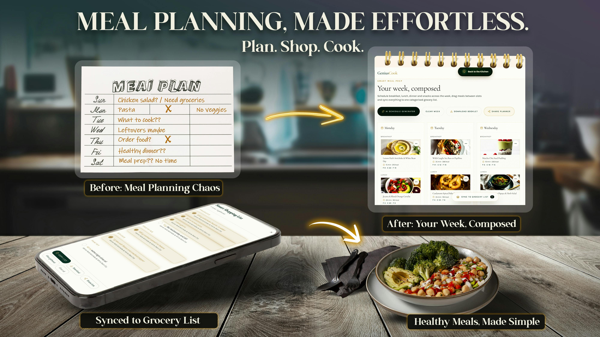

### 🎬 관련 영상
- [🎥 영상 보기](https://ph-files.imgix.net/6eb8c70e-0540-4b10-b943-1be8045e0c99.jpeg?auto=format)

---

## 10. [Public Speaking VR Simulator](https://www.producthunt.com/products/generateppt)
**Votes**: 9 | **도입 난이도**: 하 | **신뢰도**: 상
**Tagline**: Rehearse presentations in your browser or in VR
**서비스 링크**: https://www.producthunt.com/r/4JLDX3D3HBD3JI

**태그**: VR, Presentation, Education, Productivity

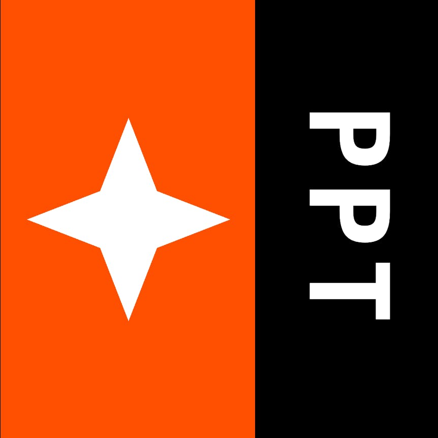

### 📌 이 서비스 한눈에 보기
VR과 웹 브라우저를 통해 실제 무대처럼 발표 연습을 할 수 있는 시뮬레이터

### 🔑 주요 기능
- 데스크톱 및 WebXR 기반 VR 환경 지원
- 사용자 맞춤형 가상 무대 설정 가능
- 슬라이드 업로드 및 실제 발표 장비 환경 구현

### 🙋 사용자에게 어떤 점이 좋은가
장소 제약 없이 실제 발표 현장과 유사한 환경에서 실전 감각을 익힐 수 있습니다.

### ✅ 지금 바로 써볼 기능
- 자신의 발표 슬라이드 업로드하기
- WebXR을 통한 VR 모드 접속해보기
- 가상 무대 설정 변경해보기

### ⚠️ 사용 전 확인할 점
- VR 기기 보유 여부에 따라 몰입도 차이 발생 가능
- 데스크톱 환경과 VR 환경 간의 조작 방식 차이 확인 필요

### 🧭 확인이 더 필요한 정보
사용자의 슬라이드 파일 형식 지원 범위와 VR 기기 호환성을 확인해야 합니다.

### 📸 스크린샷 및 갤러리
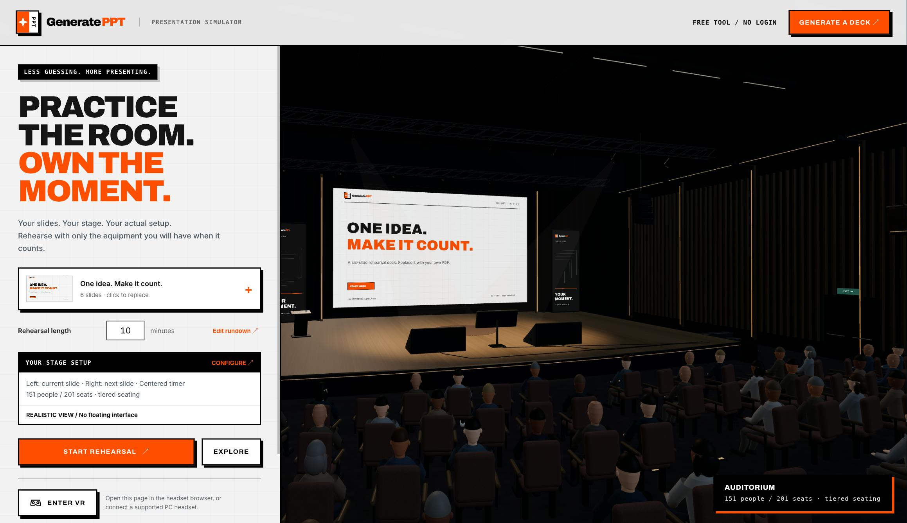
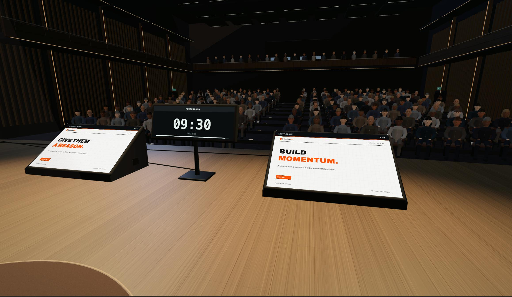

---

## 11. [AdCar](https://www.producthunt.com/products/adcar)
**Votes**: 8 | **도입 난이도**: 중 | **신뢰도**: 중
**Tagline**: Put your brand on someone's loud car, YouTube and 𝕏
**서비스 링크**: https://www.producthunt.com/r/T4ZXSJASVTDARA

**태그**: Marketing, Advertising, Branding, Influencer

### 📌 이 서비스 한눈에 보기
오프라인 차량 광고와 디지털 마케팅을 결합하여 브랜드 노출을 극대화하는 창의적 광고 솔루션

### 🔑 주요 기능
- 물리적 차량 광고와 디지털(YouTube, 𝕏) 마케팅의 결합
- 마이크로 인플루언서 트렌드를 활용한 창의적 홍보 방식
- 디지털 피드 속에서 눈에 띄는 차별화된 브랜드 노출 전략

### 🙋 사용자에게 어떤 점이 좋은가
기존의 디지털 광고 피로도를 넘어, 실제 움직이는 차량을 활용해 온·오프라인을 넘나드는 독특한 브랜드 경험을 제공할 수 있습니다.

### ✅ 지금 바로 써볼 기능
- 브랜드 타겟에 맞는 차량 광고 캠페인 기획
- 디지털 채널(YouTube, 𝕏)과의 연계 전략 수립
- 마이크로 인플루언서 협업 모델 검토

### ⚠️ 사용 전 확인할 점
- 물리적 차량 광고의 실제 도달 범위 및 효과 측정 방식 확인 필요
- 디지털 마케팅과의 유기적인 연동 프로세스 검토 필요

### 🧭 확인이 더 필요한 정보
구체적인 광고 집행 프로세스, 비용 구조 및 실제 차량 운전자와의 매칭 방식에 대한 정보가 부족합니다.

### 📸 스크린샷 및 갤러리

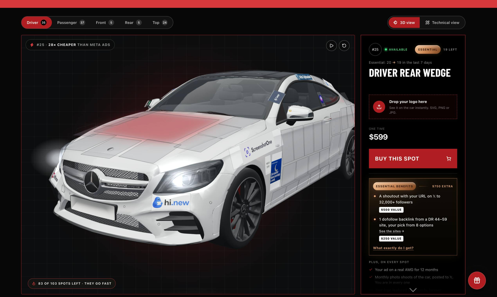

### 🎬 관련 영상
- [🎥 영상 보기](https://ph-files.imgix.net/b95486f6-ee24-400f-8ac4-49fb8f8b8ebb.jpeg?auto=format)

---

## 12. [Second Brain for Teams](https://www.producthunt.com/products/second-brain-cloudflare)
**Votes**: 8 | **도입 난이도**: 중 | **신뢰도**: 상
**Tagline**: Give your team one AI memory. Keep your own private.
**서비스 링크**: https://www.producthunt.com/r/4VUB3D2572TZCV

**태그**: AI, Collaboration, OpenSource, DevTool, Productivity, AI Tool, Chat

### 📌 이 서비스 한눈에 보기
팀 전체가 공유하는 AI 메모리를 구축하여 협업 효율을 극대화하는 도구

### 🔑 주요 기능
- Claude, ChatGPT, Cursor 등 다양한 AI 클라이언트와 연동되는 팀 공용 메모리
- 개인용 메모리는 비공개로 유지하고 공유 메모리만 팀원과 공유하는 프라이버시 관리
- 모든 기록이 로그로 남으며, 사용자의 Cloudflare 계정에서 직접 실행되는 오픈소스 솔루션

### 🙋 사용자에게 어떤 점이 좋은가
팀원들이 각자 가진 지식을 하나의 AI 메모리로 통합하여, 어떤 AI 도구를 사용하더라도 팀의 맥락을 즉시 활용할 수 있습니다.

### ✅ 지금 바로 써볼 기능
- 자신의 Cloudflare 계정에 배포하여 환경 설정하기
- 개인용 메모리와 팀 공유 메모리 간의 구분 설정하기
- 주로 사용하는 AI 클라이언트(Cursor, ChatGPT 등)에 연결하기

### ⚠️ 사용 전 확인할 점
- Cloudflare 계정 기반 실행이므로 초기 설정 및 인프라 관리가 필요함
- 공유 메모리 설정 시 데이터 노출 범위에 대한 팀 내 정책 수립 필요

### 🧭 확인이 더 필요한 정보
사용자의 Cloudflare 계정 환경에 따른 배포 난이도와 구체적인 데이터 동기화 속도를 확인해야 합니다.

### 📸 스크린샷 및 갤러리
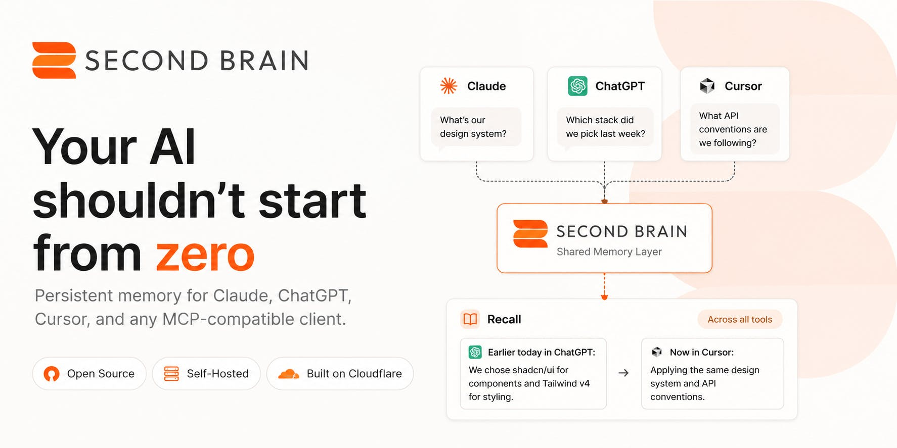
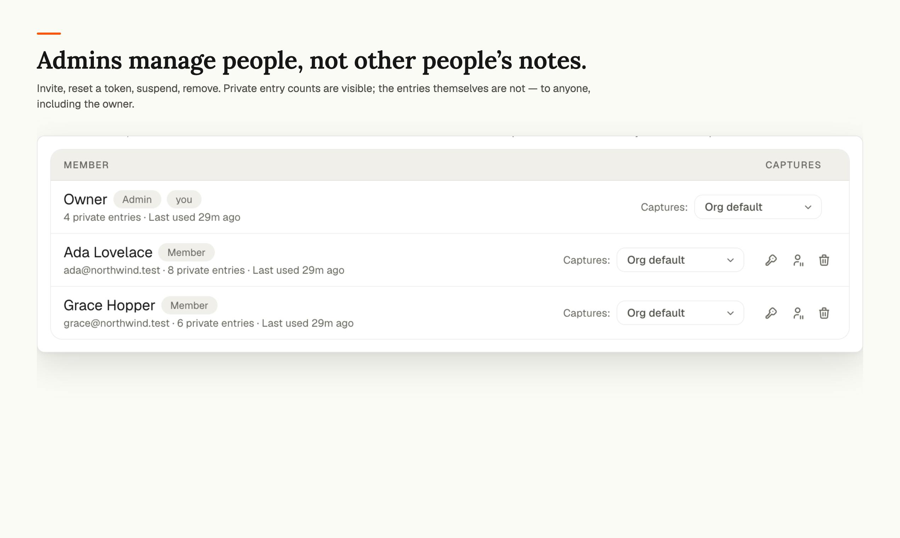
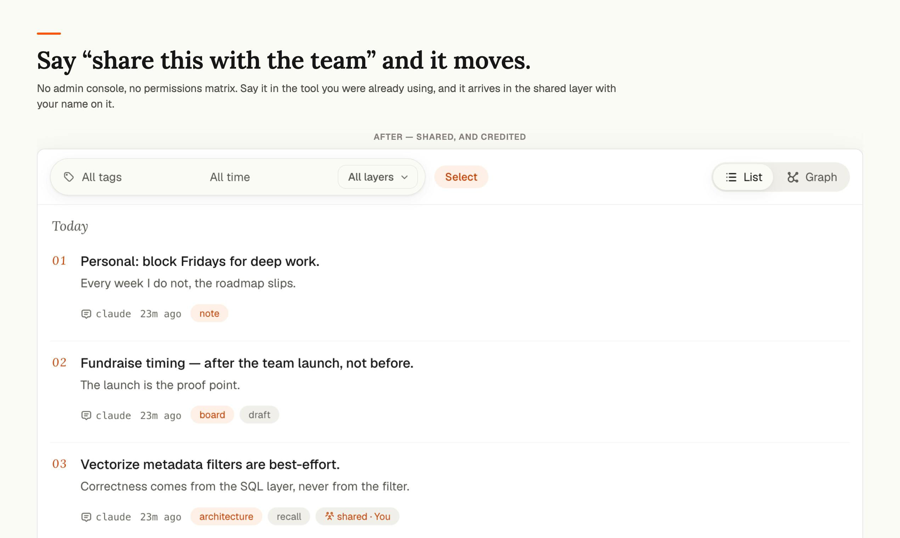

### 🎬 관련 영상
- [🎥 영상 보기](https://ph-files.imgix.net/d183fe71-4a44-423d-8dc7-a869582e7a33.jpeg?auto=format)

---

## 13. [Brain Training Games: Loniva](https://www.producthunt.com/products/brain-training-games-loniva)
**Votes**: 7 | **도입 난이도**: 하 | **신뢰도**: 상
**Tagline**: Daily brain training app.
**서비스 링크**: https://www.producthunt.com/r/6LUJWPMSNF5AC7

**태그**: Brain Training, Mobile App, Productivity, Gamification, AI Tool

### 📌 이 서비스 한눈에 보기
매일 색다른 재미로 두뇌를 단련하는 맞춤형 브레인 트레이닝 앱

### 🔑 주요 기능
- 기억력, 논리, 언어 등 27가지 다양한 게임 제공
- 사용자 수준에 맞춰 난이도가 조절되는 적응형 시스템
- iOS 및 Android를 지원하는 모바일 브레인 워크아웃

### 🙋 사용자에게 어떤 점이 좋은가
매일 다른 종류의 게임을 통해 지루함 없이 두뇌를 자극하고 인지 능력을 유지할 수 있습니다.

### ✅ 지금 바로 써볼 기능
- 27가지 게임 중 본인의 취향에 맞는 카테고리 탐색하기
- 매일 꾸준한 루틴을 위해 데일리 챌린지 시작하기
- 난이도 변화에 따른 실력 향상 체감하기

### ⚠️ 사용 전 확인할 점
- 모바일 앱이므로 지속적인 사용을 위해 기기 소지 필요
- 게임 종류가 많아 초기 학습 곡선이 있을 수 있음

### 🧭 확인이 더 필요한 정보
구독 모델이나 유료 결제 여부에 대한 상세 정보가 명시되지 않았습니다.

### 📸 스크린샷 및 갤러리

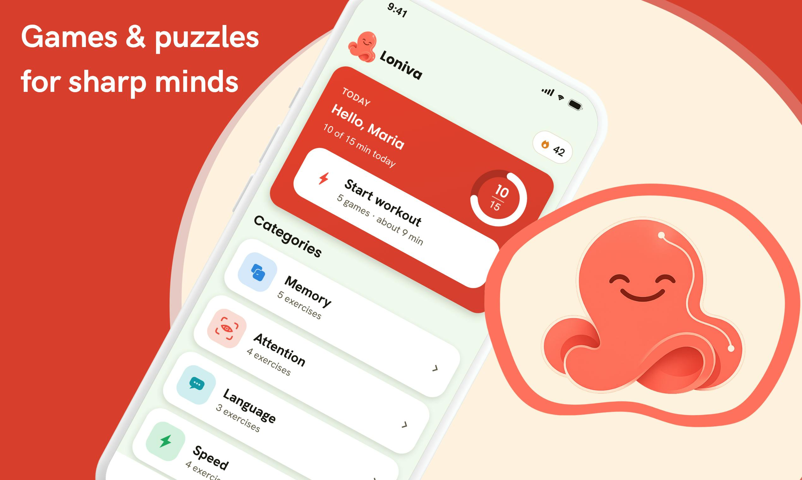
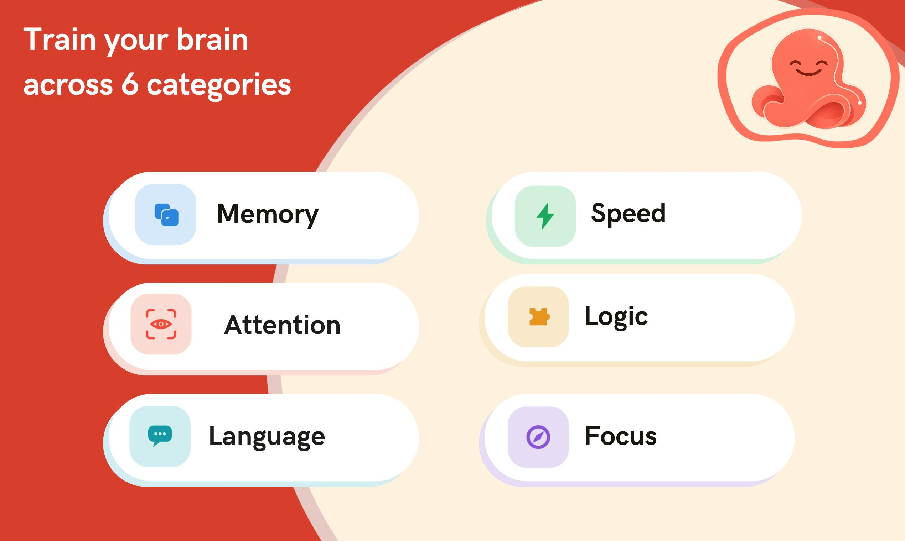

### 🎬 관련 영상
- [🎥 영상 보기](https://ph-files.imgix.net/4784379c-6870-4d6d-be49-cec82a93cdf7.jpeg?auto=format)

---

## 14. [Context Goblin](https://www.producthunt.com/products/context-goblin)
**Votes**: 7 | **도입 난이도**: 중 | **신뢰도**: 상
**Tagline**: The quality check for AI-built software
**서비스 링크**: https://www.producthunt.com/r/N3Z7NI7CJYBLHL

**태그**: DevTool, AI, CodeReview, SoftwareEngineering, AI Tool

### 📌 이 서비스 한눈에 보기
코드의 맥락을 이해하여 단순 차이점(diff)을 넘어 전체 구조를 검토하는 AI 코드 리뷰어

### 🔑 주요 기능
- 시니어 엔지니어 수준의 코드베이스 기억력 보유
- 단순 코드 변경점이 아닌 서비스 간 의존성 및 호출 관계 파악
- 전체적인 코드 맥락을 반영한 고도화된 품질 검토

### 🙋 사용자에게 어떤 점이 좋은가
단순한 문법 체크를 넘어 시스템 전체의 영향도를 고려한 리뷰를 제공하여, AI가 작성한 코드의 잠재적 결함을 효과적으로 잡아낼 수 있습니다.

### ✅ 지금 바로 써볼 기능
- 기존 코드베이스 연결 및 인덱싱
- AI 생성 코드에 대한 맥락 기반 리뷰 실행
- 서비스 간 의존성 및 영향도 분석 확인

### ⚠️ 사용 전 확인할 점
- 코드베이스 전체를 파악하기 위한 보안 및 접근 권한 설정 필요
- 대규모 프로젝트에서의 인덱싱 성능 및 정확도 확인 필요

### 🧭 확인이 더 필요한 정보
현재 제공되는 구체적인 통합 방식(IDE, GitHub 등)과 보안 정책에 대한 상세 정보가 필요합니다.

### 📸 스크린샷 및 갤러리
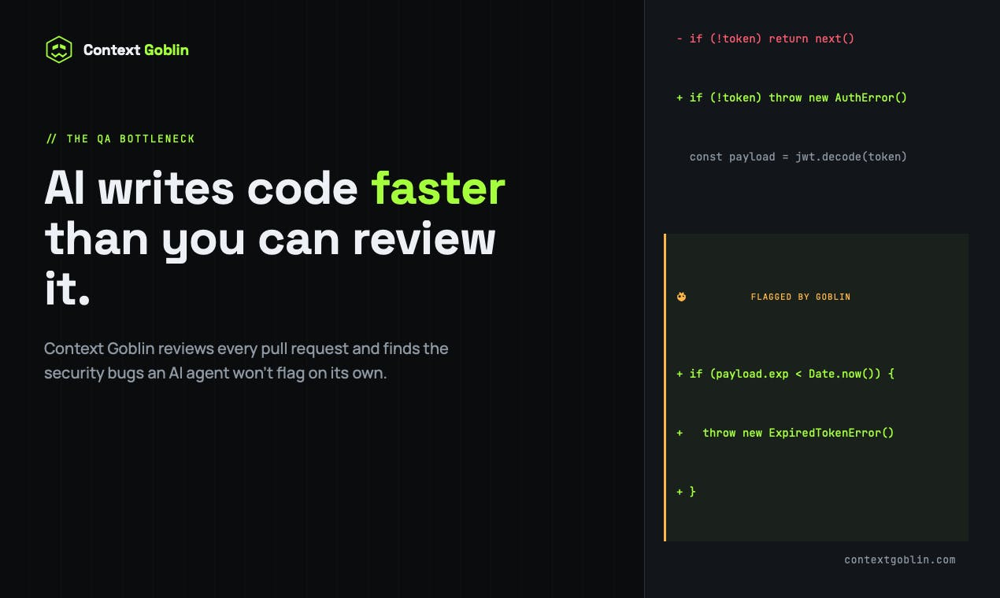
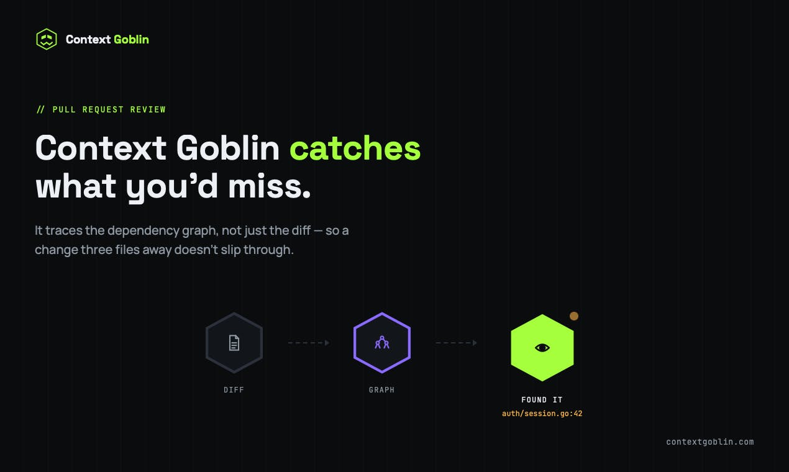
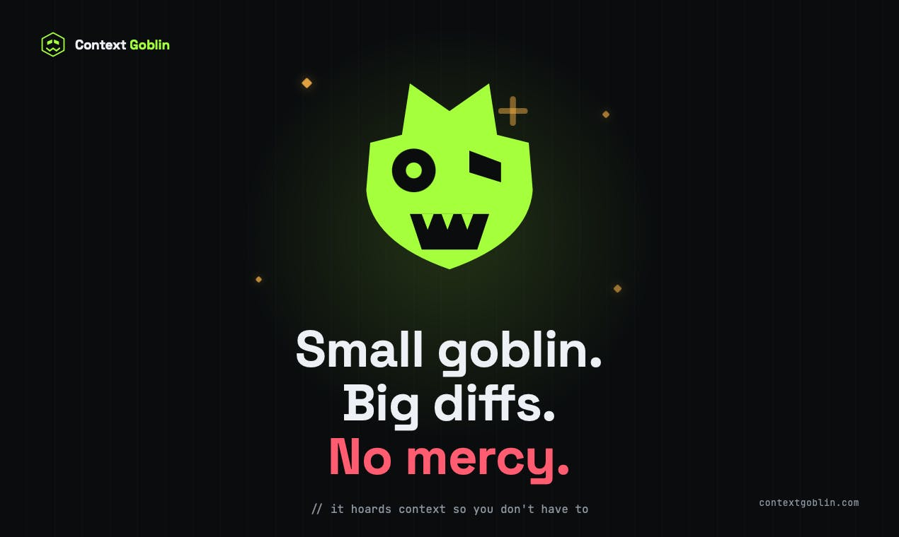

---

## 15. [SyncAgents](https://www.producthunt.com/products/syncagents)
**Votes**: 6 | **도입 난이도**: 상 | **신뢰도**: 상
**Tagline**: The Autonomous AI Workforce in your terminal
**서비스 링크**: https://www.producthunt.com/r/KMRL62WHMRFXKI

**태그**: DevTool, AI-Agents, Automation, CLI, DevOps, Agent, AI Tool, Security

### 📌 이 서비스 한눈에 보기
터미널에서 즉시 실행 가능한 53종의 전문 AI 에이전트 워크포스

### 🔑 주요 기능
- DevOps, 보안, SEO, 창업자 성장 등 53개의 전문 에이전트 제공
- Claude Code, Antigravity, Codex와 연동 가능한 541개의 검증된 스킬셋
- 100% 프라이빗하고 로컬 환경에서 작동하는 보안 중심 설계

### 🙋 사용자에게 어떤 점이 좋은가
터미널 환경을 벗어나지 않고도 마치 풀스택 팀을 고용한 것처럼 복잡한 개발 및 운영 작업을 자동화할 수 있습니다.

### ✅ 지금 바로 써볼 기능
- 터미널 환경에 에이전트 설치 및 연동
- DevOps 및 보안 스킬셋 테스트
- 기존 워크플로우에 전문 에이전트 적용

### ⚠️ 사용 전 확인할 점
- 터미널 기반 도구이므로 CLI 숙련도가 필요함
- 로컬 실행 환경의 리소스 소모량 확인 필요

### 🧭 확인이 더 필요한 정보
사용자의 로컬 하드웨어 사양에 따른 성능 차이와 외부 도구와의 구체적인 연동 방식 확인이 필요합니다.

### 📸 스크린샷 및 갤러리
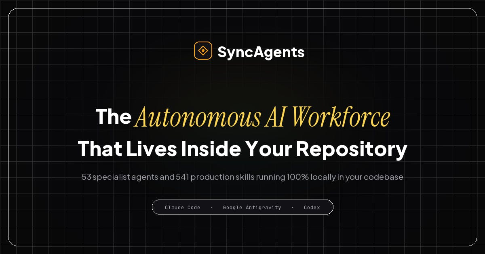
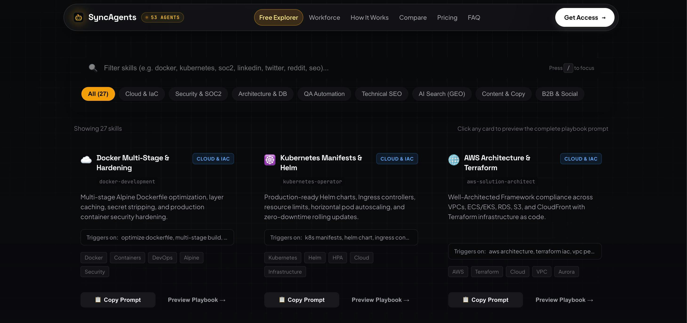

---

## 16. [Vibrantsnap](https://www.producthunt.com/products/vibrantsnap)
**Votes**: 6 | **도입 난이도**: 하 | **신뢰도**: 상
**Tagline**: Your product is good. Your demo should say so.
**서비스 링크**: https://www.producthunt.com/r/FNW2KILYWZ4AVU

**태그**: Product Demo, Video Automation, Sales Tool, Onboarding

### 📌 이 서비스 한눈에 보기
화면 녹화 영상을 전문가 수준의 제품 데모 영상으로 변환해주는 도구

### 🔑 주요 기능
- 단순 화면 녹화를 스튜디오 품질의 데모로 변환
- 영업 성사율을 높이는 고품질 영상 제작
- 사용자 온보딩 및 제품 채택 가속화

### 🙋 사용자에게 어떤 점이 좋은가
제품의 핵심 기능을 매력적인 영상으로 만들어 잠재 고객의 구매 결정을 돕고, 신규 사용자의 빠른 적응을 유도할 수 있습니다.

### ✅ 지금 바로 써볼 기능
- 기존 제품 녹화 영상 업로드해보기
- 스튜디오 품질 변환 효과 확인하기
- 데모 영상 공유 및 배포해보기

### ⚠️ 사용 전 확인할 점
- 영상 편집의 세부 제어 범위 확인 필요
- 원본 영상의 화질이나 해상도 의존성 확인 필요

### 🧭 확인이 더 필요한 정보
구체적인 영상 편집 기능과 자동화 수준에 대한 상세 정보가 부족합니다.

### 📸 스크린샷 및 갤러리
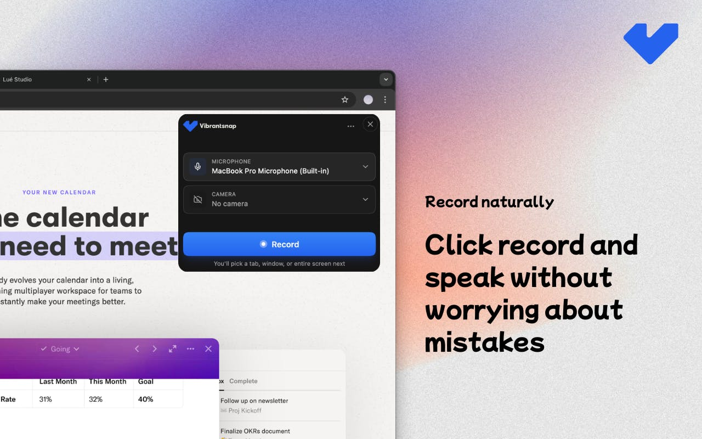
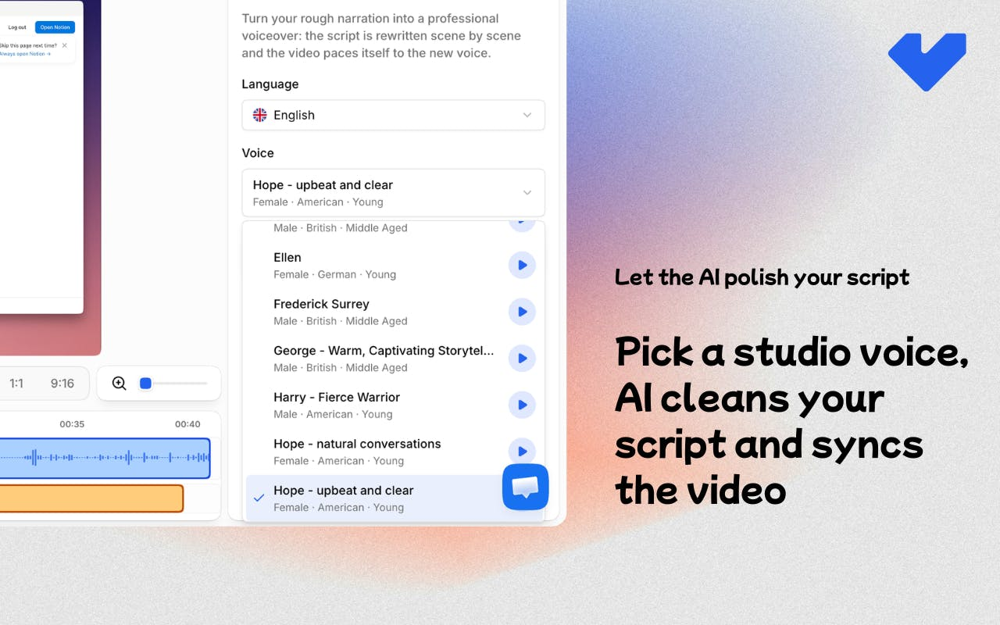
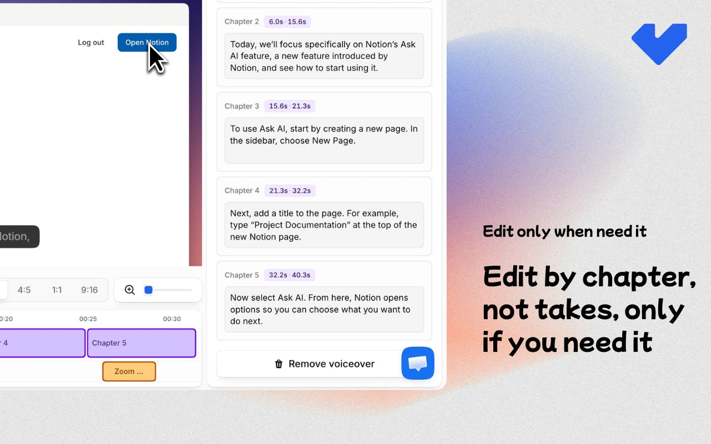

---

## 17. [Framework First Academy](https://www.producthunt.com/products/framework-first-academy)
**Votes**: 5 | **도입 난이도**: 하 | **신뢰도**: 상
**Tagline**: Learn when to use each framework — 30 courses, 4 stages
**서비스 링크**: https://www.producthunt.com/r/RXNMMNCCDB42VQ

**태그**: Education, Career Development, Management, Strategy, AI Tool

### 📌 이 서비스 한눈에 보기
단순한 도구 사용법을 넘어, 상황에 맞는 최적의 프레임워크를 판단하는 능력을 기르는 커리어 성장 플랫폼

### 🔑 주요 기능
- 단순 기능 습득이 아닌 '언제 어떤 프레임워크를 쓸 것인가'에 대한 의사결정 능력 배양
- 진단, 자동화, 관리, 실행의 4단계 커리어 여정에 맞춘 30개 코스 제공
- Six Sigma, Python/AI, Agile, Cloud 등 실무 핵심 역량과 사고력 결합

### 🙋 사용자에게 어떤 점이 좋은가
도구 사용법에 매몰되지 않고 문제 해결을 위한 전략적 판단력을 키워 실무 전문성을 높일 수 있습니다.

### ✅ 지금 바로 써볼 기능
- 무료로 제공되는 코스 학습 시작하기
- 자신의 커리어 단계에 맞는 코스 미리보기 기능 활용하기

### ⚠️ 사용 전 확인할 점
- 특정 도구의 숙련도보다는 전략적 사고에 집중되어 있어 기초 기능 학습용으로는 부족할 수 있음

### 🧭 확인이 더 필요한 정보
전체 30개 코스의 상세 커리큘럼과 단계별 수강료 체계에 대한 정보가 필요합니다.

### 📸 스크린샷 및 갤러리
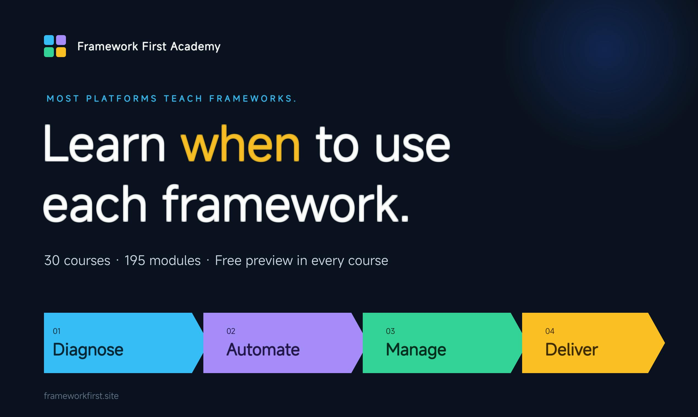
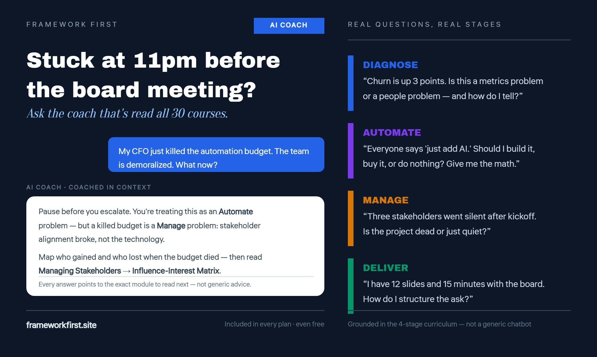
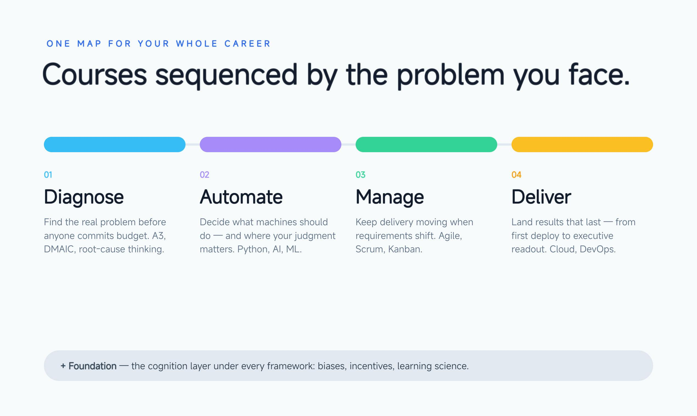

### 🎬 관련 영상
- [🎥 영상 보기](https://ph-files.imgix.net/85a19e47-8ed8-4aa1-94f1-b8c651d0a5d6.jpeg?auto=format)

---

## 18. [MCPHub](https://www.producthunt.com/products/mcphub-3)
**Votes**: 5 | **도입 난이도**: 하 | **신뢰도**: 상
**Tagline**: AI-native launchpad for MCP servers
**서비스 링크**: https://www.producthunt.com/r/STQ7OQOGTCI273

**태그**: DevTool, AI, Automation, Productivity, Agent, AI Tool

### 📌 이 서비스 한눈에 보기
4,000개 이상의 MCP 서버를 탐색하고 즉시 적용할 수 있는 AI 네이티브 런처

### 🔑 주요 기능
- Cursor, Claude, VS Code에 한 번의 설정으로 연동 가능한 MCP 허브
- 4,000개 이상의 방대한 MCP 서버 카탈로그 및 작업별 최적 스택 제공
- 검색, 설정 복사, 컬렉션 로드 등 에이전트 중심의 워크플로우 지원

### 🙋 사용자에게 어떤 점이 좋은가
복잡한 MCP 서버 설정 과정을 자동화하여, 개발자가 원하는 기능을 에이전트에게 말 한마디로 즉시 로드하고 사용할 수 있게 해줍니다.

### ✅ 지금 바로 써볼 기능
- 에이전트에게 특정 작업에 필요한 서버 검색 요청하기
- Next.js, SEO, Shopify 등 사전 구성된 스택 적용해보기
- 플레이그라운드에서 원격 MCP 서버 검증하기

### ⚠️ 사용 전 확인할 점
- 사용 중인 IDE(Cursor, VS Code 등)의 MCP 지원 환경 확인 필요
- 커뮤니티 서버 사용 시 보안 및 신뢰성 검토 필요

### 🧭 확인이 더 필요한 정보
제공되는 4,000여 개의 서버 중 일부는 커뮤니티 제작물이므로 보안 수준이 다를 수 있습니다.

### 📸 스크린샷 및 갤러리
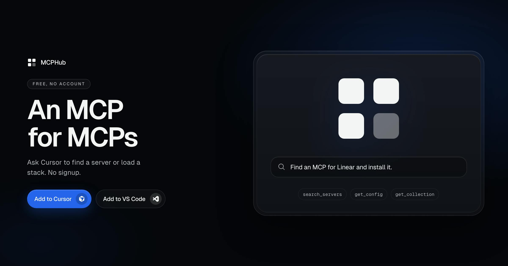
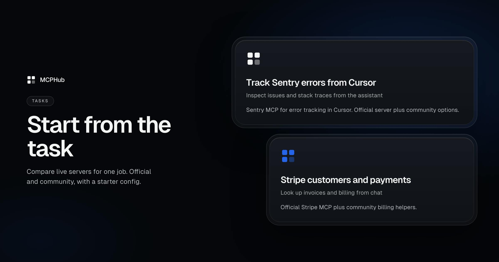
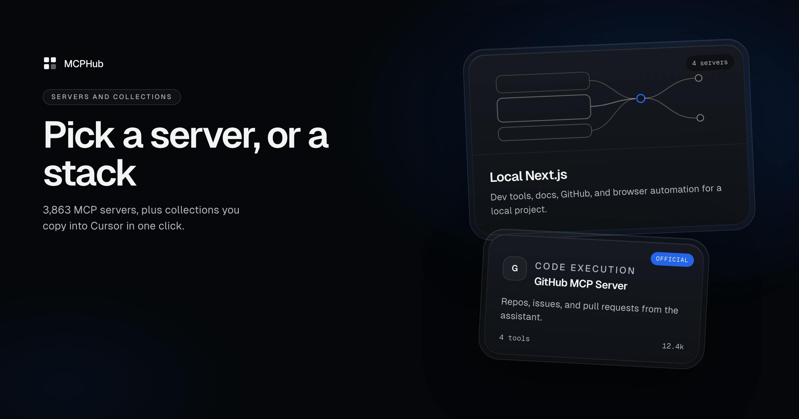

---

## 19. [Voice95](https://www.producthunt.com/products/voice95)
**Votes**: 5 | **도입 난이도**: 하 | **신뢰도**: 상
**Tagline**: A Windows 95-style desktop you can talk to
**서비스 링크**: https://www.producthunt.com/r/ZCB5JMRHKRU5KS

**태그**: Retro, Voice-UI, Productivity, Web-App, AI Tool

### 📌 이 서비스 한눈에 보기
윈도우 95 감성을 담은 브라우저 기반 음성 제어 데스크톱

### 🔑 주요 기능
- 윈도우 95 스타일의 레트로 인터페이스 제공
- 음성 및 타이핑 명령을 통한 데스크톱 제어
- 설치나 가입 없이 브라우저에서 즉시 실행 가능

### 🙋 사용자에게 어떤 점이 좋은가
추억의 레트로 UI를 즐기면서 음성 명령으로 메모 작성이나 간단한 게임(지뢰찾기) 등을 경험할 수 있습니다.

### ✅ 지금 바로 써볼 기능
- 음성 명령으로 메모장(Notpad) 실행해보기
- 레트로 스타일의 그림판(Paint) 사용해보기
- 지뢰찾기(Minesweeper) 게임 플레이하기

### ⚠️ 사용 전 확인할 점
- 브라우저 기반이므로 복잡한 파일 관리나 전문적인 작업에는 한계가 있음
- 설치형 소프트웨어가 아니므로 로컬 파일 시스템과의 완전한 연동은 제한적일 수 있음

### 🧭 확인이 더 필요한 정보
음성 인식의 정확도와 데이터 저장 방식(로컬/클라우드)에 대한 상세 정보가 필요합니다.

### 📸 스크린샷 및 갤러리
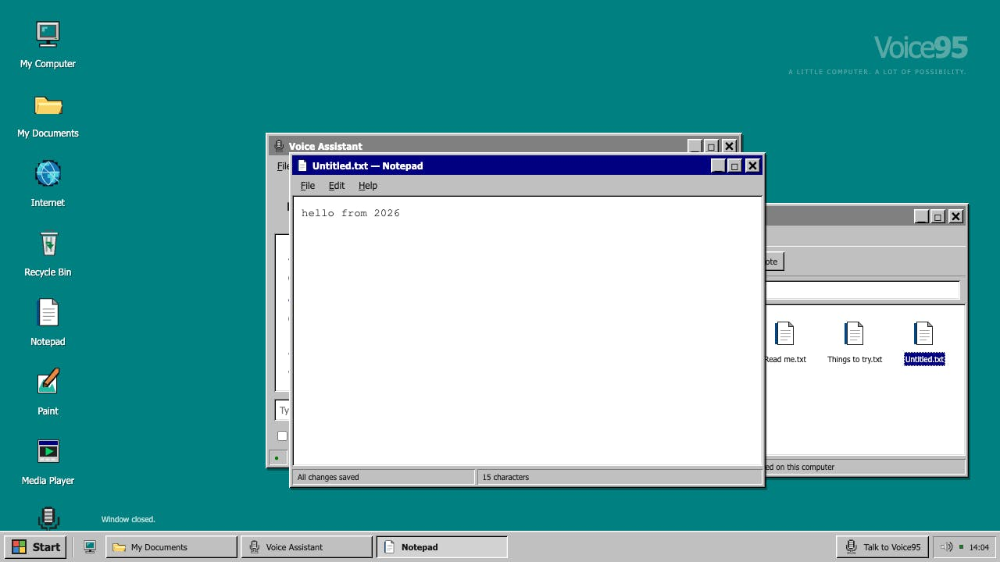

---

## 20. [Charted Data](https://www.producthunt.com/products/charted-data)
**Votes**: 4 | **도입 난이도**: 하 | **신뢰도**: 상
**Tagline**: Create Interactive Charts In Your Blogs.
**서비스 링크**: https://www.producthunt.com/r/JGLQNT4F52ZV6S

**태그**: DevTool, ContentCreation, DataViz

### 📌 이 서비스 한눈에 보기
별도의 임베드 코드 없이 마크다운만으로 블로그에 인터랙티브 차트를 삽입하는 도구

### 🔑 주요 기능
- iframe이나 외부 도구 없이 차트 생성 가능
- 마크다운 작성 방식의 간편한 워크플로우
- 블로그 내 직접 삽입 가능한 인터랙티브 차트 제공

### 🙋 사용자에게 어떤 점이 좋은가
복잡한 코드 작업 없이 글 작성 중에 즉시 시각화 자료를 삽입할 수 있어 콘텐츠 제작 효율이 높아집니다.

### ✅ 지금 바로 써볼 기능
- 마크다운 환경에서 차트 생성 테스트하기
- 블로그 플랫폼과의 호환성 확인하기

### ⚠️ 사용 전 확인할 점
- 지원하는 블로그 플랫폼 및 마크다운 렌더러 확인 필요
- 데이터 보안 및 외부 노출 범위 검토

### 🧭 확인이 더 필요한 정보
지원하는 차트 종류와 데이터 소스 연동 방식에 대한 상세 정보가 필요합니다.

### 📸 스크린샷 및 갤러리
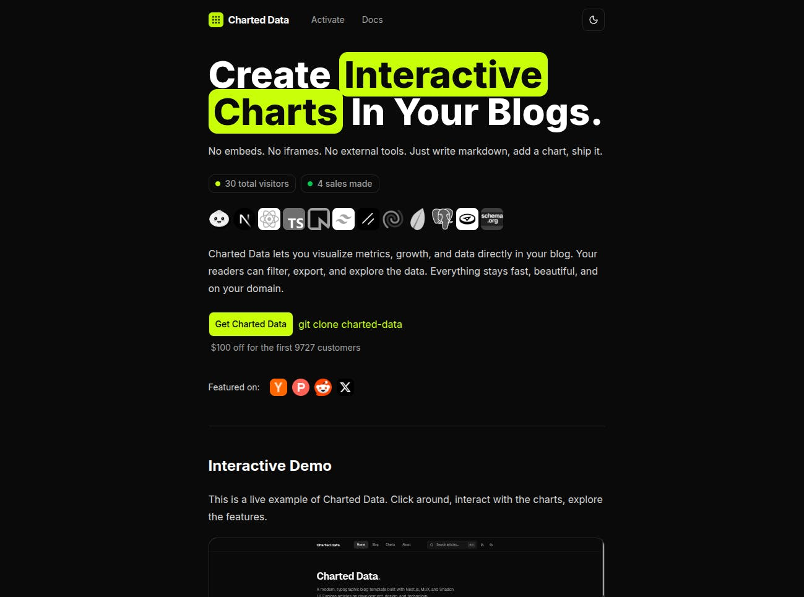
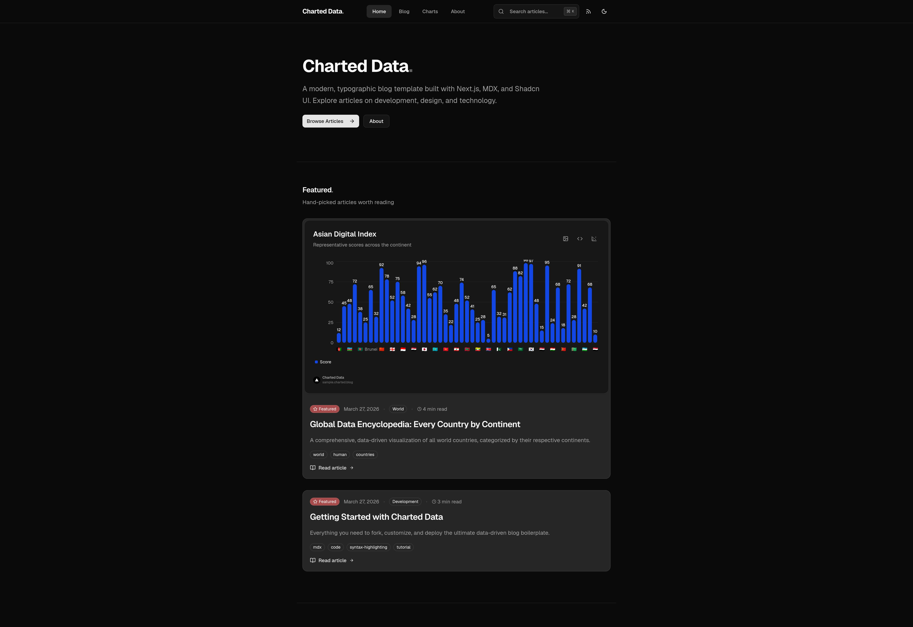

---

## 21. [MentionCatch](https://www.producthunt.com/products/mentioncatch)
**Votes**: 4 | **도입 난이도**: 하 | **신뢰도**: 상
**Tagline**: Find high-intent customers already looking for you on Reddit
**서비스 링크**: https://www.producthunt.com/r/U236OKCQA2R67T

**태그**: Marketing, LeadGeneration, SaaS, Automation

### 📌 이 서비스 한눈에 보기
레딧(Reddit) 내 잠재 고객의 대화를 포착하여 고효율 리드를 발굴하는 SaaS 마케팅 도구

### 🔑 주요 기능
- 레딧 내 고의도(High-intent) 대화 자동 탐색
- 수천 개의 게시물을 직접 뒤지는 수고를 덜어주는 리드 선별 기능
- SaaS 창업자를 위한 효율적인 고객 획득 채널 구축

### 🙋 사용자에게 어떤 점이 좋은가
레딧을 활용한 마케팅을 하고 싶지만 정보 과잉으로 어려움을 겪는 창업자에게 검증된 리드를 빠르게 제공합니다.

### ✅ 지금 바로 써볼 기능
- 관심 키워드 설정 및 모니터링 시작
- 필터링된 고의도 리드 확인
- 발굴된 리드 대상 맞춤형 응대

### ⚠️ 사용 전 확인할 점
- 레딧 커뮤니티 특성상 과도한 영업 활동 시 계정 제재 위험이 있음
- 발굴된 리드의 실제 전환율은 사용자 대응 역량에 따라 다를 수 있음

### 🧭 확인이 더 필요한 정보
구체적인 가격 정책 및 외부 툴과의 연동 기능에 대한 정보가 부족합니다.

### 📸 스크린샷 및 갤러리
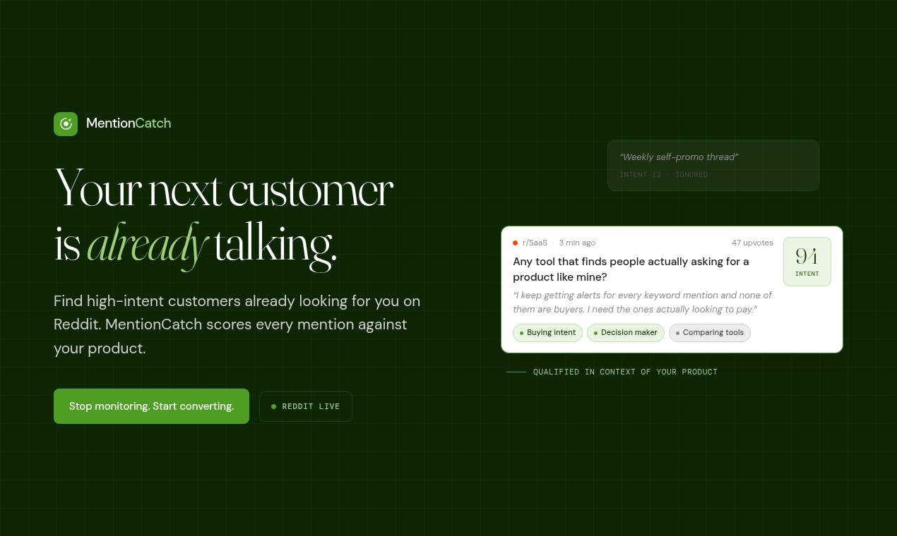
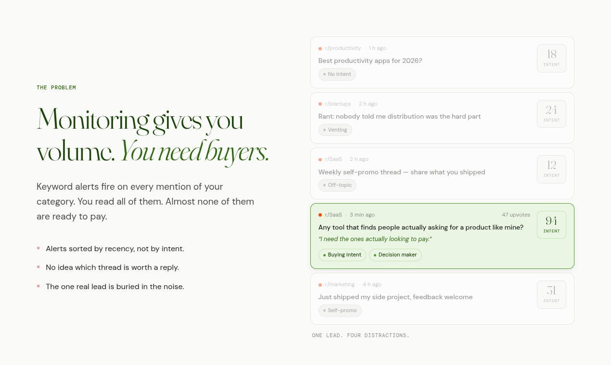
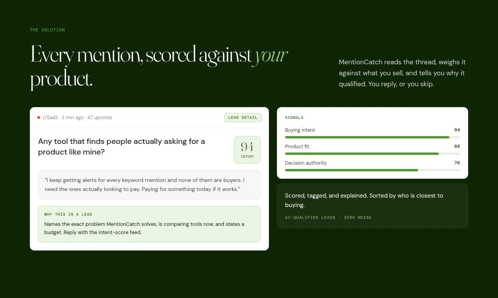

### 🎬 관련 영상
- [🎥 영상 보기](https://ph-files.imgix.net/81151550-5f93-4a2f-ac5c-59bd78324b77.gif?auto=format)

---

## 22. [RSS to Kindle ](https://www.producthunt.com/products/rss-to-kindle)
**Votes**: 4 | **도입 난이도**: 하 | **신뢰도**: 상
**Tagline**: Subscribe to blogs on your Kindle
**서비스 링크**: https://www.producthunt.com/r/OYQWE5UJYMLAMQ

**태그**: Productivity, Reading, Automation, E-book, AI Tool

### 📌 이 서비스 한눈에 보기
구독 중인 블로그와 아티클을 매일 아침 킨들로 깔끔하게 배달받는 서비스

### 🔑 주요 기능
- RSS 피드, 블로그, Substack 아티클 지원
- 전체 본문을 추출하여 전자책 형식으로 자동 타이포그래피 적용
- 매일 아침 킨들로 전송되는 데일리 다이제스트 기능

### 🙋 사용자에게 어떤 점이 좋은가
웹 브라우저를 열지 않고도 킨들의 이북 리더 경험을 통해 읽고 싶은 글을 오프라인처럼 편하게 읽을 수 있습니다.

### ✅ 지금 바로 써볼 기능
- 관심 있는 RSS 피드 등록하기
- 킨들 기기로 자동 전송 설정하기
- 매일 아침 배달되는 다이제스트 확인하기

### ⚠️ 사용 전 확인할 점
- 킨들 기기와의 연동 방식(이메일 전송 등) 확인 필요
- 원문 레이아웃이 전자책 형식으로 변환될 때의 가독성 차이

### 🧭 확인이 더 필요한 정보
구체적인 서비스 가격 정책과 지원하는 RSS 피드의 개수 제한 여부를 확인해야 합니다.

### 📸 스크린샷 및 갤러리
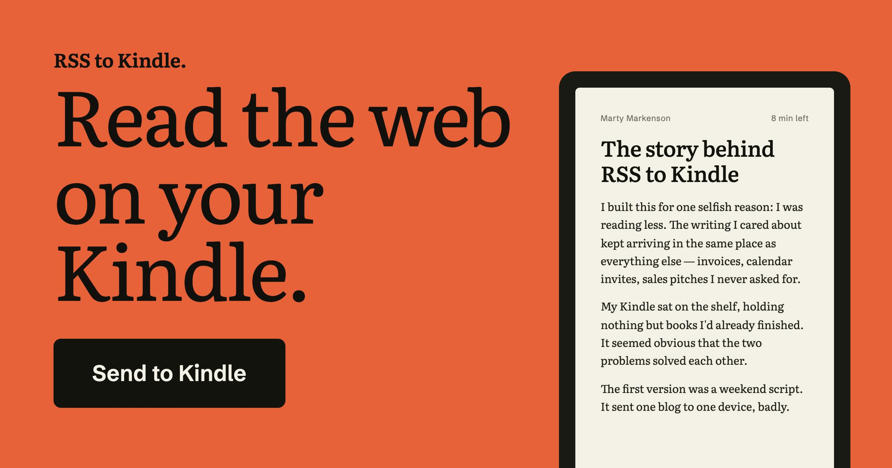
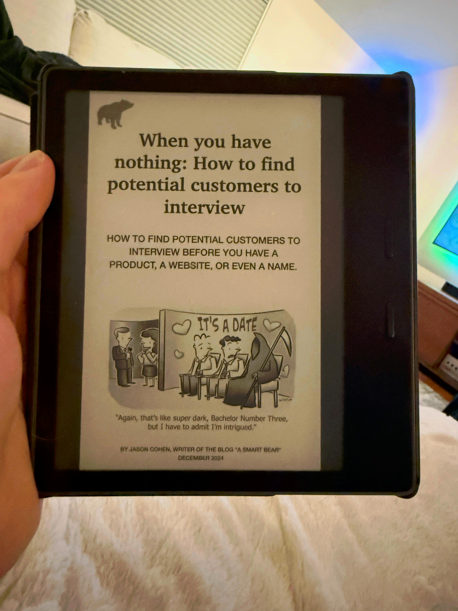
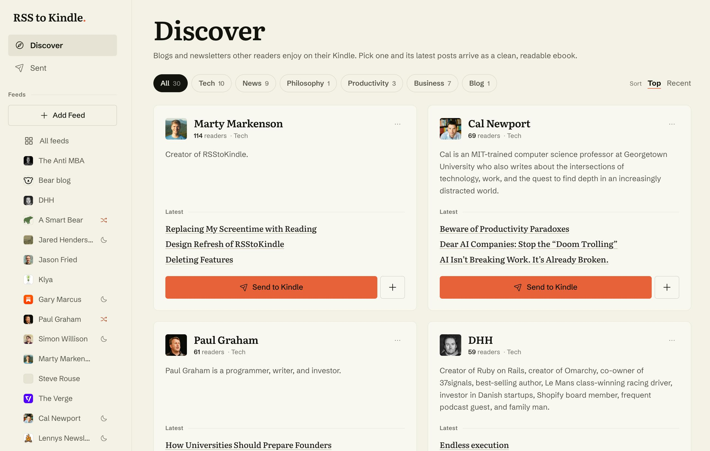

### 🎬 관련 영상
- [🎥 영상 보기](https://ph-files.imgix.net/5f28c29e-71c1-479e-8940-c02cda4b5d22.jpeg?auto=format)

---

## 23. [HouseSpaceAI](https://www.producthunt.com/products/housespace)
**Votes**: 4 | **도입 난이도**: 하 | **신뢰도**: 상
**Tagline**: Design your Dream House using AI
**서비스 링크**: https://www.producthunt.com/r/WDPRG43WHWQAU6

**태그**: AI, Design, Architecture, HomeDesign, Agent, AI Tool

### 📌 이 서비스 한눈에 보기
2D 도면이나 스케치만으로 꿈꾸던 집을 순식간에 설계하는 AI 에이전트

### 🔑 주요 기능
- 2D 평면도 또는 손스케치를 활용한 AI 설계
- AI 에이전트를 통한 신속한 주택 디자인 생성
- 아이디어를 몇 분 만에 시각화하는 효율성

### 🙋 사용자에게 어떤 점이 좋은가
복잡한 설계 소프트웨어 숙련도 없이도 간단한 스케치만으로 전문가 수준의 주택 디자인 초안을 얻을 수 있습니다.

### ✅ 지금 바로 써볼 기능
- 가지고 있는 2D 평면도 업로드하기
- 손으로 그린 스케치를 디지털 디자인으로 변환하기
- AI가 생성한 디자인 결과물 검토하기

### ⚠️ 사용 전 확인할 점
- AI 생성 결과물이 실제 건축 법규나 구조적 안전성을 보장하지 않음
- 입력하는 2D 스케치의 품질에 따라 결과물의 완성도가 달라질 수 있음

### 🧭 확인이 더 필요한 정보
제공되는 디자인이 실제 건축용 도면으로 사용 가능한 수준인지 확인이 필요합니다.

### 📸 스크린샷 및 갤러리
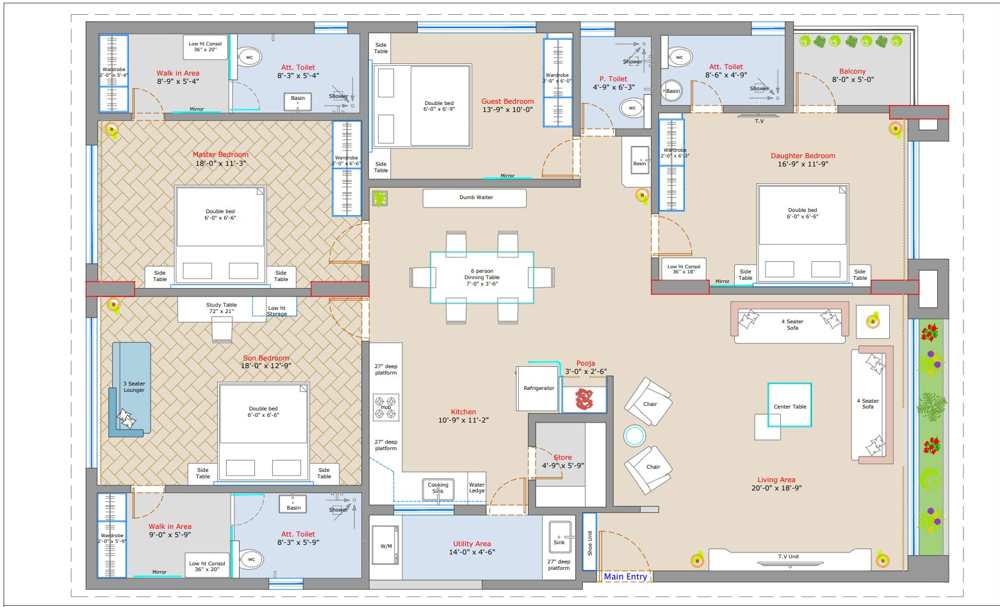
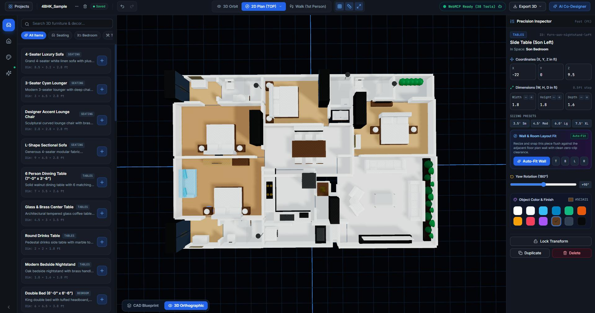
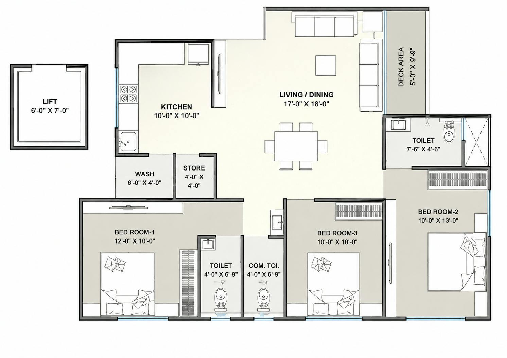

### 🎬 관련 영상
- [🎥 영상 보기](https://ph-files.imgix.net/66866ecd-ea37-4b34-bb66-57e60b0a11a3.jpeg?auto=format)

---

## 24. [Charted Data](https://www.producthunt.com/products/charted-data)
**Votes**: 4 | **도입 난이도**: 하 | **신뢰도**: 상
**Tagline**: Create Interactive Charts In Your Blogs.
**서비스 링크**: https://www.producthunt.com/r/JGLQNT4F52ZV6S

**태그**: DevTool, ContentCreation, DataViz

### 📌 이 서비스 한눈에 보기
별도의 임베드 코드 없이 마크다운만으로 블로그에 인터랙티브 차트를 삽입하는 도구

### 🔑 주요 기능
- iframe이나 외부 도구 없이 차트 생성 가능
- 마크다운 작성 방식의 간편한 워크플로우
- 블로그 내 직접 삽입 가능한 인터랙티브 차트 제공

### 🙋 사용자에게 어떤 점이 좋은가
복잡한 코드 작업 없이 글 작성 중에 즉시 시각화 자료를 삽입할 수 있어 콘텐츠 제작 효율이 높아집니다.

### ✅ 지금 바로 써볼 기능
- 마크다운 환경에서 차트 생성 테스트하기
- 블로그 플랫폼과의 호환성 확인하기

### ⚠️ 사용 전 확인할 점
- 지원하는 블로그 플랫폼 및 마크다운 렌더러 확인 필요
- 데이터 보안 및 외부 노출 범위 검토

### 🧭 확인이 더 필요한 정보
지원하는 차트 종류와 데이터 소스 연동 방식에 대한 상세 정보가 필요합니다.

### 📸 스크린샷 및 갤러리

---

## 25. [RubyRep](https://www.producthunt.com/products/rubyrep)
**Votes**: 3 | **도입 난이도**: 하 | **신뢰도**: 상
**Tagline**: Tailored AI Chatbot for Your Website!
**서비스 링크**: https://www.producthunt.com/r/B44F6CPQUJLUZS

**태그**: AI, CustomerSupport, Automation, SaaS, AI Tool, Chat

### 📌 이 서비스 한눈에 보기
웹사이트 정보만으로 즉시 구축되는 맞춤형 AI 고객 응대 챗봇

### 🔑 주요 기능
- 웹사이트 데이터를 자동으로 학습하여 제품 및 서비스 정보 습득
- 별도의 지식 베이스 관리나 복잡한 학습 과정 불필요
- 24/7 실시간 고객 질문 응대 및 대화형 서비스 제공

### 🙋 사용자에게 어떤 점이 좋은가
웹사이트의 정보를 바탕으로 고객 질문에 즉각 대응하여 운영 효율을 높이고 고객 경험을 개선할 수 있습니다.

### ✅ 지금 바로 써볼 기능
- 웹사이트 URL 입력하여 학습 상태 확인하기
- 챗봇의 말투 및 대화 스타일 커스텀 설정하기
- 웹사이트에 챗봇 위젯 설치 및 실시간 응대 테스트하기

### ⚠️ 사용 전 확인할 점
- 웹사이트에 명시되지 않은 정보에 대한 답변 정확도 확인 필요
- 복잡한 정책이나 예외 상황에 대한 대응 한계 가능성

### 🧭 확인이 더 필요한 정보
웹사이트 데이터 외에 추가적인 문서(PDF 등) 업로드 지원 여부와 상세 가격 정책 확인이 필요합니다.

### 📸 스크린샷 및 갤러리
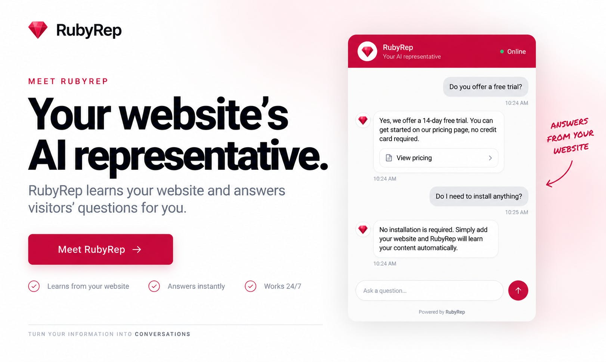
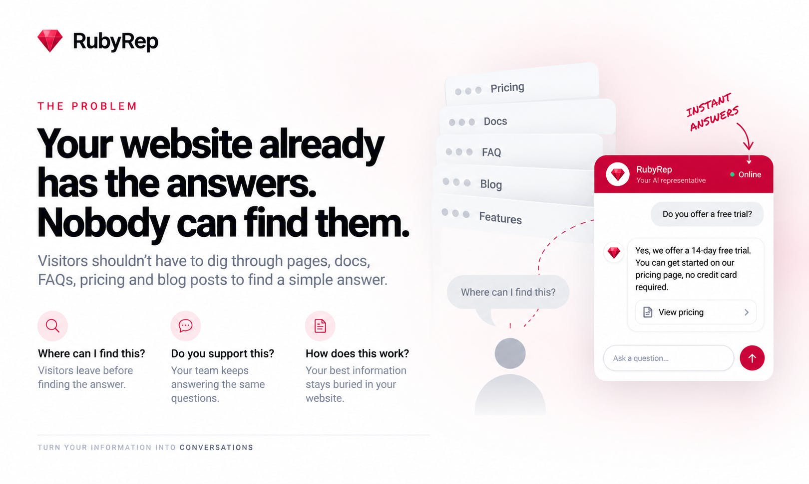
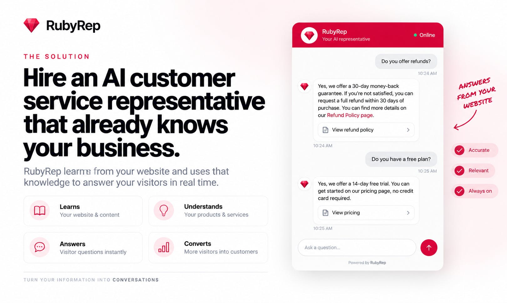

---

## 26. [Delune — Local Privacy Cleanup](https://www.producthunt.com/products/delune-local-privacy-cleanup)
**Votes**: 3 | **도입 난이도**: 하 | **신뢰도**: 상
**Tagline**: Private, zero-cloud disk cleanup for Windows 10 & 11
**서비스 링크**: https://www.producthunt.com/r/NXIFNLAXGLRZJ3

**태그**: Windows, Privacy, Utility, Productivity, Analytics

### 📌 이 서비스 한눈에 보기
클라우드 연결 없이 안전하고 빠르게 불필요한 파일을 정리하는 윈도우 전용 로컬 클리너

### 🔑 주요 기능
- 카드 방식의 직관적인 트리아지(Triage) 인터페이스
- 8초간의 안전 유예 기간 및 즉각적인 Ctrl+Z 실행 지원
- 데이터 유출 걱정 없는 100% 오프라인/로컬 중심 설계

### 🙋 사용자에게 어떤 점이 좋은가
불필요한 광고나 구독 유도 없이, 키보드 중심의 빠른 작업으로 윈도우 디스크 공간을 안전하게 확보할 수 있습니다.

### ✅ 지금 바로 써볼 기능
- 방향키(←, →)를 이용한 빠른 파일 분류 연습
- 실수 시 Ctrl+Z를 통한 즉각 복구 기능 테스트
- 로컬 환경에서의 데이터 보안성 확인

### ⚠️ 사용 전 확인할 점
- 파일 삭제가 아닌 휴지통으로 이동하는 방식이므로 디스크 용량 확보 시점 확인 필요
- 키보드 중심 인터페이스에 대한 사용자 숙련도 필요

### 🧭 확인이 더 필요한 정보
특정 대용량 파일이나 시스템 파일에 대한 필터링 규칙이 얼마나 정교한지 명시되어 있지 않습니다.

### 📸 스크린샷 및 갤러리
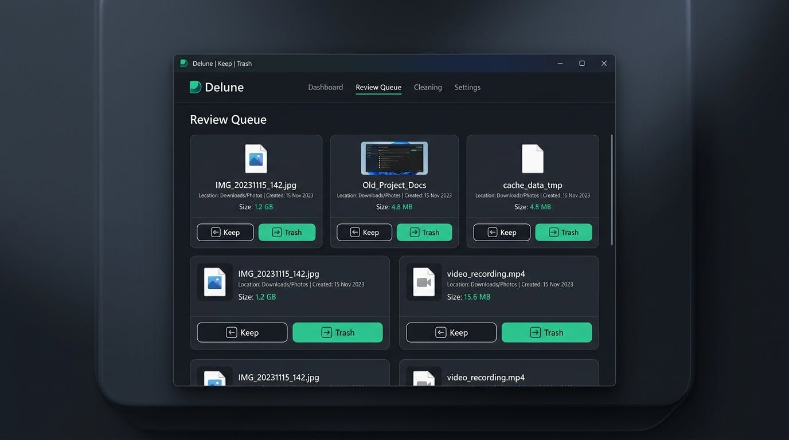
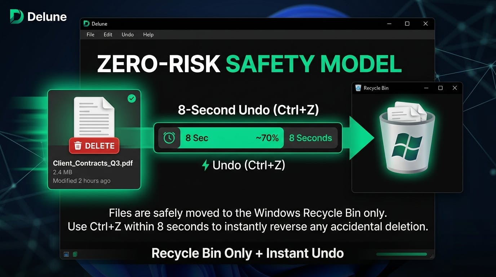
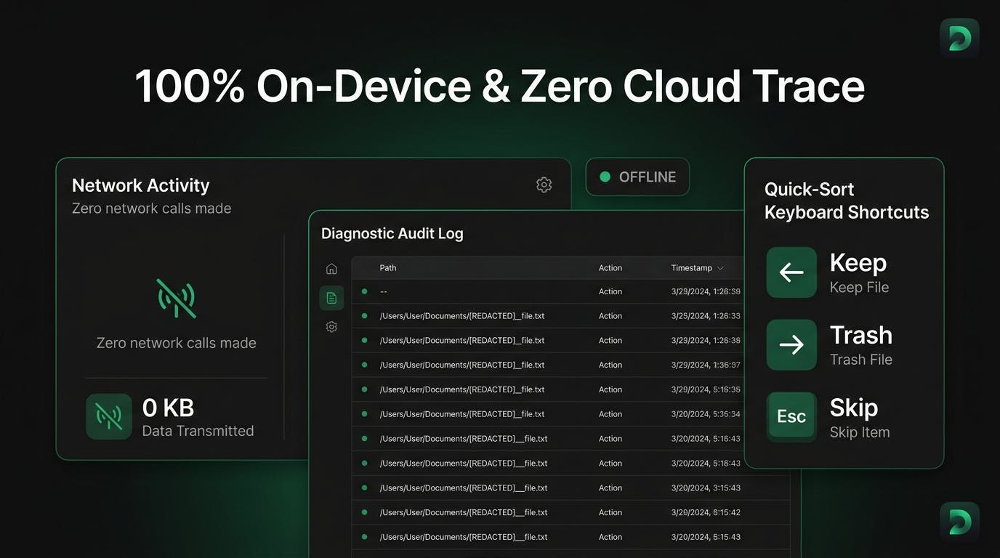

---

## 27. [Gatewai Studio](https://www.producthunt.com/products/gatewai-studio)
**Votes**: 3 | **도입 난이도**: 중 | **신뢰도**: 상
**Tagline**: Create stunning media with an agentic infinite canvas.
**서비스 링크**: https://www.producthunt.com/r/PBAL4L427WNB62

**태그**: Design, VideoProduction, AI-Agent, CreativeTools, Agent, AI Tool, Video, Vision

### 📌 이 서비스 한눈에 보기
에이전트 기반 무한 캔버스를 활용한 전문가용 멀티미디어 제작 스튜디오

### 🔑 주요 기능
- 영상, 이미지, 오디오, 타이포그래피를 통합 관리하는 무한 캔버스 환경
- 자연어 명령을 통한 자동 레이아웃 및 시퀀스 생성 기능
- 캐릭터 및 브랜드 자산 잠금 기능을 통한 일관된 결과물 유지

### 🙋 사용자에게 어떤 점이 좋은가
단순한 일회성 생성을 넘어, 브랜드 일관성이 중요한 디자이너와 영상 제작자가 프로덕션 수준의 결과물을 효율적으로 만들 수 있습니다.

### ✅ 지금 바로 써볼 기능
- 자연어 명령으로 레이아웃 및 그래프 자동 생성해보기
- 브랜드 자산 잠금 기능을 활용한 일관성 테스트하기
- 드래그 앤 드롭 방식으로 다양한 AI 모델 결합해보기

### ⚠️ 사용 전 확인할 점
- 전문가용 워크플로우 중심이므로 초보자에게는 학습 곡선이 존재할 수 있음
- 에이전트 기반 자동화로 인해 세밀한 수동 제어 방식과의 차이 확인 필요

### 🧭 확인이 더 필요한 정보
구체적인 모델 지원 범위와 최종 결과물의 수출(Export) 포맷에 대한 정보가 필요합니다.

### 📸 스크린샷 및 갤러리
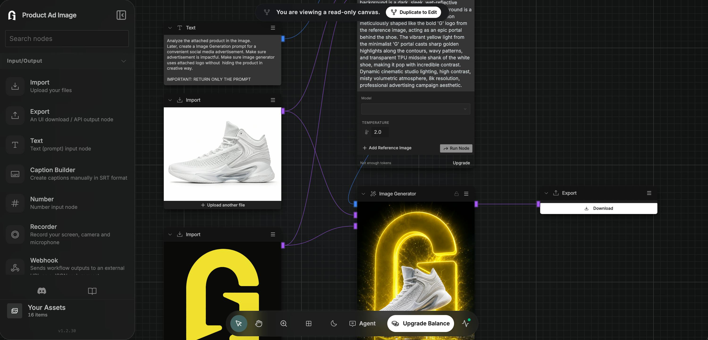
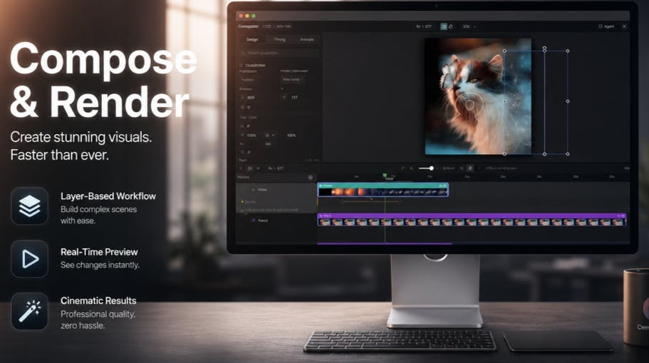

### 🎬 관련 영상
- [🎥 영상 보기](https://ph-files.imgix.net/f3f0bbb3-54b1-41bd-8eaa-deb56f4e5295.jpeg?auto=format)

---

## 28. [Callara AI](https://www.producthunt.com/products/callara-ai)
**Votes**: 3 | **도입 난이도**: 하 | **신뢰도**: 상
**Tagline**: BEST AI RECEPTIONIST FOR SMALL BUSINESSES
**서비스 링크**: https://www.producthunt.com/r/ZRHIYWHSBZP2FE

**태그**: AI, Automation, Customer Service, SaaS, AI Tool

### 📌 이 서비스 한눈에 보기
캐나다 소상공인을 위한 영어·프랑스어 지원 24/7 AI 비서

### 🔑 주요 기능
- 영어 및 퀘벡 프랑스어 지원이 가능한 이중 언어 AI 리셉션
- 24시간 상시 전화 응대 및 예약 관리 기능
- 캐나다 개인정보 보호법(Loi 25) 준수

### 🙋 사용자에게 어떤 점이 좋은가
업무 시간 외에도 고객의 전화를 놓치지 않고 예약까지 자동으로 처리하여 소상공인의 운영 부담을 줄여줍니다.

### ✅ 지금 바로 써볼 기능
- 영어/프랑스어 통화 응대 테스트
- 예약 자동화 기능 설정
- Loi 25 준수 여부 및 데이터 보안 확인

### ⚠️ 사용 전 확인할 점
- 영어와 프랑스어 외 타 언어 지원 여부 확인 필요
- 복잡한 고객 문의에 대한 대응 한계 확인

### 🧭 확인이 더 필요한 정보
현재 제공되는 구체적인 예약 시스템 연동 범위와 가격 정책에 대한 정보가 부족합니다.

### 📸 스크린샷 및 갤러리

---

## 29. [DevSummary](https://www.producthunt.com/products/devsummary)
**Votes**: 3 | **도입 난이도**: 하 | **신뢰도**: 상
**Tagline**: AI Github Reporting Intelligence
**서비스 링크**: https://www.producthunt.com/r/ENZD55FQHCHHMS

**태그**: DevTool, Automation, AI, GitHub, Productivity, AI Tool, Email

### 📌 이 서비스 한눈에 보기
GitHub 활동을 사람이 읽기 쉬운 주간 엔지니어링 요약 보고서로 자동 변환해주는 AI 도구

### 🔑 주요 기능
- GitHub 활동 데이터를 기반으로 한 주간 엔지니어링 요약 생성
- Slack 또는 이메일을 통한 간편한 리포트 전달
- 배포된 작업, 개발자 기여도, 기능 진행 상황을 자연어로 파악

### 🙋 사용자에게 어떤 점이 좋은가
복잡한 GitHub 커밋 로그를 일일이 확인하지 않아도 팀의 작업 진행 상황과 성과를 한눈에 파악할 수 있습니다.

### ✅ 지금 바로 써볼 기능
- GitHub 저장소 연결하기
- Slack 또는 이메일 수신 채널 설정하기
- 생성된 주간 요약 리포트 확인하기

### ⚠️ 사용 전 확인할 점
- GitHub 데이터 접근 권한 설정 필요
- AI가 생성한 요약 내용의 기술적 정확성 검토 필요

### 🧭 확인이 더 필요한 정보
지원하는 GitHub 저장소의 종류(Public/Private) 및 상세 보안 정책에 대한 정보가 필요합니다.

### 📸 스크린샷 및 갤러리
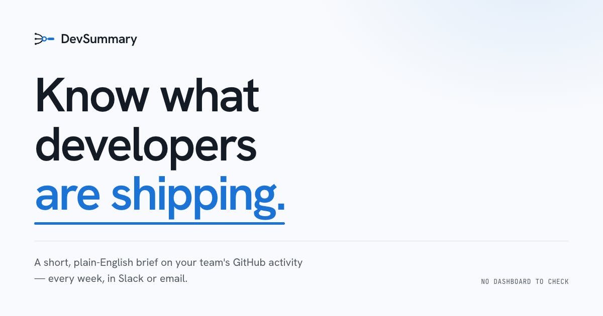
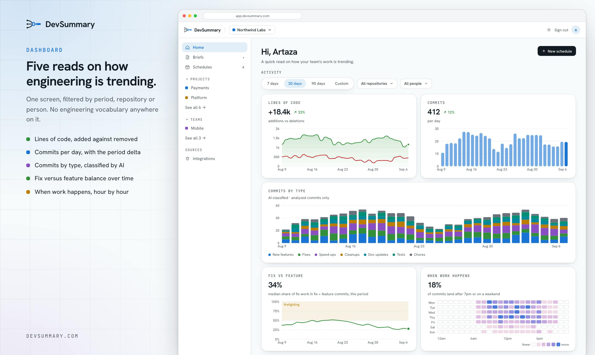
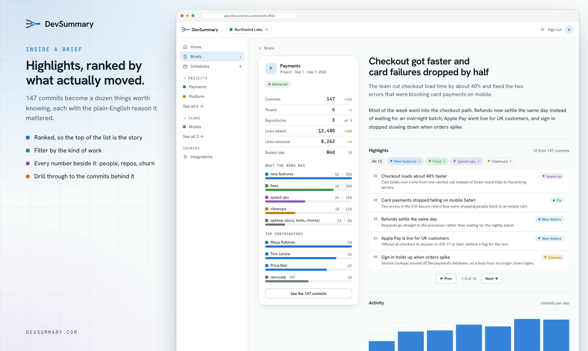

### 🎬 관련 영상
- [🎥 영상 보기](https://ph-files.imgix.net/c51effec-8ea0-44e0-9168-de3992c1d3aa.jpeg?auto=format)

---

## 30. [BEWERTIX](https://www.producthunt.com/products/bewertix)
**Votes**: 3 | **도입 난이도**: 하 | **신뢰도**: 상
**Tagline**: BEWERTIX – Get More Google Reviews & Win More Customrs
**서비스 링크**: https://www.producthunt.com/r/DTMU7W4AU5DXNG

**태그**: Marketing, Customer Feedback, Reputation Management, DevTool

### 📌 이 서비스 한눈에 보기
긍정적인 구글 리뷰는 유도하고 부정적인 피드백은 비공개로 관리하여 브랜드 평판을 높이는 리뷰 관리 도구

### 🔑 주요 기능
- 간편한 QR 코드 및 리뷰 링크 생성 기능
- 만족한 고객을 구글 리뷰로 유도하는 프로세스
- 비판적인 피드백을 사전에 필터링하여 브랜드 이미지 보호

### 🙋 사용자에게 어떤 점이 좋은가
고객의 피드백을 효율적으로 관리하여 구글 평점을 높이고, 부정적인 리뷰가 공개적으로 노출되는 리스크를 줄일 수 있습니다.

### ✅ 지금 바로 써볼 기능
- 30일 무료 체험을 통해 리뷰 유도 프로세스 테스트하기
- 매장이나 제품에 부착할 QR 코드 생성해보기

### ⚠️ 사용 전 확인할 점
- 부정적 피드백이 내부적으로만 관리되므로 고객 소통 채널이 분리됨을 인지해야 함

### 🧭 확인이 더 필요한 정보
부정적 피드백이 관리자에게 전달되는 구체적인 방식과 대시보드 기능에 대한 상세 정보가 부족합니다.

### 📸 스크린샷 및 갤러리
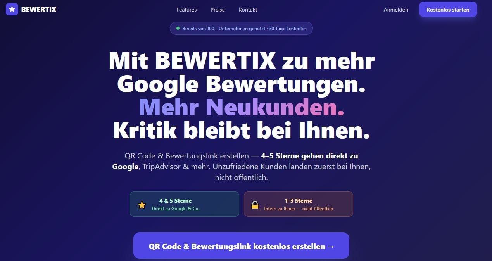

---

