# 🚀 Product Hunt Daily Top 30 (2026-09-08)

## 오늘의 요약
오늘의 제품들은 AI 에이전트와 자동화 기술을 활용하여 복잡한 코딩, 데이터 분석, 콘텐츠 제작 업무를 효율화하는 데 집중되어 있습니다. 특히 로컬 환경에서의 보안과 작업 내용을 방해하지 않는 직관적인 UI/UX를 통해 생산성을 극대화하는 도구들이 눈에 띕니다.

### 오늘의 핵심 포인트
- AI 에이전트와 자동화 기술을 통해 코딩, 데이터 분석, 영상 제작 등 전문적인 업무를 자동화하는 도구들이 다수 등장했습니다.
- 로컬 실행 및 데이터 보안을 강조하며 사용자의 개인정보와 작업 환경을 보호하는 설계가 주요 트렌드로 나타났습니다.
- 화면 가장자리 상주형 메모나 음성 제어 등 기존 작업 내용을 끊지 않고 즉각적으로 반응하는 생산성 도구들이 주목받았습니다.

**오늘의 태그**: AI 에이전트, 생산성 도구, 자동화, 개발자 도구, 로컬 우선

## 1. [PR Lens by Coldtea.ai](https://www.producthunt.com/products/coldtea)
**Votes**: 258 | **도입 난이도**: 하 | **신뢰도**: 상
**Tagline**: See code through a new lens
**서비스 링크**: https://www.producthunt.com/r/QDW4KEB2OFO6GI

**태그**: DevTool, Visualization, OpenSource, GitHub, Agent, AI Tool

### 📌 이 서비스 한눈에 보기
코드 변경 사항을 시각적인 아키텍처와 데이터 흐름도로 즉시 변환해주는 개발 도구

### 🔑 주요 기능
- 코드베이스 및 PR의 아키텍처와 데이터 흐름을 애니메이션 다이어그램으로 시각화
- GitHub Action, CLI, 코딩 에이전트 스킬 등 다양한 환경 지원
- MIT 라이선스 기반의 오픈 소스 프로젝트

### 🙋 사용자에게 어떤 점이 좋은가
코드를 일일이 읽기 전에 변경 사항의 구조적 영향을 시각적으로 파악하여 리뷰 시간을 단축할 수 있습니다.

### ✅ 지금 바로 써볼 기능
- GitHub Action으로 연동하여 PR 시 자동 시각화 확인하기
- CLI를 통해 로컬 코드베이스의 구조 파악하기
- 코딩 에이전트 스킬로 등록하여 워크플로우에 통합하기

### ⚠️ 사용 전 확인할 점
- 복잡도가 매우 높은 대규모 레거시 코드에서의 시각화 정확도 확인 필요
- 애니메이션 다이어그램이 실제 코드 로직의 세부 사항을 모두 반영하는지 검토 필요

### 🧭 확인이 더 필요한 정보
코드 규모에 따른 시각화 생성 속도 및 리소스 소모량에 대한 정보가 명시되지 않았습니다.

### 📸 스크린샷 및 갤러리
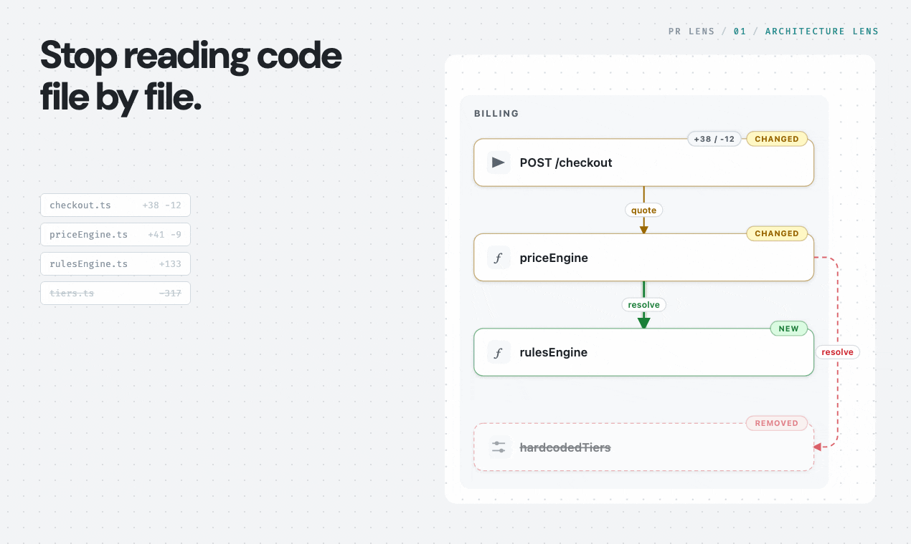
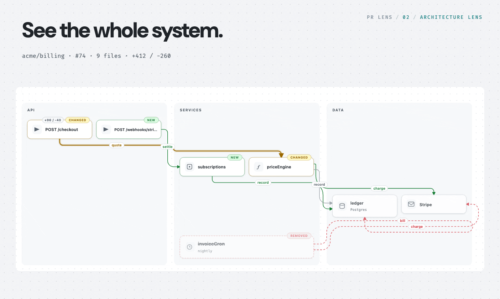
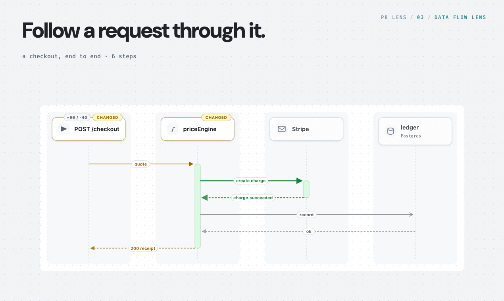

### 🎬 관련 영상
- [🎥 영상 보기](https://ph-files.imgix.net/7c9c8721-bdf2-472d-92a2-2c3c2bd39786.jpeg?auto=format)

---

## 2. [Scriptly](https://www.producthunt.com/products/sciptly)
**Votes**: 204 | **도입 난이도**: 하 | **신뢰도**: 상
**Tagline**: An iOS teleprompter app controlled by your voice
**서비스 링크**: https://www.producthunt.com/r/UO2ODGJRIT2SF5

**태그**: iOS, VideoProduction, Productivity, Teleprompter, Prompting, Video

### 📌 이 서비스 한눈에 보기
목소리 제어로 스크롤되는 iOS 전용 스마트 텔레프롬프터 앱

### 🔑 주요 기능
- 실시간 음성 인식 기반 자동 스크롤 기능
- 로컬 저장 방식을 통한 개인정보 보호
- 영상 제작을 위한 전문적인 텔레프롬프터 도구 제공

### 🙋 사용자에게 어떤 점이 좋은가
대본을 읽는 속도에 맞춰 화면이 자동으로 움직이므로, 손을 쓰지 않고도 자연스러운 영상 녹화가 가능합니다.

### ✅ 지금 바로 써볼 기능
- TestFlight를 통한 퍼블릭 베타 설치
- 음성 인식 스크롤 기능 테스트
- 로컬 저장소 내 대본 관리 기능 확인

### ⚠️ 사용 전 확인할 점
- 현재 베타 버전이므로 기능이 불안정할 수 있음
- iOS 환경에서만 작동함

### 🧭 확인이 더 필요한 정보
현재 퍼블릭 베타 단계이므로 정식 출시 기능 및 유료 플랜 여부는 확인이 필요합니다.

### 📸 스크린샷 및 갤러리

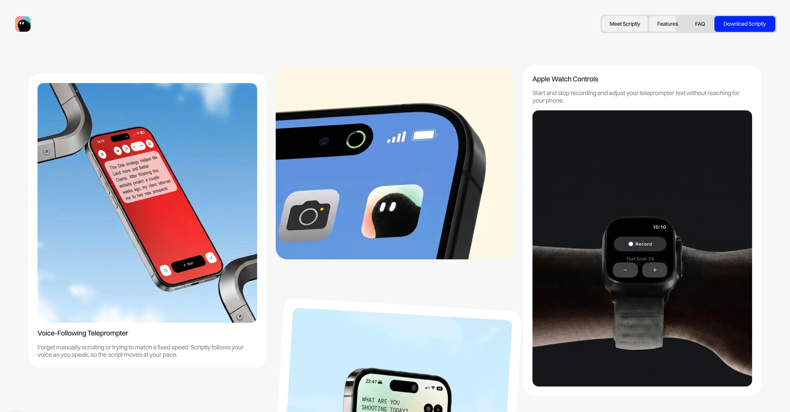

---

## 3. [Tucky](https://www.producthunt.com/products/tucky)
**Votes**: 204 | **도입 난이도**: 하 | **신뢰도**: 상
**Tagline**: Notes docked to your screen edge, with an AI agent inside
**서비스 링크**: https://www.producthunt.com/r/HOXPFE7M5744T2

**태그**: Productivity, macOS, AI, Note-taking, Agent, AI Tool, LLM

### 📌 이 서비스 한눈에 보기
화면 가장자리에 상주하며 AI와 함께하는 맥 전용 메모 앱

### 🔑 주요 기능
- 화면 가장자리에 얇은 스트라이프 형태로 상주하는 네이티브 macOS 앱
- 로컬 저장 및 암호화 기반의 보안 중심 설계
- 유료 플랜(Plus)을 통한 음성 입력, 커넥터 및 최신 LLM 모델 제공

### 🙋 사용자에게 어떤 점이 좋은가
메모를 별도 창이 아닌 화면 가장자리에 배치하여 작업 흐름을 방해하지 않으면서도 즉각적인 기록이 가능합니다.

### ✅ 지금 바로 써볼 기능
- 화면 가장자리 스트라이프 모드 활용하기
- 로컬 암호화 기능으로 보안 환경 확인하기
- Plus 플랜의 AI 모델 및 음성 기능 검토하기

### ⚠️ 사용 전 확인할 점
- macOS 전용 앱이므로 다른 OS 사용자는 사용 불가
- 고급 AI 기능 및 커넥터 사용 시 월 $4의 구독 비용 발생

### 🧭 확인이 더 필요한 정보
Plus 플랜에서 제공되는 구체적인 LLM 모델 종류와 커넥터의 범위는 명시되어 있지 않습니다.

### 📸 스크린샷 및 갤러리
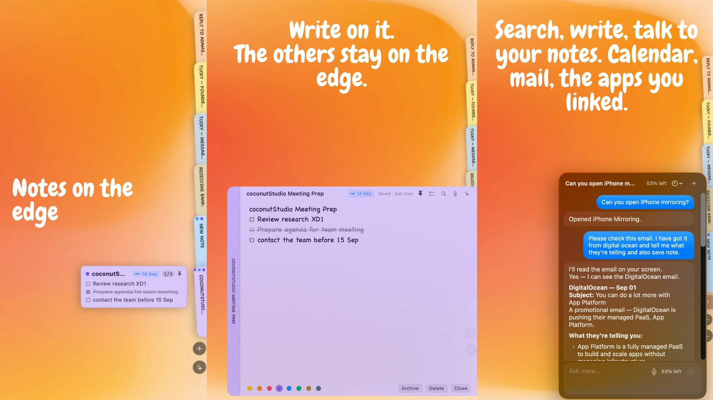
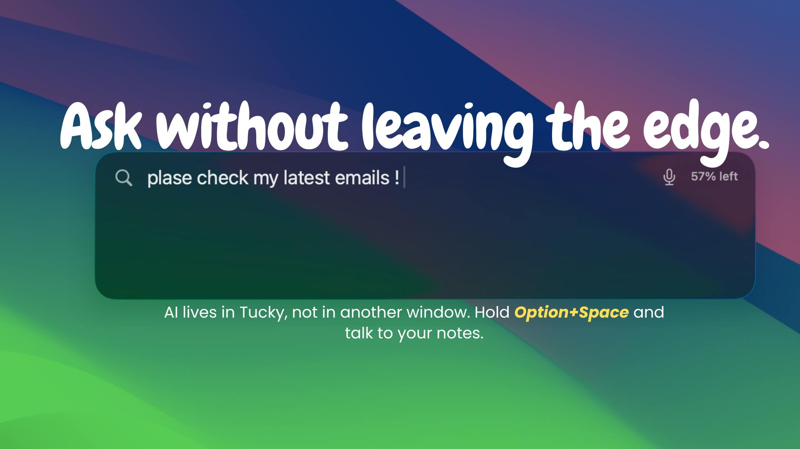
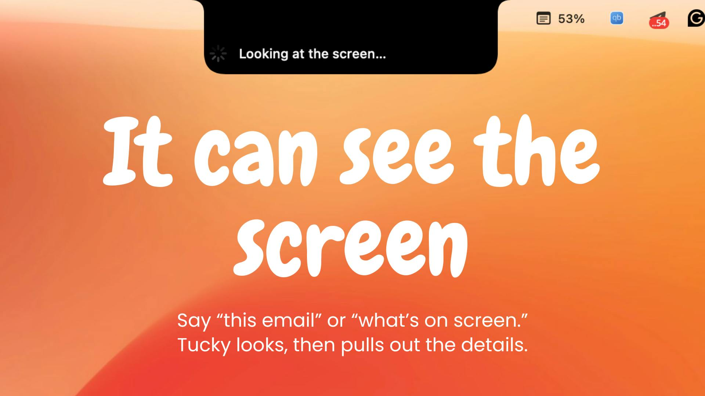

### 🎬 관련 영상
- [🎥 영상 보기](https://ph-files.imgix.net/f896d433-d038-44ef-ae7d-d19dafc2054d.jpeg?auto=format)

---

## 4. [Routines by Databox](https://www.producthunt.com/products/databox)
**Votes**: 147 | **도입 난이도**: 하 | **신뢰도**: 상
**Tagline**: An AI Analyst that runs analysis and reports on a schedule
**서비스 링크**: https://www.producthunt.com/r/XFUEYVLLCTAY6D

**태그**: Automation, Analytics, AI, Productivity, AI Tool, Prompting, Email

### 📌 이 서비스 한눈에 보기
정해진 일정에 따라 데이터 분석과 보고서를 자동으로 수행하는 AI 분석가

### 🔑 주요 기능
- 프롬프트와 스케줄 설정을 통한 자동화된 데이터 분석
- 실시간 데이터를 기반으로 한 맞춤형 리포트 생성
- 이메일, Slack, 앱 내 알림을 통한 자동 보고서 전달

### 🙋 사용자에게 어떤 점이 좋은가
반복적인 수동 데이터 분석 업무를 자동화하여, 사용자는 결과 보고를 받는 것만으로도 핵심 인사이트를 즉시 확인할 수 있습니다.

### ✅ 지금 바로 써볼 기능
- 분석하고 싶은 데이터 소스 연결하기
- 원하는 분석 내용을 담은 프롬프트 작성하기
- 보고서를 받을 주기와 채널(Slack/Email) 설정하기

### ⚠️ 사용 전 확인할 점
- 데이터 소스(Live Data)와의 연동 범위 확인 필요
- 프롬프트의 정교함에 따라 분석 결과의 품질이 달라질 수 있음

### 🧭 확인이 더 필요한 정보
지원하는 외부 데이터 소스의 종류와 상세 연동 방식에 대한 정보가 추가로 필요합니다.

### 📸 스크린샷 및 갤러리
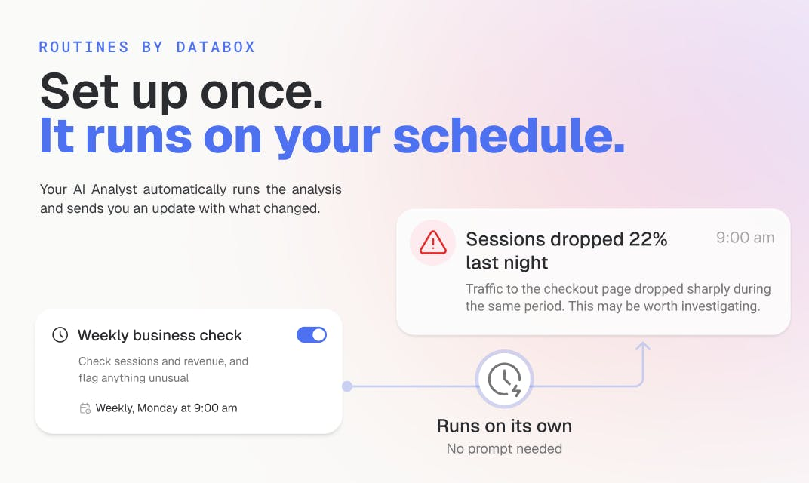
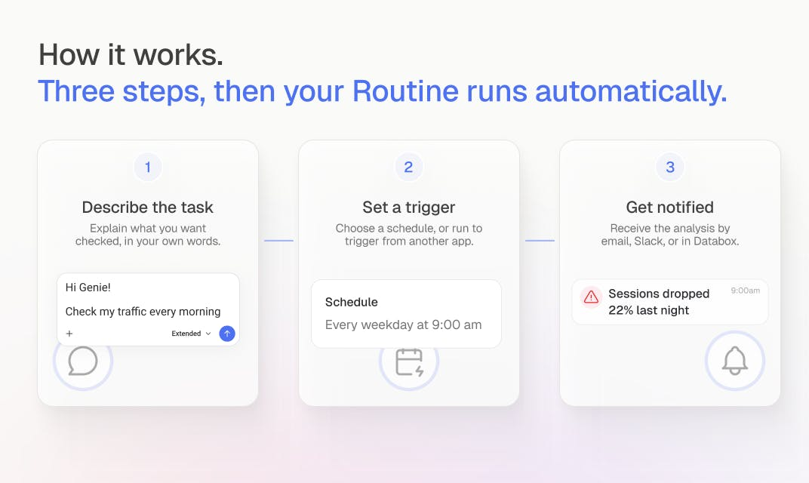
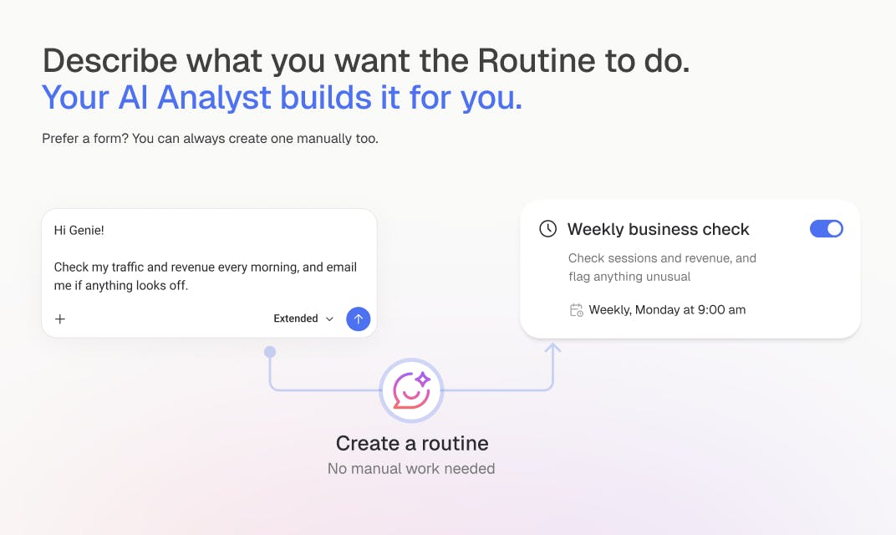

### 🎬 관련 영상
- [🎥 영상 보기](https://ph-files.imgix.net/732f6b74-8fd6-4217-a374-ec7921e525d7.jpeg?auto=format)

---

## 5. [Airuncode](https://www.producthunt.com/products/airuncode)
**Votes**: 125 | **도입 난이도**: 중 | **신뢰도**: 상
**Tagline**: Run multiple local coding agents on your machine
**서비스 링크**: https://www.producthunt.com/r/LQFT5B5PA5MOJN

**태그**: DevTool, AI, Automation, GameDev, Agent, AI Tool, API

### 📌 이 서비스 한눈에 보기
로컬 환경에서 여러 코딩 에이전트를 실행하여 복잡한 소프트웨어 작업을 수행하는 에이전트 런타임

### 🔑 주요 기능
- 로컬 우선 방식의 에이전트 런타임으로 보안 및 비용 효율성 확보
- 멀티 에이전트 간의 토론을 통한 솔루션 도출 및 자동 코드 수정/테스트/자가 치유 기능
- V-CORE(Vulkan 기반 3D 런타임)를 통한 AI 지원 게임 개발 환경 제공

### 🙋 사용자에게 어떤 점이 좋은가
사용자가 직접 API 키를 관리하여 중간 마진 없이 모델을 사용하며, 에이전트 간 협업을 통해 복잡한 코딩 작업을 자동화할 수 있습니다.

### ✅ 지금 바로 써볼 기능
- 자신의 API 키를 연결하여 클라우드/로컬 모델 전환 테스트하기
- 코드베이스 스캔 및 에이전트 간 솔루션 토론 기능 실행하기
- V-CORE를 활용한 AI 기반 게임 개발 워크플로우 확인하기

### ⚠️ 사용 전 확인할 점
- 로컬 리소스(CPU/GPU) 사용량에 따른 시스템 성능 영향 확인 필요
- 사용자 개인 API 키 관리 및 보안 책임

### 🧭 확인이 더 필요한 정보
로컬 모델과 클라우드 모델 간의 동기화 및 데이터 보안 정책에 대한 상세 정보가 필요합니다.

### 📸 스크린샷 및 갤러리
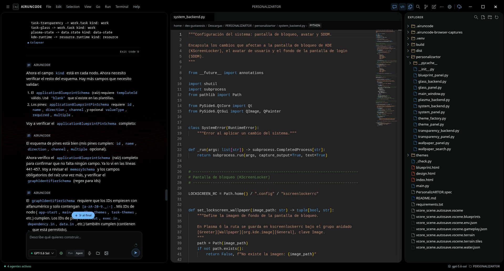
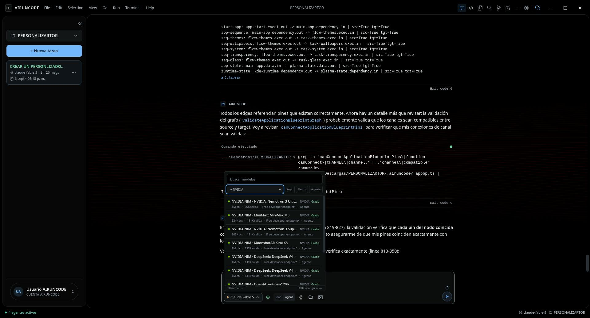
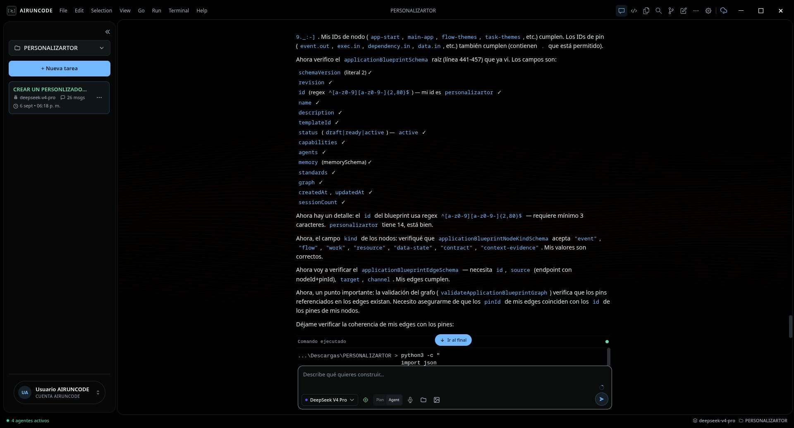

---

## 6. [Assist](https://www.producthunt.com/products/assist-4)
**Votes**: 125 | **도입 난이도**: 하 | **신뢰도**: 상
**Tagline**: Voice annotate your Mac, get screenshots + clipboard manager
**서비스 링크**: https://www.producthunt.com/r/HRQNZUNMW6OS3A

**태그**: Productivity, Mac, Utility, Workflow

### 📌 이 서비스 한눈에 보기
음성 주석, 스크린샷, 클립보드 관리를 노치에서 한 번에 해결하는 Mac 생산성 도구

### 🔑 주요 기능
- 화면 위 실시간 음성 주석 기능
- 전체 화면 스크린샷 캡처 기능
- 노치 영역을 활용한 클립보드 관리

### 🙋 사용자에게 어떤 점이 좋은가
화면 캡처와 메모, 복사한 텍스트 관리를 별도 앱 이동 없이 맥 상단에서 직관적으로 처리할 수 있습니다.

### ✅ 지금 바로 써볼 기능
- 음성 주석 기능으로 화면에 아이디어 기록하기
- 전체 화면 스크린샷 찍어보기
- 노치에서 클립보드 히스토리 확인하기

### ⚠️ 사용 전 확인할 점
- 노치 디자인을 활용하므로 해당 영역이 있는 Mac 모델에 최적화되어 있을 수 있음
- 음성 입력 기능 사용 시 마이크 권한 설정 필요

### 🧭 확인이 더 필요한 정보
상세한 시스템 리소스 점유율이나 타 앱과의 단축키 충돌 여부는 확인이 필요합니다.

### 📸 스크린샷 및 갤러리
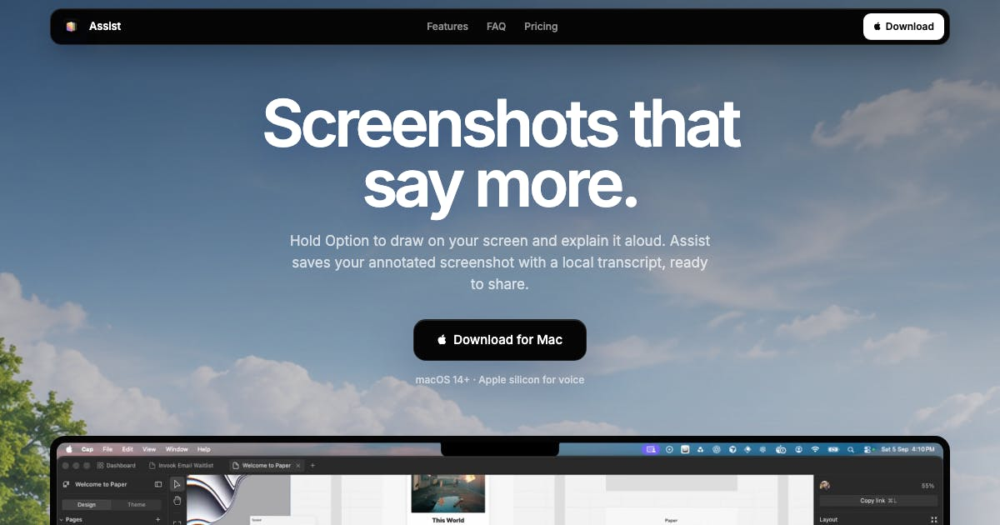
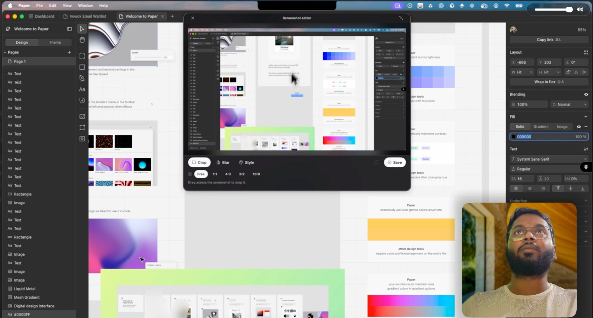
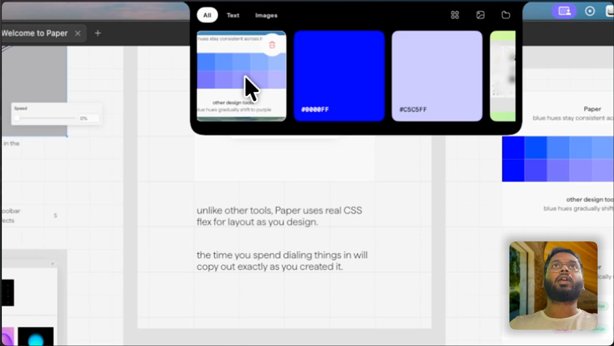

### 🎬 관련 영상
- [🎥 영상 보기](https://ph-files.imgix.net/ecc14afa-acad-476f-a235-08b1289edf88.jpeg?auto=format)

---

## 7. [Bloop](https://www.producthunt.com/products/bloop-4)
**Votes**: 120 | **도입 난이도**: 하 | **신뢰도**: 상
**Tagline**: Turn any Mac audio into a visual you can actually export
**서비스 링크**: https://www.producthunt.com/r/OMY2BYVJ7FLV5O

**태그**: CreativeTool, AudioVisualizer, MacApp, VideoProduction, Video

### 📌 이 서비스 한눈에 보기
Mac 시스템 오디오를 실시간 시각화 영상으로 변환해주는 셰이더 기반 오디오 비주얼라이저

### 🔑 주요 기능
- 시스템 오디오 및 마이크 입력을 8가지 실시간 셰이더 스킨으로 시각화
- 음악 플레이리스트를 완성된 영상 파일로 즉시 내보내기 가능
- Apple Silicon 최적화 및 구독 없는 단판 결제 방식

### 🙋 사용자에게 어떤 점이 좋은가
음악이나 오디오 콘텐츠를 시각적 요소와 결합해 영상으로 만들고 싶은 크리에이터에게 유용하며, 미니 플레이어를 통해 작업 중에도 간편하게 사용할 수 있습니다.

### ✅ 지금 바로 써볼 기능
- 무료로 제공되는 2가지 스킨으로 실시간 반응 확인하기
- MP3 플레이리스트를 업로드하여 전체 영상 내보내기 테스트하기
- 미니 플레이어와 메뉴 바 모드를 활용해 작업 환경에 배치하기

### ⚠️ 사용 전 확인할 점
- 무료 버전은 2개의 스킨만 제공되므로 전체 기능을 쓰려면 구매 필요
- Mac 전용 앱이므로 Windows 환경에서는 사용 불가

### 🧭 확인이 더 필요한 정보
전체 스킨 사용 및 모든 기능을 이용하기 위한 유료 구매 가격 정보가 명시되지 않았습니다.

### 📸 스크린샷 및 갤러리
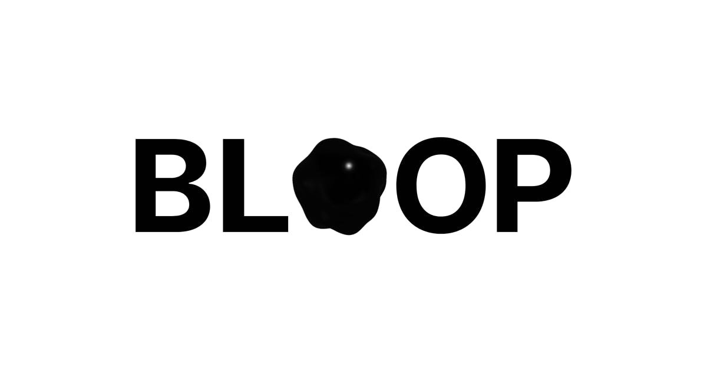

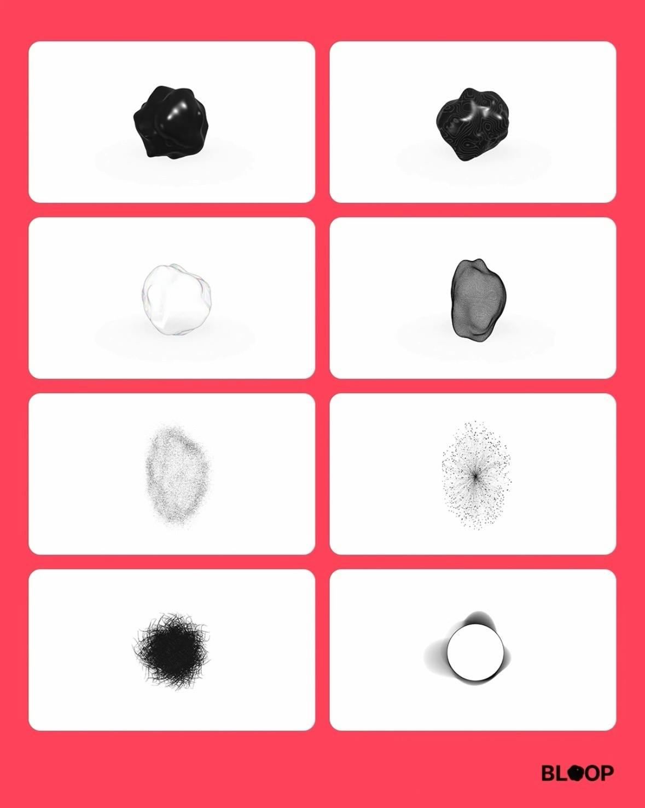

### 🎬 관련 영상
- [🎥 영상 보기](https://ph-files.imgix.net/745f1549-fc87-4748-99b8-dcaa6287a0a9.jpeg?auto=format)
- [🎥 영상 보기](https://ph-files.imgix.net/c73e4d88-2e0b-4be5-9707-3948584f8e3e.jpeg?auto=format)

---

## 8. [Clipnote](https://www.producthunt.com/products/clipnote-2)
**Votes**: 107 | **도입 난이도**: 하 | **신뢰도**: 상
**Tagline**: Save your AI conversations so they persist after closing tab
**서비스 링크**: https://www.producthunt.com/r/VPDNSBR7DX5UL4

**태그**: Productivity, AI, Note-taking, Workflow, AI Tool, Chat

### 📌 이 서비스 한눈에 보기
브라우저 탭을 닫아도 사라지는 AI 대화 내용을 즉시 저장하고 보관하는 메모장

### 🔑 주요 기능
- ChatGPT 및 Claude 대화 내용의 영구 저장 기능
- 명령어나 복사-붙여넣기를 통한 간편한 저장 방식
- 나중에 다시 돌아와 대화를 이어갈 수 있는 워크플로우 제공

### 🙋 사용자에게 어떤 점이 좋은가
대화 기록이 사라지는 불편함 없이 중요한 AI 답변을 즉시 기록하고, 나중에 언제든 다시 확인하며 작업을 이어갈 수 있습니다.

### ✅ 지금 바로 써볼 기능
- 중요한 AI 답변을 'save this' 명령어로 저장하기
- 필요한 대화 내용을 복사하여 Clipnote에 보관하기
- 저장된 메모를 통해 이전 대화 맥락 복기하기

### ⚠️ 사용 전 확인할 점
- 브라우저 탭 종료 시 데이터 유실을 방지하기 위한 저장 방식의 안정성 확인 필요
- AI 서비스 자체의 대화 기록 기능과 Clipnote 저장 기능 간의 동기화 여부 확인 필요

### 🧭 확인이 더 필요한 정보
사용자의 브라우저 환경이나 특정 AI 서비스와의 연동 방식에 대한 상세 기술 정보가 부족합니다.

### 📸 스크린샷 및 갤러리
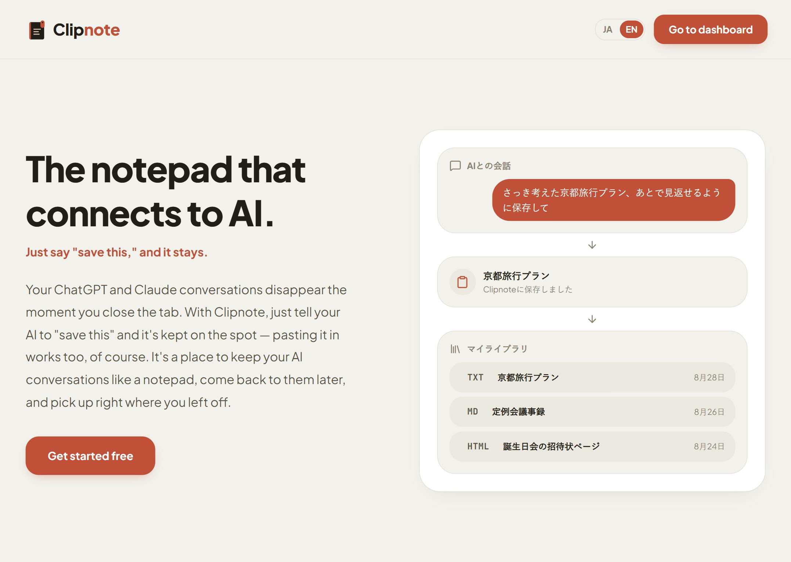
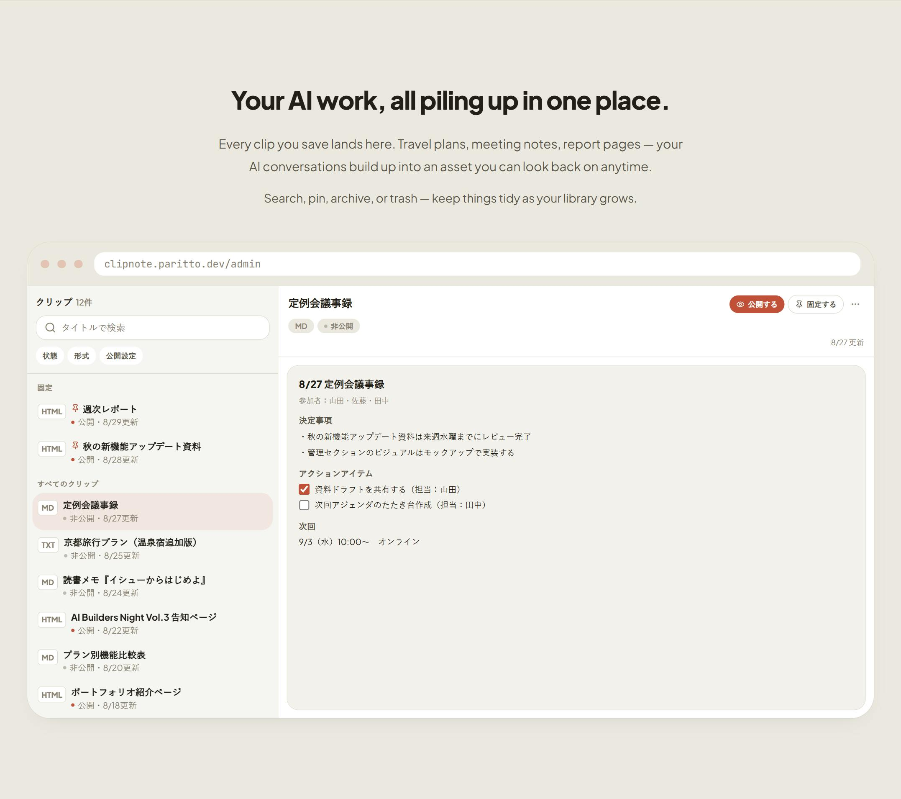
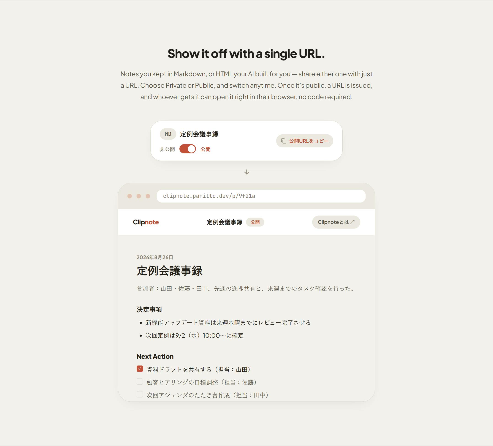

---

## 9. [Remind](https://www.producthunt.com/products/remind-7)
**Votes**: 105 | **도입 난이도**: 하 | **신뢰도**: 상
**Tagline**: Full-screen meeting reminders with AI briefings
**서비스 링크**: https://www.producthunt.com/r/PPGIUUFOH4YE66

**태그**: Productivity, AI, Workflow, Collaboration, AI Tool, Email

### 📌 이 서비스 한눈에 보기
AI 브리핑과 전체 화면 알림으로 미팅 준비를 자동화하는 생산성 도구

### 🔑 주요 기능
- 전체 화면 미팅 리마인더 및 원클릭 참여 기능
- AI 기반의 미팅 상대방 및 맥락 브리핑 제공
- Google/Microsoft 캘린더 및 Slack, Notion 등 외부 컨텍스트 연동

### 🙋 사용자에게 어떤 점이 좋은가
미팅 직전 필요한 정보를 빠르게 파악하고, 캘린더와 업무 툴의 맥락을 한눈에 확인하여 미팅 준비 시간을 단축할 수 있습니다.

### ✅ 지금 바로 써볼 기능
- 캘린더 연동을 통한 미팅 일정 동기화
- AI 브리핑 기능을 통한 미팅 상대방 파악
- Slack 및 Notion 연동으로 업무 맥락 불러오기

### ⚠️ 사용 전 확인할 점
- macOS 14 이상의 운영체제 필요
- 유료 구독 모델(연 $19.99) 및 7일 무료 체험 기간 확인 필요

### 🧭 확인이 더 필요한 정보
사용자의 개인 데이터(이메일, Slack 등)가 AI 브리핑을 위해 어떻게 처리되고 보안이 유지되는지 확인이 필요합니다.

### 📸 스크린샷 및 갤러리

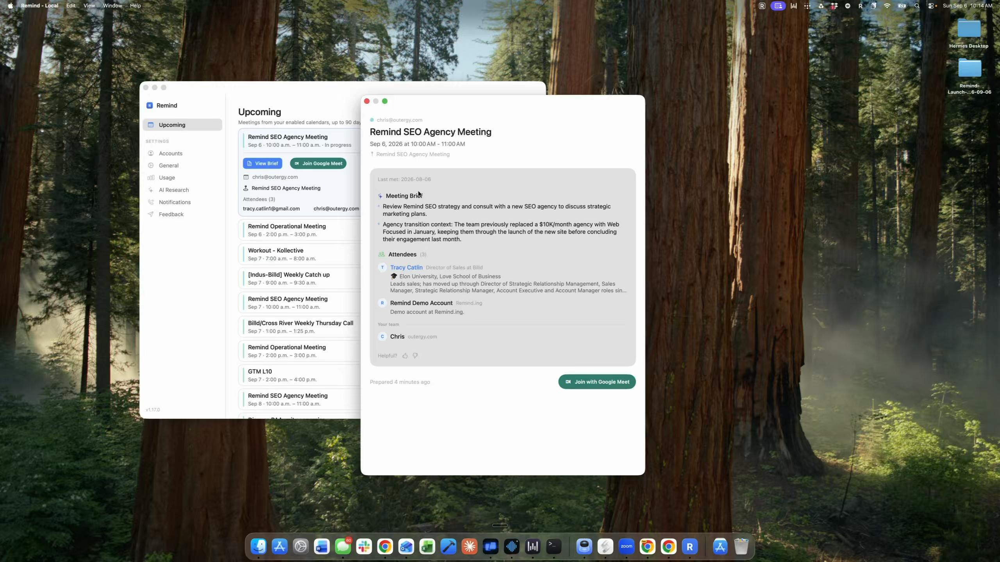
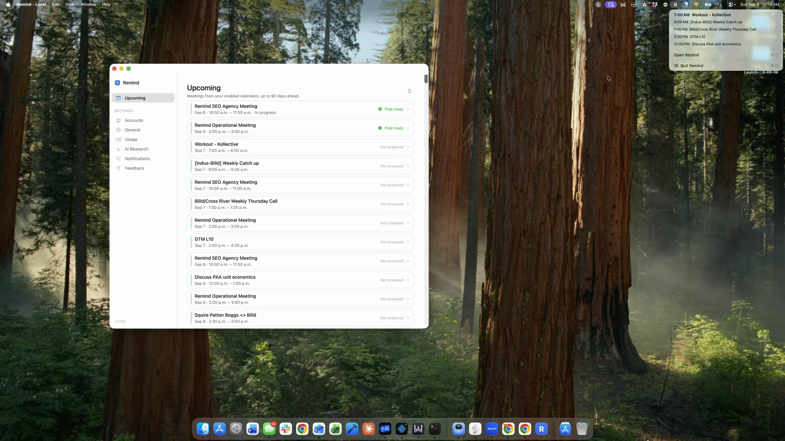

---

## 10. [Nina by Antalpha](https://www.producthunt.com/products/antalpha)
**Votes**: 101 | **도입 난이도**: 하 | **신뢰도**: 상
**Tagline**: Non-custodial AI Agent: research, predict & trade crypto
**서비스 링크**: https://www.producthunt.com/r/CC7TGEK5H6UJIY

**태그**: AI, Trading, Crypto, FinTech, Analytics, Agent, AI Tool, Chat

### 📌 이 서비스 한눈에 보기
실시간 데이터 기반의 비수탁형 AI 에이전트로, 복잡한 분석부터 트레이딩까지 대화로 해결하는 투자 어시스턴트

### 🔑 주요 기능
- 비수탁형(Non-custodial) 방식: 사용자의 지갑에서 직접 서명하여 자산 보안 유지
- 기관급 실시간 데이터: 텍스트 나열 대신 차트와 결론 중심의 직관적인 정보 제공
- 통합 투자 환경: 암호화폐와 미국 주식 시장 분석, 스마트 머니 추적, 예측 기능 제공

### 🙋 사용자에게 어떤 점이 좋은가
복잡한 차트 분석과 시장 조사를 AI와 대화하며 쉽고 빠르게 수행할 수 있으며, 분석 결과에 따른 트레이딩 초안을 즉시 생성할 수 있습니다.

### ✅ 지금 바로 써볼 기능
- 자연어로 시장 분석 및 예측 질문하기
- 제안된 트레이딩 초안 검토 및 지갑 서명하기
- Sentinel 24/7 알림 설정으로 시장 변동성 모니터링하기

### ⚠️ 사용 전 확인할 점
- AI의 예측과 제안이 투자 손실로 이어질 수 있으므로 최종 결정은 사용자가 직접 해야 함
- 비수탁형 방식이지만 지갑 연결 및 서명 과정에서의 보안 관리가 필수적임

### 🧭 확인이 더 필요한 정보
제공되는 데이터의 정확도와 예측 모델의 성능 수치는 명시되지 않았으므로 실제 사용을 통한 검증이 필요합니다.

### 📸 스크린샷 및 갤러리

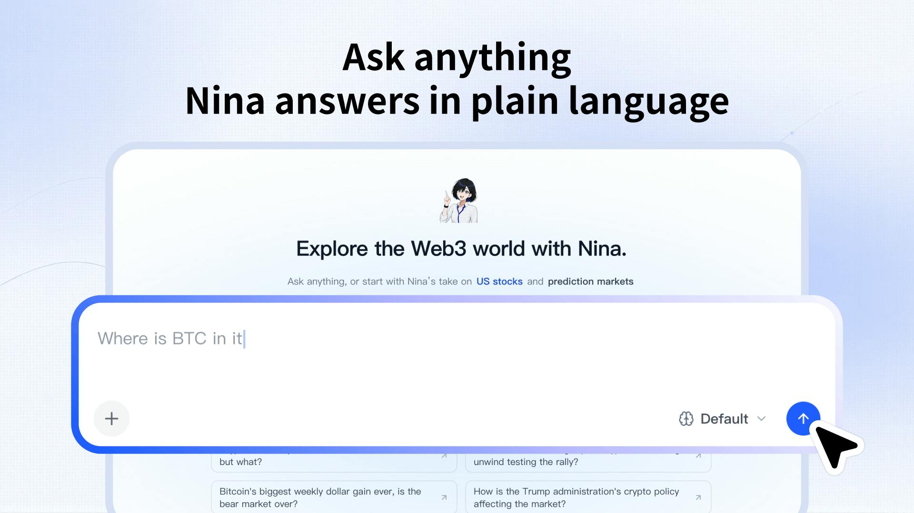
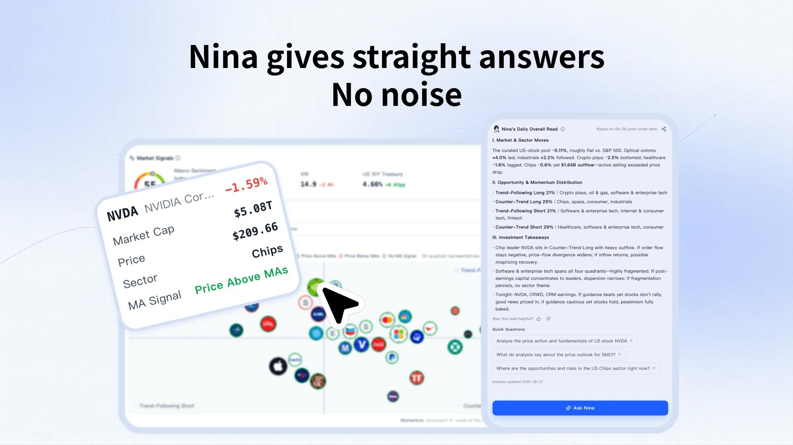

### 🎬 관련 영상
- [🎥 영상 보기](https://ph-files.imgix.net/c3f0d39a-621f-4eed-8772-1d2a649f36e6.jpeg?auto=format)

---

## 11. [SwiftXR](https://www.producthunt.com/products/swiftxr)
**Votes**: 14 | **도입 난이도**: 하 | **신뢰도**: 상
**Tagline**: Create interactive 3D, AR and VR experiences with AI
**서비스 링크**: https://www.producthunt.com/r/3ZQGVM32PD23XZ

**태그**: NoCode, 3D/AR/VR, AI, MarketingTool, AI Tool, Analytics

### 📌 이 서비스 한눈에 보기
AI 대화만으로 코딩 없이 몰입형 3D, AR, VR 경험을 제작하는 도구

### 🔑 주요 기능
- SwiftXR Assistant를 통한 대화형 3D 모델링 및 환경 설정
- 웹사이트 및 스토어에 즉시 배포 가능한 인터랙티브 콘텐츠 생성
- 사용자 참여도 측정을 위한 개선된 분석 기능 제공

### 🙋 사용자에게 어떤 점이 좋은가
코딩 지식 없이도 AI와 대화하며 고품질의 AR/VR 콘텐츠를 만들 수 있어, 제품 미리보기나 마케팅용 3D 경험을 빠르게 구축할 수 있습니다.

### ✅ 지금 바로 써볼 기능
- SwiftXR Assistant로 원하는 3D 장면 묘사하기
- 대화를 통해 조명, 카메라 각도, 색상 세부 조정하기
- 생성된 콘텐츠를 웹사이트에 게시하여 배포하기

### ⚠️ 사용 전 확인할 점
- AI 생성 결과물의 정밀도가 복잡한 설계 요구사항을 충족하는지 확인 필요
- 웹 배포 시 타겟 디바이스의 성능 및 호환성 검토 필요

### 🧭 확인이 더 필요한 정보
AI가 생성하는 3D 모델의 데이터 형식 및 외부 3D 에셋과의 호환성 범위에 대한 상세 정보가 필요합니다.

### 📸 스크린샷 및 갤러리
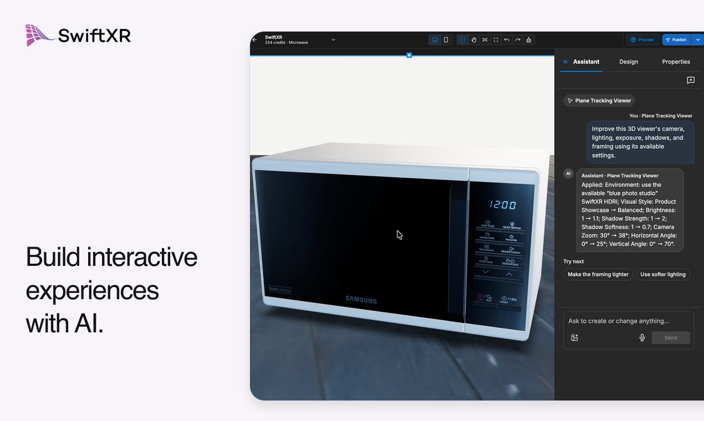
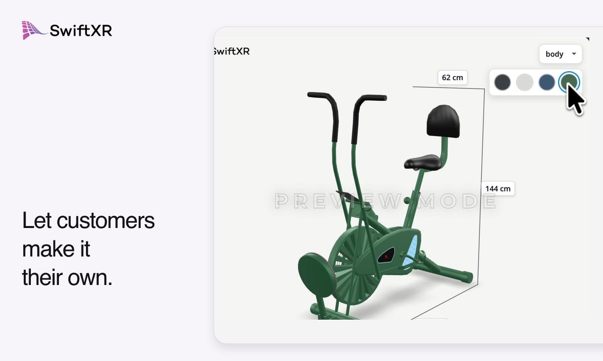
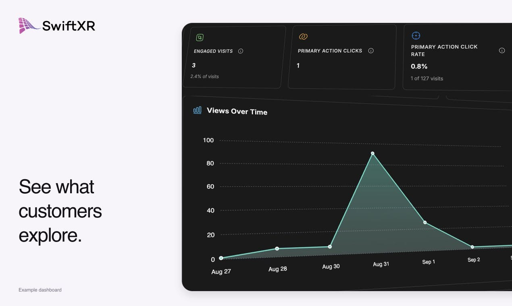

### 🎬 관련 영상
- [🎥 영상 보기](https://ph-files.imgix.net/124ca975-9e11-40a2-aff3-0fb0ff41c15a.jpeg?auto=format)

---

## 12. [BotLinx](https://www.producthunt.com/products/botlinx)
**Votes**: 13 | **도입 난이도**: 하 | **신뢰도**: 상
**Tagline**: Build an AI support chatbot from your docs and website
**서비스 링크**: https://www.producthunt.com/r/QAWQ3FL66IFNH6

**태그**: AI, Customer Support, Automation, NoCode, AI Tool, Chat

### 📌 이 서비스 한눈에 보기
문서와 웹사이트 데이터를 활용해 몇 분 만에 구축하는 AI 고객 지원 챗봇

### 🔑 주요 기능
- PDF 및 웹사이트 데이터를 활용한 지식 베이스 학습
- 고객 지원 자동화를 위한 스마트 AI 챗봇 제공
- 간편한 임베딩을 통한 빠른 웹사이트 적용

### 🙋 사용자에게 어떤 점이 좋은가
문서 기반의 자동 응답 시스템을 통해 고객 지원 업무를 자동화하고 웹사이트 방문자에게 즉각적인 답변을 제공할 수 있습니다.

### ✅ 지금 바로 써볼 기능
- 보유 중인 PDF 문서 업로드하여 학습시키기
- 웹사이트 URL 연결하여 지식 베이스 구축하기
- 생성된 챗봇을 웹사이트에 임베딩하기

### ⚠️ 사용 전 확인할 점
- 학습 데이터의 품질에 따라 답변 정확도가 달라질 수 있음
- 복잡한 고객 문의 처리를 위한 세부 설정 기능 확인 필요

### 🧭 확인이 더 필요한 정보
상세한 기능 범위와 외부 서비스 연동 가능 여부는 공식 문서를 통해 확인이 필요합니다.

### 📸 스크린샷 및 갤러리
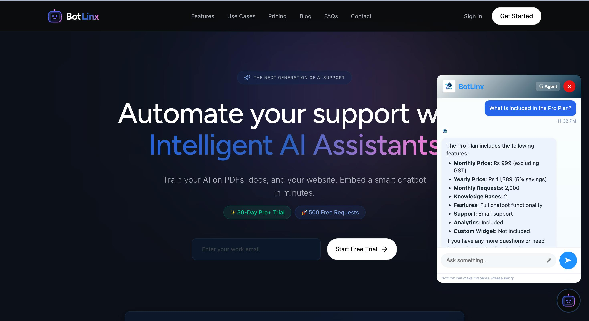
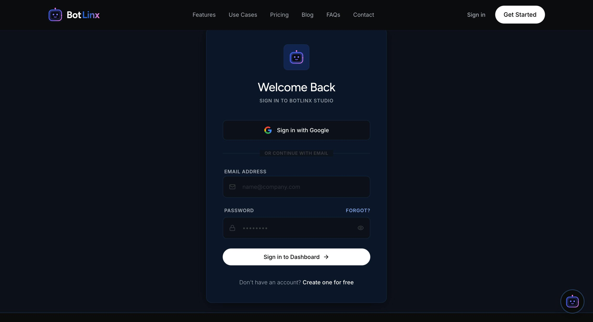
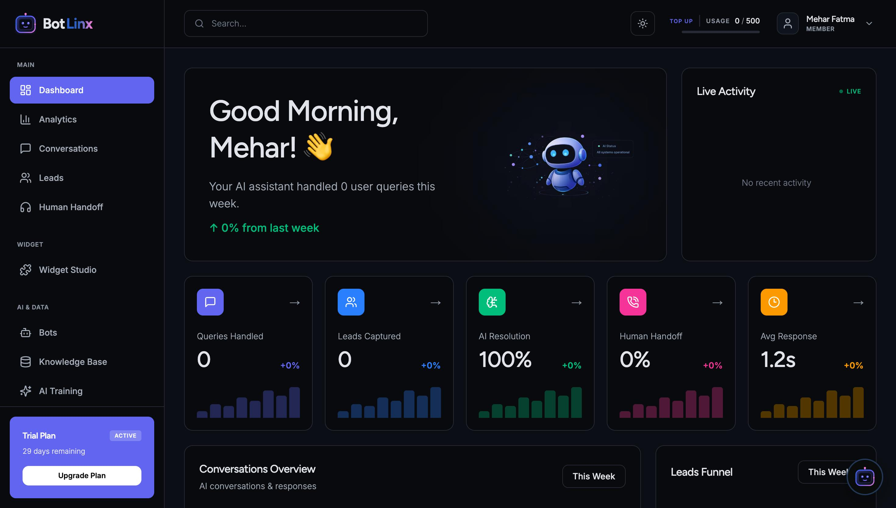

### 🎬 관련 영상
- [🎥 영상 보기](https://ph-files.imgix.net/560383d3-fec6-428e-8a2a-a73502cfbd26.jpeg?auto=format)

---

## 13. [Dash to Cart 2.0](https://www.producthunt.com/products/dash-to-cart)
**Votes**: 13 | **도입 난이도**: 하 | **신뢰도**: 상
**Tagline**: Hyperlightweight DTC commerce with built-in discovery
**서비스 링크**: https://www.producthunt.com/r/ZRNRJNNAD4Q73A

**태그**: E-commerce, DTC, SaaS, Analytics, Automation, AI Tool, Email

### 📌 이 서비스 한눈에 보기
복잡한 스택 없이 가볍게 시작하고 발견까지 연결되는 올인원 이커머스 솔루션

### 🔑 주요 기능
- 가벼운 구조로 설계된 차세대 DTC(Direct-to-Consumer) 커머스 플랫폼
- 자체 디스커버리 기능을 통한 제품 노출 및 Google Merchant Centre 연동 지원
- 결제(Stripe), 세금, 배송, 픽업 및 AI 기반 분석까지 통합 관리

### 🙋 사용자에게 어떤 점이 좋은가
무거운 이커머스 솔루션 대신 핵심 기능에 집중하여 빠르게 스토어를 구축하고, 분석과 마케팅을 한 곳에서 해결할 수 있습니다.

### ✅ 지금 바로 써볼 기능
- 스토어 구축 및 제품 등록
- Google Merchant Centre 동기화 설정
- Stripe를 통한 결제 및 배송 설정

### ⚠️ 사용 전 확인할 점
- 기존의 대규모 이커머스 플랫폼(Shopify 등) 대비 기능적 제약이 있을 수 있음
- 특정 결제 및 배송 방식에 대한 의존도 확인 필요

### 🧭 확인이 더 필요한 정보
플랫폼의 확장성 및 타 외부 서비스와의 상세 연동 범위에 대한 정보가 추가로 필요합니다.

### 📸 스크린샷 및 갤러리
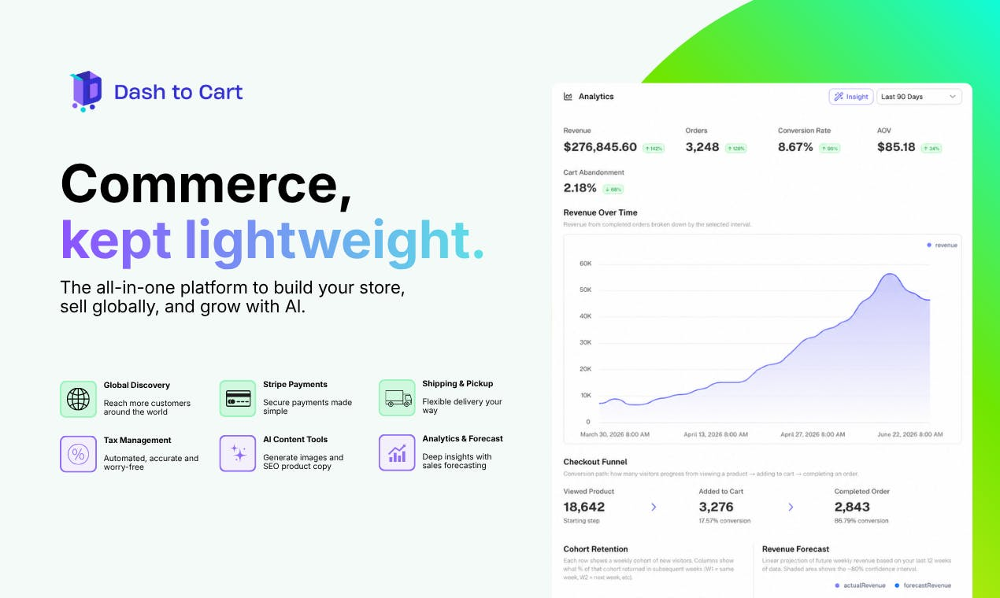
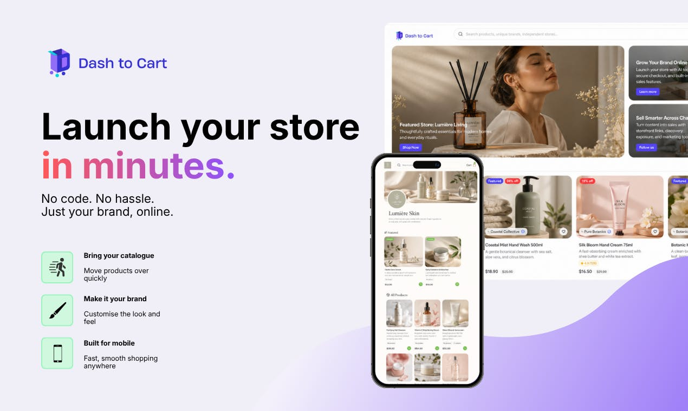
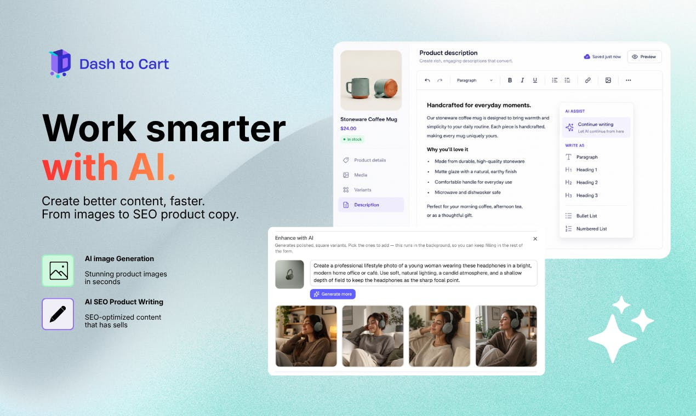

### 🎬 관련 영상
- [🎥 영상 보기](https://ph-files.imgix.net/d2afa589-61c7-496d-89b4-294db338ba63.jpeg?auto=format)

---

## 14. [Capslane](https://www.producthunt.com/products/capslane)
**Votes**: 13 | **도입 난이도**: 하 | **신뢰도**: 상
**Tagline**: Reliable YouTube transcripts through one API
**서비스 링크**: https://www.producthunt.com/r/S36IF2DPBX5VZR

**태그**: DevTool, Automation, API, YouTube, AI Tool

### 📌 이 서비스 한눈에 보기
안정적인 YouTube 자막 추출 및 자동 생성을 지원하는 개발자용 API

### 🔑 주요 기능
- 기존 자막 우선 제공 및 누락 시 자동 타임스탬프 기반 텍스트 생성
- Plain text 또는 구조화된 세그먼트 형식 지원
- JavaScript, Python, MCP, n8n 등 다양한 환경에서의 연결성

### 🙋 사용자에게 어떤 점이 좋은가
개발자가 복잡한 YouTube 스크래핑 과정 없이 API 호출만으로 신뢰할 수 있는 자막 데이터를 즉시 확보할 수 있습니다.

### ✅ 지금 바로 써볼 기능
- 월 50회 무료 요청으로 API 성능 테스트하기
- 원하는 언어 설정 및 데이터 구조(Plain text vs Structured) 확인하기
- 사용 중인 워크플로우(Python, n8n 등)에 API 연결하기

### ⚠️ 사용 전 확인할 점
- 무료 플랜은 월 50회로 제한적임
- 자동 생성된 자막의 정확도는 원본 영상의 음질에 따라 다를 수 있음

### 🧭 확인이 더 필요한 정보
자동 생성된 자막의 정확도 및 대량 요청 시의 비용 구조에 대한 상세 정보가 필요합니다.

### 📸 스크린샷 및 갤러리

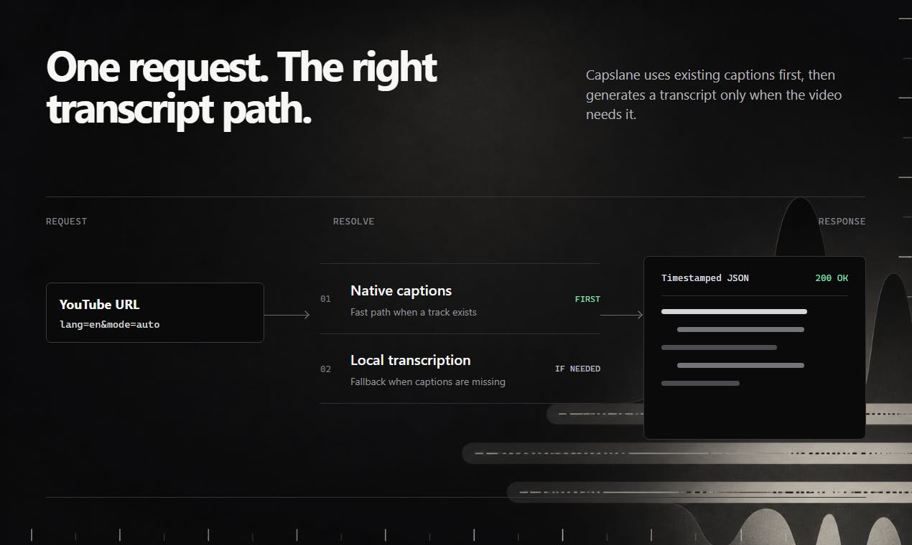
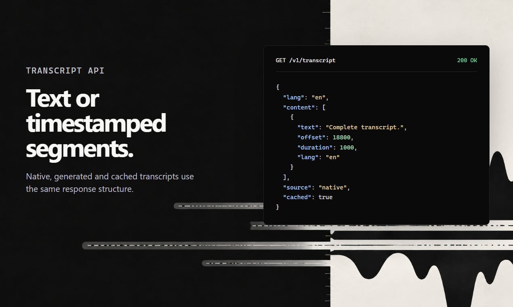

### 🎬 관련 영상
- [🎥 영상 보기](https://ph-files.imgix.net/3f3a683b-0ef6-4ab1-802a-4cd5dd9f56fb.jpeg?auto=format)

---

## 15. [Lexfall](https://www.producthunt.com/products/lexfall-advanced-english-learning)
**Votes**: 11 | **도입 난이도**: 하 | **신뢰도**: 상
**Tagline**: Speak like you belong in the room.
**서비스 링크**: https://www.producthunt.com/r/MK3U2YYW6L6SC3

**태그**: Productivity, Education, Language Learning, Professional

### 📌 이 서비스 한눈에 보기
전문직 종사자를 위한 고난도 어휘 학습 및 홈 화면 위젯 기반의 미니멀리즘 영어 학습 앱

### 🔑 주요 기능
- 의학, 법률, 비즈니스 등 전문 분야별 B2–C2 수준의 고급 어휘 제공
- 일상 영어를 넘어 전문적인 맥락에서의 뉘앙스 차이 학습
- 홈 화면 위젯을 통해 몇 시간 간격으로 새로운 단어를 학습하는 미니멀한 방식

### 🙋 사용자에게 어떤 점이 좋은가
전문적인 의사결정 상황에서 자신의 전문성을 어휘로 온전히 전달하고 싶은 전문가들에게 유용합니다.

### ✅ 지금 바로 써볼 기능
- 홈 화면 위젯 설정하여 주기적인 어휘 노출 환경 만들기
- 자신의 직업군(의학, 법률, 비즈니스 등)에 맞는 카테고리 탐색하기

### ⚠️ 사용 전 확인할 점
- 기초 영어 학습자보다는 이미 유창한 수준의 사용자를 대상으로 설계됨
- 전문 용어 중심이므로 일반적인 일상 회화 학습에는 적합하지 않을 수 있음

### 🧭 확인이 더 필요한 정보
사용자의 현재 영어 수준에 따른 맞춤형 학습 경로 제공 여부는 명시되지 않았습니다.

### 📸 스크린샷 및 갤러리
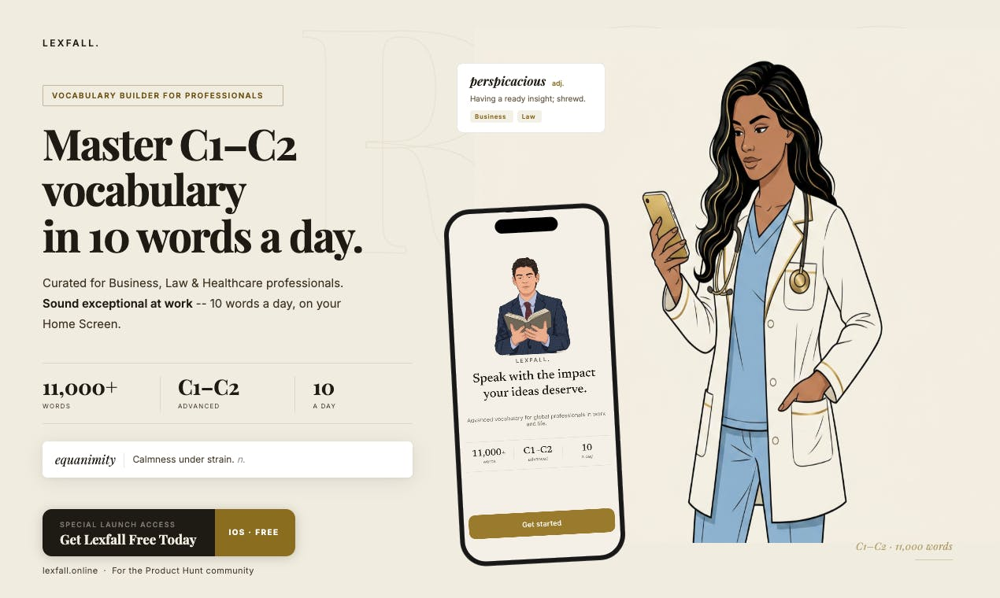
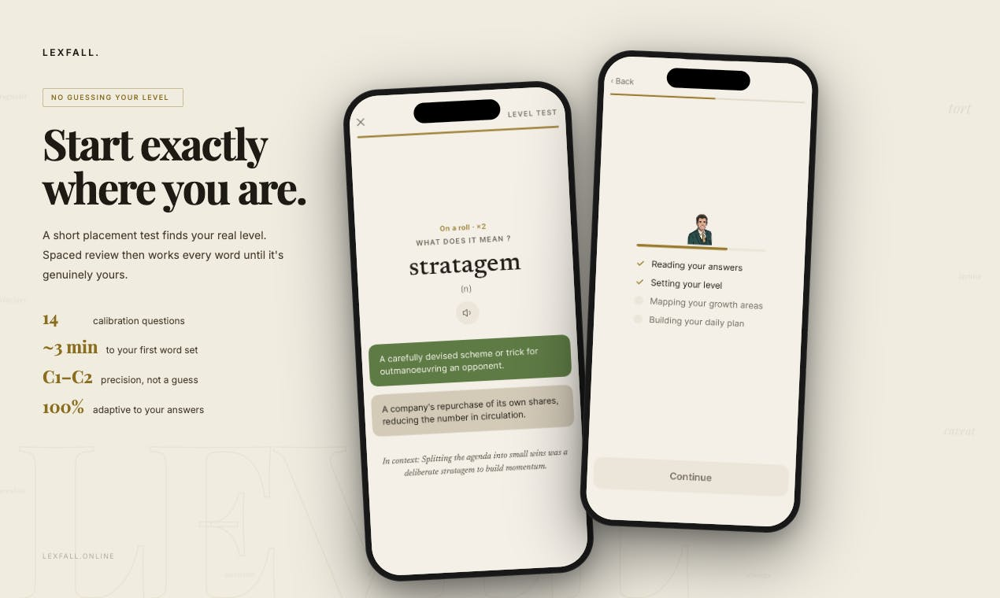

---

## 16. [Undeadlines](https://www.producthunt.com/products/undeadlines)
**Votes**: 11 | **도입 난이도**: 하 | **신뢰도**: 상
**Tagline**: Kill your tasks before they kill you
**서비스 링크**: https://www.producthunt.com/r/DW6MUYA4HS2BGJ

**태그**: Productivity, Planner, Gamification, Task Management

### 📌 이 서비스 한눈에 보기
마감 기한을 좀비의 거리로 시각화하여 직관적으로 관리하는 주간 플래너

### 🔑 주요 기능
- 거리 기반의 직관적인 마감 기한 시각화
- 단순함에 집중한 주간 단위 플래너
- 긴박감을 유도하는 게임화(Gamification) 요소

### 🙋 사용자에게 어떤 점이 좋은가
마감일이 다가올수록 가까워지는 좀비라는 시각적 장치를 통해 업무의 우선순위를 즉각적으로 파악할 수 있습니다.

### ✅ 지금 바로 써볼 기능
- 주간 할 일 목록 입력하기
- 좀비 거리로 표현되는 마감 기한 확인하기
- 가장 가까운 좀비(업무) 처리하기

### ⚠️ 사용 전 확인할 점
- 복잡한 프로젝트 관리나 세부 일정 관리에는 부적합할 수 있음
- 시각적 요소가 업무 집중도에 미치는 개인차 존재

### 🧭 확인이 더 필요한 정보
상세한 기능 구성 및 플랫폼 지원 여부에 대한 정보가 부족합니다.

### 📸 스크린샷 및 갤러리
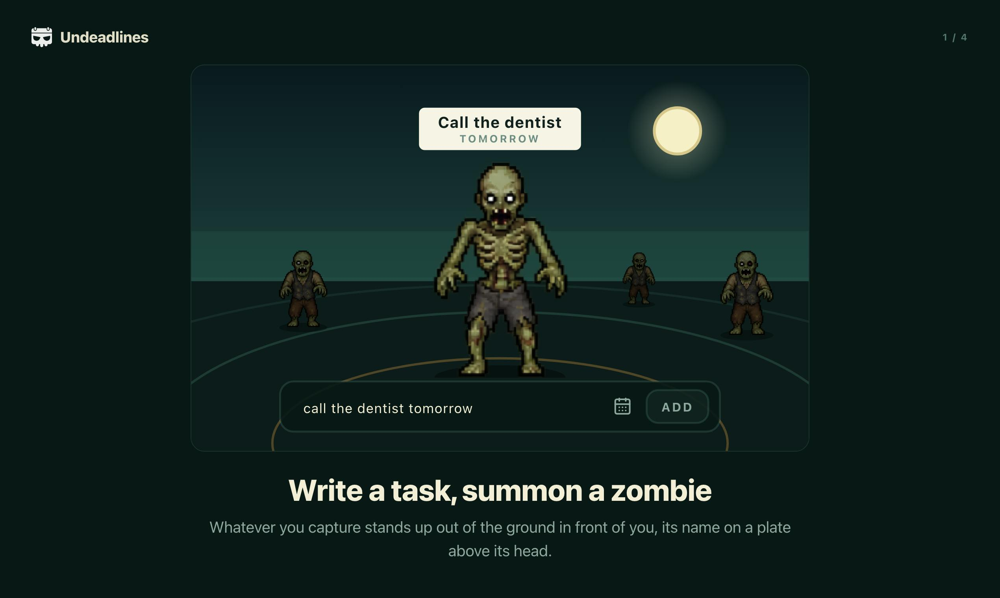
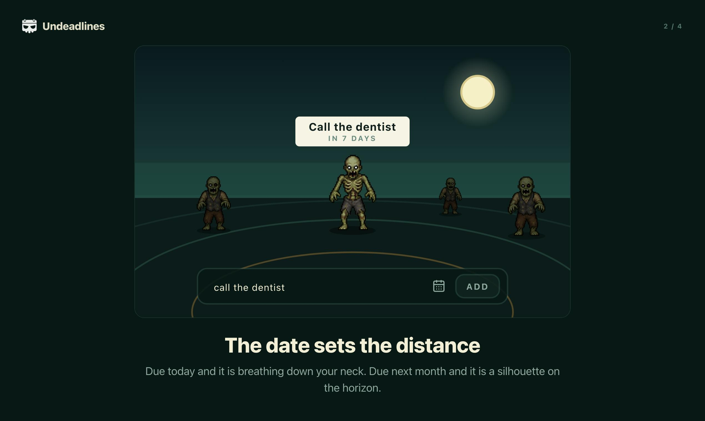
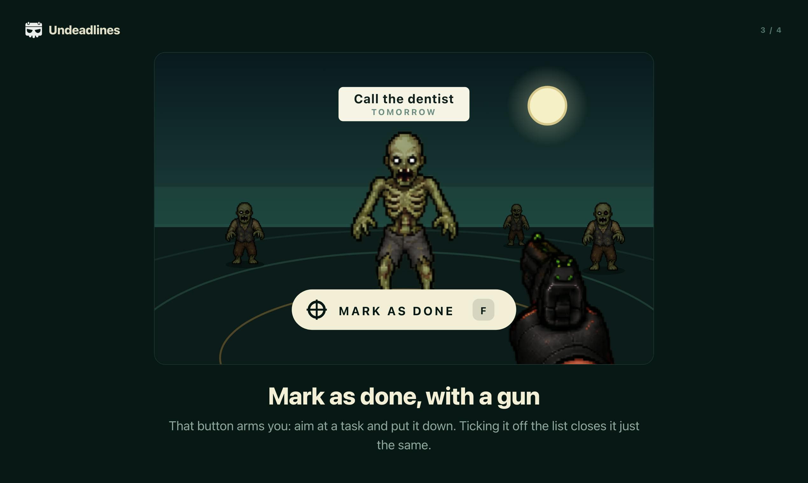

### 🎬 관련 영상
- [🎥 영상 보기](https://ph-files.imgix.net/8074fd07-936a-4520-a089-910cccaded76.jpeg?auto=format)

---

## 17. [CosmoDex](https://www.producthunt.com/products/cosmodex)
**Votes**: 11 | **도입 난이도**: 하 | **신뢰도**: 상
**Tagline**: World's 1st AI-powered Gamified, competitive Coding Platform
**서비스 링크**: https://www.producthunt.com/r/OFP7SFJRYAXZYX

**태그**: EdTech, Coding, Gamification, AI, Python, AI Tool, DevTool

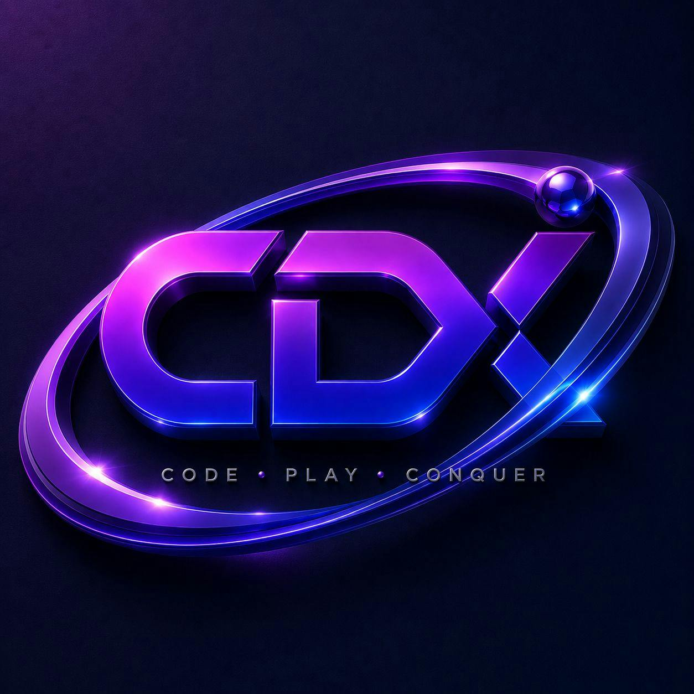

### 📌 이 서비스 한눈에 보기
게임처럼 즐기며 Python과 SQL을 배우는 AI 기반 경쟁형 코딩 플랫폼

### 🔑 주요 기능
- AI 기반의 게임화된 코딩 학습 경험 제공
- 실시간 1대1 배틀 및 리그 시스템을 통한 경쟁적 학습
- Python 및 SQL 중심의 실전 문제 해결형 커리큘럼

### 🙋 사용자에게 어떤 점이 좋은가
지루한 코딩 공부를 게임처럼 즐길 수 있어 학습 동기를 유지하기 좋으며, 실시간 대전을 통해 자신의 실력을 즉각 검증할 수 있습니다.

### ✅ 지금 바로 써볼 기능
- Python/SQL 기초 챌린지 도전하기
- XP를 쌓아 Cosmic League 랭킹 진입하기
- 실시간 1v1 Space Battles 참여하기

### ⚠️ 사용 전 확인할 점
- 게임 요소에 집중하느라 심도 있는 이론 학습이 부족할 수 있음
- 경쟁 중심 환경이 초보자에게 압박감을 줄 수 있음

### 🧭 확인이 더 필요한 정보
제공되는 문제의 난이도 범위와 고급 프로그래밍 언어 지원 여부를 확인해야 합니다.

### 📸 스크린샷 및 갤러리
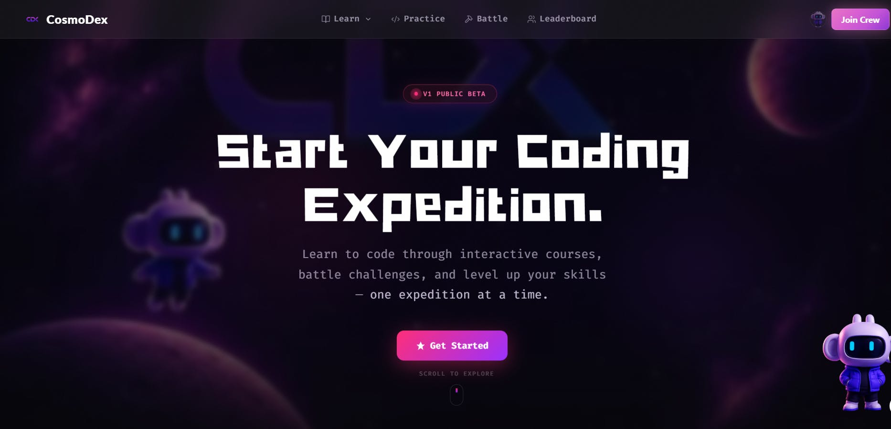
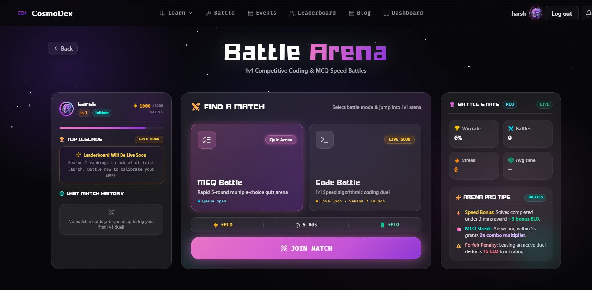

---

## 18. [Kitiz](https://www.producthunt.com/products/kitiz)
**Votes**: 10 | **도입 난이도**: 하 | **신뢰도**: 상
**Tagline**: Collect 51 cats and build a bond with every one
**서비스 링크**: https://www.producthunt.com/r/NW6MNUWNIXS6P4

**태그**: Mobile Game, Casual, Collection, Cozy Game

### 📌 이 서비스 한눈에 보기
51마리의 고양이와 교감하며 나만의 정원을 가꾸는 코지 수집 게임

### 🔑 주요 기능
- 51마리의 독특한 고양이 수집 및 드레스업
- 낚시, 요리, 정원 가꾸기 등 다양한 힐링 콘텐츠
- 사용자의 이야기를 기억하는 대화형 관계 형성

### 🙋 사용자에게 어떤 점이 좋은가
일상 속에서 부담 없이 즐길 수 있는 아기자기한 수집형 게임을 찾는 사용자에게 적합합니다.

### ✅ 지금 바로 써볼 기능
- 51마리 고양이 수집하기
- 고양이와 대화하며 유대감 쌓기
- 나만의 정원과 요리 콘텐츠 즐기기

### ⚠️ 사용 전 확인할 점
- 모바일(iOS/Android) 환경에서만 플레이 가능
- 경쟁보다는 힐링 중심의 게임 플레이 방식

### 🧭 확인이 더 필요한 정보
게임 내 추가 과금 요소나 유료 아이템 존재 여부는 명시되지 않았습니다.

### 📸 스크린샷 및 갤러리
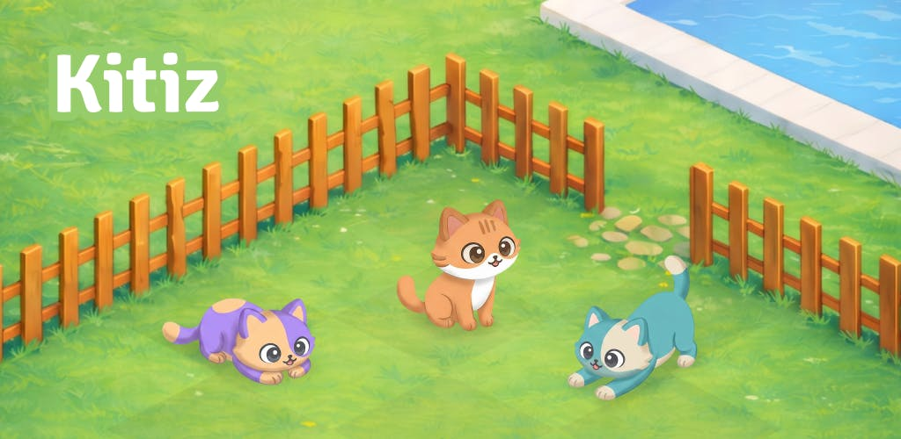
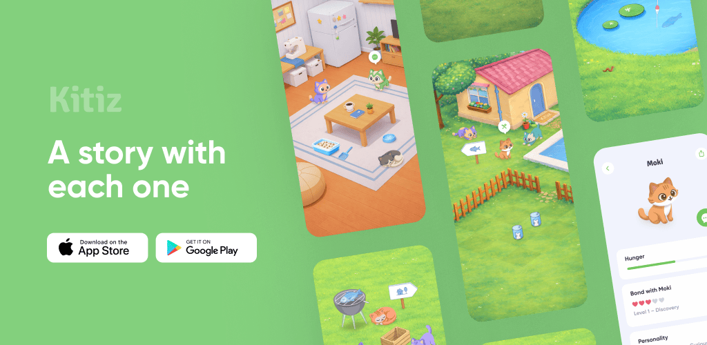

---

## 19. [MeatProcessingPlant.com](https://www.producthunt.com/products/meatprocessingplant-com)
**Votes**: 8 | **도입 난이도**: 하 | **신뢰도**: 상
**Tagline**: find a nearby meat processing plant
**서비스 링크**: https://www.producthunt.com/r/KYMON2AJUFRWAJ

**태그**: Directory, Logistics, Agriculture

### 📌 이 서비스 한눈에 보기
미국 전역의 USDA 인증 육류 가공 시설을 쉽게 찾을 수 있는 검색 서비스

### 🔑 주요 기능
- 미국 50개 주에 걸친 4,072개 육류 가공 시설 데이터 제공
- 도시, 주, 동물 유형별 맞춤형 검색 기능
- USDA 검사를 통과한 신뢰할 수 있는 시설 정보 중심

### 🙋 사용자에게 어떤 점이 좋은가
사용자는 자신의 위치나 취급하는 동물 종류에 맞는 인근 가공 시설을 빠르게 찾아 비즈니스나 개인 용도로 활용할 수 있습니다.

### ✅ 지금 바로 써볼 기능
- 현재 위치 근처의 가공 시설 검색하기
- 취급하는 동물 유형별로 필터링하여 검색하기
- 도시/주 단위로 가공 시설 분포 확인하기

### ⚠️ 사용 전 확인할 점
- 제공되는 데이터가 실시간 시설 운영 상태(영업 여부 등)를 반영하는지 확인 필요
- 특정 지역 외의 시설 정보 업데이트 주기 확인 필요

### 🧭 확인이 더 필요한 정보
시설의 현재 가동 상태나 연락처 정보의 최신성 여부를 확인해야 합니다.

### 📸 스크린샷 및 갤러리
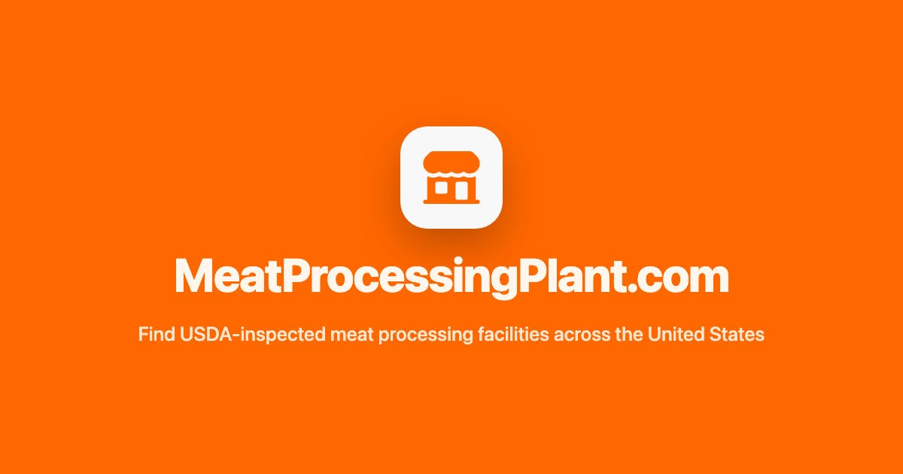

---

## 20. [LazyReel](https://www.producthunt.com/products/lazyreel)
**Votes**: 8 | **도입 난이도**: 하 | **신뢰도**: 상
**Tagline**: Record, edit and polish videos with AI on your Mac
**서비스 링크**: https://www.producthunt.com/r/C2QX7CRFD6QTGA

**태그**: VideoEditing, AI, Mac, Automation, ContentCreation, Agent, AI Tool, Video

### 📌 이 서비스 한눈에 보기
AI를 활용해 화면 녹화부터 편집까지 한 번에 해결하는 Mac용 올인원 영상 제작 도구

### 🔑 주요 기능
- 화면, 카메라, 마이크를 활용한 고화질(4K) 영상 녹화
- 자동 편집, 자막 생성, B-roll 삽입 등 AI 기반 편집 기능
- 텍스트 기반 편집 및 MCP 호환 AI 에이전트를 통한 자동 편집 지원

### 🙋 사용자에게 어떤 점이 좋은가
초보자도 복잡한 편집 과정 없이 고품질 영상을 만들 수 있으며, AI 에이전트를 통해 편집 시간을 획기적으로 단축할 수 있습니다.

### ✅ 지금 바로 써볼 기능
- Auto Edit 기능을 통한 초안 생성
- 텍스트 편집 기능을 활용한 대본 기반 컷 편집
- AI 에이전트를 활용한 자동 편집 작업 위임

### ⚠️ 사용 전 확인할 점
- Mac 전용 소프트웨어로 플랫폼 제한이 있음
- AI 자동 편집 결과물의 세밀한 검토 필요

### 🧭 확인이 더 필요한 정보
상세한 가격 정책 및 AI 에이전트의 작업 범위에 대한 정보가 명시되지 않았습니다.

### 📸 스크린샷 및 갤러리
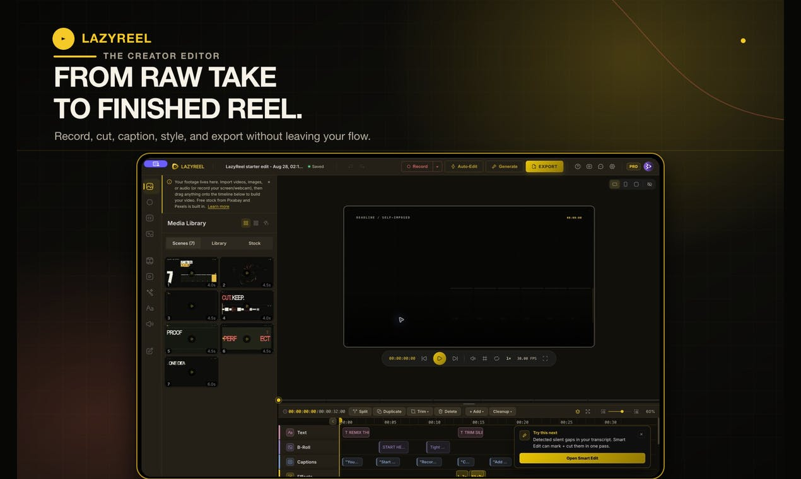
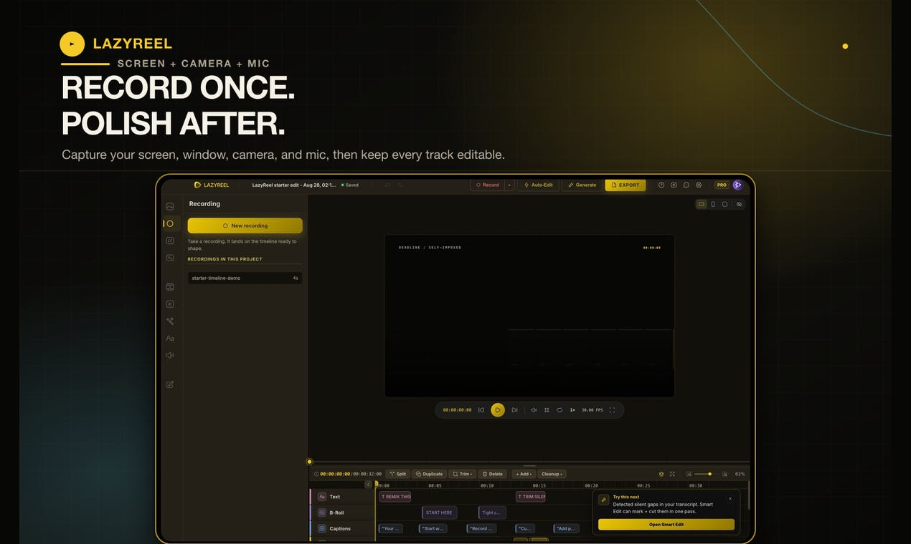
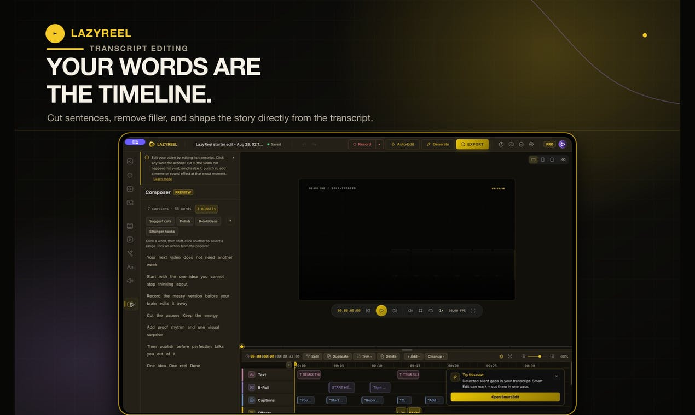

### 🎬 관련 영상
- [🎥 영상 보기](https://ph-files.imgix.net/2d89cb65-fc66-44eb-9729-9d046cbeff48.jpeg?auto=format)

---

## 21. [abha.page 2.0](https://www.producthunt.com/products/abha-page)
**Votes**: 8 | **도입 난이도**: 하 | **신뢰도**: 상
**Tagline**: Turn brand colors into a shippable design system
**서비스 링크**: https://www.producthunt.com/r/7LT4SUKYYX42W7

**태그**: DesignSystem, Frontend, UI/UX, DeveloperTool, AI Tool, Vision, Design, Marketing

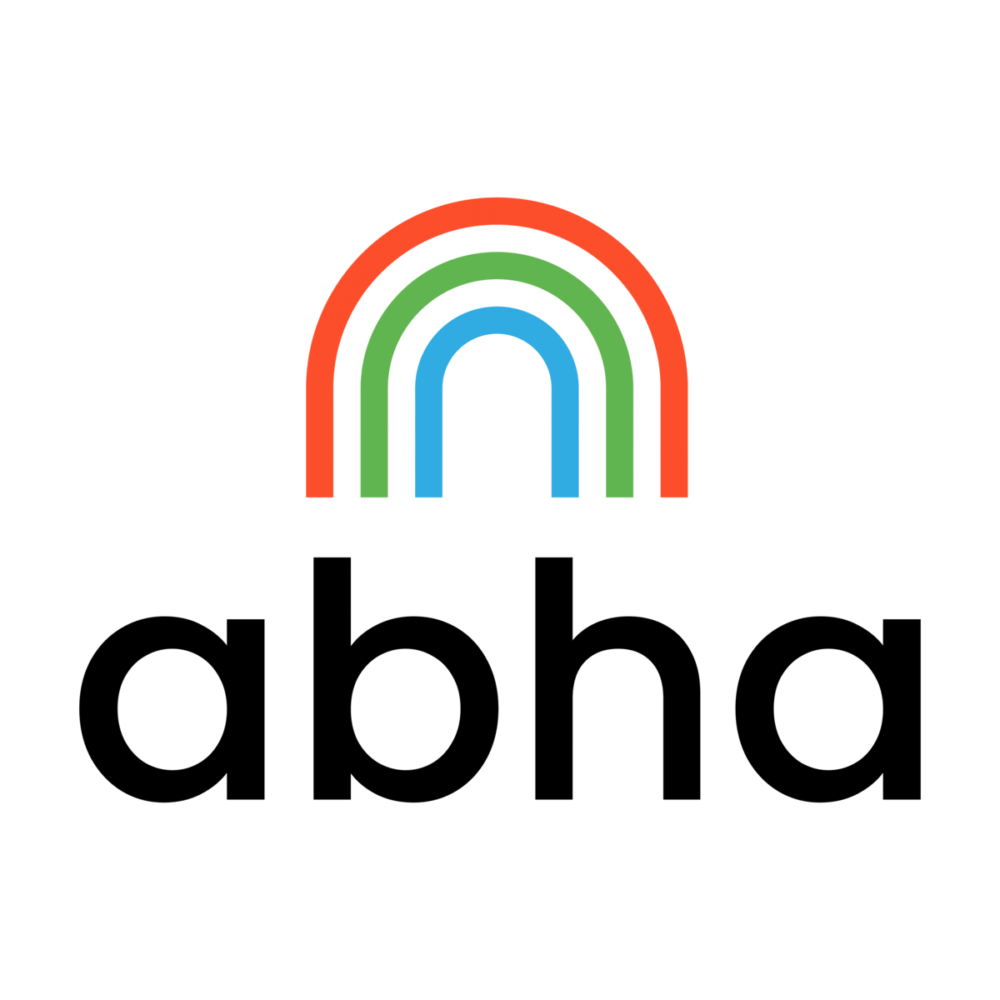

### 📌 이 서비스 한눈에 보기
브랜드 컬러 아이디어를 즉시 사용 가능한 프로덕션급 디자인 시스템으로 변환해주는 도구

### 🔑 주요 기능
- 접근성을 고려한 컬러 팔레트 생성 및 다양한 UI 환경(대시보드, 체크아웃 등)에서의 시뮬레이션
- CSS, Tailwind, Figma, iOS, Android, Flutter 등 다양한 플랫폼용 토큰 내보내기 지원
- 이미지에서 색상 추출, 방향 비교, 브랜드 북 생성 및 계정 없이 무료 사용 가능

### 🙋 사용자에게 어떤 점이 좋은가
디자인과 개발 사이의 색상 구현 격차를 줄여주며, 다양한 플랫폼에 맞는 토큰을 즉시 생성하여 작업 시간을 단축할 수 있습니다.

### ✅ 지금 바로 써볼 기능
- 이미지에서 브랜드 컬러 추출하기
- 다양한 UI 환경(다크 모드 포함)에서 컬러 테스트하기
- 필요한 플랫폼 형식(Tailwind, Figma 등)으로 토큰 내보내기

### ⚠️ 사용 전 확인할 점
- 계정 없이 사용 가능하므로 작업 내용의 영구 저장이나 협업 기능 여부 확인 필요
- 생성된 토큰이 복잡한 커스텀 디자인 시스템과 완벽히 호환되는지 검토 필요

### 🧭 확인이 더 필요한 정보
계정 없이 사용 가능한 만큼, 작업 결과물의 저장 및 관리 방식에 대한 상세 정보가 필요합니다.

### 📸 스크린샷 및 갤러리
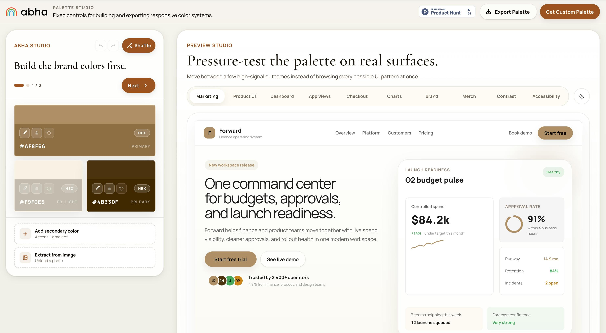
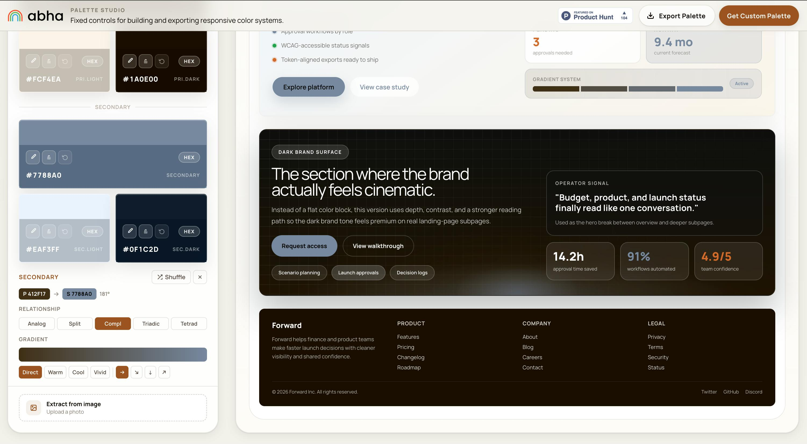
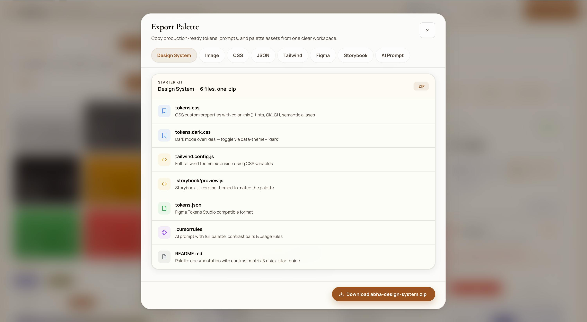

---

## 22. [LazyReel](https://www.producthunt.com/products/lazyreel)
**Votes**: 8 | **도입 난이도**: 하 | **신뢰도**: 상
**Tagline**: Record, edit and polish videos with AI on your Mac
**서비스 링크**: https://www.producthunt.com/r/C2QX7CRFD6QTGA

**태그**: VideoEditing, AI, Mac, Automation, ContentCreation, Agent, AI Tool, Video

### 📌 이 서비스 한눈에 보기
AI를 활용해 화면 녹화부터 편집까지 한 번에 해결하는 Mac용 올인원 영상 제작 도구

### 🔑 주요 기능
- 화면, 카메라, 마이크를 활용한 고화질(4K) 영상 녹화
- 자동 편집, 자막 생성, B-roll 삽입 등 AI 기반 편집 기능
- 텍스트 기반 편집 및 MCP 호환 AI 에이전트를 통한 자동 편집 지원

### 🙋 사용자에게 어떤 점이 좋은가
초보자도 복잡한 편집 과정 없이 고품질 영상을 만들 수 있으며, AI 에이전트를 통해 편집 시간을 획기적으로 단축할 수 있습니다.

### ✅ 지금 바로 써볼 기능
- Auto Edit 기능을 통한 초안 생성
- 텍스트 편집 기능을 활용한 대본 기반 컷 편집
- AI 에이전트를 활용한 자동 편집 작업 위임

### ⚠️ 사용 전 확인할 점
- Mac 전용 소프트웨어로 플랫폼 제한이 있음
- AI 자동 편집 결과물의 세밀한 검토 필요

### 🧭 확인이 더 필요한 정보
상세한 가격 정책 및 AI 에이전트의 작업 범위에 대한 정보가 명시되지 않았습니다.

### 📸 스크린샷 및 갤러리

### 🎬 관련 영상
- [🎥 영상 보기](https://ph-files.imgix.net/2d89cb65-fc66-44eb-9729-9d046cbeff48.jpeg?auto=format)

---

## 23. [MeatProcessingPlant.com](https://www.producthunt.com/products/meatprocessingplant-com)
**Votes**: 8 | **도입 난이도**: 하 | **신뢰도**: 상
**Tagline**: find a nearby meat processing plant
**서비스 링크**: https://www.producthunt.com/r/KYMON2AJUFRWAJ

**태그**: Directory, Logistics, Agriculture

### 📌 이 서비스 한눈에 보기
미국 전역의 USDA 인증 육류 가공 시설을 쉽게 찾을 수 있는 검색 서비스

### 🔑 주요 기능
- 미국 50개 주에 걸친 4,072개 육류 가공 시설 데이터 제공
- 도시, 주, 동물 유형별 맞춤형 검색 기능
- USDA 검사를 통과한 신뢰할 수 있는 시설 정보 중심

### 🙋 사용자에게 어떤 점이 좋은가
사용자는 자신의 위치나 취급하는 동물 종류에 맞는 인근 가공 시설을 빠르게 찾아 비즈니스나 개인 용도로 활용할 수 있습니다.

### ✅ 지금 바로 써볼 기능
- 현재 위치 근처의 가공 시설 검색하기
- 취급하는 동물 유형별로 필터링하여 검색하기
- 도시/주 단위로 가공 시설 분포 확인하기

### ⚠️ 사용 전 확인할 점
- 제공되는 데이터가 실시간 시설 운영 상태(영업 여부 등)를 반영하는지 확인 필요
- 특정 지역 외의 시설 정보 업데이트 주기 확인 필요

### 🧭 확인이 더 필요한 정보
시설의 현재 가동 상태나 연락처 정보의 최신성 여부를 확인해야 합니다.

### 📸 스크린샷 및 갤러리

---

## 24. [Codex Usage](https://www.producthunt.com/products/codex-usage)
**Votes**: 7 | **도입 난이도**: 하 | **신뢰도**: 상
**Tagline**: Every Codex limit, pace and reset time in your menu bar
**서비스 링크**: https://www.producthunt.com/r/2PRPNV4BLTDRBP

**태그**: DevTool, Productivity, Mac, Analytics

### 📌 이 서비스 한눈에 보기
Codex 사용량 제한과 리셋 시간을 메뉴 바에서 실시간으로 확인하는 맥용 대시보드

### 🔑 주요 기능
- 메뉴 바를 통한 실시간 사용량, 리셋 시간, 페이스 확인
- 사용 속도를 분석하여 리셋 시점을 예측하는 Pressure Check 기능
- 로컬 대시보드 및 CLI 제공으로 개인정보 보호 및 보안 강화

### 🙋 사용자에게 어떤 점이 좋은가
Codex 사용 제한에 걸리지 않도록 남은 사용량과 리셋 시간을 직관적으로 관리할 수 있어 작업 흐름이 끊기는 것을 방지합니다.

### ✅ 지금 바로 써볼 기능
- 메뉴 바에 고정하여 실시간 사용량 모니터링하기
- Pressure Check 기능을 통해 사용 페이스 조절하기
- CLI를 통해 터미널 환경에서 사용량 확인하기

### ⚠️ 사용 전 확인할 점
- Mac 메뉴 바 전용 도구이므로 다른 OS에서는 사용 불가
- Codex 계정의 사용량 데이터와 연동되는 방식에 대한 기술적 확인 필요

### 🧭 확인이 더 필요한 정보
Codex의 사용량 데이터를 어떤 방식으로 가져오는지(API 또는 로컬 로그 등)에 대한 구체적인 연동 방식이 명시되지 않았습니다.

### 📸 스크린샷 및 갤러리
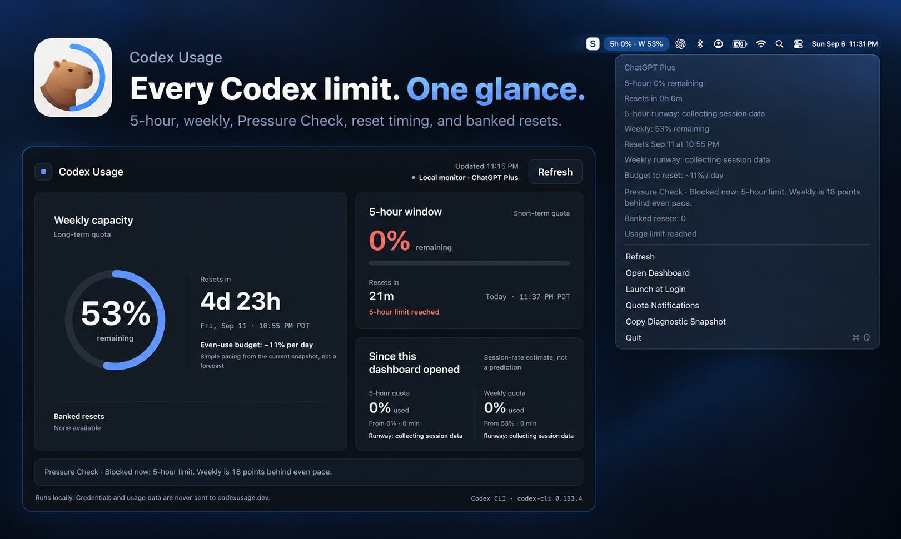
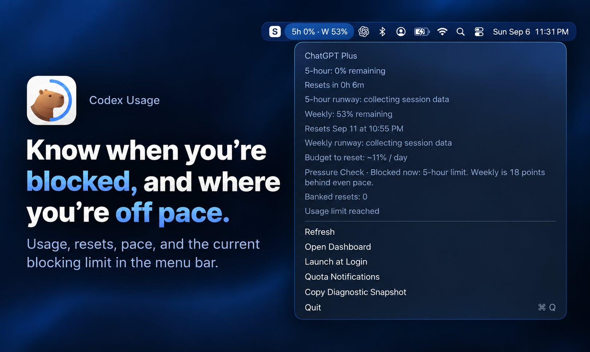
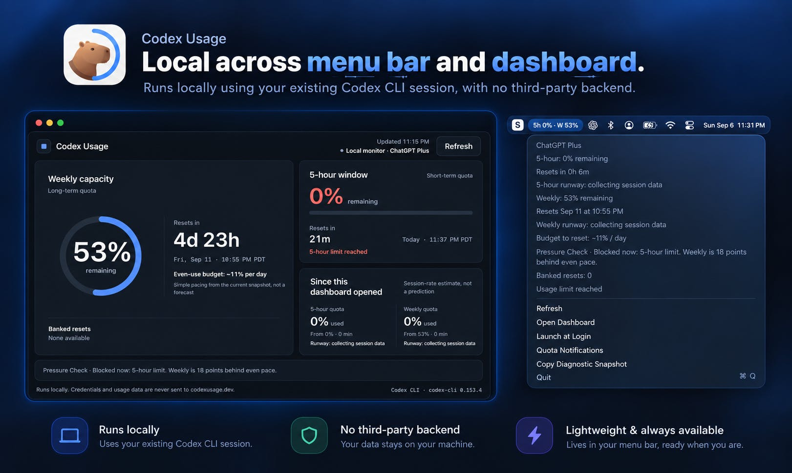

---

## 25. [Cleonhill](https://www.producthunt.com/products/cleonhill)
**Votes**: 7 | **도입 난이도**: 중 | **신뢰도**: 상
**Tagline**: Give an AI agent a task. Watch it do it.
**서비스 링크**: https://www.producthunt.com/r/MAJKTYY5WWYFBI

**태그**: AI Agent, Automation, NoCode, Productivity, Agent, AI Tool, Chat, Prompting

### 📌 이 서비스 한눈에 보기
AI 에이전트에게 가상 컴퓨터를 부여하여 복잡한 업무를 자동화하는 도구

### 🔑 주요 기능
- 자체 컴퓨터 환경을 가진 AI 에이전트가 브라우징 및 양식 작성 수행
- 프롬프트만으로 채팅 또는 음성 에이전트 구축 가능
- WhatsApp, 웹, 음성 시뮬레이터를 통한 실감 나는 테스트 환경 제공

### 🙋 사용자에게 어떤 점이 좋은가
단순 반복적인 웹 업무를 AI에게 맡기거나, 개발 중인 에이전트가 실제 사용자처럼 행동하는지 즉각 테스트할 수 있습니다.

### ✅ 지금 바로 써볼 기능
- 브라우징 및 데이터 수집 자동화 작업 시도
- 프롬프트를 통한 맞춤형 채팅 에이전트 생성
- WhatsApp/웹 시뮬레이터를 통한 에이전트 반응 테스트

### ⚠️ 사용 전 확인할 점
- 에이전트의 자동화 작업 시 발생할 수 있는 데이터 오류 확인 필요
- 시뮬레이션 환경과 실제 서비스 환경 간의 차이 고려

### 🧭 확인이 더 필요한 정보
에이전트가 수행하는 작업의 보안 수준과 외부 서비스 연동 범위에 대한 상세 정보가 필요합니다.

### 📸 스크린샷 및 갤러리
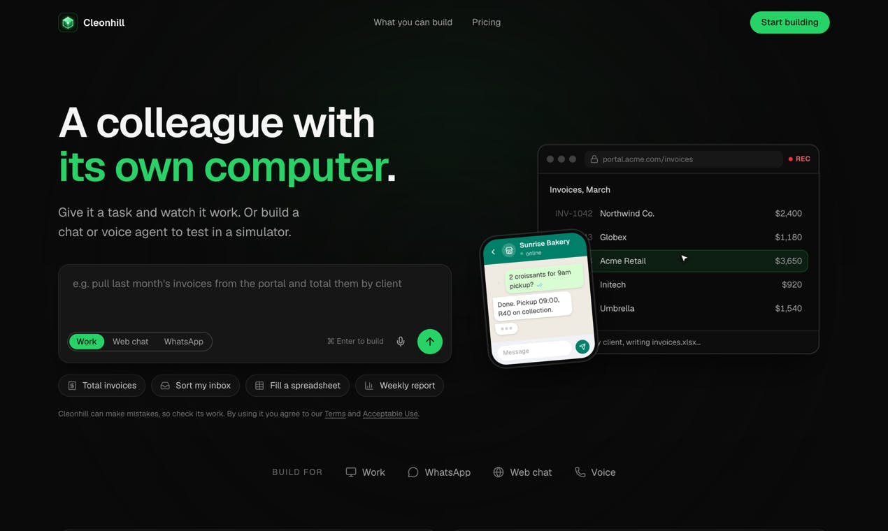
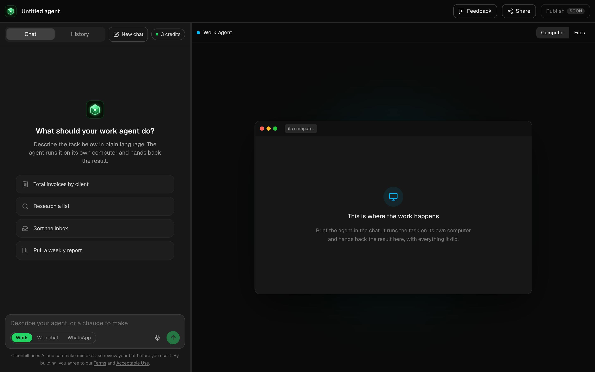
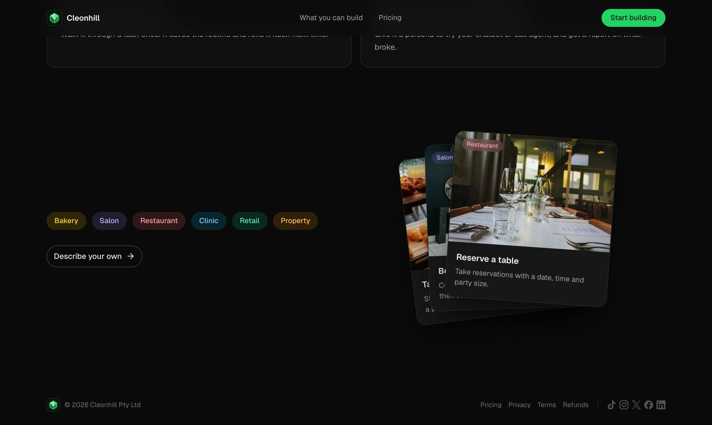

### 🎬 관련 영상
- [🎥 영상 보기](https://ph-files.imgix.net/42827af5-1467-4552-a30f-d4fcc803491d.jpeg?auto=format)

---

## 26. [Beauty Finder](https://www.producthunt.com/products/oriane)
**Votes**: 7 | **도입 난이도**: 하 | **신뢰도**: 상
**Tagline**: Top beauty products, picked by pros on Instagram & TikTok 
**서비스 링크**: https://www.producthunt.com/r/TMAXZ4Y4EZF5TT
**재등장**: 최근 7일 내 재등장 (마지막 등장 6일 전)

**태그**: Beauty, AI, SocialMedia, ShoppingGuide, AI Tool, Video

### 📌 이 서비스 한눈에 보기
SNS 전문가들의 추천을 기반으로 최적의 뷰티 제품을 찾아주는 AI 랭킹 서비스

### 🔑 주요 기능
- 인스타그램 및 틱톡 전문가들의 실제 추천 데이터 활용
- AI를 통한 카테고리별 제품 순위 제공
- 추천 근거가 되는 영상 콘텐츠를 직접 확인 가능

### 🙋 사용자에게 어떤 점이 좋은가
광고성 리뷰 대신 전문가들의 실제 영상 증거를 바탕으로 실패 없는 뷰티 쇼핑을 할 수 있습니다.

### ✅ 지금 바로 써볼 기능
- 관심 있는 뷰티 카테고리 선택하기
- AI가 생성한 제품 랭킹 확인하기
- 제공된 영상으로 전문가의 추천 근거 검토하기

### ⚠️ 사용 전 확인할 점
- SNS 트렌드에 따라 순위가 빈번하게 변동될 수 있음
- 전문가의 개인적 취향이 반영된 결과일 수 있음

### 🧭 확인이 더 필요한 정보
AI 알고리즘이 영상 데이터를 어떤 방식으로 분석하여 순위를 산출하는지 구체적인 로직은 명시되지 않았습니다.

### 📸 스크린샷 및 갤러리

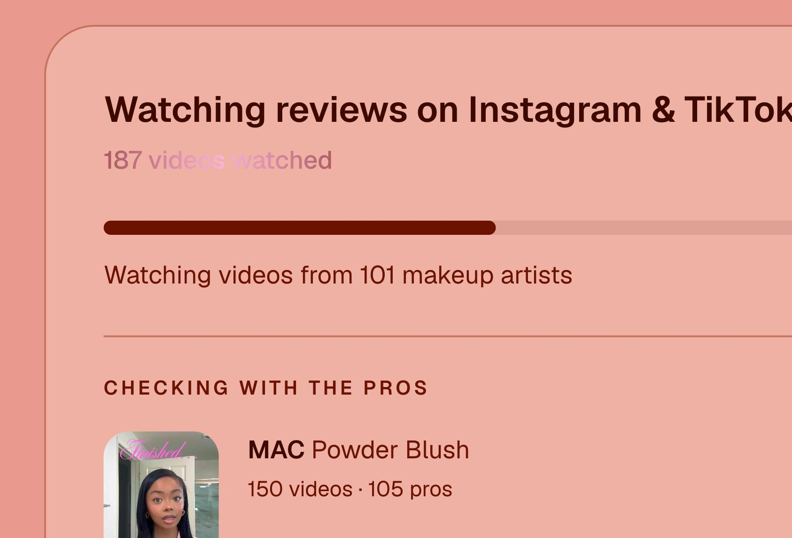

### 🎬 관련 영상
- [🎥 영상 보기](https://ph-files.imgix.net/97f0a9d7-da73-4de8-97c6-c87e2f727371.jpeg?auto=format)

---

## 27. [MRSH — Get Paid Faster](https://www.producthunt.com/products/mrsh-get-paid-faster)
**Votes**: 7 | **도입 난이도**: 하 | **신뢰도**: 상
**Tagline**: Get Paid. Stop Chasing.
**서비스 링크**: https://www.producthunt.com/r/P4ZKJJ2ZESF3E2

**태그**: Freelance, Invoicing, Automation, Fintech, AI Tool

### 📌 이 서비스 한눈에 보기
미납 대금 독촉 걱정 없이 전문적인 인보이스를 발송하고 빠르게 결제받는 프리랜서용 도구

### 🔑 주요 기능
- 전문적인 인보이스 발송 기능
- 미납 방지를 위한 자동 리마인더 시스템
- 프리랜서를 위한 간편한 결제 프로세스

### 🙋 사용자에게 어떤 점이 좋은가
수동으로 대금을 요청하는 번거로움을 줄여주며, 자동화된 리마인더를 통해 미수금 회수율을 높일 수 있습니다.

### ✅ 지금 바로 써볼 기능
- 전문적인 인보이스 템플릿 생성하기
- 자동 리마인더 설정하기
- 결제 링크 발송하기

### ⚠️ 사용 전 확인할 점
- 결제 수단 및 수수료 정책 확인 필요
- 국가별 세금 계산 및 법적 효력 여부 확인 필요

### 🧭 확인이 더 필요한 정보
구체적인 결제 게이트웨이 연동 범위와 서비스 이용 요금 체계에 대한 정보가 부족합니다.

### 📸 스크린샷 및 갤러리

---

## 28. [SnapDash](https://www.producthunt.com/products/snapdash-2)
**Votes**: 7 | **도입 난이도**: 하 | **신뢰도**: 상
**Tagline**: Snap real stuff. Win the race.
**서비스 링크**: https://www.producthunt.com/r/CTAJW6WBHXOPFE

**태그**: Gaming, AI, Multiplayer, Mobile, AI Tool

### 📌 이 서비스 한눈에 보기
주변 사물을 찾아 빠르게 촬영하는 온디바이스 AI 기반 실시간 레이싱 게임

### 🔑 주요 기능
- 온디바이스 AI를 통한 1초 내 빠른 사진 판독
- 최대 8인까지 함께 즐기는 실시간 경쟁 모드
- 개인정보 보호를 위해 사진이 기기 외부로 유출되지 않는 보안 설계

### 🙋 사용자에게 어떤 점이 좋은가
친구들과 모인 자리에서 스마트폰만으로 즉석에서 역동적인 게임을 즐길 수 있습니다.

### ✅ 지금 바로 써볼 기능
- 8인 멀티플레이 모드로 친구들과 대결하기
- 319가지 아이템 중 주변에서 찾을 수 있는 물건 매칭하기
- 온디바이스 AI의 판독 속도 체감하기

### ⚠️ 사용 전 확인할 점
- 물리적 이동이 필요하므로 플레이 장소의 안전 확보 필요
- 주변 환경(조명, 거리 등)에 따라 AI 판독 정확도가 달라질 수 있음

### 🧭 확인이 더 필요한 정보
지원되는 19개 세계관과 아이템의 구체적인 게임 규칙 및 난이도 차이는 확인이 필요합니다.

### 📸 스크린샷 및 갤러리

---

## 29. [KidCare Tracker](https://www.producthunt.com/products/kidcare-tracker)
**Votes**: 7 | **도입 난이도**: 하 | **신뢰도**: 상
**Tagline**: The best tracker to log child fever, medication and symptoms
**서비스 링크**: https://www.producthunt.com/r/GOLXLNSIBN75TL

**태그**: Parenting, HealthTracker, iOS, Family

### 📌 이 서비스 한눈에 보기
아이의 발열, 투약, 성장 기록을 한눈에 관리하는 프라이빗 육아 기록 앱

### 🔑 주요 기능
- 발열, 투약, 예방접종, 성장 상태 기록 기능
- 아이의 건강 상태를 한눈에 보는 프라이빗 타임라인
- 가족 구성원이 함께 사용할 수 있는 iOS 전용 앱

### 🙋 사용자에게 어떤 점이 좋은가
아이의 건강 변화를 체계적으로 기록하여 병원 진료 시 정확한 정보를 전달하고, 투약 일정을 놓치지 않게 도와줍니다.

### ✅ 지금 바로 써볼 기능
- 아이의 현재 증상 및 발열 기록하기
- 투약 및 예방접종 일정 등록하기
- 성장 기록 및 타임라인 확인하기

### ⚠️ 사용 전 확인할 점
- iOS 전용 앱이므로 안드로이드 사용자는 사용 불가
- 의료 진단용이 아닌 기록 보조 도구로 활용해야 함

### 🧭 확인이 더 필요한 정보
안드로이드 지원 여부와 데이터 백업/동기화 방식에 대한 상세 정보가 필요합니다.

### 📸 스크린샷 및 갤러리
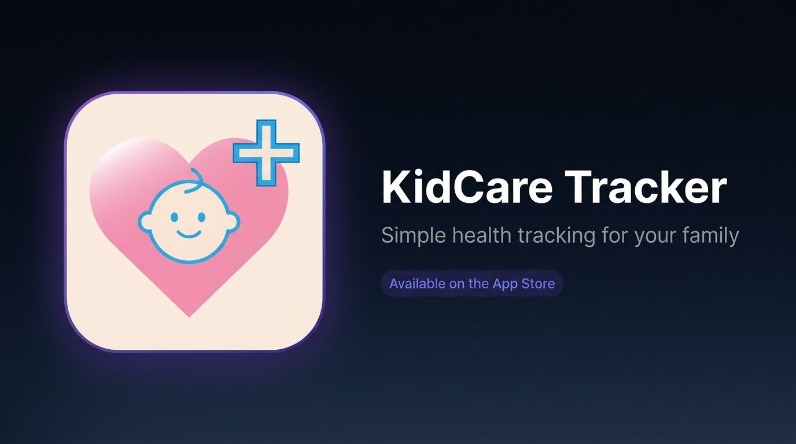
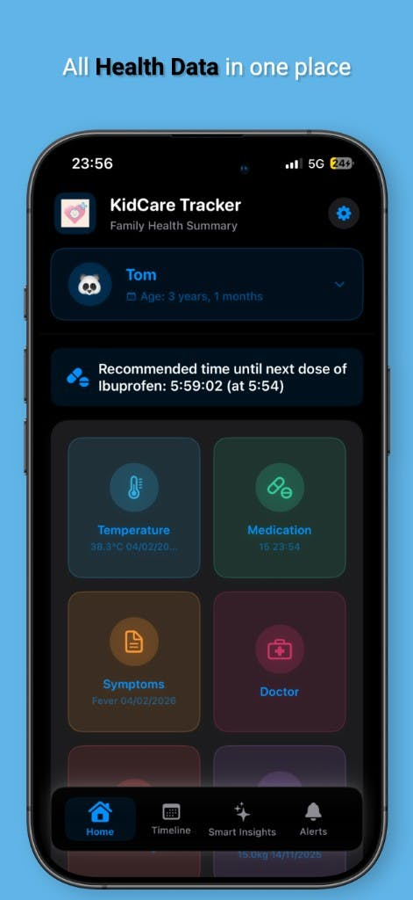
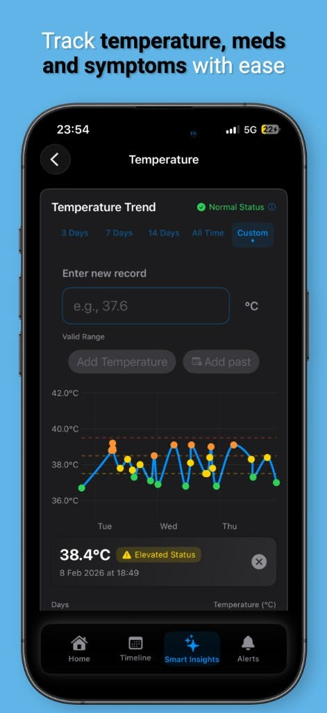

### 🎬 관련 영상
- [🎥 영상 보기](https://ph-files.imgix.net/8f773a9b-5561-46ef-88d0-c4d43393eeea.jpeg?auto=format)

---

## 30. [Write a chat](https://www.producthunt.com/products/write-a-chat-get-a-beluga-style-video)
**Votes**: 7 | **도입 난이도**: 하 | **신뢰도**: 상
**Tagline**: Type the conversation, pick a rhythm preset, export a video
**서비스 링크**: https://www.producthunt.com/r/VB7GKUZOZQSRIG

**태그**: VideoGen, ContentCreation, SocialMedia, Chat, Video

### 📌 이 서비스 한눈에 보기
채팅 대화 내용을 생생한 영상 콘텐츠로 변환해주는 도구

### 🔑 주요 기능
- 메신저 스타일(Discord, WhatsApp 등)의 대화형 영상 생성
- 49종의 내장 사운드와 리듬 프리셋 제공
- 브라우저 기반 렌더링으로 대기 시간 없는 빠른 작업

### 🙋 사용자에게 어떤 점이 좋은가
텍스트 대화만 입력하면 영상 편집 없이도 고화질(1080p)의 재미있는 대화 영상을 즉시 만들 수 있습니다.

### ✅ 지금 바로 써볼 기능
- 원하는 메신저 스타일 선택하기
- 대화 내용 입력 및 리듬 프리셋 적용하기
- MP4 영상으로 내보내기

### ⚠️ 사용 전 확인할 점
- 무료 버전은 영상 3개까지만 생성 가능
- 브라우저 기반이므로 인터넷 연결이 필요함

### 🧭 확인이 더 필요한 정보
무료 사용량(3개) 초과 시의 유료 플랜 가격 정책은 명시되어 있지 않습니다.

### 📸 스크린샷 및 갤러리
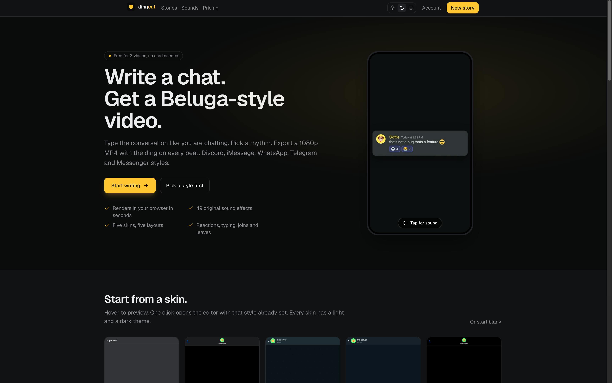
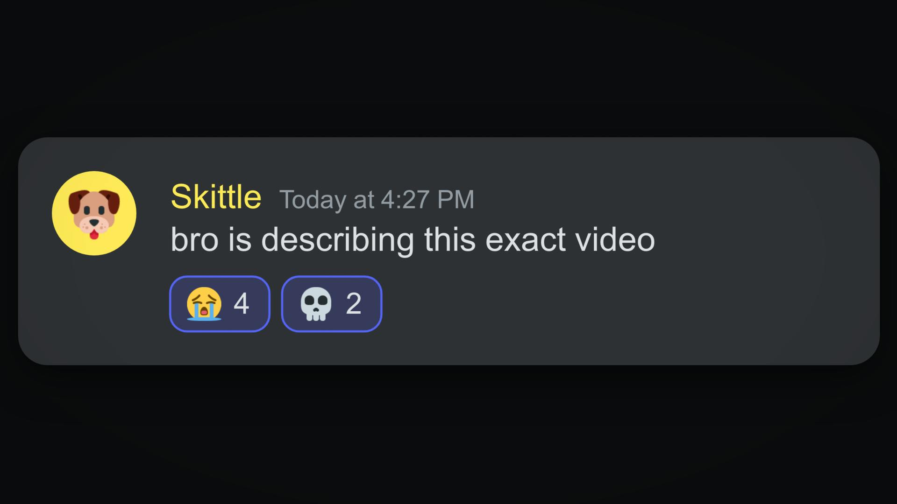

### 🎬 관련 영상
- [🎥 영상 보기](https://ph-files.imgix.net/01e8a053-5f8f-49e5-a51d-f908043edb9e.jpeg?auto=format)

---

