# 🚀 Product Hunt Daily Top 30 (2026-09-09)

## 오늘의 요약
오늘의 트렌드는 기존 협업 툴이나 프로필에 AI 에이전트를 결합하여 업무 자동화를 실현하는 서비스들이 주를 이루었습니다. 특히 단순한 챗봇을 넘어 영업, CRM, 마케팅 등 특정 비즈니스 워크플로우에 깊이 관여하며 실질적인 성과를 내는 에이전트 기술이 주목받았습니다. 또한, 데이터 보안을 위한 온디바이스 처리와 AI의 작업에 대한 인간의 승인 절차를 강조하는 신뢰 중심의 설계도 눈에 띄었습니다.

### 오늘의 핵심 포인트
- 기존 메신저나 프로필 페이지에 AI를 통합하여 별도의 학습 없이 즉각적인 협업과 영업이 가능한 솔루션들이 등장했습니다.
- AI 에이전트가 생성한 결과물을 인간이 검토하고 승인하는 제어 기능이 CRM과 마케팅 툴의 핵심 요소로 부각되었습니다.
- 클라우드 의존도를 낮추고 온디바이스 환경이나 오픈소스 기반의 보안 및 개인정보 보호를 강조하는 제품들이 주목받았습니다.

**오늘의 태그**: AI 에이전트, 업무 자동화, SaaS, 생산성, 보안

## 1. [Switch](https://www.producthunt.com/products/switch-11)
**Votes**: 387 | **도입 난이도**: 중 | **신뢰도**: 상
**Tagline**: Bring any AI agent into Slack, Teams & Discord
**서비스 링크**: https://www.producthunt.com/r/EAQYN6B2W3MDVB

**태그**: AI, Collaboration, OpenSource, Automation, DevTool, Agent, AI Tool

### 📌 이 서비스 한눈에 보기
기존 협업 툴에 AI 에이전트를 팀원처럼 초대하여 함께 일하는 오픈소스 솔루션

### 🔑 주요 기능
- Slack, Teams, Discord 등 기존 협업 플랫폼에 AI 에이전트를 참여 가능
- 채널별로 독립적인 컨텍스트, 참여자, 규칙 유지
- Claude Code, OpenAI, LangChain 등 다양한 프레임워크와 연동

### 🙋 사용자에게 어떤 점이 좋은가
새로운 툴을 배울 필요 없이 이미 사용 중인 메신저에서 팀원과 대화하듯 AI와 협업할 수 있습니다.

### ✅ 지금 바로 써볼 기능
- 사용 중인 Slack/Discord 채널에 에이전트 연결하기
- 프로젝트별로 최적화된 에이전트 규칙 설정하기
- 자체 서버에 셀프 호스팅하여 보안 환경 구축하기

### ⚠️ 사용 전 확인할 점
- 셀프 호스팅 시 서버 관리 및 보안 설정 책임이 사용자에게 있음
- 연동되는 외부 AI 모델(OpenAI 등)의 API 비용 발생 가능성

### 🧭 확인이 더 필요한 정보
사용자의 특정 협업 툴 환경에서의 보안 정책 준수 여부를 확인해야 합니다.

### 📸 스크린샷 및 갤러리
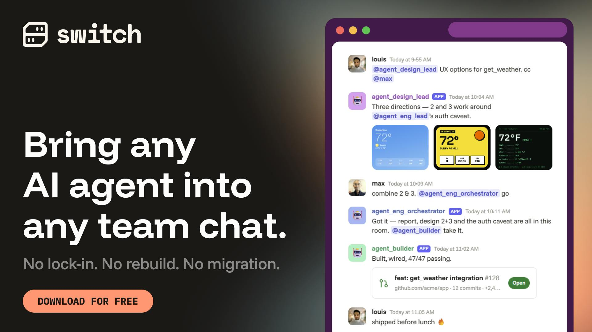
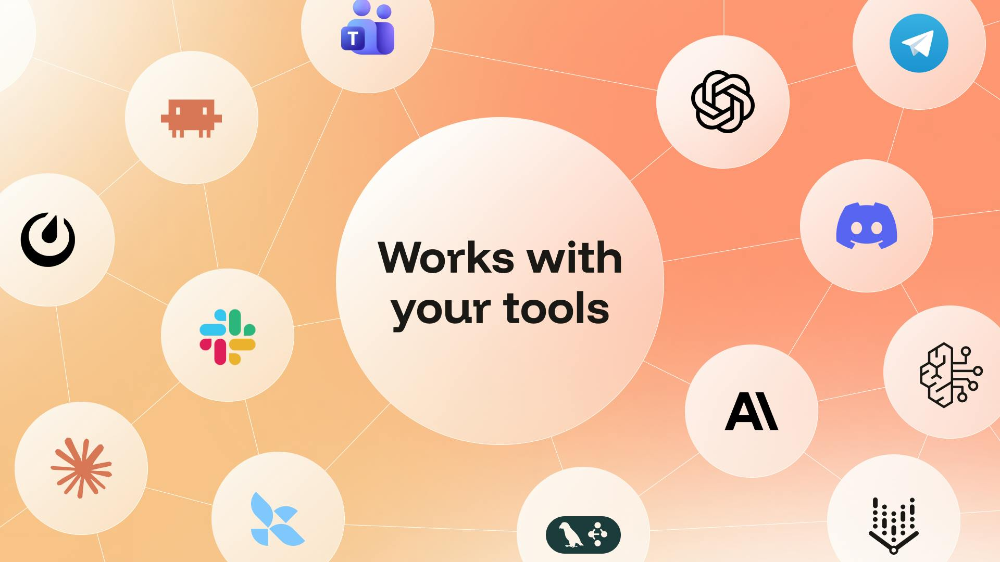
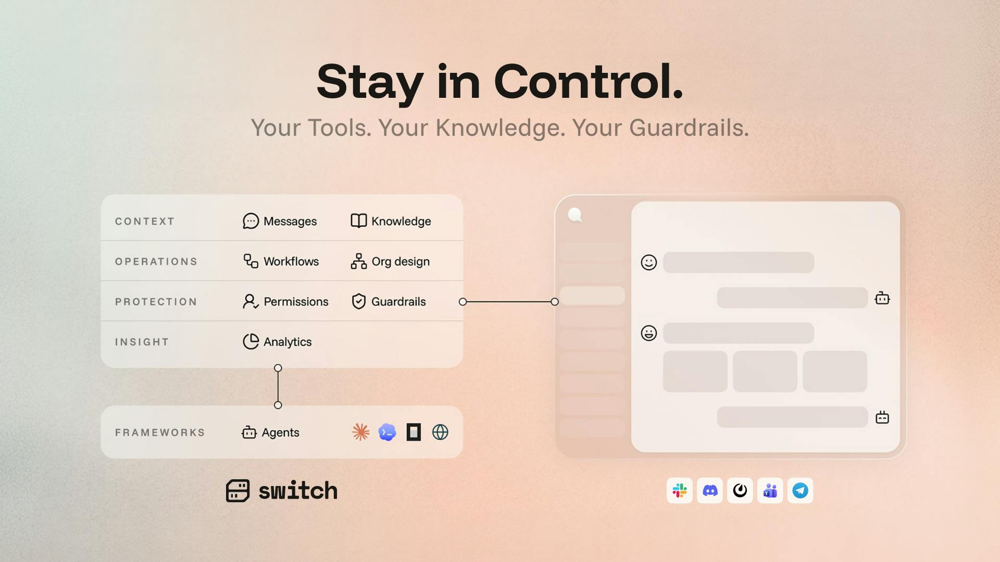

### 🎬 관련 영상
- [🎥 영상 보기](https://ph-files.imgix.net/486865f1-e52b-476f-954f-0a1c761a02e9.jpeg?auto=format)

---

## 2. [Widgo](https://www.producthunt.com/products/paillor)
**Votes**: 336 | **도입 난이도**: 하 | **신뢰도**: 상
**Tagline**: AI Sales rep for your website visitors
**서비스 링크**: https://www.producthunt.com/r/KKQZVPBNVHRLPI

**태그**: AI, Sales, Automation, LeadGen, AI Tool, DevTool

### 📌 이 서비스 한눈에 보기
웹사이트 방문자를 잠재 고객으로 전환하는 AI 영업 담당자

### 🔑 주요 기능
- 웹사이트 스캔 및 문서 학습을 통한 자동 응대
- 방문 기업 식별 및 리드 점수 산정
- 캘린더 연동을 통한 데모 미팅 자동 예약

### 🙋 사용자에게 어떤 점이 좋은가
별도의 복잡한 설정 없이 코드 한 줄로 24시간 작동하는 AI 영업팀을 확보할 수 있습니다.

### ✅ 지금 바로 써볼 기능
- 웹사이트에 코드 삽입하여 설치하기
- 학습용 문서 업로드하기
- 캘린더 연동하여 자동 예약 설정하기

### ⚠️ 사용 전 확인할 점
- 학습 데이터(문서/사이트)의 품질에 따라 답변 정확도가 달라질 수 있음
- 복잡한 상담이나 고도의 맞춤형 응대에는 한계가 있을 수 있음

### 🧭 확인이 더 필요한 정보
무료 플랜의 기능 제한 범위나 향ış 트래픽 증가 시의 과금 체계에 대한 상세 정보가 필요합니다.

### 📸 스크린샷 및 갤러리
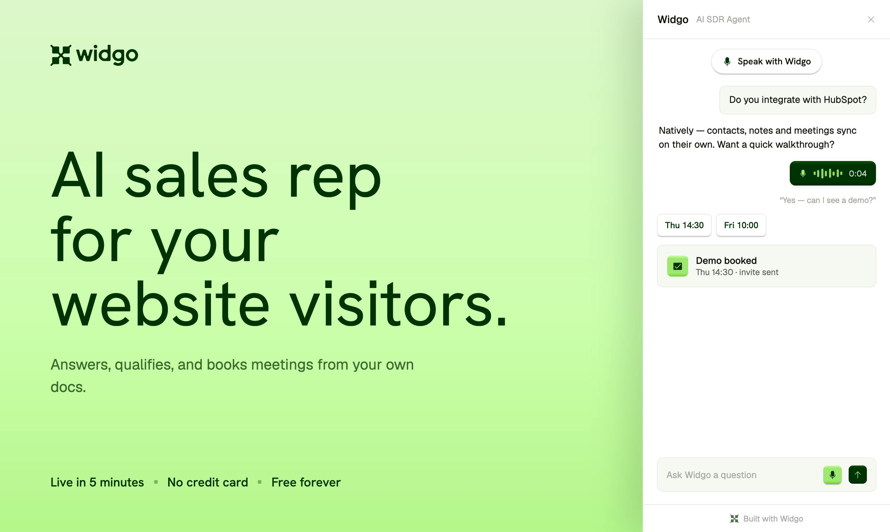
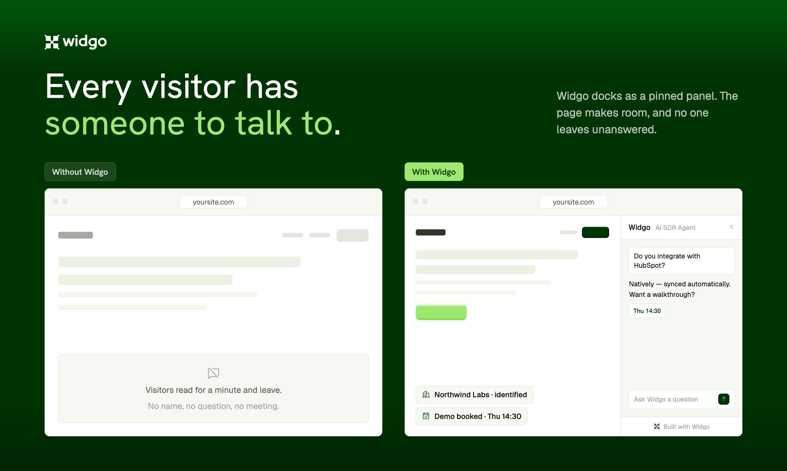

### 🎬 관련 영상
- [🎥 영상 보기](https://ph-files.imgix.net/381d0137-9976-4abf-92fb-9c223eed3cd1.jpeg?auto=format)

---

## 3. [Kombai Gallery](https://www.producthunt.com/products/kombai)
**Votes**: 276 | **도입 난이도**: 하 | **신뢰도**: 상
**Tagline**: 20,000+ curated UI designs for agents and humans
**서비스 링크**: https://www.producthunt.com/r/ALNGUII2YBU3ZB

**태그**: Design, AI, UI/UX, Productivity, Agent, AI Tool, Prompting

### 📌 이 서비스 한눈에 보기
AI 에이전트와 디자이너를 위한 2만 개 이상의 엄선된 UI 디자인 라이브러리

### 🔑 주요 기능
- 20,000개 이상의 웹 및 모바일 디자인 컴포넌트 제공
- AI 에이전트에게 디자인 감각을 부여할 수 있는 프롬프트 복사 기능
- 로그인 없이 즉시 이용 가능한 무료 갤러리 서비스

### 🙋 사용자에게 어떤 점이 좋은가
디자인 영감이 필요할 때나 AI를 활용해 UI를 생성할 때, 검증된 디자인 소스를 즉시 활용하여 작업 시간을 단축할 수 있습니다.

### ✅ 지금 바로 써볼 기능
- 큐레이션된 디자인 브라우징
- 라이브 프리뷰 기능으로 디자인 확인
- 준비된 프롬프트 복사하여 AI 작업에 활용

### ⚠️ 사용 전 확인할 점
- 사용자 맞춤형 저장 기능은 로그인 없이 제한적일 수 있음
- 제공되는 프롬프트가 특정 AI 모델에 최적화되어 있는지 확인 필요

### 🧭 확인이 더 필요한 정보
로그인 없이 사용 가능하므로 개인화된 저장이나 북마크 기능의 유지 여부는 불분명합니다.

### 📸 스크린샷 및 갤러리
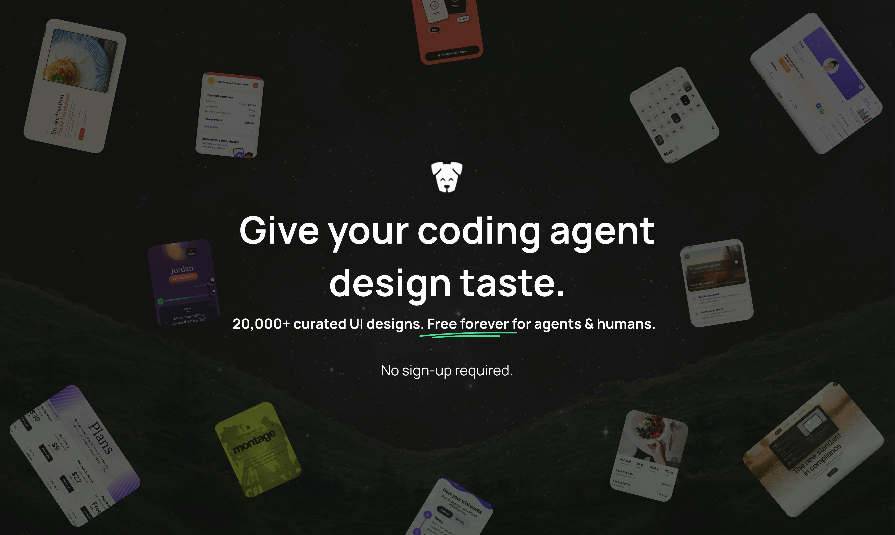
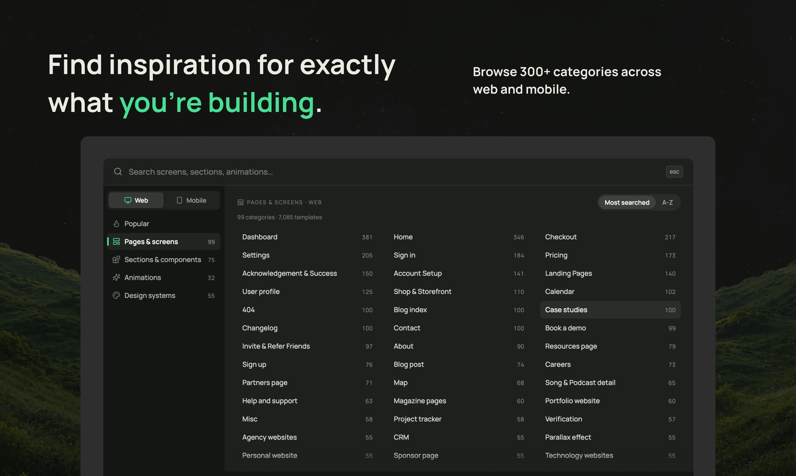
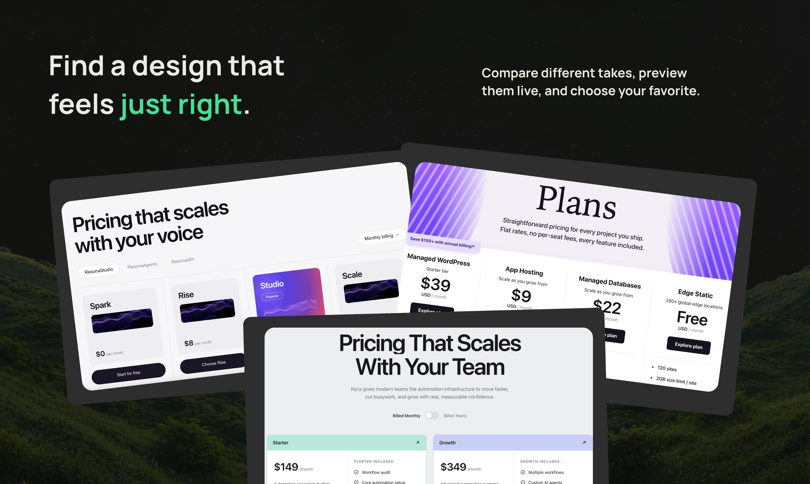

### 🎬 관련 영상
- [🎥 영상 보기](https://ph-files.imgix.net/73d63d8d-b805-446e-a33e-69e8ff3f53e0.jpeg?auto=format)

---

## 4. [OpenMarket](https://www.producthunt.com/products/openmarket)
**Votes**: 200 | **도입 난이도**: 중 | **신뢰도**: 중
**Tagline**: Multi-agent marketplace where proof decides who wins
**서비스 링크**: https://www.producthunt.com/r/MFJR2TQDFWCXQB

**태그**: AI, Marketplace, Verification, Multi-Agent, Agent, AI Tool, Marketing

### 📌 이 서비스 한눈에 보기
마케팅이 아닌 검증된 실력을 바탕으로 승패가 결정되는 멀티 에이전트 마켓플레이스

### 🔑 주요 기능
- 판매자의 제안과 경쟁자의 도전이 공존하는 멀티 에이전트 환경
- 독립적인 진실 에이전트(Truth Agents)를 통한 객관적 증거 검증
- 단순한 문구 중심이 아닌, 실질적 증거를 통한 신뢰 기반의 거래 구조

### 🙋 사용자에게 어떤 점이 좋은가
사용자는 마케팅 수사법에 현혹되지 않고, 검증된 데이터와 증거를 바탕으로 최적의 제품을 선택할 수 있습니다.

### ✅ 지금 바로 써볼 기능
- 리서치 프리뷰 단계의 에이전트 간 경쟁 메커니즘 체험
- 제안된 클레임이 검증 과정을 어떻게 통과하는지 확인

### ⚠️ 사용 전 확인할 점
- 현재 리서치 프리뷰 단계로 기능이 제한적일 수 있음
- 검증 에이전트의 객관성 및 알고리즘 신뢰도 확인 필요

### 🧭 확인이 더 필요한 정보
현재 리서치 프리뷰 단계이므로 실제 상용화 시의 검증 알고리즘과 에이전트 운영 방식이 어떻게 변할지 확인이 필요합니다.

### 📸 스크린샷 및 갤러리
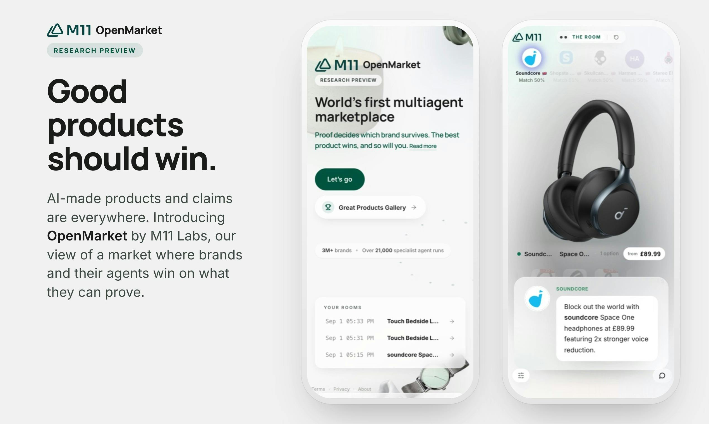
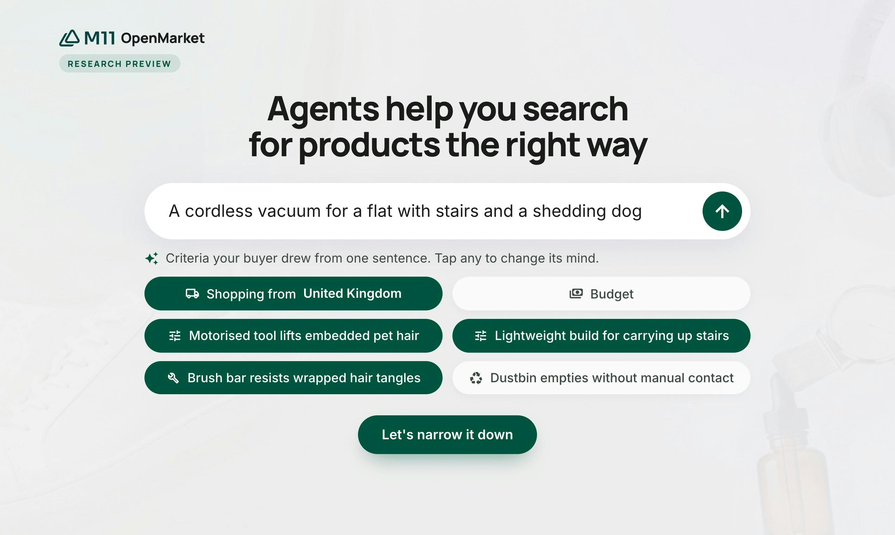
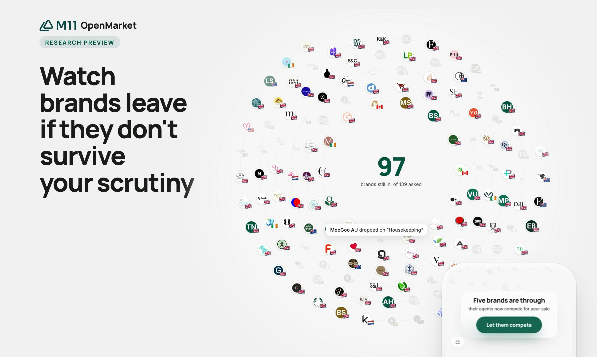

### 🎬 관련 영상
- [🎥 영상 보기](https://ph-files.imgix.net/562acdc4-c89c-4d2e-8dc8-f6f4b70e40d7.jpeg?auto=format)

---

## 5. [Knockin'](https://www.producthunt.com/products/knockin)
**Votes**: 162 | **도입 난이도**: 하 | **신뢰도**: 상
**Tagline**: Turns your static bio into an AI business card that replies
**서비스 링크**: https://www.producthunt.com/r/4PUMMDMWUCEB6E

**태그**: AI, Productivity, Networking, Automation, AI Tool, Chat

### 📌 이 서비스 한눈에 보기
정적인 프로필을 대화형 AI 비즈니스 카드로 변환하여 자동 응답과 미팅 예약을 지원하는 서비스

### 🔑 주요 기능
- 사용자의 작업물과 콘텐츠를 학습하여 본인의 목소리로 질문에 답변하는 AI 프로필 생성
- 방문자가 즉시 미팅 시간을 예약할 수 있는 기능 제공
- 방문자 기록을 통해 잠재적 고객이나 팔로우업 대상을 식별

### 🙋 사용자에게 어떤 점이 좋은가
단순한 링크 모음을 넘어, 사용자가 부재중일 때도 AI가 대신 정보를 전달하고 미팅까지 연결하여 커뮤니케이션 비용을 획기적으로 줄여줍니다.

### ✅ 지금 바로 써볼 기능
- 자신의 작업물과 링크를 입력하여 AI 프로필 구축하기
- 방문자가 질문할 수 있도록 AI 답변 스타일 설정하기
- 방문자 리스트를 확인하여 팔로우업 대상 선정하기

### ⚠️ 사용 전 확인할 점
- AI가 사용자의 의도와 다르게 답변할 가능성 검토 필요
- 개인정보 및 작업물 데이터 학습에 대한 보안 정책 확인

### 🧭 확인이 더 필요한 정보
AI 답변의 정확도와 미팅 예약 시스템의 외부 캘린더 연동 범위에 대한 구체적인 정보가 필요합니다.

### 📸 스크린샷 및 갤러리
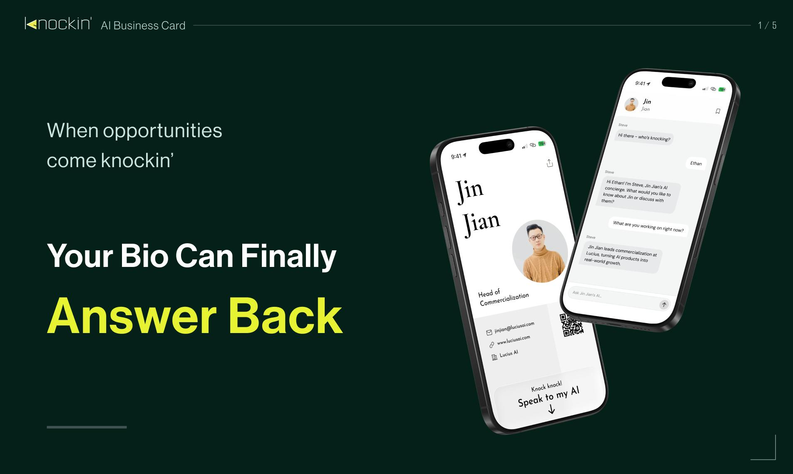
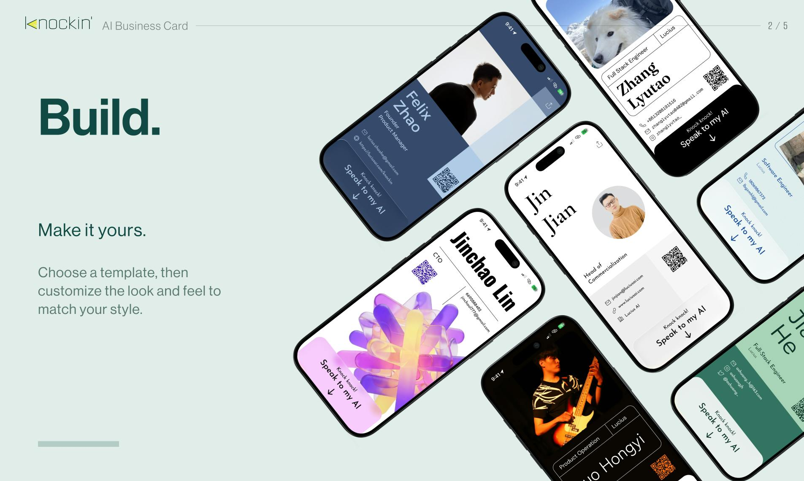
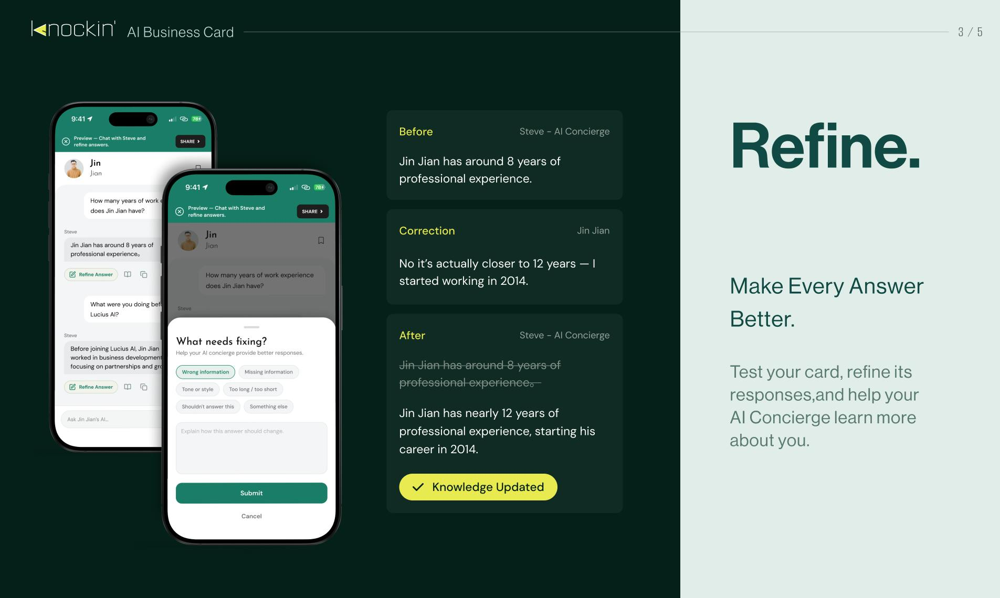

### 🎬 관련 영상
- [🎥 영상 보기](https://ph-files.imgix.net/5dfec1ec-5eb2-4971-abd7-6d16dc91574a.jpeg?auto=format)

---

## 6. [GoodLads](https://www.producthunt.com/products/good-lads-1-0)
**Votes**: 138 | **도입 난이도**: 하 | **신뢰도**: 상
**Tagline**: AI growth manager for your Google Ads account
**서비스 링크**: https://www.producthunt.com/r/A3H3YY7MH7X7PM

**태그**: Marketing, Automation, AI, GoogleAds, AI Tool

### 📌 이 서비스 한눈에 보기
클릭 한 번으로 Google Ads 성과를 최적화하는 AI 성장 관리자

### 🔑 주요 기능
- ROAS 및 CPA 개선을 위한 AI 가설 생성
- 사용자 승인 기반의 원클릭 실험 실행
- 칸반 보드를 통한 실험 과정 및 결과 추적

### 🙋 사용자에게 어떤 점이 좋은가
수동적인 광고 관리를 자동화된 실험 프로세스로 전환하여, 광고 성과 최적화 시간을 줄이고 데이터 기반의 의사결정을 돕습니다.

### ✅ 지금 바로 써볼 기능
- AI가 생성한 성장 가설 검토하기
- 원클릭으로 생성된 실험 적용하기
- 칸반 보드에서 실험 결과 모니터링하기

### ⚠️ 사용 전 확인할 점
- AI가 생성한 가설이 비즈니스 목표와 일치하는지 최종 승인 단계에서 확인 필요
- 실험 결과가 실제 매출에 미치는 영향은 비즈니스 상황에 따라 다를 수 있음

### 🧭 확인이 더 필요한 정보
AI가 생성하는 가설의 구체적인 알고리즘과 기존 Google Ads 계정과의 연동 방식에 대한 상세 정보가 필요합니다.

### 📸 스크린샷 및 갤러리
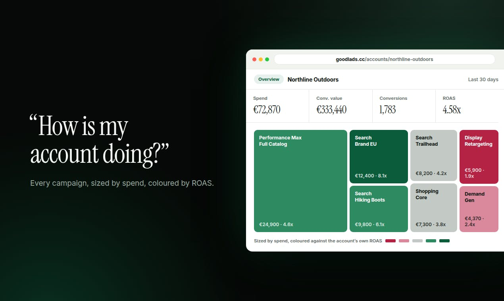
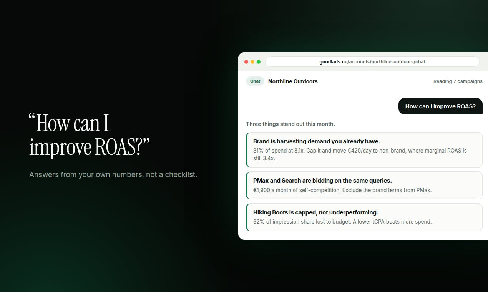
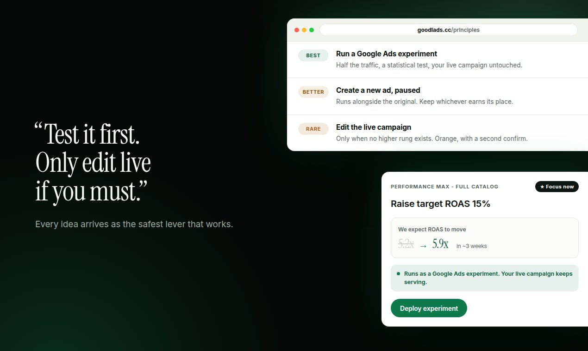

### 🎬 관련 영상
- [🎥 영상 보기](https://ph-files.imgix.net/fab9792d-b921-4f55-b64d-630a4a903f7c.jpeg?auto=format)

---

## 7. [Relaticle](https://www.producthunt.com/products/relaticle)
**Votes**: 136 | **도입 난이도**: 중 | **신뢰도**: 상
**Tagline**: Open-source CRM with approval-gated AI writes
**서비스 링크**: https://www.producthunt.com/r/MBVOOJKZXSJKZV

**태그**: CRM, OpenSource, AI-Agent, Automation, DevTool, Agent, AI Tool

### 📌 이 서비스 한눈에 보기
승인 기반의 제어 기능과 에이전트 중심 설계를 갖춘 오픈소스 CRM

### 🔑 주요 기능
- 에이전트 우선 설계: MCP 클라이언트를 통한 37가지 퍼스트 파티 도구 및 자동 스키마 연동
- 승인 기반 AI 쓰기: 모든 데이터 변경 사항을 레코드 단위로 검토하고 승인하는 엄격한 제어
- 유연한 배포 및 가격 정책: AGPL 기반 셀프 호스팅(Ollama 포함) 및 좌석 수가 아닌 워크스페이스 중심의 클라우드 요금제

### 🙋 사용자에게 어떤 점이 좋은가
AI가 데이터를 임의로 수정하는 위험을 방지하면서도, 에이전트 중심의 자동화된 워크플로우를 통해 CRM 관리 효율을 극대화할 수 있습니다.

### ✅ 지금 바로 써볼 기능
- 로컬 Ollama를 활용한 셀프 호스팅 환경 구축
- 에이전트별 커스텀 필드 자동 스키마 연동 테스트
- 제안된 AI 쓰기(Proposal) 승인 워크플로우 검증

### ⚠️ 사용 전 확인할 점
- 에이전트 중심 설계로 인해 기존 레거시 CRM과 데이터 마이그레이션 시 복잡도가 발생할 수 있음
- 승인 기반 방식이 수동 작업량을 늘릴 수 있으므로 팀의 업무 속도와 상충할 수 있음

### 🧭 확인이 더 필요한 정보
클라우드 버전의 구체적인 워크스페이스당 요금 체계와 상세 기능 범위에 대한 정보가 필요합니다.

### 📸 스크린샷 및 갤러리
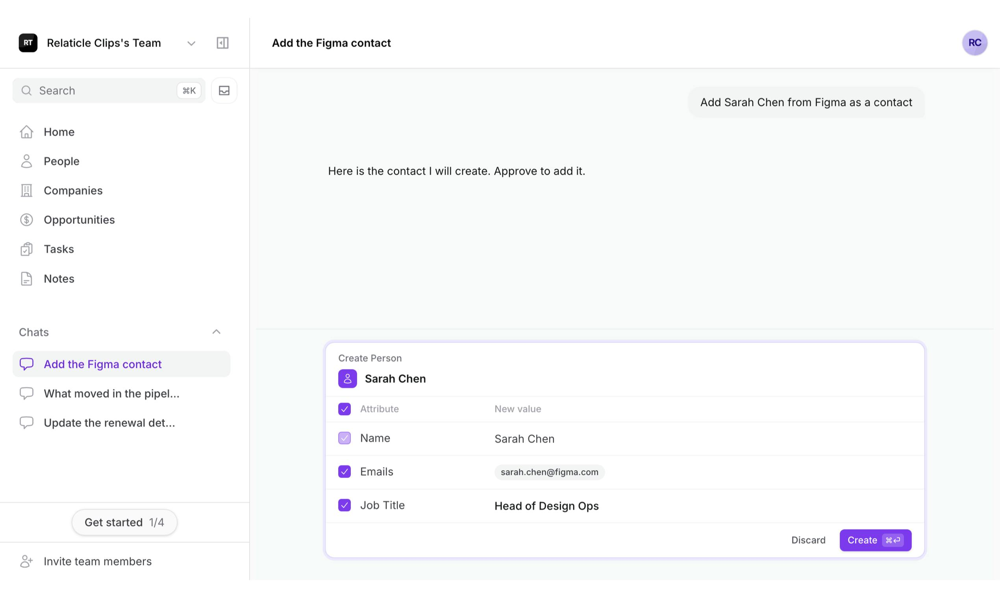
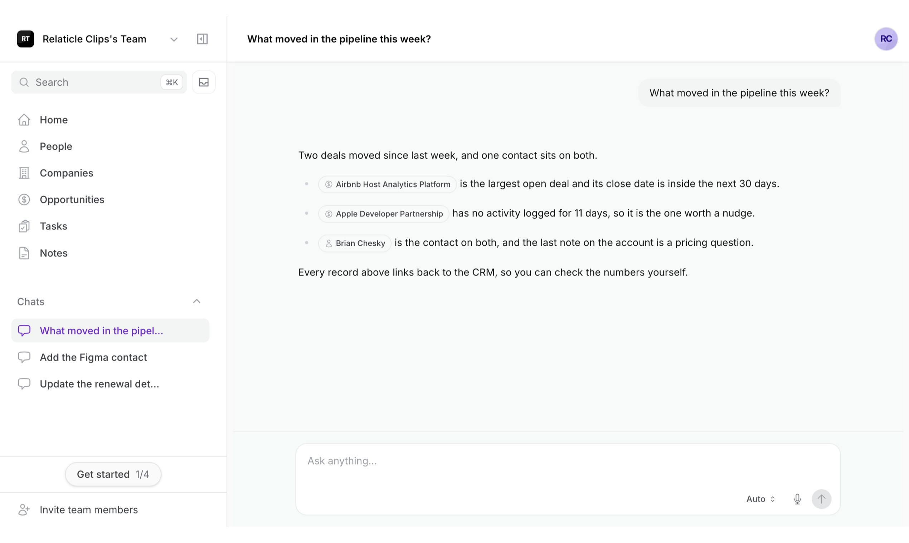
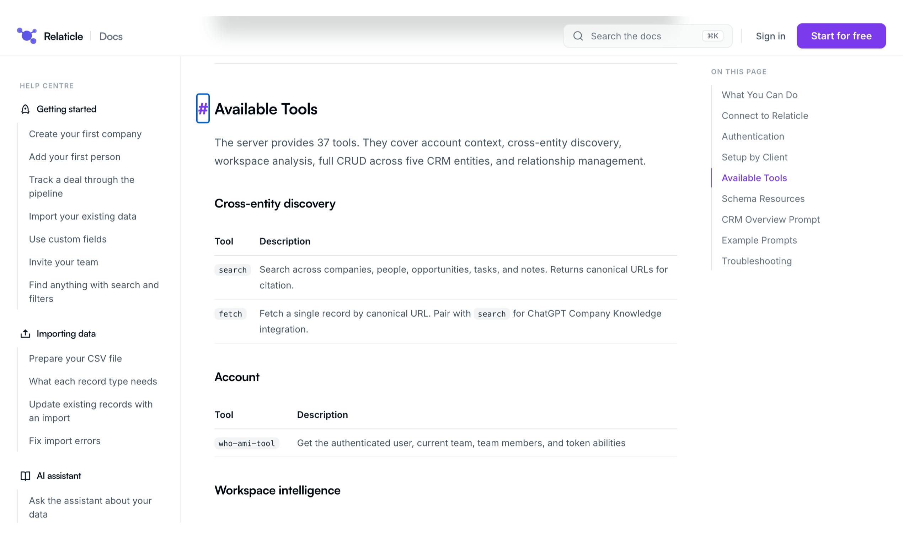

### 🎬 관련 영상
- [🎥 영상 보기](https://ph-files.imgix.net/8d6129d5-f3cd-49f5-8aad-2dd3e5b62470.jpeg?auto=format)

---

## 8. [Dictantor](https://www.producthunt.com/products/dictantor)
**Votes**: 120 | **도입 난이도**: 하 | **신뢰도**: 상
**Tagline**: Record meetings and transcribe privately on Apple devices
**서비스 링크**: https://www.producthunt.com/r/Q6S7OTP4LISIUI

**태그**: Productivity, Transcription, Privacy, Apple Ecosystem, Prompting

### 📌 이 서비스 한눈에 보기
애플 기기에서 개인정보 유출 걱정 없이 회의를 기록하고 텍스트로 변환하는 프라이빗 전사 도구

### 🔑 주요 기능
- Mac, iPhone, Apple Watch를 통한 간편한 녹음 및 시스템 오디오 통합 지원
- 클라우드가 아닌 기기 자체(On-device)에서 실행되는 보안 중심의 텍스트 변환
- 계정 생성이나 구독 없이 iCloud를 통한 개인적인 데이터 동기화

### 🙋 사용자에게 어떤 점이 좋은가
데이터가 외부 서버로 전송되지 않아 보안이 중요한 비즈니스 미팅에 적합하며, 별도의 가입 절차 없이 즉시 사용할 수 있습니다.

### ✅ 지금 바로 써볼 기능
- Mac에서 시스템 오디오와 마이크 동시 녹음 테스트하기
- 25개 유럽 언어 지원 및 화자 분리 기능 확인하기
- iCloud를 통한 기기 간 동기화 설정하기

### ⚠️ 사용 전 확인할 점
- 애플 생태계(Mac, iOS, watchOS) 기기에서만 사용 가능
- 기기 자체 연산 능력을 사용하므로 구형 기기에서는 성능 제약이 있을 수 있음

### 🧭 확인이 더 필요한 정보
지원되는 25개 유럽 언어 외의 언어(한국어 등)에 대한 지원 여부는 명시되지 않았습니다.

### 📸 스크린샷 및 갤러리
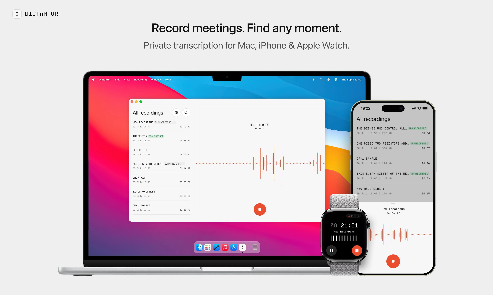
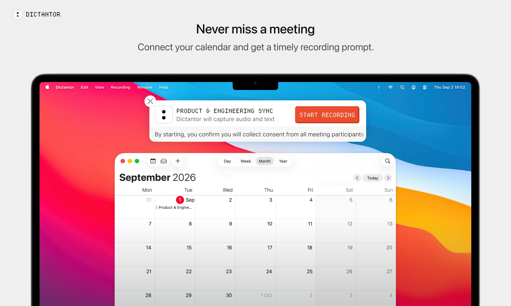
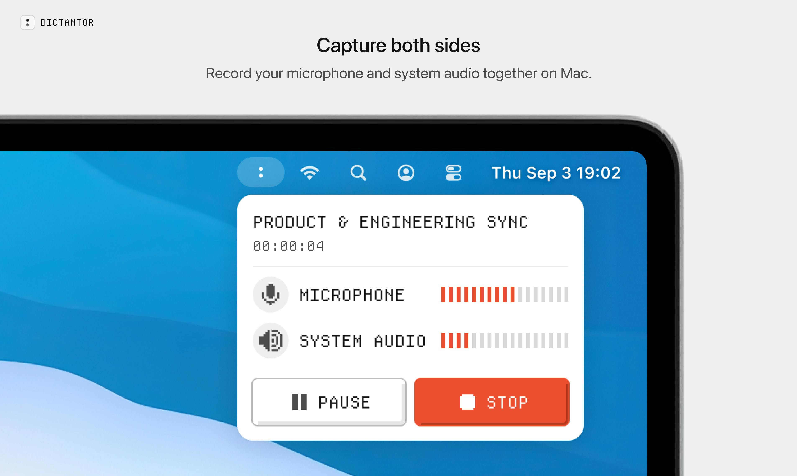

---

## 9. [Jupitrr Cut](https://www.producthunt.com/products/jupitrr)
**Votes**: 103 | **도입 난이도**: 하 | **신뢰도**: 상
**Tagline**: Open source app for recording vids with a teleprompter
**서비스 링크**: https://www.producthunt.com/r/OUQ5GO2NOHEYRH

**태그**: VideoProduction, OpenSource, MobileApp, Automation, AI Tool, Prompting, Video

### 📌 이 서비스 한눈에 보기
텔레프롬프터와 자동 편집 기능을 갖춘 오픈소스 모바일 영상 제작 앱

### 🔑 주요 기능
- 내장 텔레프롬프터를 통한 대본 읽기 및 간편한 재촬영
- 무음 구간 자동 제거로 편집 과정 최소화
- 계정 생성 없이 즉시 사용 가능한 오픈소스(GPL-3.0) 앱

### 🙋 사용자에게 어떤 점이 좋은가
복잡한 영상 편집 타임라인 없이도 말하는 영상(Talking-head)을 빠르고 깔끔하게 제작할 수 있습니다.

### ✅ 지금 바로 써볼 기능
- 텔레프롬프터 기능을 활용한 대본 읽기 연습
- 자동 무음 제거 기능으로 편집 시간 단축해보기
- 추후 Jupitrr AI를 통한 자막 및 B-roll 추가 고려

### ⚠️ 사용 전 확인할 점
- 모바일 환경에 최적화되어 있어 정교한 PC급 편집에는 한계가 있음
- 고급 기능(자막, B-roll)은 별도의 Jupitrr AI 서비스가 필요할 수 있음

### 🧭 확인이 더 필요한 정보
Jupitrr AI 서비스의 유료 여부 및 연동 방식에 대한 상세 정보가 필요합니다.

### 📸 스크린샷 및 갤러리
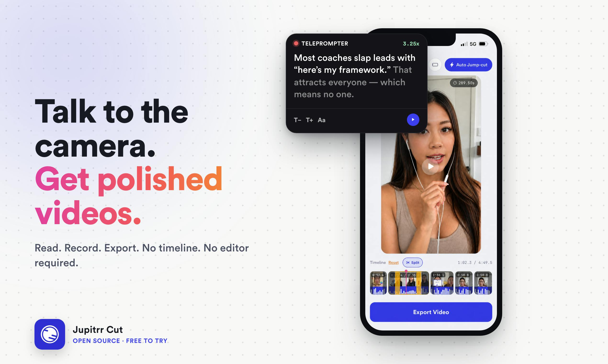
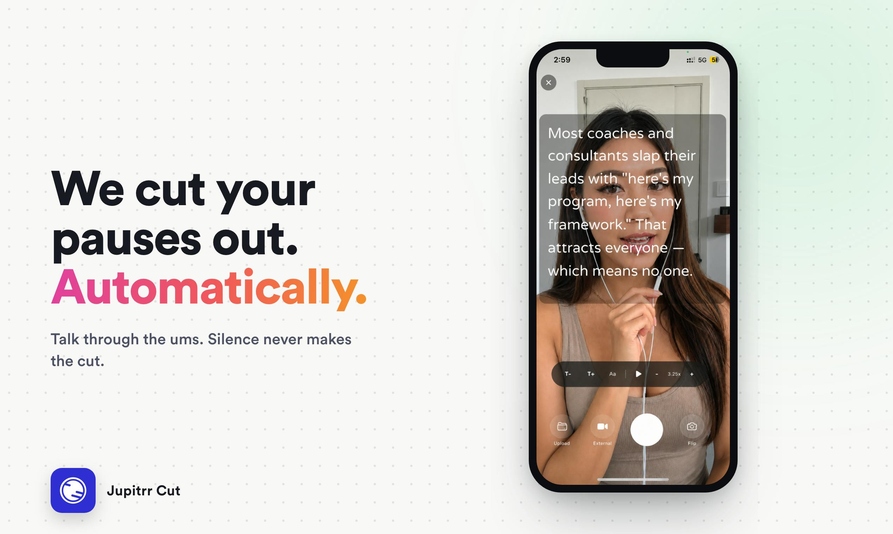
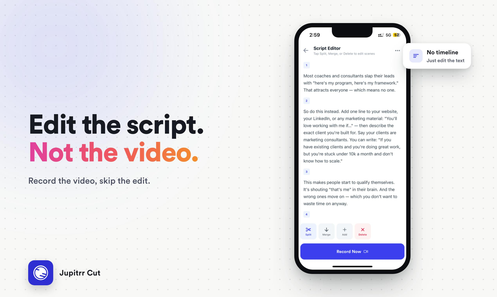

---

## 10. [SODAX SDK](https://www.producthunt.com/products/sodax)
**Votes**: 100 | **도입 난이도**: 중 | **신뢰도**: 상
**Tagline**: Digital asset flows you can build and deploy with AI.
**서비스 링크**: https://www.producthunt.com/r/4PBLKS7ZQQU5DG

**태그**: DevTool, FinTech, Web3, Blockchain, Infrastructure, AI Tool

### 📌 이 서비스 한눈에 보기
복잡한 블록체인 기술 관리 없이 디지털 자산 거래 및 금융 서비스를 구축할 수 있는 SDK

### 🔑 주요 기능
- 스테이블코인, 암호화폐, 실물 자산(RWA) 거래를 위한 맞춤형 실행 시스템 제공
- 블록체인 인터페이스 관리 부담을 줄여 제품 및 사용자 경험 개발에 집중 가능
- 네오뱅크, 거래소, 대출 프로토콜을 위한 확장 가능한 금융 인프라

### 🙋 사용자에게 어떤 점이 좋은가
금융 서비스 개발자가 블록체인 하부 구조를 직접 관리하는 기술적 부채 없이 빠르게 자산 거래 및 수익 창출 기능을 배포할 수 있습니다.

### ✅ 지금 바로 써볼 기능
- SDK를 통한 기본 트랜잭션 실행 테스트
- 자사 서비스와 스테이블코인/RWA 기능 통합 시뮬레이션
- 지원하는 블록체인 네트워크 범위 확인

### ⚠️ 사용 전 확인할 점
- SDK의 커스터마이징 범위와 보안 제어 권한 확인 필요
- 지원하는 블록체인 네트워크 및 특정 자산 유형의 호환성 검토

### 🧭 확인이 더 필요한 정보
구체적인 지원 블록체인 네트워크 목록과 상세 API 문서의 가용성을 확인해야 합니다.

### 📸 스크린샷 및 갤러리

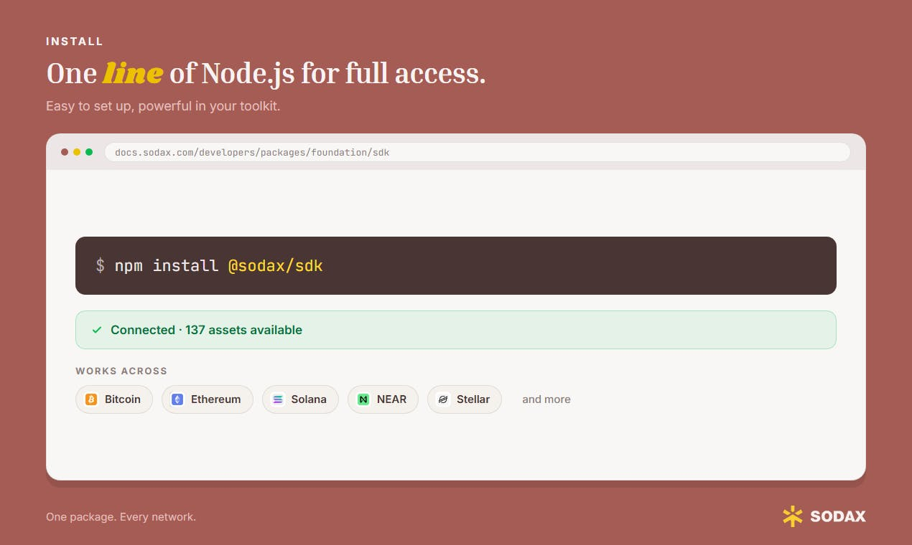
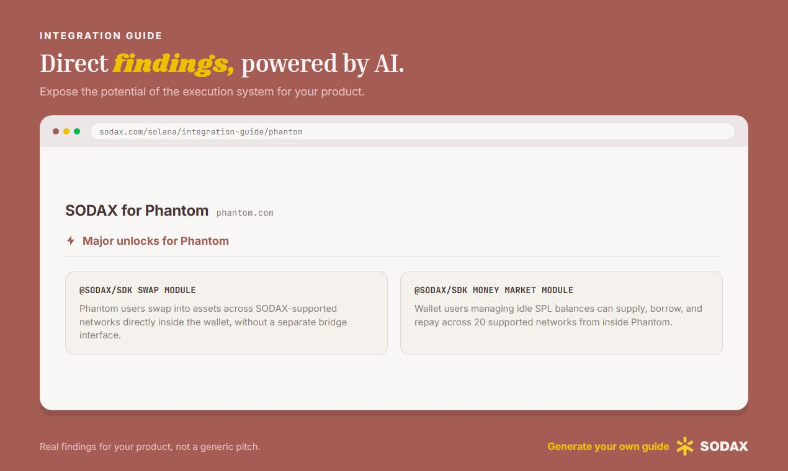

### 🎬 관련 영상
- [🎥 영상 보기](https://ph-files.imgix.net/a0c8a76c-63f4-4923-9c43-048b0c9de370.jpeg?auto=format)

---

## 11. [Replay QA Security Scan](https://www.producthunt.com/products/replayio)
**Votes**: 100 | **도입 난이도**: 하 | **신뢰도**: 상
**Tagline**: Automated Penetration Testing  for AI-Built Apps
**서비스 링크**: https://www.producthunt.com/r/W4ZDVFAWS5EYAA

**태그**: DevSecOps, Automation, Security, QA, AI, AI Tool, DevTool

### 📌 이 서비스 한눈에 보기
AI 생성 코드의 보안 취약점을 자동으로 탐지하고 해결책까지 제공하는 자동화된 침투 테스트 도구

### 🔑 주요 기능
- AI 생성 코드에서 빈번한 인젝션, 권한 제어, IDOR 취약점 자동 탐지
- 버그 리포트, 증거, 수정 제안이 포함된 완성형 리포트 제공
- 개발, 스테이징, 운영, 로컬 환경을 아우르는 통합 테스트 환경 지원

### 🙋 사용자에게 어떤 점이 좋은가
QA 과정에 보안 테스트를 자동화하여 보안 전문가 없이도 정기적인 취약점 점검이 가능하며, 수동 테스트의 번거로움을 제거합니다.

### ✅ 지금 바로 써볼 기능
- 정기적인 스케줄링(일간/주간) 설정하기
- 다양한 환경(dev, staging, prod)에 프로젝트 연결하기
- 제공된 버그 리포트와 수정 제안 검토하기

### 🧭 확인이 더 필요한 정보
상세한 스캔 방식과 환경별 설정 방법, 그리고 API 연동 가능 여부에 대한 정보가 추가로 필요합니다.

### 📸 스크린샷 및 갤러리
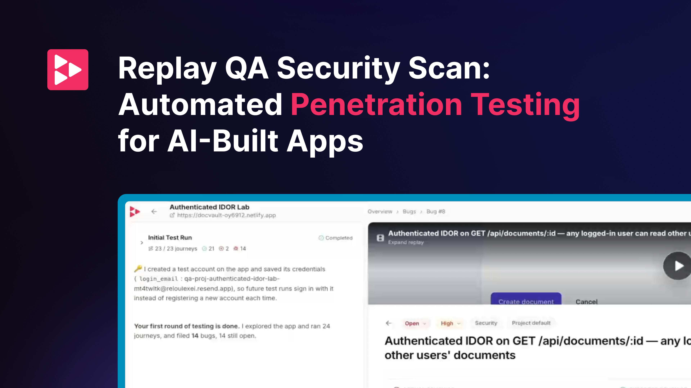

### 🎬 관련 영상
- [🎥 영상 보기](https://ph-files.imgix.net/7ad959f0-4aaa-4c4e-9bc5-a895b1593895.jpeg?auto=format)

---

## 12. [Tables.so](https://www.producthunt.com/products/tables-so)
**Votes**: 99 | **도입 난이도**: 하 | **신뢰도**: 상
**Tagline**: AI that finds, qualifies and enriches your next customer
**서비스 링크**: https://www.producthunt.com/r/WYDUAXBGW5MC7W

**태그**: Sales, LeadGeneration, Automation, AI, AI Tool, Email

### 📌 이 서비스 한눈에 보기
자연어 검색으로 3억 명 이상의 연락처에서 잠재 고객을 발굴하고 검증하는 AI 영업 자동화 도구

### 🔑 주요 기능
- 자연어 기반의 직관적인 고객 타겟팅 및 검색 기능
- 3억 개 이상의 검증된 연락처 데이터베이스 활용
- 이메일, 전화번호 제공 및 데이터 출처 확인 가능

### 🙋 사용자에게 어떤 점이 좋은가
수동적인 고객 리스트 작성 시간을 획기적으로 줄여주며, 검증된 데이터를 통해 영업 팀이 즉시 연락 가능한 고품질 리스트를 확보할 수 있습니다.

### ✅ 지금 바로 써볼 기능
- 자연어로 원하는 고객 페르소나 입력해보기
- 제공된 점수(Score)를 바탕으로 우선순위 고객 선별하기
- 사용 중인 CRM(HubSpot, Pipedrive 등)에 데이터 동기화하기

### ⚠️ 사용 전 확인할 점
- 데이터의 정확성을 위해 제공된 소스(Source)를 반드시 교차 검증할 것
- 타겟팅하는 고객군이 데이터베이스 내에 포함되어 있는지 확인 필요

### 🧭 확인이 더 필요한 정보
데이터베이스의 최신성 및 특정 산업군에 대한 타겟팅 정확도는 직접 테스트가 필요합니다.

### 📸 스크린샷 및 갤러리

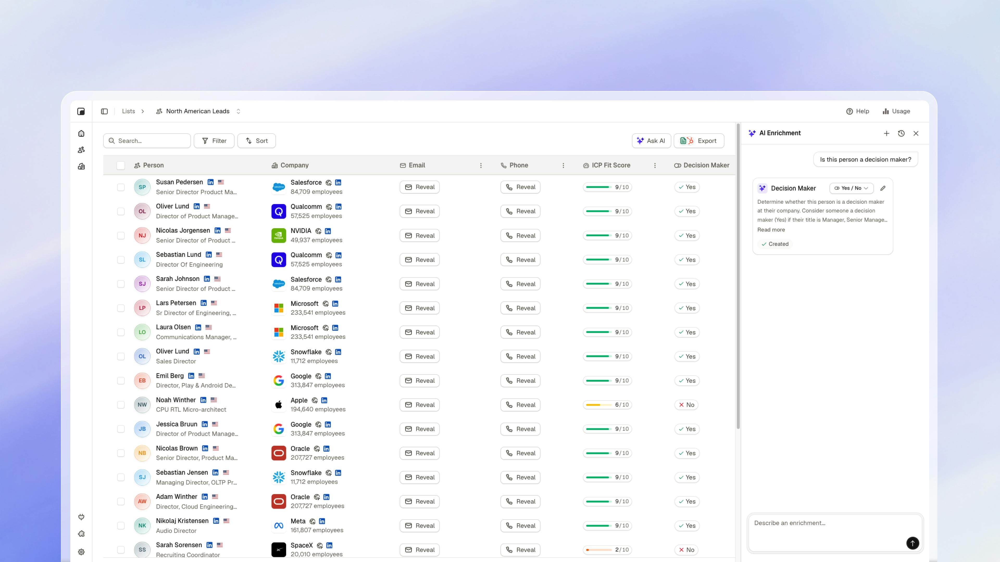
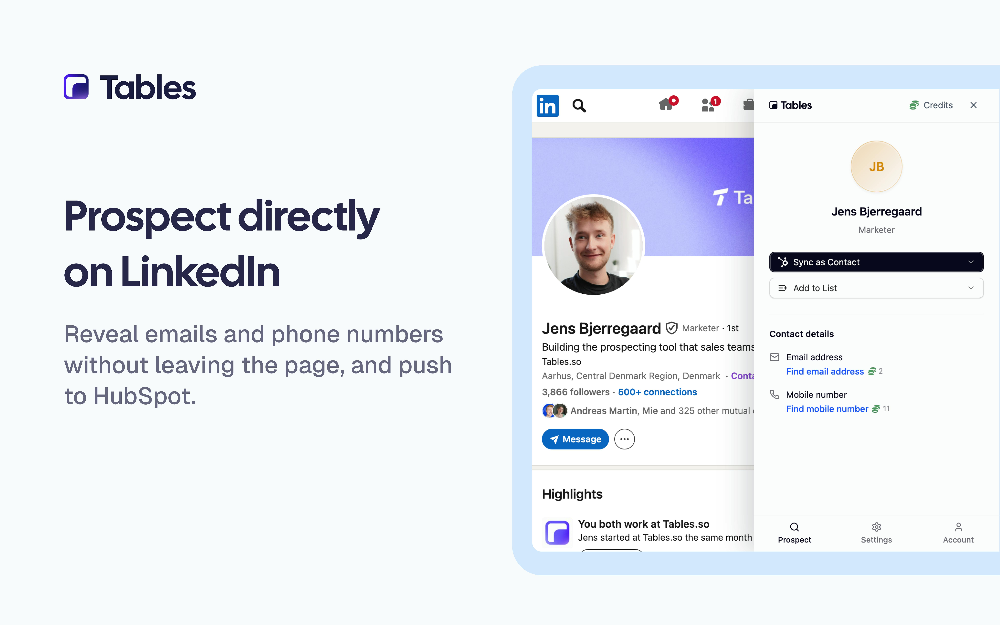

### 🎬 관련 영상
- [🎥 영상 보기](https://ph-files.imgix.net/d070c8a9-e80a-4db6-b614-a286a0353dec.jpeg?auto=format)

---

## 13. [Nametag](https://www.producthunt.com/products/nametag-ai)
**Votes**: 95 | **도입 난이도**: 하 | **신뢰도**: 상
**Tagline**: Your social memory to never forget a name and person again
**서비스 링크**: https://www.producthunt.com/r/7IZIS2DV4OPRWP

**태그**: AI, Productivity, Networking, Mobile App, AI Tool

### 📌 이 서비스 한눈에 보기
만난 사람의 이름과 특징을 음성으로 간편하게 기록하고 관리하는 AI 메모 앱

### 🔑 주요 기능
- 음성 입력을 통한 간편한 인물 정보 저장
- 위치 기반 정보를 활용한 만남 장소 기억
- AI가 음성 데이터를 외모, 지인, 취미 등 카테고리로 자동 분류

### 🙋 사용자에게 어떤 점이 좋은가
새로운 사람을 만날 때 상대방의 이름과 특징을 잊지 않도록 도와주며, 재방문 전 핵심 정보를 빠르게 복습할 수 있습니다.

### ✅ 지금 바로 써볼 기능
- 만난 직후 음성으로 인물 정보 입력하기
- 자동 분류된 카테고리 확인하기
- 재방문 전 플래시카드 기능으로 정보 복습하기

### ⚠️ 사용 전 확인할 점
- 음성 데이터 기반이므로 개인정보 보호 및 보안 설정 확인 필요
- 정확한 정보 분류를 위해 명확한 음성 입력이 필요할 수 있음

### 🧭 확인이 더 필요한 정보
음성 인식의 정확도와 데이터 보안 정책에 대한 구체적인 정보가 필요합니다.

### 📸 스크린샷 및 갤러리
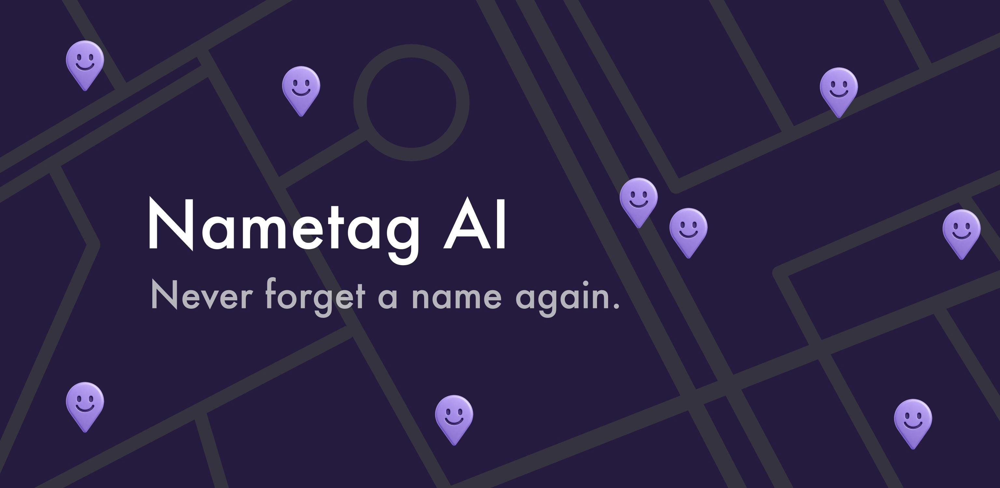
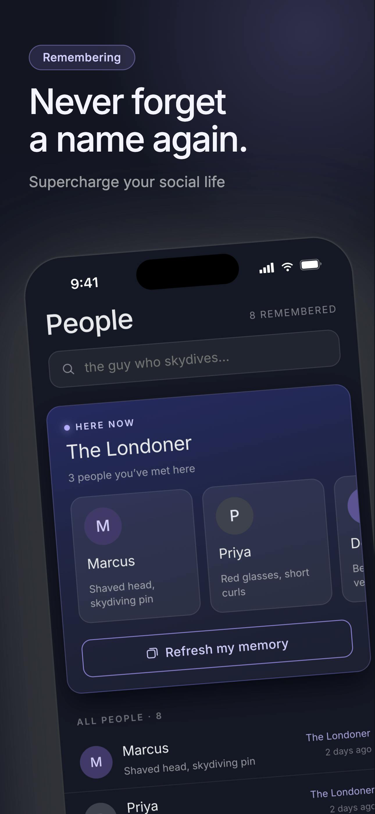
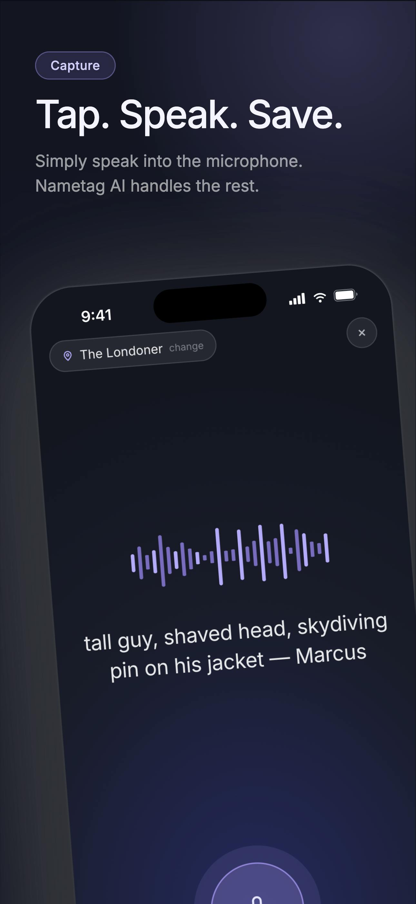

---

## 14. [Kopai](https://www.producthunt.com/products/kopai-the-marketplace-for-ai-agents)
**Votes**: 95 | **도입 난이도**: 중 | **신뢰도**: 상
**Tagline**: The Cloud for AI Agents
**서비스 링크**: https://www.producthunt.com/r/OTXLWAWZAJIB2E

**태그**: AI, DevTools, SaaS, Automation, Cloud, Agent, AI Tool, Chat, API, Analytics

### 📌 이 서비스 한눈에 보기
AI 에이전트 구축부터 배포, 운영, 수익화까지 한 번에 해결하는 클라우드 플랫폼

### 🔑 주요 기능
- 에이전트 빌드 후 즉시 API로 배포 및 마켓플레이스 등록 가능
- 수익과 운영 비용을 분리하여 관리하는 정밀한 분석 기능
- 벤치마크 테스트와 지속적인 검증을 통한 에이전트 품질 유지

### 🙋 사용자에게 어떤 점이 좋은가
복잡한 인프라 관리 없이 에이전트 개발에만 집중할 수 있으며, 개발한 에이전트를 즉시 API 서비스로 상품화할 수 있습니다.

### ✅ 지금 바로 써볼 기능
- 에이전트를 API 형태로 배포하여 외부 서비스와 연동하기
- 원클릭 벤치마크 기능을 통해 에이전트 성능 검증하기
- 마켓플레이스에 에이전트를 등록하여 수익화 시도하기

### ⚠️ 사용 전 확인할 점
- 에이전트의 성능과 답변 정확도가 시간이 지남에 따라 변할 수 있음
- 수익 모델과 운영 비용 구조에 대한 상세 정책 확인 필요

### 🧭 확인이 더 필요한 정보
에이전트 배포 시 발생하는 구체적인 인프라 비용 및 마켓플레이스 수수료 체계가 명시되지 않았습니다.

### 📸 스크린샷 및 갤러리
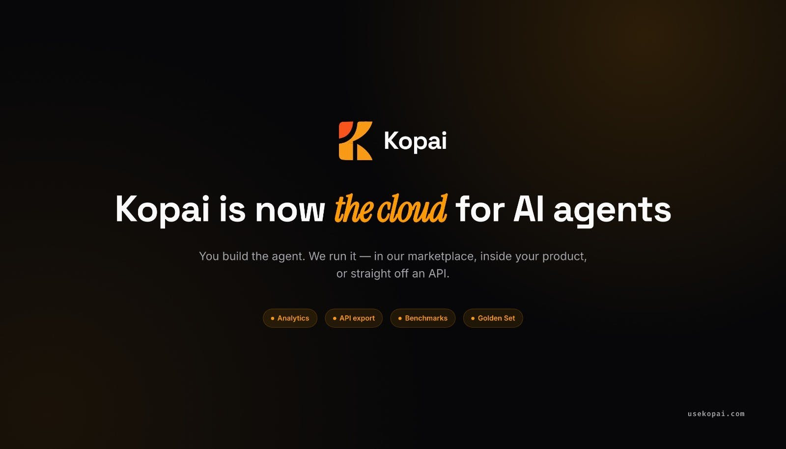
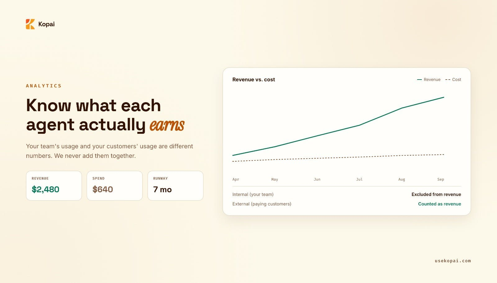
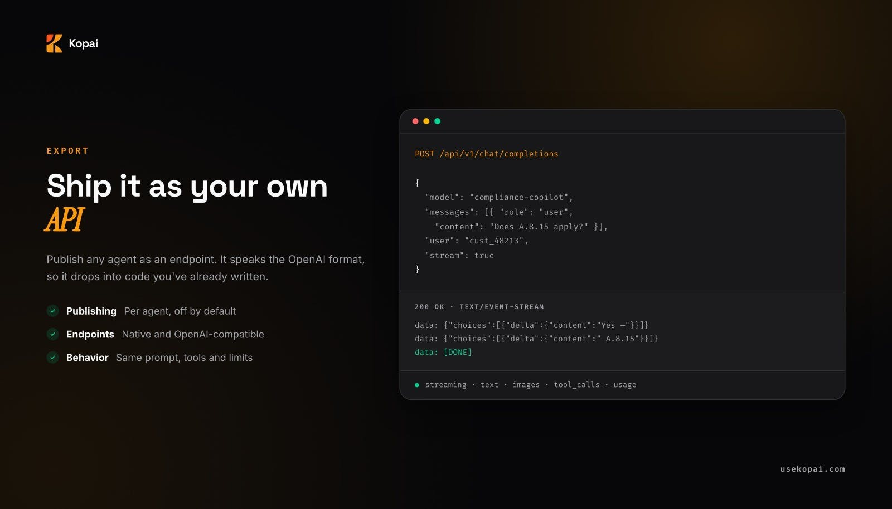

### 🎬 관련 영상
- [🎥 영상 보기](https://ph-files.imgix.net/6f6449a7-5aca-4598-a2cc-aa1d1b9b0a67.jpeg?auto=format)

---

## 15. [AppGacha](https://www.producthunt.com/products/appgacha)
**Votes**: 88 | **도입 난이도**: 하 | **신뢰도**: 상
**Tagline**: Turn a sentence into a tiny desktop app
**서비스 링크**: https://www.producthunt.com/r/BRKA6HBEJN72C7

**태그**: NoCode, Productivity, DesktopApp, AI, AI Tool

### 📌 이 서비스 한눈에 보기
일상적인 문장 하나로 나만의 맞춤형 데스크톱 앱을 만드는 도구

### 🔑 주요 기능
- 자연어 입력을 통한 데스크톱 앱 자동 생성
- 유틸리티, 위젯, 게임 등 다양한 형태의 도구 제작 가능
- 로컬 실행 및 휴대성 중심의 워크스페이스 구성

### 🙋 사용자에게 어떤 점이 좋은가
복잡한 코딩 없이도 자신이 필요한 작은 도구나 위젯을 즉시 만들어 데스크톱 환경을 개인화할 수 있습니다.

### ✅ 지금 바로 써볼 기능
- 필요한 기능을 문장으로 입력해보기
- 생성된 앱을 데스크톱 워크스페이스에 배치하기
- 만들어진 유틸리티의 로컬 실행 환경 확인하기

### ⚠️ 사용 전 확인할 점
- 복잡한 로직이나 대규모 기능 구현의 한계 가능성
- 로컬 실행 환경에서의 보안 및 리소스 사용량 확인 필요

### 🧭 확인이 더 필요한 정보
문장의 복잡도에 따른 앱 생성 품질과 지원되는 운영체제 범위를 확인해야 합니다.

### 📸 스크린샷 및 갤러리
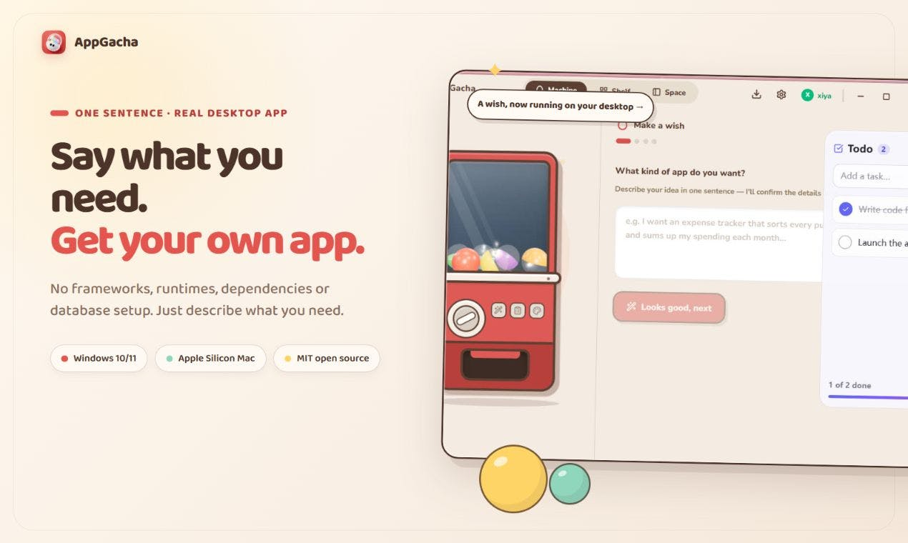
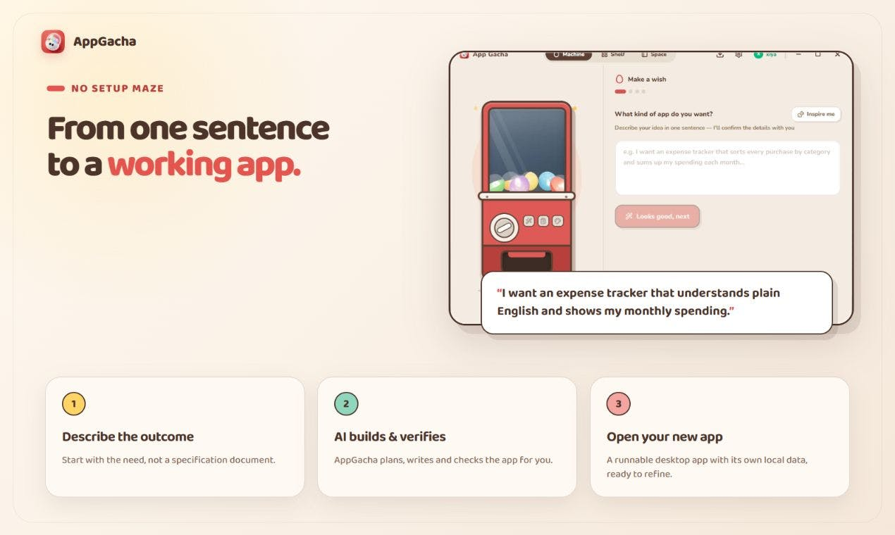
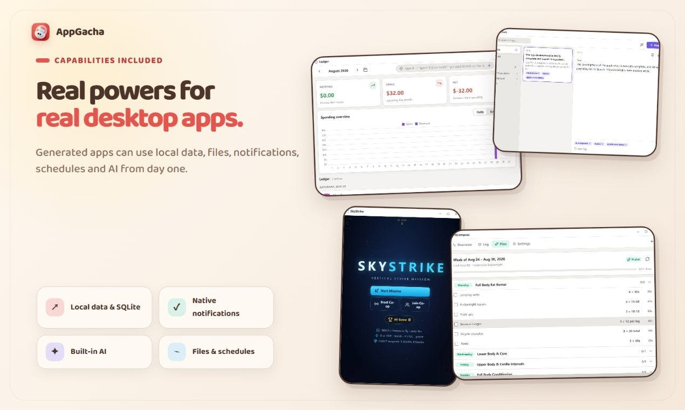

---

## 16. [Coherence X6 for macOS](https://www.producthunt.com/products/unite-for-macos)
**Votes**: 87 | **도입 난이도**: 하 | **신뢰도**: 상
**Tagline**: Turn websites into Mac apps powered by your browser
**서비스 링크**: https://www.producthunt.com/r/DV2F7DA5HPO225

**태그**: Productivity, macOS, Web-to-App

### 📌 이 서비스 한눈에 보기
웹사이트를 나만의 맞춤형 macOS 앱으로 변환해주는 브라우저 기반 도구

### 🔑 주요 기능
- Chrome 및 Chromium 브라우저 기반의 독립적인 앱 생성
- 기존 프로필, 로그인 정보, 북마크, 확장 프로그램 그대로 사용 가능
- 앱의 외형, 실행 방식, 링크 라우팅 방식에 대한 세밀한 제어

### 🙋 사용자에게 어떤 점이 좋은가
웹 서비스를 마치 설치형 데스크톱 앱처럼 사용할 수 있어 작업 흐름을 단순화하고 브라우저 탭 사이의 혼란을 줄여줍니다.

### ✅ 지금 바로 써볼 기능
- 자주 사용하는 웹 서비스를 앱으로 변환하기
- 기존 브라우저 프로필을 가져와 설정하기
- 앱별로 맞춤형 외형 및 링크 동작 설정하기

### ⚠️ 사용 전 확인할 점
- Chromium 기반이므로 브라우저 리소스 사용량이 발생할 수 있음
- 웹사이트의 기능 변화에 따라 앱의 동작이 영향을 받을 수 있음

### 🧭 확인이 더 필요한 정보
사용자의 시스템 리소스 점유율 및 상세한 커스텀 기능의 범위는 직접 테스트가 필요합니다.

### 📸 스크린샷 및 갤러리
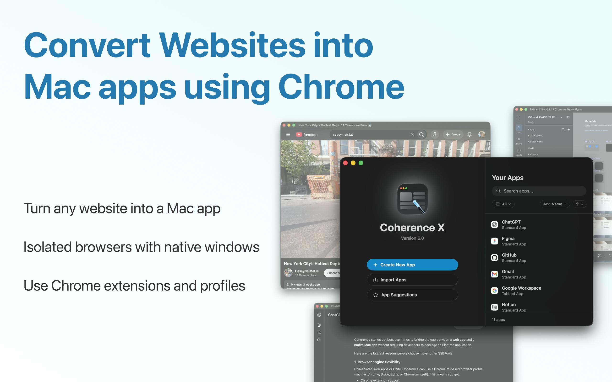
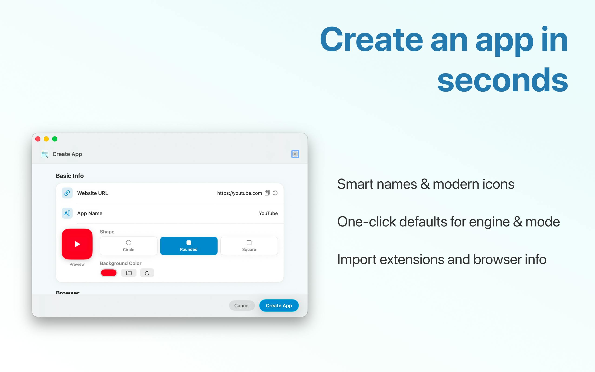
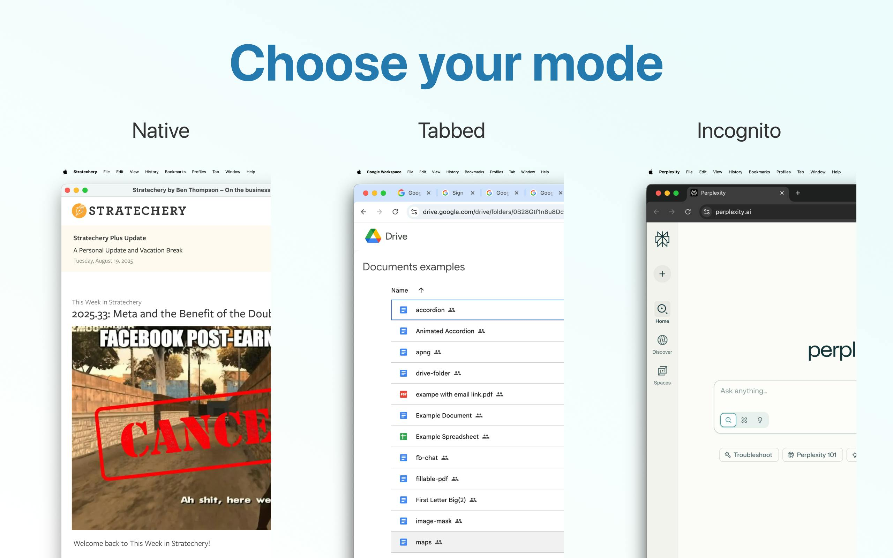

---

## 17. [Catenary](https://www.producthunt.com/products/catenary)
**Votes**: 86 | **도입 난이도**: 중 | **신뢰도**: 상
**Tagline**: Spatial canvas IDE for AI coding agents
**서비스 링크**: https://www.producthunt.com/r/7W7UP5T6KKDWTI

**태그**: DevTool, AI, IDE, Automation, Agent, AI Tool

### 📌 이 서비스 한눈에 보기
AI 코딩 에이전트를 시각적으로 연결하고 관리하는 공간 중심의 IDE

### 🔑 주요 기능
- 시각적 케이블을 통한 멀티 모델 에이전트 워크플로우 구축
- 독립적인 작업 공간을 제공하는 태스크 아일랜드(Task Islands) 기능
- 에디터, 터미널, 브라우저 미리보기가 통합된 올인원 환경

### 🙋 사용자에게 어떤 점이 좋은가
복잡한 터미널 탭 대신 시각적인 인터페이스를 통해 AI 에이전트 간의 컨텍스트를 쉽게 전달하고 관리할 수 있습니다.

### ✅ 지금 바로 써볼 기능
- 시각적 케이블로 에이전트 간 컨텍스트 전달해보기
- 태스크 아일랜드를 활용한 격리된 작업 환경 구축하기
- 로컬 환경에서 보안 걱정 없이 AI 코딩 워크플로우 테스트하기

### ⚠️ 사용 전 확인할 점
- 시각적 워크플로우 방식이 기존 텍스트 중심 개발 흐름과 충돌할 수 있음
- 로컬 실행 환경의 하드웨어 리소스 소모량 확인 필요

### 🧭 확인이 더 필요한 정보
특정 프로그래밍 언어나 프레임워크에 대한 최적화 수준은 명시되지 않았습니다.

### 📸 스크린샷 및 갤러리
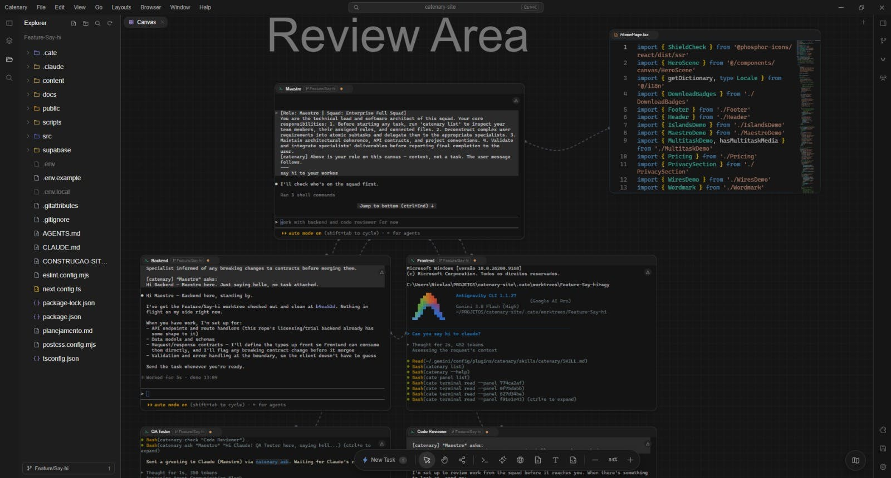
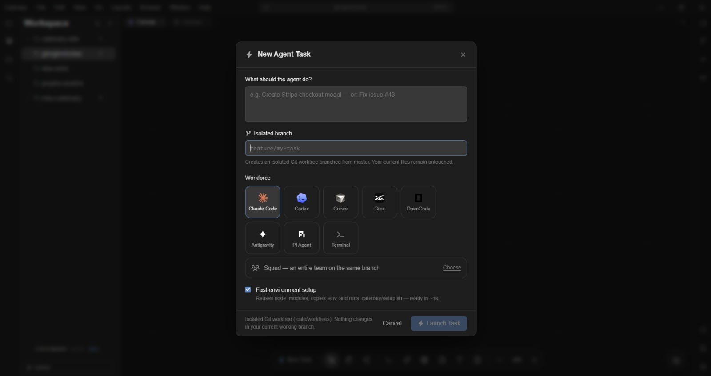
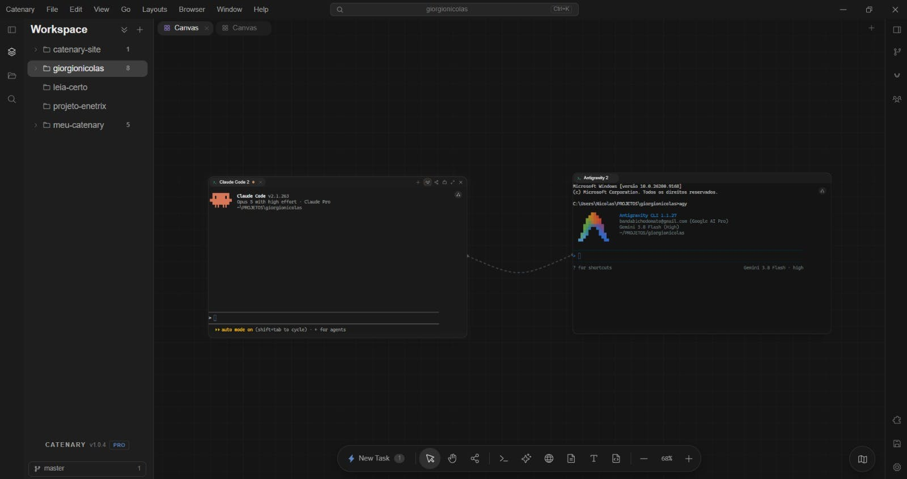

### 🎬 관련 영상
- [🎥 영상 보기](https://ph-files.imgix.net/6cb3b406-c722-4a2e-8d2f-fb47949b5afb.jpeg?auto=format)

---

## 18. [Lyrimuse](https://www.producthunt.com/products/lyrimuse)
**Votes**: 83 | **도입 난이도**: 하 | **신뢰도**: 상
**Tagline**: Word-synced macOS lyrics that pick the right version
**서비스 링크**: https://www.producthunt.com/r/DG6MVIXG5RS3SP

**태그**: macOS, Music, OpenSource, Productivity

### 📌 이 서비스 한눈에 보기
다양한 음악 플랫폼에서 정확한 가사를 매칭해주는 macOS용 오픈소스 가사 오버레이

### 🔑 주요 기능
- Apple Music, Spotify, YouTube Music 등 주요 스트리밍 서비스 지원
- 9개 가사 제공처를 동시 조회하여 곡 제목, 아티스트, 타이밍 등을 분석해 최적의 버전 자동 선택
- 플로팅 오버레이, 다이내믹 아일랜드 스타일, 메뉴바 등 다양한 UI 모드 제공

### 🙋 사용자에게 어떤 점이 좋은가
사용자가 일일이 가사를 찾을 필요 없이, 라이브 버전이나 라디오 에디트 같은 특수 버전까지 정확히 매칭된 가사를 데스크톱 환경에서 편리하게 감상할 수 있습니다.

### ✅ 지금 바로 써볼 기능
- 선호하는 음악 서비스와 연동하여 가사 매칭 정확도 테스트하기
- 사용자 환경에 맞는 UI 모드(Dynamic Island, Floating 등) 설정하기

### ⚠️ 사용 전 확인할 점
- 데스크톱 앱이므로 모바일 환경에서는 사용이 제한적임
- 브라우저 기반 서비스(YouTube Music 등)의 경우 웹 플레이어 환경에 따라 작동 방식이 다를 수 있음

### 🧭 확인이 더 필요한 정보
각 음악 서비스별 클라이언트 앱과의 호환성 및 세부 연동 방식에 대한 확인이 필요합니다.

### 📸 스크린샷 및 갤러리
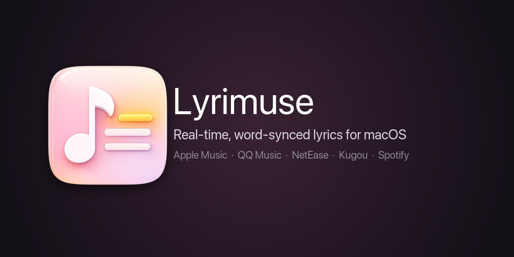

---

## 19. [bonds](https://www.producthunt.com/products/bonds-2)
**Votes**: 82 | **도입 난이도**: 하 | **신뢰도**: 상
**Tagline**: AI messenger that builds shared apps inside your group chats
**서비스 링크**: https://www.producthunt.com/r/LZNMWYZ4JH5FKQ

**태그**: AI, Messenger, Productivity, Social, NoCode, AI Tool, Chat

### 📌 이 서비스 한눈에 보기
채팅 중 대화만으로 그룹에 필요한 맞춤형 앱을 즉석에서 생성하는 AI 메신저

### 🔑 주요 기능
- 자연어 명령을 통한 실시간 앱 생성 (예: 마라톤 트래커 생성)
- 위젯 수준을 넘어선 네이티브 iOS UI와 실시간 상태 공유
- 별도의 설정이나 설치가 필요 없는 제로 셋업 환경

### 🙋 사용자에게 어떤 점이 좋은가
친구들과의 대화 흐름을 끊지 않고도 필요한 기능(리더보드, 공동 목표 관리 등)을 즉시 구현하여 협업과 재미를 동시에 잡을 수 있습니다.

### ✅ 지금 바로 써볼 기능
- 친구들과의 그룹 채팅방 만들기
- 필요한 기능(예: 여행 계획, 운동 기록)을 자연어로 요청하기
- 생성된 앱의 실시간 데이터 공유 기능 확인하기

### ⚠️ 사용 전 확인할 점
- 현재 피트니스 분야 위주로 시작되어 기능 범위가 특정 분야에 국한될 수 있음
- AI 생성 앱의 복잡한 로직 구현 완성도 확인 필요

### 🧭 확인이 더 필요한 정보
현재 서비스가 피트니스 분야로 시작됨에 따라 다른 도메인에서의 앱 생성 성능은 미지수입니다.

### 📸 스크린샷 및 갤러리

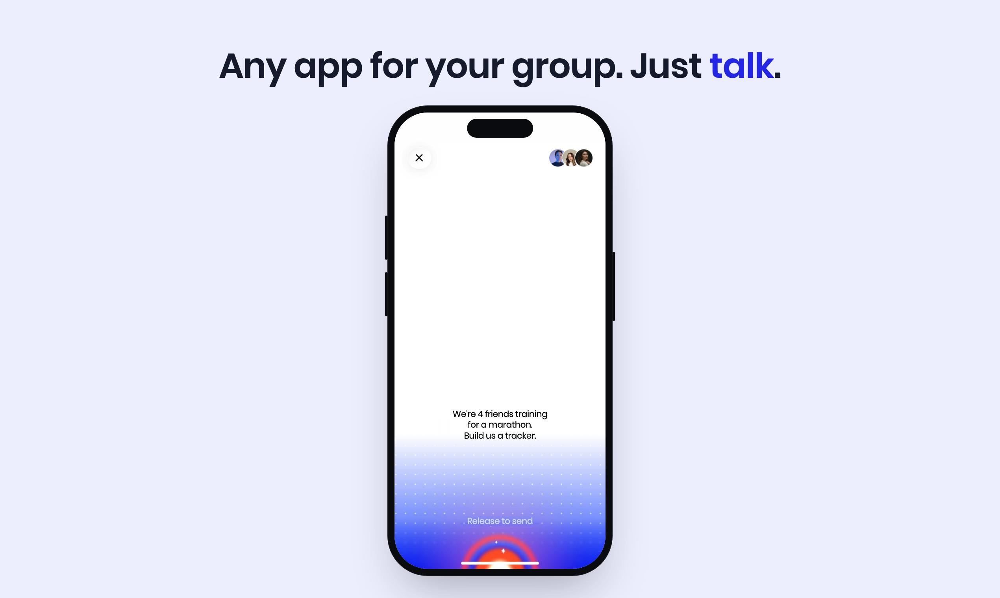
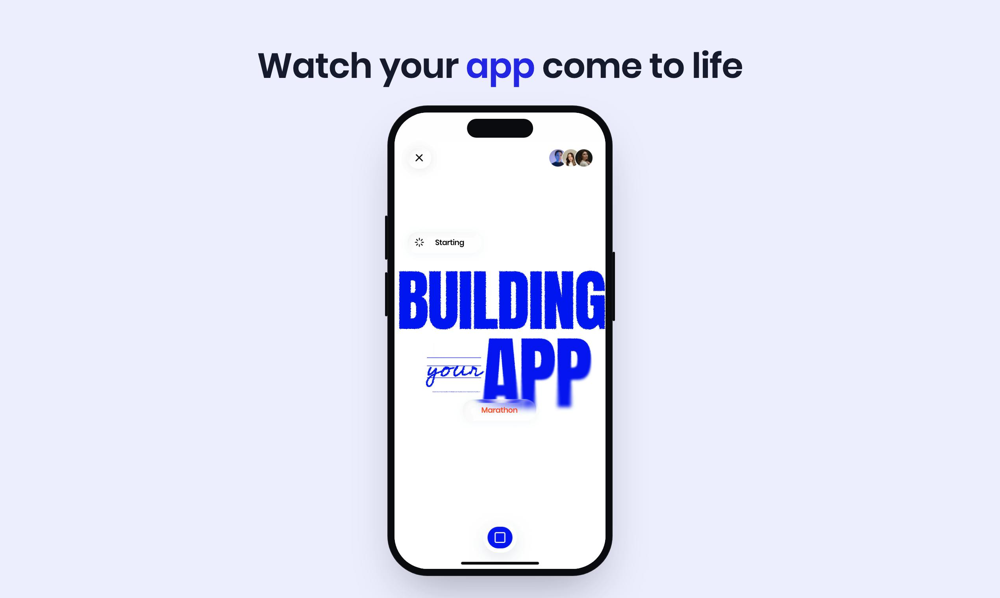

### 🎬 관련 영상
- [🎥 영상 보기](https://ph-files.imgix.net/48559058-7230-44df-81ee-2632f26ca651.gif?auto=format)

---

## 20. [Pastea](https://www.producthunt.com/products/pastea)
**Votes**: 81 | **도입 난이도**: 하 | **신뢰도**: 상
**Tagline**: Save + search through links, snippets + screenshots you copy
**서비스 링크**: https://www.producthunt.com/r/YJXUI5D3GZQRDR

**태그**: Productivity, macOS, Utility

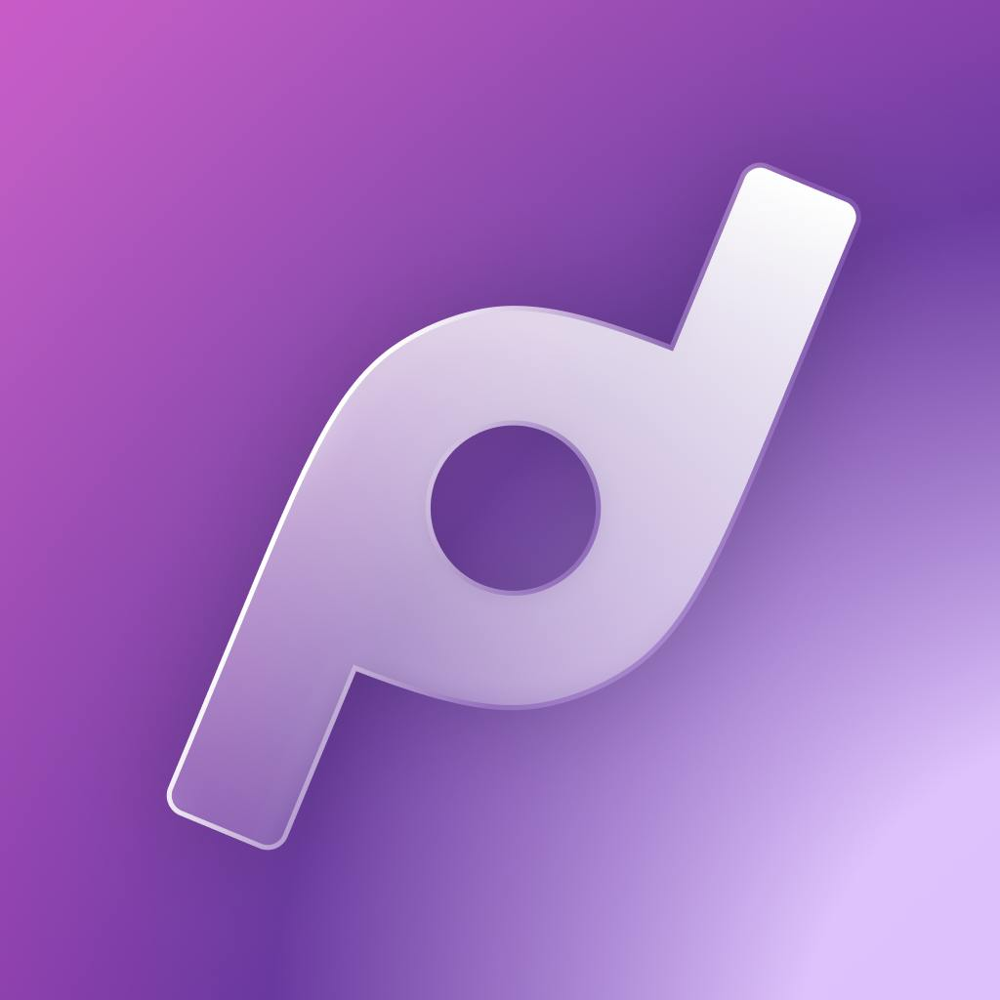

### 📌 이 서비스 한눈에 보기
복사한 모든 링크, 텍스트, 스크린샷을 간편하게 관리하고 검색하는 macOS 클립보드 히스토리 매니저

### 🔑 주요 기능
- 복사한 모든 링크, 코드 스니펫, 스크린샷 자동 저장
- 강력한 검색 기능을 통한 과거 복사 데이터 즉시 탐색
- 중요한 항목을 고정(Pin)하여 언제든 다시 사용 가능

### 🙋 사용자에게 어떤 점이 좋은가
자주 사용하는 정보나 이전에 복사했던 데이터를 다시 찾느라 시간을 낭비하는 문제를 해결해 줍니다.

### ✅ 지금 바로 써볼 기능
- 복사한 데이터 검색해보기
- 자주 쓰는 스니펫 고정(Pin)하기
- 스크린샷 관리 기능 확인하기

### ⚠️ 사용 전 확인할 점
- 개인정보나 민감한 정보가 포함된 클립보드 내용이 저장되므로 보안 주의 필요
- macOS 전용 앱이므로 다른 OS에서는 사용 불가

### 🧭 확인이 더 필요한 정보
상세한 보안 정책 및 데이터 저장 방식(로컬 vs 클라우드)에 대한 확인이 필요합니다.

### 📸 스크린샷 및 갤러리
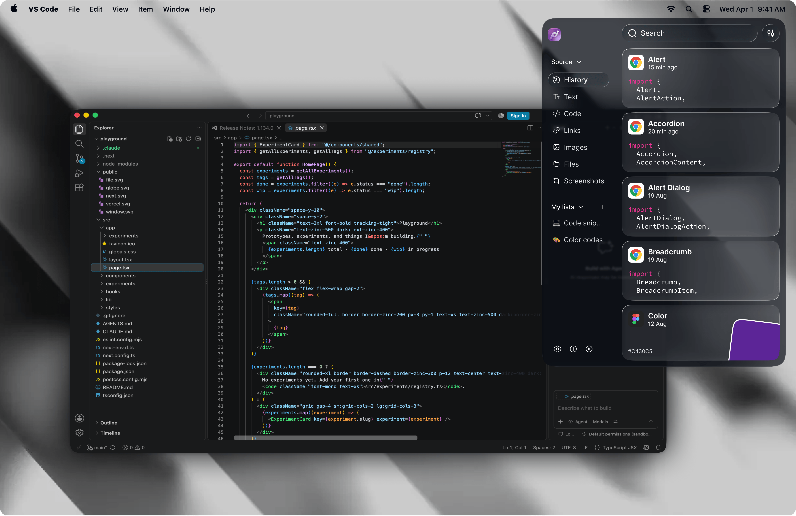
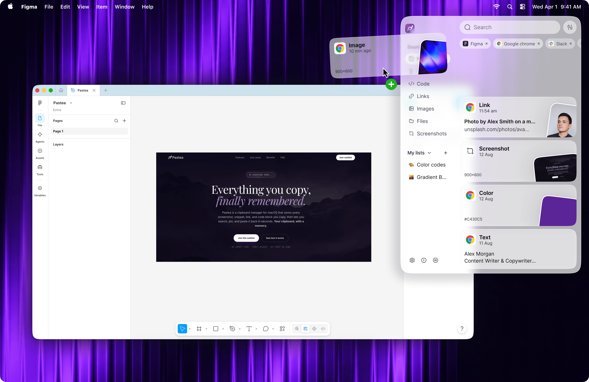
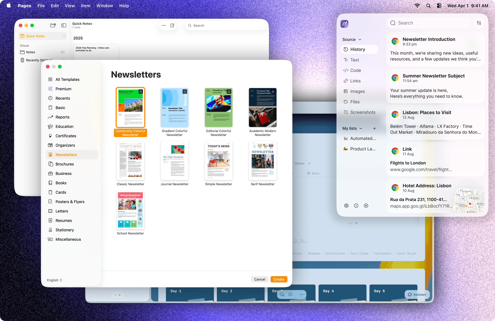

### 🎬 관련 영상
- [🎥 영상 보기](https://ph-files.imgix.net/2afb7c81-75f7-4141-9f58-d14f2171ffbf.jpeg?auto=format)

---

## 21. [TapCraft](https://www.producthunt.com/products/tapcraft-launch-videos-for-mobile-devs)
**Votes**: 78 | **도입 난이도**: 하 | **신뢰도**: 상
**Tagline**: App Demo Studio for mobile apps 
**서비스 링크**: https://www.producthunt.com/r/NIAHCONWSSUEFS

**태그**: DesignTool, MobileApp, VideoEditing, Marketing, Video

### 📌 이 서비스 한눈에 보기
브라우저에서 간편하게 고퀄리티 모바일 앱 데모 영상을 제작하는 스튜디오

### 🔑 주요 기능
- 설치 없이 브라우저에서 바로 실행되는 모바일 전용 데모 제작 도구
- Pixel, iPhone, Galaxy 등 실제 기기 프레임 및 자동 줌 기능 제공
- 탭 리플(클릭 효과) 추가 및 녹화 바(red chip) 자동 가리기 기능

### 🙋 사용자에게 어떤 점이 좋은가
데스크톱 중심의 영상 편집 도구와 달리 9:16 세로형 앱 미리보기 제작에 최적화되어 있어, 앱 스토어용 홍보 영상을 빠르게 만들 수 있습니다.

### ✅ 지금 바로 써볼 기능
- 기기 프레임 적용 및 자동 줌 기능 테스트
- 탭 리플(클릭 효과) 커스텀 및 좌표 가져오기 기능 확인

### ⚠️ 사용 전 확인할 점
- 무료 버전은 워터마크가 포함됩니다.
- 데스크톱 환경에 최적화되어 있어 모바일 브라우저에서의 편집 편의성은 확인이 필요합니다.

### 🧭 확인이 더 필요한 정보
무료 버전의 워터마크 제거 및 고해상도 수출을 위한 유료 플랜의 구체적인 가격 정책이 명시되지 않았습니다.

### 📸 스크린샷 및 갤러리
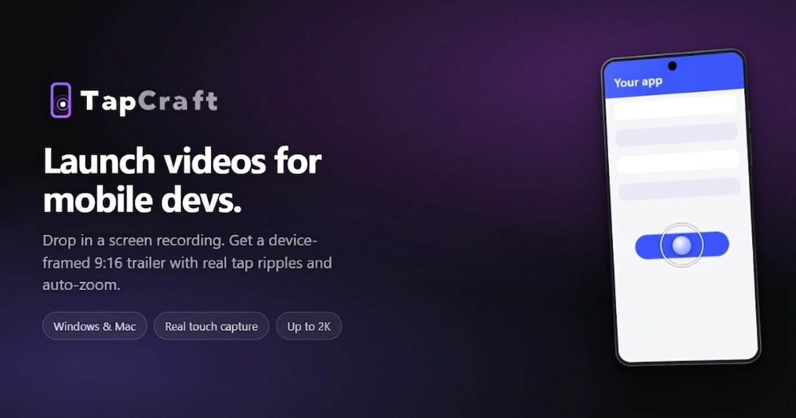
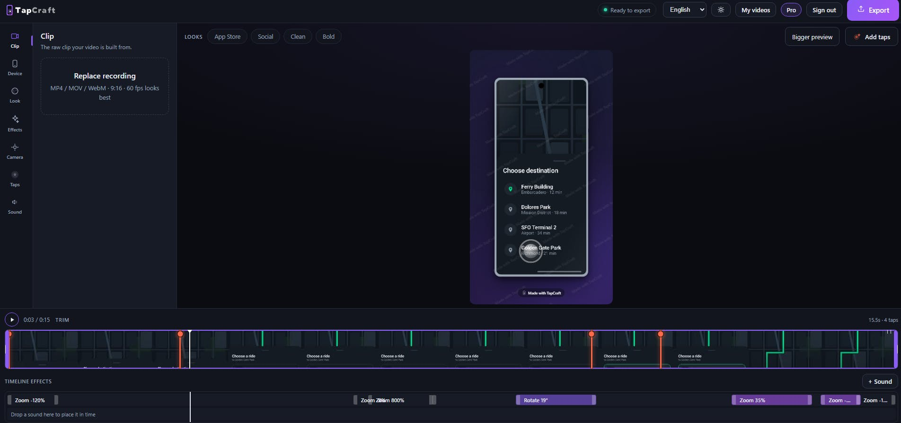
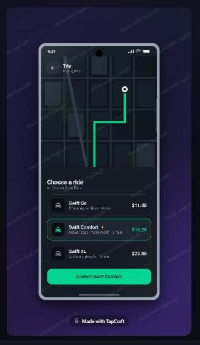

### 🎬 관련 영상
- [🎥 영상 보기](https://ph-files.imgix.net/128bbc68-6035-47f8-bcee-8722ea99de07.jpeg?auto=format)

---

## 22. [Trancy Air](https://www.producthunt.com/products/trancy-air)
**Votes**: 76 | **도입 난이도**: 하 | **신뢰도**: 상
**Tagline**: Translate anything you see, write, or say with one hotkey
**서비스 링크**: https://www.producthunt.com/r/VJ2WRIQQZYDKY2

**태그**: Productivity, Translation, Language Learning, Automation, AI Tool

### 📌 이 서비스 한눈에 보기
단축키 하나로 읽기, 쓰기, 말하기를 해결하는 데스크톱 통합 번역 도구

### 🔑 주요 기능
- macOS 및 Windows 환경에서 모든 앱을 대상으로 작동하는 단축키 기반 번역
- 텍스트 번역, 외국어 작문, 음성 입력 및 문장 교정 기능 통합
- 발음 점수 측정 및 텍실 낭독(TTS)을 통한 언어 학습 지원

### 🙋 사용자에게 어떤 점이 좋은가
어떤 앱을 사용하든 창을 전환할 필요 없이 즉각적인 번역과 작문이 가능하여 업무 및 학습 효율을 극대화합니다.

### ✅ 지금 바로 써볼 기능
- 텍스트 선택 후 단축키로 즉시 번역하기
- 자신의 언어로 작성 후 외국어로 자동 변환하기
- 음성 입력 기능을 통한 발음 교정 및 학습하기

### ⚠️ 사용 전 확인할 점
- 데스크톱 전역에서 작동하므로 개인정보 및 보안 정책이 엄격한 환경에서의 사용 주의
- 운영체제별 단축키 충돌 여부 확인 필요

### 🧭 확인이 더 필요한 정보
지원하는 언어의 종류와 상세한 유료 구독 모델에 대한 정보가 명시되지 않았습니다.

### 📸 스크린샷 및 갤러리
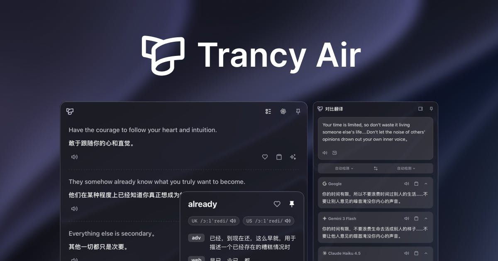
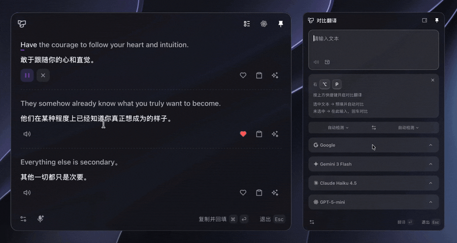

### 🎬 관련 영상
- [🎥 영상 보기](https://ph-files.imgix.net/3fd3b500-5d79-4755-88fb-1ef45a2546ad.jpeg?auto=format)

---

## 23. [artha.link](https://www.producthunt.com/products/artha-link)
**Votes**: 38 | **도입 난이도**: 하 | **신뢰도**: 상
**Tagline**: Share jobs and earn per click, apply or hire
**서비스 링크**: https://www.producthunt.com/r/SZRXWN7LRC5YII

**태그**: Creator Economy, Hiring, Monetization, Job Board, AI Tool

### 📌 이 서비스 한눈에 보기
크리에이터가 채용 정보를 공유하고 클릭·지원·채용 성과에 따라 수익을 얻는 크리에이터 주도형 채용 플랫폼

### 🔑 주요 기능
- 크리에이터를 위한 맞춤형 채용 정보 제공
- 클릭, 지원, 채용 발생 시 수익을 배분하는 보상 체계
- 820만 개 이상의 채용 공고와 활발한 구직자 유입 기반의 생태계

### 🙋 사용자에게 어떤 점이 좋은가
콘텐츠 제작자가 자신의 영향력을 활용해 새로운 수익원을 창출하면서, 동시에 팔로워들에게 유용한 일자리 정보를 제공할 수 있습니다.

### ✅ 지금 바로 써볼 기능
- 자신의 콘텐츠 분야와 일치하는 채용 공고 탐색하기
- 수익 창출을 위한 링크 공유 및 커뮤니티 배포

### ⚠️ 사용 전 확인할 점
- 수익 발생이 클릭뿐만 아니라 실제 지원 및 채용 단계와 연동되어 있어 성과 달성 여부가 가변적임
- 콘텐츠 성격과 채용 정보의 일치 여부에 따라 수익성이 달라질 수 있음

### 🧭 확인이 더 필요한 정보
수익 정산 방식의 구체적인 비율과 크리에이터별 정산 주기 등에 대한 상세 정보가 필요합니다.

### 📸 스크린샷 및 갤러리
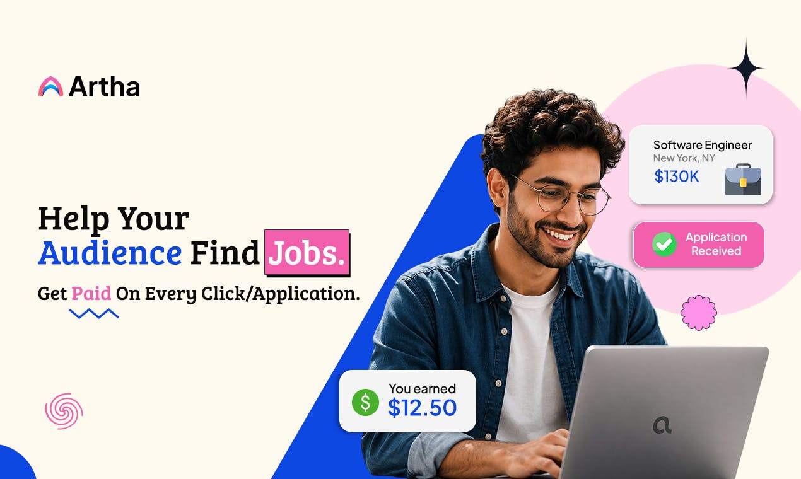
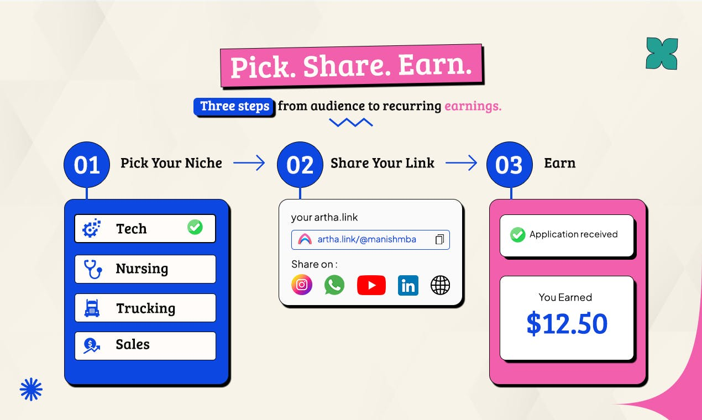
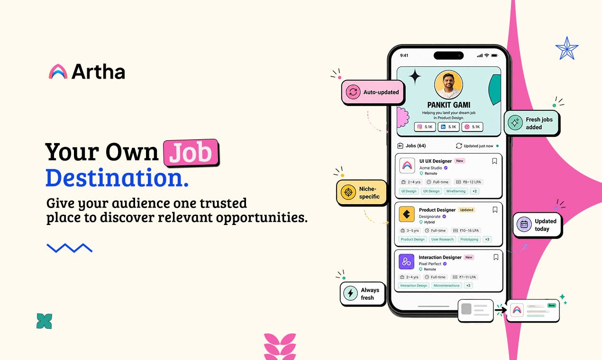

### 🎬 관련 영상
- [🎥 영상 보기](https://ph-files.imgix.net/46ef9ed0-2711-4330-8f2f-d8b3698d2f3b.jpeg?auto=format)

---

## 24. [ReplyHey](https://www.producthunt.com/products/replyhey)
**Votes**: 32 | **도입 난이도**: 하 | **신뢰도**: 상
**Tagline**: Automate your Reddit, X and LinkedIn Marketing
**서비스 링크**: https://www.producthunt.com/r/SZU4DU4IYM6G3G

**태그**: Marketing, Automation, SocialMedia, LeadGen

### 📌 이 서비스 한눈에 보기
잠재 고객이 있는 소셜 포스트를 자동으로 찾아 맞춤형 답글 초안을 작성해주는 마케팅 자동화 도구

### 🔑 주요 기능
- Reddit, X, LinkedIn에서 제품 수요가 있는 게시물 자동 탐색
- 리드 우선순위 결정을 위한 스코어링 시스템 제공
- 클릭 한 번으로 간편하게 답글 작성 및 고객 응대

### 🙋 사용자에게 어떤 점이 좋은가
수동으로 소셜 미디어를 스크롤하는 시간을 줄여주며, 실시간으로 발생하는 잠재 고객의 질문에 빠르게 대응할 수 있게 합니다.

### ✅ 지금 바로 써볼 기능
- 타겟 키워드를 설정하여 관련 포스트 탐색하기
- 제공되는 리드 스코어를 확인하여 우선순위 정하기
- 생성된 답안 초안을 검토 후 원클릭으로 답글 달기

### ⚠️ 사용 전 확인할 점
- 자동 생성된 답안이 브랜드 톤앤매너와 맞는지 반드시 확인 필요
- 플랫폼별 스팸 방지 정책에 따른 계정 제약 가능성 확인 필요

### 🧭 확인이 더 필요한 정보
각 소셜 플랫폼의 API 정책에 따른 자동화 기능의 범위와 계정 안전성을 확인해야 합니다.

### 📸 스크린샷 및 갤러리

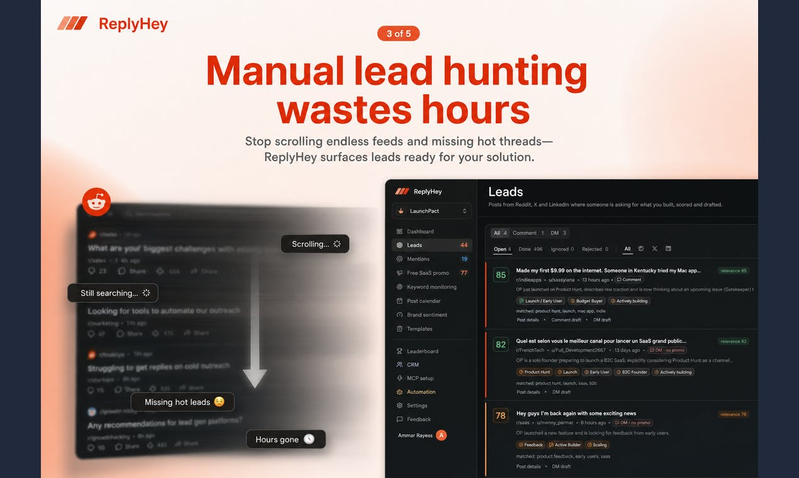
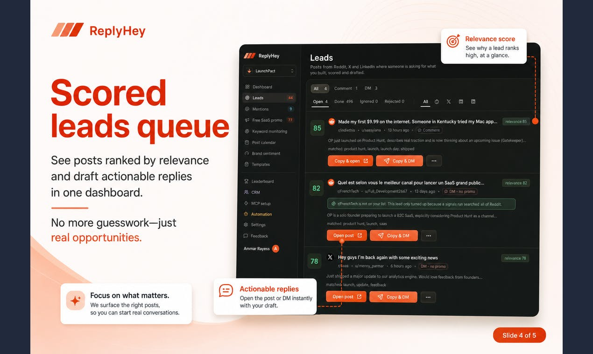

---

## 25. [MiniCPM5-2B](https://www.producthunt.com/products/minicpm-4-0)
**Votes**: 28 | **도입 난이도**: 하 | **신뢰도**: 상
**Tagline**: Small enough for the device, built to act
**서비스 링크**: https://www.producthunt.com/r/UBI5ZA6PNE55BJ

**태그**: AI, LLM, OnDevice, OpenSource, DevTool, Agent

### 📌 이 서비스 한눈에 보기
기기 내 로컬 실행에 최적화된 강력한 성능의 2B급 소형 언어 모델

### 🔑 주요 기능
- 온디바이스 및 로컬 환경 사용에 특화된 2B 파라미터 모델
- 코딩, 수학, 긴 문맥 처리 및 에이전트 작업에서 4B 모델급 성능 발휘
- Apache 2.0 라이선스, GGUF 및 MLX 포맷 지원으로 높은 호환성 제공

### 🙋 사용자에게 어떤 점이 좋은가
개인용 기기에서 클라우드 연결 없이도 강력한 AI 기능을 구현할 수 있으며, 가벼운 크기 덕분에 다양한 로컬 환경에 쉽게 배포할 수 있습니다.

### ✅ 지금 바로 써볼 기능
- GGUF/MLX 포맷을 활용한 로컬 환경 설치
- 코딩 및 수학 문제 해결 테스트
- 에이전트 작업 및 긴 문맥 처리 성능 검증

### ⚠️ 사용 전 확인할 점
- 2B 모델 특성상 매우 복잡한 추론에서는 대형 모델 대비 성능 제약이 있을 수 있음
- 로컬 하드웨어 사양에 따른 실행 속도 차이 확인 필요

### 🧭 확인이 더 필요한 정보
특정 하드웨어 환경에서의 구체적인 추론 속도(Tokens per second)는 직접 테스트가 필요합니다.

### 📸 스크린샷 및 갤러리
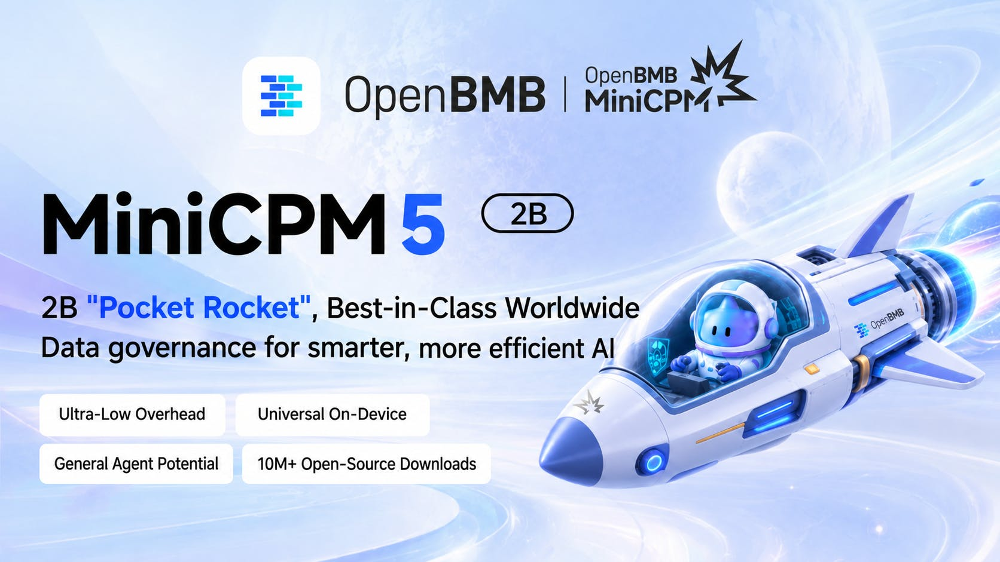
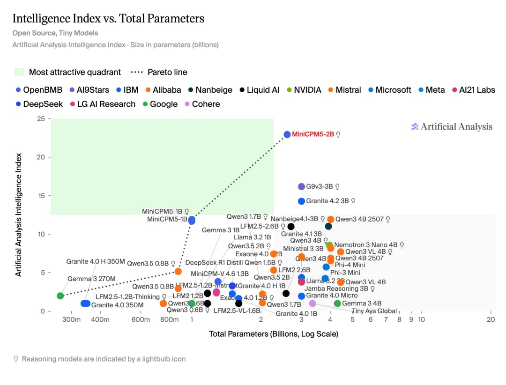
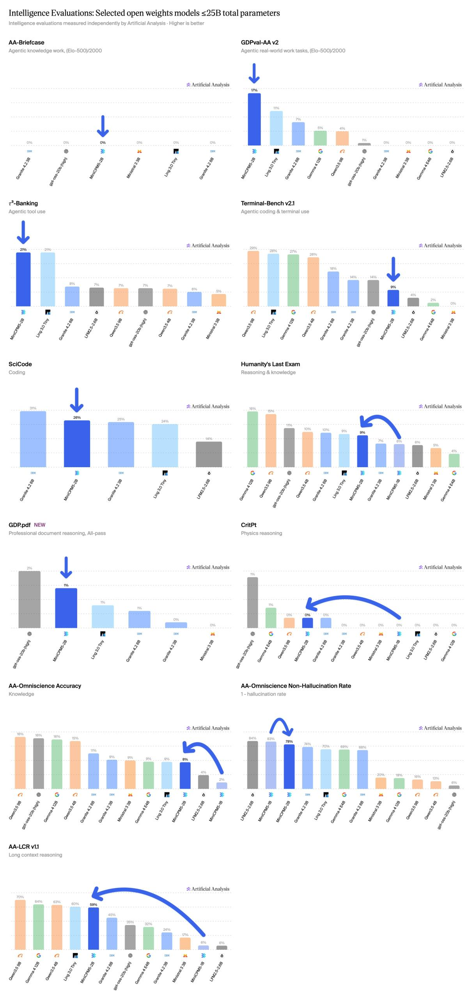

---

## 26. [US Global Mail - MCP Server](https://www.producthunt.com/products/ai-mailroom-by-us-global-mail)
**Votes**: 22 | **도입 난이도**: 중 | **신뢰도**: 상
**Tagline**: Connect your physical mail directly to AI 
**서비스 링크**: https://www.producthunt.com/r/5APYYXHQRZ6ZTK

**태그**: Automation, AI, Productivity, Workflow, AI Tool

### 📌 이 서비스 한눈에 보기
실물 우편물을 AI와 연결하여 대화형으로 관리하고 처리하는 MCP 서버

### 🔑 주요 기능
- 물리적 우편물과 AI 어시스턴트 간의 보안 연결 제공
- 우편물 검색, 스캔, 배송, 수표 입금 등 다양한 작업 수행
- AI를 통한 자동화된 우편물 관리 규칙 설정 가능

### 🙋 사용자에게 어떤 점이 좋은가
복잡한 우편물 관리 과정을 AI 대화만으로 간편하게 처리할 수 있어, 물리적 서류 업무의 디지털 전환을 돕습니다.

### ✅ 지금 바로 써볼 기능
- 중요 우편물 찾기 및 스캔 기능 테스트
- 우편물 배송 및 수표 입금 워크플로우 확인
- AI 자동화 규칙 설정 기능 활용

### ⚠️ 사용 전 확인할 점
- 실물 우편물 취급에 따른 보안 및 개인정보 보호 정책 확인 필요
- 물리적 배송/처리 과정에서의 물리적 지연 가능성

### 🧭 확인이 더 필요한 정보
실제 물리적 우편물 처리(배송, 입금 등)가 어떤 물리적 인프라를 통해 이루어지는지 구체적인 프로세스 확인이 필요합니다.

### 📸 스크린샷 및 갤러리
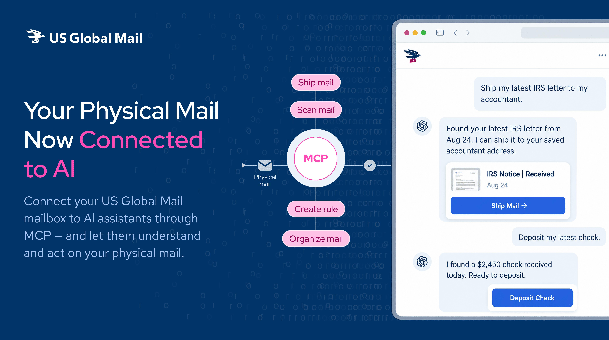
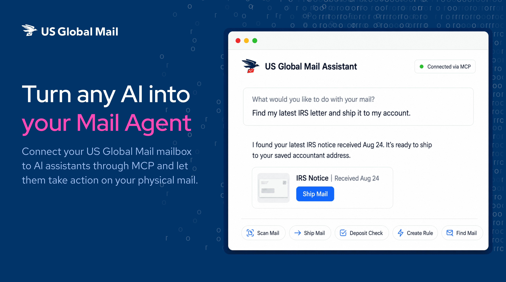
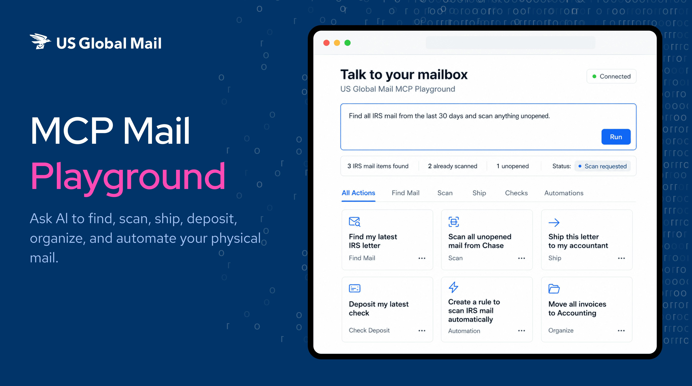

### 🎬 관련 영상
- [🎥 영상 보기](https://ph-files.imgix.net/ecbf0463-5524-4dba-9044-cb0d47c2ef46.jpeg?auto=format)

---

## 27. [Datawyse](https://www.producthunt.com/products/datawyse)
**Votes**: 20 | **도입 난이도**: 중 | **신뢰도**: 상
**Tagline**: AI Finance Analyst for Small & Medium Enterprises
**서비스 링크**: https://www.producthunt.com/r/CNUN3QGD7JVGJL

**태그**: Finance, AI, Automation, SME, Analytics, Agent, AI Tool, LLM, DevTool, CRM

### 📌 이 서비스 한눈에 보기
중소기업을 위한 비용 효율적인 AI 재무 분석 및 시나리오 플래닝 솔루션

### 🔑 주요 기능
- ERP 및 CRM 연동을 통한 자동화된 재무 데이터 분석
- LLM이 계획을 세우고 코드로 계산하여 수치의 신뢰성 확보
- 엑셀 수식과 소스 데이터를 제공하는 투명한 분석 결과

### 🙋 사용자에게 어떤 점이 좋은가
전문 재무 분석가 채용 비용의 1/3 수준으로 시나리오 플래닝, 현금 흐름 예측 등 고도화된 재무 분석을 즉시 수행할 수 있습니다.

### ✅ 지금 바로 써볼 기능
- 기존 ERP/CRM 데이터 연동 테스트
- 시나리오 플래닝 및 변동 분석 기능 실행
- 생성된 결과값의 엑셀 수식 및 소스 검증

### ⚠️ 사용 전 확인할 점
- 기존 비즈니스 규칙 및 데이터 정의가 정확히 학습되었는지 확인 필요
- 외부 툴(ERP, CRM)과의 데이터 동기화 보안 및 권한 설정 확인

### 🧭 확인이 더 필요한 정보
사용자의 기존 데이터 구조와 비즈니스 규칙이 복잡할 경우 초기 학습 및 설정 시간이 얼마나 소요될지 확인이 필요합니다.

### 📸 스크린샷 및 갤러리
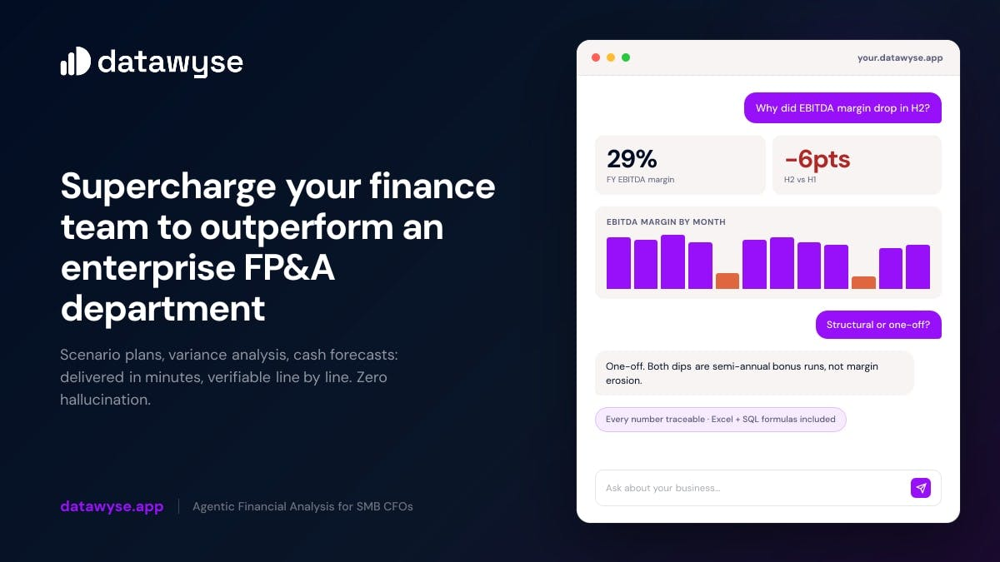
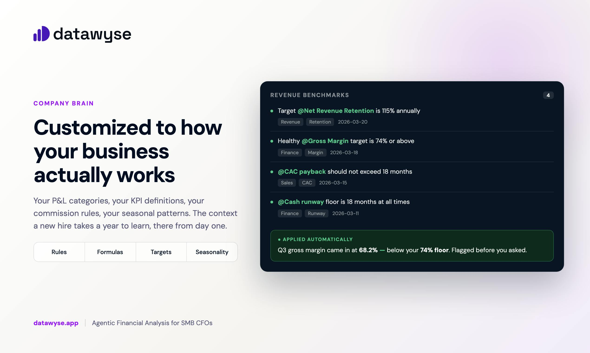
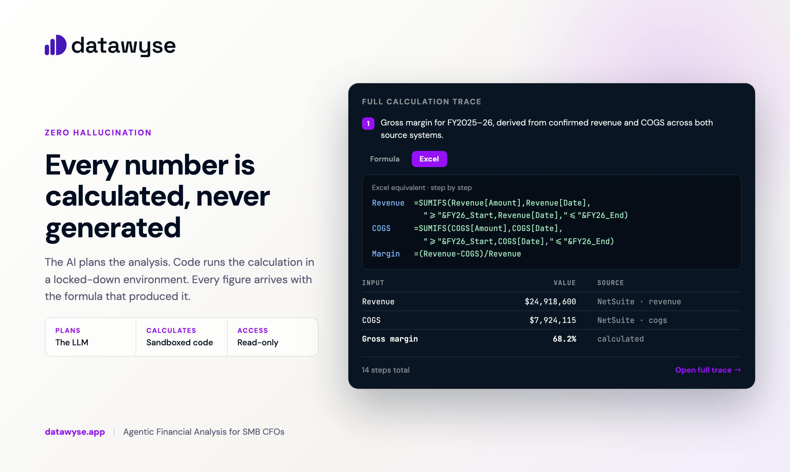

### 🎬 관련 영상
- [🎥 영상 보기](https://ph-files.imgix.net/031e82ed-c529-4c7b-8e26-504e7ecf20b6.jpeg?auto=format)

---

## 28. [Cheso](https://www.producthunt.com/products/cheso)
**Votes**: 20 | **도입 난이도**: 하 | **신뢰도**: 상
**Tagline**: AI presentations that think deeper
**서비스 링크**: https://www.producthunt.com/r/DUEF3AKXKC5A63

**태그**: AI, Productivity, Presentation, Automation, AI Tool

### 📌 이 서비스 한눈에 보기
단순 요약을 넘어 심층적인 리서치와 구조화를 지원하는 AI 프레젠테이션 도구

### 🔑 주요 기능
- 파일, 링크, 메모를 활용한 심층적인 스토리텔링 생성
- 단순 슬라이드를 넘어 구조화된 리서치 결과 제공
- 편집 가능한 슬라이드 및 인터랙티브 페이지 형식 지원

### 🙋 사용자에게 어떤 점이 좋은가
단순히 텍스트를 옮기는 수준을 넘어, 자료를 바탕으로 논리적인 구조를 갖춘 발표 자료를 빠르게 제작할 수 있습니다.

### ✅ 지금 바로 써볼 기능
- 기존 문서나 링크를 업로드하여 스토리라인 생성해보기
- 생성된 구조를 편집 가능한 슬라이드로 변환하기
- 인터랙티브 페이지 기능을 활용해 웹 기반 발표 자료 만들기

### ⚠️ 사용 전 확인할 점
- AI가 생성한 내용의 사실 관계 및 리서치 정확도 검증 필요
- 사용자 의도에 맞는 세부 디자인 커스텀 가능 여부 확인 필요

### 🧭 확인이 더 필요한 정보
제공되는 파일 형식의 종류와 외부 툴(PPT, Google Slides 등)과의 내보내기 호환성을 확인해야 합니다.

### 📸 스크린샷 및 갤러리

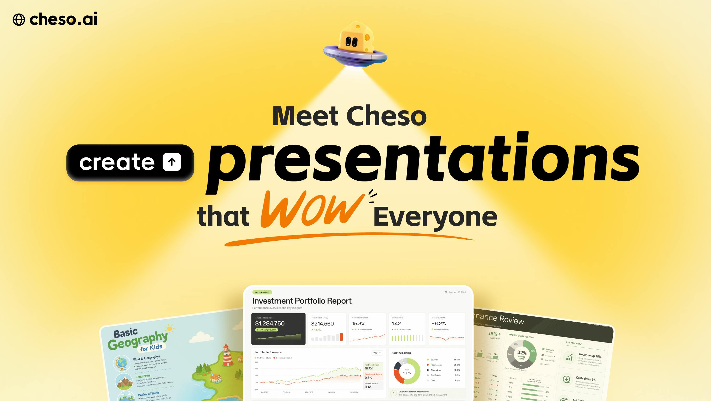
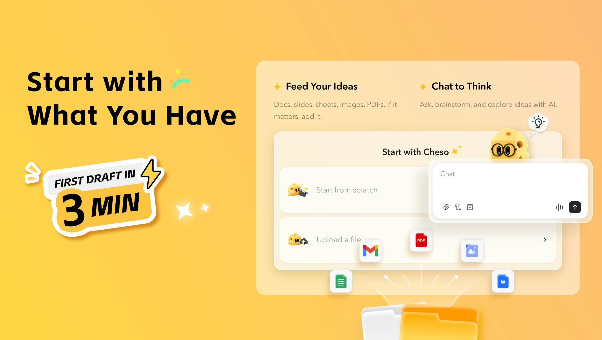

### 🎬 관련 영상
- [🎥 영상 보기](https://ph-files.imgix.net/28a42f87-100c-4aed-a9ee-90792c1c45e4.jpeg?auto=format)

---

## 29. [Kody](https://www.producthunt.com/products/kody)
**Votes**: 17 | **도입 난이도**: 중 | **신뢰도**: 상
**Tagline**: The home your agents share. Switch agents. Keep your stuff.
**서비스 링크**: https://www.producthunt.com/r/M2X3BXNAL3MACV

**태그**: AI-Agent, Automation, DevTool, Workflow, Agent, Chat

### 📌 이 서비스 한눈에 보기
에이전트가 바뀌어도 데이터와 자동화는 그대로 유지하는 통합 워크플로우 허브

### 🔑 주요 기능
- 모델 교체 시에도 도구, 메모리, 비밀번호, 자동화 설정을 유지
- 한 번의 작업 결과를 소유 가능한 패키지 코드로 저장
- Cursor, Claude, ChatGPT 등 다양한 MCP 호스트와 연동 가능

### 🙋 사용자에게 어떤 점이 좋은가
특정 AI 모델에 종속되지 않고, 작업 결과물과 자산을 안전하게 관리하며 여러 AI 도구를 자유롭게 오갈 수 있습니다.

### ✅ 지금 바로 써볼 기능
- 기존 작업 결과물을 Kody 패키지 코드로 저장해보기
- 사용 중인 AI 호스트(Cursor, Claude 등)에 연결하기
- 스케줄링 기능을 통해 자동화 워크플로우 실행하기

### ⚠️ 사용 전 확인할 점
- 사용 중인 외부 도구 및 MCP 호스트와의 호환성 확인 필요
- 데이터 및 비밀번호 저장 방식에 대한 보안 검토 필요

### 🧭 확인이 더 필요한 정보
다양한 외부 도구 및 MCP 호스트와의 구체적인 통합 방식과 보안 수준에 대한 상세 정보가 필요합니다.

### 📸 스크린샷 및 갤러리

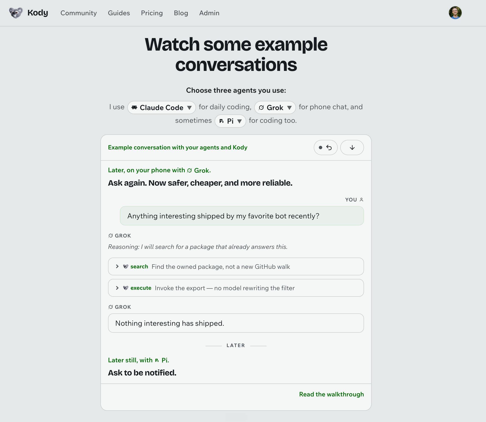

### 🎬 관련 영상
- [🎥 영상 보기](https://ph-files.imgix.net/1c605abc-42bd-46c2-8ca6-749b1aa2a27d.jpeg?auto=format)

---

## 30. [Fiuto](https://www.producthunt.com/products/fiuto)
**Votes**: 17 | **도입 난이도**: 하 | **신뢰도**: 상
**Tagline**: Find out what your users will say.
**서비스 링크**: https://www.producthunt.com/r/C6BHKD7XMC2K5M

**태그**: User Research, AI, Automation, Product Management, AI Tool

### 📌 이 서비스 한눈에 보기
AI와 실제 사용자를 결합하여 사용자 조사를 자동화하는 올인원 리서치 도구

### 🔑 주요 기능
- 연구 설계부터 결과 보고서(Deck) 생성까지 전 과정 자동화
- AI 테스터와 실제 사람을 활용한 하이브리드 조사 방식
- 브라우저 및 MCP(Model Context Protocol) 지원으로 빠른 접근성 제공

### 🙋 사용자에게 어떤 점이 좋은가
전문적인 리서치 경험 없이도 몇 분 만에 사용자 피드백을 수집하고 공유 가능한 결과물을 얻을 수 있습니다.

### ✅ 지금 바로 써볼 기능
- 무료 플랜으로 첫 사용자 조사 설계해보기
- AI 테스터를 통한 빠른 프로토타입 피드백 받기
- 자동 생성된 리서치 데크(Deck) 확인하기

### ⚠️ 사용 전 확인할 점
- AI 테스터의 피드백이 실제 사용자의 맥락을 완벽히 반영하는지 검증 필요
- 무료 플랜의 상세 기능 및 사용량 제한 확인 필요

### 🧭 확인이 더 필요한 정보
AI 테스터와 실제 사람 간의 비중 조절 및 비용 구조에 대한 상세 정보가 필요합니다.

### 📸 스크린샷 및 갤러리
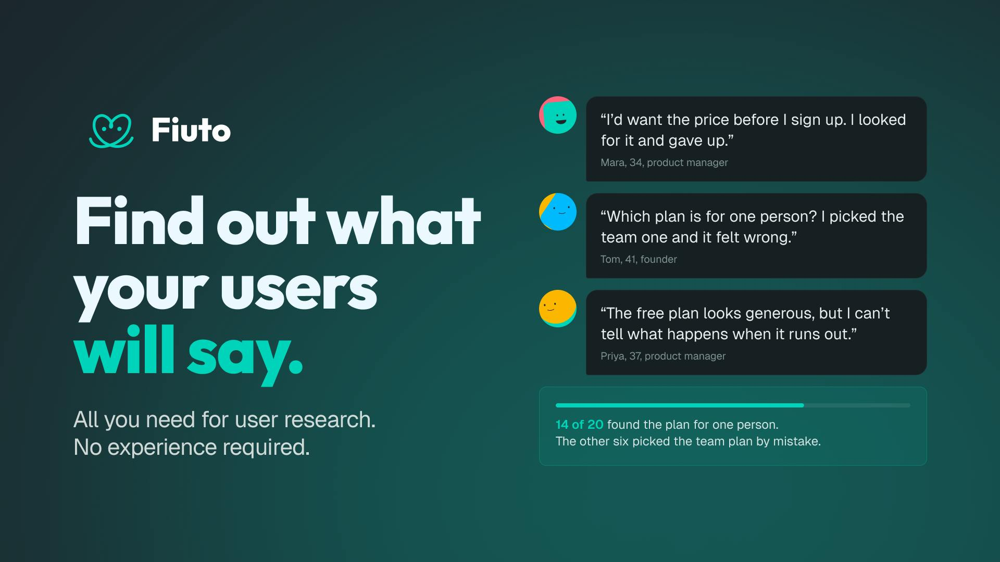
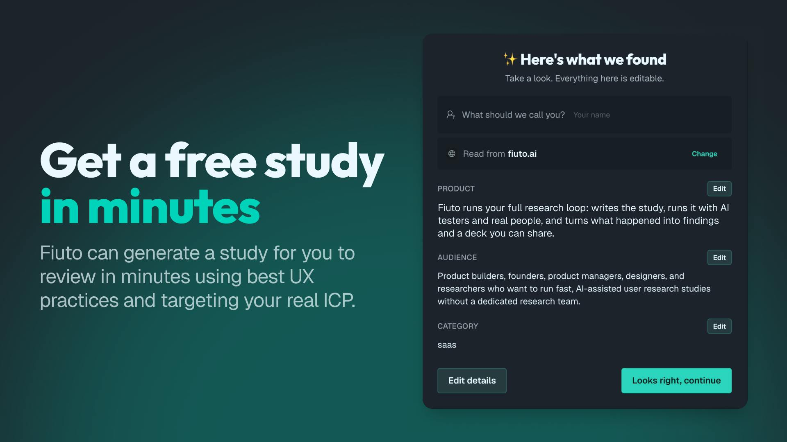
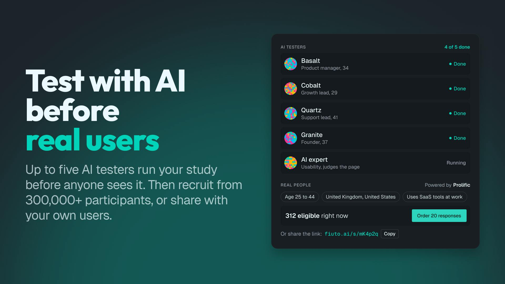

---

