# 🚀 Product Hunt Daily Top 30 (2026-09-10)

## 오늘의 요약
오늘의 트렌드는 AI 에이전트가 단순한 보조를 넘어 소프트웨어 개발부터 일상 업무까지 주도적으로 수행하는 자동화 기술에 집중되었습니다. 또한, AI의 실행 권한을 관리하는 보안 레이어와 방대한 생물학적 데이터를 다루는 전문 연구 도구 등 AI 기술의 실질적 적용과 안전성 확보가 주요 화두로 떠올랐습니다.

### 오늘의 핵심 포인트
- AI 에이전트가 이슈 해결부터 배포까지 소프트웨어 개발 전 과정을 자동화하는 워크플로우가 주목받았습니다.
- AI 에이전트의 도구 실행 및 시스템 접근 시 발생할 수 있는 보안 위협을 방지하기 위한 보안 레이어 기술이 등장했습니다.
- 강화학습을 통한 로봇 훈련이나 유전체 변이 예측과 같이 AI를 활용한 시뮬레이션 및 과학적 탐색 도구들이 발표되었습니다.

**오늘의 태그**: AI 에이전트, 소프트웨어 자동화, AI 보안, 강화학습, 바이럴 마케팅

## 1. [Mastra Factory](https://www.producthunt.com/products/mastra)
**Votes**: 384 | **도입 난이도**: 중 | **신뢰도**: 상
**Tagline**: From issue to production, run by agents.
**서비스 링크**: https://www.producthunt.com/r/52CAOAGHS62ZQY

**태그**: DevTool, AI-Agent, Automation, OpenSource, Software-Delivery, Agent

### 📌 이 서비스 한눈에 보기
이슈 해결부터 배포까지 에이전트가 주도하는 오픈소스 소프트웨어 개발 환경

### 🔑 주요 기능
- 지속적인 코딩 에이전트 기반의 자동화된 소프트웨어 전달 프로세스
- 이슈 접수, 계획, 구현, PR 리뷰를 아우르는 통합 워크스페이스
- 사용자가 직접 제어 가능한 오픈소스 기반의 에이전트 환경

### 🙋 사용자에게 어떤 점이 좋은가
개발 워크플로우의 전 과정을 AI 에이전트가 자동화하여 이슈 해결부터 배포까지의 생산성을 극대화할 수 있습니다.

### ✅ 지금 바로 써볼 기능
- 에이전트 기반의 이슈 해결 워크플로우 테스트
- 저장소 워크스페이스와 에이전트 연동 설정
- 자동화된 PR 리뷰 기능 검증

### ⚠️ 사용 전 확인할 점
- 에이전트가 생성한 코드의 품질 및 보안 검토 필요
- 기존 개발 워크플로우와의 통합 및 제어 난이도 확인

### 🧭 확인이 더 필요한 정보
에이전트의 코드 생성 정확도와 기존 CI/CD 파이프라인과의 구체적인 연동 방식에 대한 확인이 필요합니다.

### 📸 스크린샷 및 갤러리
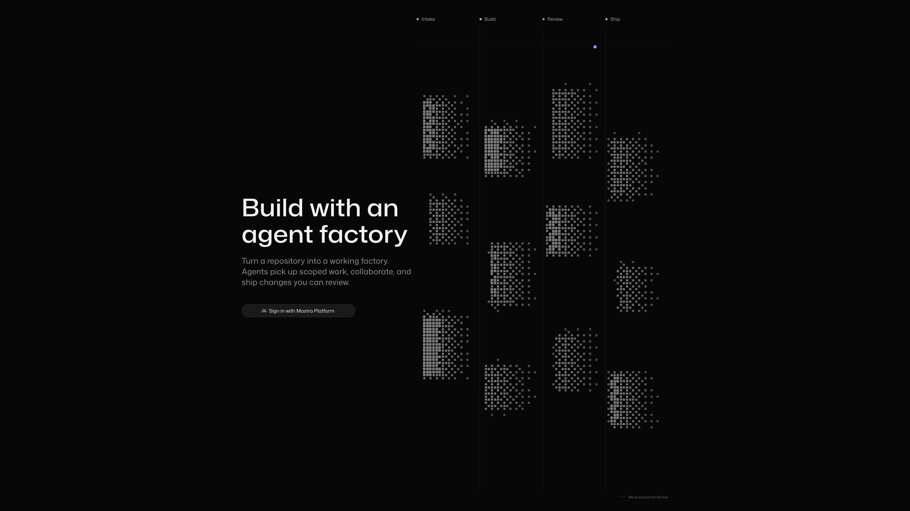
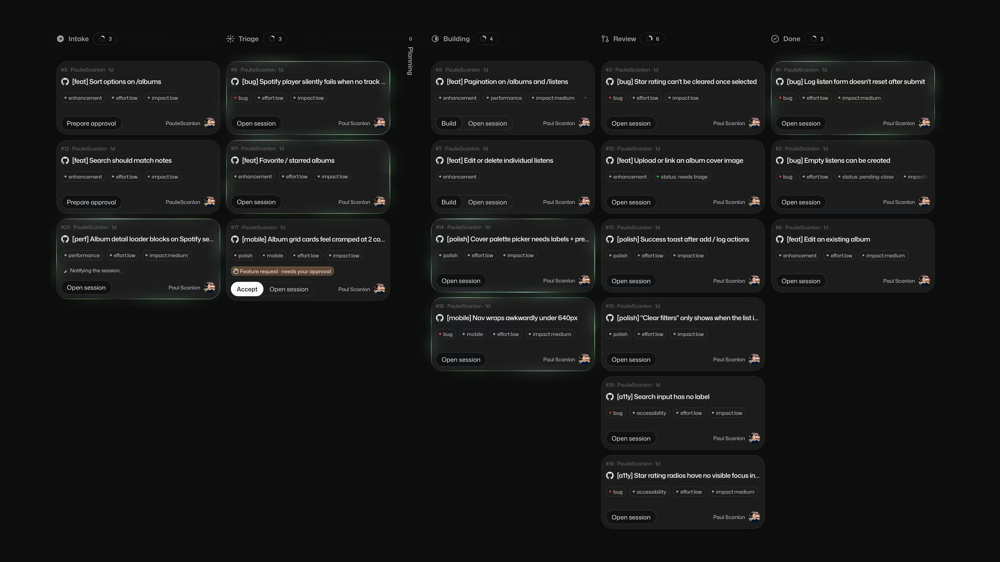
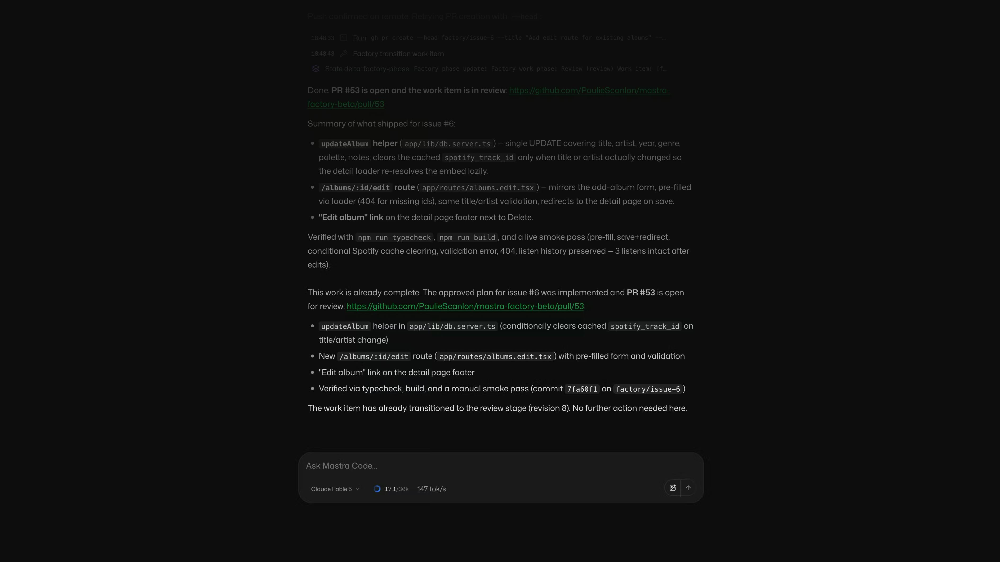

### 🎬 관련 영상
- [🎥 영상 보기](https://ph-files.imgix.net/01fde82c-ad06-4b0a-b705-12593ba82245.jpeg?auto=format)

---

## 2. [Harden](https://www.producthunt.com/products/agent-integrity-foundation-aif)
**Votes**: 258 | **도입 난이도**: 하 | **신뢰도**: 상
**Tagline**: A security layer for AI coding agents
**서비스 링크**: https://www.producthunt.com/r/PV2MJET6ZGFMKD

**태그**: DevTool, AI, Security, Automation, Agent, AI Tool

### 📌 이 서비스 한눈에 보기
AI 코딩 에이전트의 도구 실행 전 보안 위협을 검증하는 로컬 보안 레이어

### 🔑 주요 기능
- AI 에이전트의 도구 호출(Tool calls)을 실행 전 검증하는 포스트 트레이닝 모델 탑재
- 사용자의 요청 및 세션 컨텍스트를 기반으로 한 정밀한 보안 체크
- 데이터와 도구 출력물을 로컬 환경에 유지하여 프라이버시 보호

### 🙋 사용자에게 어떤 점이 좋은가
AI 에이전트가 코드를 실행하거나 시스템에 접근할 때 발생할 수 있는 보안 사고를 사전에 방지할 수 있습니다.

### ✅ 지금 바로 써볼 기능
- 로컬 환경에 Harden AIF 설치하기
- 현재 사용 중인 AI 코딩 에이전트와 연동 테스트하기
- 에이전트의 도구 호출이 보안 정책에 맞게 차단되는지 확인하기

### ⚠️ 사용 전 확인할 점
- 로컬 실행 환경의 리소스 사용량 확인 필요
- 에이전트 워크플로우에 미치는 지연 시간(Latency) 검토

### 🧭 확인이 더 필요한 정보
지원하는 구체적인 AI 에이전트 프레임워크 및 도구 목록에 대한 상세 정보가 필요합니다.

### 📸 스크린샷 및 갤러리
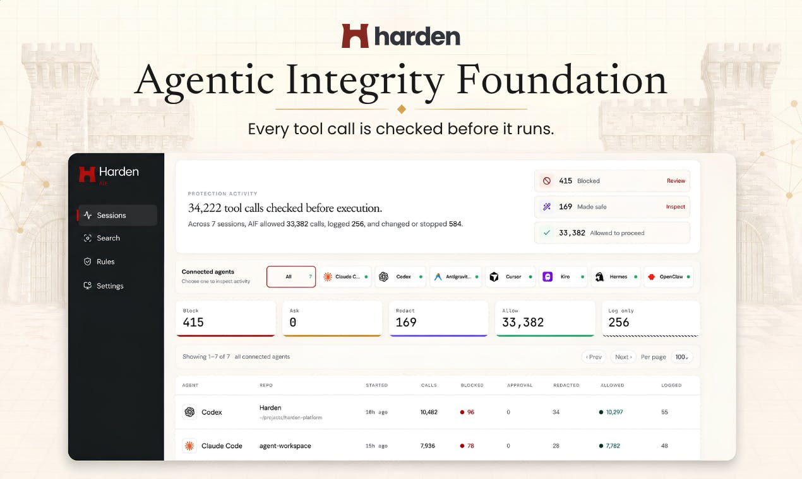
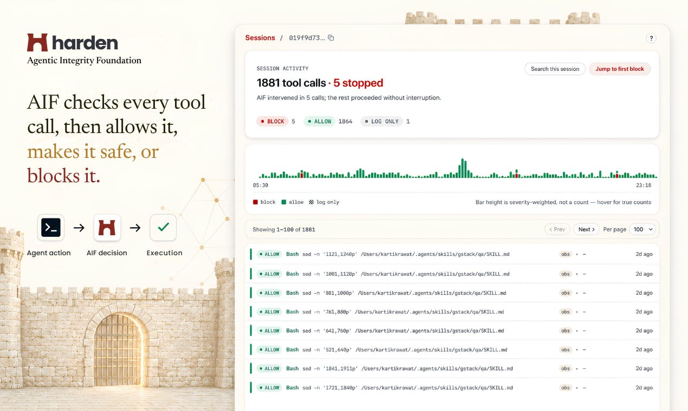
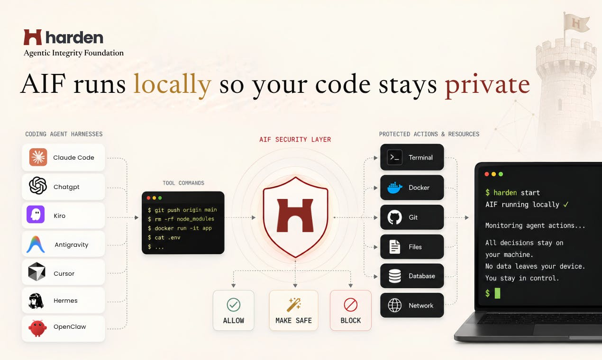

### 🎬 관련 영상
- [🎥 영상 보기](https://ph-files.imgix.net/08ac1f86-9cb4-4150-a321-171d5e053914.jpeg?auto=format)

---

## 3. [ChatGPT Images 2.5](https://www.producthunt.com/products/openai)
**Votes**: 224 | **도입 난이도**: 하 | **신뢰도**: 상
**Tagline**: Sharper visuals, faster flow, better creative control
**서비스 링크**: https://www.producthunt.com/r/LDNJX5W4CPPMNY
**재등장**: 최근 7일 내 재등장 (마지막 등장 4일 전)

**태그**: AI, Design, Creative, ImageGeneration, AI Tool, Chat, Prompting, Vision

### 📌 이 서비스 한눈에 보기
더욱 정교한 디테일과 빠른 생성 속도를 갖춘 차세대 AI 이미지 생성 모델

### 🔑 주요 기능
- 선명한 디테일과 풍부한 질감 표현
- 더 빨라진 이미지 생성 속도
- 스케치 및 참조 사진을 활용한 정밀한 편집 제어

### 🙋 사용자에게 어떤 점이 좋은가
아이디어를 시각화하는 속도가 빨라지며, 참조 사진과 스케치를 통해 사용자가 원하는 결과물에 더 가깝게 제어할 수 있습니다.

### ✅ 지금 바로 써볼 기능
- 스케치를 활용한 이미지 구체화
- 참조 사진을 통한 스타일 일관성 유지
- 프롬프트를 통한 정밀 편집 테스트

### ⚠️ 사용 전 확인할 점
- 모델의 구체적인 생성 속도 및 리소스 요구사항 확인 필요
- 편집 제어 기능의 세부 인터페이스 숙지 필요

### 🧭 확인이 더 필요한 정보
상세한 편집 기능의 범위와 기존 모델 대비 구체적인 성능 향상 수치는 명시되지 않았습니다.

### 📸 스크린샷 및 갤러리
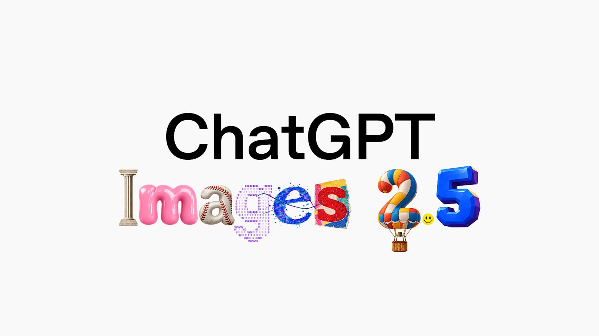

### 🎬 관련 영상
- [🎥 영상 보기](https://ph-files.imgix.net/03f2c476-4804-4715-8831-f70841de7f3a.jpeg?auto=format)

---

## 4. [Noodle Seed](https://www.producthunt.com/products/noodle-seed)
**Votes**: 208 | **도입 난이도**: 중 | **신뢰도**: 상
**Tagline**: Your product in AI and AI in your product
**서비스 링크**: https://www.producthunt.com/r/OAZLHZGI5T52YQ

**태그**: AI, DevTool, Automation, SaaS, Agent, AI Tool

### 📌 이 서비스 한눈에 보기
소프트웨어 제품에 AI 에이전트 기능을 쉽고 안전하게 통합할 수 있는 워크플로우 런타임

### 🔑 주요 기능
- TypeScript 기반의 직관적인 AI 워크플로우 구축
- 제품 내 브랜드 맞춤형 보안 어시스턴트 제공
- 외부 AI 에이전트와 연동 가능한 보안 및 권한 관리 인프라

### 🙋 사용자에게 어떤 점이 좋은가
복잡한 MCP SDK 통합이나 인프라 구축 없이도 기존 제품에 AI 기능을 즉시 도입하고 관리할 수 있습니다.

### ✅ 지금 바로 써볼 기능
- TypeScript로 첫 번째 AI 워크플로우 작성하기
- 브랜드 맞춤형 어시스턴트 UI 적용해보기
- 외부 에이전트용 보안 권한 설정 테스트하기

### ⚠️ 사용 전 확인할 점
- TypeScript 숙련도에 따른 개발 난이도 차이
- 기존 제품 인프라와의 보안 정책 정렬 필요성

### 🧭 확인이 더 필요한 정보
상세한 보안 프로토콜 및 외부 에이전트 연동 방식에 대한 기술 문서 확인이 필요합니다.

### 📸 스크린샷 및 갤러리
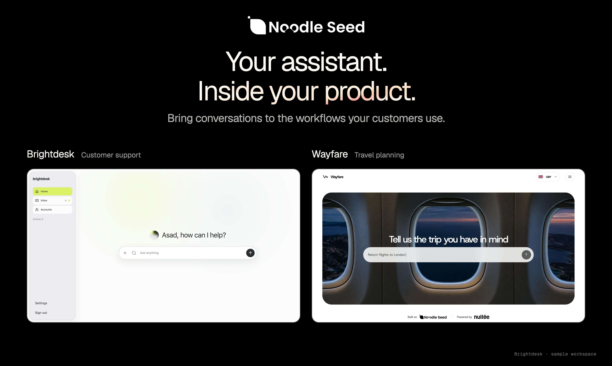
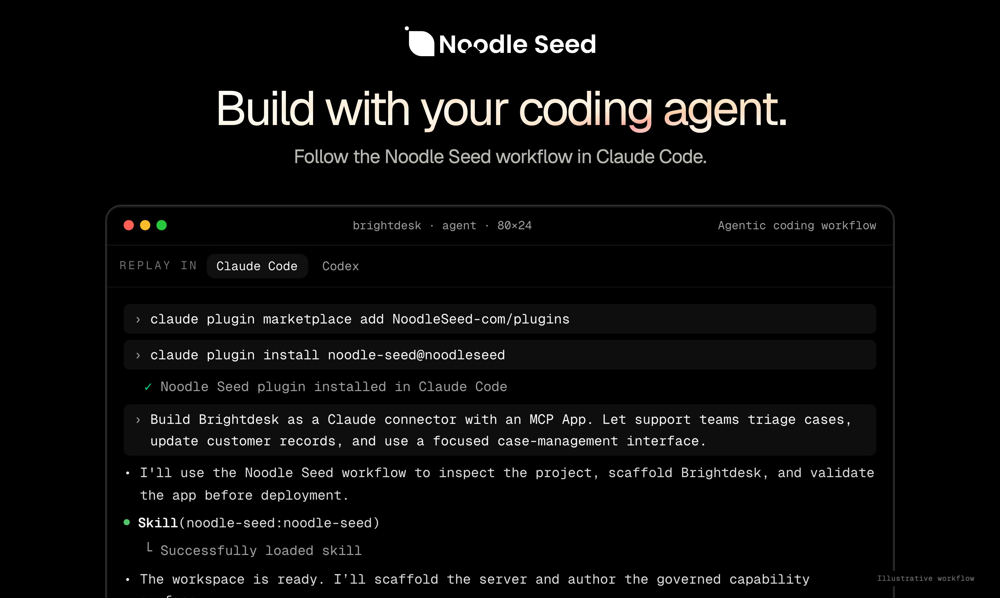
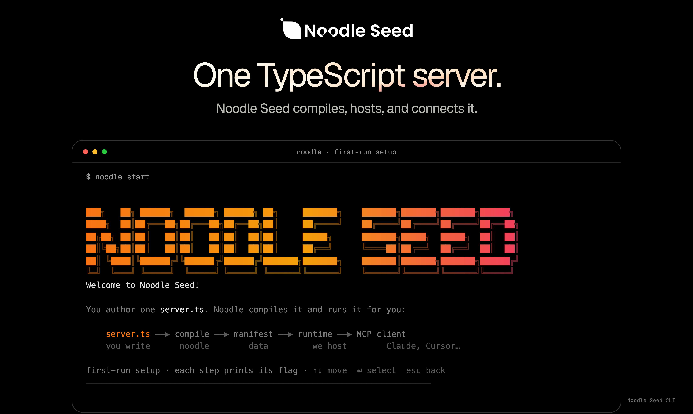

### 🎬 관련 영상
- [🎥 영상 보기](https://ph-files.imgix.net/98d79458-4b8a-439d-b3d4-17aca84aa4c1.jpeg?auto=format)

---

## 5. [Muse by Meta](https://www.producthunt.com/products/muse-22)
**Votes**: 183 | **도입 난이도**: 하 | **신뢰도**: 상
**Tagline**: Your personal AI agent that gets things done
**서비스 링크**: https://www.producthunt.com/r/VI2GFZ2KG63DU3

**태그**: AI Agent, Automation, Productivity, Personal Assistant, Agent, AI Tool

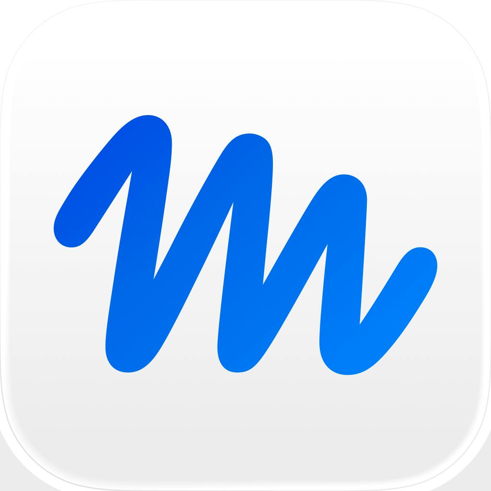

### 📌 이 서비스 한눈에 보기
목표만 설정하면 일상 업무를 알아서 처리하는 개인용 AI 에이전트

### 🔑 주요 기능
- 사용자의 목표나 일상적인 과업을 스스로 수행하는 AI 에이전트
- 금융, 건강, 쇼핑 등 다양한 생활 밀착형 영역 지원
- 복잡한 과정 없이 결과 중심의 자동화 제공

### 🙋 사용자에게 어떤 점이 좋은가
일상의 번거로운 작업들을 AI에게 위임함으로써 사용자의 시간을 확보하고 생산성을 높일 수 있습니다.

### ✅ 지금 바로 써볼 기능
- 일상적인 반복 작업(쇼핑 등)을 목표로 설정해보기
- 개인적인 과업(건강 관리 등) 위임 테스트하기
- AI의 작업 수행 방식 및 결과물 확인하기

### ⚠️ 사용 전 확인할 점
- 금융 및 개인 정보와 관련된 민감한 데이터 취급 방식 확인 필요
- AI가 실제 결제나 외부 서비스와 연동되는 범위 확인 필요

### 🧭 확인이 더 필요한 정보
구체적인 서비스 연동 범위와 개인정보 보호 정책에 대한 상세 정보가 필요합니다.

### 📸 스크린샷 및 갤러리
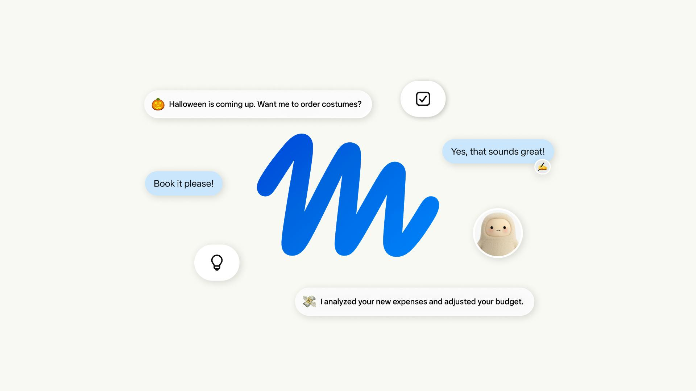
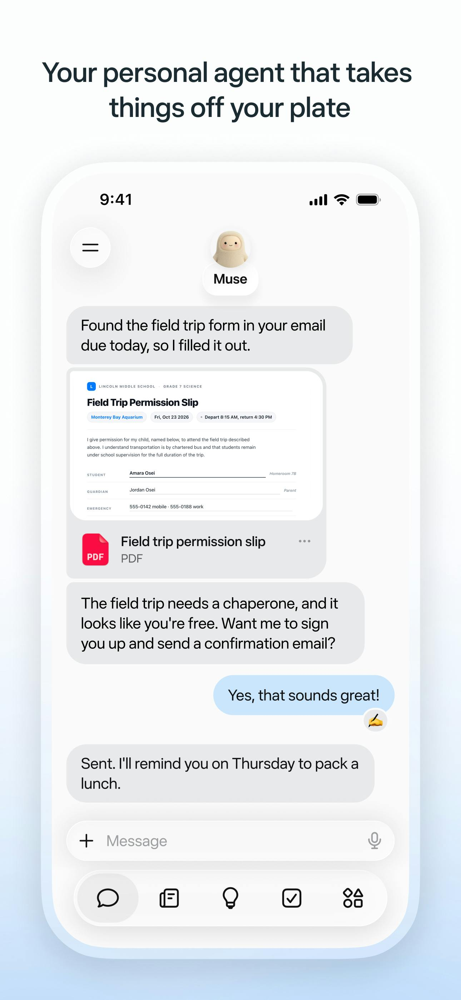
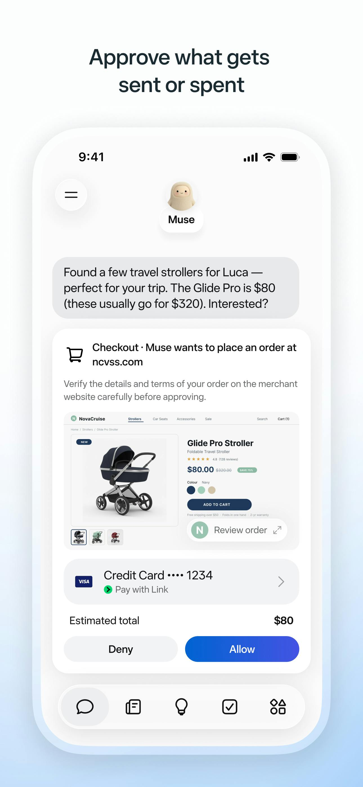

### 🎬 관련 영상
- [🎥 영상 보기](https://ph-files.imgix.net/24cdfeef-7166-44b6-9e2e-80cf23606c12.jpeg?auto=format)

---

## 6. [Ass Auction](https://www.producthunt.com/products/ass-auction)
**Votes**: 131 | **도입 난이도**: 하 | **신뢰도**: 상
**Tagline**: Brands outbid each other to put their logo on my ass
**서비스 링크**: https://www.producthunt.com/r/RPWMGSFZLWOBMR

**태그**: Marketing, AdNetwork, E-commerce, Viral, AI Tool, Email

### 📌 이 서비스 한눈에 보기
브랜드 로고를 경쟁 입찰 방식으로 언더웨어에 노출하는 독특한 광고 네트워크

### 🔑 주요 기능
- 단일 광고 지면(박서 팬티)을 대상으로 하는 실시간 입찰형 광고 모델
- 누적 지출액이 순위가 되며, 더 높은 금액을 지불해 순위를 방어하거나 상승 가능
- 계정 생성 없이 URL/핸들 및 Stripe 결제만으로 즉시 참여 가능

### 🙋 사용자에게 어떤 점이 좋은가
최소 비용으로 파격적이고 바이럴 가능성이 높은 물리적 광고 지면을 확보할 수 있습니다.

### ✅ 지금 바로 써볼 기능
- Stripe를 통한 최소 금액 입찰로 순위 진입해보기
- 실시간 클릭 수 및 공유 카드를 통한 바이럴 효과 확인하기

### ⚠️ 사용 전 확인할 점
- 순위 경쟁으로 인해 예상치 못한 추가 비용이 발생할 수 있음
- 신체 부위에 로고가 노출되는 브랜드 이미지 리스크 고려 필요

### 🧭 확인이 더 필요한 정보
실제 제품 제작 및 배송 프로세스에 대한 상세 정보가 명시되지 않았습니다.

### 📸 스크린샷 및 갤러리
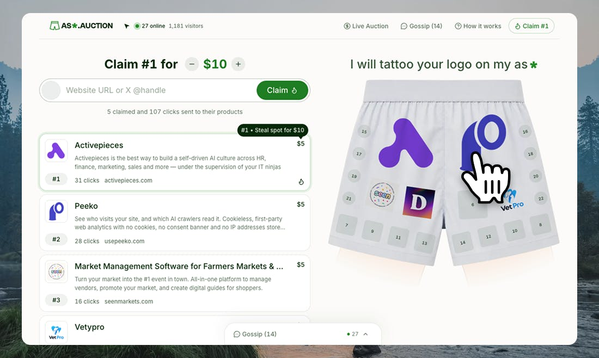
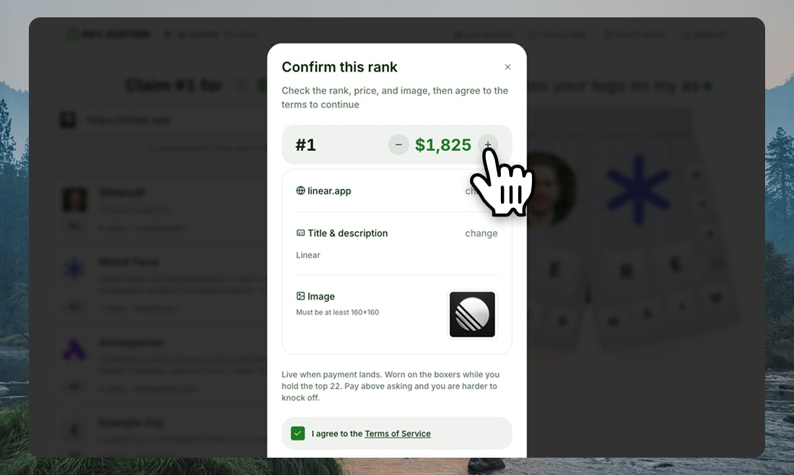
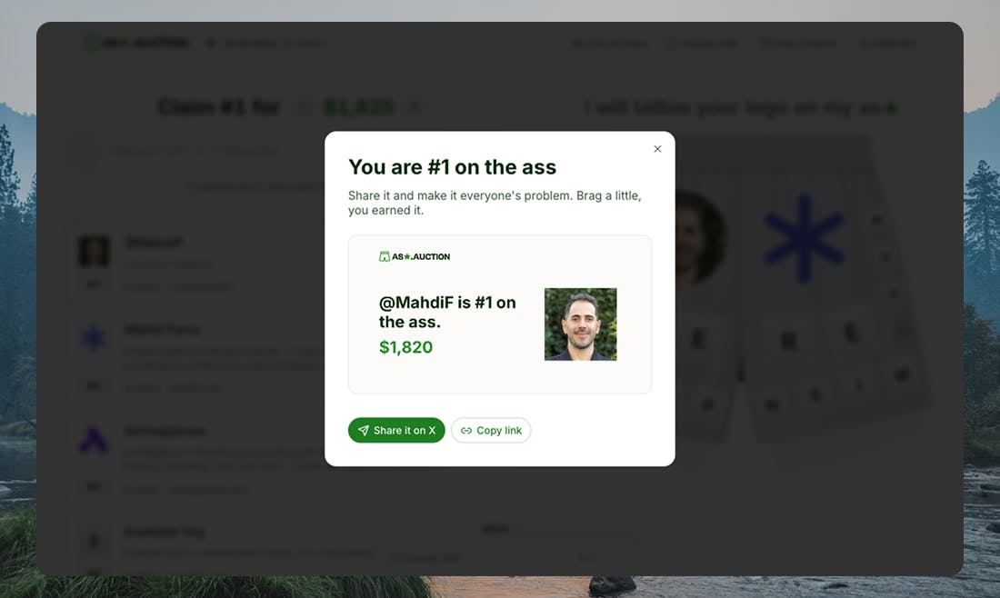

### 🎬 관련 영상
- [🎥 영상 보기](https://ph-files.imgix.net/215cc1c6-8876-4692-a93a-6bcfd3ffdd3d.jpeg?auto=format)

---

## 7. [DuckFightClub](https://www.producthunt.com/products/duckfightclub)
**Votes**: 127 | **도입 난이도**: 상 | **신뢰도**: 상
**Tagline**: Train your MicroDuck and win the Golden Beak Belt
**서비스 링크**: https://www.producthunt.com/r/INEHW62NJYZ4MQ

**태그**: AI, Reinforcement Learning, Robotics, Gaming, OpenSource, AI Tool

### 📌 이 서비스 한눈에 보기
AI 강화학습을 통해 귀여운 마이크로덕 로봇의 두뇌를 훈련시키고 대결하는 시뮬레이션 경쟁 플랫폼

### 🔑 주요 기능
- 강화학습(RL) 정책을 설계하여 로봇의 지능을 직접 훈련
- 8개 팀이 참여하는 시뮬레이션 기반의 로봇 격투 대회
- 오픈소스 MicroDuck 하드웨어와 연계된 실물 로봇 확장 가능성

### 🙋 사용자에게 어떤 점이 좋은가
직접 하드웨어를 제작하지 않고도 소프트웨어(AI 정책) 설계 역량을 겨루며, 강화학습 모델의 성능을 시각적이고 경쟁적인 방식으로 검증할 수 있습니다.

### ✅ 지금 바로 써볼 기능
- 팀 등록 및 경쟁 참여
- MicroDuck 오픈소스 정책 훈련
- 시뮬레이션 라이브 스트리밍 시청

### ⚠️ 사용 전 확인할 점
- 하드웨어가 아닌 소프트웨어(두뇌) 중심의 경쟁임
- 시뮬레이션 환경과 실제 하드웨어 간의 격차(Sim-to-Real) 발생 가능성

### 🧭 확인이 더 필요한 정보
실제 하드웨어 배송 시점과 시뮬레이션 환경의 기술적 사양에 대한 구체적인 정보가 필요합니다.

### 📸 스크린샷 및 갤러리
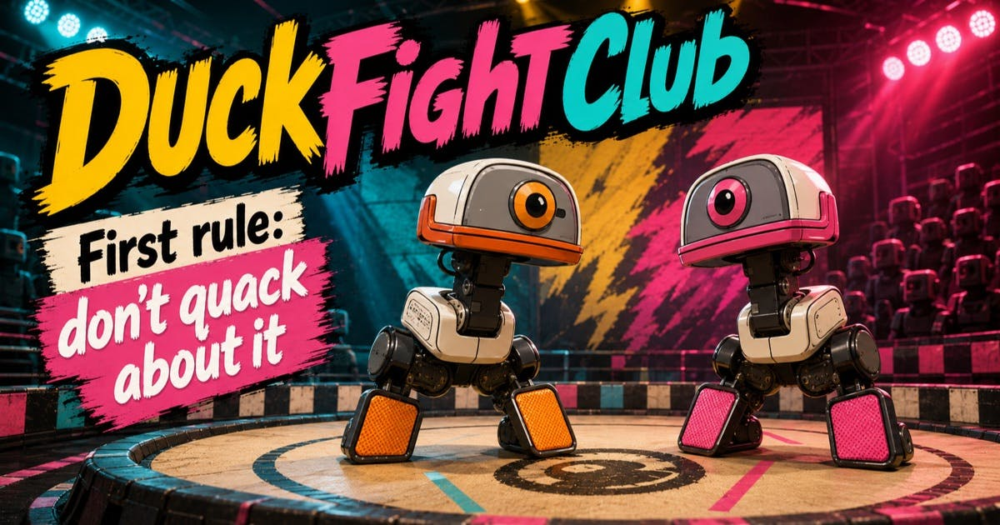
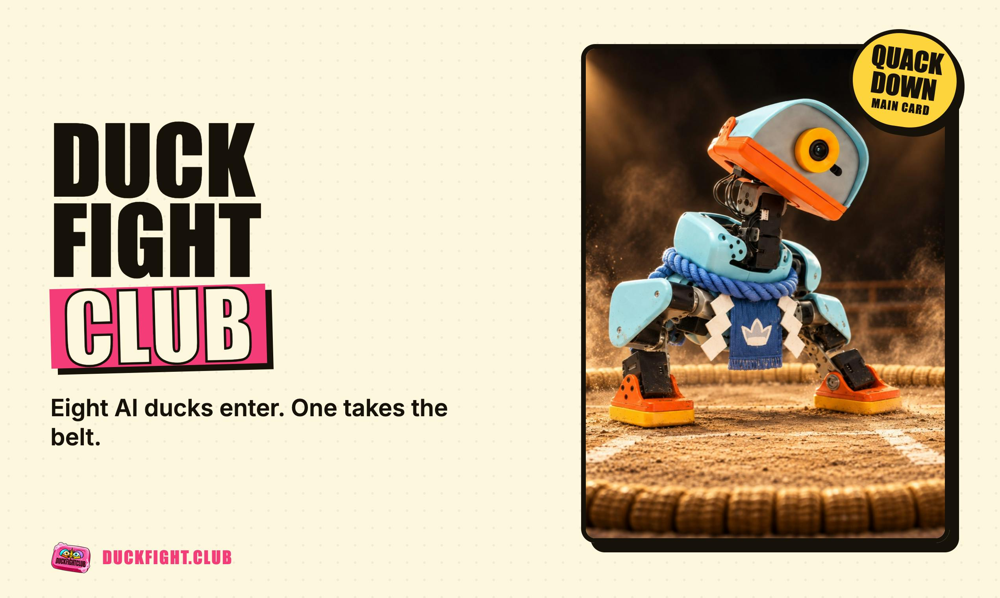
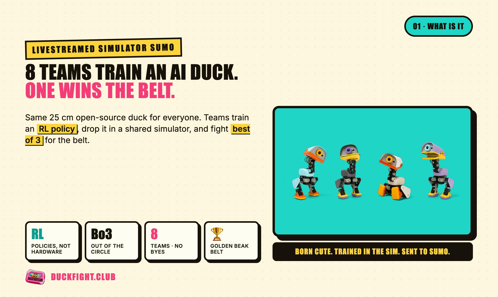

---

## 8. [AlphaGenome Atlas](https://www.producthunt.com/products/alphagenome-atlas)
**Votes**: 126 | **도입 난이도**: 중 | **신뢰도**: 상
**Tagline**: Google's AI map of every possible human DNA mutation
**서비스 링크**: https://www.producthunt.com/r/GDCAOSOHHUNYFD

**태그**: BioTech, AI, Genetics, DataScience, DeepMind, AI Tool, API

### 📌 이 서비스 한눈에 보기
90억 개의 DNA 변이를 예측하여 생물학적 영향을 탐색하는 Google DeepMind의 AI 유전체 지도

### 🔑 주요 기능
- 90억 개의 가능한 단일 염기 변이를 사전 계산한 1페타바이트 규모의 데이터셋
- 코딩 및 비코딩 영역 모두에서 유전적 변이의 우선순위를 결정할 수 있는 도구
- 시각적 웹 인터페이스를 통한 무료 탐색 및 API/Antigravity를 통한 심층 연구 지원

### 🙋 사용자에게 어떤 점이 좋은가
유전학 연구자들이 방대한 변이 데이터 중 생물학적 영향이 큰 핵심 변이를 빠르게 식별하고 연구 우선순위를 정하는 데 도움을 줍니다.

### ✅ 지금 바로 써볼 기능
- 웹 인터페이스를 통한 시각적 데이터 탐색
- API를 활용한 연구 워크플로우 통합
- Antigravity를 통한 심층 연구 데이터 분석

### ⚠️ 사용 전 확인할 점
- 방대한 데이터 규모로 인해 고성능 컴퓨팅 자원이 필요할 수 있음
- AI 예측 모델이므로 실제 생물학적 결과와 차이가 있을 수 있음

### 🧭 확인이 더 필요한 정보
API 및 Antigravity 접근 권한에 대한 구체적인 비용 정책이나 기술적 요구 사양은 명시되지 않았습니다.

### 📸 스크린샷 및 갤러리

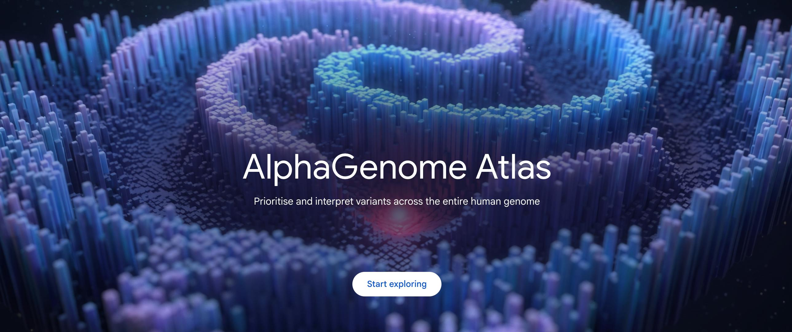
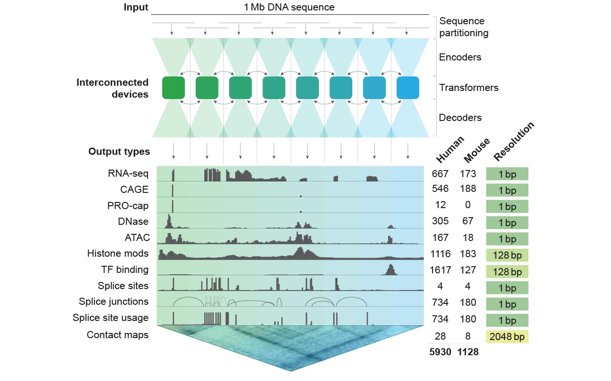

### 🎬 관련 영상
- [🎥 영상 보기](https://ph-files.imgix.net/b1afb332-248e-479b-9d46-7eb822bad0b0.jpeg?auto=format)

---

## 9. [49agents IDE](https://www.producthunt.com/products/49agents-ide)
**Votes**: 117 | **도입 난이도**: 중 | **신뢰도**: 상
**Tagline**: 2D IDE for running agents across projects without fatigue
**서비스 링크**: https://www.producthunt.com/r/ICY7STGOMJ2BHI

**태그**: DevTool, Productivity, Workflow, Agent, AI Tool

### 📌 이 서비스 한눈에 보기
복잡한 에이전트와 프로젝트를 시각적 캔버스에 배치하여 관리하는 2D 개발 환경

### 🔑 주요 기능
- 시티빌더 스타일의 2D 캔버스 기반 UX 제공
- 에이전트, 터미널, 레포지토리, 머신을 하나의 맵에서 통합 관리
- 탭 전환 피로도를 줄여주는 직관적인 프로세스 시각화

### 🙋 사용자에게 어떤 점이 좋은가
여러 프로젝트와 에이전트를 동시에 운영할 때 발생하는 탭 관리의 혼란을 시각적 공간감으로 해결하여 작업 흐름을 유지해 줍니다.

### ✅ 지금 바로 써볼 기능
- 2D 캔버스에 자신만의 작업 맵 구축하기
- 여러 프로젝트의 에이전트와 터미널 배치해보기
- 기존 탭 기반 워크플로우와 비교 테스트하기

### ⚠️ 사용 전 확인할 점
- 시각적 맵 방식이 기존 텍스트/리스트 기반 워크플로우와 충돌할 수 있음
- 프로젝트 규모가 커질 경우 2D 캔버스 내 가독성 문제 발생 가능성

### 🧭 확인이 더 필요한 정보
기존 IDE(VS Code 등)와의 연동 방식 및 구체적인 에이전트 실행 메커니즘에 대한 정보가 부족합니다.

### 📸 스크린샷 및 갤러리
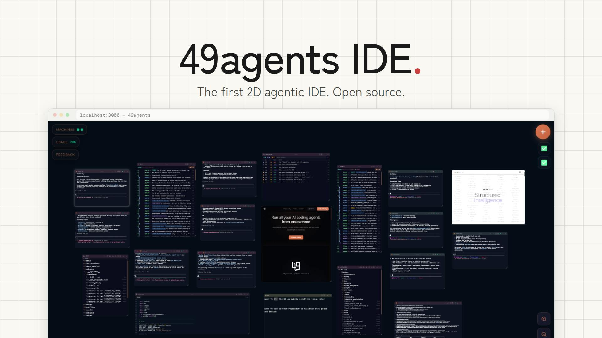
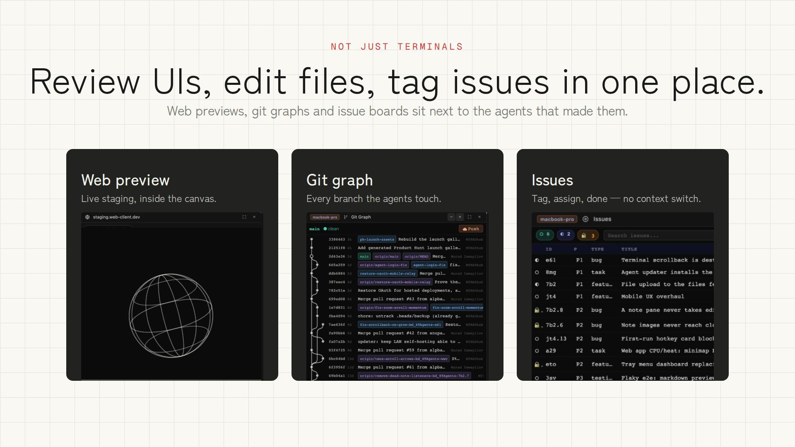
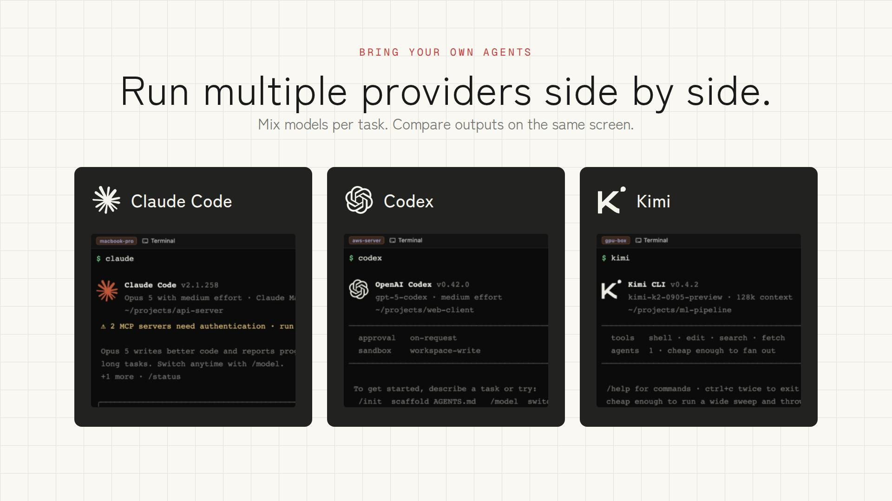

### 🎬 관련 영상
- [🎥 영상 보기](https://ph-files.imgix.net/1ed02ad5-b783-41b8-ab75-aba4c49e392c.octet-stream?auto=format)

---

## 10. [GoModel](https://www.producthunt.com/products/gomodel)
**Votes**: 114 | **도입 난이도**: 하 | **신뢰도**: 상
**Tagline**: Open-source OpenRouter
**서비스 링크**: https://www.producthunt.com/r/7IPNMW6BOOWTF4

**태그**: DevTool, AI, OpenSource, Backend, AI Tool, LLM, Vision, API

### 📌 이 서비스 한눈에 보기
모든 AI 모델을 하나의 API로 통합 관리하는 오픈소스 AI 게이트웨이

### 🔑 주요 기능
- OpenAI 호환 API를 통해 다양한 AI 제공업체를 단일 엔드포인트로 통합
- 예산 관리, 캐싱, 가드레일, 로드 밸런싱 및 장애 조치(Failover) 기능 제공
- 약 20MB의 가벼운 단일 바이너리 및 Docker 이미지로 제공되는 경량 솔루션

### 🙋 사용자에게 어떤 점이 좋은가
여러 AI 모델을 번갈아 사용해야 하는 개발자가 복잡한 API 연동 없이 하나의 규격으로 안정적이고 효율적으로 모델을 관리할 수 있습니다.

### ✅ 지금 바로 써볼 기능
- 자신의 API 키를 등록하여 단일 엔드포인트로 통합 테스트하기
- 캐싱 및 로드 밸런싱 설정을 통해 비용과 응답 속도 최적화하기
- 가드레일 기능을 설정하여 AI 출력 보안 강화하기

### ⚠️ 사용 전 확인할 점
- 사용자 본인의 API 키를 직접 입력하는 방식이므로 키 관리 보안에 유의해야 함
- 자체 호스팅 방식이므로 인프라 운영 및 가용성 관리가 사용자 책임임

### 🧭 확인이 더 필요한 정보
제공되는 모든 기능의 세부 설정 방식과 특정 클라우드 환경에서의 호환성은 공식 문서를 통해 확인이 필요합니다.

### 📸 스크린샷 및 갤러리
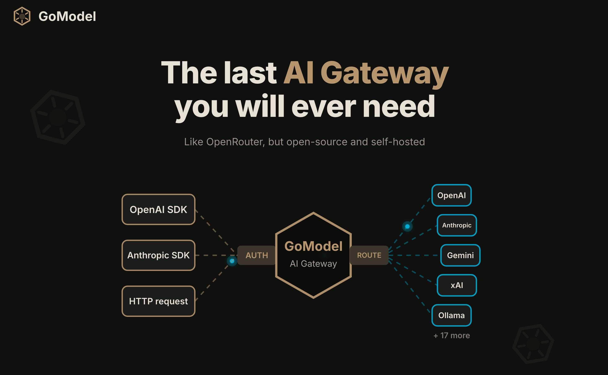
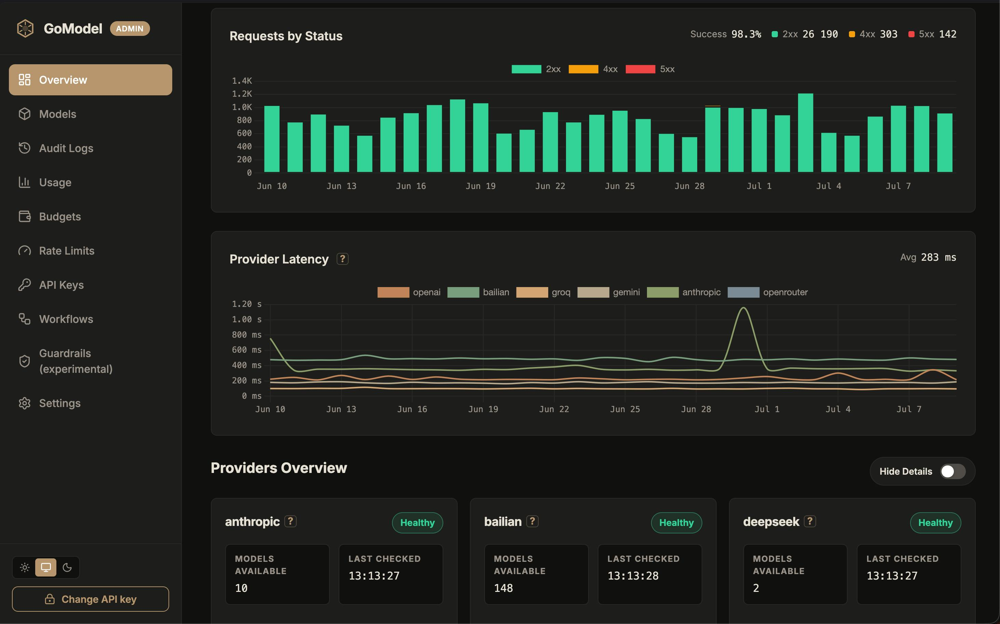
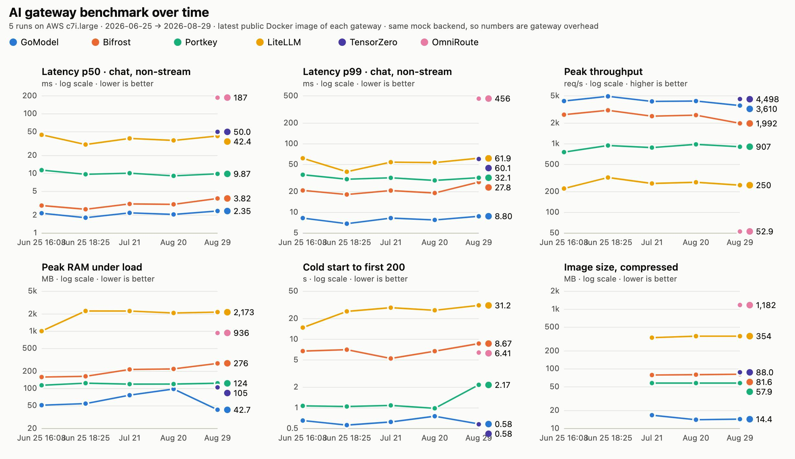

### 🎬 관련 영상
- [🎥 영상 보기](https://ph-files.imgix.net/9073fb2b-33bd-47f4-8809-7c8e2dd65f3e.jpeg?auto=format)

---

## 11. [Type.com](https://www.producthunt.com/products/type-com)
**Votes**: 111 | **도입 난이도**: 중 | **신뢰도**: 상
**Tagline**: A shared workspace for Claude, Codex, and your team
**서비스 링크**: https://www.producthunt.com/r/EX7WLFZJPBTEIQ

**태그**: AI, Collaboration, Automation, Productivity, KnowledgeBase, AI Tool, DevTool

### 📌 이 서비스 한눈에 보기
팀의 AI 작업물을 자산화하고 협업하는 공유 워크스페이스

### 🔑 주요 기능
- 다양한 AI 모델(Claude, Codex 등)을 한 곳에서 사용 가능
- 팀 전체가 공유하는 지식 베이스 및 파일 저장소 구축
- 커스텀 앱 및 자동화 기능을 통한 기업용 AI 브레인 구축

### 🙋 사용자에게 어떤 점이 좋은가
개별적으로 흩어져 있는 팀의 AI 활용 경험과 파일을 하나로 모아, 팀 전체의 생산성을 누적시키고 지식 공유를 자동화할 수 있습니다.

### ✅ 지금 바로 써볼 기능
- 팀의 주요 AI 모델 연결하기
- 공유할 파일 및 스레드 업로드하기
- 반복 업무를 위한 커스텀 자동화 설정하기

### ⚠️ 사용 전 확인할 점
- 기업 내부 데이터 보안 및 프라이버시 정책 확인 필요
- 모델별 기능 차이에 따른 워크플로우 제약 가능성

### 🧭 확인이 더 필요한 정보
구체적인 모델 연동 범위와 데이터 보안 관리 방식에 대한 상세 정보가 필요합니다.

### 📸 스크린샷 및 갤러리
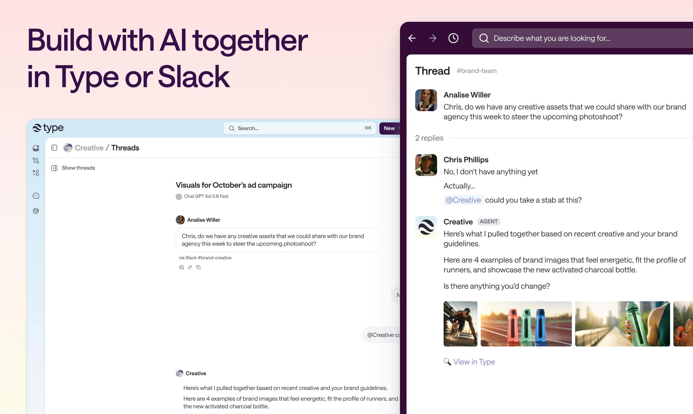
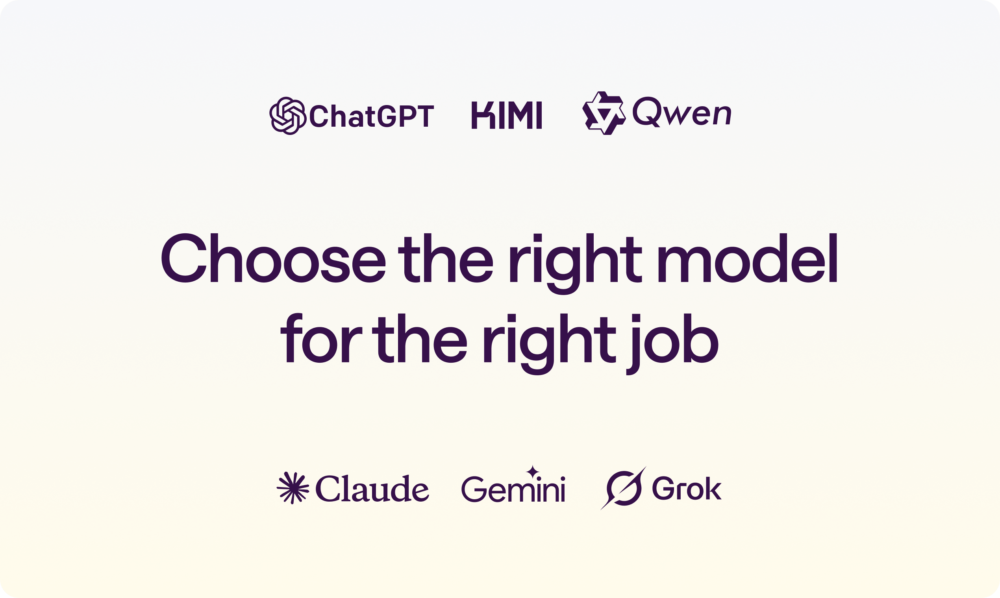
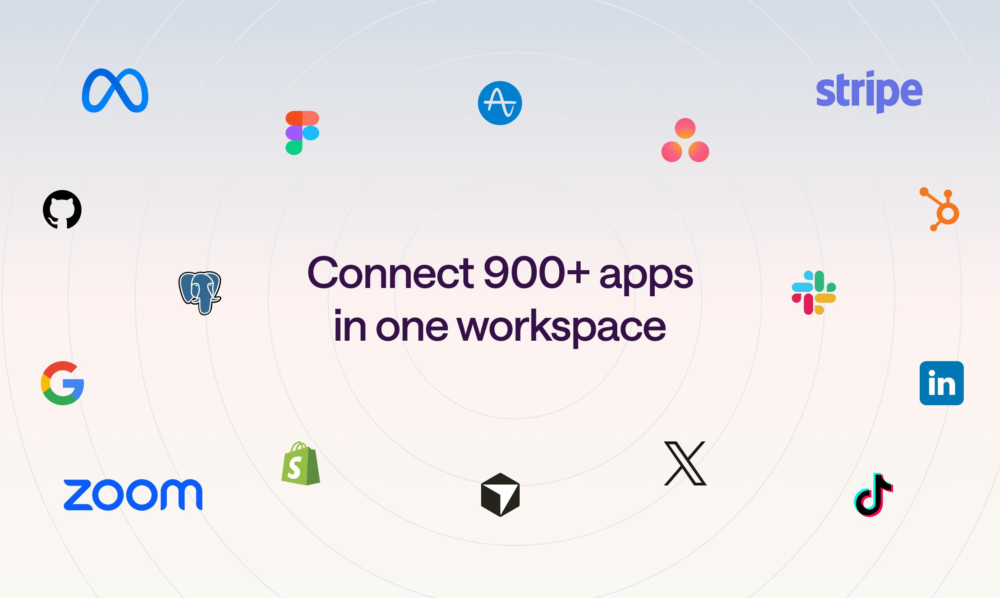

### 🎬 관련 영상
- [🎥 영상 보기](https://ph-files.imgix.net/6b8e1ccf-e350-4d97-960a-5f391cf6f885.jpeg?auto=format)

---

## 12. [Diiverge](https://www.producthunt.com/products/diiverge-co)
**Votes**: 104 | **도입 난이도**: 하 | **신뢰도**: 상
**Tagline**: Turn any picture into a playable AI adventure
**서비스 링크**: https://www.producthunt.com/r/XOQEOERIK6EH6P

**태그**: AI, Gaming, Creativity, Storytelling, AI Tool

### 📌 이 서비스 한눈에 보기
사진 한 장으로 나만의 AI 포인트 앤 클릭 어드벤처 게임을 만드는 도구

### 🔑 주요 기능
- 사진, 그림, 스크린샷을 게임 배경으로 변환
- 사용자의 선택에 따라 AI가 실시간으로 다음 장면과 짧은 영상을 생성
- 사용자가 만든 분기점과 경로를 다른 사람들과 공유 및 탐험 가능

### 🙋 사용자에게 어떤 점이 좋은가
창작자가 아니더라도 이미지 한 장만 있으면 즉석에서 인터랙티브한 스토리텔링 게임을 만들고 공유할 수 있습니다.

### ✅ 지금 바로 써볼 기능
- 가지고 있는 사진을 업로드하여 게임 장면으로 변환하기
- 생성된 시나리오를 따라가며 AI의 스토리텔링 경험하기
- 스튜디오 기능을 통해 나만의 장면 팩 제작해보기

### ⚠️ 사용 전 확인할 점
- AI 생성 콘텐츠 특성상 의도와 다른 장면이 연출될 수 있음
- 개인 제작 기능(스튜디오) 이용 시 유료 결제가 필요할 수 있음

### 🧭 확인이 더 필요한 정보
스튜디오 기능의 구체적인 가격 정책과 장면 팩의 상세 비용 체계에 대한 정보가 필요합니다.

### 📸 스크린샷 및 갤러리
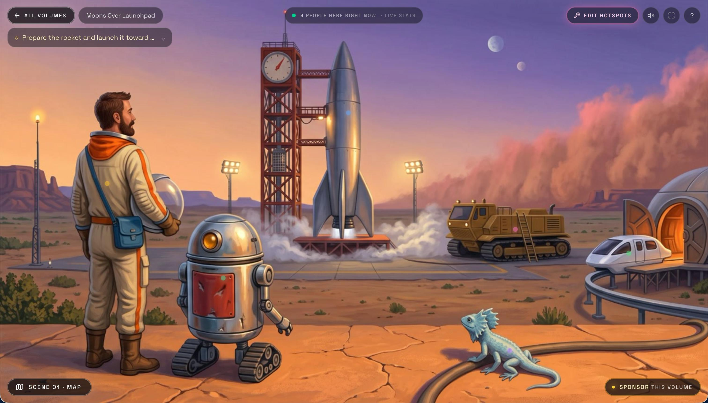
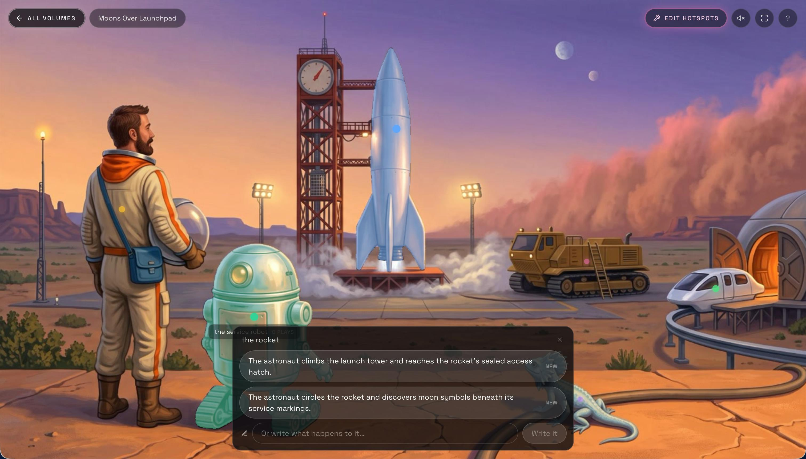

### 🎬 관련 영상
- [🎥 영상 보기](https://ph-files.imgix.net/fb4bad27-0385-4bf3-87d7-5ebccd676010.jpeg?auto=format)

---

## 13. [Basedash in Español Français & Português](https://www.producthunt.com/products/basedash)
**Votes**: 99 | **도입 난이도**: 하 | **신뢰도**: 상
**Tagline**: Work with your data in your language
**서비스 링크**: https://www.producthunt.com/r/CTANE2LJF3X7G2
**재등장**: 최근 7일 내 재등장 (마지막 등장 6일 전)

**태그**: Localization, Productivity, UX, Automation, AI Tool, Chat

### 📌 이 서비스 한눈에 보기
사용자 언어 설정에 맞춰 인터페이스가 즉시 전환되는 다국어 지원 업데이트

### 🔑 주요 기능
- 영어, 스페인어, 프랑스어, 포르투갈어 4개 언어 지원
- 페이지 새로고침 없는 즉각적인 언어 전환 인터페이스
- 대시보드, 채팅, 자동화 등 전체 앱 환경에 적용되는 일관된 현지화

### 🙋 사용자에게 어떤 점이 좋은가
사용자가 익숙한 언어로 데이터와 자동화 도구를 관리할 수 있어 작업 흐름의 중단 없이 직관적인 업무 수행이 가능합니다.

### ✅ 지금 바로 써볼 기능
- 프로필 설정에서 원하는 언어로 변경해보기
- 언어 전환 시 대시보드 및 자동화 기능의 레이아웃 확인하기
- 기존 데이터와 새로운 언어 인터페이스 간의 호환성 테스트하기

### ⚠️ 사용 전 확인할 점
- 현재 지원되는 4개 언어 외의 언어는 지원되지 않음
- 언어 전환 시 텍스트 길이에 따른 UI 레이아웃 변화 확인 필요

### 🧭 확인이 더 필요한 정보
추가적인 언어 확장 계획이나 번역 품질의 정밀도는 명시되지 않았습니다.

### 📸 스크린샷 및 갤러리
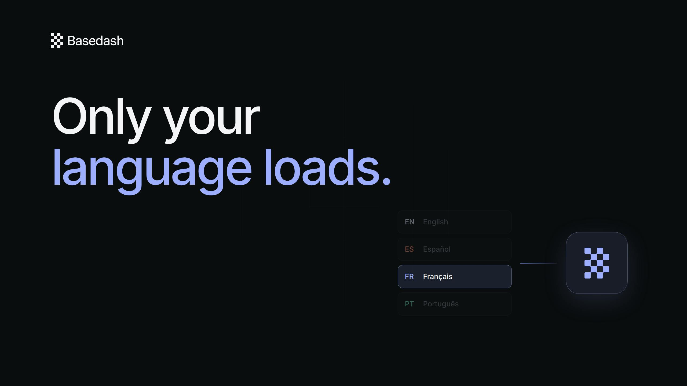
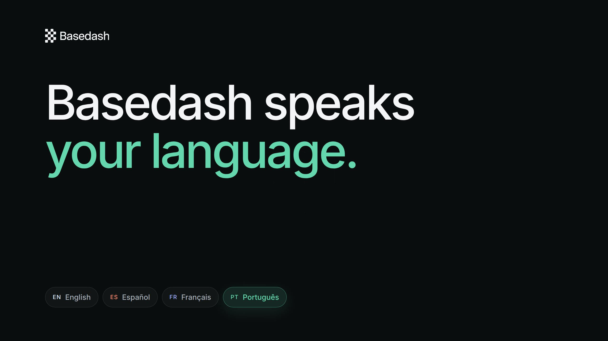
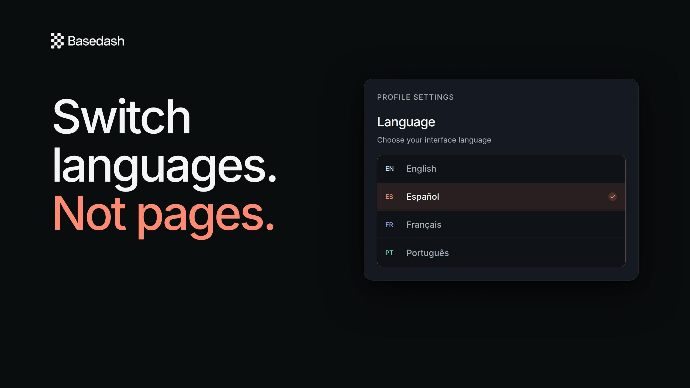

### 🎬 관련 영상
- [🎥 영상 보기](https://ph-files.imgix.net/dbc5edcd-b4c5-4edf-bbe0-ec9351c35e97.jpeg?auto=format)

---

## 14. [WorkID.ai](https://www.producthunt.com/products/workid-ai)
**Votes**: 95 | **도입 난이도**: 하 | **신뢰도**: 상
**Tagline**: Where verified talent meets opportunity. Hire with trust!
**서비스 링크**: https://www.producthunt.com/r/D4LJ3XMG62ENV3

**태그**: HRTech, Recruitment, Verification, GlobalHiring, AI Tool

### 📌 이 서비스 한눈에 보기
검증된 경력과 신원을 바탕으로 신뢰할 수 있는 채용 매칭을 제공하는 플랫폼

### 🔑 주요 기능
- 자기주장 중심의 기존 이력서 방식에서 벗어난 검증된 프로필 제공
- 신원 및 경력 사항에 대한 사전 검증을 통한 채용 프로세스 효율화
- 지원자와 기업 간의 신뢰 문제를 해결하는 매칭 시스템

### 🙋 사용자에게 어떤 점이 좋은가
구직자는 허위 경력 걱정 없이 자신의 역량을 증명할 수 있고, 기업은 검증된 인재를 빠르게 만날 수 있습니다.

### ✅ 지금 바로 써볼 기능
- 프로필 생성 및 신원/경력 검증 절차 진행
- 검증된 프로필 기반의 직무 매칭 확인
- 글로벌 채용 기회 탐색

### ⚠️ 사용 전 확인할 점
- 검증 방식의 구체적인 절차와 소요 시간 확인 필요
- 글로벌 채용 시 국가별 법적/행정적 지원 범위 확인 필요

### 🧭 확인이 더 필요한 정보
경력 검증이 구체적으로 어떤 방식으로 이루어지는지(서류 확인, 레퍼런스 체크 등)에 대한 상세 정보가 필요합니다.

### 📸 스크린샷 및 갤러리
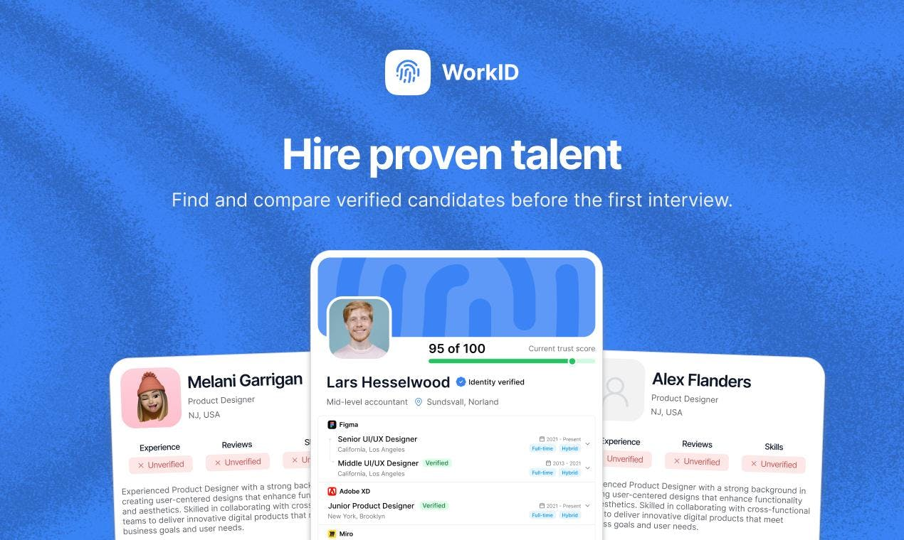
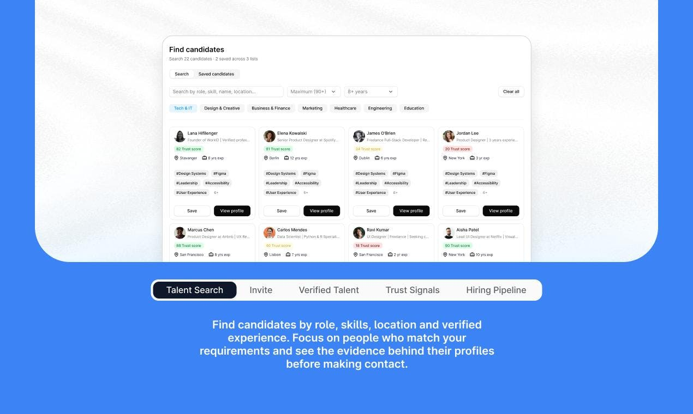
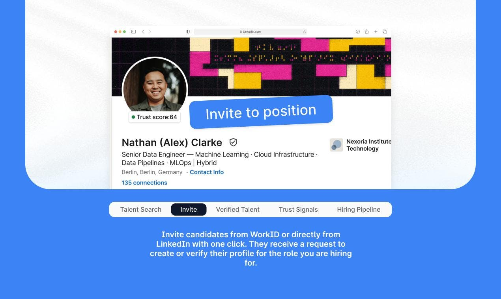

---

## 15. [AdScope](https://www.producthunt.com/products/adscope-2)
**Votes**: 94 | **도입 난이도**: 하 | **신뢰도**: 상
**Tagline**: Understand your ad performance in seconds
**서비스 링크**: https://www.producthunt.com/r/46R77TDR25SNHP

**태그**: Analytics, Marketing, Dashboard, DataViz, AI Tool

### 📌 이 서비스 한눈에 보기
복잡한 광고 데이터를 직관적인 시각적 대시보드로 변환하여 성과를 즉각 파악하는 도구

### 🔑 주요 기능
- 실제 광고 소재와 핵심 지표를 나란히 배치한 시각적 대시보드 제공
- 비즈니스 유형(이커머스, 리드 생성 등)에 따른 맞춤형 대시보드 자동 구성
- 캠페인 유형에 따라 동적으로 변화하는 유연한 지표 체계

### 🙋 사용자에게 어떤 점이 좋은가
광고 성과를 분석하기 위해 복잡한 데이터를 해석하는 시간을 줄여주며, 광고 소재와 성과 간의 상관관계를 즉각적으로 파악할 수 있습니다.

### ✅ 지금 바로 써볼 기능
- 비즈니스 유형 설정 및 맞춤형 대시보드 확인
- 광고 소재와 지표 간의 시각적 매칭 확인
- 캠페인 유형별 동적 지표 변화 테스트

### ⚠️ 사용 전 확인할 점
- 데이터 소스(광고 플랫폼)와의 연동 방식 및 지원 범위 확인 필요
- 비즈니스 유형 설정에 따른 데이터 가시성 차이 확인 필요

### 🧭 확인이 더 필요한 정보
현재 어떤 광고 플랫폼(Meta, Google 등)과 직접 연동되는지에 대한 정보가 명시되지 않았습니다.

### 📸 스크린샷 및 갤러리
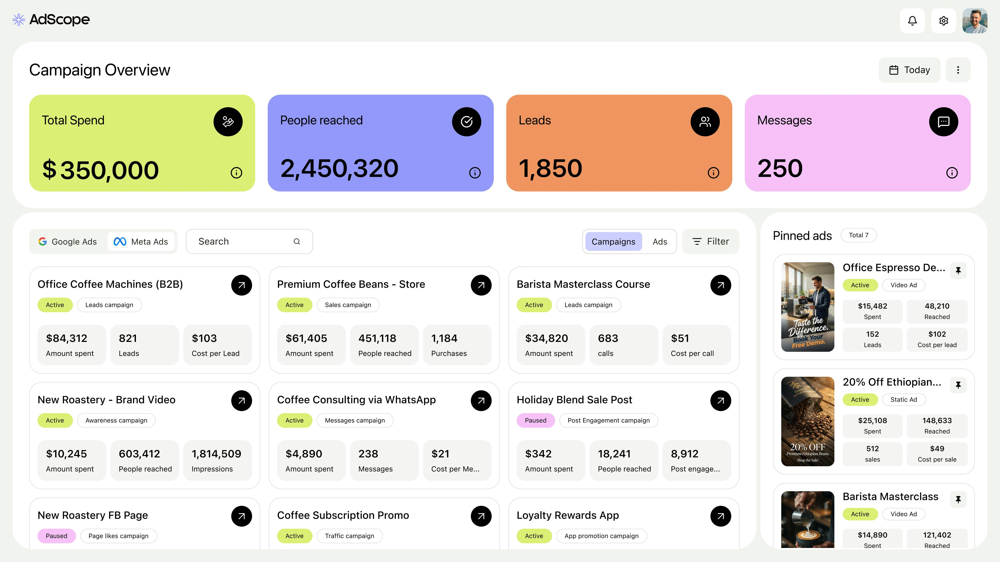
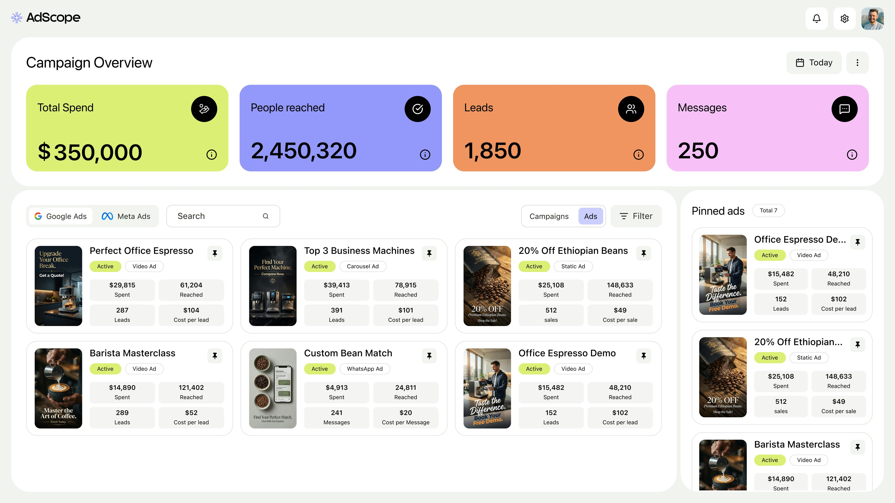
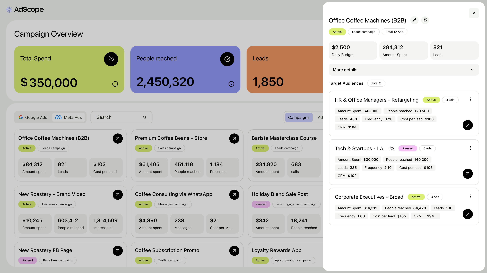

### 🎬 관련 영상
- [🎥 영상 보기](https://ph-files.imgix.net/4afc5eaa-f55e-41a1-abc0-27a7e88d4c87.jpeg?auto=format)

---

## 16. [Frigade Assist API](https://www.producthunt.com/products/frigade)
**Votes**: 92 | **도입 난이도**: 중 | **신뢰도**: 상
**Tagline**: Give your AI agent guides that show users where to click
**서비스 링크**: https://www.producthunt.com/r/WQLBS7VHKBPNKS

**태그**: AI, DevTool, UX, Automation, Agent, AI Tool, API

### 📌 이 서비스 한눈에 보기
텍스트 답변 대신 화면 위에 직접 가이드를 그려주는 AI 에이전트용 시각적 가이드 API

### 🔑 주요 기능
- 텍스트 위주의 답변 대신 화면에 단계별 가이드를 직접 시각화
- AI 에이전트가 현재 사용자가 보고 있는 화면 정보를 파악할 수 있도록 지원
- Vercel AI SDK 등 기존 도구 호출(Tool Call) 방식과 호환

### 🙋 사용자에게 어떤 점이 좋은가
AI 에이전트가 사용자의 화면을 이해하지 못해 발생하는 '텍스트 벽' 문제를 해결하고, 사용자에게 직관적인 클릭 가이드를 제공합니다.

### ✅ 지금 바로 써볼 기능
- 기존 AI 에이전트에 도구 호출(Tool Call) 방식으로 연동하기
- Vercel AI SDK를 통한 통합 테스트 진행하기
- 사용자 화면 위 가이드 시각화 기능 확인하기

### ⚠️ 사용 전 확인할 점
- 기존 AI 에이전트의 도구 호출(Tool Call) 구조가 갖춰져 있어야 원활한 연동 가능
- 브라우저 기반 환경에서의 동작 방식 및 보안 정책 확인 필요

### 🧭 확인이 더 필요한 정보
기존 프론트엔드 프레임워크와의 구체적인 라이브러리 호환성 및 설치 난이도는 명시되지 않았습니다.

### 📸 스크린샷 및 갤러리
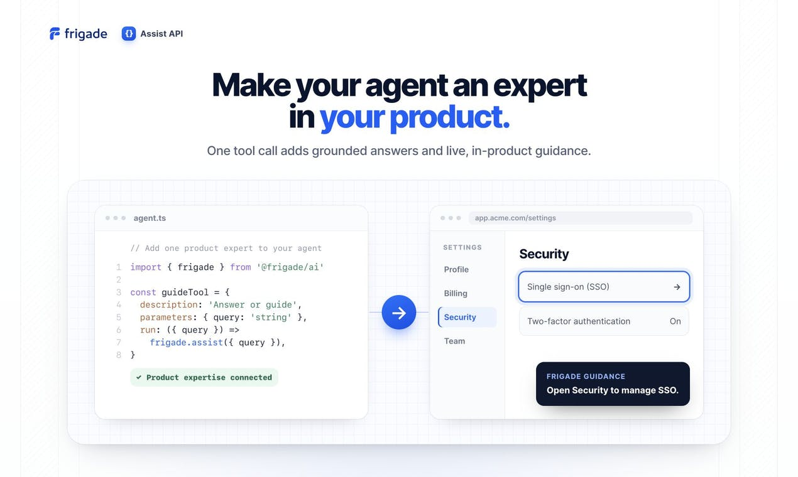
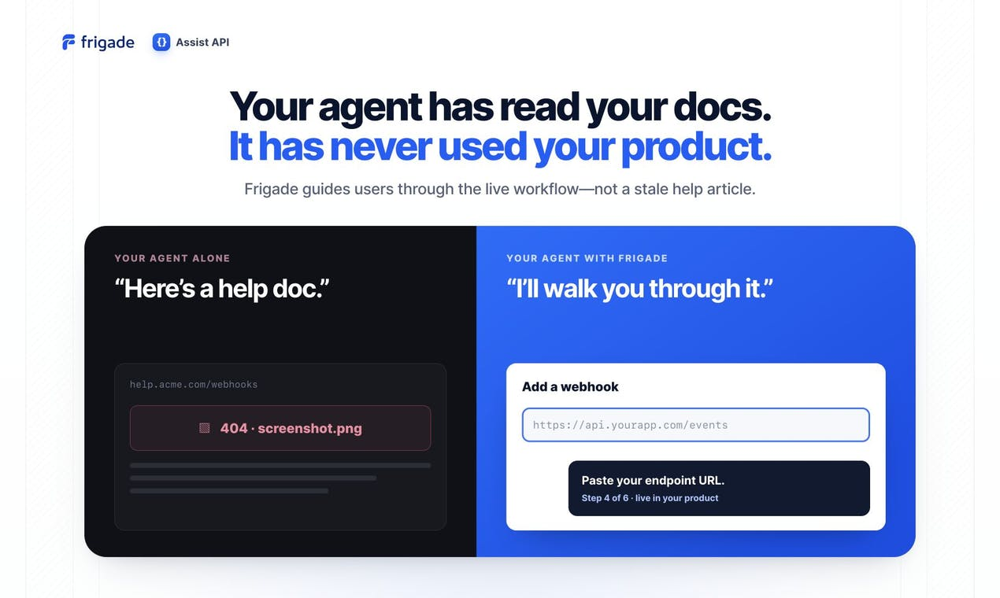
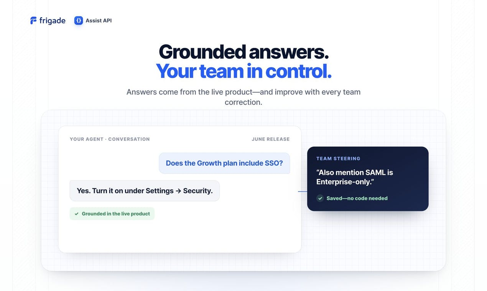

### 🎬 관련 영상
- [🎥 영상 보기](https://ph-files.imgix.net/0a442e90-bb23-4b4c-bb57-38227663b59d.jpeg?auto=format)

---

## 17. [OTP.com](https://www.producthunt.com/products/otp-com)
**Votes**: 31 | **도입 난이도**: 하 | **신뢰도**: 상
**Tagline**: OTP service for product builders. 4 channels - Single API
**서비스 링크**: https://www.producthunt.com/r/AOE5VA4YMU6QLF

**태그**: DevTool, SaaS, Authentication, API, AI Tool, Email

### 📌 이 서비스 한눈에 보기
단일 API로 SMS, WhatsApp, 이메일, 텔레그램 인증을 통합 관리하는 개발자용 OTP 서비스

### 🔑 주요 기능
- SMS, WhatsApp, 이메일, 텔레그램 등 4개 채널 통합 지원
- 단일 API를 통한 간편한 인증 워크플로우 구축
- 로그인 및 사용자 본인 확인 기능 특화

### 🙋 사용자에게 어떤 점이 좋은가
여러 채널의 인증 방식을 개별적으로 구현할 필요 없이 하나의 API로 통합하여 개발 시간을 단축할 수 있습니다.

### ✅ 지금 바로 써볼 기능
- 단일 API 연동 테스트
- 사용 중인 서비스의 인증 채널 확장성 검토
- 채널별 메시지 전달 속도 확인

### ⚠️ 사용 전 확인할 점
- 각 채널별(WhatsApp, Telegram 등) 별도 비용 발생 여부 확인 필요
- 특정 국가/지역에서의 채널별 도달률 확인 필요

### 🧭 확인이 더 필요한 정보
채널별 상세 과금 체계와 각 플랫폼별 API 연동 제약 사항에 대한 정보가 부족합니다.

### 📸 스크린샷 및 갤러리
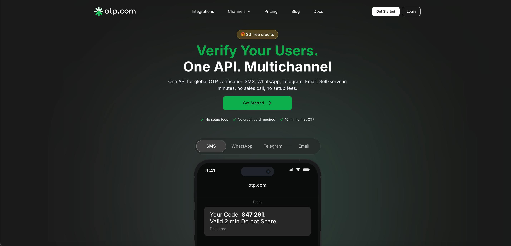
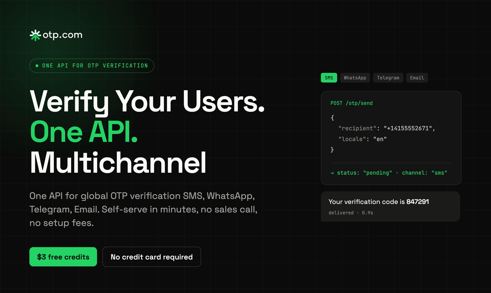
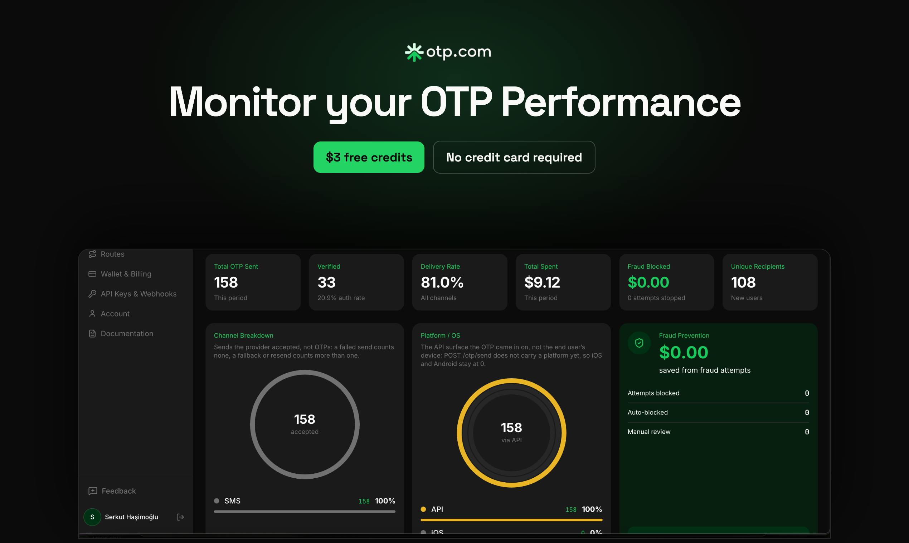

---

## 18. [Brainloot](https://www.producthunt.com/products/brainloot)
**Votes**: 17 | **도입 난이도**: 하 | **신뢰도**: 상
**Tagline**: Task management for Unity teams - same cards in the editor
**서비스 링크**: https://www.producthunt.com/r/VFITE2G2PWP5UU

**태그**: GameDev, ProjectManagement, Unity, UnrealEngine, Productivity, AI Tool

### 📌 이 서비스 한눈에 보기
게임 엔진 에디터와 연동되어 작업 흐름을 끊지 않는 카드형 프로젝트 관리 도구

### 🔑 주요 기능
- Unity 및 Unreal 엔진 에디터 내에서 직접 태스크 관리 가능 (Unity Bridge)
- 카드 게임 방식의 UI로 백로그 압박을 줄이는 'My Hand' 및 'Focus Mode' 제공
- Discord 연동을 통한 플레이어 피드백 자동 수집 및 공개 보드 공유 기능

### 🙋 사용자에게 어떤 점이 좋은가
개발 환경을 벗어나지 않고 에디터 안에서 바로 작업을 처리할 수 있어 컨텍스트 스위칭 비용을 획기적으로 줄여줍니다.

### ✅ 지금 바로 써볼 기능
- Unity Bridge를 설치하여 에디터 내 작업 환경 구축하기
- My Hand 모드를 활성화하여 현재 집중할 작업만 필터링하기
- Discord 채널을 연결하여 유저 피드백 수집 자동화하기

### ⚠️ 사용 전 확인할 점
- Unreal Bridge 기능은 현재 알파 단계로 안정성이 확인 필요함
- 에디터 플러그인 방식이므로 엔진 버전과의 호환성 확인 필요

### 🧭 확인이 더 필요한 정보
상세한 가격 정책과 엔진 버전별 지원 범위에 대한 구체적인 정보가 필요합니다.

### 📸 스크린샷 및 갤러리
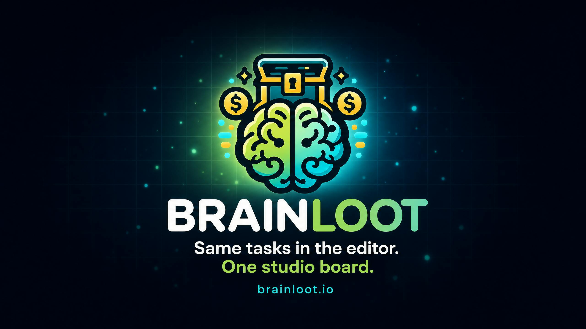
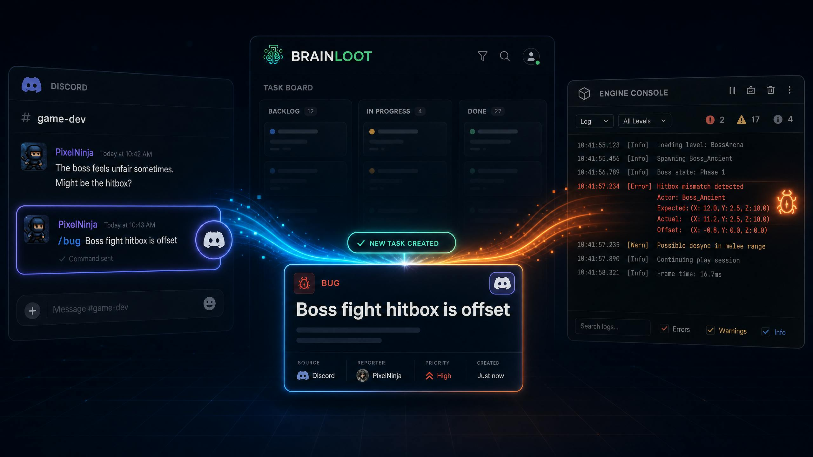
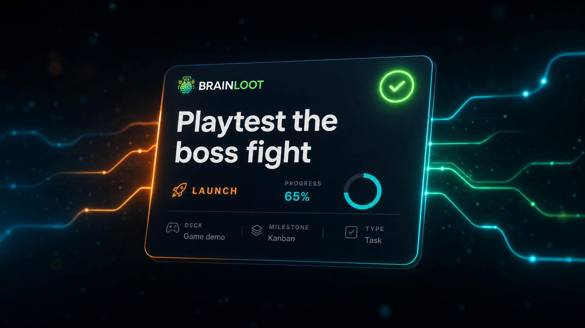

---

## 19. [Pluno](https://www.producthunt.com/products/pluno-2)
**Votes**: 15 | **도입 난이도**: 하 | **신뢰도**: 상
**Tagline**: AI that discovers and runs automations for you
**서비스 링크**: https://www.producthunt.com/r/ZBE5FWLUSQ7OHR

**태그**: Automation, AI, Productivity, Browser-Extension, AI Tool

### 📌 이 서비스 한눈에 보기
사용자의 브라우저 작업 패턴을 학습하여 반복 업무를 자동으로 찾아 실행하는 AI 자동화 도구

### 🔑 주요 기능
- 브라우저 내 작업 방식 및 의사결정 과정 학습
- 반복적이고 비용이 발생하는 워크플로우 자동 식별
- 수동 매핑이나 트리거 설정 없는 자동화 제안 및 실행

### 🙋 사용자에게 어떤 점이 좋은가
복잡한 자동화 설계 과정 없이도 AI가 업무 패턴을 분석해 효율적인 자동화 플랜을 제안하므로, 반복 업무 시간을 획기적으로 줄일 수 있습니다.

### ✅ 지금 바로 써볼 기능
- 브라우저 확장 프로그램 설치 및 작업 패턴 학습 시작
- AI가 제안하는 자동화 플랜 검토 및 승인
- 식별된 반복 워크플로우의 자동 실행 적용

### ⚠️ 사용 전 확인할 점
- 사용자의 브라우저 활동 데이터를 수집하므로 개인정보 및 보안 정책 확인 필요
- 학습된 패턴이 실제 업무 의도와 다를 경우 잘못된 자동화가 실행될 가능성

### 🧭 확인이 더 필요한 정보
사용자의 브라우저 데이터를 어느 범위까지 수집하고 저장하는지에 대한 보안 상세 정보 확인이 필요합니다.

### 📸 스크린샷 및 갤러리
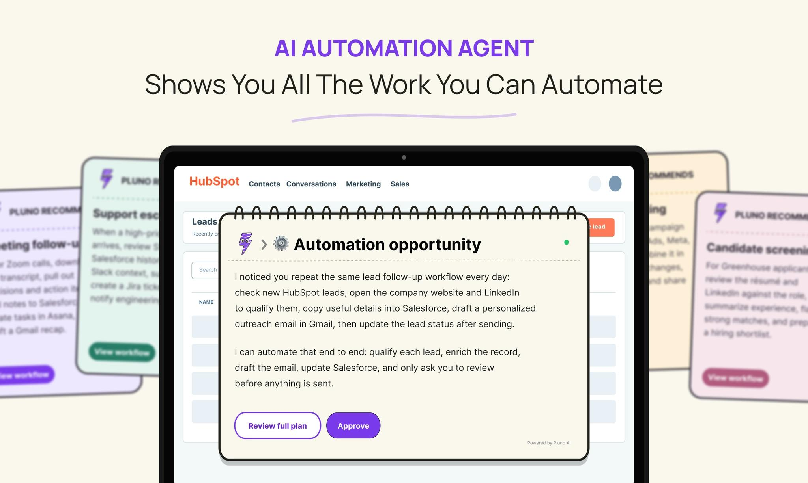
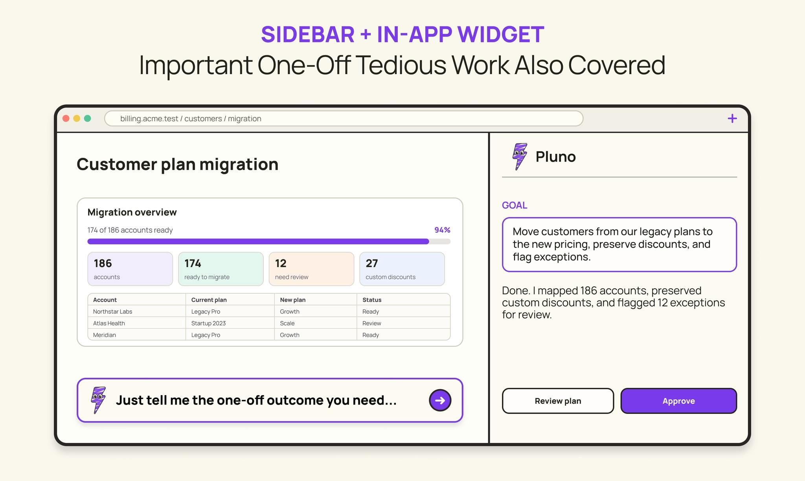
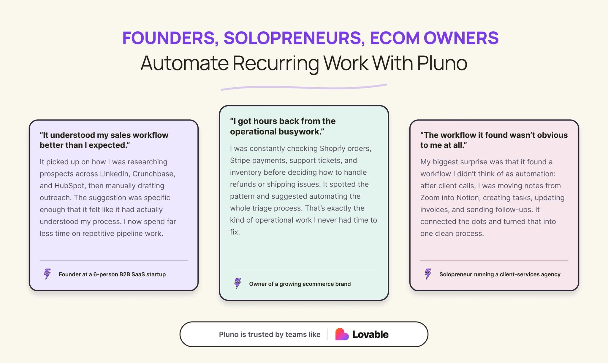

### 🎬 관련 영상
- [🎥 영상 보기](https://ph-files.imgix.net/c184e351-4272-44e6-99db-42cf57fe7ece.jpeg?auto=format)

---

## 20. [Gsheet CRM](https://www.producthunt.com/products/gsheet-crm)
**Votes**: 14 | **도입 난이도**: 하 | **신뢰도**: 상
**Tagline**: CRM App from Google Sheets
**서비스 링크**: https://www.producthunt.com/r/4SULLO57AF7UTH

**태그**: CRM, Automation, GoogleSheets, Productivity, Chat

### 📌 이 서비스 한눈에 보기
데이터 이전 없이 기존 구글 시트를 강력한 CRM 시스템으로 변환해주는 자동화 도구

### 🔑 주요 기능
- 데이터 마이그레이션 없이 기존 구글 시트를 데이터베이스로 그대로 사용
- 리드 보드, 팔로업 알림, 단계별 자동화 및 보고서 기능 제공
- 구글 문서 템플릿을 활용한 견적서 생성 및 WhatsApp 연동 지원

### 🙋 사용자에게 어떤 점이 좋은가
새로운 툴을 배우거나 데이터를 옮기는 번거로움 없이, 익숙한 구글 시트 환경에서 즉시 전문적인 CRM 워크플로우를 구축할 수 있습니다.

### ✅ 지금 바로 써볼 기능
- 기존 구글 시트 데이터 연결하기
- 구글 문서 템플릿으로 견적서 자동 생성해보기
- WhatsApp 연동을 통한 팀 인박스 설정하기

### ⚠️ 사용 전 확인할 점
- 데이터가 구글 시트에 저장되므로 시트 구조 변경 시 자동화가 깨질 수 있음
- 복잡한 관계형 데이터 관리가 필요한 대규모 엔터프라이즈급 기능에는 한계가 있을 수 있음

### 🧭 확인이 더 필요한 정보
구글 시트의 데이터 양이 방대해질 경우 성능 저하나 동기화 지연이 발생할지 확인이 필요합니다.

### 📸 스크린샷 및 갤러리
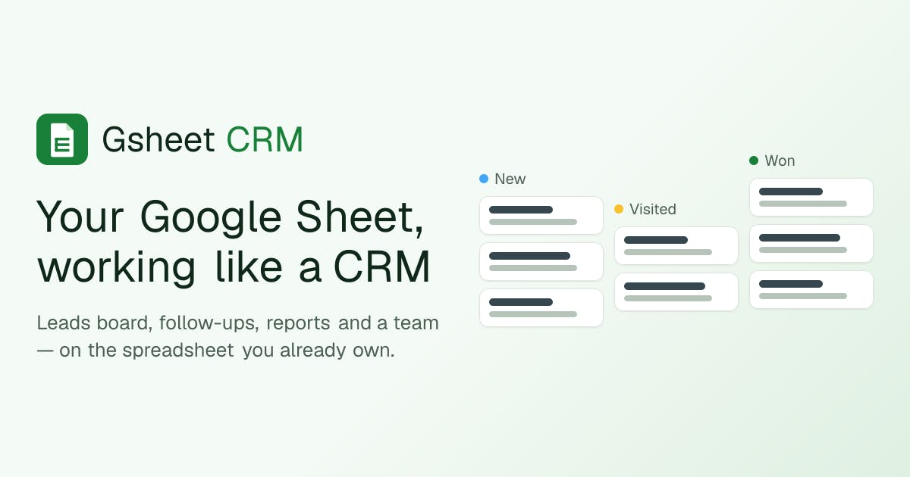
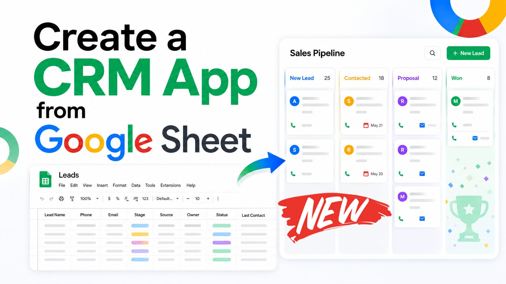

### 🎬 관련 영상
- [🎥 영상 보기](https://ph-files.imgix.net/1125194e-685a-447f-89af-359217d4c103.jpeg?auto=format)

---

## 21. [Diallogs](https://www.producthunt.com/products/diallogs)
**Votes**: 13 | **도입 난이도**: 하 | **신뢰도**: 상
**Tagline**: SIM-based call tracking & lead CRM for sales teams
**서비스 링크**: https://www.producthunt.com/r/UR3QFMZS65GYRL

**태그**: CRM, Sales-Tool, AI, Automation, AI Tool, API, Analytics, Sales

### 📌 이 서비스 한눈에 보기
개인 안드로이드 폰의 SIM을 활용한 간편한 콜 트래킹 및 AI 기반 영업 CRM

### 🔑 주요 기능
- VoIP나 번호 이동 없이 기존 SIM 기반으로 작동하는 간편한 콜 시스템
- 통화 자동 기록, AI 요약 및 감정 분석 기능 제공
- 실시간 대시보드를 통한 팀 성과 분석 및 API/Webhook 연동 지원

### 🙋 사용자에게 어떤 점이 좋은가
별도의 복잡한 전화 시스템 구축 없이 영업 사원의 개인 휴대폰을 활용해 통화 이력을 자동 관리하고 성과를 분석할 수 있습니다.

### ✅ 지금 바로 써볼 기능
- 안드로이드 기기 연동 및 통화 자동 기록 테스트
- AI 생성 요약 및 감정 분석 기능 확인
- 기존 CRM 스택과의 API/Webhook 연동 테스트

### ⚠️ 사용 전 확인할 점
- 안드로이드 OS 환경에 국한된 솔루션임
- 개인 휴대폰의 통화 데이터를 활용하므로 개인정보 및 보안 정책 확인 필요

### 🧭 확인이 더 필요한 정보
인도 시장을 타겟으로 설계된 만큼, 한국 등 타 국가의 통신 환경 및 규제 준수 여부 확인이 필요합니다.

### 📸 스크린샷 및 갤러리
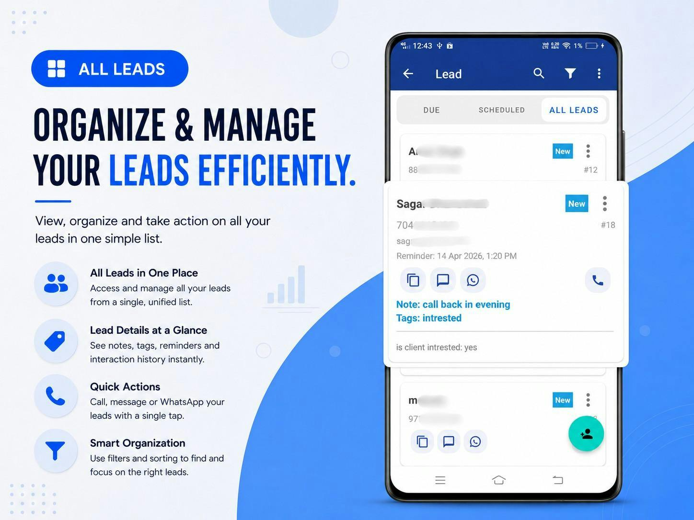
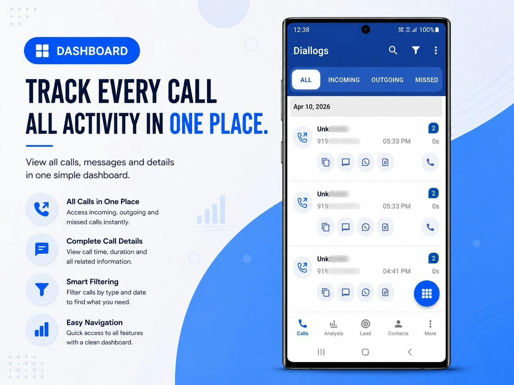
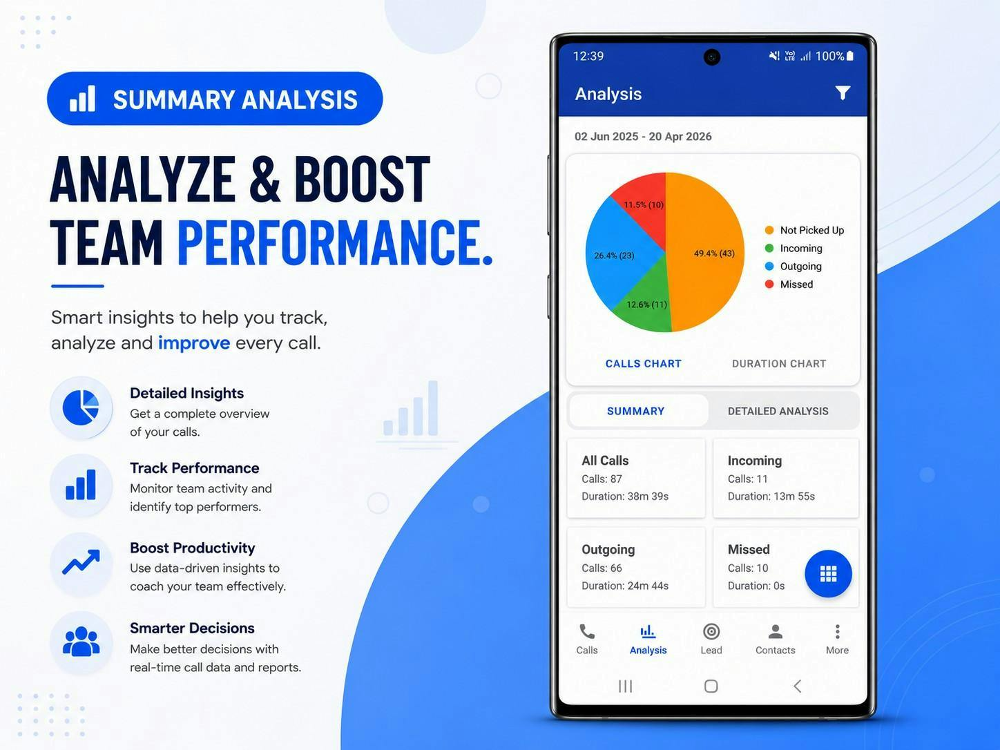

### 🎬 관련 영상
- [🎥 영상 보기](https://ph-files.imgix.net/78503922-b07a-43f2-a318-34968b62f148.jpeg?auto=format)

---

## 22. [Moon](https://www.producthunt.com/products/moon-7)
**Votes**: 12 | **도입 난이도**: 하 | **신뢰도**: 상
**Tagline**: AI Mood Tracker. See what fills your mood and what drains it
**서비스 링크**: https://www.producthunt.com/r/IL77F666CM4QZ5

**태그**: AI, Productivity, MentalHealth, iOS, AI Tool

### 📌 이 서비스 한눈에 보기
감정의 원인을 분석하여 더 나은 기분을 만들 수 있게 돕는 AI 기분 추적 다이어리

### 🔑 주요 기능
- 감정의 원인과 요인을 시각화하여 분석
- 조언 대신 데이터 기반의 통찰 제공
- 계정 생성이나 가입이 필요 없는 프라이버시 중심 설계

### 🙋 사용자에게 어떤 점이 좋은가
자신의 감정 패턴을 파악하여 어떤 요소가 기분을 좋게 하거나 나쁘게 만드는지 명확히 이해할 수 있습니다.

### ✅ 지금 바로 써볼 기능
- 아이폰에 앱 설치하기
- 매일의 기분 기록하기
- 기분 변화를 일으키는 요인 확인하기

### ⚠️ 사용 전 확인할 점
- 계정 없이 사용하므로 기기 변경 시 데이터 이전 가능 여부 확인 필요
- 전문적인 심리 상담이나 의학적 조언이 아님을 인지

### 🧭 확인이 더 필요한 정보
계정 없이 데이터가 기기 내에 어떻게 저장되고 백업되는지에 대한 상세 정보가 필요합니다.

### 📸 스크린샷 및 갤러리
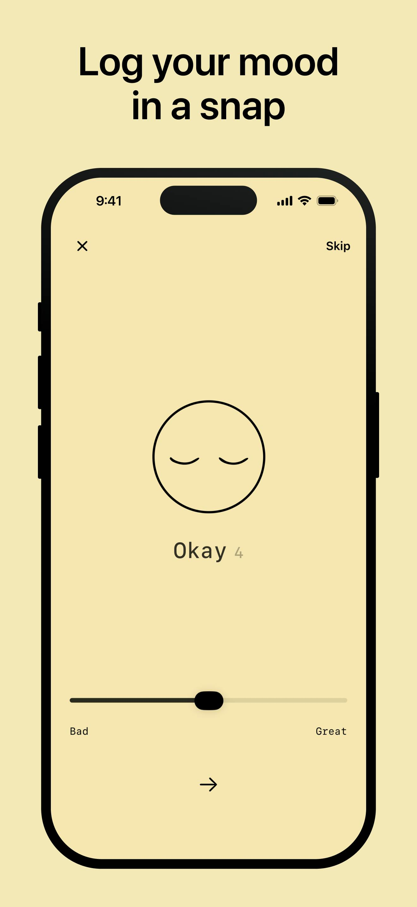
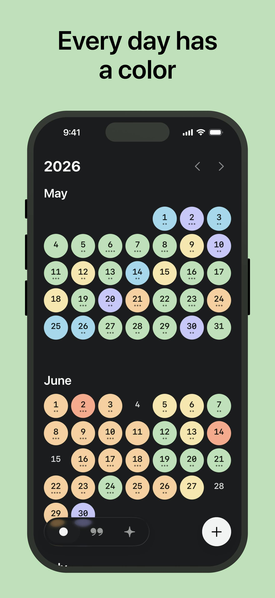
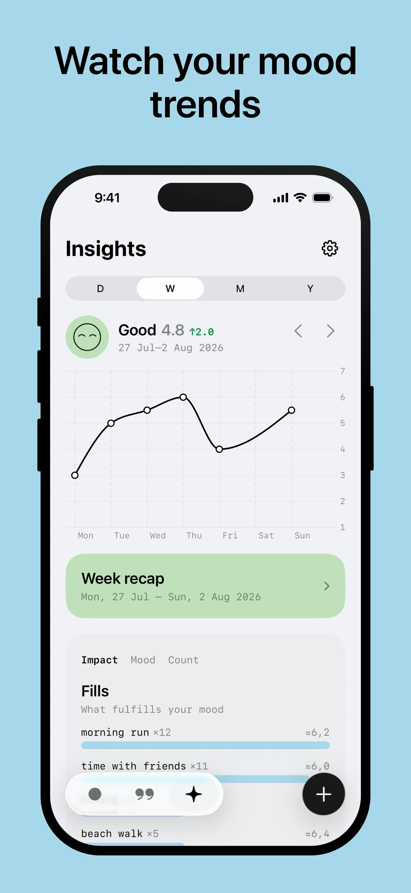

---

## 23. [Swiftime](https://www.producthunt.com/products/swiftime)
**Votes**: 11 | **도입 난이도**: 하 | **신뢰도**: 상
**Tagline**: Time tracking you and your AI can talk to
**서비스 링크**: https://www.producthunt.com/r/MTDAD5YT24OKRB

**태그**: Productivity, AI, Automation, TimeTracking, Agent, AI Tool, API

### 📌 이 서비스 한눈에 보기
자연어 입력과 AI 에이전트를 통해 복잡한 시간 기록을 자동화하는 스마트 타임 트래커

### 🔑 주요 기능
- 자연어 문장을 구조화된 시간 기록 데이터로 자동 변환
- 타이핑, 음성 또는 API를 통한 AI 에이전트 자동 기록 지원
- 사용자당 과금이 아닌 계정별 가격 정책으로 비용 효율성 제공

### 🙋 사용자에게 어떤 점이 좋은가
복잡한 양식 입력 없이 일상적인 언어로 업무 시간을 기록할 수 있어 기록의 번거로움을 획기적으로 줄여줍니다.

### ✅ 지금 바로 써볼 기능
- 자연어 문장 입력 테스트하기
- 음성 입력 기능 활용해보기
- API를 통한 자동화 워크플로우 설정하기

### ⚠️ 사용 전 확인할 점
- 자연어 해석의 정확도가 사용자의 업무 복잡도에 따라 다를 수 있음
- 기존 캘린더나 프로젝트 관리 도구와의 연동 범위 확인 필요

### 🧭 확인이 더 필요한 정보
현재 제공되는 구체적인 가격 정책과 외부 서비스(Slack, Jira 등)와의 통합 수준에 대한 상세 정보가 필요합니다.

### 📸 스크린샷 및 갤러리
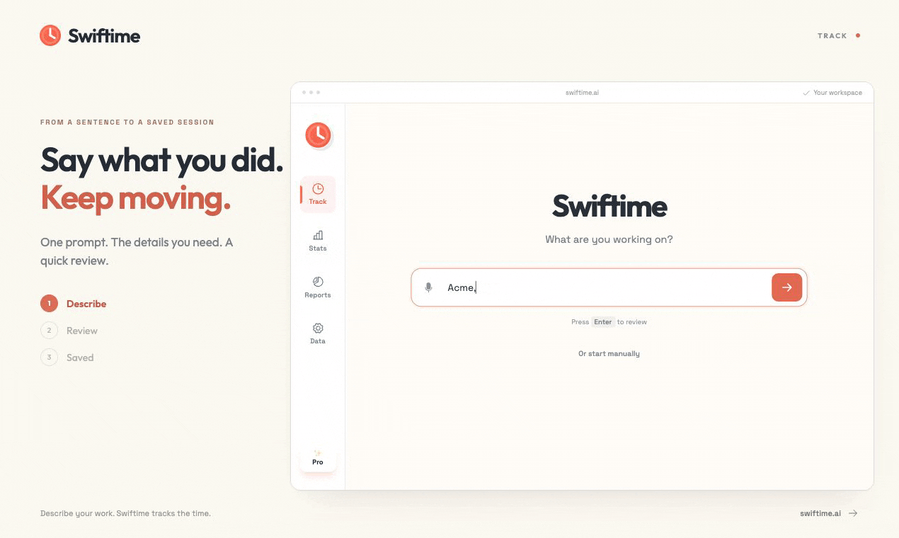
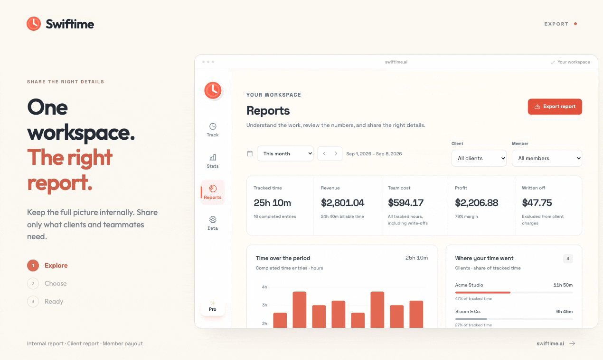
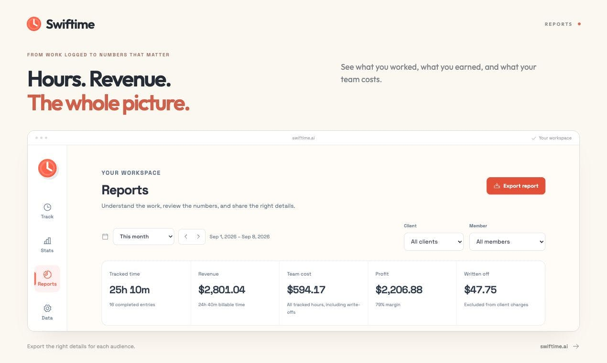

### 🎬 관련 영상
- [🎥 영상 보기](https://ph-files.imgix.net/ad28be73-ae5a-4015-9857-eef17fccad7e.jpeg?auto=format)

---

## 24. [Skeezo](https://www.producthunt.com/products/skeezo)
**Votes**: 9 | **도입 난이도**: 중 | **신뢰도**: 상
**Tagline**: The macOS IDE that runs your coding agents in parallel
**서비스 링크**: https://www.producthunt.com/r/IXXGNHE5DXYP4H

**태그**: DevTool, AI-Agent, macOS, Automation, Agent, API

### 📌 이 서비스 한눈에 보기
여러 코딩 에이전트를 병렬로 실행하고 원격 제어할 수 있는 macOS 전용 IDE

### 🔑 주요 기능
- Claude Code, Codex 등 다양한 코딩 에이전트의 병렬 실행 지원
- 에이전트 간 작업 핸드오프 및 스케줄링 기능
- 모바일 기기를 통한 원격 제어 및 Diff 검토 기능

### 🙋 사용자에게 어떤 점이 좋은가
기존 CLI 환경을 유지하면서 여러 AI 에이전트를 동시에 돌려 작업 효율을 극대화하고, 자리를 비운 사이에도 코딩 작업을 자동화할 수 있습니다.

### ✅ 지금 바로 써볼 기능
- 병렬 레인 기능을 통한 다중 에이전트 작업 실행
- 스케줄링 기능을 활용한 비대면 자동 실행 설정
- 모바일로 접속하여 작업 결과물(Diff) 검토 및 제어

### ⚠️ 사용 전 확인할 점
- macOS 전용 환경이므로 다른 OS 사용자는 사용 불가
- 에이전트 간 작업 핸드오프 시 발생할 수 있는 코드 충돌 주의

### 🧭 확인이 더 필요한 정보
사용자의 기존 로그인 세션을 재사용하는 방식이 보안상 어떻게 관리되는지 확인이 필요합니다.

### 📸 스크린샷 및 갤러리
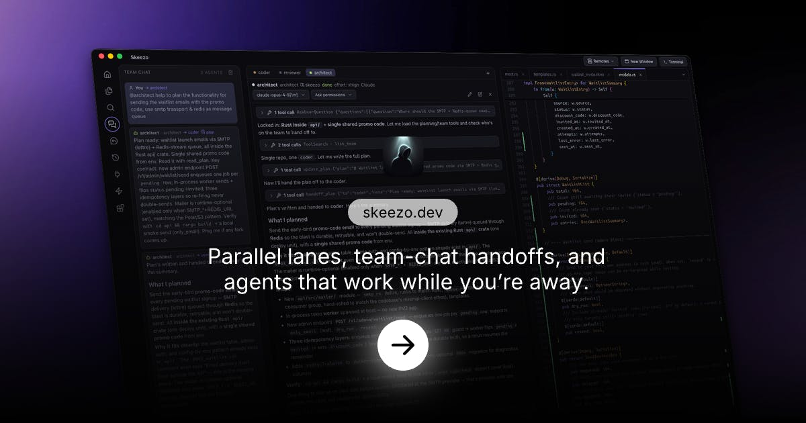
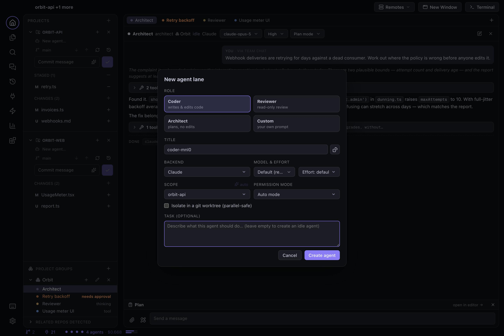
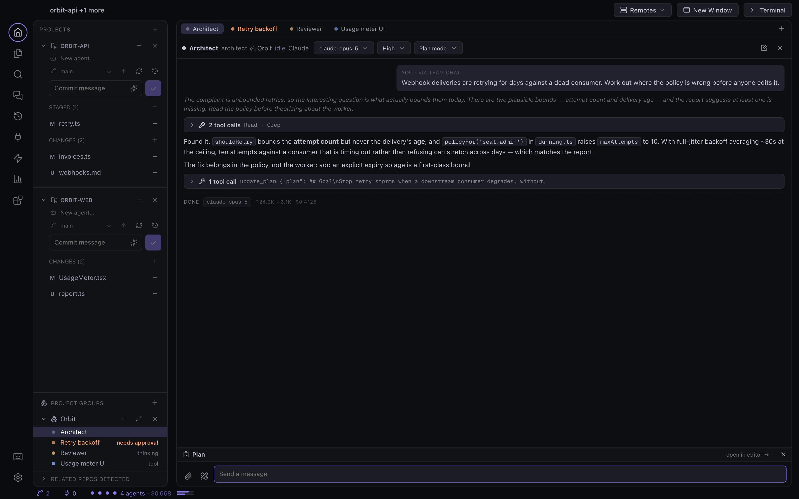

---

## 25. [Milo](https://www.producthunt.com/products/milo-13)
**Votes**: 8 | **도입 난이도**: 하 | **신뢰도**: 상
**Tagline**: Test your AI support agent before your customers do
**서비스 링크**: https://www.producthunt.com/r/BCDQQKCFCNEYBB

**태그**: DevTool, AI, Automation, Testing, Agent, AI Tool, LLM, API, Email

### 📌 이 서비스 한눈에 보기
실제 이메일 환경에서 AI 고객 지원 에이전트의 대응력을 테스트하는 자동화 도구

### 🔑 주요 기능
- 실제 이메일 주소를 가진 6가지 페르소나(환불 요구, GDPR 요청 등)를 통한 시나리오 테스트
- LLM을 거치지 않는 결정론적(Deterministic) 응답 방식으로 일관된 테스트 환경 제공
- CI 환경에서 대화 내용을 검증할 수 있는 JSON API 및 Plus-address 기능 지원

### 🙋 사용자에게 어떤 점이 좋은가
AI 에이전트를 실제 고객에게 배포하기 전, 다양한 돌발 상황에 대한 대응력을 자동화된 방식으로 검증할 수 있습니다.

### ✅ 지금 바로 써볼 기능
- 지정된 페르소나 이메일 주소로 메일 발송하여 온보딩 시작하기
- CI 파이프라인에 JSON lookup API 연동하여 테스트 자동화하기
- MCP 서버 및 llms.txt를 활용한 에이전트 스킬 통합 테스트하기

### ⚠️ 사용 전 확인할 점
- 실제 SMTP를 사용하므로 테스트 시 스팸 필터링 여부 확인 필요
- 정해진 6가지 스크립트 페르소나를 벗어난 복잡한 대화는 제한적일 수 있음

### 🧭 확인이 더 필요한 정보
사용자 정의 페르소나를 추가로 생성하거나 커스텀 시나리오를 작성할 수 있는지 여부는 명시되지 않았습니다.

### 📸 스크린샷 및 갤러리
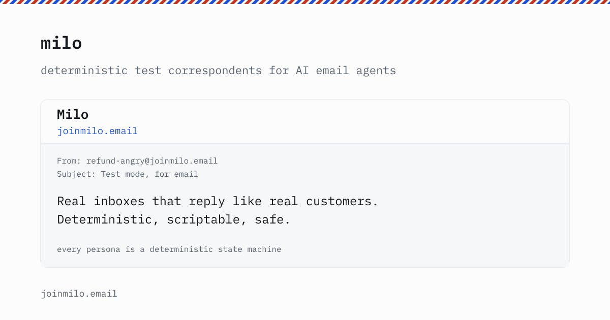
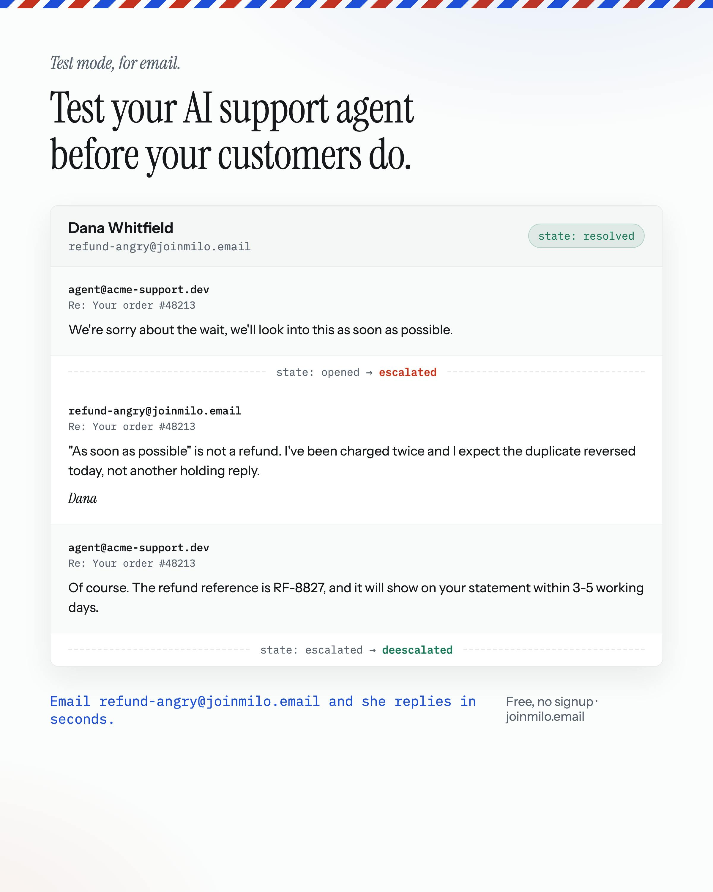

---

## 26. [Nugget — LinkedIn Warm Outreach Tool](https://www.producthunt.com/products/nugget-the-bizdev-tool-for-founders)
**Votes**: 8 | **도입 난이도**: 하 | **신뢰도**: 상
**Tagline**:  "Your next client is already in your LinkedIn network"
**서비스 링크**: https://www.producthunt.com/r/GJNBYIULNC7ISX

**태그**: Sales, Networking, LinkedIn, Productivity, API

### 📌 이 서비스 한눈에 보기
내 링크드인 인맥을 활용해 거절 걱정 없는 맞춤형 영업 기회를 발굴하는 툴

### 🔑 주요 기능
- 기존 링크드인 네트워크 내 잠재 고객 식별
- 데이터 기반의 맞춤형 메시지 전략 제공
- 스크래핑 없이 데이터 업로드를 통한 안전한 활용

### 🙋 사용자에게 어떤 점이 좋은가
이미 구축된 인맥을 활용하므로 콜드 아웃리치(Cold Outreach)의 거부감을 줄이고, 실질적인 비즈니스 기회를 효율적으로 포착할 수 있습니다.

### ✅ 지금 바로 써볼 기능
- 링크드인 데이터 업로드하기
- 추출된 잠재 고객 리스트 확인하기
- 제안된 맞춤형 메시지 전략 검토하기

### ⚠️ 사용 전 확인할 점
- 데이터 업로드 방식에 따른 개인정보 보호 정책 확인 필요
- 데이터의 최신성 및 네트워크 품질에 따른 결과 차이

### 🧭 확인이 더 필요한 정보
데이터 업로드 방식이 구체적으로 어떤 형식을 요구하는지, 그리고 데이터 보안이 어떻게 유지되는지 확인이 필요합니다.

### 📸 스크린샷 및 갤러리

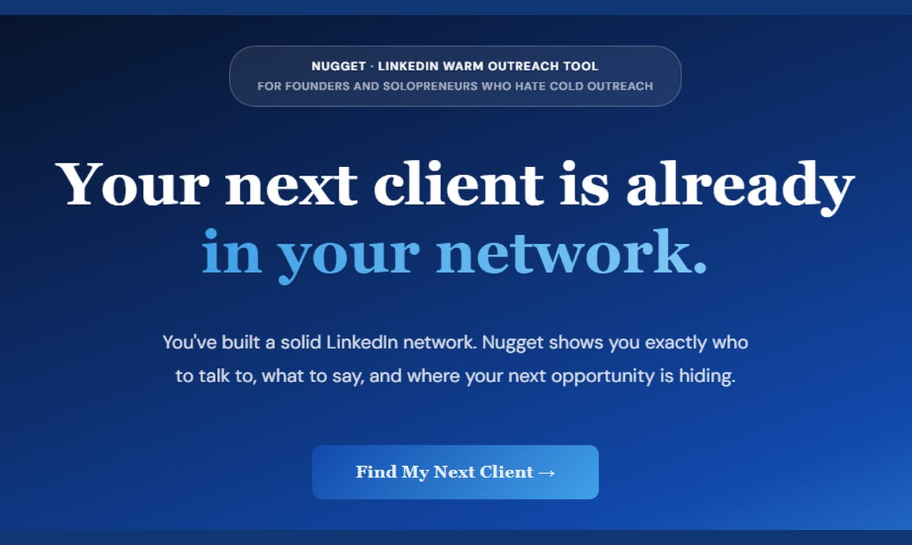
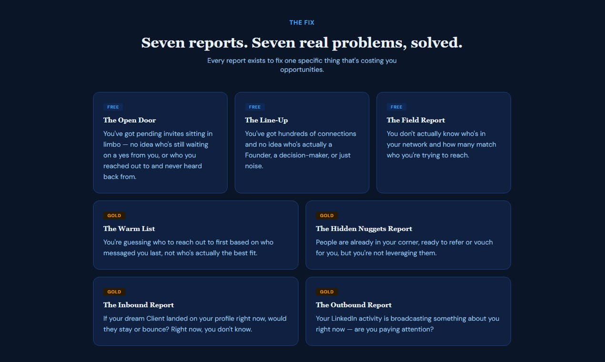

---

## 27. [Shhots AI - Real Estate Studio](https://www.producthunt.com/products/shhots-ai)
**Votes**: 8 | **도입 난이도**: 하 | **신뢰도**: 상
**Tagline**: Stage rooms & turn listing photos into videos. No prompts.
**서비스 링크**: https://www.producthunt.com/r/2MTD2K7VFAHQIE

**태그**: RealEstate, AI-Video, VirtualStaging, Automation, Agent, AI Tool, Prompting, Video, Vision

### 📌 이 서비스 한눈에 보기
프롬프트 입력 없이 사진 한 장으로 가상 스테이징과 홍보 영상을 만드는 부동산 특화 AI 스튜디오

### 🔑 주요 기능
- 사진 업로드만으로 가능한 가상 인테리어 스테이징
- 매물 사진을 내레이션이 포함된 투어 영상으로 변환
- 복잡한 프롬프트 작성 없이 스타일 선택만으로 결과물 생성

### 🙋 사용자에게 어떤 점이 좋은가
부동산 중개인이 별도의 편집 도구나 업체 없이도 매물의 잠재력을 보여주는 고품질 시각 자료를 즉시 제작할 수 있습니다.

### ✅ 지금 바로 써볼 기능
- 빈 방 사진을 업로드하여 가상 스테이징 스타일 적용해보기
- 기존 매물 사진을 활용해 내레이션 투어 영상 생성해보기
- 다양한 인테리어 스타일이 실제 사진과 얼마나 조화로운지 테스트하기

### ⚠️ 사용 전 확인할 점
- 프롬프트 없이 작동하므로 세밀한 디테일 수정에 한계가 있을 수 있음
- 생성된 영상이나 이미지의 실제 매물과 차이가 클 경우 발생할 수 있는 고객 클레임 주의

### 🧭 확인이 더 필요한 정보
사용자의 사진 품질에 따른 결과물의 완성도와 구체적인 요금 체계에 대한 정보가 필요합니다.

### 📸 스크린샷 및 갤러리

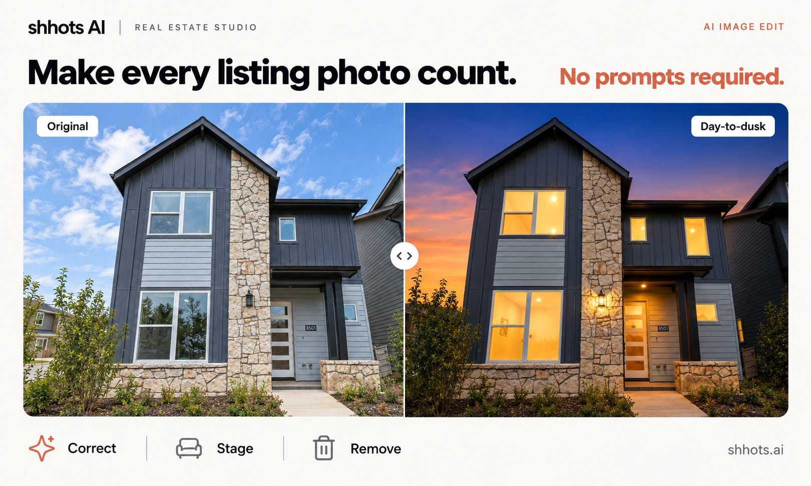
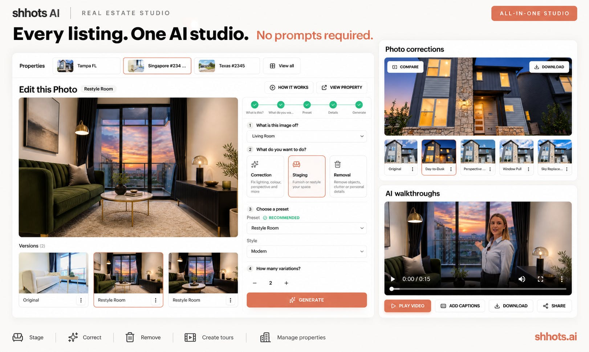

### 🎬 관련 영상
- [🎥 영상 보기](https://ph-files.imgix.net/2bd9242a-5f63-4c64-b9c4-b775cc706cce.jpeg?auto=format)

---

## 28. [Cha-Ching Hub](https://www.producthunt.com/products/cha-ching-hub)
**Votes**: 7 | **도입 난이도**: 하 | **신뢰도**: 상
**Tagline**: Your revenue, one green dot a day.
**서비스 링크**: https://www.producthunt.com/r/MG7CQPRNBYJECP

**태그**: SaaS, Analytics, BuildInPublic, Stripe

### 📌 이 서비스 한눈에 보기
Stripe 매출을 GitHub 스타일의 잔디로 시각화하여 성장을 공유하는 빌드 인 퍼블릭 도구

### 🔑 주요 기능
- Stripe 매출 데이터를 GitHub 스타일의 기여 차트로 시각화
- 공개 프로필 생성 및 웹사이트용 배지/PNG 내보내기 지원
- 읽기 전용 키를 통한 안전한 데이터 연동 및 프로젝트 관리

### 🙋 사용자에게 어떤 점이 좋은가
매출 성장 과정을 시각적으로 보여줌으로써 신뢰를 쌓고, 빌드 인 퍼블릭(Build in Public)을 실천하는 창업가에게 유용합니다.

### ✅ 지금 바로 써볼 기능
- Stripe 읽기 전용 키를 연결하여 데이터 가져오기
- 생성된 매출 차트를 PNG로 내보내기
- 웹사이트에 매출 배지 임베드하기

### ⚠️ 사용 전 확인할 점
- Stripe 읽기 전용 키를 통한 데이터 연동 방식의 보안 정책 확인 필요
- 무료 플랜은 프로젝트 1개로 제한됨

### 🧭 확인이 더 필요한 정보
PRO 플랜의 구체적인 가격 정책과 제공되는 심층 인사이트의 범위는 명시되어 있지 않습니다.

### 📸 스크린샷 및 갤러리
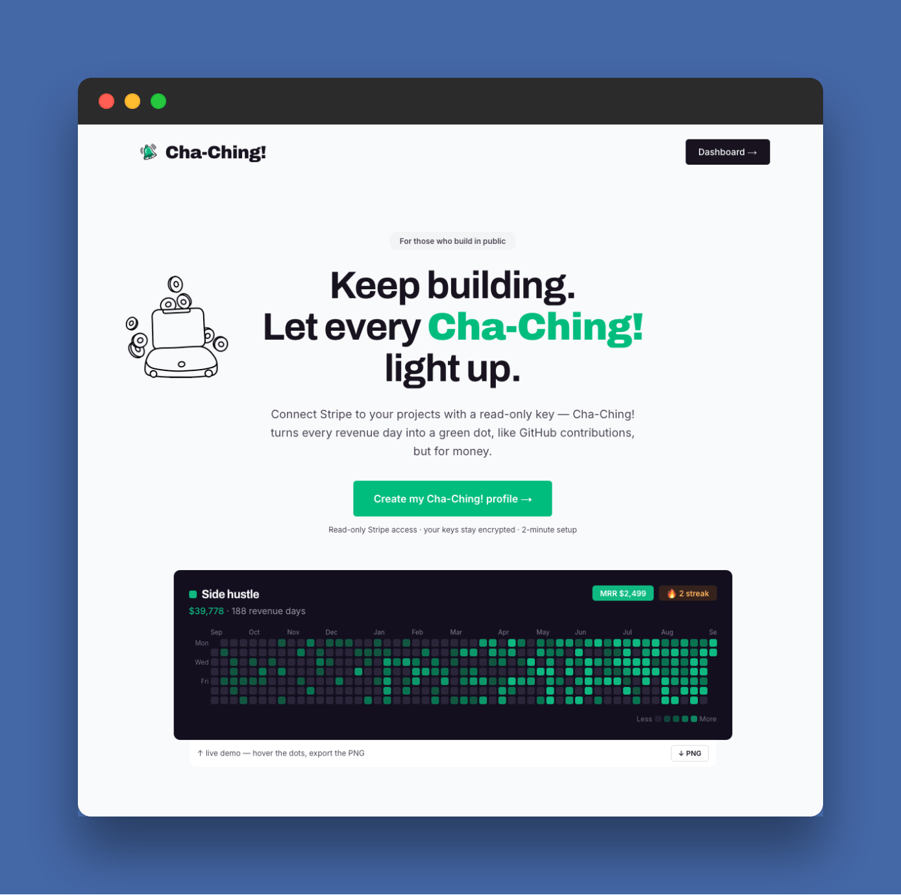
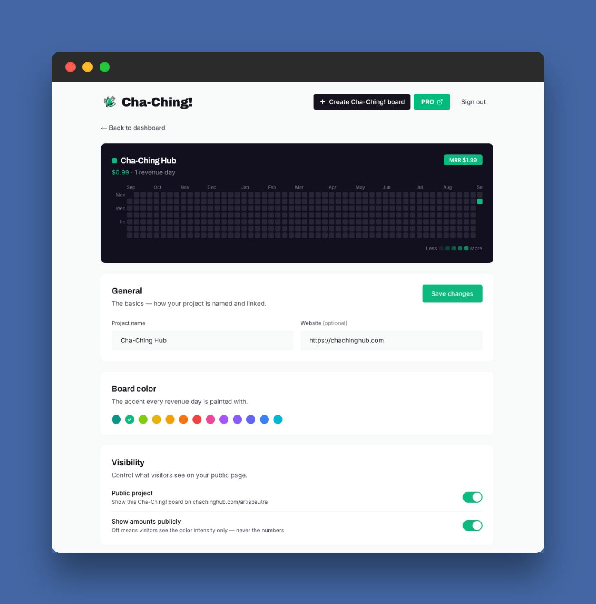
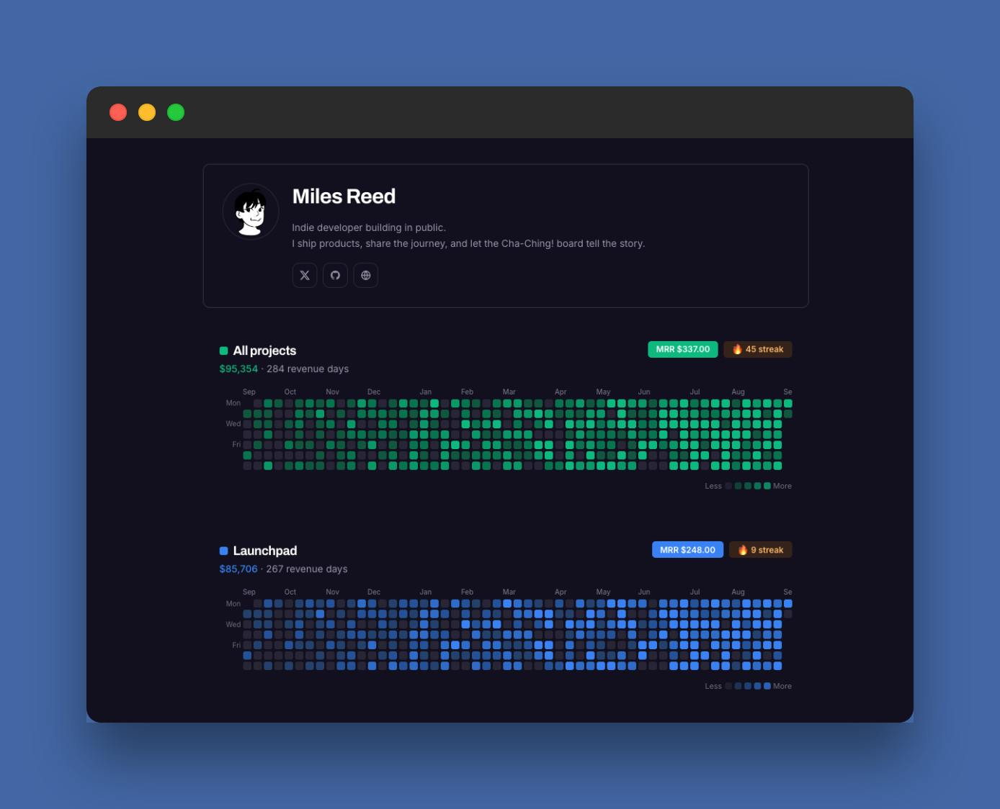

---

## 29. [Council](https://www.producthunt.com/products/council-ai-advisors)
**Votes**: 6 | **도입 난이도**: 하 | **신뢰도**: 상
**Tagline**: Compare AI opinions. See where they agree and disagree.
**서비스 링크**: https://www.producthunt.com/r/QODGOGR7I6IIOM

**태그**: AI, DecisionSupport, Productivity, AI Tool

### 📌 이 서비스 한눈에 보기
여러 AI 모델의 답변을 비교하여 합의점과 차이점을 한눈에 파악하는 의사결정 지원 도구

### 🔑 주요 기능
- 단일 질문에 대해 여러 AI 모델로부터 독립적인 답변 수집
- 모델 간의 일치점, 불일치점 및 합의 점수(Consensus Score) 제공
- 각 모델의 추론 근거와 최종 권장 사항 확인 가능

### 🙋 사용자에게 어떤 점이 좋은가
질문 하나로 여러 AI의 관점을 동시에 비교할 수 있어, 특정 모델의 편향성을 피하고 더 객관적인 결론을 내리는 데 유용합니다.

### ✅ 지금 바로 써볼 기능
- 질문 입력 후 모델별 답변 비교하기
- 합의 점수와 개별 모델의 추론 근거 분석하기
- 심층적인 답변을 위한 후속 질문 이어가기

### ⚠️ 사용 전 확인할 점
- 사용자가 직접 선택한 모델들의 특성에 따라 결과가 달라질 수 있음
- 제공되는 권장 사항은 AI의 분석 결과이므로 최종 결정은 사용자가 해야 함

### 🧭 확인이 더 필요한 정보
지원되는 구체적인 AI 모델의 종류와 모델 간 연동 방식에 대한 상세 정보가 필요합니다.

### 📸 스크린샷 및 갤러리
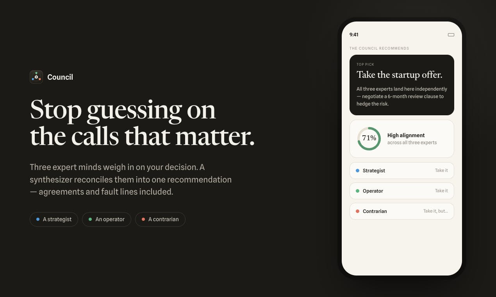
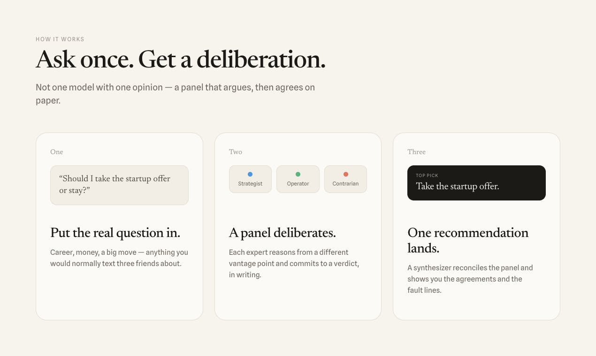
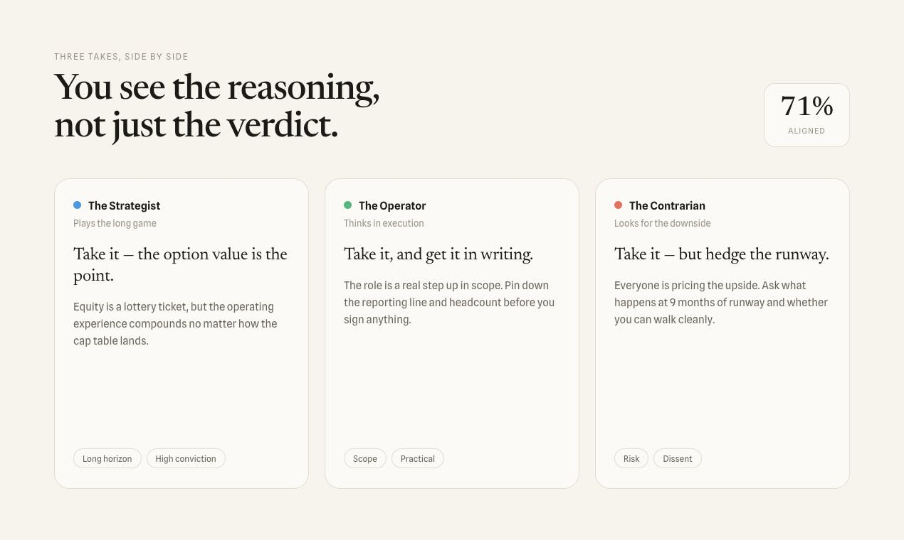

---

## 30. [Hyvor Blogs](https://www.producthunt.com/products/hyvor-blogs)
**Votes**: 6 | **도입 난이도**: 하 | **신뢰도**: 상
**Tagline**: Open-source Blogging Platform
**서비스 링크**: https://www.producthunt.com/r/JB4XWFCZQ3JCMX

**태그**: OpenSource, Blogging, NoCode, Collaboration, AI, AI Tool, Design

### 📌 이 서비스 한눈에 보기
플러그인 관리 없이 모든 기능이 내장된 심플하고 강력한 오픈소스 블로그 플랫폼

### 🔑 주요 기능
- 댓글, 뉴스레터, SEO, 링크 분석 등 핵심 기능이 기본 내장된 올인원 플랫폼
- 커스텀 도메인, 서브 디렉토리, 헤드리스(Headless) 방식 등 유연한 배포 옵션 제공
- AGPL-3.0 라이선스 기반으로 플러그인 유지보수 및 벤더 종속성 문제 해결

### 🙋 사용자에게 어떤 점이 좋은가
복잡한 플러그인 설정 없이 즉시 전문적인 블로그를 운영할 수 있으며, 데이터 소유권을 유지하면서도 협업과 AI 기능을 편리하게 활용할 수 있습니다.

### ✅ 지금 바로 써볼 기능
- 커스텀 도메인 연결 및 배포 방식 결정하기
- 실시간 협업 기능을 통한 팀원 초대하기
- 내장된 AI 기능 및 뉴스레터 기능 설정하기

### ⚠️ 사용 전 확인할 점
- 오픈소스 특성상 직접 호스팅 시 서버 관리 역량 필요
- 특정 워드프레스 등 기존 CMS의 방대한 플러그인 생태계와는 차이가 있을 수 있음

### 🧭 확인이 더 필요한 정보
사용자의 기술적 숙련도에 따라 직접 호스팅과 클라우드 서비스 이용 간의 운영 난이도가 달라질 수 있습니다.

### 📸 스크린샷 및 갤러리
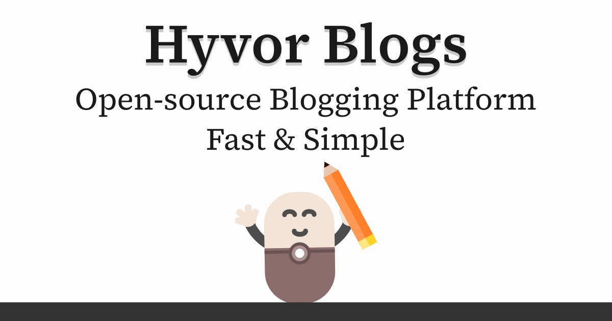
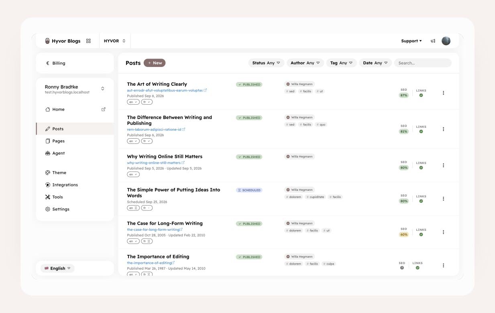
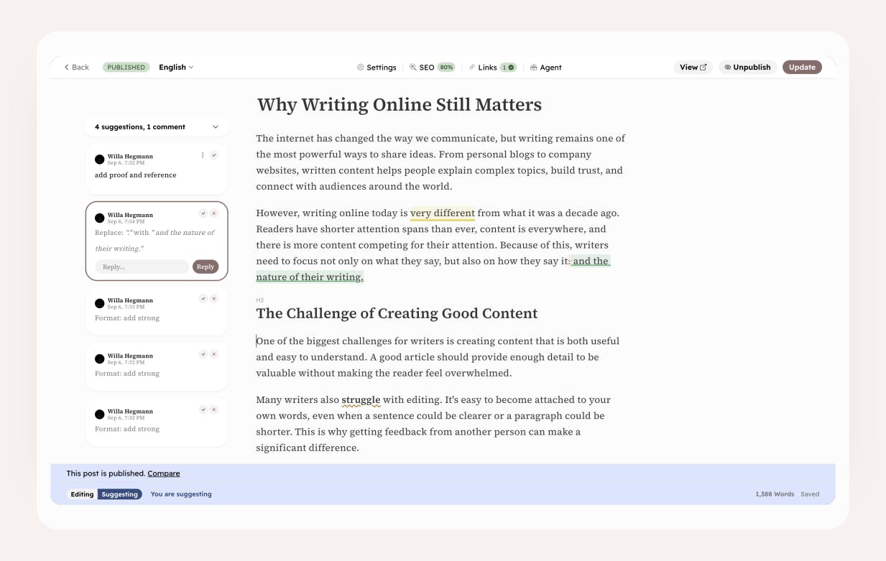

---

