# 🚀 Product Hunt Daily Top 30 (2026-09-11)

## 오늘의 요약
오늘의 트렌드는 AI 에이전트의 운영 효율을 높이는 관측성 도구와 온디바이스 환경에 최적화된 소형 모델 등 실질적인 AI 활용 기술이 주를 이루었습니다. 또한, 하드웨어 혁신을 통한 디스플레이 확장과 실시간 통역 기능을 갖춘 차세대 모바일 기기 등 사용자 경험을 극대화하는 제품들이 주목받았습니다.

### 오늘의 핵심 포인트
- AI 에이전트의 비용과 성능 병목을 추적하는 관측성 솔루션과 온디바이스 실행이 가능한 저비용·고효율 AI SDK가 주목받았습니다.
- 폴더블 디자인과 대형 디스플레이를 결합한 혁신적인 하드웨어 및 실시간 통역 기능을 탑재한 차세대 웨어러블 기기가 공개되었습니다.
- 사용자 맞춤형 실시간 번역 자막 서비스와 AI 기반의 음악 편집 도구 등 창작과 소통의 장벽을 낮추는 솔루션들이 등장했습니다.

**오늘의 태그**: AI 에이전트, 온디바이스 AI, 차세대 하드웨어, 실시간 통역, 생성형 AI

## 1. [Typewise Nova](https://www.producthunt.com/products/typewise)
**Votes**: 255 | **도입 난이도**: 하 | **신뢰도**: 상
**Tagline**: AI customer experience that builds and improves itself
**서비스 링크**: https://www.producthunt.com/r/TCXETJND5MA53Q

**태그**: AI, CustomerService, Automation, NoCode, Agent, AI Tool, Chat, DevTool, Email

### 📌 이 서비스 한눈에 보기
개발자 없이 자연어로 설계하고 스스로 개선되는 AI 고객 서비스 운영 솔루션

### 🔑 주요 기능
- 자연어 설명을 통한 AI 에이전트 구축 및 도구 연동
- 과거 티켓 데이터를 활용한 사전 테스트 및 품질 모니터링
- 이메일, 채팅, WhatsApp을 통한 주문/환불 등 전체 요청 처리

### 🙋 사용자에게 어떤 점이 좋은가
개발 인력 없이도 복잡한 고객 응대 프로세스를 자동화할 수 있으며, 해결되지 않은 요청에 대해서는 비용이 발생하지 않아 효율적입니다.

### ✅ 지금 바로 써볼 기능
- 자연어로 고객 응대 시나리오 작성해보기
- 과거 고객 문의 데이터를 활용한 에이전트 테스트 실행
- 기존 고객 지원 채널(이메일, 채팅 등) 연동

### ⚠️ 사용 전 확인할 점
- 에이전트가 제안하는 수정 사항에 대한 최종 승인 프로세스 필요
- 복잡한 비즈니스 로직 구현 시 자연어 설명의 한계 가능성

### 🧭 확인이 더 필요한 정보
현재 제공되는 구체적인 요금 체계와 외부 툴과의 상세 연동 범위에 대한 정보가 부족합니다.

### 📸 스크린샷 및 갤러리
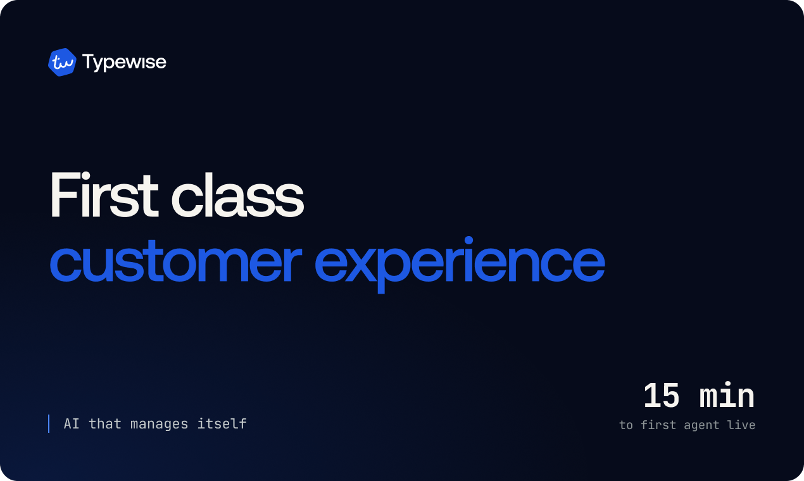
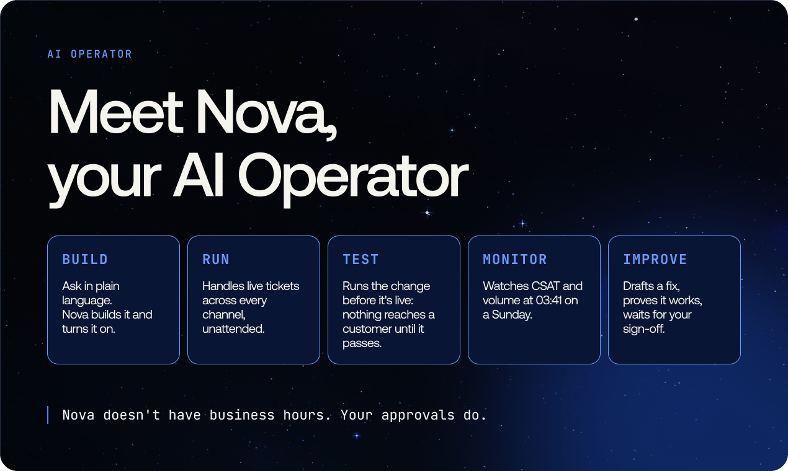
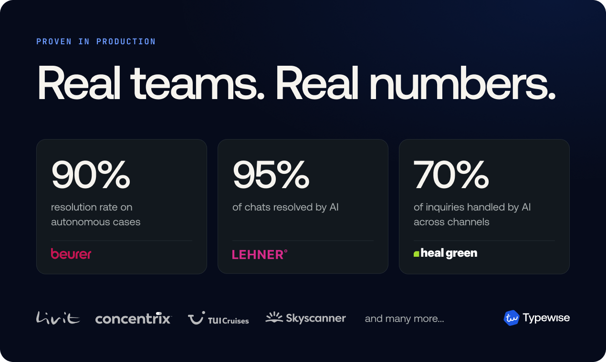

### 🎬 관련 영상
- [🎥 영상 보기](https://ph-files.imgix.net/d296fc69-6b19-4140-a19f-6784a462a6f4.jpeg?auto=format)

---

## 2. [AI Observability by OpenObserve](https://www.producthunt.com/products/openobserve)
**Votes**: 253 | **도입 난이도**: 중 | **신뢰도**: 상
**Tagline**: OpenTelemetry-native observability for agents and LLMs
**서비스 링크**: https://www.producthunt.com/r/7CZ37SQNNJQEV2

**태그**: AI, Observability, DevOps, LLM, OpenTelemetry, Agent, AI Tool

### 📌 이 서비스 한눈에 보기
AI 에이전트의 비용과 성능 병목 구간을 추적하는 OpenTelemetry 기반 관측성 솔루션

### 🔑 주요 기능
- 모델, 도구, 서비스, 데이터베이스를 아우르는 엔드투엔드 에이전트 세션 트레이싱
- 비용 발생 원인 및 지연 시간(Latency)의 정확한 원인 분석
- LLM 호출부터 백엔드까지 이어지는 로그, 트레이스, 메트릭의 통합 가시성 제공

### 🙋 사용자에게 어떤 점이 좋은가
AI 에이전트 운영 시 발생하는 과도한 비용과 느린 응답 속도의 원인을 즉각적으로 파악하여 최적화할 수 있습니다.

### ✅ 지금 바로 써볼 기능
- 에이전트 세션별 비용 및 시간 소요 분석
- LLM 호출과 백엔드 서비스 간의 연쇄 실패 추적
- 에이전트 루프 및 품질 저하 구간 탐지

### ⚠️ 사용 전 확인할 점
- 기존 프로덕션 스택과의 통합 설정 필요성
- OpenTelemetry 표준 준수 여부에 따른 데이터 정합성 확인 필요

### 🧭 확인이 더 필요한 정보
사용자의 기존 인프라 환경에 따른 통합 난이도와 데이터 처리 비용 구조를 확인해야 합니다.

### 📸 스크린샷 및 갤러리
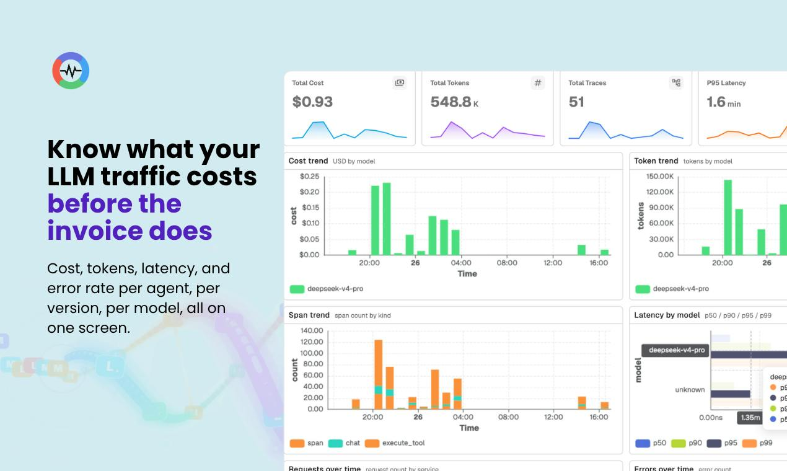
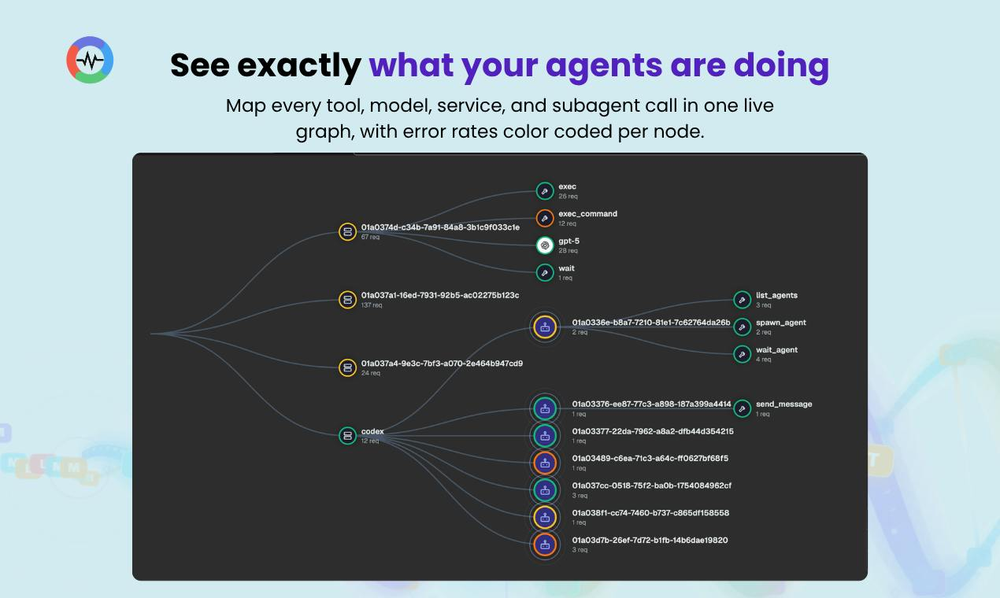
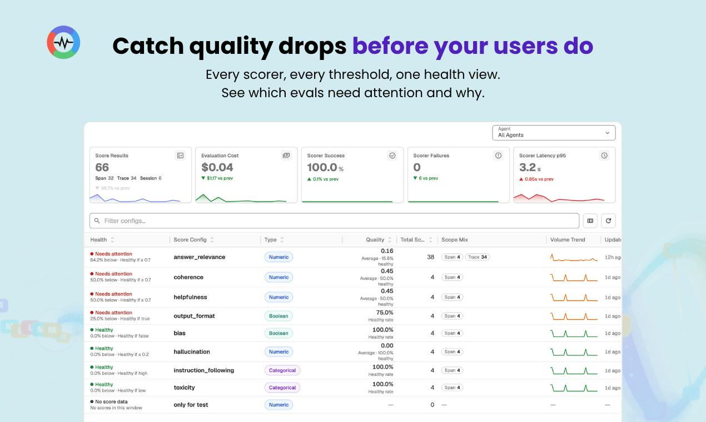

---

## 3. [iPhone Duo](https://www.producthunt.com/products/apple)
**Votes**: 212 | **도입 난이도**: 중 | **신뢰도**: 상
**Tagline**: The largest iPhone display ever. In a thin, foldable design.
**서비스 링크**: https://www.producthunt.com/r/4FXOXIOVL2II4Y

**태그**: Mobile, Hardware, Foldable, iOS, Design

### 📌 이 서비스 한눈에 보기
역대 최대 디스플레이와 폴더블 디자인을 결합한 혁신적인 iPhone

### 🔑 주요 기능
- iPhone 18 Pro Max 대비 50% 더 큰 역대 최대 디스플레이
- iPhone 18 Pro 화면 면적의 90%에 달하는 대형 외부 디스플레이
- 다양한 포즈와 방향을 지원하는 재설계된 iOS 경험

### 🙋 사용자에게 어떤 점이 좋은가
압도적인 화면 크기를 통해 멀티태스킹과 콘텐츠 몰입감을 극대화하면서도, 접었을 때의 휴대성을 동시에 누릴 수 있습니다.

### ✅ 지금 바로 써볼 기능
- 대화면을 활용한 멀티태스킹 경험하기
- 외부 디스플레이를 통한 빠른 알림 확인
- 새로운 iOS 오리엔테이션 기능 활용하기

### ⚠️ 사용 전 확인할 점
- 폴더블 구조에 따른 내구성 및 화면 주름 확인 필요
- 대형 디스플레이로 인한 배터리 소모량 및 크기 체감

### 🧭 확인이 더 필요한 정보
실제 제품의 물리적 두께, 무게 및 배터리 지속 시간 등 구체적인 하드웨어 사양 확인이 필요합니다.

### 📸 스크린샷 및 갤러리
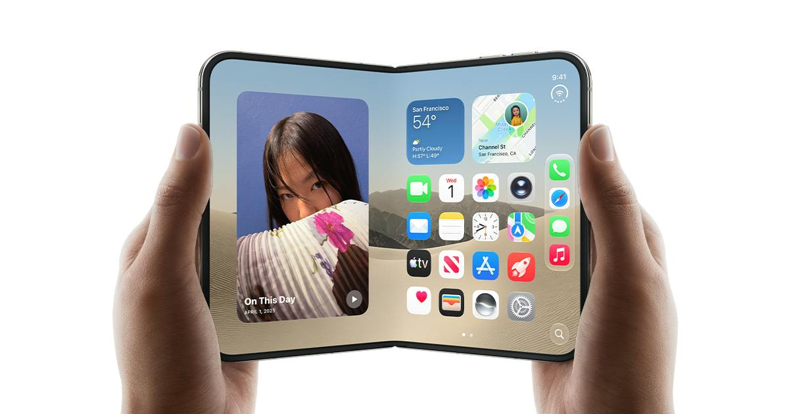

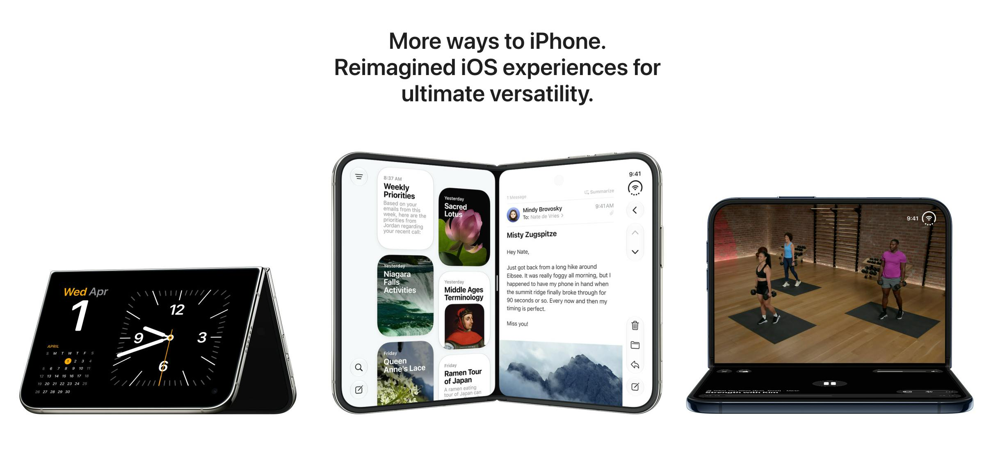

### 🎬 관련 영상
- [🎥 영상 보기](https://ph-files.imgix.net/a14b98e5-ed04-47a0-a788-58642615106d.jpeg?auto=format)

---

## 4. [AirPods 5](https://www.producthunt.com/products/apple)
**Votes**: 165 | **도입 난이도**: 하 | **신뢰도**: 상
**Tagline**: 1.5x Active Noise Cancellation, AI Siri, Live Translation
**서비스 링크**: https://www.producthunt.com/r/4BBXR5I3UBIEQS

**태그**: Hardware, Audio, AI, Translation, AI Tool, Design

### 📌 이 서비스 한눈에 보기
강력해진 노이즈 캔슬링과 실시간 통역 기능을 갖춘 차세대 오픈형 이어폰

### 🔑 주요 기능
- 기존 대비 1.5배 강화된 액티브 노이즈 캔슬링(ANC)
- 대화가 가능한 지능형 Siri 및 실시간 통역 기능 탑적
- 운동과 일상에 최적화된 오픈형 디자인

### 🙋 사용자에게 어떤 점이 좋은가
오픈형 디자인의 편안함을 유지하면서도 소음 차단 성능을 높였으며, 외국어 대화 시 실시간 통역을 통해 언어 장벽을 낮춰줍니다.

### ✅ 지금 바로 써볼 기능
- 강화된 노이즈 캔슬링 모드 활성화
- Siri를 통한 대화형 음성 명령 테스트
- 실시간 통역 기능을 활용한 외국어 대화 시도

### ⚠️ 사용 전 확인할 점
- 오픈형 디자인 특성상 완전 밀폐형 이어폰 대비 소음 차단 한계가 있을 수 있음
- 실시간 통역의 정확도는 네트워크 환경 및 언어에 따라 다를 수 있음

### 🧭 확인이 더 필요한 정보
2026년 9월 18일 출시 예정 제품으로, 실제 성능 수치는 출시 시점에 확인이 필요합니다.

### 📸 스크린샷 및 갤러리

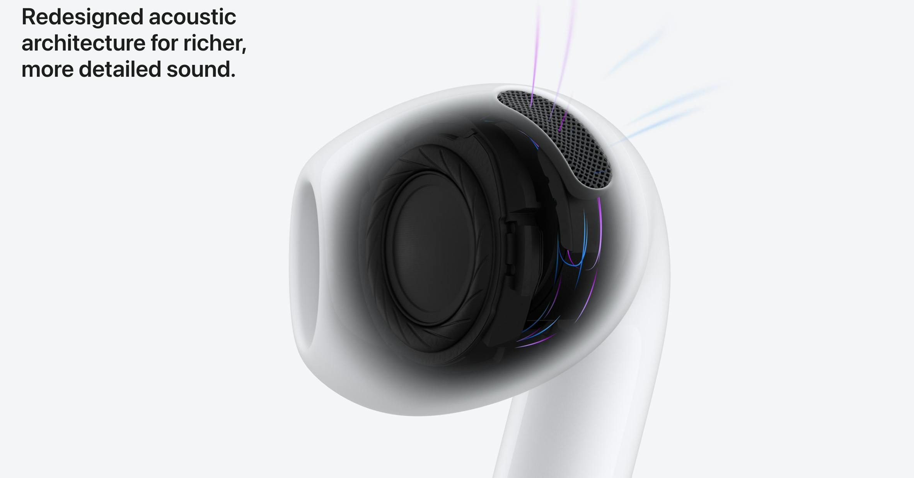

### 🎬 관련 영상
- [🎥 영상 보기](https://ph-files.imgix.net/18ceb62c-5ce9-4923-aa8c-a23b15410c10.jpeg?auto=format)

---

## 5. [Suno v6](https://www.producthunt.com/products/suno)
**Votes**: 140 | **도입 난이도**: 하 | **신뢰도**: 상
**Tagline**: The first Suno model built with the music industry
**서비스 링크**: https://www.producthunt.com/r/FRMDX75MHXSW2G

**태그**: AI-Music, Generative-AI, Creative-Tools, Video, Vision

### 📌 이 서비스 한눈에 보기
음악 산업 전문가들과 협업하여 탄생한 차세대 AI 음악 생성 모델 Suno v6

### 🔑 주요 기능
- 플래그십, 탐색형, 무료 모델로 구성된 세 가지 버전 제공
- 트랙 전체를 다시 만들 필요 없이 특정 섹션이나 가사만 편집 가능
- 텍스트, 오디오, 이미지, 비디오를 활용한 다채로운 생성 방식 지원

### 🙋 사용자에게 어떤 점이 좋은가
사용자는 기존 곡을 유지하면서 부분 수정이나 매시업이 가능해져 창작의 효율성이 극대화됩니다.

### ✅ 지금 바로 써볼 기능
- v6-mini로 가벼운 음악 생성 테스트하기
- 기존 곡에 새로운 가사나 섹션 편집 기능 적용하기
- 이미지나 비디오를 활용한 멀티모달 음악 생성 시도하기

### ⚠️ 사용 전 확인할 점
- 무료 모델(v6-mini)과 유료 모델 간의 기능 차이 확인 필요
- 생성된 결과물의 저작권 및 상업적 이용 권한 확인 필요

### 🧭 확인이 더 필요한 정보
각 모델 버전별 구체적인 기능 제한과 상업적 이용 정책에 대한 상세 정보가 필요합니다.

### 📸 스크린샷 및 갤러리

### 🎬 관련 영상
- [🎥 영상 보기](https://ph-files.imgix.net/4a881779-c06b-4403-9312-b8cc47d12756.jpeg?auto=format)

---

## 6. [Live Captions by Subanana](https://www.producthunt.com/products/subanana)
**Votes**: 139 | **도입 난이도**: 하 | **신뢰도**: 상
**Tagline**: Your whole audience follows, in their own language
**서비스 링크**: https://www.producthunt.com/r/GV56EO7K24WMAA

**태그**: Live Streaming, Translation, Accessibility, Presentation, DevTool

### 📌 이 서비스 한눈에 보기
청중이 각자의 스마트폰으로 실시간 번역 자막과 음성을 듣는 개인 맞춤형 라이브 통역 솔루션

### 🔑 주요 기능
- QR 코드를 통한 간편한 청중 접속 방식
- 개별 기기에서 원하는 언어로 읽거나 듣는 맞춤형 경험 제공
- OBS 및 vMix 연동을 통한 전문 방송 환경 지원

### 🙋 사용자에게 어떤 점이 좋은가
발표자가 여러 언어를 번역할 필요 없이, 청중이 자신의 언어로 실시간 소통할 수 있어 글로벌 강연이나 방송에 유용합니다.

### ✅ 지금 바로 써볼 기능
- QR 코드를 스캔하여 청중 입장에서 서비스 경험하기
- OBS/vMix를 활용해 방송용 클린 피드 설정해보기

### ⚠️ 사용 전 확인할 점
- 청중의 개별 스마트폰 데이터 및 네트워크 환경 의존성
- 실시간 번역의 정확도 및 지연 시간 확인 필요

### 🧭 확인이 더 필요한 정보
동시 접속 가능한 청중 수와 지원되는 언어의 종류에 대한 구체적인 정보가 필요합니다.

### 📸 스크린샷 및 갤러리
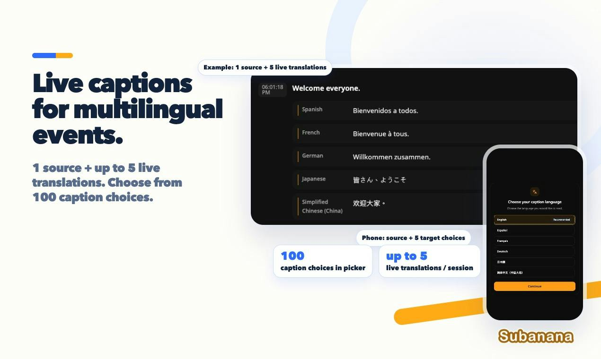
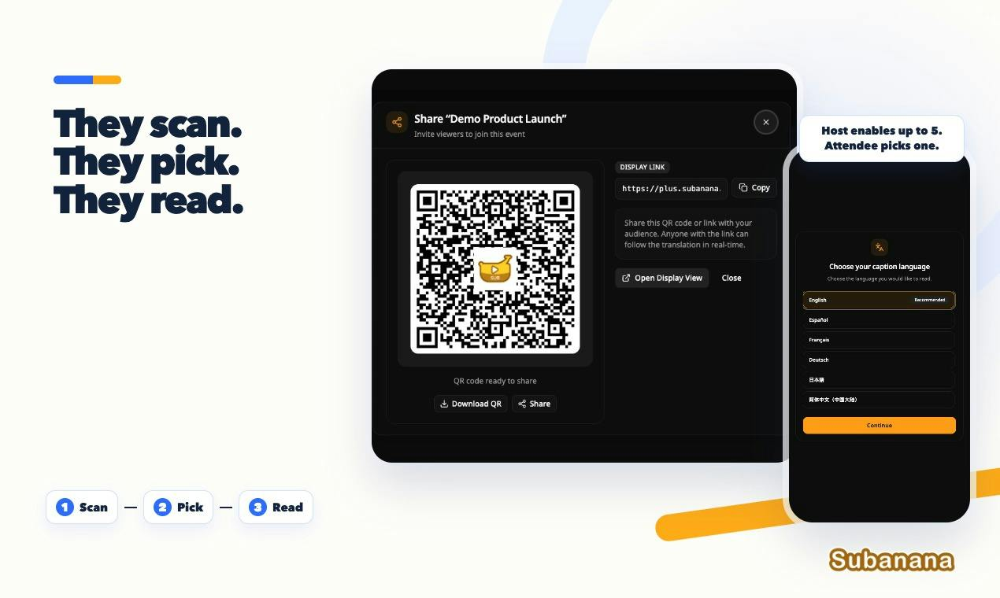
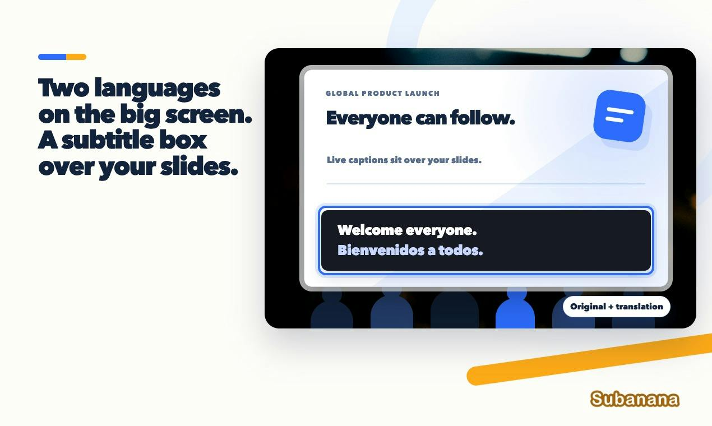

### 🎬 관련 영상
- [🎥 영상 보기](https://ph-files.imgix.net/9ce74f03-b146-4ce7-bde6-b9bcb9e4eab2.jpeg?auto=format)

---

## 7. [Desert Ant Labs](https://www.producthunt.com/products/desert-ant-labs)
**Votes**: 124 | **도입 난이도**: 하 | **신뢰도**: 상
**Tagline**: Small specialized AI models for speech, text, vision
**서비스 링크**: https://www.producthunt.com/r/NREAC5HUU2U27K

**태그**: AI, SDK, OnDevice, DevTool, AI Tool

### 📌 이 서비스 한눈에 보기
기기 자체에서 실행되는 저비용·고효율 특화 AI 모델 SDK

### 🔑 주요 기능
- 온디바이스(Phone/Browser) 실행으로 인터넷 연결 및 추가 비용 불필요
- 범용 모델 대신 특정 작업(음성, 텍스트, 비전)에 최적화된 소형 모델 제공
- 단 몇 줄의 코드로 모델을 추가할 수 있는 간편한 SDK 제공

### 🙋 사용자에게 어떤 점이 좋은가
클라우드 비용 걱정 없이 사용자 기기에서 즉각적으로 반응하는 AI 기능을 앱에 통합할 수 있습니다.

### ✅ 지금 바로 써볼 기능
- SDK를 통한 모델 통합 테스트
- 월간 활성 기기(MAU) 10만 대까지의 무료 혜าน 활용
- 특정 작업별 소형 모델 성능 검증

### ⚠️ 사용 전 확인할 점
- 기기 성능(하드웨어 사양)에 따른 모델 실행 속도 차이
- 특화 모델이 범용 거대 모델(LLM)의 모든 기능을 대체할 수 있는지 여부

### 🧭 확인이 더 필요한 정보
제공되는 개별 특화 모델들의 구체적인 성능 지표와 지원 언어 범위 확인이 필요합니다.

### 📸 스크린샷 및 갤러리
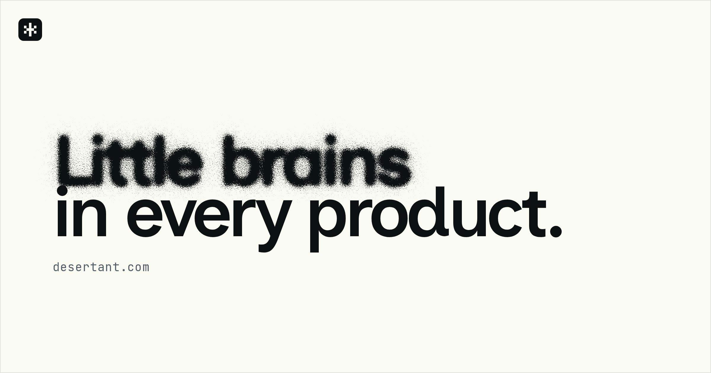
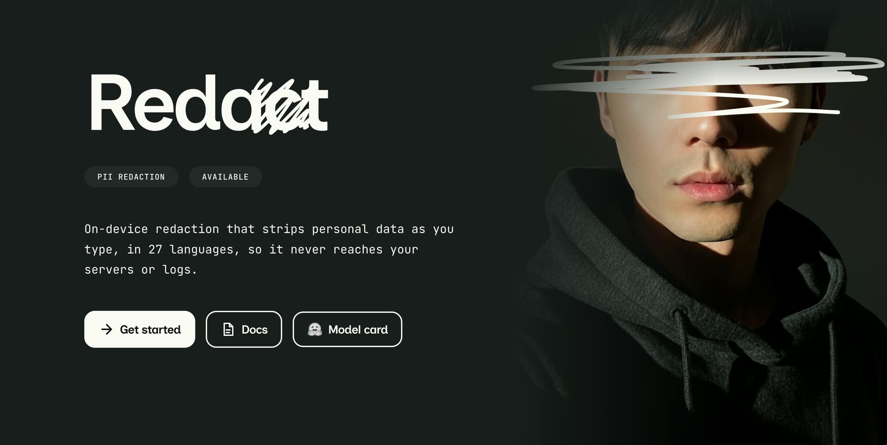
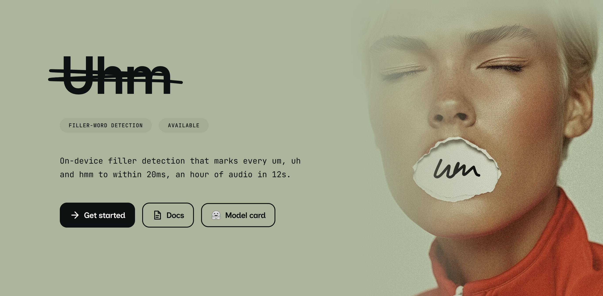

---

## 8. [FreeScan.app](https://www.producthunt.com/products/freescan-app)
**Votes**: 114 | **도입 난이도**: 하 | **신뢰도**: 상
**Tagline**: Fix what’s hurting your visibility, trust, and conversions
**서비스 링크**: https://www.producthunt.com/r/CGPIYFJQUGMDEP

**태그**: SEO, WebAudit, Productivity, DevTool, Agent, AI Tool, Design, Security

### 📌 이 서비스 한눈에 보기
로그인 없이 즉시 실행하는 웹사이트 통합 진단 및 최적화 도구

### 🔑 주요 기능
- 가입 없이 모든 공개 URL에 대한 무료 감사 기능 제공
- SEO, AEO, GEO, 보안, 접근성 등 다각도 문제점 및 해결책 제시
- Pro 버전의 자동화된 사이트 전체 감사 및 워크스페이스 관리 기능

### 🙋 사용자에게 어떤 점이 좋은가
웹사이트의 가시성과 신뢰도를 저해하는 요소를 즉각적으로 파악하고, 구체적인 수정 방법까지 얻을 수 있어 운영 효율을 높여줍니다.

### ✅ 지금 바로 써볼 기능
- 분석이 필요한 공개 URL 입력하여 무료 감사 실행하기
- 제시된 증거와 해결 방법을 바탕으로 사이트 개선하기
- Pro 버전의 자동화된 워크스페이스 및 에이전트 연동 기능 검토하기

### ⚠️ 사용 전 확인할 점
- 무료 버전은 단일 URL 감사에 국한되며 사이트 전체 관리는 Pro 기능임
- 비공개 페이지나 로그인 후 접근 가능한 페이지는 분석이 불가능함

### 🧭 확인이 더 필요한 정보
Pro 버전의 구체적인 가격 정책과 MCP를 통한 코딩 에이전트 연결의 상세 범위는 명시되지 않았습니다.

### 📸 스크린샷 및 갤러리
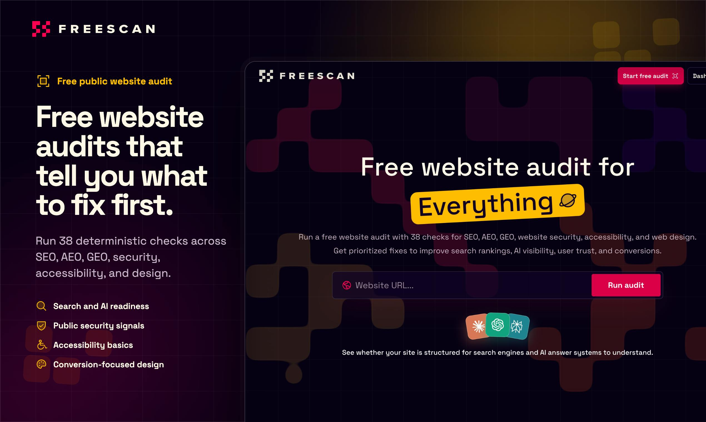
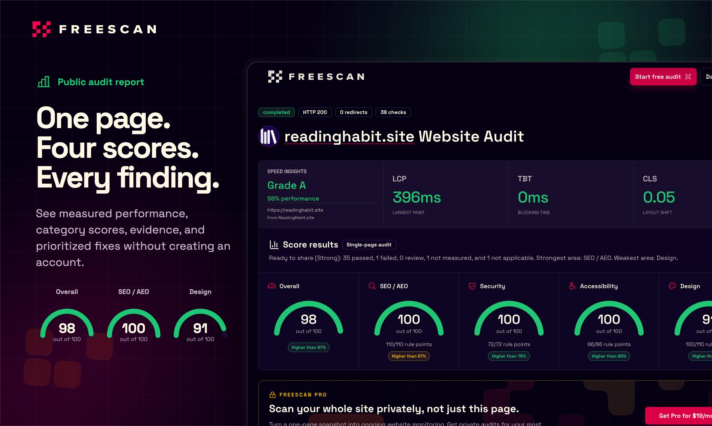
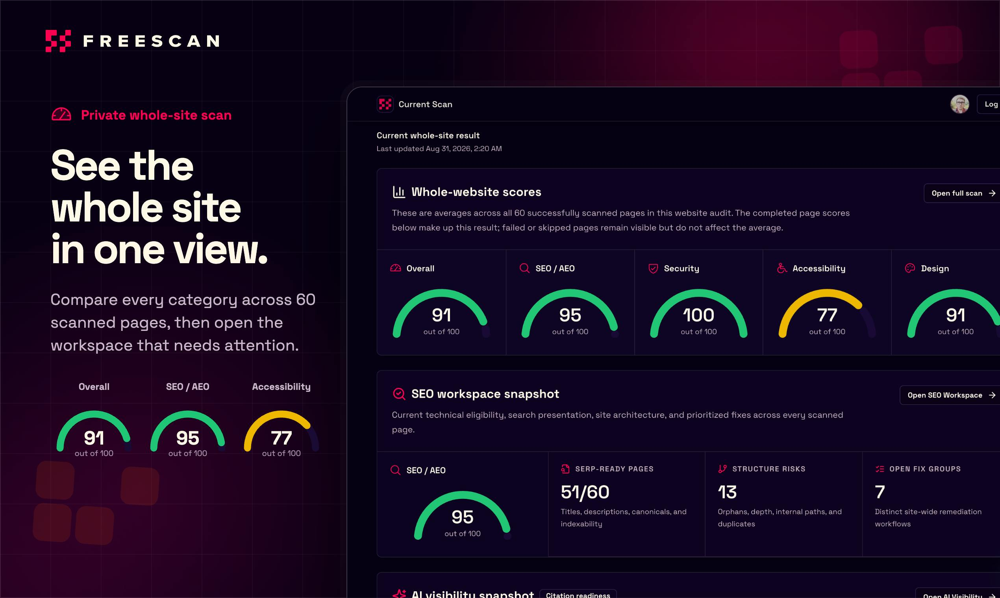

---

## 9. [Modeinspect](https://www.producthunt.com/products/modeinspect-1-0)
**Votes**: 113 | **도입 난이도**: 중 | **신뢰도**: 상
**Tagline**: 99 Days Free AI Credits - Design product UI in your codebase
**서비스 링크**: https://www.producthunt.com/r/L37GZZSJFJZV7E

**태그**: DesignTool, DevTool, AI, UI/UX, Frontend, AI Tool, Design

### 📌 이 서비스 한눈에 보기
코드베이스와 디자인을 하나로 연결하여 실시간으로 UI를 설계하는 AI 디자인 캔버스

### 🔑 주요 기능
- 디자인과 코드 사이의 의도 차이(Intent drift) 방지
- 기존 코드베이스의 컴포넌트, 토큰, 라이브 데이터를 활용한 디자인
- AI를 통한 디자인 탐색 및 실시간 반영/검토 워크플로우

### 🙋 사용자에게 어떤 점이 좋은가
디자인 도구와 코드 사이의 반복적인 작업 없이, 실제 제품 환경에서 즉시 적용 가능한 UI를 설계할 수 있습니다.

### ✅ 지금 바로 써볼 기능
- 기존 코드베이스 연결하기
- 실제 컴포넌트와 토큰을 활용한 UI 설계
- AI를 활용한 디자인 변형 탐색

### ⚠️ 사용 전 확인할 점
- 코드베이스와 디자인 도구 간의 동기화 방식 확인 필요
- 엔지니어링 팀과의 협업 워크플로우 적합성 검토

### 🧭 확인이 더 필요한 정보
지원하는 프로그래밍 언어 및 프레임워크의 범위와 코드 반영 방식에 대한 상세 정보가 필요합니다.

### 📸 스크린샷 및 갤러리

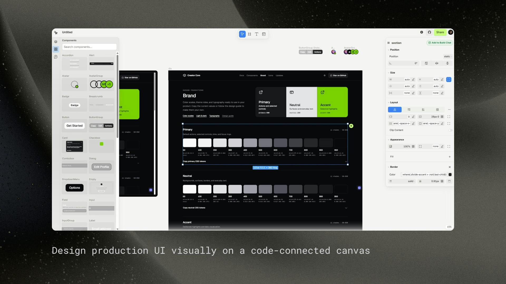
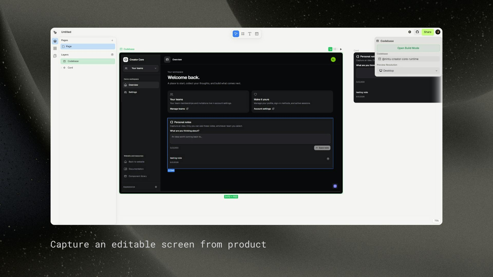

### 🎬 관련 영상
- [🎥 영상 보기](https://ph-files.imgix.net/f265ffe9-b7ae-4d45-af28-6592110afd7e.jpeg?auto=format)

---

## 10. [Thousand](https://www.producthunt.com/products/thousand)
**Votes**: 98 | **도입 난이도**: 중 | **신뢰도**: 상
**Tagline**: Git-backed docs for humans and agents
**서비스 링크**: https://www.producthunt.com/r/I3Z7UOBMZ6DNII

**태그**: DevTool, Documentation, AI-Ready, Git, Security, Agent, AI Tool

### 📌 이 서비스 한눈에 보기
Git 기반의 폴더별 권한 제어로 사람과 AI 에이전트 모두를 위한 문서를 관리하는 도구

### 🔑 주요 기능
- Git 기반의 문서 관리 시스템
- 폴더 단위의 세밀한 접근 제어 기능
- 팀원, 외부인, AI 에이전트별 맞춤형 문서 노출

### 🙋 사용자에게 어떤 점이 좋은가
하나의 마크다운 저장소 내에서 권한을 분리하여, 보안을 유지하면서도 사람과 AI가 필요한 정보에만 안전하게 접근할 수 있습니다.

### ✅ 지금 바로 써볼 기능
- 마크다운 기반 문서 구조 설계하기
- 사용자 및 에이전트별 폴더 권한 설정 테스트하기
- Git 워크플로우와 연동하여 문서 관리하기

### ⚠️ 사용 전 확인할 점
- Git 기반이므로 기본적인 Git 사용 숙련도가 필요할 수 있음
- 폴더별 권한 설정 방식이 기존 문서 도구와 다를 수 있음

### 🧭 확인이 더 필요한 정보
상세한 권한 관리 방식과 Git 워크플로우의 구체적인 구현 방식에 대한 추가 확인이 필요합니다.

### 📸 스크린샷 및 갤러리
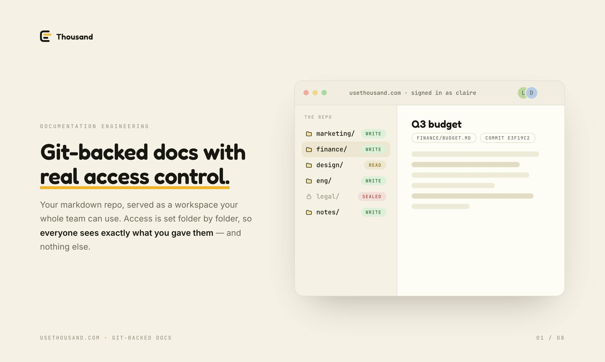
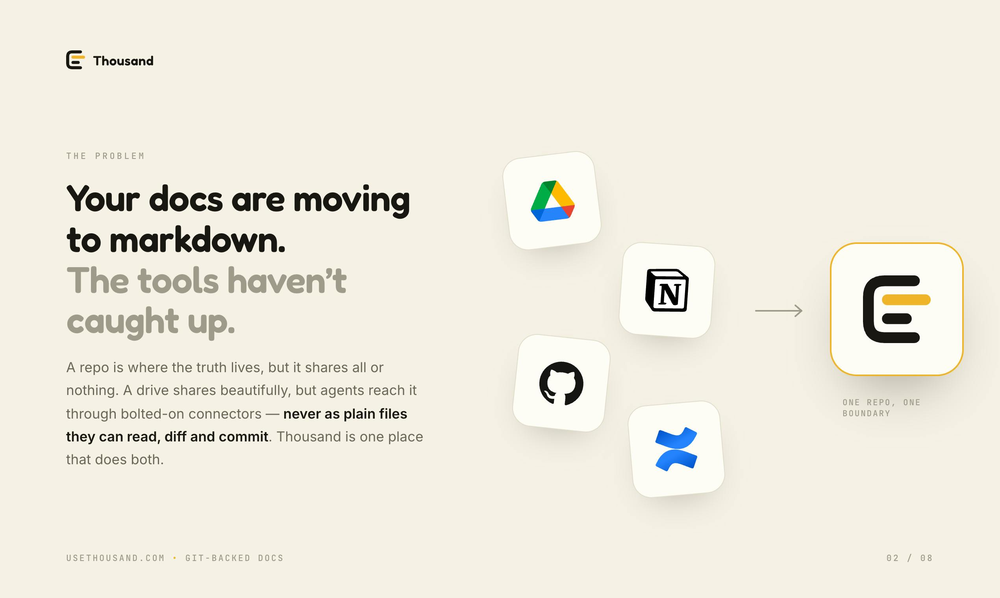
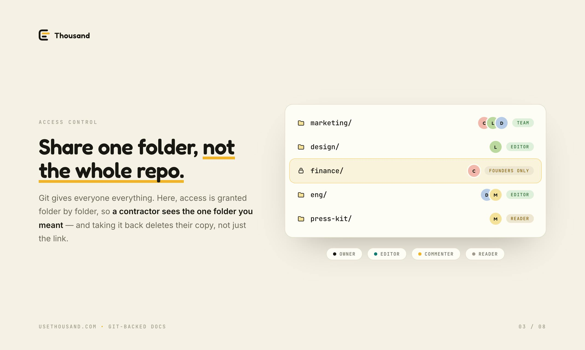

### 🎬 관련 영상
- [🎥 영상 보기](https://ph-files.imgix.net/3afc54d1-aa24-4494-b2cb-c176c73bf98a.jpeg?auto=format)

---

## 11. [Viso Now](https://www.producthunt.com/products/viso-now)
**Votes**: 92 | **도입 난이도**: 하 | **신뢰도**: 상
**Tagline**: Build computer vision applications with AI
**서비스 링크**: https://www.producthunt.com/r/3TSMZA7HJGSUDY

**태그**: AI, ComputerVision, NoCode, Automation, Dashboard, Agent, AI Tool, Video, Vision, DevTool

### 📌 이 서비스 한눈에 보기
코딩이나 모델 학습 없이 말만 하면 완성되는 AI 비전 애플리케이션 빌더

### 🔑 주요 기능
- 이미지, 비디오, 카메라 피드를 활용한 컴퓨터 비전 앱 구축
- 모델 학습이나 데이터 어노테이션이 필요 없는 자동화 프로세스
- 자연어 설명을 통한 에이전트형 비전 로직 및 커스텀 대시보드 생성

### 🙋 사용자에게 어떤 점이 좋은가
전문적인 개발 지식이나 데이터 라벨링 작업 없이도 누구나 즉시 실시간 비전 모니터링 시스템을 구축할 수 있습니다.

### ✅ 지금 바로 써볼 기능
- 카메라 피드 연결 및 실시간 분석 테스트
- 자연어 설명을 통한 비전 로직 생성 시도
- 커스텀 대시보드 레이아웃 구성

### ⚠️ 사용 전 확인할 점
- 모델 학습 과정이 생략되므로 매우 특수한 도메인 작업에는 정확도 검증 필요
- 복잡한 커스텀 로직 구현 시 플랫폼 내 제약 사항 확인 필요

### 🧭 확인이 더 필요한 정보
사용자 정의 로직의 세밀한 제어 범위와 특정 하드웨어 호환성을 확인해야 합니다.

### 📸 스크린샷 및 갤러리
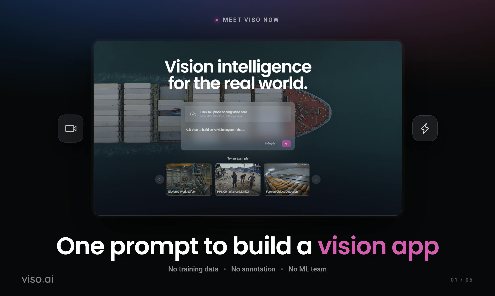
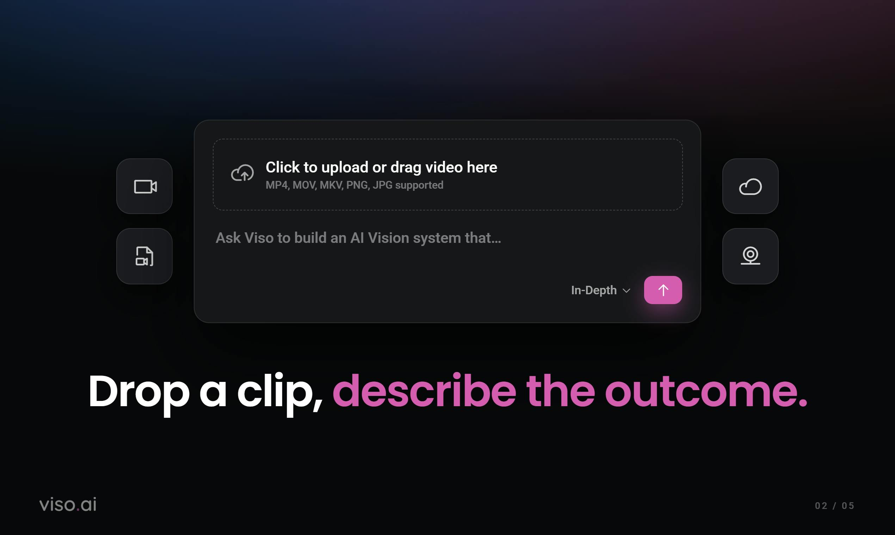
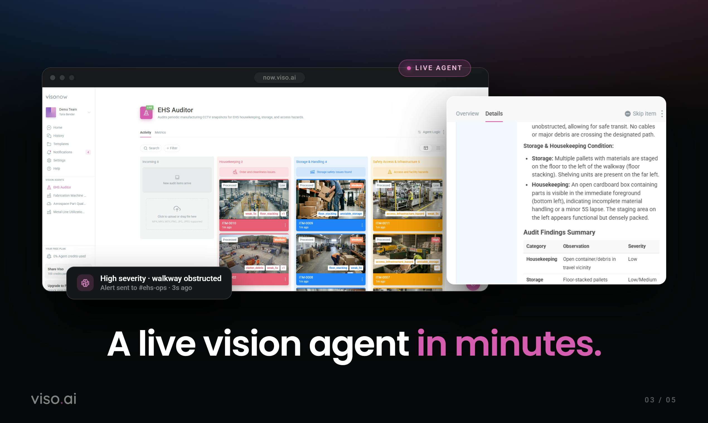

### 🎬 관련 영상
- [🎥 영상 보기](https://ph-files.imgix.net/2ebaa80e-7787-47e1-8247-c3c832e442e5.jpeg?auto=format)

---

## 12. [Speechmark](https://www.producthunt.com/products/speechmark)
**Votes**: 92 | **도입 난이도**: 하 | **신뢰도**: 상
**Tagline**: Private, on-device meeting notes for Mac
**서비스 링크**: https://www.producthunt.com/r/XQFREZZOIC75YM

**태그**: Productivity, Privacy, AI, macOS, Automation, DevTool

### 📌 이 서비스 한눈에 보기
개인정보 유출 걱정 없이 Mac에서 바로 실행되는 온디바이스 회의 기록 및 요약 도구

### 🔑 주요 기능
- 클라우드 전송 없는 완전한 온디바이스(On-device) 기록 및 요약
- 봇 참여 없이 로컬에서 작동하는 프라이버시 중심 설계
- 결정 사항, 실행 항목, 화자 구분 기능 포함

### 🙋 사용자에게 어떤 점이 좋은가
회의 내용이 외부 서버로 전송되지 않아 보안이 중요한 비즈니스 미팅에 적합하며, 별도의 계정 생성 없이 즉시 사용할 수 있습니다.

### ✅ 지금 바로 써볼 기능
- 로컬 녹음 및 실시간 전사 기능 테스트
- 회의 요약 및 액션 아이템 추출 기능 확인
- Claude Code와의 MCP 서버 연동 테스트

### ⚠️ 사용 전 확인할 점
- Mac 하드웨어 성능에 따라 처리 속도가 달라질 수 있음
- 온디바이스 방식이므로 기기 사양에 따른 제약 가능성

### 🧭 확인이 더 필요한 정보
하드웨어 사양에 따른 처리 성능 및 구체적인 일회성 가격 정책 확인이 필요합니다.

### 📸 스크린샷 및 갤러리
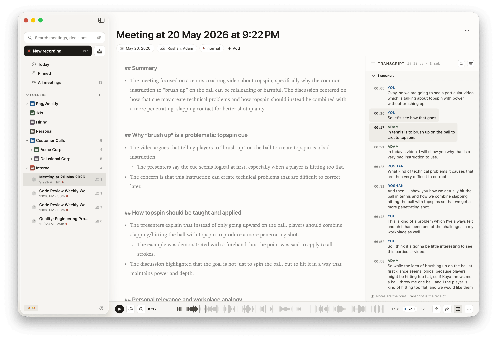
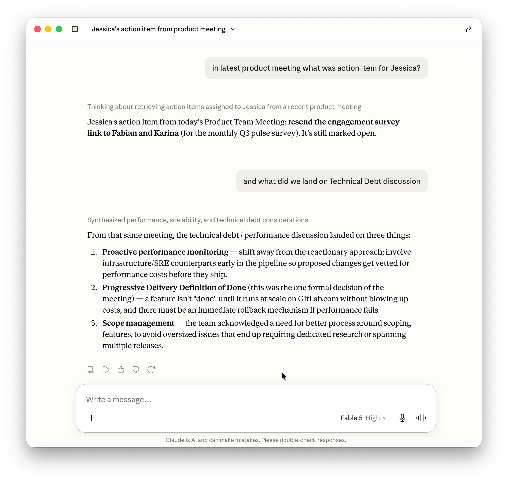
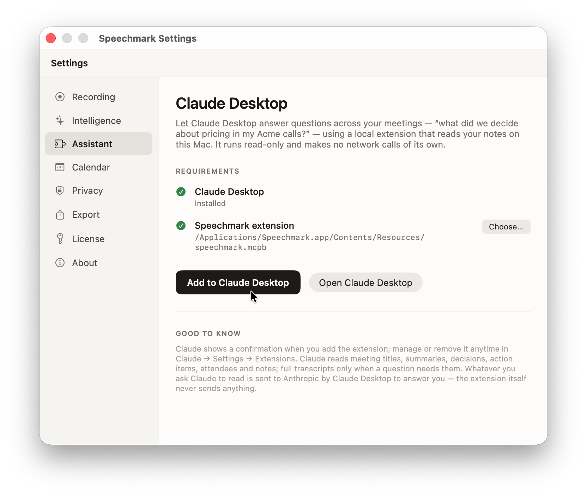

### 🎬 관련 영상
- [🎥 영상 보기](https://ph-files.imgix.net/d746335b-1398-49db-833e-3020c5e41163.jpeg?auto=format)

---

## 13. [Athenic AI](https://www.producthunt.com/products/athenic-ai)
**Votes**: 88 | **도입 난이도**: 하 | **신뢰도**: 상
**Tagline**: Beat the market with 90+ datasets and AI made for analysis
**서비스 링크**: https://www.producthunt.com/r/BRZ3QB3GHZINJU

**태그**: Investment, AI, Data Analysis, Automation, AI Tool

### 📌 이 서비스 한눈에 보기
90개 이상의 전문 데이터와 AI를 결합한 개인용 기관급 투자 분석 솔루션

### 🔑 주요 기능
- 5만 달러 상당의 라이선스 기반 기관급 주식 데이터 제공
- 자연어(Plain English)를 통한 고급 필터링 및 스크리닝
- 뉴스 알림 및 펀더멘털 심층 조사 자동화

### 🙋 사용자에게 어떤 점이 좋은가
개인 투자자가 접근하기 어려운 고품질 데이터를 바탕으로, 복잡한 분석 과정을 AI로 자동화하여 투자 기회를 선점할 수 있습니다.

### ✅ 지금 바로 써볼 기능
- 자연어로 원하는 조건의 종목 스크리닝하기
- 뉴스 및 가격 변동 알림 설정하기
- AI를 활용한 펀더멘털 심층 분석 자동화 실행하기

### ⚠️ 사용 전 확인할 점
- 제공되는 데이터의 업데이트 주기 및 실시간성 확인 필요
- AI 분석 결과에 대한 최종 의사결정 책임은 사용자에게 있음

### 🧭 확인이 더 필요한 정보
구체적인 데이터 업데이트 빈도와 유료 플랜의 상세 비용 체계에 대한 정보가 필요합니다.

### 📸 스크린샷 및 갤러리
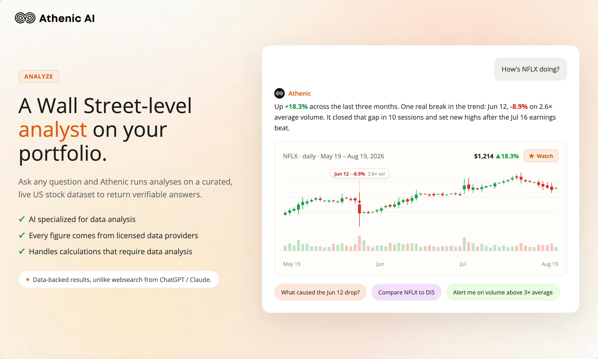
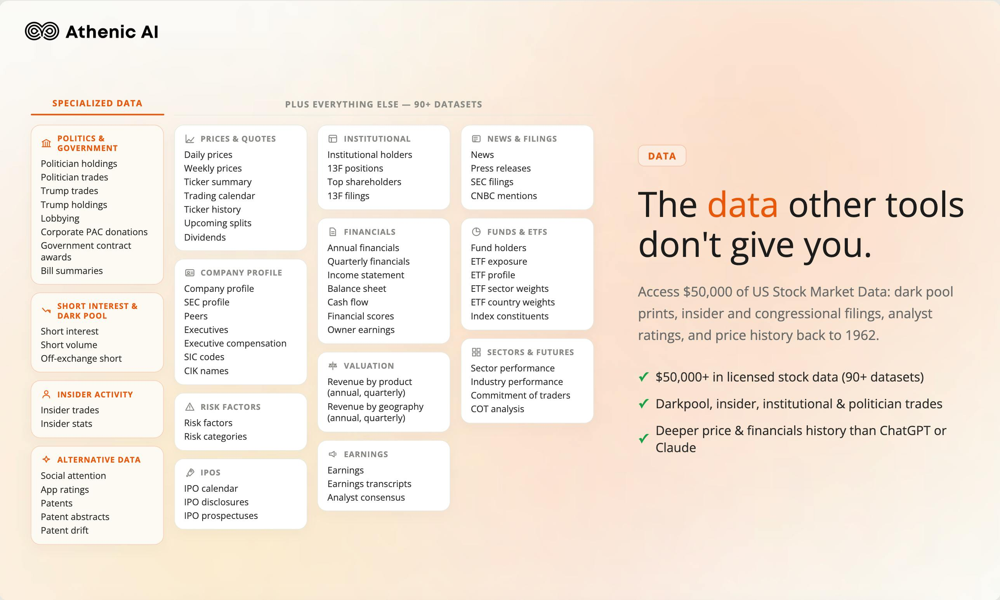
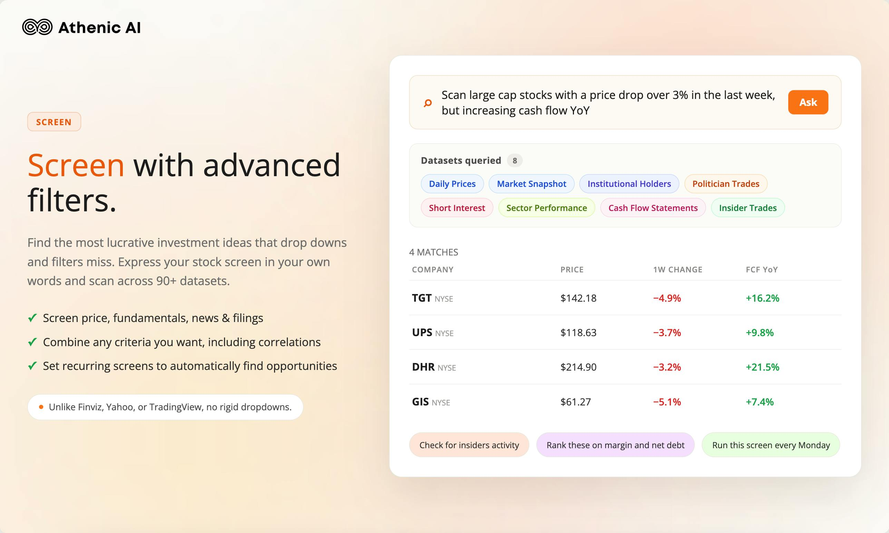

### 🎬 관련 영상
- [🎥 영상 보기](https://ph-files.imgix.net/5330d25b-3588-4ed2-b2d1-f9a6da494c5e.jpeg?auto=format)

---

## 14. [Whip](https://www.producthunt.com/products/whip)
**Votes**: 87 | **도입 난이도**: 하 | **신뢰도**: 상
**Tagline**: Youtube for interactive web experiences
**서비스 링크**: https://www.producthunt.com/r/TREXKMSVNCPYDT

**태그**: Interactive, Creativity, Social, Web-based

### 📌 이 서비스 한눈에 보기
브라우저에서 바로 즐기는 인터랙티브 콘텐츠 전용 피드 플랫폼

### 🔑 주요 기능
- 게임, 3D 월드, 생성형 아트 등 다양한 인터랙티브 경험 제공
- 창작자를 위한 채널 및 공유 가능한 페이지 기능 지원
- 단순한 타임라인을 넘어 팬덤을 구축할 수 있는 환경 제공

### 🙋 사용자에게 어떤 점이 좋은가
새로운 형태의 디지털 콘텐츠를 탐색하고, 창작자는 자신의 작업물을 지속 가능한 방식으로 공유하며 팬층을 확보할 수 있습니다.

### ✅ 지금 바로 써볼 기능
- 다양한 카테고리의 인터랙티브 콘텐츠 탐색하기
- 창작자 채널 팔로우 및 콘텐츠 피드백 남기기
- 자신의 창작물을 채널에 게시하고 공유하기

### ⚠️ 사용 전 확인할 점
- 브라우저 기반이므로 기기 성능에 따라 콘텐츠 실행 속도가 다를 수 있음
- 콘텐츠 유형에 따라 데이터 소모량이 클 수 있음

### 🧭 확인이 더 필요한 정보
창작자 수익 모델이나 구체적인 콘텐츠 저작권 정책은 명시되지 않았습니다.

### 📸 스크린샷 및 갤러리
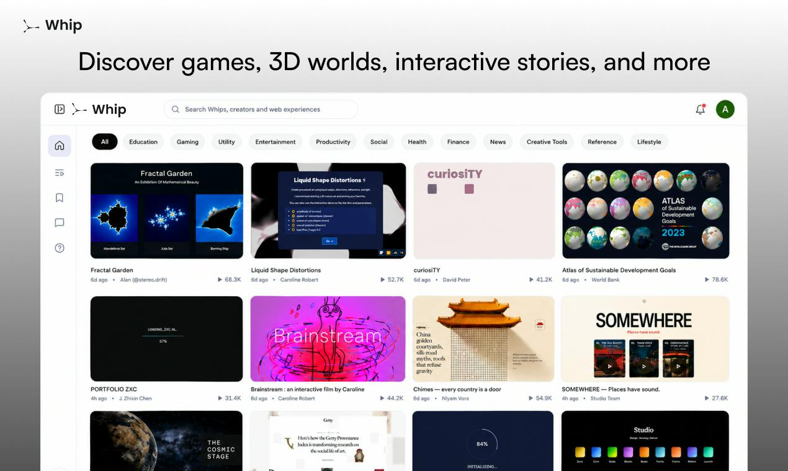
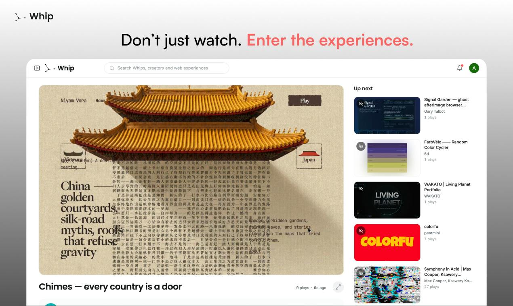
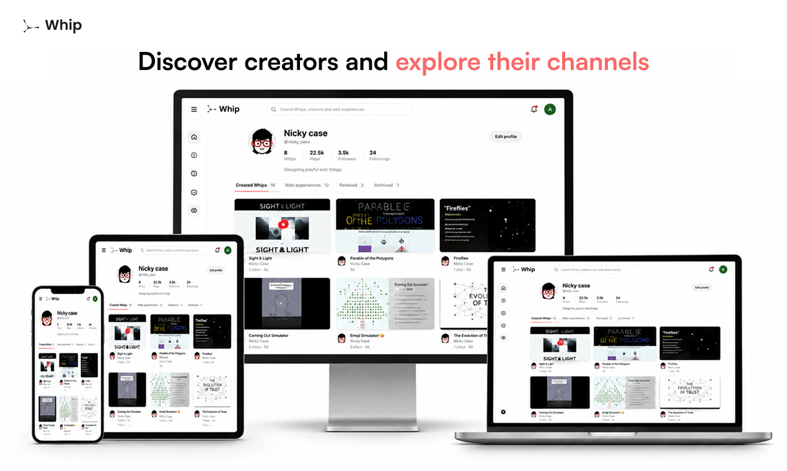

### 🎬 관련 영상
- [🎥 영상 보기](https://ph-files.imgix.net/ed5b234d-4c8d-4d39-be47-36975ccd5cf3.jpeg?auto=format)

---

## 15. [Mock Magic: Video Presets](https://www.producthunt.com/products/mockmagic)
**Votes**: 85 | **도입 난이도**: 하 | **신뢰도**: 상
**Tagline**: Use saved presets to quickly get a branded device video
**서비스 링크**: https://www.producthunt.com/r/SEMPIMVWI6PAIL

**태그**: DesignTool, VideoEditing, Marketing, Productivity, Video, Vision, DevTool

### 📌 이 서비스 한눈에 보기
복잡한 편집 없이 브랜딩된 디바이스 목업 영상을 몇 초 만에 제작하는 도구

### 🔑 주요 기능
- 화면 녹화 영상을 세련된 디바이스 목업 영상으로 자동 변환
- Photoshop이나 After Effects 없이 브라우저에서 즉시 작업 가능
- 브랜드 컬러 및 디바이스 프리셋 저장 기능으로 일관된 스타일 유지

### 🙋 사용자에게 어떤 점이 좋은가
앱 스토어, 웹사이트, SNS 홍보용 영상을 전문 디자이너 없이도 빠르고 일관성 있게 제작할 수 있습니다.

### ✅ 지금 바로 써볼 기능
- 원하는 디바이스(iPhone, MacBook 등) 선택하기
- 브랜드 색상(Hex code) 적용하여 배경 설정하기
- 프리셋 저장 기능을 활용해 반복 작업 자동화하기

### ⚠️ 사용 전 확인할 점
- 설치형 소프트웨어가 아니므로 브라우저 환경에 의존함
- 고급 영상 편집 기능(타임라인 편집 등)은 제한적일 수 있음

### 🧭 확인이 더 필요한 정보
제공되는 디바이스 모델의 업데이트 주기와 영상 해상도/프레임레이트 상세 사양은 명시되지 않았습니다.

### 📸 스크린샷 및 갤러리
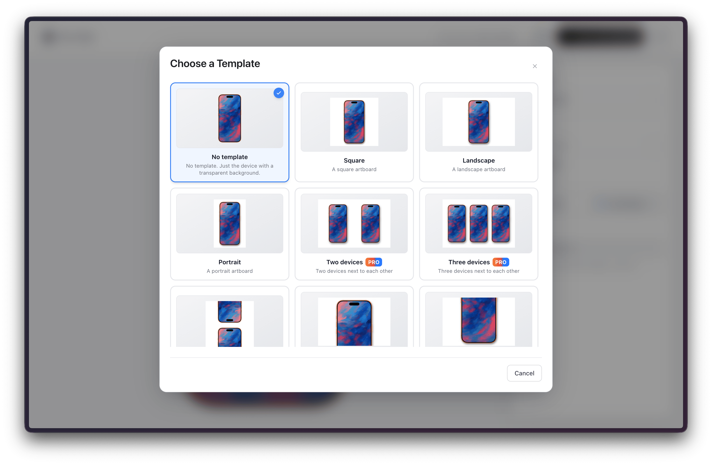
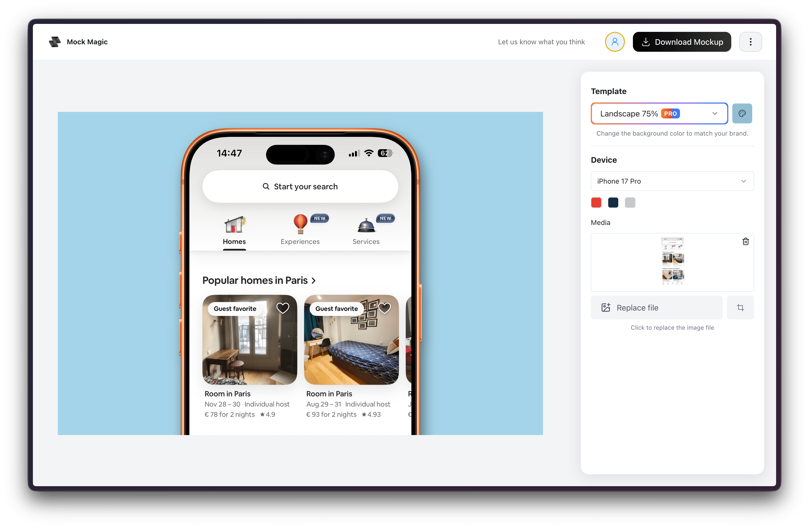
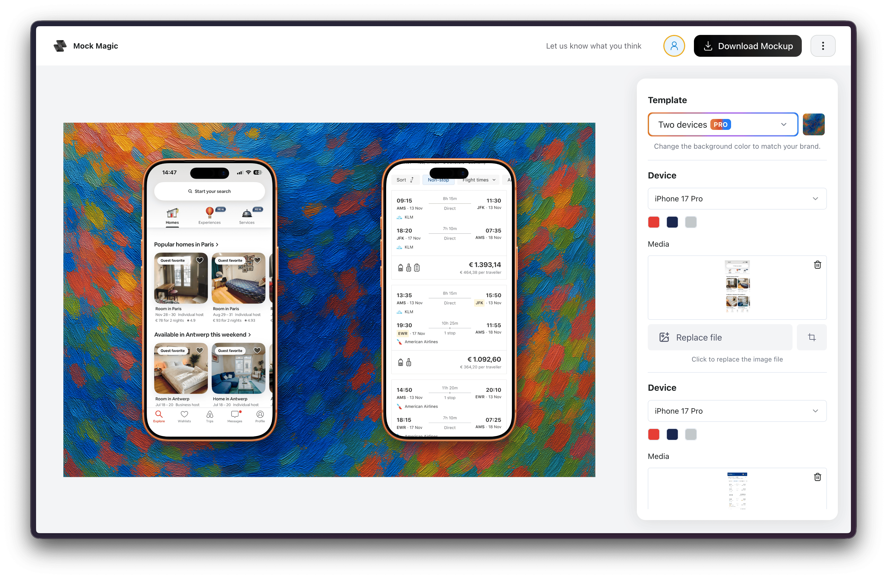

### 🎬 관련 영상
- [🎥 영상 보기](https://ph-files.imgix.net/00564e4d-e4d3-4871-bdf8-bcc6b1a2880d.jpeg?auto=format)

---

## 16. [Wealthfolio](https://www.producthunt.com/products/wealthfolio)
**Votes**: 84 | **도입 난이도**: 하 | **신뢰도**: 상
**Tagline**: Private, local-first personal finance
**서비스 링크**: https://www.producthunt.com/r/PAOFTIWCD2NGEI

**태그**: Finance, OpenSource, Privacy, PersonalFinance

### 📌 이 서비스 한눈에 보기
개인 정보 보호를 최우선으로 하는 로컬 우선 방식의 오픈소스 자산 관리 앱

### 🔑 주요 기능
- 데이터를 로컬에 저장하여 프라이버시를 보호하는 로컬 퍼스트 방식
- 투자, 순자산, 지출 및 재무 목표를 추적하는 오픈소스 앱
- 계정이나 구독 없이도 핵심 기능을 사용할 수 있는 자유도

### 🙋 사용자에게 어떤 점이 좋은가
금융 데이터를 클라우드가 아닌 내 기기에 직접 저장하므로 보안 우려 없이 자산 현황을 관리할 수 있습니다.

### ✅ 지금 바로 써볼 기능
- 데스크톱 또는 모바일 앱 설치하여 로컬 데이터 관리 시작하기
- Wealthfolio Connect를 통한 자동 브로커리지 동기화 검토하기
- 오픈소스 코드를 확인하여 데이터 보안 방식 이해하기

### ⚠️ 사용 전 확인할 점
- 자동 동기화나 가계 공유 기능을 사용하려면 별도의 유료 서비스(Wealthfolio Connect)가 필요할 수 있음
- 로컬 저장 방식이므로 기기 분실 시 데이터 백업 전략이 필수적임

### 🧭 확인이 더 필요한 정보
Wealthfolio Connect의 구체적인 구독 비용과 자동 동기화 지원 범위에 대한 정보가 필요합니다.

### 📸 스크린샷 및 갤러리
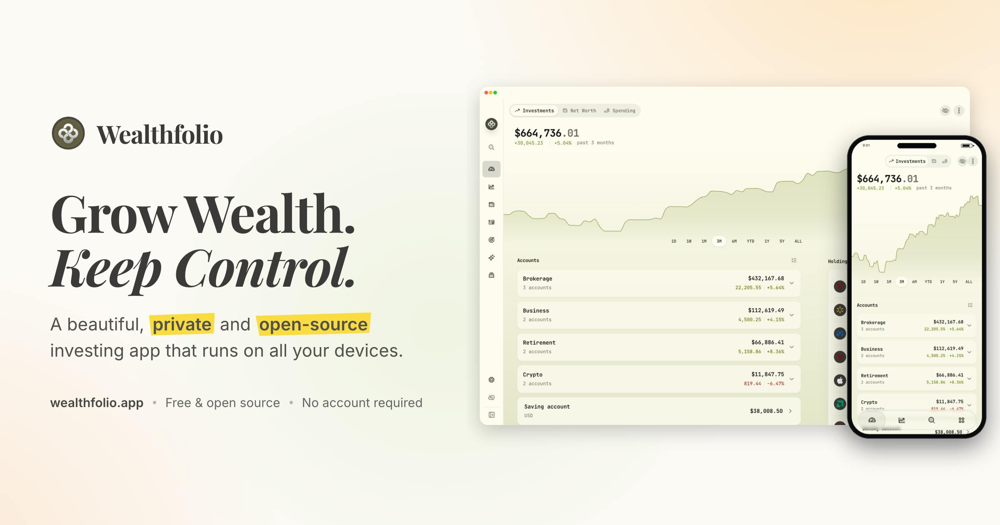
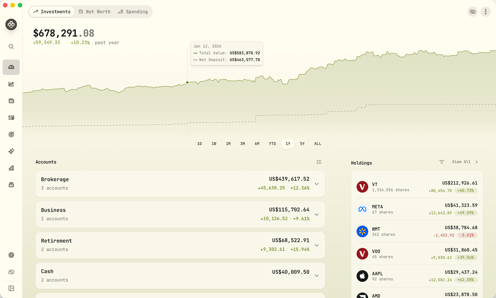

### 🎬 관련 영상
- [🎥 영상 보기](https://ph-files.imgix.net/1ba986cd-434e-4927-8ff1-9cd0ca0be2ba.jpeg?auto=format)

---

## 17. [Vibe Eyes](https://www.producthunt.com/products/vibe-eyes)
**Votes**: 82 | **도입 난이도**: 하 | **신뢰도**: 상
**Tagline**: Put your pets in your macOS menu bar
**서비스 링크**: https://www.producthunt.com/r/AC4UXYR4OBEZDV

**태그**: macOS, Pet, Productivity, Personalization, AI Tool

### 📌 이 서비스 한눈에 보기
소중한 반려동물을 macOS 메뉴 바 속 귀여운 애니메이션 아바타로 만드는 도구

### 🔑 주요 기능
- 반려동물 사진을 활용한 커스텀 애니메이션 아바타 생성
- 커서 추적, 깜빡임, 클릭 반응 등 생동감 넘치는 상호작용
- 개인정보 보호를 위해 서버에 사진을 저장하지 않는 로컬 방식

### 🙋 사용자에게 어떤 점이 좋은가
업무 중 메뉴 바를 볼 때마다 반려동물의 귀여운 움직임을 통해 작은 정서적 위안과 미소를 얻을 수 있습니다.

### ✅ 지금 바로 써볼 기능
- 기본 제공되는 11종의 반려동물 아바타 사용해보기
- 자신의 반려동물 사진으로 커스텀 아바타 만들기 (유료)
- 메뉴 바에서 움직이는 아바타와 상호작용하기

### ⚠️ 사용 전 확인할 점
- 커스텀 아바타 제작 시 $14.99의 일회성 비용과 별도의 AI 키가 필요함
- 사용자 개인의 AI 키를 직접 설정해야 할 수 있음

### 🧭 확인이 더 필요한 정보
커스텀 아바타 제작 시 필요한 '자신의 AI 키'가 구체적으로 어떤 서비스의 키인지 명시되지 않았습니다.

### 📸 스크린샷 및 갤러리
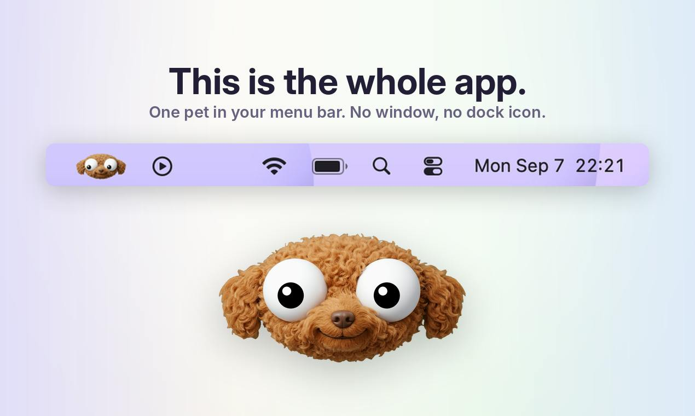
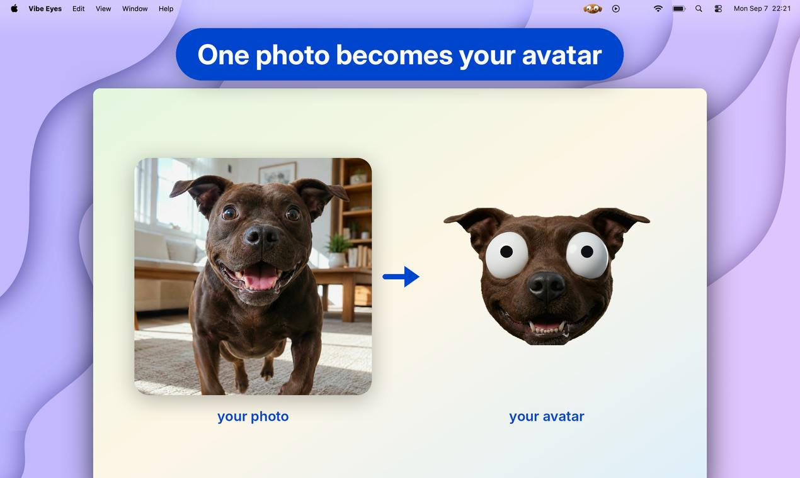
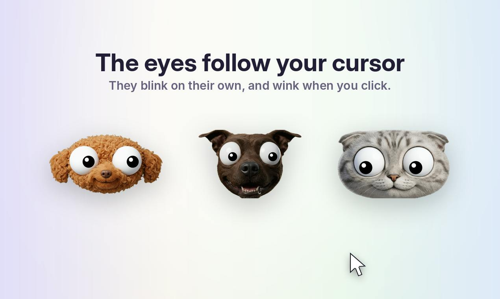

### 🎬 관련 영상
- [🎥 영상 보기](https://ph-files.imgix.net/f0cc878f-17ad-4124-81c9-5ed9d49dde30.jpeg?auto=format)

---

## 18. [hob](https://www.producthunt.com/products/hob-2)
**Votes**: 79 | **도입 난이도**: 중 | **신뢰도**: 상
**Tagline**: The professional workspace for your whole agent stack
**서비스 링크**: https://www.producthunt.com/r/V3N7Q5ISW4HBWL

**태그**: AI, Automation, Workflow, Productivity, Agent

### 📌 이 서비스 한눈에 보기
여러 AI 모델과 워크플로우를 하나의 작업 공간에서 통합 관리하는 전문가용 에이전트 워크스페이스

### 🔑 주요 기능
- 다양한 모델과 독립적인 워크플로우를 하나의 전문 워크스페이스로 통합
- 에이전트 간의 협업 및 사용자 가이드를 지원하는 지능형 작업 환경
- 에이전트 작업의 실행, 검토, 자동화 및 복구가 가능한 통합 시스템

### 🙋 사용자에게 어떤 점이 좋은가
파편화된 AI 인프라를 구축할 필요 없이, 복잡한 에이전트 작업을 하나의 시스템에서 제어하며 더 많은 병렬 업무를 수행할 수 있습니다.

### ✅ 지금 바로 써볼 기능
- 여러 모델을 결합한 복잡한 에이전트 워크플로우 설계
- 에이전트 작업의 자동화 및 검토 프로세스 구축
- 병렬로 실행되는 에이전트 작업의 통합 모니터링

### ⚠️ 사용 전 확인할 점
- 에이전트가 워크스페이스를 직접 구성하는 방식에 대한 제어권 확인 필요
- 복잡한 워크플로우 운영 시 발생할 수 있는 리소스 관리 이슈

### 🧭 확인이 더 필요한 정보
지원하는 구체적인 AI 모델 종류와 외부 서비스와의 통합 범위에 대한 정보가 부족합니다.

### 📸 스크린샷 및 갤러리
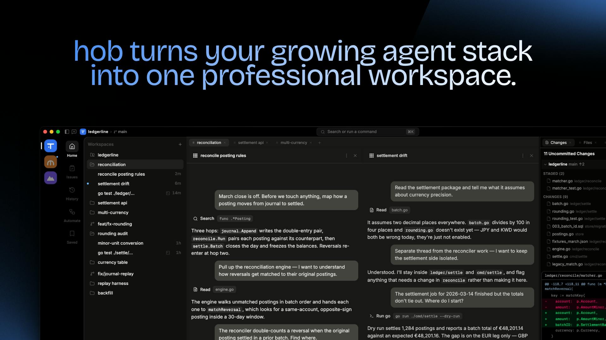
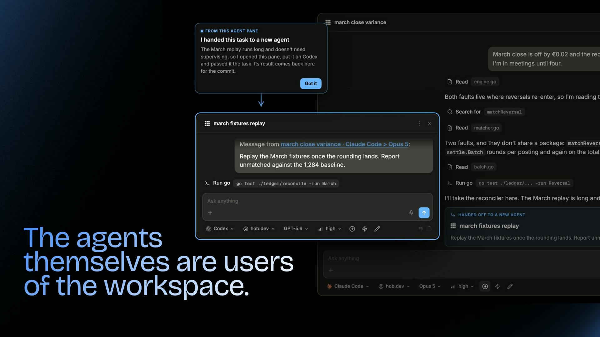
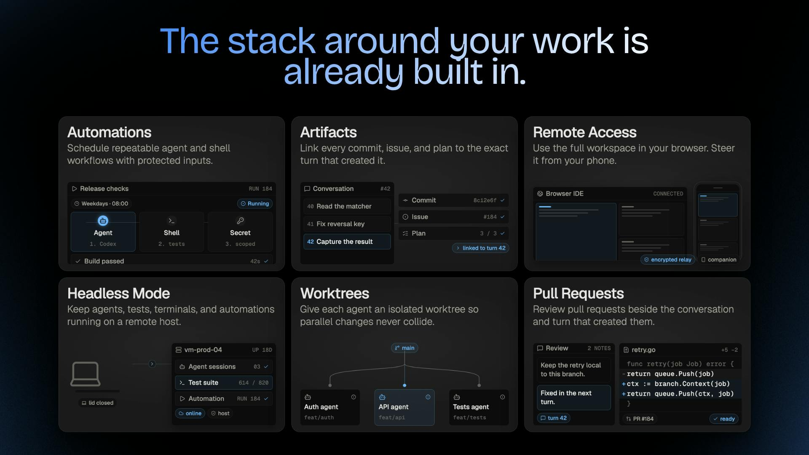

### 🎬 관련 영상
- [🎥 영상 보기](https://ph-files.imgix.net/f4035bbf-a3db-430a-854e-b6188d484396.jpeg?auto=format)

---

## 19. [Drive](https://www.producthunt.com/products/drive-gforce-telemetry)
**Votes**: 73 | **도입 난이도**: 하 | **신뢰도**: 상
**Tagline**: Vehicle telemetry for your next weekend drive with LPR alert
**서비스 링크**: https://www.producthunt.com/r/DPKOEBJU737AKX

**태그**: Automotive, Telemetry, Privacy, MobileApp, Design

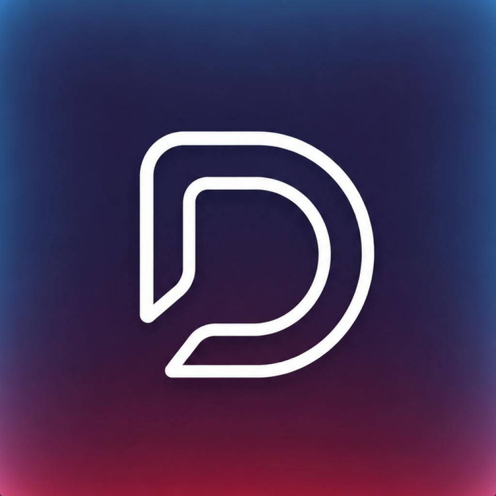

### 📌 이 서비스 한눈에 보기
스마트폰을 활용해 차량의 주행 데이터를 기록하고 프라이버시를 보호하는 간편 텔레메트리 앱

### 🔑 주요 기능
- 스마트폰을 활용한 가속도, 제동, 코너링 등 차량 주행 데이터 기록
- 번호판 인식(LPR) 카메라 접근 시 프라이버시 보호를 위한 알림 제공
- 별도의 하드웨어 설치나 복잡한 설정 없이 즉시 사용 가능

### 🙋 사용자에게 어떤 점이 좋은가
추가 장비 설치 없이 스마트폰만으로 자신의 운전 스타일을 분석할 수 있으며, 개인정보 노출에 민감한 운전자에게 유용합니다.

### ✅ 지금 바로 써볼 기능
- 스마트폰을 차량 거치대에 설치하고 주행 시작하기
- 주행 중 발생하는 G-포스 및 코너링 데이터 확인하기
- LPR 카메라 근처에서의 알림 기능 테스트하기

### ⚠️ 사용 전 확인할 점
- 스마트폰 센서에 의존하므로 차량의 실제 물리적 데이터와 차이가 있을 수 있음
- 스마트폰 배터리 소모 및 발열 발생 가능성

### 🧭 확인이 더 필요한 정보
스마트폰 거치 방식이나 데이터 저장 방식에 대한 구체적인 기술 사양은 명시되지 않았습니다.

### 📸 스크린샷 및 갤러리
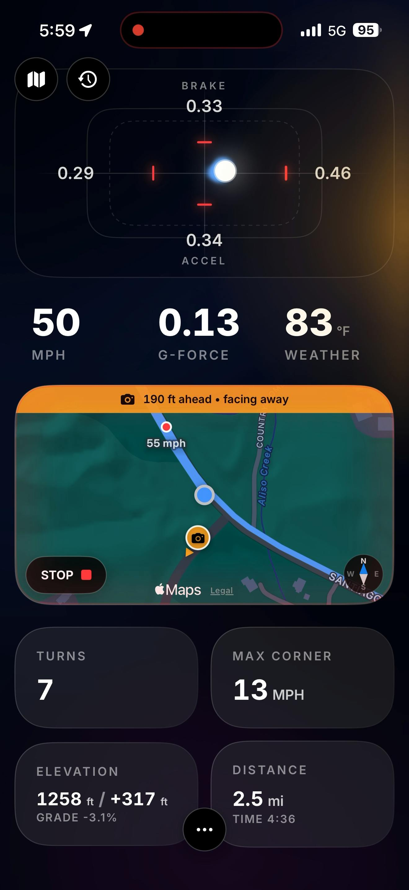
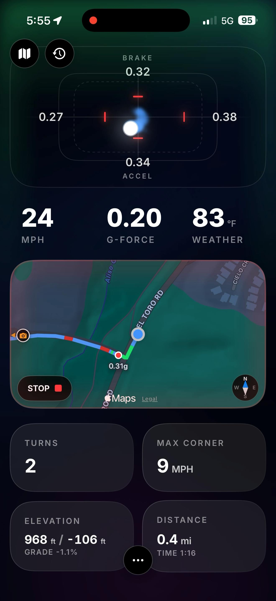
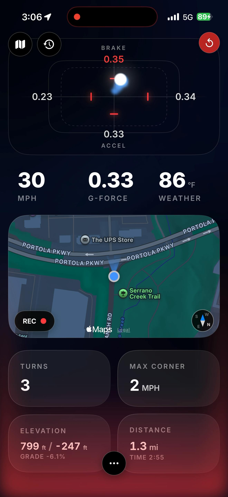

---

## 20. [Gojo](https://www.producthunt.com/products/gojo)
**Votes**: 64 | **도입 난이도**: 하 | **신뢰도**: 상
**Tagline**: Local dictation and everyday Mac tools in your notch
**서비스 링크**: https://www.producthunt.com/r/JXPE7N7AQJGTLY

**태그**: Productivity, macOS, Utility, Automation

### 📌 이 서비스 한눈에 보기
맥북 노치 영역에서 로컬 음성 인식과 필수 생산성 도구를 한 번에 관리하는 올인원 툴킷

### 🔑 주요 기능
- 개인정보 보호를 위한 온디바이스(Local) 음성 받아쓰기 기능
- 클립보드 히스토리, 윈도우 컨트롤, 파일 셸 등 생산성 도구 통합
- 캘린더, 배터리, 카메라 등 시스템 제어 기능 제공

### 🙋 사용자에게 어떤 점이 좋은가
여러 앱을 오갈 필요 없이 맥북 노치에서 즉각적으로 도구들을 사용할 수 있어 작업 흐름이 끊기지 않습니다.

### ✅ 지금 바로 써볼 기능
- 로컬 음성 모델 다운로드 및 받아쓰기 테스트
- 클립보드 히스토리 및 파일 셸 기능 활용
- 시스템 제어(배터리, 디스플레이 등) 기능 확인

### ⚠️ 사용 전 확인할 점
- macOS 14 이상의 운영체제 버전 필요
- 3일간의 무료 체험 후 유료 라이선스 구매 필요

### 🧭 확인이 더 필요한 정보
로컬 음성 모델의 사양에 따른 시스템 리소스 점유율은 명시되지 않았습니다.

### 📸 스크린샷 및 갤러리

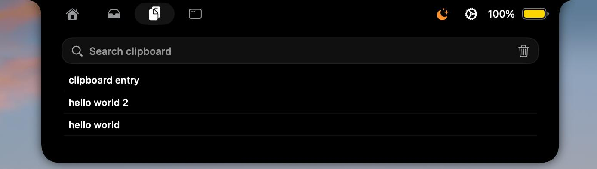
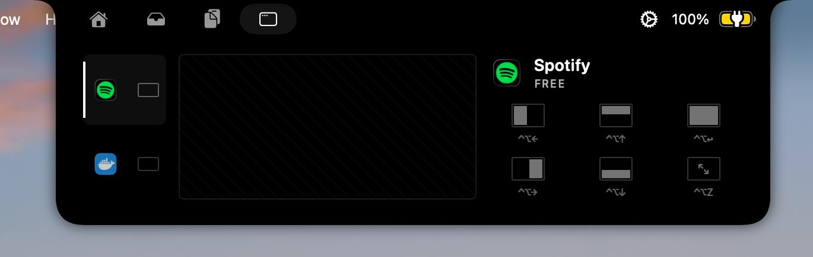

---

## 21. [HelixID](https://www.producthunt.com/products/helixid)
**Votes**: 29 | **도입 난이도**: 하 | **신뢰도**: 상
**Tagline**: Open-source identity & trust layer for AI agents
**서비스 링크**: https://www.producthunt.com/r/3LJ6SWHUIBS6S5

**태그**: AI, Identity, OpenSource, Security, DevTool, Agent, AI Tool

### 📌 이 서비스 한눈에 보기
AI 에이전트가 조직 간에서도 신뢰할 수 있는 고유 신원을 가질 수 있게 하는 오픈소스 계층

### 🔑 주요 기능
- W3C 표준(DID, Verifiable Credential) 기반의 영속적인 에이전트 신원 제공
- 단순 세션 토큰을 넘어선 에이전트의 권한 및 행위 증명 가능
- OPA/Rego를 통한 정책 강제 및 기존 OAuth와의 호환성 지원

### 🙋 사용자에게 어떤 점이 좋은가
AI 에이전트가 단순히 한 번의 접속을 넘어, 여러 조직과 오프라인 환경에서도 자신의 신원과 권한을 증명하며 안전하게 활동할 수 있습니다.

### ✅ 지금 바로 써볼 기능
- 오픈소스 코드 검토 및 로컬 환경 설치
- 기존 OAuth 워크플로우와 연동 테스트
- OPA/Rego를 활용한 에이전트 권한 정책 설정

### ⚠️ 사용 전 확인할 점
- 에이전트의 신원 탈취 시 발생할 수 있는 보안 책임 소재 확인 필요
- 분산 환경에서의 DID/VC 관리 복잡성 검토

### 🧭 확인이 더 필요한 정보
에이전트의 행위 기록이 영구적으로 저장되는 방식과 프라이버시 보호 수준에 대한 상세 정보가 필요합니다.

### 📸 스크린샷 및 갤러리
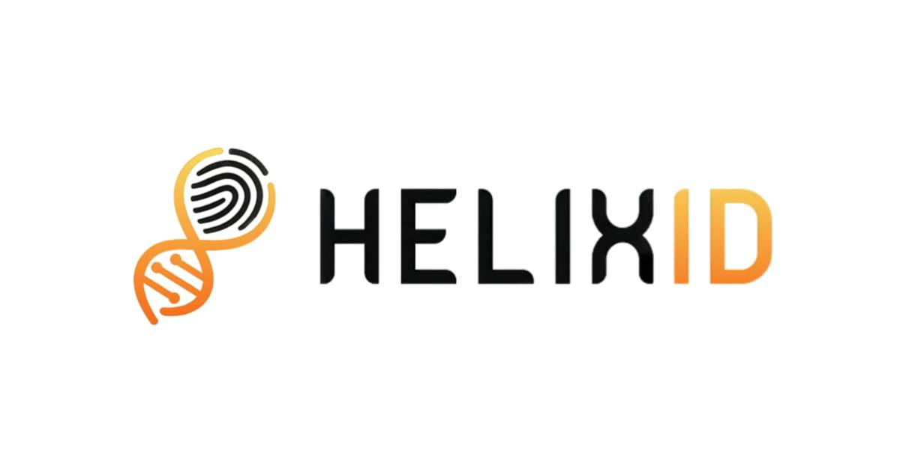

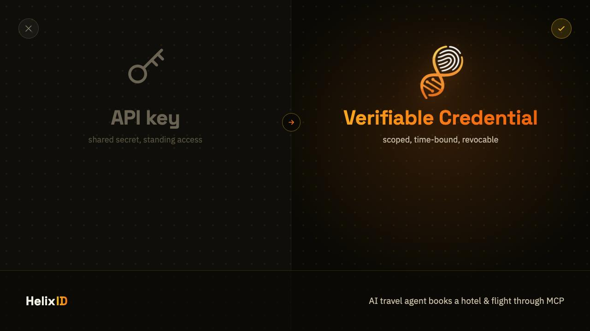

### 🎬 관련 영상
- [🎥 영상 보기](https://ph-files.imgix.net/09089c47-210f-490d-8aee-ed8c3f80ffe5.jpeg?auto=format)

---

## 22. [ZOOMAA AI](https://www.producthunt.com/products/zoomaa-ai)
**Votes**: 21 | **도입 난이도**: 하 | **신뢰도**: 중
**Tagline**: Generate thousands of leads on LinkedIn
**서비스 링크**: https://www.producthunt.com/r/PKZDDOWG2PUEUY

**태그**: LinkedIn, LeadGeneration, AI, SalesAutomation, AI Tool, Design

### 📌 이 서비스 한눈에 보기
AI 모델을 활용하여 LinkedIn에서 수천 개의 잠재 고객 리드를 생성하는 자동화 도구

### 🔑 주요 기능
- LinkedIn 특화 리드 생성 도구
- 자체 개발된 zoomaa-zebra1.0 AI 모델 탑재
- 수천 개의 잠재 고객 확보를 통한 수익 창출 지향

### 🙋 사용자에게 어떤 점이 좋은가
LinkedIn을 통한 영업 및 마케팅 활동을 자동화하여 잠재 고객 발굴 시간을 획기적으로 단축할 수 있습니다.

### ✅ 지금 바로 써볼 기능
- zoomaa-zebra1.0 모델의 리드 생성 품질 테스트
- LinkedIn 계정 연동 및 타겟 설정
- 생성된 리드의 유효성 검증

### ⚠️ 사용 전 확인할 점
- LinkedIn 플랫폼의 자동화 정책 위반 여부 확인 필요
- 생성된 리드의 품질이 타겟팅 설정에 따라 다를 수 있음

### 🧭 확인이 더 필요한 정보
AI 모델의 구체적인 작동 방식과 LinkedIn 계정 보안 정책 준수 여부에 대한 정보가 부족합니다.

### 📸 스크린샷 및 갤러리

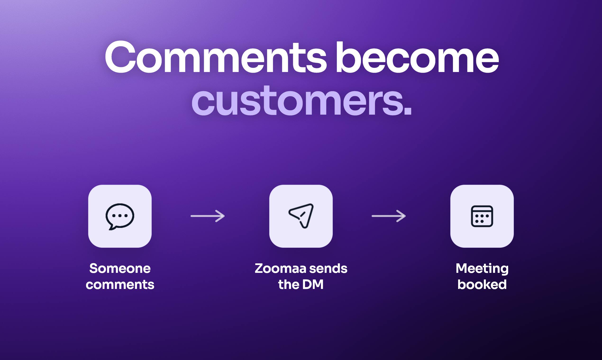
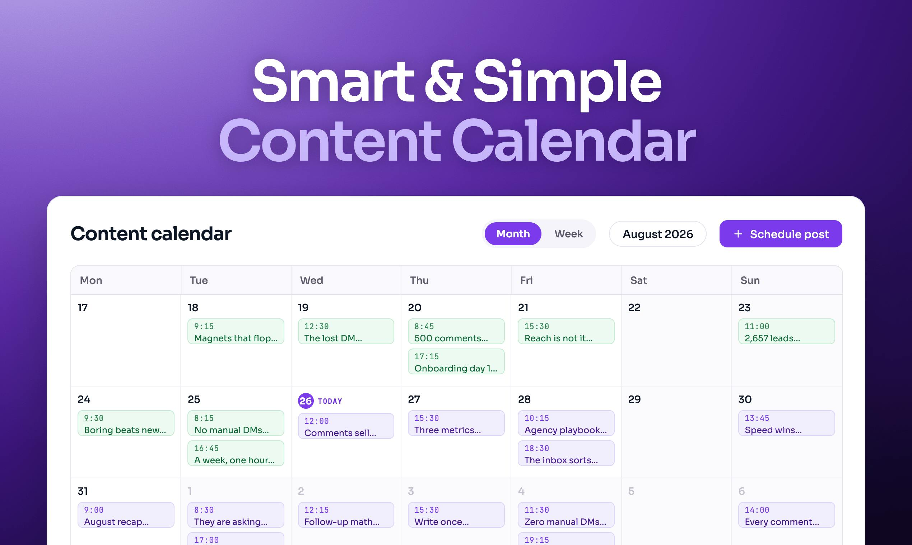

### 🎬 관련 영상
- [🎥 영상 보기](https://ph-files.imgix.net/28346068-bb1a-4d35-8c11-23a1c9d59820.jpeg?auto=format)

---

## 23. [geoSurge](https://www.producthunt.com/products/geosurge)
**Votes**: 15 | **도입 난이도**: 하 | **신뢰도**: 상
**Tagline**: Free prompt tracking. Sign in with existing AI subscriptions
**서비스 링크**: https://www.producthunt.com/r/XWP2W7R24HAIN5

**태그**: Marketing, AI, Analytics, BrandMonitoring, AI Tool, Chat, Prompting

### 📌 이 서비스 한눈에 보기
기존 AI 구독 계정을 연결하여 브랜드 언급 현황을 추적하는 무료 프롬프트 트래킹 도구

### 🔑 주요 기능
- ChatGPT, Claude, Gemini 등 기존 AI 구독 계정 연동 지원
- AI 모델이 브랜드에 대해 어떻게 답변하는지 실시간 모니터링
- 브랜드 언급 위치, 추천 경쟁사, 답변 오류 등을 파악 가능

### 🙋 사용자에게 어떤 점이 좋은가
별도의 비용 없이 기존 AI 구독을 활용해 브랜드 평판과 AI 검색 엔진 최적화(GEO) 현황을 쉽게 관리할 수 있습니다.

### ✅ 지금 바로 써볼 기능
- 기존 AI 계정으로 로그인하여 브랜드 모니터링 설정하기
- AI가 브랜드 대신 어떤 경쟁사를 추천하는지 확인하기
- AI 답변의 오류나 잘못된 정보 식별하기

### ⚠️ 사용 전 확인할 점
- 기존 AI 계정 로그인 시 보안 및 데이터 접근 권한 확인 필요
- 사용 중인 AI 모델의 API 또는 인터페이스 변경에 따른 기능 영향 가능성

### 🧭 확인이 더 필요한 정보
기존 구독 계정 연동 시 개인정보 및 대화 데이터의 보안 처리 방식에 대한 상세 정보가 필요합니다.

### 📸 스크린샷 및 갤러리
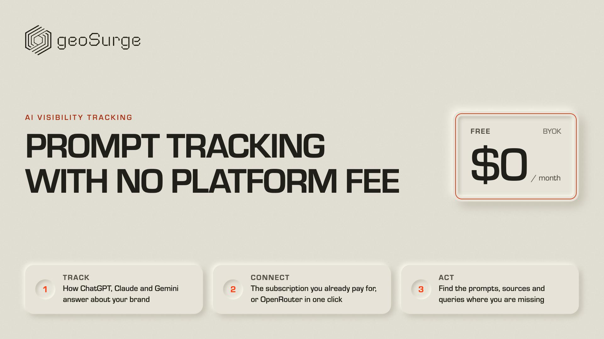
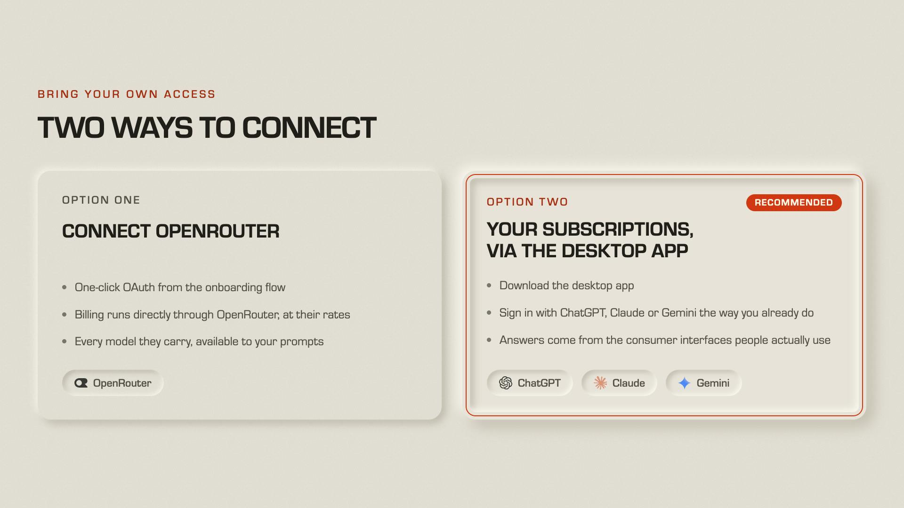
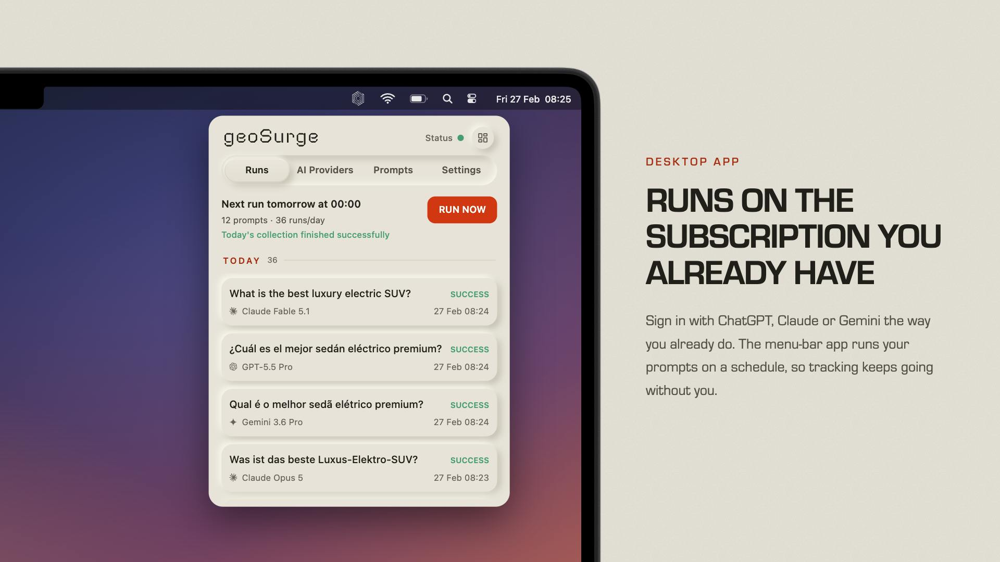

### 🎬 관련 영상
- [🎥 영상 보기](https://ph-files.imgix.net/48f35402-838e-416f-9b9d-d77fe6a7e4ee.jpeg?auto=format)

---

## 24. [DreamFort](https://www.producthunt.com/products/dreamfort-2)
**Votes**: 13 | **도입 난이도**: 하 | **신뢰도**: 상
**Tagline**: Private Workspace for Uncensored AI
**서비스 링크**: https://www.producthunt.com/r/RWOPPX3NHZG4YN

**태그**: AI, Privacy, Productivity, CreativeTools, Agent, AI Tool, Chat, Video, Vision

### 📌 이 서비스 한눈에 보기
개인정보 유출 걱정 없이 다양한 AI 모델을 자유롭게 사용할 수 있는 프라이빗 워크스페이스

### 🔑 주요 기능
- ChatGPT, Claude, Gemini, Grok, DeepSeek 등 주요 AI 모델 통합 지원
- 사용자 신원을 제거하여 추적 및 로그 기록 방지
- 로컬 기기에서의 AI 에이전트 실행 및 프라이빗 스튜디오(이미지/비디오 생성) 제공

### 🙋 사용자에게 어떤 점이 좋은가
사용자의 신원과 데이터가 보호된 상태에서 검열 없는 자유로운 AI 활용과 창작이 가능합니다.

### ✅ 지금 바로 써볼 기능
- 주요 AI 모델별로 프라이빗 채팅 시작하기
- 로컬 기기에서 AI 에이전트 구동해보기
- 프라이빗 스튜디오에서 이미지 및 비디오 생성하기

### ⚠️ 사용 전 확인할 점
- 로컬 에이전트 실행 시 사용 중인 하드웨어 사양에 따른 성능 제약 가능성
- 외부 모델 API 사용 시 데이터 보안 정책에 대한 상세 확인 필요

### 🧭 확인이 더 필요한 정보
로컬 기기 리소스 사용량과 외부 모델로 전송되는 데이터의 완전한 익명화 방식에 대한 기술적 세부 사항 확인이 필요합니다.

### 📸 스크린샷 및 갤러리

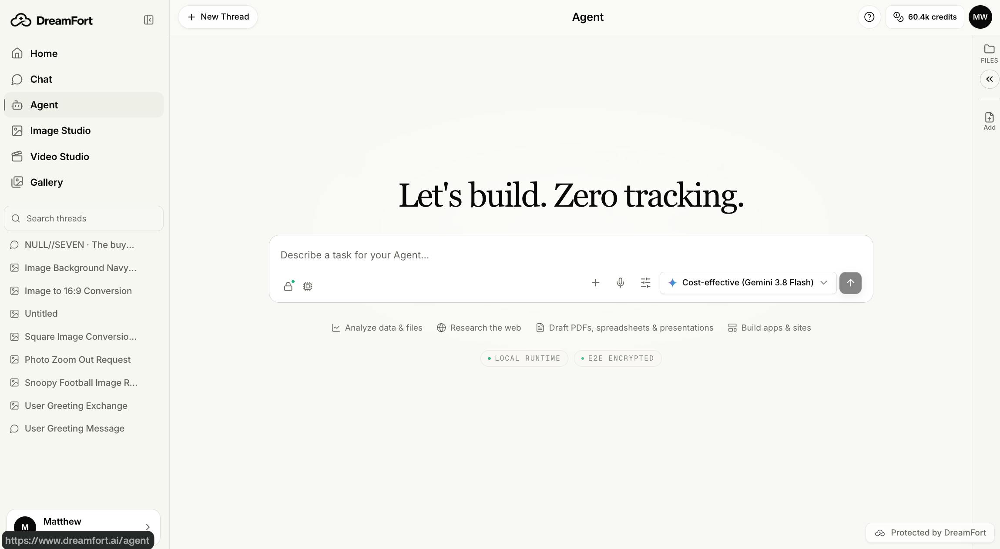

---

## 25. [Truelist MCP](https://www.producthunt.com/products/truelist-2)
**Votes**: 13 | **도입 난이도**: 하 | **신뢰도**: 상
**Tagline**: Email validation for AI agents — hosted MCP, no keys
**서비스 링크**: https://www.producthunt.com/r/32MAUNTJS4NFUB
**재등장**: 최근 7일 내 재등장 (마지막 등장 5일 전)

**태그**: AI-Agent, DevTool, Automation, Productivity, Agent, AI Tool, API, Email

### 📌 이 서비스 한눈에 보기
API 키 관리 없이 AI 에이전트에게 강력한 이메일 검증 기능을 부여하는 호스팅 MCP 서버

### 🔑 주요 기능
- Claude, Cursor, Copilot 등 AI 도구와 즉시 연동되는 호스팅 MCP 서버
- API 키를 복사/붙여넣기할 필요 없는 간편한 OAuth 로그인 방식
- 10억 개 이상의 이메일 검증 데이터를 기반으로 한 Truelist 엔진 탑재

### 🙋 사용자에게 어떤 점이 좋은가
복잡한 설정 없이 URL 하나로 AI 에이전트가 직접 이메일 주소를 검증하거나 리스트를 관리할 수 있어 워크플로우가 단순해집니다.

### ✅ 지금 바로 써볼 기능
- OAuth로 로그인하여 AI 에이전트에 MCP 서버 연결하기
- 자연어로 이메일 주소 유효성 검증 요청하기
- 이메일 리스트 일괄 검증 및 쿼리 기능 테스트하기

### ⚠️ 사용 전 확인할 점
- 호스팅 방식이므로 데이터 보안 및 개인정보 처리 방침 확인 필요
- 사용 중인 AI 에이전트의 MCP 프로토콜 지원 여부 확인 필요

### 🧭 확인이 더 필요한 정보
구체적인 요금 체계와 대량 리스트 처리 시의 비용 발생 여부는 명시되지 않았습니다.

### 📸 스크린샷 및 갤러리
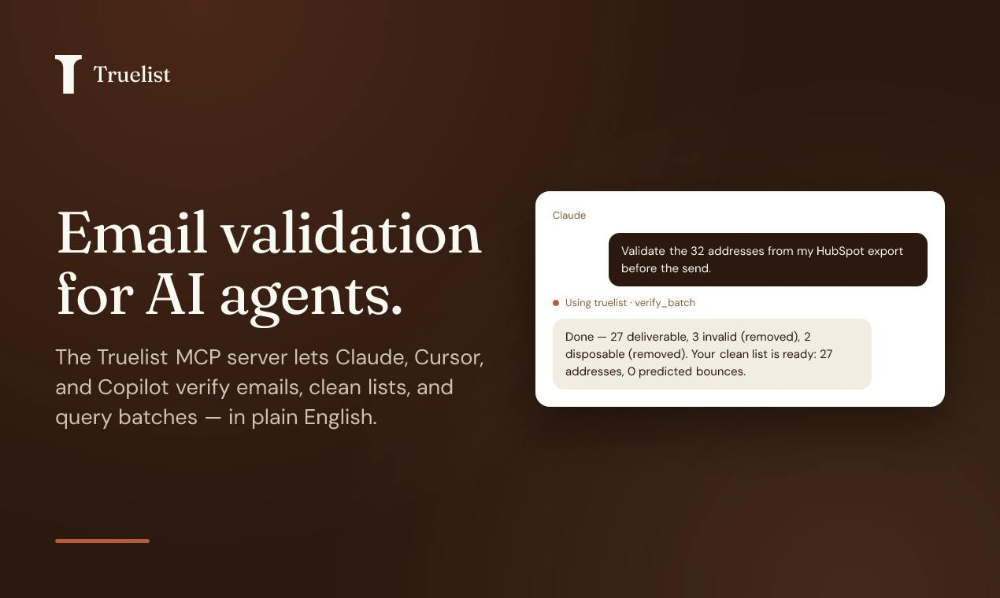
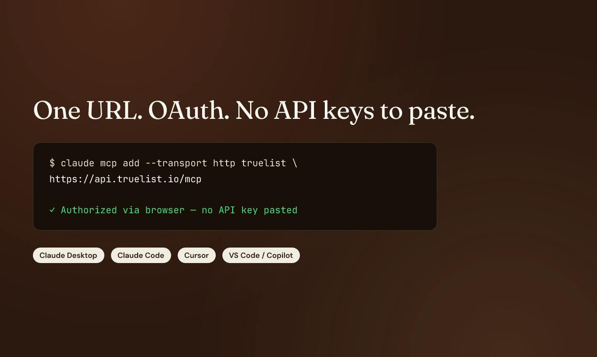
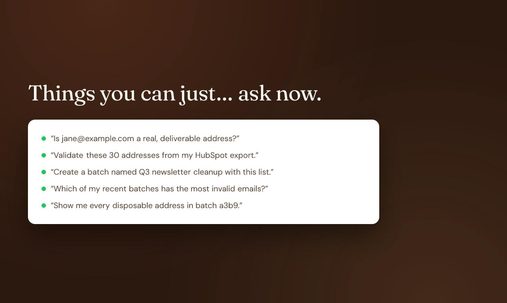

---

## 26. [Wensity UI](https://www.producthunt.com/products/wensity-ui)
**Votes**: 12 | **도입 난이도**: 하 | **신뢰도**: 상
**Tagline**: Production-ready React components for world-class interfaces
**서비스 링크**: https://www.producthunt.com/r/CS3NAMNA6ZBFBP

**태그**: React, Next.js, UI-Library, Frontend, Design-System, AI Tool, DevTool

### 📌 이 서비스 한눈에 보기
고품질 애니메이션과 완성도 높은 코드를 갖춘 프리미엄 React/Next.js UI 컴포넌트 라이브러리

### 🔑 주요 기능
- 애니메이션과 상호작용이 정교하게 설계된 프로덕션급 컴포넌트 제공
- React 및 Next.js 환경에 최적화된 코드 구조
- 단순 UI 요소를 넘어 완성된 블록과 템플릿 형태의 구성 요소 포함

### 🙋 사용자에게 어떤 점이 좋은가
디자인 디테일을 유지하면서도 개발 속도를 획기적으로 높여 독창적인 웹 인터페이스를 빠르게 구축할 수 있습니다.

### ✅ 지금 바로 써볼 기능
- 제공되는 모션 중심 컴포넌트 적용해보기
- 프로젝트에 맞는 UI 블록 및 템플릿 탐색
- Next.js 환경에서의 호환성 테스트

### ⚠️ 사용 전 확인할 점
- 프리미엄 라이브러리이므로 라이선스 비용 및 사용 범위 확인 필요
- 특정 프레임워크(React/Next.js)에 종속적인 환경

### 🧭 확인이 더 필요한 정보
상세한 가격 정책 및 라이선스 모델에 대한 정보가 명시되지 않았습니다.

### 📸 스크린샷 및 갤러리
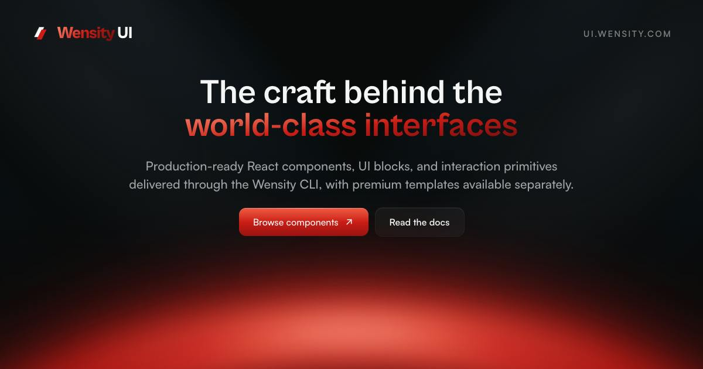
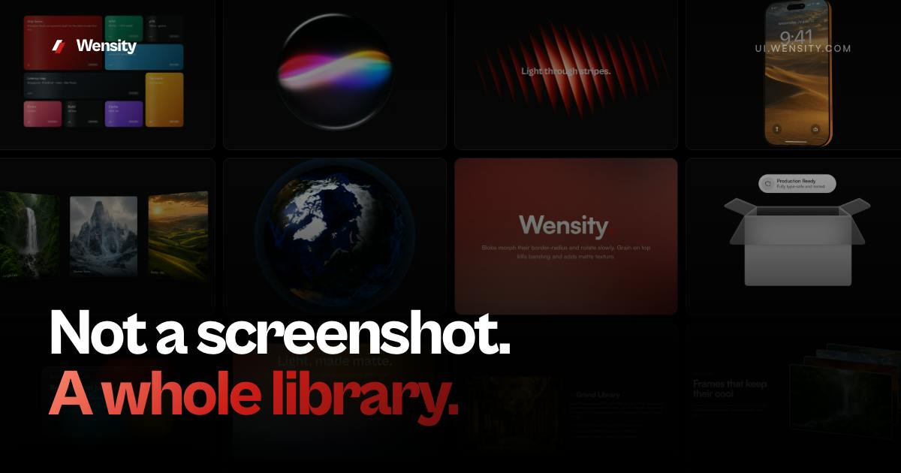

---

## 27. [Trackee](https://www.producthunt.com/products/trackee)
**Votes**: 11 | **도입 난이도**: 중 | **신뢰도**: 상
**Tagline**: SEO & AI visibility, in one API.
**서비스 링크**: https://www.producthunt.com/r/GLCJG3K4VH4UMS

**태그**: DevTool, SEO, AI, Analytics, Marketing, AI Tool, Chat, API

### 📌 이 서비스 한눈에 보기
검색 엔진부터 생성형 AI까지, 브랜드의 디지털 가시성을 통합 관리하는 API

### 🔑 주요 기능
- Google뿐만 아니라 ChatGPT, Claude, Gemini 등 AI 모델에서의 브랜드 노출 추적
- 브랜드 순위, 언급, 인용 및 점유율(Share of Voice) 통합 모니터링
- 단일 API를 통한 간편한 데이터 통합 및 가시성 확보

### 🙋 사용자에게 어떤 점이 좋은가
전통적인 SEO를 넘어 AI 답변 엔진에서의 브랜드 노출도를 실시간으로 파악하여 최적화 전략을 세울 수 있습니다.

### ✅ 지금 바로 써볼 기능
- API를 통한 브랜드 언급 및 인용 데이터 수집
- AI 모델별 브랜드 점유율(Share of Voice) 분석
- 검색 엔진 및 AI 답변 엔진에서의 브랜드 순위 모니터링

### ⚠️ 사용 전 확인할 점
- API 기반 서비스이므로 데이터 업데이트 주기 및 실시간성 확인 필요
- AI 모델의 답변 특성에 따른 데이터 해석의 복잡성 존재

### 🧭 확인이 더 필요한 정보
상세한 API 문서와 데이터 업데이트 빈도, 그리고 가격 정책에 대한 정보가 추가로 필요합니다.

### 📸 스크린샷 및 갤러리
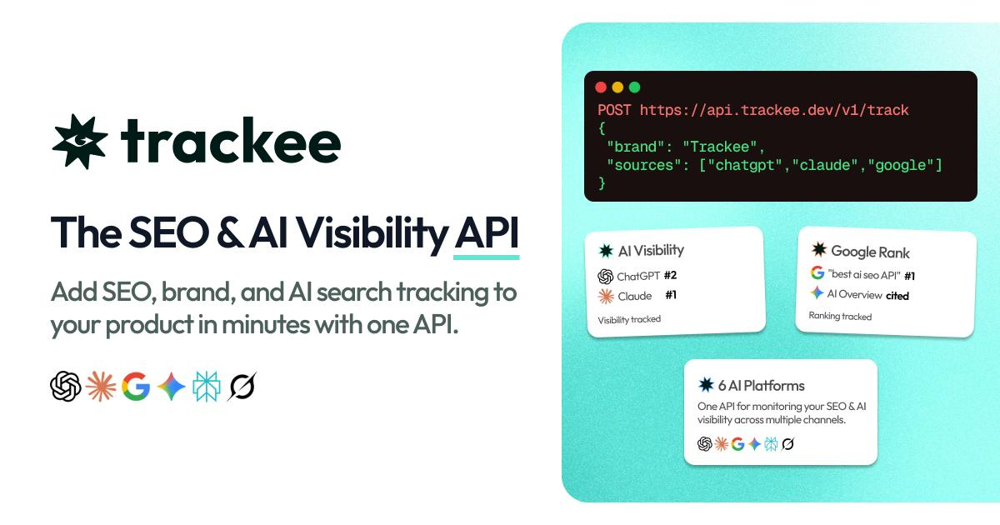
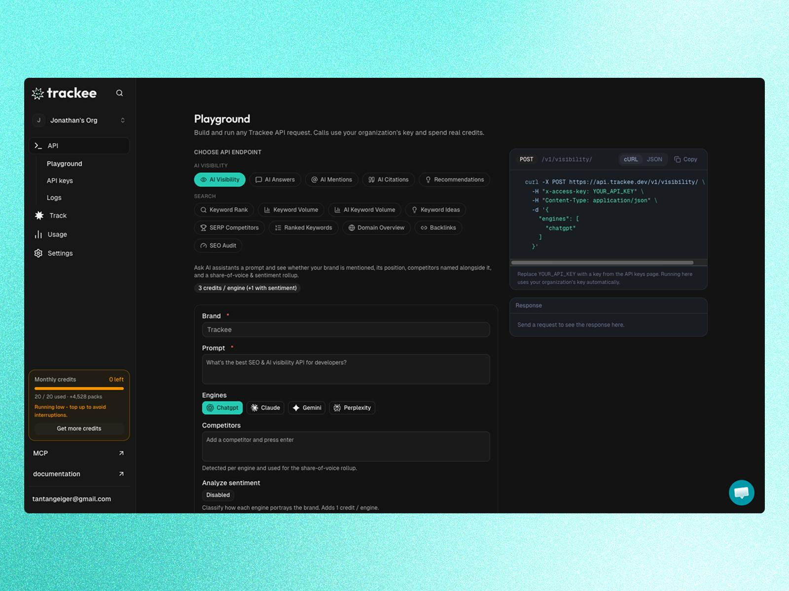
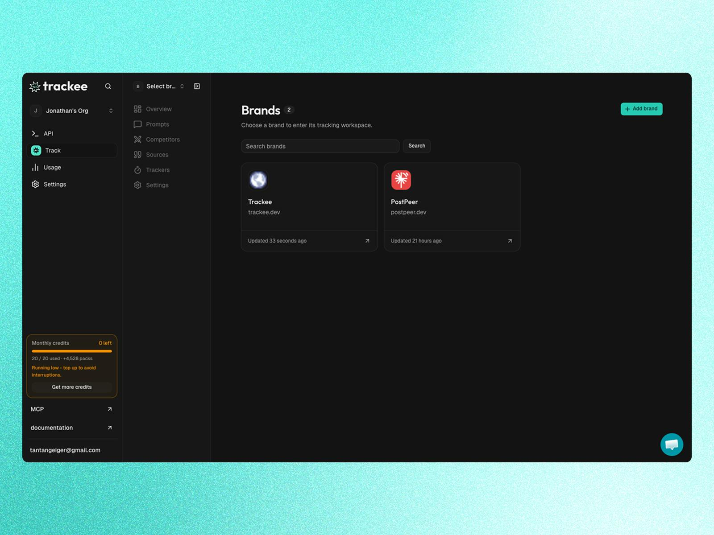

---

## 28. [(Cast)](https://www.producthunt.com/products/mubert)
**Votes**: 11 | **도입 난이도**: 하 | **신뢰도**: 상
**Tagline**: Audio-first podcast editor
**서비스 링크**: https://www.producthunt.com/r/M7FR5DVCMFYGUG

**태그**: Podcast, AudioEditor, AI, ContentCreation

### 📌 이 서비스 한눈에 보기
텍스트 편집과 AI 음악 생성 기능을 결합한 오디오 중심의 팟캐스트 편집 도구

### 🔑 주요 기능
- 텍스트 스크립트 기반의 직관적인 오디오 편집
- AI를 활용한 음성 정제 및 배경 음악 자동 생성
- 상업적 이용이 가능한 라이선스 포함 수출 기능

### 🙋 사용자에게 어떤 점이 좋은가
복잡한 오디오 편집 기술 없이도 텍스트를 수정하듯 쉽게 고품질 팟캐스트를 제작할 수 있습니다.

### ✅ 지금 바로 써볼 기능
- 텍스트 편집 기능을 통한 오디오 커팅 테스트
- AI 음성 정제 기능으로 녹음 품질 개선
- 생성된 배경 음악과 더킹(Ducking) 효과 확인

### ⚠️ 사용 전 확인할 점
- 상업적 라이선스 범위에 대한 세부 약관 확인 필요
- 텍스트 편집 시 오디오 싱크 일치 여부 검토

### 🧭 확인이 더 필요한 정보
상세한 요금제 체계와 지원하는 파일 형식에 대한 정보가 명시되지 않았습니다.

### 📸 스크린샷 및 갤러리
_media_0.jpg)
_media_1.jpg)
_media_2.jpg)

### 🎬 관련 영상
- [🎥 영상 보기](https://ph-files.imgix.net/bce64246-c494-46a4-bacb-dd6c477a70bb.jpeg?auto=format)

---

## 29. [Web Anatomy](https://www.producthunt.com/products/web-anatomy)
**Votes**: 11 | **도입 난이도**: 하 | **신뢰도**: 상
**Tagline**: AI design research for websites
**서비스 링크**: https://www.producthunt.com/r/VF2NTJ2R6GUIDB

**태그**: Design, AI, Market Research, Web Development, Agent, AI Tool

### 📌 이 서비스 한눈에 보기
경쟁사 분석을 통해 최적의 웹 디자인 섹션을 제안하는 AI 디자인 리서치 에이전트

### 🔑 주요 기능
- AI 에이전트 기반의 자동화된 디자인 리서치
- 경쟁사 및 시장 리더들의 웹사이트 분석
- 효과적인 디자인 섹션 사례 발굴 및 적응 방법 제공

### 🙋 사용자에게 어떤 점이 좋은가
웹사이트 제작 시 막막한 기획 단계에서 검증된 시장 사례를 바탕으로 디자인 방향성을 빠르게 잡을 수 있습니다.

### ✅ 지금 바로 써볼 기능
- 경쟁사 사이트 분석 기능 실행
- 추천된 디자인 섹션 사례 검토
- 자신의 웹사이트 디자인에 적용 가능한 요소 식별

### ⚠️ 사용 전 확인할 점
- 제시된 사례가 사용자의 브랜드 아이덴티티와 일치하는지 확인 필요
- AI가 제안하는 디자인이 실제 구현 가능성이나 UX 원칙을 완벽히 반영하는지 검토 필요

### 🧭 확인이 더 필요한 정보
구체적인 분석 리포트의 형식과 디자인 파일(Figma 등)로의 내보내기 지원 여부는 명시되지 않았습니다.

### 📸 스크린샷 및 갤러리
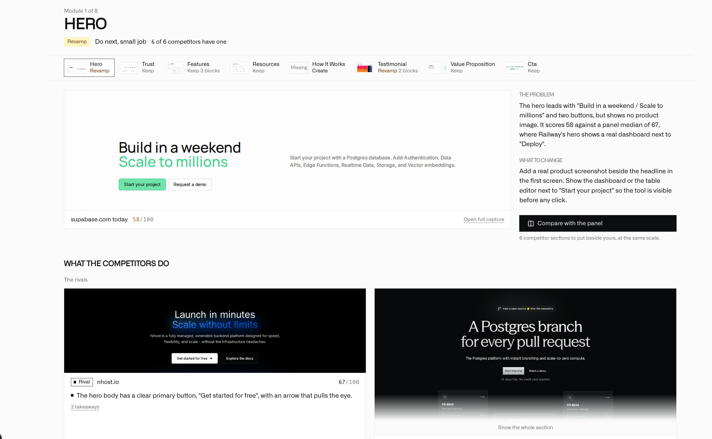
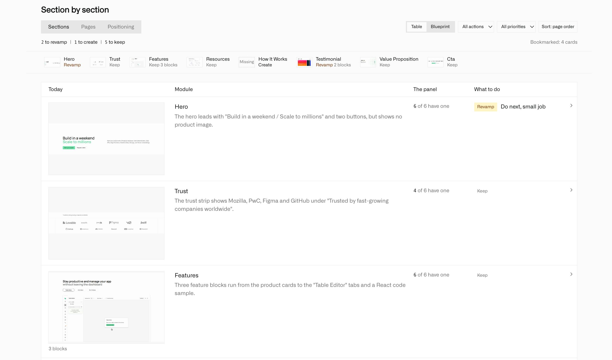
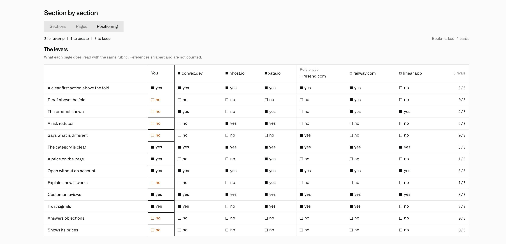

### 🎬 관련 영상
- [🎥 영상 보기](https://ph-files.imgix.net/49a3612d-9375-40cc-a31a-01b324711f9b.jpeg?auto=format)

---

## 30. [systemscheck.dev](https://www.producthunt.com/products/systemscheck-dev)
**Votes**: 10 | **도입 난이도**: 하 | **신뢰도**: 상
**Tagline**: A sci-fi systems check for your programming brain
**서비스 링크**: https://www.producthunt.com/r/TIZVHEDEWCGIJI

**태그**: Game, Programming, Puzzle, Education, AI Tool, DevTool

### 📌 이 서비스 한눈에 보기
SF 세계관 속에서 코딩으로 문제를 해결하는 엔지니어링 퍼즐 게임

### 🔑 주요 기능
- 우주선 오리온호를 배경으로 한 몰입감 있는 SF 테마
- 직접 코드를 작성하여 문제를 해결하는 실전형 퍼즐 방식
- 지속적으로 업데이트되는 퍼즐 코퍼스(Corpus)

### 🙋 사용자에게 어떤 점이 좋은가
프로그래밍 실력을 재미있게 테스트하고, 퍼즐 해결을 통해 논리적 사고와 코딩 능력을 키울 수 있습니다.

### ✅ 지금 바로 써볼 기능
- SF 테마의 퍼즐 시나리오 경험하기
- 직접 코드를 작성하여 문제 해결해보기
- 새롭게 추가되는 퍼즐 도전하기

### ⚠️ 사용 전 확인할 점
- 게임 플레이 방식이 코딩 실력에 의존하므로 초보자에게는 난이도가 높을 수 있음
- 정해진 정답보다는 문제 해결 과정 자체에 초점이 맞춰져 있음

### 🧭 확인이 더 필요한 정보
지원하는 프로그래밍 언어의 종류와 구체적인 난이도 체계는 명시되지 않았습니다.

### 📸 스크린샷 및 갤러리
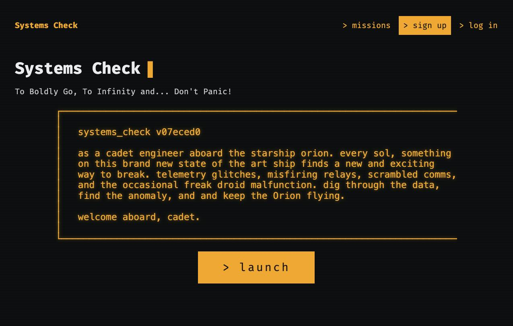
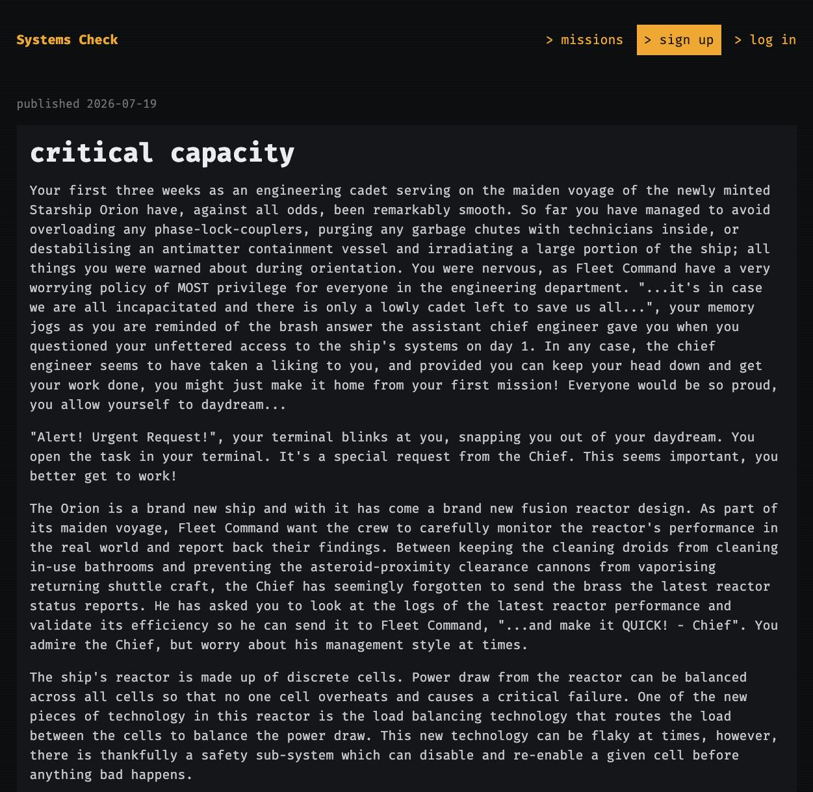

### 🎬 관련 영상
- [🎥 영상 보기](https://ph-files.imgix.net/0c889e34-22b6-49eb-bf22-b2c1b9df502e.jpeg?auto=format)

---

