# 🚀 Product Hunt Daily Top 30 (2026-09-12)

## 오늘의 요약
오늘의 트렌드는 AI 에이전트가 단순한 보조를 넘어 데이터 추출, 코딩, 광고 집행 등 전문적인 워크플로우를 자율적으로 수행하는 방향으로 진화하고 있음을 보여줍니다. 특히 음성 인터페이스와 자동화 기술이 결합되어 사용자의 개입을 최소화하면서도 결과물을 즉시 생성하는 '실행 중심'의 도구들이 주목받았습니다.

### 오늘의 핵심 포인트
- 자연어 대화와 음성 명령만으로 데이터 리스트 생성, 소프트웨어 개발, 문서 작성이 가능한 에이전트 도구들이 등장했습니다.
- AI가 생성한 코드의 품질을 검증하거나 검증된 광고를 복제하는 등, AI 결과물의 신뢰성과 효율성을 높이는 솔루션이 강조되었습니다.
- 특정 플랫폼에 종속되지 않고 다양한 모델을 자유롭게 활용하거나, 별도 가입 없이 즉시 결과물을 만드는 등 사용자 편의성이 극대화된 도구들이 주목받았습니다.

**오늘의 태그**: AI 에이전트, 업무 자동화, 생산성 도구, 음성 인터페이스, AI 코딩

## 1. [Anysite.io](https://www.producthunt.com/products/anysite)
**Votes**: 368 | **도입 난이도**: 하 | **신뢰도**: 상
**Tagline**: Build and enrich B2B lists by chatting to your agent
**서비스 링크**: https://www.producthunt.com/r/LWEA45Q3YRJ7ZK

**태그**: B2B, AI-Agent, Automation, Data-Enrichment, Sales-Tech, Agent, AI Tool, Chat, DevTool, API, Email

### 📌 이 서비스 한눈에 보기
AI 에이전트와 대화하며 즉시 B2B 리스트를 생성하는 데이터 레이어

### 🔑 주요 기능
- 자연어 채팅을 통한 간편한 B2B 데이터 추출 및 리스트 빌딩
- MCP 및 REST API를 지원하여 Claude, Cursor 등 기존 AI 에이전트와 연동
- 쿼리 작성이나 스크래퍼 유지보수 없이 즉각적인 아웃바운드 데이터 확보 가능

### 🙋 사용자에게 어떤 점이 좋은가
복잡한 데이터 쿼리나 스크래핑 작업 없이, 평소 사용하는 AI 에이전트 안에서 대화만으로 타겟 기업 및 담당자 정보를 즉시 얻을 수 있습니다.

### ✅ 지금 바로 써볼 기능
- 사용 중인 AI 에이전트(Claude, Cursor 등)에 API/MCP 연결하기
- 특정 산업군, 지역, 규모별 기업 리스트 요청해보기
- 추출된 담당자 이메일 및 직함 데이터 검증하기

### ⚠️ 사용 전 확인할 점
- 데이터의 최신성 및 정확도에 대한 직접적인 검증 필요
- 에이전트 환경에 따른 연동 설정 방식의 차이 확인 필요

### 🧭 확인이 더 필요한 정보
제공되는 B2B 데이터의 소스 및 데이터 업데이트 주기에 대한 상세 정보가 명시되지 않았습니다.

### 📸 스크린샷 및 갤러리
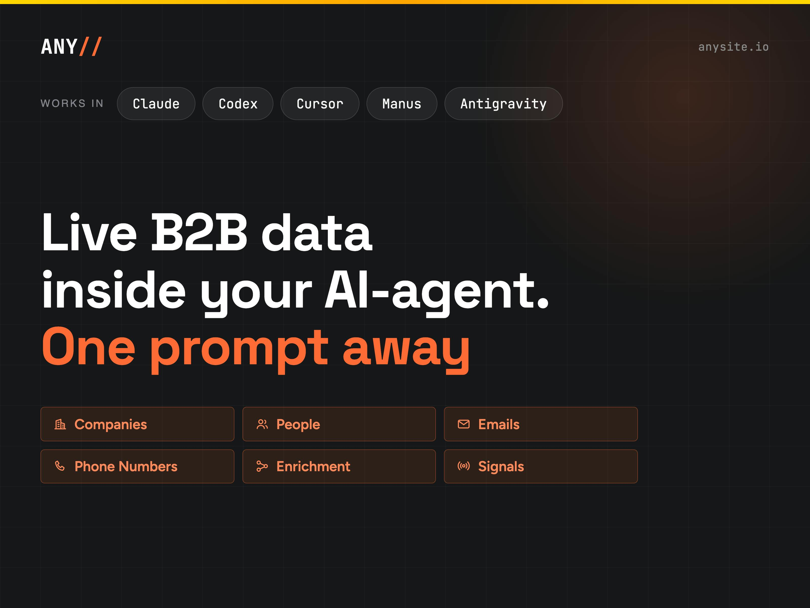
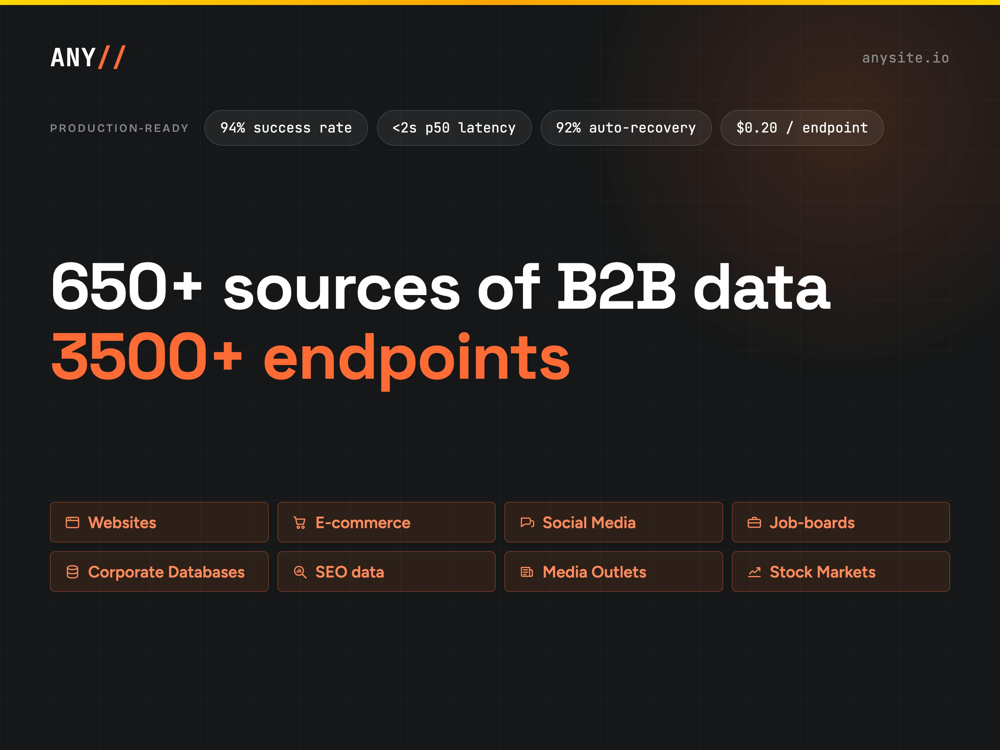
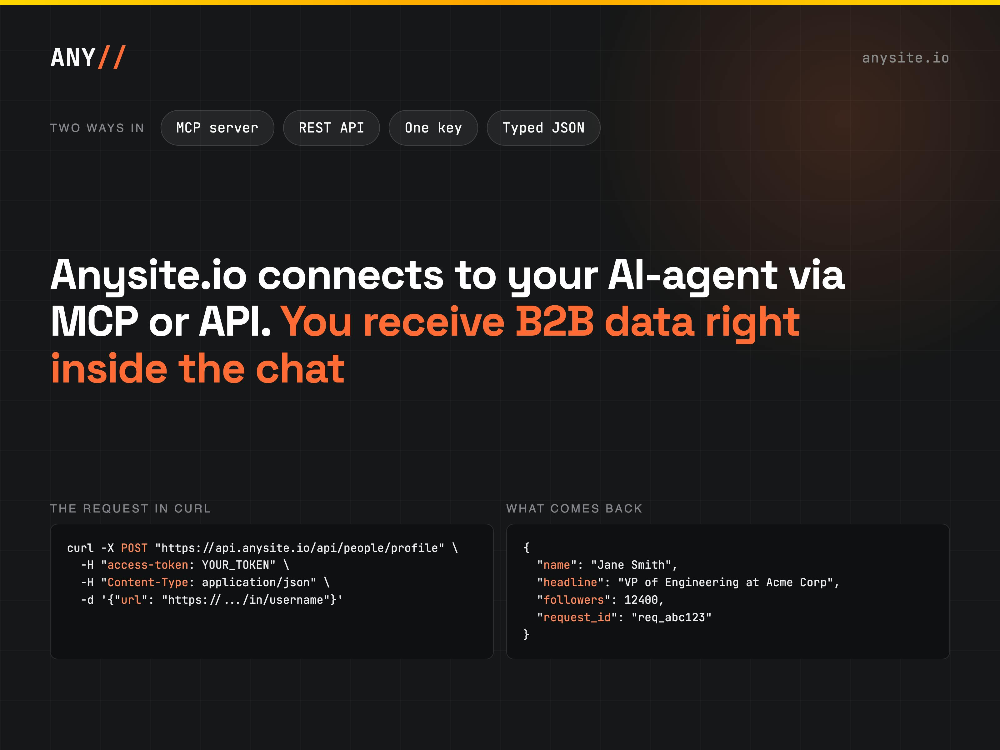

---

## 2. [Loqua](https://www.producthunt.com/products/loqua)
**Votes**: 322 | **도입 난이도**: 하 | **신뢰도**: 상
**Tagline**: Speak naturally and move from thoughts to being done
**서비스 링크**: https://www.producthunt.com/r/TI22A4U5XM3DVC

**태그**: Productivity, AI, Voice-to-Text, Automation, Workflow

### 📌 이 서비스 한눈에 보기
키보드 타이핑의 제약 없이 음성만으로 아이디어를 완성하고 업무 흐름을 유지하는 AI 생산성 도구

### 🔑 주요 기능
- 자연스러운 음성 입력을 통한 초안 작성 및 글쓰기
- 화면 내용 이해 및 텍text-to-speech 기능을 통한 정보 소비
- 번역, 재작성, 스케줄링, 코딩 워크플로우 등 다양한 작업 수행

### 🙋 사용자에게 어떤 점이 좋은가
타이핑 속도에 갇히지 않고 말하는 대로 작업이 진행되어, 아이디어 구상부터 실행까지의 맥락 전환을 최소화하고 몰입 시간을 늘려줍니다.

### ✅ 지금 바로 써볼 기능
- 생각나는 아이디어를 말로 내뱉어 초안 만들기
- 읽기 힘든 긴 문서를 음성으로 듣기
- 음성 명령을 통한 워크플로우 자동화 시도하기

### ⚠️ 사용 전 확인할 점
- 음성 인식의 정확도에 따라 결과물의 품질이 달라질 수 있음
- 개인정보나 보안이 중요한 작업 시 음성 데이터 처리 방식 확인 필요

### 🧭 확인이 더 필요한 정보
구체적인 지원 언어 범위와 보안/개인정보 보호 정책에 대한 상세 정보가 필요합니다.

### 📸 스크린샷 및 갤러리

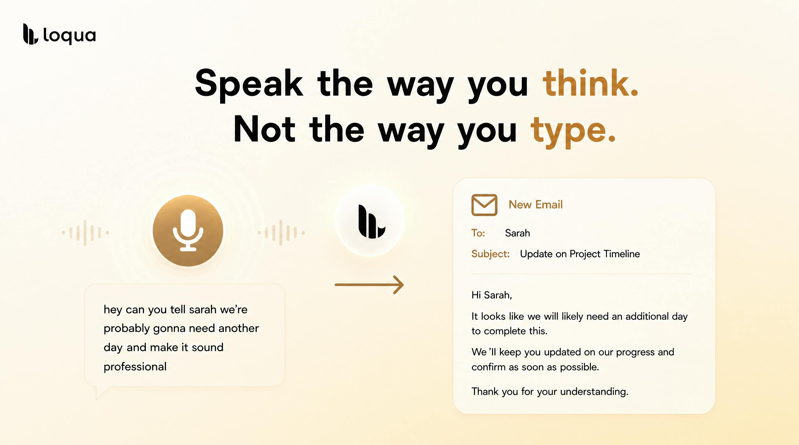
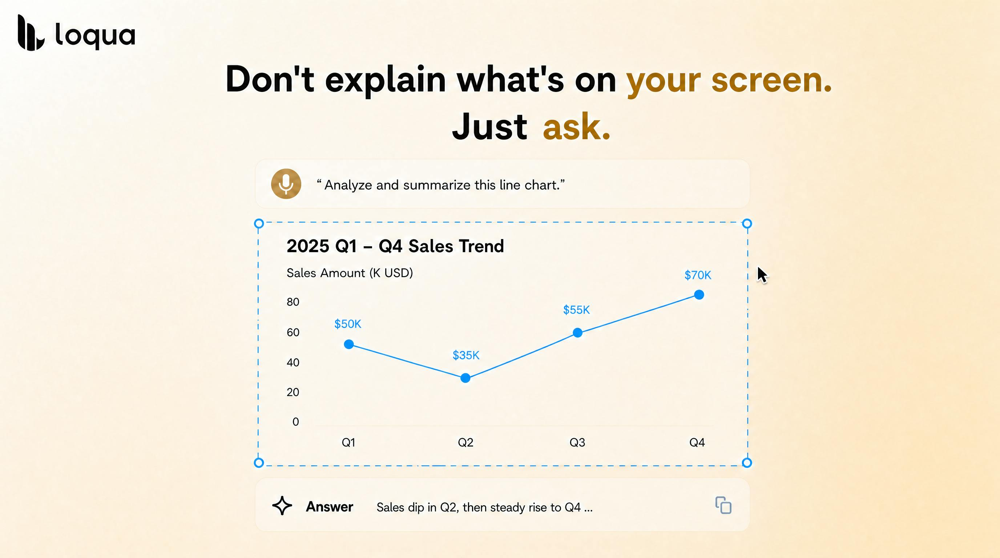

### 🎬 관련 영상
- [🎥 영상 보기](https://ph-files.imgix.net/0266ae5c-5504-4f2e-a7b2-309b2cf3384b.jpeg?auto=format)

---

## 3. [Raycast 2.0](https://www.producthunt.com/products/raycast)
**Votes**: 260 | **도입 난이도**: 하 | **신뢰도**: 상
**Tagline**: The next generation of Raycast is here
**서비스 링크**: https://www.producthunt.com/r/MLZTWKGQKD6OHY

**태그**: Productivity, AI, Automation, Workflow, AI Tool, Chat, Design

### 📌 이 서비스 한눈에 보기
AI와 자동화 기능이 결합되어 업무 생산성을 극대화하는 차세대 런처

### 🔑 주요 기능
- 새로운 기반 위에서 완전히 재설계된 사용자 경험
- 개인용 AI(ChatGPT, Claude) 계정 연결을 통한 맞춤형 AI 작업 수행
- 반복 작업을 위한 자동화 및 프로젝트 관리 기능 통합

### 🙋 사용자에게 어떤 점이 좋은가
기존의 단순 실행 도구를 넘어, AI와 자동화 기능을 통해 앱 간 작업을 연결하고 워크플로우를 하나로 통합할 수 있습니다.

### ✅ 지금 바로 써볼 기능
- 개인 AI 계정(ChatGPT/Claude) 연결하기
- 반복 업무를 위한 자동화 설정하기
- 프로젝트 기능을 활용한 작업 그룹화하기

### ⚠️ 사용 전 확인할 점
- 개인 AI 계정 연결 시 보안 및 데이터 프라이버시 정책 확인 필요
- 기존 확장 프로그램 및 설정의 호환성 확인 필요

### 🧭 확인이 더 필요한 정보
새로운 기반으로 재설계됨에 따라 기존 버전과의 데이터 마이그레이션 방식에 대한 상세 정보가 필요합니다.

### 📸 스크린샷 및 갤러리
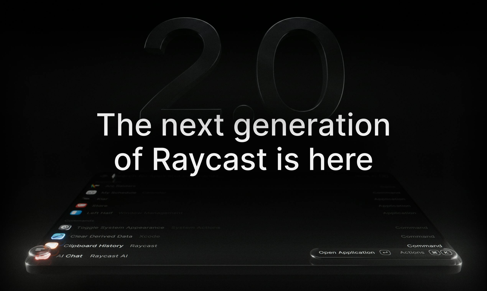
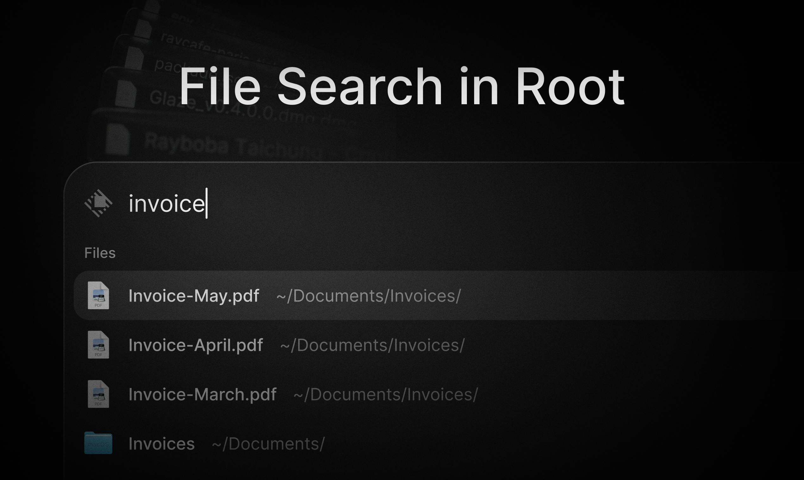
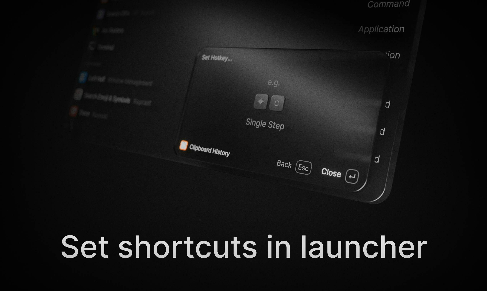

### 🎬 관련 영상
- [🎥 영상 보기](https://ph-files.imgix.net/e75e704a-0bde-475b-804a-7f793163ea64.jpeg?auto=format)

---

## 4. [Wisry ](https://www.producthunt.com/products/wisry)
**Votes**: 241 | **도입 난이도**: 중 | **신뢰도**: 상
**Tagline**: Clone the ads already winning in your market, at scale
**서비스 링크**: https://www.producthunt.com/r/T5YGJQXMEGFQV4

**태그**: Marketing Automation, AI Agents, AdTech, Growth Hacking, Agent, AI Tool, Video

### 📌 이 서비스 한눈에 보기
시장 내 검증된 광고를 분석하여 브랜드 맞춤형 광고로 자동 복제 및 집행하는 AI 에이전트

### 🔑 주요 기능
- Meta 및 TikTok 광고 라이브러리에서 성공적인 광고 데이터 스캔
- 성공적인 광고를 브랜드 스타일의 이미지 및 영상 광고로 자동 복제
- Meta와 Google 광고 플랫폼에 ROAS 최적화 기반 자동 런칭

### 🙋 사용자에게 어떤 점이 좋은가
광고 기획과 제작에 드는 시행착오를 줄이고, 이미 시장에서 검증된 형식을 활용해 광고 효율을 극대화할 수 있습니다.

### ✅ 지금 바로 써볼 기능
- 경쟁사 광고 라이브러리 스캔 기능 실행
- 스캔된 광고의 브랜드 맞춤형 복제 기능 테스트
- 자동화된 광고 집행 및 ROAS 최적화 설정

### ⚠️ 사용 전 확인할 점
- 복제된 광고가 브랜드 고유의 정체성과 충돌할 가능성
- 플랫폼별 광고 정책 준수 여부 확인 필요

### 🧭 확인이 더 필요한 정보
AI가 생성하는 영상 및 이미지의 퀄리티와 브랜드 가이드라인 준수 수준을 확인해야 합니다.

### 📸 스크린샷 및 갤러리
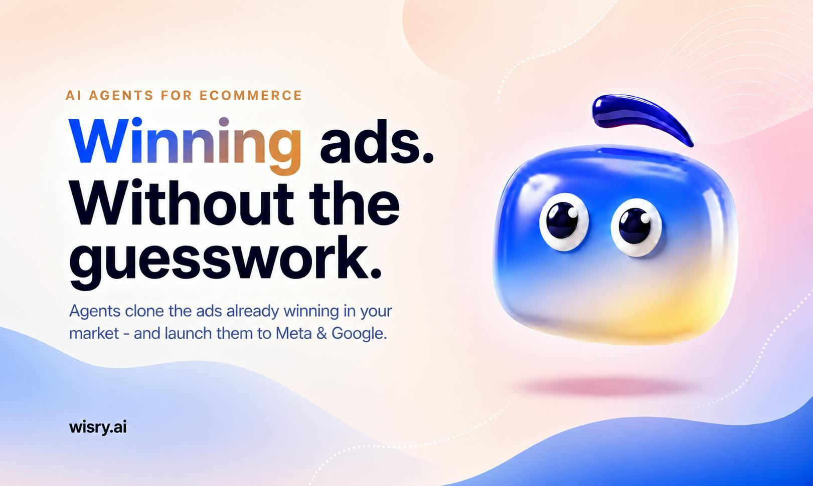
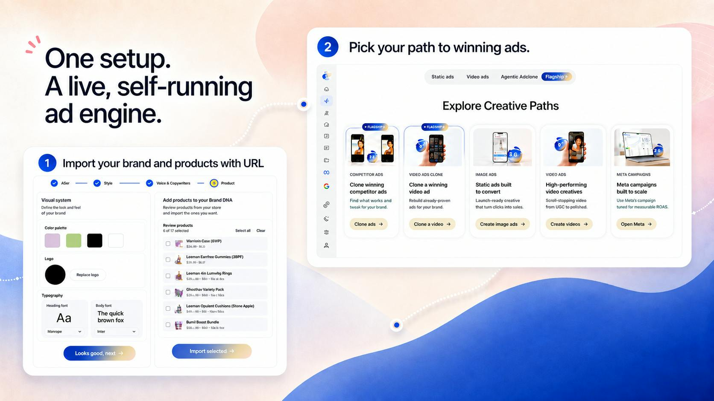
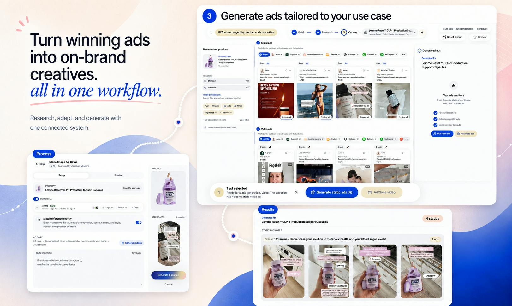

### 🎬 관련 영상
- [🎥 영상 보기](https://ph-files.imgix.net/af18fa0a-bf8b-4ae7-a31f-b1fc2eb9e43f.jpeg?auto=format)

---

## 5. [Cline Desktop App](https://www.producthunt.com/products/cline-4)
**Votes**: 195 | **도입 난이도**: 중 | **신뢰도**: 상
**Tagline**: An open-source app for open-weight models
**서비스 링크**: https://www.producthunt.com/r/LTNZETAC7HBN7K

**태그**: DevTool, AI-Agent, OpenSource, Automation, Agent

### 📌 이 서비스 한눈에 보기
특정 생태계에 종속되지 않고 원하는 오픈 웨이트 모델을 자유롭게 활용할 수 있는 오픈소스 에이전트 워크스페이스

### 🔑 주요 기능
- 다양한 오픈 웨이트 모델 및 제공업체 선택 가능
- 멀티 에이전트 세션 실행 및 반복 작업 자동화 지원
- Cline 마켓플레이스를 통한 기능 확장 및 Claude Code/Codex 작업 연계

### 🙋 사용자에게 어떤 점이 좋은가
사용자가 선호하는 모델을 자유롭게 교체하며 작업할 수 있고, 폐쇄적인 생태계에서 벗어나 에이전트 기반의 자동화 워크플로우를 구축할 수 있습니다.

### ✅ 지금 바로 써볼 기능
- 선호하는 오픈 웨이트 모델 연결하기
- 마켓플레이스에서 필요한 에이전트 기능 탐색하기
- 반복적인 작업에 대한 자동화 세션 설정하기

### ⚠️ 사용 전 확인할 점
- 사용자가 직접 모델과 제공업체를 선택해야 하므로 초기 설정 역량이 필요할 수 있음
- 로컬 또는 외부 모델 연결 방식에 따른 보안 및 리소스 관리 필요

### 🧭 확인이 더 필요한 정보
사용자가 선택하는 모델과 하드웨어 사양에 따라 성능 및 안정성이 달라질 수 있습니다.

### 📸 스크린샷 및 갤러리
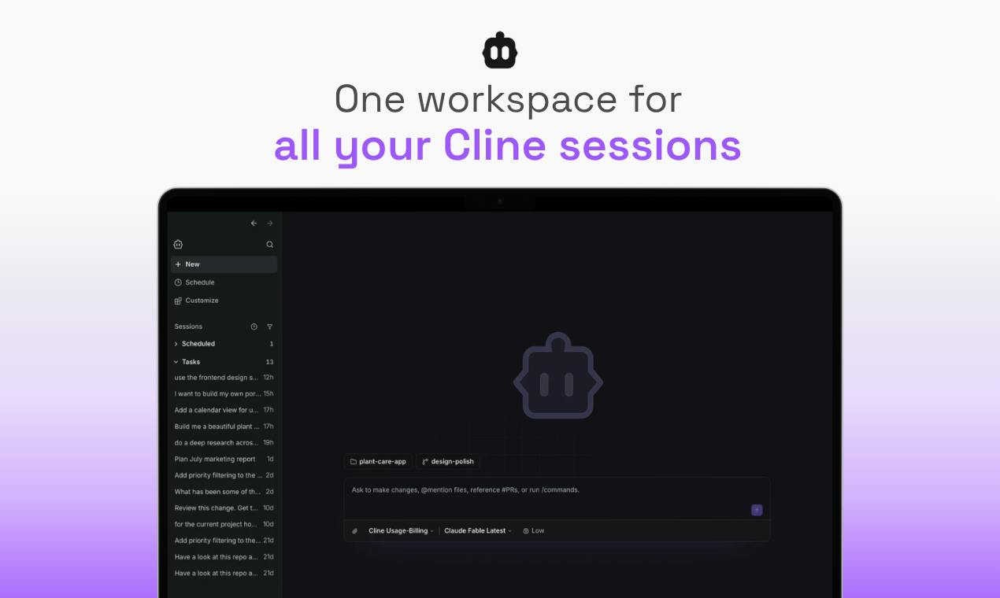
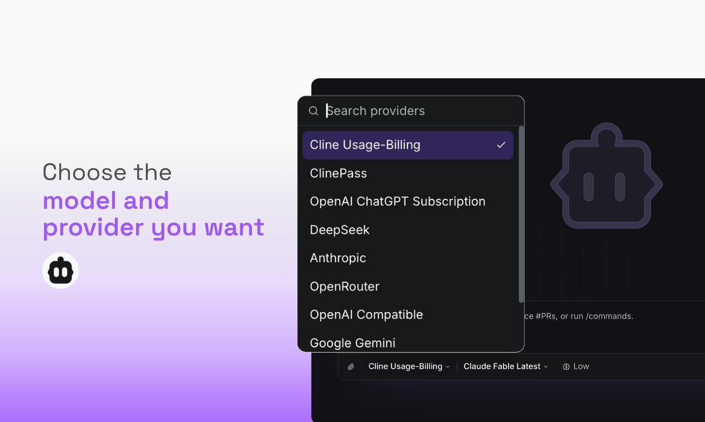
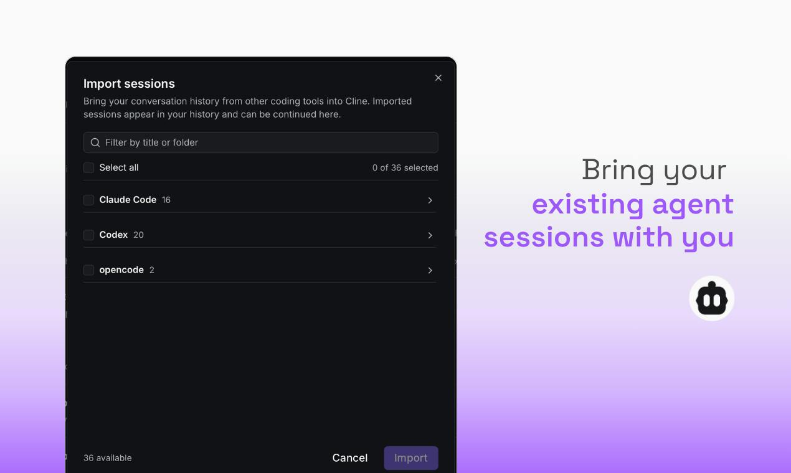

### 🎬 관련 영상
- [🎥 영상 보기](https://ph-files.imgix.net/e9f2889f-30ce-46ad-9987-1be2b799371f.jpeg?auto=format)

---

## 6. [easyspecs.ai](https://www.producthunt.com/products/easyspecs-ai)
**Votes**: 139 | **도입 난이도**: 중 | **신뢰도**: 상
**Tagline**: The spec review platform
**서비스 링크**: https://www.producthunt.com/r/HI6RJ5V5HIW3SN

**태그**: DevTool, AI-Agent, Documentation, QA, Agent, AI Tool

### 📌 이 서비스 한눈에 보기
AI 에이전트가 생성한 코드를 신뢰할 수 있는 명세서로 변환하여 검토 프로세스를 자동화하는 플랫폼

### 🔑 주요 기능
- 문서화되지 않은 코드베이스를 신뢰할 수 있는 사양(spec)으로 변환
- AI 에이전트의 코드 생성 속도와 인간의 검토 역량 사이의 간극 해소
- 오라클 및 루브릭을 포함한 명세 검토를 통해 코드 품질 검증

### 🙋 사용자에게 어떤 점이 좋은가
AI가 생성한 방대한 코드를 일일이 확인하는 대신, 생성된 명세를 검토함으로써 개발 속도와 신뢰도를 동시에 높일 수 있습니다.

### ✅ 지금 바로 써볼 기능
- 기존 코드베이스를 업로드하여 문서화 기능 테스트
- 생성된 명세가 실제 코드와 일치하는지 검증
- AI 에이전트 워크플로우에 명세 검토 단계 통합

### ⚠️ 사용 전 확인할 점
- 기존 코드베이스의 복잡도에 따른 문서화 정확도 차이
- 생성된 명세가 실제 비즈니스 로직을 완벽히 반영하는지 확인 필요

### 🧭 확인이 더 필요한 정보
현재 제공되는 문서화 기능의 상세 범위와 기존 CI/CD 파이프라인과의 구체적인 통합 방식에 대한 정보가 부족합니다.

### 📸 스크린샷 및 갤러리
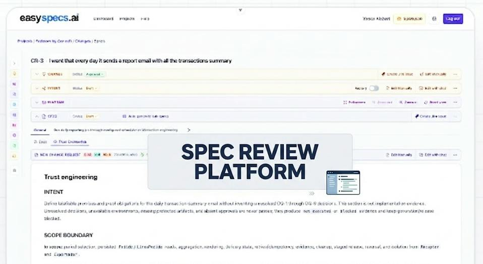
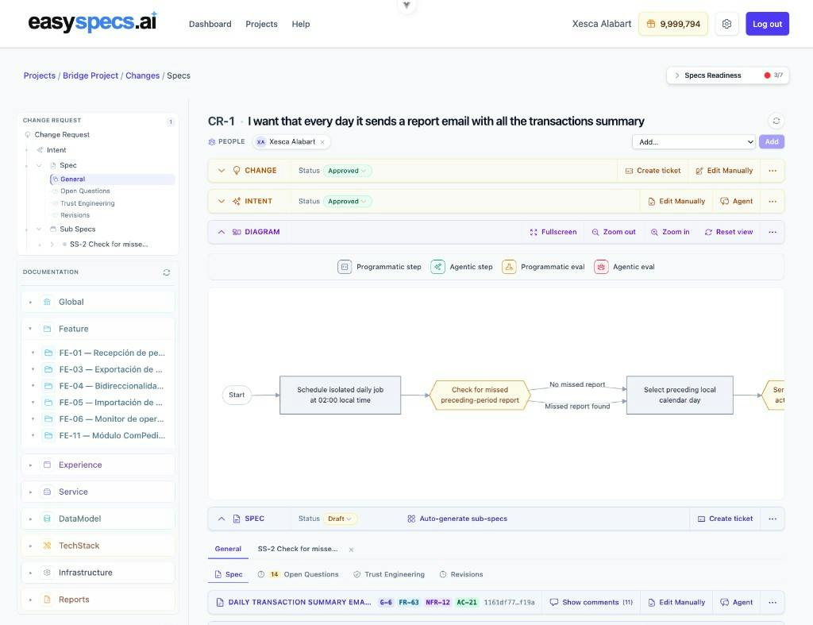
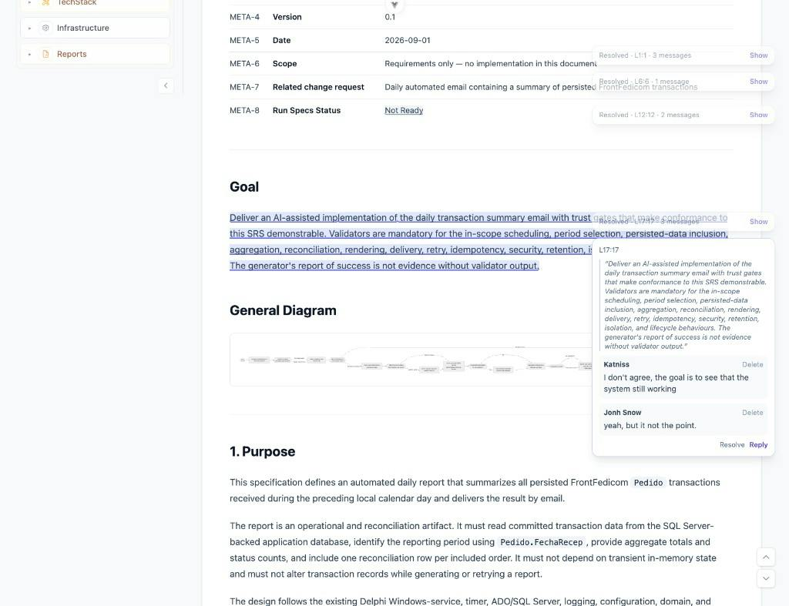

### 🎬 관련 영상
- [🎥 영상 보기](https://ph-files.imgix.net/3998e6f3-8fe7-4603-8c80-af6dd4a3a90e.jpeg?auto=format)

---

## 7. [Sliick](https://www.producthunt.com/products/sliick)
**Votes**: 125 | **도입 난이도**: 하 | **신뢰도**: 상
**Tagline**: Free 3D mockups for your screenshots and videos
**서비스 링크**: https://www.producthunt.com/r/Q27DUUEE6RDDU4

**태그**: DesignTool, Productivity, Freebie, Marketing, Video, Vision

### 📌 이 서비스 한눈에 보기
계정 없이 브라우저에서 즉시 만드는 무료 3D 디바이스 목업 제작 도구

### 🔑 주요 기능
- 스크린샷과 영상을 아름다운 3D 디바이스 목업으로 변환
- 계정 생성이나 워터마크 없이 무료로 이미지 및 영상 내보내기 가능
- 브라우저 기반의 간편한 편집(장면, 색상, 카메라, 모션 조절)

### 🙋 사용자에게 어떤 점이 좋은가
별도의 설치나 가입 없이도 고품질의 홍보용 목업 콘텐츠를 즉시 제작할 수 있어 작업 시간을 단축해 줍니다.

### ✅ 지금 바로 써볼 기능
- 원하는 장면(Scene) 선택하기
- 디바이스 모양과 색상 커스텀하기
- 카메라 각도 및 모션 조절 후 결과물 내보내기

### ⚠️ 사용 전 확인할 점
- 브라우저 기반이므로 고해상도 영상 작업 시 하드웨어 성능에 영향을 받을 수 있음
- 로컬 기기 저장 방식이므로 브라우저 캐시 삭제 시 작업 내용이 사라질 수 있음

### 🧭 확인이 더 필요한 정보
상세한 내보내기 해상도 제한이나 고급 편집 기능의 유무는 명시되어 있지 않습니다.

### 📸 스크린샷 및 갤러리
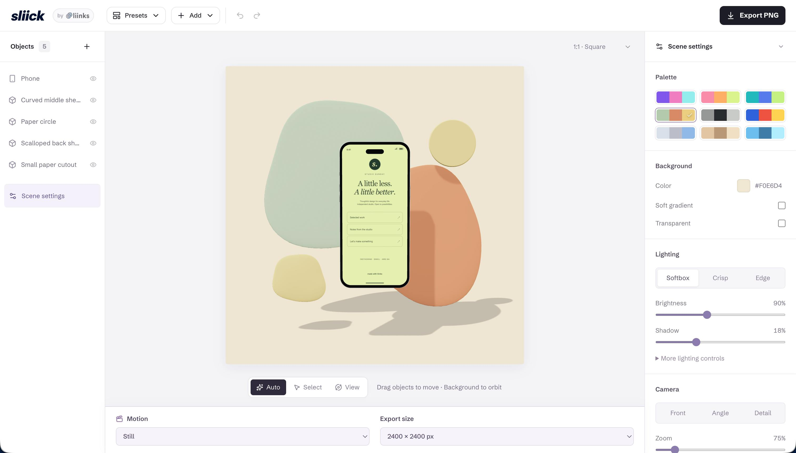
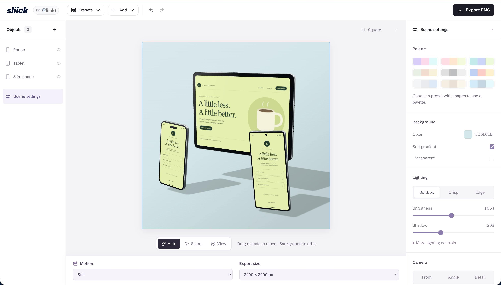

### 🎬 관련 영상
- [🎥 영상 보기](https://ph-files.imgix.net/aee231ff-aca2-41d3-995a-535fe7729215.jpeg?auto=format)

---

## 8. [Devin Voice](https://www.producthunt.com/products/devin-voice)
**Votes**: 112 | **도입 난이도**: 중 | **신뢰도**: 상
**Tagline**: You say it, Devin ships it
**서비스 링크**: https://www.producthunt.com/r/4RQP6CHF5CGKTB

**태그**: AI-Engineer, Voice-Interface, Automation, DevOps, AI Tool, DevTool

### 📌 이 서비스 한눈에 보기
음성 명령만으로 소프트웨어 개발을 자동화하는 AI 엔지니어링 도구

### 🔑 주요 기능
- 음성 인터페이스를 통한 자연스러운 작업 지시
- Cognition의 SWE-2 코딩 모델 기반의 강력한 개발 능력
- 말 한마디로 계획, 코딩, 배포까지 이어지는 엔드투엔드 워크플로우

### 🙋 사용자에게 어떤 점이 좋은가
복잡한 타이핑 대신 말로 개발 작업을 지시하여 아이디어를 즉시 코드로 구현하고 배포할 수 있습니다.

### ✅ 지금 바로 써볼 기능
- 음성 명령으로 간단한 기능 구현 요청하기
- SWE-2 모델의 코드 생성 품질 테스트하기
- GPT-Live를 통한 대화형 디버깅 시도하기

### ⚠️ 사용 전 확인할 점
- 음성 인식 오류로 인한 의도치 않은 코드 생성 가능성
- 복잡한 프로젝트의 경우 음성만으로 전체 구조를 제어하는 데 한계가 있을 수 있음

### 🧭 확인이 더 필요한 정보
음성 명령의 정확도와 복잡한 프로젝트에 대한 자동 배포 안정성에 대한 구체적인 데이터가 필요합니다.

### 📸 스크린샷 및 갤러리

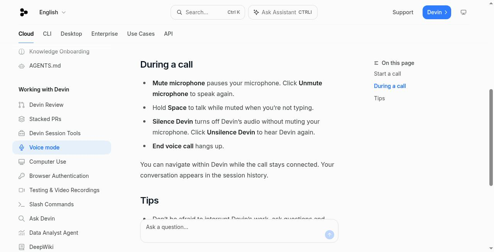
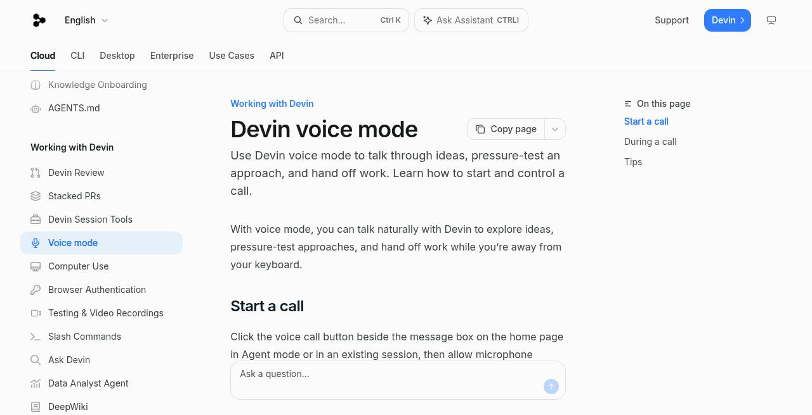

---

## 9. [Moji](https://www.producthunt.com/products/moji-2)
**Votes**: 96 | **도입 난이도**: 하 | **신뢰도**: 상
**Tagline**: Open Markdown files like PDFs.
**서비스 링크**: https://www.producthunt.com/r/IARQKQK776V4WE

**태그**: Productivity, Markdown, Writing, Cross-Platform, AI Tool

### 📌 이 서비스 한눈에 보기
PDF처럼 빠르고 깔끔하게 마크다운 문서를 읽고 편집하는 경량 뷰어/에디터

### 🔑 주요 기능
- Windows, macOS, Linux를 지원하는 크로스 플랫폼 경량 도구
- 실시간 미리보기 및 Mermaid 다이어그램 지원
- PDF, HTML, PNG 형식의 간편한 내보내기 기능

### 🙋 사용자에게 어떤 점이 좋은가
복잡한 기능 대신 문서 읽기와 편집 본연의 기능에 집중하여, 깔끔한 작업 환경을 원하는 사용자에게 유용합니다.

### ✅ 지금 바로 써볼 기능
- 실시간 미리보기 기능으로 문서 가독성 확인하기
- Mermaid 다이어그램 작성 및 렌더링 테스트하기
- 작성한 문서를 PDF나 HTML로 내보내기 해보기

### ⚠️ 사용 전 확인할 점
- 경량 도구이므로 대규모 프로젝트 관리용으로는 기능이 부족할 수 있음
- 복잡한 워크플로우보다는 단순 문서 열람 및 편집에 최적화됨

### 🧭 확인이 더 필요한 정보
상세한 클라우드 동기화 기능이나 협업 기능 포함 여부는 명시되지 않았습니다.

### 📸 스크린샷 및 갤러리
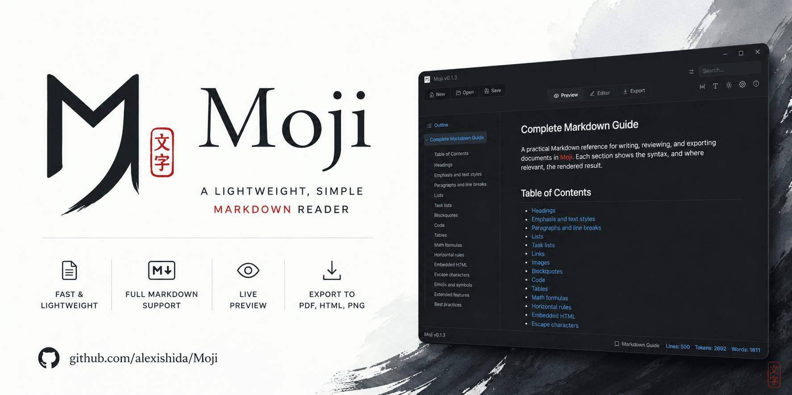
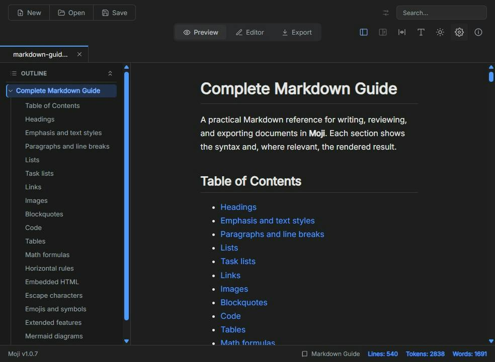
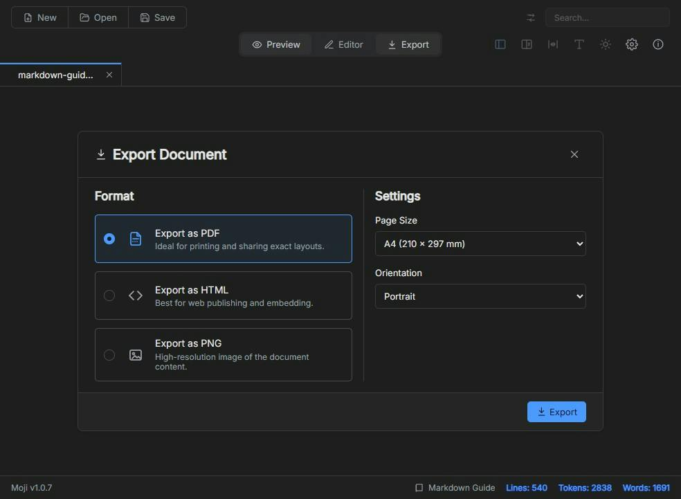

---

## 10. [ChatHop](https://www.producthunt.com/products/chathop)
**Votes**: 95 | **도입 난이도**: 하 | **신뢰도**: 상
**Tagline**: Take your conversation anywhere.
**서비스 링크**: https://www.producthunt.com/r/DGVVESZHKMLLGQ

**태그**: AI, Productivity, Workflow, AI Tool, Chat

### 📌 이 서비스 한눈에 보기
대화 맥락을 유지하며 AI 어시스턴트 간에 대화를 자유롭게 이동하는 도구

### 🔑 주요 기능
- 대화 도중 다른 AI 어시스턴트로 맥락을 포함하여 이동 가능
- 전체 채팅 내용을 Plain Text 또는 Markdown 형식으로 복사 지원
- 매월 20회의 무료 사용량 제공

### 🙋 사용자에게 어떤 점이 좋은가
특정 AI 모델에 종속되지 않고 대화 흐름을 유지하며 여러 AI를 교차 사용할 수 있어 작업의 연속성이 높아집니다.

### ✅ 지금 바로 써볼 기능
- 현재 진행 중인 대화를 다른 AI로 옮겨보기
- Markdown 형식으로 대화 내용 내보내기
- 매월 제공되는 20회 무료 사용량 테스트하기

### ⚠️ 사용 전 확인할 점
- 무료 사용량(월 20회) 초과 시 서비스 이용 제한 가능성
- 대화 이동 시 데이터 보안 및 개인정보 처리 방식 확인 필요

### 🧭 확인이 더 필요한 정보
무료 사용량 초과 시 유료 플랜의 가격 정책과 기능 차이가 명시되지 않았습니다.

### 📸 스크린샷 및 갤러리

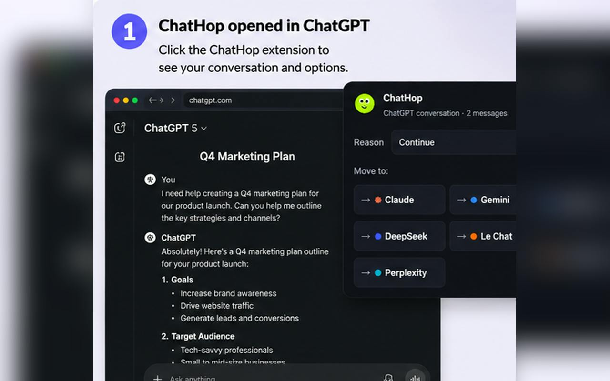
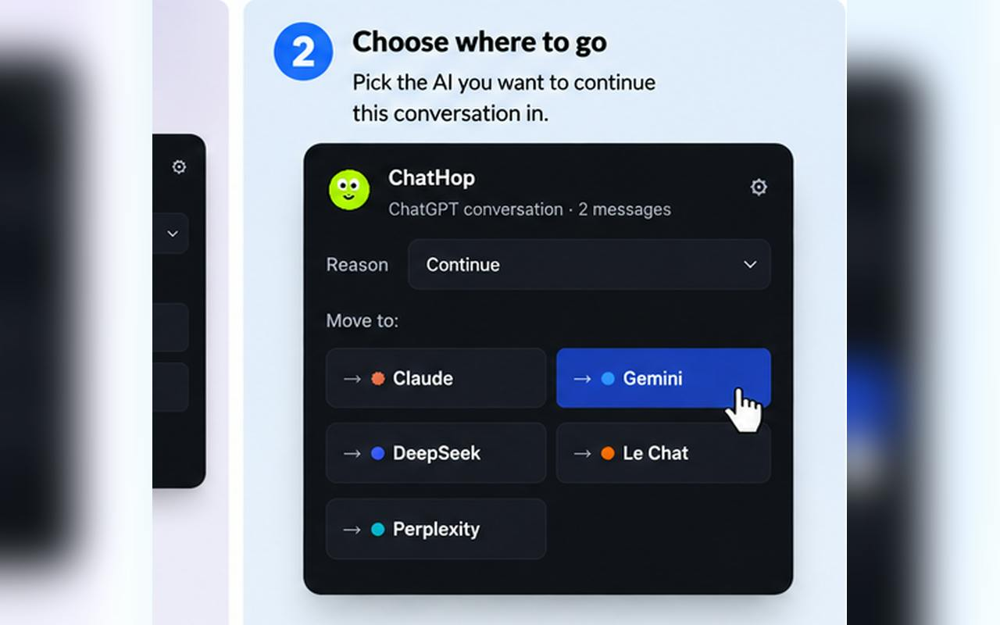

---

## 11. [sizeless](https://www.producthunt.com/products/sizeless)
**Votes**: 91 | **도입 난이도**: 하 | **신뢰도**: 상
**Tagline**: Spatial AI for underground infrastructure
**서비스 링크**: https://www.producthunt.com/r/7FDNA34TLBFPN5

**태그**: Spatial AI, Construction, Automation, BIM, 3D Modeling, AI Tool, Video

### 📌 이 서비스 한눈에 보기
스마트폰 영상만으로 지하 인프라의 3D 모델 및 설계 도면을 자동 생성하는 공간 AI 솔루션

### 🔑 주요 기능
- 스마트폰 촬영 영상 기반의 3D 모델링 및 CAD/BIM 도면 생성
- 측량 전문가 없이 현장 작업자가 직접 수행 가능한 워크플로우
- 수개월이 걸리던 문서화 및 물량 산출 작업을 몇 시간 단위로 단축

### 🙋 사용자에게 어떤 점이 좋은가
현장 작업자가 직접 찍은 영상만으로 법적 필수 문서와 설계도를 얻을 수 있어, 비용 절감과 작업 속도를 획기적으로 높여줍니다.

### ✅ 지금 바로 써볼 기능
- 현장 개착 구간(open trench) 영상 촬영 테스트
- 생성된 3D 모델과 CAD/BIM 데이터의 정밀도 확인
- 기존 물량 산출 방식과의 시간/비용 비교

### ⚠️ 사용 전 확인할 점
- 스마트폰 카메라 성능 및 촬영 환경에 따른 모델 정확도 차이 가능성
- 복잡한 지형이나 장애물이 있는 환경에서의 데이터 품질 확인 필요

### 🧭 확인이 더 필요한 정보
영상 데이터의 정밀도가 전문 측량 장비의 법적 허가 기준을 충족하는지 확인이 필요합니다.

### 📸 스크린샷 및 갤러리
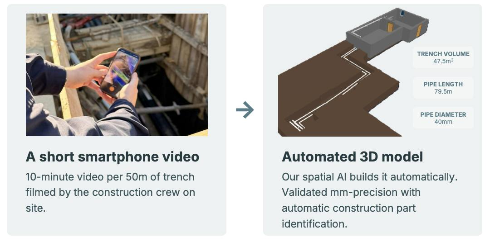

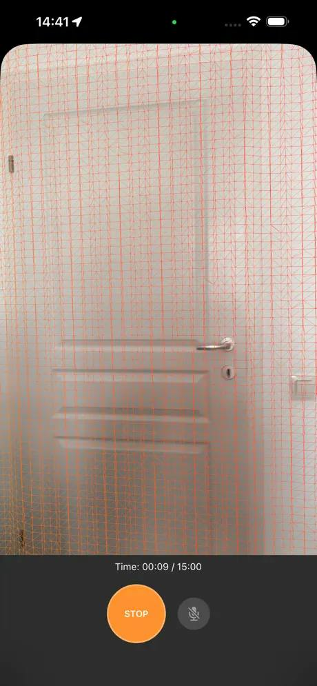

---

## 12. [chat-recall](https://www.producthunt.com/products/chat-recall)
**Votes**: 91 | **도입 난이도**: 하 | **신뢰도**: 상
**Tagline**: Ctrl+F for every conversation you've had with an AI
**서비스 링크**: https://www.producthunt.com/r/YNWVM3VBLFBGJU

**태그**: DevTool, Productivity, Security, AI, AI Tool, Chat

### 📌 이 서비스 한눈에 보기
여러 AI 도구에 흩어진 대화 기록을 하나로 통합하여 검색할 수 있는 통합 히스토리 관리 도구

### 🔑 주요 기능
- Claude Code, Cursor 등 서로 다른 AI 도구의 대화 기록을 하나의 검색 가능한 히스토리로 통합
- 로컬 환경에서 작동하여 비밀번호 등 민감 정보 유출 방지
- 과거 결정 사항을 쉽게 찾아 질문 반복을 줄이고, 유출된 API 키 등을 식별

### 🙋 사용자에게 어떤 점이 좋은가
여러 AI 도구를 교차 사용하는 개발자나 팀이 과거의 작업 맥락을 즉시 검색하여 업무 연속성을 확보할 수 있습니다.

### ✅ 지금 바로 써볼 기능
- 기존 AI 도구들의 대화 기록 통합 기능 실행
- 과거 대화 중 유출된 보안 키(API keys) 식별 및 관리
- 검색 기능을 통한 과거 결정 사항 확인

### ⚠️ 사용 전 확인할 점
- 로컬 실행 방식이므로 각 AI 도구의 데이터 포맷 변경 시 호환성 확인 필요
- 데이터 통합 과정에서의 로컬 리소스 사용량 확인 필요

### 🧭 확인이 더 필요한 정보
각 AI 도구(Claude Code, Cursor 등)의 데이터 포맷 변경에 따른 자동 업데이트 지원 여부가 불분명합니다.

### 📸 스크린샷 및 갤러리
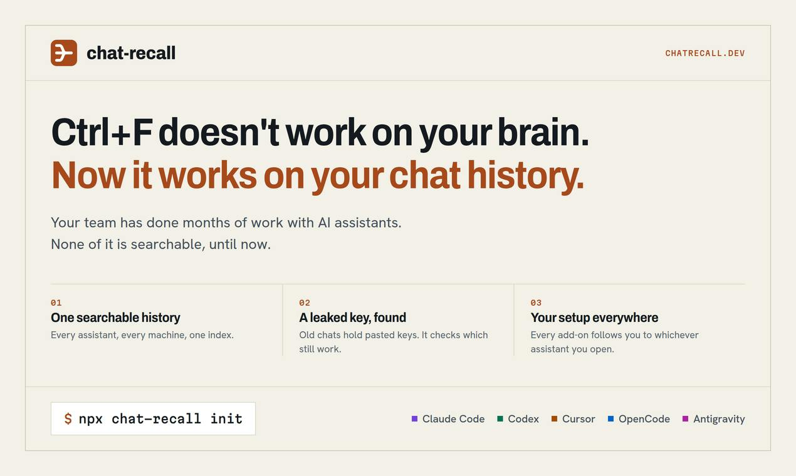
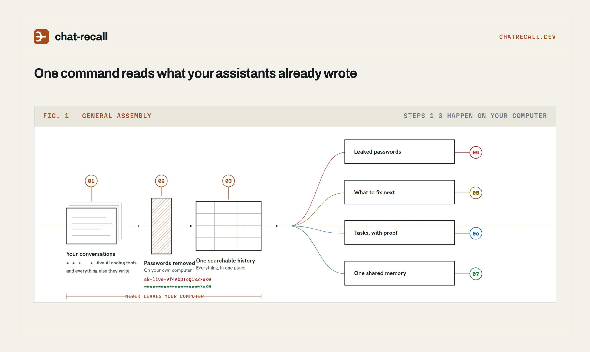
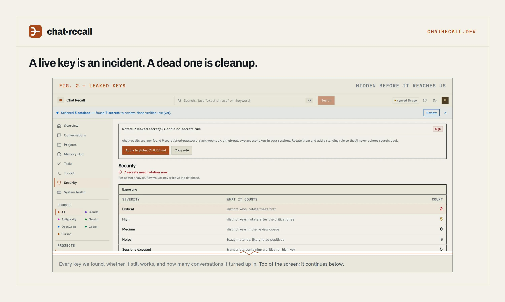

---

## 13. [Design Studio by Monday Merch](https://www.producthunt.com/products/design-studio-by-monday-merch)
**Votes**: 89 | **도입 난이도**: 하 | **신뢰도**: 상
**Tagline**: A browser canvas to design merch with over 1.000+ products
**서비스 링크**: https://www.producthunt.com/r/3CAC2MLPPHGQWE

**태그**: Design, Merchandise, Collaboration, E-commerce, AI Tool

### 📌 이 서비스 한눈에 보기
1,000개 이상의 제품에 디자인을 바로 입혀보는 브라우저 기반 굿즈 제작 캔버스

### 🔑 주요 기능
- 1,000개 이상의 다양한 제품 라인업 제공
- 2D 및 일부 3D 뷰를 통한 실시간 제품 디자인 시뮬레이션
- 브랜드 허브를 통한 디자인 자동 생성 및 협업 기능

### 🙋 사용자에게 어떤 점이 좋은가
디자인부터 제작 규격 확인까지 한 곳에서 해결할 수 있어, 굿즈 제작 시 발생하는 기술적 오류를 줄이고 작업 시간을 단축할 수 있습니다.

### ✅ 지금 바로 써볼 기능
- 1,000여 종의 제품 카탈로그 탐색하기
- 브랜드 허브를 활용한 디자인 자동 생성 테스트
- 협업 기능을 통한 팀원과 디자인 공유하기

### ⚠️ 사용 전 확인할 점
- 모든 제품이 3D 뷰를 지원하지 않을 수 있음
- 디자인 결과물이 실제 인쇄 품질과 차이가 있을 수 있으므로 제작 규칙 확인 필수

### 🧭 확인이 더 필요한 정보
제공되는 1,000여 종의 제품에 대한 배송 가능 지역 및 상세 제작 비용은 명시되지 않았습니다.

### 📸 스크린샷 및 갤러리
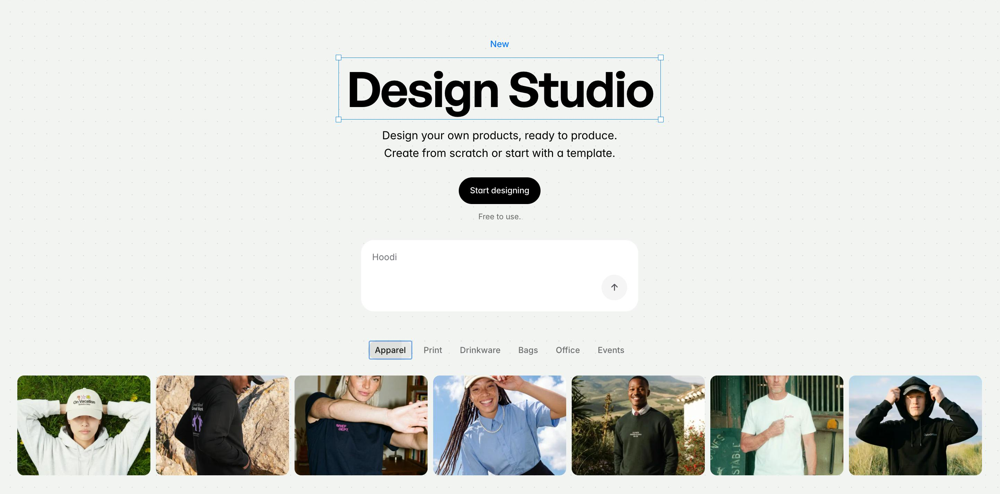
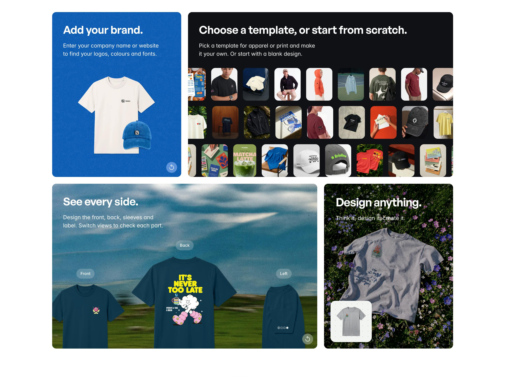
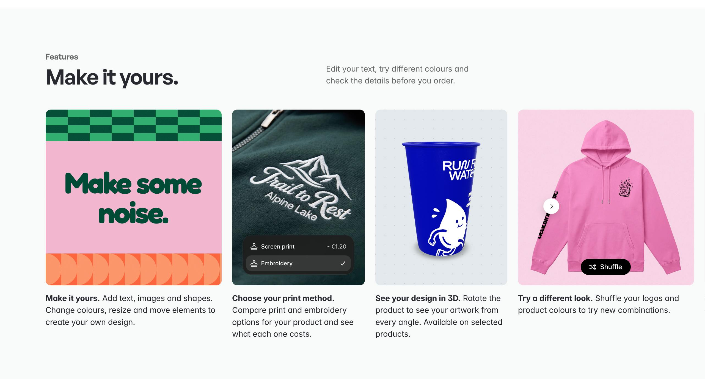

---

## 14. [Cadenya](https://www.producthunt.com/products/cadenya-the-agent-runtime)
**Votes**: 81 | **도입 난이도**: 하 | **신뢰도**: 상
**Tagline**: A hosted agentic loop to bring agentic possibilities to life
**서비스 링크**: https://www.producthunt.com/r/JKJBKV6LY7NQII

**태그**: AI-Agent, DevTool, Automation, SaaS, Agent, AI Tool, API, Email

### 📌 이 서비스 한눈에 보기
기존 애플리케이션에 쉽게 통합하여 에이전트 기능을 구현할 수 있는 호스팅 기반 에이전틱 루프 서비스

### 🔑 주요 기능
- OpenAPI 및 MCP 규격을 활용한 간편한 도구 연결
- 컨텍스트 압축, 도구 승인, 웹훅 및 SSE 스트리밍 기본 제공
- 모델에 구애받지 않는 모델 애그노스틱(Model-agnostic) 설계

### 🙋 사용자에게 어떤 점이 좋은가
복잡한 에이전트 프레임워크를 직접 구축할 필요 없이, 기존 스택에 연결만 하면 즉시 에이전트 기능을 서비스에 도입할 수 있습니다.

### ✅ 지금 바로 써볼 기능
- OpenAPI/MCP 스펙을 통한 도구 연결 테스트
- OpenRouter 또는 OpenAI 호환 엔드포인트 연결
- 제공되는 SDK를 활용한 임베디드 위젯 구현

### ⚠️ 사용 전 확인할 점
- 호스팅 서비스이므로 데이터 보안 및 외부 엔드포인트 사용 시 정책 확인 필요
- 사용자 정의 로직 구현 방식에 따른 제약 사항 확인 필요

### 🧭 확인이 더 필요한 정보
상세한 요금 체계와 엔터프라이즈급 보안 기능에 대한 구체적인 정보는 공개되어 있지 않습니다.

### 📸 스크린샷 및 갤러리

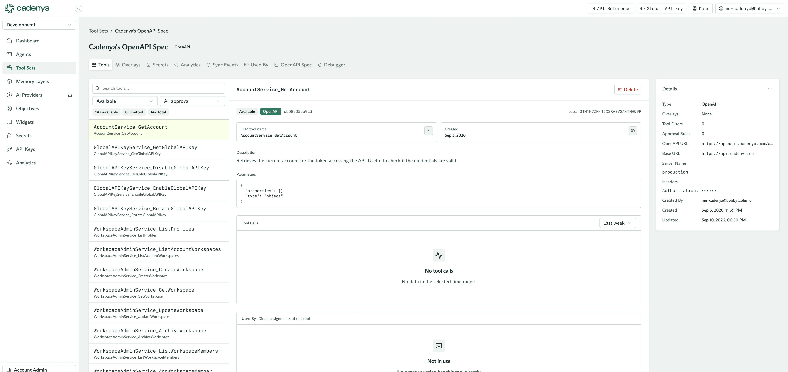
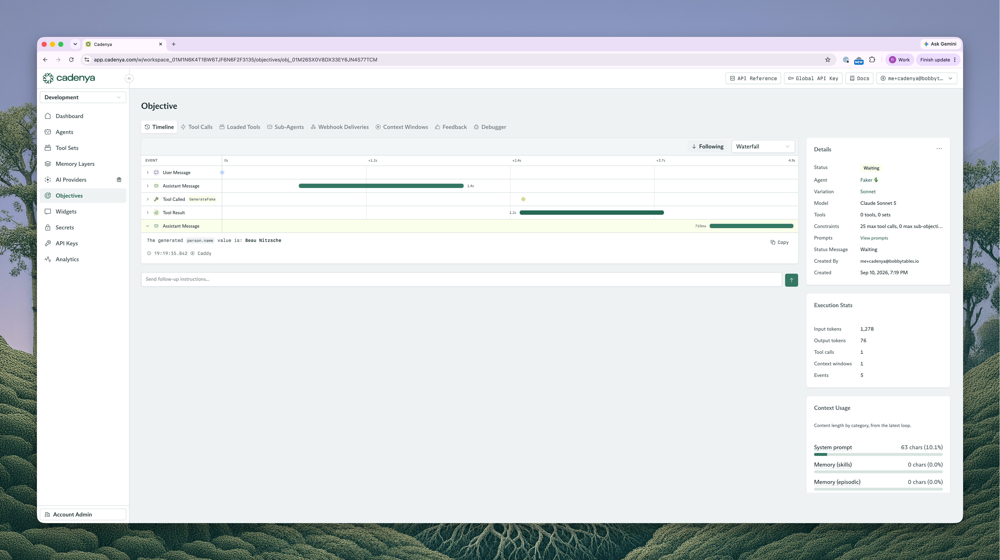

### 🎬 관련 영상
- [🎥 영상 보기](https://ph-files.imgix.net/5f9f1b23-4ab8-43d5-b2ce-ca4643b4c857.jpeg?auto=format)

---

## 15. [GLYPH Immersive](https://www.producthunt.com/products/glyph-immersive)
**Votes**: 80 | **도입 난이도**: 하 | **신뢰도**: 상
**Tagline**: a free tool for modular grid lettering
**서비스 링크**: https://www.producthunt.com/r/R2WUVO4PJWGKR5

**태그**: DesignTool, Typography, PixelArt, WebTool

### 📌 이 서비스 한눈에 보기
브라우저에서 즉시 사용 가능한 모듈형 그리드 기반 레터링 디자인 도구

### 🔑 주요 기능
- 조절 가능한 그리드 위에서 라운드 픽셀 형태의 글자와 도형 제작
- 자간, 모서리, 가장자리 등을 세밀하게 제어하는 컨트롤 제공
- 로그인 없이 브라우저에서 바로 실행 및 무료 내보내기 지원

### 🙋 사용자에게 어떤 점이 좋은가
별도의 설치나 가입 없이 즉시 픽셀 아트 스타일의 타이포그래피를 설계하고 결과물을 추출할 수 있습니다.

### ✅ 지금 바로 써볼 기능
- 조절 가능한 그리드 설정해보기
- 모서리 및 가장자리 컨트롤로 스타일 실험하기
- 무료 내보내기 기능으로 결과물 저장하기

### ⚠️ 사용 전 확인할 점
- 브라우저 기반 도구이므로 복잡한 벡터 편집 기능에는 한계가 있을 수 있음
- 로그인 없이 사용하므로 작업 내용의 클라우드 저장 여부 확인 필요

### 🧭 확인이 더 필요한 정보
내보내기 가능한 파일 형식(SVG, PNG 등)에 대한 구체적인 정보가 명시되지 않았습니다.

### 📸 스크린샷 및 갤러리
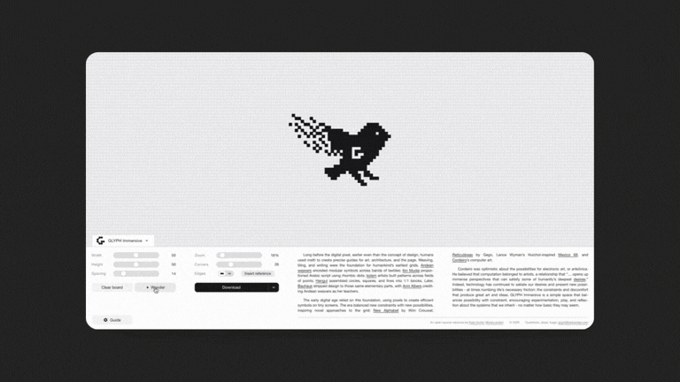
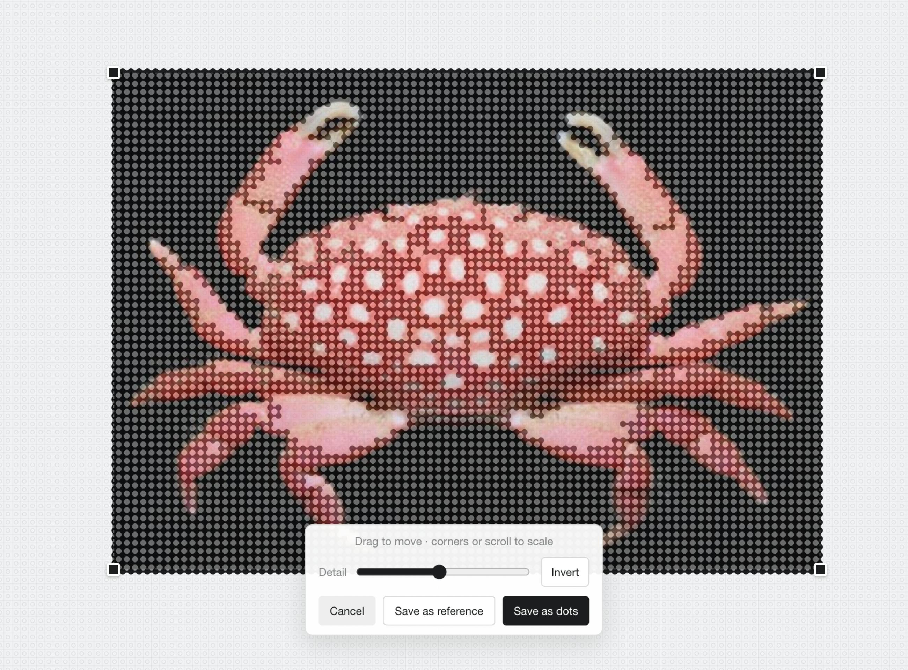
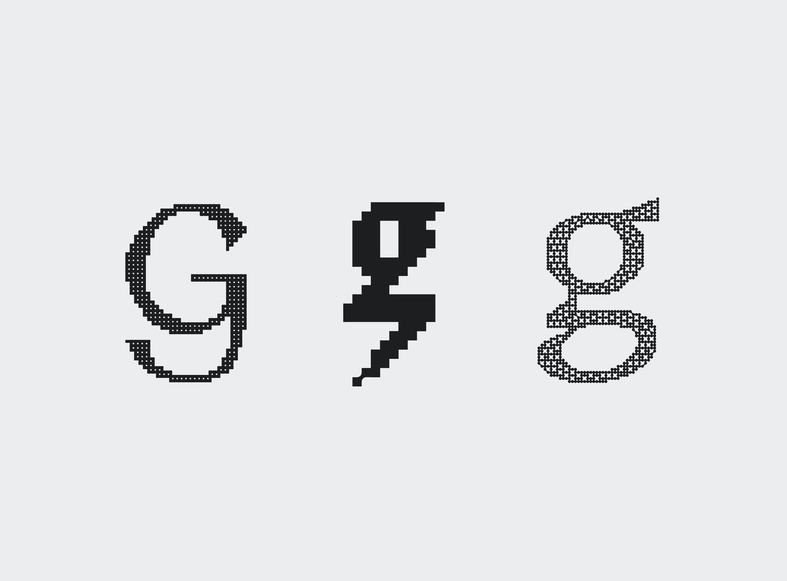

---

## 16. [Formesign](https://www.producthunt.com/products/formesign)
**Votes**: 77 | **도입 난이도**: 하 | **신뢰도**: 상
**Tagline**: Add legally binding signature to your Google Form
**서비스 링크**: https://www.producthunt.com/r/A6UILIY7ETDL24

**태그**: Productivity, Automation, GoogleWorkspace, eSignature, AI Tool, Email

### 📌 이 서비스 한눈에 보기
기존 구글 폼에 법적 효력을 갖는 전자 서명 기능을 간편하게 추가하는 도구

### 🔑 주요 기능
- 기존에 작성된 구글 폼에 전자 서명 기능 통합
- 모든 기기에서 서명 가능 및 서명된 PDF 자동 이메일 발송
- 구글 드라이브 저장 및 구글 시트 응답 동기화 지원

### 🙋 사용자에게 어떤 점이 좋은가
별도의 복잡한 폼 빌더를 새로 배울 필요 없이, 기존 구글 폼 워크플로우를 유지하며 법적 서명이 필요한 업무를 자동화할 수 있습니다.

### ✅ 지금 바로 써볼 기능
- 기존 구글 폼에 Formesign 연결하기
- 서명된 PDF 자동 저장 및 이메일 발송 설정 확인
- 구글 시트와 연동된 응답 데이터 확인

### ⚠️ 사용 전 확인할 점
- 구글 폼 환경 내에서의 기능 작동 범위 확인 필요
- 국가별/지역별 법적 전자 서명 효력 범위 검토 필요

### 🧭 확인이 더 필요한 정보
제공되는 전자 서명의 법적 구속력 범위와 상세 보안 규정 준수 여부에 대한 확인이 필요합니다.

### 📸 스크린샷 및 갤러리
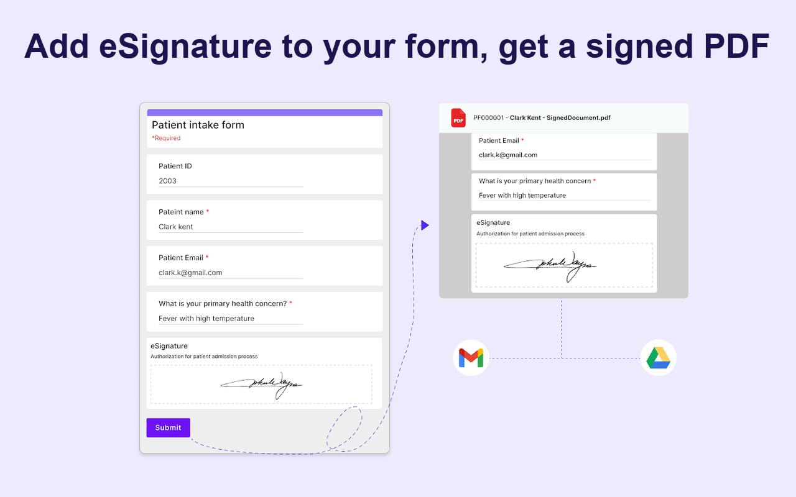
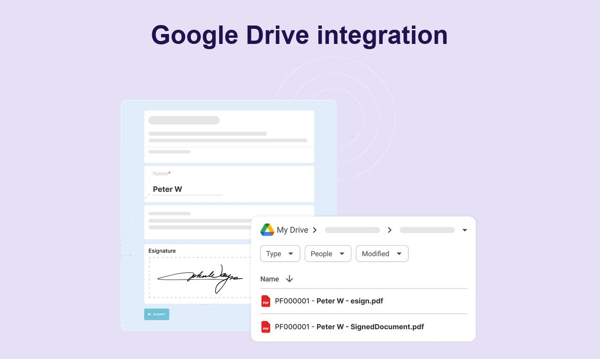
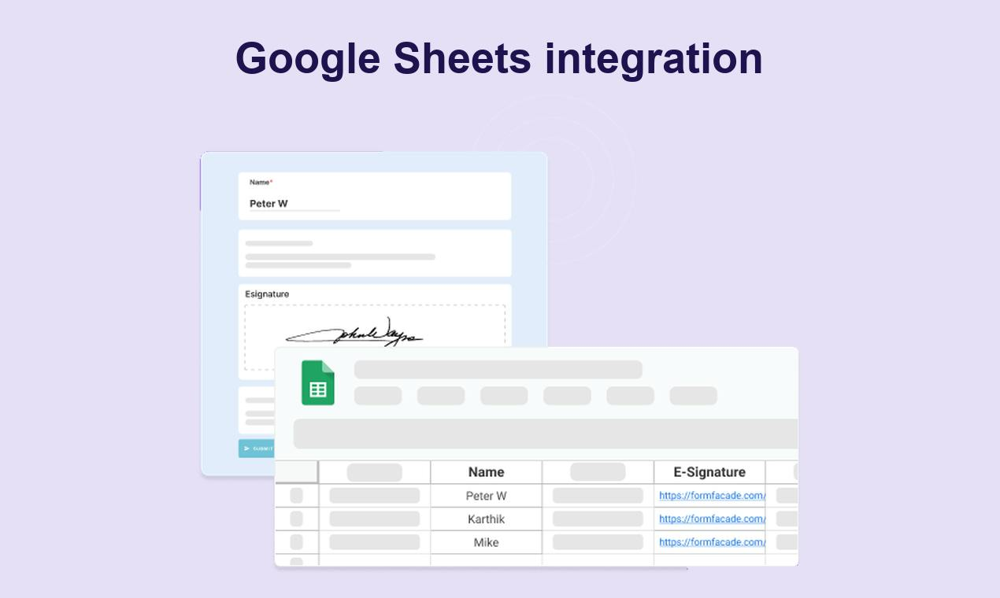

### 🎬 관련 영상
- [🎥 영상 보기](https://ph-files.imgix.net/1690a3aa-8e88-478f-aab1-36adbcaf114b.jpeg?auto=format)

---

## 17. [Accordio](https://www.producthunt.com/products/accordio)
**Votes**: 77 | **도입 난이도**: 중 | **신뢰도**: 상
**Tagline**: Give Claude the admin tools is missing
**서비스 링크**: https://www.producthunt.com/r/6CSFR4NE6G7XJI

**태그**: AI-Agent, Automation, Productivity, MCP, DevTool, Agent, AI Tool

### 📌 이 서비스 한눈에 보기
Claude와 AI 에이전트에게 시간 추적, 계약, 결제 등 실무 관리 기능을 부여하는 MCP 커넥터

### 🔑 주요 기능
- Claude 및 Claude Code를 위한 무료 MCP 커넥터 제공
- 시간 추적, 계약 체결, 인보이스 발송 등 관리 업무 자동화
- AI 에이전트가 직접 결제 및 행정 업무를 수행할 수 있는 환경 구축

### 🙋 사용자에게 어떤 점이 좋은가
AI 에이전트가 단순 답변을 넘어 실제 비즈니스 운영(결제, 계약 등)을 수행할 수 있도록 실무 도구를 연결해 줍니다.

### ✅ 지금 바로 써볼 기능
- Claude Desktop에 MCP 커넥터 연결하기
- Claude Code를 통한 자동화 워크플로우 테스트
- 에이전트용 관리 도구 연동 설정

### ⚠️ 사용 전 확인할 점
- 결제 및 계약 등 민감한 권한을 AI에게 부여할 때의 보안 검토 필요
- 외부 서비스(결제/계약 플랫폼)와의 연동 설정 방식 확인 필요

### 🧭 확인이 더 필요한 정보
지원하는 구체적인 외부 서비스(Stripe, DocuSign 등)의 목록과 연동 방식에 대한 상세 정보가 필요합니다.

### 📸 스크린샷 및 갤러리
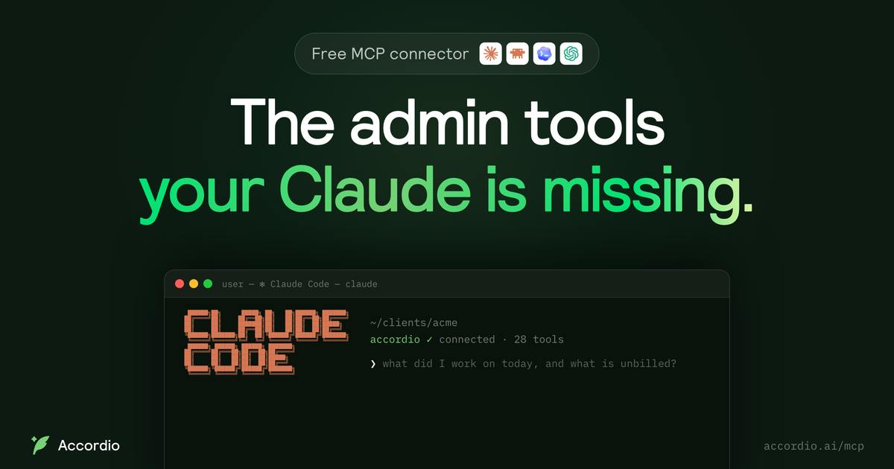
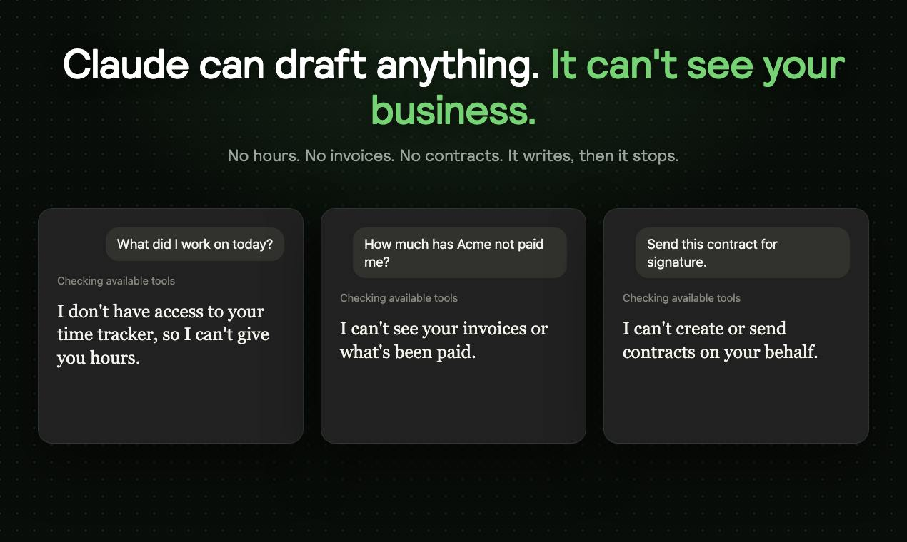
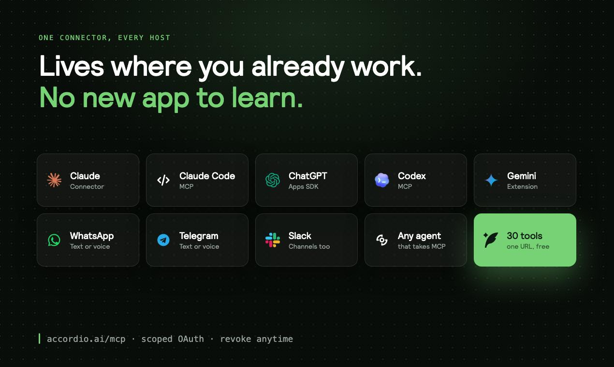

### 🎬 관련 영상
- [🎥 영상 보기](https://ph-files.imgix.net/baa90403-0fa9-4ae0-9f3b-bb2fb80e2a80.jpeg?auto=format)

---

## 18. [Spaces](https://www.producthunt.com/products/spaces-21)
**Votes**: 76 | **도입 난이도**: 하 | **신뢰도**: 상
**Tagline**: One shared space where your team and AI agents work
**서비스 링크**: https://www.producthunt.com/r/KO2XTGNZQD7RMU

**태그**: AI, Collaboration, Productivity, Automation, DesktopApp, Agent, AI Tool, LLM, Chat

### 📌 이 서비스 한눈에 보기
팀원과 AI 에이전트가 하나의 공간에서 협업하는 데스크톱 워크스페이스

### 🔑 주요 기능
- 프로젝트별로 팀원과 AI 에이전트가 공유하는 단일 작업 공간 제공
- 채팅, 파일, 스케줄링된 루틴을 팀과 AI가 함께 공유 및 관리
- ChatGPT, Claude, Gemini 등 다양한 LLM 및 로컬 모델 지원

### 🙋 사용자에게 어떤 점이 좋은가
팀의 업무 흐름에 AI를 자연스럽게 통합하여, 사람이 직접 하던 반복적인 루틴과 파일 관리를 AI 에이전트와 함께 수행할 수 있습니다.

### ✅ 지금 바로 써볼 기능
- 선호하는 LLM(ChatGPT, Claude 등) 연결하기
- 프로젝트별 공유 공간 생성 및 파일 업로드
- AI 에이전트를 위한 자동화 루틴 설정하기

### ⚠️ 사용 전 확인할 점
- 데스크톱 앱 설치가 필요함
- 사용하는 LLM API 비용은 별도로 발생할 수 있음

### 🧭 확인이 더 필요한 정보
다양한 LLM 제공업체 사용 시 발생하는 API 비용 체계와 로컬 모델 구동 시의 하드웨어 요구 사양을 확인해야 합니다.

### 📸 스크린샷 및 갤러리
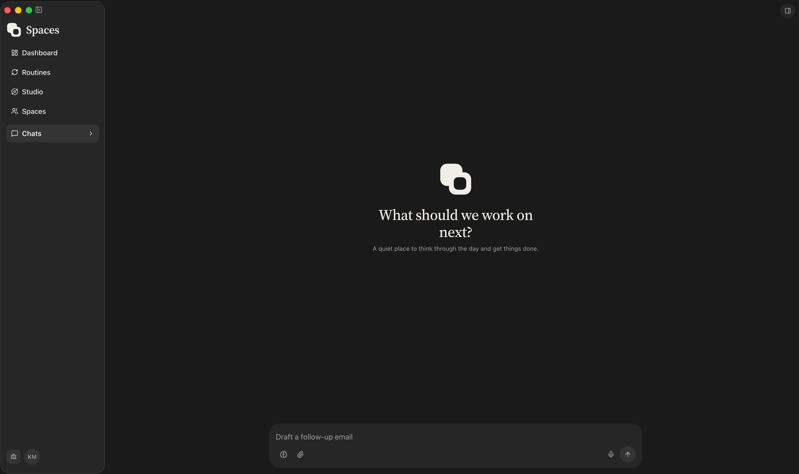
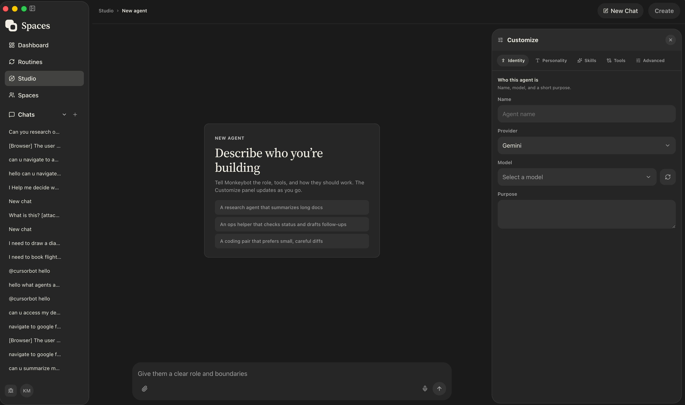
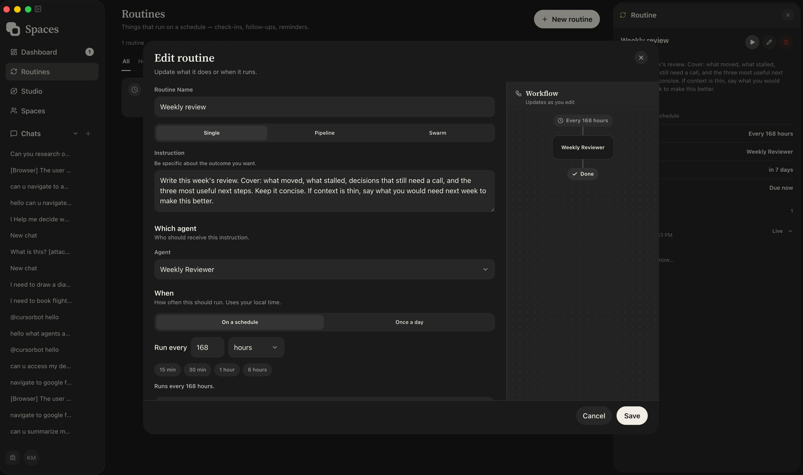

---

## 19. [Jackalope](https://www.producthunt.com/products/jackalope)
**Votes**: 73 | **도입 난이도**: 중 | **신뢰도**: 상
**Tagline**: Codex, Claude Code, Grok, + OpenCode in one shared workspace
**서비스 링크**: https://www.producthunt.com/r/FNA57HIHIZRIAY

**태그**: DevTool, AI, OpenSource, Automation, Agent

### 📌 이 서비스 한눈에 보기
여러 AI 모델과 코드를 하나의 워크스페이스에서 통합 관리하는 오픈소스 개발 도구

### 🔑 주요 기능
- Codex, Claude Code, Grok 등 다양한 AI 모델 통합 환경 제공
- Git 워크트리 기반의 병렬 작업 및 코드 변경 사항 사전 검토 기능
- MCP 툴링, 프로젝트 컨텍스트 유지, 계정 및 사용량 관리 통합

### 🙋 사용자에게 어떤 점이 좋은가
여러 AI 모델을 번갈아 사용할 필요 없이 하나의 작업 공간에서 코드 맥락을 유지하며 효율적으로 개발할 수 있습니다.

### ✅ 지금 바로 써볼 기능
- 얼리 액세스 리스트에 등록하여 우선 권한 확보하기
- Git 워크트리를 활용한 병렬 작업 환경 설정하기
- 다양한 AI 모델 간의 컨텍스트 공유 기능 테스트하기

### ⚠️ 사용 전 확인할 점
- 현재 얼리 액세스 단계로 기능의 완성도나 안정성이 변동될 수 있음
- 여러 계정 및 모델 사용에 따른 비용 관리 필요

### 🧭 확인이 더 필요한 정보
현재 얼리 액세스 단계이므로 구체적인 설치 방법과 전체 기능 가용 범위는 확인이 필요합니다.

### 📸 스크린샷 및 갤러리
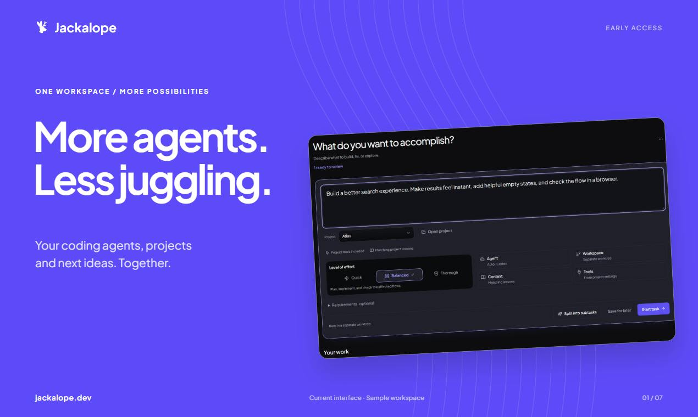
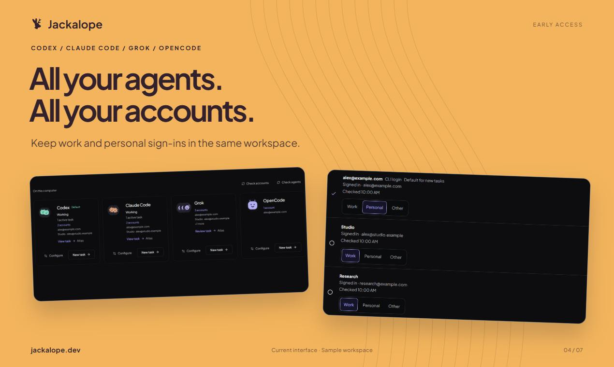
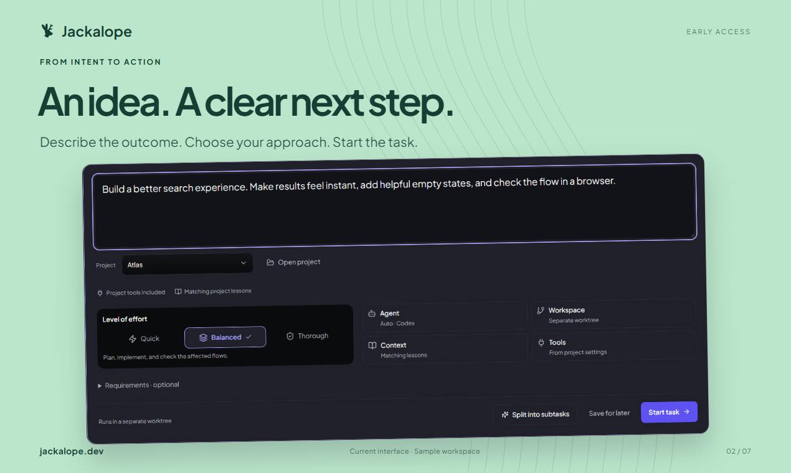

### 🎬 관련 영상
- [🎥 영상 보기](https://ph-files.imgix.net/fe538528-7668-4573-9fb0-5534da2a447c.jpeg?auto=format)

---

## 20. [TIM PG](https://www.producthunt.com/products/tim-pg)
**Votes**: 72 | **도입 난이도**: 하 | **신뢰도**: 상
**Tagline**: Anonymize sensitive data before pasting into AI tools
**서비스 링크**: https://www.producthunt.com/r/2CCZ2AFNMHTTRO

**태그**: Privacy, AI, Productivity, Windows, Security, Automation, AI Tool, LLM

### 📌 이 서비스 한눈에 보기
AI 도구에 데이터를 붙여넣기 전, 민감 정보를 자동으로 마스킹하고 복원해주는 보안 유틸리티

### 🔑 주요 기능
- 클립보드 내 개인정보 자동 마스킹 및 AI 응답 시 원본 데이터 복원
- 100% 오프라인 및 AI-free 방식으로 클라우드 유출 위험 차단
- PDF, Office 문서 익명화 및 로컬 PC 기반의 Smart Bubble 기술 지원

### 🙋 사용자에게 어떤 점이 좋은가
기업 보안 정책 때문에 LLM 사용이 망설여질 때, 개인정보 유출 걱정 없이 안전하게 AI를 업무에 활용할 수 있습니다.

### ✅ 지금 바로 써볼 기능
- 클립보드 자동 마스킹 기능 테스트
- 문서(PDF, Office) 익명화 기능 활용
- AI 응답 내 데이터 복원 기능 확인

### ⚠️ 사용 전 확인할 점
- Windows 전용 유틸리티이므로 타 OS 사용자는 사용 불가
- 로컬 환경에서의 데이터 처리 방식에 대한 기술적 검증 필요

### 🧭 확인이 더 필요한 정보
지원하는 문서 포맷의 범위와 상세한 Smart Bubble 기술의 작동 방식에 대한 추가 정보가 필요합니다.

### 📸 스크린샷 및 갤러리

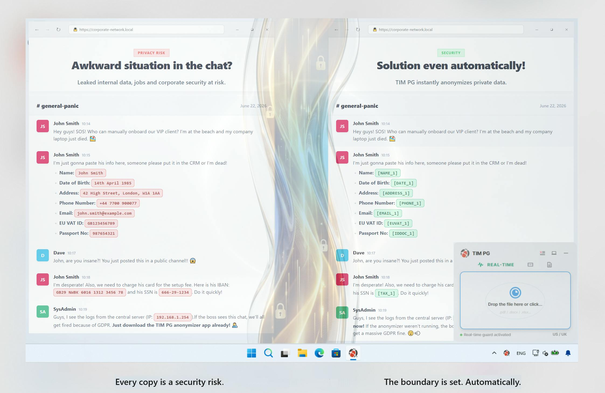
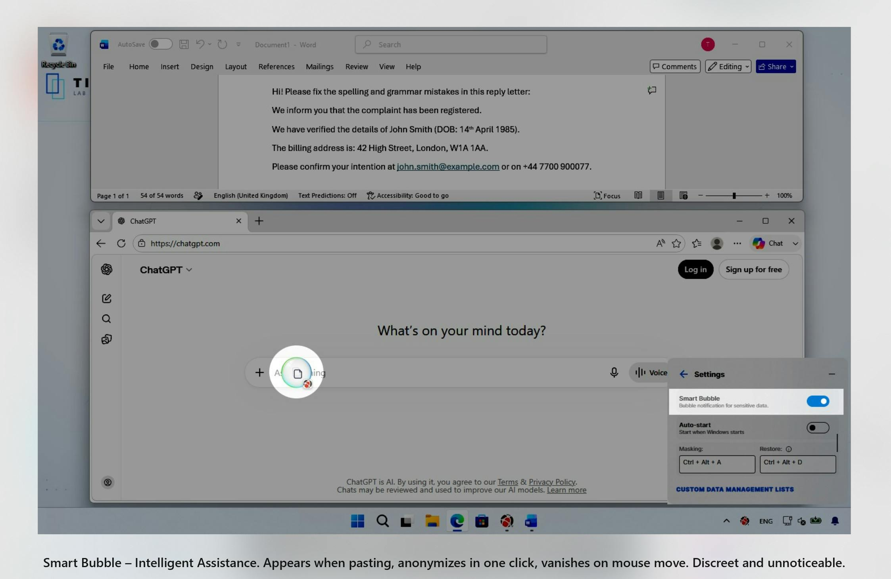

### 🎬 관련 영상
- [🎥 영상 보기](https://ph-files.imgix.net/71a48e77-4a8f-49d4-87ab-2d20697ad24f.jpeg?auto=format)

---

## 21. [LiveGrid](https://www.producthunt.com/products/livegrid-4)
**Votes**: 70 | **도입 난이도**: 하 | **신뢰도**: 상
**Tagline**: Watch multiple live streams at once, never miss a thing
**서비스 링크**: https://www.producthunt.com/r/SHDFSBXA6V7SJP

**태그**: Streaming, Video, Productivity

### 📌 이 서비스 한눈에 보기
트위치, 유튜브, 킥의 라이브 스트림을 한 화면에서 동시에 시청할 수 있는 멀티 그리드 플레이어

### 🔑 주요 기능
- 트위치, 유튜브, 킥 등 다양한 플랫폼의 스트림을 한 화면에 배치
- 사용자 맞춤형 멀티스트림 레이아웃 구성 가능
- 별도 설치 없이 브라우저에서 바로 사용 가능한 무료 서비스

### 🙋 사용자에게 어떤 점이 좋은가
e스포츠, 스포츠 경기 등 여러 채널을 동시에 모니터링해야 하는 사용자에게 최적의 시청 환경을 제공합니다.

### ✅ 지금 바로 써볼 기능
- 여러 플랫폼의 스트림 주소 입력하기
- 원하는 레이아웃으로 그리드 구성하기
- 브라우저에서 멀티뷰 시청 시작하기

### ⚠️ 사용 전 확인할 점
- 여러 영상을 동시에 재생하므로 높은 네트워크 대역폭과 PC 사양이 요구됨
- 브라우저 기반 서비스이므로 플랫폼별 정책에 따라 재생이 제한될 수 있음

### 🧭 확인이 더 필요한 정보
플랫폼별 스트림 임베딩 지원 여부에 따라 특정 채널의 레이아웃 구성이 제한될 수 있습니다.

### 📸 스크린샷 및 갤러리
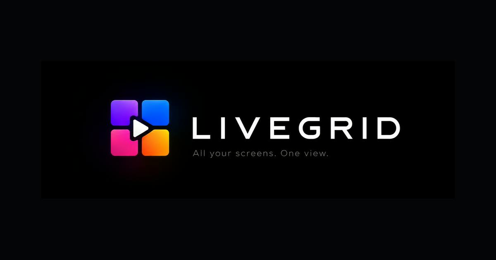
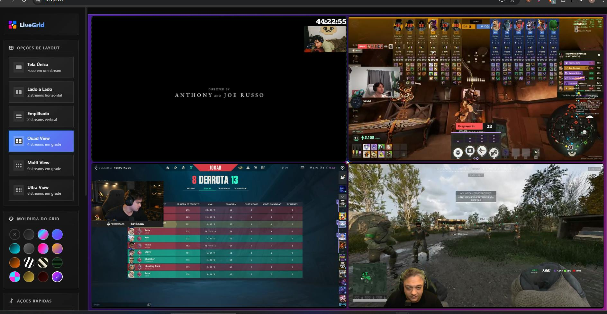
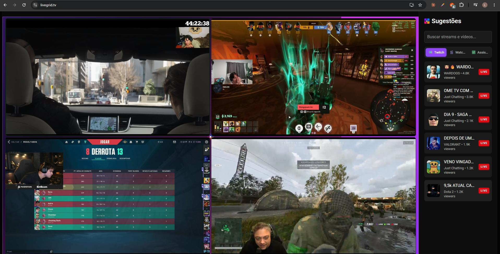

---

## 22. [InTimid AI Matchmaking](https://www.producthunt.com/products/intimid-ai-matchmaking)
**Votes**: 26 | **도입 난이도**: 하 | **신뢰도**: 상
**Tagline**: For introverts and re-entry daters. Our AI matchmaker talks.
**서비스 링크**: https://www.producthunt.com/r/DTUZPSPWBUJWOF

**태그**: AI, Dating, Matchmaking, Privacy, AI Tool, Video

### 📌 이 서비스 한눈에 보기
대화형 AI 매치메이커를 통해 스와이프 스트레스 없이 만남을 주선하는 소개팅 서비스

### 🔑 주요 기능
- AI 매치메이커 'kAI'와 10번의 대화를 통한 정교한 매칭
- 스와이프와 고스팅(읽씹) 방지를 위한 상호 동의 기반 매칭 시스템
- ID 인증 및 앱 내 화상/음성 통화로 보안과 신뢰성 강화

### 🙋 사용자에게 어떤 점이 좋은가
자기소개서 작성이나 사진 노출에 대한 부담 없이, AI와의 대화만으로 자연스럽게 인연을 만날 수 있습니다.

### ✅ 지금 바로 써볼 기능
- kAI와 10번의 대화 나누기
- 생성된 AI 아바타 확인하기
- LA/OC 지역 베타 서비스 참여하기

### ⚠️ 사용 전 확인할 점
- 현재 LA 및 오렌지 카운티 지역 위주의 베타 서비스임
- 매칭 인원이 한 번에 최대 3명으로 제한됨

### 🧭 확인이 더 필요한 정보
서비스의 서비스 가능 지역이 향후 어디까지 확장될지 확인이 필요합니다.

### 📸 스크린샷 및 갤러리
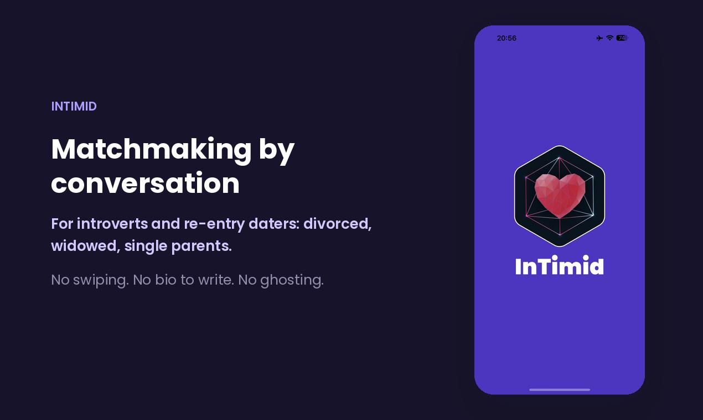
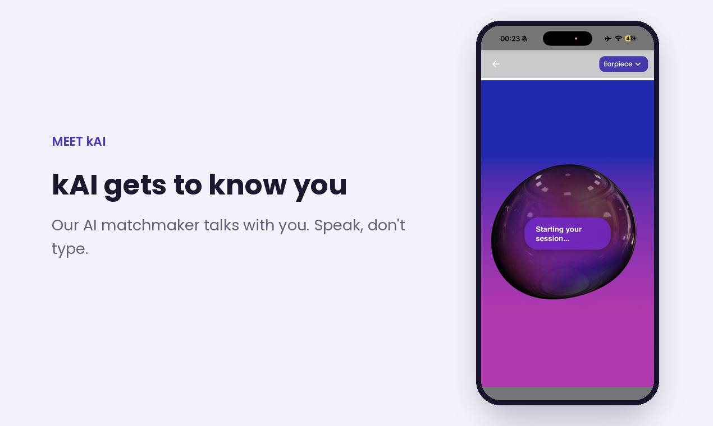
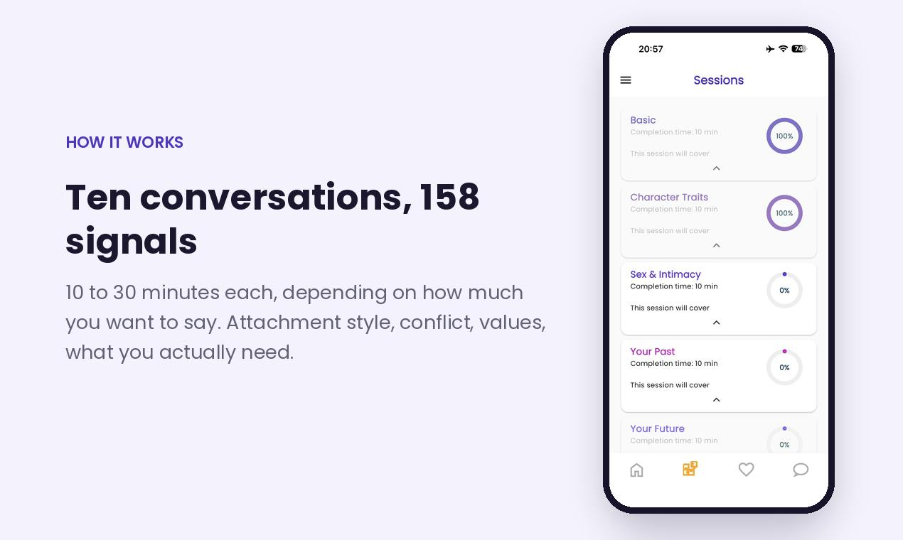

### 🎬 관련 영상
- [🎥 영상 보기](https://ph-files.imgix.net/b1ab9335-fb9a-46f1-bc7d-c16ce134d2fd.jpeg?auto=format)

---

## 23. [Theta PM](https://www.producthunt.com/products/theta-pm)
**Votes**: 21 | **도입 난이도**: 중 | **신뢰도**: 상
**Tagline**: Project management built for velocity
**서비스 링크**: https://www.producthunt.com/r/Q2OICLIIM7QJ4F

**태그**: ProjectManagement, Collaboration, Productivity

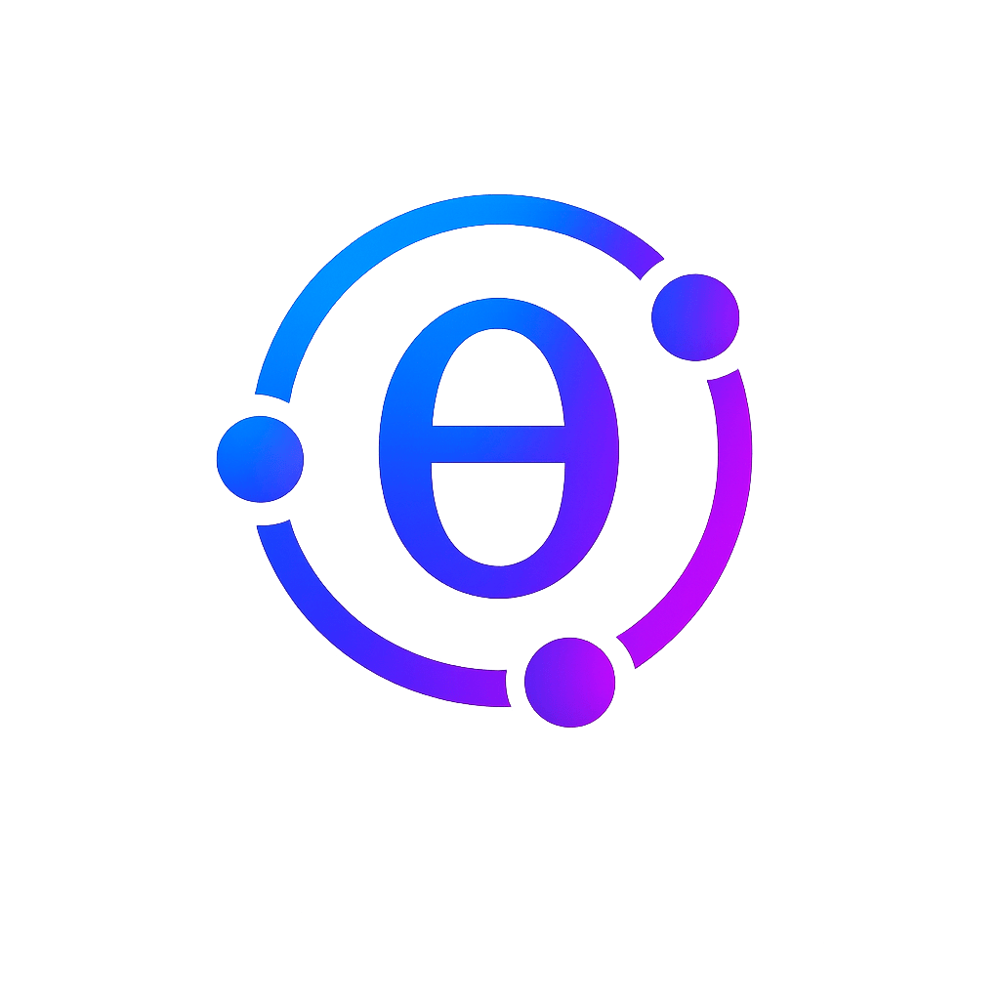

### 📌 이 서비스 한눈에 보기
빠른 실행력을 극대화하는 실시간 협업 및 포트폴리오 관리 프로젝트 관리 도구

### 🔑 주요 기능
- 실시간 협업 기능을 통한 팀 간 동기화
- 시각적인 일정 관리를 위한 간트 차트 제공
- 전략적 의사결정을 돕는 포트폴리오 트래킹

### 🙋 사용자에게 어떤 점이 좋은가
빠른 속도로 움직이는 팀이 프로젝트의 진행 상황을 실시간으로 파악하고 전략적 목표에 집중할 수 있게 돕습니다.

### ✅ 지금 바로 써볼 기능
- 실시간 협업 기능 테스트
- 간트 차트를 활용한 일정 시각화
- 포트폴리오 트래킹 설정

### ⚠️ 사용 전 확인할 점
- 상세한 기능 명세 및 워크플로우 커스텀 범위 확인 필요
- 팀 규모에 따른 확장성 및 동기화 성능 확인 필요

### 🧭 확인이 더 필요한 정보
제공되는 기능 외에 외부 도구와의 연동성이나 구체적인 가격 정책은 명시되지 않았습니다.

### 📸 스크린샷 및 갤러리
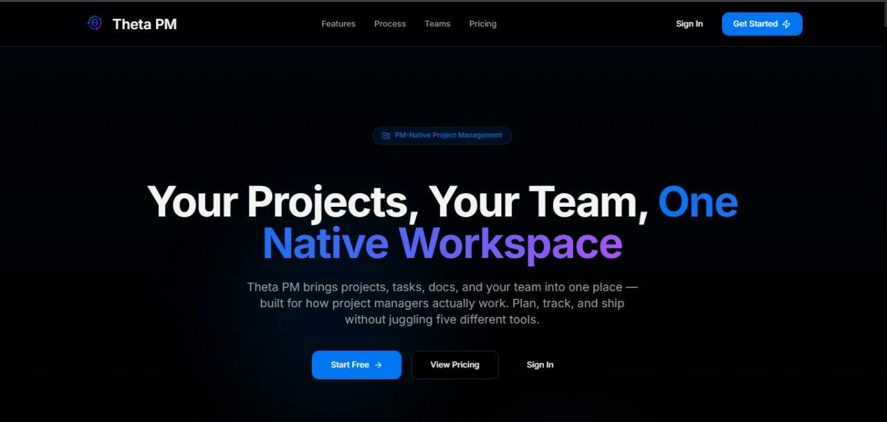
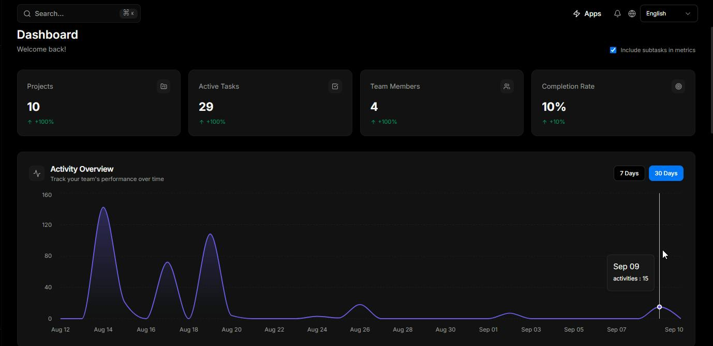
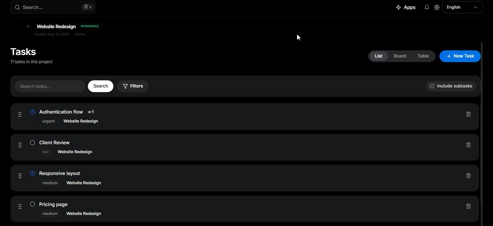

---

## 24. [iCustomer Growth Brain](https://www.producthunt.com/products/audience-loop)
**Votes**: 18 | **도입 난이도**: 중 | **신뢰도**: 상
**Tagline**: Your growth team's always-on brain, where you work
**서비스 링크**: https://www.producthunt.com/r/2Z62AIAE5KB24Q

**태그**: Growth, Automation, AI, Marketing, AI Tool

### 📌 이 서비스 한눈에 보기
사용자의 승인 하에 타겟팅부터 실행까지 스스로 학습하고 움직이는 AI 성장 팀 에이전트

### 🔑 주요 기능
- 최적의 타겟 오디언스 식별 및 도달 시점 자동 결정
- 기존 도구 내에서 직접 실행되는 자동화된 성장 플레이
- 마지막 터치가 아닌 인과 관계 중심의 성과 분석

### 🙋 사용자에게 어떤 점이 좋은가
성장 팀이 수동으로 반복하던 타겟팅과 실행 업무를 AI가 대신 제안하므로, 팀은 전략적 의사결정에만 집중할 수 있습니다.

### ✅ 지금 바로 써볼 기능
- 목표(Goal) 설정 및 AI 제안 확인하기
- Slack 연동을 통한 승인 워크플로우 구축하기
- 기존 마케팅 툴과의 연동성 테스트하기

### ⚠️ 사용 전 확인할 점
- AI의 제안이 실제 비즈니스 전략과 일치하는지 검토 필요
- 기존에 사용 중인 마케팅/운영 툴과의 호환성 확인 필요

### 🧭 확인이 더 필요한 정보
현재 사용 중인 기존 툴들과의 구체적인 통합 범위 및 데이터 보안 정책에 대한 확인이 필요합니다.

### 📸 스크린샷 및 갤러리
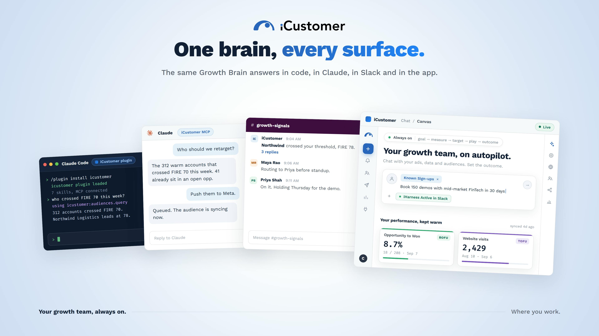
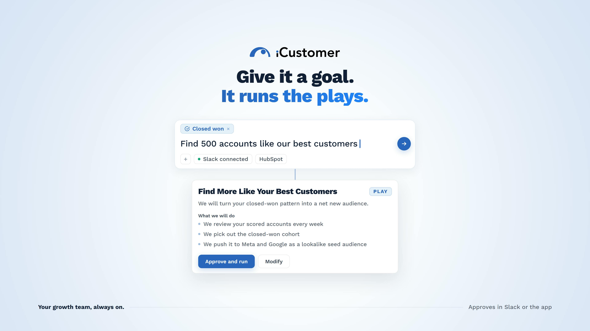
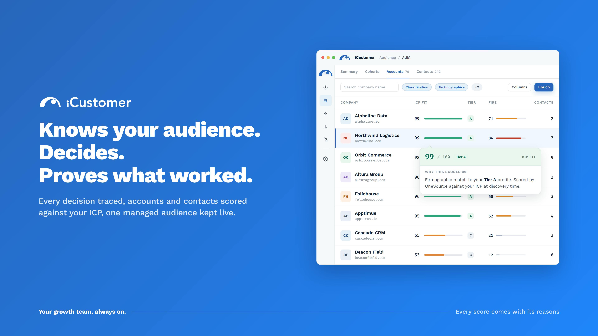

### 🎬 관련 영상
- [🎥 영상 보기](https://ph-files.imgix.net/7163f7b1-4165-4600-8dab-1c5a60da0edf.jpeg?auto=format)

---

## 25. [SmartShop](https://www.producthunt.com/products/smartshop)
**Votes**: 14 | **도입 난이도**: 하 | **신뢰도**: 상
**Tagline**: Apple Developer accounts & support for vibe coders, ios devs
**서비스 링크**: https://www.producthunt.com/r/HGRVQOOJAR4J2F

**태그**: iOS, DevTools, SaaS, Productivity, DevTool

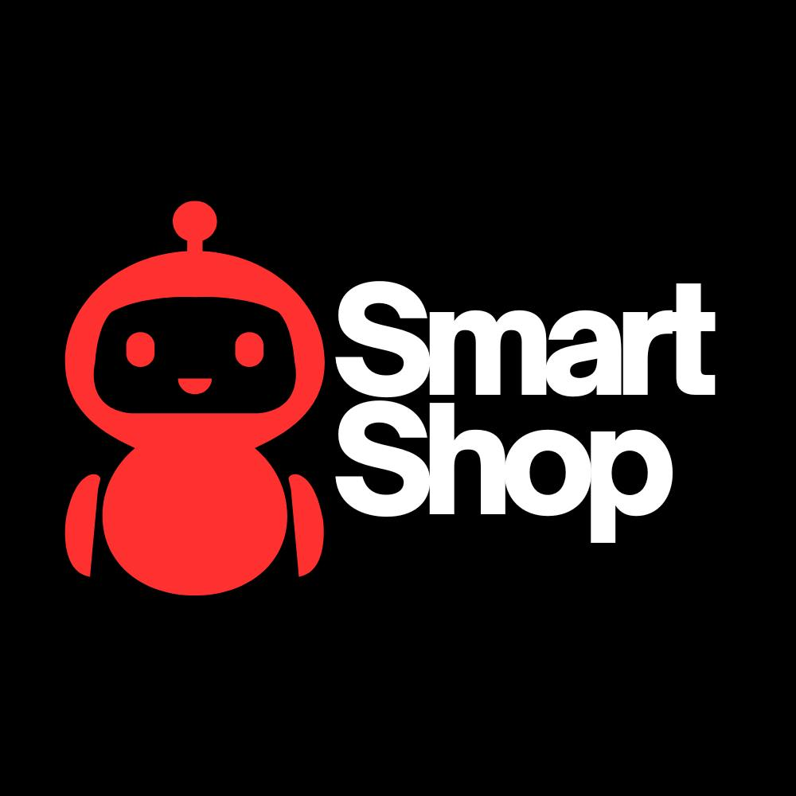

### 📌 이 서비스 한눈에 보기
개인 및 기업을 위한 Apple 개발자 계정 생성부터 운영 지원까지 제공하는 올인원 서비스

### 🔑 주요 기능
- 개인 및 기업용 Apple 개발자 계정 제공
- 계약, 세금 양식, 본인 인증, 정산 및 갱신 등 복잡한 행정 절차 지원
- 인디 메이커와 iOS 개발 팀을 위한 지속적인 기술 지원 및 가이드 제공

### 🙋 사용자에게 어떤 점이 좋은가
Apple의 복잡한 계정 관리 및 행정 절차를 대신 처리해주어, 개발자가 앱 개발에만 집중할 수 있는 환경을 제공합니다.

### ✅ 지금 바로 써볼 기능
- 본인에게 적합한 계정 유형(개인 vs 기업) 선택하기
- 계정 생성 및 세금/정산 프로세스 가이드 확인하기
- 운영 중 발생하는 계정 관련 문의 사항 상담하기

### ⚠️ 사용 전 확인할 점
- 계정 소유권 및 관리 주체에 대한 법적/정책적 검토 필요
- Apple의 공식 정책 변경에 따른 서비스 영향 확인 필요

### 🧭 확인이 더 필요한 정보
서비스 이용 시 계정의 법적 소유권이 사용자에게 있는지 혹은 서비스 제공자에게 있는지에 대한 명확한 확인이 필요합니다.

### 📸 스크린샷 및 갤러리
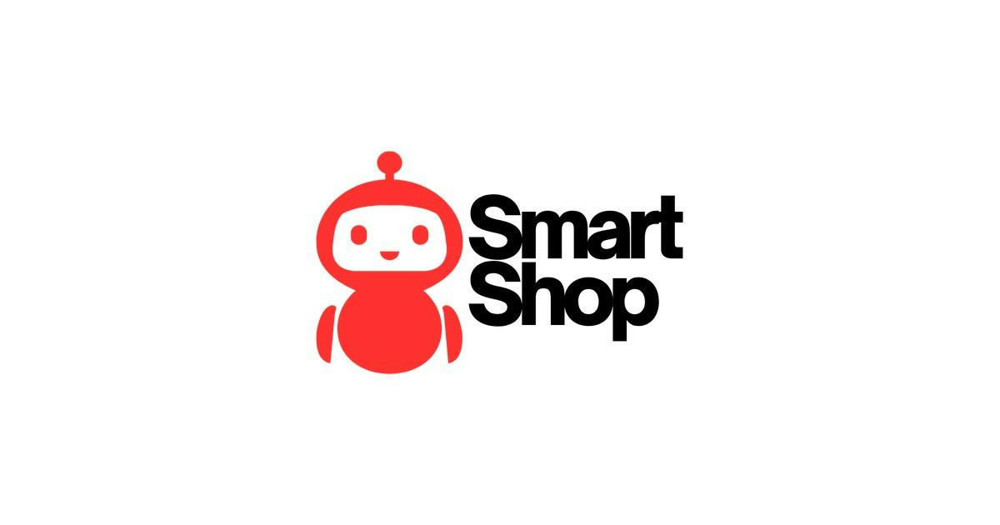
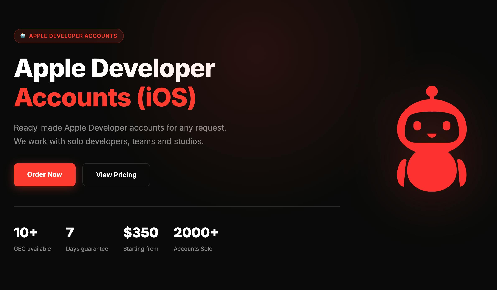
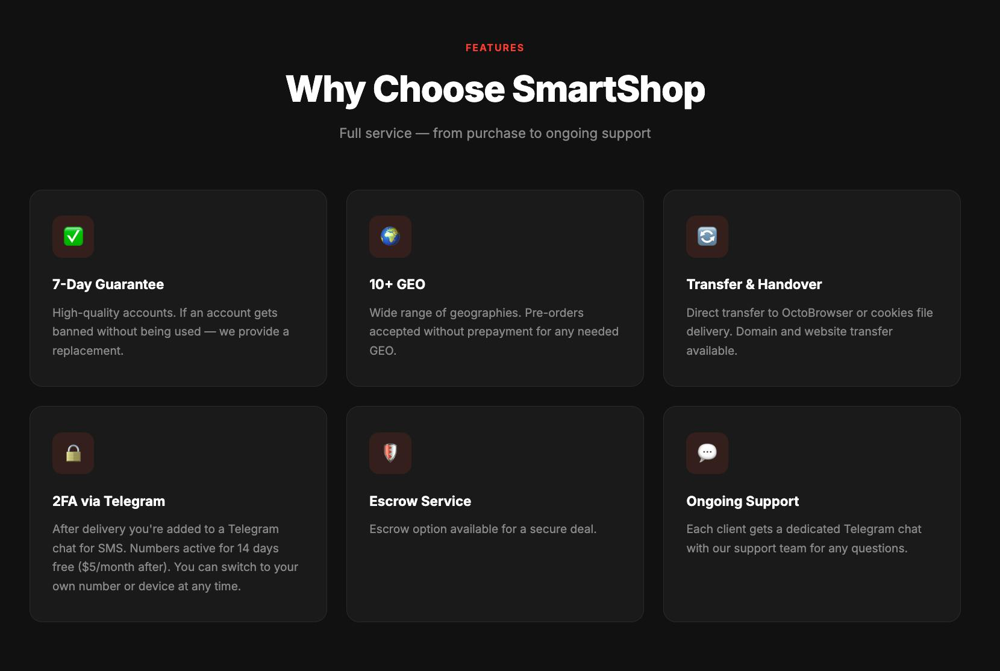

### 🎬 관련 영상
- [🎥 영상 보기](https://ph-files.imgix.net/a950bc04-7ba5-4ce6-8025-544e0ffb4617.jpeg?auto=format)

---

## 26. [WriteCV](https://www.producthunt.com/products/writecv)
**Votes**: 13 | **도입 난이도**: 하 | **신뢰도**: 상
**Tagline**: Get Shortlisted Faster. Beat ATS with AI + Expert Review
**서비스 링크**: https://www.producthunt.com/r/JF7HP4FLS4UMWB

**태그**: AI, Career, Productivity, Resume, Automation, AI Tool, Design

### 📌 이 서비스 한눈에 보기
AI와 전문가 리뷰를 결합하여 서류 합격률을 높여주는 스마트 이력서 빌더

### 🔑 주요 기능
- AI 기반의 문장 재작성 및 직무 기술서 매칭 기능
- ATS(채용 관리 시스템) 최적화를 위한 이중 점수 산정 방식
- 단순 작성을 넘어 합격 가능성을 높이는 워크플로우 제공

### 🙋 사용자에게 어떤 점이 좋은가
지원하는 직무에 맞춰 이력서를 최적화함으로써 서류 통과 확률을 높이고 작성 시간을 단축할 수 있습니다.

### ✅ 지금 바로 써볼 기능
- AI를 활용한 경력 기술서 문장 다듬기
- 지원하려는 채용 공고와 이력서 간의 매칭 점수 확인
- ATS 최적화 점수 검토 및 수정

### ⚠️ 사용 전 확인할 점
- AI 생성 문구의 경우 본인의 실제 경험과 일치하는지 반드시 검토 필요
- 전문가 리뷰 서비스의 경우 별도 비용 발생 여부 확인 필요

### 🧭 확인이 더 필요한 정보
전문가 리뷰 서비스의 구체적인 비용 체계와 제공 방식에 대한 정보가 명시되지 않았습니다.

### 📸 스크린샷 및 갤러리
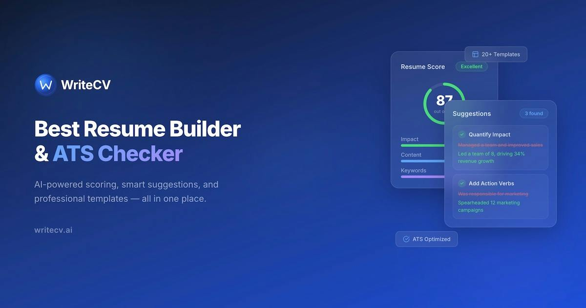
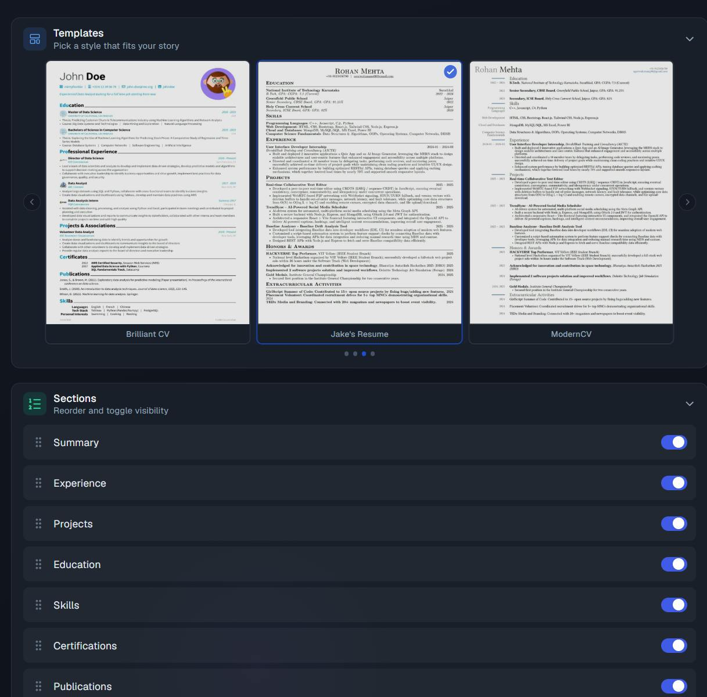
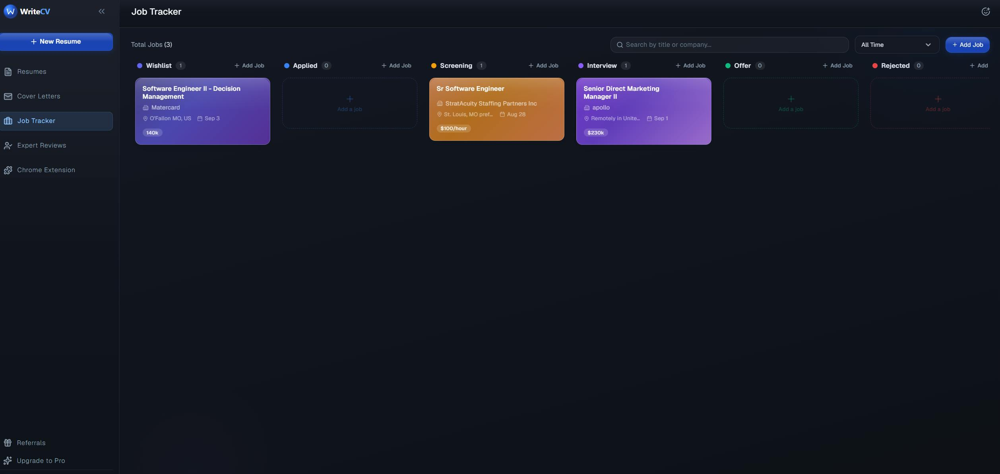

---

## 27. [NewsMCP](https://www.producthunt.com/products/newsmcp)
**Votes**: 13 | **도입 난이도**: 하 | **신뢰도**: 상
**Tagline**: Live news, deduplicated into events
**서비스 링크**: https://www.producthunt.com/r/ERUMOQZMHQ6SJS

**태그**: AI, DevTool, News, Automation, Agent, AI Tool, API

### 📌 이 서비스 한눈에 보기
AI 에이전트를 위한 중복 제거된 실시간 뉴스 이벤트 제공 서비스

### 🔑 주요 기능
- 단순 링크 나열이 아닌 중복이 제거된 정제된 뉴스 이벤트 제공
- Claude Code 및 Cursor와 같은 개발 도구에 원클릭 연동 가능
- MCP(Model Context Protocol) 서버 방식으로 AI 에이전트 최적화

### 🙋 사용자에게 어떤 점이 좋은가
AI 에이전트가 수많은 뉴스 링크를 직접 읽는 대신, 정제된 이벤트 정보를 즉시 파악하여 작업 효율을 높일 수 있습니다.

### ✅ 지금 바로 써볼 기능
- newsmcp.com에서 키 없이 바로 테스트하기
- Claude Code 또는 Cursor에 원클릭으로 추가하기
- 더 많은 히스토리나 결과가 필요할 경우 API 키 등록하기

### ⚠️ 사용 전 확인할 점
- 더 많은 데이터나 과거 기록을 사용하려면 별도의 API 키가 필요함
- 제공되는 뉴스 이벤트의 범위와 업데이트 주기는 서비스 정책에 따름

### 🧭 확인이 더 필요한 정보
API 키를 통한 유료 플랜의 구체적인 가격 정책은 명시되어 있지 않습니다.

### 📸 스크린샷 및 갤러리
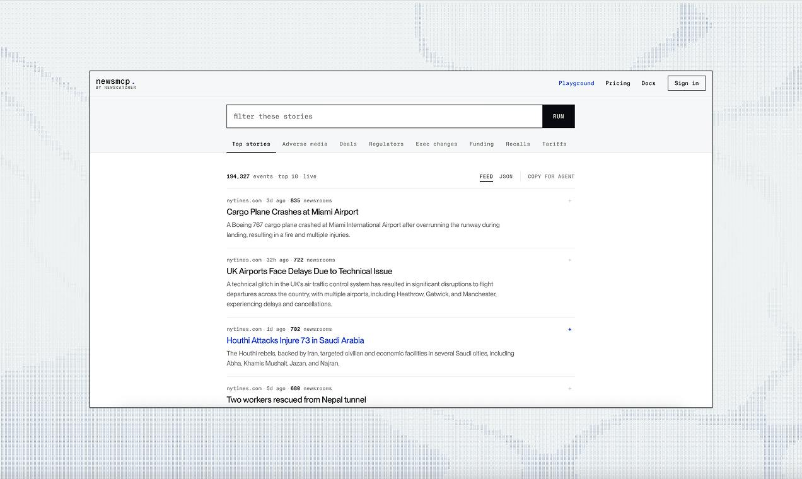
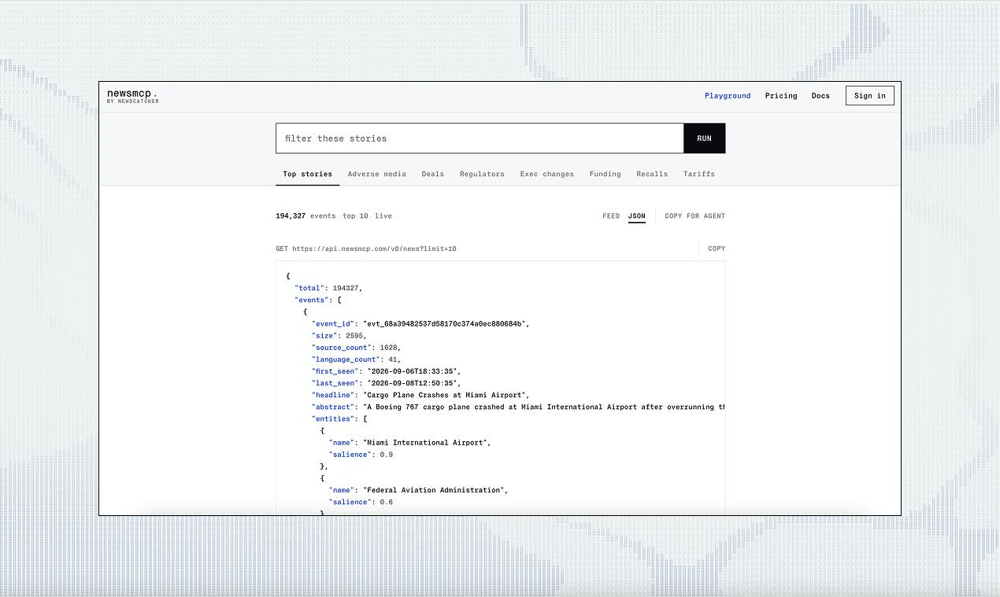
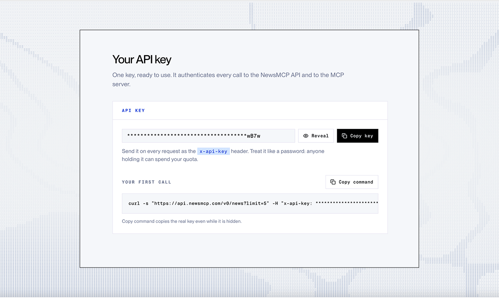

### 🎬 관련 영상
- [🎥 영상 보기](https://ph-files.imgix.net/92adc730-1a3c-46e0-9ecb-c1d99e075d42.jpeg?auto=format)

---

## 28. [SaaS Rank](https://www.producthunt.com/products/saas-rank)
**Votes**: 12 | **도입 난이도**: 하 | **신뢰도**: 상
**Tagline**: SaaS leaderboard where founders compete for #1
**서비스 링크**: https://www.producthunt.com/r/WP4TGFXUQRXDA4

**태그**: SaaS, Marketing, Product Launch, Community, AI Tool

### 📌 이 서비스 한눈에 보기
창업자들이 상위 순위를 두고 경쟁하며 제품 가시성을 높이는 SaaS 리더보드

### 🔑 주요 기능
- 순위 경쟁을 통한 제품 노출 및 가시성 확보
- 유료 기반의 프리미엄 리더보드 서비스
- 커뮤니티 피드백 공간인 'Launch Arena' 제공

### 🙋 사용자에게 어떤 점이 좋은가
제품의 시장 순위를 높이고 싶은 창업자가 타겟이며, Launch Arena를 통해 제품에 대한 구체적인 피드백을 얻을 수 있습니다.

### ✅ 지금 바로 써볼 기능
- Launch Arena에서 제품 피드백 요청하기
- SaaS Rank 리더보드 등록 및 순위 확인하기
- 경쟁사 위치 및 시장 노출 전략 수립하기

### ⚠️ 사용 전 확인할 점
- 리더보드 상위 노출을 위한 유료 비용 발생 가능성
- 순위 경쟁 중심의 서비스로 인한 마케팅 비용 효율성 검토 필요

### 🧭 확인이 더 필요한 정보
리더보드 등록 및 순위 유지에 필요한 구체적인 비용 체계가 명시되지 않았습니다.

### 📸 스크린샷 및 갤러리
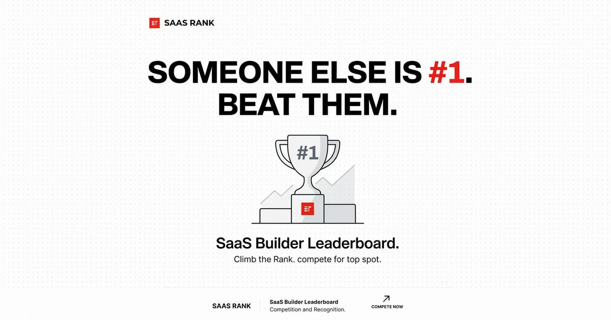
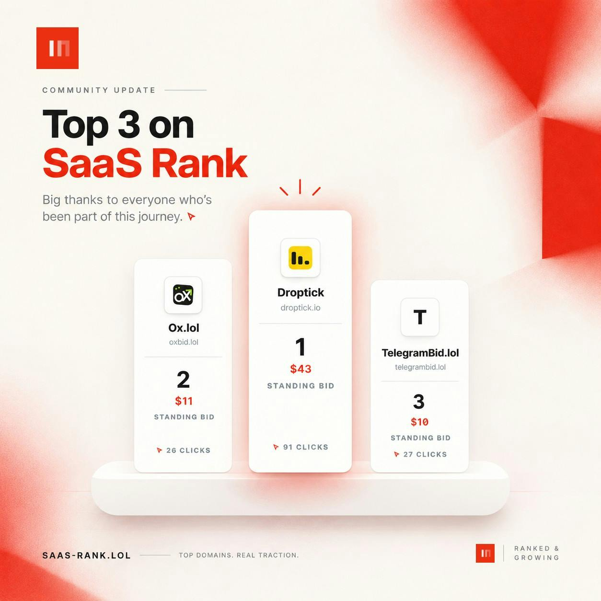

### 🎬 관련 영상
- [🎥 영상 보기](https://ph-files.imgix.net/5fbdca83-982b-4403-b00c-b81eb97621e6.jpeg?auto=format)

---

## 29. [SeamUI](https://www.producthunt.com/products/seamui-scale-your-workflow)
**Votes**: 8 | **도입 난이도**: 하 | **신뢰도**: 상
**Tagline**: We kept the models and deleted the chat.
**서비스 링크**: https://www.producthunt.com/r/QKEKSHH66CZ5IJ

**태그**: AI-Image, Creative-Tools, Workflow, API-First, AI Tool, Chat, Prompting, Video, Vision, API

### 📌 이 서비스 한눈에 보기
개인 API 키를 사용하여 다양한 AI 모델로 이미지와 영상을 생성하고 관리하는 워크플로우 도구

### 🔑 주요 기능
- OpenAI, Gemini, Flux 등 주요 모델 및 Replicate/Kie.ai와 같은 애그리게이터 지원
- 채팅 인터페이스 대신 생성과 관리에 집중한 효율적인 UI 제공
- 프롬프트 라이브러리를 통한 영감 확보 및 팀 협업 기능

### 🙋 사용자에게 어떤 점이 좋은가
자신의 API 키를 직접 사용하여 비용 효율적으로 고성능 모델들을 통합 관리하고, 팀원들과 프롬프트를 공유하며 작업 흐름을 최적화할 수 있습니다.

### ✅ 지금 바로 써볼 기능
- 보유 중인 API 키를 연결하여 모델 연동하기
- 프롬프트 라이브러리에서 영감 얻기
- 팀 프로젝트를 위한 프롬프트 저장 및 공유하기

### ⚠️ 사용 전 확인할 점
- 사용자 본인의 API 키를 사용하므로 모델별 비용은 별도로 발생함
- 채팅 기능이 제거된 인터페이스이므로 대화형 작업에는 적합하지 않을 수 있음

### 🧭 확인이 더 필요한 정보
사용자 개인 API 키를 통한 비용 산정 방식과 보안 정책에 대한 상세 확인이 필요합니다.

### 📸 스크린샷 및 갤러리
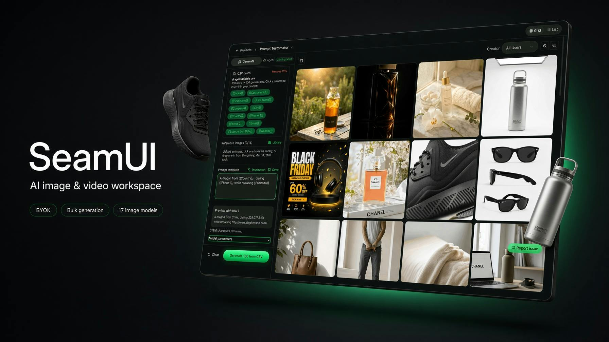
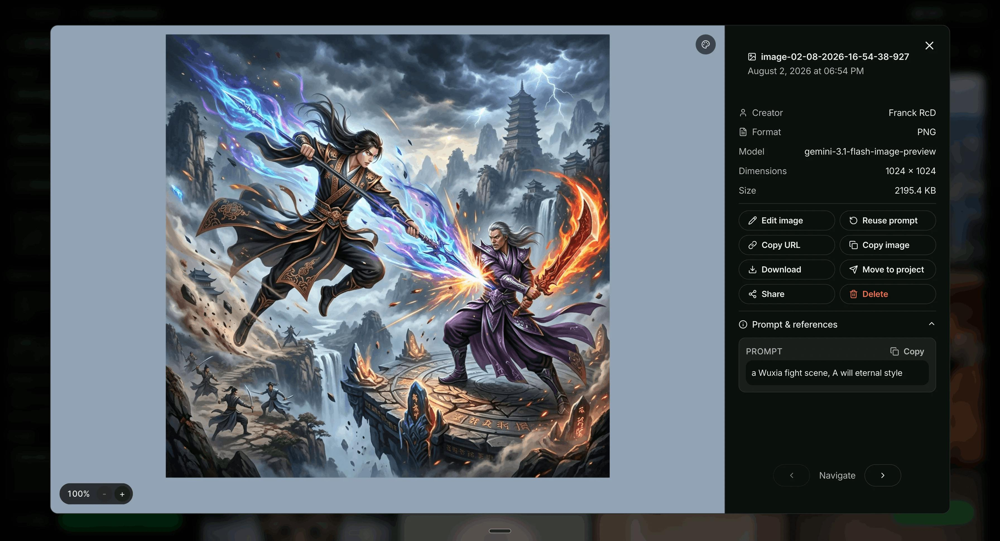
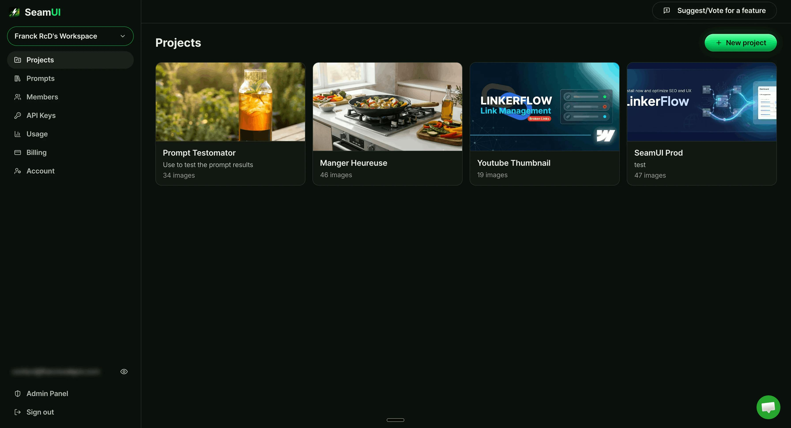

### 🎬 관련 영상
- [🎥 영상 보기](https://ph-files.imgix.net/91a95f1d-b8b1-4820-86da-a2f8fd849927.jpeg?auto=format)

---

## 30. [Jarvey — proactive AI Agent](https://www.producthunt.com/products/jarvey)
**Votes**: 8 | **도입 난이도**: 하 | **신뢰도**: 상
**Tagline**: Right in your Google Meet & Zoom calls
**서비스 링크**: https://www.producthunt.com/r/L2XMT3QTR7GHAR

**태그**: AI Agent, Productivity, Meeting, Automation, Agent, AI Tool

### 📌 이 서비스 한눈에 보기
단순 기록을 넘어 회의 중 실시간 업무를 수행하는 능동형 AI 에이전트

### 🔑 주요 기능
- 단순 기록자가 아닌 실시간 정보 검색 및 문서 작성을 수행하는 프로액티브 에이전트
- Google Meet 및 Zoom 환경에 직접 통합되어 작동
- OpenAI의 GPT-Live 기술을 활용한 실시간 상호작용

### 🙋 사용자에게 어떤 점이 좋은가
회의 중 발생하는 정보 검색이나 작업 할당을 AI가 실시간으로 도와주어 회의 흐름을 끊지 않고 업무를 완결할 수 있습니다.

### ✅ 지금 바로 써볼 기능
- 화상 회의 중 실시간 정보 검색 기능 테스트
- 회의 중 즉석 문서 작성 및 태스크 설정 기능 활용

### ⚠️ 사용 전 확인할 점
- 실시간 음성/화면 데이터 처리에 따른 개인정보 및 보안 정책 확인 필요
- GPT-Live 모델의 실시간 응답 지연 가능성 고려

### 🧭 확인이 더 필요한 정보
GPT-Live 기술이 실제 회의 환경에서 어느 정도의 지연 시간 없이 작동하는지 확인이 필요합니다.

### 📸 스크린샷 및 갤러리
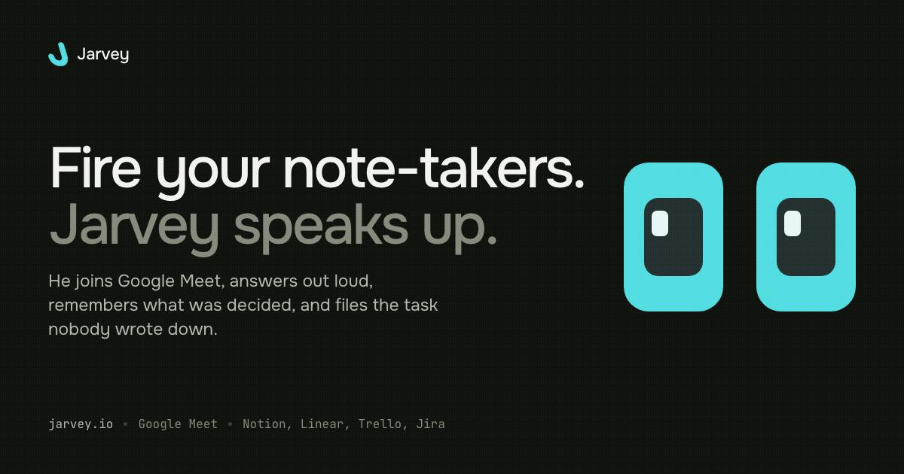

---

