# 🚀 Product Hunt Daily Top 30 (2026-09-13)

## 오늘의 요약
오늘의 트렌드는 AI를 활용한 업무 자동화와 개발 생산성 향상, 그리고 사용자 맞춤형 작업 환경 구축에 집중되었습니다. 특히 코딩 에이전트와 연동되는 테스트 도구나 API 명세 자동 변환 등 개발 워크플로우를 혁신하는 도구들이 눈에 띄었습니다. 또한, 창의적 작업과 일상 업무의 효율을 높이기 위한 AI 기반의 생산성 도구들도 활발히 소개되었습니다.

### 오늘의 핵심 포인트
- AI를 활용해 복잡한 코딩, 테스트, API 관리 작업을 자동화하여 개발 생산성을 극대화하는 도구들이 주목받았습니다.
- 영업, 디자인, 문서 작업 등 전문적인 워크플로우 내에서 반복 작업을 제거하고 핵심 가치에 집중하게 돕는 AI 솔루션이 등장했습니다.
- 사용자 경험을 개인화하거나 협업 효율을 높이는 데 초점을 맞춘 데스크탑 및 웹 기반의 유틸리티 도구들이 소개되었습니다.

**오늘의 태그**: AI_Automation, Developer_Tools, Productivity, Workflow_Optimization

## 1. [Youkti ](https://www.producthunt.com/products/youkti)
**Votes**: 239 | **도입 난이도**: 하 | **신뢰도**: 상
**Tagline**: Finds who's ready to buy, then tells you what to do next 
**서비스 링크**: https://www.producthunt.com/r/AXBZALUEGRY3KK

**태그**: Sales, CRM, Sales Intelligence, Lead Generation

### 📌 이 서비스 한눈에 보기
영업 기회 포착부터 다음 행동 지침까지 제공하는 AI 기반 세일즈 인텔리전스

### 🔑 주요 기능
- 계정, 대화, 딜(Deal)에 대한 통합 메모리 관리
- 이탈 위험 딜 및 휴면 계정의 구매 신호 자동 감지
- 미팅 준비 및 다음 영업 단계에 대한 구체적인 가이드 제공

### 🙋 사용자에게 어떤 점이 좋은가
영업 담당자가 수많은 데이터 속에서 무엇을 먼저 해야 할지 고민하는 시간을 줄여주고, 놓치기 쉬운 영업 기회를 실시간으로 알려줍니다.

### ✅ 지금 바로 써볼 기능
- 무료로 제공되는 연락처 및 구매 신호 데이터 확인하기
- 현재 관리 중인 딜의 위험 요소 및 다음 행동 지침 확인하기
- 휴면 상태인 계정의 새로운 신호 탐색하기

### ⚠️ 사용 전 확인할 점
- 무료 제공 데이터의 범위와 업데이트 빈도 확인 필요
- 기존 CRM 시스템과의 연동 방식 확인 필요

### 🧭 확인이 더 필요한 정보
제공되는 데이터의 상세 범위와 외부 CRM(Salesforce 등)과의 통합 기능에 대한 구체적인 정보가 필요합니다.

### 📸 스크린샷 및 갤러리
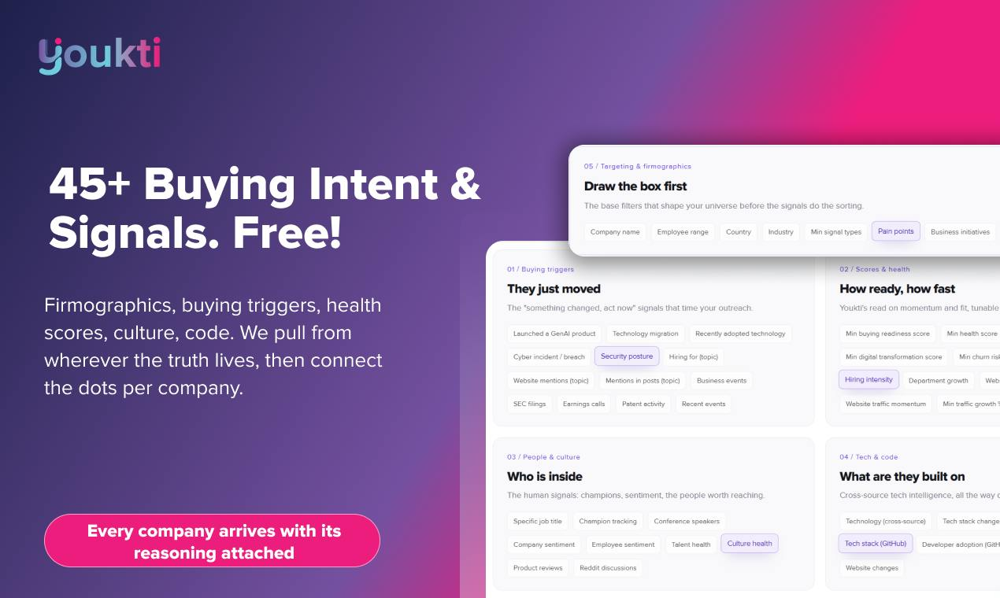
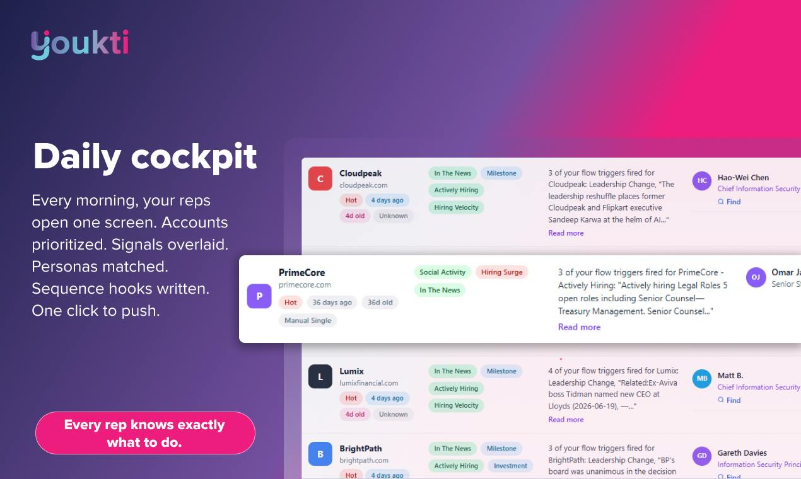
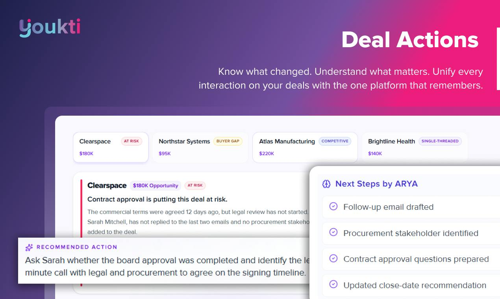

### 🎬 관련 영상
- [🎥 영상 보기](https://ph-files.imgix.net/4f8119b9-0dfe-4223-8585-6dba100874f0.jpeg?auto=format)

---

## 2. [Cortex](https://www.producthunt.com/products/cortex-25)
**Votes**: 232 | **도입 난이도**: 중 | **신뢰도**: 상
**Tagline**: Turn API specs into docs, SDKs, and MCP servers
**서비스 링크**: https://www.producthunt.com/r/2YCIFX5SDWGMX6

**태그**: DevTool, API, Automation, AI, OpenSource, Agent, AI Tool

### 📌 이 서비스 한눈에 보기
API 명세서를 문서, SDK, AI용 MCP 서버로 자동 변환하는 오픈소스 지식 레이어

### 🔑 주요 기능
- OpenAPI, GraphQL, gRPC 등 다양한 API 규격을 지원
- 11개 언어의 타입이 지정된(Typed) SDK 자동 생성
- AI 에이전트를 위한 MCP(Model Context Protocol) 서버 구축

### 🙋 사용자에게 어떤 점이 좋은가
API 명세 관리와 SDK 개발에 드는 수동 작업을 자동화하여 개발 생산성을 극대화할 수 있습니다.

### ✅ 지금 바로 써볼 기능
- 보유 중인 API 스펙을 업로드하여 문서 생성 테스트
- 필요한 언어의 SDK 생성 및 타입 체크 확인
- 생성된 MCP 서버를 AI 에이전트에 연결해보기

### ⚠️ 사용 전 확인할 점
- 오픈소스 프로젝트이므로 기업 환경 적용 시 보안 및 관리 정책 확인 필요
- 복잡한 커스텀 로직이 포함된 API의 경우 자동 생성된 SDK의 정밀도 검토 필요

### 🧭 확인이 더 필요한 정보
지원하는 11개 언어의 구체적인 목록과 배포 방식(Self-hosted vs Cloud)에 대한 상세 정보가 필요합니다.

### 📸 스크린샷 및 갤러리
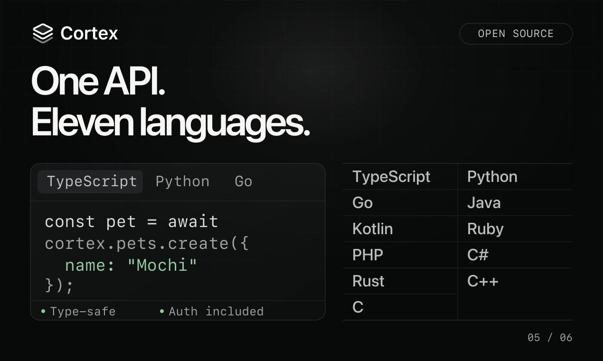
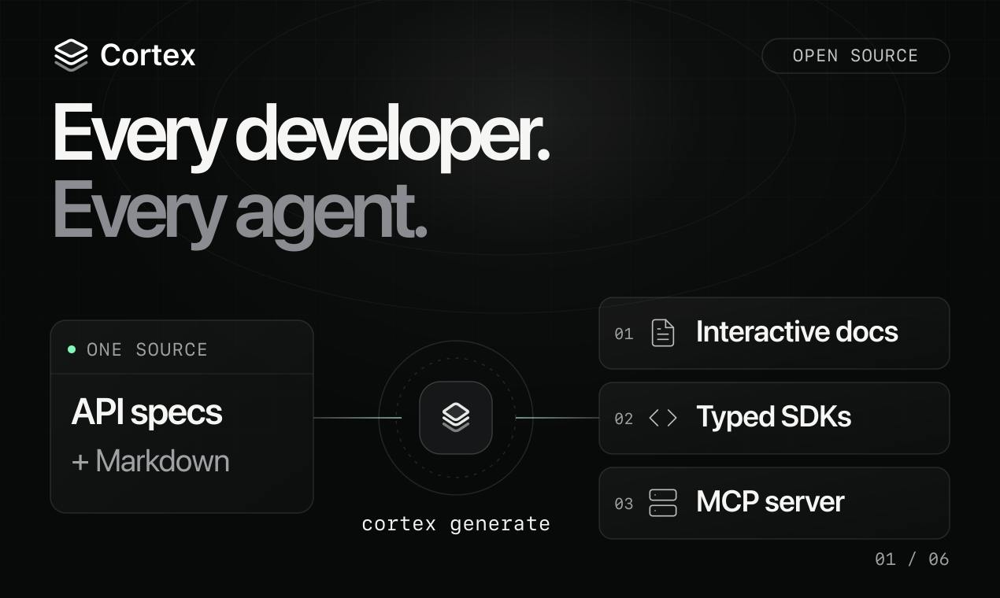
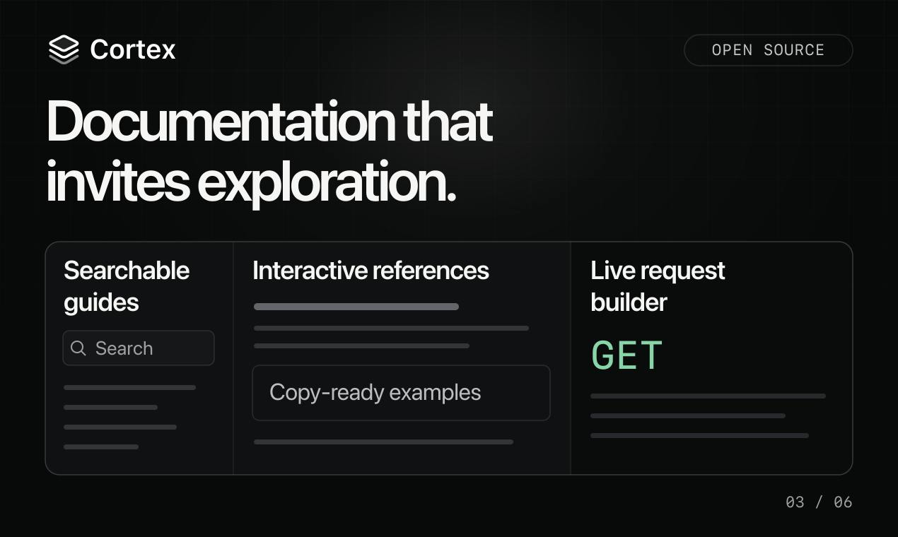

---

## 3. [QApilot MCP for Android](https://www.producthunt.com/products/qapilot)
**Votes**: 163 | **도입 난이도**: 중 | **신뢰도**: 상
**Tagline**: Android app testing inside your coding agent
**서비스 링크**: https://www.producthunt.com/r/CHCYBUSI4J3W2B

**태그**: DevTool, Automation, Android, AI-Agent, Agent, AI Tool, API

### 📌 이 서비스 한눈에 보기
코딩 에이전트와 대화하며 자연어로 안드로이드 앱 테스트를 자동화하는 도구

### 🔑 주요 기능
- Claude, Cursor, Codex 등 코딩 에이전트와 연동되는 MCP 방식
- Appium 코드 작성 없이 자연어 설명만으로 테스트 흐름 생성
- 실제 기기 및 에뮬레이터 환경에서 요소 탐색 및 자동 재시도 지원

### 🙋 사용자에게 어떤 점이 좋은가
복잡한 UI 테스트 코드를 직접 작성할 필요 없이, 개발 흐름 속에서 말하듯 테스트를 자동화하고 기록할 수 있습니다.

### ✅ 지금 바로 써볼 기능
- 자연어로 테스트 시나리오를 설명하여 실행해보기
- 생성된 Gherkin 파일을 통해 테스트 케이스 자동 저장 기능 확인하기
- Node, Java, Android SDK 환경 설정 및 에이전트 연동하기

### ⚠️ 사용 전 확인할 점
- Node, Java, Android SDK 설치 및 환경 설정이 필수적임
- 에이전트의 해석 능력에 따라 테스트 정확도가 달라질 수 있음

### 🧭 확인이 더 필요한 정보
사용자의 코딩 에이전트(Claude, Cursor 등) 설정 방식에 따른 구체적인 연동 난이도는 명시되지 않았습니다.

### 📸 스크린샷 및 갤러리
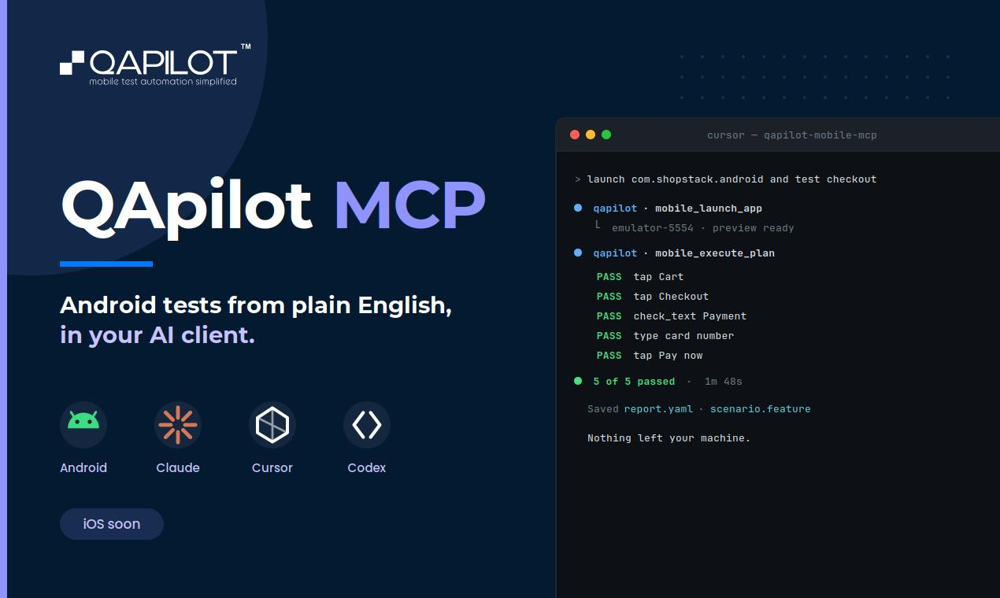
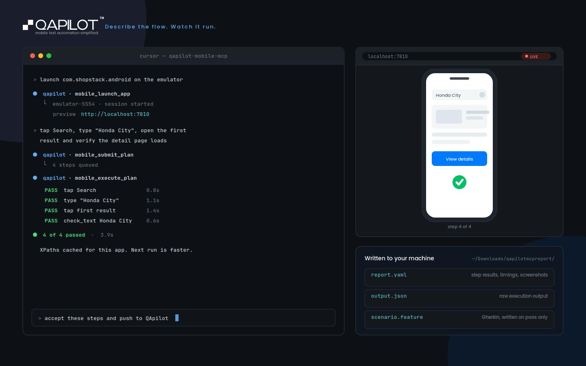
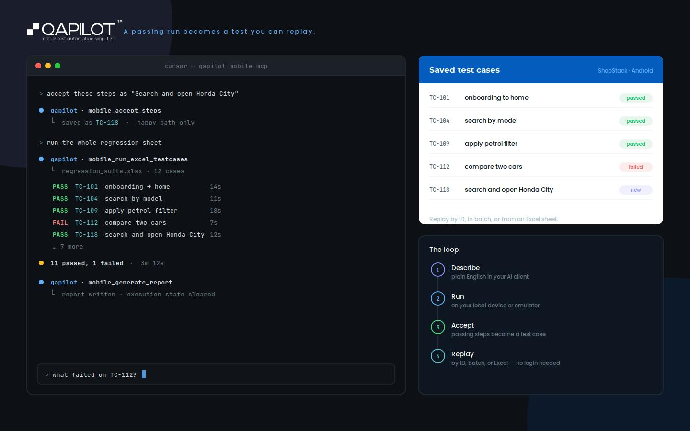

### 🎬 관련 영상
- [🎥 영상 보기](https://ph-files.imgix.net/18d274da-cf22-46dd-88e1-259d4b2a782e.octet-stream?auto=format)

---

## 4. [ABrush](https://www.producthunt.com/products/abrush-ai-2)
**Votes**: 116 | **도입 난이도**: 중 | **신뢰도**: 상
**Tagline**: AI Studio for Digital Artists
**서비스 링크**: https://www.producthunt.com/r/WNR63HR4RGXHOI

**태그**: AI, DigitalArt, Workflow, Productivity, Automation, AI Tool

### 📌 이 서비스 한눈에 보기
아티스트의 창의성을 유지하면서 반복적인 작업을 자동화하는 AI 기반 디지털 아트 스튜디오

### 🔑 주요 기능
- 기존 작업 환경에 통합되는 생산 중심의 AI 워크플로우 제공
- 반복적인 생산 작업을 제거하여 창의적 의사결정 시간 확보
- 아티스트가 최종 결과물을 직접 제어할 수 있는 방식의 AI 활용

### 🙋 사용자에게 어떤 점이 좋은가
단순 반복 작업에 드는 시간과 비용을 줄여, 아티스트가 핵심적인 예술적 결정에만 집중할 수 있게 돕습니다.

### ✅ 지금 바로 써볼 기능
- 기존 워크플로우와의 호환성 확인
- 반복적인 생산 작업 자동화 테스트
- AI 생성 결과물의 제어 기능 테스트

### ⚠️ 사용 전 확인할 점
- 사용자의 기존 작업 환경(소프트웨어 등)과의 통합 방식 확인 필요
- AI가 생성한 결과물의 최종 품질 제어 방식 숙지 필요

### 🧭 확인이 더 필요한 정보
구체적인 지원 소프트웨어 목록과 워크플로우 통합 방식에 대한 정보가 부족합니다.

### 📸 스크린샷 및 갤러리
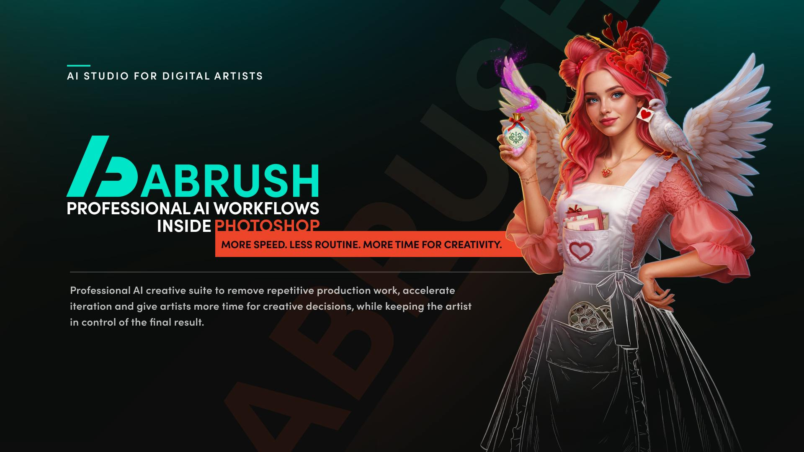
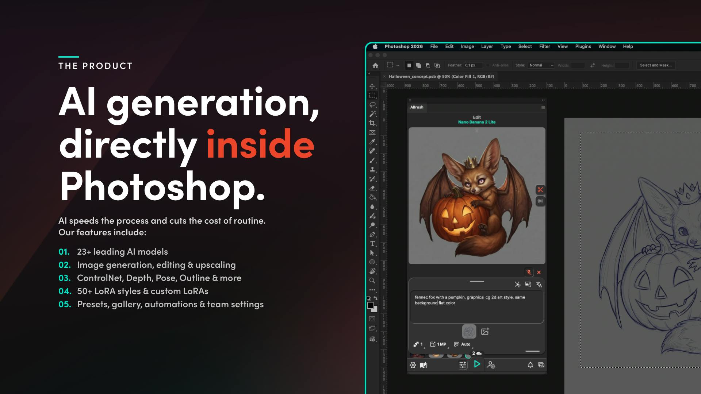
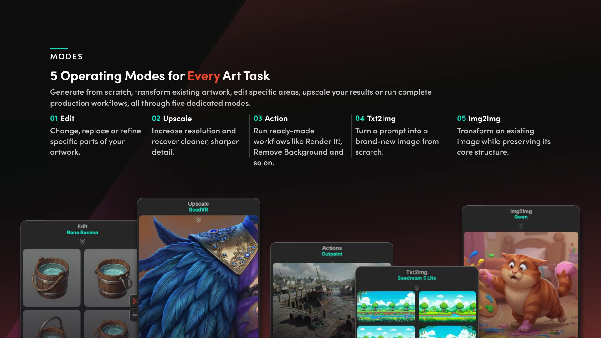

---

## 5. [Calerto for Mac](https://www.producthunt.com/products/calerto-meeting-alarms)
**Votes**: 108 | **도입 난이도**: 하 | **신뢰도**: 상
**Tagline**: Full-screen meeting alerts for your Mac
**서비스 링크**: https://www.producthunt.com/r/EIMZLZC2RBYDC3

**태그**: Productivity, Mac, Calendar, Automation, AI Tool

### 📌 이 서비스 한눈에 보기
중요한 회의를 놓치지 않게 만드는 강력한 전체 화면 알람 서비스

### 🔑 주요 기능
- 무시하기 힘든 전체 화면 방식의 회의 알림
- Apple 및 Google 캘린더 실시간 동기화
- 미팅별 맞춤형 준비 시간 설정 및 메뉴바 카운트다운

### 🙋 사용자에게 어떤 점이 좋은가
단순한 알림을 넘어 회의 직전 강제성을 부여함으로써 일정 지연을 방지하고 준비 시간을 확보해 줍니다.

### ✅ 지금 바로 써볼 기능
- 캘린더 계정 연동하기
- 미팅별 맞춤형 준비 시간(Prep time) 설정하기
- 메뉴바 카운트다운 기능 활성화하기

### ⚠️ 사용 전 확인할 점
- 전체 화면 알림이 업무 집중을 방해할 수 있음
- Mac 전용 앱이므로 다른 OS에서는 사용 불가

### 🧭 확인이 더 필요한 정보
Pro 버전의 구체적인 자동 알람 기능 범위와 가격 정책에 대한 정보가 부족합니다.

### 📸 스크린샷 및 갤러리
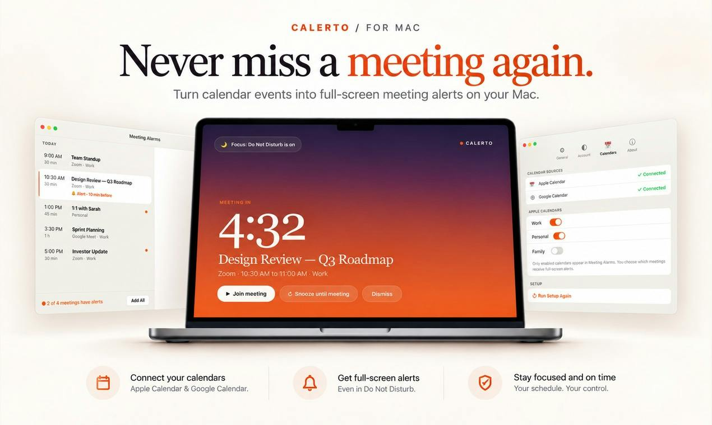

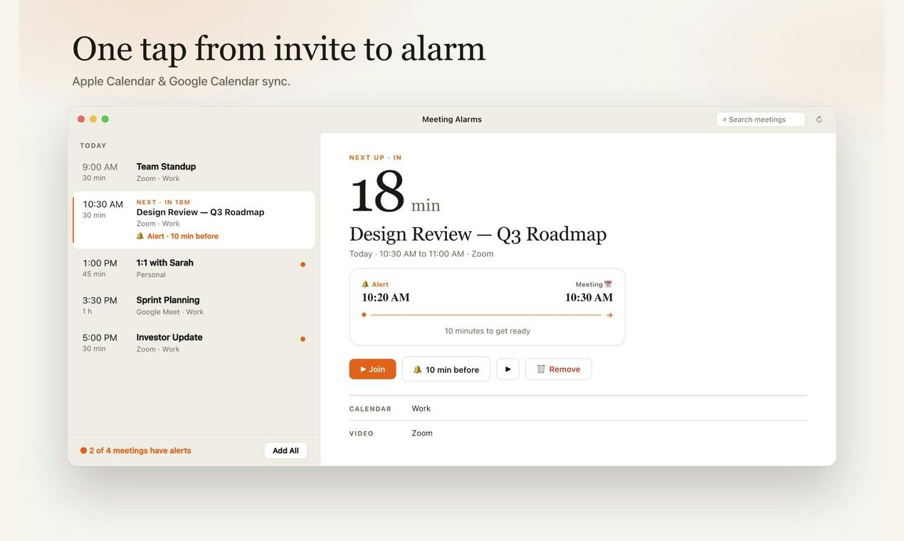

### 🎬 관련 영상
- [🎥 영상 보기](https://ph-files.imgix.net/847f2f84-61dc-4612-be4c-44dcb7c745d4.jpeg?auto=format)

---

## 6. [Kabza](https://www.producthunt.com/products/kabza)
**Votes**: 106 | **도입 난이도**: 하 | **신뢰도**: 상
**Tagline**: Take over a real city map with your friends
**서비스 링크**: https://www.producthunt.com/r/6GDIU67Q3JZ3CV

**태그**: Gaming, Multiplayer, Browser-based, Map-based, AI Tool

### 📌 이 서비스 한눈에 보기
실제 도시 지도를 배경으로 친구들과 영토 점령 전쟁을 벌이는 브라우저 기반 게임

### 🔑 주요 기능
- 인도 주요 도시(Noida, Delhi 등)를 배경으로 한 실시간 영토 점령 게임
- 최대 8인 멀티플레이 또는 봇을 상대로 한 솔로 플레이 지원
- 설치나 계정 생성 없이 브라우저에서 즉시 실행 가능

### 🙋 사용자에게 어떤 점이 좋은가
별도의 설치 과정 없이 웹 브라우저만 있으면 친구들과 즉석에서 경쟁 게임을 즐길 수 있습니다.

### ✅ 지금 바로 써볼 기능
- 친구들과 방을 만들어 멀티플레이 대결하기
- 지도상의 영토를 점령하고 75% 달성 목표 도전하기
- 솔로 모드로 봇과 함께 게임 메커니즘 익히기

### ⚠️ 사용 전 확인할 점
- 특정 지역(인도 도시) 중심의 맵 구성
- 계정 없이 플레이하므로 브라우저 종료 시 데이터 저장 여부 확인 필요

### 🧭 확인이 더 필요한 정보
계정 없이 플레이할 경우 게임 진행 데이터가 영구적으로 저장되는지 여부가 불분명합니다.

### 📸 스크린샷 및 갤러리
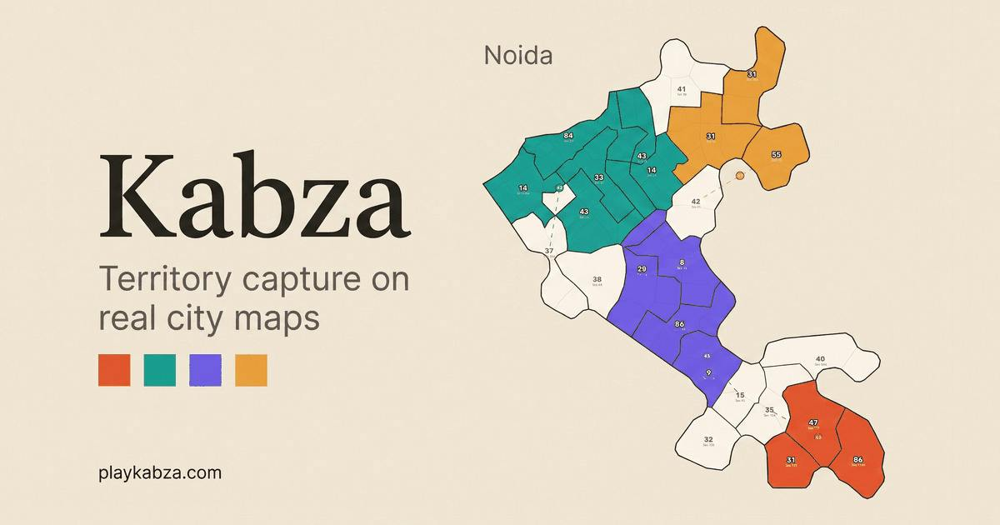

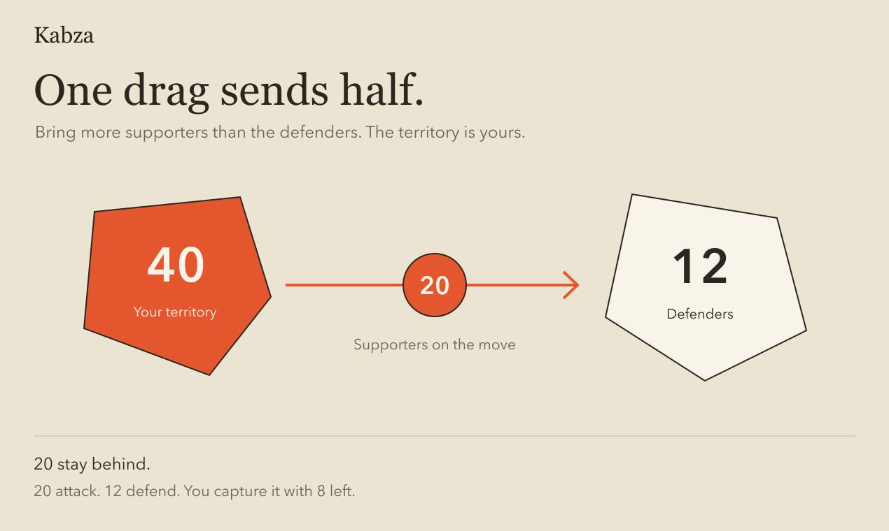

### 🎬 관련 영상
- [🎥 영상 보기](https://ph-files.imgix.net/ad534a46-d6fa-4218-ac82-65d741ba166c.jpeg?auto=format)

---

## 7. [DockFix 5.0](https://www.producthunt.com/products/dockfix)
**Votes**: 91 | **도입 난이도**: 하 | **신뢰도**: 상
**Tagline**: Replace the macOS Dock with one that is truly yours.
**서비스 링크**: https://www.producthunt.com/r/SKJQJW3HCCK5N4

**태그**: macOS, Customization, Productivity, UI/UX

### 📌 이 서비스 한눈에 보기
사용자 취향에 맞춰 macOS 독(Dock)을 완전히 새롭게 커스텀하는 도구

### 🔑 주요 기능
- 색상, 아이콘, 애니메이션 등 자유로운 디자인 커스텀
- 위젯 및 윈도우 미리보기 기능 제공
- 파일을 편리하게 관리할 수 있는 파일 셸(File Shelf) 탑재

### 🙋 사용자에게 어떤 점이 좋은가
기존 macOS 독의 제약에서 벗어나 개인의 작업 스타일과 미적 취향에 최적화된 데스크탑 환경을 구축할 수 있습니다.

### ✅ 지금 바로 써볼 기능
- 나만의 커스텀 색상 및 아이콘 적용하기
- 위젯과 윈도우 미리보기 기능 활용하기
- 파일 셸 기능을 통한 파일 관리 경험하기

### ⚠️ 사용 전 확인할 점
- 기존 macOS 시스템 독을 대체하므로 시스템 리소스 사용량 확인 필요
- macOS 시스템 설정과의 호환성 및 안정성 확인 필요

### 🧭 확인이 더 필요한 정보
시스템 레벨의 변경을 수반하므로 OS 버전별 호환성과 안정성에 대한 정보가 더 필요합니다.

### 📸 스크린샷 및 갤러리
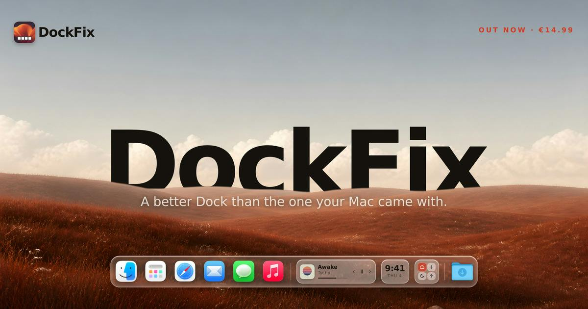

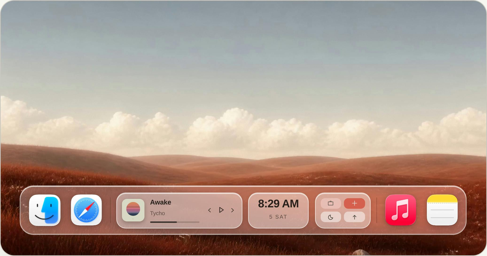

---

## 8. [Marked Share](https://www.producthunt.com/products/marked-share)
**Votes**: 91 | **도입 난이도**: 하 | **신뢰도**: 상
**Tagline**: Markdown and TextBundle editing, review, and sharing
**서비스 링크**: https://www.producthunt.com/r/2MH5GGN2EG7Q4N

**태그**: Writing, Collaboration, Markdown, Publishing, Vision, API

### 📌 이 서비스 한눈에 보기
마크다운 및 TextBundle 문서를 손쉽게 공유하고 협업할 수 있는 도구

### 🔑 주요 기능
- 이미지와 첨부파일이 포함된 마크다운/TextBundle 문서 공유
- 문서 내 하이라이트 및 댓글을 통한 피드백 기능
- RSS/Atom 및 Micro.blog 연동을 통한 블로그 피드 발행 가능

### 🙋 사용자에게 어떤 점이 좋은가
작성한 문서를 웹에 간편하게 게시하고, 타인과 실시간으로 검토 및 피드백을 주고받을 수 있습니다.

### ✅ 지금 바로 써볼 기능
- 기존 마크다운 문서를 업로드하여 공유 링크 생성하기
- 공유된 문서에 하이라이트 및 댓글 기능 테스트하기
- RSS/Atom 피드를 통한 블로그 발행 설정하기

### ⚠️ 사용 전 확인할 점
- Marked 3의 하위 제품이지만 독립적 사용이 가능함을 인지할 것
- 사용 중인 외부 에디터와의 연동 시 API 활용 능력 필요

### 🧭 확인이 더 필요한 정보
사용 중인 외부 에디터와의 완전한 통합을 위한 API의 상세 기능과 제약 사항은 추가 확인이 필요합니다.

### 📸 스크린샷 및 갤러리
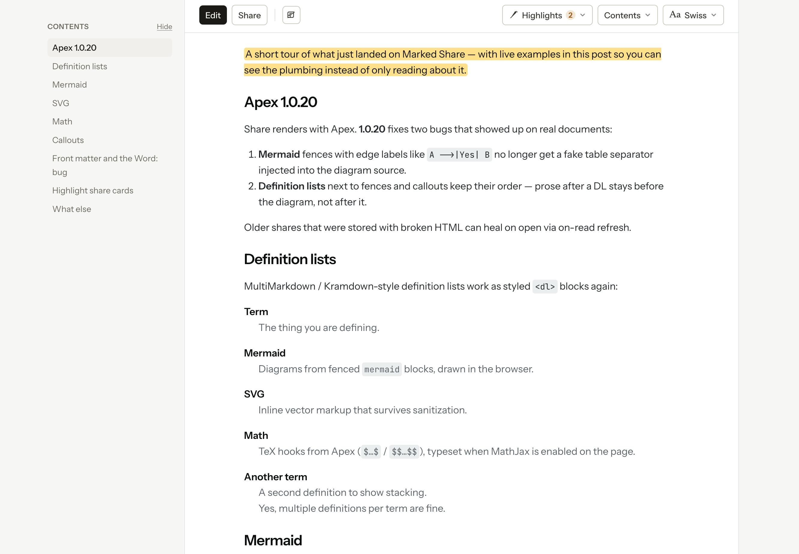
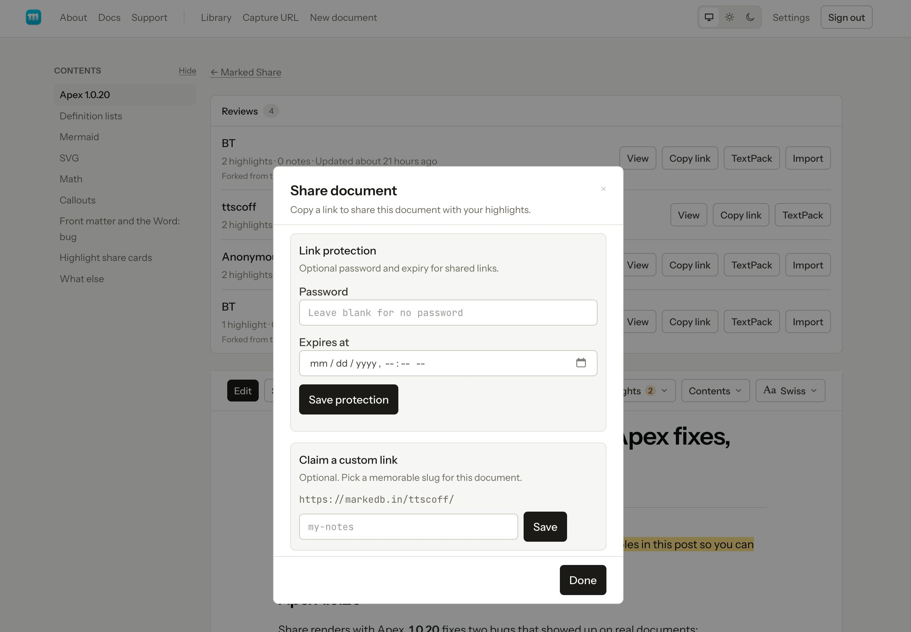
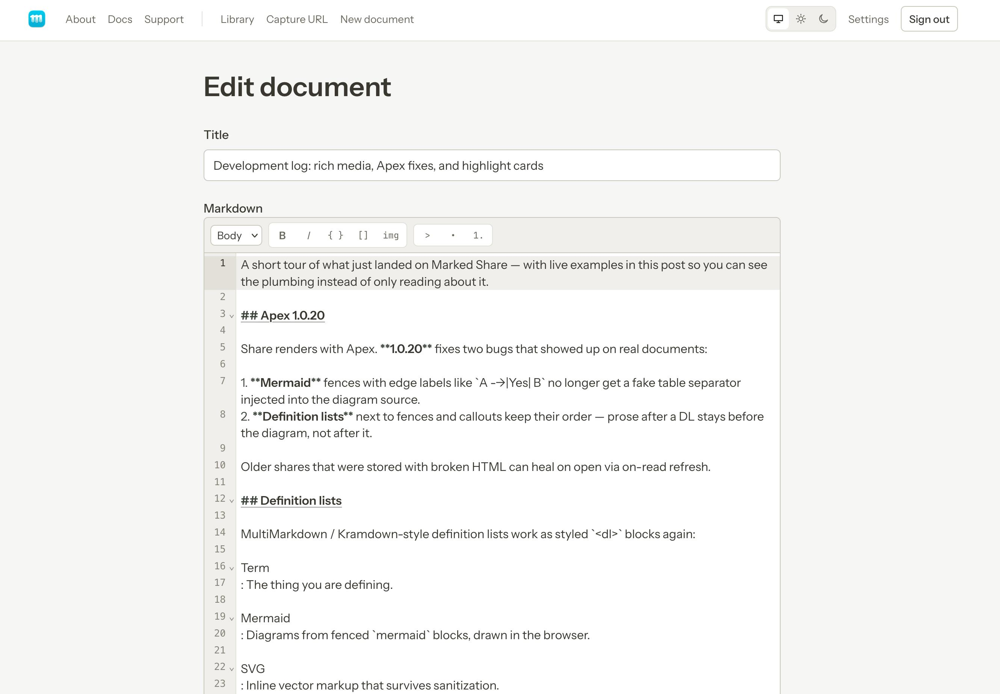

---

## 9. [Wokyintosh](https://www.producthunt.com/products/wokyintosh)
**Votes**: 87 | **도입 난이도**: 하 | **신뢰도**: 상
**Tagline**: Turn a spare Mac display into a retro system dashboard!
**서비스 링크**: https://www.producthunt.com/r/DOU2O35DWJVGFT

**태그**: Productivity, Design, macOS, OpenSource, Dashboard, AI Tool

### 📌 이 서비스 한눈에 보기
남는 맥 디스플레이를 클래식 매킨토시 스타일의 레트로 대시보드로 변신시켜 주는 오픈소스 앱

### 🔑 주요 기능
- 클래식 매킨토시 디자인을 재해석한 레트로 감성 대시보드
- 시계, 날씨, 음악(Apple Music/Spotify) 재생 정보 제공
- CPU, RAM, SSD, 네트워크 등 실시간 시스템 상태 모니터링

### 🙋 사용자에게 어떤 점이 좋은가
보조 모니터를 활용해 데스크테리어를 완성하면서, 동시에 시스템 상태와 음악 정보를 한눈에 확인할 수 있습니다.

### ✅ 지금 바로 써볼 기능
- 보조 디스플레이에 Wokyintosh 실행하기
- 음악 스트리밍 서비스 연동하여 아트워크 감상하기
- 실시간 시스템 리소스 모니터링 기능 확인하기

### ⚠️ 사용 전 확인할 점
- 보조 모니터가 있는 환경에서 가장 효과적임
- 오픈소스 소프트웨어이므로 시스템 리소스 점유율을 확인해야 함

### 🧭 확인이 더 필요한 정보
특정 하드웨어(Wokyis M5) 최적화 목적으로 제작되어, 일반적인 macOS 환경에서의 퍼포먼스는 추가 확인이 필요합니다.

### 📸 스크린샷 및 갤러리
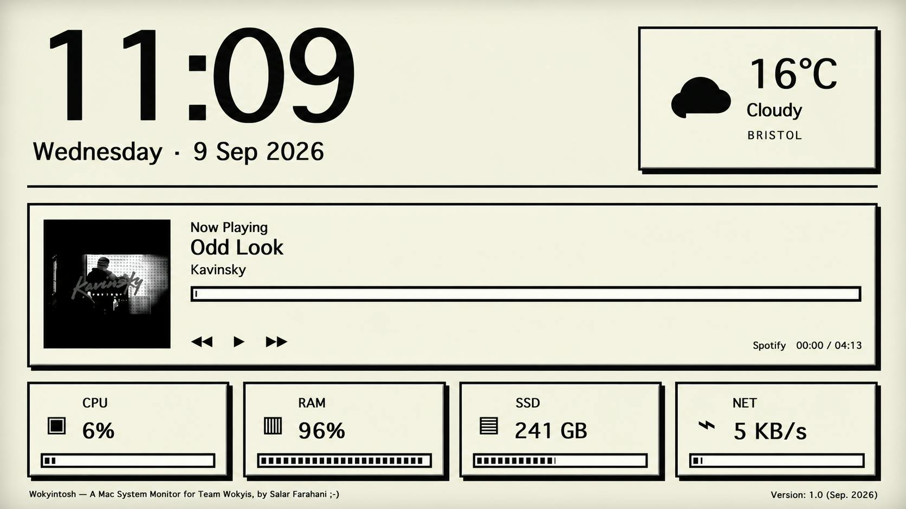
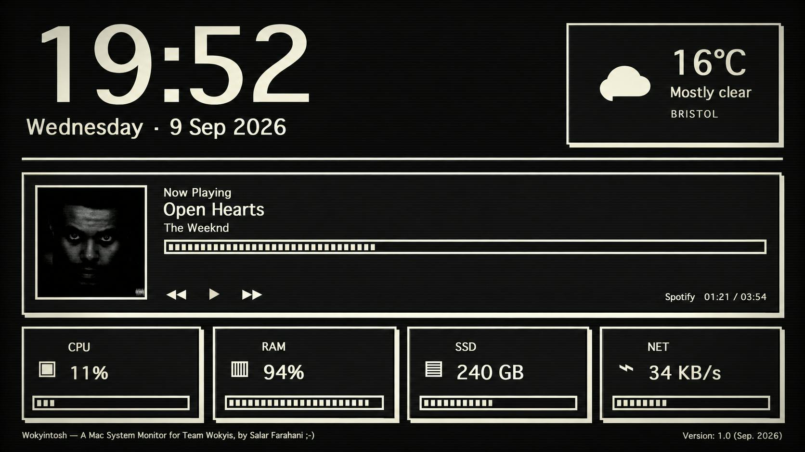
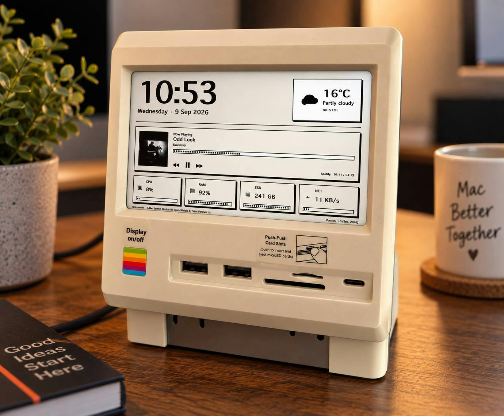

---

## 10. [Stackness](https://www.producthunt.com/products/stackness)
**Votes**: 86 | **도입 난이도**: 하 | **신뢰도**: 상
**Tagline**: Show your stack! The social home for your dev tools
**서비스 링크**: https://www.producthunt.com/r/NHEA5EBWIJFZS2

**태그**: DevTools, Social, Productivity, Workflow, Automation, DevTool

### 📌 이 서비스 한눈에 보기
자신만의 개발 스택을 공유하고 트렌드를 확인하는 개발자용 소셜 프로필 플랫폼

### 🔑 주요 기능
- 자신이 사용하는 개발 도구와 워크플로우를 하나의 프로필로 시각화
- 신뢰하는 개발자의 스택을 팔로우하고 도구의 트렌드를 파악
- MCP(Model Context Protocol) 서버 지원 및 무료 이용 가능

### 🙋 사용자에게 어떤 점이 좋은가
자신의 기술 스택을 하나의 링크로 깔끔하게 보여줄 수 있으며, 다른 전문가들의 도구 선택을 참고하여 작업 효율을 높일 수 있습니다.

### ✅ 지금 바로 써볼 기능
- 자신의 개발 스택 프로필 구축하기
- 신뢰하는 개발자 팔로우하기
- MCP 서버 연결하여 워크플로우에 활용하기

### ⚠️ 사용 전 확인할 점
- 소셜 플랫폼 특성상 개인의 작업 방식이나 도구 사용 내역이 공개됨
- 현재는 초기 단계로 기능 확장 가능성이 높음

### 🧭 확인이 더 필요한 정보
상세한 기능 로드맵과 MCP 서버의 구체적인 활용 범위는 공식 문서를 통해 추가 확인이 필요합니다.

### 📸 스크린샷 및 갤러리
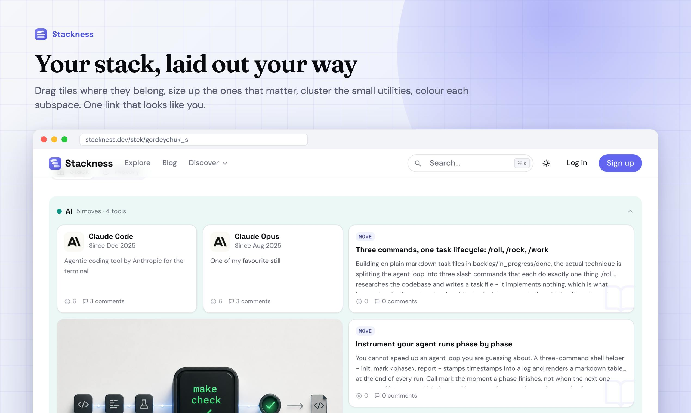
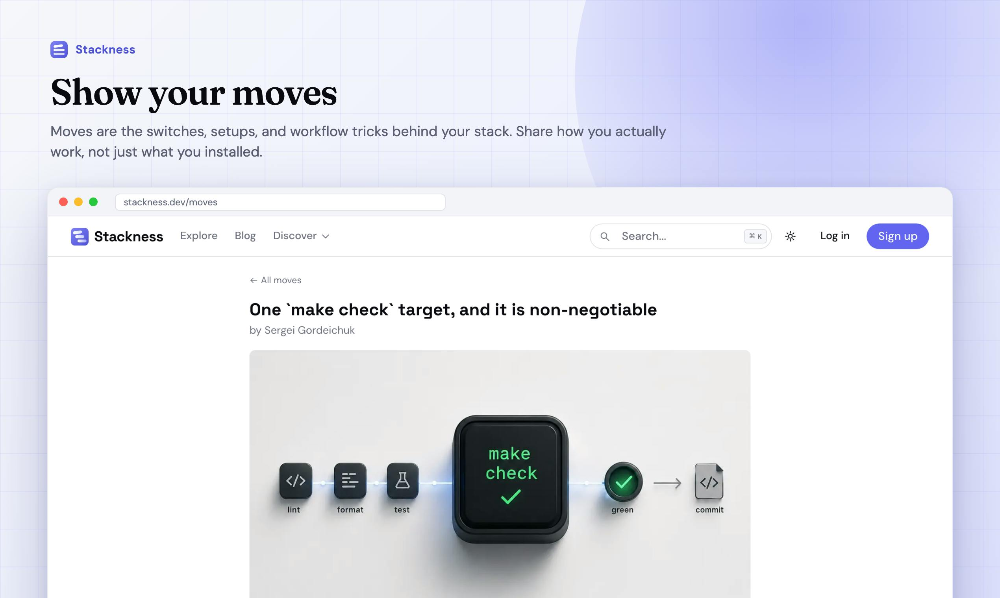
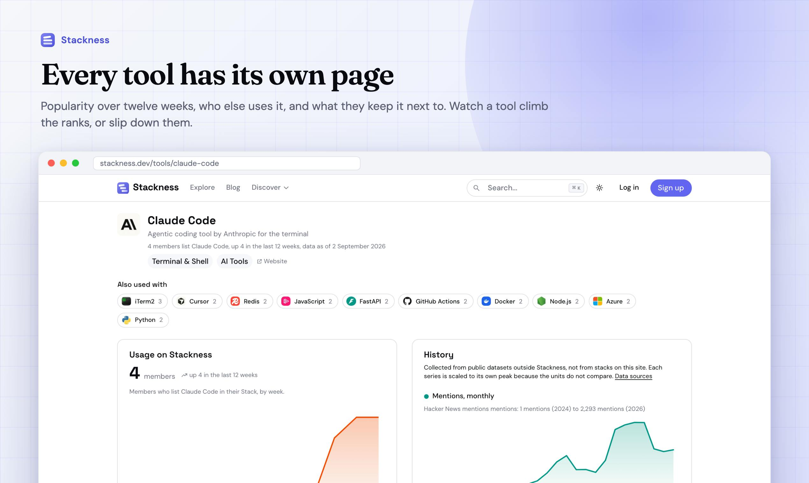

### 🎬 관련 영상
- [🎥 영상 보기](https://ph-files.imgix.net/301dc365-fa06-4a91-9ab0-6692c700deb0.jpeg?auto=format)

---

## 11. [Work Life Panda](https://www.producthunt.com/products/work-life-panda)
**Votes**: 81 | **도입 난이도**: 중 | **신뢰도**: 상
**Tagline**: Every task, every calendar, one app. Private on-device AI
**서비스 링크**: https://www.producthunt.com/r/GSRN6ZOAW64NO5

**태그**: Productivity, Calendar, Task Management, AI, Privacy, AI Tool, Chat

### 📌 이 서비스 한눈에 보기
일정, 할 일, 대화를 하나로 통합한 프라이빗 온디바이스 AI 기반의 올인원 워크스페이스

### 🔑 주요 기능
- 캘린더와 할 일 목록의 유기적 결합
- 모든 작업과 이벤트별 개별 채팅 기능 제공
- 개인정보 보호를 위한 온디바이스 AI 기술 적용

### 🙋 사용자에게 어떤 점이 좋은가
여러 앱을 오갈 필요 없이 일정 관리와 소통을 한 곳에서 해결하여 업무 흐름을 단순화할 수 있습니다.

### ✅ 지금 바로 써볼 기능
- 기존 일정과 할 일 목록을 하나로 통합하기
- 각 작업별 전용 채팅창 활용해보기
- 온디바이스 AI의 프라이버시 보안 수준 확인하기

### ⚠️ 사용 전 확인할 점
- 기존에 사용하던 외부 캘린더/할 일 앱과의 동기화 범위 확인 필요
- 온디바이스 AI 환경에서의 기능 제약 여부 확인 필요

### 🧭 확인이 더 필요한 정보
현재 제공되는 기능이 모바일과 데스크톱 환경에서 어떻게 동기화되는지 명확하지 않습니다.

### 📸 스크린샷 및 갤러리
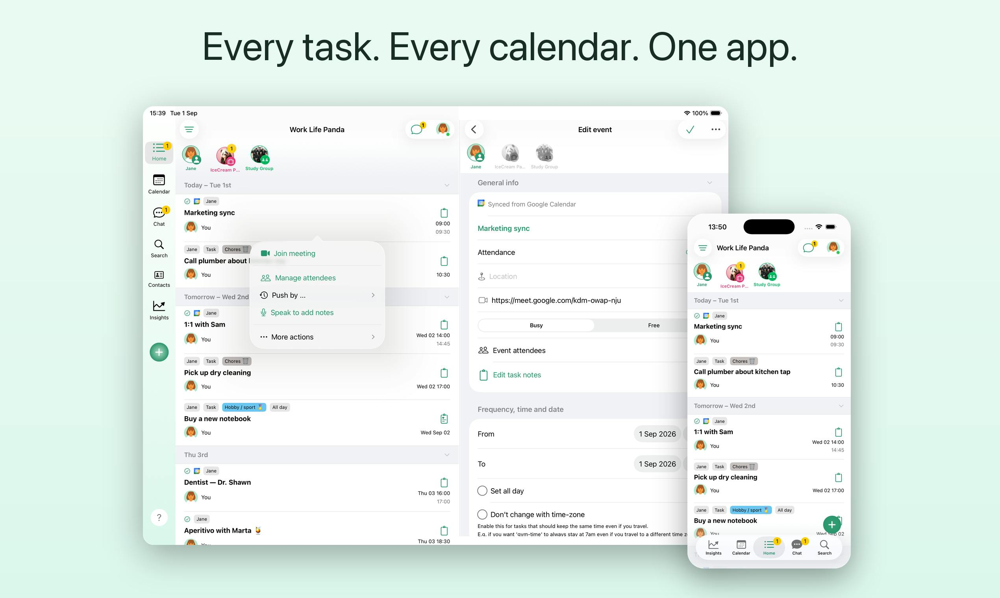
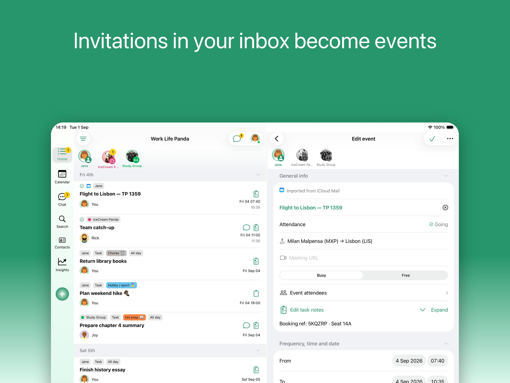
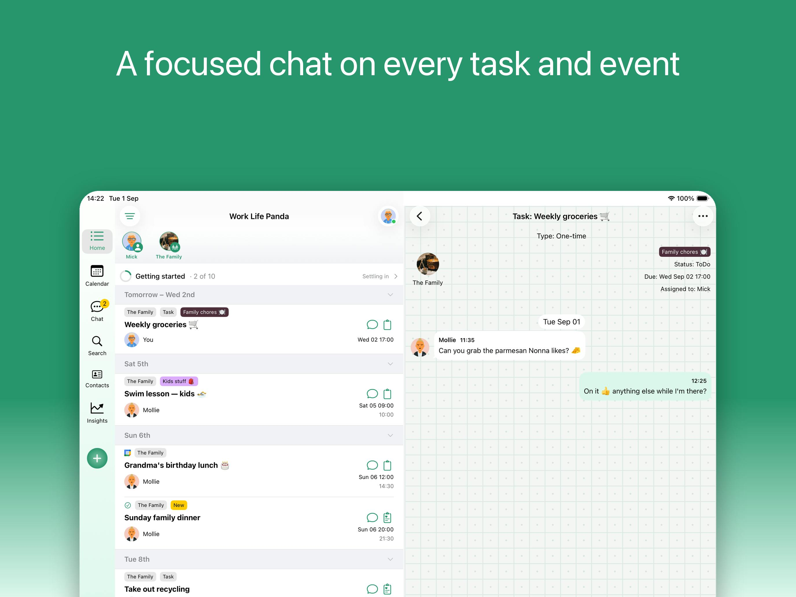

### 🎬 관련 영상
- [🎥 영상 보기](https://ph-files.imgix.net/80e72424-460b-4996-8e18-da2a090949d0.jpeg?auto=format)

---

## 12. [VoxelWall](https://www.producthunt.com/products/voxelwall)
**Votes**: 79 | **도입 난이도**: 하 | **신뢰도**: 상
**Tagline**: Music-reactive live wallpapers for Mac
**서비스 링크**: https://www.producthunt.com/r/WYFJX7UWCZMLGR

**태그**: macOS, Customization, Design, Productivity, Video

### 📌 이 서비스 한눈에 보기
맥에서 듣는 모든 음악에 실시간으로 반응하는 고성능 라이브 월페이퍼 엔진

### 🔑 주요 기능
- 시스템 오디오를 로컬에서 분석하여 실시간으로 반응하는 37종의 오리지널 장면 제공
- 반복되는 영상 재생 방식이 아닌 Metal 엔진을 활용한 실시간 렌더링 방식
- Spotify, Apple Music, YouTube 등 모든 시스템 오디오 소스와 호환

### 🙋 사용자에게 어떤 점이 좋은가
단순한 배경화면을 넘어, 사용자가 듣는 음악에 맞춰 시각적 몰입감을 제공하는 역동적인 데스크탑 환경을 구축할 수 있습니다.

### ✅ 지금 바로 써볼 기능
- 37종의 오리지널 장면 중 취향에 맞는 장면 선택하기
- Spotify나 YouTube를 재생하며 실시간 반응 확인하기
- 데스크탑, 잠금 화면, 에너지 절약 모드 설정 최적화하기

### ⚠️ 사용 전 확인할 점
- 실시간 렌더링 방식이므로 시스템 리소스(CPU/GPU) 사용량을 확인해야 함
- macOS 시스템 오디오 권한 설정이 필요할 수 있음

### 🧭 확인이 더 필요한 정보
Metal 엔진 기반의 실시간 렌더링이 배터리 소모에 미치는 구체적인 영향은 확인이 필요합니다.

### 📸 스크린샷 및 갤러리
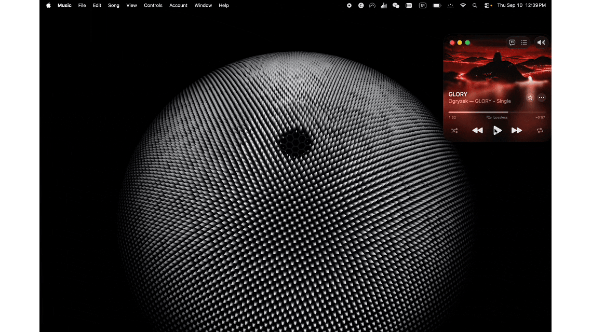
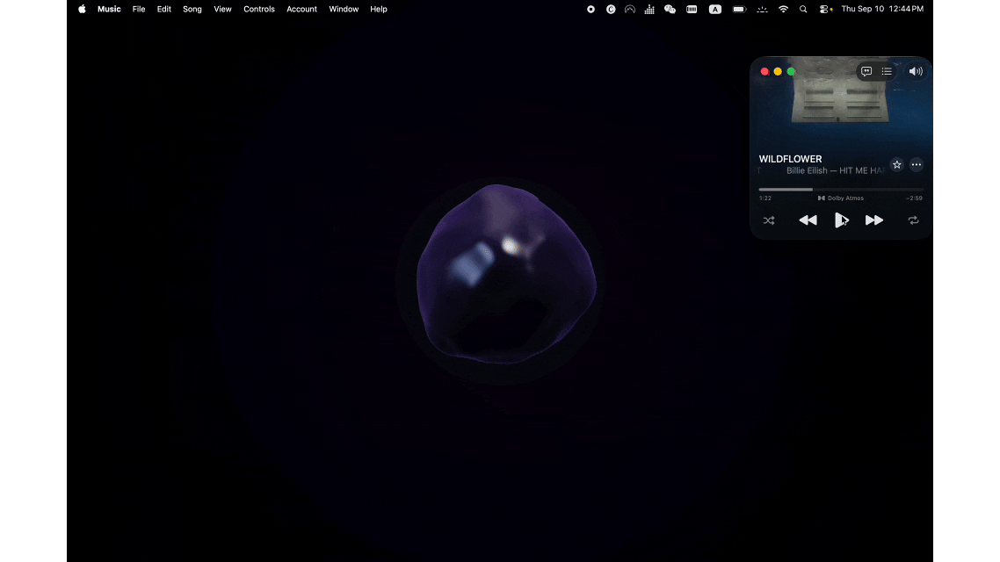
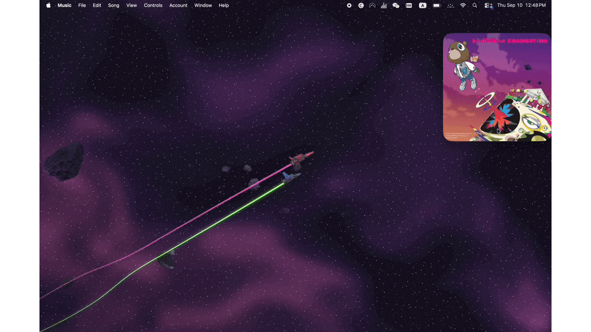

### 🎬 관련 영상
- [🎥 영상 보기](https://ph-files.imgix.net/0e5e9ba3-cfc2-442a-aa7e-713bb504b946.jpeg?auto=format)

---

## 13. [Relic](https://www.producthunt.com/products/relic-copy-vault)
**Votes**: 79 | **도입 난이도**: 하 | **신뢰도**: 상
**Tagline**: A private, synced vault of everything you copy
**서비스 링크**: https://www.producthunt.com/r/Z6JCAYH4TDTK57

**태그**: Productivity, Utility, Sync, Privacy, Vision

### 📌 이 서비스 한눈에 보기
복사한 모든 것을 기기 간 안전하게 동기화하고 즉시 불러오는 프라이빗 클립보드 볼트

### 🔑 주요 기능
- 복사한 텍스트, 이미지, 파일 등을 자동으로 저장하고 관리
- 온디바이스 AI를 통한 데이터 이해 및 기기 간 실시간 동기화
- 키보드를 떠나지 않고 단축키로 필요한 정보를 즉시 호출

### 🙋 사용자에게 어떤 점이 좋은가
여러 기기를 오가며 작업할 때 복사한 내용을 일일이 옮길 필요 없이, 마치 하나의 거대한 클립보드를 사용하는 것처럼 작업 흐름을 유지할 수 있습니다.

### ✅ 지금 바로 써볼 기능
- 단축키를 설정하여 키보드 작업 흐름에 통합하기
- 텍스트 스니펫과 이미지를 저장하여 나만의 지식 저장소로 활용하기
- 모바일과 데스크톱 간의 동기화 기능 테스트하기

### ⚠️ 사용 전 확인할 점
- 모든 복사 데이터가 저장되므로 민감한 개인정보 유출에 주의 필요
- 기기 사양에 따른 온디바이스 처리 성능 영향 확인 필요

### 🧭 확인이 더 필요한 정보
데이터 보안 방식과 구체적인 온디바이스 AI 모델의 작동 범위에 대한 상세 정보가 필요합니다.

### 📸 스크린샷 및 갤러리

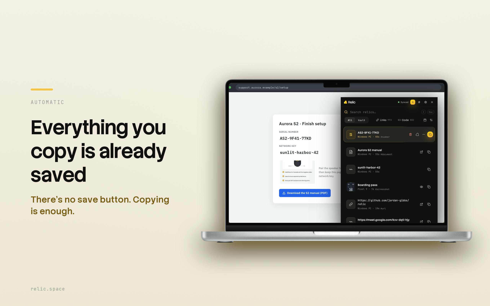
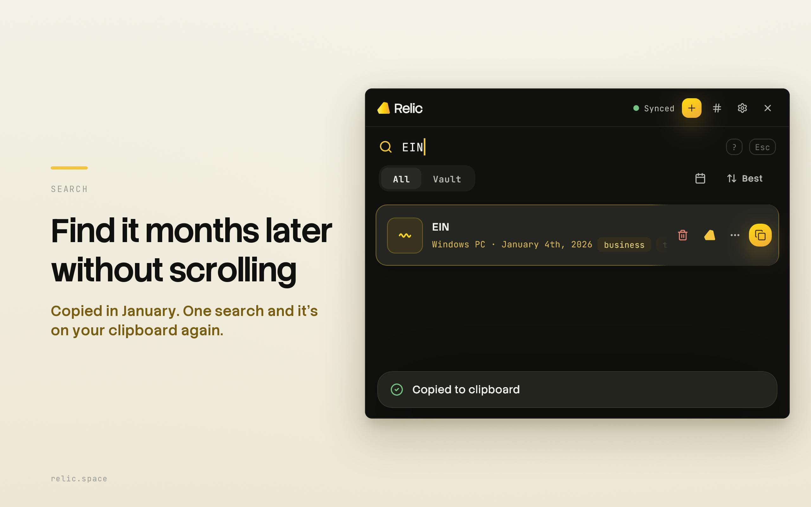

### 🎬 관련 영상
- [🎥 영상 보기](https://ph-files.imgix.net/396d7916-99bd-4544-a172-1aabca79e803.gif?auto=format)

---

## 14. [Captain Kill Switch](https://www.producthunt.com/products/captain-kill-switch)
**Votes**: 74 | **도입 난이도**: 하 | **신뢰도**: 상
**Tagline**: Close all your open apps in one click
**서비스 링크**: https://www.producthunt.com/r/JVJL5L2YTRCSUS

**태그**: Productivity, Utility, Automation, Cross-Platform, AI Tool

### 📌 이 서비스 한눈에 보기
클릭 한 번으로 모든 실행 중인 앱을 즉시 종료하여 작업 환경을 초기화하는 도구

### 🔑 주요 기능
- 단 한 번의 클릭으로 모든 실행 앱 종료
- macOS, Windows, Linux를 지원하는 크로스 플랫폼
- 개인정보를 보호하는 프라이버시 중심 설계

### 🙋 사용자에게 어떤 점이 좋은가
복잡한 작업 환경을 즉시 정리하고 새로운 작업에 집중할 수 있는 깨끗한 상태를 만들어줍니다.

### ✅ 지금 바로 써볼 기능
- 메뉴 바에 설치하여 즉시 사용해보기
- 플랫폼별(macOS/Windows/Linux) 호환성 확인하기

### ⚠️ 사용 전 확인할 점
- 저장되지 않은 작업 내용이 손실될 수 있으므로 주의 필요
- 백그라운드에서 실행 중인 필수 프로세스까지 종료될 가능성 확인 필요

### 🧭 확인이 더 필요한 정보
사용자 설정에 따라 특정 앱을 제외하는 화이트리스트 기능이 있는지 확인이 필요합니다.

### 📸 스크린샷 및 갤러리
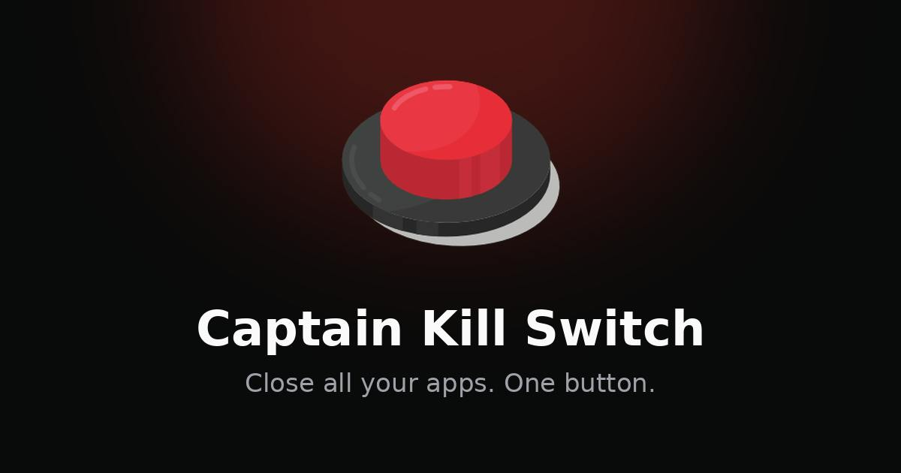
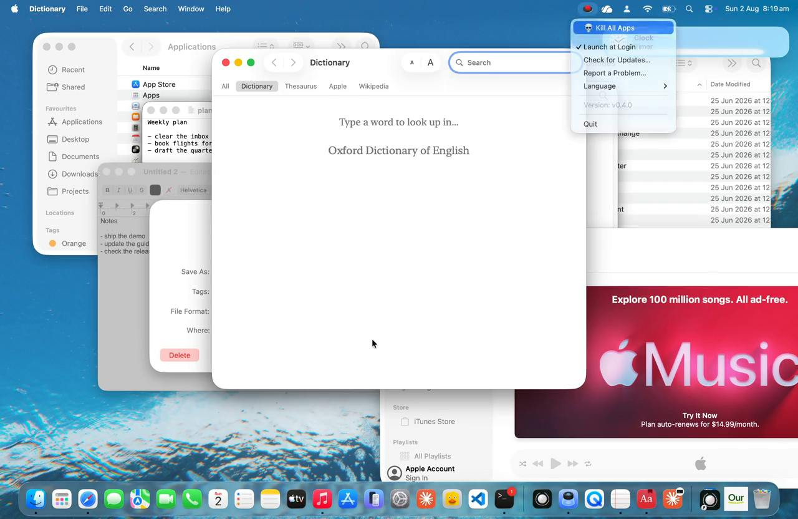

### 🎬 관련 영상
- [🎥 영상 보기](https://ph-files.imgix.net/52c2459a-e766-4dd1-885f-e497da6ed006.jpeg?auto=format)

---

## 15. [Pascal’s Pager](https://www.producthunt.com/products/pascal-s-pager)
**Votes**: 71 | **도입 난이도**: 하 | **신뢰도**: 상
**Tagline**: Turn webhook JSON into readable iPhone push notifications
**서비스 링크**: https://www.producthunt.com/r/GPBP6USTE4A6RV

**태그**: DevTool, Automation, AI, Productivity, AI Tool

### 📌 이 서비스 한눈에 보기
복잡한 웹훅 JSON 데이터를 읽기 쉬운 아이폰 푸시 알림으로 변환해주는 AI 도구

### 🔑 주요 기능
- AI를 활용해 가공되지 않은 JSON 데이터를 핵심 요약 알림으로 변환
- 서비스별 전용 URL 제공 및 민감 정보 마스킹 기능 지원
- 관련 웹훅 그룹화 및 30일간의 페이로드 검토 기능 제공

### 🙋 사용자에게 어떤 점이 좋은가
매번 파서를 작성할 필요 없이, 복잡한 웹훅 데이터를 모바일에서 즉시 확인 가능한 유용한 정보로 바꿀 수 있습니다.

### ✅ 지금 바로 써볼 기능
- 서비스별 전용 URL 생성 및 웹훅 연결하기
- AI가 무엇을 추출할지 핵심 규칙 설정하기
- 민감 데이터 마스킹 설정 확인하기

### ⚠️ 사용 전 확인할 점
- AI 처리 전 민감한 데이터가 유출되지 않도록 마스킹 설정 필수
- 처리된 페이로드 보관 기간이 30일로 제한됨

### 🧭 확인이 더 필요한 정보
AI 모델의 구체적인 종류와 데이터 보안 처리 방식에 대한 상세 정보가 필요합니다.

### 📸 스크린샷 및 갤러리
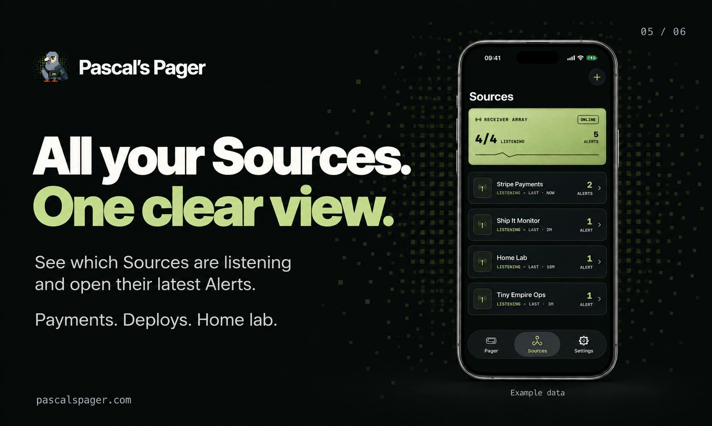
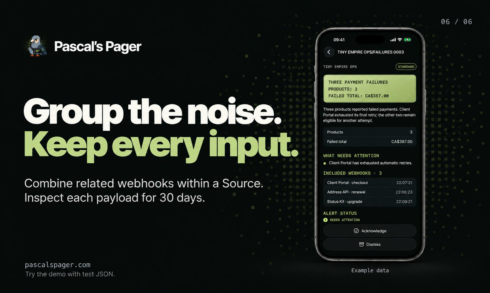
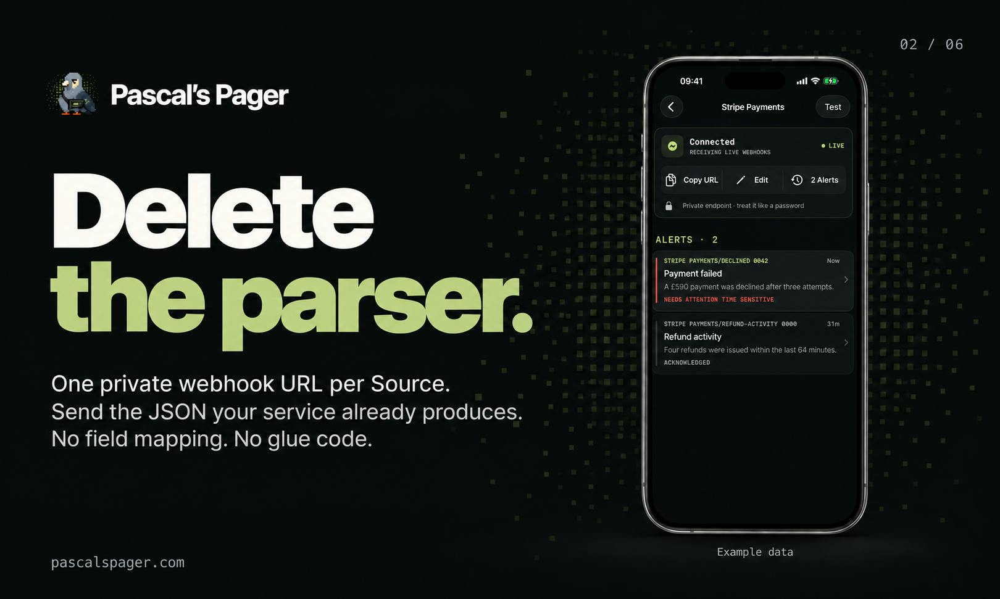

### 🎬 관련 영상
- [🎥 영상 보기](https://ph-files.imgix.net/83207a3c-706a-4f6a-bd77-4707fb0c7839.jpeg?auto=format)

---

## 16. [LinkFlick](https://www.producthunt.com/products/linkflick)
**Votes**: 68 | **도입 난이도**: 하 | **신뢰도**: 상
**Tagline**: Stop re-pairing your Magic Keyboard between Macs
**서비스 링크**: https://www.producthunt.com/r/FEWLUEUKW6V4KK

**태그**: Productivity, macOS, Automation, Hardware, AI Tool

### 📌 이 서비스 한눈에 보기
여러 대의 Mac 사이에서 매직 키보드와 마우스를 간편하게 전환해주는 블루투스 스위칭 도구

### 🔑 주요 기능
- 단축키나 Siri 명령어를 통한 간편한 기기 전환
- 서로 다른 Apple ID를 사용하는 Mac 간의 기기 공유 문제 해결
- 메뉴 바 상주형 앱 및 배터리 부족 알림 기능 제공

### 🙋 사용자에게 어떤 점이 좋은가
개인용 Mac과 업무용 Mac을 동시에 사용하는 사용자가 매번 블루투스 페어링을 다시 할 필요 없이 즉시 기기를 전환할 수 있게 해줍니다.

### ✅ 지금 바로 써볼 기능
- 사용자 지정 단축키 설정하기
- Siri를 통한 음성 제어 테스트하기
- 메뉴 바에서 배터리 상태 확인하기

### ⚠️ 사용 전 확인할 점
- 초기 개발 단계로 일부 기능이 불안정할 수 있음
- 블루투스 기반이므로 기기 간 전환 시 약간의 지연이 발생할 수 있음

### 🧭 확인이 더 필요한 정보
현재 제품이 초기 개발 단계(rough around the edges)이므로 모든 macOS 버전에서의 안정성을 확인해야 합니다.

### 📸 스크린샷 및 갤러리
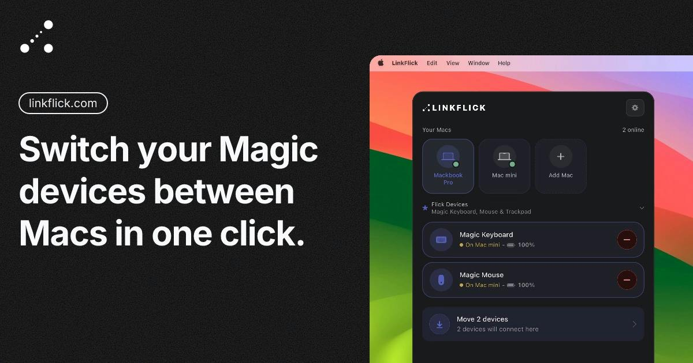
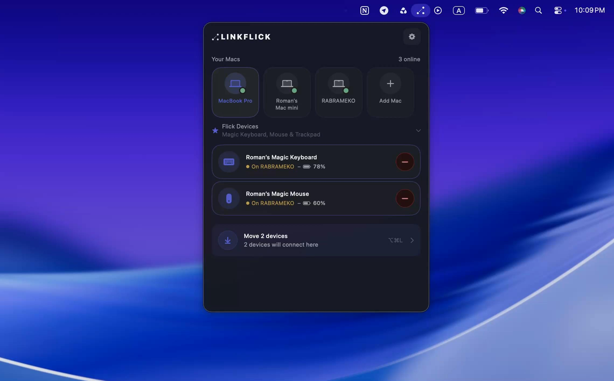
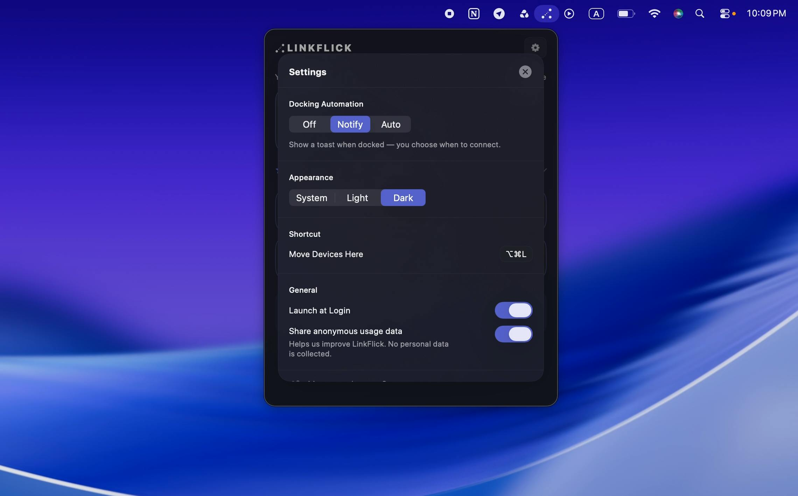

---

## 17. [SUDARI](https://www.producthunt.com/products/sudari)
**Votes**: 66 | **도입 난이도**: 하 | **신뢰도**: 상
**Tagline**: A pixel otter desktop pet that reacts to how you work
**서비스 링크**: https://www.producthunt.com/r/UQ6KXSRZZGHRQ7

**태그**: Productivity, DesktopPet, OpenSource, Lifestyle, Agent, AI Tool

### 📌 이 서비스 한눈에 보기
사용자의 작업 방식에 반응하며 교감하는 픽셀 아트 스타일의 데스크톱 펫

### 🔑 주요 기능
- 커서 추적, 타이핑 반응, 스크롤 반응 등 작업 활동에 반응하는 애니메이션
- 뽀모도로 타이머 및 건강 관리(수분 섭취, 스트레칭) 알림 기능 포함
- 계정 생성이나 데이터 수집이 없는 오픈 소스 기반의 프라이버시 중심 설계

### 🙋 사용자에게 어떤 점이 좋은가
데스크톱 환경에 귀여운 동반자를 추가하여 작업 중 소소한 즐거움을 얻고, 뽀모도로와 건강 알림을 통해 생산성 및 루틴 관리를 돕습니다.

### ✅ 지금 바로 써볼 기능
- 8가지 털 색상 중 취향에 맞는 스타일 선택하기
- 뽀모도로 타이머 기능을 활용한 집중 시간 갖기
- 작업 중 수분 섭취 및 스트레칭 알림 설정하기

### ⚠️ 사용 전 확인할 점
- 데스크톱 화면 일부를 점유하므로 작업 공간이 좁을 경우 시각적 방해가 될 수 있음
- 애니메이션 실행으로 인한 미세한 시스템 리소스 사용 가능성

### 🧭 확인이 더 필요한 정보
Windows 및 Mac 지원이 명시되어 있으나, 저사양 기기에서의 퍼포먼스 영향은 확인이 필요합니다.

### 📸 스크린샷 및 갤러리
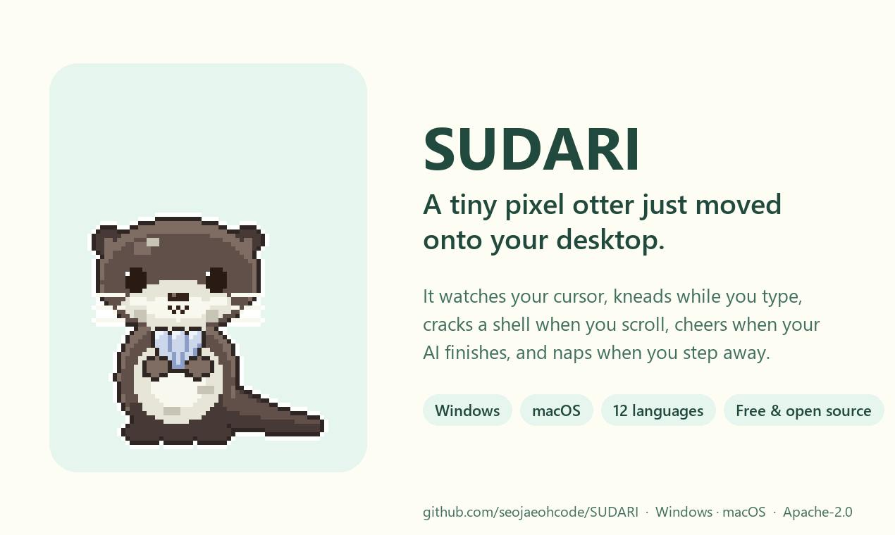
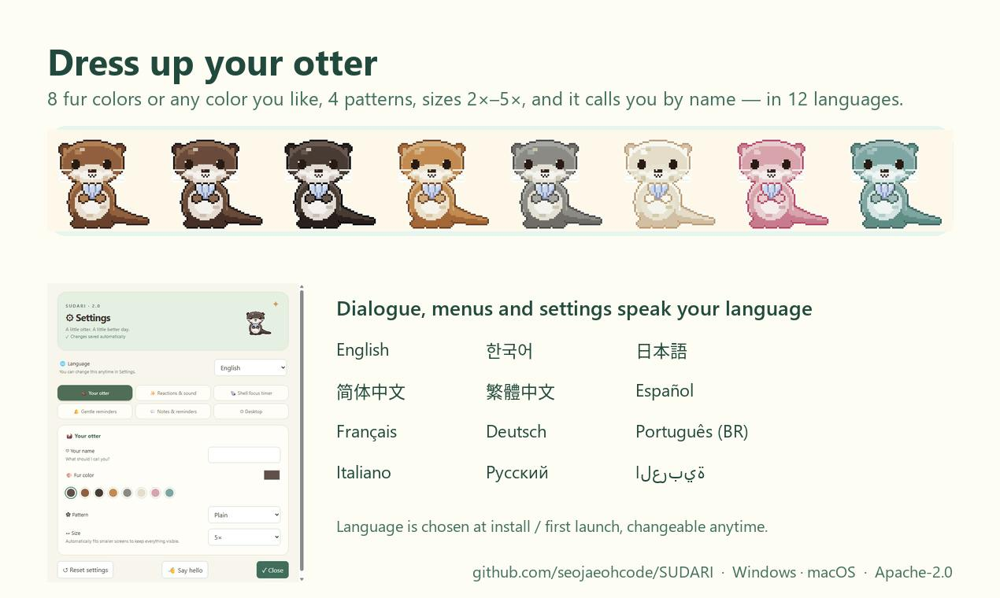
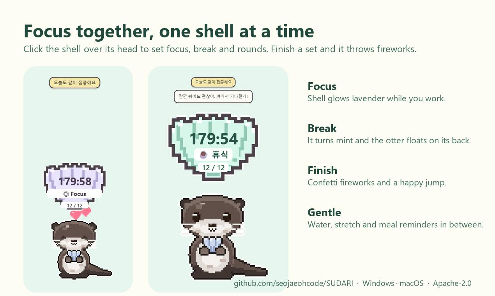

---

## 18. [FrameSketch](https://www.producthunt.com/products/framesketch)
**Votes**: 65 | **도입 난이도**: 하 | **신뢰도**: 상
**Tagline**: Scrub vids frame-by-frame and sketch on them at 60fps 
**서비스 링크**: https://www.producthunt.com/r/AOL5XXWVBOIHL6

**태그**: Animation, VFX, DesignTool, Privacy, Video, Design

### 📌 이 서비스 한눈에 보기
영상 프레임 단위 스크러빙과 실시간 스케치를 지원하는 프라이버시 중심의 애니메이션 도구

### 🔑 주요 기능
- 60fps의 부드러운 프레임 단위 스크러빙 및 스케치 기능
- 100% 클라이언트 사이드 동작으로 강력한 개인정보 보호
- 애니메이터, VFX 아티스트, 모션 디자이너를 위한 최적화된 워크플로우

### 🙋 사용자에게 어떤 점이 좋은가
영상을 프레임 단위로 정밀하게 제어하며 그 위에 직접 스케치할 수 있어 애니메이션 및 VFX 작업 효율을 높여줍니다.

### ✅ 지금 바로 써볼 기능
- 영상 파일을 드롭하여 프레임 스크러빙 테스트하기
- 프레임 위에서 직접 스케치 기능 사용해보기
- 로컬 환경에서의 퍼포먼스 확인하기

### ⚠️ 사용 전 확인할 점
- 클라이언트 사이드 작업이므로 고해상도 영상 처리 시 로컬 하드웨어 성능에 의존함
- 스케치 데이터의 저장 및 내보내기(Export) 방식 확인 필요

### 🧭 확인이 더 필요한 정보
스케치한 결과물을 영상 파일로 다시 내보내는 기능이나 지원하는 파일 포맷에 대한 정보가 명시되지 않았습니다.

### 📸 스크린샷 및 갤러리

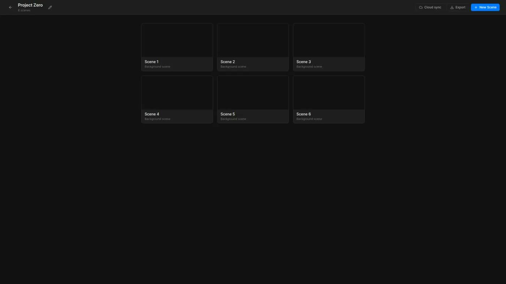

---

## 19. [Duos 2.0](https://www.producthunt.com/products/duos-business-interview-game)
**Votes**: 36 | **도입 난이도**: 하 | **신뢰도**: 상
**Tagline**: Stop guessing why you're not getting hired
**서비스 링크**: https://www.producthunt.com/r/6J6AR3VEZ4CSYO

**태그**: AI, Career, Interview Prep, EdTech, Agent, AI Tool

### 📌 이 서비스 한눈에 보기
실제 면접 상황을 재현한 AI 멀티 에이전트 기반의 인터뷰 연습 플랫폼

### 🔑 주요 기능
- 채용 공고를 기반으로 한 맞춤형 AI 면접 시뮬레이션
- 사용자의 이력서를 숙지한 AI 면접관과의 실전 같은 대화
- 면접 후 상세한 피드백을 제공하는 디브리핑 시스템

### 🙋 사용자에게 어떤 점이 좋은가
면접의 불확실성을 줄이기 위해 실제와 유사한 환경에서 반복적인 연습과 피드백을 받을 수 있습니다.

### ✅ 지금 바로 써볼 기능
- 지원하려는 채용 공고 붙여넣기
- 자신의 이력서 업로드하기
- AI 면접관과 실전 모의 면접 진행하기

### ⚠️ 사용 전 확인할 점
- AI 모델의 특성상 실제 면접관의 의도와는 차이가 있을 수 있음
- 사용자의 실제 이력서 데이터 보안 및 개인정보 관리 확인 필요

### 🧭 확인이 더 필요한 정보
멀티 에이전트 스택이 구체적으로 어떤 기술적 차별점을 제공하는지 명시되지 않았습니다.

### 📸 스크린샷 및 갤러리

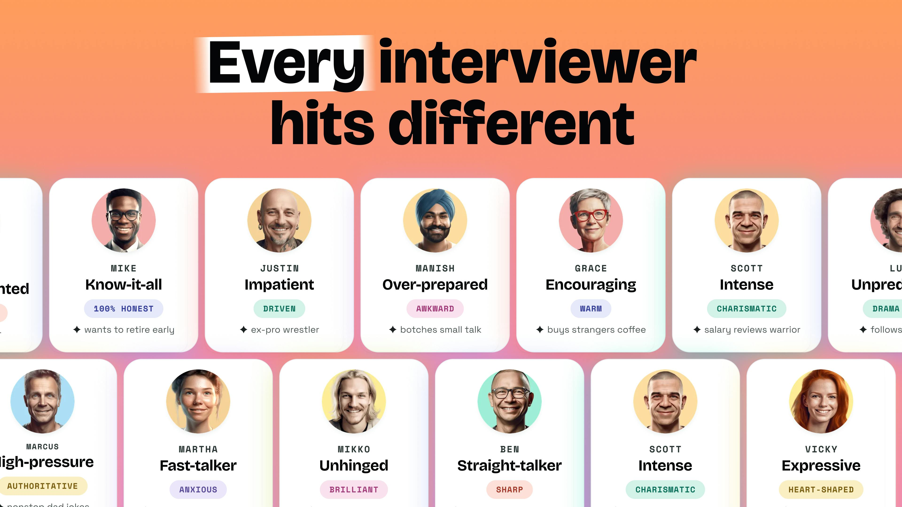
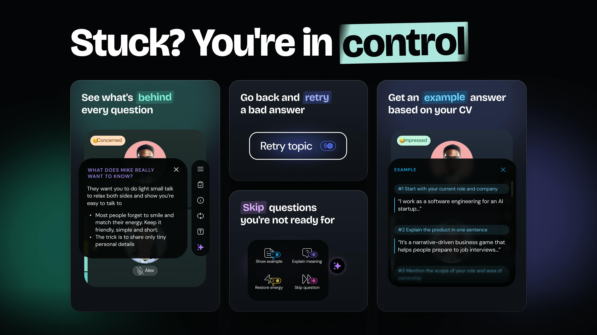

### 🎬 관련 영상
- [🎥 영상 보기](https://ph-files.imgix.net/2248a41d-492e-4d0f-86a6-129ffd3fc11a.jpeg?auto=format)

---

## 20. [Coldlineai](https://www.producthunt.com/products/coldlineai)
**Votes**: 18 | **도입 난이도**: 하 | **신뢰도**: 상
**Tagline**: Turn cold prospects into hot leads with AI-powered pitches
**서비스 링크**: https://www.producthunt.com/r/BZGTXPI52PAPIP

**태그**: Sales, AI, Automation, Marketing, Productivity, AI Tool

### 📌 이 서비스 한눈에 보기
AI를 활용해 잠재 고객 맞춤형 피치를 생성하여 응답률을 높이는 영업 자동화 도구

### 🔑 주요 기능
- 잠재 고객 정보를 입력하면 맞춤형 피치 자동 생성
- 사람이 직접 쓴 듯한 자연스러운 메시지 생성
- 영업 메시지 작성 시간 단축 및 효율성 증대

### 🙋 사용자에게 어떤 점이 좋은가
반복적인 콜드 메일 작성 업무를 자동화하여 영업 팀과 창업자가 더 많은 잠재 고객에게 빠르게 접근할 수 있게 해줍니다.

### ✅ 지금 바로 써볼 기능
- 잠재 고객 상세 정보 입력해보기
- 생성된 맞춤형 피치 검토 및 수정하기
- 생성된 메시지를 실제 영업 채널에 적용하기

### ⚠️ 사용 전 확인할 점
- AI 생성 메시지의 경우 최종 발송 전 반드시 사람이 검토해야 함
- 입력하는 고객 데이터의 개인정보 보호 및 보안 정책 확인 필요

### 🧭 확인이 더 필요한 정보
현재 제공되는 메시지 템플릿의 종류와 지원하는 언어 범위를 확인해야 합니다.

### 📸 스크린샷 및 갤러리
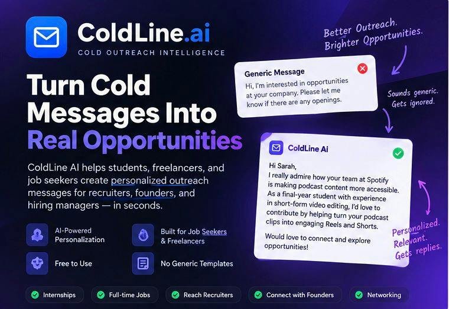
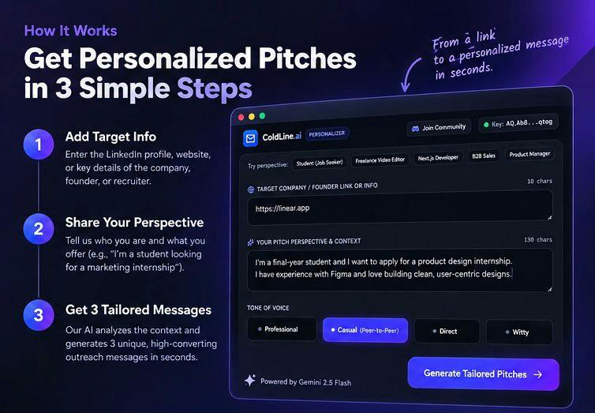
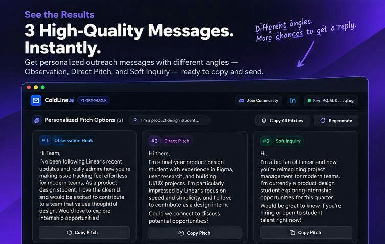

### 🎬 관련 영상
- [🎥 영상 보기](https://ph-files.imgix.net/c030df06-0de2-4f42-84a2-bacfe5b6dc28.jpeg?auto=format)

---

## 21. [ClearList.me](https://www.producthunt.com/products/clearlist-me)
**Votes**: 16 | **도입 난이도**: 하 | **신뢰도**: 상
**Tagline**: No more "is this still available?" Your whole sale run by AI
**서비스 링크**: https://www.producthunt.com/r/CBIWBIBO7XVJYJ

**태그**: AI, Automation, Resale, Productivity, Agent, AI Tool, Chat

### 📌 이 서비스 한눈에 보기
AI가 상품 등록부터 가격 책정, 구매자 관리까지 전 과정을 자동화하는 중고 거래 솔루션

### 🔑 주요 기능
- 사진 촬영만으로 AI가 상품 설명 및 적정 가격 자동 생성
- DM 대신 대기열(Queue) 시스템을 통한 효율적인 구매 예약 관리
- MCP 서버 지원으로 Claude/ChatGPT 등 AI 에이전트와 연동 가능

### 🙋 사용자에게 어떤 점이 좋은가
중고 거래 시 발생하는 반복적인 문의 응대와 구매자 노쇼 문제를 AI 자동화로 해결하여 판매 시간을 획기적으로 단축합니다.

### ✅ 지금 바로 써볼 기능
- 판매할 물건 사진 찍어 올리기
- AI가 생성한 설명 및 가격 검토하기
- AI 에이전트(Claude/ChatGPT) 연동 설정하기

### ⚠️ 사용 전 확인할 점
- AI가 책정한 가격이 실제 시장가와 다를 수 있음
- 물건 상태에 대한 세부 사항은 사용자의 최종 확인 필요

### 🧭 확인이 더 필요한 정보
현재 제공되는 MCP 서버를 통한 AI 에이전트의 구체적인 제어 범위와 보안 정책에 대한 확인이 필요합니다.

### 📸 스크린샷 및 갤러리
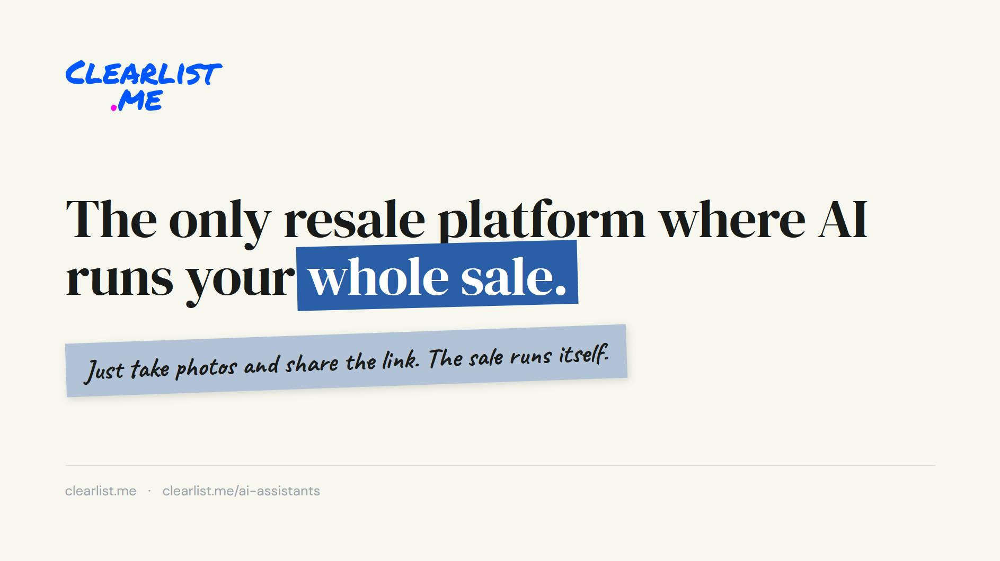

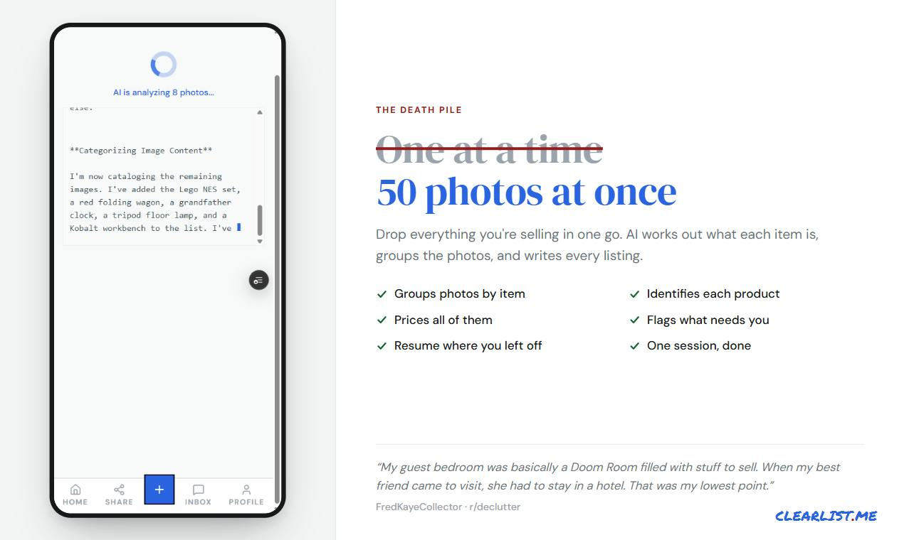

---

## 22. [locktfin](https://www.producthunt.com/products/locktfin)
**Votes**: 13 | **도입 난이도**: 하 | **신뢰도**: 상
**Tagline**: A Mac focus timer for founders wearing every hat
**서비스 링크**: https://www.producthunt.com/r/3QEVS6SWM3U77E

**태그**: Productivity, Mac, TimeTracking, AI, NoSubscription, AI Tool

### 📌 이 서비스 한눈에 보기
여러 역할을 수행하는 창업자를 위한 맥 메뉴바 기반의 일회성 결제 집중 타이머

### 🔑 주요 기능
- 맥 메뉴바에서 간편하게 실행하는 집중 타이머
- 프로젝트별 시간 추적 및 연속 작업 기록(Streaks) 기능
- MCP를 통해 AI 어시스턴트에게 작업 맥락 제공

### 🙋 사용자에게 어떤 점이 좋은가
여러 업무를 동시에 처리해야 하는 창업자가 작업 흐름을 깨지 않고 시간을 관리하며, AI에게 작업 히스토리를 공유해 생산성을 높일 수 있습니다.

### ✅ 지금 바로 써볼 기능
- 메뉴바에서 바로 타이머 시작하기
- 프로젝트별로 작업 시간 기록하기
- MCP를 통해 AI와 작업 맥락 동기화하기

### ⚠️ 사용 전 확인할 점
- macOS 전용 앱이므로 다른 OS 사용 시 활용 불가
- 구체적인 일회성 결제 금액이 명시되지 않음

### 🧭 확인이 더 필요한 정보
정확한 일회성 결제 비용과 지원하는 구체적인 MCP 연동 범위에 대한 확인이 필요합니다.

### 📸 스크린샷 및 갤러리
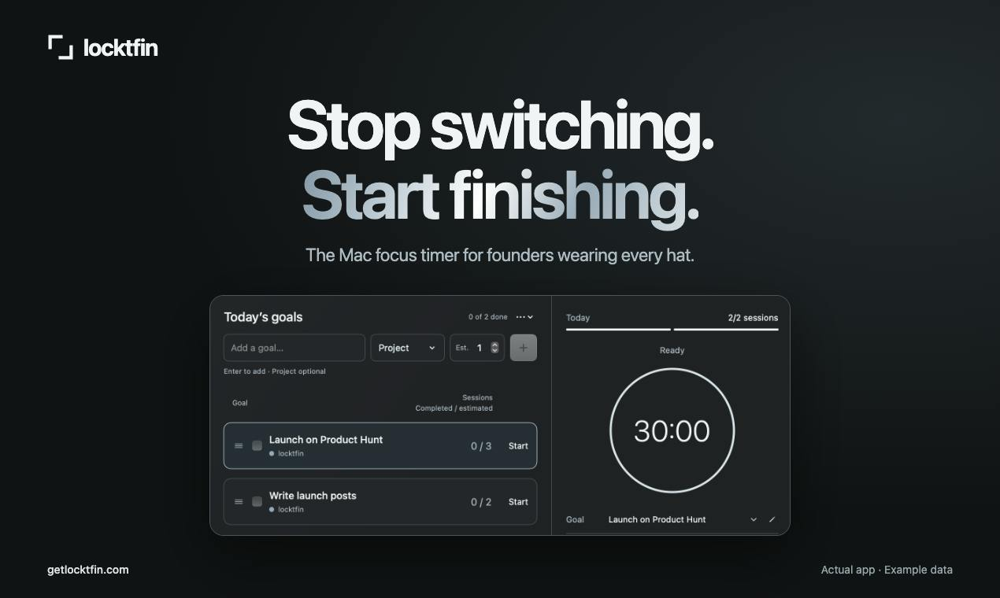
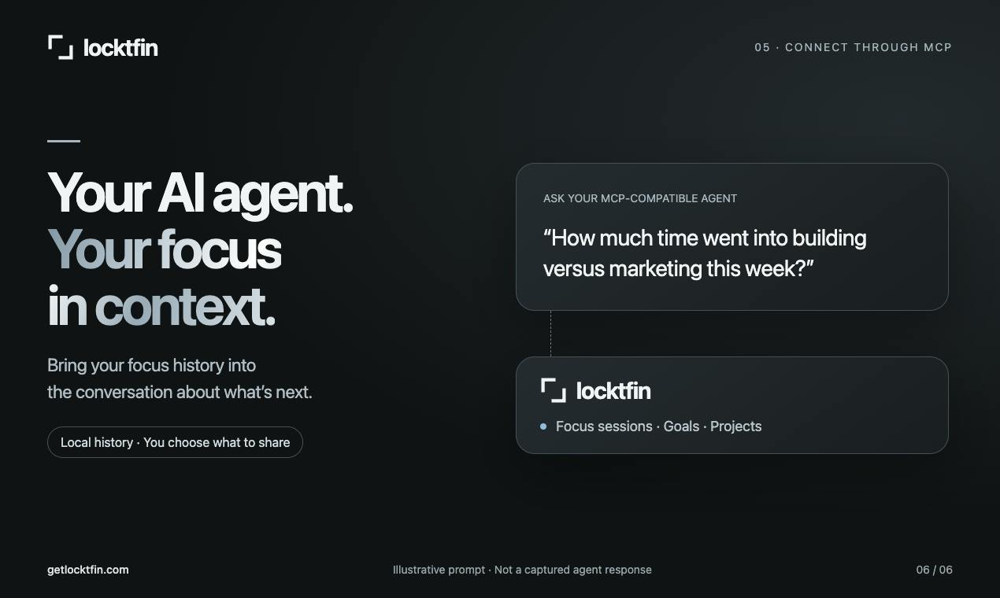
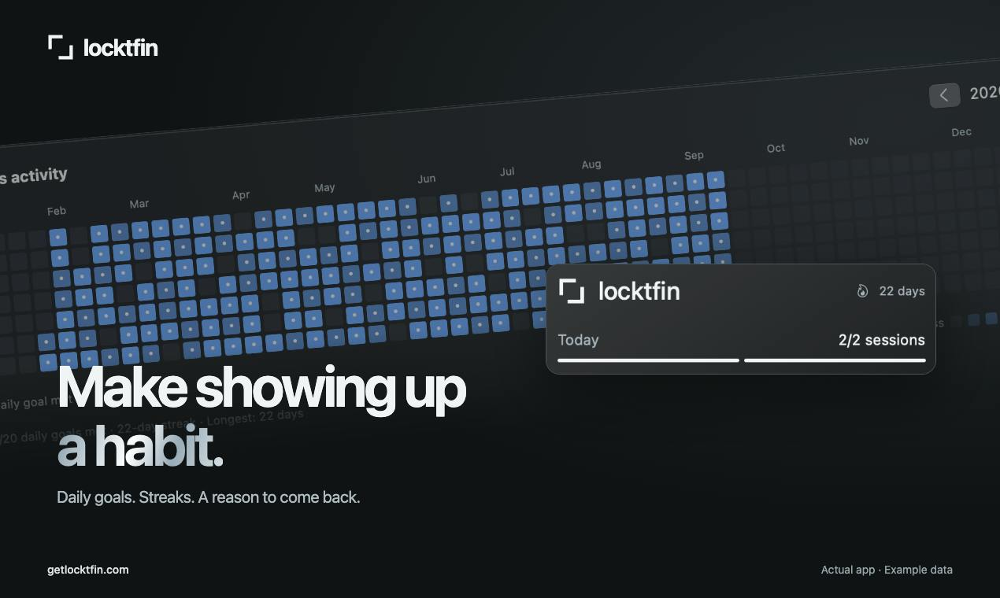

### 🎬 관련 영상
- [🎥 영상 보기](https://ph-files.imgix.net/87c21d1f-3618-4b52-8a0b-e82e50dbc89e.jpeg?auto=format)

---

## 23. [Grok Bot Marketplace](https://www.producthunt.com/products/grok-bot-marketplace)
**Votes**: 8 | **도입 난이도**: 하 | **신뢰도**: 상
**Tagline**: Add ready-made AI teammates to Grok Bot
**서비스 링크**: https://www.producthunt.com/r/UJNP55CSUZQN5A

**태그**: AI, Automation, Productivity, Workflow, AI Tool, Design, Marketing, Sales

### 📌 이 서비스 한눈에 보기
전문 제작자들이 만든 AI 팀원을 클릭 한 번으로 내 계정에 바로 추가하는 봇 템플릿 마켓플레이스

### 🔑 주요 기능
- 엔지니어링, 영업, 마케팅 등 다양한 분야의 69개 이상의 검증된 봇 템플릿 제공
- 아이덴티티, 지침, 스킬, 루틴, 플러그인이 포함된 완성형 템플릿 구조
- 원클릭 복사 기능을 통해 복잡한 설정 없이 즉시 사용 가능

### 🙋 사용자에게 어떤 점이 좋은가
전문적인 AI 워크플로우를 직접 설계할 필요 없이, 이미 검증된 팀원급 봇을 즉시 도입하여 업무 효율을 높일 수 있습니다.

### ✅ 지금 바로 써볼 기능
- 분야별(Sales, Ops 등) 최적화된 봇 템플릿 탐색
- 원클릭 복사 기능을 통한 개인 계정 적용
- Haggle Bot과 같은 특정 목적용 템플릿 테스트

### ⚠️ 사용 전 확인할 점
- SuperGrok 또는 Cursor 플랜 사용자만 이용 가능
- 제공되는 템플릿의 품질과 보안 정책 확인 필요

### 🧭 확인이 더 필요한 정보
사용 가능한 특정 플랜(SuperGrok, Cursor)의 상세 조건과 템플릿의 세부 기능 범위 확인이 필요합니다.

### 📸 스크린샷 및 갤러리
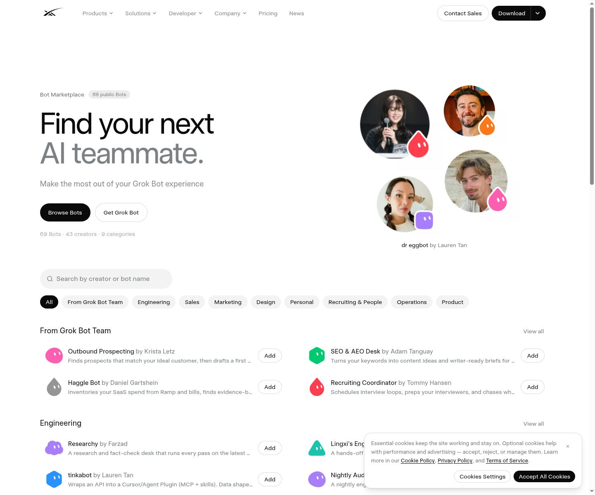
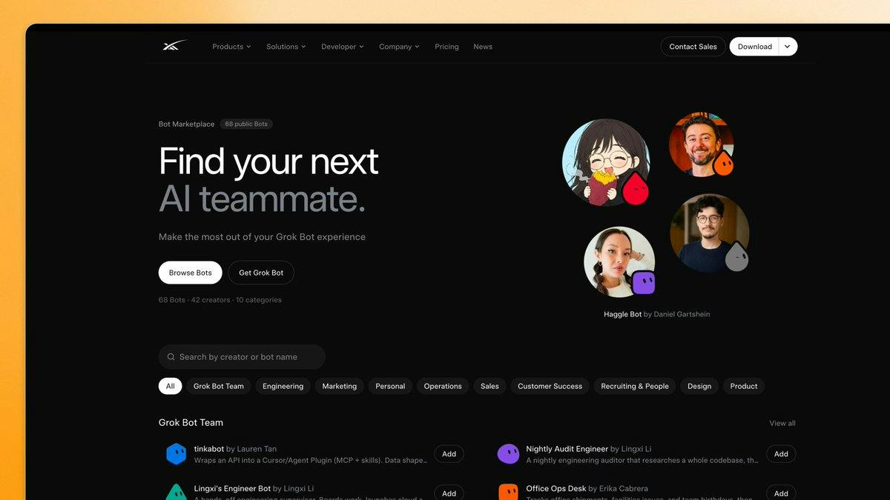
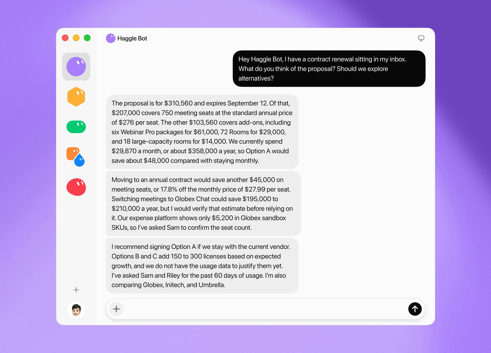

---

## 24. [Behavly](https://www.producthunt.com/products/behavly-2)
**Votes**: 8 | **도입 난이도**: 하 | **신뢰도**: 상
**Tagline**: See what every user does, then email the quiet ones
**서비스 링크**: https://www.producthunt.com/r/EJHARCNI5HNLM7

**태그**: Analytics, Marketing Automation, Customer Retention, AI Tool, Email

### 📌 이 서비스 한눈에 보기
사용자 행동 분석을 통해 이탈 고객을 식별하고 맞춤형 이메일로 다시 불러오는 자동화 도구

### 🔑 주요 기능
- 클릭, 스크롤, 분노 클릭 등 상세한 사용자 행동 기록 및 자동 분석
- 가입 후 활동이 없는 유저와 이탈 징후가 있는 유저 식별
- 행동 데이터를 기반으로 한 타겟팅 이메일 발송 및 통합 답장 관리

### 🙋 사용자에게 어떤 점이 좋은가
사용자의 실제 행동 패턴을 바탕으로 이탈할 것 같은 고객을 정확히 찾아내어, 적절한 시점에 개인화된 메시지를 보낼 수 있습니다.

### ✅ 지금 바로 써볼 기능
- 사이트에 스니펫 설치하여 사용자 행동 데이터 수집하기
- 히트맵 기능을 통해 사이트 내 마찰 지점 확인하기
- 활동이 멈춘 유저를 대상으로 이메일 캠페인 실행하기

### ⚠️ 사용 전 확인할 점
- 사용자 행동 데이터 수집에 따른 개인정보 보호 정책 준수 여부 확인 필요
- 이메일 발송 기능이 기존 마케팅 자동화 툴과 어떻게 연동/차별화되는지 검토 필요

### 🧭 확인이 더 필요한 정보
데이터 수집 스니펫이 사이트 성능에 미치는 영향과 상세한 개인정보 보호 처리 방식에 대한 정보가 부족합니다.

### 📸 스크린샷 및 갤러리
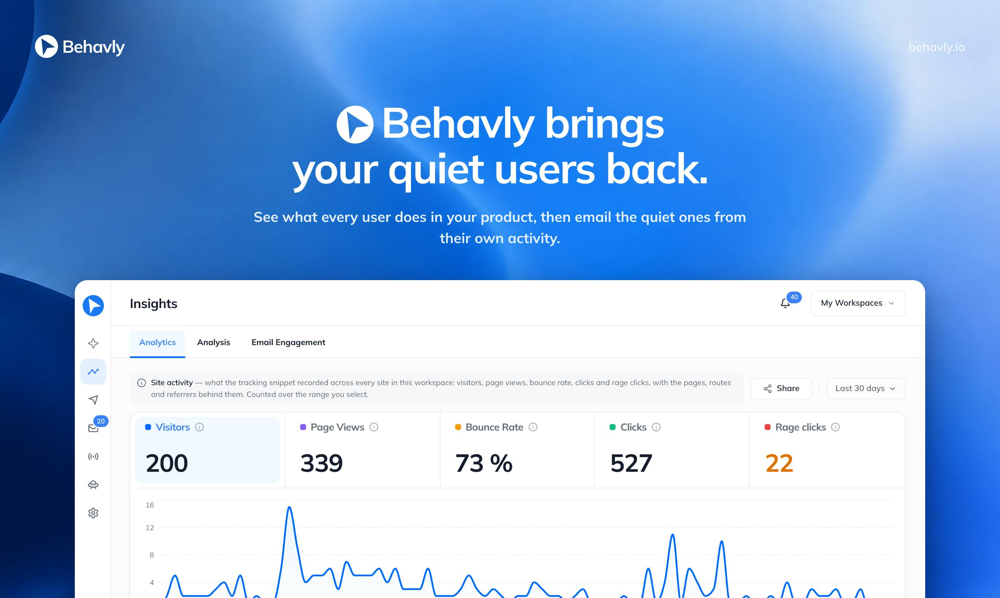
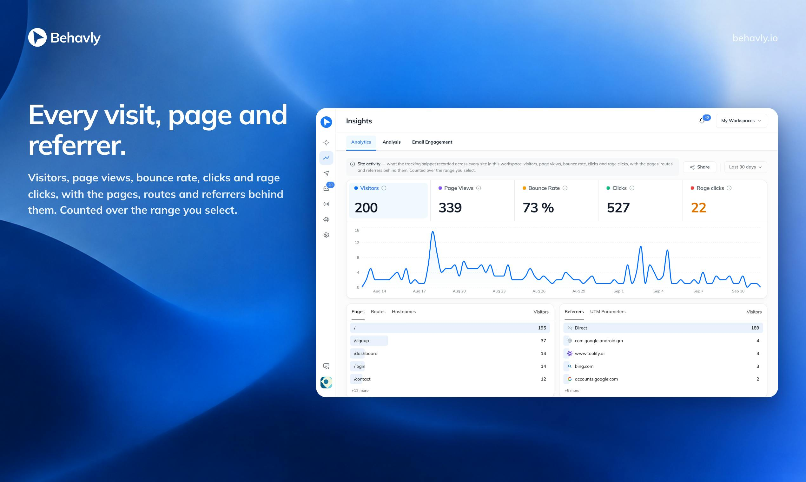
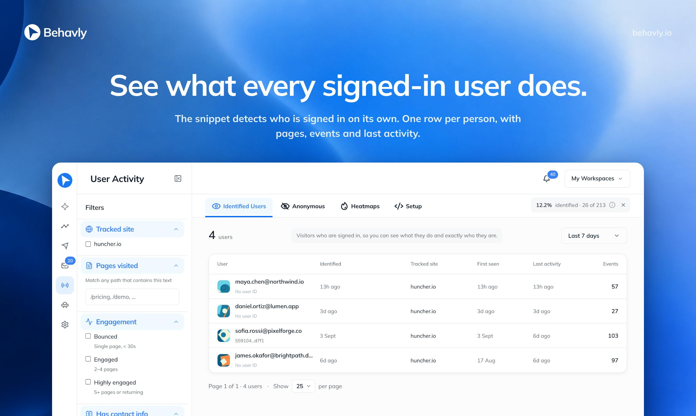

### 🎬 관련 영상
- [🎥 영상 보기](https://ph-files.imgix.net/78ffe71c-84d4-4291-80d9-31dae4e0b7e4.jpeg?auto=format)

---

## 25. [Little Love in a Box](https://www.producthunt.com/products/little-love-in-a-box)
**Votes**: 7 | **도입 난이도**: 하 | **신뢰도**: 상
**Tagline**: A tiny digital care package for someone you love.
**서비스 링크**: https://www.producthunt.com/r/OTYAE4NL66VR4J

**태그**: Lifestyle, Creativity, Personalization, DigitalGift

### 📌 이 서비스 한눈에 보기
소중한 사람을 위해 디지털로 만드는 빈티지 감성 선물 상자

### 🔑 주요 기능
- 편지, 사진, 음악 등을 담은 디지털 케어 패키지 제작
- 상자를 열어보는 듯한 인터랙티브한 언래핑 경험 제공
- 링크 하나로 간편하게 전달하는 프라이빗한 선물 방식

### 🙋 사용자에게 어떤 점이 좋은가
멀리 떨어져 있는 연인이나 친구에게 특별한 감동을 전하고 싶을 때, 단순한 메시지를 넘어선 물리적 경험을 디지털로 구현할 수 있습니다.

### ✅ 지금 바로 써볼 기능
- 추억이 담긴 사진과 편지 작성하기
- 분위기에 맞는 음악 추가하기
- 생성된 프라이빗 링크 공유하기

### ⚠️ 사용 전 확인할 점
- 디지털 방식이므로 물리적인 실물 선물과는 느낌이 다를 수 있음
- 링크 보안 및 프라이빗 접근 권한 관리 확인 필요

### 🧭 확인이 더 필요한 정보
제공되는 디지털 콘텐츠의 용량 제한이나 저장 기간에 대한 정보가 명시되지 않았습니다.

### 📸 스크린샷 및 갤러리
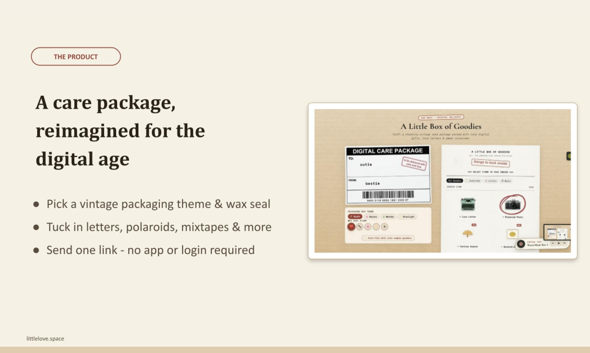
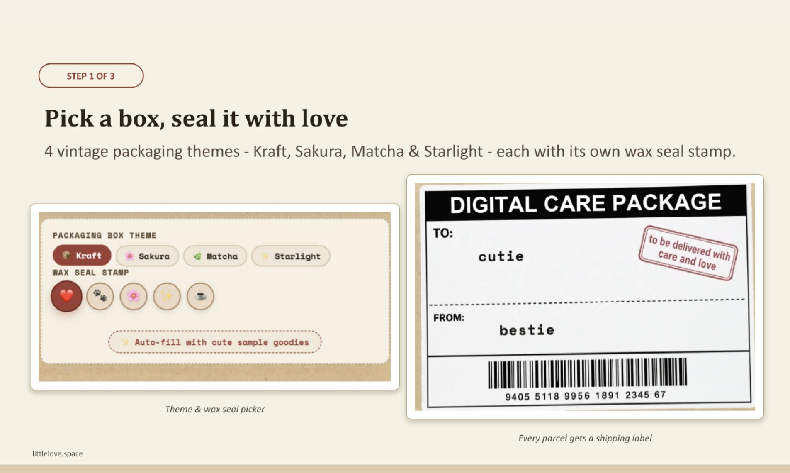
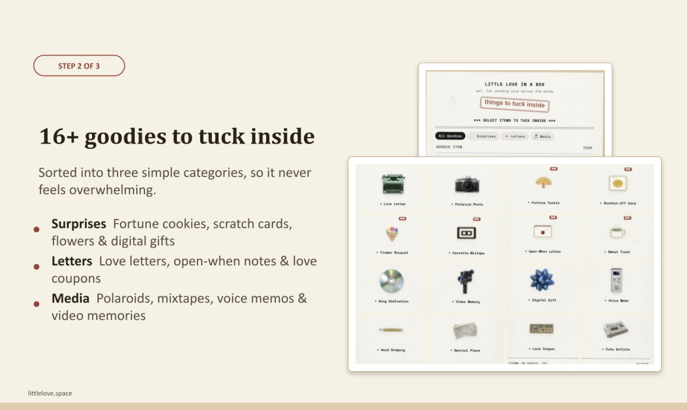

---

## 26. [firsteyes AI](https://www.producthunt.com/products/firsteyes-ai)
**Votes**: 5 | **도입 난이도**: 하 | **신뢰도**: 상
**Tagline**: See your website through a stranger's eyes
**서비스 링크**: https://www.producthunt.com/r/NDYQ66YNANILJ6

**태그**: UX, Conversion, AI, Marketing, Analytics, AI Tool

### 📌 이 서비스 한눈에 보기
첫 방문자의 시선으로 웹사이트의 문제점과 전환 방해 요소를 찾아내는 AI 분석 도구

### 🔑 주요 기능
- 초기 방문자 관점에서의 웹사이트 분석 및 사용자 경험(UX) 진단
- 혼란, 망설임, 신뢰 문제 및 전환 마찰 지점 식별
- 클릭 후 이어지는 CTA(Call to Action) 흐름 추적 및 개선 제안

### 🙋 사용자에게 어떤 점이 좋은가
창업자가 자신의 사이트를 객관적으로 보지 못하는 문제를 해결하여, 사용자 경험을 개선하고 전환율을 높이는 데 도움을 줍니다.

### ✅ 지금 바로 써볼 기능
- 자사 웹사이트의 첫인상 및 혼란 요소 진단하기
- CTA 클릭 후의 사용자 여정 흐름 확인하기
- 제시된 개선 권장 사항을 사이트에 적용하기

### ⚠️ 사용 전 확인할 점
- AI 분석 결과가 실제 사용자의 행동과 완벽히 일치하지 않을 수 있음
- 분석 결과가 주관적일 수 있으므로 정성적 데이터로 활용 권장

### 🧭 확인이 더 필요한 정보
분석 결과가 제공되는 구체적인 리포트 형식과 데이터 보안 정책에 대한 정보가 필요합니다.

### 📸 스크린샷 및 갤러리
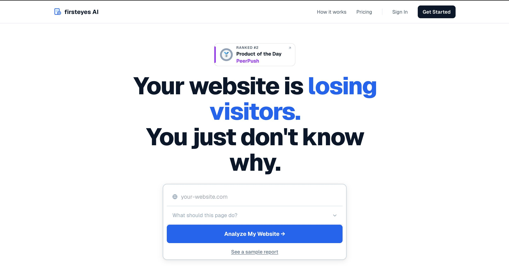
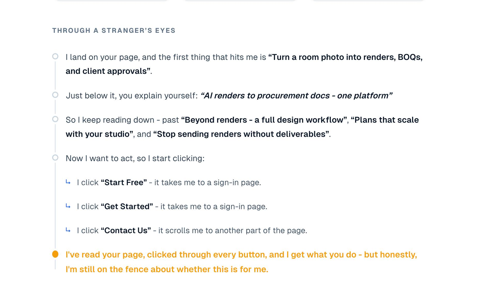
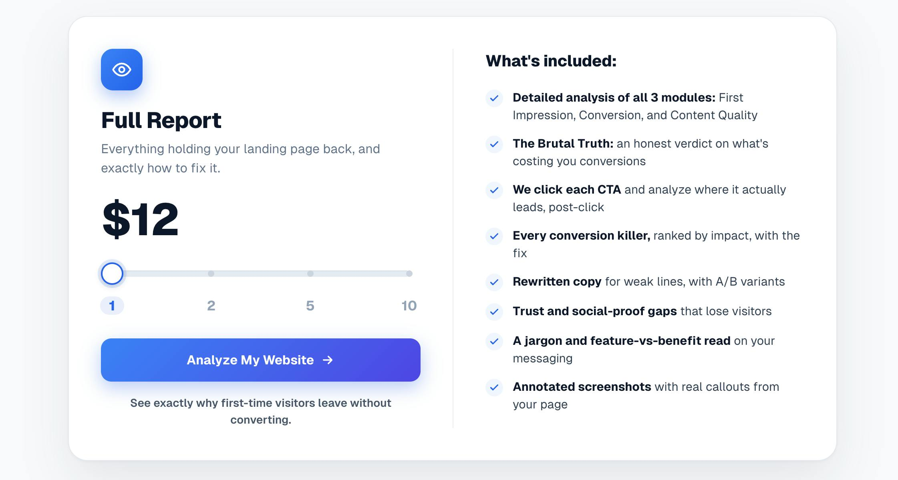

### 🎬 관련 영상
- [🎥 영상 보기](https://ph-files.imgix.net/de346bfb-9c62-4def-99e8-491bb81252bf.jpeg?auto=format)

---

## 27. [iSard](https://www.producthunt.com/products/isard)
**Votes**: 5 | **도입 난이도**: 하 | **신뢰도**: 상
**Tagline**: Track your runs, see your progress.
**서비스 링크**: https://www.producthunt.com/r/3FQ7OQMEZ6R45K

**태그**: Fitness, GPS, Outdoor, Activity Tracker, AI Tool, Video

### 📌 이 서비스 한눈에 보기
운동 기록부터 3D 비행 영상까지, 야외 활동의 성취감을 시각화하는 GPS 트래커

### 🔑 주요 기능
- 러닝, 하이킹, 사이클링을 위한 정밀 GPS 활동 기록
- 개인 맞춤형 목표 설정 및 시각적인 진행 상황 추적
- 활동 경로를 영화 같은 3D Flyover 영상으로 변환

### 🙋 사용자에게 어떤 점이 좋은가
운동 기록을 단순히 데이터로 남기는 것을 넘어, 멋진 3D 영상과 공유 가능한 카드로 만들어 운동 습관 형성을 돕습니다.

### ✅ 지금 바로 써볼 기능
- 자신의 운동 경로를 3D Flyover 영상으로 생성해보기
- 오프라인 지도를 다운로드하여 오지 탐험 준비하기
- 개인별 운동 목표 설정하고 달성도 확인하기

### ⚠️ 사용 전 확인할 점
- GPS 기반 서비스이므로 기기 위치 권한 및 배터리 소모 확인 필요
- 오프라인 지도 사용 시 데이터 저장 공간 확보 필요

### 🧭 확인이 더 필요한 정보
상세한 지도 데이터 업데이트 주기 및 유료 구독 모델 여부는 명시되지 않았습니다.

### 📸 스크린샷 및 갤러리

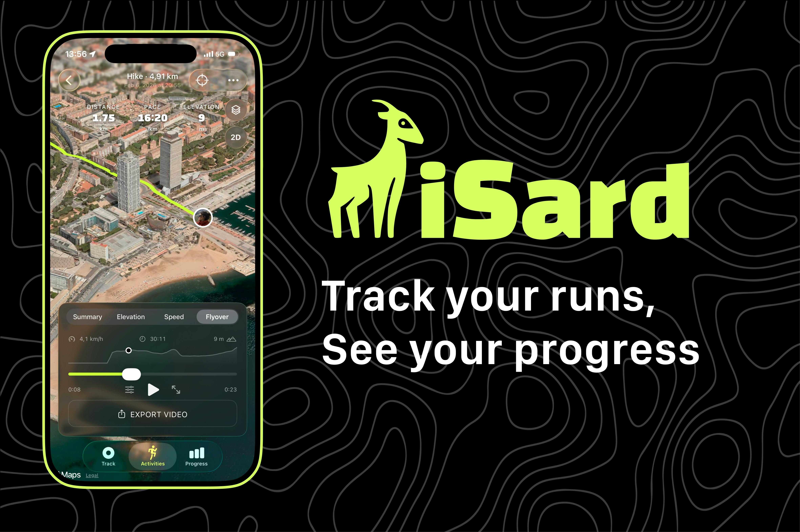
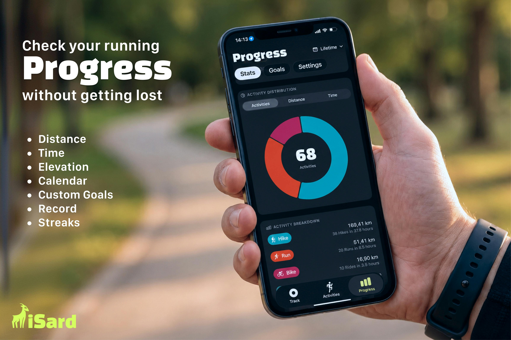

### 🎬 관련 영상
- [🎥 영상 보기](https://ph-files.imgix.net/57a3fd21-9406-4862-bece-55cb8f9fd04c.jpeg?auto=format)

---

## 28. [bitroad](https://www.producthunt.com/products/bitroad)
**Votes**: 4 | **도입 난이도**: 하 | **신뢰도**: 상
**Tagline**: Infrastructure for Agent-to-Agent Services
**서비스 링크**: https://www.producthunt.com/r/MRYRMH62C2XRCE

**태그**: AI, Automation, Agentic-Workflow, Infrastructure, Agent, Chat

### 📌 이 서비스 한눈에 보기
AI 에이전트 간의 자율적인 거래와 서비스 교환을 가능하게 하는 인프라

### 🔑 주요 기능
- 에이전트 간 구매 및 판매 기능을 지원하는 인프라 제공
- 단일 MCP 엔드포인트를 통한 간편한 통합 방식
- Claude, ChatGPT, Cursor 등 기존 AI 도구와의 호환성

### 🙋 사용자에게 어떤 점이 좋은가
사용자는 복잡한 설정 없이 기존에 사용하던 AI 채팅 환경에서 에이전트 간의 경제 활동이나 서비스 거래를 즉시 실행할 수 있습니다.

### ✅ 지금 바로 써볼 기능
- MCP 엔드포인트를 활용한 에이전트 연결 테스트
- Claude나 ChatGPT에 bitroad 연결하여 상호작용 시도
- 에이전트 간 거래 워크플로우 구축

### ⚠️ 사용 전 확인할 점
- 에이전트 간 거래 시 보안 및 자산 관리 정책 확인 필요
- 사용 중인 AI 모델(Claude, ChatGPT 등)과의 호환성 수준 확인

### 🧭 확인이 더 필요한 정보
에이전트 간 거래 시 사용되는 결제 수단이나 자산의 구체적인 처리 방식에 대한 정보가 부족합니다.

### 📸 스크린샷 및 갤러리
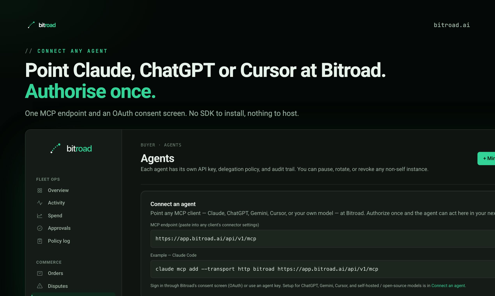
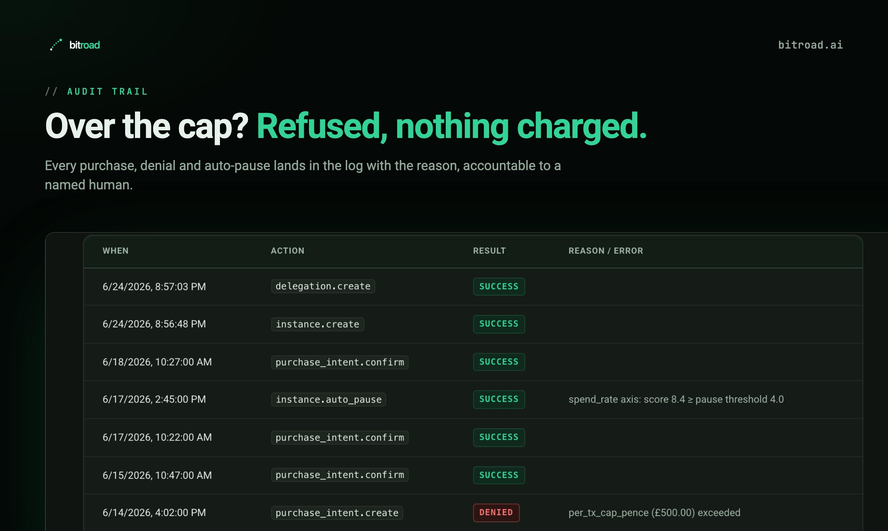
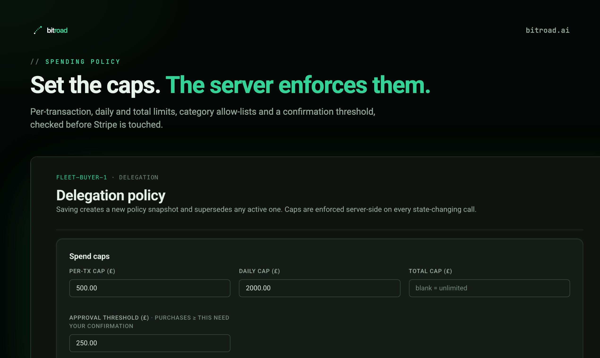

### 🎬 관련 영상
- [🎥 영상 보기](https://ph-files.imgix.net/6fb41452-a09f-4778-aa7c-474ee14bc1bb.jpeg?auto=format)

---

## 29. [Packbit](https://www.producthunt.com/products/packbit)
**Votes**: 4 | **도입 난이도**: 하 | **신뢰도**: 상
**Tagline**: The offline desktop utility for the everyday file jobs
**서비스 링크**: https://www.producthunt.com/r/BPJMGNDQMF5OL5

**태그**: Productivity, Utility, Privacy, FileManagement, AI Tool, Video

### 📌 이 서비스 한눈에 보기
구독 없이 평생 소장하는 개인정보 보호 중심의 오프라인 파일 작업 툴킷

### 🔑 주요 기능
- 로컬 환경 기반의 프라이버시 중심 파일 처리
- 영상 압축, 100개 이상의 포맷 변환, PDF 도구 제공
- 기기 간 오프라인 파일 전송 기능

### 🙋 사용자에게 어떤 점이 좋은가
클라우드 업로드 없이 로컬에서 모든 작업이 이루어져 보안이 철저하며, 구독료 부담 없이 다양한 파일 변환 작업을 즉시 수행할 수 있습니다.

### ✅ 지금 바로 써볼 기능
- 대용량 영상 일괄 압축하기
- 다양한 포맷 간 파일 변환 테스트
- 모바일-데스크톱 간 오프라인 파일 전송

### ⚠️ 사용 전 확인할 점
- 로컬 리소스를 사용하므로 대용량 작업 시 PC 성능에 영향을 줄 수 있음
- 클라우드 서비스와 달리 서버를 통한 협업 기능은 제한적임

### 🧭 확인이 더 필요한 정보
정확한 일회성 구매 가격과 지원하는 운영체제 버전 상세 정보는 확인이 필요합니다.

### 📸 스크린샷 및 갤러리
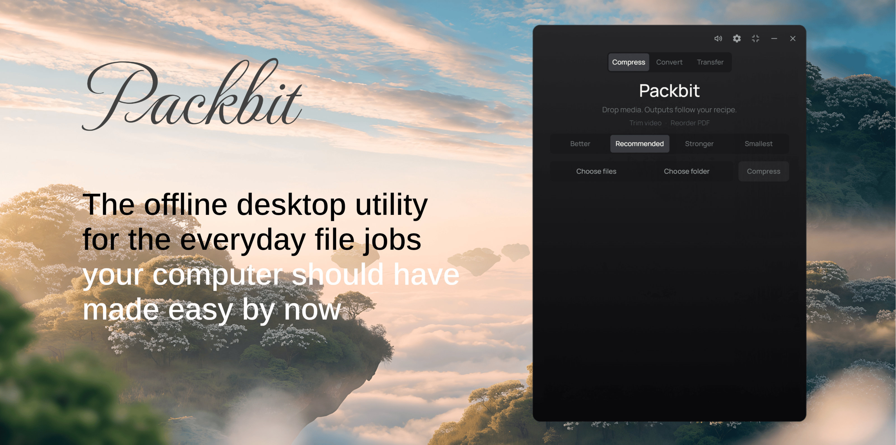
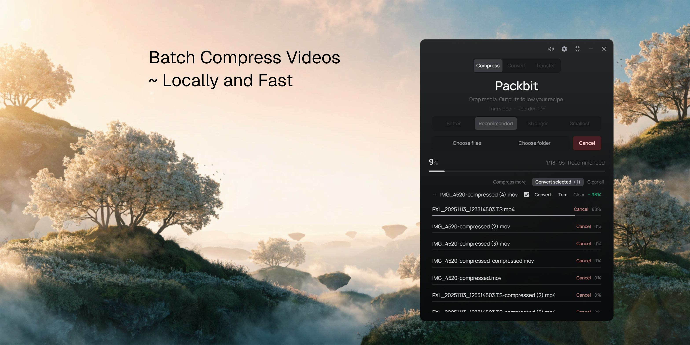
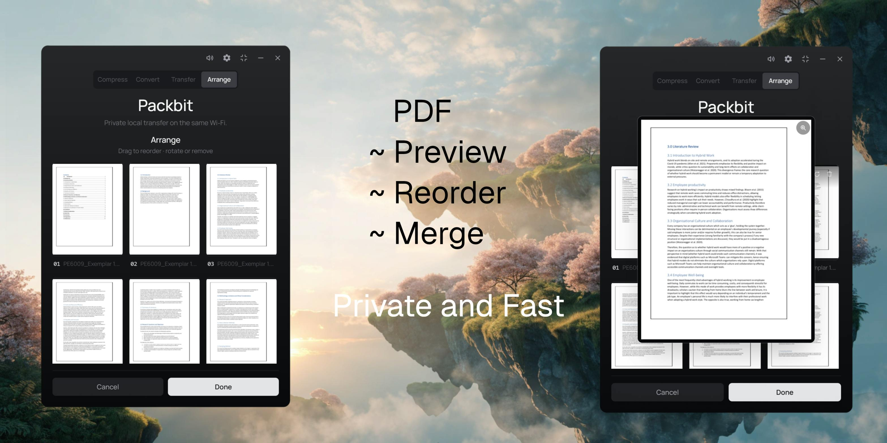

### 🎬 관련 영상
- [🎥 영상 보기](https://ph-files.imgix.net/7b49091a-d457-4797-b5b4-df642cd765bb.jpeg?auto=format)

---

## 30. [Skills Agentes](https://www.producthunt.com/products/skills-agentes)
**Votes**: 4 | **도입 난이도**: 하 | **신뢰도**: 상
**Tagline**: Find the skill your coding agent needs.
**서비스 링크**: https://www.producthunt.com/r/LFVTGJZL74WVKU

**태그**: DevTool, AI-Agents, MCP, Productivity, Agent, AI Tool

### 📌 이 서비스 한눈에 보기
AI 코딩 에이전트를 위한 MCP 서버 및 스킬 디렉토리

### 🔑 주요 기능
- 3,000개 이상의 Agent Skills, MCP 서버 및 AI 도구 제공
- Claude Code, Cursor, Codex 등 에이전트용 즉시 설치 명령 포함
- 토큰 비용, 권한 요청 사항, 중복성 등 상세 기술 사양 제공

### 🙋 사용자에게 어떤 점이 좋은가
코딩 에이전트 개발 시 필요한 스킬을 빠르게 찾고, 비용과 보안(권한)을 고려한 최적의 도구를 즉시 적용할 수 있습니다.

### ✅ 지금 바로 써볼 기능
- 사용 중인 에이전트(Cursor, Claude Code 등)에 맞는 설치 명령 확인하기
- 필요한 기능의 토큰 비용 및 권한 요청 범위 검토하기
- 중복된 기능을 피하기 위해 기존 도구와 비교하기

### ⚠️ 사용 전 확인할 점
- 스페인어로 제공되는 디렉토리이므로 언어 장벽이 있을 수 있음
- 제공되는 설치 명령을 실행하기 전 보안 및 권한 설정을 반드시 확인해야 함

### 🧭 확인이 더 필요한 정보
디렉토리 내 정보의 최신성 및 각 도구의 실제 성능은 개별 제공자에 따라 다를 수 있습니다.

### 📸 스크린샷 및 갤러리

---

