# 🚀 Product Hunt Daily Top 30 (2026-09-14)

## 오늘의 요약
오늘의 트렌드는 AI 모델의 비용 효율성과 개인정보 보호를 결합한 하이브리드 컴퓨팅, 그리고 AI 검색 엔진 시대에 맞춘 브랜드 가시성 최적화가 핵심이었습니다. 또한, 복잡한 편집 과정 없이 자동화된 워크플로우를 제공하거나 웹 데이터를 효율적으로 관리하는 생산성 도구들이 주목받았습니다.

### 오늘의 핵심 포인트
- AI 성능을 유지하면서도 비용을 획기적으로 절감하거나 로컬 환경을 활용해 보안을 강화하는 하이브리드 방식이 부상했습니다.
- AI 검색 엔진(ChatGPT, Perplexity 등) 내 브랜드 노출을 추적하고 최적화하는 새로운 마케팅 영역이 나타났습니다.
- 수동 작업을 최소화하는 자동 줌 녹화나 Notion 연동 등 사용자 경험을 직관적으로 개선하는 생산성 도구들이 강세를 보였습니다.

**오늘의 태그**: AI_Optimization, Privacy_First, Productivity_Tools, Automation, Developer_Tools

## 1. [Resurf](https://www.producthunt.com/products/resurf-2)
**Votes**: 204 | **도입 난이도**: 하 | **신뢰도**: 상
**Tagline**: A Personal Context Library for Mac
**서비스 링크**: https://www.producthunt.com/r/64OVTILJFOSXX3

**태그**: Productivity, KnowledgeManagement, AI, Mac, PersonalContext, AI Tool, Vision

### 📌 이 서비스 한눈에 보기
개인적인 아이디어와 자료를 모아 AI와 연동하는 맥 전용 컨텍스트 라이브러리

### 🔑 주요 기능
- 메모, 링크, 이미지, PDF 등 다양한 형태의 개인 자료 저장
- MCP 및 CLI를 통한 AI와의 간편한 컨텍스트 공유
- Mac, iPhone, iPad를 지원하는 네이티브 앱 및 iCloud 동기화

### 🙋 사용자에게 어떤 점이 좋은가
흩어져 있는 개인적 지식과 작업 자료를 한곳에 모아 관리하고, 이를 AI에게 즉시 전달하여 작업 효율을 높일 수 있습니다.

### ✅ 지금 바로 써볼 기능
- 중요한 링크와 메모를 Resurf에 저장하기
- iCloud를 통해 모바일과 데스크탑 간 동기화 설정하기
- CLI/MCP를 활용해 AI 워크플로우에 연결하기

### ⚠️ 사용 전 확인할 점
- 주로 Mac 생태계에 최적화되어 있어 Windows/Linux 사용자는 제약이 있을 수 있음
- 로컬 저장 방식이므로 데이터 백업 및 관리 책임이 사용자에게 있음

### 🧭 확인이 더 필요한 정보
상세한 MCP/CLI 연동 방식과 AI 모델별 호환성에 대한 구체적인 가이드가 필요합니다.

### 📸 스크린샷 및 갤러리
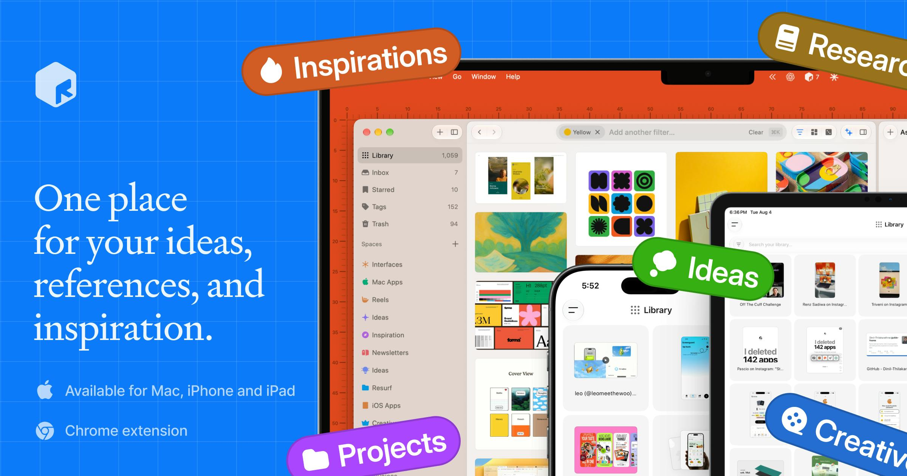
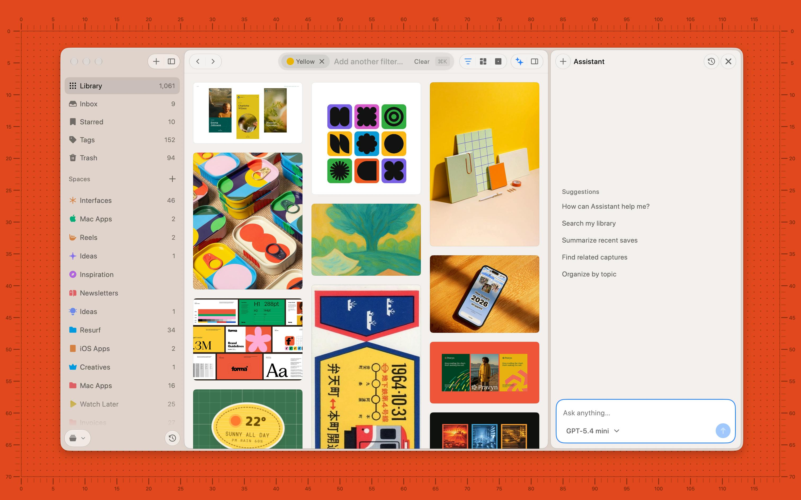
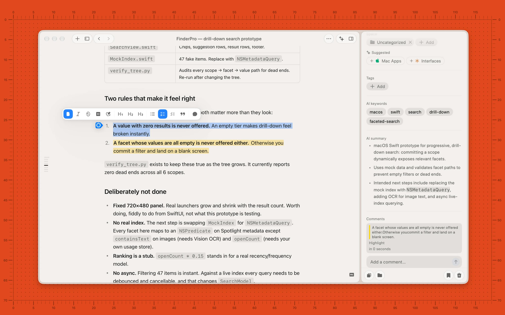

---

## 2. [Perplexity Hybrid Compute ](https://www.producthunt.com/products/perplexity-ai)
**Votes**: 168 | **도입 난이도**: 중 | **신뢰도**: 상
**Tagline**: Splitting AI tasks: Cloud for research, Mac for privacy
**서비스 링크**: https://www.producthunt.com/r/5IWKJOELJGRMKZ

**태그**: AI, Privacy, Mac, Productivity, AI Tool

### 📌 이 서비스 한눈에 보기
클라우드의 강력한 성능과 맥(Mac)의 개인정보 보호를 결합한 하이브리드 AI 컴퓨팅

### 🔑 주요 기능
- 클라우드와 로컬(Mac) 간의 지능형 작업 분할
- 연구 및 추론은 클라우드에서, 개인 파일 처리는 로컬 AI로 수행
- 개인 데이터가 클라우드에 업로드되지 않는 보안 중심 설계

### 🙋 사용자에게 어떤 점이 좋은가
강력한 AI 성능을 활용하면서도 민감한 개인 파일은 내 컴퓨터에 머물게 하여 보안과 성능을 동시에 잡을 수 있습니다.

### ✅ 지금 바로 써볼 기능
- Perplexity Mac 앱 설치 및 업데이트
- Apple Silicon 기반 Mac 환경 확인
- Pro/Max/Enterprise 플랜 적용 여부 확인

### ⚠️ 사용 전 확인할 점
- 최소 24GB 이상의 RAM을 탑재한 Apple Silicon Mac 필요
- Pro 이상의 유료 플랜 사용자만 이용 가능

### 🧭 확인이 더 필요한 정보
로컬 AI 모델의 구체적인 성능과 지원되는 파일 형식에 대한 상세 정보는 확인이 필요합니다.

### 📸 스크린샷 및 갤러리
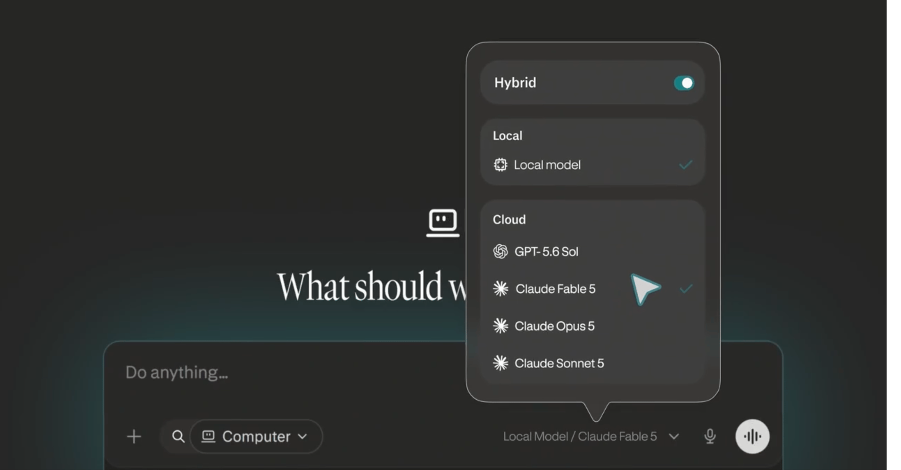
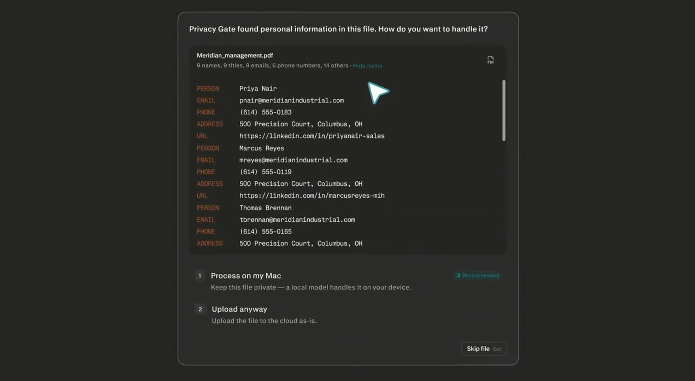
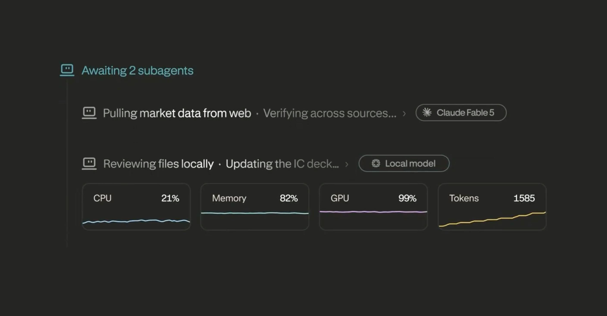

### 🎬 관련 영상
- [🎥 영상 보기](https://ph-files.imgix.net/9ccca5a9-7c72-4916-8699-7361e0bd2ccf.jpeg?auto=format)

---

## 3. [Cognition's SWE-2](https://www.producthunt.com/products/cognition-s-swe-2)
**Votes**: 147 | **도입 난이도**: 하 | **신뢰도**: 상
**Tagline**: Cognition's coding model, 64% cheaper than Fable 5.1
**서비스 링크**: https://www.producthunt.com/r/FCGUK3GAKZ3BLA

**태그**: AI-Coding, DevTools, Automation, Cost-Efficiency, AI Tool, DevTool

### 📌 이 서비스 한눈에 보기
압도적인 비용 절감과 성능을 동시에 잡은 Cognition의 차세대 코딩 모델 SWE-2

### 🔑 주요 기능
- Fable 5.1 대비 64% 저렴하면서도 대등한 수준의 성능(FrontierCode 1.1 50.0%) 확보
- GPT-6 Astra 대비 1/4 가격으로 경쟁력 있는 성능 제공
- 이전 모델(SWE-1.7) 대비 비용 81% 절감 및 작업 턴 수 58% 감소

### 🙋 사용자에게 어떤 점이 좋은가
고성능 코딩 모델을 훨씬 저렴한 비용으로 사용할 수 있어, 개발 워크플로우의 경제성과 효율성을 동시에 극대화할 수 있습니다.

### ✅ 지금 바로 써볼 기능
- Devin Desktop을 통한 데스크톱 환경 테스트
- CLI를 활용한 터미널 기반 워크플로우 적용
- 기존 SWE-1.7 워크플로우와의 비용 및 속도 비교

### ⚠️ 사용 전 확인할 점
- Kimi K3 기반 RL 모델의 특정 도메인 최적화 여부 확인 필요
- 실제 개발 환경에서의 안정성 및 에이전트 동작 검증 필요

### 🧭 확인이 더 필요한 정보
제시된 벤치마크 점수가 실제 사용자들의 복잡한 실무 코드베이스에서도 동일하게 유지되는지 확인이 필요합니다.

### 📸 스크린샷 및 갤러리
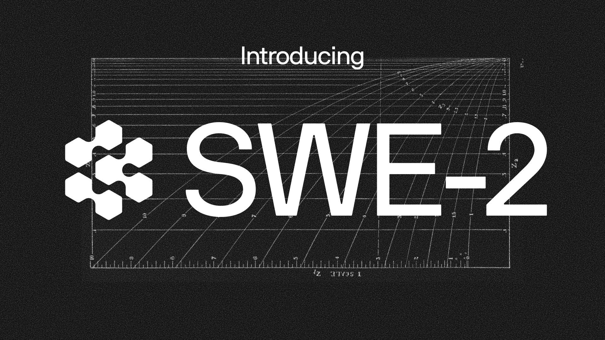
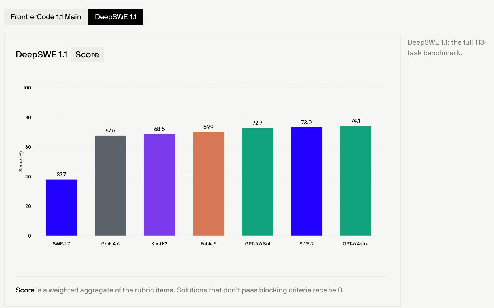
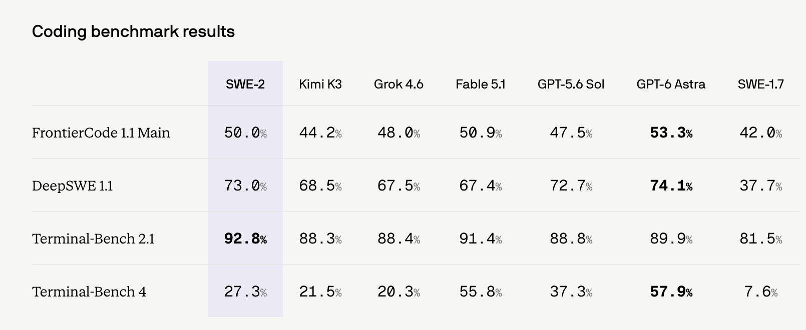

---

## 4. [ScreenCursor](https://www.producthunt.com/products/screencursor)
**Votes**: 138 | **도입 난이도**: 하 | **신뢰도**: 상
**Tagline**: Screen recorder with auto zoom effects
**서비스 링크**: https://www.producthunt.com/r/7XXNXZ6PB2KTTO

**태그**: Productivity, Video, Automation

### 📌 이 서비스 한눈에 보기
편집 없이 클릭과 움직임에 맞춰 자동 줌 효과가 적용되는 화면 녹화 도구

### 🔑 주요 기능
- 클릭, 드래그, 키 입력에 따른 자동 줌 효과 적용
- 별도의 영상 편집 과정이 필요 없는 자동화 워크플로우
- 로컬 환경 기반의 프라이버시 보호

### 🙋 사용자에게 어떤 점이 좋은가
영상 편집 시간을 획기적으로 줄여주며, 별도의 편집 기술 없이도 역동적인 화면 녹화 영상을 제작할 수 있습니다.

### ✅ 지금 바로 써볼 기능
- 화면 녹화 시작하기
- 클릭 및 드래그를 통한 자동 줌 효과 확인
- 로컬 저장 기능 확인

### ⚠️ 사용 전 확인할 점
- 세밀한 수동 편집 기능의 포함 여부 확인 필요
- 컴퓨터 사양에 따른 녹화 성능 영향 확인

### 🧭 확인이 더 필요한 정보
제공되는 영상의 해상도 및 파일 형식 지원 범위를 확인해야 합니다.

### 📸 스크린샷 및 갤러리
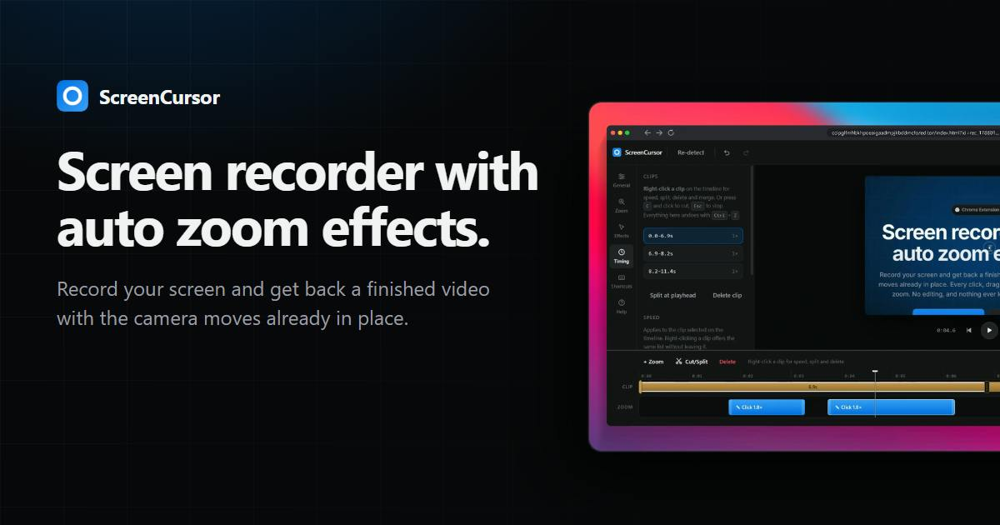
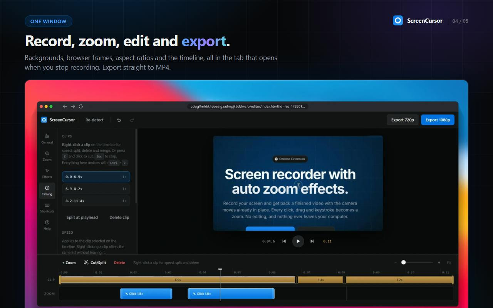
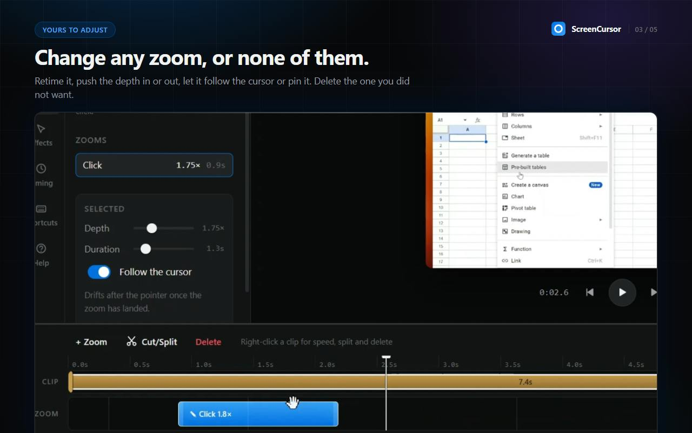

### 🎬 관련 영상
- [🎥 영상 보기](https://ph-files.imgix.net/15bee2d9-4563-4259-a636-7afe0a372d06.jpeg?auto=format)

---

## 5. [Clipwise ](https://www.producthunt.com/products/clipwise-notion-web-clipper)
**Votes**: 113 | **도입 난이도**: 하 | **신뢰도**: 상
**Tagline**: Save any page to Notion
**서비스 링크**: https://www.producthunt.com/r/2ZHSG2WD77RSJ2

**태그**: Productivity, Notion, Web Clipper, Automation

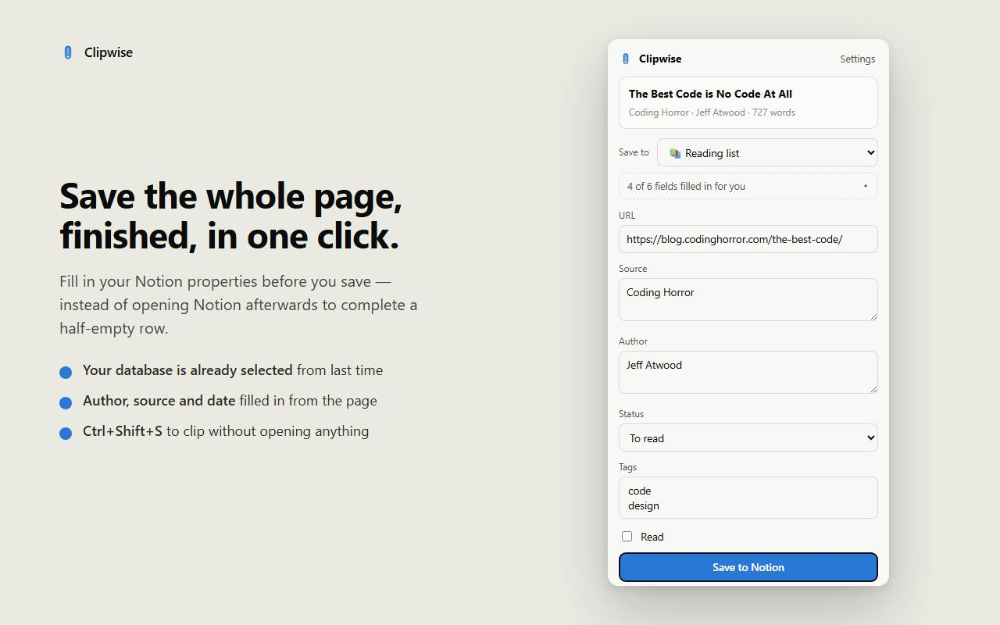

### 📌 이 서비스 한눈에 보기
웹 페이지 전체 내용을 로그인 없이 간편하게 Notion 데이터베이스로 저장하는 도구

### 🔑 주요 기능
- 웹 페이지 전체 내용을 잘림 없이 Notion 데이터베이스로 저장
- 계정 생성이나 로그인 과정이 필요 없는 간편한 사용성
- 로컬 저장 방식을 통한 개인정보 보호 및 데이터 보안

### 🙋 사용자에게 어떤 점이 좋은가
웹 서핑 중 발견한 유용한 아티클을 Notion에 수동으로 복사할 필요 없이 즉시 체계적으로 정리할 수 있습니다.

### ✅ 지금 바로 써볼 기능
- 웹 페이지 전체 내용 저장 기능 테스트
- Notion 데이터베이스 속성(Properties) 매핑 기능 확인
- 마지막 설정값 자동 기억 기능 활용

### ⚠️ 사용 전 확인할 점
- 로컬 저장 방식이므로 기기 변경 시 데이터 동기화 방식 확인 필요
- Notion 데이터베이스 구조에 따른 저장 결과 차이 가능성

### 🧭 확인이 더 필요한 정보
사용자의 컴퓨터에 저장되는 방식이 구체적으로 어떤 로컬 데이터 관리 방식을 사용하는지 확인이 필요합니다.

### 📸 스크린샷 및 갤러리

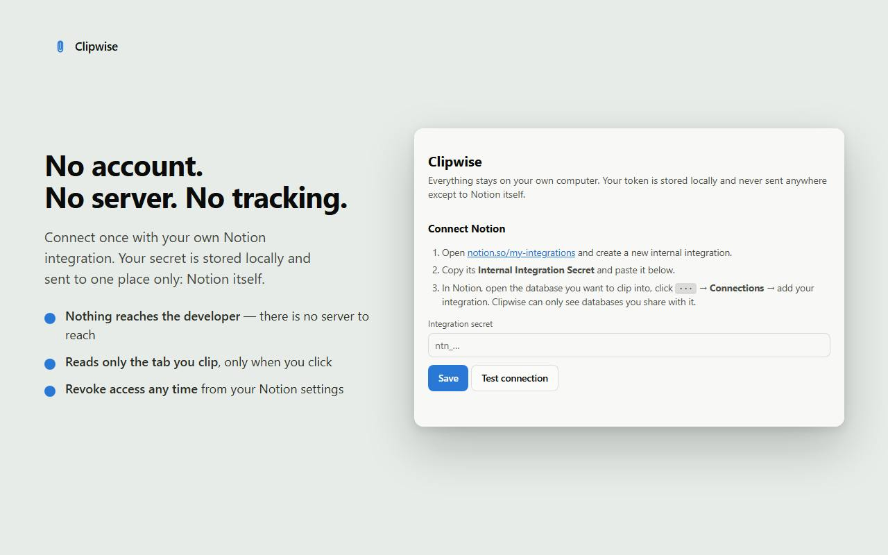
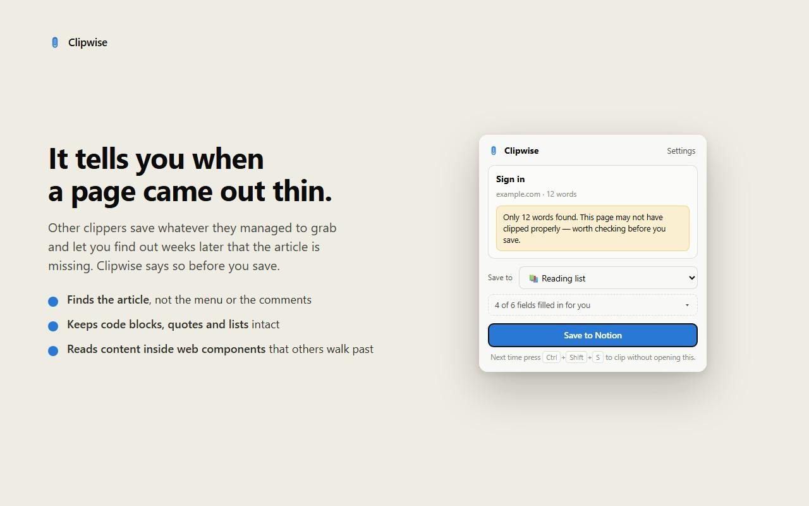

### 🎬 관련 영상
- [🎥 영상 보기](https://ph-files.imgix.net/5ca86b24-75fe-4bc2-8fc4-ac360bb64a63.jpeg?auto=format)

---

## 6. [Visiby](https://www.producthunt.com/products/visiby)
**Votes**: 110 | **도입 난이도**: 하 | **신뢰도**: 상
**Tagline**: Track and grow your visibility across AI search
**서비스 링크**: https://www.producthunt.com/r/K5QKGJPDFGTEKH

**태그**: Marketing, AI, Analytics, SEO, AI Tool, Chat

### 📌 이 서비스 한눈에 보기
AI 검색 엔진에서의 브랜드 노출도와 점유율을 추적하고 최적화하는 솔루션

### 🔑 주요 기능
- ChatGPT, Perplexity, Gemini 등 주요 AI 검색 플랫폼 내 브랜드 가시성 측정
- 브랜드 언급, 추천 및 인용 현황 실시간 트래킹
- 경쟁사 분석을 통한 AI 답변 내 점유 기회 포착

### 🙋 사용자에게 어떤 점이 좋은가
AI가 답변을 생성하는 시대에 브랜드가 어떻게 인용되는지 파악하여, AI 검색 결과 상단에 노출될 수 있는 전략을 세울 수 있습니다.

### ✅ 지금 바로 써볼 기능
- 주요 AI 플랫폼별 브랜드 언급 빈도 확인하기
- 경쟁사 대비 브랜드 노출 격차 분석하기
- AI 답변 내 인용 최적화 기회 식별하기

### ⚠️ 사용 전 확인할 점
- AI 모델의 답변 생성 로직이 수시로 변하므로 데이터의 지속적인 모니터링이 필요함
- 측정된 데이터가 실제 매출이나 트래픽으로 연결되는 상관관계는 별도 검증 필요

### 🧭 확인이 더 필요한 정보
구체적인 데이터 업데이트 주기와 API 연동 범위에 대한 정보가 명시되지 않았습니다.

### 📸 스크린샷 및 갤러리
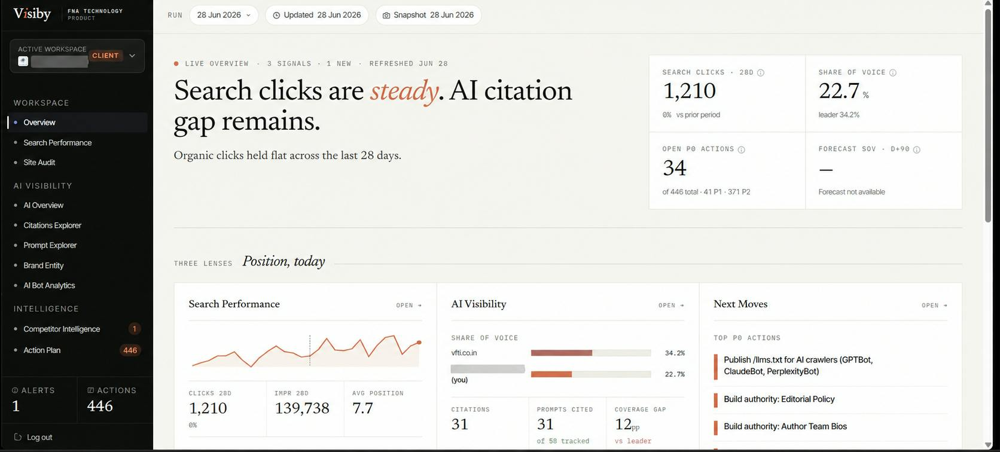
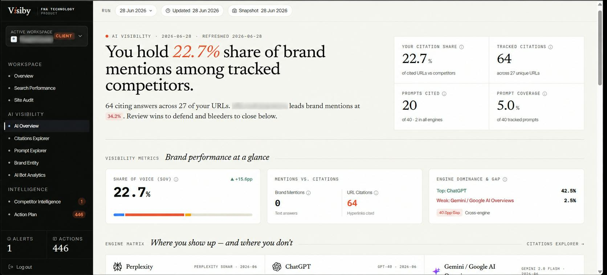
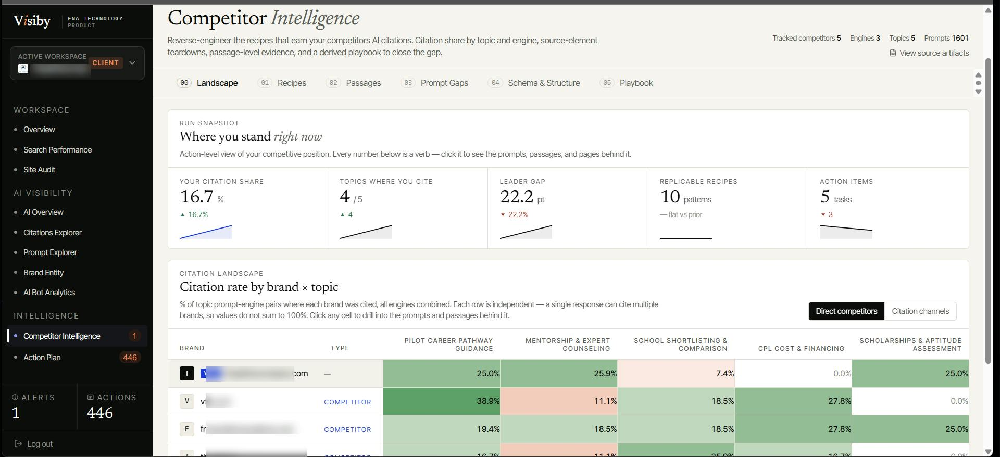

### 🎬 관련 영상
- [🎥 영상 보기](https://ph-files.imgix.net/f45c9265-b10e-4f22-9a9a-7488f641e33d.jpeg?auto=format)

---

## 7. [SHIUI](https://www.producthunt.com/products/shiui-hinomaru-ink-ui-kit)
**Votes**: 103 | **도입 난이도**: 하 | **신뢰도**: 상
**Tagline**: Hinomaru Ink Web UI Kit in Japanese Hinomaru style
**서비스 링크**: https://www.producthunt.com/r/DM2MJFTO3DRRTB

**태그**: Design, UI Kit, Web Design

### 📌 이 서비스 한눈에 보기
일본 히노마루 포스터 스타일의 평면적이고 강렬한 잉크 질감 UI 키트

### 🔑 주요 기능
- 일본 전통 히노마루 스타일의 독창적인 디자인
- 종이, 먹, 주홍색을 활용한 감각적인 색감
- 그림자가 없는 미니멀한 플랫 디자인

### 🙋 사용자에게 어떤 점이 좋은가
독특하고 예술적인 분위기의 웹 인터페이스를 원하는 디자이너나 개발자가 즉시 활용할 수 있습니다.

### ✅ 지금 바로 써볼 기능
- 제공되는 색상 조합 확인하기
- 플랫 디자인 스타일 적용해보기
- 종이 및 먹 질감 요소 살펴보기

### ⚠️ 사용 전 확인할 점
- 강렬한 스타일로 인해 일반적인 비즈니스 UI에는 어울리지 않을 수 있음
- 그림자가 없는 디자인 특성상 계층 구조 표현에 제약이 있을 수 있음

### 🧭 확인이 더 필요한 정보
제공되는 파일 형식(Figma, Sketch 등)과 라이선스 범위에 대한 정보가 명시되지 않았습니다.

### 📸 스크린샷 및 갤러리
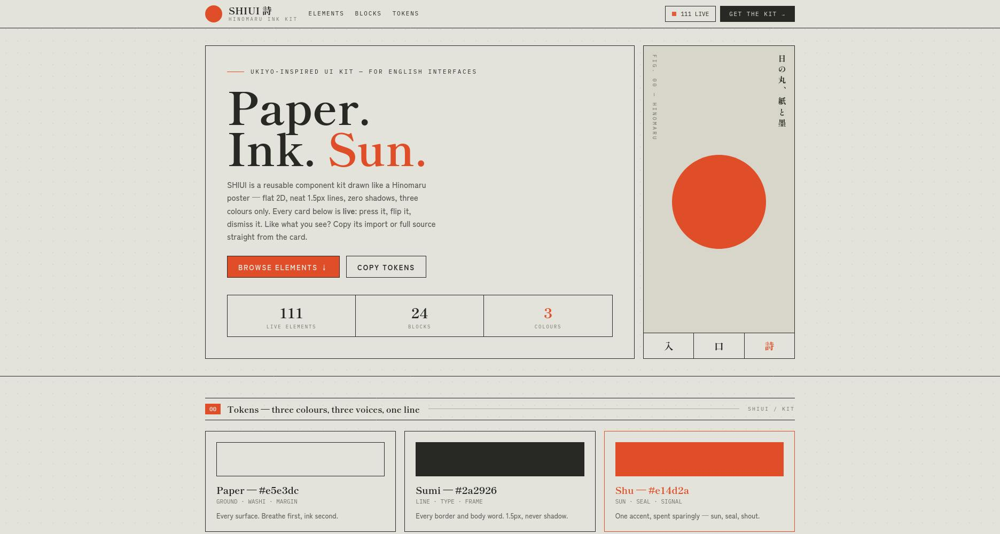
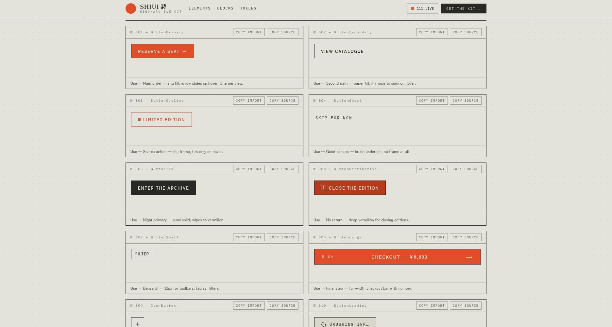
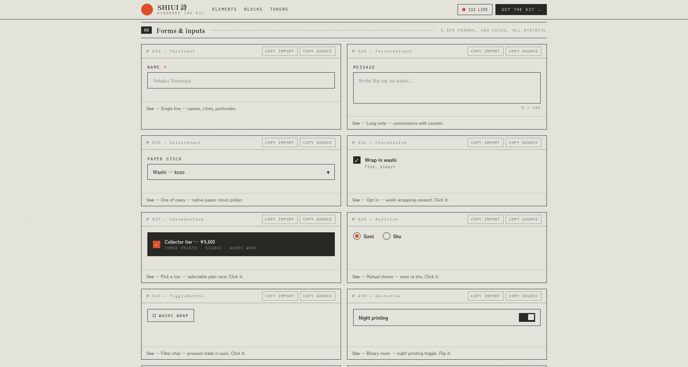

---

## 8. [DemoTV](https://www.producthunt.com/products/demotv)
**Votes**: 102 | **도입 난이도**: 하 | **신뢰도**: 상
**Tagline**: The audience-ranked TV channel for product demos
**서비스 링크**: https://www.producthunt.com/r/QQOOOHQVE3BUZY

**태그**: Product Demo, Marketing, Community, AI Tool

### 📌 이 서비스 한눈에 보기
시청자 투표로 순위가 결정되는 24/7 제품 데모 채널

### 🔑 주요 기능
- 시청자 투표 기반의 실시간 제품 데모 채널 운영
- 헤드 투 헤드(Head-to-head) 배틀 방식을 통한 제품 순위 결정
- Elo 점수 시스템을 활용한 상위 채널 선정 및 노출

### 🙋 사용자에게 어떤 점이 좋은가
제품 제작자는 무료로 데모를 제출하여 잠재 고객에게 노출할 수 있으며, 투명한 투표 시스템을 통해 실제 사용자들의 반응을 확인할 수 있습니다.

### ✅ 지금 바로 써볼 기능
- 무료로 짧은 제품 데모 제출하기
- 실시간 채널 배틀 시청 및 투표 참여하기
- 제품 노출을 위한 유료 에어타임 옵션 검토하기

### ⚠️ 사용 전 확인할 점
- 순위는 투표로 결정되므로 제품의 매력도에 따라 노출 차이가 클 수 있음
- 유료 광고는 노출을 보장하지만 순위 자체를 조작할 수는 없음

### 🧭 확인이 더 필요한 정보
유료 에어타임 구매 시 구체적인 비용과 노출 방식에 대한 상세 정보가 필요합니다.

### 📸 스크린샷 및 갤러리

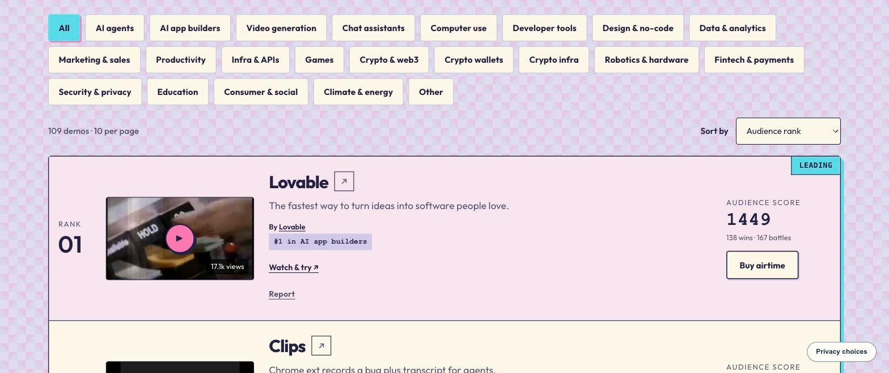

---

## 9. [Epilude Notetaker](https://www.producthunt.com/products/epilude)
**Votes**: 95 | **도입 난이도**: 하 | **신뢰도**: 상
**Tagline**: 100% private meeting notes
**서비스 링크**: https://www.producthunt.com/r/2NAVFS6PSGYRKR

**태그**: Productivity, AI, Note-taking, Privacy, Mac

### 📌 이 서비스 한눈에 보기
봇 참여 없이 맥(Mac)에서 직접 실행되는 프라이빗 회의 기록 및 요약 도구

### 🔑 주요 기능
- 회의 참여 봇 없이 Mac 시스템에서 직접 녹음
- 전사(Transcript), 요약, 실행 항목 자동 생성
- 사용자가 직접 소유하는 Markdown 파일 형식 저장

### 🙋 사용자에게 어떤 점이 좋은가
회의에 외부 봇이 들어오는 것에 대한 보안 우려를 해결하며, 생성된 노트를 Markdown으로 관리하여 개인 지식 베이스에 즉시 통합할 수 있습니다.

### ✅ 지금 바로 써볼 기능
- Mac에서 회의 녹음 테스트하기
- 생성된 Markdown 파일의 품질 확인하기
- 자동 생성된 액션 아이템 검토하기

### ⚠️ 사용 전 확인할 점
- Mac 환경에 특화된 도구이므로 타 OS 사용 시 제약이 있을 수 있음
- 시스템 오디오 녹음 방식에 따른 환경별 호환성 확인 필요

### 🧭 확인이 더 필요한 정보
지원하는 macOS 버전 및 시스템 오디오 캡처 방식에 대한 상세 사양 확인이 필요합니다.

### 📸 스크린샷 및 갤러리
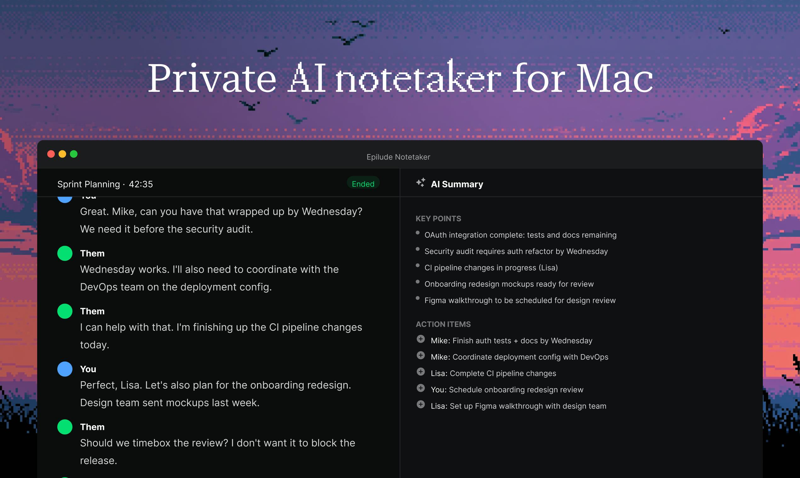

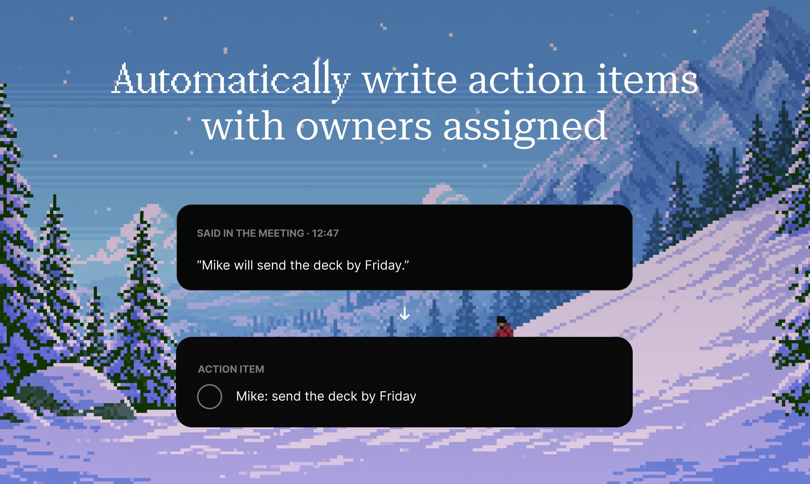

---

## 10. [Neopress](https://www.producthunt.com/products/neopress)
**Votes**: 91 | **도입 난이도**: 하 | **신뢰도**: 상
**Tagline**: Build and grow your website by chatting with AI
**서비스 링크**: https://www.producthunt.com/r/2EZNTKTNXHKP34

**태그**: NoCode, AI, WebBuilder, SEO, Analytics, AI Tool, Chat

### 📌 이 서비스 한눈에 보기
대화형 AI를 통해 웹사이트 구축부터 SEO, 분석까지 한 번에 해결하는 올인원 워크스페이스

### 🔑 주요 기능
- AI와의 대화를 통한 웹사이트 제작 및 콘텐츠 성장 루프 제공
- CMS, SEO, 분석 기능이 통합된 단일 작업 공간
- 검색 엔진과 AI 크롤러에 최적화된 서버 사이드 렌더링 페이지 발행

### 🙋 사용자에게 어떤 점이 좋은가
복잡한 코딩이나 전문 도구 없이 대화만으로 웹사이트를 운영하고, 데이터 분석 결과를 즉각적인 사이트 개선으로 연결할 수 있습니다.

### ✅ 지금 바로 써볼 기능
- AI와 대화하며 기본 웹사이트 구조 구축하기
- 발행된 페이지의 SEO 및 AI 가독성 확인하기
- 분석 데이터를 바탕으로 AI에게 사이트 개선 제안 요청하기

### ⚠️ 사용 전 확인할 점
- AI 생성 콘텐츠의 품질 및 독창성 검토 필요
- 복잡한 커스텀 기능 구현 시 제약 사항 확인 필요

### 🧭 확인이 더 필요한 정보
사용자 정의 기능의 확장성과 외부 서비스와의 연동 범위에 대한 정보가 부족합니다.

### 📸 스크린샷 및 갤러리

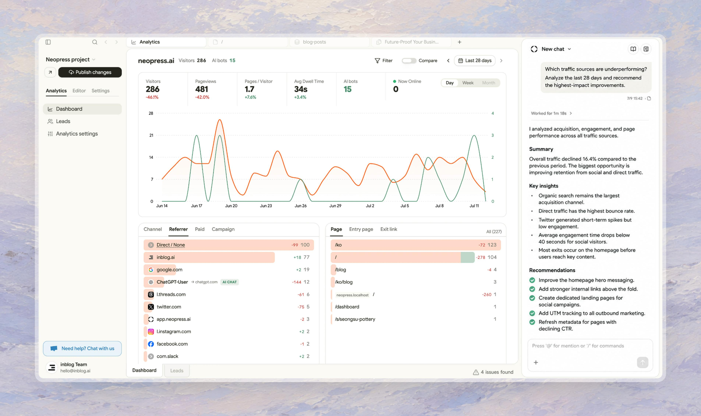
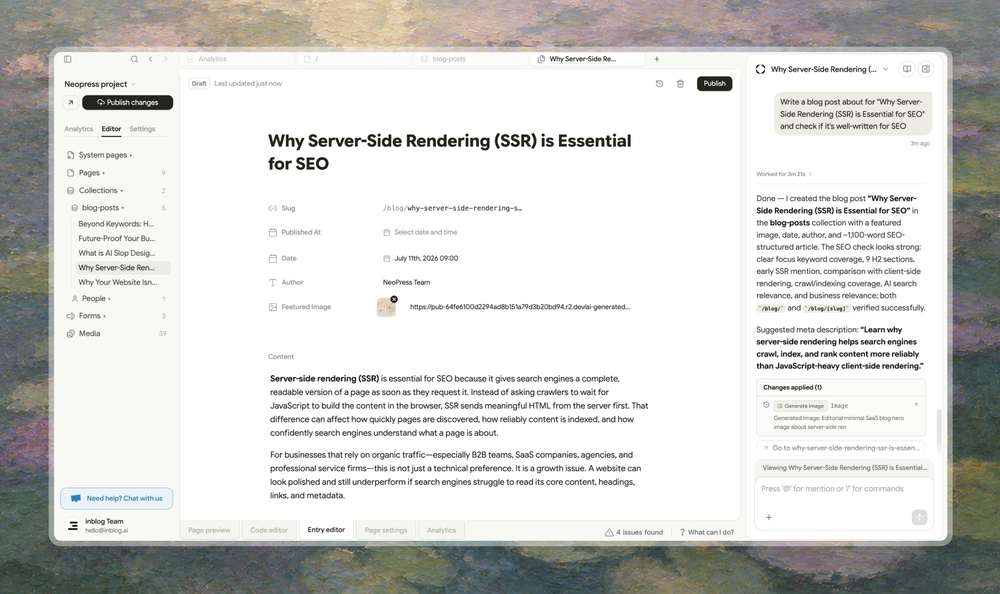

### 🎬 관련 영상
- [🎥 영상 보기](https://ph-files.imgix.net/d705a1c4-3045-44f2-95c4-407097060272.jpeg?auto=format)

---

## 11. [GhostWriter by MyHandler](https://www.producthunt.com/products/ghostwriter-by-myhandler)
**Votes**: 90 | **도입 난이도**: 하 | **신뢰도**: 상
**Tagline**: Two taps and it's already written
**서비스 링크**: https://www.producthunt.com/r/BF5SIJICZW37PQ

**태그**: AI, Productivity, Automation, Windows, AI Tool

### 📌 이 서비스 한눈에 보기
사용자의 맥락과 개인 데이터를 기반으로 맞춤형 답장을 자동 생성하는 윈도우용 AI 글쓰기 도구

### 🔑 주요 기능
- 화면상의 대화 내용, 일정, 파일, 과거 회의 기록을 기반으로 맥락 파악
- 사용자의 고유한 글쓰기 스타일과 서명까지 재현하는 맞춤형 초안 생성
- 어떤 앱에서도 단축키(Left Ctrl 더블탭)로 즉시 실행되는 간편한 워크플로우

### 🙋 사용자에게 어떤 점이 좋은가
사용자의 개인화된 정보를 바탕으로 글을 대신 써주어, 매번 상황을 설명할 필요 없이 즉각적인 답장 초안을 얻을 수 있습니다.

### ✅ 지금 바로 써볼 기능
- 단축키(Left Ctrl 더블탭)를 활용해 텍스트 필드에서 즉시 실행해보기
- 자신의 글쓰기 스타일이 잘 반영되는지 확인하기
- 로컬 암호화 저장소에 데이터가 어떻게 관리되는지 설정 확인하기

### ⚠️ 사용 전 확인할 점
- 현재 Windows 환경에서만 작동함
- 개인 데이터(일정, 파일 등)를 인덱싱하므로 보안 정책 확인 필요

### 🧭 확인이 더 필요한 정보
사용자의 개인 파일 및 일정 데이터가 클라우드와 어떻게 동기화되거나 처리되는지에 대한 상세 보안 프로토콜 확인이 필요합니다.

### 📸 스크린샷 및 갤러리

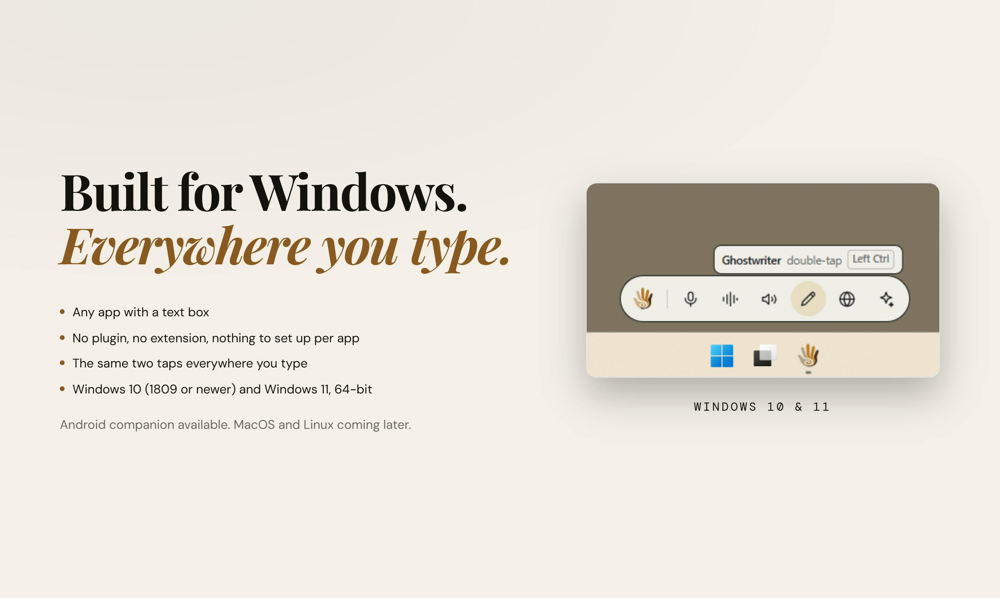

### 🎬 관련 영상
- [🎥 영상 보기](https://ph-files.imgix.net/34bc24e0-bff9-4ae5-9e99-33896c9cced1.jpeg?auto=format)

---

## 12. [Kirokune](https://www.producthunt.com/products/kirokune)
**Votes**: 90 | **도입 난이도**: 하 | **신뢰도**: 상
**Tagline**: Keep work incident notes on your iPhone, without an account
**서비스 링크**: https://www.producthunt.com/r/F57JOW6T2AGX5V

**태그**: Productivity, Mobile, FieldWork, AI Tool

### 📌 이 서비스 한눈에 보기
계정 생성 없이 아이폰에서 즉시 기록하는 업무용 사고/로그 타임라인

### 🔑 주요 기능
- 계정 가입 없이 아이폰에서 바로 사용 가능한 간편함
- 사고 기록, 녹음, 사진을 타임라인 형태로 관리
- 무제한 기록(단일 케이스 내) 및 기본 템플릿 제공

### 🙋 사용자에게 어떤 점이 좋은가
복잡한 가입 절차 없이 현장에서 즉시 사진과 음성을 포함한 업무 기록을 남길 수 있어 현장 대응력이 높습니다.

### ✅ 지금 바로 써볼 기능
- 기본 제공되는 사고 기록 템플릿 활용하기
- 현장 사진 및 녹음 기능 테스트하기
- 필요 시 PDF 내보내기 기능 검토하기

### ⚠️ 사용 전 확인할 점
- 추가 케이스 생성 및 PDF 내보내기는 유료 기능임
- 계정이 없으므로 기기 분실/변경 시 데이터 복구 방식 확인 필요

### 🧭 확인이 더 필요한 정보
계정 없이 데이터가 기기에만 저장되는 방식이므로, 기기 교체 시 데이터 이전/백업 정책을 확인해야 합니다.

### 📸 스크린샷 및 갤러리

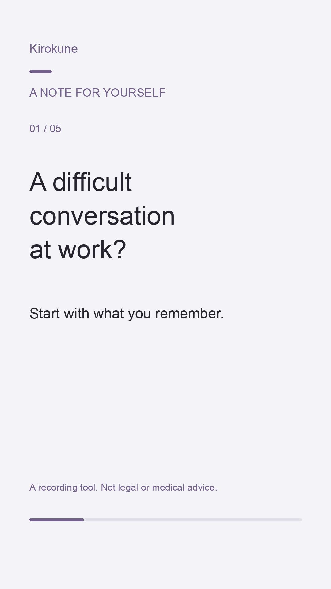

### 🎬 관련 영상
- [🎥 영상 보기](https://ph-files.imgix.net/e61c25e5-fbf7-4c6c-8e06-1230e805b6a7.jpeg?auto=format)

---

## 13. [Naverny Borshchu](https://www.producthunt.com/products/naverny-borshchu)
**Votes**: 15 | **도입 난이도**: 하 | **신뢰도**: 상
**Tagline**: Find and rate best borshch on one map
**서비스 링크**: https://www.producthunt.com/r/NT3FKN5NJQ6PYM

**태그**: Community, Foodie, Map, OpenSource, AI Tool

### 📌 이 서비스 한눈에 보기
전 세계 보르시 맛집을 지도 위에서 찾고 직접 평가하는 커뮤니티형 맛집 지도

### 🔑 주요 기능
- 31개 도시, 278개 보르시 맛집 정보를 담은 커뮤니티 지도
- 고기 함량, 비트 맛, 농도 등 7가지 세부 기준으로 정밀한 맛 평가
- 광고와 제휴 링크가 없는 오픈소스 기반의 무료 서비스

### 🙋 사용자에게 어떤 점이 좋은가
진짜 보르시 맛을 찾는 미식가들에게 검증된 맛집 정보를 제공하며, 직접 맛을 보고 새로운 맛집 발견자로 등록할 수 있습니다.

### ✅ 지금 바로 써볼 기능
- 지도에서 내 주변의 보르시 맛집 탐색하기
- 7가지 기준에 맞춰 직접 먹어본 보르시 점수 매기기
- 아직 점수가 없는 맛집을 방문해 '발견자'로 등록하기

### ⚠️ 사용 전 확인할 점
- 사용자 참여형 데이터이므로 맛집 정보의 정확성이 개인의 주관에 의존함
- 아직 평가되지 않은 맛집(175개)은 데이터 신뢰도가 낮을 수 있음

### 🧭 확인이 더 필요한 정보
현재 제공되는 데이터가 특정 지역에 편중되어 있는지 확인이 필요합니다.

### 📸 스크린샷 및 갤러리
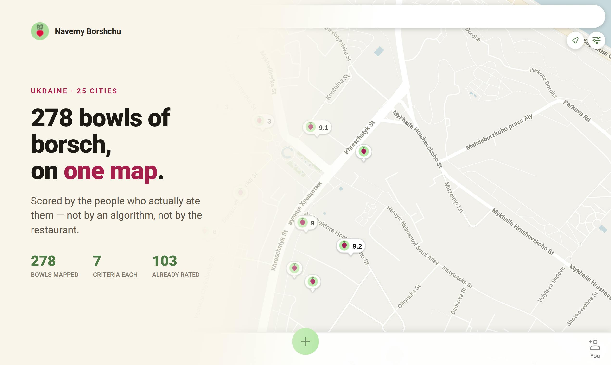
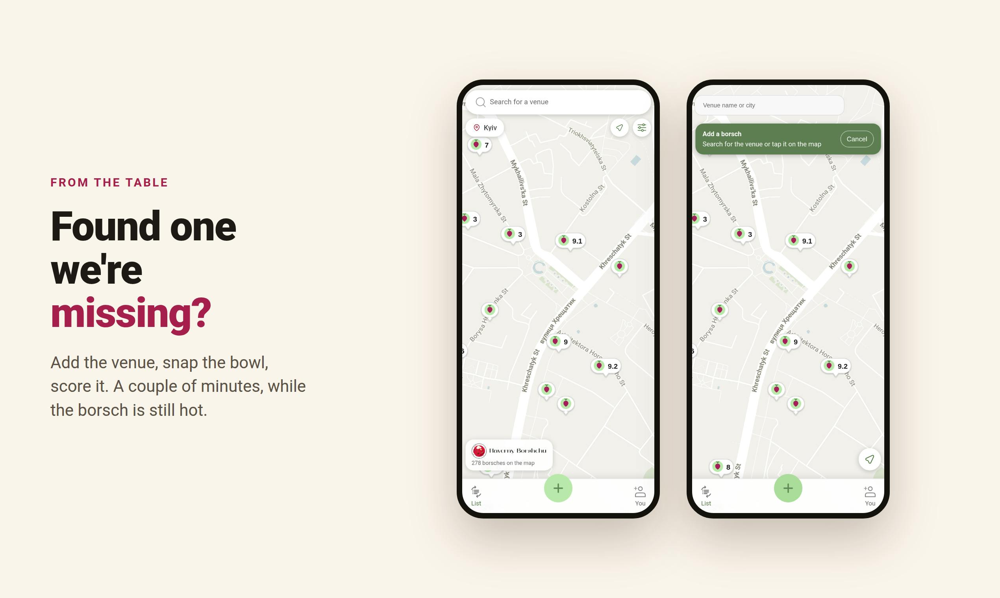
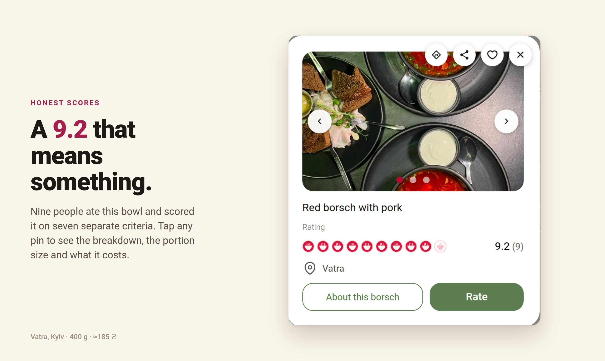

---

## 14. [Best Productivity Resources](https://www.producthunt.com/products/best-productivity-resources)
**Votes**: 11 | **도입 난이도**: 하 | **신뢰도**: 상
**Tagline**: Directory of best tools, apps, guides, and other resources
**서비스 링크**: https://www.producthunt.com/r/RD6ETIUZ27AC4P

**태그**: Productivity, Curated List, Resource Directory, Workflow, Automation, AI Tool

### 📌 이 서비스 한눈에 보기
검증된 생산성 도구와 리소스를 한눈에 찾는 큐레이션 디렉토리

### 🔑 주요 기능
- 전문가가 직접 검토하여 신뢰할 수 있는 생산성 도구 목록 제공
- AI 도구, 강의, 도서 등 다양한 형태의 리소스 포함
- 모든 링크가 실제 제품 웹사이트로 직접 연결되어 탐색 용이

### 🙋 사용자에게 어떤 점이 좋은가
수많은 도구 사이에서 헤매지 않고, 검증된 최적의 생산성 솔루션을 빠르게 발견하여 업무 효율을 높일 수 있습니다.

### ✅ 지금 바로 써볼 기능
- 자신의 업무 분야(태스크 관리, 자동화 등)에 맞는 도구 검색
- 큐레이션된 리소스를 통해 새로운 워크플로우 탐색
- 제공되는 링크를 통해 실제 제품 사이트 방문 및 검토

### ⚠️ 사용 전 확인할 점
- 큐레이션된 목록이 사용자의 특정 워크플로우에 항상 완벽히 부합하지 않을 수 있음
- 제품의 업데이트 상태나 가격 정책은 외부 사이트에서 직접 확인 필요

### 🧭 확인이 더 필요한 정보
제공되는 리소스의 업데이트 주기와 카테고리별 상세 필터링 기능 여부는 확인이 필요합니다.

### 📸 스크린샷 및 갤러리
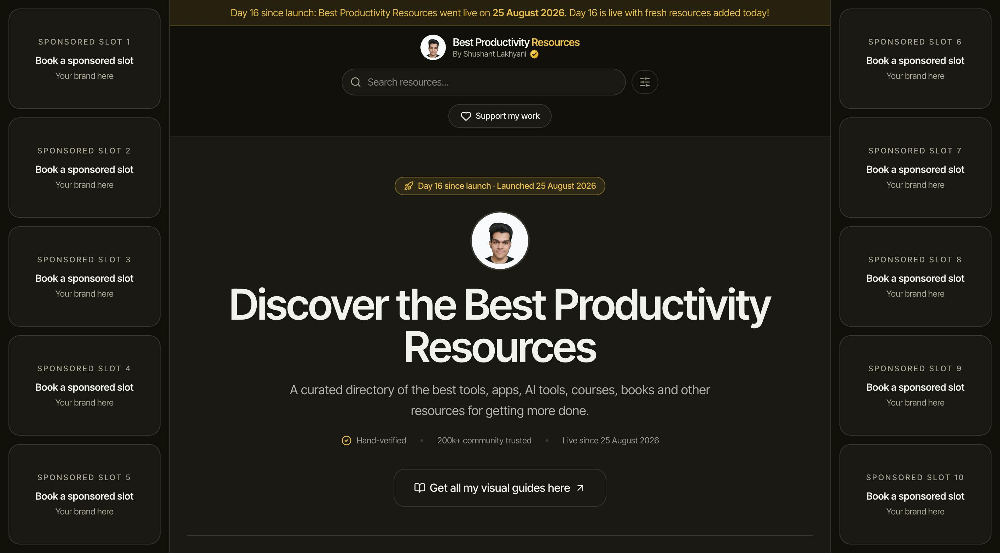
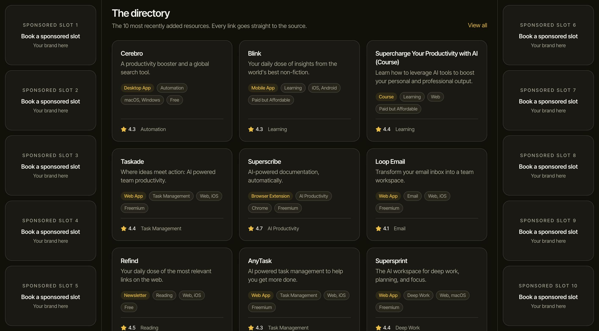
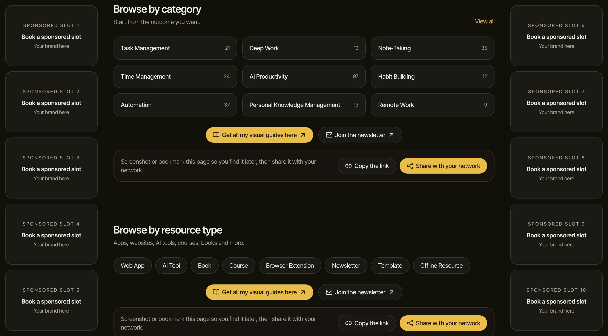

### 🎬 관련 영상
- [🎥 영상 보기](https://ph-files.imgix.net/99f73a2c-55ba-4786-9792-b77859b1677c.jpeg?auto=format)

---

## 15. [TablePro](https://www.producthunt.com/products/tablepro)
**Votes**: 10 | **도입 난이도**: 하 | **신뢰도**: 상
**Tagline**: Native database client, free and open source
**서비스 링크**: https://www.producthunt.com/r/DQLUFLFL6B3CAX

**태그**: DevTool, Database, OpenSource, Productivity

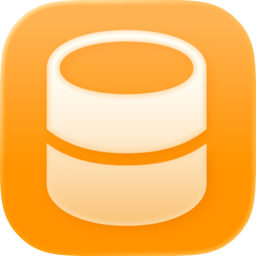

### 📌 이 서비스 한눈에 보기
Electron 없이 가볍고 빠르게 실행되는 오픈소스 네이티브 데이터베이스 클라이언트

### 🔑 주요 기능
- MySQL, Postgres, MongoDB, Redis, DuckDB 등 35종의 다양한 데이터베이스 지원
- AppKit 및 SwiftUI 기반의 네이티브 앱으로 빠른 실행 속도와 낮은 리소스 점유율(80MB)
- 에디터, 그리드, 데이터 임포트/익스포트 기능을 무료로 제공하는 오픈소스(AGPL v3)

### 🙋 사용자에게 어떤 점이 좋은가
무거운 Electron 기반 툴 대신 가볍고 빠른 로컬 환경에서 데이터베이스를 관리하고 싶을 때 유용합니다.

### ✅ 지금 바로 써볼 기능
- 다양한 데이터베이스 연결 테스트
- 데이터 그리드 및 편집 기능 확인
- 데이터 임포트 및 익스포트 워크플로우 테스트

### ⚠️ 사용 전 확인할 점
- AGPL v3 라이선스 정책에 따른 사용 범위 확인 필요
- 네이티브 앱 특성상 지원되는 OS 환경 확인 필요

### 🧭 확인이 더 필요한 정보
35종의 데이터베이스 중 사용자가 필요한 특정 DB의 완전한 기능 지원 여부를 확인해야 합니다.

### 📸 스크린샷 및 갤러리
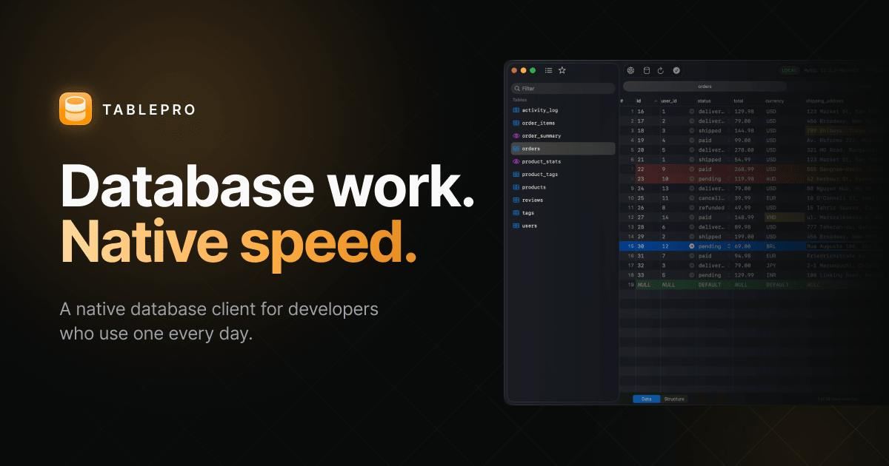
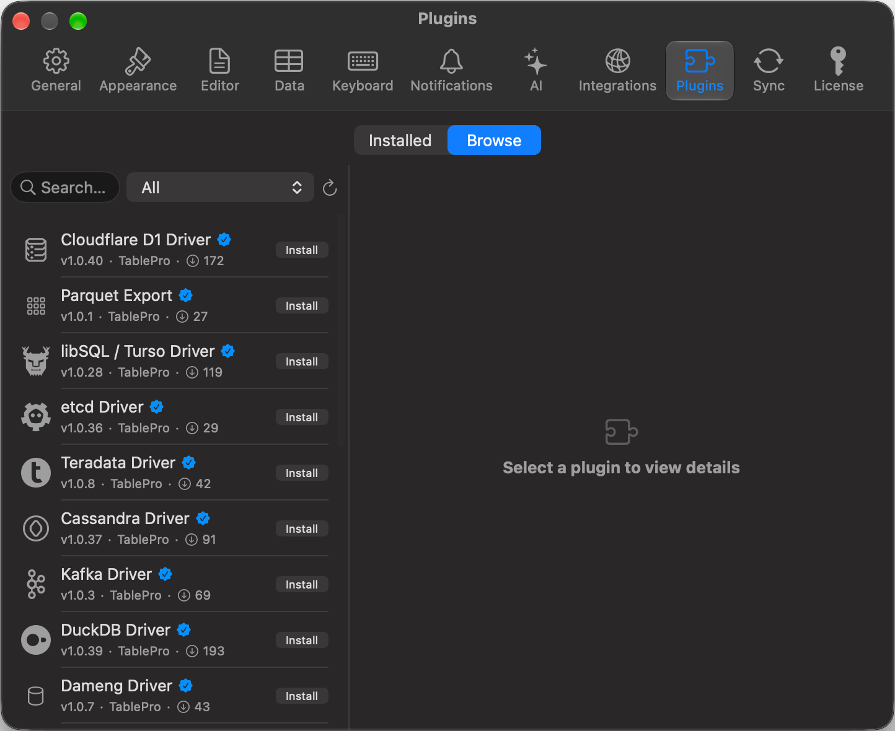
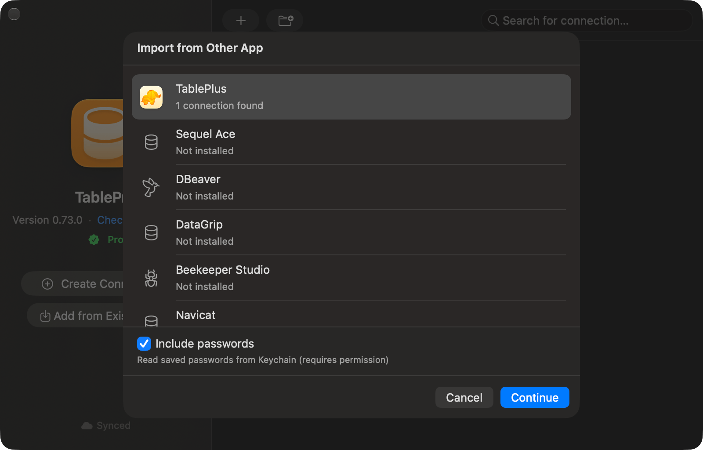

---

## 16. [Gemini app for Windows](https://www.producthunt.com/products/gemini-6)
**Votes**: 9 | **도입 난이도**: 하 | **신뢰도**: 상
**Tagline**: Alt + Space and Gemini is right there
**서비스 링크**: https://www.producthunt.com/r/SUJWMVICSLS2SN

**태그**: Productivity, AI, Windows, Automation, Google, Agent, AI Tool

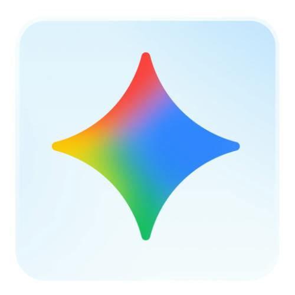

### 📌 이 서비스 한눈에 보기
Alt + Space 단축키로 윈도우 작업 흐름을 끊지 않고 즉시 호출하는 Gemini 공식 데스크톱 앱

### 🔑 주요 기능
- Alt + Space 단축키를 통한 즉각적인 Gemini 호출 기능
- Gemini Spark를 활용한 에이전트 기반 작업 수행
- Gmail, Docs, Google Drive의 컨텍스트를 활용한 데이터 연동

### 🙋 사용자에게 어떤 점이 좋은가
작업 중 창을 전환할 필요 없이 즉시 AI를 불러와 텍스트를 초안을 작성하거나 구글 워크스페이스 데이터를 활용할 수 있어 생산성이 극대화됩니다.

### ✅ 지금 바로 써볼 기능
- Alt + Space 단축키로 즉시 호출해보기
- Gemini Spark로 에이전트 작업 실행하기
- 구글 워크스페이스(Gmail, Docs 등) 데이터 연동 확인하기

### ⚠️ 사용 전 확인할 점
- Windows 10 및 11 운영체제 환경 필요
- 구글 워크스페이스 계정 권한 및 데이터 접근 설정 확인 필요

### 🧭 확인이 더 필요한 정보
Gemini Spark 기능의 구체적인 작업 범위와 자동화 수준에 대한 상세 사양 확인이 필요합니다.

### 📸 스크린샷 및 갤러리
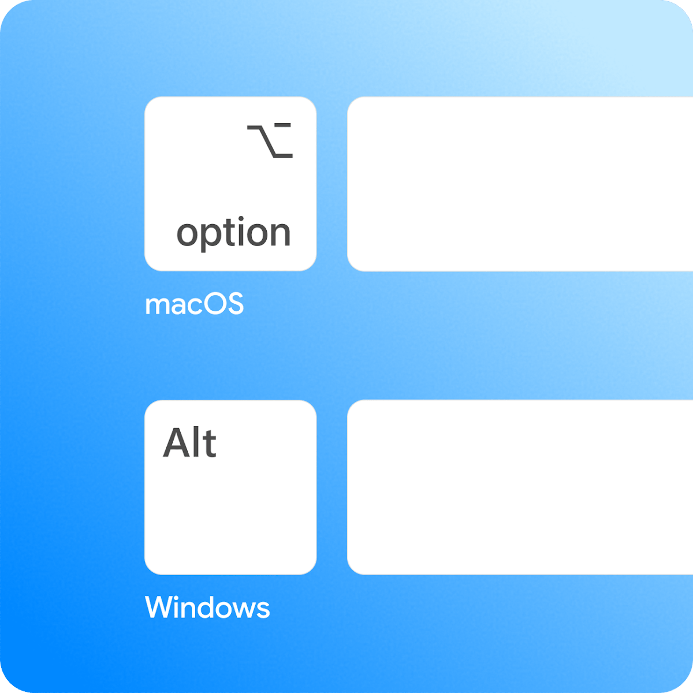
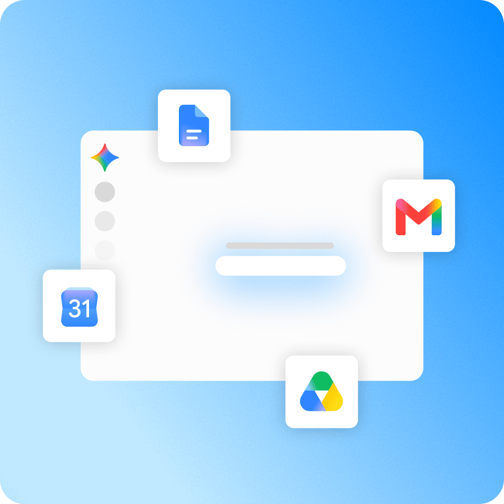
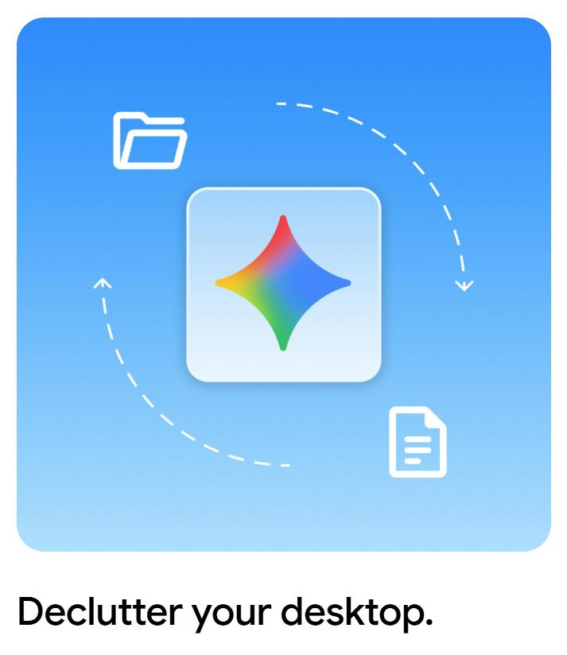

---

## 17. [Baroque  2.0](https://www.producthunt.com/products/baroque)
**Votes**: 7 | **도입 난이도**: 하 | **신뢰도**: 상
**Tagline**: AI design with the entire internet as its reference.
**서비스 링크**: https://www.producthunt.com/r/H75OWJM7LIKFNX

**태그**: Design, AI, Frontend, NoCode, Productivity, Agent, AI Tool, DevTool

### 📌 이 서비스 한눈에 보기
인터넷 실시간 데이터를 기반으로 완성도 높은 웹/앱 디자인과 코드를 생성하는 AI 디자인 에이전트

### 🔑 주요 기능
- 웹 에이전트가 인터넷 전역에서 실시간 디자인 레퍼런스를 수집
- 수백 개의 디자인 법칙을 적용하여 일관성 있는 화면 설계
- Figma 및 프로덕션급 React 코드 내보장 지원

### 🙋 사용자에게 어떤 점이 좋은가
디자인 영감을 찾는 시간과 코드로 구현하는 번거로움을 동시에 해결하여, 아이디어를 즉시 실행 가능한 결과물로 바꿀 수 있습니다.

### ✅ 지금 바로 써볼 기능
- 실시간 레퍼런스 기반 디자인 생성 기능 테스트
- 생성된 디자인의 Figma 내보내기 기능 확인
- 생성된 React 코드의 프로덕션 적용 가능성 검토

### ⚠️ 사용 전 확인할 점
- 생성된 코드의 복잡도에 따른 수동 수정 필요성 확인
- 실시간 데이터 기반 디자인의 독창성 및 저작권 이슈 검토

### 🧭 확인이 더 필요한 정보
사용자의 커스텀 디자인 시스템이나 특정 프레임워크와의 호환성 수준은 명시되지 않았습니다.

### 📸 스크린샷 및 갤러리
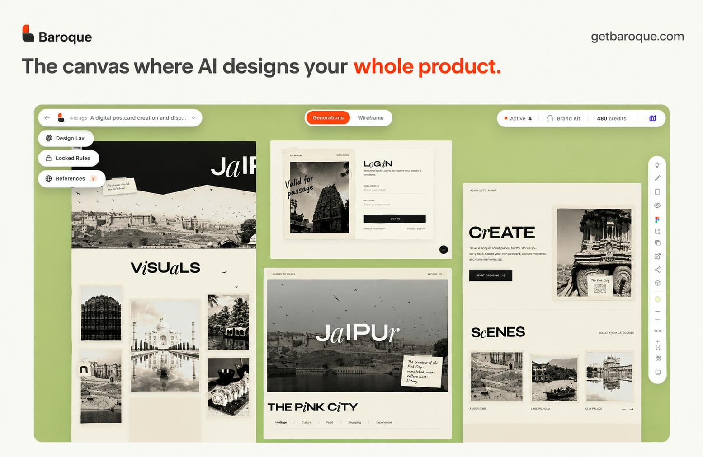
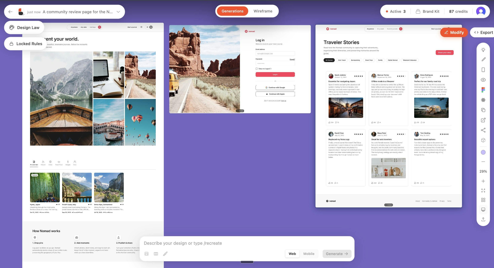
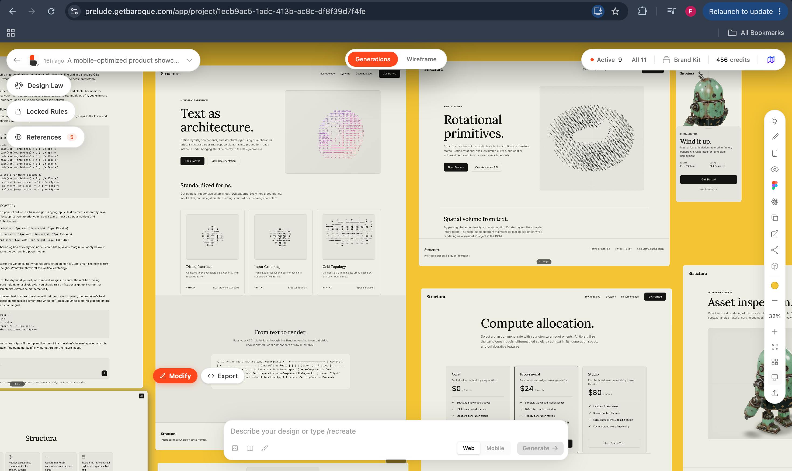

---

## 18. [SCAPTION](https://www.producthunt.com/products/scaption)
**Votes**: 6 | **도입 난이도**: 하 | **신뢰도**: 상
**Tagline**: Live captions and translation for events, in 58 languages
**서비스 링크**: https://www.producthunt.com/r/RWAK7WNUJLBTE4

**태그**: EventTech, Translation, Accessibility, AI, AI Tool

### 📌 이 서비스 한눈에 보기
58개 언어를 지원하는 실시간 이벤트 자막 및 번역 솔루션

### 🔑 주요 기능
- 58개 언어 실시간 자막 및 번역 제공
- 현장 스크린(NDI 소스) 및 참가자 스마트폰(QR 코드) 동시 지원
- 질의응답, 투표 및 AI 요약 기능 포함

### 🙋 사용자에게 어떤 점이 좋은가
언어 장벽 없이 글로벌 이벤트를 운영할 수 있으며, 참가자들이 별도 앱 설치 없이 QR 코드로 편리하게 자막을 확인할 수 있습니다.

### ✅ 지금 바로 써볼 기능
- 1시간 무료 체험으로 현장 테스트하기
- QR 코드를 통한 모바일 자막 확인 기능 테스트
- AI 요약 및 투표 기능 활용해보기

### ⚠️ 사용 전 확인할 점
- 무료 사용 시간(1시간) 제한 확인 필요
- 현장 네트워크 환경에 따른 실시간 전송 안정성 확인 필요

### 🧭 확인이 더 필요한 정보
무료 1시간 이후의 구체적인 유료 요금 체계와 기능 제한 범위를 확인해야 합니다.

### 📸 스크린샷 및 갤러리

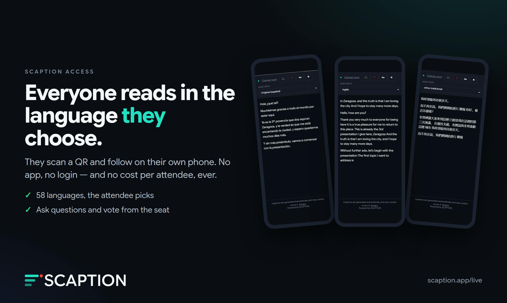
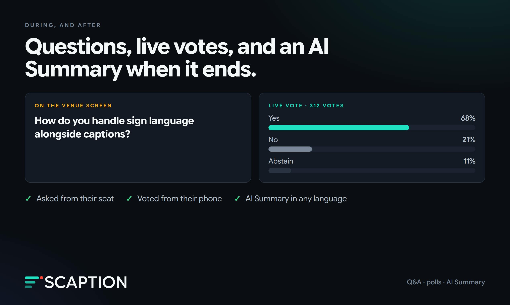

### 🎬 관련 영상
- [🎥 영상 보기](https://ph-files.imgix.net/34a2d5f5-2c77-4ae9-8703-214cbe9d992e.jpeg?auto=format)

---

## 19. [LingoLingo: Learn Language with Youtube](https://www.producthunt.com/products/lingolingo)
**Votes**: 6 | **도입 난이도**: 하 | **신뢰도**: 상
**Tagline**: Turn YouTube into your language learning playground
**서비스 링크**: https://www.producthunt.com/r/43SQZFQERCE25X

**태그**: LanguageLearning, Education, YouTube, Productivity, Video

### 📌 이 서비스 한눈에 보기
유튜브 영상을 인터랙티브한 언어 학습 교재로 바꿔주는 학습 도구

### 🔑 주요 기능
- 유튜브 영상을 활용한 맞춤형 언어 학습 환경 제공
- 사용자 수준에 맞춘 번역 및 학습 콘텐츠 매칭
- 상호작용이 가능한 연습 문제 기능 포함

### 🙋 사용자에게 어떤 점이 좋은가
평소 즐겨 보는 유튜브 영상을 단순 시청을 넘어 실질적인 언어 학습 도구로 활용할 수 있습니다.

### ✅ 지금 바로 써볼 기능
- 자신의 언어 수준에 맞는 영상 탐색하기
- 제공되는 인터랙티브 연습 문제 풀어보기
- 영상 내 번역 기능 활용하기

### ⚠️ 사용 전 확인할 점
- 무료 체험 이후의 유료 플랜 정책 확인 필요
- 영상 콘텐츠의 질에 따라 학습 효과가 달라질 수 있음

### 🧭 확인이 더 필요한 정보
구체적인 유료 구독 모델과 지원하는 언어의 범위는 명시되지 않았습니다.

### 📸 스크린샷 및 갤러리
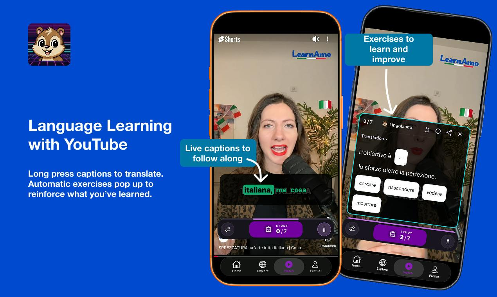

### 🎬 관련 영상
- [🎥 영상 보기](https://ph-files.imgix.net/a621047d-bb12-41cc-aa0c-ac93c74c375a.jpeg?auto=format)

---

## 20. [Cue](https://www.producthunt.com/products/cue-21)
**Votes**: 6 | **도입 난이도**: 중 | **신뢰도**: 상
**Tagline**: The Awwwards-tier UI component library.
**서비스 링크**: https://www.producthunt.com/r/3CV3Z57TD3CYBG

**태그**: UI/UX, Design, Frontend, WebDesign

### 📌 이 서비스 한눈에 보기
Awwwards 수준의 고퀄리티 인터랙티브 UI를 구현하는 컴포넌트 라이브러리

### 🔑 주요 기능
- 감각적이고 독창적인 디자인의 UI 컴포넌트 제공
- 강력한 인터랙션과 마이크로 애니메이션 중심의 설계
- 웹사이트의 시각적 완성도를 높이는 레이아웃 구성

### 🙋 사용자에게 어떤 점이 좋은가
디자인 역량이 부족하더라도 전문가 수준의 화려하고 독특한 웹사이트를 빠르게 구축할 수 있습니다.

### ✅ 지금 바로 써볼 기능
- Bold Hero 섹션 적용해보기
- Smooth Interaction 컴포넌트 테스트하기
- Unique Layout 구성 살펴보기

### ⚠️ 사용 전 확인할 점
- 디자인 중심의 컴포넌트이므로 일반적인 관리자 페이지 등에는 과할 수 있음
- 사용 중인 프레임워크와의 호환성 확인 필요

### 🧭 확인이 더 필요한 정보
구체적인 기술 스택(React, Vue, Tailwind 등) 및 설치 방법이 명시되지 않았습니다.

### 📸 스크린샷 및 갤러리
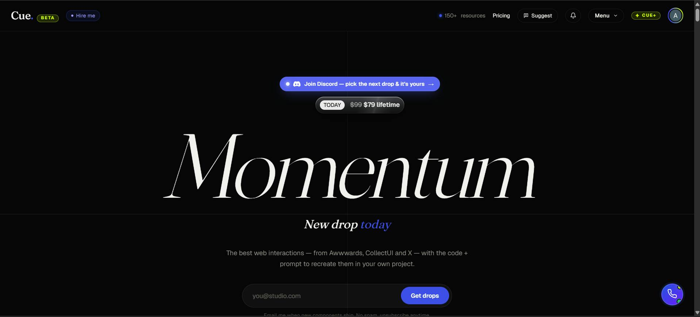
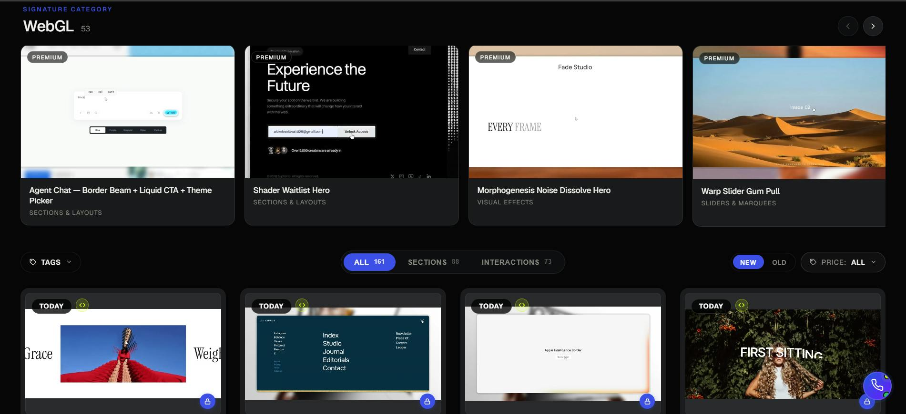

---

## 21. [MARVIS](https://www.producthunt.com/products/marvis-2)
**Votes**: 5 | **도입 난이도**: 중 | **신뢰도**: 상
**Tagline**: Know your rights. Track what moves. Protect what’s yours.
**서비스 링크**: https://www.producthunt.com/r/PHPLYRUPJXSHTP

**태그**: MusicTech, Copyright, Royalty, ArtistTools, AI Tool

### 📌 이 서비스 한눈에 보기
음악 저작권 및 수익 관리를 위한 아티스트 전용 프라이빗 운영체제

### 🔑 주요 기능
- 출판, PRO 등록, DSP 정책 등 복잡한 저작권 관리 통합
- 로열티, 저작권, 인접권 및 싱크 라이선스 추적
- AI 음악 규정 및 최신 저작권 이슈 대응

### 🙋 사용자에게 어떤 점이 좋은가
아티스트가 자신의 권리를 명확히 파악하고, 복잡한 저작권 및 로열티 흐름을 체계적으로 관리할 수 있도록 돕습니다.

### ✅ 지금 바로 써볼 기능
- 현재 보유한 저작권 및 등록 현황 등록
- 로열티 및 수익 흐름 추적 설정
- AI 음악 관련 정책 및 규정 확인

### ⚠️ 사용 전 확인할 점
- 법적 조언이 아닌 관리 도구로서의 성격 확인 필요
- 사용자 데이터 보안 및 프라이버시 정책 검토 필요

### 🧭 확인이 더 필요한 정보
구체적인 플랫폼 연동 범위와 법적 효력 범위에 대한 확인이 필요합니다.

### 📸 스크린샷 및 갤러리
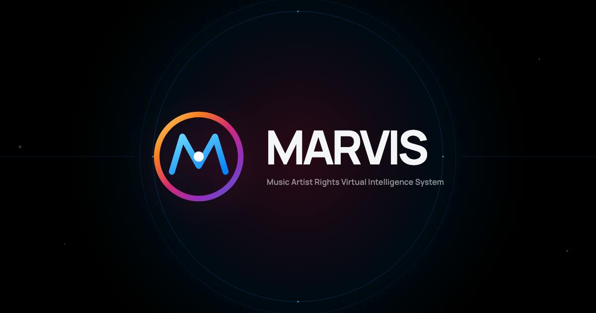
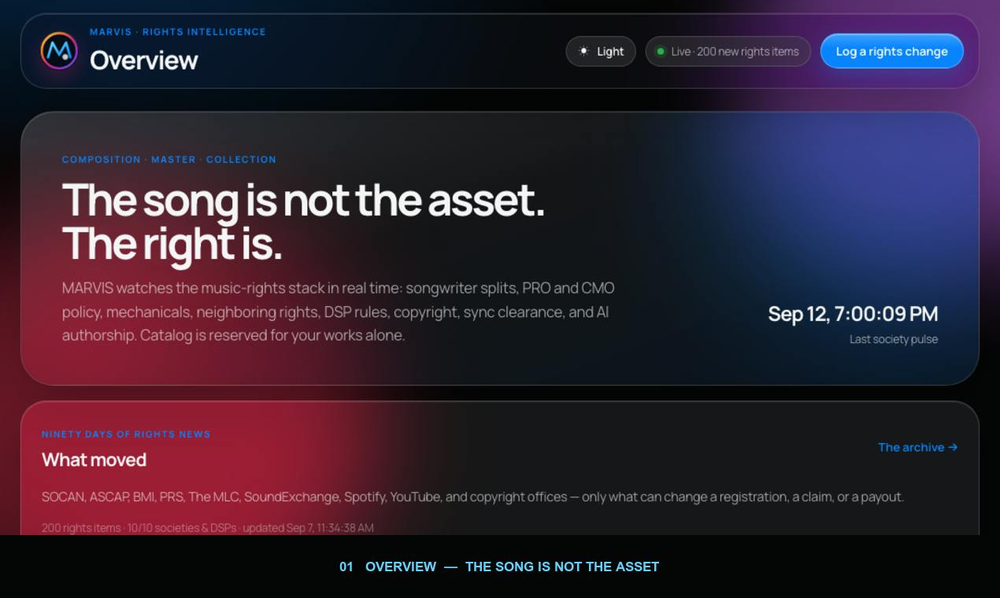
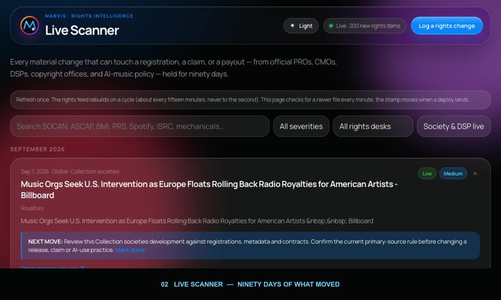

### 🎬 관련 영상
- [🎥 영상 보기](https://ph-files.imgix.net/f4c2be53-aef9-46f2-9de4-e09419d4b1c4.jpeg?auto=format)

---

## 22. [Arazio](https://www.producthunt.com/products/arazio)
**Votes**: 5 | **도입 난이도**: 하 | **신뢰도**: 상
**Tagline**: Convert any file without leaving Finder
**서비스 링크**: https://www.producthunt.com/r/FFZ2FQGXODH7RT

**태그**: Productivity, macOS, Utility, Automation, AI Tool, DevTool

### 📌 이 서비스 한눈에 보기
Finder를 떠나지 않고 마우스 클릭만으로 파일을 즉시 변환하는 초간편 컨버터

### 🔑 주요 기능
- Finder 내에서 Shift 키와 라디얼 메뉴를 이용한 직관적인 변환 방식
- 파일을 열거나 가져오는 번거로운 단계 없이 즉각적인 결과물 생성
- 네트워크 코드가 없는 로컬 실행 방식으로 강력한 개인정보 보호 및 보안 제공

### 🙋 사용자에게 어떤 점이 좋은가
파일 변환을 위해 별도의 앱을 열고 파일을 드래그하는 번거로움을 없애 작업 흐름을 획기적으로 단축해 줍니다.

### ✅ 지금 바로 써볼 기능
- Finder에서 파일 선택 후 Shift 키를 눌러 라디얼 메뉴 확인하기
- 지원되는 43가지 포맷 중 필요한 변환 옵션 탐색하기
- 로컬 엔진을 통한 안전한 파일 변환 작업 수행하기

### ⚠️ 사용 전 확인할 점
- macOS 환경에 특화된 도구이므로 다른 OS에서는 사용 불가
- 지원되는 43가지 포맷 외의 변환은 불가능

### 🧭 확인이 더 필요한 정보
지원되는 43가지 포맷의 구체적인 목록과 파일당 용량 제한 여부는 명시되지 않았습니다.

### 📸 스크린샷 및 갤러리
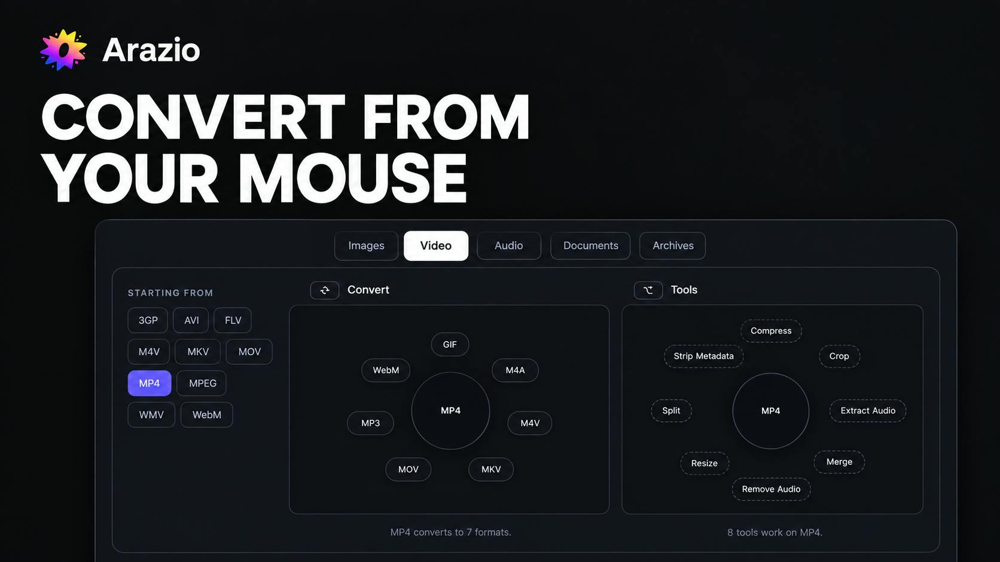

### 🎬 관련 영상
- [🎥 영상 보기](https://ph-files.imgix.net/bf413062-6636-4e86-a868-54687b217588.jpeg?auto=format)

---

## 23. [MonoDuty](https://www.producthunt.com/products/monoduty)
**Votes**: 4 | **도입 난이도**: 하 | **신뢰도**: 상
**Tagline**: On-call alerts that reach you by email, SMS, and phone
**서비스 링크**: https://www.producthunt.com/r/BBPZQXI4QDOOSU

**태그**: DevOps, IncidentResponse, Monitoring, Automation, AI Tool, Email

### 📌 이 서비스 한눈에 보기
소규모 엔지니어링 팀을 위한 통합 온콜 알림 및 장애 대응 솔루션

### 🔑 주요 기능
- 이메일, SMS, 음성 전화를 통한 다각적 장애 알림 제공
- 온콜 스케줄링, 업타임 모니터링, 크론 하트비트 통합 관리
- Slack, Discord, MS Teams 등 협업 도구와의 연동 지원

### 🙋 사용자에게 어떤 점이 좋은가
장애 발생 시 적절한 담당자에게 즉각적으로 알림을 전달하고, 응답이 없을 경우 에스컬레이션 정책을 통해 문제를 확실히 해결할 수 있습니다.

### ✅ 지금 바로 써볼 기능
- 웹훅을 통한 기존 도구 연결하기
- 에스컬레이션 정책 설정하기
- Slack/Discord 알림 채널 연동하기

### ⚠️ 사용 전 확인할 점
- SMS 및 음성 호출 기능은 유료 플랜에서만 제공됨
- 소규모 엔지니어링 팀에 최적화되어 있어 대규모 조직에는 기능이 부족할 수 있음

### 🧭 확인이 더 필요한 정보
유료 플랜의 구체적인 가격 체계와 SMS/음성 호출의 비용 산정 방식은 명시되어 있지 않습니다.

### 📸 스크린샷 및 갤러리

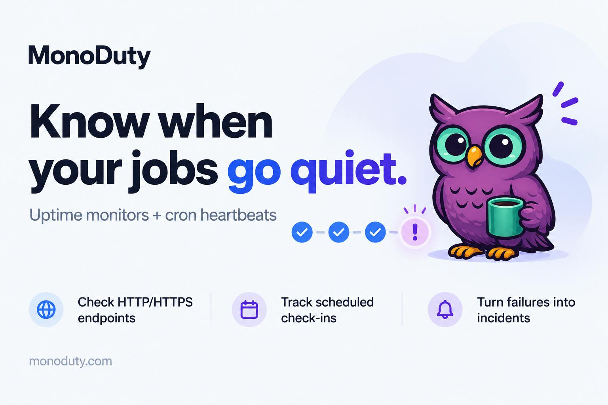
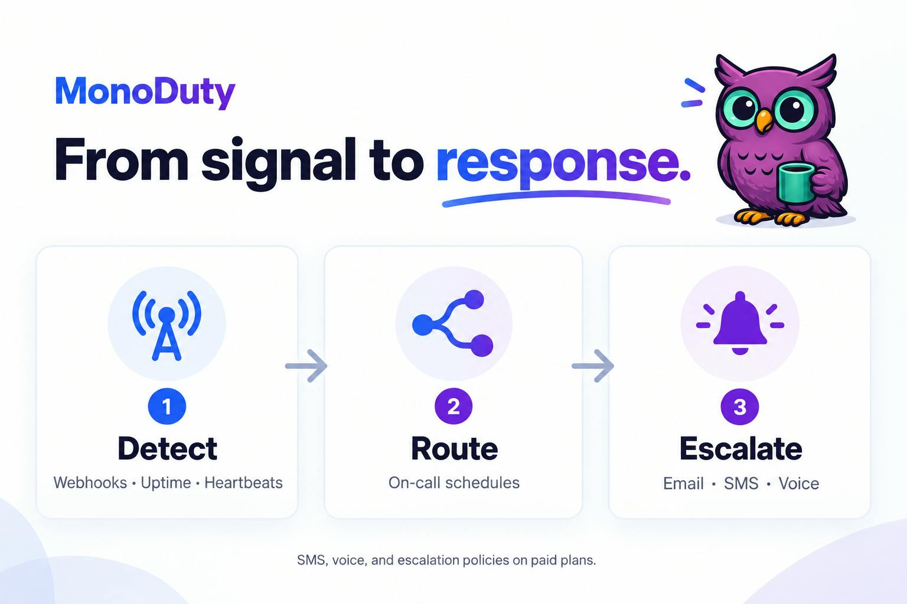

---

## 24. [Sway](https://www.producthunt.com/products/sway-13)
**Votes**: 4 | **도입 난이도**: 하 | **신뢰도**: 상
**Tagline**: Your MacBook's lid moves. Your desktop follows.
**서비스 링크**: https://www.producthunt.com/r/B4R6PVPBPDJHVR

**태그**: Design, MacBook, Customization, UI/UX, AI Tool

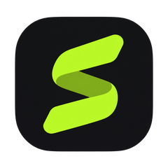

### 📌 이 서비스 한눈에 보기
맥북의 물리적 움직임에 반응하여 데스크탑 화면이 입체적으로 변하는 시각적 효과 도구

### 🔑 주요 기능
- 맥북 상판의 움직임에 따라 데스크탑 화면이 함께 움직이는 역동적인 효과
- 원근감, 블러, 부드러운 그림자 등 사용자 맞춤형 시각 효과 제공
- 상판을 닫으면 모든 설정이 원래대로 복구되는 직관적인 동작

### 🙋 사용자에게 어떤 점이 좋은가
맥북 사용자에게 시각적인 즐거움과 생동감 넘치는 데스크탑 환경을 제공하여 작업 공간의 분위기를 바꿀 수 있습니다.

### ✅ 지금 바로 써볼 기능
- 웹사이트의 인터랙티브 프리뷰를 통해 효과 미리 체험하기
- 자신의 맥북 환경에서 시각적 효과가 어떻게 적용되는지 확인하기

### ⚠️ 사용 전 확인할 점
- 하드웨어 센서 활용 방식에 따른 배터리 소모량 확인 필요
- 특정 macOS 버전과의 호환성 여부 확인 필요

### 🧭 확인이 더 필요한 정보
실제 설치 시 시스템 리소스 점유율과 하드웨어 센서 연동 방식에 대한 구체적인 정보가 필요합니다.

### 📸 스크린샷 및 갤러리
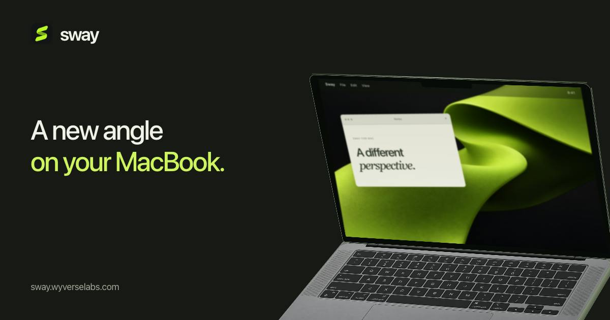
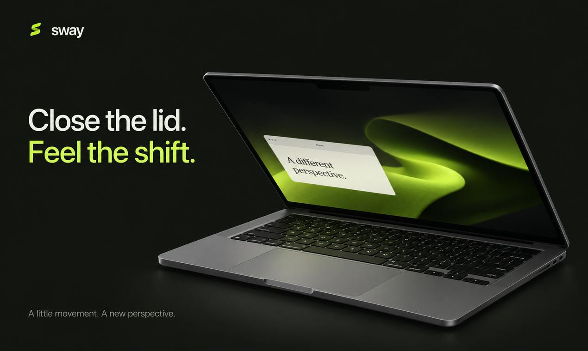
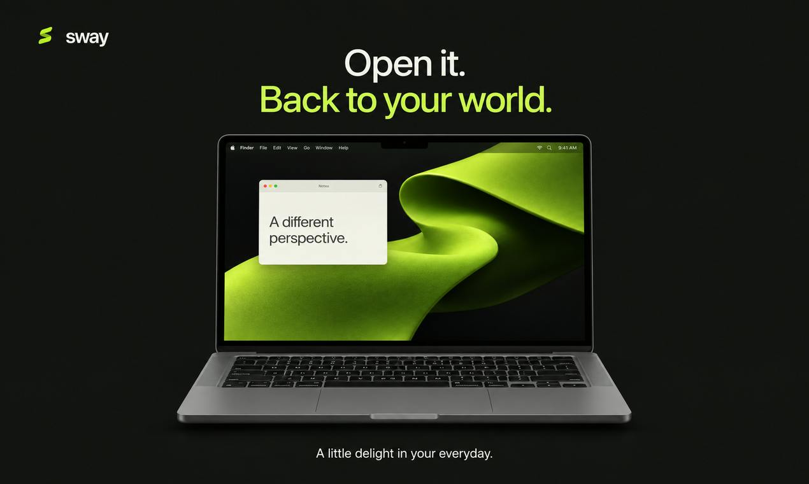

### 🎬 관련 영상
- [🎥 영상 보기](https://ph-files.imgix.net/3abe9051-b855-4d5c-84b3-faf8bb7db565.gif?auto=format)

---

## 25. [launching.best](https://www.producthunt.com/products/launching-best)
**Votes**: 4 | **도입 난이도**: 하 | **신뢰도**: 상
**Tagline**: Launch in minutes. Get discovered.
**서비스 링크**: https://www.producthunt.com/r/XSUJXJNZ2FBGPP

**태그**: Marketing, Product Launch, Minimalism, AI Tool

### 📌 이 서비스 한눈에 보기
단 몇 분 만에 제품을 등록하고 사람의 검토를 통해 확실한 노출 기회를 얻는 런칭 플랫폼

### 🔑 주요 기능
- 하루 20개 제품 등록, 제품당 10단어 이내의 간결한 소개
- 모든 런칭 건에 대해 사람이 직접 검토하는 방식
- 업보트, 댓글, 유료 광고 없는 공정한 영구 페이지 제공

### 🙋 사용자에게 어떤 점이 좋은가
복잡한 마케팅 절차 없이 제품을 빠르게 공개하고, 인위적인 수치 조작 없는 깨끗한 환경에서 제품을 노출할 수 있습니다.

### ✅ 지금 바로 써볼 기능
- 제품의 핵심 가치를 담은 10단어 이내의 문구 준비하기
- 간결한 제품 소개 페이지 구성하기
- 런칭 프로세스 확인하기

### ⚠️ 사용 전 확인할 점
- 글자 수 제한(10단어)으로 인해 상세한 기능 설명이 어려울 수 있음
- 상호작용(댓글, 업보트)이 없어 커뮤니티 피드백을 받기 어려움

### 🧭 확인이 더 필요한 정보
제품 등록을 위한 구체적인 절차와 검토 기준에 대한 상세 정보가 필요합니다.

### 📸 스크린샷 및 갤러리
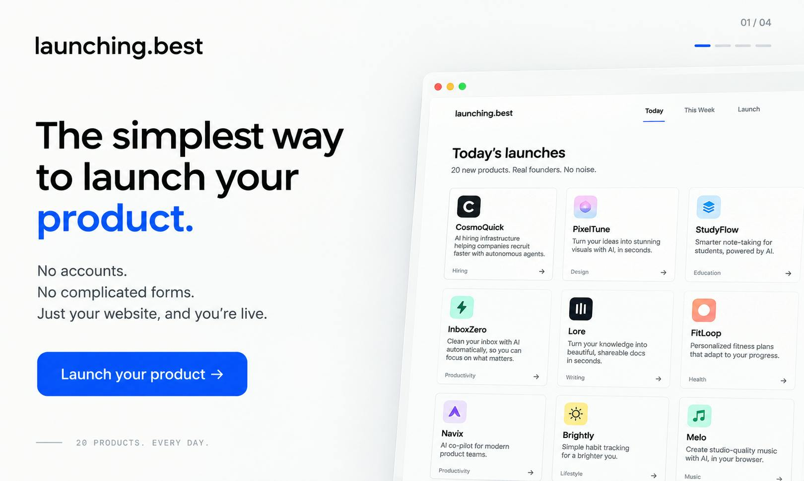
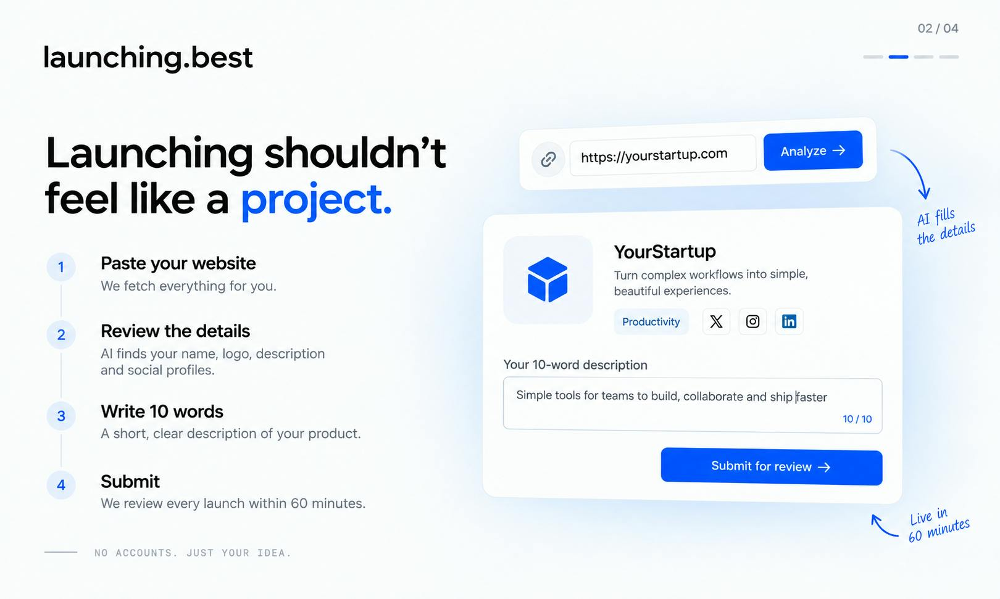
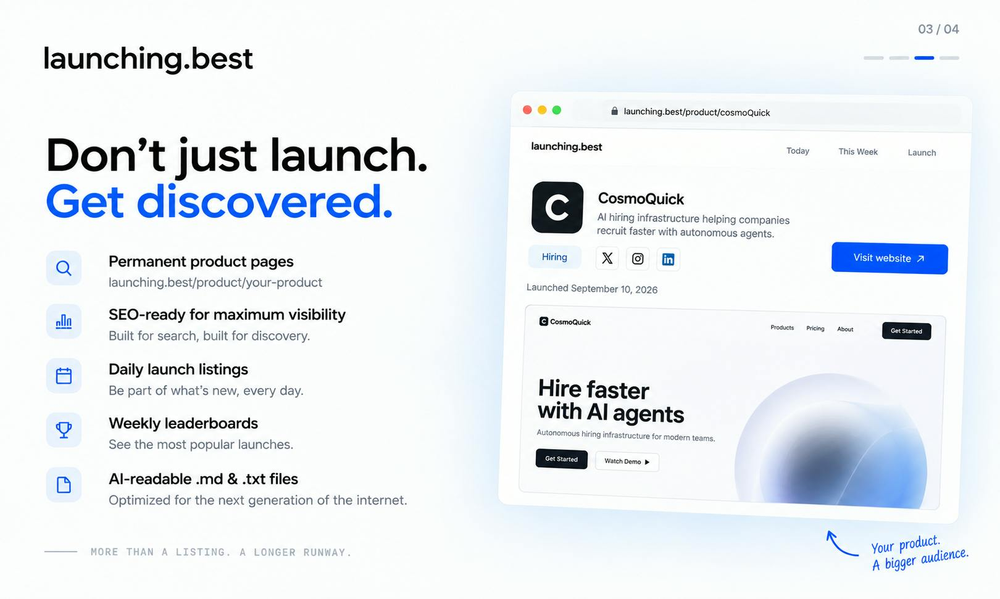

---

## 26. [BestPromptFor XYZ](https://www.producthunt.com/products/bestpromptfor-xyz)
**Votes**: 4 | **도입 난이도**: 하 | **신뢰도**: 상
**Tagline**: Copy Paste curated AI prompts | 5 languages | No Sign Up
**서비스 링크**: https://www.producthunt.com/r/J2HCWYJPTO3ZGP

**태그**: AI, Productivity, Prompt Engineering, AI Tool, Chat, Prompting

### 📌 이 서비스 한눈에 보기
가입 없이 즉시 복사하여 사용하는 5개 국어 지원 AI 프롬프트 라이브러리

### 🔑 주요 기능
- ChatGPT, Claude 등을 위한 검증된 72개 프롬프트 제공
- 별도의 회원가입이나 로그인 절차 없음
- 26개의 컬렉션과 5개 언어 지원

### 🙋 사용자에게 어떤 점이 좋은가
복잡한 설정 없이 검증된 프롬프트를 복사하여 바로 실무에 적용할 수 있어 AI 활용 효율을 높여줍니다.

### ✅ 지금 바로 써볼 기능
- 원하는 주제의 컬렉션 탐색하기
- 플레이스홀더(빈칸) 채워 프롬프트 완성하기
- 복사한 프롬프트를 AI 도구에 붙여넣기

### ⚠️ 사용 전 확인할 점
- 사용자 맞춤형 세부 조정은 직접 수행해야 함
- 프롬프트의 품질은 수동 큐레이션에 의존함

### 🧭 확인이 더 필요한 정보
제공되는 5개 언어의 구체적인 목록과 프롬프트의 전문 분야 범위를 확인해야 합니다.

### 📸 스크린샷 및 갤러리
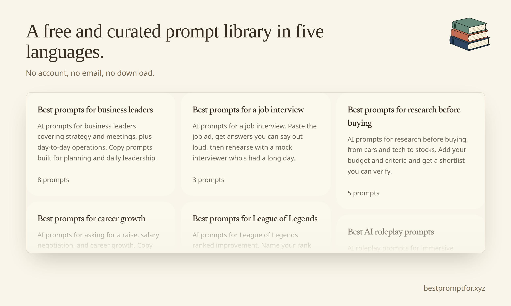
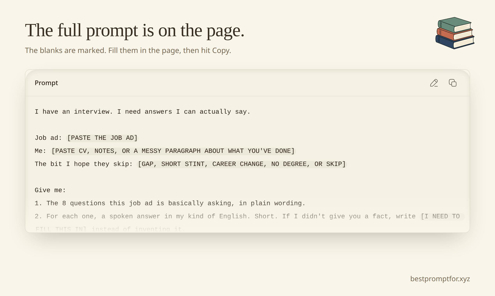
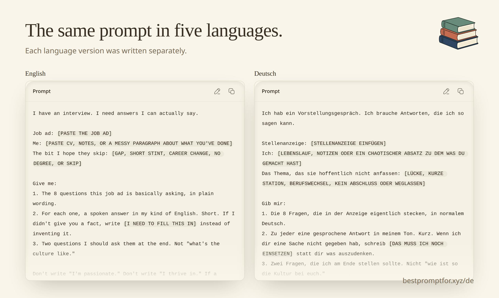

---

## 27. [Calcolo codice fiscale online](https://www.producthunt.com/products/calcolo-codice-fiscale-online)
**Votes**: 3 | **도입 난이도**: 하 | **신뢰도**: 상
**Tagline**: Generate & verify an Italian tax code — free & instantly
**서비스 링크**: https://www.producthunt.com/r/DP6WF5HFWBIZVR

**태그**: Productivity, Utility, Privacy, DevTool, API

### 📌 이 서비스 한눈에 보기
이탈리아 세금 식별 번호(Codice Fiscale)를 즉시 생성하고 검증하는 보안 중심 도구

### 🔑 주요 기능
- 이름, 생년월일, 출생지를 기반으로 한 16자리 세금 번호 자동 계산
- 생성된 번호의 유효성을 즉시 검증하는 역계산 기능 제공
- 브라우저 내 로컬 실행 방식으로 개인정보 유출 위험 차단

### 🙋 사용자에게 어떤 점이 좋은가
이탈리아 거주 시민 및 외국인이 복잡한 계산 없이 즉시 세금 번호를 생성하고 오류를 확인할 수 있습니다.

### ✅ 지금 바로 써볼 기능
- 자신의 정보를 입력하여 세금 번호 생성해보기
- 기존에 가지고 있는 세금 번호의 유효성 검증하기

### ⚠️ 사용 전 확인할 점
- 계산된 번호가 공식 기관의 데이터와 일치하는지 별도 확인 필요
- 입력 데이터의 정확도에 따라 결과값이 달라질 수 있음

### 🧭 확인이 더 필요한 정보
생성된 번호가 이탈리아 정부의 공식 문서로서 법적 효력을 갖는지 여부는 명시되지 않았습니다.

### 📸 스크린샷 및 갤러리
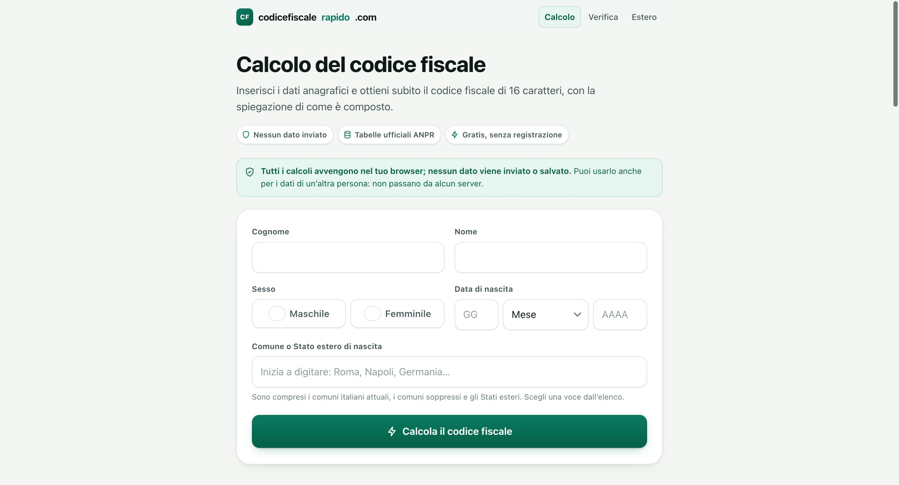
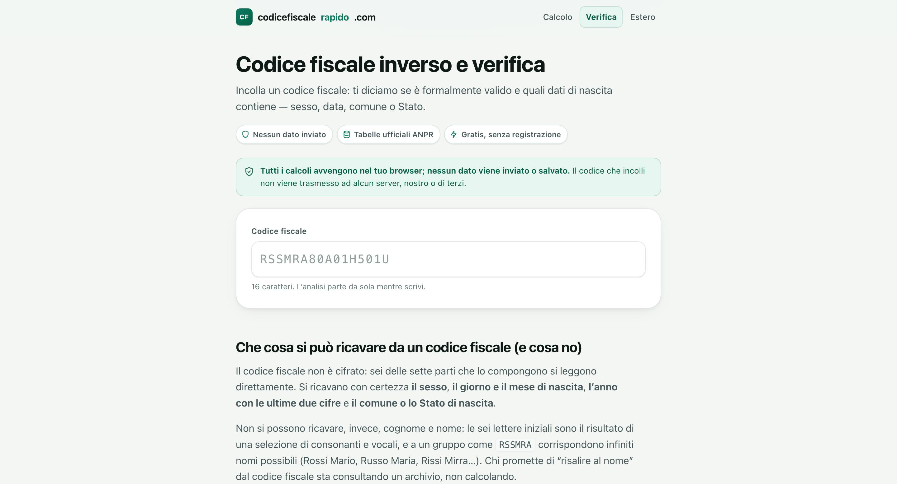
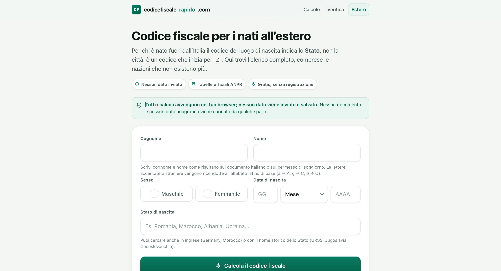

---

## 28. [Actalume](https://www.producthunt.com/products/actalume)
**Votes**: 3 | **도입 난이도**: 하 | **신뢰도**: 상
**Tagline**: Review AI work. Keep the evidence. Make the decision.
**서비스 링크**: https://www.producthunt.com/r/CD7WBU4XCL3SDJ

**태그**: AI, OpenSource, DevTool, Workflow, Agent, AI Tool

### 📌 이 서비스 한눈에 보기
AI 에이전트의 작업 결과물을 검토하고 의사결정 기록을 남기는 오픈소스 레저(Ledger)

### 🔑 주요 기능
- AI 에이전트 작업 범위 정의 및 증거 검토 기능
- 책임 있는 의사결정을 위한 이름 기반 기록 시스템
- 브라우저 기반의 로컬 데이터 관리 및 JSON 입출력 지원

### 🙋 사용자에게 어떤 점이 좋은가
AI가 수행한 작업의 근거를 투명하게 확인하고, 사람이 최종 결정을 내리는 과정을 체계적으로 관리할 수 있습니다.

### ✅ 지금 바로 써볼 기능
- JSON 파일을 통한 데이터 가져오기/내보내기 테스트
- AI 작업 결과물에 대한 검토 워크플로우 설정
- 실험적인 WebMCP 도구 활용해보기

### ⚠️ 사용 전 확인할 점
- 데이터가 브라우저에 저장되므로 브라우저 캐시 삭제 시 데이터 유실 주의
- 실험적인 기능(WebMCP)은 안정성이 낮을 수 있음

### 🧭 확인이 더 필요한 정보
데이터 저장 방식이 로컬 기반이므로 대규모 데이터 관리 시의 성능과 보안 수준을 확인해야 합니다.

### 📸 스크린샷 및 갤러리
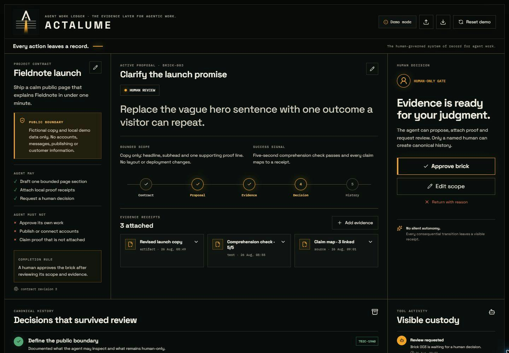
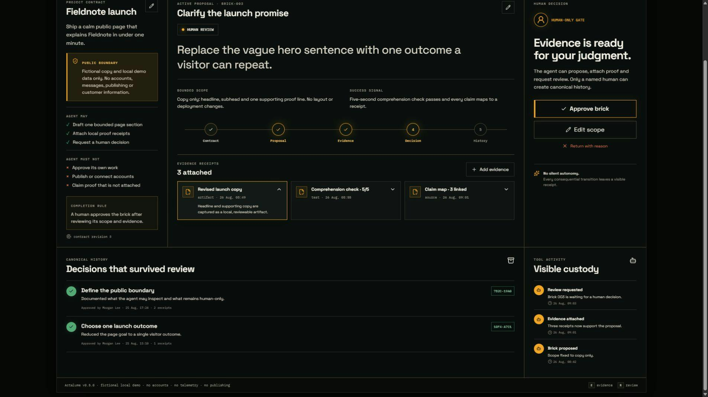

### 🎬 관련 영상
- [🎥 영상 보기](https://ph-files.imgix.net/b7dbae9f-26a2-48a1-979d-7b8b0aed1c45.jpeg?auto=format)

---

## 29. [NERVE](https://www.producthunt.com/products/nerve-8)
**Votes**: 3 | **도입 난이도**: 하 | **신뢰도**: 상
**Tagline**: Rehearse the conversation you keep replaying in your head.
**서비스 링크**: https://www.producthunt.com/r/7RXZLIOGRCY3RJ

**태그**: AI, SoftSkills, Communication, Training

### 📌 이 서비스 한눈에 보기
실전 같은 대화 연습을 통해 중요한 순간의 대처 능력을 키우는 AI 대화 트레이닝 플랫폼

### 🔑 주요 기능
- 한 번뿐인 중요한 대화를 위한 가상 연습 환경 제공
- 지루해하거나 거절하는 등 실제 사람처럼 반응하는 AI 캐릭터와 3분간의 음성 대화
- 대화 종료 후 대처 방식에 대한 스코어카드 피드백 제공

### 🙋 사용자에게 어떤 점이 좋은가
중요한 협상이나 어려운 대화를 앞두고 실전 감각을 익히고, 자신의 대화 습관을 객관적으로 점검할 수 있습니다.

### ✅ 지금 바로 써볼 기능
- 3분 음성 리허설 진행하기
- AI 캐릭터의 반응에 따른 대처 능력 점검하기
- 제공되는 스코어카드 분석하기

### ⚠️ 사용 전 확인할 점
- AI 캐릭터의 반응이 실제 인간의 복잡한 감정을 완벽히 대체할 수 있는지 확인 필요
- 음성 기반 서비스이므로 마이크 환경에 따른 성능 차이 가능성

### 🧭 확인이 더 필요한 정보
현재 서비스가 웹 기반인지 모바일 앱 형태인지, 구체적인 피드백 지표가 무엇인지 확인이 필요합니다.

### 📸 스크린샷 및 갤러리
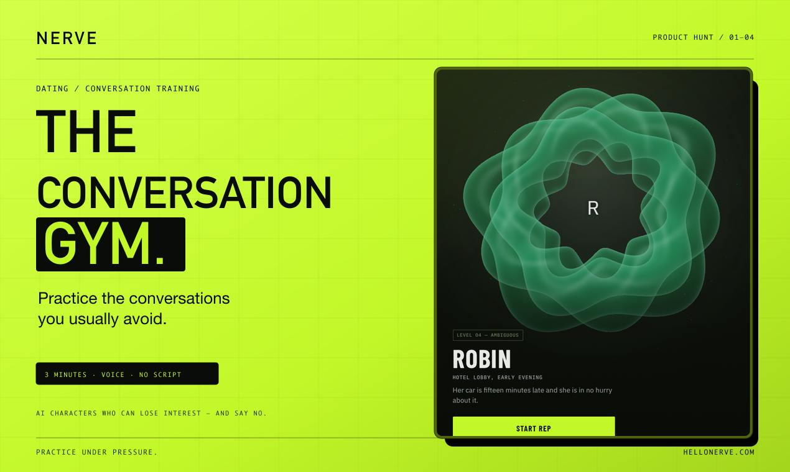
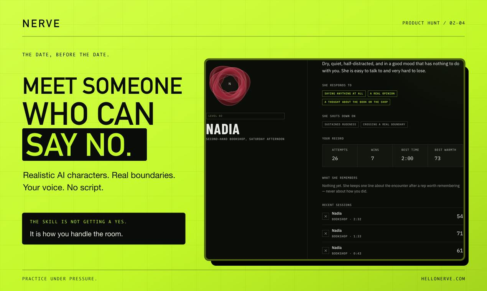
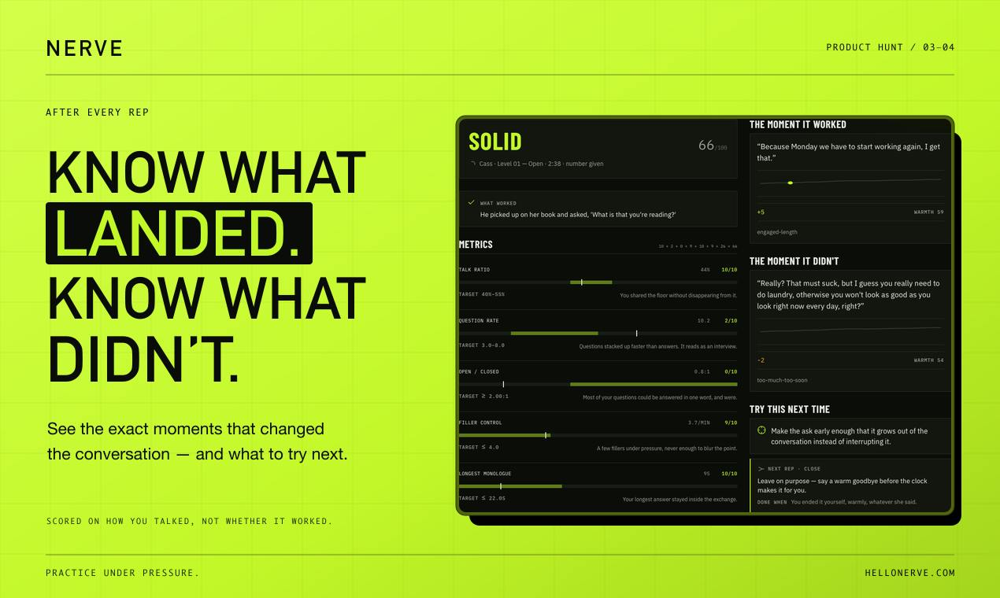

---

## 30. [JSON Link](https://www.producthunt.com/products/json-link-2)
**Votes**: 3 | **도입 난이도**: 하 | **신뢰도**: 상
**Tagline**: Local-first open-source i18n spreadsheet & MCP server
**서비스 링크**: https://www.producthunt.com/r/NJ7G2RY5NV5KQ2

**태그**: DevTool, i18n, Automation, OpenSource, AI Tool

### 📌 이 서비스 한눈에 보기
로컬 우선 방식의 오픈소스 다국어 번역 스프레드시트 및 MCP 서버

### 🔑 주요 기능
- JSON, Excel, CSV, Flutter ARB, iOS/Android 형식 간 자유로운 변환
- 변수 손실 없는 AI 번역 및 Zawgyi 유니코드 변환 지원
- GitHub PR 자동 동기화 및 로컬 우선(Local-first) 워크스페이스

### 🙋 사용자에게 어떤 점이 좋은가
개발자가 번역 파일을 수동으로 변환하는 번거로움을 줄이고, 코드와 번역 데이터 간의 동기화를 자동화하여 i18n 워크플로우를 간소화할 수 있습니다.

### ✅ 지금 바로 써볼 기능
- 기존 JSON/CSV 파일을 불러와 다양한 플랫폼 형식으로 변환해보기
- AI 번역 기능을 활용해 변수 구조를 유지하며 번역 테스트하기
- GitHub 연동을 통한 자동화 워크플로우 설정하기

### ⚠️ 사용 전 확인할 점
- 로컬 우선 방식이므로 팀 협업 시 데이터 동기화 방식 확인 필요
- AI 번역 결과물의 문맥 적합성 검토 필요

### 🧭 확인이 더 필요한 정보
로컬 데이터 저장 방식과 클라우드 협업 기능 간의 구체적인 동기화 메커니즘 확인이 필요합니다.

### 📸 스크린샷 및 갤러리
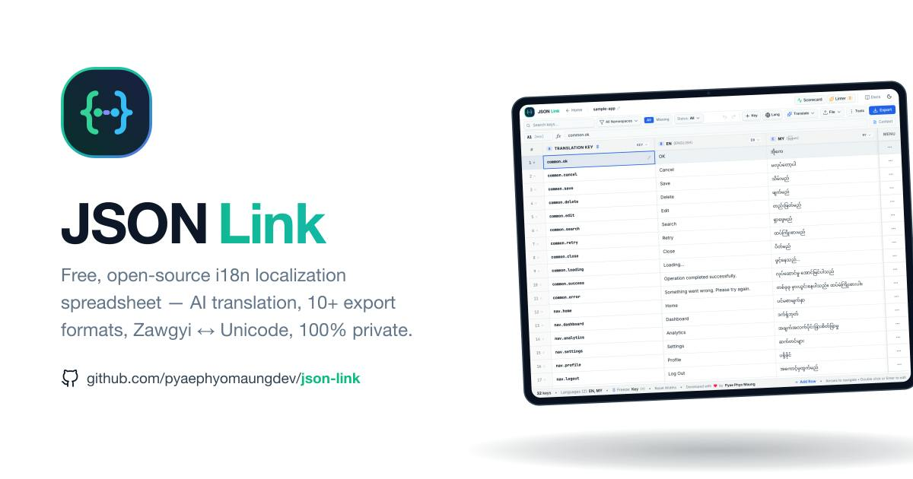
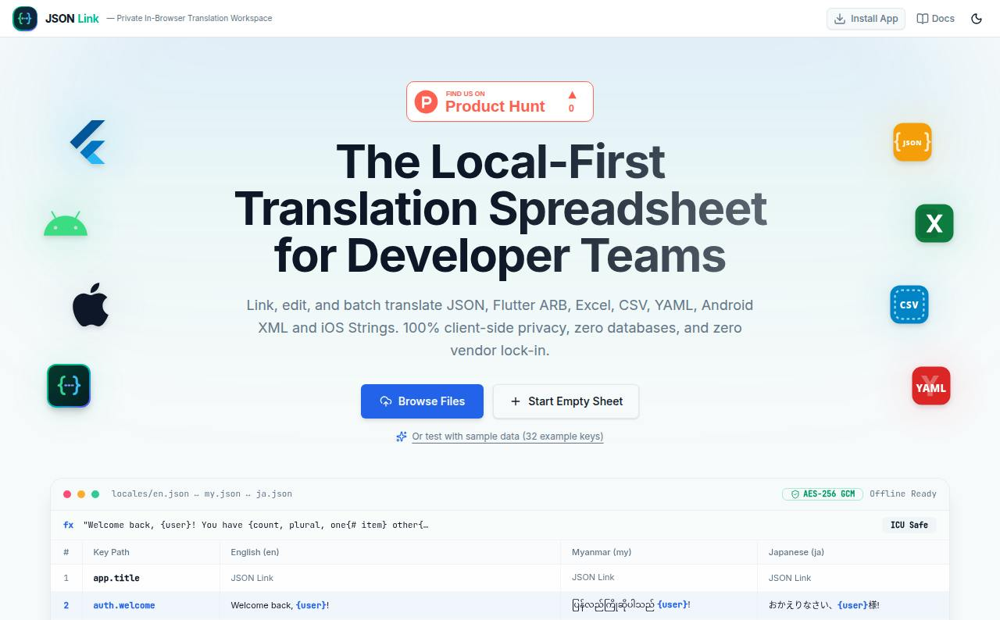
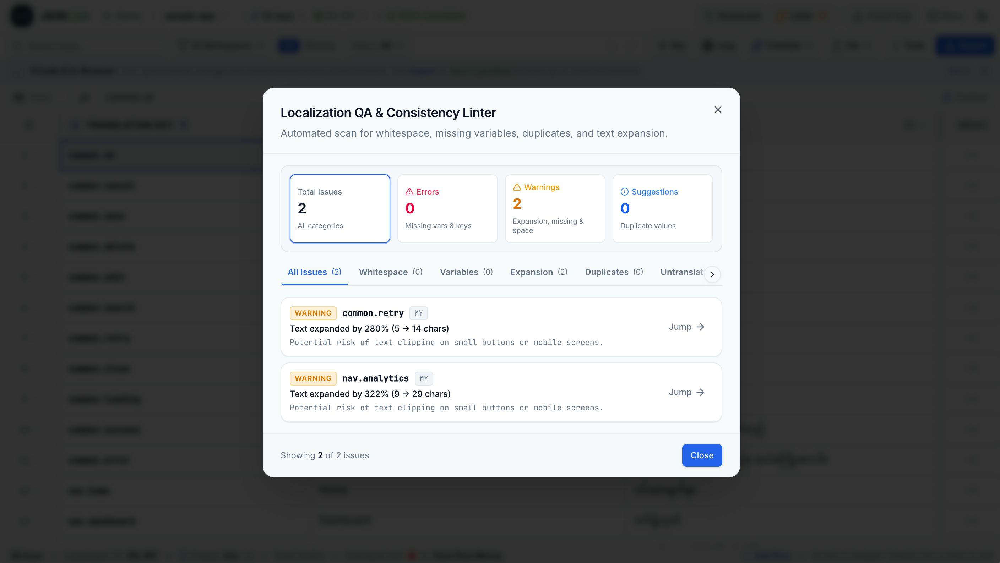

---

