# 🚀 Product Hunt Daily Top 30 (2026-09-15)

## 오늘의 요약
오늘의 트렌드는 단순한 정보 제공을 넘어 사용자를 대신해 웹을 조작하고 업무를 완결짓는 '실행형 AI 에이전트'의 등장이 두드러졌습니다. 또한, AI 모델이 웹 데이터를 더 잘 읽을 수 있도록 사이트를 최적화하거나, AI 에이전트가 API를 안전하게 사용할 수 있도록 관리하는 인프라 성격의 서비스들도 주목받았습니다.

### 오늘의 핵심 포인트
- 단순 챗봇을 넘어 웹 브라우징, 이메일 작성, 미팅 예약 등 실질적인 업무를 수행하는 에이전트 기술이 강화되었습니다.
- AI 검색 엔진과 크롤러에 최적화된 웹사이트 구축 및 AI 에이전트용 API 관리와 같은 새로운 형태의 기술적 요구가 나타나고 있습니다.
- 온디바이스 실행 및 보안 강화 기능을 통해 개인정보 유출 우려를 해결하려는 보안 중심의 솔루션들이 등장했습니다.

**오늘의 태그**: AI 에이전트, 업무 자동화, AI SEO, 생산성 도구

## 1. [Naoma AI Demo Agent V2](https://www.producthunt.com/products/naoma)
**Votes**: 408 | **도입 난이도**: 하 | **신뢰도**: 상
**Tagline**: Turns website traffic into booked, qualified meetings
**서비스 링크**: https://www.producthunt.com/r/NPQUFAO3PMOWSZ

**태그**: SalesTech, AI, Automation, B2B, SaaS, Agent, AI Tool, CRM

### 📌 이 서비스 한눈에 보기
방문자를 즉시 미팅으로 전환하는 AI 영업 담당자

### 🔑 주요 기능
- 단순 문의 폼 대신 실시간 제품 데모와 질의응답을 수행하는 AI 에이전트 제공
- 방문자 자격 검증(Qualification) 및 미팅 예약 자동화
- 방문 기록 기억 및 CRM 자동 연동 기능

### 🙋 사용자에게 어떤 점이 좋은가
웹사이트 방문자가 이탈하기 전, AI가 즉각적인 데모를 진행하여 잠재 고객을 실제 미팅으로 전환할 수 있습니다.

### ✅ 지금 바로 써볼 기능
- 제품 및 지식 베이스 업로드
- AI 에이전트 생성 및 테스트
- CRM 연동 설정

### ⚠️ 사용 전 확인할 점
- AI가 실제 제품의 모든 세부 기능을 완벽하게 재현할 수 있는지 확인 필요
- 기존 CRM 시스템과의 원활한 데이터 동기화 여부 검토

### 🧭 확인이 더 필요한 정보
현재 제공되는 데모 에이전트의 제품 인터페이스 재현 수준과 상세 연동 가능한 CRM 목록을 확인해야 합니다.

### 📸 스크린샷 및 갤러리
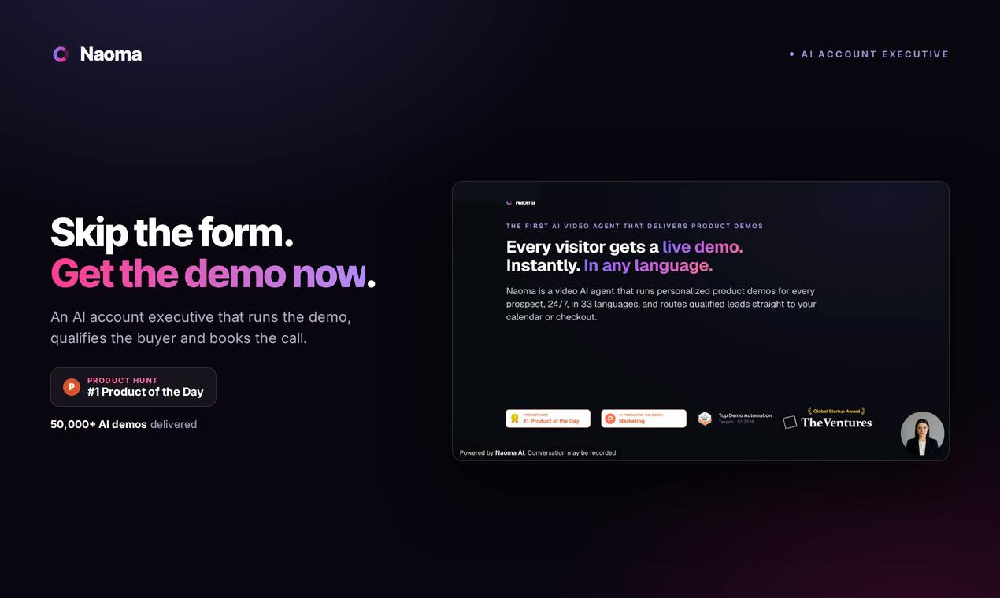
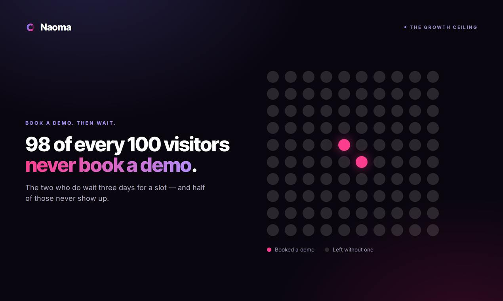
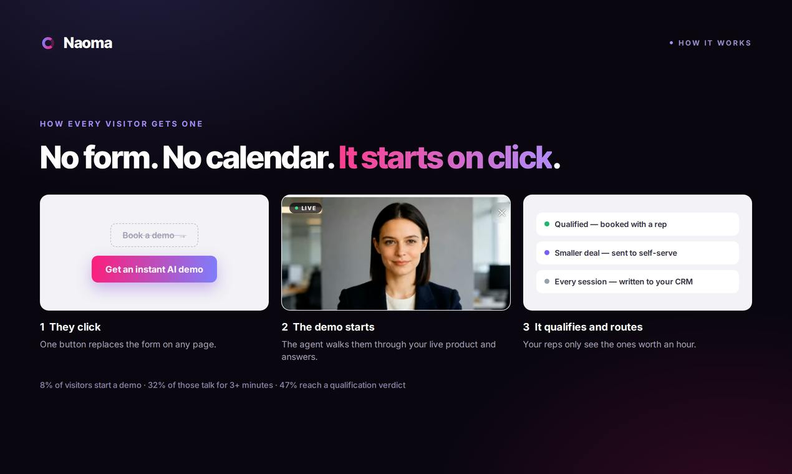

---

## 2. [Web Search Agents by Nimble](https://www.producthunt.com/products/nimbleway)
**Votes**: 272 | **도입 난이도**: 중 | **신뢰도**: 상
**Tagline**: Self-learning agents automate web research + retrieval
**서비스 링크**: https://www.producthunt.com/r/4KNJ3HJMVH26RK

**태그**: Automation, AI, Web Scraper, Research, Agent, AI Tool

### 📌 이 서비스 한눈에 보기
사용자 맞춤형 학습을 통해 심층적인 웹 조사와 데이터 추출을 자동화하는 AI 에이전트

### 🔑 주요 기능
- 특정 도메인(기업 정보, 규제 조사 등)에 특화된 전문 웹 크롤링 및 리서치 기능
- 사용자의 요구사항을 스스로 학습하여 가장 중요한 소스를 깊게 탐색
- AI 모델에 더 깊고 관련성 높은 웹 컨텍스트 제공

### 🙋 사용자에게 어떤 점이 좋은가
수동으로 수행하던 복잡한 웹 리서치 과정을 자동화하여, AI가 더 정확하고 맥락에 맞는 답변을 할 수 있도록 돕습니다.

### ✅ 지금 바로 써볼 기능
- 제공된 온보딩 가이드를 통한 에이전트 설정
- 특정 도메인(기업 조사 등)에 대한 리서치 자동화 테스트
- 기존 AI 워크플로우에 에이전트 결과값 연결

### ⚠️ 사용 전 확인할 점
- 사용자 정의 도메인에 따른 데이터 정확도 차이 발생 가능성
- 에이전트 학습 및 크롤링 과정에서의 소스 신뢰도 검증 필요

### 🧭 확인이 더 필요한 정보
구체적인 API 연동 방식 및 비용 구조에 대한 정보가 명시되지 않았습니다.

### 📸 스크린샷 및 갤러리

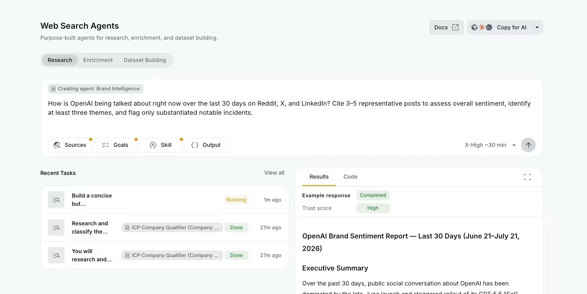
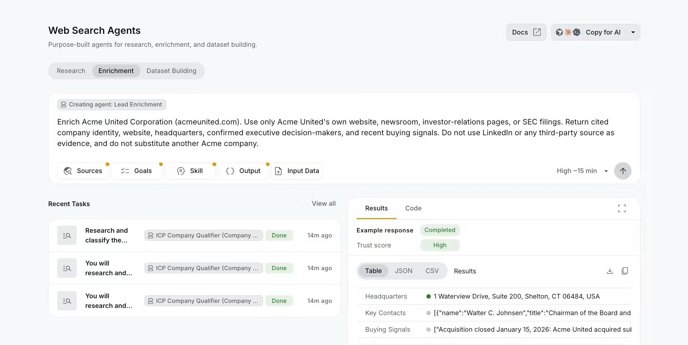

### 🎬 관련 영상
- [🎥 영상 보기](https://ph-files.imgix.net/1671fd10-1bc3-4677-9b41-25807e740895.jpeg?auto=format)

---

## 3. [Hello Inbox](https://www.producthunt.com/products/helloinbox)
**Votes**: 223 | **도입 난이도**: 하 | **신뢰도**: 상
**Tagline**: Get more marketing emails into the inbox
**서비스 링크**: https://www.producthunt.com/r/7RVHWJWDFELG6Q

**태그**: Marketing, Email, SaaS, AI Tool

### 📌 이 서비스 한눈에 보기
전문 지식 없이도 마케팅 이메일의 스팸 분류를 방지하고 도달률을 높여주는 솔루션

### 🔑 주요 기능
- 캠페인 발송 전 사전 테스트 기능 제공
- 도달률 저하 원인 분석 및 가시적인 리포트 제공
- 기술적 데이터 대신 즉각 실행 가능한 해결책 제시

### 🙋 사용자에게 어떤 점이 좋은가
이메일 전문 지식이 없어도 복잡한 기술 데이터 대신 명확한 가이드를 통해 마케팅 이메일이 스팸함이 아닌 받은 편지함에 잘 도착하게 만들 수 있습니다.

### ✅ 지금 바로 써볼 기능
- 현재 사용 중인 마케팅 캠페인 테스트
- 도달률 저하 원인 진단
- 제공되는 액션 플랜에 따른 설정 수정

### ⚠️ 사용 전 확인할 점
- 기술적 데이터보다는 실행 중심의 가이드를 제공하므로 상세 수치 분석에는 한계가 있을 수 있음

### 🧭 확인이 더 필요한 정보
구체적인 연동 가능한 이메일 서비스(ESP) 목록과 가격 정책에 대한 정보가 필요합니다.

### 📸 스크린샷 및 갤러리
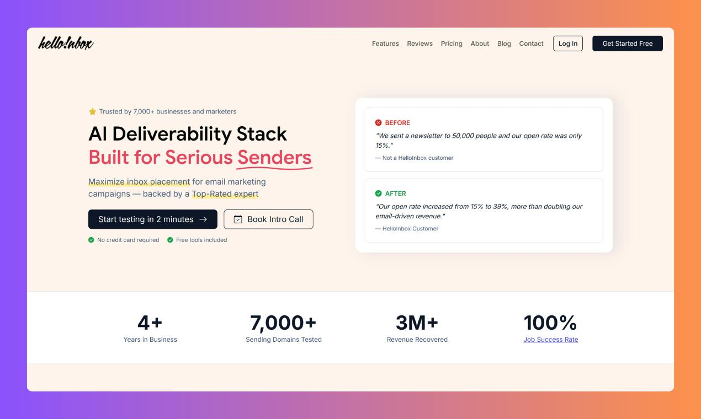
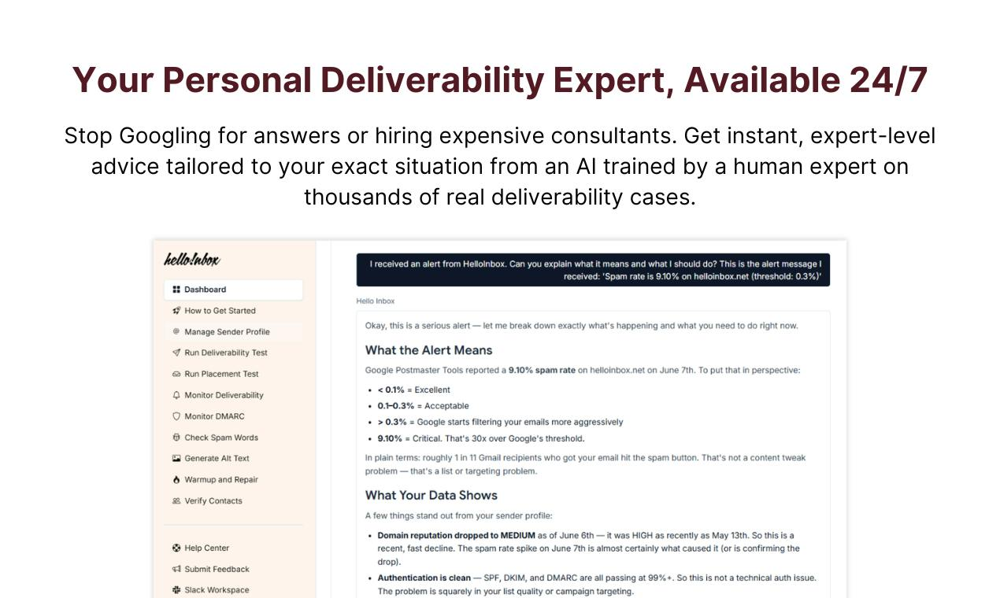
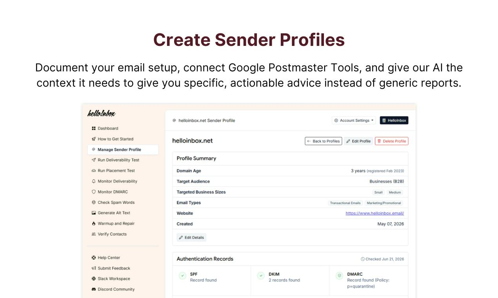

### 🎬 관련 영상
- [🎥 영상 보기](https://ph-files.imgix.net/d704ad46-1061-40a5-b6a8-4dec04be13ba.gif?auto=format)

---

## 4. [Slashy Assistant](https://www.producthunt.com/products/slashy-3)
**Votes**: 197 | **도입 난이도**: 하 | **신뢰도**: 상
**Tagline**: The AI assistant that does email for you
**서비스 링크**: https://www.producthunt.com/r/SGBGN3ITJC3HGN

**태그**: AI, Productivity, Automation, Email, AI Tool, CRM

### 📌 이 서비스 한눈에 보기
사용자의 목소리로 이메일을 작성하고 업무를 자동화하는 AI 기반 이메일 관리 비서

### 🔑 주요 기능
- 사용자 고유의 말투를 반영한 이메일 답장 초안 작성
- 캘린더, CRM, 미팅 노트 등 외부 도구와 연동된 워크플로우 자동화
- iMessage, Slack, 전화 등 다양한 채널을 통한 간편한 접근성

### 🙋 사용자에게 어떤 점이 좋은가
이메일 작성, 일정 관리, 후속 조치 등 반복적인 업무를 AI가 대신 처리하여 업무 시간을 획기적으로 단축해 줍니다.

### ✅ 지금 바로 써볼 기능
- 기존 캘린더 및 CRM 연동하기
- 자연어로 자동화 규칙 설정하기
- Slack이나 iMessage를 통해 비서 기능 테스트하기

### ⚠️ 사용 전 확인할 점
- AI가 작성한 이메일 내용의 정확성 및 톤앤매너 최종 확인 필요
- 외부 도구(CRM, 캘린더 등) 연동 시 데이터 접근 권한 설정 필요

### 🧭 확인이 더 필요한 정보
외부 도구와의 구체적인 연동 범위와 보안 정책에 대한 상세 정보가 필요합니다.

### 📸 스크린샷 및 갤러리
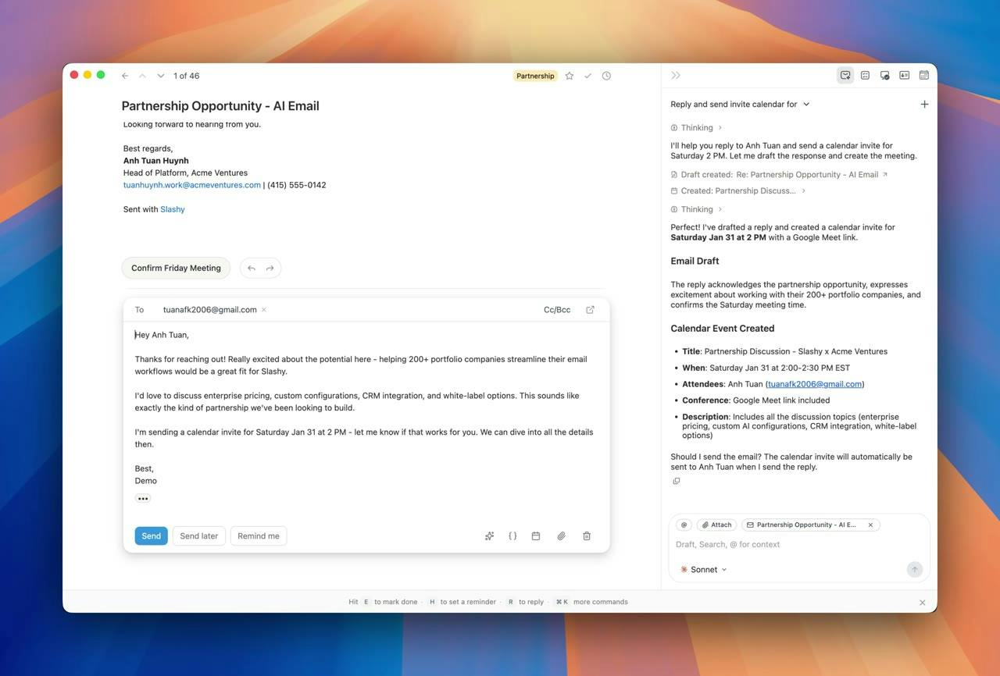
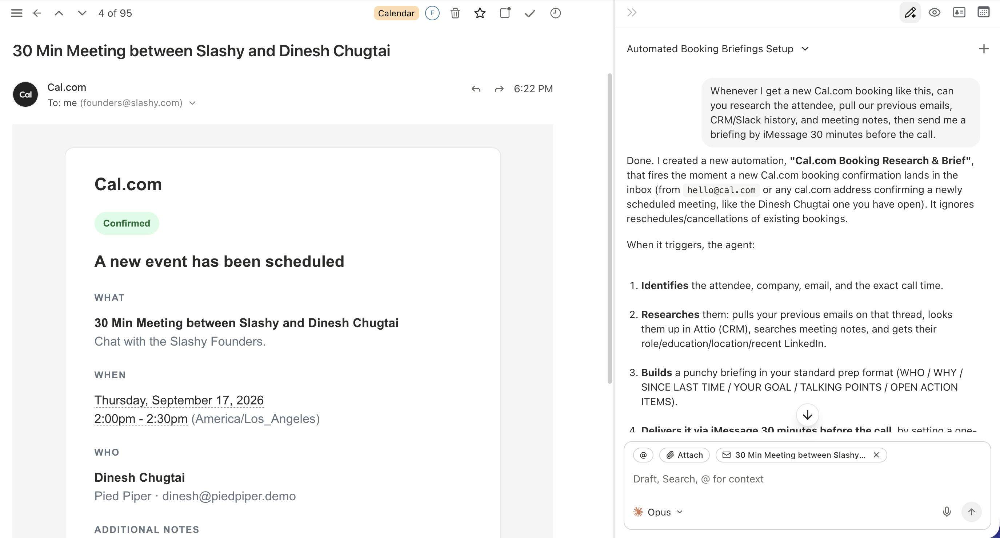
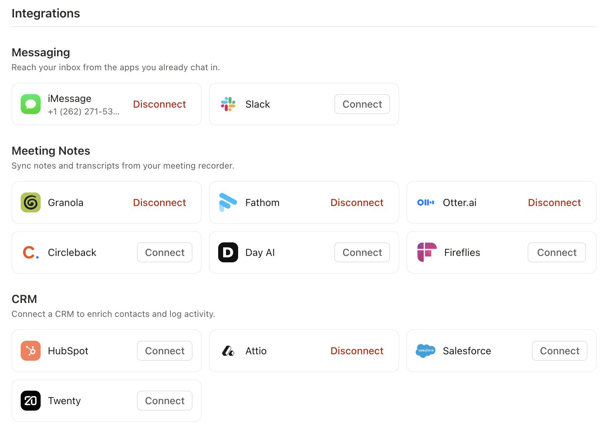

### 🎬 관련 영상
- [🎥 영상 보기](https://ph-files.imgix.net/fe5fffbc-476f-49aa-9323-ef48884ee303.jpeg?auto=format)

---

## 5. [Oats](https://www.producthunt.com/products/oats-2)
**Votes**: 188 | **도입 난이도**: 중 | **신뢰도**: 상
**Tagline**: Free, open-source, and on device meeting notetaker
**서비스 링크**: https://www.producthunt.com/r/P7NBVYHWM3F6PN

**태그**: Productivity, AI, OpenSource, Privacy, Meeting, AI Tool, LLM, Design

### 📌 이 서비스 한눈에 보기
개인정보 유출 걱정 없는 무료 오픈소스 온디바이스 회의 기록 도구

### 🔑 주요 기능
- 로컬 LLM 기반의 온디바이스 실행으로 보안 및 프라이버시 강화
- 봇 참여 없이 회의에 자연스럽게 녹아드는 방식
- macOS 및 Windows 지원 및 다국어 지원

### 🙋 사용자에게 어떤 점이 좋은가
회의 내용이 외부 서버로 전송되지 않아 보안이 중요한 업무 환경에서 안심하고 사용할 수 있으며, 구독료 부담 없이 강력한 기록 기능을 제공합니다.

### ✅ 지금 바로 써볼 기능
- 로컬 환경에서 기본 전사 기능 테스트
- 다국어 지원 및 화자 인식 기능 확인
- ariso.ai 클라우드 백엔드 연동 기능 탐색

### ⚠️ 사용 전 확인할 점
- 로컬 실행 시 사용자의 하드웨어 사양(GPU/CPU)에 따른 성능 차이 발생 가능
- 클라우드 백엔드 기능 사용 시 데이터 외부 유출 여부 확인 필요

### 🧭 확인이 더 필요한 정보
로컬 실행과 클라우드 백엔드 기능 간의 데이터 동기화 및 보안 경계가 명확한지 확인이 필요합니다.

### 📸 스크린샷 및 갤러리
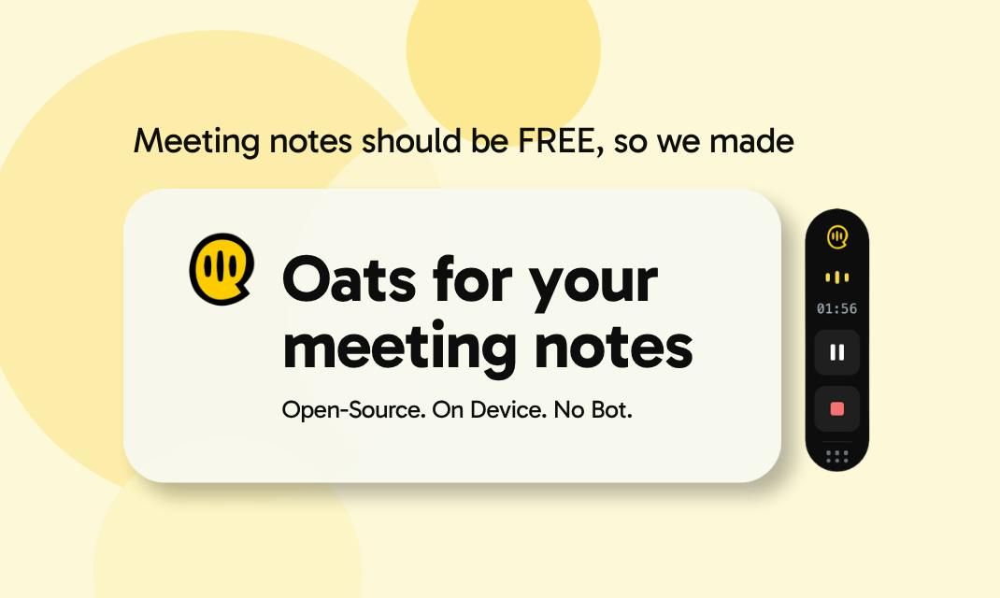
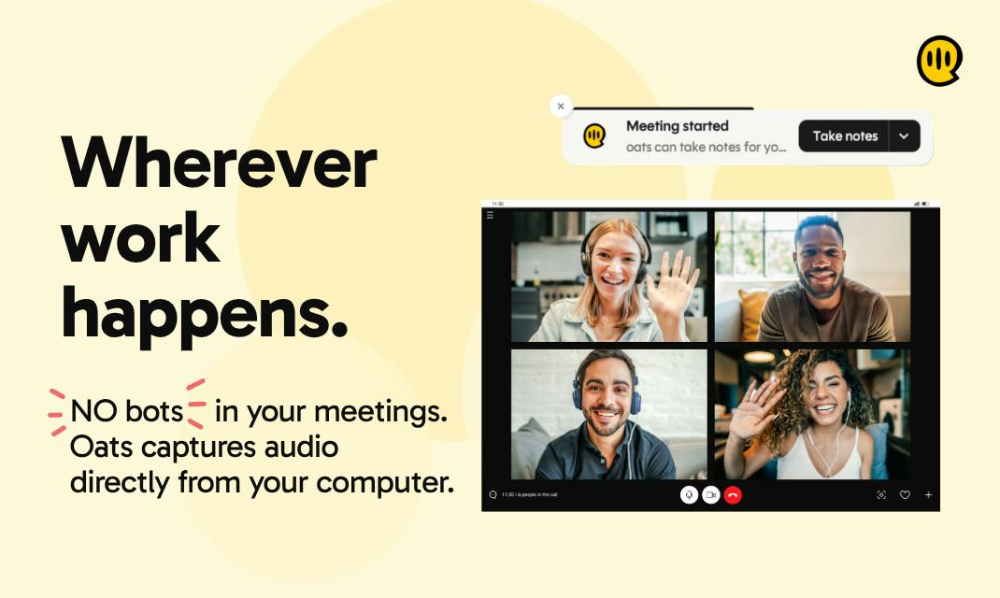
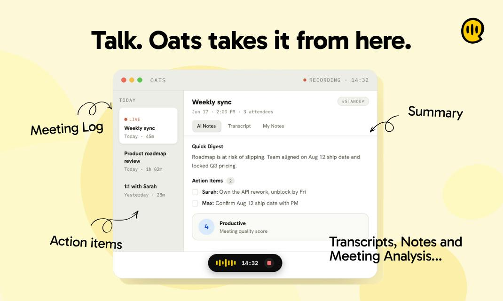

### 🎬 관련 영상
- [🎥 영상 보기](https://ph-files.imgix.net/17af63e4-caa2-41b8-9fa3-b5d39320f34a.jpeg?auto=format)

---

## 6. [Elva](https://www.producthunt.com/products/elva)
**Votes**: 175 | **도입 난이도**: 중 | **신뢰도**: 상
**Tagline**: Goodbye, Postman. Your APIs have new consumers
**서비스 링크**: https://www.producthunt.com/r/KKBBJSNCVH2VR2

**태그**: DevTool, AI-Agent, API-Management, Automation, Agent, API, Analytics

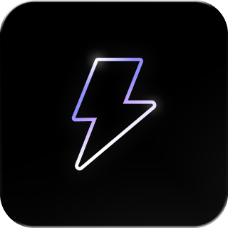

### 📌 이 서비스 한눈에 보기
AI 에이전트를 위한 차세대 API 관리 및 보안 플랫폼

### 🔑 주요 기능
- 코드 분석을 통한 자동 API 탐색 기능
- AI 에이전트용 MCP(Model Context Protocol) 서버 실행 및 관리
- 사용자별 권한 제어 및 에이전트 활동 추적/분석

### 🙋 사용자에게 어떤 점이 좋은가
개발자가 만든 API를 AI 에이전트가 안전하고 효율적으로 사용할 수 있도록 관리 환경을 자동화해 줍니다.

### ✅ 지금 바로 써볼 기능
- 코드 기반 API 자동 탐색 기능 테스트
- 에이전트용 MCP 서버 설정 및 권한 부여
- 에이전트 활동 로그 및 분석 대시보드 확인

### ⚠️ 사용 전 확인할 점
- 코드 내 API 탐색 시 보안 및 권한 설정 범위 확인 필요
- 기존 API 인프라와의 호환성 검토

### 🧭 확인이 더 필요한 정보
코드 분석 방식의 보안 수준과 기존 API 게이트웨이와의 통합 방식에 대한 상세 정보가 필요합니다.

### 📸 스크린샷 및 갤러리
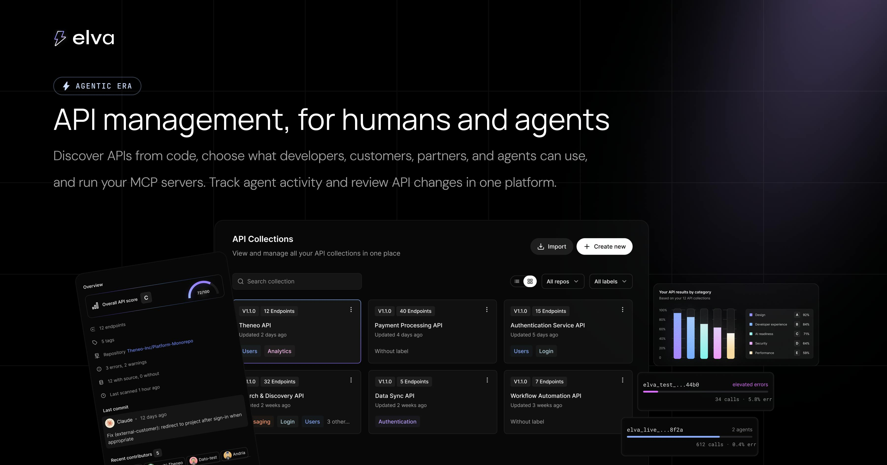
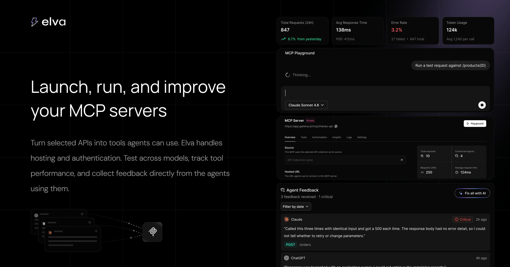
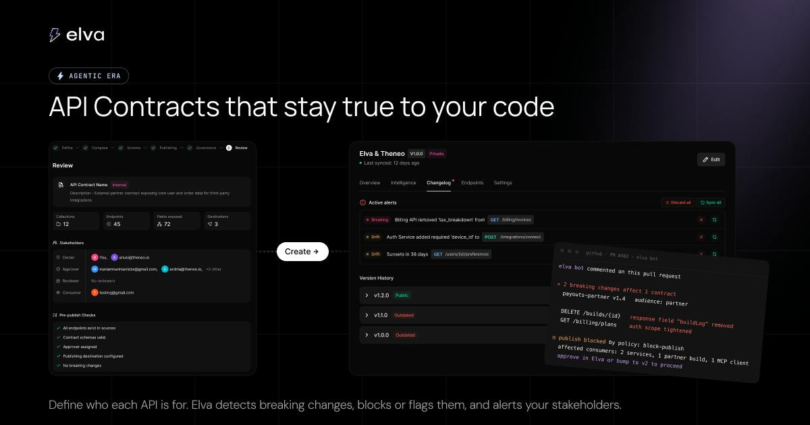

### 🎬 관련 영상
- [🎥 영상 보기](https://ph-files.imgix.net/b552c57c-3f39-4c01-9630-008728187935.jpeg?auto=format)

---

## 7. [Aside](https://www.producthunt.com/products/aside-6)
**Votes**: 140 | **도입 난이도**: 중 | **신뢰도**: 상
**Tagline**: AI browser that actually gets work done for you
**서비스 링크**: https://www.producthunt.com/r/ZG3CQQ442FU6YE

**태그**: AI, Automation, Browser, Productivity, Agent, AI Tool, Chat

### 📌 이 서비스 한눈에 보기
사용자 대신 웹사이트를 직접 조작하고 복잡한 업무를 완수하는 AI 에이전트 브라우저

### 🔑 주요 기능
- 계정 로그인 및 웹사이트 직접 조작을 통한 자동화 작업 수행
- 메시지 전송, 결제, 내부 도구 활용 등 복잡한 워크플로우 처리
- 로컬 실행 및 암호화를 통한 강력한 개인정보 보호

### 🙋 사용자에게 어떤 점이 좋은가
단순한 정보 검색을 넘어, 사용자를 대신해 실제 웹 서비스에서 업무를 완결짓는 에이전트 기능을 제공합니다.

### ✅ 지금 바로 써볼 기능
- 기존 AI 구독 계정 연동하기
- 복잡한 반복 업무를 에이전트에게 맡겨보기
- 수직 탭 및 Liquid Glass UI 탐색하기

### ⚠️ 사용 전 확인할 점
- 계정 권한을 직접 사용하는 만큼 보안 설정 및 관리 필요
- 에이전트의 자동 작업 결과에 대한 최종 검토 필요

### 🧭 확인이 더 필요한 정보
에이전트가 수행하는 작업의 구체적인 범위와 로컬 실행 환경의 하드웨어 요구 사양을 확인해야 합니다.

### 📸 스크린샷 및 갤러리
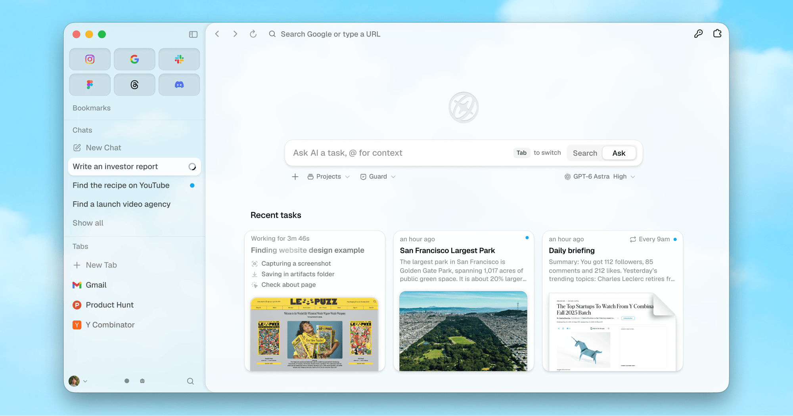
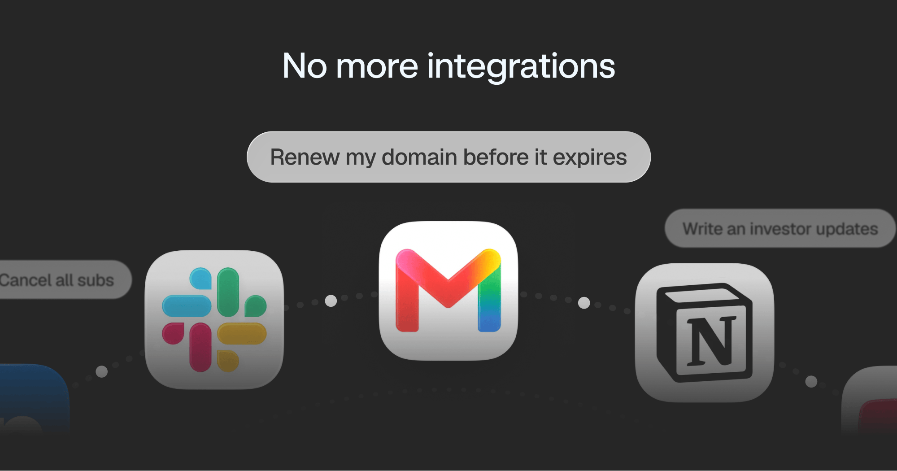
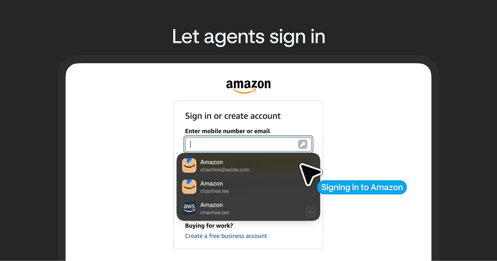

### 🎬 관련 영상
- [🎥 영상 보기](https://ph-files.imgix.net/49ab04d0-f20e-4b91-8ce7-15ff24014c72.jpeg?auto=format)

---

## 8. [LLMagnet](https://www.producthunt.com/products/llmagnet)
**Votes**: 130 | **도입 난이도**: 하 | **신뢰도**: 상
**Tagline**: Make your WordPress site visible to AI
**서비스 링크**: https://www.producthunt.com/r/L4ISAXK5EG6PUV

**태그**: WordPress, AI-SEO, Analytics, Marketing, Agent, AI Tool, LLM, Chat

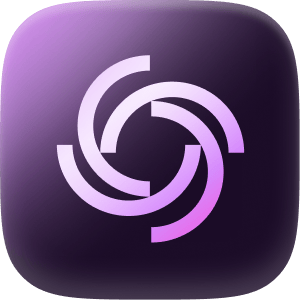

### 📌 이 서비스 한눈에 보기
워드프레스 사이트를 AI 검색 엔진과 에이전트에 최적화하여 가시성을 높여주는 도구

### 🔑 주요 기능
- ChatGPT, Claude, Gemini 등 AI 크롤러의 방문 추적
- AI 가시성 점수(AI Visibility Score) 측정 기능
- llms.txt 생성 및 구조화된 데이터 제공을 통한 AI 친화적 사이트 구축

### 🙋 사용자에게 어떤 점이 좋은가
AI 검색 엔진이 내 사이트의 정보를 더 잘 읽고 활용할 수 있게 만들어, AI 시대의 새로운 유입 경로를 확보할 수 있습니다.

### ✅ 지금 바로 써볼 기능
- AI 크롤러 방문 현황 대시보드 확인
- AI 가시성 점수 측정 및 최적화 가이드 적용
- llms.txt 파일 생성 및 사이트 적용

### ⚠️ 사용 전 확인할 점
- 워드프레스 환경에 특화되어 있어 타 CMS 사용자는 활용이 제한적일 수 있음
- AI 가시성 점수가 실제 검색 엔진 최적화(SEO) 성과와 동일하게 직결되지 않을 수 있음

### 🧭 확인이 더 필요한 정보
워드프레스 플러그인 형태인지 별도 서비스 형태인지에 대한 구체적인 설치 방식 확인이 필요합니다.

### 📸 스크린샷 및 갤러리
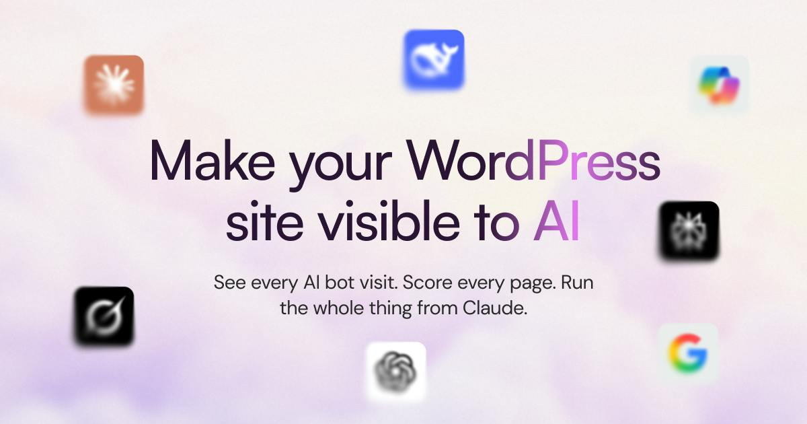
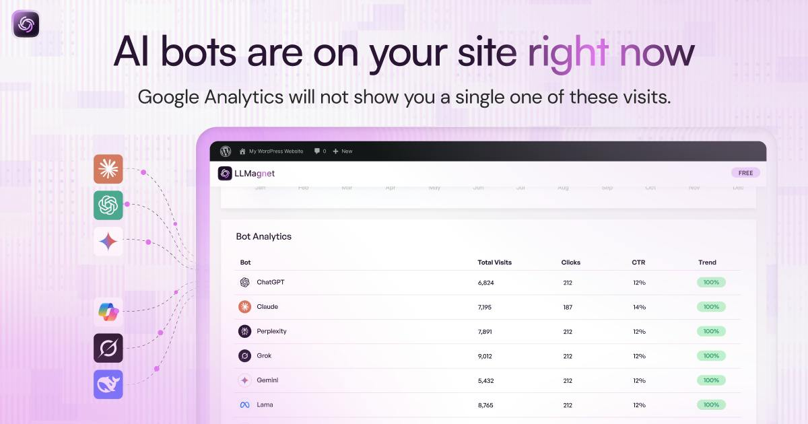
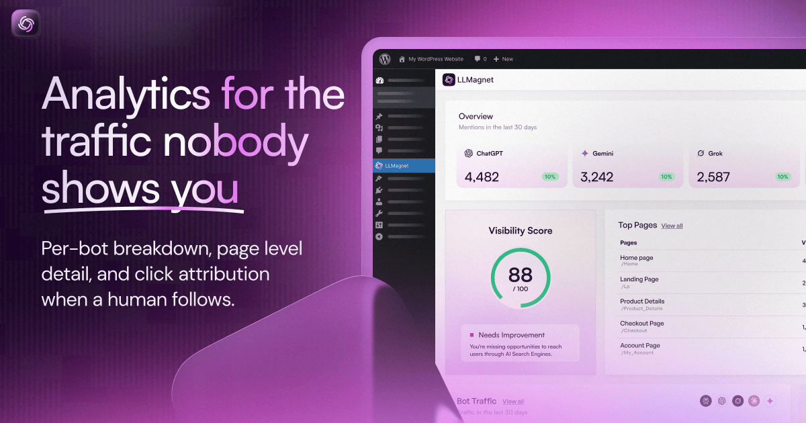

### 🎬 관련 영상
- [🎥 영상 보기](https://ph-files.imgix.net/a777edd8-68db-4604-8bad-0b8f73163849.jpeg?auto=format)

---

## 9. [AppZapper 3000](https://www.producthunt.com/products/appzapper)
**Votes**: 106 | **도입 난이도**: 하 | **신뢰도**: 상
**Tagline**: The uninstaller Apple forgot.
**서비스 링크**: https://www.producthunt.com/r/AWN5F3JGQIJQLW

**태그**: macOS, Utility, Productivity

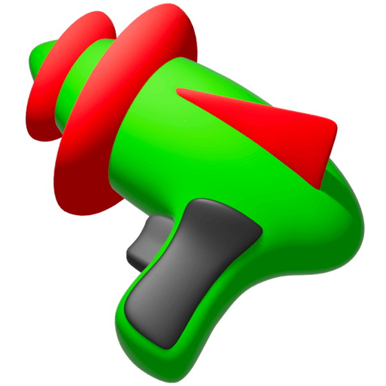

### 📌 이 서비스 한눈에 보기
macOS의 잔여 파일을 완벽하게 제거하는 재미있는 3D 방식의 언인스톨러

### 🔑 주요 기능
- macOS용 앱 삭제 및 잔여 파일 탐색 기능
- 드래그 앤 드롭 방식의 간편한 인터페이스
- 3D 효과를 활용한 직관적이고 재미있는 삭제 경험

### 🙋 사용자에게 어떤 점이 좋은가
앱 삭제 시 남는 불필요한 파일들을 한 번에 찾아 제거하여 저장 공간을 효율적으로 관리할 수 있습니다.

### ✅ 지금 바로 써볼 기능
- 삭제하려는 앱을 앱에 드래그 앤 드롭하기
- 연결된 모든 잔여 파일 확인하기
- 3D 자퍼 기능을 사용하여 파일 삭제하기

### ⚠️ 사용 전 확인할 점
- 시스템 필수 파일이 함께 삭제되지 않도록 주의 필요
- macOS 버전과의 호환성 확인 필요

### 🧭 확인이 더 필요한 정보
앱 삭제 시 시스템 파일에 미치는 영향 범위에 대한 상세 정보가 부족합니다.

### 📸 스크린샷 및 갤러리

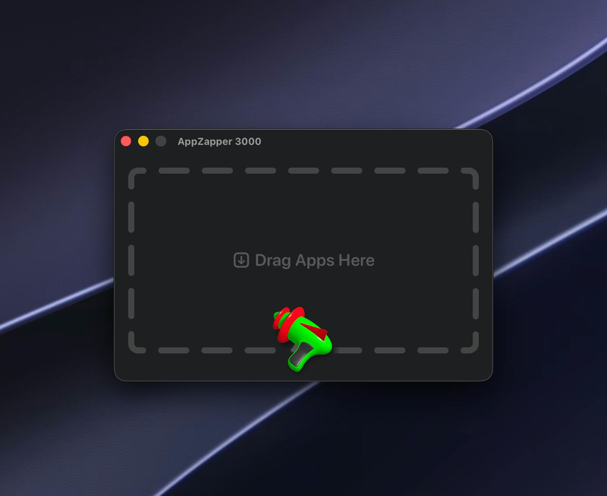
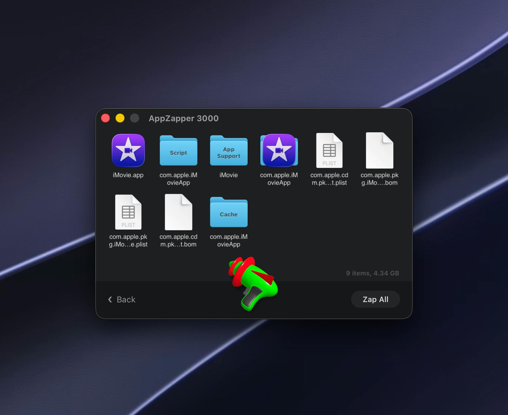

### 🎬 관련 영상
- [🎥 영상 보기](https://ph-files.imgix.net/4f115498-3df1-41e4-8d17-bf650c9a008d.jpeg?auto=format)

---

## 10. [OzBrain](https://www.producthunt.com/products/ozbrain)
**Votes**: 102 | **도입 난이도**: 하 | **신뢰도**: 상
**Tagline**: Your knowledge shared with every AI agent & any teammate
**서비스 링크**: https://www.producthunt.com/r/BUTDBT5AYLKBGS

**태그**: AI, Knowledge Management, Productivity, Collaboration, Data Privacy, Agent, AI Tool, Chat

### 📌 이 서비스 한눈에 보기
모든 AI 에이전트와 팀원이 실시간으로 공유하는 지식 저장소

### 🔑 주요 기능
- 사용자의 개입 없이도 유지되는 자동화된 지식 관리 시스템
- AI 에이전트와 팀원 간의 통합된 지식 공유 및 맥락 유지
- 데이터 보안 및 마크다운 내보내기를 통한 강력한 데이터 주권 보장

### 🙋 사용자에게 어떤 점이 좋은가
개인과 팀의 지식을 한곳에 모아 AI 에이전트가 즉시 활용할 수 있게 함으로써, 반복적인 정보 전달 없이도 업무 맥락을 유지할 수 있습니다.

### ✅ 지금 바로 써볼 기능
- 기존 연구 자료나 노트를 업로드하여 지식 베이스 구축하기
- AI 에이전트를 연결하여 공유된 지식 활용해보기
- 마크다운 내보내기 기능을 통해 데이터 관리 편의성 확인하기

### ⚠️ 사용 전 확인할 점
- 데이터 보안 정책 및 암호화 방식에 대한 기술적 검토 필요
- 에이전트 간의 지식 충돌이나 동기화 방식 확인 필요

### 🧭 확인이 더 필요한 정보
현재 제공되는 구체적인 에이전트 연동 방식과 데이터 암호화 기술 수준에 대한 상세 정보가 필요합니다.

### 📸 스크린샷 및 갤러리
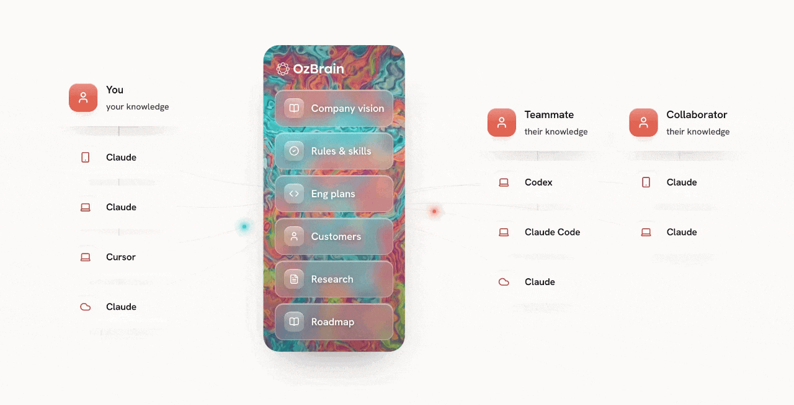
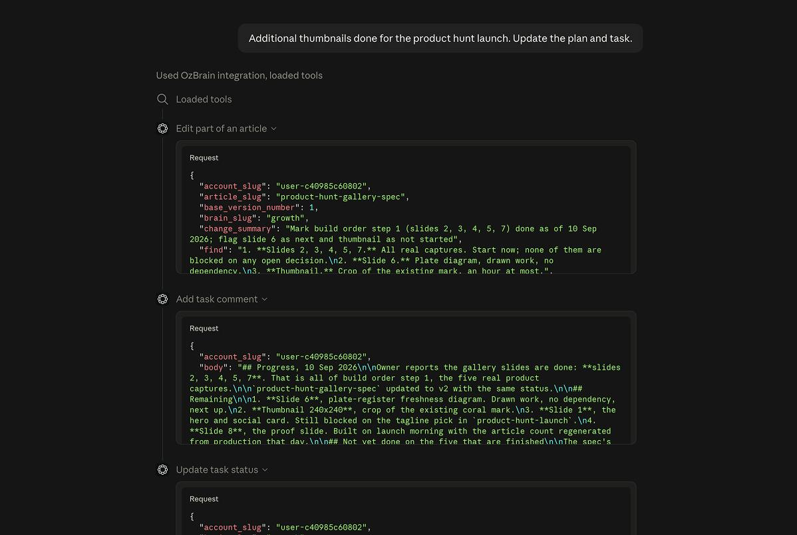
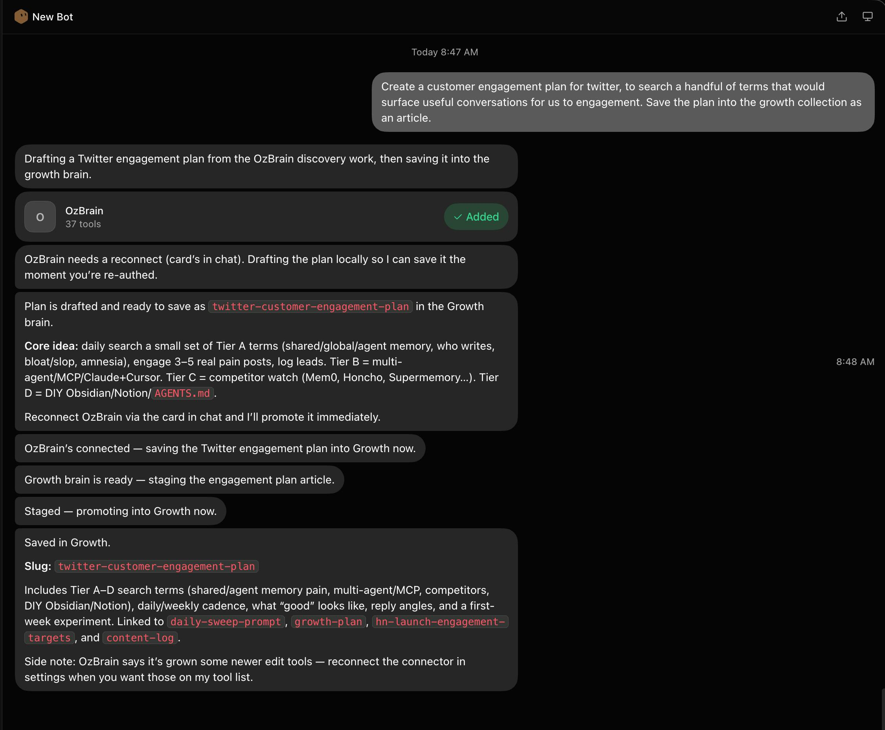

### 🎬 관련 영상
- [🎥 영상 보기](https://ph-files.imgix.net/7b802834-00a3-4c30-ba39-0a7d4098d34b.jpeg?auto=format)

---

## 11. [appdesigns](https://www.producthunt.com/products/appdesigns)
**Votes**: 97 | **도입 난이도**: 하 | **신뢰도**: 상
**Tagline**: Design amazing appstore screenshots for free
**서비스 링크**: https://www.producthunt.com/r/W75L7NOSUW36S7

**태그**: Design, AppStore, Productivity, NoCode

### 📌 이 서비스 한눈에 보기
계정 생성 없이 브라우저에서 즉시 완성하는 앱 스토어 스크린샷 디자인 도구

### 🔑 주요 기능
- iPhone, iPad, Mac 등 최신 기기 프레임 제공
- App Store Connect 규격에 맞는 정확한 크기 내보내기 지원
- 워터마크 없는 무제한 내보내기 및 계정 불필요

### 🙋 사용자에게 어떤 점이 좋은가
디자인 전문 지식 없이도 브라우저 상에서 고품질의 앱 스토어용 스크린샷 세트를 빠르게 제작할 수 있습니다.

### ✅ 지금 바로 써볼 기능
- 커뮤니티 템플릿을 활용해 디자인 시작하기
- 기기 프레임에 스크린샷 드롭하여 배치하기
- 헤드라인과 스티커를 추가하여 시각적 요소 강화하기

### ⚠️ 사용 전 확인할 점
- 브라우저 기반 편집기이므로 복잡한 그래픽 작업에는 한계가 있을 수 있음
- 계정 없이 사용 시 작업 내용 저장/관리 방식 확인 필요

### 🧭 확인이 더 필요한 정보
계정 없이 사용 시 브라우저를 닫았을 때 작업 데이터가 유지되는지 여부가 명확하지 않습니다.

### 📸 스크린샷 및 갤러리
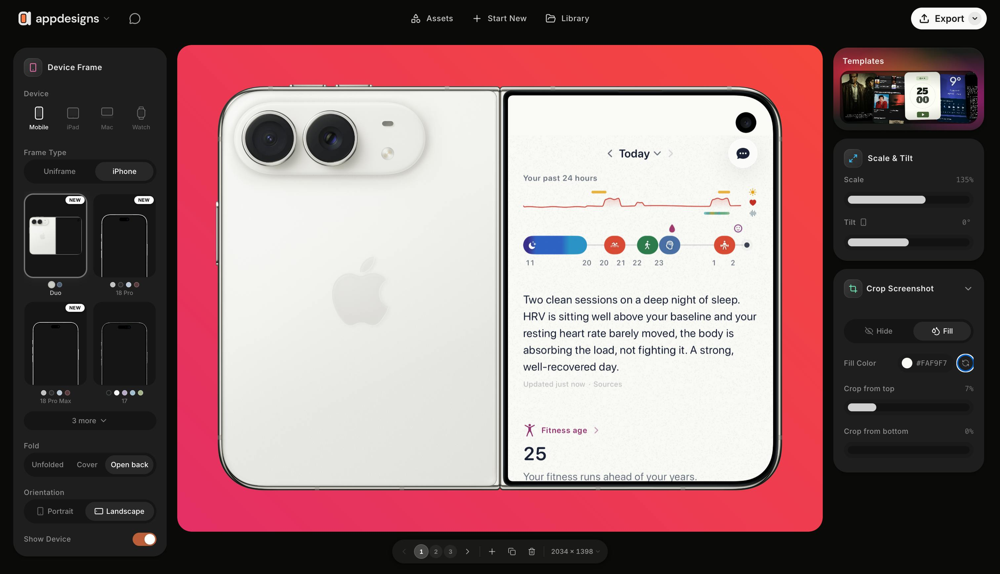
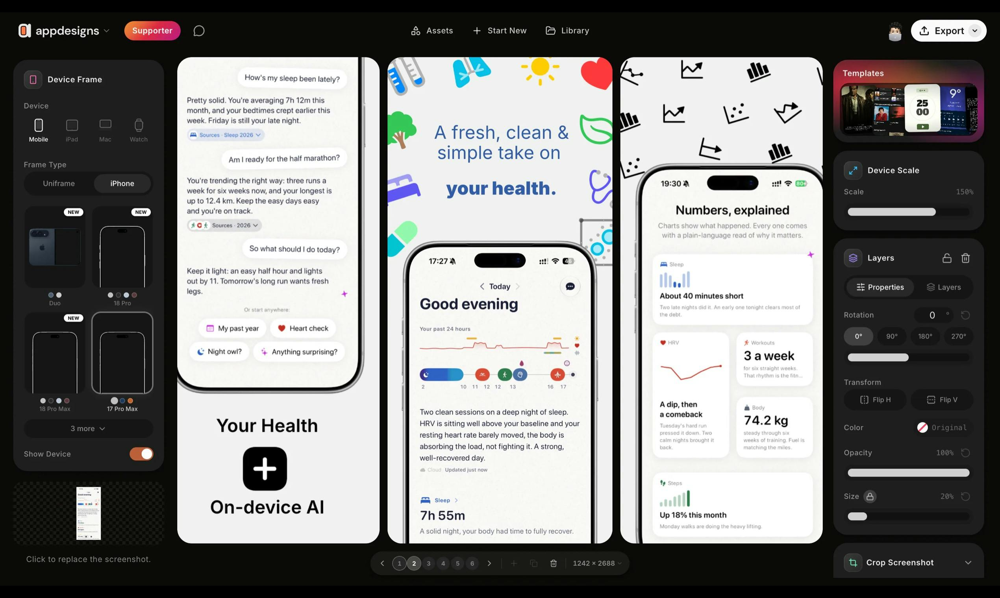
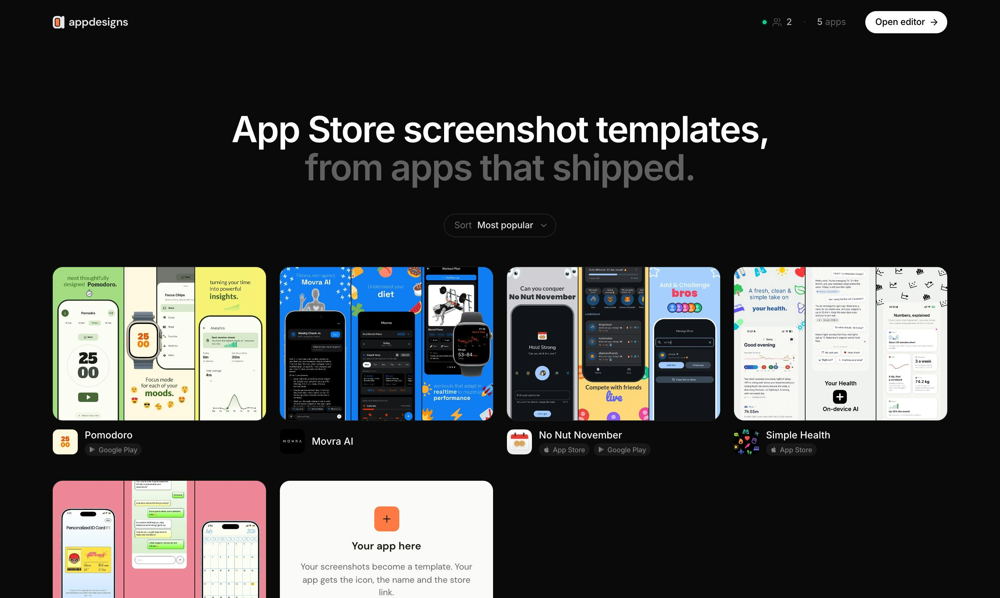

---

## 12. [TryCase](https://www.producthunt.com/products/trycase)
**Votes**: 96 | **도입 난이도**: 하 | **신뢰도**: 상
**Tagline**: AI tests your PRs. Get a video walkthrough before you merge.
**서비스 링크**: https://www.producthunt.com/r/YEQOGPUKEO7XYC

**태그**: DevTool, Automation, AI, QA, GitHub, AI Tool, Video

### 📌 이 서비스 한눈에 보기
PR 생성 시 AI가 실제 사용자처럼 앱을 테스트하고 영상 워크스루를 제공하는 자동화 도구

### 🔑 주요 기능
- 실제 사용자처럼 동작하는 AI 기반 자동 테스트
- 변경 사항을 시각적으로 확인할 수 있는 영상 워크스루 제공
- GitHub 내에서 테스트 결과 및 판결 확인 가능

### 🙋 사용자에게 어떤 점이 좋은가
코드 변경 사항을 눈으로 직접 확인하지 않아도 영상과 테스트 결과를 통해 머지 전 최종 검증이 가능해집니다.

### ✅ 지금 바로 써볼 기능
- GitHub 연동 및 PR 생성
- AI가 생성한 영상 워크스루 확인
- 테스트 결과에 따른 머지 여부 결정

### ⚠️ 사용 전 확인할 점
- AI 테스트가 모든 엣 케이스를 완벽히 커버하는지 검증 필요
- 사용자 환경(UI/UX) 변화에 따른 테스트 결과의 정확도 확인 필요

### 🧭 확인이 더 필요한 정보
지원하는 프레임워크 및 테스트 가능한 애플리케이션 환경에 대한 상세 정보가 필요합니다.

### 📸 스크린샷 및 갤러리
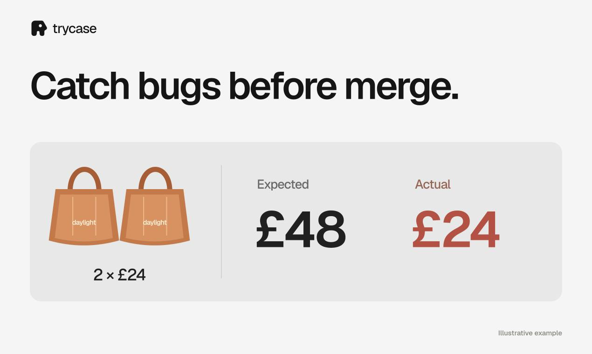
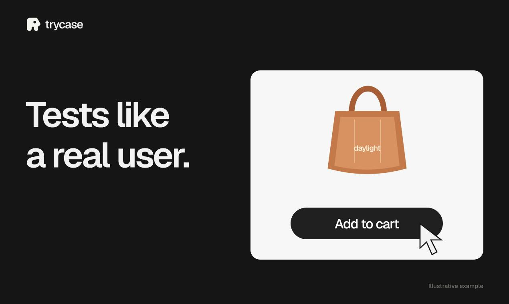
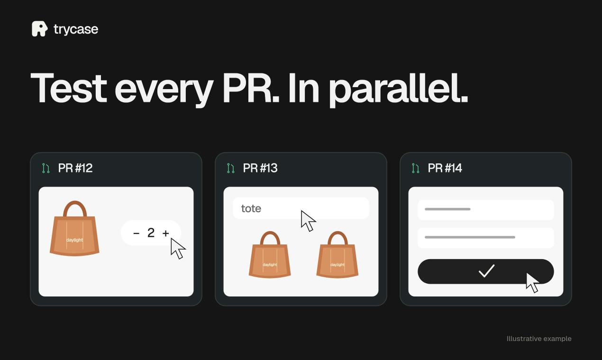

### 🎬 관련 영상
- [🎥 영상 보기](https://ph-files.imgix.net/57c5edd3-ebb2-4228-8a35-9e726bed49e2.jpeg?auto=format)

---

## 13. [Image to ASCII](https://www.producthunt.com/products/image-to-ascii-2)
**Votes**: 96 | **도입 난이도**: 하 | **신뢰도**: 상
**Tagline**: Make ASCII art for READMEs, Discord & creative visuals
**서비스 링크**: https://www.producthunt.com/r/6FCFFCTUJR7SGE

**태그**: DevTool, Design, Creative, AI Tool, Vision

### 📌 이 서비스 한눈에 보기
사진과 로고를 텍스트 기반 ASCII 아트로 변환하여 README나 Discord에 활용하는 브라우저 도구

### 🔑 주요 기능
- 브라우저 로컬 실행 방식으로 개인정보 유출 걱정 없는 안전한 변환
- 텍스트(Markdown/ANSI) 및 다양한 이미지 형식(PNG, SVG, HTML) 내보내기 지원
- 사전 설정, 디테일, 색상 조절 기능을 통한 맞춤형 아트워크 제작

### 🙋 사용자에게 어떤 점이 좋은가
개발자나 크리에이터가 별도의 가입이나 이미지 업로드 없이 즉시 독특한 텍스트 아트나 시각적 요소를 제작할 수 있습니다.

### ✅ 지금 바로 써볼 기능
- 내장된 예시를 활용해 변환 결과 비교해보기
- 원하는 디테일과 색상 프리셋 조정해보기
- 결과물을 Markdown 형식으로 복사해 README에 적용하기

### ⚠️ 사용 전 확인할 점
- 텍스트 형식은 편집 가능한 문자로 유지되지만, 이미지 형식은 시각적 형태를 보존하는 방식임
- 로컬 실행 방식이므로 브라우저 환경에 따라 성능 차이가 있을 수 있음

### 🧭 확인이 더 필요한 정보
사용자의 로컬 환경에서만 작동하므로 브라우저 종류에 따른 호환성 범위는 명시되지 않았습니다.

### 📸 스크린샷 및 갤러리
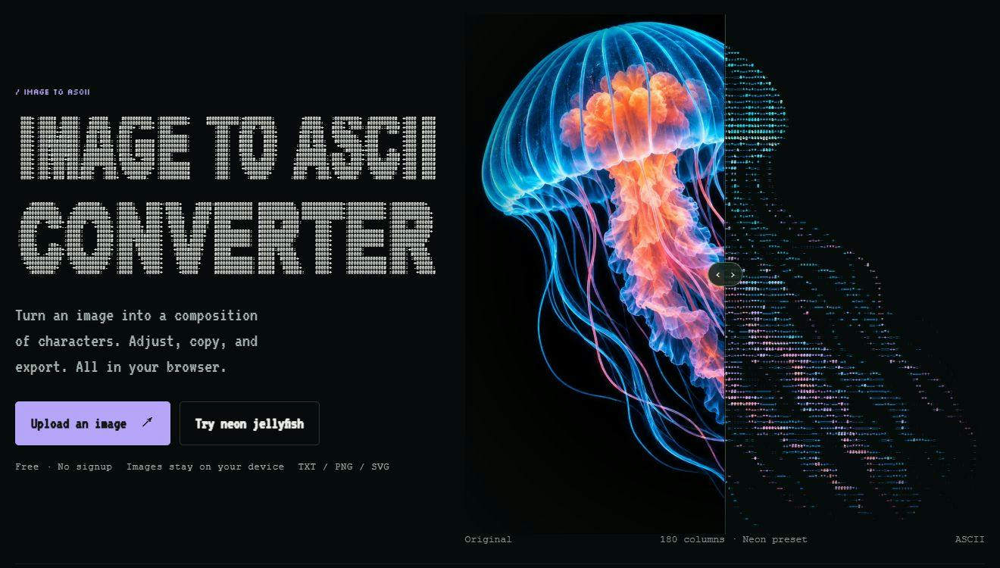
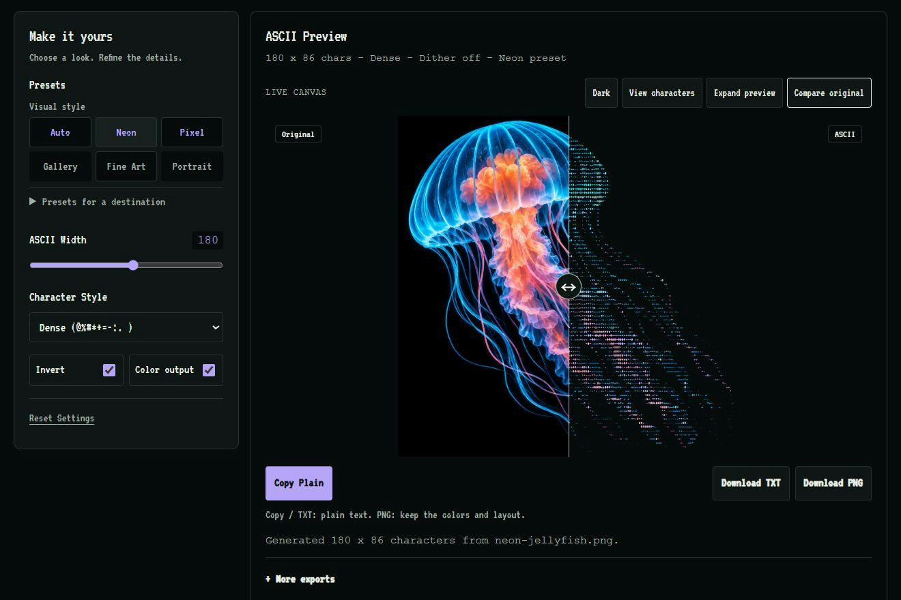
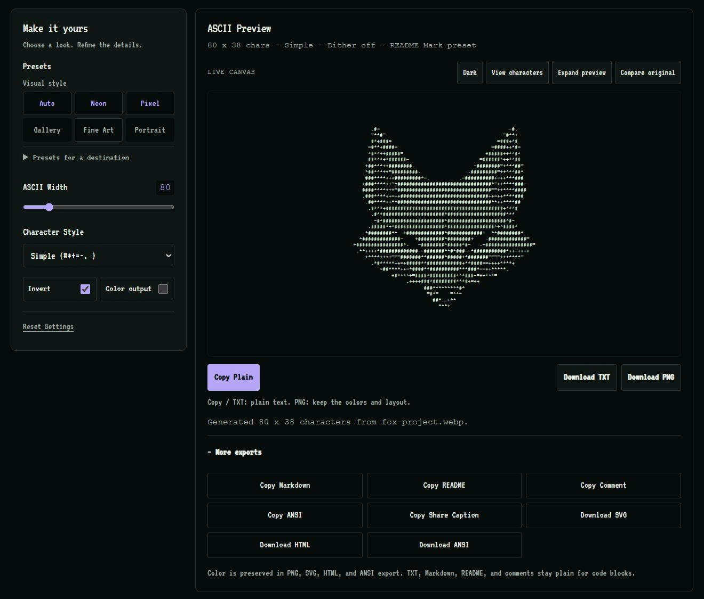

---

## 14. [Juggler](https://www.producthunt.com/products/juggler)
**Votes**: 92 | **도입 난이도**: 하 | **신뢰도**: 상
**Tagline**: A visual AI coding harness
**서비스 링크**: https://www.producthunt.com/r/B2PWXYKBA7ZKGW

**태그**: DevTool, AI, OpenSource, Coding, Agent, AI Tool

### 📌 이 서비스 한눈에 보기
AI 코딩 에이전트의 작업 과정을 시각적으로 관리하는 데스크톱 워크벤치

### 🔑 주요 기능
- Finder 스타일의 컬럼 레이아웃을 통한 도구 호출 및 컨텍스트 시각화
- 대화 흐름을 세분화할 수 있는 서브 스레드 분기 기능
- JavaScript 플러그인 기반의 확장성 및 오픈소스 제공

### 🙋 사용자에게 어떤 점이 좋은가
AI 에이전트의 복잡한 작업 과정을 직관적으로 모니터링하고, 코드 생성 및 실행 과정을 체계적으로 관리할 수 있습니다.

### ✅ 지금 바로 써볼 기능
- Finder 스타일 레이아웃에서 도구 호출 흐름 확인하기
- JavaScript 플러그인을 통한 커스텀 도구 추가하기
- 서브 스레드 기능을 활용한 대화 분기 실험하기

### ⚠️ 사용 전 확인할 점
- 데스크톱 애플리케이션이므로 로컬 환경 설정이 필요할 수 있음
- JavaScript 플러그인 보안 및 실행 환경 검토 필요

### 🧭 확인이 더 필요한 정보
사용자의 로컬 개발 환경(OS 등)에 따른 설치 및 호환성 여부를 확인해야 합니다.

### 📸 스크린샷 및 갤러리
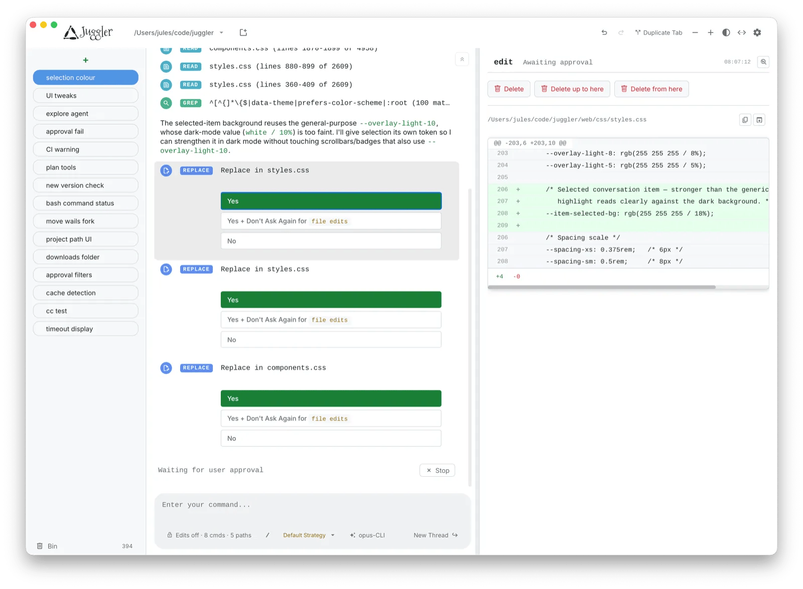
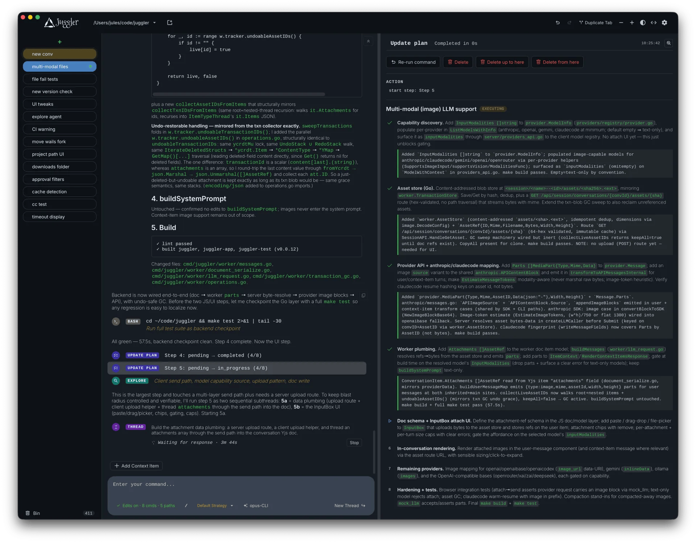
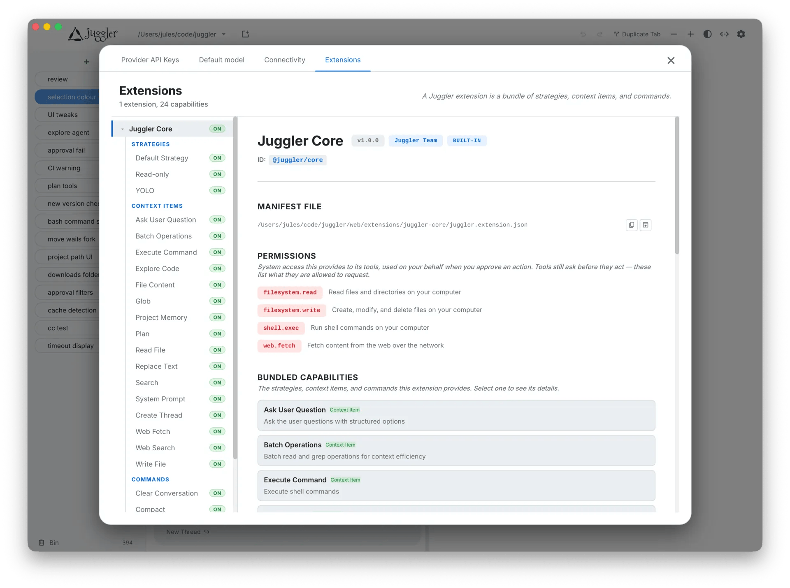

---

## 15. [Deplo](https://www.producthunt.com/products/deplo-2)
**Votes**: 92 | **도입 난이도**: 하 | **신뢰도**: 상
**Tagline**: A simple-to-use alternative to cloud deployments
**서비스 링크**: https://www.producthunt.com/r/W67SK4I4FJUXGN

**태그**: DevOps, Deployment, Automation, Cloud-Alternative

### 📌 이 서비스 한눈에 보기
기존 서버를 활용한 간편한 푸시 기반 배포 솔루션

### 🔑 주요 기능
- 익숙한 push-to-deploy 방식 제공
- Docker나 SSH 설정 없이 간편한 배포
- 이미 보유한 하드웨어 자원 활용

### 🙋 사용자에게 어떤 점이 좋은가
복잡한 클라우드 설정이나 추가 비용 없이, 기존에 사용 중인 머신을 활용해 쉽고 빠르게 서비스를 배포할 수 있습니다.

### ✅ 지금 바로 써볼 기능
- 기존 서버에 Deplo 설치하기
- 코드 푸시를 통한 배포 테스트
- 배포 워크플로우 확인

### ⚠️ 사용 전 확인할 점
- Docker를 사용하지 않는 환경에서의 호환성 확인 필요
- 기존 서버 자원 관리 및 보안 설정 검토

### 🧭 확인이 더 필요한 정보
지원하는 프로그래밍 언어 및 프레임워크의 범위에 대한 정보가 부족합니다.

### 📸 스크린샷 및 갤러리
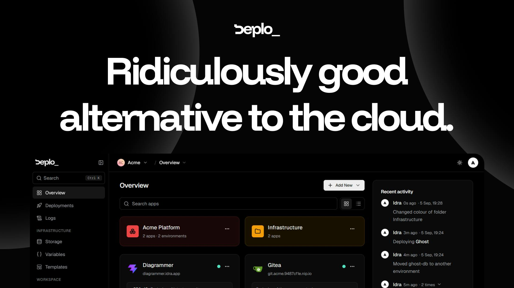
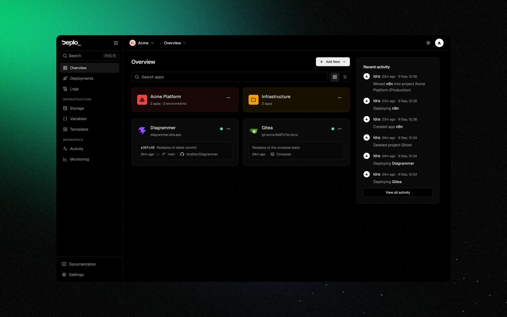
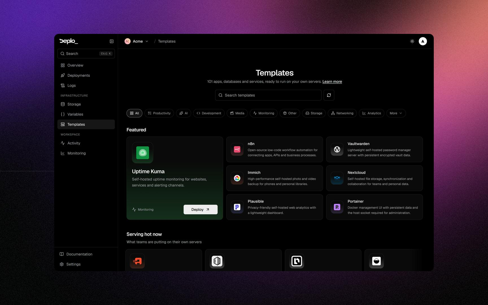

### 🎬 관련 영상
- [🎥 영상 보기](https://ph-files.imgix.net/7408386a-de5f-420b-b714-c6ac897a843b.jpeg?auto=format)

---

## 16. [Afterglow](https://www.producthunt.com/products/afterglow-4)
**Votes**: 91 | **도입 난이도**: 하 | **신뢰도**: 상
**Tagline**: Run classic After Dark screen savers on modern macOS
**서비스 링크**: https://www.producthunt.com/r/TTHKUOF3RFGGT5

**태그**: Retro, macOS, Customization

### 📌 이 서비스 한눈에 보기
추억의 After Dark 스크린세이버를 최신 macOS에서 네이티브로 실행하는 도구

### 🔑 주요 기능
- Flying Toasters, Fish! 등 클래식 After Dark 모듈 지원
- 에뮬레이터나 ROM 없이 macOS에서 네이티브로 구동
- 레트로 감성을 현대적 OS 환경에서 재현

### 🙋 사용자에게 어떤 점이 좋은가
과거의 향수를 간직한 사용자들에게 별도의 복잡한 설정 없이 현대적인 Mac 환경에서 클래식 스크린세이버를 즐길 수 있는 경험을 제공합니다.

### ✅ 지금 바로 써볼 기능
- Flying Toasters 모듈 실행해보기
- macOS 시스템 설정에서 스크린세이버로 등록하기

### ⚠️ 사용 전 확인할 점
- 클래식 모듈 외의 다른 구형 스크린세이버 지원 여부 확인 필요
- 최신 macOS 버전과의 호환성 및 시스템 리소스 점유율 확인

### 🧭 확인이 더 필요한 정보
지원되는 구체적인 클래식 모듈 목록과 최신 Apple Silicon(M1/M2/M3) 칩셋에서의 최적화 여부를 확인해야 합니다.

### 📸 스크린샷 및 갤러리
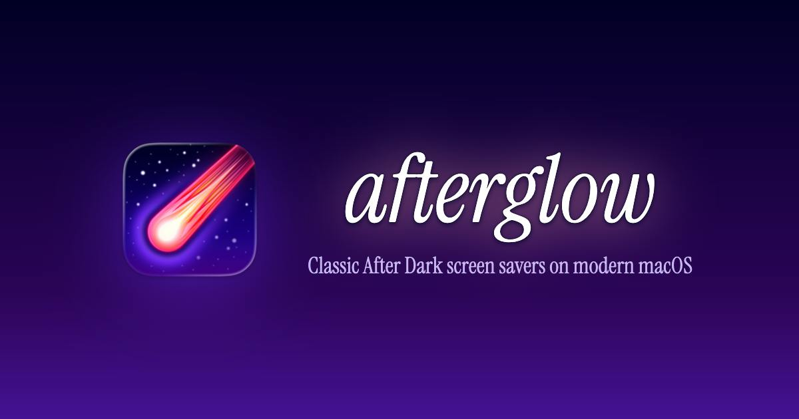
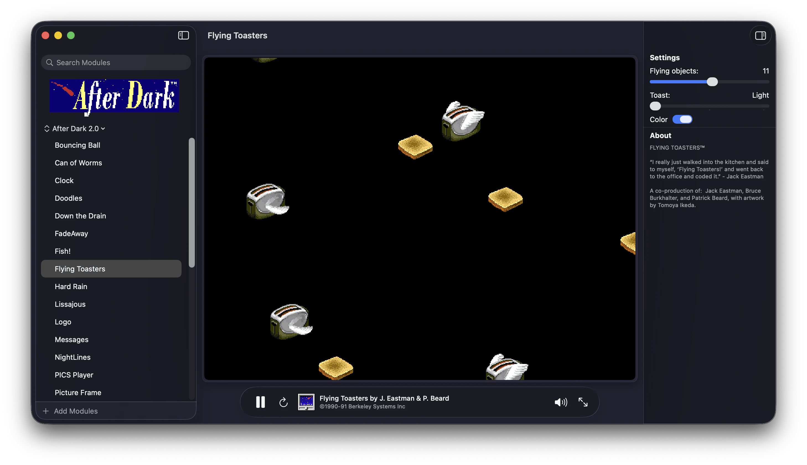
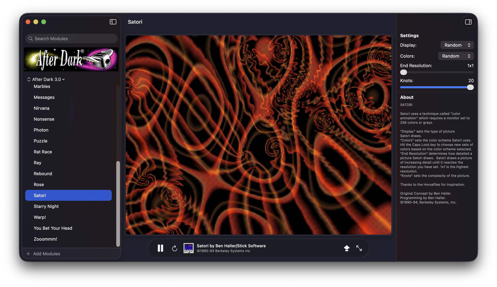

---

## 17. [MemoryPet 2.0](https://www.producthunt.com/products/memorypet)
**Votes**: 86 | **도입 난이도**: 하 | **신뢰도**: 상
**Tagline**: Turn your browsers toolbar into an animated usage monitor
**서비스 링크**: https://www.producthunt.com/r/P2TNEMJRO7DGVT

**태그**: Productivity, Browser Extension, System Monitor, UI/UX

### 📌 이 서비스 한눈에 보기
브라우저 툴바에서 귀여운 애니메이션으로 시스템 리소스 사용량을 확인하는 모니터링 도구

### 🔑 주요 기능
- 메모리 및 CPU 사용량에 따라 움직임이 변하는 애니메이션 펫 제공
- 호버 시 나타나는 실시간 사용량 그래프 기능
- 애니메이션 대신 숫자 배지만 표시하는 모드 지원

### 🙋 사용자에게 어떤 점이 좋은가
시스템 부하 상태를 직관적이고 시각적으로 파악할 수 있어, 하드웨어 작업량을 한눈에 확인하기 좋습니다.

### ✅ 지금 바로 써볼 기능
- 8종의 새로운 펫 중 취향에 맞는 캐릭터 선택하기
- 호버 기능을 통해 상세 사용량 그래프 확인하기
- 필요에 따라 애니메이션을 끄고 퍼센트 배지만 사용해보기

### ⚠️ 사용 전 확인할 점
- 애니메이션 기능이 브라우저 리소스를 추가로 소모할 가능성 있음
- 시스템 전체가 아닌 브라우저 기반의 모니터링임을 인지할 것

### 🧭 확인이 더 필요한 정보
애니메이션 기능이 시스템 성능에 미치는 구체적인 오버헤드 수치는 명시되지 않았습니다.

### 📸 스크린샷 및 갤러리
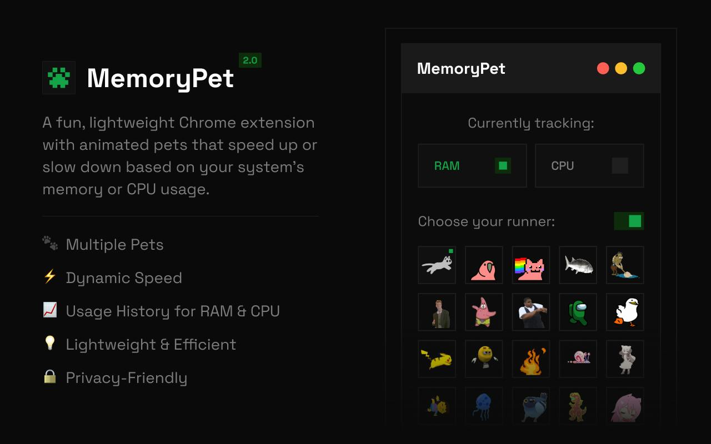
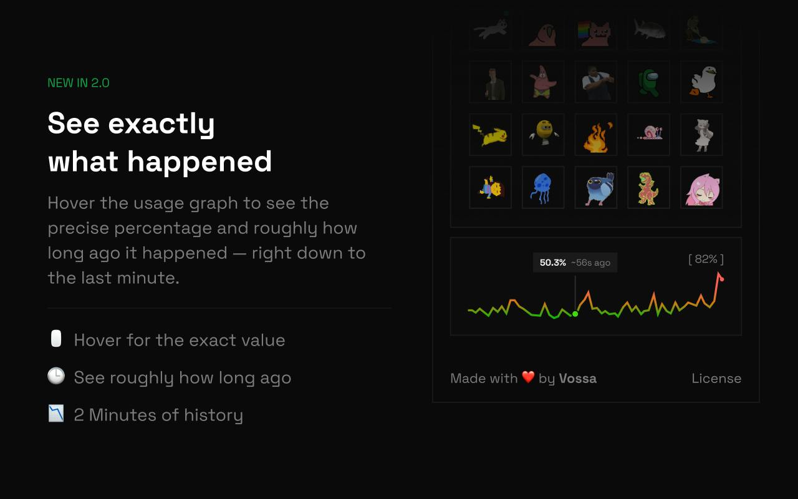
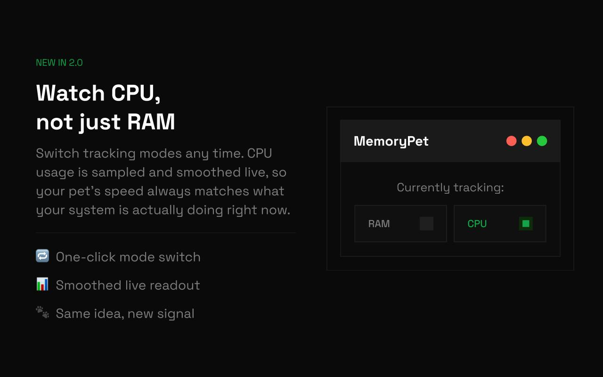

---

## 18. [Marqly 6.0](https://www.producthunt.com/products/marqly)
**Votes**: 77 | **도입 난이도**: 하 | **신뢰도**: 상
**Tagline**: Ask your bookmarks. Bring them to your AI.
**서비스 링크**: https://www.producthunt.com/r/D6WLJPUF7DH23E

**태그**: Productivity, AI, KnowledgeManagement, BrowserExtension, AI Tool, Chat, Video

### 📌 이 서비스 한눈에 보기
저장된 북마크를 AI로 분석하고 외부 AI 도구와 연결하는 스마트 북마크 관리 도구

### 🔑 주요 기능
- 저장된 콘텐츠를 기반으로 답변하는 AI 어시스턴트
- 라이브러리를 자동으로 정리해주는 AI 오거나이저
- MCP를 통한 Claude, ChatGPT, Cursor와의 연동

### 🙋 사용자에게 어떤 점이 좋은가
단순히 링크를 저장하는 것을 넘어, 축적된 자료를 AI를 통해 즉시 활용하고 외부 작업 환경으로 가져올 수 있습니다.

### ✅ 지금 바로 써볼 기능
- AI 어시스턴트로 저장된 자료에 대해 질문하기
- AI 오거나이저를 통한 북마크 자동 정리 기능 실행
- MCP를 설정하여 Claude나 Cursor에서 내 자료 활용하기

### ⚠️ 사용 전 확인할 점
- AI 기능은 Pro 플랜 사용자에게만 제공됨
- Android 버전은 아직 출시 전임

### 🧭 확인이 더 필요한 정보
Pro 플랜의 구체적인 구독 가격과 AI 기능의 사용량 제한에 대한 정보가 명시되지 않았습니다.

### 📸 스크린샷 및 갤러리
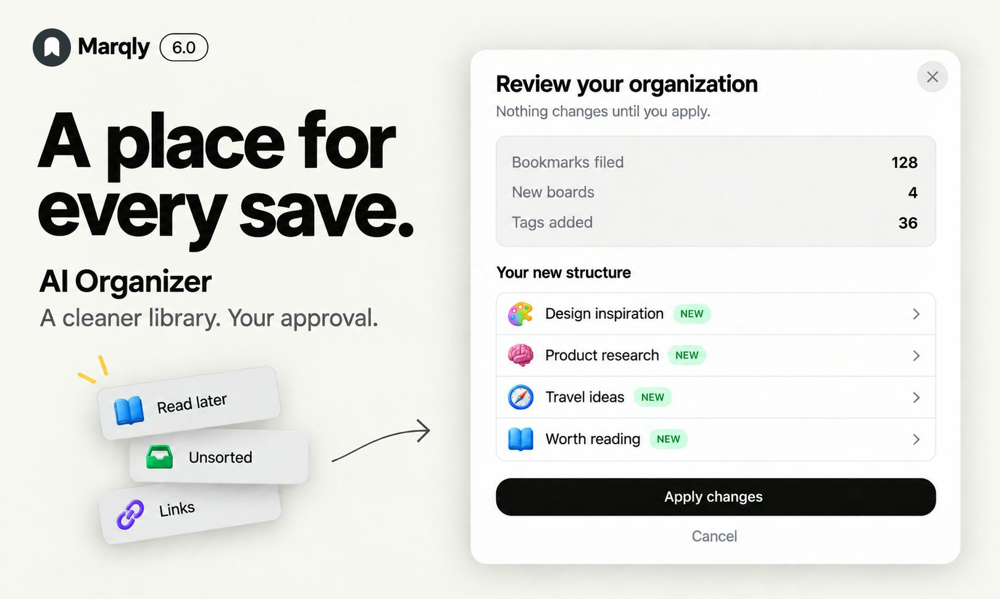
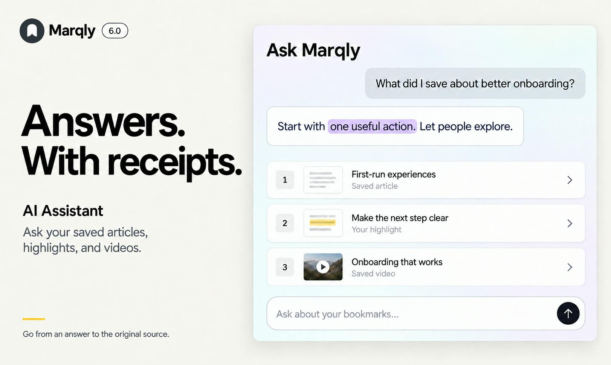
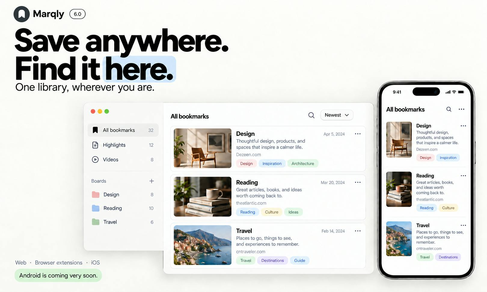

---

## 19. [OVO](https://www.producthunt.com/products/ovo)
**Votes**: 74 | **도입 난이도**: 하 | **신뢰도**: 상
**Tagline**: Play music from files, iCloud & streams across Apple devices
**서비스 링크**: https://www.producthunt.com/r/SERDGQGLVW5ECO

**태그**: Music Player, iOS, Audio, Productivity

### 📌 이 서비스 한눈에 보기
로컬 파일부터 스트리밍까지 모든 음악을 하나의 라이브러리로 통합하는 프리미엄 플레이어

### 🔑 주요 기능
- 로컬 파일, iCloud, SoundCloud, 라이브 스트림 통합 재생
- iPhone, iPad, Apple Watch 간의 프라이빗 iCloud 동기화
- 10밴드 EQ를 통한 정교한 사운드 조절 및 오프라인 재생 지원

### 🙋 사용자에게 어떤 점이 좋은가
다양한 소스의 음악을 하나의 앱에서 관리하고 싶은 사용자에게 편리한 통합 환경을 제공합니다.

### ✅ 지금 바로 써볼 기능
- iCloud를 통한 기기 간 라이브러리 동기화 설정
- 10밴드 EQ를 활용한 개인 맞춤형 음질 설정
- 로컬 파일 및 스트림 콘텐츠 통합 라이브러리 구축

### ⚠️ 사용 전 확인할 점
- iCloud를 통한 동기화 시 저장 공간 및 데이터 사용량 확인 필요
- 지원되는 SoundCloud 콘텐츠 범위 확인 필요

### 🧭 확인이 더 필요한 정보
모든 SoundCloud 콘텐츠가 완벽하게 호환되는지 확인이 필요합니다.

### 📸 스크린샷 및 갤러리

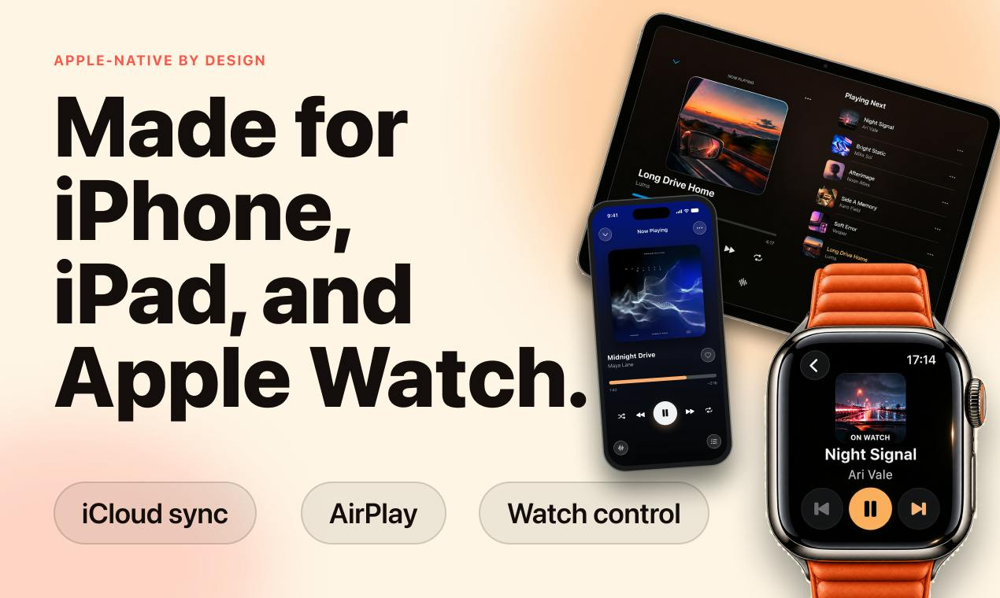
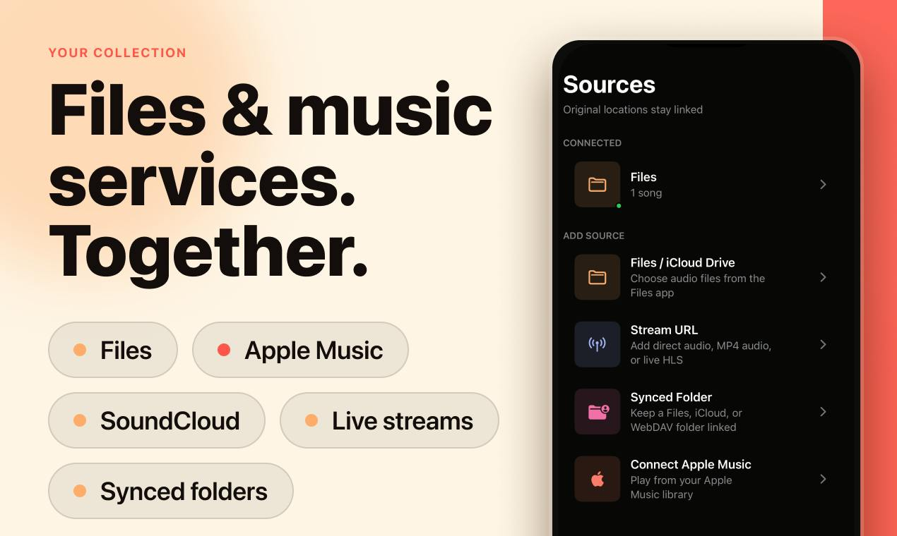

---

## 20. [Bluey Email - AI Email Marketing](https://www.producthunt.com/products/bluey-email)
**Votes**: 19 | **도입 난이도**: 하 | **신뢰도**: 상
**Tagline**: Flat Pricing and AI Native Email Marketing
**서비스 링크**: https://www.producthunt.com/r/ZG6GFMJINPWTDU

**태그**: Marketing, AI, CRM, Automation, AI Tool, Email

### 📌 이 서비스 한눈에 보기
연락처 수 제한 없이 발송량 기준으로만 과금되는 AI 기반 통합 이메일 마케팅 솔루션

### 🔑 주요 기능
- 연락처 수(Contacts)가 아닌 발송량(Sends) 기준의 합리적인 과금 체계
- 마케팅 캠페인, 트랜잭션 이메일, CRM 기능을 하나의 계정에서 통합 관리
- 한 문장만으로 전체 캠페인을 작성하는 AI Composer 기능 제공

### 🙋 사용자에게 어떤 점이 좋은가
고객 리스트가 늘어나도 비용 부담 없이 사용할 수 있으며, 마케팅과 CRM을 별도 벤더 없이 하나로 해결할 수 있어 운영 효율이 높습니다.

### ✅ 지금 바로 써볼 기능
- AI Composer를 활용한 캠페인 초안 작성 테스트
- 기존 고객 리스트를 업로드하여 발송량 기반 요금제 시뮬레이션
- CRM 딜 파이프라인 기능과 마케팅 자동화 연동 확인

### ⚠️ 사용 전 확인할 점
- 연락처 수 제한은 없으나 발송량 한도 초과 시 추가 비용 발생 가능성 확인 필요
- 기존에 사용 중인 복잡한 CRM 기능과의 기능적 차이 검토 필요

### 🧭 확인이 더 필요한 정보
상세한 발송량 초과 시 과금 정책 및 타 서비스와의 데이터 마이그레이션 편의성에 대한 정보가 더 필요합니다.

### 📸 스크린샷 및 갤러리
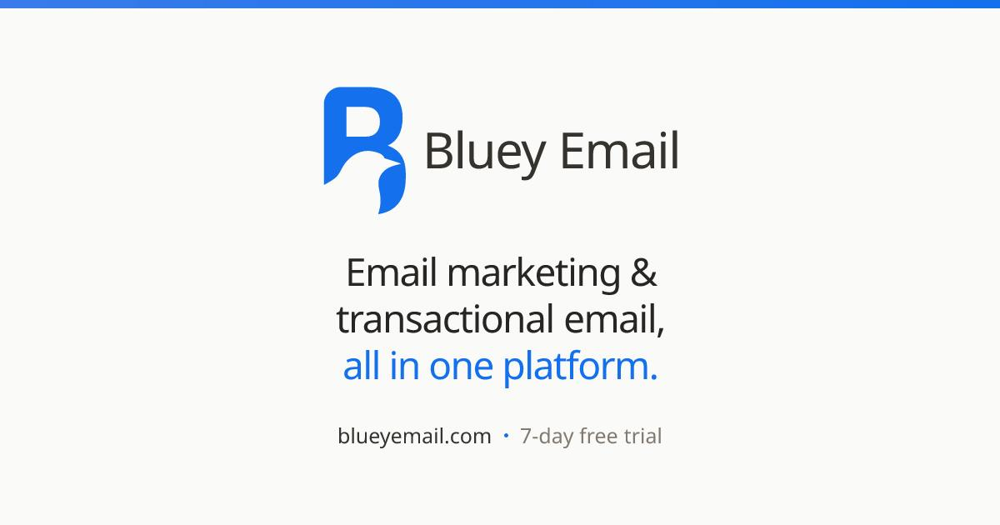
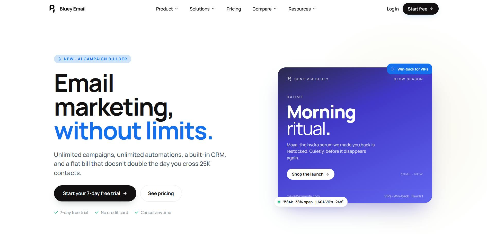
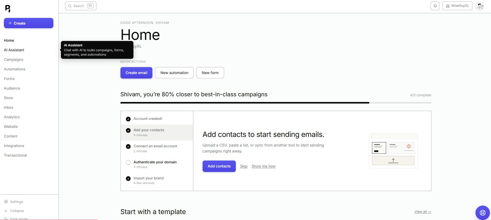

### 🎬 관련 영상
- [🎥 영상 보기](https://ph-files.imgix.net/9c940eef-627a-49b6-bc6b-4e10ccdf8352.jpeg?auto=format)

---

## 21. [Sequenzy: AI-Native Email Marketing Tool](https://www.producthunt.com/products/sequenzy)
**Votes**: 14 | **도입 난이도**: 하 | **신뢰도**: 상
**Tagline**: Powerful Email Marketing Tool for SaaS
**서비스 링크**: https://www.producthunt.com/r/UZ5KWY3OK66LHD

**태그**: SaaS, EmailMarketing, AI, Automation, Growth, AI Tool, Prompting, Design, Marketing, Email

### 📌 이 서비스 한눈에 보기
프롬프트 하나로 이메일 카피부터 자동화 워크플로우까지 완성하는 SaaS 특화 AI 마케팅 툴

### 🔑 주요 기능
- 프롬프트 기반의 AI 이메일 카피 및 디자인 자동 생성
- Stripe 및 PostHog 연동을 통한 사용자 데이터 기반 타겟팅
- 온보딩, 결제 복구, 고객 유지 등 SaaS 특화 시퀀스 구축

### 🙋 사용자에게 어떤 점이 좋은가
SaaS 창업자가 수동 작업 없이도 구독 상태나 제품 활동에 맞춘 정교한 이메일 자동화 마케팅을 실행할 수 있습니다.

### ✅ 지금 바로 써볼 기능
- AI 프롬프트로 브랜드 맞춤형 이메일 초안 생성하기
- Stripe/PostHog 연동하여 사용자 세그먼트 설정하기
- 결제 복구 및 온보딩 자동화 시퀀스 활성화하기

### ⚠️ 사용 전 확인할 점
- AI 생성 콘텐츠의 브랜드 일관성을 위한 최종 검토 필요
- 외부 데이터(Stripe, PostHog) 연동 설정 숙련도 필요

### 🧭 확인이 더 필요한 정보
상세한 요금제 체계와 데이터 보안 정책에 대한 정보가 명시되지 않았습니다.

### 📸 스크린샷 및 갤러리
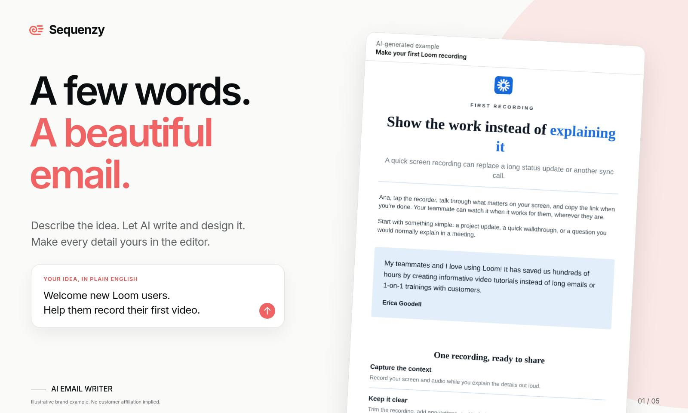
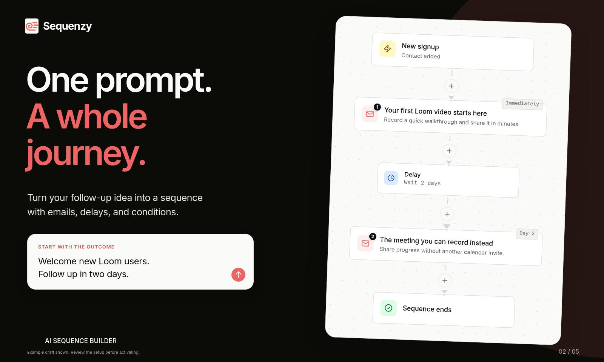
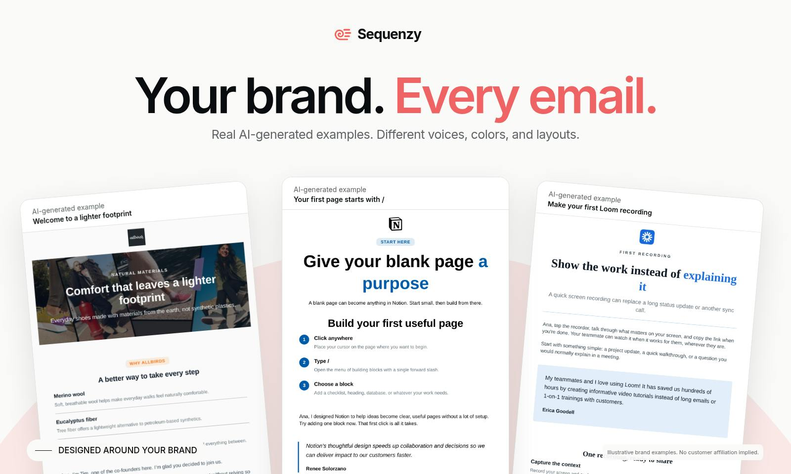

### 🎬 관련 영상
- [🎥 영상 보기](https://ph-files.imgix.net/f6cd6fb6-88bb-41d9-a43e-5592669702bf.jpeg?auto=format)

---

## 22. [Outclimbed](https://www.producthunt.com/products/outclimbed)
**Votes**: 12 | **도입 난이도**: 하 | **신뢰도**: 상
**Tagline**: Rank #1 without a $20,000 budget
**서비스 링크**: https://www.producthunt.com/r/ZAP3UDDA7NLZZ4

**태그**: Marketing, Directory, GrowthHacking, AI Tool

### 📌 이 서비스 한눈에 보기
투명한 비용과 추천 시스템을 통해 누구나 공정하게 순위를 경쟁하는 제품 디렉토리

### 🔑 주요 기능
- 최소 비용($10)으로 제품 또는 X 프로필을 등록할 수 있는 공개 디렉토리
- 추가 결제 및 공유를 통한 포인트 획득 방식의 투명한 랭킹 시스템
- 편집자의 주관이나 숨겨진 가중치 없이 모든 데이터가 공개됨

### 🙋 사용자에게 어떤 점이 좋은가
적은 비용으로 제품 노출 기회를 얻고, 투명한 순위 산정 방식을 통해 마케팅 성과를 직관적으로 확인할 수 있습니다.

### ✅ 지금 바로 써볼 기능
- $10로 제품 또는 X 프로필 등록하기
- 공유 링크를 통해 포인트 획득 및 순위 올리기
- 다른 제품들의 지불 금액과 획득 포인트 비교 분석하기

### ⚠️ 사용 전 확인할 점
- 획득한 포인트는 30일 후 만료되므로 지속적인 관리가 필요함
- 순위 유지를 위해 지속적인 비용이나 공유 활동이 요구될 수 있음

### 🧭 확인이 더 필요한 정보
포인트 만료 및 순위 변동에 따른 장기적인 노출 효과에 대한 구체적인 데이터는 확인이 필요합니다.

### 📸 스크린샷 및 갤러리
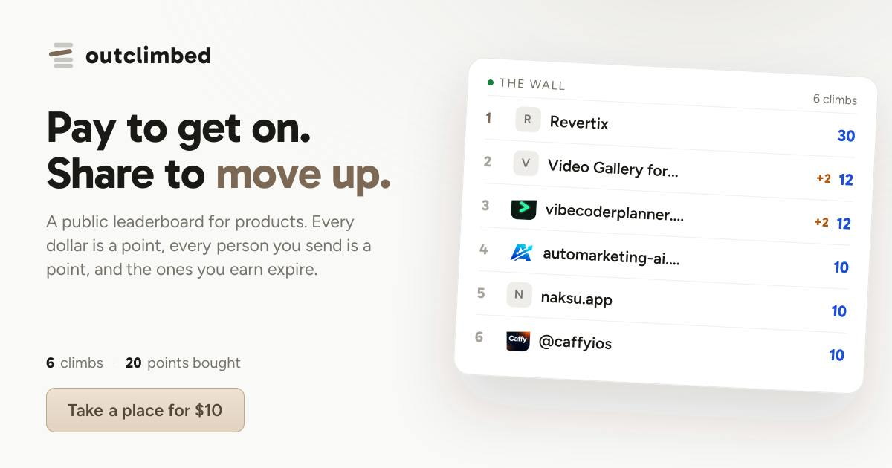
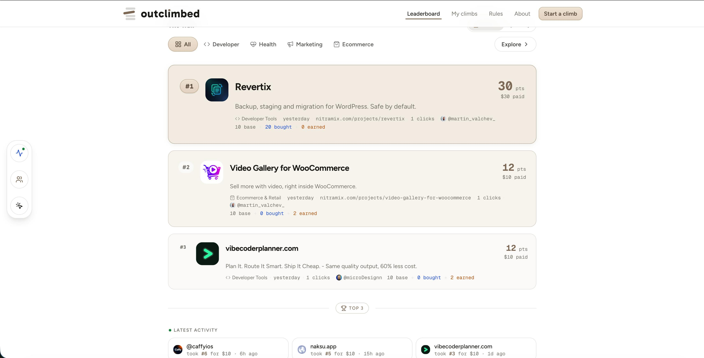
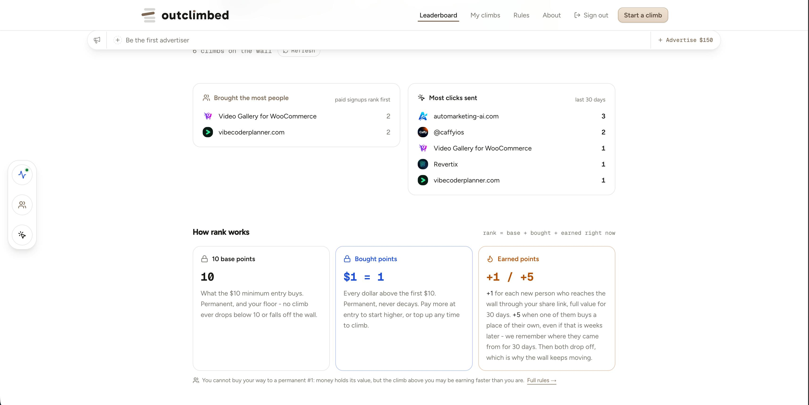

---

## 23. [Snout](https://www.producthunt.com/products/snout-2)
**Votes**: 11 | **도입 난이도**: 하 | **신뢰도**: 상
**Tagline**: Track Every Dose. Never Miss a Visit.
**서비스 링크**: https://www.producthunt.com/r/E5MQ6AO5YIAGVT

**태그**: PetCare, Productivity, HealthTracker, iOS, AI Tool

### 📌 이 서비스 한눈에 보기
반려동물의 투약, 진료, 일상을 한곳에서 관리하는 프라이빗 헬스케어 트래커

### 🔑 주요 기능
- 투약, 예방접종, 식단, 체중 등 반려동물 건강 데이터 통합 관리
- 오늘 할 일(Today view)을 통한 직관적인 일정 관리
- iCloud 기반의 프라이빗 동기화 및 오프라인 지원

### 🙋 사용자에게 어떤 점이 좋은가
반려동물의 복잡한 건강 기록을 한눈에 파악하고, 가족 구성원과 일정을 공유하여 투약이나 방문 시기를 놓치지 않게 도와줍니다.

### ✅ 지금 바로 써볼 기능
- 기본 무료 버전으로 반려동물 1마리 데이터 입력해보기
- 가족 구성원과 공유 기능 테스트하기
- 애플 기기(iPhone, iPad, Mac) 간 동기화 확인하기

### ⚠️ 사용 전 확인할 점
- 무료 버전은 반려동물 1마리만 등록 가능
- 추가 기능(무제한 등록, PDF 내보내기 등)은 Snout+ 유료 결제 필요

### 🧭 확인이 더 필요한 정보
Snout+의 구독형 모델과 일회성 구매 모델 간의 상세 기능 차이 및 유지보수 정책을 확인해야 합니다.

### 📸 스크린샷 및 갤러리
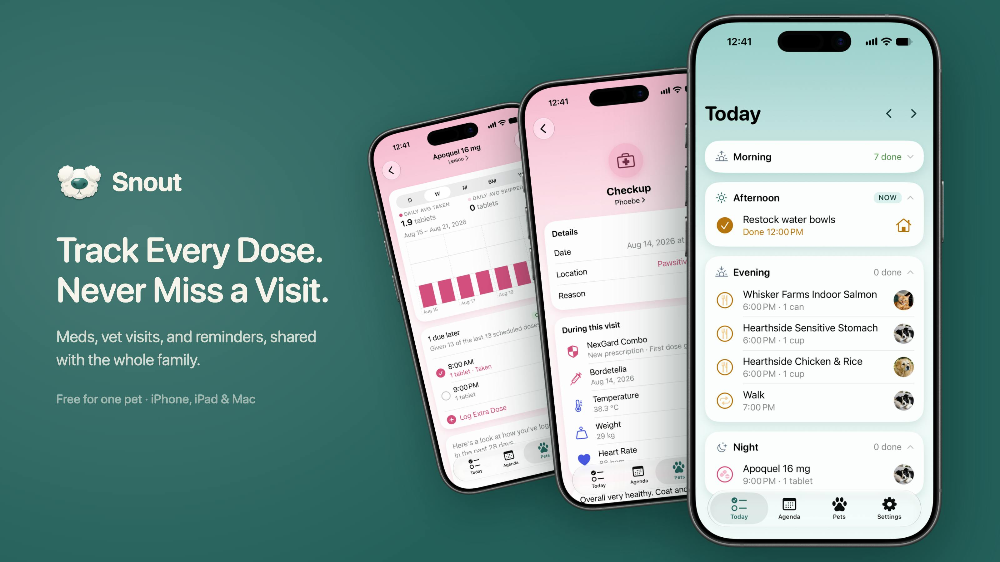
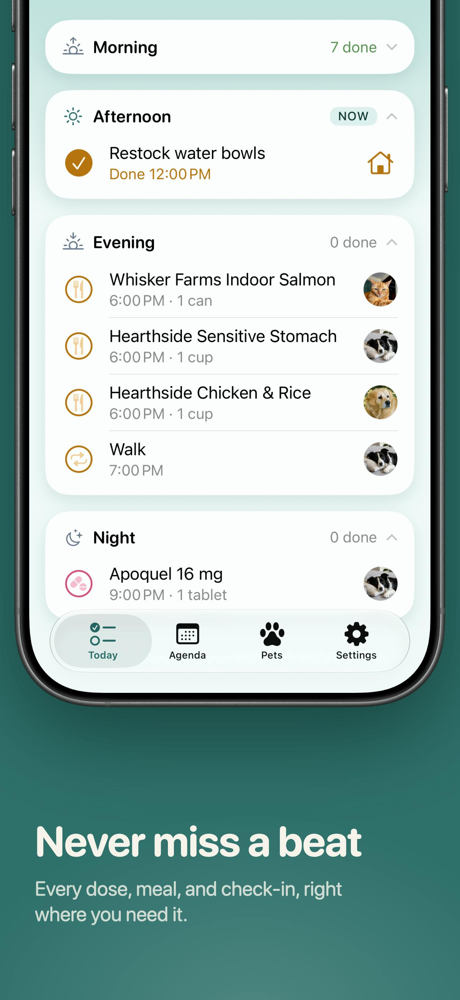
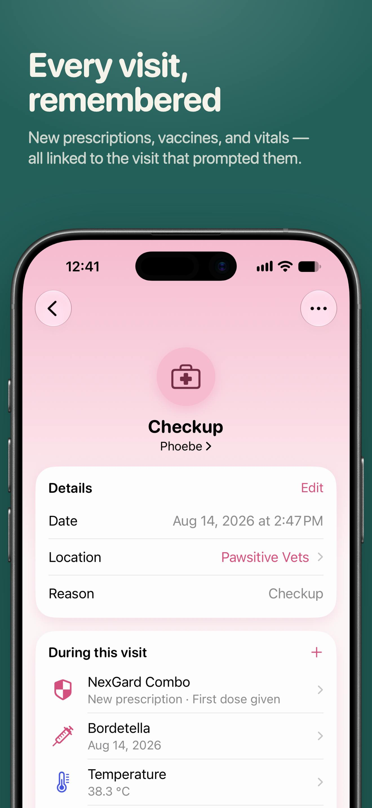

---

## 24. [Sparkian](https://www.producthunt.com/products/sparkian)
**Votes**: 11 | **도입 난이도**: 하 | **신뢰도**: 상
**Tagline**: AI chat, compare & create with 70+ AI models
**서비스 링크**: https://www.producthunt.com/r/W7INZVLG3BXY2B

**태그**: AI, Productivity, Collaboration, Research, AI Tool, Chat, Prompting, Vision

### 📌 이 서비스 한눈에 보기
70개 이상의 AI 모델을 한 곳에서 비교하고 협업할 수 있는 통합 AI 워크스페이스

### 🔑 주요 기능
- Claude, GPT, Gemini 등 70개 이상의 다양한 AI 모델 통합 제공
- 동일한 프롬프트를 여러 모델에 동시에 실행하여 결과 비교 가능
- 이미지 생성, 출처가 포함된 리서치, 팀 프로젝트 협업 기능 지원

### 🙋 사용자에게 어떤 점이 좋은가
여러 AI 모델을 개별 구독할 필요 없이 하나의 구독으로 통합 관리할 수 있어 비용과 시간을 절약할 수 있습니다.

### ✅ 지금 바로 써볼 기능
- 동일 프롬프트로 모델별 답변 품질 비교하기
- 출처 기반 리서치 기능으로 정보 신뢰도 확인하기
- 팀 프로젝트 기능을 활용한 공동 작업 시작하기

### ⚠️ 사용 전 확인할 점
- 단일 구독 모델의 세부 요금제 및 모델별 사용량 제한 확인 필요
- 특정 모델의 최신 버전 반영 여부 확인 필요

### 🧭 확인이 더 필요한 정보
70개 이상의 모델에 대한 구체적인 목록과 모델별 사용량 제한 정책이 명시되지 않았습니다.

### 📸 스크린샷 및 갤러리
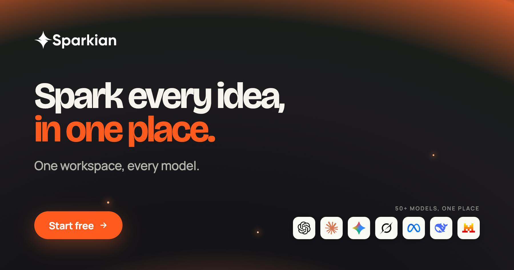
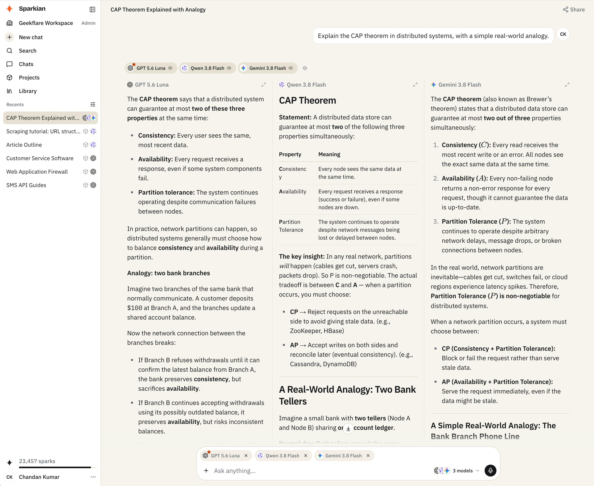
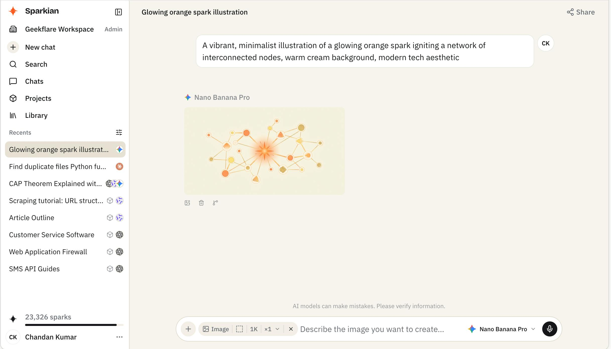

---

## 25. [Koffeelab: Your coffee journal](https://www.producthunt.com/products/koffeelab-your-coffee-journal)
**Votes**: 10 | **도입 난이도**: 하 | **신뢰도**: 상
**Tagline**: For the ones who already count the grams.
**서비스 링크**: https://www.producthunt.com/r/G7NK6ZG762YW4Z

**태그**: Lifestyle, Journaling, Coffee, Analytics, AI Tool

### 📌 이 서비스 한눈에 보기
나만의 완벽한 커피 레시피를 기록하고 취향을 분석하는 커피 저널링 서비스

### 🔑 주요 기능
- 브루잉 레시피 기록 및 정밀한 추출 데이터 관리
- 커피 취향 분석 및 개인별 커피 히스토리 아카이빙
- 커피를 만든 장소를 기록하는 지도 기능 및 친구와의 공유

### 🙋 사용자에게 어떤 점이 좋은가
정밀한 계량을 즐기는 커피 애호가들이 자신만의 최적 레시피를 체계적으로 관리하고 취향을 발견하는 데 도움을 줍니다.

### ✅ 지금 바로 써볼 기능
- 자신만의 브루잉 레시피 기록하기
- 커피 취향 분석 리포트 확인하기
- 커피를 만든 장소를 지도에 표시하기

### ⚠️ 사용 전 확인할 점
- 수동 기록 방식이므로 매번 레시피를 입력해야 하는 번거로움이 있을 수 있음
- 데이터 백업 및 기기 간 동기화 방식 확인 필요

### 🧭 확인이 더 필요한 정보
모바일 앱 전용인지 웹 서비스도 지원하는지 여부가 명시되지 않았습니다.

### 📸 스크린샷 및 갤러리
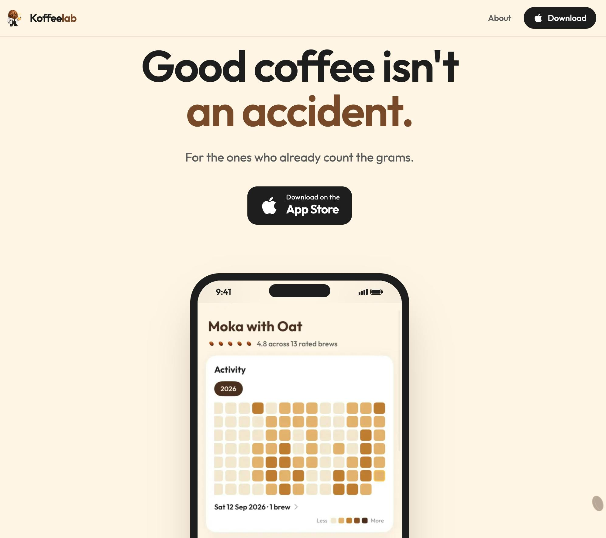

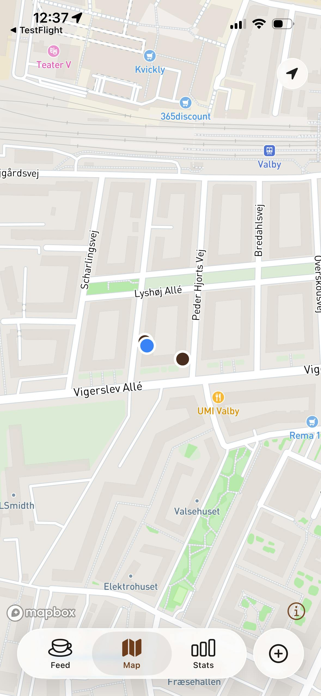

### 🎬 관련 영상
- [🎥 영상 보기](https://ph-files.imgix.net/6c5c3d12-e419-493b-95fc-85e59d183e65.jpeg?auto=format)

---

## 26. [Flalingo AI Speaking Coach](https://www.producthunt.com/products/flalingo)
**Votes**: 10 | **도입 난이도**: 하 | **신뢰도**: 상
**Tagline**: Speak from day one with real-time AI voice practice
**서비스 링크**: https://www.producthunt.com/r/NMPDBH6WWATXRT

**태그**: LanguageLearning, AI, MobileApp, SpeakingPractice, AI Tool

### 📌 이 서비스 한눈에 보기
실시간 AI 코칭을 통해 배운 언어를 즉시 말하기 연습으로 연결하는 언어 학습 앱

### 🔑 주요 기능
- 2분 스피킹 레벨 테스트를 통한 맞춤형 학습 시작
- 실시간 AI 음성 대화를 통한 몰입형 회화 연습
- 발음 피드백 및 실수 기반의 맞춤형 복습 시스템

### 🙋 사용자에게 어떤 점이 좋은가
이론적인 공부를 넘어 실제 말하기 실력을 빠르게 키울 수 있으며, 개인화된 학습 경로를 통해 무엇을 공부해야 할지 고민할 필요가 없습니다.

### ✅ 지금 바로 써볼 기능
- 2분 스피킹 레벨 체크 진행하기
- AI 코치와 실시간 음성 대화 시도하기
- 제공되는 발음 피드백 및 교정 사항 확인하기

### ⚠️ 사용 전 확인할 점
- 모바일 앱(iOS/Android) 환경에서만 사용 가능
- AI 피드백이 실제 원어민의 뉘앙스와 완벽히 일치하는지 확인 필요

### 🧭 확인이 더 필요한 정보
구독 모델이나 유료 기능에 대한 구체적인 가격 정책이 명시되지 않았습니다.

### 📸 스크린샷 및 갤러리
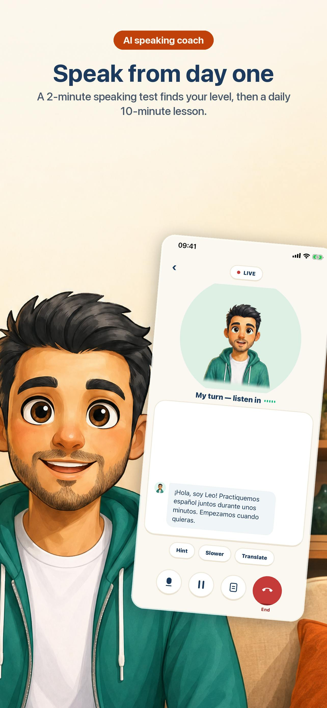
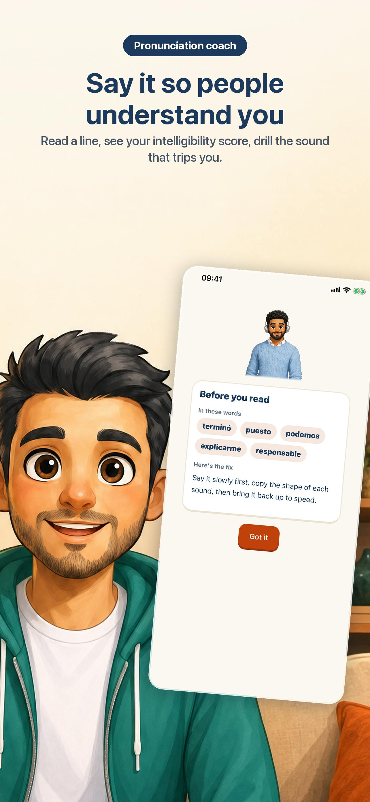
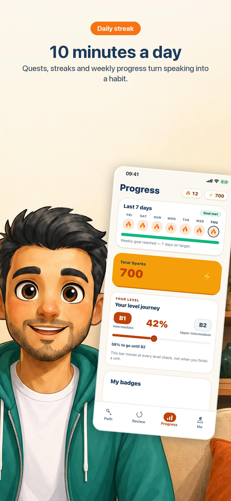

---

## 27. [Netra Runtime](https://www.producthunt.com/products/netra-runtime)
**Votes**: 10 | **도입 난이도**: 중 | **신뢰도**: 상
**Tagline**: Fastest AI Inference at Any Scale
**서비스 링크**: https://www.producthunt.com/r/RL6ZZHSV4C5G4Z

**태그**: AI, DevOps, Infrastructure, MLOps, AI Tool, API

### 📌 이 서비스 한눈에 보기
어떤 규모에서도 가장 빠른 AI 추론 성능을 제공하는 런타임 솔루션

### 🔑 주요 기능
- 낮은 지연 시간과 높은 처리량을 통한 프로덕션급 AI 실행
- Netra Cloud의 OpenAI 호환 API 제공
- 사용자 자체 GPU 인프라에 직접 배포 가능

### 🙋 사용자에게 어떤 점이 좋은가
AI 모델의 응답 속도를 높이고 처리량을 확장해야 하는 개발자에게 최적화된 인프라 환경을 제공합니다.

### ✅ 지금 바로 써볼 기능
- Netra Cloud의 OpenAI 호환 API 테스트
- 자체 GPU 인프라 환경에서의 배포 호환성 확인

### ⚠️ 사용 전 확인할 점
- 자체 인프라 배포 시 하드웨어 사양 및 호환성 검토 필요
- 사용자 환경에 따른 성능 차이 발생 가능성

### 🧭 확인이 더 필요한 정보
구체적인 벤치마크 수치와 지원하는 모델 종류에 대한 상세 정보 확인이 필요합니다.

### 📸 스크린샷 및 갤러리

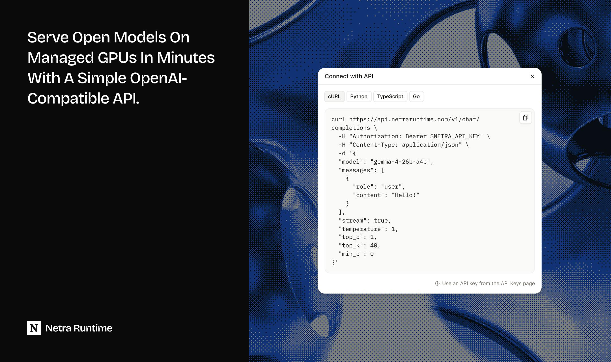
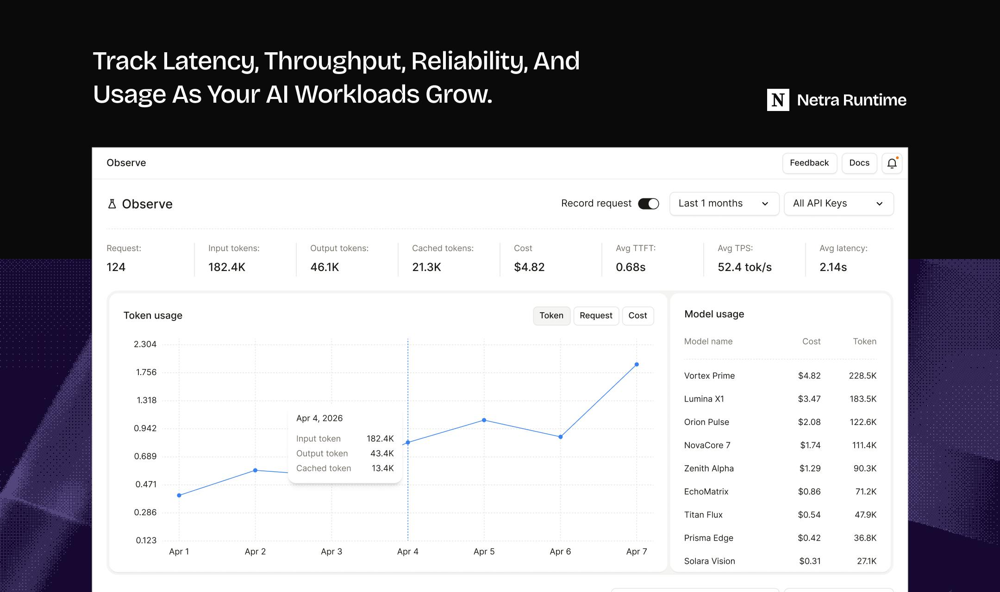

---

## 28. [Premove ITN](https://www.producthunt.com/products/premove-itn)
**Votes**: 9 | **도입 난이도**: 중 | **신뢰도**: 상
**Tagline**: Open-source context-aware ITN for voice agents
**서비스 링크**: https://www.producthunt.com/r/ZENIDGCF36NJ73

**태그**: AI, NLP, DevTool, Voice-AI, OpenSource, Agent, AI Tool, API, Email

### 📌 이 서비스 한눈에 보기
음성 인식 결과(ASR)를 API가 즉시 사용할 수 있는 정형 데이터로 변환하는 오픈소스 ITN 솔루션

### 🔑 주요 기능
- 비정형 ASR 텍스트를 전화번호, 날짜, 시간, 이메일 등 구조화된 값으로 변환
- 결정론적 후보 생성과 신경망 모델 스코어링을 결합한 하이브리드 방식
- 오픈소스 Python 패키지로 실시간 추론 및 커스텀 가능

### 🙋 사용자에게 어떤 점이 좋은가
음성 에이전트 개발 시, 텍스트로 된 정보를 수동으로 파싱할 필요 없이 즉시 API 입력값으로 활용할 수 있습니다.

### ✅ 지금 바로 써볼 기능
- Python 환경에 패키지 설치 및 기본 데모 실행
- 자사 음성 인식(ASR) 데이터셋을 활용한 변환 정확도 테스트
- 실시간 서비스 적용을 위한 추론 속도(Latency) 검증

### ⚠️ 사용 전 확인할 점
- 문맥 의존도가 높은 복잡한 문장에서의 정확도 확인 필요
- 모델 가중치(Open weights)를 활용한 로컬 환경 최적화 작업 필요

### 🧭 확인이 더 필요한 정보
특정 도메인(금융, 의료 등) 특화 용어에 대한 처리 성능과 하드웨어 요구 사양은 명시되지 않았습니다.

### 📸 스크린샷 및 갤러리
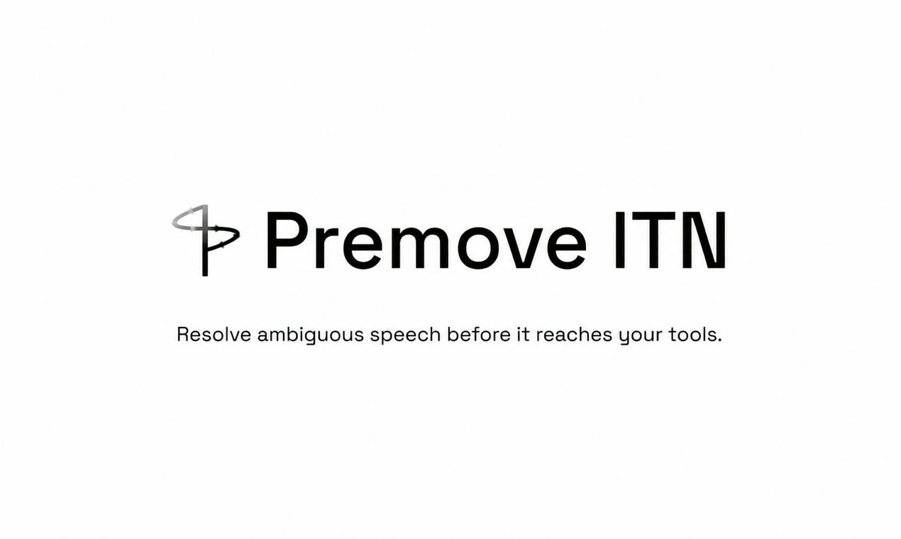
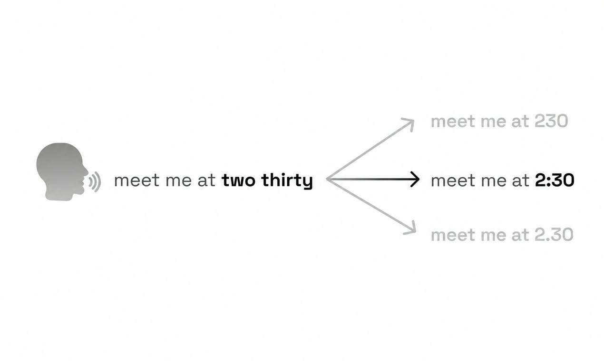

### 🎬 관련 영상
- [🎥 영상 보기](https://ph-files.imgix.net/31d68123-00a9-4526-8f6f-9a04a410ff6c.jpeg?auto=format)

---

## 29. [tersOS](https://www.producthunt.com/products/tersos)
**Votes**: 8 | **도입 난이도**: 중 | **신뢰도**: 상
**Tagline**: The coworking operating system, built by operators
**서비스 링크**: https://www.producthunt.com/r/IZJQS24Y56CGNR

**태그**: SaaS, Coworking, Management, Automation, AI, AI Tool, Chat, CRM

### 📌 이 서비스 한눈에 보기
운영 전문가가 직접 만든 코워킹 스페이스 통합 관리 운영체제

### 🔑 주요 기능
- 예약, 결제, 커뮤니티 관리를 하나로 통합한 올인원 시스템
- iOS, Android, 웹을 지원하는 멤버 전용 앱 제공
- AI 어시스턴트(tersAI)를 통한 자동화된 문의 응대 및 예약 관리

### 🙋 사용자에게 어떤 점이 좋은가
코워킹 스페이스 운영에 필요한 모든 도구를 개별적으로 구축할 필요 없이 하나의 시스템으로 통합 관리할 수 있습니다.

### ✅ 지금 바로 써볼 기능
- 실시간 플로어 플랜 및 예약 시스템 확인
- tersAI를 활용한 자동 응대 기능 테스트
- 멤버용 모바일 앱 인터페이스 검토

### ⚠️ 사용 전 확인할 점
- 특정 하드웨어(벽면 스크린 등)와의 연동 방식 확인 필요
- 운영 규모에 따른 기능 확장성 및 비용 구조 확인 필요

### 🧭 확인이 더 필요한 정보
현재 제공되는 기능 외에 외부 결제 게이트웨이나 타 소프트웨어와의 연동 범위는 명시되지 않았습니다.

### 📸 스크린샷 및 갤러리

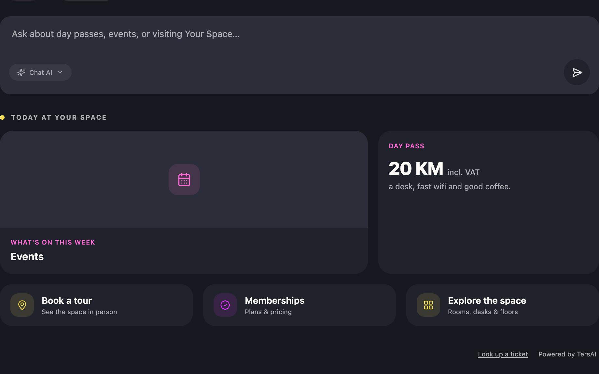

---

## 30. [Ottermind](https://www.producthunt.com/products/ottermind)
**Votes**: 8 | **도입 난이도**: 하 | **신뢰도**: 상
**Tagline**: Turn goals and files into polished, editable deliverables.
**서비스 링크**: https://www.producthunt.com/r/JUHCQYXEBK3I33

**태그**: Productivity, AI, Automation, NoCode, Agent, AI Tool, Prompting, Video, Vision

### 📌 이 서비스 한눈에 보기
목표와 파일을 즉시 편집 가능한 결과물로 변환하는 올인원 AI 워크스페이스

### 🔑 주요 기능
- 목표, 프롬프트, 파일을 활용한 다양한 형태의 결과물 생성
- 프레젠테이션, 보고서, 스프레드시트, 웹사이트 등 다채로운 포맷 지원
- 코딩이나 복잡한 에이전트 설정 없는 단일 워크스페이스 환경

### 🙋 사용자에게 어떤 점이 좋은가
아이디어를 구체적인 결과물로 만드는 데 드는 시간을 단축하고, 복잡한 설정 없이 즉시 실무 결과물을 얻을 수 있습니다.

### ✅ 지금 바로 써볼 기능
- 보유한 파일 업로드하여 결과물 생성해보기
- 다양한 AI 모델을 활용한 결과물 비교하기
- 생성된 결과물 편집 및 커스텀하기

### ⚠️ 사용 전 확인할 점
- 생성된 결과물의 품질이 사용자의 세부 요구사항을 얼마나 충족할지 확인 필요
- 복잡한 워크플로우나 고도의 커스텀 기능 지원 여부 확인 필요

### 🧭 확인이 더 필요한 정보
제공되는 다양한 AI 모델의 종류와 각 모델별 특화 기능에 대한 상세 정보가 필요합니다.

### 📸 스크린샷 및 갤러리
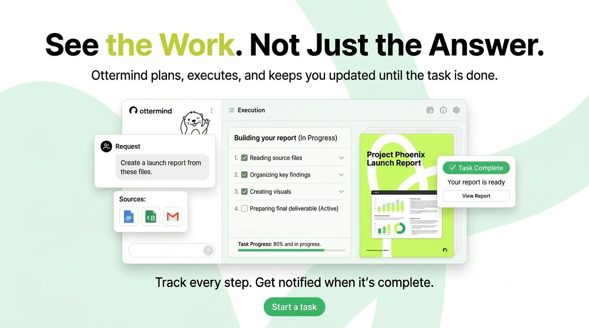
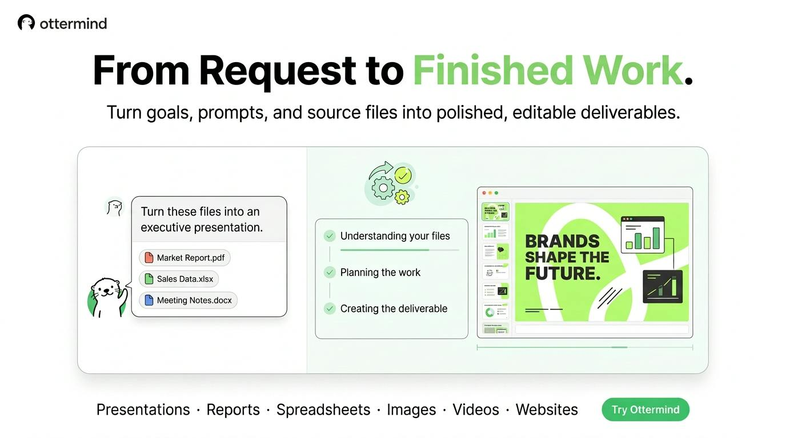
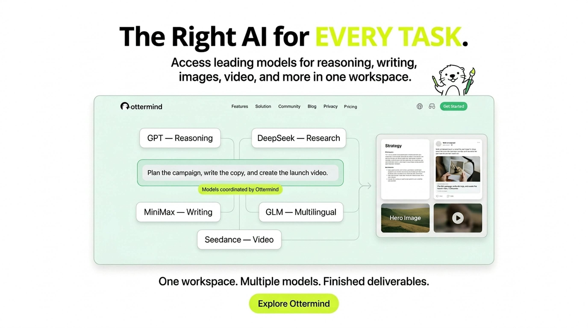

---

