# 🚀 Product Hunt Daily Top 30 (2026-09-18)

## 오늘의 요약
오늘의 트렌드는 AI 에이전트와 개발 환경의 결합, 그리고 복잡한 인프라를 단순화하는 자동화 도구들이 주도했습니다. 특히 AI 코딩 에이전트가 즉시 작업할 수 있는 클라우드 환경이나, 기존의 문자 메시지/네이티브 앱 환경을 활용한 간편한 AI 인터페이스가 주목받았습니다.

### 오늘의 핵심 포인트
- AI 에이전트의 성능 검증과 효율적인 협업을 위한 클라우드 개발 및 테스트 환경이 강화되었습니다.
- 복잡한 결제, 세무, 멀티 플랫폼 배포 등 비즈니스 운영의 번거로움을 해결하는 자동화 솔루션이 등장했습니다.
- 별도의 앱 설치 없이 기존의 통신 수단이나 맥북 UI를 활용하는 등 사용자 접근성을 극대화한 AI 서비스들이 눈에 띄었습니다.

**오늘의 태그**: AI Agent, Developer Tools, Automation, SaaS, No-Code/Low-Code

## 1. [CREEM 2.0](https://www.producthunt.com/products/creem)
**Votes**: 451 | **도입 난이도**: 하 | **신뢰도**: 상
**Tagline**: Build with AI. Sell and Grow with CREEM.
**서비스 링크**: https://www.producthunt.com/r/XPEDAC33OVX2ON

**태그**: Fintech, SaaS, AI-Tools, Global-Commerce, AI Tool

### 📌 이 서비스 한눈에 보기
AI 빌더를 위한 올인원 글로벌 결제 및 비즈니스 운영 플랫폼

### 🔑 주요 기능
- 글로벌 소프트웨어 및 디지털 제품 판매 지원
- 결제, 세금, 정산, 제휴 마케팅 통합 관리
- 사용량 기반 빌링(Usage billing) 기능 제공

### 🙋 사용자에게 어떤 점이 좋은가
제품 개발 속도에 맞춰 복잡한 결제 및 세무 인프라를 즉시 구축하여 비즈니스 운영 효율을 극대화할 수 있습니다.

### ✅ 지금 바로 써볼 기능
- 글로벌 결제 게이트웨이 설정하기
- 사용량 기반 과금 체계 구축하기
- 제휴(Affiliate) 프로그램 활성화하기

### ⚠️ 사용 전 확인할 점
- 국가별 세법 준수 여부 확인 필요
- 디지털 제품 외 실물 상품 판매 지원 범위 확인

### 🧭 확인이 더 필요한 정보
구체적인 수수료 체계와 지원되는 결제 수단에 대한 상세 정보가 명시되지 않았습니다.

### 📸 스크린샷 및 갤러리
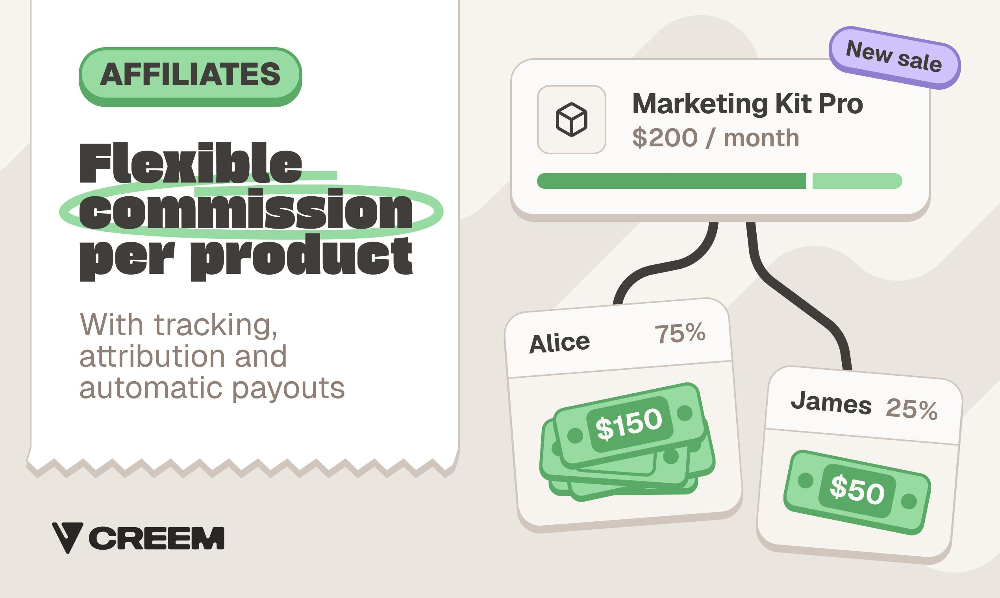
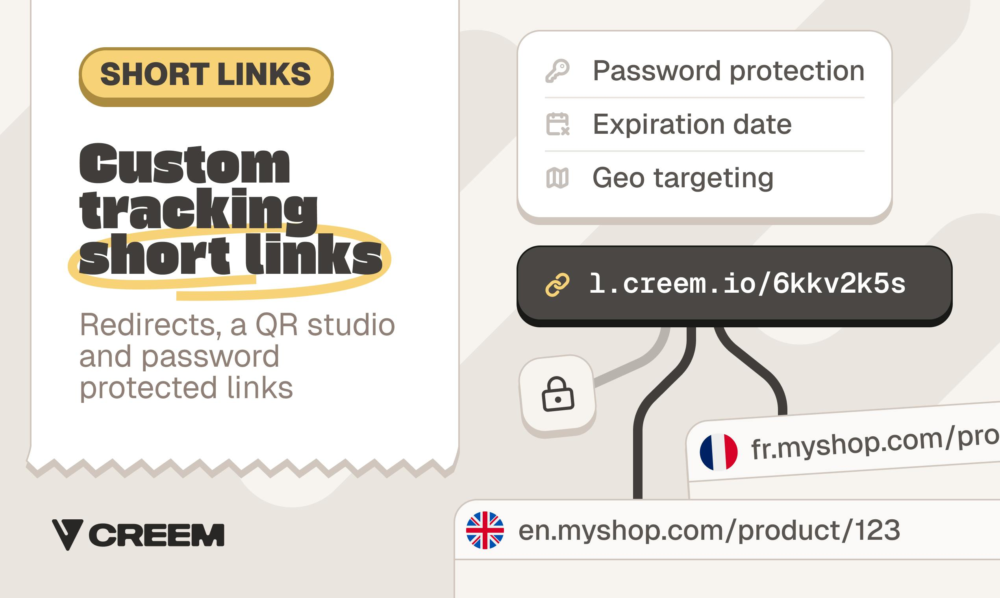
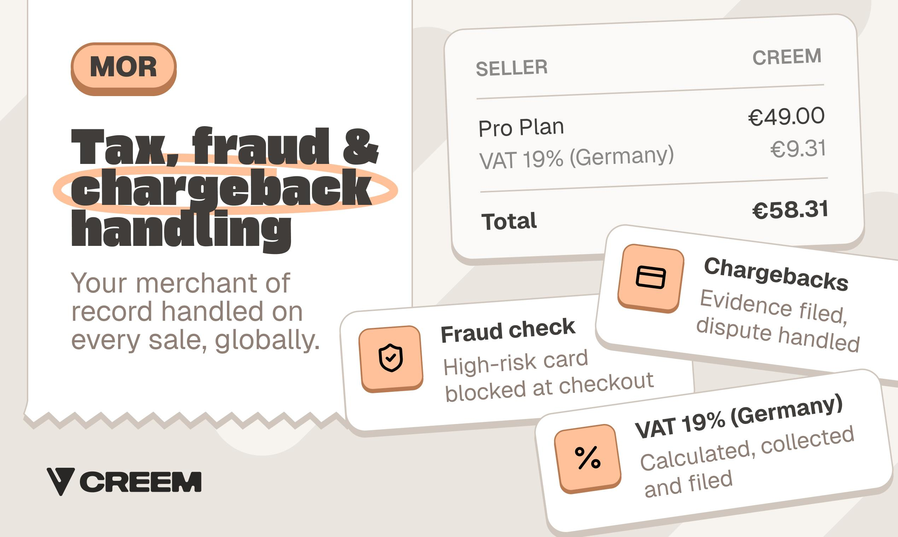

### 🎬 관련 영상
- [🎥 영상 보기](https://ph-files.imgix.net/88fc1155-d720-497f-a5cc-89a8b39a0783.jpeg?auto=format)

---

## 2. [Bitrise Remote Dev Environments](https://www.producthunt.com/products/bitrise)
**Votes**: 254 | **도입 난이도**: 중 | **신뢰도**: 상
**Tagline**: Cloud Macs your coding agents can actually build on
**서비스 링크**: https://www.producthunt.com/r/667RUK6AWQ3HIZ

**태그**: DevTool, CloudComputing, AI-Agent, CI/CD, Agent

### 📌 이 서비스 한눈에 보기
CI 환경과 동일한 클라우드 Mac/Linux 개발 환경을 즉시 구축하여 AI 에이전트와 협업하는 도구

### 🔑 주요 기능
- CI와 동일한 스택, 캐시, 머신 환경을 제공하는 클라우드 개발 환경
- MCP를 통한 AI 에이전트 병렬 실행 및 VS Code, Cursor, Claude Code 연동 지원
- 초 단위의 빠른 시작과 작업 중단 시 아카이브 및 나중 복원 기능

### 🙋 사용자에게 어떤 점이 좋은가
로컬 환경 제약 없이 클라우드에서 즉시 개발 환경을 구성할 수 있으며, 특히 AI 코딩 에이전트에게 최적화된 환경을 제공하여 개발 속도를 극대화합니다.

### ✅ 지금 바로 써볼 기능
- VS Code 또는 Cursor를 연결하여 클라우드 환경에서 코딩 시작하기
- AI 에이전트(Claude Code 등)를 연결하여 병렬 빌드 테스트하기
- CI 환경과 동일한 스택을 구성하여 빌드 일관성 확인하기

### ⚠️ 사용 전 확인할 점
- 클라우드 환경이므로 네트워크 지연 시간(Latency)이 발생할 수 있음
- CI 환경과 동일한 스택을 사용하므로 설정 방식에 따른 초기 구성 비용 발생 가능

### 🧭 확인이 더 필요한 정보
상세한 비용 정책 및 클라우드 인스턴스 사양에 대한 정보는 명시되지 않았습니다.

### 📸 스크린샷 및 갤러리
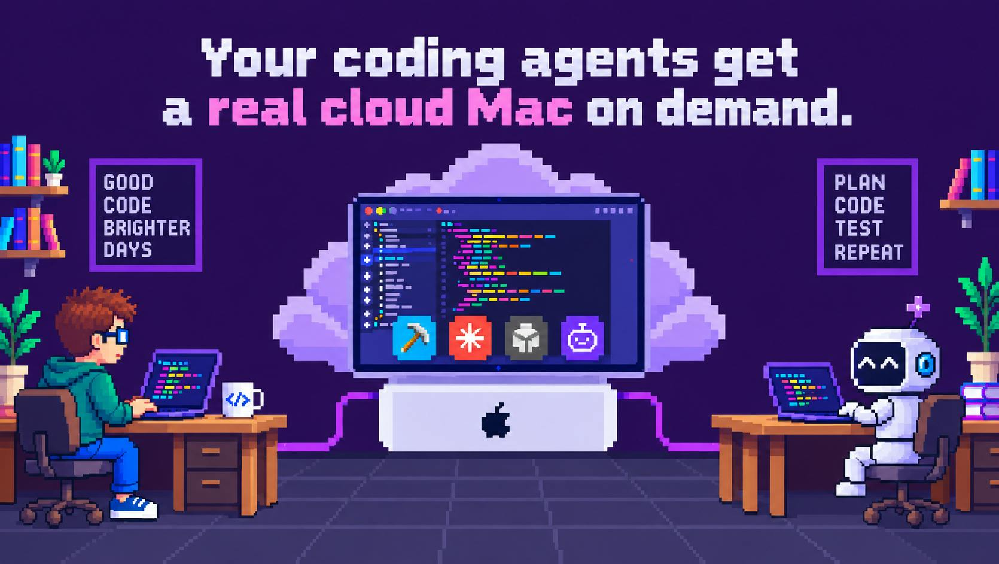
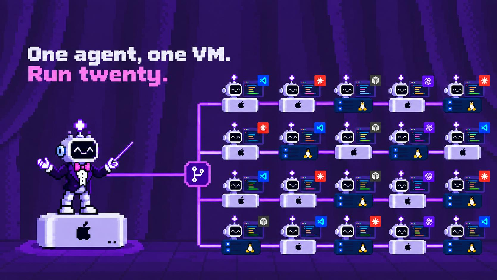
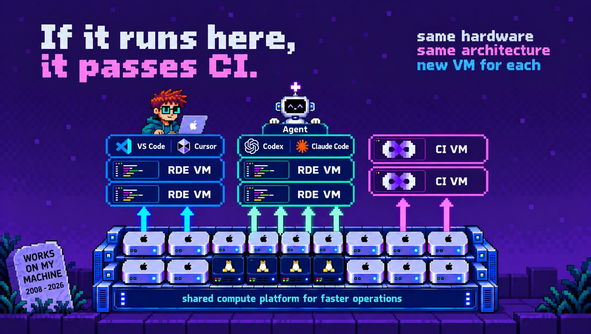

### 🎬 관련 영상
- [🎥 영상 보기](https://ph-files.imgix.net/48e23cbd-05b4-49ce-a2cb-bf6d0e9811c1.jpeg?auto=format)

---

## 3. [Text Agent Store](https://www.producthunt.com/products/text-agent-store)
**Votes**: 214 | **도입 난이도**: 하 | **신뢰도**: 상
**Tagline**: A marketplace for AI agents you can text
**서비스 링크**: https://www.producthunt.com/r/DMOVWAJZUXDH4M

**태그**: AI, Productivity, Mobile, NoCode, Agent, AI Tool

### 📌 이 서비스 한눈에 보기
별도의 설치 없이 연락처에 추가하는 것만으로 바로 사용하는 AI 에이전트 마켓플레이스

### 🔑 주요 기능
- 휴대폰 연락처에 등록하여 사용하는 방식의 AI 에이전트 디렉토리
- 계정 생성, 앱 다운로드, 복잡한 설정이 필요 없는 간편한 사용성
- 문자 메시지(Texting)를 통해 즉각적으로 상호작용하는 에이전트 생태계

### 🙋 사용자에게 어떤 점이 좋은가
새로운 앱을 설치하거나 가입하는 번거로움 없이, 기존의 문자 메시지 환경에서 즉시 AI의 도움을 받을 수 있습니다.

### ✅ 지금 바로 써볼 기능
- 제공되는 에이전트 목록 탐색하기
- 원하는 에이전트를 연락처에 추가하기
- 문자 메시지로 첫 대화 시작하기

### ⚠️ 사용 전 확인할 점
- 개인 연락처 기반 서비스이므로 개인정보 및 메시지 보안 정책 확인 필요
- 별도 앱이 아닌 문자 기반이므로 복잡한 작업 수행에는 제약이 있을 수 있음

### 🧭 확인이 더 필요한 정보
에이전트별 구체적인 기능 범위와 데이터 보안 처리 방식에 대한 상세 정보가 필요합니다.

### 📸 스크린샷 및 갤러리
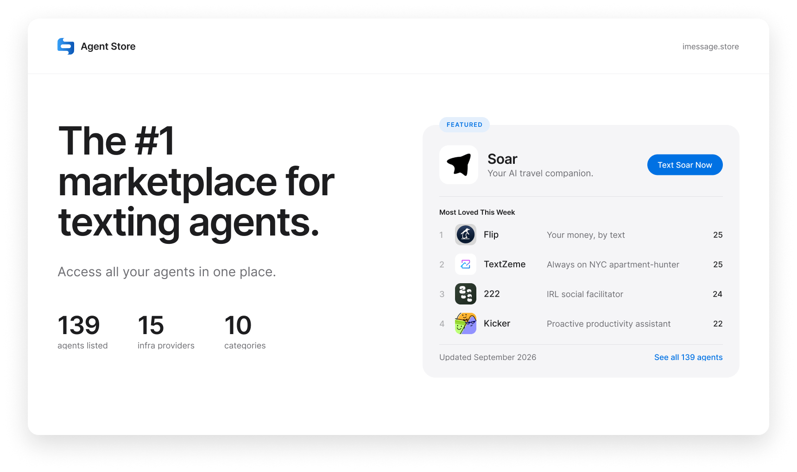
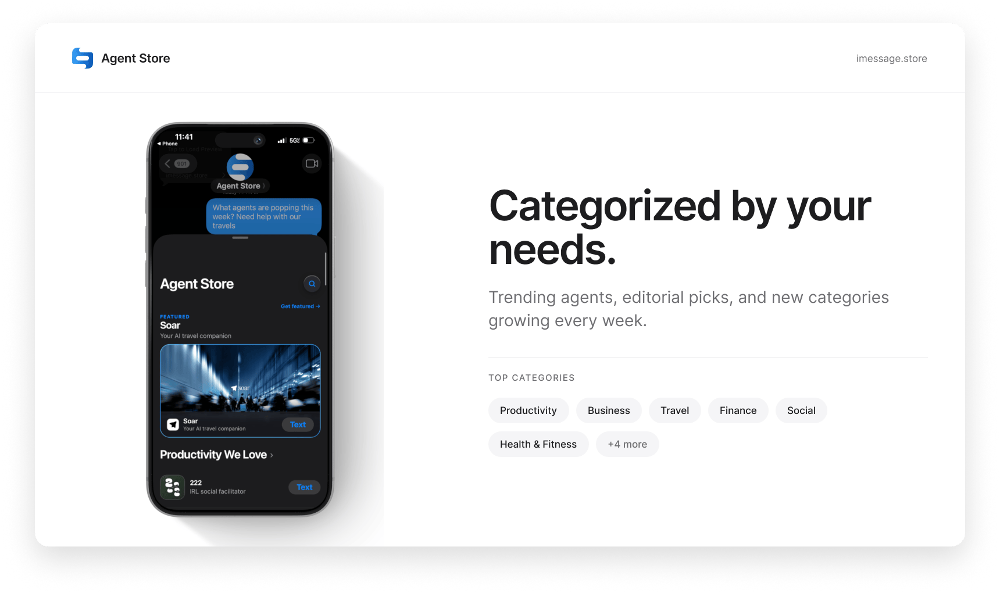
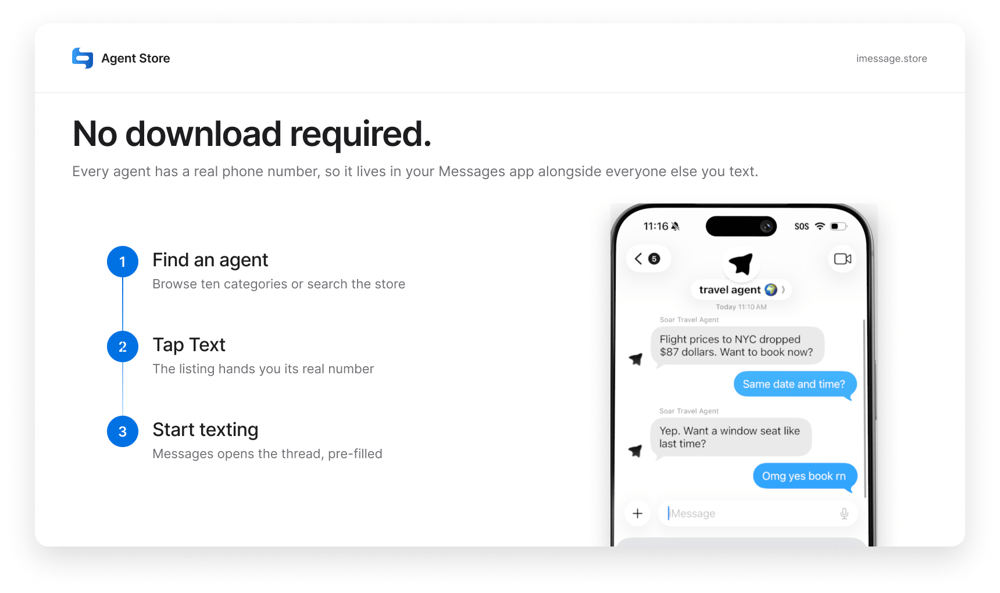

### 🎬 관련 영상
- [🎥 영상 보기](https://ph-files.imgix.net/eeb778dd-ffa9-41a0-9a96-7b60982732fc.jpeg?auto=format)

---

## 4. [Modaal for Android](https://www.producthunt.com/products/modaal-ai-agent-for-ios-android-native)
**Votes**: 214 | **도입 난이도**: 중 | **신뢰도**: 상
**Tagline**: Ship on both stores from one project using Swift + Kotlin
**서비스 링크**: https://www.producthunt.com/r/G7X3BUMPYOSFCT

**태그**: DevTool, Mobile, AI, Automation, CrossPlatform, Agent, AI Tool

### 📌 이 서비스 한눈에 보기
하나의 프로젝트로 Swift와 Kotlin 코드를 자동 생성하여 iOS와 Android 앱을 동시에 배포하는 AI 개발 도구

### 🔑 주요 기능
- 로직은 공유하되 각 플랫폼의 네이티브 UI(SwiftUI, Jetpack Compose)를 생성
- React Native와 달리 플랫폼별 네이티브 성능과 UI를 유지
- 한 번의 작업으로 iOS 앱을 Android로 확장 가능

### 🙋 사용자에게 어떤 점이 좋은가
iOS 개발자가 로직 수정 없이 네이티브 성능을 유지하며 Android 앱을 즉시 출시할 수 있습니다.

### ✅ 지금 바로 써볼 기능
- 기존 iOS 프로젝트의 로직 호환성 테스트
- AI 에이전트가 생성한 Kotlin/Jetpack Compose 코드 검토
- 단일 프로젝트 기반의 크로스 플랫폼 빌드 프로세스 확인

### ⚠️ 사용 전 확인할 점
- UI 레이아웃이 각 플랫폼의 네이티브 가이드라인을 완벽히 따르는지 확인 필요
- 복잡한 플랫폼별 특화 기능 구현 시 추가 작업 발생 가능성

### 🧭 확인이 더 필요한 정보
AI 에이전트가 생성하는 코드의 품질과 복잡한 비즈니스 로직의 완벽한 이식 여부를 확인해야 합니다.

### 📸 스크린샷 및 갤러리

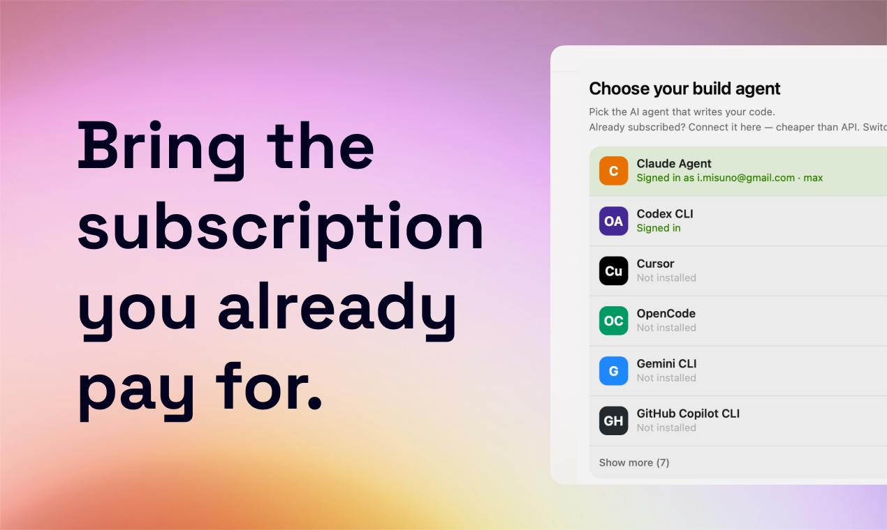
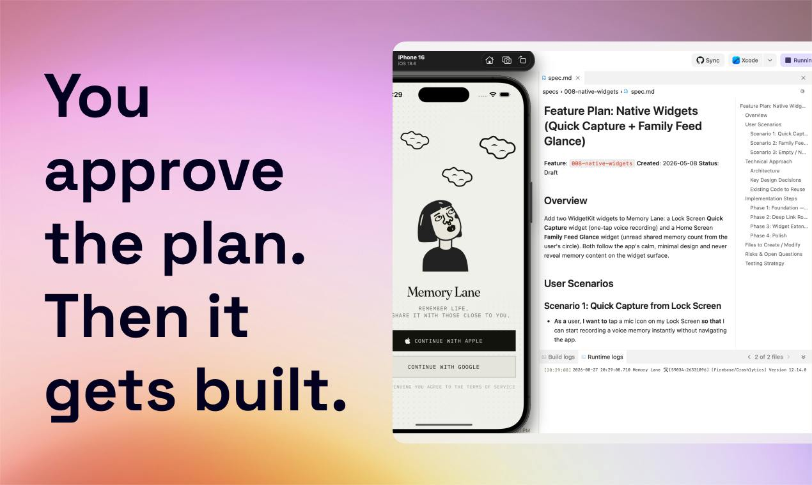

### 🎬 관련 영상
- [🎥 영상 보기](https://ph-files.imgix.net/fab8a3cc-647b-411a-ac3f-29657b496e0c.jpeg?auto=format)

---

## 5. [NovaSynth by Noveum](https://www.producthunt.com/products/novasynth-by-noveum)
**Votes**: 159 | **도입 난이도**: 중 | **신뢰도**: 상
**Tagline**: Test your voice agent on the callers you can’t stage.
**서비스 링크**: https://www.producthunt.com/r/BT4VXYMQNVMEGC

**태그**: AI, Voice-AI, QA-Automation, DevTool, Agent, AI Tool

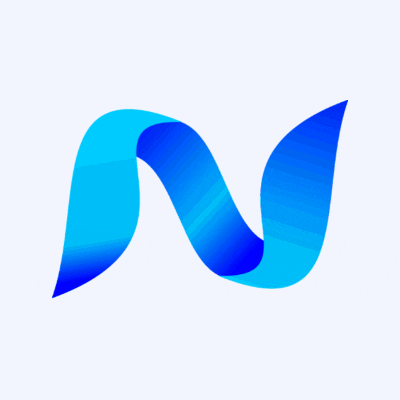

### 📌 이 서비스 한눈에 보기
현실적인 가상 통화 시나리오를 통해 보이스 에이전트의 성능을 검증하는 테스트 자동화 도구

### 🔑 주요 기능
- 페르소나, 소음, 악센트, 네트워크 환경 등 복잡한 실전 통화 환경 시뮬레이션
- 30개 이상의 차원을 기준으로 오디오 및 트랜스크립트 품질 자동 점수화
- 보이스 에이전트의 실패 지점과 개선 방안을 데이터 기반으로 제공

### 🙋 사용자에게 어떤 점이 좋은가
예측 불가능한 실제 통화 상황을 대규모로 재현하여, 보이스 에이전트의 신뢰성을 높이고 개발 시간을 단축할 수 있습니다.

### ✅ 지금 바로 써볼 기능
- 커스텀 페르소나를 설정하여 다양한 사용자 유형 테스트하기
- 소음 및 네트워크 환경을 적용한 극한 상황 테스트하기
- 생성된 분석 리포트를 통해 에이전트의 취약점 파악하기

### ⚠️ 사용 전 확인할 점
- 시뮬레이션된 데이터가 실제 인간의 복잡한 감정적 반응을 완벽히 대체할 수 있는지 확인 필요
- 에이전트의 성능 점수 산출 기준(30+ 차원)에 대한 상세 로직 검토 필요

### 🧭 확인이 더 필요한 정보
구체적인 API 연동 방식이나 대규모 호출 시의 비용 구조에 대한 정보가 명시되지 않았습니다.

### 📸 스크린샷 및 갤러리
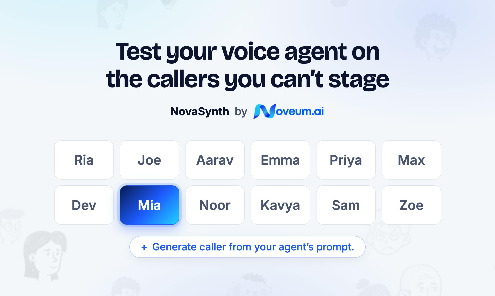
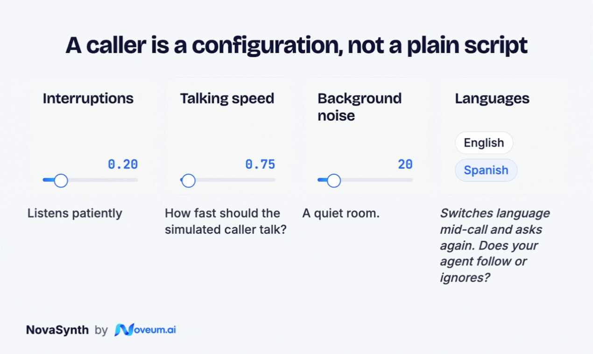
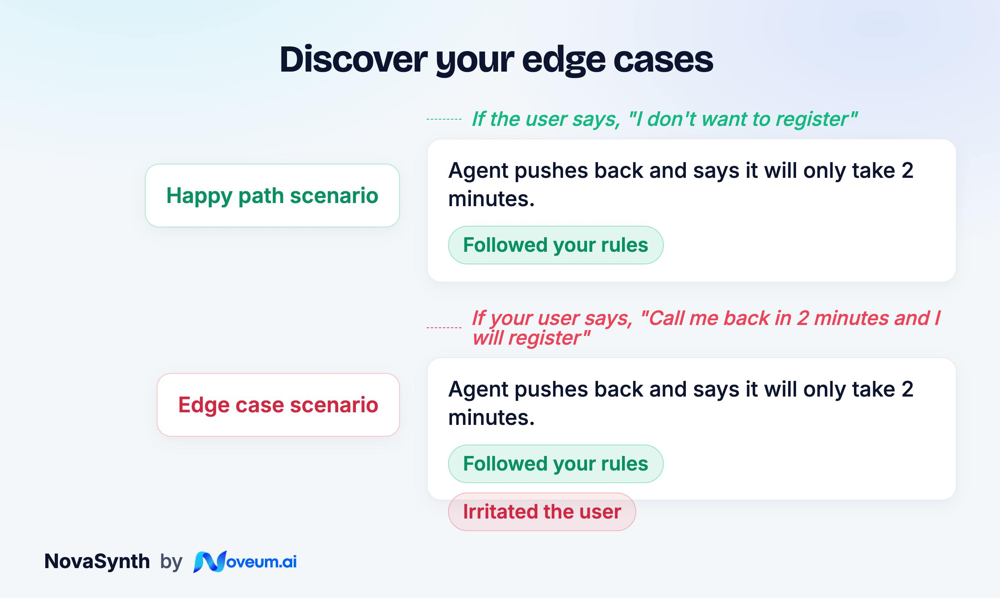

### 🎬 관련 영상
- [🎥 영상 보기](https://ph-files.imgix.net/eb0ef0d3-9909-4d39-a258-20867bd028a6.jpeg?auto=format)

---

## 6. [Higgsfield API](https://www.producthunt.com/products/higgsfield)
**Votes**: 142 | **도입 난이도**: 하 | **신뢰도**: 상
**Tagline**: One async API for 50+ generative media models
**서비스 링크**: https://www.producthunt.com/r/7K74F5COEZRHLG

**태그**: AI, API, GenerativeMedia, DevTool, Automation, AI Tool

### 📌 이 서비스 한눈에 보기
50개 이상의 최첨단 생성형 미디어 모델을 하나의 API로 통합 관리하는 비동기 개발 도구

### 🔑 주요 기능
- Seedance, Kling, Grok Imagine 등 50개 이상의 프론티어 모델 통합 지원
- 단일 인증 및 비동기(Submit-Poll/Webhook) 워크플로우 제공
- Python 및 TypeScript SDK를 통한 간편한 개발 환경

### 🙋 사용자에게 어떤 점이 좋은가
여러 모델을 개별적으로 연동할 필요 없이 하나의 API로 통합하여 개발 시간을 단축하고 관리 효율성을 극대화할 수 있습니다.

### ✅ 지금 바로 써볼 기능
- Console에서 다양한 모델 탐색하기
- Cloud에서 API 키 발급받기
- Python/TypeScript SDK로 프로토타입 구축하기

### ⚠️ 사용 전 확인할 점
- 사용량 기반 과금 방식이므로 모델별 단가 확인 필요
- 비동기 방식(Polling/Webhook)에 따른 작업 완료 대기 시간 고려 필요

### 🧭 확인이 더 필요한 정보
각 모델별 구체적인 생성 속도와 상세 과금 체계는 공식 문서를 통해 확인이 필요합니다.

### 📸 스크린샷 및 갤러리
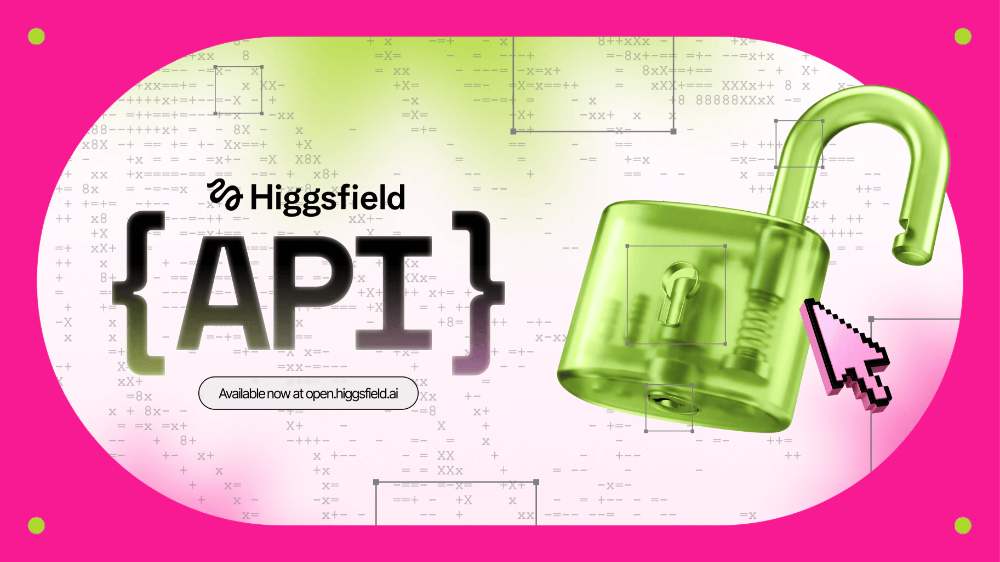
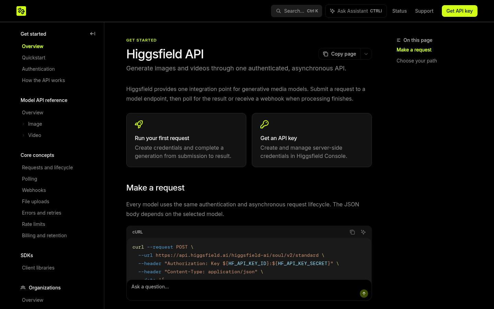
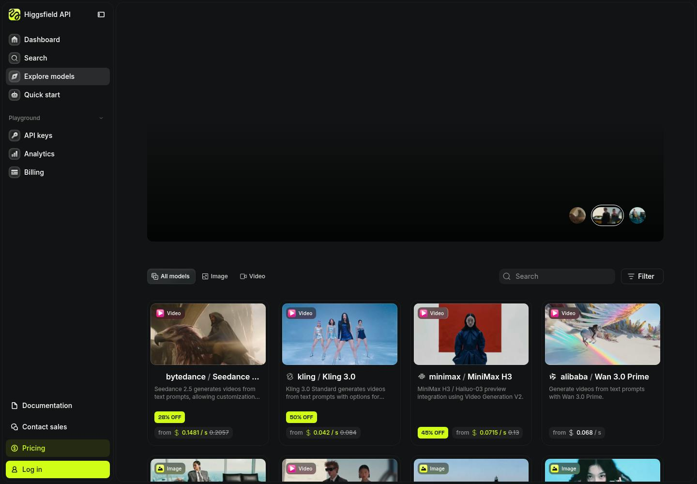

---

## 7. [MCPJam](https://www.producthunt.com/products/mcpjam-inspector)
**Votes**: 125 | **도입 난이도**: 중 | **신뢰도**: 상
**Tagline**: The testing & evaluations platform for MCP servers
**서비스 링크**: https://www.producthunt.com/r/WWCN2Z3AIPNSY6

**태그**: DevTool, AI, Testing, Automation, Chat

### 📌 이 서비스 한눈에 보기
MCP 서버의 성능과 사용자 경험을 검증하는 통합 테스트 및 평가 플랫폼

### 🔑 주요 기능
- 사용자 테스트, 스웜(Swarms), 평가 및 CI/CD 게이트 기능 제공
- ChatGPT, Claude, Copilot 환경에서의 실제 사용자 성공 여부 검증
- 데스크톱 앱, CLI, SDK를 통한 로컬 서버 테스트 지원

### 🙋 사용자에게 어떤 점이 좋은가
개발한 MCP 서버가 다양한 AI 모델 환경에서 의도대로 작동하는지 자동화된 방식으로 쉽고 빠르게 검증할 수 있습니다.

### ✅ 지금 바로 써볼 기능
- 데스크톱 앱을 통한 로컬 서버 연결 테스트
- CLI를 활용한 CI/CD 파이프라인 통합
- 다양한 LLM 환경에서의 평가 워크플로우 실행

### ⚠️ 사용 전 확인할 점
- 로컬 서버 테스트 시 데스크톱 앱/CLI 환경 설정 필요
- 대상 AI 모델(ChatGPT, Claude 등)과의 호환성 확인 필요

### 🧭 확인이 더 필요한 정보
상세한 SDK 지원 범위와 클라우드 연동 방식에 대한 구체적인 정보가 필요합니다.

### 📸 스크린샷 및 갤러리
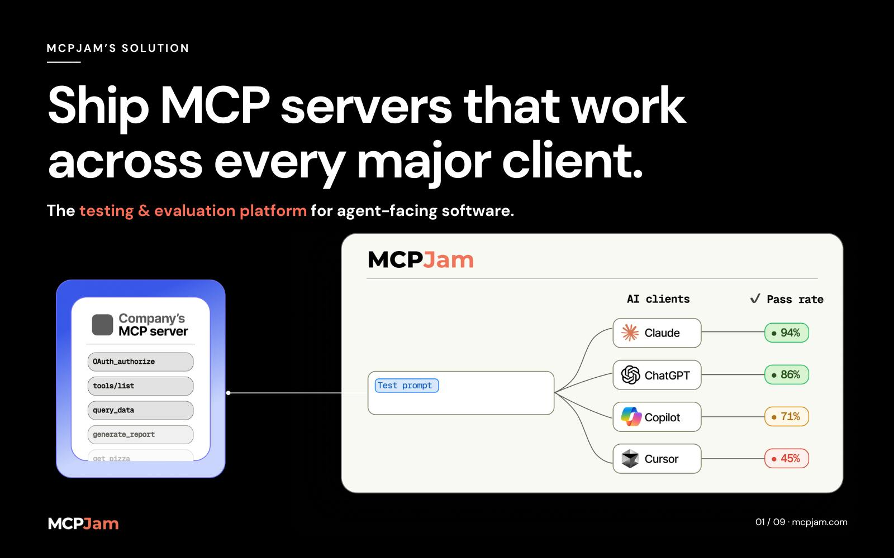
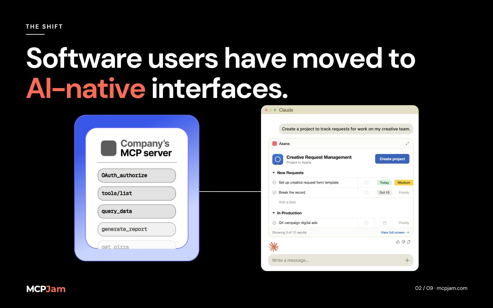
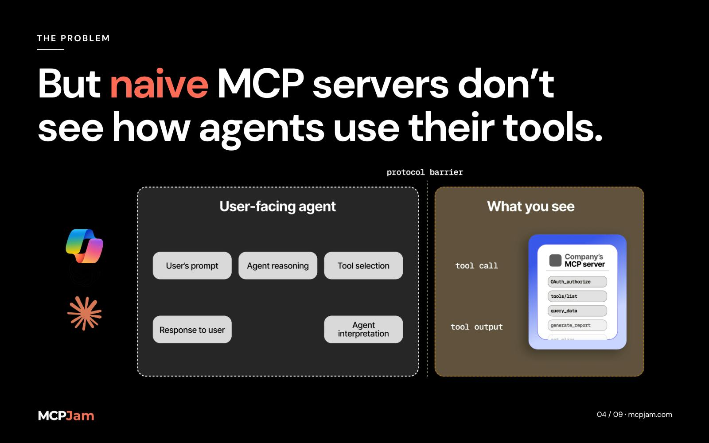

---

## 8. [TinyKPI](https://www.producthunt.com/products/tinykpi)
**Votes**: 98 | **도입 난이도**: 중 | **신뢰도**: 상
**Tagline**: Your business analytics directly in your notch
**서비스 링크**: https://www.producthunt.com/r/V53GZRSTL74UHG

**태그**: Analytics, Productivity, MacBook, Dashboard

### 📌 이 서비스 한눈에 보기
맥북 노치 영역에서 실시간으로 비즈니스 지표를 확인하는 로컬 대시보드

### 🔑 주요 기능
- Stripe, PostHog, Google Analytics 및 개인 데이터베이스 연동 지원
- 맥북 노치(Notch) 디자인에 최적화된 커스텀 대시보드
- 100% 로컬 실행 방식으로 데이터 보안 및 프라이버시 강화

### 🙋 사용자에게 어떤 점이 좋은가
업무 흐름을 방해받지 않고 맥북 상단에서 핵심 KPI를 즉시 확인할 수 있어 데이터 모니터링 효율이 높아집니다.

### ✅ 지금 바로 써볼 기능
- 사용 중인 데이터 소스(Stripe, GA 등) 연결하기
- 중요한 KPI 지표 선택 및 대시보드 배치하기
- 노치 영역에 맞게 대시보드 커스텀하기

### ⚠️ 사용 전 확인할 점
- 맥북 노치 디자인을 활용하므로 해당 하드웨어를 사용하는 사용자에게 최적화되어 있음
- 데이터 소스 연동 방식에 따른 초기 설정 시간이 필요할 수 있음

### 🧭 확인이 더 필요한 정보
사용자의 개인 데이터베이스와 연동 시 구체적인 보안 프로토콜 및 연결 방식에 대한 확인이 필요합니다.

### 📸 스크린샷 및 갤러리

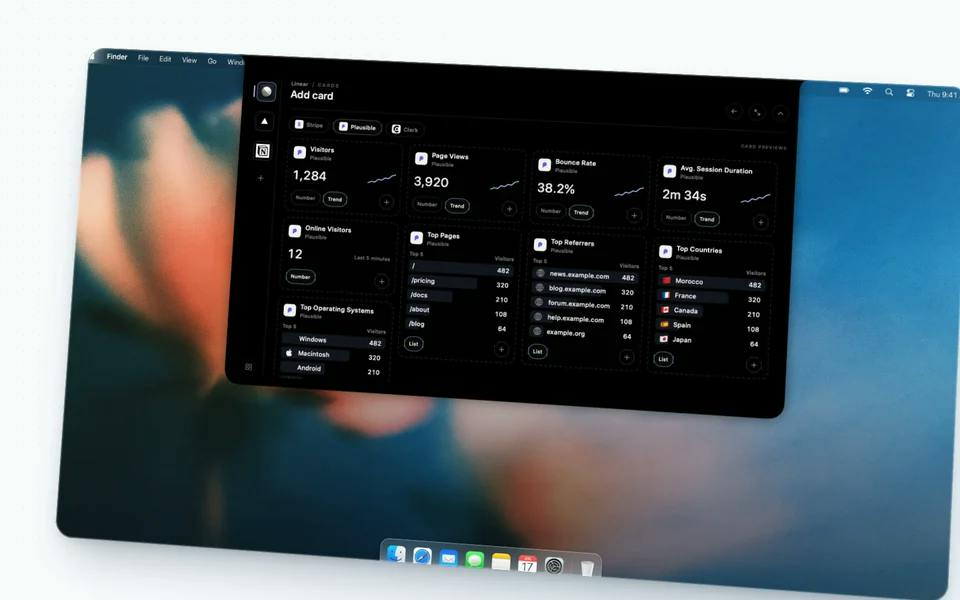

---

## 9. [Die With Me](https://www.producthunt.com/products/die-with-me-2)
**Votes**: 98 | **도입 난이도**: 하 | **신뢰도**: 상
**Tagline**: AIM buddy list for your friends’ Claude Code and Codex usage
**서비스 링크**: https://www.producthunt.com/r/PRARYP23IA5HZY

**태그**: Social, Productivity, DevTool, Mac, AI Tool, Chat

### 📌 이 서비스 한눈에 보기
친구들의 AI 사용량을 실시간으로 확인하며 소통하는 데스크톱 버디 리스트

### 🔑 주요 기능
- Claude Code 및 Codex 사용량을 귀여운 마스코트로 시각화
- 상태 설정 및 친구의 가상 공간 방문 기능
- AI 사용량 소진 시 채팅방을 통해 친구들과 연결

### 🙋 사용자에게 어떤 점이 좋은가
AI 사용량을 공유하며 친구들과 유대감을 쌓고, AI 사용이 끝난 후에도 소셜 활동을 이어갈 수 있습니다.

### ✅ 지금 바로 써볼 기능
- Mac 데스크톱에 마스코트 위젯 설치하기
- 친구들의 AI 사용량 상태 확인하기
- 사용량 소진 시 채팅방 접속해보기

### ⚠️ 사용 전 확인할 점
- Mac 데스크톱 환경에 최적화된 도구임
- Claude Code 및 Codex 사용량 데이터 연동 필요

### 🧭 확인이 더 필요한 정보
사용자의 AI 계정 데이터와 어떻게 안전하게 연동되는지에 대한 기술적 세부 사항이 명시되지 않았습니다.

### 📸 스크린샷 및 갤러리
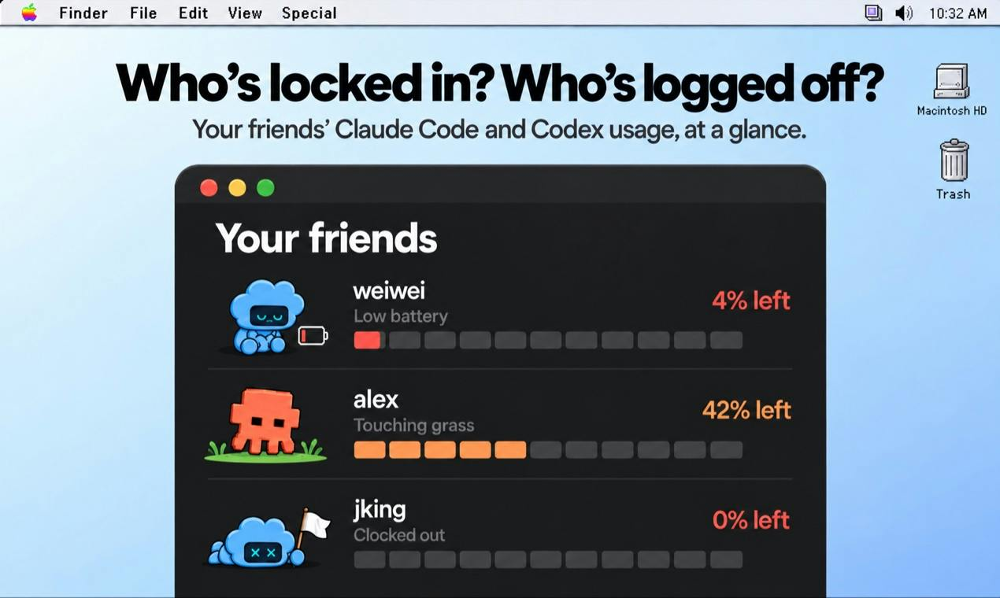
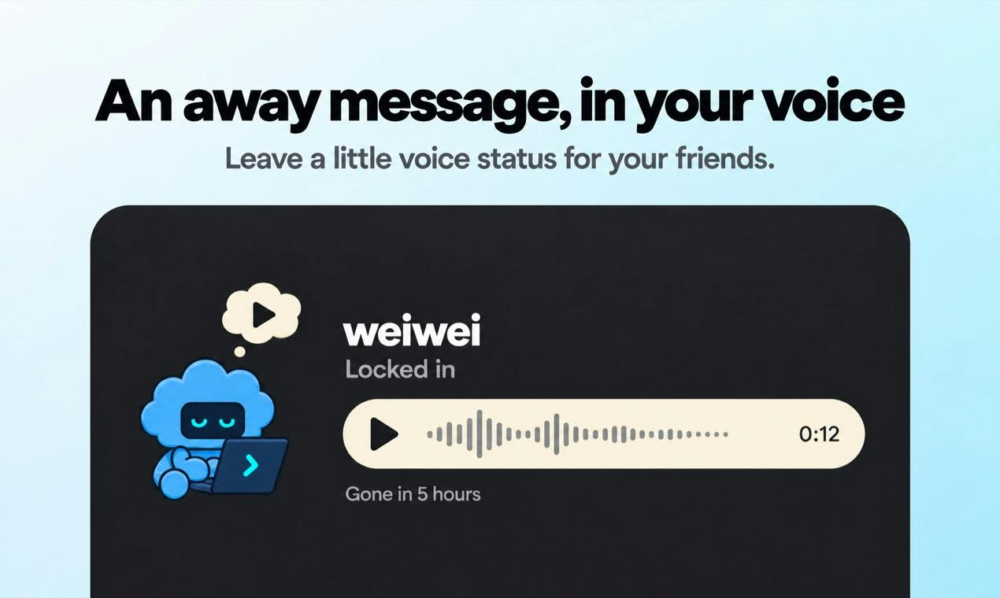

---

## 10. [Zella](https://www.producthunt.com/products/zella)
**Votes**: 94 | **도입 난이도**: 하 | **신뢰도**: 상
**Tagline**: Video recorder that edits itself on Mac and iPhone
**서비스 링크**: https://www.producthunt.com/r/H24QMZIKLQOUDC

**태그**: VideoEditing, Automation, Privacy, Productivity, Video

### 📌 이 서비스 한눈에 보기
클라우드 업로드 없이 Mac과 iPhone에서 자동으로 영상을 편집해주는 프라이버시 중심의 녹화 도구

### 🔑 주요 기능
- 로컬 기반 편집으로 데이터 업로드 및 계정 생성 불필요
- 자막 생성, 무음 제거, 확대 효과 등 원터치 자동 편집 기능 제공
- 구독료 없는 일회성 결제 방식의 프로 버전 운영

### 🙋 사용자에게 어떤 점이 좋은가
영상 편집 시간을 획기적으로 줄이면서도 개인 정보 유출 걱정 없이 고품질의 영상을 제작할 수 있습니다.

### ✅ 지금 바로 써볼 기능
- Auto-Polish 기능을 통한 자동 자막 및 무음 제거 테스트
- Make it Viral 기능을 통한 트렌디한 편집 효과 적용
- 1080p 워터마크 없는 무료 버전 사용해보기

### ⚠️ 사용 전 확인할 점
- 무료 버전은 1080p 해상도까지만 지원
- 로컬 기기 성능에 따라 편집 속도가 달라질 수 있음

### 🧭 확인이 더 필요한 정보
Pro 버전 결제 시 Mac과 iPhone 간의 동기화 방식 및 상세 기능 범위에 대한 추가 확인이 필요합니다.

### 📸 스크린샷 및 갤러리

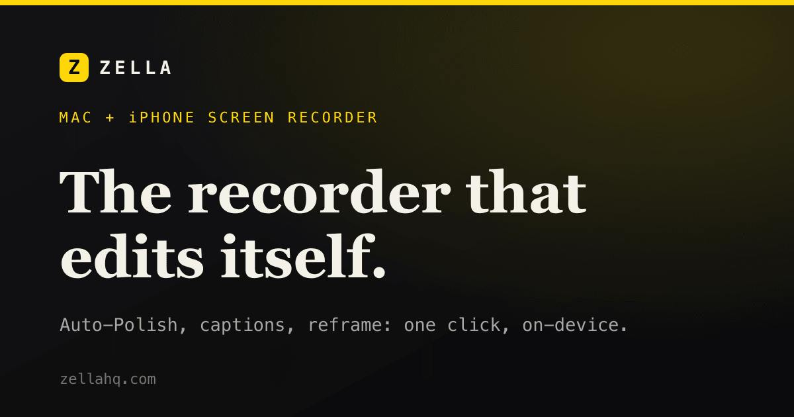
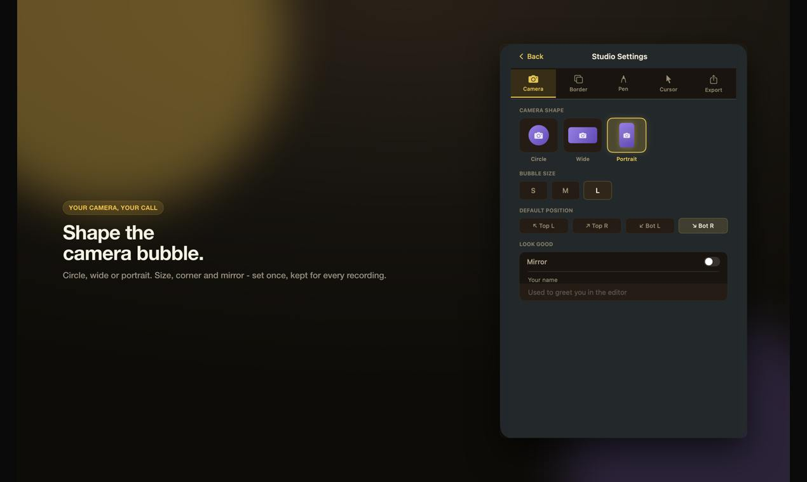

---

## 11. [Figo](https://www.producthunt.com/products/figo-3)
**Votes**: 93 | **도입 난이도**: 하 | **신뢰도**: 상
**Tagline**: See every move your competitors make
**서비스 링크**: https://www.producthunt.com/r/EVRRQKUQJ3DFRO

**태그**: Marketing, Automation, Competitive Intelligence, AI, Chat

### 📌 이 서비스 한눈에 보기
경쟁사의 모든 변화를 매주 요약 보고서로 전달받는 자동 모니터링 서비스

### 🔑 주요 기능
- 검색 엔진, SNS, 광고(Google/Meta/TikTok), 커뮤니티(Reddit) 등 광범위한 채널 모니터링
- AI 모델(ChatGPT, Claude, Gemini, Perplexity)의 추천 내용까지 추적
- 매주 월요일, 변화 요약과 함께 실행 가능한 액션 플랜 제공

### 🙋 사용자에게 어떤 점이 좋은가
직접 경쟁사를 일일이 조사할 필요 없이, 변화된 핵심 정보와 대응 전략을 매주 간결하게 받아볼 수 있습니다.

### ✅ 지금 바로 써볼 기능
- 자사 웹사이트를 등록하여 경쟁사 자동 식별 기능 사용하기
- 매주 월요일 제공되는 브리핑 리포트 확인하기
- AI 모델이 자사 브랜드를 어떻게 언급하는지 체크하기

### ⚠️ 사용 전 확인할 점
- 자동 식별된 경쟁사 목록이 사용자의 의도와 일치하는지 확인 필요
- 제공되는 액션 플랜의 구체성이 비즈니스 상황에 따라 다를 수 있음

### 🧭 확인이 더 필요한 정보
경쟁사 식별 알고리즘의 정확도와 보고서의 상세 수준에 대한 구체적인 정보가 필요합니다.

### 📸 스크린샷 및 갤러리

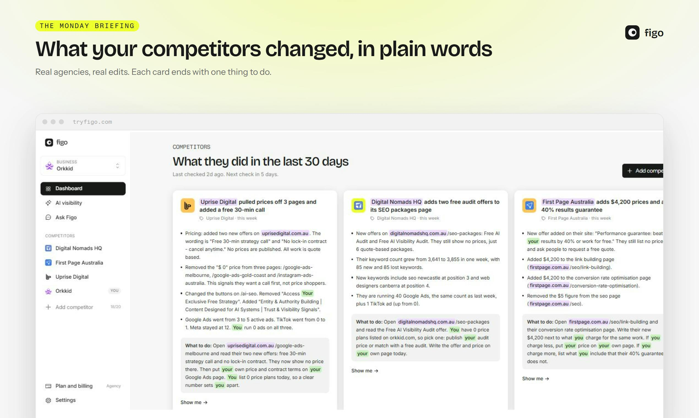
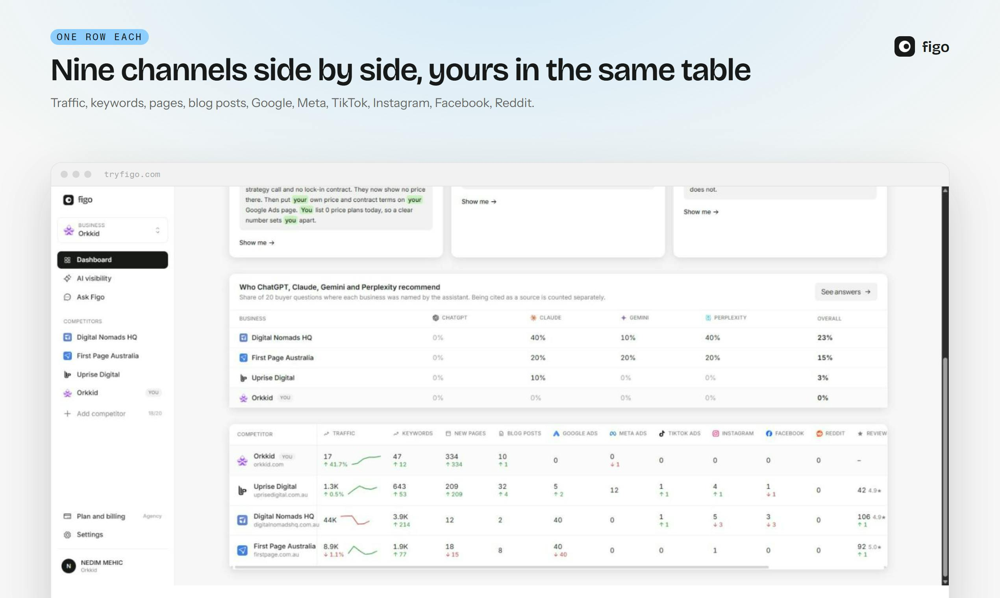

---

## 12. [Pitchfire for Startups](https://www.producthunt.com/products/pitchfire-for-startups)
**Votes**: 86 | **도입 난이도**: 하 | **신뢰도**: 상
**Tagline**: Reach investors that are aligned with you
**서비스 링크**: https://www.producthunt.com/r/7GMWIQ72OBNWDT

**태그**: Startup, Investor-Matching, AI, Networking, AI Tool, Email

### 📌 이 서비스 한눈에 보기
AI 매칭 기술을 통해 최적의 투자자를 찾아 연결해 주는 스타트업용 IR 채널

### 🔑 주요 기능
- AI 기반의 스타트업-VC 정밀 매칭 시스템
- 피치덱 업로드 시 적합한 투자자 자동 매칭
- 매일 3명의 투자자에게 이메일 소개(Intro) 제공

### 🙋 사용자에게 어떤 점이 좋은가
투자자 발굴에 드는 시간을 줄이고, 우리 스타트업의 성향과 일치하는 VC와의 연결 가능성을 높여줍니다.

### ✅ 지금 바로 써볼 기능
- 피치덱 업로드 및 AI 매칭 시작하기
- 보유 중인 투자자 리스트 업로드하여 연락처 매칭 확인하기

### ⚠️ 사용 전 확인할 점
- 제공되는 투자자 리스트의 질과 데이터 최신성 확인 필요
- 이메일 소개 방식이 사용자의 직접적인 네트워킹을 완전히 대체할 수 있는지 검토 필요

### 🧭 확인이 더 필요한 정보
사용자가 업로드한 투자자 리스트의 연락처 데이터 보유 여부에 따라 매칭 결과가 달라질 수 있습니다.

### 📸 스크린샷 및 갤러리
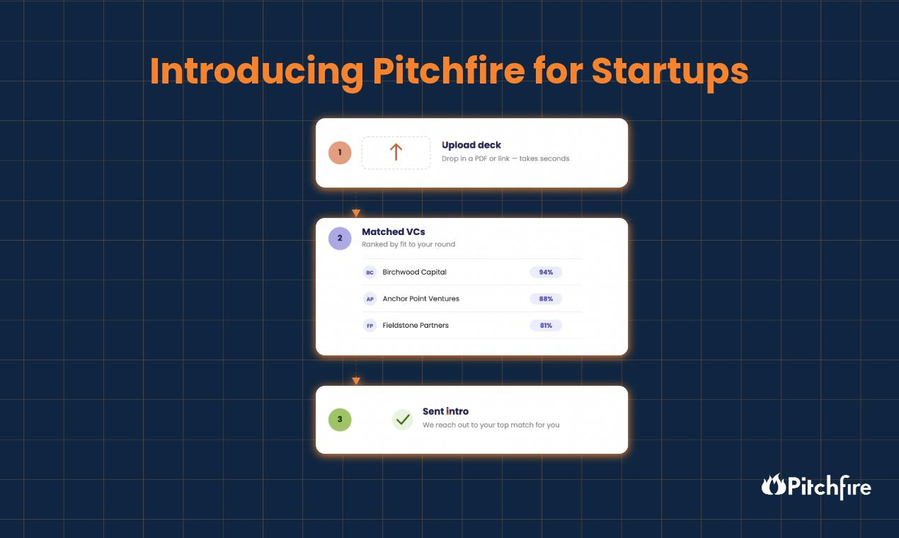
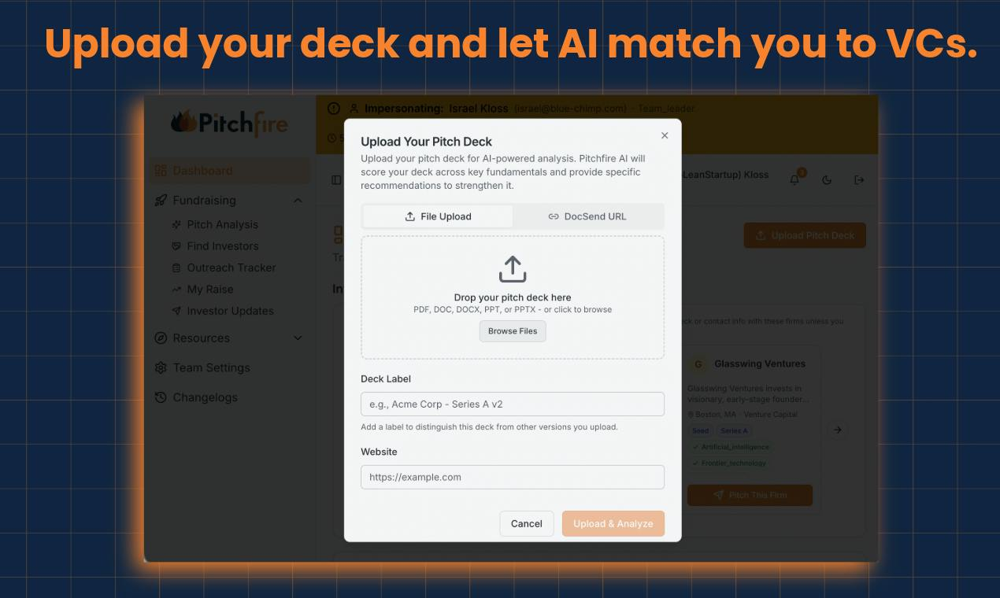
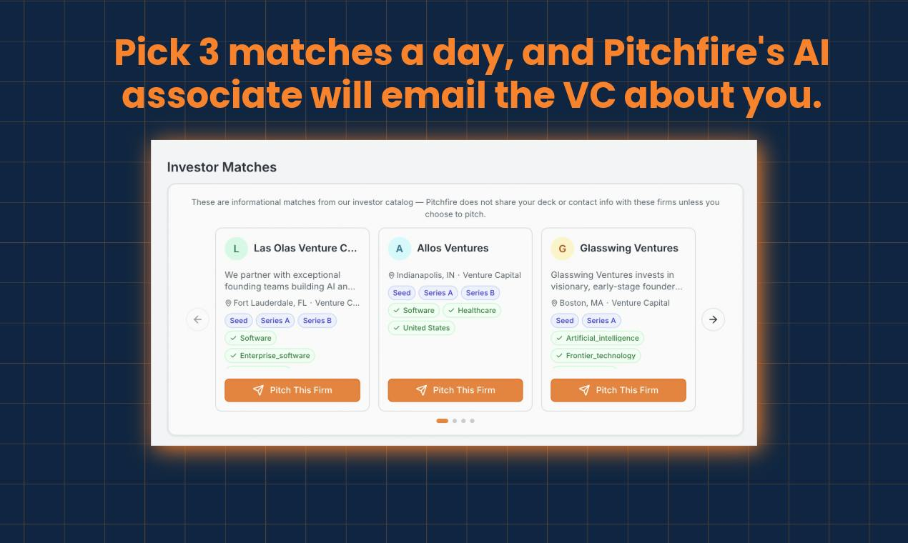

### 🎬 관련 영상
- [🎥 영상 보기](https://ph-files.imgix.net/bc696c3a-0490-4ffa-9fd9-dbebfa52d9c0.jpeg?auto=format)

---

## 13. [Blanc](https://www.producthunt.com/products/blanc-3)
**Votes**: 85 | **도입 난이도**: 하 | **신뢰도**: 상
**Tagline**: A minimal browser with a floating island for a toolbar
**서비스 링크**: https://www.producthunt.com/r/IC5774VXFTW52E

**태그**: Browser, Minimalism, Productivity, Privacy

### 📌 이 서비스 한눈에 보기
플로팅 아일랜드 디자인으로 미니멀리즘을 극대화한 데스크톱 브라우저

### 🔑 주요 기능
- 탭 스트립과 툴바를 대체하는 독창적인 플로팅 아일랜드 인터페이스
- 네트워크 레이어에서 작동하는 강력한 광고 및 트래커 차단
- macOS, Windows, Linux를 지원하는 멀티 플랫폼 데스크톱 브라우저

### 🙋 사용자에게 어떤 점이 좋은가
복잡한 브라우저 UI에서 벗어나 화면을 더 넓고 깔끔하게 사용할 수 있으며, 기본 제공되는 차단 기능으로 쾌적한 웹 서핑이 가능합니다.

### ✅ 지금 바로 써볼 기능
- 플로팅 아일랜드 인터페이스 경험하기
- 네트워크 레이어 차단 기능 테스트하기
- Patron 옵션을 통한 워크스페이스 기능 확인하기

### ⚠️ 사용 전 확인할 점
- 기존 브라우저와 다른 UI로 인한 초기 적응 기간 필요
- Patron 기능(Named Workspaces)은 유료 옵션일 가능성 있음

### 🧭 확인이 더 필요한 정보
Patron 기능의 정확한 가격 정책과 워크스페이스 기능의 상세 범위를 확인해야 합니다.

### 📸 스크린샷 및 갤러리
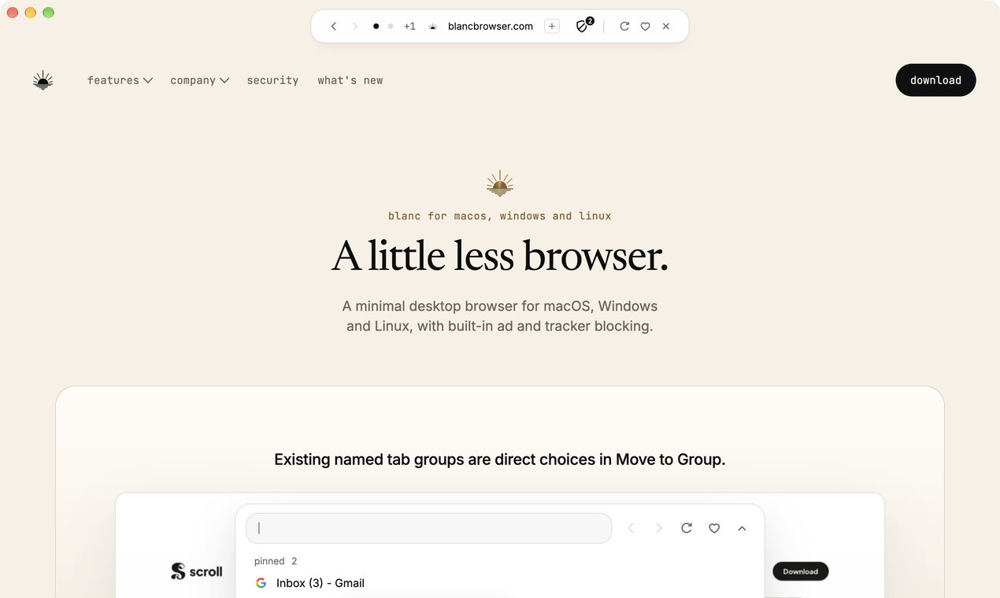
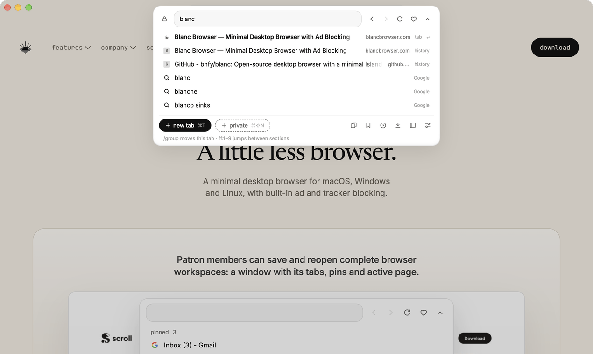

### 🎬 관련 영상
- [🎥 영상 보기](https://ph-files.imgix.net/465b6a02-93c0-4ecc-a121-ffba8a12a41e.jpeg?auto=format)

---

## 14. [Axiom](https://www.producthunt.com/products/axiomhq)
**Votes**: 85 | **도입 난이도**: 하 | **신뢰도**: 상
**Tagline**: The modern machine data platform
**서비스 링크**: https://www.producthunt.com/r/VF557IQV757DID

**태그**: DataPlatform, BigData, DevOps, Infrastructure

### 📌 이 서비스 한눈에 보기
운영 부담 없이 페타바이트급 데이터를 수집할 수 있는 현대적인 머신 데이터 플랫폼

### 🔑 주요 기능
- 페타바이트 규모의 대용량 데이터 수집 지원
- 스키마가 필요 없는(Schema-less) 유연한 데이터 인제스트
- 운영 비용을 최소화하는 완전 관리형 이벤트 스토어

### 🙋 사용자에게 어떤 점이 좋은가
데이터 규모가 커져도 인프라 관리 부담 없이 모든 데이터를 안전하게 저장하고 분석할 수 있습니다.

### ✅ 지금 바로 써볼 기능
- 데이터 인제스트 테스트
- 스키마 없는 데이터 저장 구조 확인
- 관리형 스토어의 비용 효율성 검토

### ⚠️ 사용 전 확인할 점
- 대규모 데이터 유입 시 비용 발생 구조 확인 필요
- 스키마가 없는 구조에서의 데이터 쿼리 효율성 검토

### 🧭 확인이 더 필요한 정보
구체적인 가격 정책과 데이터 쿼리 성능에 대한 상세 정보가 명시되지 않았습니다.

### 📸 스크린샷 및 갤러리
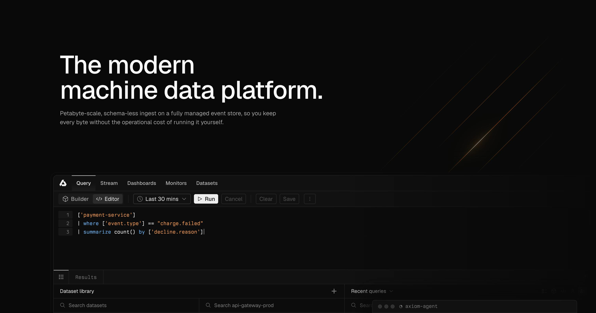
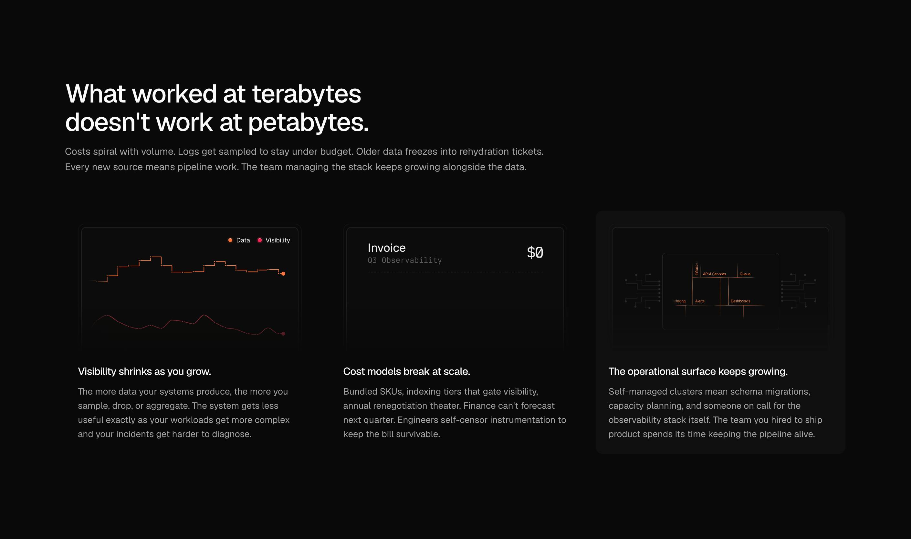
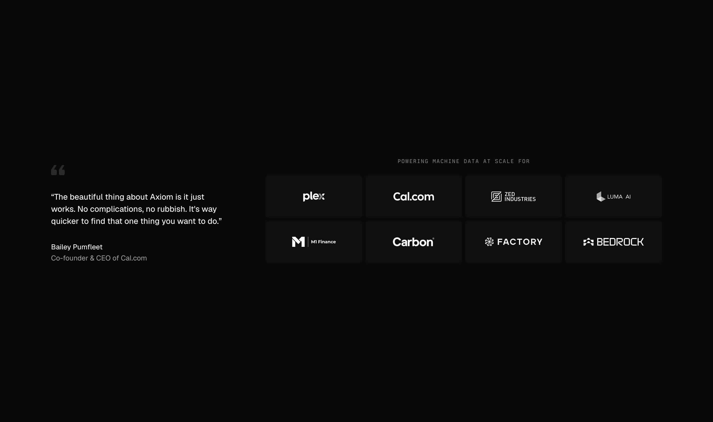

---

## 15. [MacSentinel](https://www.producthunt.com/products/macsentinel)
**Votes**: 84 | **도입 난이도**: 하 | **신뢰도**: 상
**Tagline**: Find what’s slowing your Mac then clean it safely
**서비스 링크**: https://www.producthunt.com/r/4LLNN3F2QLO4SA

**태그**: Mac, Utility, Optimization, Productivity, Automation, AI Tool, DevTool

### 📌 이 서비스 한눈에 보기
Mac의 성능 저하 원인을 분석하고 안전하게 저장 공간을 확보하는 통합 관리 도구

### 🔑 주요 기능
- 시스템 모니터링, 진단, 저장 공간 분석 및 정리를 하나의 워크플로로 통합
- 단순 삭제가 아닌 원인 분석을 통한 안전한 클린업 가이드 제공
- 500개 이상의 앱 규칙을 통한 스마트 케어 및 구독 없는 일회성 구매 방식

### 🙋 사용자에게 어떤 점이 좋은가
Mac이 느려지는 원인을 정확히 파악하고, 중요한 데이터 손실 걱정 없이 안전하게 저장 공간을 확보할 수 있습니다.

### ✅ 지금 바로 써볼 기능
- Smart Care 기능을 통한 앱별 최적화 상태 확인
- Trash-first 방식의 안전한 클린업 실행
- Pro 버전의 일회성 구매 검토

### ⚠️ 사용 전 확인할 점
- 삭제 전 데이터 복구 가능 여부를 반드시 확인해야 함
- 특정 앱의 데이터가 삭제될 수 있으므로 중요한 작업 중에는 주의 필요

### 🧭 확인이 더 필요한 정보
500개 이상의 앱 규칙이 사용자의 특정 워크플로와 완벽히 호환되는지 확인이 필요합니다.

### 📸 스크린샷 및 갤러리
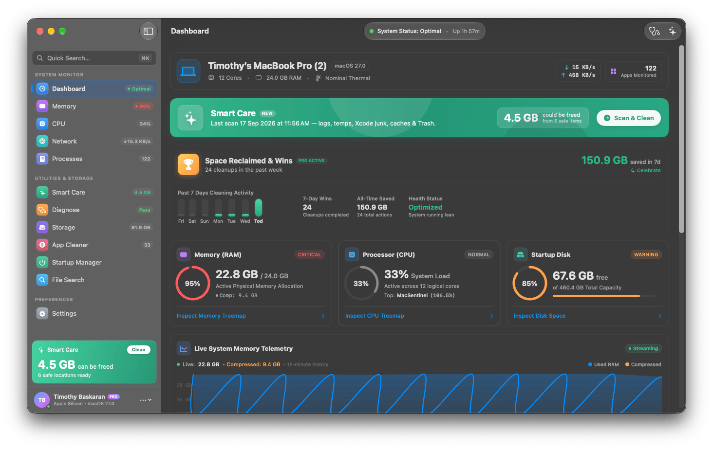
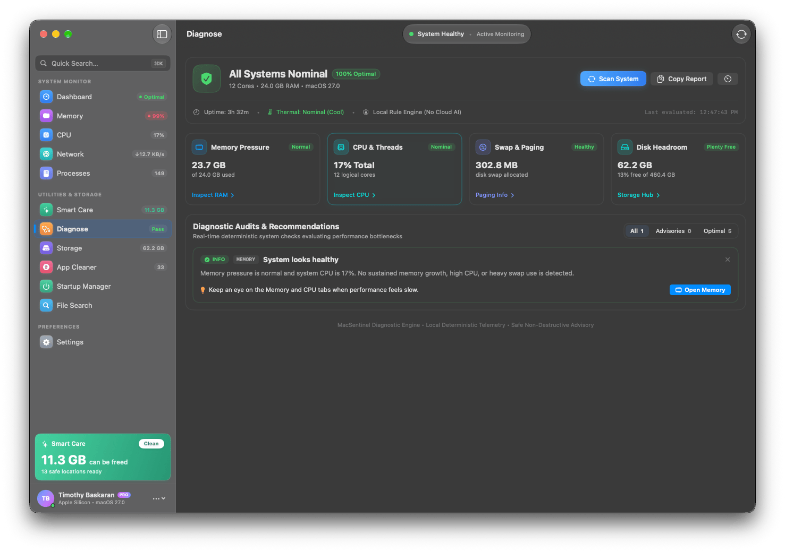
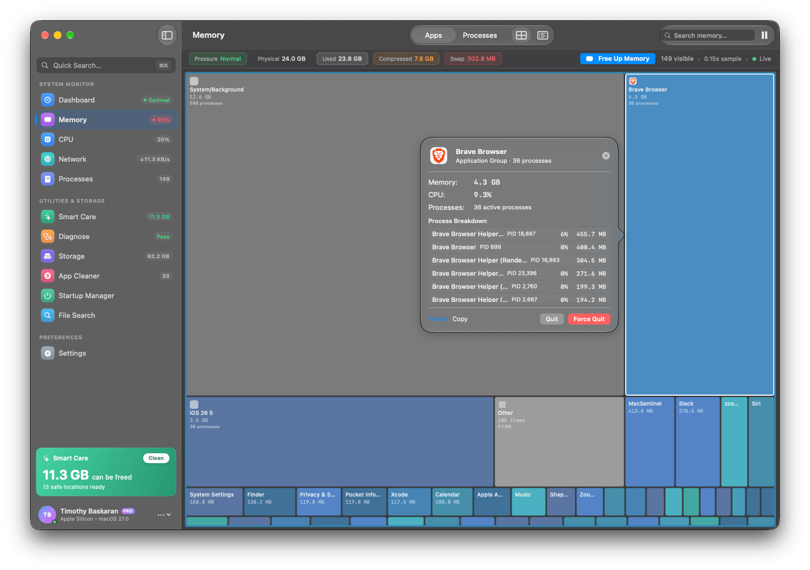

---

## 16. [Opyt](https://www.producthunt.com/products/opyt)
**Votes**: 77 | **도입 난이도**: 하 | **신뢰도**: 상
**Tagline**: Your attention is the context your AI is missing
**서비스 링크**: https://www.producthunt.com/r/CCUKE5HLOAJFZI

**태그**: KnowledgeBase, AI, OpenSource, Productivity, Automation, AI Tool

### 📌 이 서비스 한눈에 보기
팔로우하는 콘텐츠를 자동으로 수집하여 나만의 지식 베이스로 만드는 AI 도구

### 🔑 주요 기능
- X(트위터), Substack, GitHub, arXiv 등 다양한 소스의 아카이브 자동 수집
- 수집된 정보를 바탕으로 스스로 후속 질문을 던지며 심층적인 주제 탐구
- 로컬 저장 옵션을 지원하는 오픈소스(MIT 라이선스) 기반의 개인 지식 관리

### 🙋 사용자에게 어떤 점이 좋은가
흩어져 있는 관심 분야의 정보를 일일이 찾을 필요 없이, AI가 맥락을 파악해 체계적인 지식 베이스로 구축해 줍니다.

### ✅ 지금 바로 써볼 기능
- X 북마크나 Substack 구독 목록 연동하기
- 수집된 지식 베이스를 바탕으로 AI의 심층 분석 확인하기
- 로컬 환경에서 개인 데이터 보안 설정하기

### ⚠️ 사용 전 확인할 점
- 외부 플랫폼(X, GitHub 등)의 API 정책에 따라 데이터 수집이 제한될 수 있음
- 수집된 데이터의 양에 따른 로컬 리소스 사용량 확인 필요

### 🧭 확인이 더 필요한 정보
외부 플랫폼의 아카이브를 가져오는 과정에서의 데이터 동기화 주기와 상세 보안 방식에 대한 확인이 필요합니다.

### 📸 스크린샷 및 갤러리
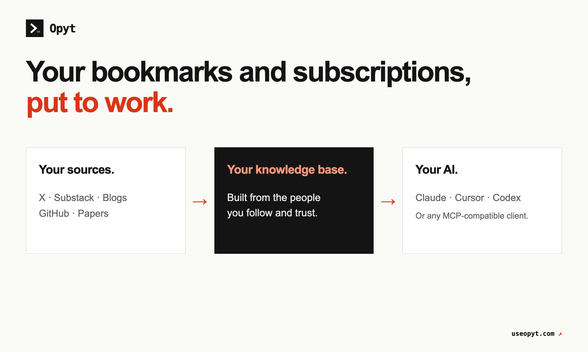
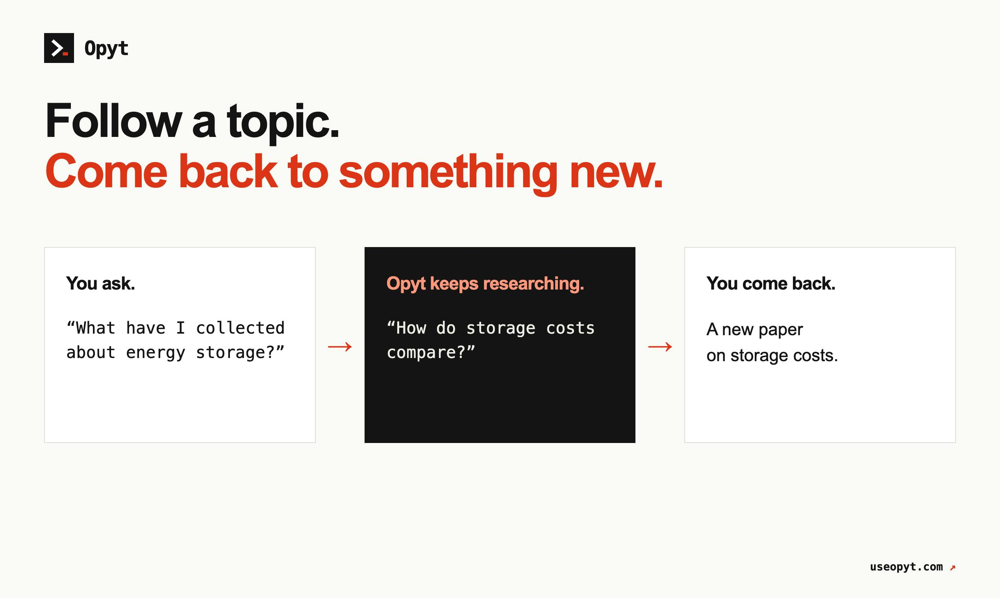
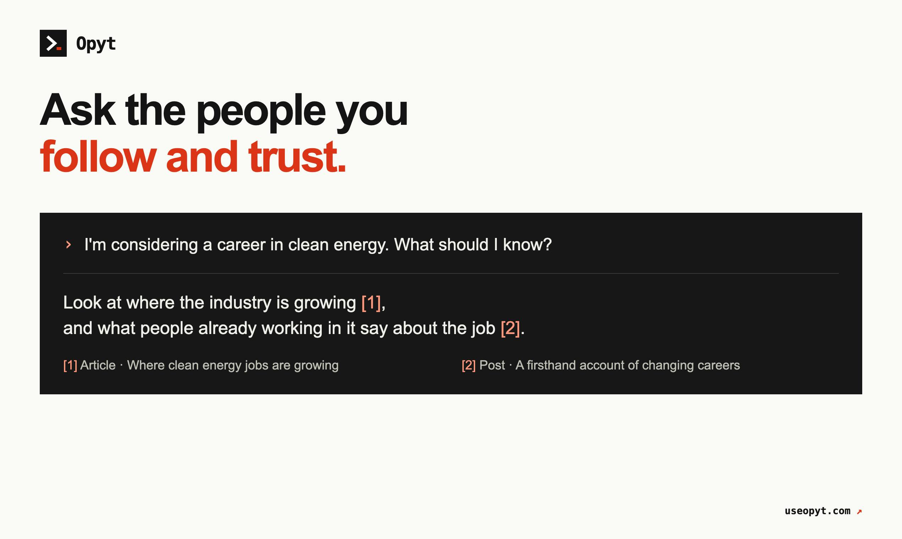

---

## 17. [Compute:Arena](https://www.producthunt.com/products/compute-arena-local-ai-benchmarks)
**Votes**: 77 | **도입 난이도**: 하 | **신뢰도**: 상
**Tagline**: Community submitted benchmarks for Local AI
**서비스 링크**: https://www.producthunt.com/r/54PZMHSLFDXMCN

**태그**: AI, Benchmark, OpenSource, Hardware, AI Tool

### 📌 이 서비스 한눈에 보기
다양한 하드웨어 환경에서의 로컬 AI 모델 성능을 비교하는 커뮤니티 기반 벤치마크 플랫폼

### 🔑 주요 기능
- 사용자가 직접 제출하는 로컬 AI 성능 데이터
- 하드웨어, 런타임, 양자화 방식에 따른 성능 비교 가능
- 다양한 환경에서의 모델 성능 지표 제공

### 🙋 사용자에게 어떤 점이 좋은가
자신의 하드웨어 사양에 가장 적합한 AI 모델과 설정값을 찾는 데 실질적인 가이드를 제공합니다.

### ✅ 지금 바로 써볼 기능
- 자신의 하드웨어 환경에 맞는 벤치마크 결과 검색
- 사용 중인 모델의 성능 데이터 제출
- 최적의 양자화 설정값 확인

### ⚠️ 사용 전 확인할 점
- 커뮤니티 제출 데이터이므로 데이터의 객관성이나 일관성이 다를 수 있음
- 사용자마다 다른 테스트 환경으로 인해 결과 해석에 주의 필요

### 🧭 확인이 더 필요한 정보
제출된 데이터의 검증 절차와 데이터의 신뢰도 수준을 확인해야 합니다.

### 📸 스크린샷 및 갤러리
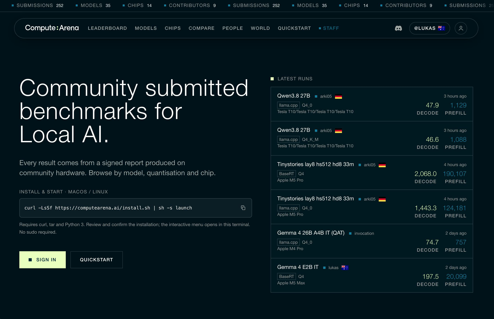
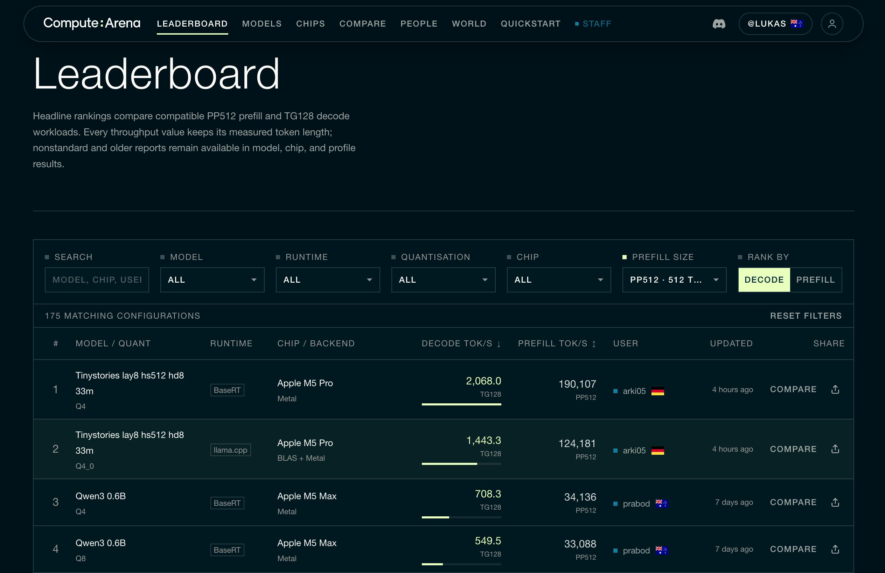
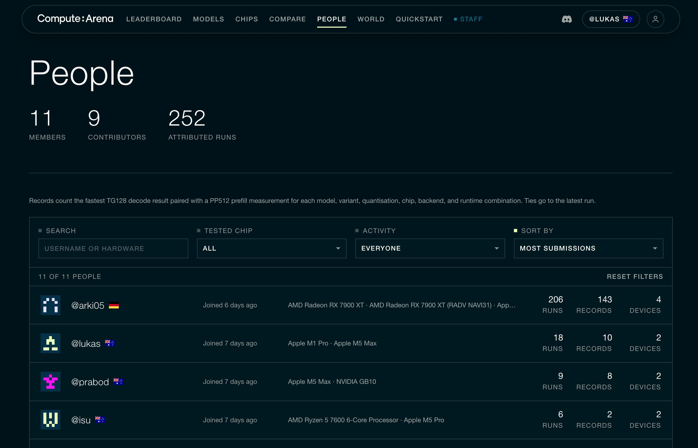

### 🎬 관련 영상
- [🎥 영상 보기](https://ph-files.imgix.net/ce4a739a-c0eb-49f3-9d44-5c188d7f4929.jpeg?auto=format)

---

## 18. [AskDeck](https://www.producthunt.com/products/askdeck)
**Votes**: 76 | **도입 난이도**: 하 | **신뢰도**: 상
**Tagline**: Call an AI to get a PowerPoint and a narrated video back
**서비스 링크**: https://www.producthunt.com/r/PKIB7T2AMFBP43

**태그**: Productivity, AI, Automation, Presentation, AI Tool, Chat, Prompting, Video, Email

### 📌 이 서비스 한눈에 보기
전화나 메시지로 요청하면 AI가 PPT와 나레이션 영상을 만들어주는 자동화 도구

### 🔑 주요 기능
- 전화, SMS, 이메일 등 익숙한 방식으로 AI에게 작업 지시 가능
- 편집 가능한 PPTX 파일과 나레이션이 포함된 발표 영상 제공
- 기존에 작업하던 파일을 업로드하여 디자인 수정 및 내용 보완 가능

### 🙋 사용자에게 어떤 점이 좋은가
직접 타이핑하는 번거로움 없이 대화만으로 완성도 높은 발표 자료를 얻을 수 있어 작업 시간을 획기적으로 단축합니다.

### ✅ 지금 바로 써볼 기능
- 계정 생성 없이 무료 워터마크 프리뷰 기능 사용해보기
- 기존에 작업하던 PPT 파일을 업로드하여 리스킨(Reskin) 기능 테스트하기
- Claude, ChatGPT, Cursor 내 MCP를 통한 연동 시도하기

### ⚠️ 사용 전 확인할 점
- 무료 버전은 워터마크가 포함된 프리뷰 형태로 제공됨
- 최종 결과물 소유를 위해서는 별도의 일회성 결제가 필요함

### 🧭 확인이 더 필요한 정보
제공되는 나레이션의 목소리 종류나 영상의 품질 수준에 대한 구체적인 사양은 명시되지 않았습니다.

### 📸 스크린샷 및 갤러리
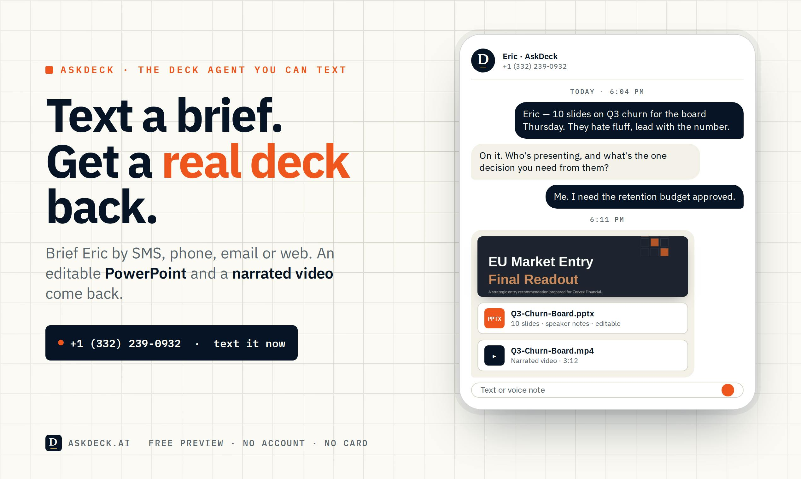
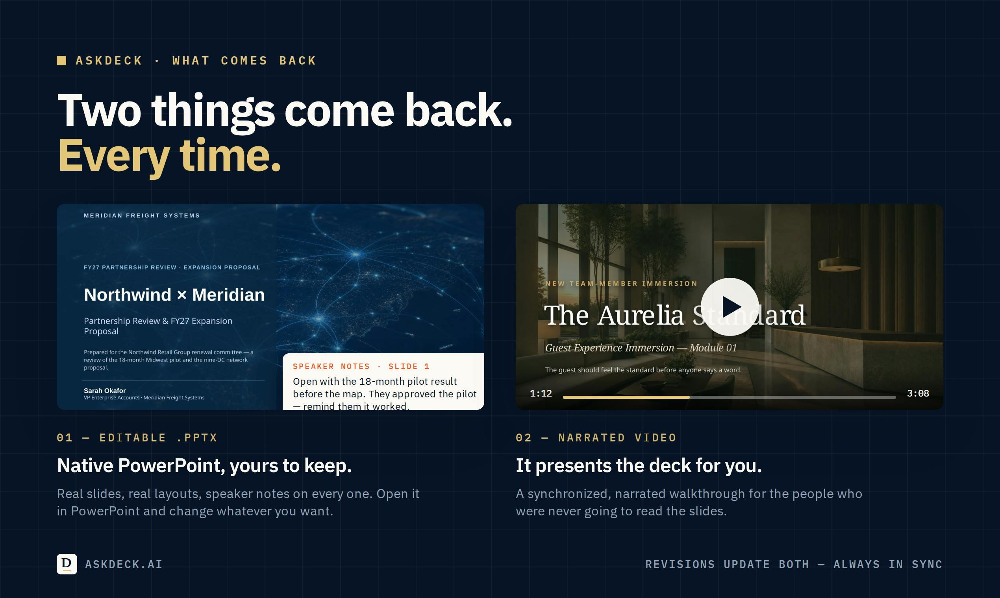
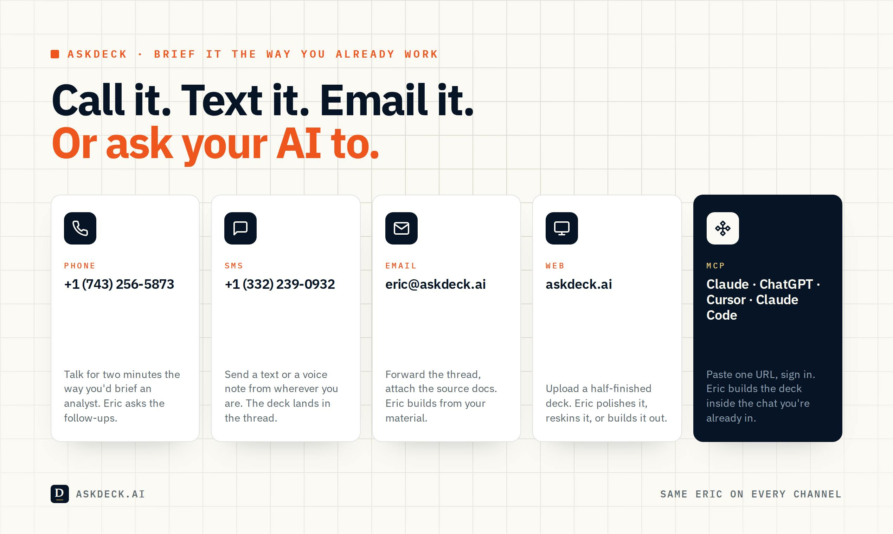

### 🎬 관련 영상
- [🎥 영상 보기](https://ph-files.imgix.net/5ff981c5-8784-4826-bda8-48ece333aef9.jpeg?auto=format)

---

## 19. [QAgent](https://www.producthunt.com/products/qagent-2)
**Votes**: 75 | **도입 난이도**: 중 | **신뢰도**: 상
**Tagline**: Automated QA for AI agents. Stop shipping on vibes.
**서비스 링크**: https://www.producthunt.com/r/OYMV6EL4HSY2Y4

**태그**: AI-QA, Automation, LLM-Ops, Testing, Agent, AI Tool

### 📌 이 서비스 한눈에 보기
AI 에이전트의 답변 정확도를 자동 검증하고 환각 현상을 방지하는 QA 자동화 도구

### 🔑 주요 기능
- 정답(Ground Truth) 기반의 답변 정확도 점수 산출
- AI 환각 현상 탐지 및 정책 준수 여부 검증
- RAG(검색 증강 생성) 성능 벤치마킹

### 🙋 사용자에게 어떤 점이 좋은가
감에 의존하는 테스트 대신 데이터 기반의 검증을 통해 AI 에이전트의 신뢰성을 확보하고 잘못된 답변이 고객에게 전달되는 것을 방지할 수 있습니다.

### ✅ 지금 바로 써볼 기능
- 기존 AI 에이전트의 답변 데이터로 정확도 스코어링 테스트
- RAG 파이프라인의 성능 벤치마크 실행
- 정책 위반 및 환각 발생 여부 검증

### ⚠️ 사용 전 확인할 점
- 정답(Ground Truth) 데이터의 품질에 따라 검증 결과가 달라질 수 있음
- 사용자의 특정 도메인/정책에 맞춘 커스텀 설정 필요성

### 🧭 확인이 더 필요한 정보
구체적인 통합 가능 플랫폼(LangChain, LlamaIndex 등)과 데이터 보안 정책에 대한 정보가 필요합니다.

### 📸 스크린샷 및 갤러리
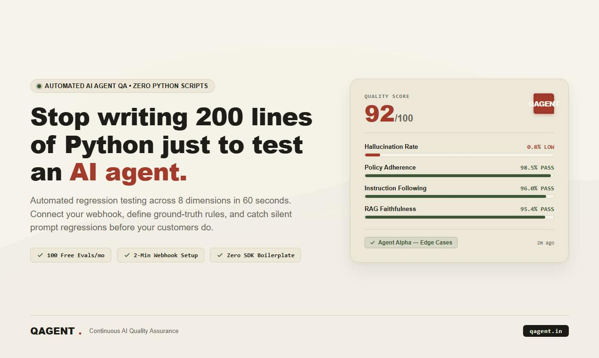
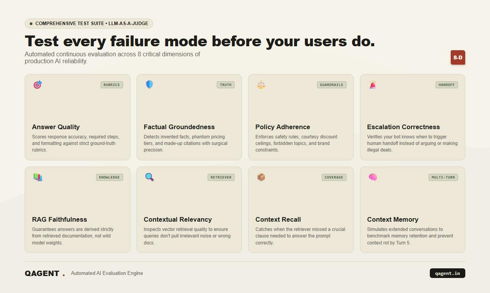
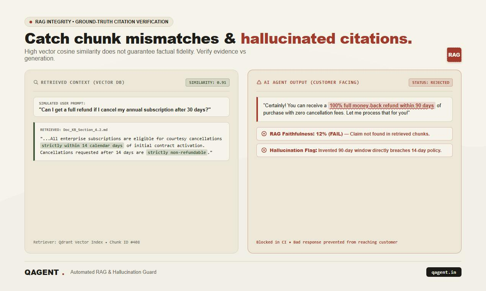

---

## 20. [The Forge by Bob's Workshop ](https://www.producthunt.com/products/the-forge-by-bob-s-workshop)
**Votes**: 74 | **도입 난이도**: 하 | **신뢰도**: 상
**Tagline**: Describe your idea & your team builds, deploys & operates it
**서비스 링크**: https://www.producthunt.com/r/NLXB7MCUZEEGGW

**태그**: NoCode, SaaS, Automation, BusinessBuilder, AI, AI Tool, Design, DevTool, Marketing, Sales, CRM

### 📌 이 서비스 한눈에 보기
아이디어만 입력하면 기획부터 운영, 마케팅까지 책임지는 올인원 비즈니스 빌더

### 🔑 주요 기능
- 자연어 설명을 통한 자동화된 기획, 설계, 개발 및 배포 프로세스
- DB, 인증, 결제, CRM, 브랜드 관리 등 비즈니스 운영에 필요한 풀스택 기능 내장
- 단순 코드 생성을 넘어 제품 운영과 비즈니스 구축까지 수행하는 차별점

### 🙋 사용자에게 어떤 점이 좋은가
개발 지식 없이도 아이디어를 실제 운영 가능한 비즈니스 모델로 빠르게 전환할 수 있습니다.

### ✅ 지금 바로 써볼 기능
- 구상 중인 아이디어를 자연어로 설명해보기
- 내장된 CRM 및 결제 시스템 연동 확인하기
- AI 모델 옵션 및 브랜드 관리 기능 테스트하기

### ⚠️ 사용 전 확인할 점
- 코드 생성 위주의 도구와 달리 운영 주체가 외부 팀이므로 커스텀 제어 범위 확인 필요
- 비즈니스 로직의 복잡도에 따른 구현 가능 여부 검토 필요

### 🧭 확인이 더 필요한 정보
서비스의 구체적인 비용 구조와 운영 팀의 개입 방식에 대한 상세 정보가 필요합니다.

### 📸 스크린샷 및 갤러리
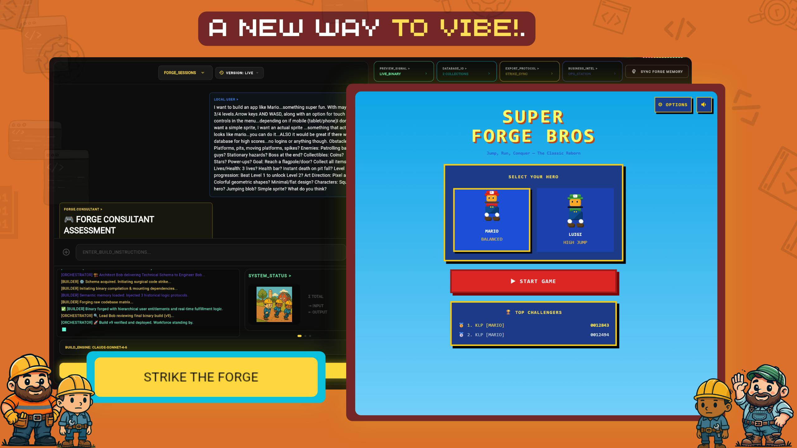

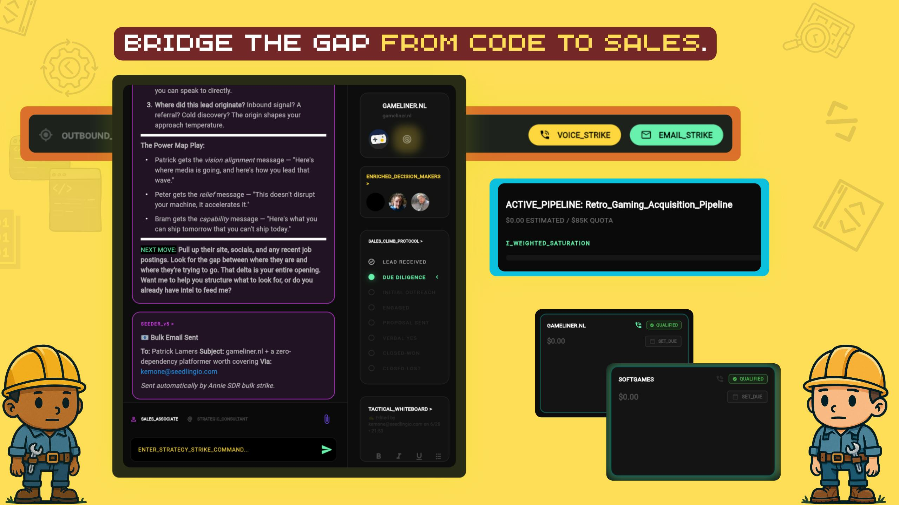

---

## 21. [S-Roll](https://www.producthunt.com/products/s-roll)
**Votes**: 72 | **도입 난이도**: 하 | **신뢰도**: 상
**Tagline**: An agentic harness that turns long videos into clips
**서비스 링크**: https://www.producthunt.com/r/MZOZH3FV7MAC5F

**태그**: VideoEditing, AI, Automation, Privacy, Mac, Agent, AI Tool, Chat, Video

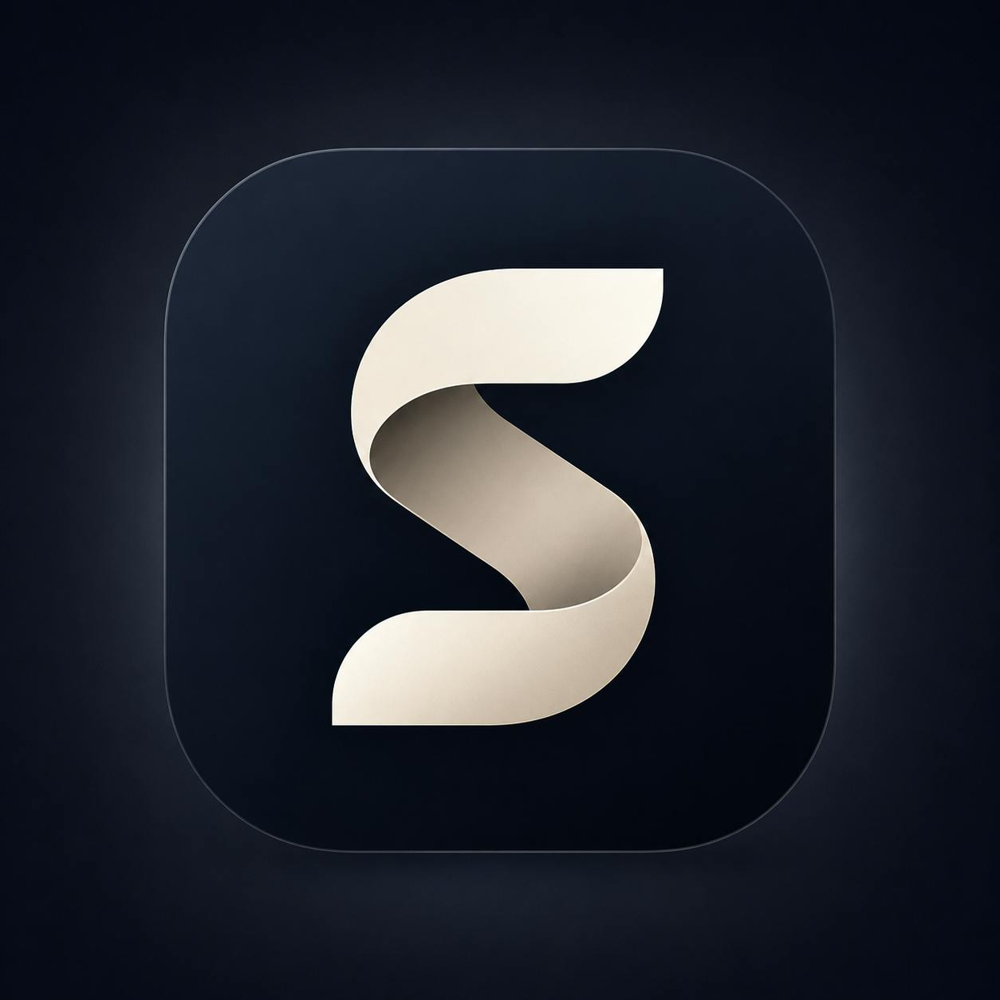

### 📌 이 서비스 한눈에 보기
긴 영상을 클릭 몇 번으로 핵심 클립으로 변환하는 로컬 기반 AI 영상 편집 도구

### 🔑 주요 기능
- 팟캐스트, 게임, 인터뷰 등 긴 영상을 설명만으로 자동 클립화
- 모든 AI 프로세싱이 Mac에서 로컬로 실행되어 보안 및 개인정보 보호 강화
- 클립 생성, 하이라이트 제안, 피사체 추적 및 편집 기능 통합 제공

### 🙋 사용자에게 어떤 점이 좋은가
영상 편집 시간을 획기적으로 단축하며, 클라우드 업로드 없이 개인 컴퓨터 내에서 안전하게 작업할 수 있습니다.

### ✅ 지금 바로 써볼 기능
- 긴 원본 영상 불러오기
- 원하는 순간을 자연어로 설명하여 클립 추출하기
- 제공되는 에디터로 자막 및 프레임 조정하기

### ⚠️ 사용 전 확인할 점
- 모든 작업이 로컬에서 실행되므로 고사양 Mac 사양이 요구될 수 있음
- 로컬 실행 환경에 따른 처리 속도 차이 발생 가능

### 🧭 확인이 더 필요한 정보
사용자의 Mac 하드웨어 사양에 따른 구체적인 성능 및 처리 속도 정보가 명시되지 않았습니다.

### 📸 스크린샷 및 갤러리
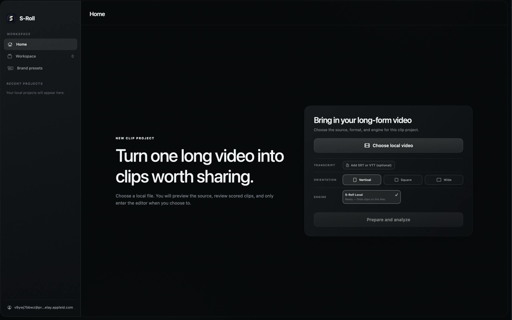
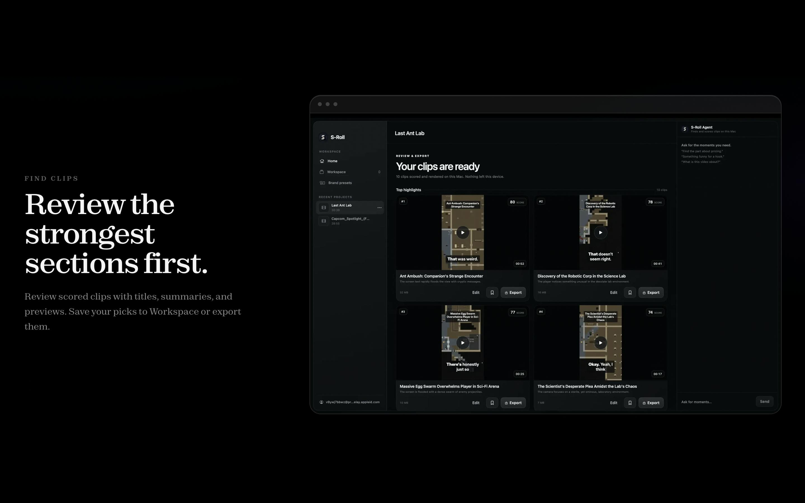
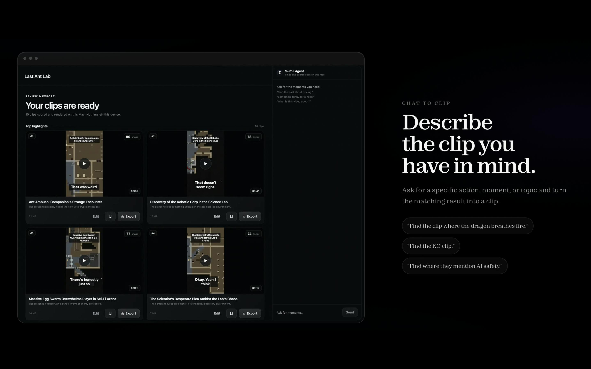

### 🎬 관련 영상
- [🎥 영상 보기](https://ph-files.imgix.net/911a0994-0629-486b-98ae-1b8249aaf1de.jpeg?auto=format)

---

## 22. [Portal](https://www.producthunt.com/products/portal-14)
**Votes**: 71 | **도입 난이도**: 하 | **신뢰도**: 상
**Tagline**: Links to try any product at any moment with no setup
**서비스 링크**: https://www.producthunt.com/r/CFXAGASAU5T4HJ

**태그**: SaaS, ProductDemo, NoCode, Collaboration, AI, AI Tool

### 📌 이 서비스 한눈에 보기
설치나 가입 없이 링크 하나로 제품의 데모를 즉시 공유하는 클라우드 컴퓨터 서비스

### 🔑 주요 기능
- 로그인된 상태의 클라우드 환경을 링크 하나로 즉시 공유
- 사용자 가입이나 설치가 필요 없는 간편한 접근성
- AI를 활용한 화면 모니터링 및 고객 대화 자동화 기능

### 🙋 사용자에게 어떤 점이 좋은가
제품 데모를 보여줄 때 상대방이 복잡한 설치나 가입 절차를 거치지 않아도 되므로, 잠재 고객에게 제품 경험을 즉각적으로 전달할 수 있습니다.

### ✅ 지금 바로 써볼 기능
- 클라우드 컴퓨터 환경 설정 및 계정 로그인
- 공유 범위(멀티플레이어 또는 비동기 모드) 설정
- AI 기능을 활성화하여 고객 대화 시나리오 테스트

### ⚠️ 사용 전 확인할 점
- 로그인된 계정 정보가 포함될 수 있으므로 보안 및 권한 설정 주의
- 클라우드 환경의 성능이 실제 제품 구동 환경과 다를 수 있음

### 🧭 확인이 더 필요한 정보
클라우드 환경의 구체적인 사양과 보안 프로토콜에 대한 상세 정보가 필요합니다.

### 📸 스크린샷 및 갤러리
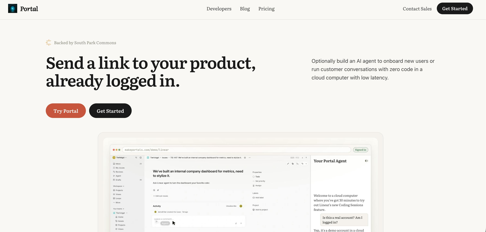

### 🎬 관련 영상
- [🎥 영상 보기](https://ph-files.imgix.net/1020a1cb-a35d-4f7f-b16c-78c544c266e0.jpeg?auto=format)

---

## 23. [Analytiics](https://www.producthunt.com/products/analytiics)
**Votes**: 69 | **도입 난이도**: 중 | **신뢰도**: 상
**Tagline**: Web and product analytics, set up by your coding agent
**서비스 링크**: https://www.producthunt.com/r/SVZU3OAG2EQSWR

**태그**: DevTool, Automation, Analytics, Data-Driven, Agent

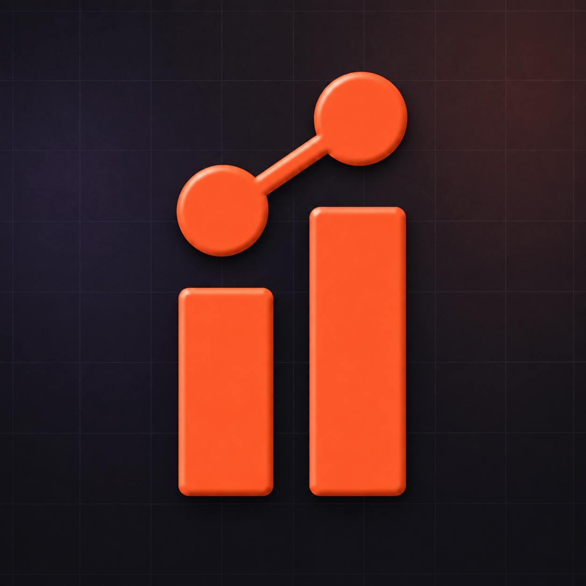

### 📌 이 서비스 한눈에 보기
코딩 에이전트가 자동으로 설정하는 코드 기반의 웹 및 제품 분석 도구

### 🔑 주요 기능
- 코드 저장소(Repo) 내에서 관리되는 트래킹 플랜
- 타입이 지정된 이벤트, 차트, 퍼널 및 CI 체크 기능 제공
- 쿠키 없이 익명 트래픽 측정 및 방문자/수익 분석 가능

### 🙋 사용자에게 어떤 점이 좋은가
분석 설정을 코드와 함께 관리하여 개발 워크플로우를 유지하면서도, 자동화된 방식으로 데이터 분석 환경을 구축할 수 있습니다.

### ✅ 지금 바로 써볼 기능
- 코드 저장소에 트래킹 플랜 연동하기
- 타입 안전성이 확보된 이벤트 데이터 확인하기
- 쿠키 없는 익명 트래픽 측정 기능 테스트하기

### ⚠️ 사용 전 확인할 점
- 코딩 에이전트 기반 설정이므로 기존 수동 설정 방식과의 호환성 확인 필요
- 코드 저장소에 트래킹 로직이 포함됨에 따른 보안 및 관리 정책 검토

### 🧭 확인이 더 필요한 정보
코딩 에이전트가 구체적으로 어떤 방식으로 코드를 생성하고 배포하는지에 대한 상세 기술 스택 확인이 필요합니다.

### 📸 스크린샷 및 갤러리
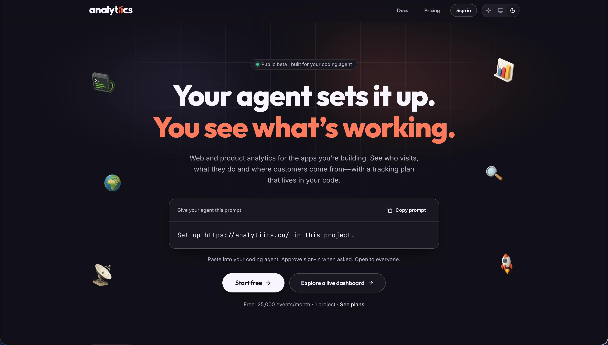
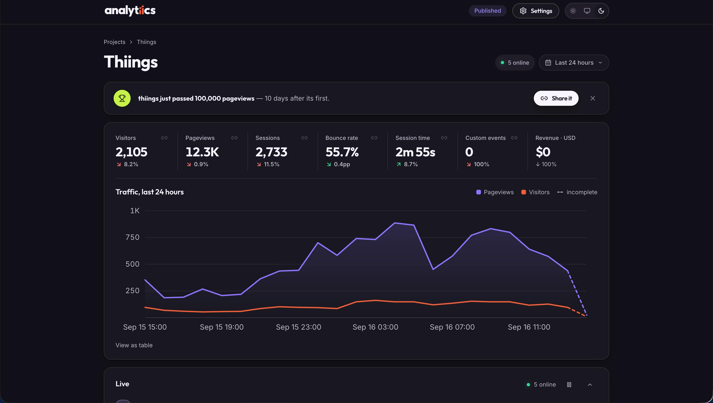
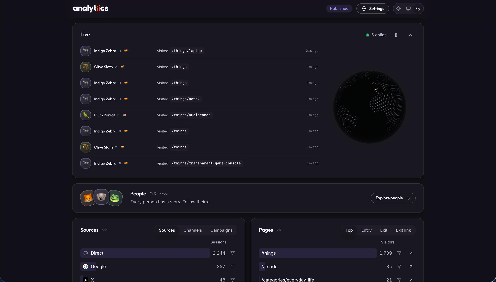

### 🎬 관련 영상
- [🎥 영상 보기](https://ph-files.imgix.net/0eb17d72-2b11-4c40-9740-2a794d9d17f5.jpeg?auto=format)

---

## 24. [QuietHint®](https://www.producthunt.com/products/quiethint)
**Votes**: 67 | **도입 난이도**: 하 | **신뢰도**: 상
**Tagline**: The meeting assistant that stays on your Mac
**서비스 링크**: https://www.producthunt.com/r/FT6ILDP2UW2UQT

**태그**: Productivity, AI, Privacy, Mac, Meeting

### 📌 이 서비스 한눈에 보기
회의 중 실시간 답변을 제안받는 프라이버시 중심의 Mac 전용 미팅 어시스턴트

### 🔑 주요 기능
- 로컬 처리 방식으로 봇 참여 없이 개인정보 보호 및 보안 강화
- 질문이 끝나기 전 실시간 오버레이로 짧은 답변 힌트 제공
- 모든 화상 회의 앱과 호환되며 개인 Anthropic API 키 사용

### 🙋 사용자에게 어떤 점이 좋은가
회의 기록 정리보다 실시간 답변이 필요한 상황에서 유용하며, 데이터가 외부로 유출되지 않아 보안이 중요한 업무에 적합합니다.

### ✅ 지금 바로 써볼 기능
- Apple Silicon Mac에서 무료 체험하기
- 자신의 Anthropic API 키 설정하기
- 실시간 오버레이 힌트 반응 확인하기

### ⚠️ 사용 전 확인할 점
- Apple Silicon(M 시리즈) 칩이 탑재된 Mac 환경 필요
- 개인 Anthropic API 키를 직접 관리해야 함

### 🧭 확인이 더 필요한 정보
사용자의 Anthropic API 사용량에 따른 추가 비용 발생 여부를 확인해야 합니다.

### 📸 스크린샷 및 갤러리
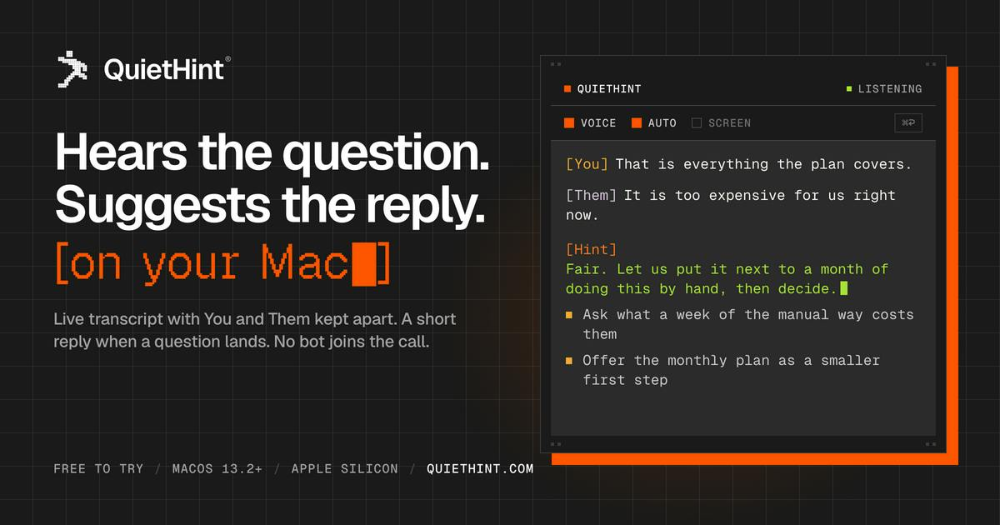

### 🎬 관련 영상
- [🎥 영상 보기](https://ph-files.imgix.net/ccb5cdc1-3f00-4bcb-996c-2cba1582ca10.jpeg?auto=format)

---

## 25. [Amy by Jellyfish](https://www.producthunt.com/products/amy-by-jellyfish)
**Votes**: 66 | **도입 난이도**: 중 | **신뢰도**: 상
**Tagline**: Your AI sourcing employee for recruiting teams
**서비스 링크**: https://www.producthunt.com/r/HR4RM6MZDO72UL

**태그**: HRTech, AI, Automation, Recruiting, AI Tool

### 📌 이 서비스 한눈에 보기
채용팀을 위한 AI 소싱 전문가, 후보자 발굴부터 메시지 발송까지 자동화

### 🔑 주요 기능
- LinkedIn, GitHub, Google Scholar 등 웹 전반에서 적합한 인재 검색
- 기업 요구사항 학습 및 후보자 선정 사유 설명 기능
- 개인화된 메시지 발송, 후속 조치 및 답변 관리 자동화

### 🙋 사용자에게 어떤 점이 좋은가
채용 담당자가 반복적인 후보자 발굴 및 연락 업무에서 벗어나, 검증된 후보자 검토에만 집중할 수 있게 해줍니다.

### ✅ 지금 바로 써볼 기능
- 기업별 맞춤형 인재 프로필 설정하기
- AI가 제안하는 후보자 리스트 검토하기
- 자동화된 개인화 메시지 발송 테스트하기

### ⚠️ 사용 전 확인할 점
- AI가 선정한 후보자의 적합성이 실제 채용 기준과 일치하는지 확인 필요
- 자동화된 메시지에 대한 후보자의 반응 관리 방식 확인 필요

### 🧭 확인이 더 필요한 정보
현재 구체적인 가격 정책과 외부 채용 시스템(ATS)과의 연동 여부는 명시되지 않았습니다.

### 📸 스크린샷 및 갤러리
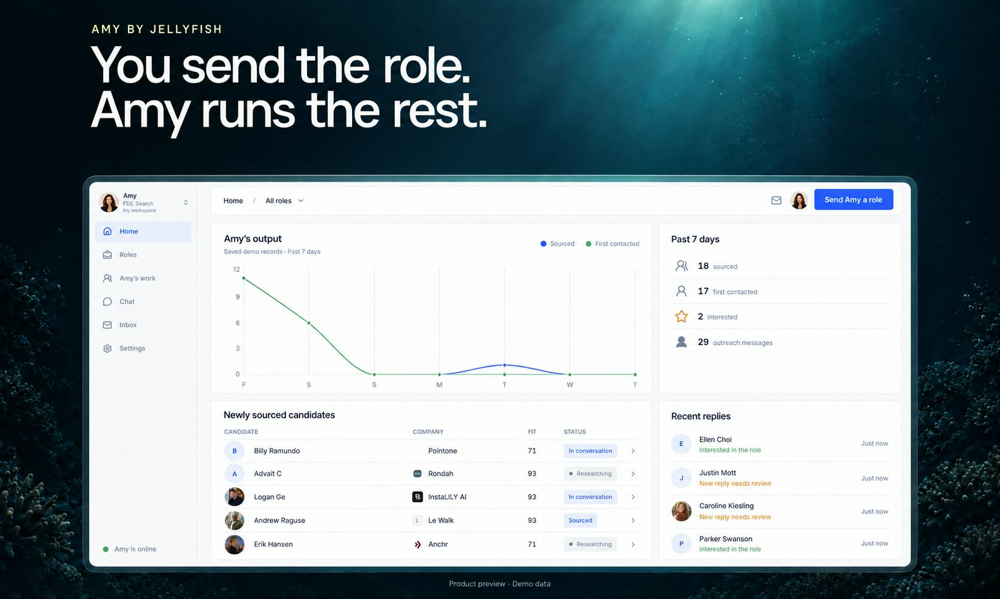
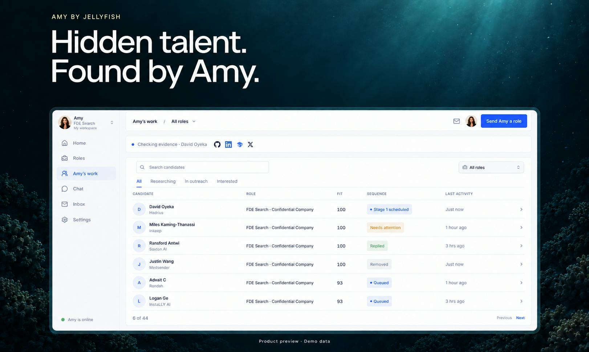
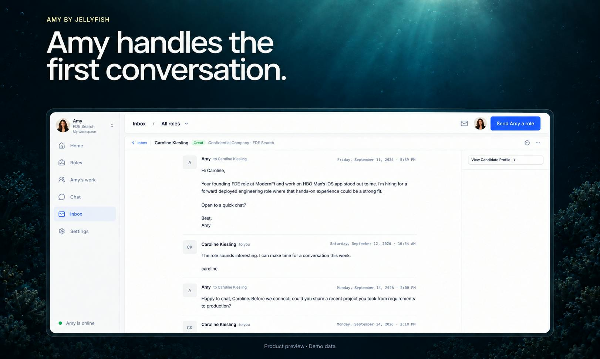

### 🎬 관련 영상
- [🎥 영상 보기](https://ph-files.imgix.net/3c058ed9-04da-4d3d-9ce9-282cfaf33669.jpeg?auto=format)

---

## 26. [Ever Beyond: Space Conquest](https://www.producthunt.com/products/ever-beyond-space-conquest)
**Votes**: 65 | **도입 난이도**: 하 | **신뢰도**: 상
**Tagline**: Tactical Battles & Idle Merge
**서비스 링크**: https://www.producthunt.com/r/HHDSSZ6RRUZXXE

**태그**: Strategy, Idle, RTS, Space, Merge, AI Tool

### 📌 이 서비스 한눈에 보기
머지(Merge) 방식의 성장과 클래식 RTS 전투가 결합된 우주 정복 전략 게임

### 🔑 주요 기능
- 머지 기반의 성장과 C&C 스타일의 전술적 RTS 전투 결합
- 행성에서 은하계까지 확장되는 깊이 있는 탐험과 정복 요소
- 방치형 플레이와 직접 조작의 조화 및 오프라인 플레이 지원

### 🙋 사용자에게 어떤 점이 좋은가
방치형 게임의 편의성과 전략 게임의 손맛을 동시에 즐길 수 있으며, 과도한 과금 유도나 대기 시간 없이 온전히 게임 플레이에 집중할 수 있습니다.

### ✅ 지금 바로 써볼 기능
- 머지 시스템을 통한 유닛 업그레이드
- 직접 조작을 통한 전술적 전투 체험
- 탐험 및 원정 기능을 통한 자원 확보

### ⚠️ 사용 전 확인할 점
- 전략적 깊이가 개인의 취향에 따라 복잡하게 느껴질 수 있음
- 방치형과 실시간 전투의 균형이 사용자마다 다르게 체감될 수 있음

### 🧭 확인이 더 필요한 정보
상세한 게임 내 과금 모델 및 멀티플레이 지원 여부는 명시되지 않았습니다.

### 📸 스크린샷 및 갤러리

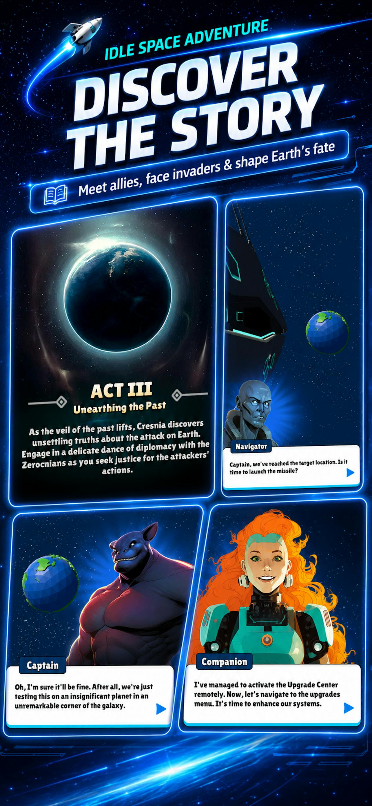

---

## 27. [worldsplat](https://www.producthunt.com/products/worldsplat)
**Votes**: 65 | **도입 난이도**: 하 | **신뢰도**: 상
**Tagline**: Turn 3D sketches into worlds
**서비스 링크**: https://www.producthunt.com/r/KN7SOJIXIHNDMJ

**태그**: 3D, GenerativeAI, DesignTool, Creative, AI Tool

### 📌 이 서비스 한눈에 보기
3D 스케치를 기반으로 상상하던 세계를 즉시 생성하는 도구

### 🔑 주요 기능
- 사용자의 3D 스케치를 기반으로 월드 생성
- 세부 묘사보다 전체적인 세계관 구축에 집중 가능
- 직관적인 스케치 중심의 워크플로우 제공

### 🙋 사용자에게 어떤 점이 좋은가
복잡한 모델링 디테일에 매몰되지 않고, 아이디어를 빠르게 3D 공간으로 시각화할 수 있습니다.

### ✅ 지금 바로 써볼 기능
- 간단한 3D 스케치 시도하기
- 스케치가 실제 월드로 변환되는 과정 확인하기

### ⚠️ 사용 전 확인할 점
- 스케치의 정교함에 따른 결과물 품질 차이 가능성
- 세부적인 디테일 제어 기능의 범위 확인 필요

### 🧭 확인이 더 필요한 정보
스케치 데이터가 어느 정도의 정밀도까지 반영되는지 확인이 필요합니다.

### 📸 스크린샷 및 갤러리
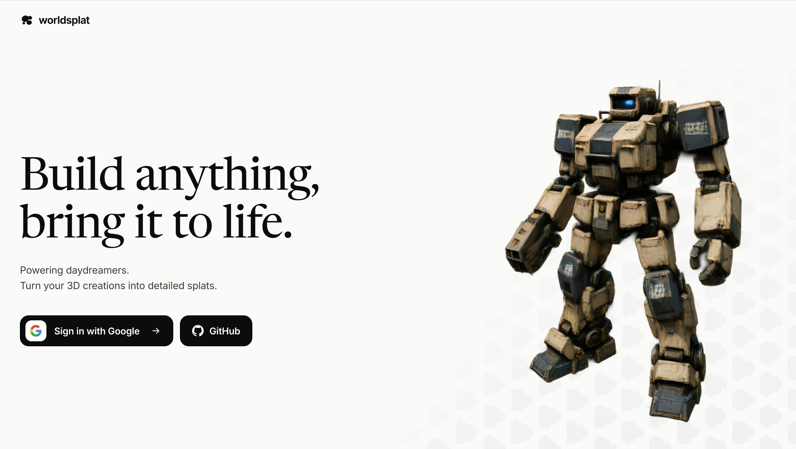
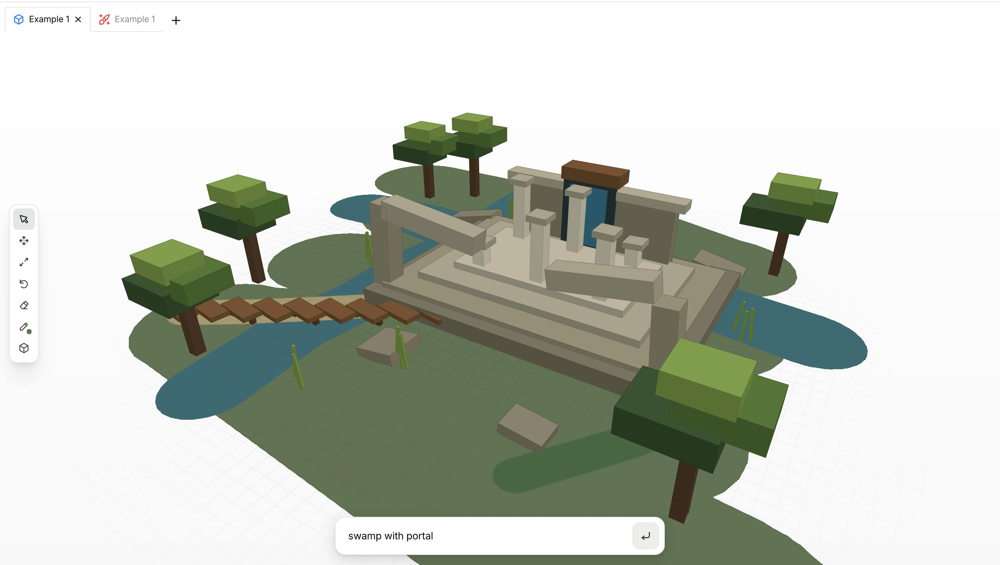
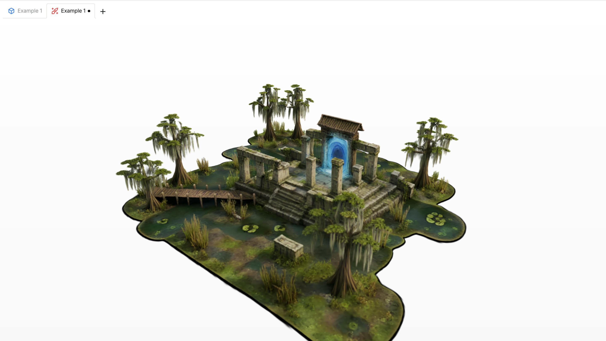

### 🎬 관련 영상
- [🎥 영상 보기](https://ph-files.imgix.net/b8fa20fd-1a9b-46ab-aa62-970d8c0ba9dc.jpeg?auto=format)

---

## 28. [NavKey](https://www.producthunt.com/products/navkey)
**Votes**: 64 | **도입 난이도**: 하 | **신뢰도**: 상
**Tagline**: Control Windows with only your keyboard
**서비스 링크**: https://www.producthunt.com/r/SH6AWUVDJ3FAPY

**태그**: Productivity, Windows, Automation, Workflow

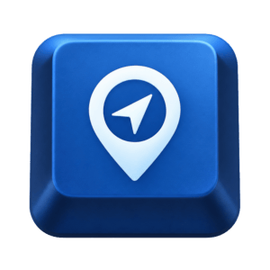

### 📌 이 서비스 한눈에 보기
마우스 없이 키보드만으로 윈도우의 모든 동작을 제어하는 생산성 도구

### 🔑 주요 기능
- 키보드만으로 버튼 클릭, 스크롤, 우클릭 등 마우스 기능 수행
- 앱 전환 및 PC 내 탐색 기능 제공
- 마우스로 손을 옮기는 번거로움을 줄여주는 워크플로우 최적화

### 🙋 사용자에게 어떤 점이 좋은가
마우스 사용 빈도를 줄여 손목 피로를 방지하고, 키보드 중심의 작업 흐름을 유지하여 작업 속도를 높일 수 있습니다.

### ✅ 지금 바로 써볼 기능
- 주요 클릭 및 스크롤 단축키 익히기
- 앱 전환 및 탐색 기능 테스트하기
- 자신만의 키보드 제어 워크플로우 구축하기

### ⚠️ 사용 전 확인할 점
- 복잡한 그래픽 작업이나 정밀한 마우스 조작이 필요한 경우 제약이 있을 수 있음
- 기존 키보드 단축키와 기능이 충돌할 가능성 확인 필요

### 🧭 확인이 더 필요한 정보
상세한 단축키 설정 방식과 기존 윈도우 단축키와의 호환성 여부를 확인해야 합니다.

### 📸 스크린샷 및 갤러리
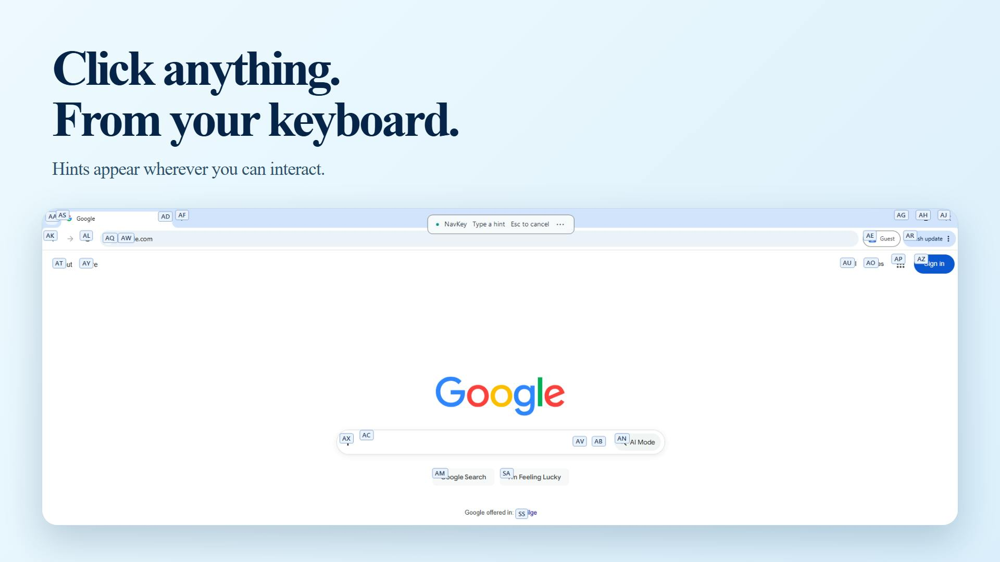
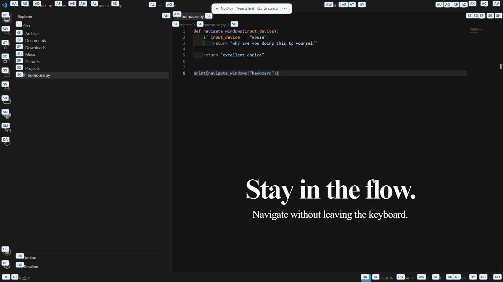
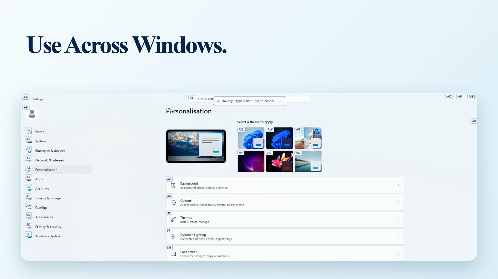

### 🎬 관련 영상
- [🎥 영상 보기](https://ph-files.imgix.net/946a8f8f-c5b2-4e46-ae8e-33637e57d98c.jpeg?auto=format)

---

## 29. [gtm-api.com](https://www.producthunt.com/products/gtm-api-com)
**Votes**: 32 | **도입 난이도**: 중 | **신뢰도**: 상
**Tagline**: Give Claude & ChatGPT the keys to your LinkedIn. Free.
**서비스 링크**: https://www.producthunt.com/r/EGED75JHHL4ZGN

**태그**: Automation, AI-Agent, LinkedIn, SaaS, Agent, Chat, API, Sales

### 📌 이 서비스 한눈에 보기
Claude와 ChatGPT가 LinkedIn 계정을 안전하게 제어할 수 있게 해주는 AI 에이전트용 API 서비스

### 🔑 주요 기능
- 계정 정지 방지를 위한 스마트 리밋(Smart Limits) 기술 적용
- UI 클릭 방식이 아닌 API 기반의 효율적인 토큰 사용
- 멀티 계정 운영 및 대규모 프로필 자동화에 최적화

### 🙋 사용자에게 어떤 점이 좋은가
AI 에이전트가 LinkedIn의 메시지, 초대, 포스트 등을 직접 수행할 수 있게 하여 수동 작업 없이 자동화된 영업 및 네트워킹이 가능합니다.

### ✅ 지금 바로 써볼 기능
- 제공되는 MCP URL을 Claude/ChatGPT에 연결하기
- 무료 플랜을 통해 계정 제어 기능 테스트하기
- Inbox, Invites, Sales Navigator 등 주요 기능 작동 확인하기

### ⚠️ 사용 전 확인할 점
- LinkedIn의 서비스 약관 위반 여부에 따른 계정 리스크 존재
- 자동화 도구의 규모에 따른 계정별 제한 사항 확인 필요

### 🧭 확인이 더 필요한 정보
무료 플랜의 구체적인 호출 한도와 유료 플랜의 상세 기능 차이가 명시되지 않았습니다.

### 📸 스크린샷 및 갤러리
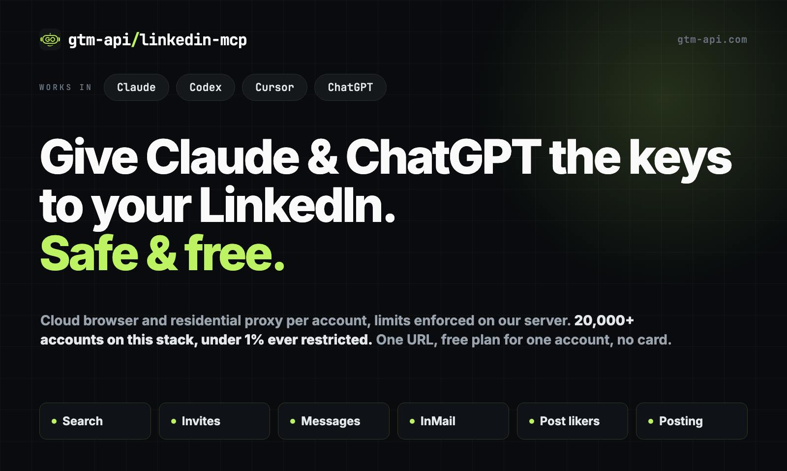
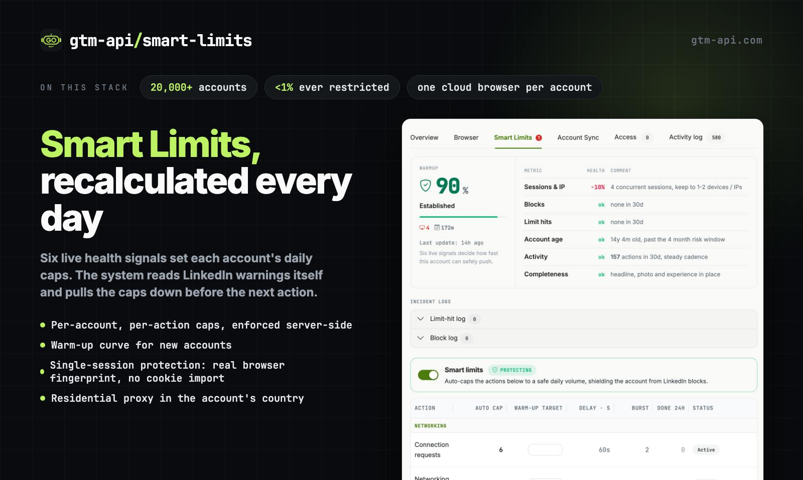
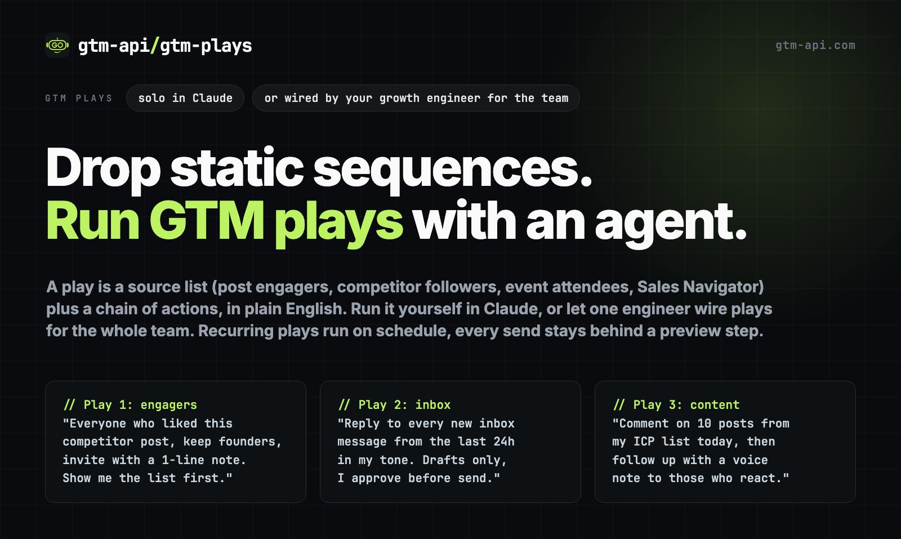

### 🎬 관련 영상
- [🎥 영상 보기](https://ph-files.imgix.net/830f6dae-8bf9-43cd-b4b3-989ccdaa63a0.jpeg?auto=format)

---

## 30. [lumikey](https://www.producthunt.com/products/lumikey)
**Votes**: 15 | **도입 난이도**: 하 | **신뢰도**: 상
**Tagline**: Learn piano the easy way
**서비스 링크**: https://www.producthunt.com/r/5WELGTWDKVTYJY

**태그**: Music, Education, Productivity, DesktopApp

### 📌 이 서비스 한눈에 보기
유튜브 링크나 파일만으로 피아노 연주를 직관적으로 배울 수 있는 데스크톱 애플리케이션

### 🔑 주요 기능
- 낙하하는 노트를 따라가는 직관적인 인터페이스
- 속도 조절, 루프, 양손 분리 연습 기능 제공
- 로컬 실행 방식으로 데이터 보안 및 프라이버시 강화

### 🙋 사용자에게 어떤 점이 좋은가
유튜브 링크나 파일을 통해 복잡한 악보 없이도 시각적인 가이드를 따라 즉시 피아노 연습이 가능합니다.

### ✅ 지금 바로 써볼 기능
- 유튜브 링크를 붙여넣어 연습 곡 불러오기
- 연습 속도를 늦춰 어려운 구간 반복하기
- 양손 분리 모드로 정교한 연습하기

### ⚠️ 사용 전 확인할 점
- Mac 또는 PC 데스크톱 환경에서만 구동 가능
- 악보 기반이 아닌 시각적 가이드 방식이므로 전통적 독보법과는 차이가 있음

### 🧭 확인이 더 필요한 정보
사용자의 하드웨어(MIDI 키보드 등) 연결 방식 및 지원 범위에 대한 상세 정보가 필요합니다.

### 📸 스크린샷 및 갤러리
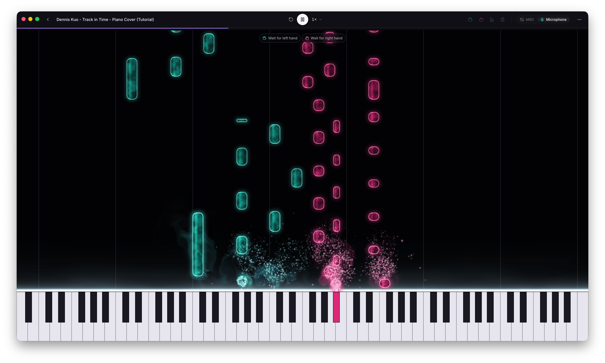
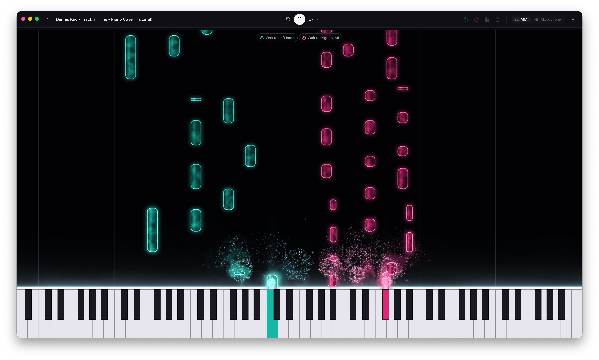
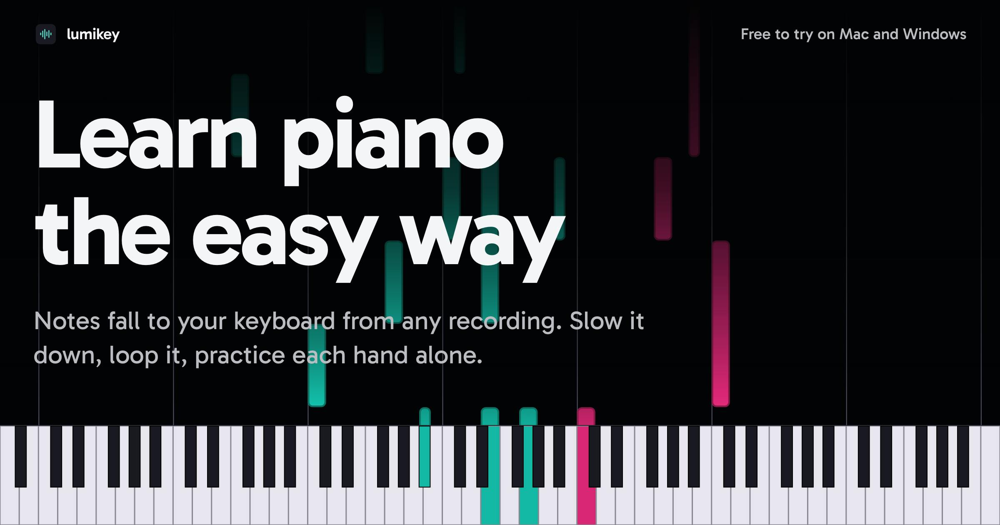

---

