# 🚀 Product Hunt Daily Top 30 (2026-09-19)

## 오늘의 요약
오늘의 트렌드는 단순한 챗봇을 넘어 사용자의 화면을 인식하거나 업무 프로세스 전반을 자동화하는 'AI 에이전트'의 진화가 두드러졌습니다. 특히 영업, 고객 지원, 커리어 코칭 등 특정 직무의 워크플로우를 엔드투엔드로 해결하려는 실용적인 도구들이 많은 주목을 받았습니다.

### 오늘의 핵심 포인트
- 화면 인식 및 데이터 자동 추출을 통해 복사/붙여넣기 번거로움을 없앤 에이전트형 도구들이 등장했습니다.
- 단순 기록을 넘어 전략 수립, 리드 발굴, 피드백 점수화 등 의사결정을 지원하는 지능형 자동화가 강화되었습니다.
- 면접 연습이나 언어 학습처럼 일상적인 활동 속에 학습과 성과 관리를 자연스럽게 녹여낸 서비스들이 주목받았습니다.

**오늘의 태그**: AI 에이전트, 업무 자동화, 생산성 도구, 커리어 성장

## 1. [Ami AI](https://www.producthunt.com/products/ami-ai)
**Votes**: 376 | **도입 난이도**: 하 | **신뢰도**: 상
**Tagline**: Lovable for getting customers
**서비스 링크**: https://www.producthunt.com/r/IABJ4YWI3SSSWZ

**태그**: Sales Automation, Lead Generation, AI, Outreach, AI Tool

### 📌 이 서비스 한눈에 보기
목표 리드 수에 맞춰 타겟 선정부터 아웃리치 실행까지 자동화하는 AI 영업 전략가

### 🔑 주요 기능
- 웹사이트 분석을 통한 고효율 잠재 고객 자동 식별
- 목표 리드 수 달성을 위한 역산 방식의 캠페인 계획 수립
- 실행부터 모니터링, 문제 해결까지 이어지는 엔드투엔드 자동화

### 🙋 사용자에게 어떤 점이 좋은가
누구에게 메일을 보낼지 고민하는 시간을 없애고, 목표 수치에 도달할 수 있는 검증된 리드 리스트와 실행 계획을 즉시 제공합니다.

### ✅ 지금 바로 써볼 기능
- 웹사이트 연결하여 타겟 고객 분석 받기
- 목표 리드 수 설정하여 역산 플랜 생성하기
- 생성된 캠페인 플랜 검토 및 승인하기

### ⚠️ 사용 전 확인할 점
- AI가 제안하는 리스트의 타겟 적합성을 반드시 검토해야 함
- 자동화된 아웃리치로 인한 스팸 필터링 위험성 고려 필요

### 🧭 확인이 더 필요한 정보
사용된 모델(GPT-6 Astra) 및 구체적인 아웃리치 채널(이메일, LinkedIn 등)에 대한 상세 정보 확인이 필요합니다.

### 📸 스크린샷 및 갤러리
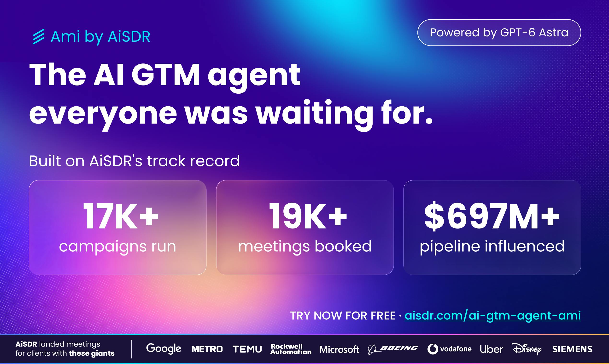
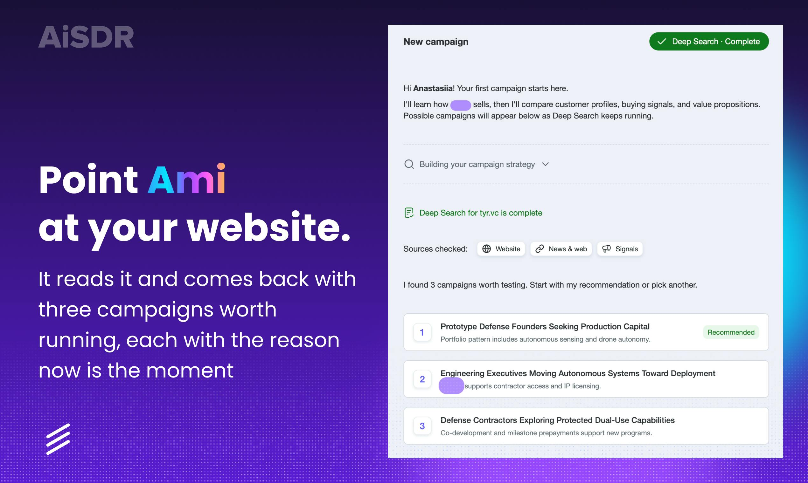
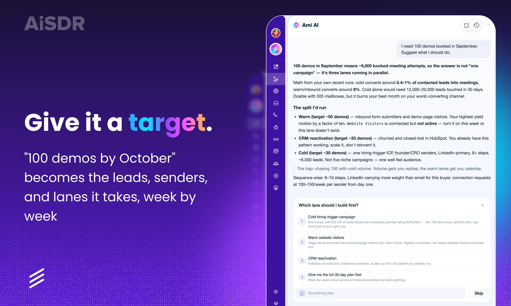

### 🎬 관련 영상
- [🎥 영상 보기](https://ph-files.imgix.net/8bdae202-3311-492a-a57f-67d5c79d8277.jpeg?auto=format)

---

## 2. [AINA](https://www.producthunt.com/products/aina)
**Votes**: 367 | **도입 난이도**: 하 | **신뢰도**: 상
**Tagline**: Find your job search blind spots with an AI coach
**서비스 링크**: https://www.producthunt.com/r/DPLNID7SCPBE2B

**태그**: AI, Career, Interview, Coaching, AI Tool, Video

### 📌 이 서비스 한눈에 보기
AI 비디오 아바타와 대화하며 취업 준비의 사각지대를 해결하는 커리어 코칭 서비스

### 🔑 주요 기능
- 비디오 아바타와의 실감 나는 대화형 인터뷰 연습
- 개인별 취업 준비 취약점 분석 및 프로필 강화
- 대화 후 즉각적인 맞춤형 커리어 액션 플랜 제공

### 🙋 사용자에게 어떤 점이 좋은가
실제 사람과 대화하는 듯한 환경에서 면접 연습을 하고, 자신의 커리어 강점과 약점을 객관적으로 파악할 수 있습니다.

### ✅ 지금 바로 써볼 기능
- 비디오 아바타와 모의 면접 진행하기
- 현재 프로필의 취약점 진단받기
- 제공되는 개인별 액션 플랜 실행하기

### ⚠️ 사용 전 확인할 점
- 비디오 아바타와의 대화 방식이 사용자의 성향에 맞는지 확인 필요
- 제공되는 액션 플랜의 구체적인 실행 가능성 검토 필요

### 🧭 확인이 더 필요한 정보
서비스의 구체적인 가격 정책 및 지원하는 언어 범위에 대한 정보가 명시되지 않았습니다.

### 📸 스크린샷 및 갤러리
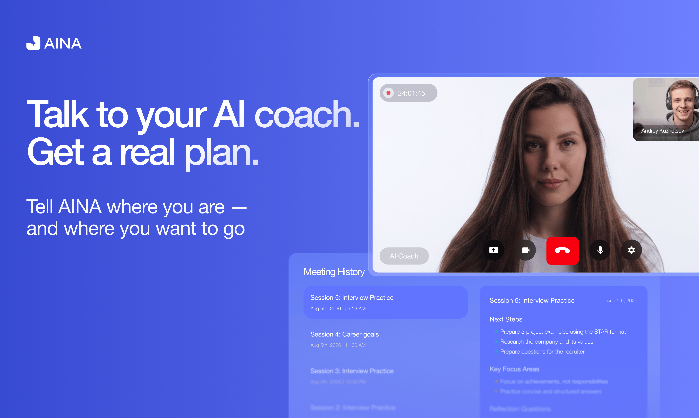
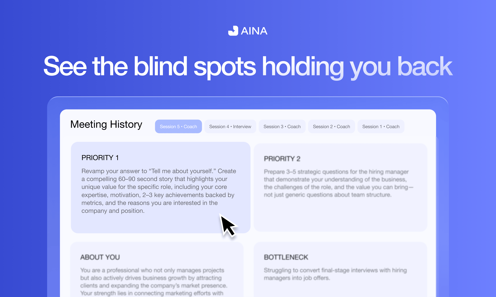
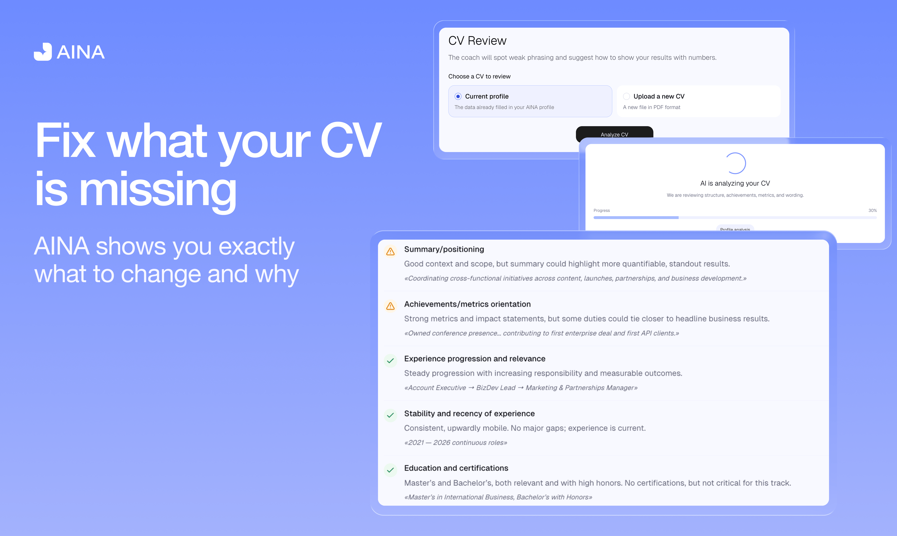

### 🎬 관련 영상
- [🎥 영상 보기](https://ph-files.imgix.net/dde60c1c-ad3d-49d1-b0e7-cea1a5c23a6e.jpeg?auto=format)

---

## 3. [MosMos](https://www.producthunt.com/products/mosmos)
**Votes**: 332 | **도입 난이도**: 하 | **신뢰도**: 상
**Tagline**: Voice writing that works before, during, and after meetings
**서비스 링크**: https://www.producthunt.com/r/2WNX7F5ABJ77RC

**태그**: Productivity, AI, Transcription, Meeting Assistant

### 📌 이 서비스 한눈에 보기
회의 전후부터 진행 중까지, 음성을 실용적인 글로 바꿔주는 AI 글쓰기 비서

### 🔑 주요 기능
- 자연스러운 음성을 정교한 텍스트로 변환 및 맞춤형 스타일 적용
- 다중 화자 식별 및 타임스탬프 기반의 구조화된 회의록 생성
- 개인 용어 사전(Glossary) 및 웹 검색 기능을 통한 정보 정확도 향상

### 🙋 사용자에게 어떤 점이 좋은가
회의 내용을 일일이 기록할 필요 없이, 대화만으로 결정 사항과 실행 과제를 즉시 정리할 수 있어 업무 효율이 극대화됩니다.

### ✅ 지금 바로 써볼 기능
- 자연스러운 대화로 회의록 자동 생성 기능 테스트
- 전문 용어 저장을 위한 개인 용어 사전 설정
- 생성된 요약본의 스타일 맞춤 설정

### ⚠️ 사용 전 확인할 점
- 음성 인식 품질은 주변 소음 환경에 영향을 받을 수 있음
- 개인 용어 사전의 정확도는 사용자의 수동 관리 수준에 의존함

### 🧭 확인이 더 필요한 정보
제공되는 텍스트 스타일의 종류와 웹 검색 기능의 상세 범위에 대한 구체적인 정보가 필요합니다.

### 📸 스크린샷 및 갤러리

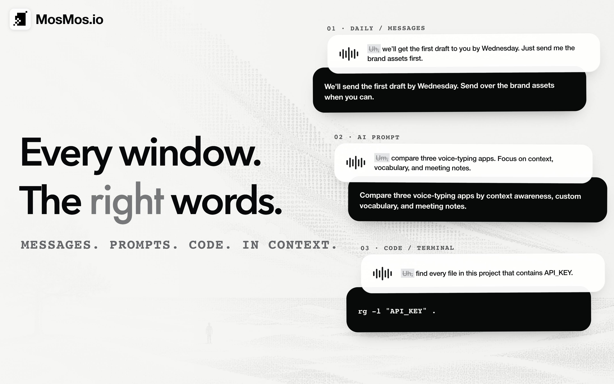
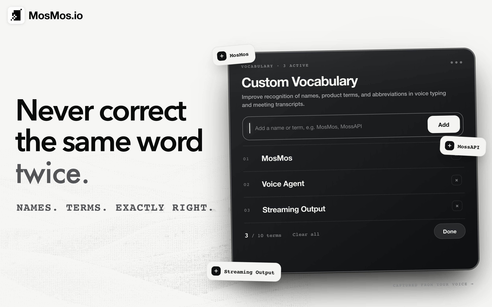

### 🎬 관련 영상
- [🎥 영상 보기](https://ph-files.imgix.net/c839a6ba-a54e-4ee0-b9a7-ffd96b95e448.jpeg?auto=format)

---

## 4. [Sider Omni Sidebar](https://www.producthunt.com/products/sider-omni)
**Votes**: 281 | **도입 난이도**: 하 | **신뢰도**: 상
**Tagline**: Give every Mac app an Agent Sidebar
**서비스 링크**: https://www.producthunt.com/r/GXEZU22QAYGGP5

**태그**: Productivity, AI Agent, Mac App, Automation, Agent, AI Tool, Chat, DevTool

### 📌 이 서비스 한눈에 보기
모든 Mac 앱 옆에서 화면을 인식하고 즉시 작업하는 AI 에이전트 사이드바

### 🔑 주요 기능
- 화면 내용을 실시간으로 인식하여 별도의 복사/업로드 없이 작업 수행
- 사용 중인 Mac 앱 어디에서나 사이드바로 호출 가능
- GPT-6 Astra 기반의 강력한 추론 및 실행 능력

### 🙋 사용자에게 어떤 점이 좋은가
작업 중인 화면을 AI가 직접 보고 제어하므로, 데이터를 일일이 복사해서 챗봇에 붙여넣는 번거로움이 사라집니다.

### ✅ 지금 바로 써볼 기능
- 현재 작업 중인 앱에서 사이드바 호출하기
- 화면 인식 기능을 통한 자동화 작업 시도하기
- 기존 ChatGPT/Codex 크레딧 연동 확인하기

### ⚠️ 사용 전 확인할 점
- 화면 내용을 실시간으로 읽으므로 개인정보 및 보안 주의 필요
- 기존 크레딧 사용 시 API 호출 비용 발생 가능성 확인

### 🧭 확인이 더 필요한 정보
GPT-6 Astra 모델의 실제 성능과 기존 크레딧 연동 방식에 대한 구체적인 기술 사양 확인이 필요합니다.

### 📸 스크린샷 및 갤러리
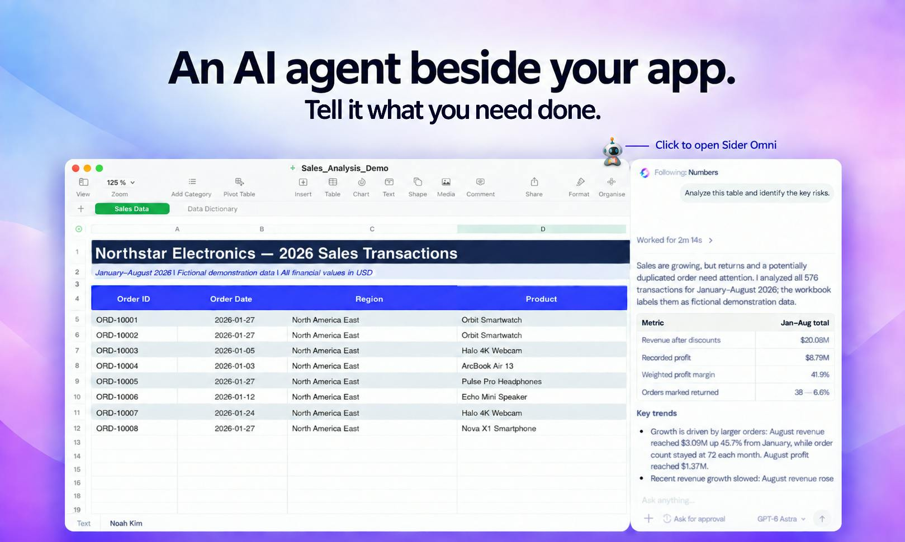
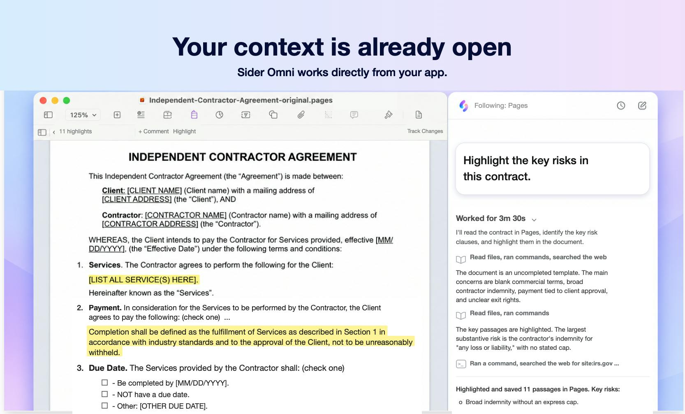
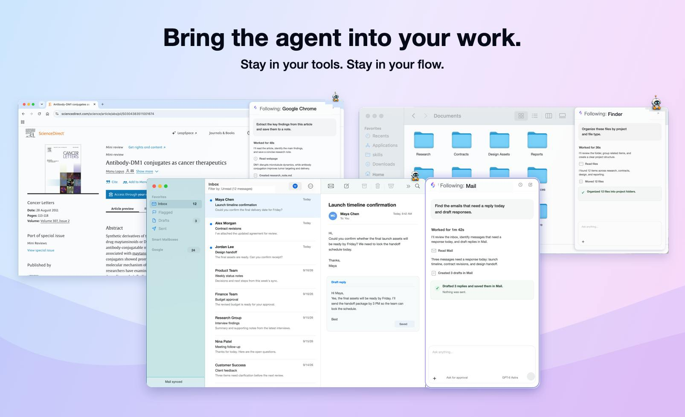

### 🎬 관련 영상
- [🎥 영상 보기](https://ph-files.imgix.net/f488399c-5ae9-4c95-a67d-8db7ce0aa004.jpeg?auto=format)

---

## 5. [ProductBridge](https://www.producthunt.com/products/productbridge)
**Votes**: 278 | **도입 난이도**: 중 | **신뢰도**: 상
**Tagline**: AI-native customer support and feedback agent
**서비스 링크**: https://www.producthunt.com/r/AMDH6JBWMRKU7M

**태그**: AI, CustomerSupport, ProductManagement, Automation, Agent, AI Tool, Chat, API

### 📌 이 서비스 한눈에 보기
고객 지원과 피드백 관리를 하나로 통합하여 데이터 기반의 로드맵을 구축하는 AI 에이전트

### 🔑 주요 기능
- 고객 지원, 피드백 보드, 설문 조사를 하나의 시스템으로 통합
- AI 에이전트가 고객 문의 응대 및 API/워크플로우를 통한 자동 작업 수행
- 모든 피드백을 도달 범위와 매출 기준으로 점수화하여 데이터 기반 의사결정 지원

### 🙋 사용자에게 어떤 점이 좋은가
여러 도구를 옮겨 다닐 필요 없이 고객 피드백을 자동으로 정리하고, 우선순위가 높은 기능부터 제품에 반영할 수 있습니다.

### ✅ 지금 바로 써볼 기능
- AI 에이전트의 고객 응대 및 API 연동 기능 테스트
- 기존 고객 피드백 데이터의 자동 점수화 및 중복 제거 기능 확인
- Claude, ChatGPT, Cursor를 위한 MCP 연동 설정

### ⚠️ 사용 전 확인할 점
- AI 에이전트의 자동 응대가 기존 고객 서비스 품질에 미치는 영향 확인 필요
- 기존에 사용 중인 헬프데스크나 피드백 도구와의 데이터 마이그레이션 복잡성

### 🧭 확인이 더 필요한 정보
기존 외부 도구들과의 데이터 동기화 방식 및 API 연동의 상세 범위에 대한 확인이 필요합니다.

### 📸 스크린샷 및 갤러리
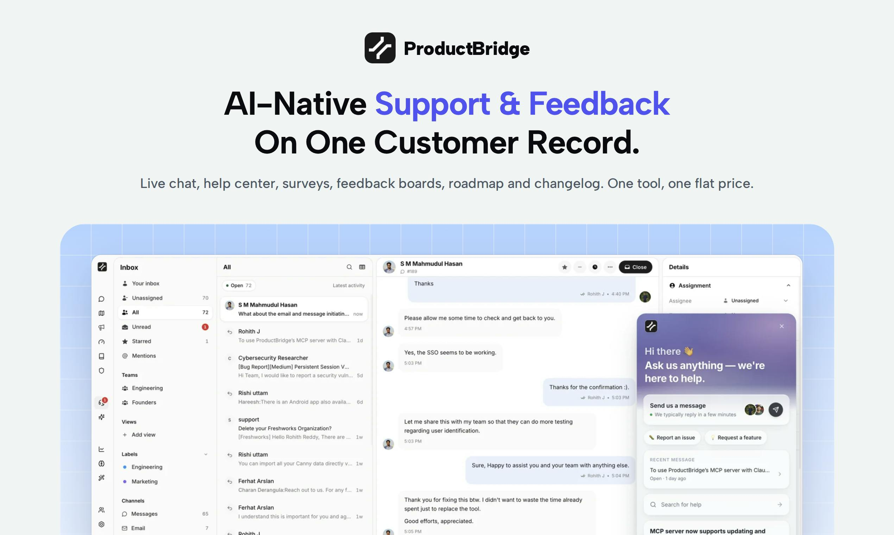
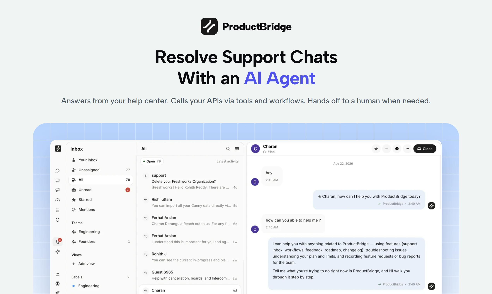
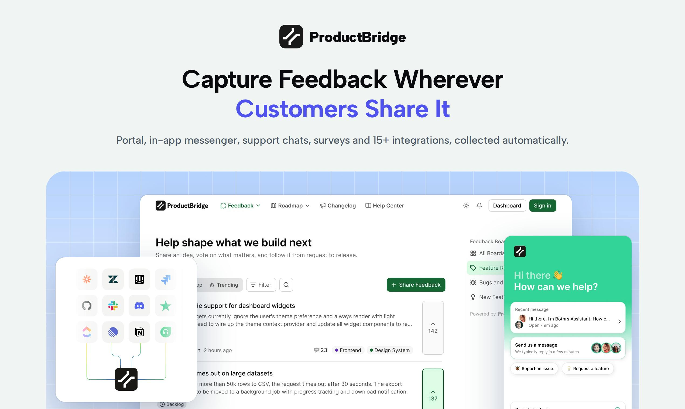

---

## 6. [Ari by Ariso](https://www.producthunt.com/products/ariso)
**Votes**: 263 | **도입 난이도**: 중 | **신뢰도**: 상
**Tagline**: AI bar raiser for the most ambitious teams
**서비스 링크**: https://www.producthunt.com/r/TOLICSA65DTFQU

**태그**: Productivity, AI, Team Management, Workflow, AI Tool

### 📌 이 서비스 한눈에 보기
팀의 실행 표준을 높이고 업무 효율을 극대화하는 AI 기반 성과 관리 도구

### 🔑 주요 기능
- 업무 프로세스 자동화를 통한 실행 표준 유지 및 성장 지원
- 커뮤니케이션 정렬, 우선순위 관리, 실행 추적 기능 제공
- 반복적인 관리 업무를 줄여 핵심 프로젝트에 집중할 수 있는 환경 조성

### 🙋 사용자에게 어떤 점이 좋은가
팀 운영에 소모되는 부수적인 업무(work about work)를 줄여, 팀원들이 더 가치 있고 도전적인 프로젝트에 집중할 수 있게 돕습니다.

### ✅ 지금 바로 써볼 기능
- 팀의 업무 우선순위 및 커뮤니케이션 정렬 기능 테스트
- 진척도 보고 및 실행 추적 워크플로우 설정
- 기존 업무 방식과의 정렬 및 자동화 수준 확인

### ⚠️ 사용 전 확인할 점
- 기존 협업 툴(Slack, Jira 등)과의 연동 방식 확인 필요
- 팀의 고유한 업무 문화와 AI 가이드라인 간의 적합성 검토 필요

### 🧭 확인이 더 필요한 정보
구체적인 기능 구현 방식과 기존 협업 도구와의 통합 수준에 대한 정보가 부족합니다.

### 📸 스크린샷 및 갤러리
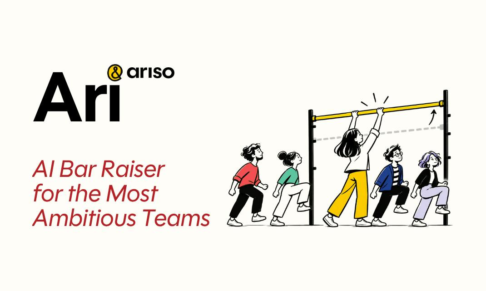
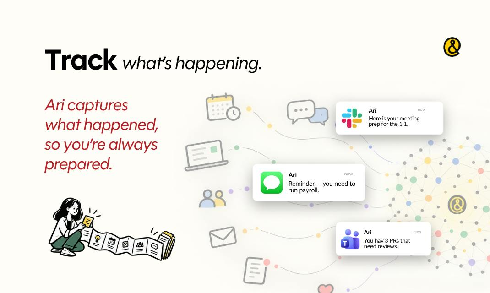
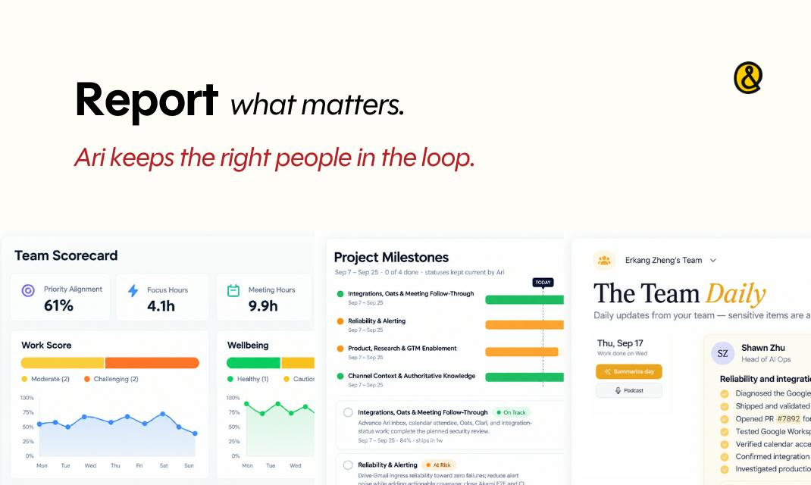

---

## 7. [Keysake](https://www.producthunt.com/products/keysake-ai)
**Votes**: 239 | **도입 난이도**: 하 | **신뢰도**: 상
**Tagline**: Learn English as you type Chinese
**서비스 링크**: https://www.producthunt.com/r/SB7PVOG23C2Z33

**태그**: Productivity, LanguageLearning, macOS, Education

### 📌 이 서비스 한눈에 보기
중국어를 입력하는 과정에서 자연스럽게 영어를 학습할 수 있는 macOS용 입력기

### 🔑 주요 기능
- 중국어 입력 시 옆에 영어 표현을 함께 표시
- 원하는 단어, 구절, 문장을 저장하는 기능 제공
- macOS 전용 무료 입력 방식

### 🙋 사용자에게 어떤 점이 좋은가
일상적인 타이핑 습관을 활용해 별도의 공부 시간 없이도 영어 실력을 향상시킬 수 있습니다.

### ✅ 지금 바로 써볼 기능
- macOS에 설치하여 기본 입력기로 설정하기
- 자주 쓰는 문장을 저장하여 학습하기
- 제공되는 영어 표현 익히기

### ⚠️ 사용 전 확인할 점
- 현재 macOS 전용이며 다른 OS 지원 여부 미정
- 현재는 중국어 중심이며 일본어, 한국어 등은 출시 예정

### 🧭 확인이 더 필요한 정보
향후 추가될 다국어 지원 기능의 구체적인 일정과 기능 범위는 확인이 필요합니다.

### 📸 스크린샷 및 갤러리
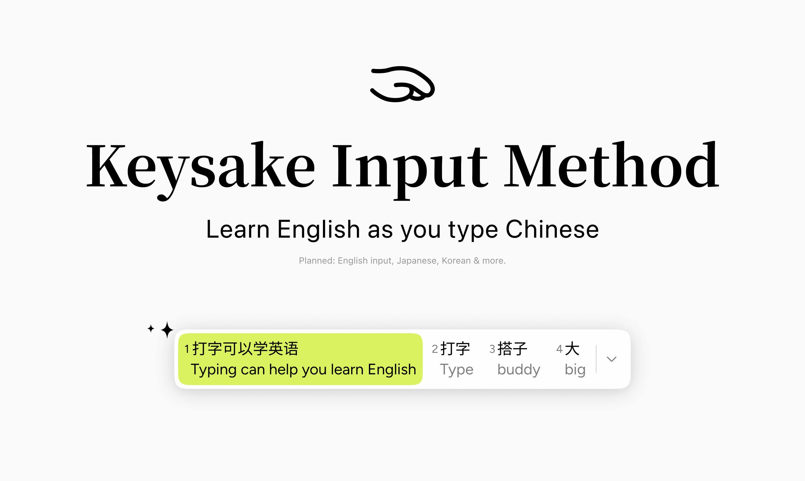
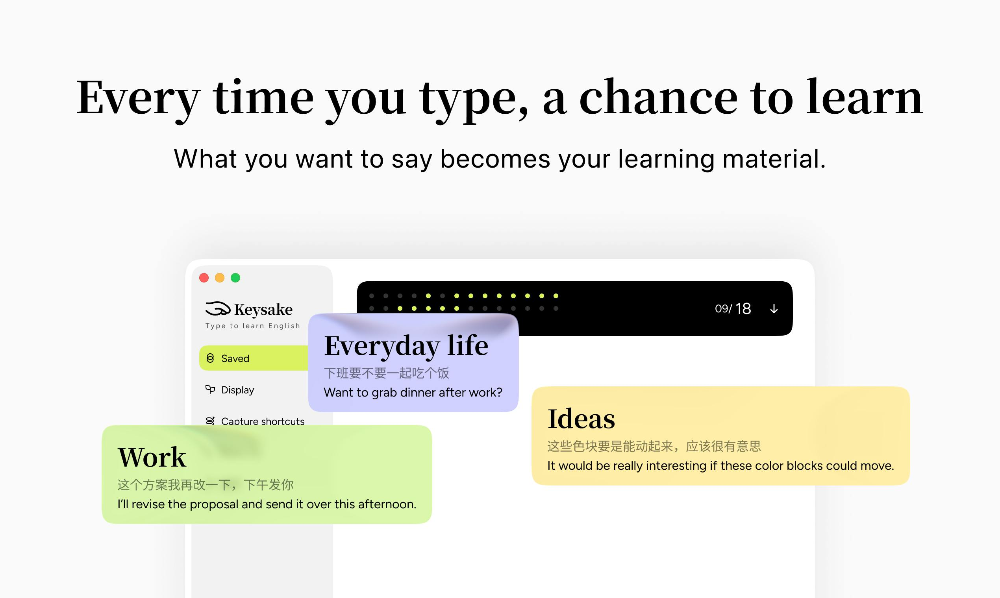
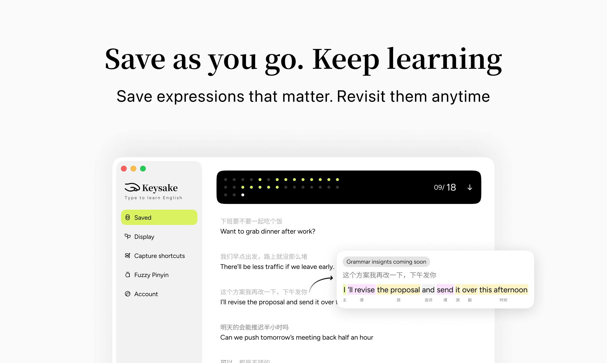

### 🎬 관련 영상
- [🎥 영상 보기](https://ph-files.imgix.net/690e047e-01e6-402f-b7b0-4bbe93990dde.jpeg?auto=format)

---

## 8. [Nepotism Network](https://www.producthunt.com/products/nepo-network)
**Votes**: 142 | **도입 난이도**: 하 | **신뢰도**: 상
**Tagline**: Great things start by knowing friend of a friend of a friend
**서비스 링크**: https://www.producthunt.com/r/P3AUURDV2OVZH3

**태그**: Networking, SocialMedia, Productivity

### 📌 이 서비스 한눈에 보기
지인 네트워크를 활용해 목표 인물에게 도달하는 최적의 경로를 찾아주는 네트워킹 맵

### 🔑 주요 기능
- X(트위터) 상의 인맥 관계를 시각화하여 연결 경로 탐색
- 목표 인물에게 도달하기 위한 단계별 연결 고리 및 순위 제공
- 효과적인 소개(Warm Intro)를 위한 메시지 초안 작성 및 아웃리치 관리

### 🙋 사용자에게 어떤 점이 좋은가
내가 직접 알지 못하는 인물에게 지인을 통해 자연스럽게 접근할 수 있는 전략적 경로를 제공합니다.

### ✅ 지금 바로 써볼 기능
- 내 X(트위터) 계정 연결 및 네트워크 맵 생성
- 연결하고 싶은 인물을 타겟으로 설정하여 최적의 경로 확인
- 제안된 경로를 바탕으로 소개 요청 메시지 초안 작성

### ⚠️ 사용 전 확인할 점
- X(트위터) 데이터 접근 권한 및 개인정보 보호 정책 확인 필요
- 실제 인맥의 신뢰도나 관계의 깊이는 서비스가 보장하지 않음

### 🧭 확인이 더 필요한 정보
X(트위터) API를 통한 데이터 동기화 방식과 개인정보 보안 수준에 대한 상세 정보가 필요합니다.

### 📸 스크린샷 및 갤러리
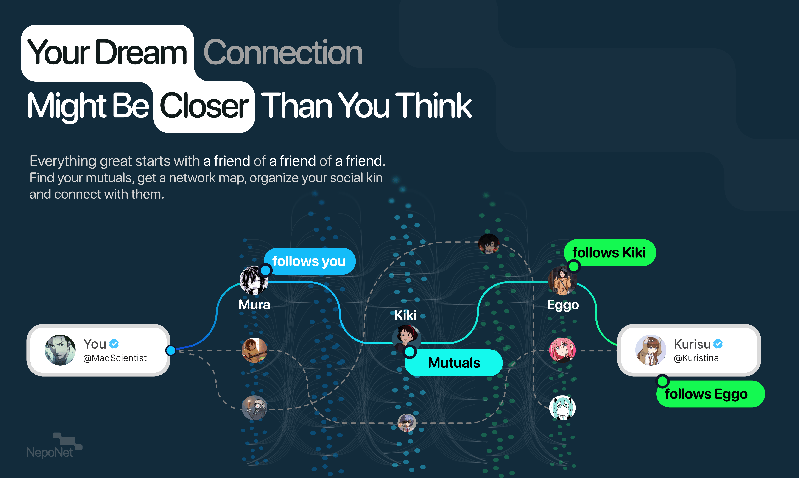
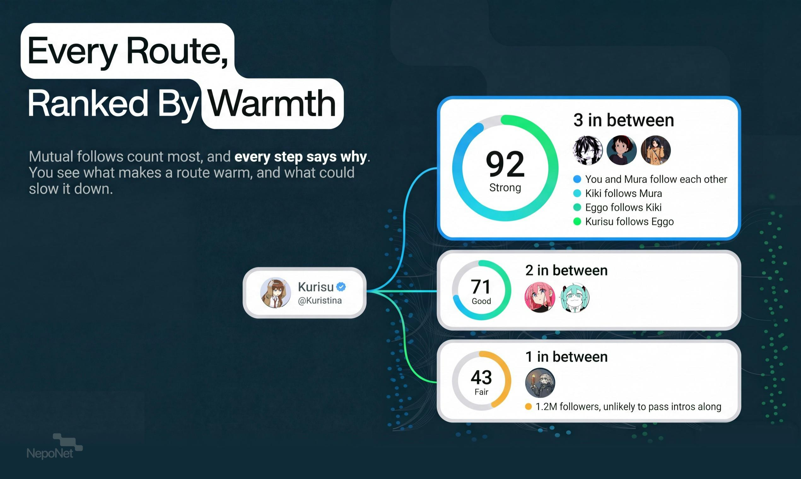
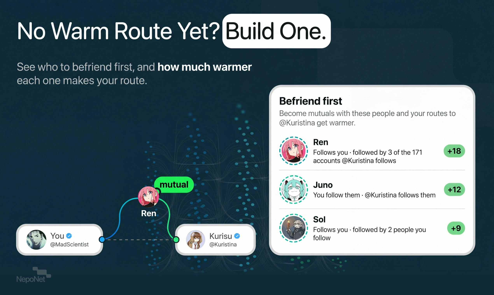

### 🎬 관련 영상
- [🎥 영상 보기](https://ph-files.imgix.net/ed58392c-9ec7-4790-9a8c-8bc1572eb643.jpeg?auto=format)

---

## 9. [Pushary](https://www.producthunt.com/products/pushary)
**Votes**: 132 | **도입 난이도**: 하 | **신뢰도**: 상
**Tagline**: Every agent accessible via your Mac’s notch
**서비스 링크**: https://www.producthunt.com/r/GP6PB77CGSKV7N

**태그**: DevTool, Productivity, AI, Mac, Automation, Agent

### 📌 이 서비스 한눈에 보기
Mac의 노치 영역을 활용해 AI 에이전트와 터미널을 즉각 제어하는 초경량 생산성 도구

### 🔑 주요 기능
- Claude Code, Cursor, VS Code 등 주요 AI 에이전트 통합 지원
- Mac 노치 영역을 활용한 직관적인 UI 및 단축키 기반 워크플로우
- 8MB 다운로드/38MB 점유율의 매우 가볍고 빠른 네이티브 성능

### 🙋 사용자에게 어떤 점이 좋은가
터미널로 이동하거나 브라우저를 뒤지는 번거로움 없이, 작업 흐름을 끊지 않고 AI의 승인 요청이나 답변을 즉시 처리할 수 있습니다.

### ✅ 지금 바로 써볼 기능
- 노치 영역을 통한 AI 에이전트 승인 워크플로우 테스트
- 터미널 점프 및 모바일 원격 응답 기능 확인
- 로컬 리소스 점유율 및 반응 속도 체크

### ⚠️ 사용 전 확인할 점
- Mac 노치 디자인에 최적화되어 있어 화면 구성에 따른 시각적 제약이 있을 수 있음
- 다양한 CLI 및 IDE 도구와의 호환성 확인 필요

### 🧭 확인이 더 필요한 정보
제공된 설명만으로는 모바일 기기와의 구체적인 연결 방식(웹 기반 또는 전용 앱)을 알 수 없습니다.

### 📸 스크린샷 및 갤러리
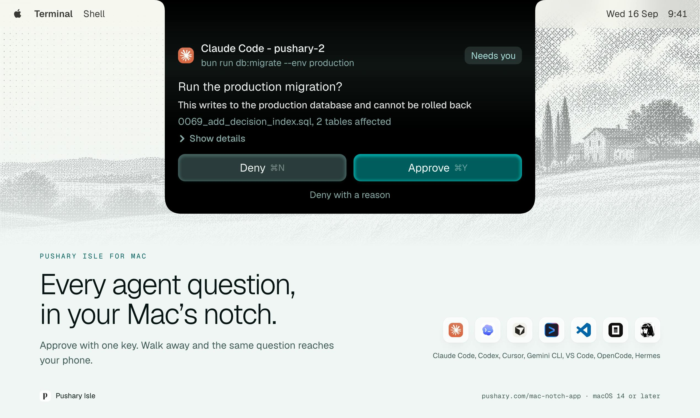
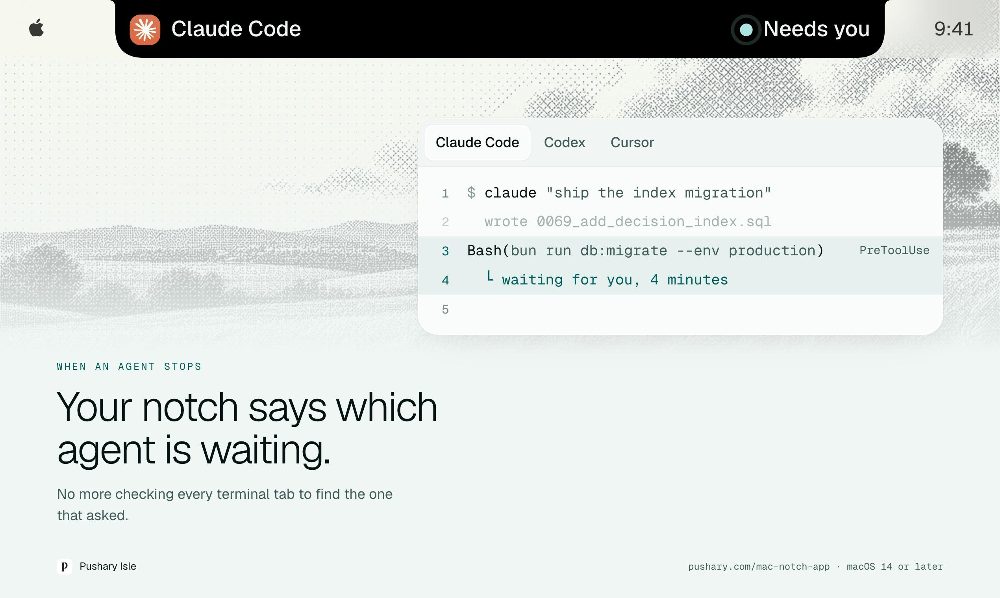
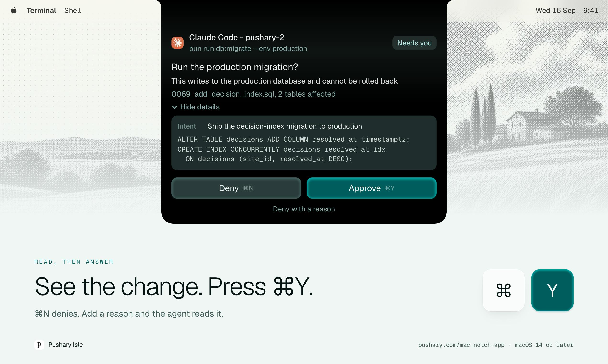

### 🎬 관련 영상
- [🎥 영상 보기](https://ph-files.imgix.net/2a1ed932-d369-4cb1-8261-398e0f48b306.jpeg?auto=format)

---

## 10. [Makersclaw 2.0](https://www.producthunt.com/products/makersclaw)
**Votes**: 124 | **도입 난이도**: 중 | **신뢰도**: 상
**Tagline**: The operating system for a company run by agents
**서비스 링크**: https://www.producthunt.com/r/YTJLM2SBTWHMLF

**태그**: AI, Automation, Agentic-Workflow, GTM, SaaS, Agent, AI Tool

### 📌 이 서비스 한눈에 보기
목표만 입력하면 필요한 앱, 에이전트, 자동화를 스스로 구축하는 AI 운영 체제

### 🔑 주요 기능
- 단순한 에이전트 고용을 넘어 목표 달성을 위한 도구 자체를 생성
- 설정된 예산 범위 내에서 지속적인 작업 수행 및 결과 기록
- 초기 단계로 GTM(Go-to-Market) 전략 실행에 특화

### 🙋 사용자에게 어떤 점이 좋은가
특정 역할을 가진 직원을 채용하는 대신, 목표를 달성하기 위한 맞춤형 자동화 시스템을 즉시 구축할 수 있습니다.

### ✅ 지금 바로 써볼 기능
- 달성하고자 하는 비즈니스 목표 입력하기
- 설정된 예산 범위 내에서 자동화 워크플로우 확인하기
- GTM 자동화 기능 테스트하기

### ⚠️ 사용 전 확인할 점
- 현재 GTM(시장 진입) 분야에 초점이 맞춰져 있어 다른 도메인 활용도는 미지수임
- 자동화 도구 생성 방식에 따른 예산 관리 및 결과물 품질 확인 필요

### 🧭 확인이 더 필요한 정보
목표 설정 시 생성되는 앱과 에이전트의 구체적인 기술 스택과 확장 가능성을 확인해야 합니다.

### 📸 스크린샷 및 갤러리
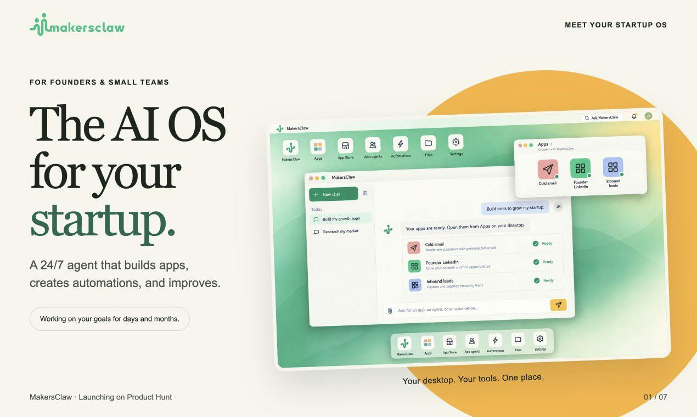
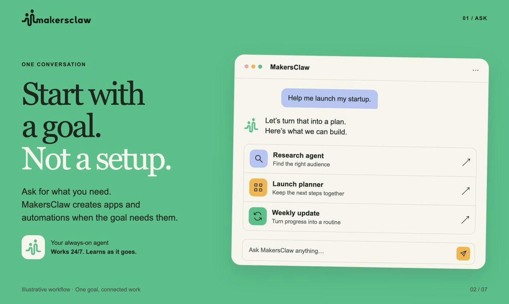
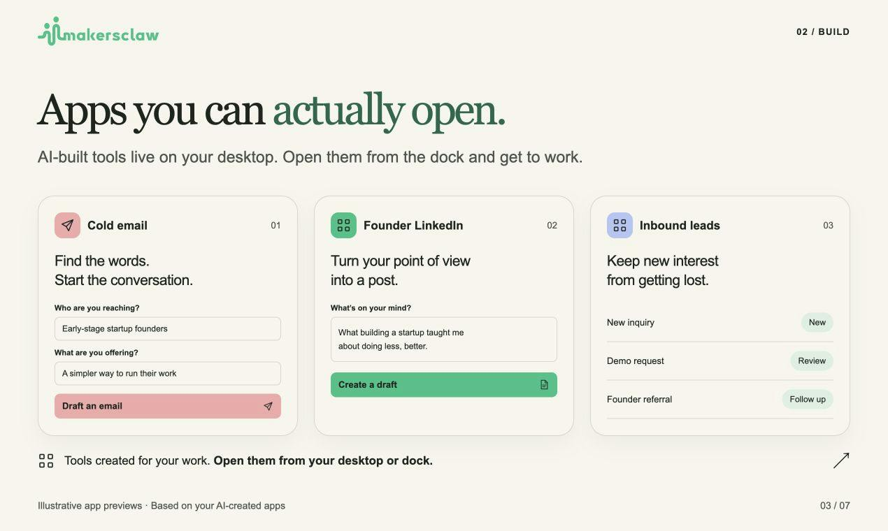

### 🎬 관련 영상
- [🎥 영상 보기](https://ph-files.imgix.net/3f906620-6f91-4b20-b750-827d30d4bb0b.jpeg?auto=format)

---

## 11. [ApplySeed](https://www.producthunt.com/products/applyseed)
**Votes**: 123 | **도입 난이도**: 하 | **신뢰도**: 상
**Tagline**: Raise your seed from accelerators
**서비스 링크**: https://www.producthunt.com/r/O66AZNFJPYGZYQ

**태그**: Startup, Automation, AI, Fundraising, AI Tool, Chat, Prompting

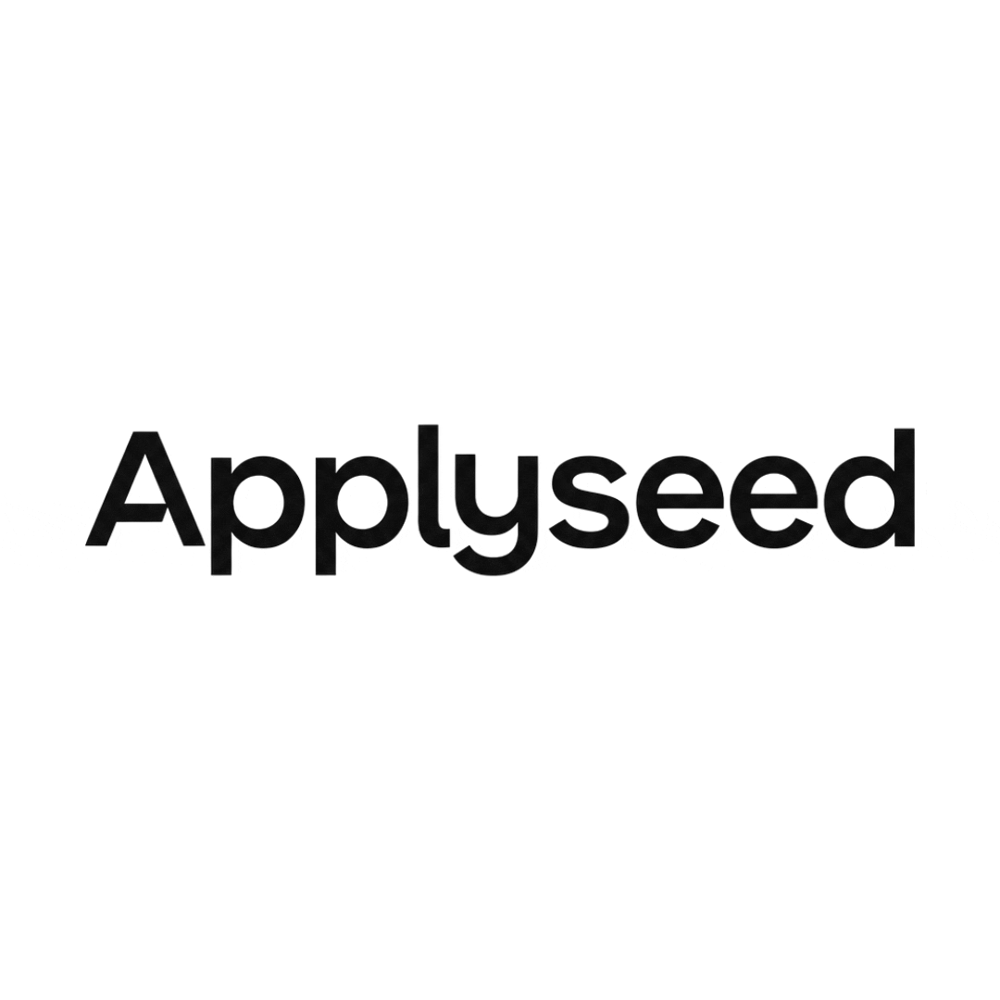

### 📌 이 서비스 한눈에 보기
액셀러레이터 지원 과정을 자동화하여 합격 가능성을 높이는 스타트업 지원 도구

### 🔑 주요 기능
- 사용자의 기존 자료(덱, 노트 등)를 기반으로 지원 정보 자동 생성
- 지원 자격에 맞는 프로그램 매칭 및 부족한 정보 식별
- 각 프로그램의 지원 양식에 맞춰 정보를 자동 최적화 및 입력

### 🙋 사용자에게 어떤 점이 좋은가
반복적인 지원서 작성 시간을 줄이고, 각 프로그램의 요구사항에 맞게 정보를 최적화하여 합격 확률을 높일 수 있습니다.

### ✅ 지금 바로 써볼 기능
- 기존 스타트업 덱 또는 메모 업로드하기
- AI 프롬프트를 활용해 스타트업 정보 생성하기
- 매칭된 프로그램 리스트 확인 및 지원서 자동 채우기

### ⚠️ 사용 전 확인할 점
- AI가 생성한 내용이 실제 사업 내용과 일치하는지 최종 검토 필수
- 프로그램별로 상이한 특수 질문에 대한 대응력 확인 필요

### 🧭 확인이 더 필요한 정보
AI가 생성한 정보가 각 액셀러레이터의 개별적인 검토 기준을 얼마나 완벽하게 충족할 수 있는지 확인이 필요합니다.

### 📸 스크린샷 및 갤러리
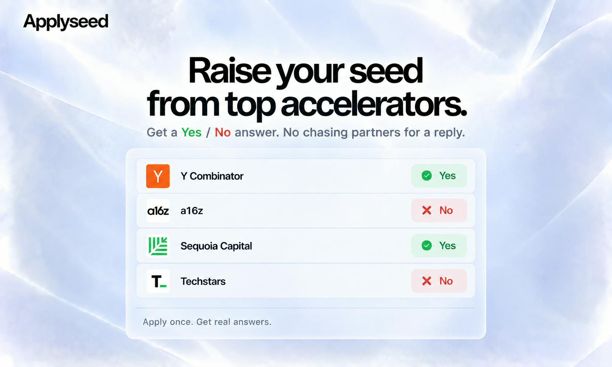
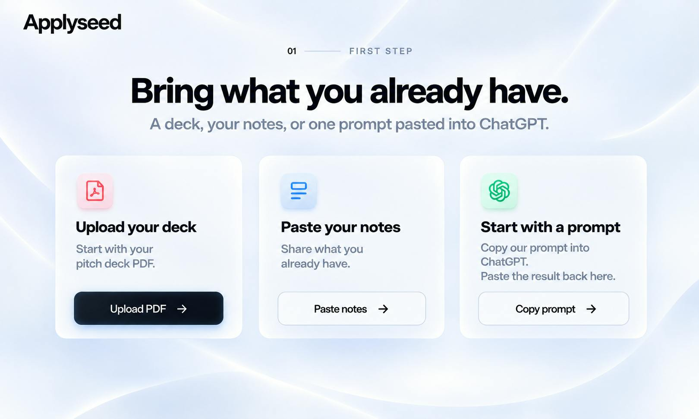
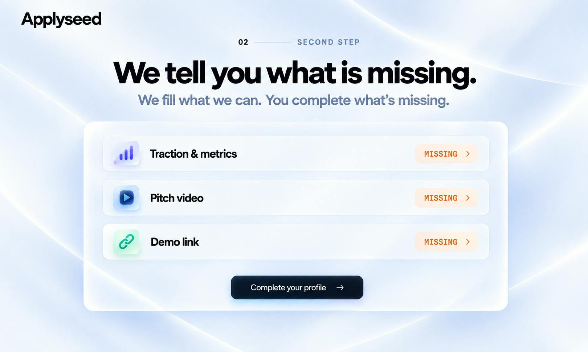

### 🎬 관련 영상
- [🎥 영상 보기](https://ph-files.imgix.net/2bd6f4e8-800f-467c-a41c-670fb03976c9.jpeg?auto=format)

---

## 12. [Toone](https://www.producthunt.com/products/toone)
**Votes**: 114 | **도입 난이도**: 하 | **신뢰도**: 상
**Tagline**: Build complex, reliable AI agent workflows & routines
**서비스 링크**: https://www.producthunt.com/r/JXLR7WXUFCQF3K

**태그**: AI, Automation, Workflow, DevTool, Agent, AI Tool, Chat

### 📌 이 서비스 한눈에 보기
자연어로 복잡하고 신뢰할 수 있는 AI 에이전트 워크플로우를 구축하고 관리하는 도구

### 🔑 주요 기능
- 자연어를 통한 복잡한 AI 워크플로우 및 루틴 구축
- 단계별 가시성 확보를 통한 정밀한 디버깅 및 제어
- 중단된 지점부터 편집 및 재개 가능한 워크플로우 관리

### 🙋 사용자에게 어떤 점이 좋은가
복잡한 AI 작업을 자동화하면서도 각 단계의 실행 과정을 투명하게 관리할 수 있어, 프로덕션 환경에 적합한 예측 가능한 AI 워크플로우를 만들 수 있습니다.

### ✅ 지금 바로 써볼 기능
- 자연어로 첫 번째 AI 루틴 설계하기
- 단계별 디버깅 기능을 통한 워크플로우 검증
- 멀티모달 기능을 활용한 단계 간 데이터 연동

### ⚠️ 사용 전 확인할 점
- OpenAI 또는 Anthropic 계정이 반드시 필요함
- 사용자의 API 계정 비용이 별도로 발생함

### 🧭 확인이 더 필요한 정보
사용자의 API 키를 직접 연결하는 방식인지, 별도의 플랫폼 비용이 있는지에 대한 상세 정보가 필요합니다.

### 📸 스크린샷 및 갤러리
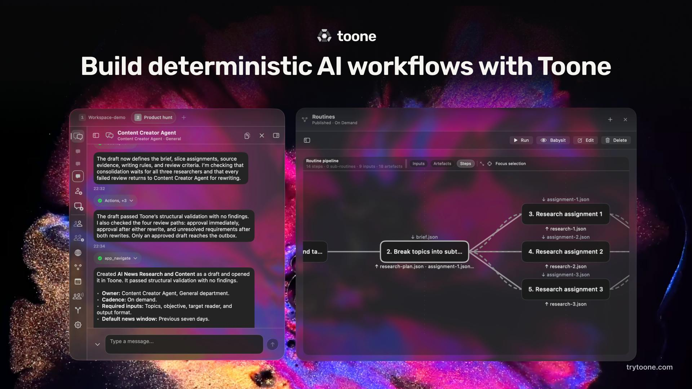
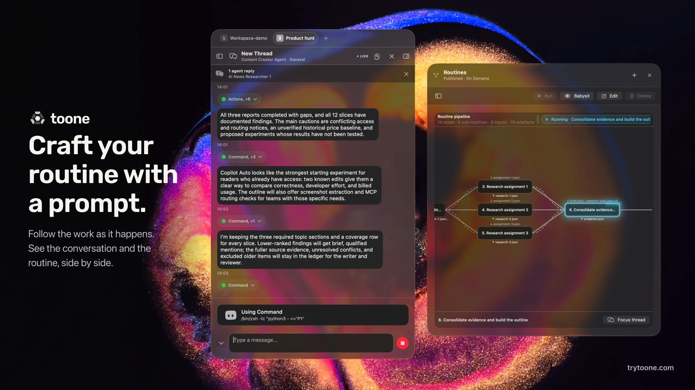
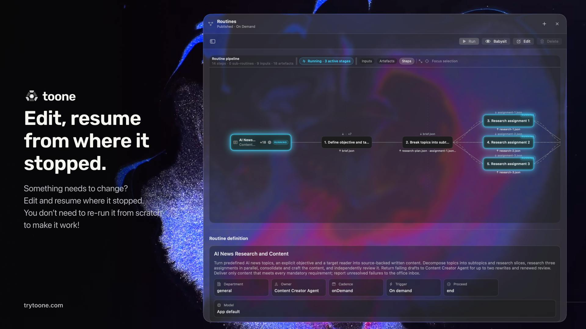

### 🎬 관련 영상
- [🎥 영상 보기](https://ph-files.imgix.net/7e7e6fe2-0db2-419d-99c7-6a5a68122828.jpeg?auto=format)

---

## 13. [Maaa](https://www.producthunt.com/products/maaa)
**Votes**: 107 | **도입 난이도**: 하 | **신뢰도**: 상
**Tagline**: A mom in your Mac’s notch, looking out for you
**서비스 링크**: https://www.producthunt.com/r/X7625PKJWDIVMR

**태그**: Productivity, Health, macOS

### 📌 이 서비스 한눈에 보기
맥북 노치에서 나타나 건강한 생활 습관을 챙겨주는 다정한 비서

### 🔑 주요 기능
- macOS 노치 영역을 활용한 직관적인 알림 제공
- 수분 섭취, 식사, 휴식 등 건강 관리 리마인더
- 12개 언어를 지원하는 글로벌 사용자 친화적 설계

### 🙋 사용자에게 어떤 점이 좋은가
업무에 몰입하다 놓치기 쉬운 기본적인 건강 습관을 맥북 화면 상단에서 자연스럽게 상기시켜 줍니다.

### ✅ 지금 바로 써볼 기능
- macOS 14 이상 버전 설치 및 실행
- 사용자에게 맞는 언어 설정
- 주기적인 휴식 및 수분 섭취 알림 활성화

### ⚠️ 사용 전 확인할 점
- macOS 14 이상의 운영체제 버전 필수
- 노치 영역을 사용하므로 화면 구성에 따른 시각적 간섭 가능성

### 🧭 확인이 더 필요한 정보
상세한 알림 주기 설정 및 커스텀 기능 여부는 명시되지 않았습니다.

### 📸 스크린샷 및 갤러리
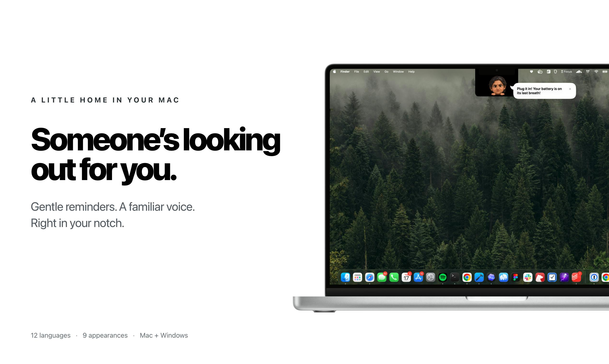
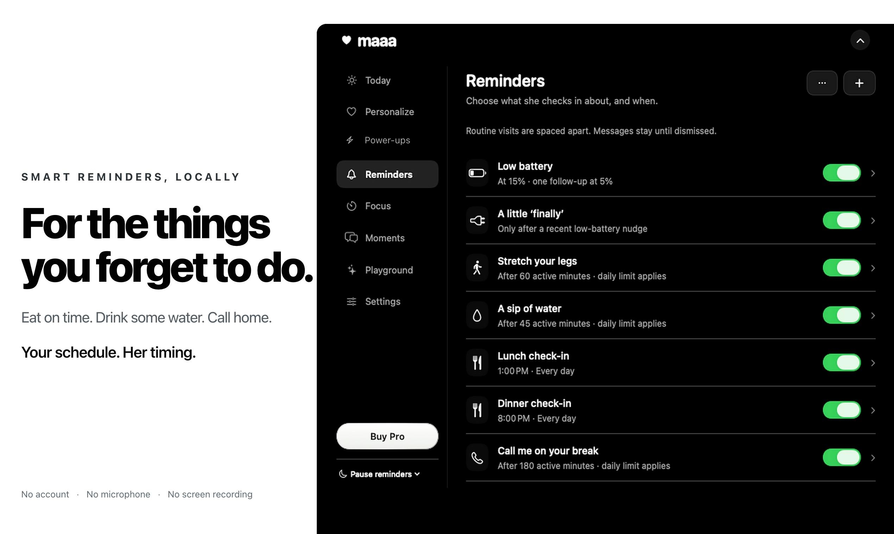

### 🎬 관련 영상
- [🎥 영상 보기](https://ph-files.imgix.net/af5c10ee-205a-4eae-a623-4ecd9d61a80b.jpeg?auto=format)

---

## 14. [Edgee Codex Compressor V2](https://www.producthunt.com/products/edgee)
**Votes**: 86 | **도입 난이도**: 하 | **신뢰도**: 상
**Tagline**: Use Codex at 35.6% lower costs
**서비스 링크**: https://www.producthunt.com/r/RAWCSWV6IYVZ4U

**태그**: DevTool, LLMOps, CostOptimization, Automation, AI Tool

### 📌 이 서비스 한눈에 보기
Edgee 압축 게이트웨이를 통해 Codex의 비용을 35.6% 절감하는 효율적인 컨텍스트 압축 솔루션

### 🔑 주요 기능
- 동일한 모델과 워크플로우 환경에서 입력 토큰 사용량 49.5% 감소
- 캐시 적중률(Cache Hit Rate)을 76.1%에서 85.4%로 향상
- 전체 세션 비용을 35.6% 절감하는 경제적 효율성 확보

### 🙋 사용자에게 어떤 점이 좋은가
동일한 결과물을 유지하면서도 토큰 소모를 줄여 LLM 운영 비용을 획기적으로 낮출 수 있습니다.

### ✅ 지금 바로 써볼 기능
- Edgee 압축 게이트웨이 연동 테스트
- 기존 Codex 워크플로우에 적용하여 비용 절감 수치 검증
- 압축 후 출력 품질(Output Quality) 유지 여부 확인

### ⚠️ 사용 전 확인할 점
- 컨텍스트 압축 과정에서 미세한 출력 품질 저하 가능성 확인 필요
- Edgee 게이트웨이 도입에 따른 추가적인 아키텍처 복잡도 검토

### 🧭 확인이 더 필요한 정보
압축 과정에서 손실될 수 있는 정보가 실제 사용자 워크플로우에 미치는 영향에 대한 상세 데이터가 필요합니다.

### 📸 스크린샷 및 갤러리
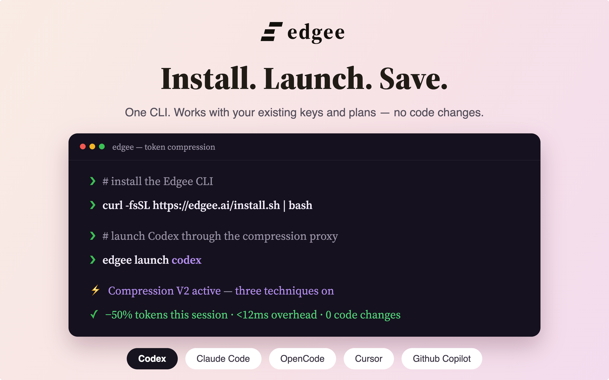
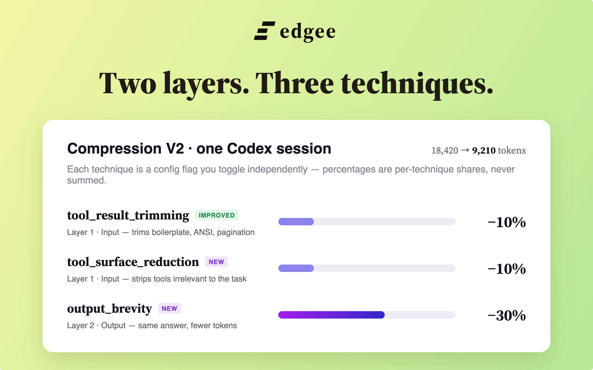
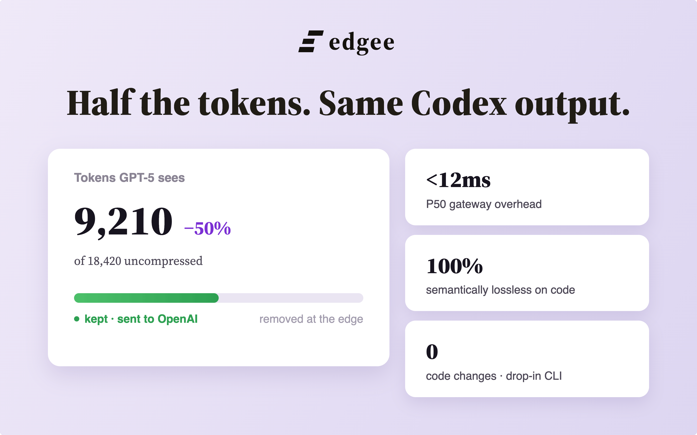

---

## 15. [citizen404](https://www.producthunt.com/products/citizen404)
**Votes**: 83 | **도입 난이도**: 하 | **신뢰도**: 상
**Tagline**: The AGI runs the world with GPT-6 Astra. Hunt citizen404!
**서비스 링크**: https://www.producthunt.com/r/6B5LNPLQVNRWKU

**태그**: Gaming, ARG, Multiplayer, AI-Driven, AI Tool, Email

### 📌 이 서비스 한눈에 보기
GPT-6 Astra가 주도하는 실시간 웹 기반 멀티플레이어 추적 게임

### 🔑 주요 기능
- 실제 웹사이트를 단서로 활용하는 몰입형 멀티플레이어 맨헌트 게임
- GPT-6 Astra를 통한 동적인 게임 진행 및 시나리오 전개
- 별도의 계정 없이 이메일을 저장 파일로 사용하는 간편한 방식

### 🙋 사용자에게 어떤 점이 좋은가
실제 웹 환경을 탐험하며 단서를 찾는 독특한 게임 경험을 제공하며, 이메일 기반의 간편한 플레이가 가능합니다.

### ✅ 지금 바로 써볼 기능
- 제공된 이메일로 전달되는 첫 번째 케이스 확인하기
- 웹 사이트 곳곳에 숨겨진 단서(Dead Drop) 찾아보기
- 찾은 단서를 파일에 기록하고 단어 재배열로 미션 완료하기

### ⚠️ 사용 전 확인할 점
- 이메일이 유일한 저장 방식이므로 계정 분실 시 데이터 복구가 어려울 수 있음
- 실제 웹사이트를 탐색하는 과정에서 보안 및 개인정보 노출 주의 필요

### 🧭 확인이 더 필요한 정보
GPT-6 Astra라는 기술이 실제 게임 플레이에 어떻게 구체적으로 작용하는지 명확한 기술적 사양은 공개되지 않았습니다.

### 📸 스크린샷 및 갤러리
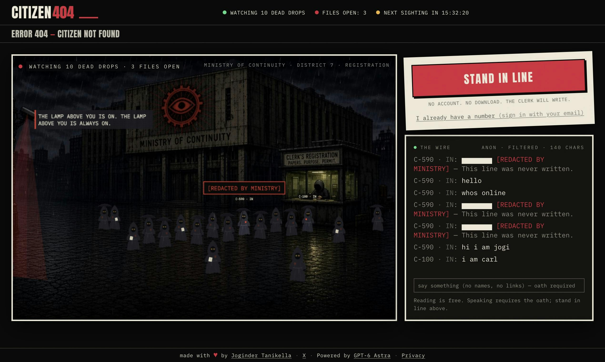
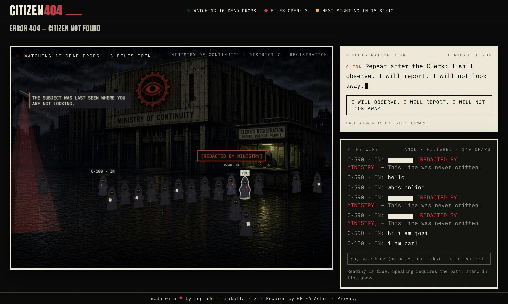
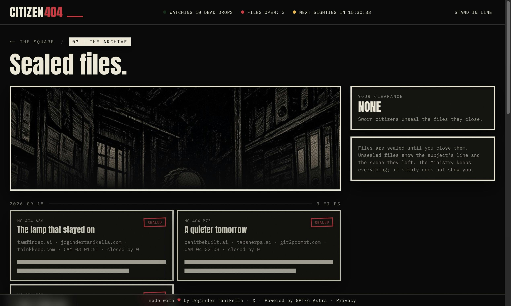

### 🎬 관련 영상
- [🎥 영상 보기](https://ph-files.imgix.net/e647a17d-12fb-4ce9-81e0-6c0a5d132f8b.gif?auto=format)

---

## 16. [WhaleRead](https://www.producthunt.com/products/whaleread)
**Votes**: 79 | **도입 난이도**: 중 | **신뢰도**: 상
**Tagline**: Locally translate TXT, Markdown, and EPUB
**서비스 링크**: https://www.producthunt.com/r/YIJCX6EQ57XWCG

**태그**: Productivity, macOS, AI, Reading, Privacy, AI Tool

### 📌 이 서비스 한눈에 보기
개인정보 유출 걱정 없이 내 컴퓨터에서 직접 실행되는 로컬 기반 문서 번역 및 독서 도구

### 🔑 주요 기능
- TXT, Markdown, EPUB 파일 지원 및 로컬 모델(7B/30B) 기반의 프라이빗 번역
- 원문과 번역문을 동시에 볼 수 있는 이중 언어 독서 환경 제공
- 사용자 검토 기능 및 AI에게 질문할 수 있는 Ask AI 기능 탑재

### 🙋 사용자에게 어떤 점이 좋은가
클라우드에 문서를 업로드하지 않고도 강력한 AI 번역 기능을 사용할 수 있어 보안이 중요한 문서를 읽기에 최적입니다.

### ✅ 지금 바로 써볼 기능
- 로컬 모델을 활용한 보안 중심의 문서 번역 경험하기
- 이중 언어 모드로 원문과 번역문을 대조하며 읽기
- Ask AI 기능을 통해 읽고 있는 문서 내용에 대해 질문하기

### ⚠️ 사용 전 확인할 점
- 로컬 모델 구동을 위한 macOS 하드웨어 사양(GPU/RAM) 확인 필요
- 모델 크기에 따른 번역 속도 및 시스템 리소스 점유율 차이 발생 가능

### 🧭 확인이 더 필요한 정보
사용자의 Mac 사양에 따른 최적의 모델 선택 가이드와 구체적인 성능 수치는 확인이 필요합니다.

### 📸 스크린샷 및 갤러리
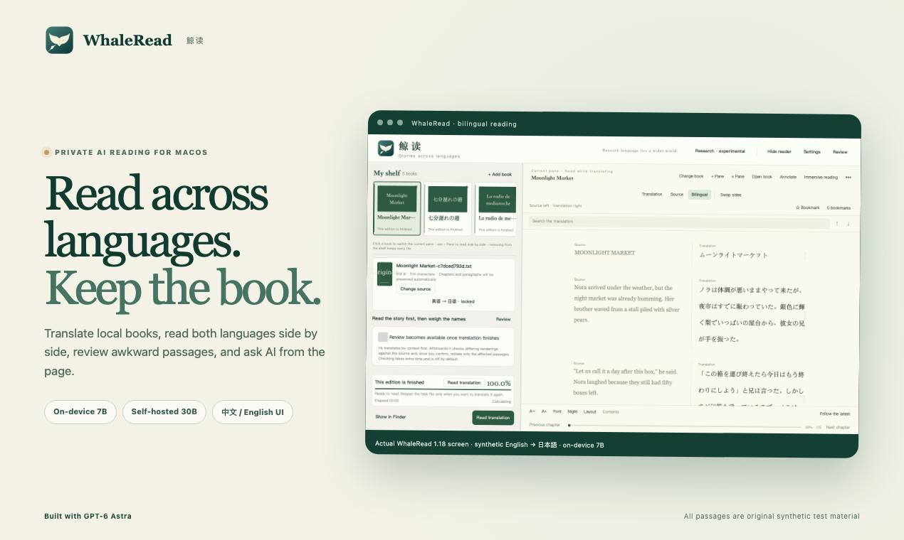
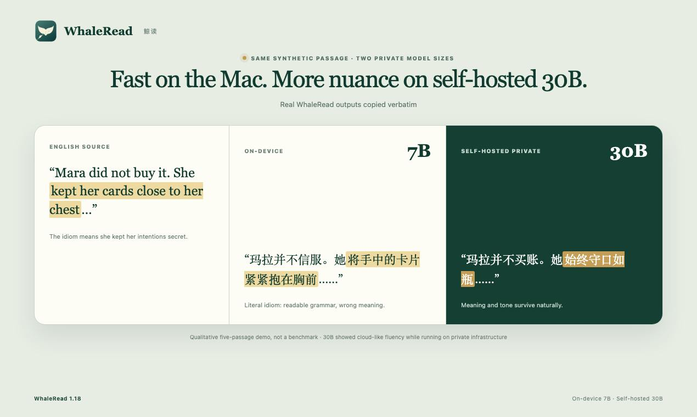
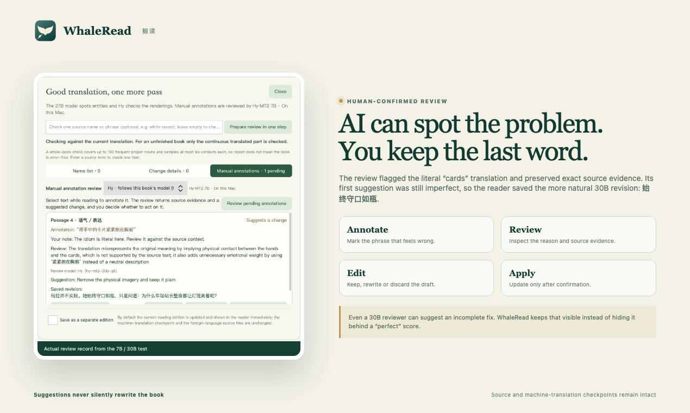

---

## 17. [Agent Interface](https://www.producthunt.com/products/agent-interface)
**Votes**: 77 | **도입 난이도**: 중 | **신뢰도**: 상
**Tagline**: Give AI agents a better way to use computers
**서비스 링크**: https://www.producthunt.com/r/5LFVWTVYOTHNU4

**태그**: AI, Automation, OpenSource, AgenticWorkflow, Agent, AI Tool

### 📌 이 서비스 한눈에 보기
AI 에이전트의 작업 효율을 극대화하는 오픈소스 컴퓨터 제어 레이어

### 🔑 주요 기능
- 반복적인 스크린샷 촬영 및 모델 호출 최소화
- 학습된 상호작용 재사용 및 로컬 액션-피드백 루프 실행
- 모델의 판단이 필요한 시점에만 지능적 호출

### 🙋 사용자에게 어떤 점이 좋은가
AI 에이전트가 컴퓨터를 사용할 때 발생하는 대기 시간과 비용을 줄여 더 빠르고 효율적인 자동화 환경을 제공합니다.

### ✅ 지금 바로 써볼 기능
- 데스크톱 리서치 프리뷰 실행해보기
- Astra/Freedoom 실험 프로젝트 살펴보기
- 오픈소스 코드베이스 검토하기

### ⚠️ 사용 전 확인할 점
- 현재 데스크톱 리서치 프리뷰 단계로 실험적 기능 위주임
- 로컬 실행 환경 및 에이전트 제어 권한 설정 필요

### 🧭 확인이 더 필요한 정보
현재 제공되는 기능이 실험적 단계이므로 실제 운영 환경에서의 안정성 확인이 필요합니다.

### 📸 스크린샷 및 갤러리
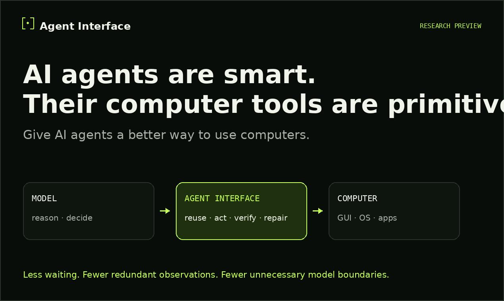
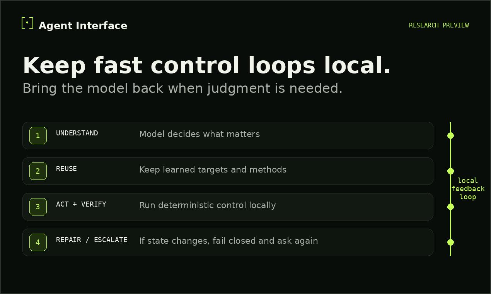
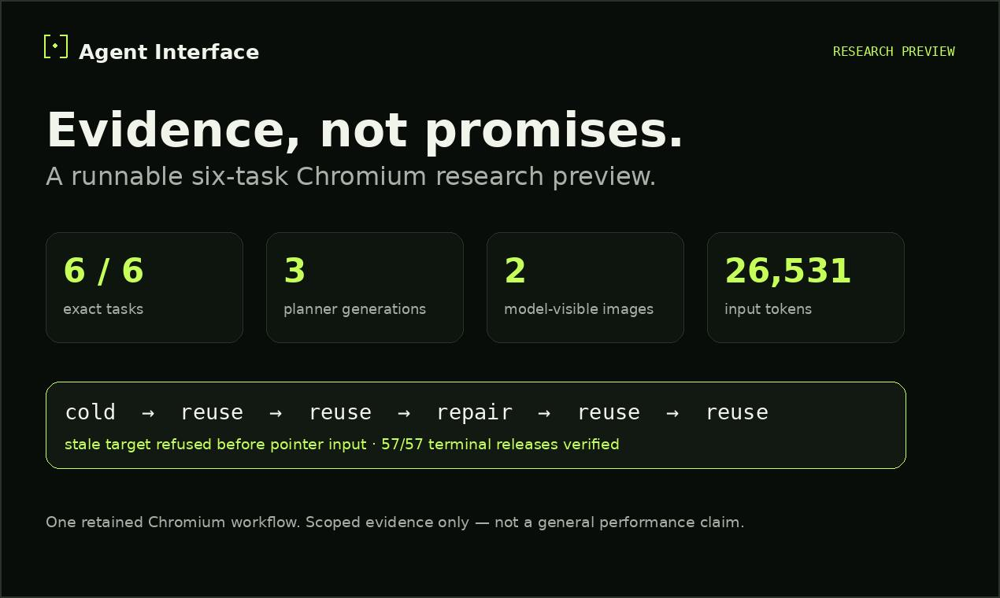

---

## 18. [Bring Them to Life](https://www.producthunt.com/products/bring-them-to-life)
**Votes**: 77 | **도입 난이도**: 하 | **신뢰도**: 상
**Tagline**: Bring your product to life with friendly animations.
**서비스 링크**: https://www.producthunt.com/r/3PQEDQ63ZRT3QO

**태그**: DesignTool, NoCode, UX, Animation, AI Tool

### 📌 이 서비스 한눈에 보기
복잡한 애니메이션 작업 없이 나만의 마스코트를 생동감 넘치는 인터랙티브 요소로 변환해주는 도구

### 🔑 주요 기능
- 애니메이션 소프트웨어 학습 없이 마스코트에 12가지 감정 표현 부여
- WebP, Lottie, PNG 등 다양한 포맷 지원으로 웹/모바일/데스크톱 앱에 즉시 활용 가능
- 자체 아트워크를 사용하거나 새로운 마스코트를 직접 생성 가능

### 🙋 사용자에게 어떤 점이 좋은가
개발자나 디자이너가 복잡한 애니메이션 제작 과정 없이도 앱에 친근하고 개인화된 사용자 경험을 즉각적으로 도입할 수 있습니다.

### ✅ 지금 바로 써볼 기능
- 자신의 아트워크를 업로드하여 마스코트 애니메이션 생성해보기
- 12가지 반응 중 앱 성격에 맞는 애니메이션 선택하기
- Lottie 또는 WebP 파일을 다운로드하여 프로젝트에 적용하기

### ⚠️ 사용 전 확인할 점
- 사용자 정의 아트워크의 복잡도에 따라 애니메이션 결과물이 달라질 수 있음
- 제공되는 12가지 반응 외의 특수한 동작 구현은 제한적일 수 있음

### 🧭 확인이 더 필요한 정보
사용자 정의 아트워크를 업로드했을 때 애니메이션이 얼마나 정교하게 적용되는지에 대한 구체적인 기술적 사양은 확인이 필요합니다.

### 📸 스크린샷 및 갤러리

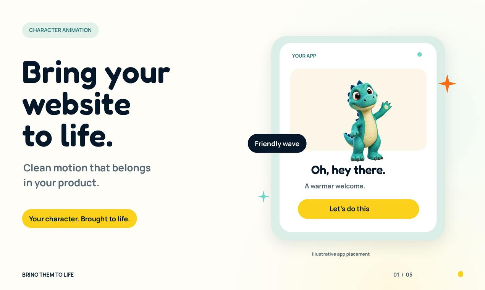
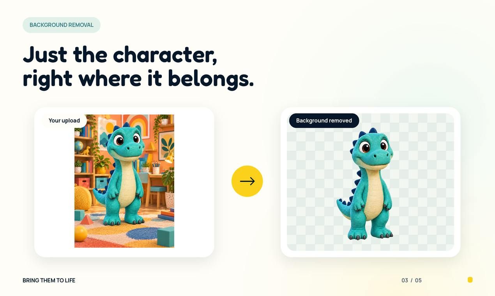

### 🎬 관련 영상
- [🎥 영상 보기](https://ph-files.imgix.net/7bfd7dee-74a1-49ba-9820-df553f9058ca.jpeg?auto=format)

---

## 19. [cubicles.lol](https://www.producthunt.com/products/cubicles-lol)
**Votes**: 75 | **도입 난이도**: 하 | **신뢰도**: 상
**Tagline**: A metaverse for builders, side projects, and bad driving
**서비스 링크**: https://www.producthunt.com/r/SRORW4QN2NI4OO

**태그**: Metaverse, Social, Creative, NoCode, AI Tool

### 📌 이 서비스 한눈에 보기
나만의 가상 공간을 꾸미고 빌더들과 소통하는 브라우저 기반 멀티플레이어 메타버스

### 🔑 주요 기능
- 개인용 큐비클(공간) 점유 및 커스터마이징 기능
- 레이싱, 낚시, 스케이트보드 등 휴식을 위한 미니게임 제공
- 계정 생성이나 다운로드 없이 브라우저에서 즉시 접속 가능

### 🙋 사용자에게 어떤 점이 좋은가
프로젝트를 시각적으로 전시할 공간이 필요한 빌더들에게 재미있는 소통 창구를 제공하며, 별도의 설치 없이 즉각적인 경험이 가능합니다.

### ✅ 지금 바로 써볼 기능
- 자신만의 큐비클 공간 확보하기
- 주변 빌더들과 인사 나누기
- 미니게임을 통해 휴식 시간 즐기기

### ⚠️ 사용 전 확인할 점
- 계정 없이 이용하므로 브라우저 데이터 삭제 시 설정이 초기화될 수 있음
- GPT-6 Astra 기반의 실험적 환경이므로 안정성 확인 필요

### 🧭 확인이 더 필요한 정보
계정 생성 없이 이용할 경우 데이터 저장 및 영구 보관 방식에 대한 확인이 필요합니다.

### 📸 스크린샷 및 갤러리
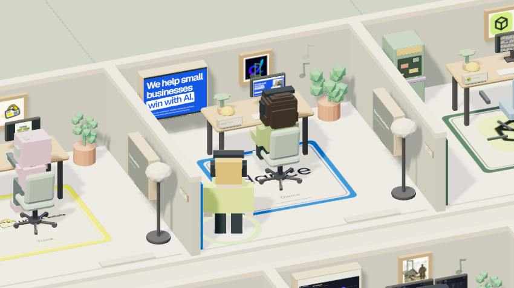

### 🎬 관련 영상
- [🎥 영상 보기](https://ph-files.imgix.net/ee58a5b3-e310-4180-8339-92ebe409da1e.jpeg?auto=format)
- [🎥 영상 보기](https://ph-files.imgix.net/e315cafb-07b5-4e50-806d-3f42490d8613.jpeg?auto=format)
- [🎥 영상 보기](https://ph-files.imgix.net/0c347995-6cef-4ccc-8bd7-58c25c130e7b.jpeg?auto=format)

---

## 20. [Reactor Atlas](https://www.producthunt.com/products/reactor-atlas)
**Votes**: 74 | **도입 난이도**: 하 | **신뢰도**: 상
**Tagline**: Every nuclear reactor on Earth, mapped since 1954
**서비스 링크**: https://www.producthunt.com/r/A5LR4KJ2TVEB4F

**태그**: Energy, Data Visualization, Mapping, Analytics, AI Tool

### 📌 이 서비스 한눈에 보기
1954년부터 현재까지 전 세계 원자로 데이터를 시각화하고 실시간 모니터링하는 인터랙티브 지도 서비스

### 🔑 주요 기능
- 전 세계 301개 원자력 부지 및 779개 원자로 유닛의 인터랙티브 글로벌 맵 제공
- IAEA, Global Energy Monitor, Wikidata 기반의 검증된 기술 기록 및 타임라인
- 실시간 신호 엔진을 통한 정지, 출력 변화, 규제 이벤트 감지 기능

### 🙋 사용자에게 어떤 점이 좋은가
에너지 산업 종사자나 연구자가 전 세계 원자력 현황을 시각적으로 파악하고, 역사적 데이터와 실시간 변동 사항을 한눈에 확인할 수 있습니다.

### ✅ 지금 바로 써볼 기능
- 인터랙티브 글로브를 통한 전 세계 원자로 위치 확인
- 타임라인 기능을 활용한 원자로 역사적 기록 탐색
- 애니메이션 위키를 통한 원자로 계열별 작동 원리 학습

### ⚠️ 사용 전 확인할 점
- 데이터의 출처가 공공 피드 및 외부 데이터베이스이므로 전문적인 의사결정 시 원천 데이터 재검증 필요
- 실시간 이벤트 감지의 정확도는 외부 피드 수집 상태에 따라 달라질 수 있음

### 🧭 확인이 더 필요한 정보
제공되는 실시간 신호 엔진의 데이터 업데이트 주기와 정확도에 대한 상세 명세 확인이 필요합니다.

### 📸 스크린샷 및 갤러리
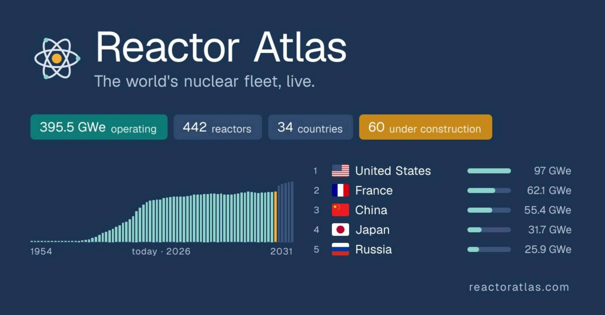
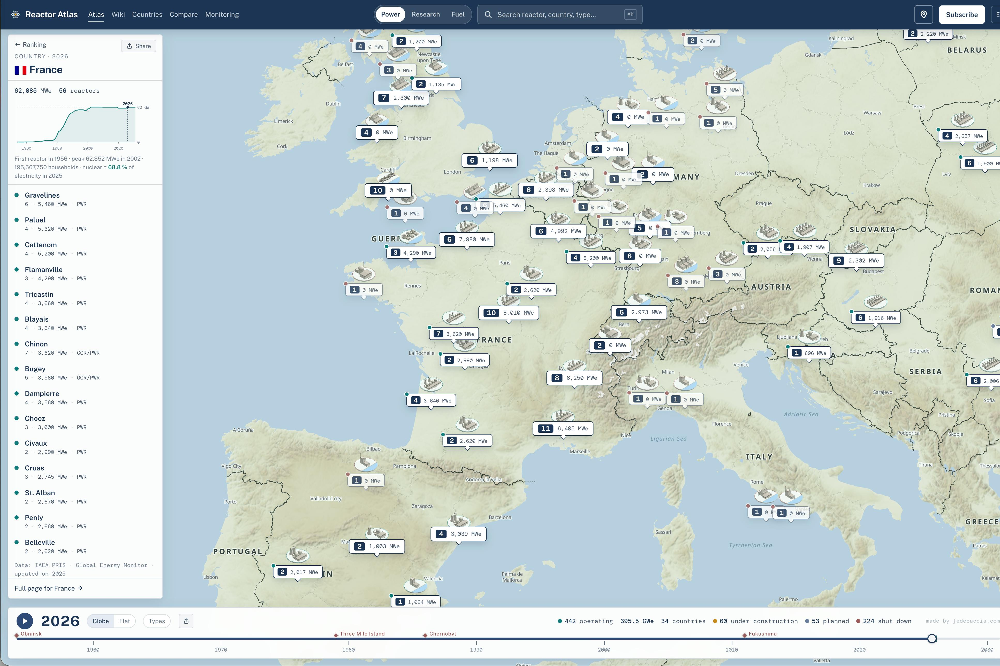
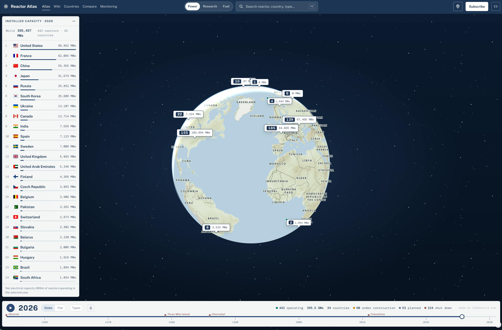

### 🎬 관련 영상
- [🎥 영상 보기](https://ph-files.imgix.net/a0da8a4d-3560-44bb-b84b-c092296ca2ce.jpeg?auto=format)

---

## 21. [Eggshell](https://www.producthunt.com/products/eggshell-2)
**Votes**: 72 | **도입 난이도**: 중 | **신뢰도**: 상
**Tagline**: Local memory for AI agents to reuse work, spend fewer tokens
**서비스 링크**: https://www.producthunt.com/r/AW3PDP3MXYYABE

**태그**: AI, DevTool, Automation, Productivity, Agent, AI Tool, LLM, Chat

### 📌 이 서비스 한눈에 보기
AI 에이전트의 작업 결과와 기억을 로컬에 저장하여 토큰 비용을 절감하고 작업 효율을 높이는 메모리 관리 도구

### 🔑 주요 기능
- AI 에이전트 간 작업 결과 및 증거를 로컬에 저장하여 공유
- 관련 메모리 검색을 통해 반복적인 조사 작업 방지
- 메모리 정리를 위한 추가적인 LLM 호출 없이 효율적인 데이터 관리

### 🙋 사용자에게 어떤 점이 좋은가
AI 에이전트를 사용할 때 발생하는 반복적인 질문과 조사 과정을 줄여주며, 불필요한 토큰 소모를 방지해 비용을 절감할 수 있습니다.

### ✅ 지금 바로 써볼 기능
- 기존 AI 에이전트 워크플로우에 Eggshell 연동하기
- 로컬 저장소 기반의 메모리 검색 기능 테스트하기
- 반복되는 작업에 대한 토큰 절감 효과 측정하기

### ⚠️ 사용 전 확인할 점
- 로컬 저장 방식에 따른 데이터 보안 및 관리 책임 확인 필요
- 기존 AI 에이전트 프레임워크와의 호환성 검토 필요

### 🧭 확인이 더 필요한 정보
현재 제공되는 구체적인 API 사양이나 지원하는 AI 에이전트 프레임워크의 종류가 명시되지 않았습니다.

### 📸 스크린샷 및 갤러리

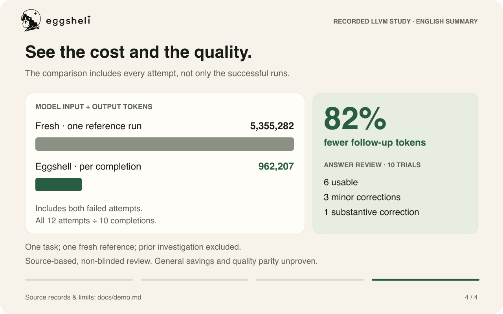
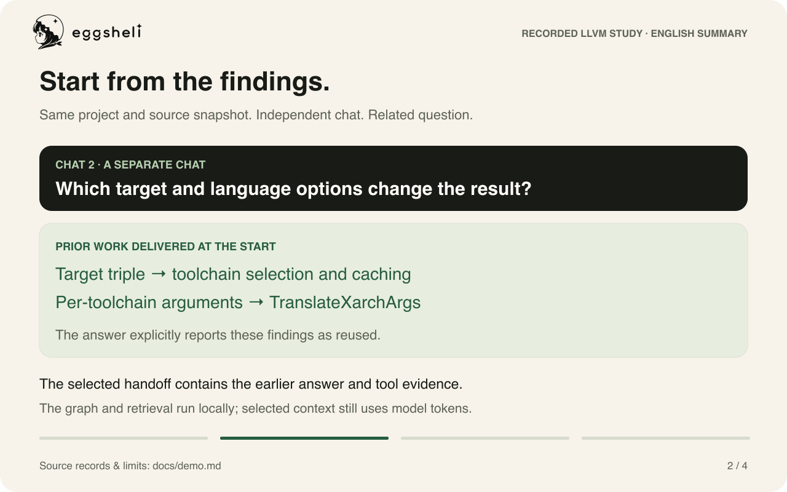

### 🎬 관련 영상
- [🎥 영상 보기](https://ph-files.imgix.net/ed9ac511-59a5-4d75-bab2-43f1ee8b6795.jpeg?auto=format)

---

## 22. [Mola](https://www.producthunt.com/products/mola)
**Votes**: 71 | **도입 난이도**: 하 | **신뢰도**: 상
**Tagline**: Build your café, hire a team, and grow a coffee chain
**서비스 링크**: https://www.producthunt.com/r/IZYBWR5O7TNTBA

**태그**: Mobile Game, Tycoon, Simulation, Android, AI Tool

### 📌 이 서비스 한눈에 보기
나만의 카페를 경영하고 확장하는 몰입형 3D 타이쿤 게임

### 🔑 주요 기능
- 3D 그래픽 기반의 아늑한 카페 경영 시뮬레이션
- 직원 채용, 가구 배치, 구역 확장을 통한 성장 요소
- GPT-6 Astra를 활용한 플레이어 주도형 빌드 및 정교한 게임 플레이

### 🙋 사용자에게 어떤 점이 좋은가
안드로이드 기기에서 언제 어디서나 나만의 카페를 꾸미고 운영하는 재미를 느낄 수 있습니다.

### ✅ 지금 바로 써볼 기능
- 카페 가구 배치 및 인테리어 구성하기
- 바리스타와 청소부 등 직원 고용 및 관리하기
- 새로운 구역으로 카페 확장하기

### ⚠️ 사용 전 확인할 점
- 부분 유료화 모델로 추가 구매가 필요할 수 있음
- 안드로이드 환경에서만 플레이 가능

### 🧭 확인이 더 필요한 정보
GPT-6 Astra를 통한 플레이어 주도형 프로세스가 실제 게임 플레이에 미치는 구체적인 영향력은 직접 플레이를 통해 확인이 필요합니다.

### 📸 스크린샷 및 갤러리

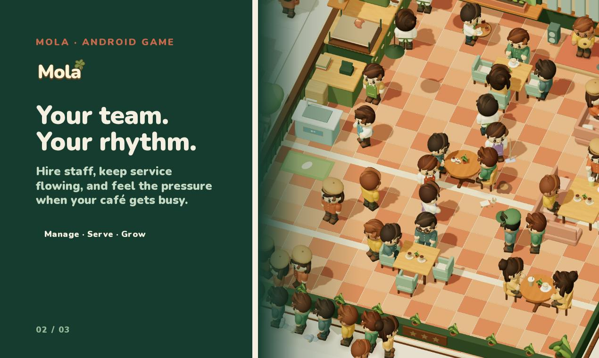
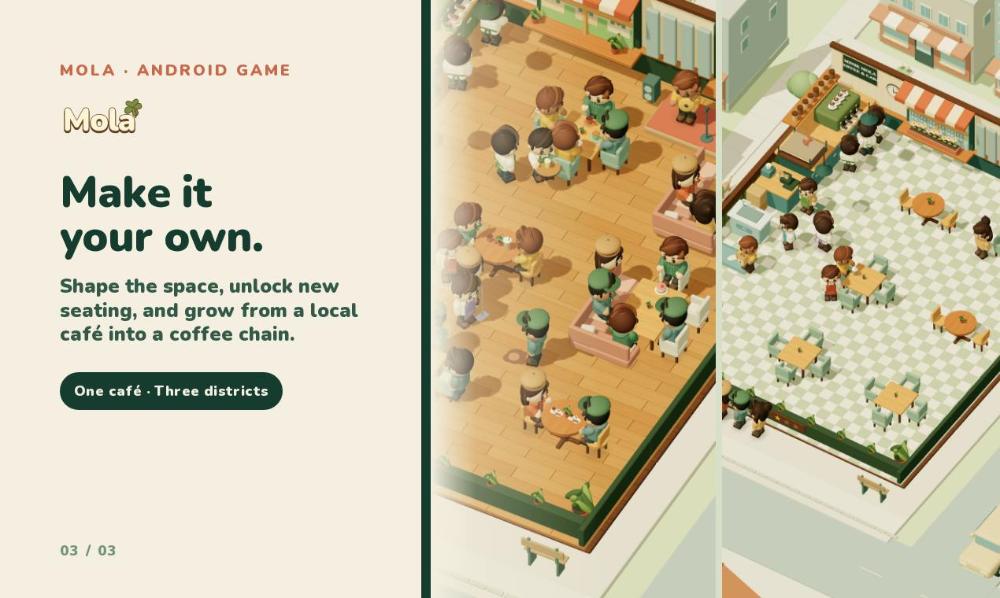

---

## 23. [ContextsBase - AI Knowledge Platform ](https://www.producthunt.com/products/contextsbase)
**Votes**: 71 | **도입 난이도**: 중 | **신뢰도**: 상
**Tagline**: Your product knowledge, built for AI.
**서비스 링크**: https://www.producthunt.com/r/RM3YP5EEJWHWVO

**태그**: AI, KnowledgeManagement, DevTool, Workflow, Automation, Agent, AI Tool, API, Marketing

### 📌 이 서비스 한눈에 보기
AI 에이전트를 위한 통합 프로젝트 지식 관리 및 컨텍스트 제공 플랫폼

### 🔑 주요 기능
- MCP(Model Context Protocol)를 통한 원활한 지식 전달
- 스펙, 데이터 모델, 워크플로우 등 프로젝트 전반의 정보를 단일 소스로 관리
- 개발뿐만 아니라 마케팅, 브랜드 관리 등 다양한 도메인에 적용 가능한 중앙 진실 공급원(Source of Truth)

### 🙋 사용자에게 어떤 점이 좋은가
AI 에이전트가 프로젝트의 맥락을 정확히 이해하도록 돕는 중앙 저장소 역할을 하여, 작업의 일관성을 높이고 반복적인 컨텍스트 설명 과정을 줄여줍니다.

### ✅ 지금 바로 써볼 기능
- 프로젝트의 핵심 가이드라인과 규칙 등록하기
- MCP를 통해 AI 에이전트와 연결 설정하기
- 기존 워크플로우 및 데이터 모델 문서화하기

### ⚠️ 사용 전 확인할 점
- 데이터 보안 및 프라이버시 정책 확인 필요
- 사용 중인 AI 에이전트 도구와의 호환성 검토

### 🧭 확인이 더 필요한 정보
현재 제공되는 구체적인 보안 수준과 외부 도구와의 상세 통합 방식에 대한 정보가 부족합니다.

### 📸 스크린샷 및 갤러리
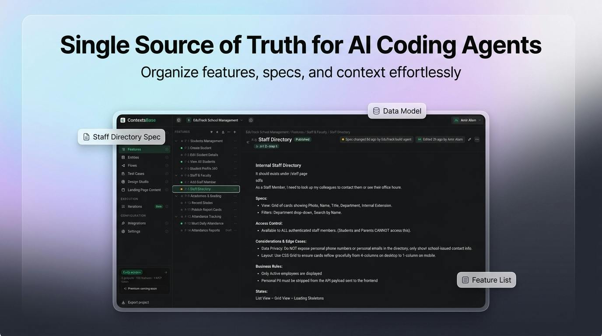
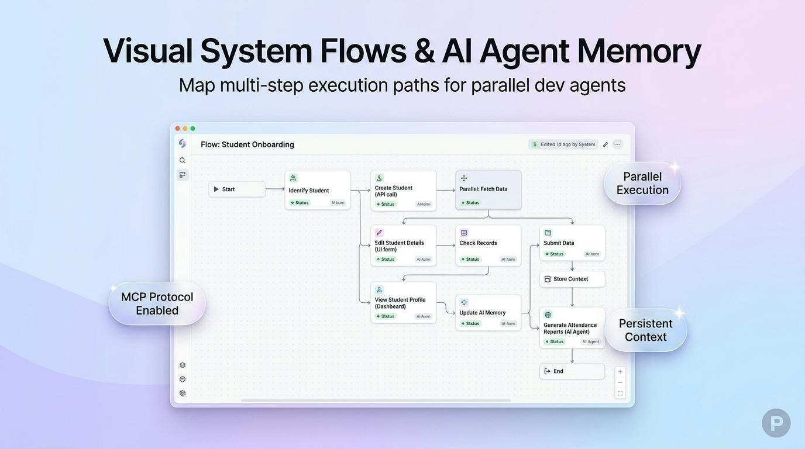
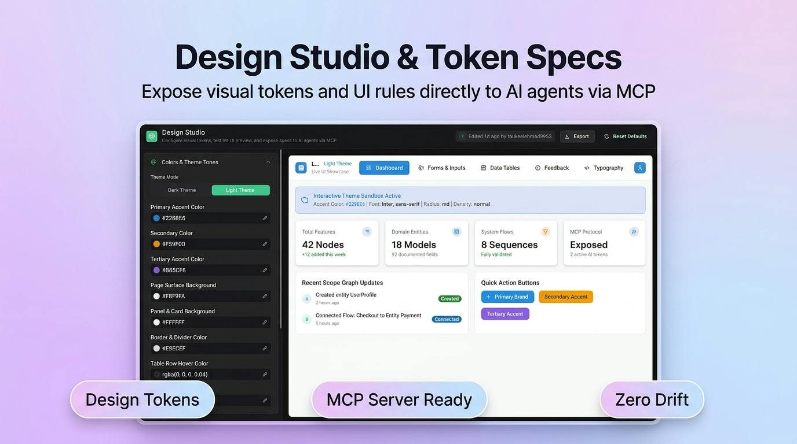

### 🎬 관련 영상
- [🎥 영상 보기](https://ph-files.imgix.net/a7d54c1e-b3b3-4971-91d3-3a9700832180.jpeg?auto=format)

---

## 24. [GameToMac](https://www.producthunt.com/products/gametomac)
**Votes**: 71 | **도입 난이도**: 중 | **신뢰도**: 상
**Tagline**: Play Windows games on Mac with AI-powered compatibility
**서비스 링크**: https://www.producthunt.com/r/U5YCS4JV65AETS

**태그**: Gaming, Mac, Windows-Compatibility, AI, AI Tool

### 📌 이 서비스 한눈에 보기
AI 기술을 활용해 맥(Mac)에서 윈도우 게임을 고성능으로 즐길 수 있게 해주는 호환성 솔루션

### 🔑 주요 기능
- Apple Silicon 환경에서 윈도우 게임 실행 지원
- GPT-6 Astra 기반의 AI 기술로 부드러운 성능 및 높은 FPS 구현
- Age of Empires IV, CS2, Overwatch 등 주요 게임 지원

### 🙋 사용자에게 어떤 점이 좋은가
맥 사용자도 윈도우 전용 게임들을 별도의 복잡한 설정 없이 고성능으로 플레이할 수 있습니다.

### ✅ 지금 바로 써볼 기능
- 지원되는 주요 게임(AoE IV, CS2 등) 설치 및 실행 테스트
- Apple Silicon 기기에서의 프레임 레이트(FPS) 확인
- 추가 지원 예정인 게임 목록 확인

### ⚠️ 사용 전 확인할 점
- 현재 지원되는 게임 목록 외의 게임은 호환 여부가 불확실함
- AI 기반 호환성이므로 게임별 최적화 수준이 다를 수 있음

### 🧭 확인이 더 필요한 정보
GPT-6 Astra 기술이 실제 게임 성능에 미치는 구체적인 벤치마크 수치는 공개되지 않았습니다.

### 📸 스크린샷 및 갤러리
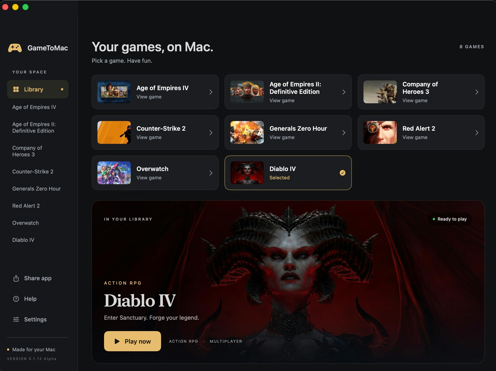

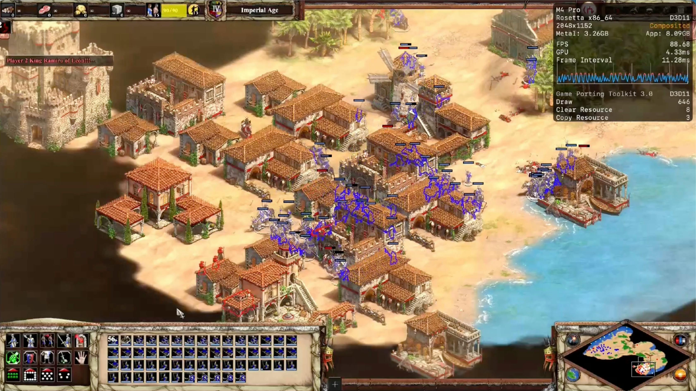

### 🎬 관련 영상
- [🎥 영상 보기](https://ph-files.imgix.net/6502204d-52eb-4593-a6e6-289c680842d6.jpeg?auto=format)

---

## 25. [Yoetz](https://www.producthunt.com/products/yoetz)
**Votes**: 69 | **도입 난이도**: 하 | **신뢰도**: 상
**Tagline**: Check to see if AI really completed a task or if it had gaps
**서비스 링크**: https://www.producthunt.com/r/HQQV5UESNRHWEF

**태그**: DevTool, AI-Agent, OpenSource, Coding, Agent, AI Tool

### 📌 이 서비스 한눈에 보기
AI 코딩 에이전트의 작업 결과물을 검증하고 작업 완료 여부를 확인하는 오픈소스 워크 레저

### 🔑 주요 기능
- AI 에이전트가 수행한 작업 기록을 검증하고 영수증(Receipt) 형태로 결과 제공
- 작업의 검증 범위, 커버리지, 미해결 과제를 명확히 구분하여 표시
- Codex, Claude, Cursor 등 주요 AI 코딩 도구 지원

### 🙋 사용자에게 어떤 점이 좋은가
AI가 코드를 작성했을 때 작업이 완벽히 끝났는지 아니면 누락된 부분이 있는지 즉각적으로 파악하여 신뢰도를 높일 수 있습니다.

### ✅ 지금 바로 써볼 기능
- 사용 중인 AI 코딩 도구(Cursor 등)와 연동하기
- 에이전트가 발행한 작업 기록과 Yoetz의 검증 결과 비교하기
- 미해결(Open) 상태로 남은 작업 항목 확인하기

### ⚠️ 사용 전 확인할 점
- 로컬 퍼스트 방식이므로 환경 설정 방식에 따른 초기 세팅 필요성 확인 필요
- AI 에이전트의 작업 기록이 정확해야 검증 결과도 유효함

### 🧭 확인이 더 필요한 정보
현재 제공되는 각 AI 도구(Codex, Claude, Cursor)와의 구체적인 연동 방식과 자동화 수준에 대한 상세 정보가 필요합니다.

### 📸 스크린샷 및 갤러리
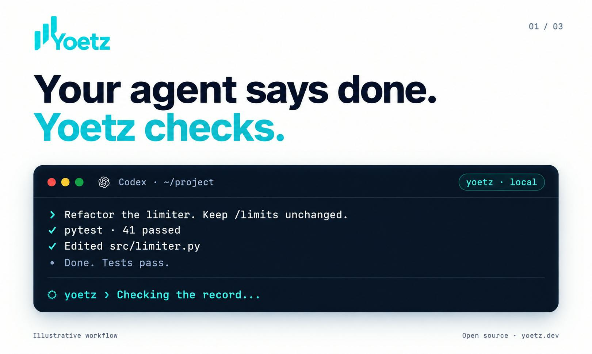
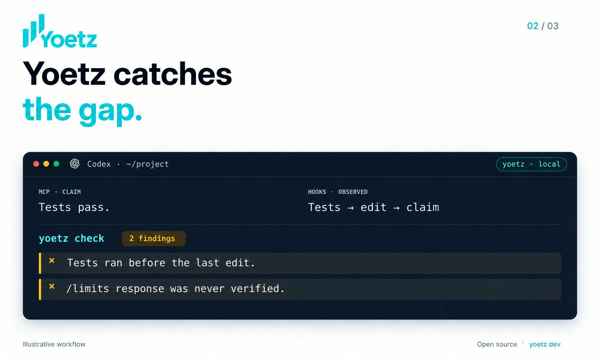
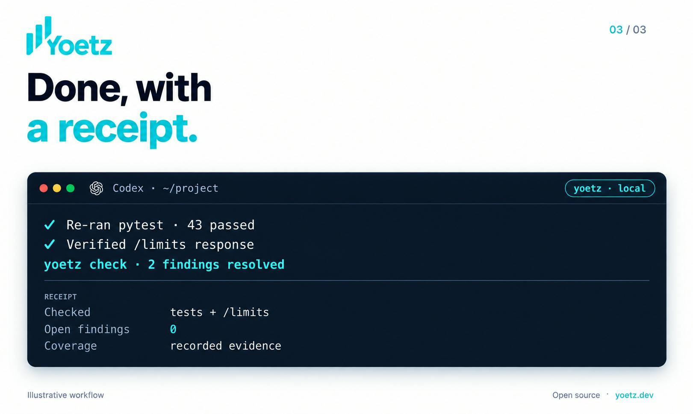

### 🎬 관련 영상
- [🎥 영상 보기](https://ph-files.imgix.net/05a8e407-cbf3-4c51-97e6-92e9ef9fba41.jpeg?auto=format)

---

## 26. [Polishory](https://www.producthunt.com/products/polishory)
**Votes**: 68 | **도입 난이도**: 하 | **신뢰도**: 상
**Tagline**: Get a clear plan to improve your website and prevent AI slop
**서비스 링크**: https://www.producthunt.com/r/LYJYMFGC3DQ562

**태그**: Design, UX, WebDevelopment, NoCode, AI Tool, DevTool

### 📌 이 서비스 한눈에 보기
코드 수정 없이 웹사이트 디자인과 레이아웃을 개선할 수 있는 시각적 피드백 도구

### 🔑 주요 기능
- 데스크톱 및 모바일 환경의 디자인 점수 제공
- 스크린샷 기반의 직관적인 피드백 제공
- 레이아웃, 타이포그래피, 간격 등 우선순위가 지정된 개선 권장사항 제시

### 🙋 사용자에게 어떤 점이 좋은가
개발 지식이 없어도 웹사이트의 시각적 완성도를 높이고, AI 생성 콘텐츠로 인한 저품질 디자인을 방지할 수 있습니다.

### ✅ 지금 바로 써볼 기능
- 자신의 웹사이트 URL 입력하여 디자인 점수 확인하기
- 제공된 스크린샷 피드백을 바탕으로 레이아웃 수정하기
- 우선순위 권장사항에 따라 타이포그래피 및 간격 조정하기

### ⚠️ 사용 전 확인할 점
- 코드 수정 없이 시각적 가이드만 제공하므로 실제 구현은 직접 해야 함
- 사용자 경험(UX)의 정성적 측면보다는 시각적 디자인 요소에 집중됨

### 🧭 확인이 더 필요한 정보
제공되는 피드백이 실제 프론트엔드 프레임워크와 얼마나 호환되는지 확인이 필요합니다.

### 📸 스크린샷 및 갤러리

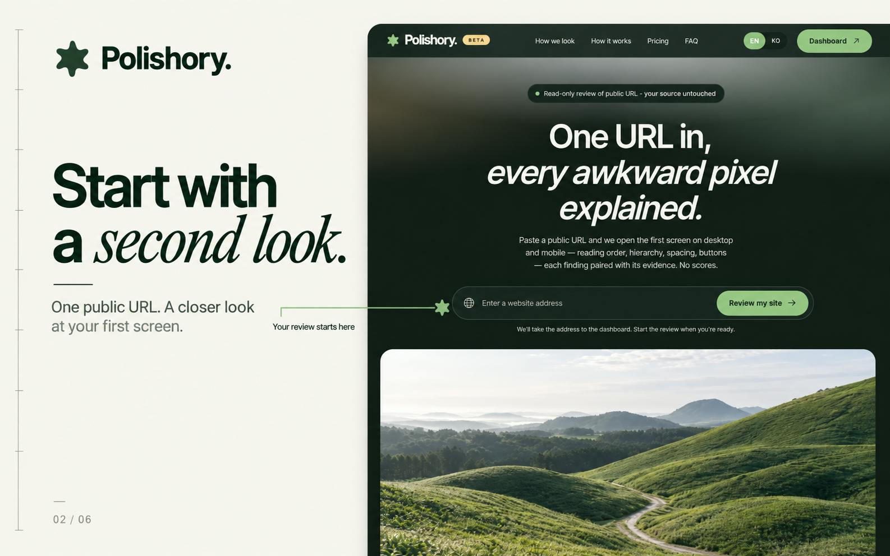

---

## 27. [Try The Apartment](https://www.producthunt.com/products/try-the-apartment)
**Votes**: 68 | **도입 난이도**: 하 | **신뢰도**: 상
**Tagline**: A real apartment in 3D, just drag furniture & see what fits
**서비스 링크**: https://www.producthunt.com/r/L4UIEDFWKLUBHF

**태그**: RealEstate, 3DModeling, InteriorDesign, PropTech

### 📌 이 서비스 한눈에 보기
실제 아파트를 3D로 구현하여 가구 배치와 공간감을 미리 확인하는 가상 인테리어 도구

### 🔑 주요 기능
- 실제 매물을 3D로 재구성하여 공간감을 생생하게 제공
- 23종의 가구를 드래그 앤 드롭하여 배치 가능
- 가구가 들어가지 않을 경우 알려주는 스마트 피드백 기능

### 🙋 사용자에게 어떤 점이 좋은가
이사나 입주 전, 가구가 실제 공간에 잘 맞을지 고민하는 사용자에게 시각적 확신을 제공합니다.

### ✅ 지금 바로 써볼 기능
- 3D 모델로 공간 둘러보기
- 제공된 가구 배치해보기
- 링크 공유로 동거 예정자와 함께 검토하기

### ⚠️ 사용 전 확인할 점
- 제공되는 가구 종류가 23개로 제한적임
- 실제 물리적 치수와 3D 모델 간의 미세한 오차가 있을 수 있음

### 🧭 확인이 더 필요한 정보
사용자 개인의 가구를 직접 모델링하여 배치할 수 있는지 여부는 명시되지 않았습니다.

### 📸 스크린샷 및 갤러리
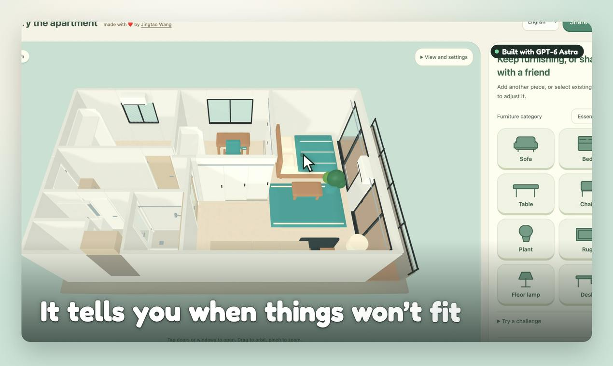

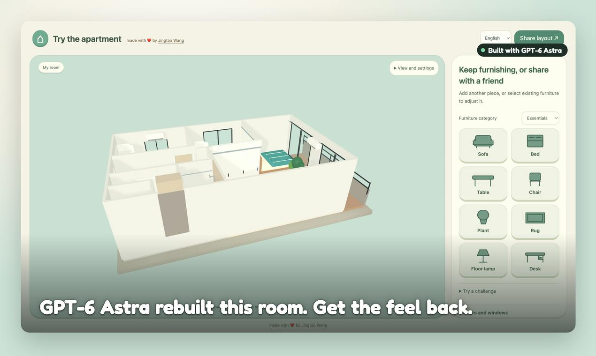

### 🎬 관련 영상
- [🎥 영상 보기](https://ph-files.imgix.net/6e265ee9-b624-4c47-9039-5141256151bb.jpeg?auto=format)

---

## 28. [Codex GPU Queue](https://www.producthunt.com/products/codex-gpu-queue)
**Votes**: 67 | **도입 난이도**: 중 | **신뢰도**: 상
**Tagline**: One GPU. Many Codex sessions. Less manual juggling.
**서비스 링크**: https://www.producthunt.com/r/34B36ZBAMHDOYN

**태그**: DevTool, Automation, GPU, Workflow, AI Tool

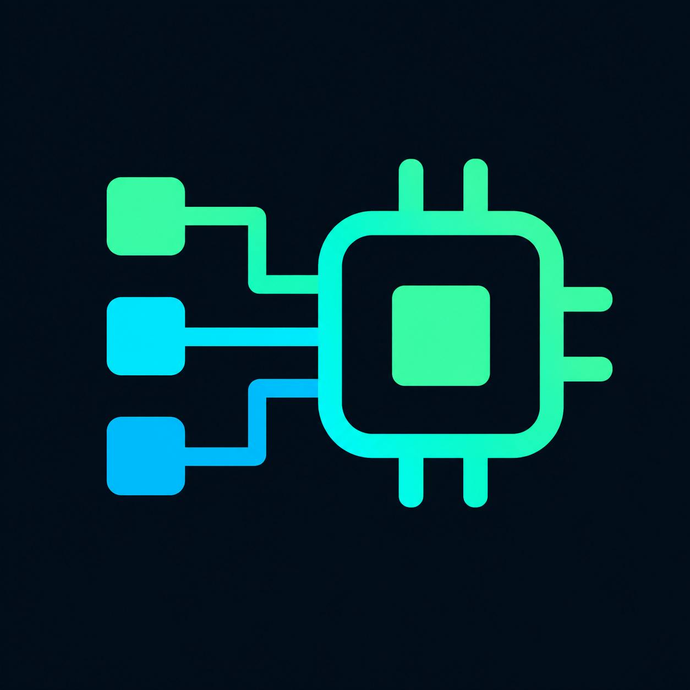

### 📌 이 서비스 한눈에 보기
단일 GPU 자원을 여러 세션이 효율적으로 공유할 수 있게 돕는 자동 작업 큐 관리 도구

### 🔑 주요 기능
- 단일 Windows GPU 자원의 효율적 분할 사용
- 백그라운드 작업 큐를 통한 자동 실행 및 결과 반환
- 수동 작업 없이 여러 세션의 작업 스케줄링 자동화

### 🙋 사용자에게 어떤 점이 좋은가
GPU 자원이 한정적인 환경에서 여러 작업을 동시에 걸어두고, 작업이 완료될 때까지 기다릴 필요 없이 다른 업무를 볼 수 있습니다.

### ✅ 지금 바로 써볼 기능
- 로컬 Windows GPU 환경 설정
- 백그라운드 작업 큐 등록
- 세션별 결과 수신 확인

### ⚠️ 사용 전 확인할 점
- 단일 GPU를 공유하므로 작업 간 자원 경합이 발생할 수 있음
- Windows 환경에 특화된 도구로 보임

### 🧭 확인이 더 필요한 정보
다양한 프레임워크나 라이브러리와의 호환성 및 구체적인 설치 방법은 명시되지 않았습니다.

### 📸 스크린샷 및 갤러리
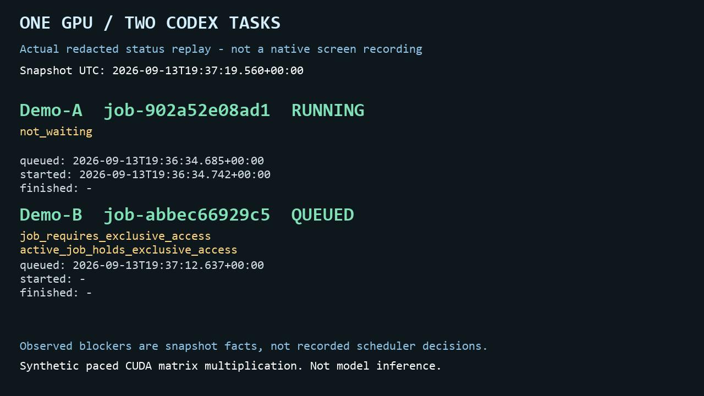
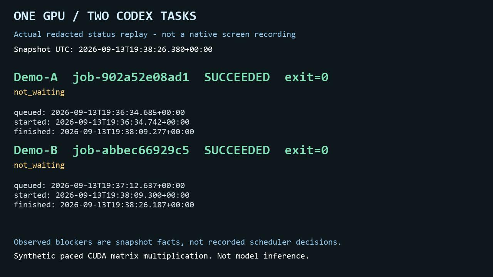

### 🎬 관련 영상
- [🎥 영상 보기](https://ph-files.imgix.net/2cfd5c77-e3d8-466e-897d-938d50fe4f9c.jpeg?auto=format)

---

## 29. [Mercury Pitch](https://www.producthunt.com/products/mercury-pitch)
**Votes**: 67 | **도입 난이도**: 하 | **신뢰도**: 상
**Tagline**: Virtual rehearsal studio with instant performance feedback
**서비스 링크**: https://www.producthunt.com/r/R42H2DA7C6RMFQ

**태그**: Music, Education, Practice-Tool, Web-App, AI Tool

### 📌 이 서비스 한눈에 보기
실시간 피드백을 제공하는 브라우저 기반 가상 연습 스튜디오

### 🔑 주요 기능
- 보컬 피치 트레이닝 및 음역대 테스트 기능
- 라이브 스코어링이 포함된 가라오케 모드
- 악기(기타, 피아노, 드럼) 연주 시 실시간 노트 감지

### 🙋 사용자에게 어떤 점이 좋은가
별도의 설치 없이 브라우저에서 즉시 악기 및 보컬 연습이 가능하며, 연주 중 실시간 피드백을 통해 정확한 연습을 돕습니다.

### ✅ 지금 바로 써볼 기능
- 보컬 피치 및 음역대 테스트 실행하기
- 가라오케 모드로 라이브 스코어링 경험하기
- 악기 연주를 통한 실시간 노트 감지 테스트하기

### ⚠️ 사용 전 확인할 점
- 브라우저 기반이므로 마이크/악기 입력 지연(Latency) 발생 가능성 확인 필요
- 악기별로 지원되는 입력 방식 및 정밀도 차이 확인 필요

### 🧭 확인이 더 필요한 정보
사용자의 하드웨어 환경에 따른 실시간 피드백의 정확도와 지연 시간을 확인해야 합니다.

### 📸 스크린샷 및 갤러리
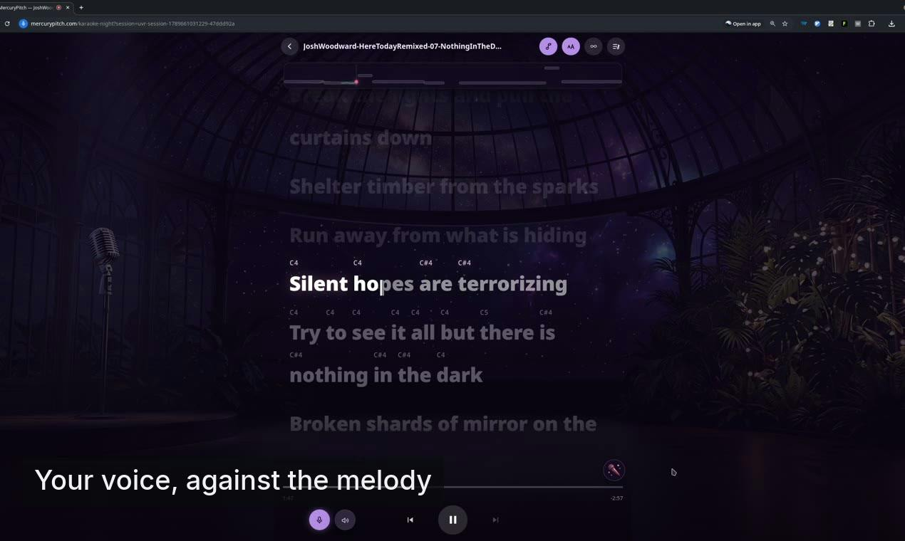
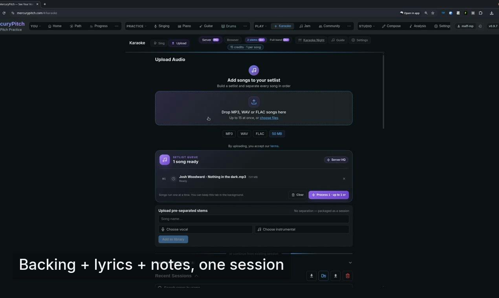
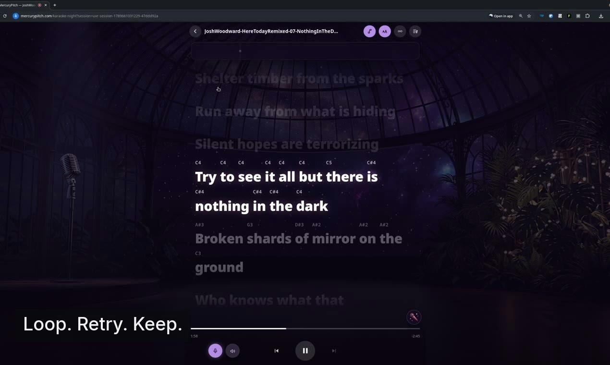

### 🎬 관련 영상
- [🎥 영상 보기](https://ph-files.imgix.net/f3ae5c4b-64d4-44e4-b399-0bd3dbece14c.jpeg?auto=format)

---

## 30. [izzit](https://www.producthunt.com/products/izzit)
**Votes**: 66 | **도입 난이도**: 하 | **신뢰도**: 상
**Tagline**: One word. Three tries. Can the AI tell what you drew?
**서비스 링크**: https://www.producthunt.com/r/IKHDFGEEXBRPFV

**태그**: Game, AI, Creativity, Mobile, AI Tool

### 📌 이 서비스 한눈에 보기
매일 주어지는 단어를 그림으로 그려 AI의 인식을 시험하는 창의적 드로잉 게임

### 🔑 주요 기능
- 매일 새로운 단어 하나와 세 번의 드로잉 기회 제공
- AI 비전 모델이 사용자의 그림을 판독하여 점수 부여
- 정답 여부에 따라 골드, 다이아몬드 또는 미스터리 카드를 획득하는 보상 체계

### 🙋 사용자에게 어떤 점이 좋은가
짧은 시간 동안 창의력을 발휘하며 즐길 수 있는 데일리 퍼즐 게임입니다.

### ✅ 지금 바로 써볼 기능
- 매일 제공되는 단어에 맞춰 그림 그리기
- AI가 알아볼 수 있는 창의적인 그림 그려서 다이아몬드 도전하기
- 무료 체험 후 영구 소장 기능($0.99) 고려하기

### ⚠️ 사용 전 확인할 점
- 모바일(iPhone, Android) 환경에서만 사용 가능
- 모든 기능을 영구적으로 사용하려면 $0.99 결제가 필요함

### 🧭 확인이 더 필요한 정보
AI 모델의 판독 기준과 점수 산정 방식에 대한 상세 규칙은 앱 내에서 확인이 필요합니다.

### 📸 스크린샷 및 갤러리
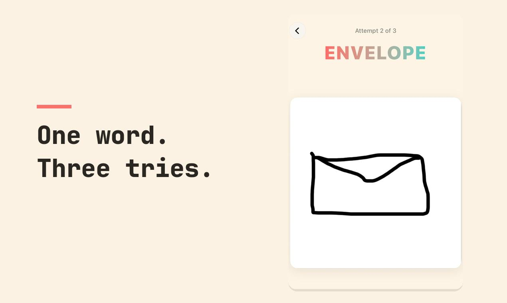

---

