# 🚀 Product Hunt Daily Top 30 (2026-09-20)

## 오늘의 요약
오늘의 트렌드는 AI를 활용한 개인화된 생산성 도구와 명상/웰빙 분야의 혁신이 두드러졌습니다. 특히 단순한 자동화를 넘어 사용자의 감정, 생체 데이터, 혹은 물리적 기록을 디지털 작업으로 즉시 전환하는 지능형 서비스들이 주목받았습니다.

### 오늘의 핵심 포인트
- AI 기술을 활용해 복잡한 편집, 회의 기록, 할 일 목록 작성을 자동화하여 작업 시간을 획기적으로 단축하는 도구들이 등장했습니다.
- 명상과 웰빙 분야에서 개인의 감정이나 생체 데이터를 반영한 맞춤형 경험과 프라이버시를 중시하는 미니멀리즘 서비스가 주목받았습니다.
- 기존의 단순한 앱 차단을 넘어 경제적 보상이나 강력한 제약을 결합하여 사용자의 행동 변화를 유도하는 새로운 방식의 생산성 도구가 제안되었습니다.

**오늘의 태그**: AI_Automation, Productivity, Wellness, Smart_Tools

## 1. [Bolt Forge](https://www.producthunt.com/products/bolt-new)
**Votes**: 176 | **도입 난이도**: 하 | **신뢰도**: 상
**Tagline**: Bolt's new agent with open-source models and 50X usage
**서비스 링크**: https://www.producthunt.com/r/4A3VQBDVIUMA2D

**태그**: DevTool, AI Agent, OpenSource, Agent, AI Tool

### 📌 이 서비스 한눈에 보기
오픈소스 모델 기반으로 사용량을 50배 늘린 Bolt.new의 새로운 에이전트

### 🔑 주요 기능
- Bolt.new 내부에 탑ів된 새로운 에이전트 기능
- 오픈소스 모델을 활용하여 Pro 플랜 사용자에게 최대 50배의 사용량 제공
- 일일 사용 제한(Daily caps)이 없으며, 내부 벤치마크에서 기존 유료 모델 성능의 91% 달성

### 🙋 사용자에게 어떤 점이 좋은가
비용 효율적인 오픈소스 모델을 통해 사용량 제한 걱정 없이 더 많은 작업을 수행할 수 있습니다.

### ✅ 지금 바로 써볼 기능
- Bolt.new에서 Bolt Forge 에이전트 활성화하기
- 기존 유료 모델과 성능 차이 비교 테스트하기
- 제한 없는 사용량을 활용한 대규모 작업 수행하기

### ⚠️ 사용 전 확인할 점
- 기존 유료 모델 대비 약 9%의 성능 차이가 발생할 수 있음
- 오픈소스 모델 기반이므로 특정 복잡한 작업에서의 성능 검증 필요

### 🧭 확인이 더 필요한 정보
오픈소스 모델의 구체적인 종류와 작업 유형별 성능 편차를 확인해야 합니다.

### 📸 스크린샷 및 갤러리
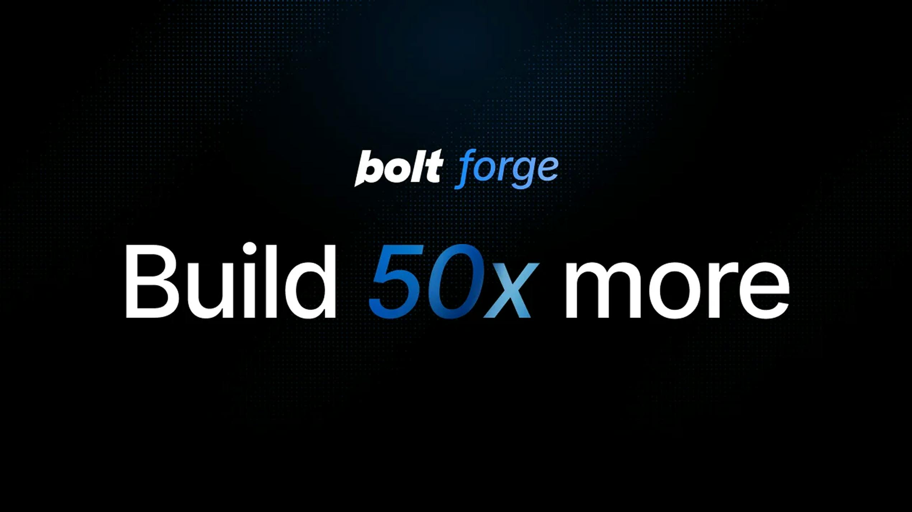
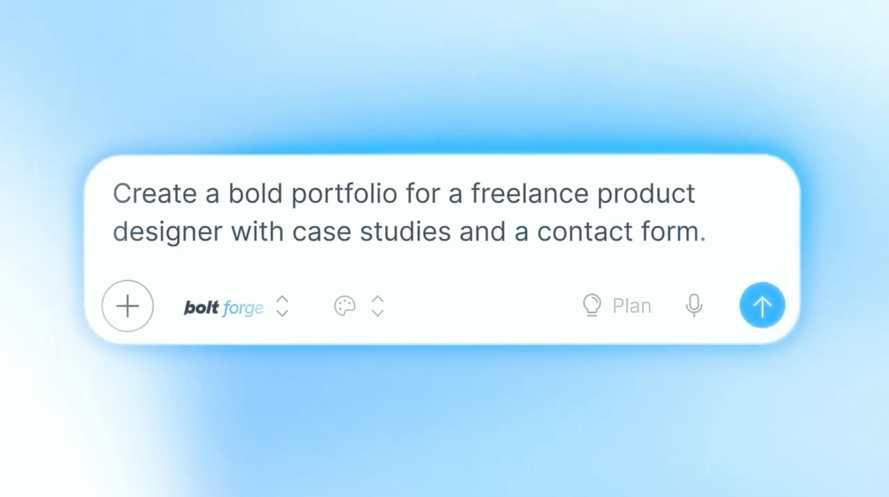
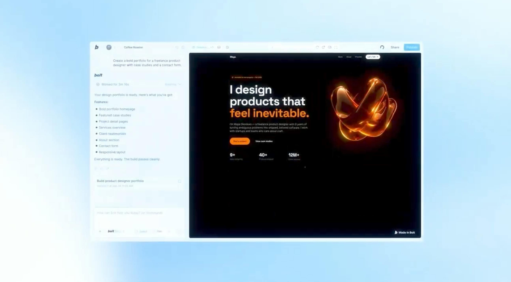

### 🎬 관련 영상
- [🎥 영상 보기](https://ph-files.imgix.net/db512423-8abc-4b5e-95a4-e4e9d763bced.jpeg?auto=format)

---

## 2. [Mantra Timer](https://www.producthunt.com/products/transcendence)
**Votes**: 152 | **도입 난이도**: 하 | **신뢰도**: 상
**Tagline**: A minimalist mantra meditation timer for iOS.
**서비스 링크**: https://www.producthunt.com/r/EWJKZOW5DRPD2A

**태그**: Meditation, iOS, Minimalism, Wellness, AI Tool

### 📌 이 서비스 한눈에 보기
구독 피로감 없이 명상 본연의 가치에 집중할 수 있는 미니멀리즘 만트라 타이머

### 🔑 주요 기능
- 데이터 수집이 없는 프라이버시 중심의 설계
- 복잡한 기능 대신 명상 본연의 경험에 집중한 미니멀리즘 UI
- 구독형 모델이 아닌 일회성 결제 방식의 합리적 구조

### 🙋 사용자에게 어떤 점이 좋은가
불필요한 알림이나 데이터 추적 없이 오직 명상 수행에만 몰입할 수 있는 환경을 제공합니다.

### ✅ 지금 바로 써볼 기능
- 기본 명상 타이머 및 차임 소리 설정하기
- 정기적인 정신적/신체적 체크인 기능 활용하기
- 고급 통계 및 커스텀 기능을 위한 일회성 업그레이드 검토하기

### ⚠️ 사용 전 확인할 점
- 고급 통계 및 심화 커스텀 기능은 유료 결제가 필요함
- 데이터 추적 기능이 없으므로 정밀한 데이터 분석을 원하는 사용자에게는 부족할 수 있음

### 🧭 확인이 더 필요한 정보
고급 기능의 구체적인 가격 정책과 상세 커스텀 범위는 앱 내에서 확인이 필요합니다.

### 📸 스크린샷 및 갤러리
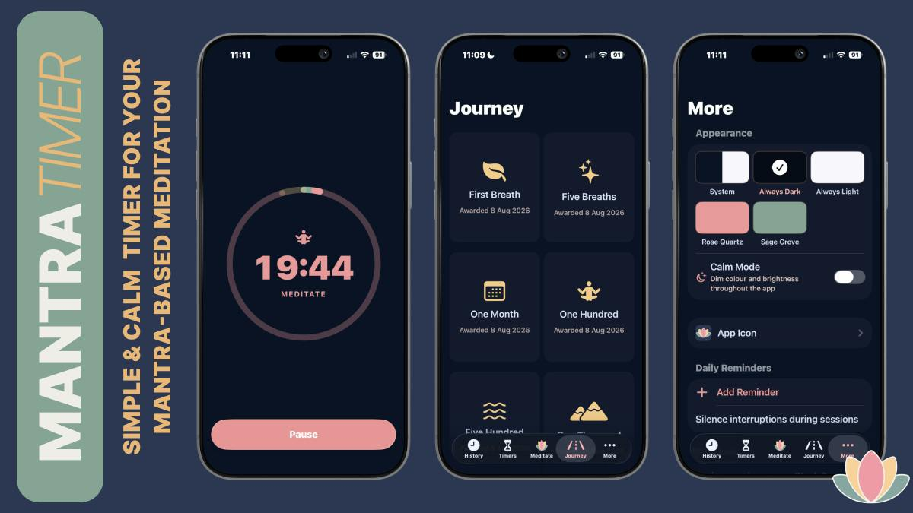

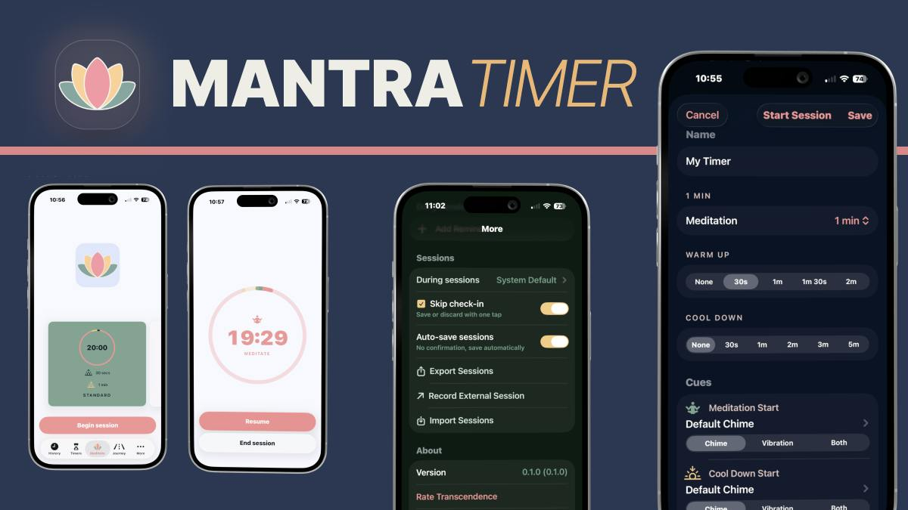

### 🎬 관련 영상
- [🎥 영상 보기](https://ph-files.imgix.net/3902ea5d-5f54-4e76-835f-bc55220ad588.jpeg?auto=format)

---

## 3. [Steam Frame](https://www.producthunt.com/products/steam-machine)
**Votes**: 124 | **도입 난이도**: 중 | **신뢰도**: 상
**Tagline**: Your Steam library, now on a wearable PC
**서비스 링크**: https://www.producthunt.com/r/DVSJS2NGMZJEFP

**태그**: Gaming, Hardware, VR, SteamOS

### 📌 이 서비스 한눈에 보기
PC의 스팀 라이브러리를 웨어러블로 즐기는 무선 SteamOS 헤드셋

### 🔑 주요 기능
- PC, 스팀덱 또는 다른 기기에서 스트리밍되는 스팀 라이브러리 지원
- 독립형 타이틀 실행 및 안정적인 스트리밍을 위한 듀얼 라디오/어댑터 탑재
- VR 완드 및 풀 게임패드 모드를 지원하는 컨트롤러

### 🙋 사용자에게 어떤 점이 좋은가
기존 PC 게임을 장소 제약 없이 웨어러블 기기로 즐길 수 있으며, 컨트롤러 하나로 VR과 게임패드 환경을 모두 경험할 수 있습니다.

### ✅ 지금 바로 써볼 기능
- 기존 스팀 라이브러리 호환성 확인
- 스트리밍 환경(PC/스팀덱) 구축
- 컨트롤러 조작 방식 테스트

### ⚠️ 사용 전 확인할 점
- 스트리밍 환경에 따른 네트워크 지연 시간 발생 가능성
- 독립형 타이틀 실행 시 하드웨어 성능 제약 확인 필요

### 🧭 확인이 더 필요한 정보
상세한 하드웨어 스펙 및 스트리밍 거리, 배터리 지속 시간에 대한 정보가 부족합니다.

### 📸 스크린샷 및 갤러리

### 🎬 관련 영상
- [🎥 영상 보기](https://ph-files.imgix.net/e28de71a-92dd-4373-b9dd-dba874e4e2da.jpeg?auto=format)

---

## 4. [Lumiko](https://www.producthunt.com/products/lumiko)
**Votes**: 121 | **도입 난이도**: 하 | **신뢰도**: 상
**Tagline**: Screen recordings that edit themselves with Auto Zoom-Pan 
**서비스 링크**: https://www.producthunt.com/r/6HXPPPSI732OW5

**태그**: VideoEditing, Automation, Productivity, ScreenRecording, API

### 📌 이 서비스 한눈에 보기
커서 움직임을 추적해 자동으로 줌과 팬 효과를 적용하는 지능형 화면 녹화 편집 도구

### 🔑 주요 기능
- 커서와 클릭을 추적하여 키프레임 없이 자동 줌/팬 편집
- 브라우저 기반의 타임라인 편집(자르기, 분할, 순서 변경)
- 개인정보 보호를 위한 스마트 블러 및 로컬 실행 방식

### 🙋 사용자에게 어떤 점이 좋은가
수동 편집 시간을 획기적으로 줄여주며, 계정 생성이나 업로드 대기 없이 즉시 고화질 영상을 제작할 수 있습니다.

### ✅ 지금 바로 써볼 기능
- 자동 줌-팬 기능 테스트하기
- 스마트 블러로 민감 정보 가리기
- 웹캠 버블 및 커스텀 배경 적용하기

### ⚠️ 사용 전 확인할 점
- 무료 버전의 기능 제한 범위 확인 필요
- 로컬 실행 환경에서의 하드웨어 리소스 사용량 확인

### 🧭 확인이 더 필요한 정보
무료 플랜의 구체적인 기능 제한 및 유료 전환 시점(예: 4K 수출 제한 등)에 대한 정보가 명시되지 않았습니다.

### 📸 스크린샷 및 갤러리
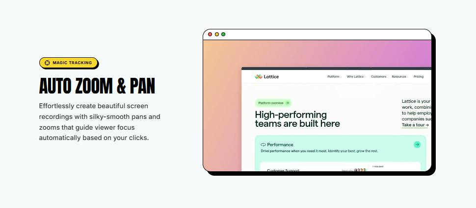
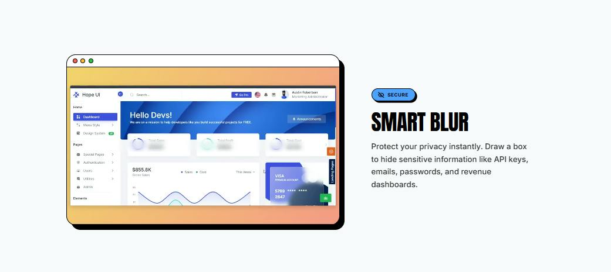
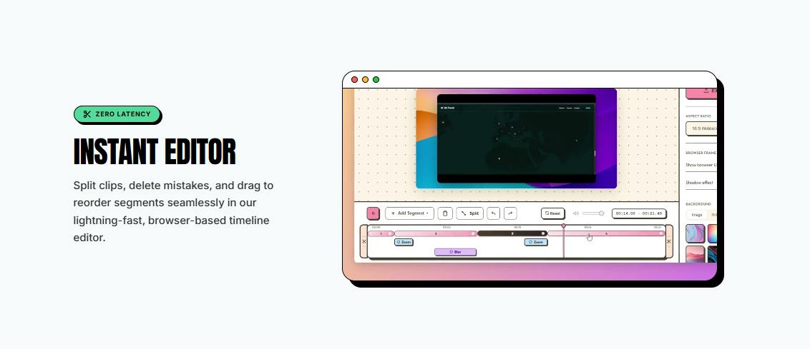

### 🎬 관련 영상
- [🎥 영상 보기](https://ph-files.imgix.net/87282358-fca1-4d6f-99d8-4f3265373c06.jpeg?auto=format)

---

## 5. [Lull](https://www.producthunt.com/products/lull-3)
**Votes**: 101 | **도입 난이도**: 하 | **신뢰도**: 상
**Tagline**: Tell it what is on your mind. It writes the meditation.
**서비스 링크**: https://www.producthunt.com/r/UK2JLUE5QAYOL3

**태그**: AI, Wellness, Personalization, MentalHealth

### 📌 이 서비스 한눈에 보기
사용자의 현재 감정을 바탕으로 맞춤형 명상 가이드를 생성하는 AI 명상 서비스

### 🔑 주요 기능
- 사용자의 음성 입력을 바탕으로 실시간 맞춤형 명상 스크립트 생성
- Oura 및 Apple Watch 데이터를 활용한 생체 피드백 기반 톤 조절
- 11가지 다양한 목소리 옵션 제공

### 🙋 사용자에게 어떤 점이 좋은가
정해진 녹음 파일을 듣는 대신, 현재 나의 상황과 감정에 딱 맞는 개인화된 명상 경험을 제공받을 수 있습니다.

### ✅ 지금 바로 써볼 기능
- 현재 고민이나 감정을 말로 기록해보기
- 11가지 목소리 중 선호하는 스타일 선택하기
- 웨어러블 기기 연동을 통한 생체 데이터 동기화하기

### ⚠️ 사용 전 확인할 점
- Oura 및 Apple Watch 등 웨어러블 기기 연동이 필수적일 수 있음
- 음성 입력 기반이므로 마이크 접근 권한 필요

### 🧭 확인이 더 필요한 정보
사용자의 음성 데이터가 어떻게 저장되고 보안 처리되는지에 대한 상세 정보가 필요합니다.

### 📸 스크린샷 및 갤러리

### 🎬 관련 영상
- [🎥 영상 보기](https://ph-files.imgix.net/367f58da-fc77-419c-8986-d4110dba5749.jpeg?auto=format)

---

## 6. [Doneit 3.2](https://www.producthunt.com/products/doneit)
**Votes**: 98 | **도입 난이도**: 하 | **신뢰도**: 상
**Tagline**: Reimagined Doneit Assist, support for Siri AI, and more
**서비스 링크**: https://www.producthunt.com/r/ZVRDCSGVJ3ISAA

**태그**: Productivity, AI, Task Management, Automation, AI Tool

### 📌 이 서비스 한눈에 보기
사진 촬영과 AI 분석을 통해 복잡한 할 일을 즉시 실행 가능한 작업 목록으로 변환하는 스마트 플래너

### 🔑 주요 기능
- 사진 첨부 기능을 통한 수기 목록, 화이트보드, 문서의 디지털 작업 전환
- AI 기반의 작업 세분화(Subtasks) 및 속성 자동 제안
- 작업 목록 요약 및 핵심 과업 우선순위 하이라이트 기능

### 🙋 사용자에게 어떤 점이 좋은가
종이에 적거나 회의실 화이트보드에 적은 내용을 일일이 타이핑할 필요 없이, 사진 한 장으로 체계적인 할 일 목록을 만들 수 있습니다.

### ✅ 지금 바로 써볼 기능
- 손글씨나 화이트보드 사진을 찍어 작업 생성해보기
- AI가 제안하는 하위 작업(Subtasks)과 리마인더 확인하기
- AI 요약 기능을 통해 전체 작업 목록의 핵심 파악하기

### ⚠️ 사용 전 확인할 점
- 사진의 화질이나 글씨체에 따라 인식 정확도가 달라질 수 있음
- Siri AI 지원 등 새로운 기능의 기기 호환성 확인 필요

### 🧭 확인이 더 필요한 정보
제공된 설명만으로는 사진 인식의 정확도 수준과 Siri AI와의 구체적인 연동 방식을 알 수 없습니다.

### 📸 스크린샷 및 갤러리
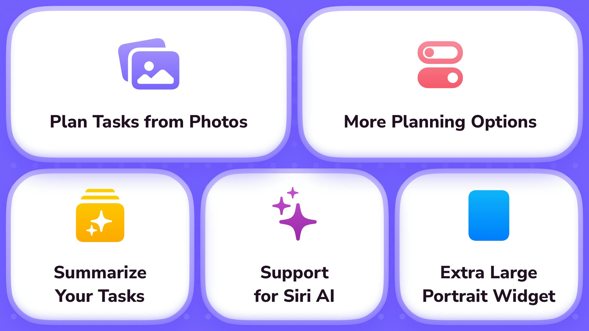
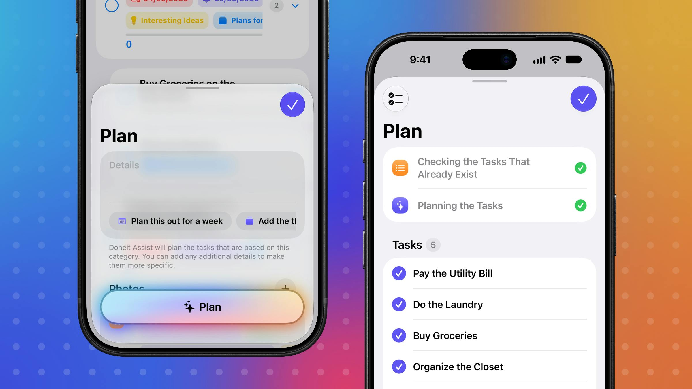
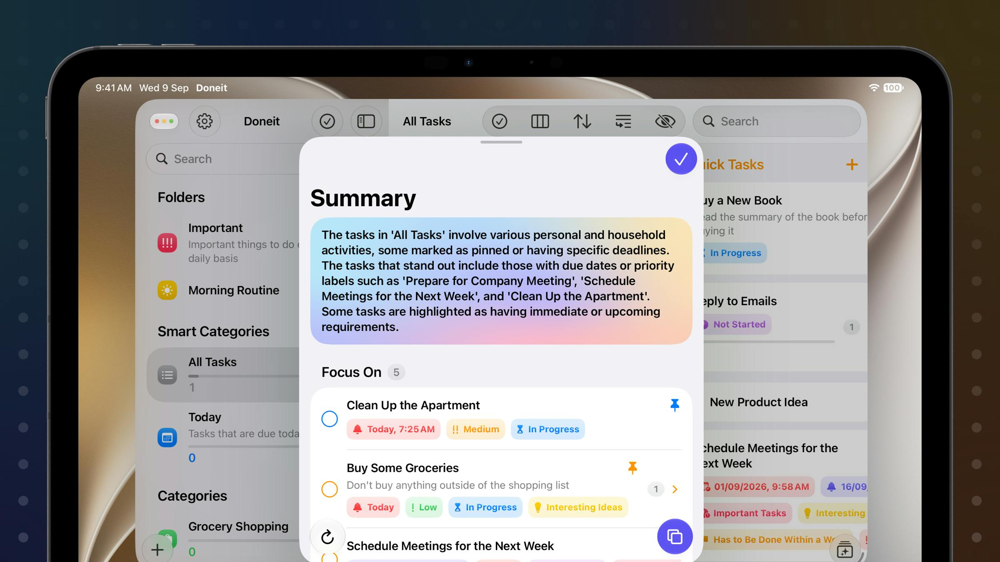

---

## 7. [VoiceCap](https://www.producthunt.com/products/voicecap)
**Votes**: 95 | **도입 난이도**: 하 | **신뢰도**: 상
**Tagline**: The AI notetaker for meetings in your language
**서비스 링크**: https://www.producthunt.com/r/5PK5DFR6FBKCXO

**태그**: Productivity, AI, Transcription, Collaboration, AI Tool, Chat

### 📌 이 서비스 한눈에 보기
100개 이상의 언어를 완벽하게 지원하는 AI 회의 기록 및 요약 서비스

### 🔑 주요 기능
- 영어 외 다양한 언어에 최적화된 전사 및 요약 기능
- Zoom, Meet, Teams 봇 참여 또는 파일 업로드 지원
- 결정 사항과 실행 과제를 자동 정리하여 검색 가능한 기록 생성

### 🙋 사용자에게 어떤 점이 좋은가
다국어 회의가 잦은 환경에서 언어 장벽 없이 정확한 회의록을 얻을 수 있으며, 보안 걱정 없이 회의 내용을 기록할 수 있습니다.

### ✅ 지금 바로 써볼 기능
- 300분 무료 크레딧으로 실제 회의 녹음해보기
- 기존 회의 녹음 파일 업로드하여 요약 품질 테스트하기
- 화상 회의 플랫폼에 봇 초대하여 자동 기록 설정하기

### ⚠️ 사용 전 확인할 점
- 무료 제공 시간(300분) 소진 시 유료 전환 필요
- 특정 플랫폼(Zoom, Meet, Teams) 외의 환경에서의 연동성 확인 필요

### 🧭 확인이 더 필요한 정보
무료 사용량 소진 이후의 구체적인 유료 요금제 체계는 명시되어 있지 않습니다.

### 📸 스크린샷 및 갤러리
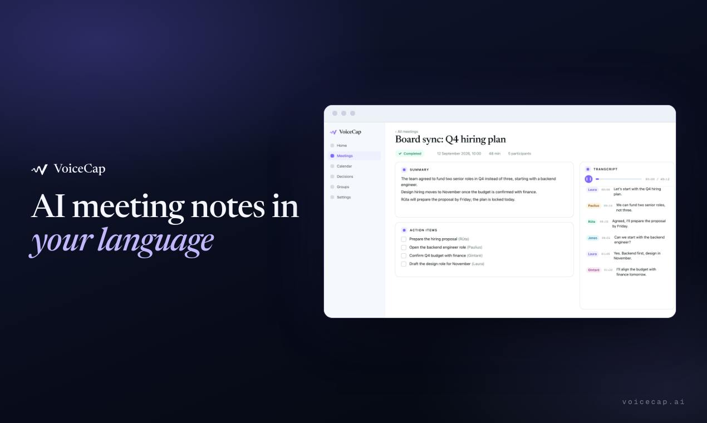

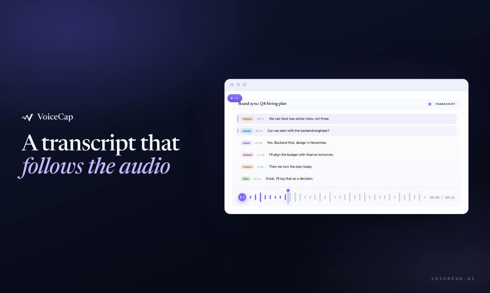

### 🎬 관련 영상
- [🎥 영상 보기](https://ph-files.imgix.net/d9b2b824-b392-4e41-9146-6d518b6706d8.jpeg?auto=format)

---

## 8. [Squirrel](https://www.producthunt.com/products/squirrel-screen-time-savings)
**Votes**: 92 | **도입 난이도**: 하 | **신뢰도**: 상
**Tagline**: An app blocker that pays you back
**서비스 링크**: https://www.producthunt.com/r/PKEWAZ5UH5CJHO

**태그**: Productivity, Focus, Finance, Self-Improvement

### 📌 이 서비스 한눈에 보기
스마트폰 중독을 방지하기 위해 스스로 벌금을 부과하고 이를 투자로 연결하는 앱 차단 서비스

### 🔑 주요 기능
- 단순한 차단을 넘어 앱 사용 시 금전적 비용을 지불하게 하는 강력한 제약 방식
- 앱 내 결제 없이 사용자가 직접 설정한 금액을 스스로 저축/투자하는 구조
- 축적된 자금을 개인 증권 계좌에 투자하고 자산 현황을 추적하는 기능

### 🙋 사용자에게 어떤 점이 좋은가
의지력에만 의존하던 앱 차단을 경제적 손실과 보상이라는 강력한 동기부여로 전환하여 생산성을 높여줍니다.

### ✅ 지금 바로 써볼 기능
- 가장 시간을 많이 뺏는 앱 설정하기
- 앱 사용 시 지불할 벌금 액수 결정하기
- 모인 자금을 투자할 브로커리지 계좌 준비하기

### ⚠️ 사용 전 확인할 점
- 앱 내에서 직접적인 결제가 이루어지지 않으므로 사용자가 수동으로 투자 내역을 입력해야 함
- 강력한 차단 기능이 일상적인 앱 사용에 불편을 줄 수 있음

### 🧭 확인이 더 필요한 정보
사용자가 직접 입력하는 방식 외에 증권사 계좌와의 자동 연동 기능 여부는 명시되어 있지 않습니다.

### 📸 스크린샷 및 갤러리

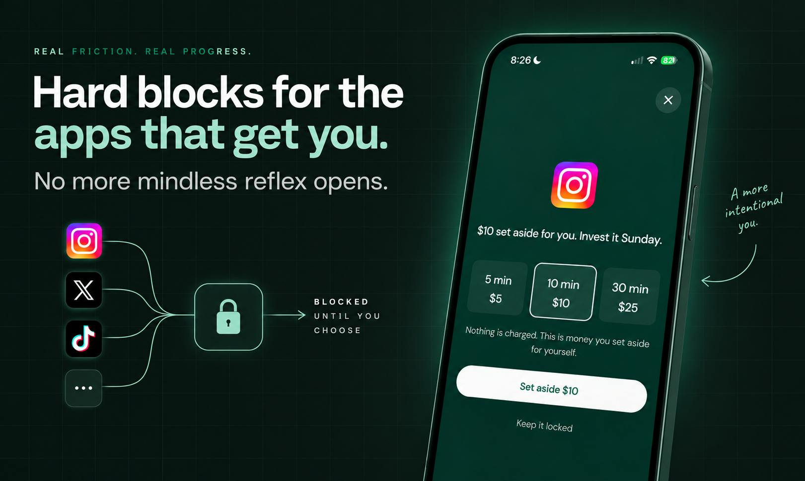
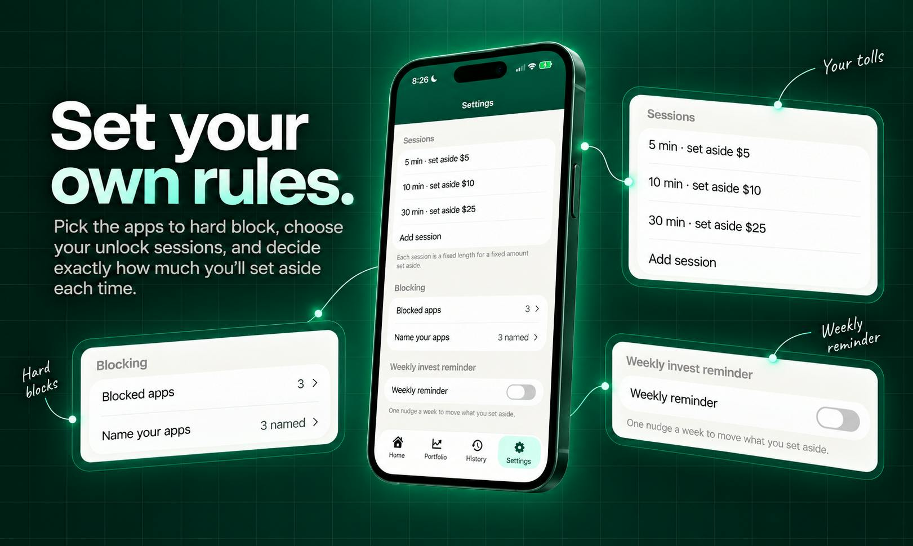

---

## 9. [Ruby UTCP](https://www.producthunt.com/products/utcp)
**Votes**: 91 | **도입 난이도**: 중 | **신뢰도**: 상
**Tagline**: The scalable, secure alternative to MCP for tool calling
**서비스 링크**: https://www.producthunt.com/r/SFOK7JG377PPZN

**태그**: DevTool, AI, Ruby, Automation, Agent, AI Tool, API

### 📌 이 서비스 한눈에 보기
Ruby 환경에서 AI 에이전트와 앱이 다양한 도구를 표준화된 방식으로 호출할 수 있게 돕는 확장 가능한 프로토콜

### 🔑 주요 기능
- UTCP 1.1 표준을 Ruby 생태계에 도입하여 도구 호출 방식 표준화
- HTTP, WebSocket, gRPC, MCP 등 12가지 다양한 전송 프로토콜 지원
- OpenAPI 발견 및 프로그래밍 가능한 멀티 도구 워크플로우(CodeMode) 제공

### 🙋 사용자에게 어떤 점이 좋은가
Ruby 개발자가 AI 에이전트나 애플리케이션에 다양한 외부 도구를 쉽고 안전하게 연결할 수 있는 표준화된 인프라를 제공합니다.

### ✅ 지금 바로 써볼 기능
- 지원하는 12가지 전송 방식 중 프로젝트에 적합한 프로토콜 테스트
- OpenAPI를 통한 자동 도구 발견 기능 검증
- CodeMode를 활용한 복합 워크플로우 구현 시도

### ⚠️ 사용 전 확인할 점
- Ruby 생태계에 특화되어 있어 타 언어 환경과의 호환성 확인 필요
- 다양한 프로토콜 지원에 따른 보안 설정 및 인증 구성 복잡도 고려

### 🧭 확인이 더 필요한 정보
제공되는 12가지 전송 방식 각각의 성능 차이와 보안 구현 수준에 대한 상세 검증이 필요합니다.

### 📸 스크린샷 및 갤러리
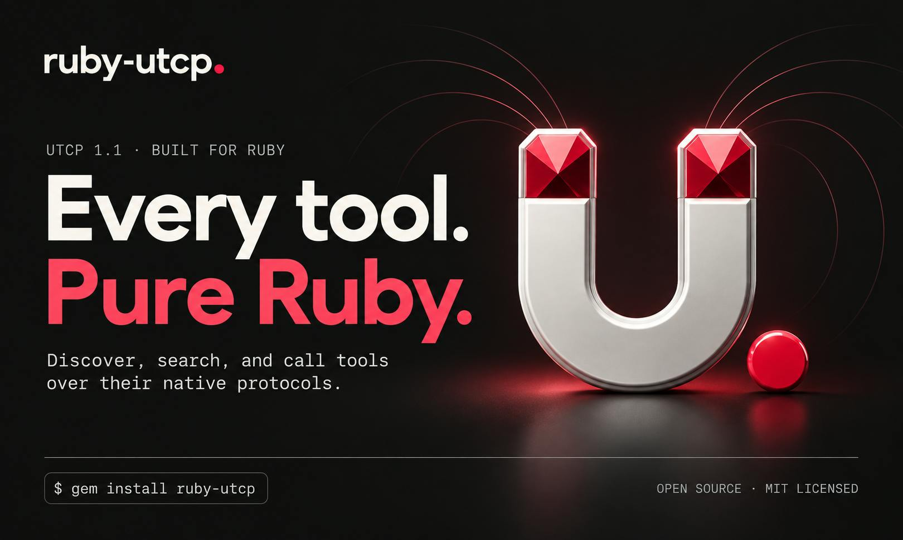
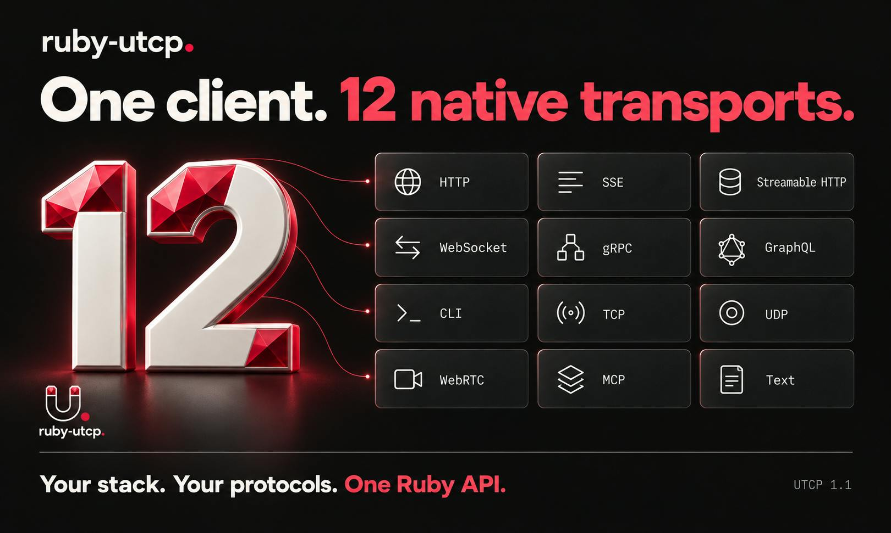
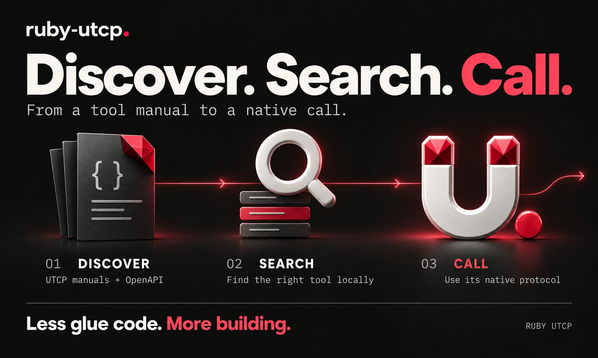

---

## 10. [Mise](https://www.producthunt.com/products/robot-recipes)
**Votes**: 87 | **도입 난이도**: 하 | **신뢰도**: 상
**Tagline**: The meal planner that gets all your dishes ready at once
**서비스 링크**: https://www.producthunt.com/r/QMXNN7RUXKQMF4

**태그**: Productivity, Cooking, Planning, Lifestyle

### 📌 이 서비스 한눈에 보기
여러 요리를 동시에 완성할 수 있도록 역산 스케줄링을 제공하는 스마트 밀 플래너

### 🔑 주요 기능
- 식사 시간을 기준으로 각 요리의 시작 시간을 역산하여 스케줄링
- 여러 요리를 위한 통합 쇼핑 리스트 및 조리 순서 제공
- 로그인 없이 무료로 사용할 수 있는 간편한 서비스

### 🙋 사용자에게 어떤 점이 좋은가
여러 가지 요리를 한 번에 준비해야 할 때, 각 요리의 조리 타이밍을 고민할 필요 없이 최적의 순서로 요리를 완성할 수 있습니다.

### ✅ 지금 바로 써볼 기능
- 원하는 식사 시간 설정하기
- 여러 레시피를 추가하여 통합 스케줄 확인하기
- 제공되는 통합 쇼핑 리스트로 재료 준비하기

### ⚠️ 사용 전 확인할 점
- 로그인 없이 사용하므로 기기 변경 시 데이터 유지 여부 확인 필요
- 사용자 개별 조리 숙련도에 따라 역산된 스케줄의 실현 가능성이 다를 수 있음

### 🧭 확인이 더 필요한 정보
로그인 없이 제공되는 데이터의 저장 방식 및 기기 간 동기화 지원 여부가 불분명합니다.

### 📸 스크린샷 및 갤러리
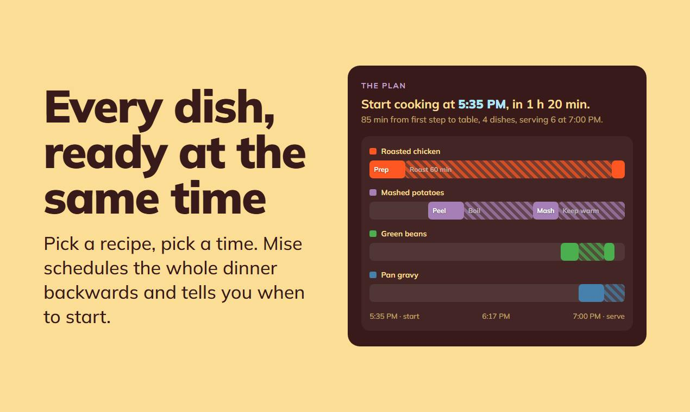
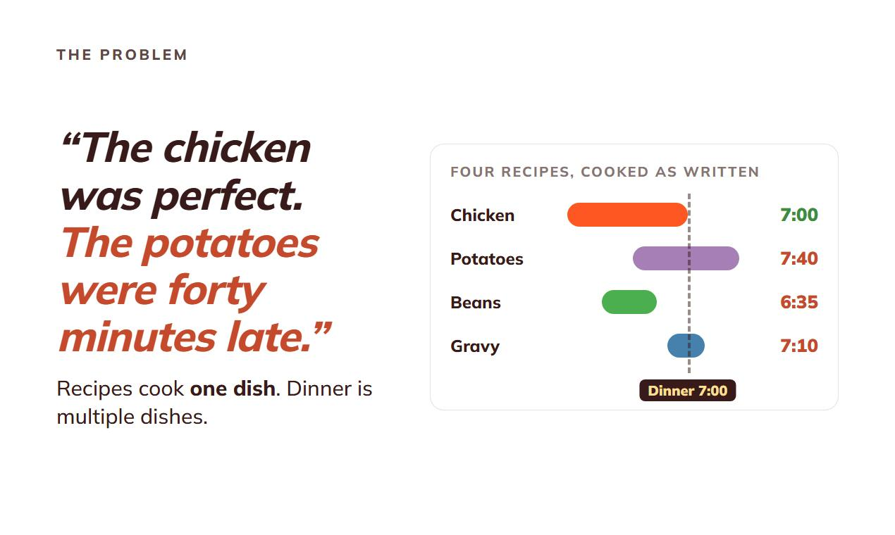
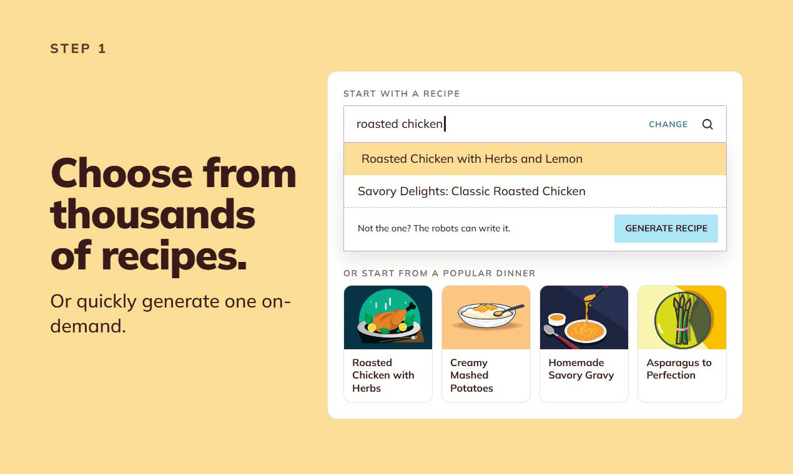

---

## 11. [Punch](https://www.producthunt.com/products/punch-4)
**Votes**: 87 | **도입 난이도**: 하 | **신뢰도**: 상
**Tagline**: Save your group chat's important stuff
**서비스 링크**: https://www.producthunt.com/r/WC5V4N6XYDUZJF

**태그**: Productivity, Collaboration, Lifestyle, AI Tool, Chat, DevTool

### 📌 이 서비스 한눈에 보기
중요한 정보만 쏙 뽑아 공유하는 그룹 채팅용 메모 저장소

### 🔑 주요 기능
- 채팅 속 중요한 정보(주소, 비밀번호 등)를 빠르게 저장
- 메모 앱보다 간편한 개별 정보 공유 기능
- 클라우드 저장소보다 직관적인 정보 관리

### 🙋 사용자에게 어떤 점이 좋은가
여행이나 모임 중 수많은 메시지를 뒤지는 대신, 필요한 정보만 모아 친구들과 즉시 공유할 수 있습니다.

### ✅ 지금 바로 써볼 기능
- 여행/모임용 필수 정보 저장해보기
- 친구/가족에게 공유 링크 전달하기

### ⚠️ 사용 전 확인할 점
- 개별 메시지 저장 방식의 상세 UI/UX 확인 필요
- 플랫폼 간 호환성 및 동기화 방식 확인 필요

### 🧭 확인이 더 필요한 정보
현재 제공되는 구체적인 플랫폼(iOS/Android/Web) 지원 범위와 협업 방식에 대한 상세 정보가 부족합니다.

### 📸 스크린샷 및 갤러리

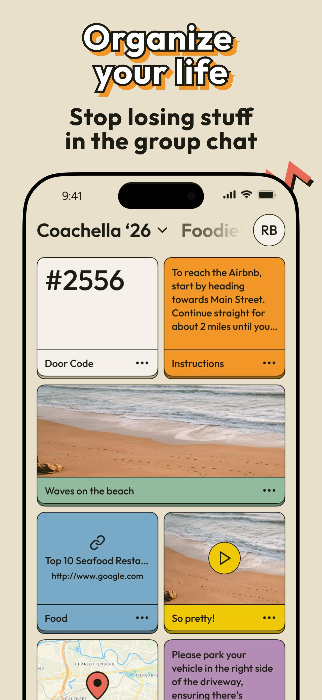
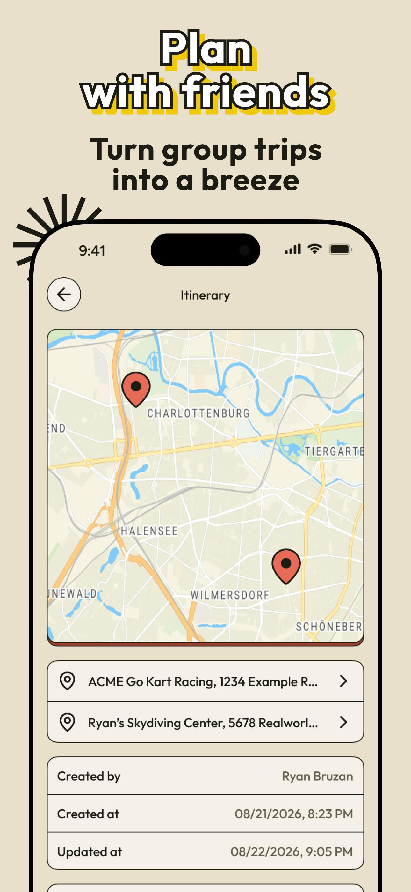

### 🎬 관련 영상
- [🎥 영상 보기](https://ph-files.imgix.net/768f9f33-c061-40d0-914e-53e63a271f63.jpeg?auto=format)

---

## 12. [Basedash Models](https://www.producthunt.com/products/basedash)
**Votes**: 86 | **도입 난이도**: 중 | **신뢰도**: 상
**Tagline**: Define it once. Query it like a table.
**서비스 링크**: https://www.producthunt.com/r/S66OIIDA7CTI4Z

**태그**: DataEngineering, Analytics, SQL, DevTool, AI Tool

### 📌 이 서비스 한눈에 보기
비즈니스 핵심 개념을 표준화된 SQL 모델로 정의하여 누구나 동일한 데이터로 쿼리할 수 있는 시맨틱 워크스페이스

### 🔑 주요 기능
- 비즈니스 핵심 개념(고객, 주문 등)을 한 번의 정의로 재사용 가능한 SQL 모델로 구축
- 상세 정보, 컬럼, 측정값, 세그먼트 등 모델별 전용 뷰 제공
- 시맨틱 레이어를 통해 AI 어시스턴트가 정확한 문맥을 파악할 수 있도록 지원

### 🙋 사용자에게 어떤 점이 좋은가
데이터 정의가 파편화되는 것을 방지하여, 팀원 모두가 동일한 기준의 데이터를 SQL 테이블처럼 손쉽게 조회하고 활용할 수 있습니다.

### ✅ 지금 바로 써볼 기능
- 핵심 비즈니스 엔티티를 모델로 정의하기
- 시맨틱 레이어에 동의어(Synonyms) 및 관계 설정하기
- 정의된 모델을 SQL 쿼리에서 테이블처럼 호출해보기

### ⚠️ 사용 전 확인할 점
- 기존 데이터 웨어하우스와의 연동 방식 및 성능 영향도 확인 필요
- 모델 정의 시 데이터 거버넌스 정책 준수 여부 검토

### 🧭 확인이 더 필요한 정보
현재 제공되는 모델링 기능이 기존 BI 도구나 데이터 웨어하우스와 어떻게 통합되는지에 대한 구체적인 기술 스택 정보가 부족합니다.

### 📸 스크린샷 및 갤러리
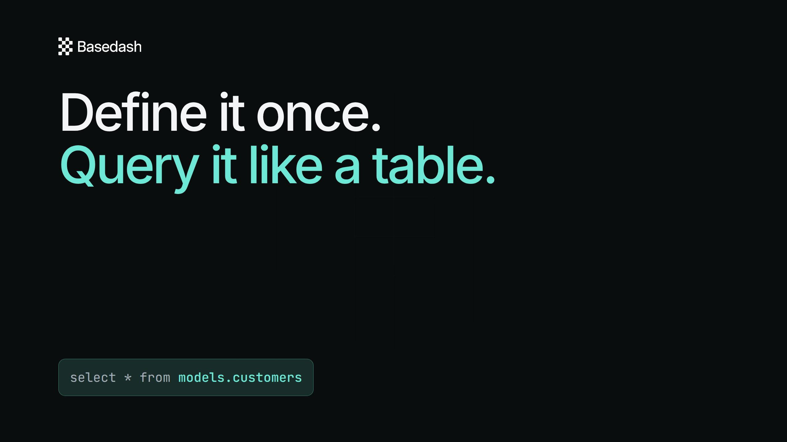
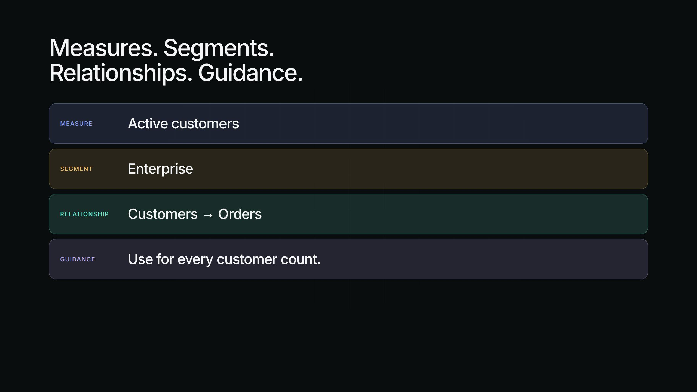
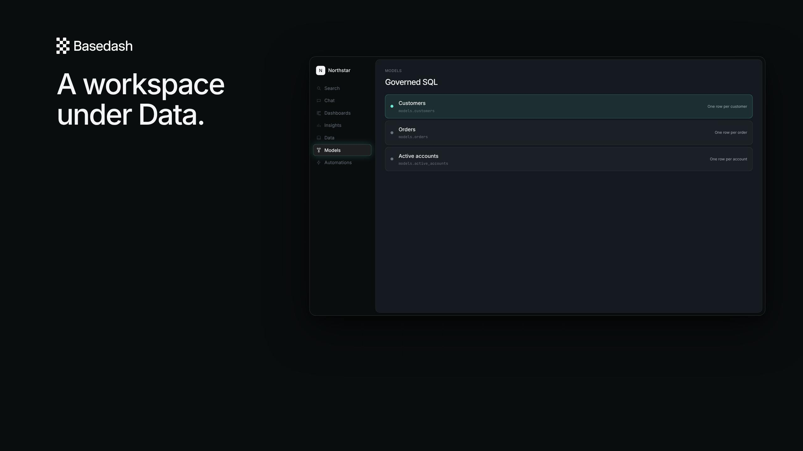

### 🎬 관련 영상
- [🎥 영상 보기](https://ph-files.imgix.net/2b5f4786-bb3b-4435-b07b-7a9df456ef27.jpeg?auto=format)

---

## 13. [BiBimba](https://www.producthunt.com/products/bibimba)
**Votes**: 80 | **도입 난이도**: 하 | **신뢰도**: 상
**Tagline**: Clipboard history that can read your screenshots
**서비스 링크**: https://www.producthunt.com/r/GAEVQP6QDOXG5X

**태그**: Productivity, AI, Mac, Automation, AI Tool

### 📌 이 서비스 한눈에 보기
스크린샷 속 텍els까지 검색 가능한 스마트 클립보드 히스토리 관리 도구

### 🔑 주요 기능
- 클립보드 기록과 스크린샷 통합 관리 및 검색 기능
- 이미지 내 텍스트를 읽어 영수증 금액이나 에러 메시지 검색 가능
- 온디바이스 AI를 통한 번역, 요약, 재작성 기능 제공

### 🙋 사용자에게 어떤 점이 좋은가
이미지 속 텍스트를 직접 타이핑할 필요 없이 검색하여 필요한 정보만 빠르게 복사할 수 있어 업무 효율이 높아집니다.

### ✅ 지금 바로 써볼 기능
- 과거 스크린샷 내 텍스트 검색해보기
- AI를 활용한 텍스트 요약 및 재작성 테스트
- 클립보드 히스토리와 스크린샷 통합 관리 설정

### ⚠️ 사용 전 확인할 점
- Mac 전용 앱이므로 macOS 환경에서만 사용 가능
- 개인정보 보호를 위해 온디바이스 AI 작동 방식 확인 필요

### 🧭 확인이 더 필요한 정보
구체적인 시스템 리소스 점유율이나 상세한 보안 프로토콜에 대한 정보는 명시되지 않았습니다.

### 📸 스크린샷 및 갤러리

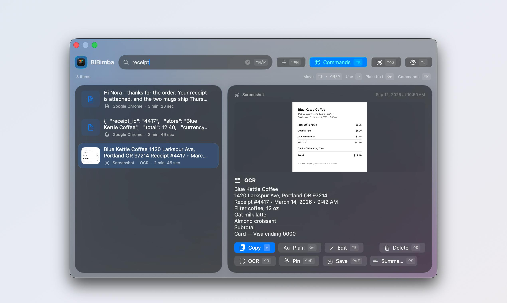
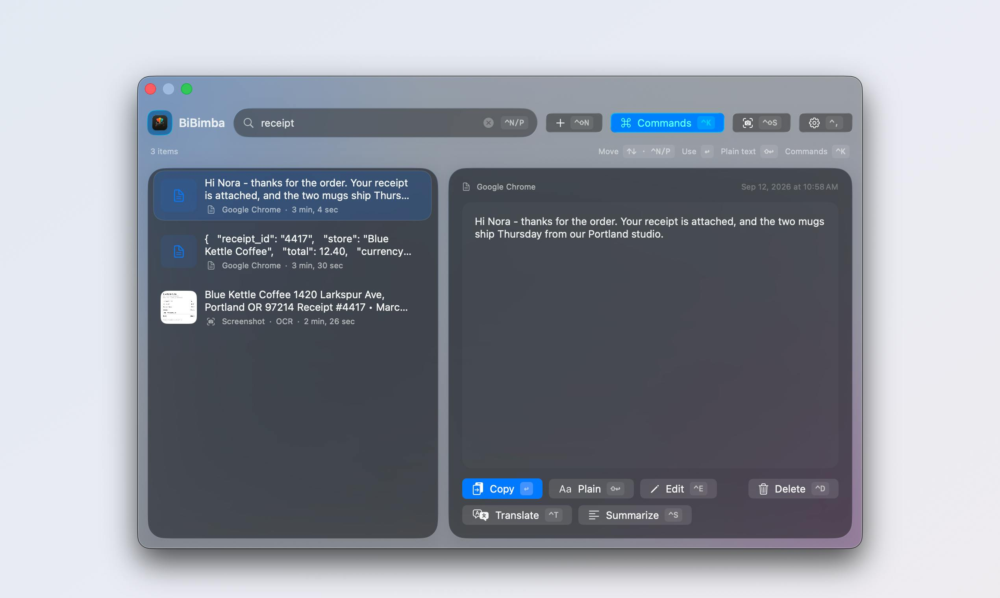

### 🎬 관련 영상
- [🎥 영상 보기](https://ph-files.imgix.net/aeed6733-806f-4735-9995-a9207a719b3c.jpeg?auto=format)

---

## 14. [Lappka](https://www.producthunt.com/products/lappka)
**Votes**: 21 | **도입 난이도**: 하 | **신뢰도**: 상
**Tagline**: Turn app screens into an App Store screenshots that converts
**서비스 링크**: https://www.producthunt.com/r/DI2R6XAMAO6BIC

**태그**: DesignTool, Marketing, AI, MobileApp, AI Tool

### 📌 이 서비스 한눈에 보기
AI를 활용해 앱 스크린샷을 전환율 높은 마케팅 자산으로 변환하는 도구

### 🔑 주요 기능
- AI 기반의 전략적 카피라이팅 및 디자인 자동화
- 수정이 용이한 템플릿과 현지화 기능 제공
- 앱 스토어 미리보기 및 즉시 내보내기 지원

### 🙋 사용자에게 어떤 점이 좋은가
앱 개발자가 디자인 전문 지식 없이도 높은 전환율을 유도하는 프로페셔널한 스크린샷을 빠르게 제작할 수 있습니다.

### ✅ 지금 바로 써볼 기능
- AI 전략 및 카피 생성 기능 테스트
- 제공되는 템플릿을 활용한 스크린샷 편집
- 글로벌 출시를 위한 현지화 기능 적용

### ⚠️ 사용 전 확인할 점
- AI 생성 카피의 브랜드 톤앤매너 일치 여부 확인 필요
- 사용자 맞춤형 디자인을 위한 수동 편집 작업 필요성

### 🧭 확인이 더 필요한 정보
구체적인 가격 정책 및 무료 플랜의 기능 제한 범위가 명시되지 않았습니다.

### 📸 스크린샷 및 갤러리
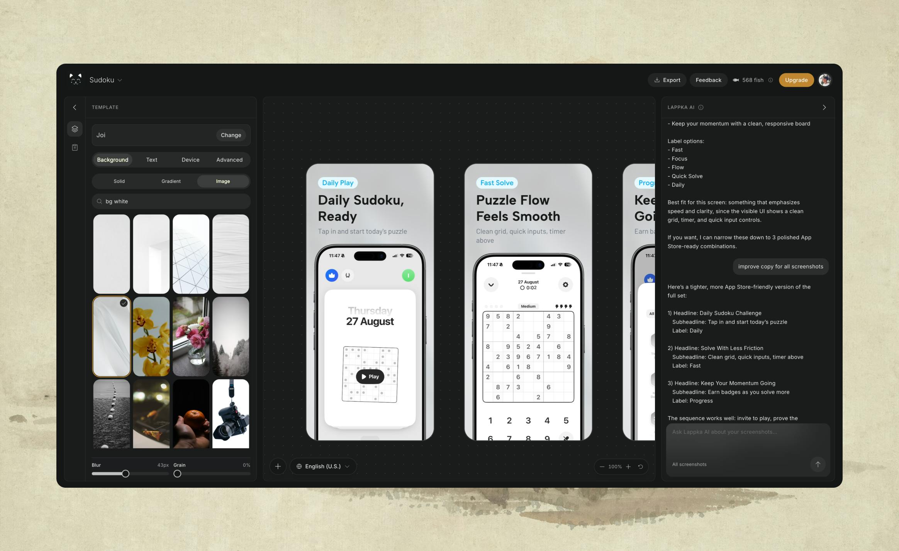
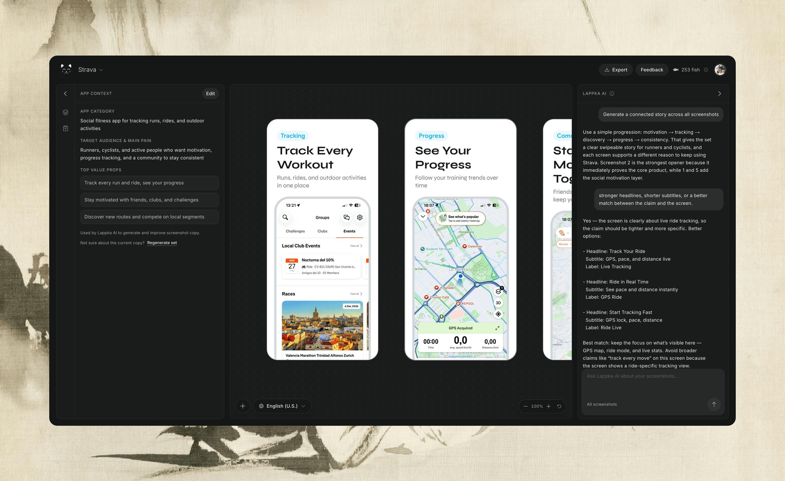
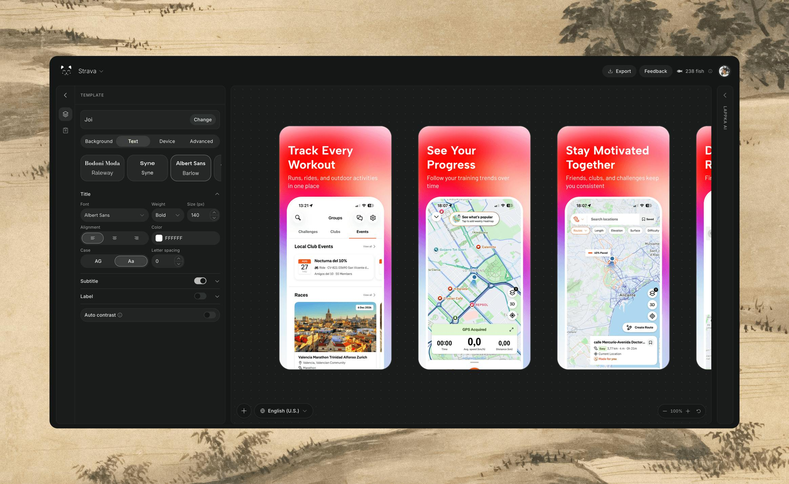

### 🎬 관련 영상
- [🎥 영상 보기](https://ph-files.imgix.net/4594dd7b-e355-4757-8322-0241901ef7f5.jpeg?auto=format)

---

## 15. [NotchOwl](https://www.producthunt.com/products/notchowl)
**Votes**: 16 | **도입 난이도**: 하 | **신뢰도**: 상
**Tagline**: Turn your Mac’s notch into a sleek productivity workspace.
**서비스 링크**: https://www.producthunt.com/r/VYUKQVPKBYJ5TY

**태그**: Productivity, Mac, Workflow, Utility

### 📌 이 서비스 한눈에 보기
맥북 노치 영역을 활용한 직관적인 생산성 워크스페이스

### 🔑 주요 기능
- 맥북 노치 공간을 활용한 작업 관리 및 메모 기능
- 포커스 타이머 및 캘린더 이벤트 통합
- 마우스 호버만으로 즉시 접근 가능한 간편한 UI

### 🙋 사용자에게 어떤 점이 좋은가
화면 공간을 차지하지 않으면서도 중요한 작업과 일정을 상시 확인할 수 있어 작업 흐름을 유지하는 데 도움을 줍니다.

### ✅ 지금 바로 써볼 기능
- 노치 영역에 주요 할 일(Tasks) 등록하기
- 집중이 필요할 때 포커스 타이머 실행하기
- 캘린더 이벤트를 통해 일정 확인하기

### ⚠️ 사용 전 확인할 점
- 노치 디자인이 없는 맥북 모델에서는 사용이 제한될 수 있음
- 상단 영역을 가리는 방식이므로 화면 가독성에 영향을 줄 수 있음

### 🧭 확인이 더 필요한 정보
노치 영역의 크기나 시스템 리소스 점유율에 대한 구체적인 정보가 부족합니다.

### 📸 스크린샷 및 갤러리
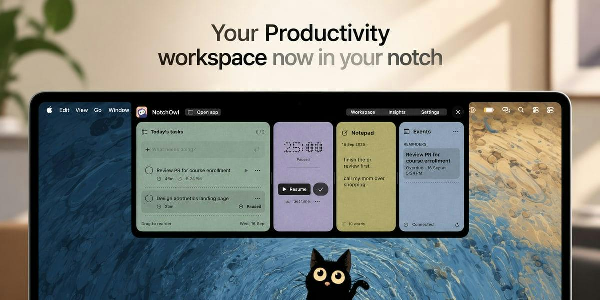

---

## 16. [Globenomics](https://www.producthunt.com/products/globenomics)
**Votes**: 15 | **도입 난이도**: 하 | **신뢰도**: 상
**Tagline**: Explore 3D globe, 16 games, and 195 countries up for auction
**서비스 링크**: https://www.producthunt.com/r/ZQZ5HZVZD7WHMS

**태그**: EdTech, Gaming, Data Visualization, Social, AI Tool, API

### 📌 이 서비스 한눈에 보기
3D 지구본 위에서 즐기는 지리 게임과 국가 소유권 경매가 결합된 에듀테인먼트 플랫폼

### 🔑 주요 기능
- 16가지 다양한 지리 관련 게임과 3D 지구본 탐험 기능
- 게임 보상(GlobeMillions)을 통한 국가 소유권 경매 시스템
- 국가별 GDP, 세금, 여권 파워 등 방대한 경제/지리 데이터 제공

### 🙋 사용자에게 어떤 점이 좋은가
게임 플레이를 통해 지리 지식을 재미있게 습득할 수 있으며, 특정 국가의 이름을 선점하여 자신의 링크를 홍보하는 등 소셜한 재미를 제공합니다.

### ✅ 지금 바로 써볼 기능
- 16가지 게임 중 하나를 선택해 플레이하기
- 획득한 GlobeMillions로 관심 있는 국가 경매 참여하기
- 국가별 경제 지표(GDP, Big Mac Index 등) 데이터 확인하기

### ⚠️ 사용 전 확인할 점
- 경매로 획득한 국가 소유권은 24시간 동안만 유지됨
- 홍보용 링크 및 노트는 운영진의 사전 검토를 거침

### 🧭 확인이 더 필요한 정보
경매 시스템의 구체적인 참여 조건과 GlobeMillions의 획득 방식에 대한 상세 규칙 확인이 필요합니다.

### 📸 스크린샷 및 갤러리
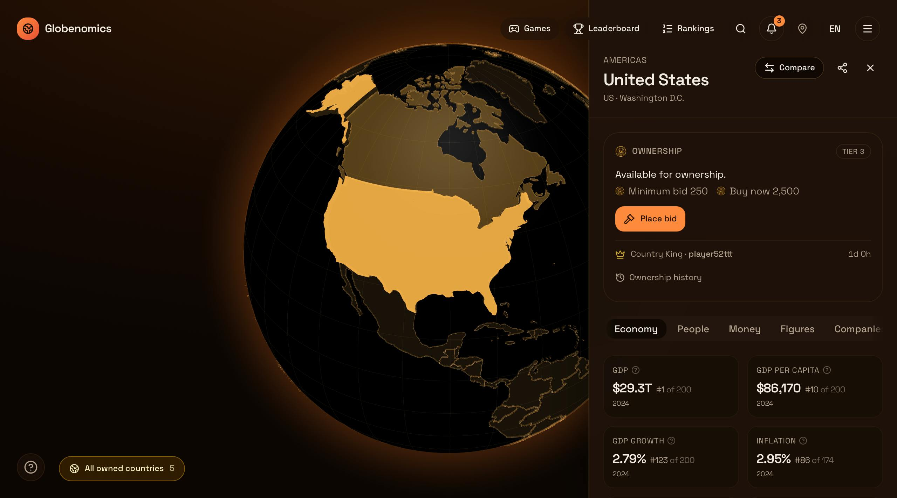
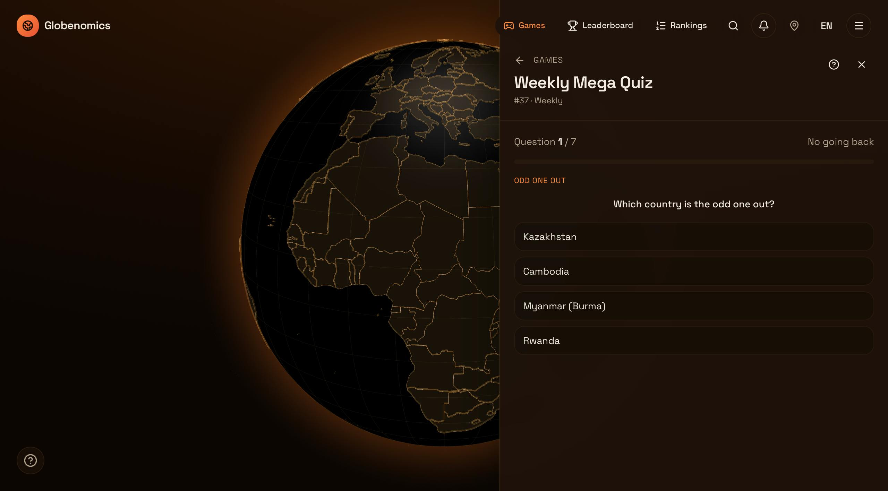

---

## 17. [One More Thing](https://www.producthunt.com/products/one-more-thing-2)
**Votes**: 9 | **도입 난이도**: 하 | **신뢰도**: 상
**Tagline**: Turn doomscrolling into something worth knowing.
**서비스 링크**: https://www.producthunt.com/r/LGBRCEZCLZWY4B

**태그**: EdTech, Productivity, Gamification, Learning

### 📌 이 서비스 한눈에 보기
무의미한 스크롤 대신 카드 스와이프로 지식을 쌓는 습관 형성 앱

### 🔑 주요 기능
- 심리학, 역사, 과학 등 다양한 분야의 카드형 학습 콘텐츠 제공
- 짧은 시간 내에 학습할 수 있는 비트사이즈(bite-sized) 콘텐츠 구성
- XP, 스트릭, 배지 시스템을 통한 게임화(Gamification) 요소 적용

### 🙋 사용자에게 어떤 점이 좋은가
스마트폰을 통한 무의미한 시간 낭비를 생산적인 학습 시간으로 전환할 수 있습니다.

### ✅ 지금 바로 써볼 기능
- 관심 있는 주제의 학습 덱 탐색하기
- 매일 조금씩 스와이프하며 학습 스트릭 만들기
- 학습을 통해 배지와 XP 획득하기

### ⚠️ 사용 전 확인할 점
- 심도 있는 학습보다는 가벼운 지식 습득에 특화되어 있음
- 콘텐츠의 깊이나 전문성이 사용자의 기대치와 다를 수 있음

### 🧭 확인이 더 필요한 정보
제공되는 콘텐츠의 전문성 수준과 업데이트 주기에 대한 정보가 부족합니다.

### 📸 스크린샷 및 갤러리

---

## 18. [Made with Jev](https://www.producthunt.com/products/made-with-jev)
**Votes**: 9 | **도입 난이도**: 하 | **신뢰도**: 상
**Tagline**: What people are building on Jev
**서비스 링크**: https://www.producthunt.com/r/BD356NAWMVLZ3A

**태그**: AI, Directory, Automation, Inspiration, Agent, AI Tool, Email

### 📌 이 서비스 한눈에 보기
초고속 의사결정 AI 모델 'Jev'를 활용한 혁신적인 프로젝트들을 모아둔 디렉토리

### 🔑 주요 기능
- 0.5초 미만의 빠른 의사결정 기능을 갖춘 Jev 모델 기반 프로젝트 탐색
- 브라우저 에이전트, 게임, 이메일 분류 등 다양한 실전 활용 사례 제공
- 각 프로젝트의 실제 운영 비용(Real Cost) 정보 포함

### 🙋 사용자에게 어떤 점이 좋은가
Jev 모델을 활용한 창의적인 자동화 사례를 통해 새로운 아이디어를 얻고, 실제 구현 비용을 파악하여 프로젝트 기획에 참고할 수 있습니다.

### ✅ 지금 바로 써볼 기능
- Jev로 구축된 브라우저 에이전트 및 게임 사례 살펴보기
- 프로젝트별 실제 운영 비용 확인하기
- 출시 예정인 AI 슬롭(Slop) 탐지기 및 도구들 확인하기

### ⚠️ 사용 전 확인할 점
- 제공되는 사례들이 특정 기술 스택에 편중되어 있을 수 있음
- 프로젝트별 비용 산정 방식이 다를 수 있음

### 🧭 확인이 더 필요한 정보
Jev 모델 자체의 상세 API 사양이나 기술적 구현 방식은 해당 디렉토리 외부의 정보가 필요합니다.

### 📸 스크린샷 및 갤러리
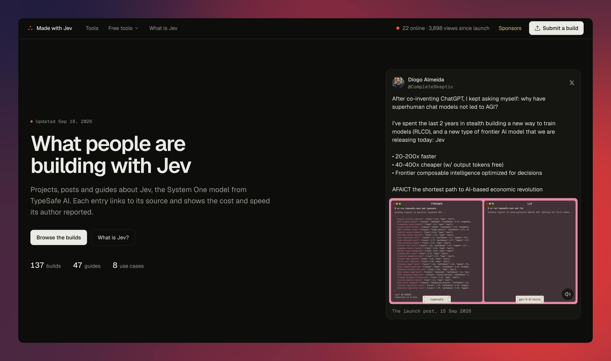
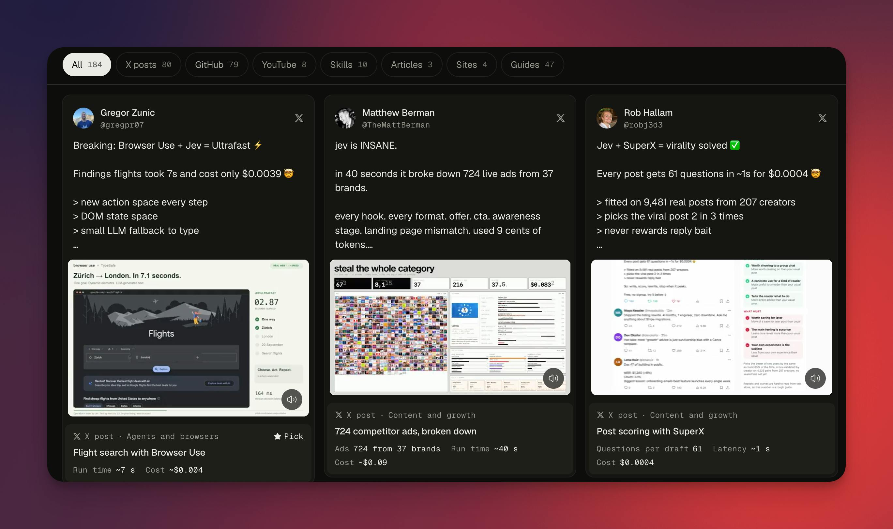

### 🎬 관련 영상
- [🎥 영상 보기](https://ph-files.imgix.net/f50bbf6d-1c95-4a04-80c6-1d763bc2bdd7.jpeg?auto=format)

---

## 19. [LucentraCode](https://www.producthunt.com/products/lucentracode)
**Votes**: 9 | **도입 난이도**: 하 | **신뢰도**: 상
**Tagline**: Code without the Clock
**서비스 링크**: https://www.producthunt.com/r/E4AA2UW354RX5L

**태그**: DevTool, AI, CLI, Productivity, AI Tool

### 📌 이 서비스 한눈에 보기
사용량 제한 걱정 없이 터미널에서 다양한 최신 AI 모델을 활용하는 CLI 코딩 도구

### 🔑 주요 기능
- 터미널 기반의 AI 코딩 CLI 환경 제공
- GPT, Claude, Gemini, Grok 등 다양한 최신 모델 선택 가능
- 디버깅, 기능 구현, 리팩토링 등 실무 개발 워크플로우 최적화

### 🙋 사용자에게 어떤 점이 좋은가
구독료나 사용량 제한에 구애받지 않고 개발자가 원하는 모델을 자유롭게 선택하며 코딩에 집중할 수 있습니다.

### ✅ 지금 바로 써볼 기능
- 터미널에 CLI 설치 및 환경 설정
- 프로젝트 코드베이스 연결 및 모델 선택
- 기존 코드 리팩토링 및 디버깅 작업 수행

### ⚠️ 사용 전 확인할 점
- 사용하는 모델에 따른 별도의 API 비용이나 사용량 정책 확인 필요
- CLI 환경에 익숙하지 않은 경우 초기 설정 학습 필요

### 🧭 확인이 더 필요한 정보
제시된 모델명(GPT-6 Astra 등)이 실제 존재하는 모델인지 또는 해당 도구만의 특수 명칭인지 확인이 필요합니다.

### 📸 스크린샷 및 갤러리

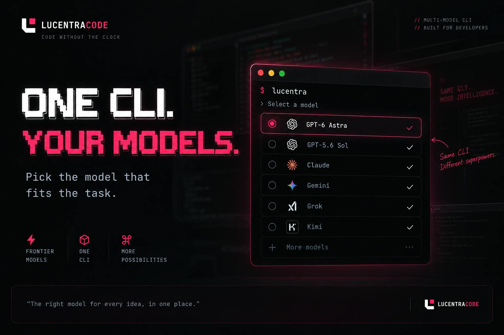
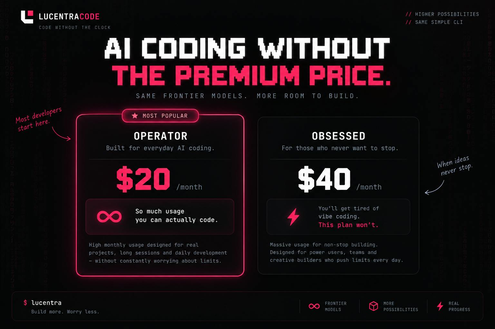

### 🎬 관련 영상
- [🎥 영상 보기](https://ph-files.imgix.net/f5280e9a-8f37-4a6a-ae3a-b6aa82261898.jpeg?auto=format)

---

## 20. [IronFuel for Android](https://www.producthunt.com/products/ironfuel-for-android)
**Votes**: 8 | **도입 난이도**: 하 | **신뢰도**: 상
**Tagline**: Now on Android: log a set, watch today's food target move
**서비스 링크**: https://www.producthunt.com/r/PBGP4DW7TN4TVQ

**태그**: Fitness, Health, Android, Nutrition

### 📌 이 서비스 한눈에 보기
운동 기록과 식단 관리를 하나로 통합하여 소모 칼로리에 맞춰 영양 목표를 자동 조정하는 안드로이드 앱

### 🔑 주요 기능
- 운동 기록과 식단 관리의 유기적 결합
- 세 번의 터치 또는 음성으로 간편한 세트 기록
- 식사 사진 촬영을 통한 간편한 식단 기록

### 🙋 사용자에게 어떤 점이 좋은가
운동량에 따라 매번 식단 목표를 수동으로 계산할 필요 없이, 운동 직후 실시간으로 최적화된 영양 가이드를 받을 수 있습니다.

### ✅ 지금 바로 써볼 기능
- 음성 명령으로 운동 세트 기록해보기
- 음식 사진 촬영으로 식단 기록해보기
- 운동 후 변동되는 영양 목표 확인하기

### ⚠️ 사용 전 확인할 점
- 안드로이드 플랫폼 전용 서비스임
- 정확한 칼로리 계산은 촬영된 음식 사진의 분석 품질에 의존할 수 있음

### 🧭 확인이 더 필요한 정보
음식 사진 분석의 정확도와 구체적인 운동량-칼로리 연동 알고리즘에 대한 상세 정보가 필요합니다.

### 📸 스크린샷 및 갤러리
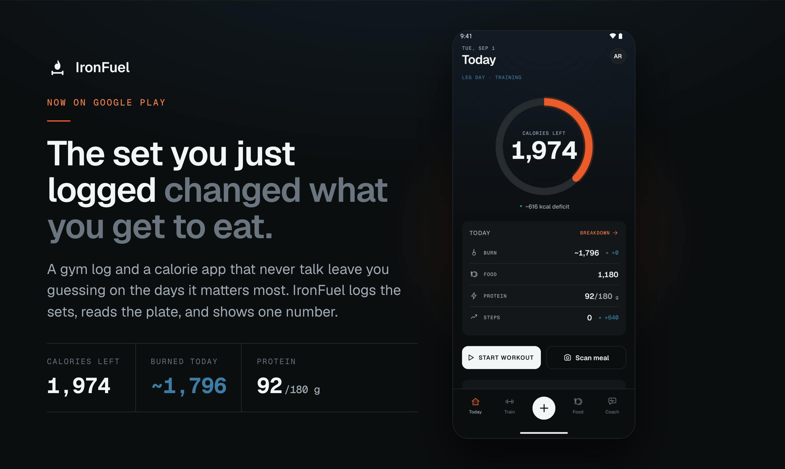
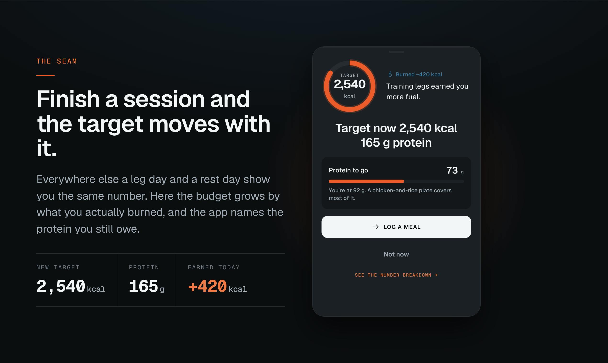
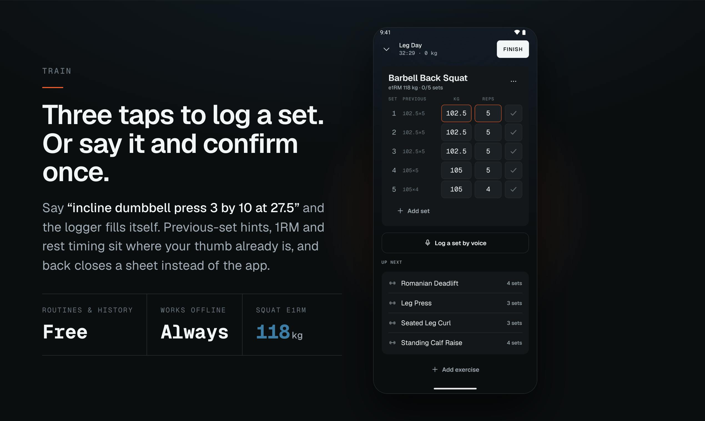

---

## 21. [CreateMascot](https://www.producthunt.com/products/createmascot)
**Votes**: 7 | **도입 난이도**: 하 | **신뢰도**: 상
**Tagline**: Consistent mascot illustrations for your app and launch
**서비스 링크**: https://www.producthunt.com/r/ROJ2GGE3DEVDDH

**태그**: DesignTool, AI-Generator, Branding, UI-UX

### 📌 이 서비스 한눈에 보기
제품 브리프만으로 일관된 브랜드 마스코트와 다양한 UI 에셋을 생성하는 도구

### 🔑 주요 기능
- 제품 설명이나 웹사이트 URL을 통한 자동 캐릭터 방향성 제안
- 한 번의 캐릭터 확정으로 404 페이지, 온보딩, 소셜 포스트용 일관된 일러스트 생성
- 15가지 에셋 포맷 및 크기별 PNG 다운로드 지원

### 🙋 사용자에게 어떤 점이 좋은가
브랜드 아이덴티티를 유지하면서 앱의 빈 상태(empty states)나 온보딩 화면에 필요한 일러스트를 쉽고 빠르게 제작할 수 있습니다.

### ✅ 지금 바로 써볼 기능
- 웹사이트 URL을 입력하여 3가지 캐릭터 방향성 확인하기
- 생성된 캐릭터를 기반으로 다양한 UI 에셋(404, 온보딩 등) 생성해보기
- 필요한 크기에 맞춰 PNG 파일로 다운로드하기

### ⚠️ 사용 전 확인할 점
- 사용자가 직접 업로드한 이미지의 경우 저작권 및 원본 스타일 유지 여부 확인 필요
- 생성된 캐릭터의 세부 수정(editing) 범위가 어느 정도인지 확인 필요

### 🧭 확인이 더 필요한 정보
제공되는 15가지 에셋 포맷의 구체적인 종류와 편집 가능 범위에 대한 상세 정보가 필요합니다.

### 📸 스크린샷 및 갤러리
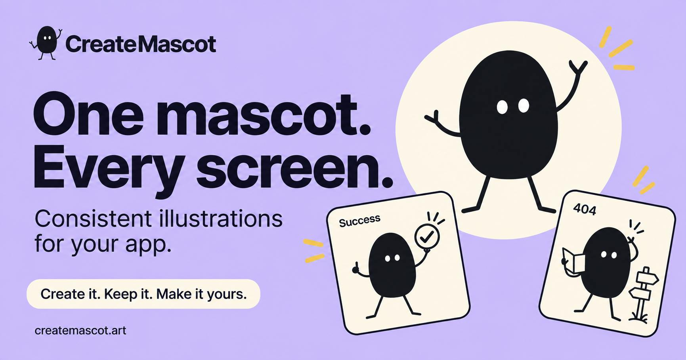
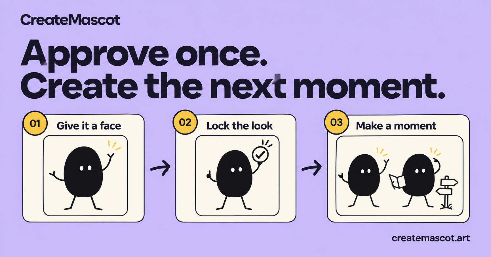
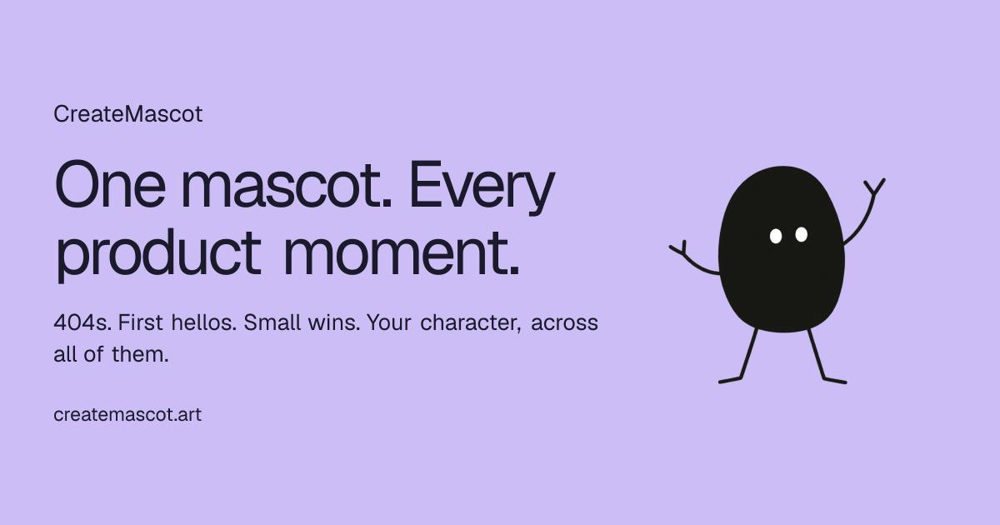

---

## 22. [Make Agent Fast](https://www.producthunt.com/products/make-agent-fast)
**Votes**: 6 | **도입 난이도**: 하 | **신뢰도**: 상
**Tagline**: Customer AI agents for small businesses. No code.
**서비스 링크**: https://www.producthunt.com/r/LEYA7ICMWQOZBO

**태그**: NoCode, AI, CustomerService, Automation, SaaS, Agent, AI Tool, Chat, DevTool, Sales

### 📌 이 서비스 한눈에 보기
코딩 없이 웹사이트와 문서를 활용해 구축하는 소상공인용 고객 응대 AI 에이전트

### 🔑 주요 기능
- 노코드 방식으로 웹사이트 및 문서 기반의 AI 에이전트 구축
- 영업, 고객 서비스, 예약 등 목적별 맞춤형 에이전트 선택 가능
- 대시보드를 통한 채팅 내역 검토, 문의 캡처 및 상담원 전환 기능 제공

### 🙋 사용자에게 어떤 점이 좋은가
코딩 지식 없이도 전문적인 고객 응대 자동화 시스템을 구축하여 운영 효율을 높일 수 있습니다.

### ✅ 지금 바로 써볼 기능
- 보유 중인 문서 업로드하여 지식 베이스 구축하기
- 에이전트 테스트 및 지식 검토하기
- 기존 웹사이트에 임베드 코드 적용하기

### ⚠️ 사용 전 확인할 점
- 요금제에 따라 음성 기능 및 지원 채널 범위가 다를 수 있음
- 사용 중인 특정 메시징 채널과의 호환성 확인 필요

### 🧭 확인이 더 필요한 정보
요금제별로 제공되는 기능과 지원되는 메시징 채널의 상세 범위 확인이 필요합니다.

### 📸 스크린샷 및 갤러리

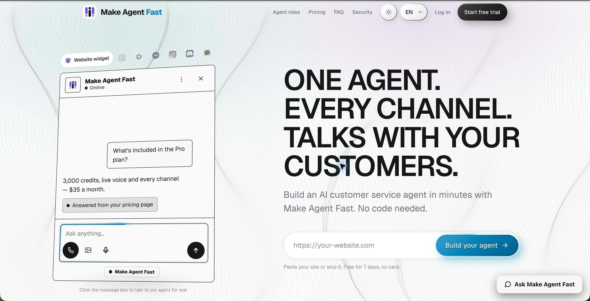
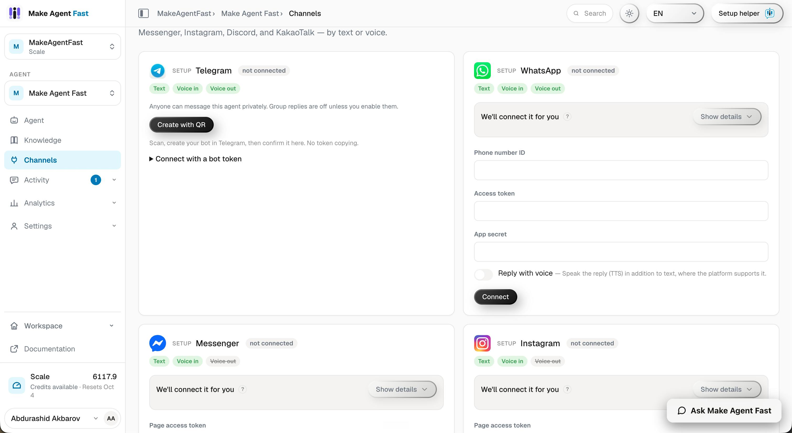

### 🎬 관련 영상
- [🎥 영상 보기](https://ph-files.imgix.net/faa90d71-14eb-4c93-861a-42fb8d53455a.jpeg?auto=format)

---

## 23. [BrainLoom 1.2](https://www.producthunt.com/products/brainloom)
**Votes**: 6 | **도입 난이도**: 중 | **신뢰도**: 상
**Tagline**: The visual thinking canvas with built-in active recall
**서비스 링크**: https://www.producthunt.com/r/346ICT7TAJLRG5

**태그**: Productivity, EdTech, Note-taking, VisualThinking, AI Tool

### 📌 이 서비스 한눈에 보기
독서, 노트 정리, 암기를 하나로 연결한 시각적 학습 캔버스

### 🔑 주요 기능
- PDF 및 노트 하이라이트를 통한 즉각적인 플래시카드 생성
- 출처 연결(Linked Source) 기능을 통한 원문과 카드 간의 유기적 연결
- 클라우드 동기화, 자유로운 스케치, 로컬 우선 프라이버시 지원

### 🙋 사용자에게 어떤 점이 좋은가
학습 자료를 정리하는 동시에 암기용 카드를 자동으로 만들 수 있어, 복습 시간을 획기적으로 단축할 수 있습니다.

### ✅ 지금 바로 써볼 기능
- PDF를 업로드하고 텍els를 하이라이트하여 플래시카드 생성해보기
- Linked Source 기능을 통해 원문과 생성된 카드의 연결성 확인하기
- 자유로운 캔버스 스케치 기능으로 시각적 노트 정리해보기

### ⚠️ 사용 전 확인할 점
- 로컬 우선 방식이므로 기기 간 동기화 설정 및 데이터 백업 방식 확인 필요
- 시각적 캔버스 기반이므로 텍스트 위주의 단순 기록 사용자에게는 복잡할 수 있음

### 🧭 확인이 더 필요한 정보
상세한 요금제 체계와 모바일 앱 지원 범위에 대한 정보가 명시되지 않았습니다.

### 📸 스크린샷 및 갤러리
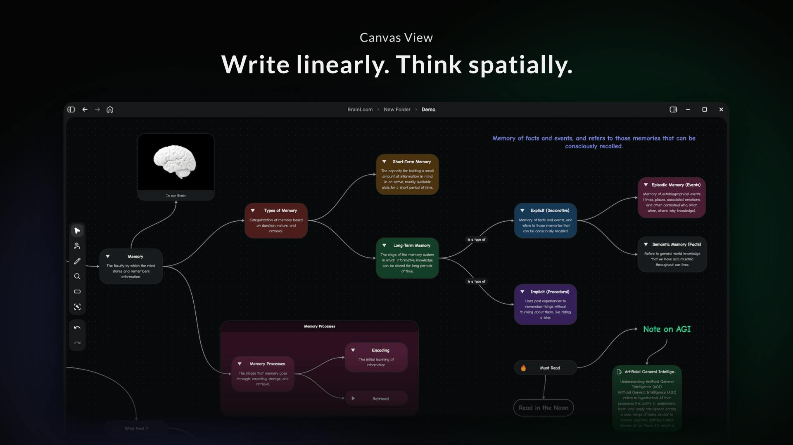
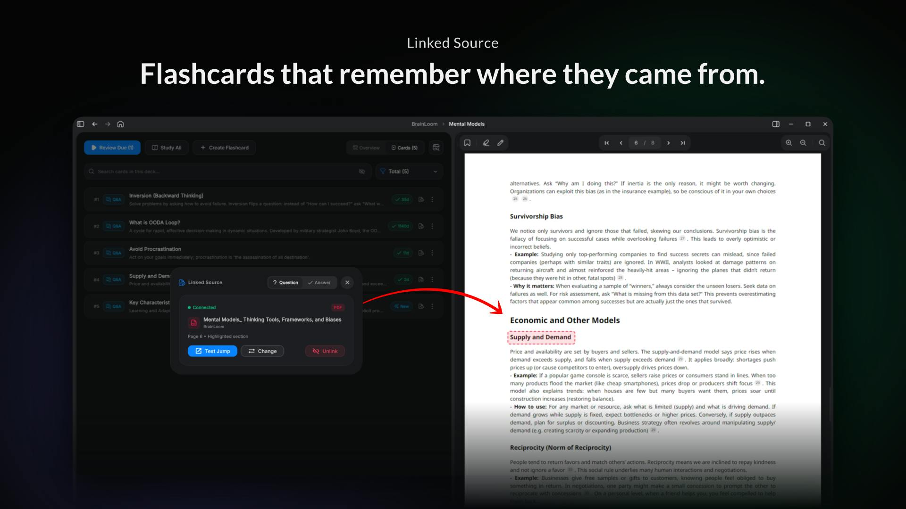
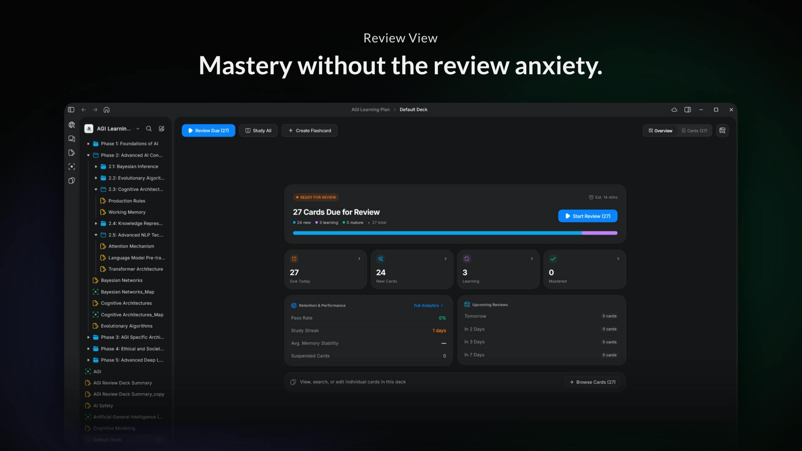

### 🎬 관련 영상
- [🎥 영상 보기](https://ph-files.imgix.net/ee2e5f9e-a3b3-4548-be0e-827a80d8c60f.jpeg?auto=format)

---

## 24. [Focus Firewall](https://www.producthunt.com/products/focus-firewall)
**Votes**: 5 | **도입 난이도**: 하 | **신뢰도**: 상
**Tagline**: Block distracting websites while you work
**서비스 링크**: https://www.producthunt.com/r/RMBF3KTXY6SO7N

**태그**: Productivity, Mac, Focus, Privacy

### 📌 이 서비스 한눈에 보기
업무 시간 동안 맥(Mac)의 방해 요소를 차단하여 집중력을 유지해주는 자동화 도구

### 🔑 주요 기능
- 브라우저 확장 프로그램 없이 모든 주요 브라우저에서 작동
- 설정된 시간에 맞춰 자동으로 차단이 실행되는 자동화 기능
- 사용 시간 분석 및 집중도 점수를 제공하는 브라우징 리포트

### 🙋 사용자에게 어떤 점이 좋은가
업무 중 무의식적으로 웹사이트에 접속하는 습관을 물리적으로 제어하여 생산성을 높일 수 있습니다.

### ✅ 지금 바로 써볼 기능
- 7일 무료 체험을 통해 본인의 업무 패턴에 맞는지 확인하기
- Touch ID/비밀번호 잠금 기능을 설정하여 의지력 보완하기
- 브라우징 리포트를 통해 자신의 집중 시간대 파악하기

### ⚠️ 사용 전 확인할 점
- Mac 전용 소프트웨어이므로 Windows나 모바일 환경에서는 사용 불가
- 차단 설정이 너무 엄격할 경우 업무에 필요한 사이트까지 막힐 수 있음

### 🧭 확인이 더 필요한 정보
7일 무료 체험 종료 후의 정확한 유료 구독 가격 정책은 명시되어 있지 않습니다.

### 📸 스크린샷 및 갤러리
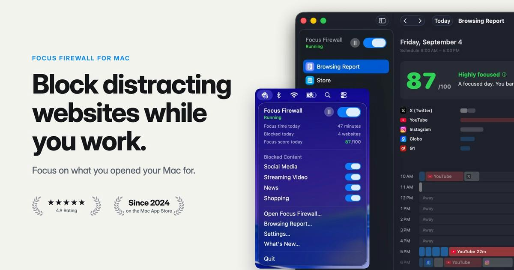
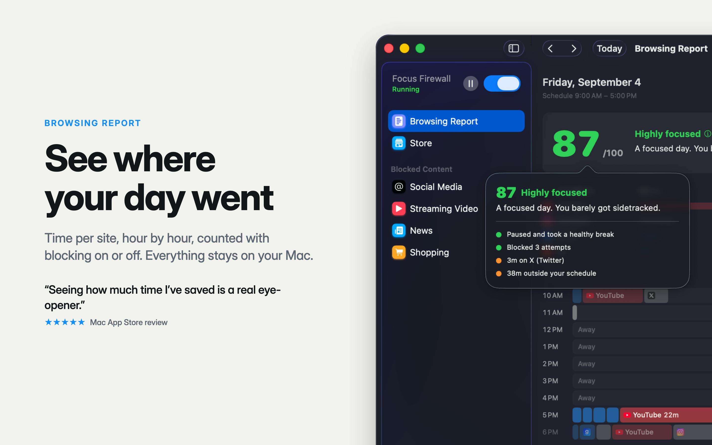
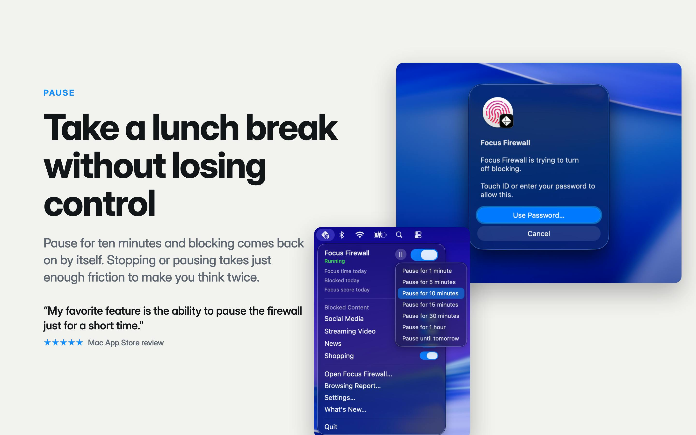

---

## 25. [JSONaire](https://www.producthunt.com/products/jsonaire)
**Votes**: 5 | **도입 난이도**: 하 | **신뢰도**: 상
**Tagline**: Open large JSON files on Mac without your machine choking
**서비스 링크**: https://www.producthunt.com/r/T2BOD5VS7CVFPI

**태그**: DevTool, macOS, DataAnalysis, AI Tool

### 📌 이 서비스 한눈에 보기
대용량 JSON 파일을 메모리 부하 없이 즉시 열고 탐색할 수 있는 macOS 전용 네이티브 앱

### 🔑 주요 기능
- 메모리 맵(Memory-mapping) 방식을 사용하여 RAM 점유 없이 기가바이트 단위 파일도 즉시 실행
- VS Code나 크롬 개발자 도구처럼 대용량 파일로 인해 시스템이 멈추는 현상 방지
- 네이티브 탭, 빠른 검색, 데이터 테이블 뷰 및 다양한 형식의 복사 기능 제공

### 🙋 사용자에게 어떤 점이 좋은가
수 GB에 달하는 거대한 JSON 파일을 다룰 때 컴퓨터가 멈추는 문제 없이 빠르고 쾌적하게 데이터를 확인할 수 있습니다.

### ✅ 지금 바로 써볼 기능
- 대용량 JSON 파일 열기 테스트
- 테이블 뷰를 통한 객체 배열 시각화 확인
- 빠른 검색 기능 활용

### ⚠️ 사용 전 확인할 점
- 무료 버전은 100MB까지만 지원하며, 그 이상의 파일은 Pro 버전 필요
- macOS 전용 앱이므로 다른 운영체제에서는 사용 불가

### 🧭 확인이 더 필요한 정보
Pro 버전의 구체적인 가격 정책과 모든 테마 지원 여부는 별도 확인이 필요합니다.

### 📸 스크린샷 및 갤러리
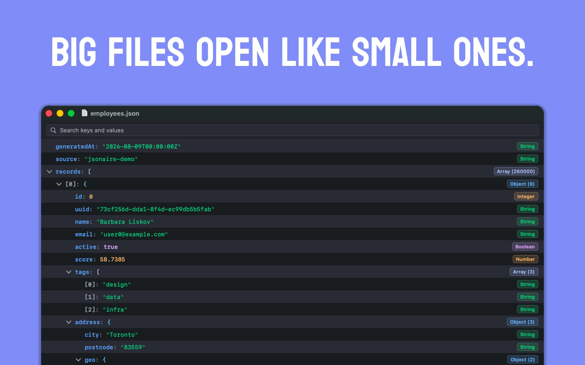
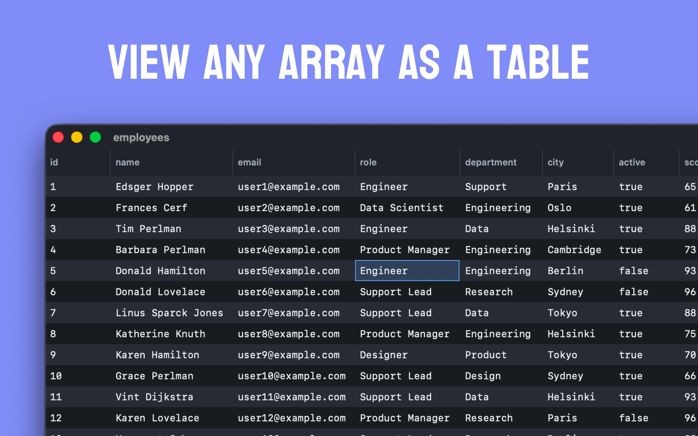
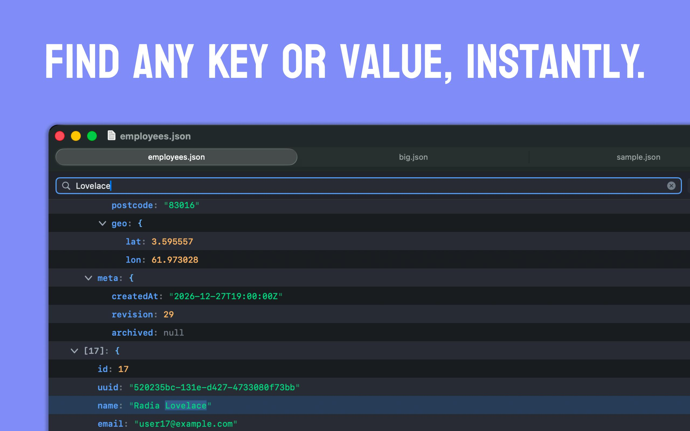

---

## 26. [ReceiptVault: Warranty Tracker](https://www.producthunt.com/products/receiptvault-warranty-tracker)
**Votes**: 4 | **도입 난이도**: 하 | **신뢰도**: 상
**Tagline**: Keep your receipts. Never miss a warranty.
**서비스 링크**: https://www.producthunt.com/r/3I6MQJUQ4BRJPQ

**태그**: Productivity, AI, Organization, Finance, AI Tool, Design

### 📌 이 서비스 한눈에 보기
AI OCR로 영수증을 자동 저장하고 보증 기간 만료를 관리하는 스마트 영수증 보관함

### 🔑 주요 기능
- AI 기반 OCR 기술로 영수증 정보 자동 추출 및 입력
- 클라우드 기반의 안전한 구매 기록 저장 및 폴더 관리
- 보증 만료 전 알림 기능을 통한 스마트한 워런티 관리

### 🙋 사용자에게 어떤 점이 좋은가
영수증을 일일이 입력할 필요 없이 스캔만으로 보관할 수 있으며, 보증 기간 만료를 놓치지 않게 도와줍니다.

### ✅ 지금 바로 써볼 기능
- 영수증 스캔 및 자동 데이터 추출 기능 테스트
- 보증 만료 알림 설정 및 폴더 정리 기능 확인

### ⚠️ 사용 전 확인할 점
- AI OCR의 인식 정확도에 따른 수동 검토 필요성
- 클라우드 저장 방식에 따른 개인정보 및 보안 정책 확인 필요

### 🧭 확인이 더 필요한 정보
AI OCR의 데이터 추출 정확도와 모바일 앱/웹 지원 범위에 대한 상세 정보가 필요합니다.

### 📸 스크린샷 및 갤러리

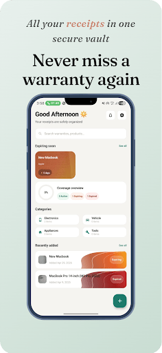

### 🎬 관련 영상
- [🎥 영상 보기](https://ph-files.imgix.net/1437b9aa-5c0c-4a9c-8a0e-07ccdf9ee546.jpeg?auto=format)

---

## 27. [Daeviq](https://www.producthunt.com/products/daeviq)
**Votes**: 4 | **도입 난이도**: 하 | **신뢰도**: 상
**Tagline**: Turn Instagram comments and DMs into paying customers
**서비스 링크**: https://www.producthunt.com/r/W76PQEYPP76JQ2

**태그**: Automation, CRM, SocialMedia, Marketing, Instagram

### 📌 이 서비스 한눈에 보기
인스타그램 댓글과 DM을 자동화하여 잠재 고객을 확보하는 올인원 CRM 솔루션

### 🔑 주요 기능
- 댓글 및 DM 자동 답장과 키워드 트리거 기능 제공
- 팔로우 유도(Follow-gates) 및 웰컴 메시지 자동화
- 수집된 잠재 고객을 관리하는 내장 CRM 시스템

### 🙋 사용자에게 어떤 점이 좋은가
반복적인 DM 응대 시간을 줄이면서, 인스타그램 참여를 실제 매출로 연결하는 효율적인 워크플로우를 구축할 수 있습니다.

### ✅ 지금 바로 써볼 기능
- 특정 키워드에 반응하는 자동 답장 설정하기
- DM 자동 응답을 통한 리드 확보 테스트하기
- 내장 CRM에 유입되는 고객 데이터 확인하기

### ⚠️ 사용 전 확인할 점
- 인스타그램 플랫폼 정책에 따른 자동화 기능 제한 가능성
- 자동화 메시지가 사용자 경험(UX)을 해치지 않도록 정교한 설정 필요

### 🧭 확인이 더 필요한 정보
인스타그램 API 정책 변화에 따른 기능 유지 여부와 상세 요금 체계 확인이 필요합니다.

### 📸 스크린샷 및 갤러리
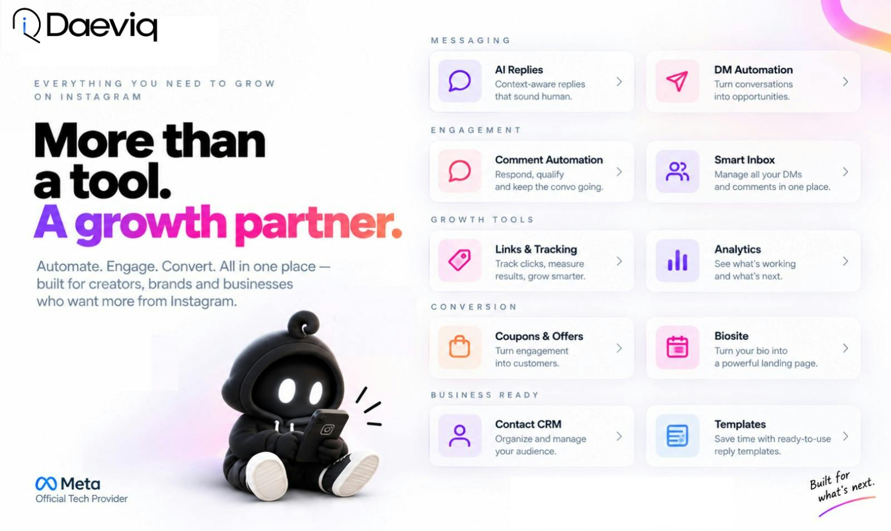

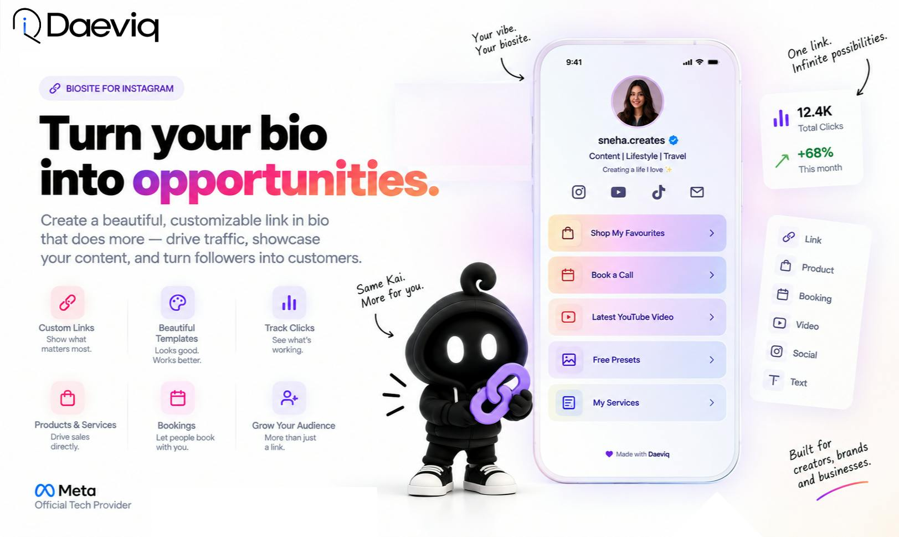

### 🎬 관련 영상
- [🎥 영상 보기](https://ph-files.imgix.net/99a875be-5714-4908-b3dd-e439ba02693c.jpeg?auto=format)

---

## 28. [GEOFill](https://www.producthunt.com/products/geofill)
**Votes**: 4 | **도입 난이도**: 하 | **신뢰도**: 상
**Tagline**: GEO content to 10 platforms in one minute.
**서비스 링크**: https://www.producthunt.com/r/CF6QKYRP2OSLEJ

**태그**: Automation, ContentMarketing, Productivity, ChromeExtension, AI Tool

### 📌 이 서비스 한눈에 보기
클릭 한 번으로 10개 플랫폼에 최적화된 콘텐츠를 배포하는 자동화 도구

### 🔑 주요 기능
- 플랫폼별 네이티브 스타일의 GEO 콘텐츠 자동 생성
- Reddit, LinkedIn, Medium 등 다양한 플랫폼 자동 채우기 지원
- Chrome 확장 프로그램을 통한 워크플로우 혁신

### 🙋 사용자에게 어떤 점이 좋은가
매일 반복되는 콘텐츠 배포 작업을 1시간에서 60초로 단축하여 생산성을 극대화할 수 있습니다.

### ✅ 지금 바로 써볼 기능
- Chrome 확장 프로그램 설치하기
- 주요 소셜 플랫폼 연동하기
- 생성된 콘텐츠의 플랫폼별 적합성 확인하기

### ⚠️ 사용 전 확인할 점
- 자동 생성된 콘텐츠의 품질 및 톤앤매너 검토 필요
- 플랫폼별 정책에 따른 계정 제재 가능성 확인 필요

### 🧭 확인이 더 필요한 정보
지원하는 전체 플랫폼 목록과 자동화 범위에 대한 상세 사양 확인이 필요합니다.

### 📸 스크린샷 및 갤러리
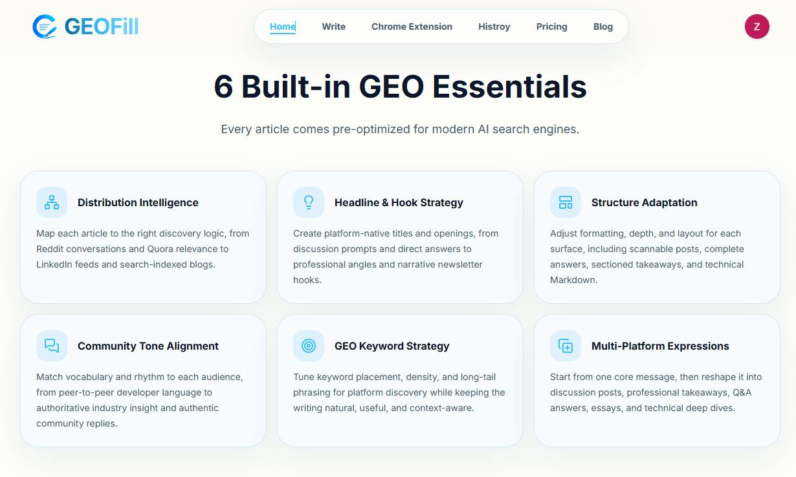
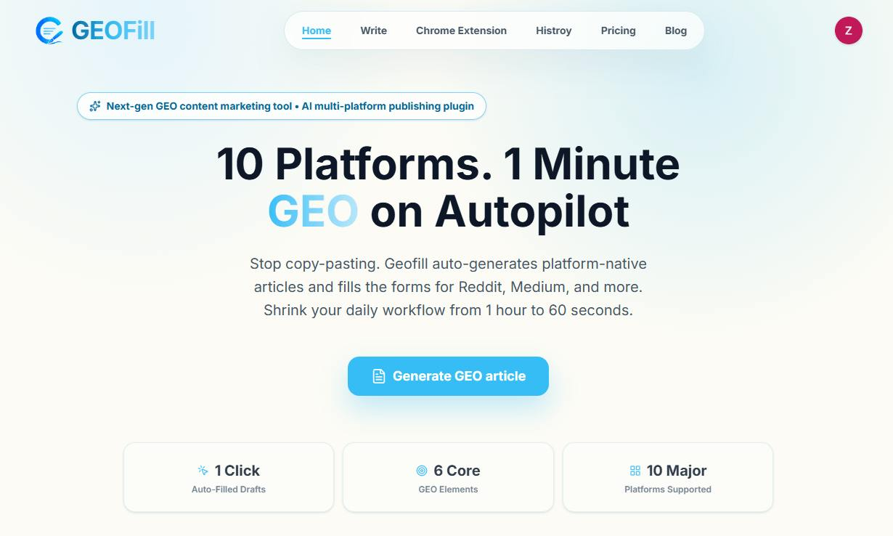
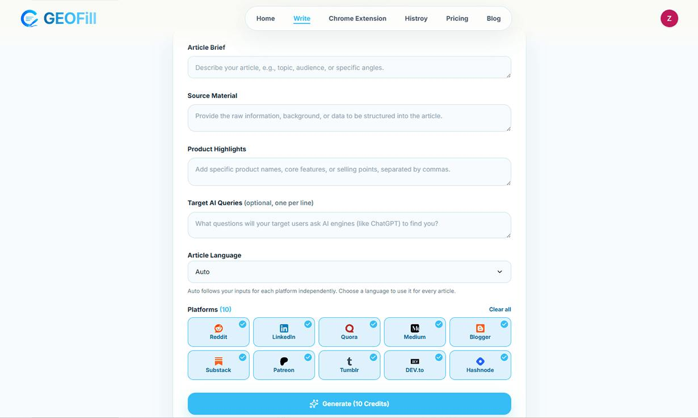

---

## 29. [ArabicTyper](https://www.producthunt.com/products/arabictyper)
**Votes**: 4 | **도입 난이도**: 하 | **신뢰도**: 상
**Tagline**: Learn to read and type Arabic, starting with alif
**서비스 링크**: https://www.producthunt.com/r/ZYQ37PIWFXLPLY

**태그**: Education, Language Learning, Typing

### 📌 이 서비스 한눈에 보기
직접 타이핑하며 배우는 아랍어 읽기 및 타이핑 입문 코스

### 🔑 주요 기능
- 알파벳부터 타슈킬(모음 기호), 기초 단어까지 다루는 36개 레슨
- 직접 키보드로 타이핑하며 글자의 위치를 익히는 실습 중심 학습
- 오답 복습 시스템과 오디오 가이드를 통한 체계적 학습

### 🙋 사용자에게 어떤 점이 좋은가
단순 암기가 아닌 직접 타이핑하는 과정을 통해 아랍어 자판 위치와 글자 구조를 자연스럽게 익힐 수 있습니다.

### ✅ 지금 바로 써볼 기능
- 무료로 제공되는 Lesson 1 학습해보기
- 앱 내 가상 키보드 또는 개인 스마트폰 키보드로 타이핑 연습하기

### ⚠️ 사용 전 확인할 점
- 계정 생성 없이 이용 가능하므로 학습 진도 저장 방식 확인 필요
- 초급 단계에 집중된 커리큘럼이므로 고급 학습자에게는 부족할 수 있음

### 🧭 확인이 더 필요한 정보
계정 생성 기능이 없으므로 기기 변경 시 학습 데이터 유지 여부를 확인해야 합니다.

### 📸 스크린샷 및 갤러리
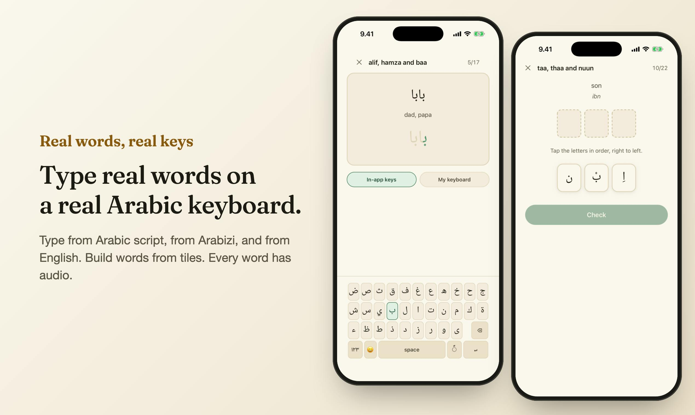
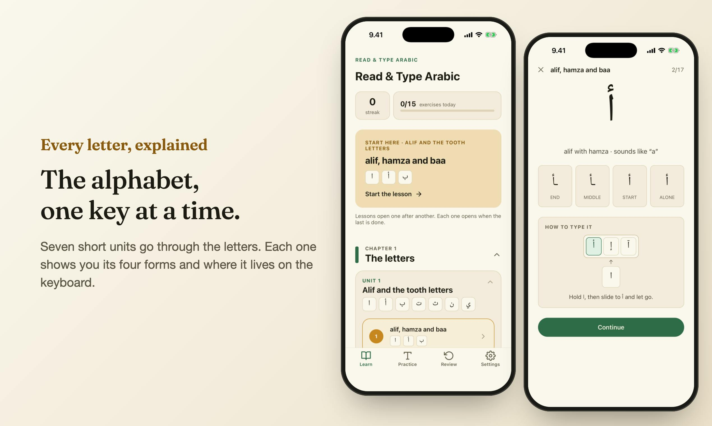
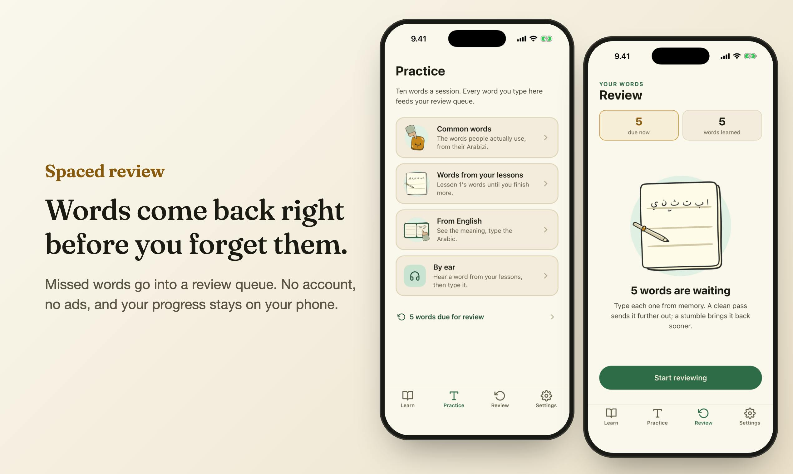

---

## 30. [Planye](https://www.producthunt.com/products/planye)
**Votes**: 4 | **도입 난이도**: 하 | **신뢰도**: 상
**Tagline**: Everything planner: tasks, habits, journal, money and more
**서비스 링크**: https://www.producthunt.com/r/4ODFJLUHGYNLL3

**태그**: Productivity, Planner, Lifestyle, DigitalJournal

### 📌 이 서비스 한눈에 보기
종이 플래너의 감성과 디지털의 편리함을 결합한 올인원 디지털 플래너

### 🔑 주요 기능
- 할 일, 습관, 저널, 가계부 등 다양한 기능을 하나로 통합
- 스티커, 와시 테이프, 테마 등 아날로그 감성의 커스텀 기능 제공
- 오프라인 작업 지원 및 모바일·태블릿·브라우저 간 동기화

### 🙋 사용자에게 어떤 점이 좋은가
여러 앱을 옮겨 다닐 필요 없이 하나의 앱에서 일정 관리와 기록을 모두 해결할 수 있어 생산성이 높아집니다.

### ✅ 지금 바로 써볼 기능
- 계정 생성 없이 바로 플래너 기능 사용해보기
- 나만의 테마와 폰트로 개인화된 레이아웃 꾸미기
- 사진과 스티커를 활용한 디지털 저널 작성하기

### ⚠️ 사용 전 확인할 점
- 종이 플래너의 손맛을 선호하는 사용자에게는 디지털 인터페이스가 이질적일 수 있음
- 데이터 동기화 시 네트워크 환경에 따른 확인 필요

### 🧭 확인이 더 필요한 정보
무료 플랜의 구체적인 기능 제한 범위와 유료 플랜의 가격 정책은 명시되지 않았습니다.

### 📸 스크린샷 및 갤러리

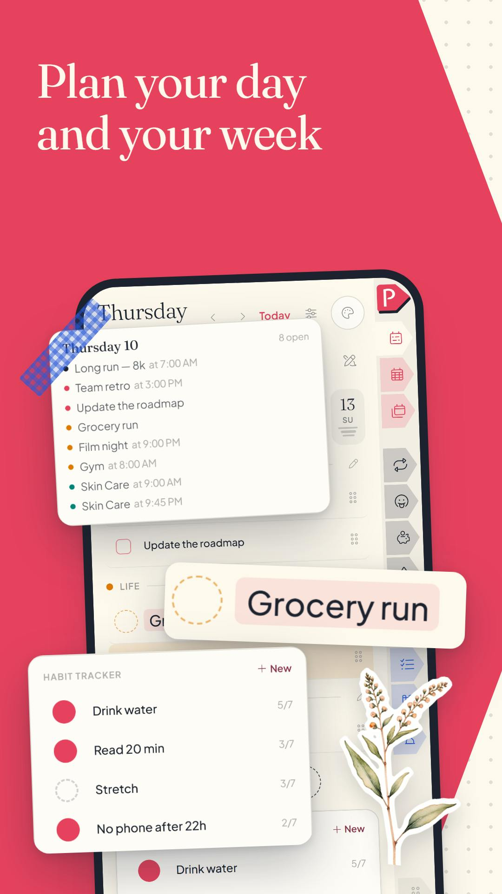

### 🎬 관련 영상
- [🎥 영상 보기](https://ph-files.imgix.net/bea5405c-52fa-4605-888c-9e106951fe59.jpeg?auto=format)

---

