# 🚀 Product Hunt Daily Top 30 (2026-09-21)

## 오늘의 요약
오늘의 제품들은 AI를 활용해 복잡한 운영 업무를 자동화하거나, 실시간 데이터를 구조화된 결과물로 변환하는 데 집중되어 있습니다. 특히 단순한 도구를 넘어 비즈니스 워크플로우를 자동화하고 고객 발굴 및 영업 효율을 극대화하는 실전형 솔루션들이 눈에 띕니다.

### 오늘의 핵심 포인트
- AI가 이커머스 운영, 고객 발굴, 데이터 추출 등 반복적이고 복잡한 업무를 대신 수행하는 자동화 솔루션이 강세를 보였습니다.
- 데이터의 구조화와 실시간 흐름을 활용하여 비즈니스 인사이트를 얻거나 예술적 경험을 제공하는 도구들이 주목받았습니다.
- 기존 서비스의 불편함을 해소하기 위해 보안, 세션 유지, 데이터 주권 등 실무 환경의 안정성을 강화한 제품들이 등장했습니다.

**오늘의 태그**: AI 자동화, 워크플로우 최적화, B2B SaaS, 데이터 추출, 생산성 도구

## 1. [Mycel](https://www.producthunt.com/products/mycel)
**Votes**: 240 | **도입 난이도**: 중 | **신뢰도**: 상
**Tagline**: Bring one past deliverable. Mycel drafts every future one.
**서비스 링크**: https://www.producthunt.com/r/T2UPVH2TQW5Y2F

**태그**: Automation, Workflow, SaaS, Productivity

### 📌 이 서비스 한눈에 보기
과거의 결과물 하나로 미래의 모든 업무를 자동화하는 서비스 비즈니스용 워크플로우 도구

### 🔑 주요 기능
- 클라이언트 관리부터 인보이스까지 서비스 비즈니스 전 과정을 관리
- 보안을 위해 자격 증명을 저장하지 않는 독립적인 샌드박스 환경 제공
- 사용자 승인 전까지는 클라이언트에게 결과물이 노출되지 않는 안전한 워크플로우

### 🙋 사용자에게 어떤 점이 좋은가
서비스 제공자가 업무 프로세스를 자동화하면서도 보안과 최종 검수 권한을 완벽하게 통제할 수 있습니다.

### ✅ 지금 바로 써볼 기능
- 기존 결과물 업로드를 통한 자동 초안 생성 테스트
- 샌드박스 환경 내 워크플로우 설정
- 셀프 호스팅 옵션 검토

### ⚠️ 사용 전 확인할 점
- 월 $299부터 시작하는 높은 초기 비용
- 자동화된 결과물의 품질을 위한 사용자 검수 프로세스 필수

### 🧭 확인이 더 필요한 정보
과거 결과물을 활용해 미래 결과물을 생성하는 구체적인 자동화 메커니즘과 기술 스택에 대한 정보가 부족합니다.

### 📸 스크린샷 및 갤러리
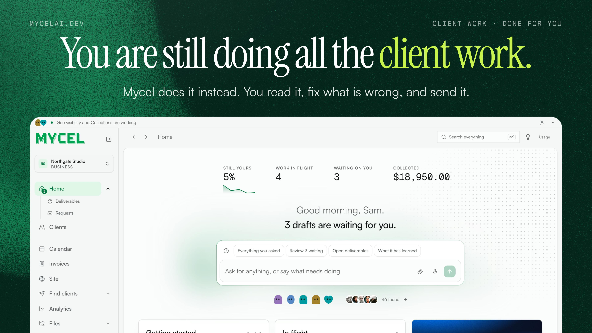
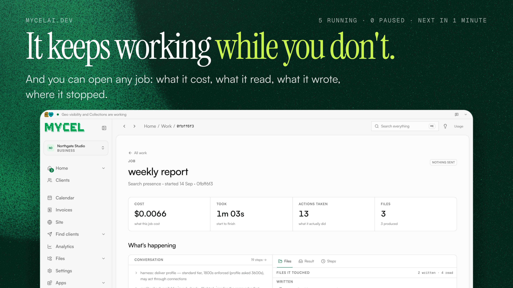
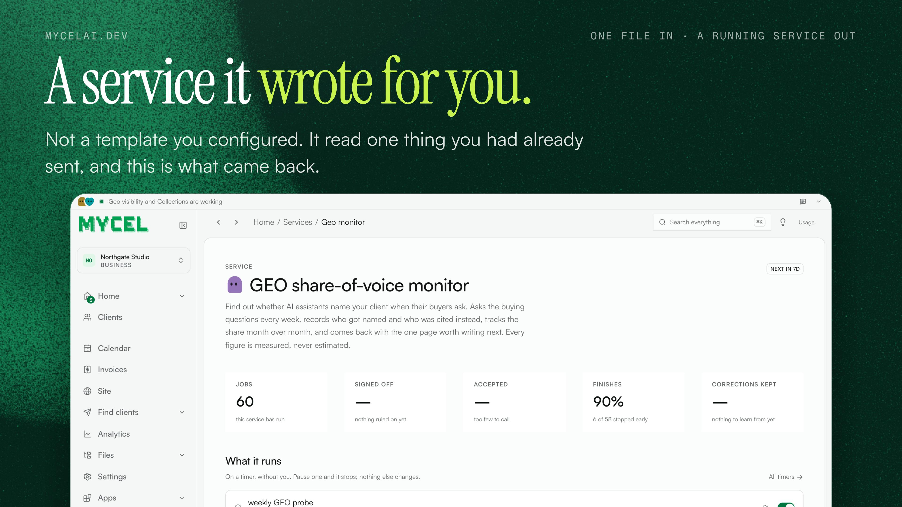

### 🎬 관련 영상
- [🎥 영상 보기](https://ph-files.imgix.net/0abc1c1f-3985-4883-b3af-3d07f940f769.jpeg?auto=format)

---

## 2. [Minicart](https://www.producthunt.com/products/minicart)
**Votes**: 167 | **도입 난이도**: 하 | **신뢰도**: 상
**Tagline**: Launch your store. Let AI run the busywork.
**서비스 링크**: https://www.producthunt.com/r/ALDPT77U64KO3S

**태그**: Ecommerce, AI, Automation, NoCode, AI Tool, Chat, Marketing

### 📌 이 서비스 한눈에 보기
복잡한 이커머스 설정 없이 채팅만으로 스토어를 운영하는 AI 자동화 솔루션

### 🔑 주요 기능
- 전문적인 이커머스 소프트웨어 학습 없이 스토어 구축 가능
- Sloane(매장 관리), Milo(마케팅), Logan(물류/CS)으로 구성된 AI 팀 제공
- 일상적인 언어로 채팅하여 상품 등록, 재고 관리, 배송 등을 처리

### 🙋 사용자에게 어떤 점이 좋은가
이커머스 운영에 필요한 복잡한 관리 업무를 AI에게 맡기고, 사용자는 비즈니스 성장에만 집중할 수 있습니다.

### ✅ 지금 바로 써볼 기능
- 채팅을 통한 상품 등록 및 재고 업데이트 시도
- AI 마케팅 문구 생성 및 프로모션 설정
- 주문 처리 및 고객 응대 자동화 테스트

### ⚠️ 사용 전 확인할 점
- AI가 생성한 작업 결과물에 대한 최종 검토 필요
- 복잡한 물류 시스템이나 특수 배송 요구사항의 처리 가능 여부 확인 필요

### 🧭 확인이 더 필요한 정보
실제 물류(Shipping)와 배송 대행이 AI를 통해 어떻게 물리적으로 연결되는지 확인이 필요합니다.

### 📸 스크린샷 및 갤러리
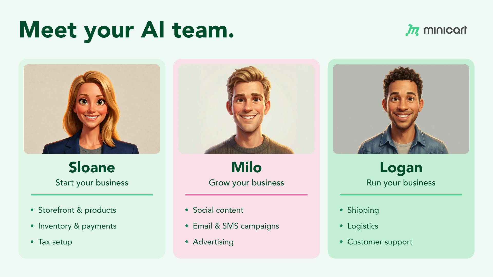
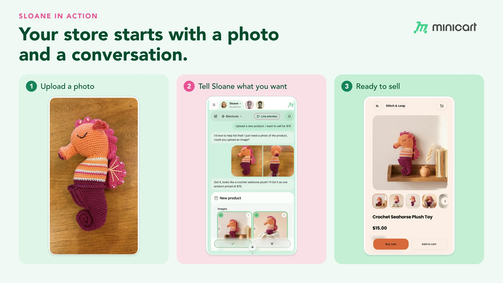
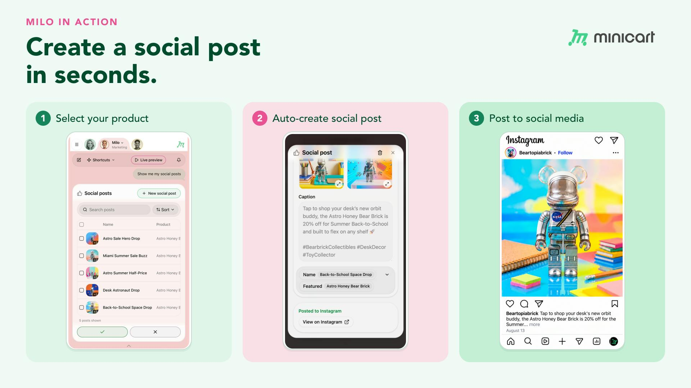

### 🎬 관련 영상
- [🎥 영상 보기](https://ph-files.imgix.net/04b04eff-a934-4ec3-878e-2198f2322ad3.gif?auto=format)

---

## 3. [Answers by Context.dev](https://www.producthunt.com/products/context-dev)
**Votes**: 160 | **도입 난이도**: 하 | **신뢰도**: 상
**Tagline**: Give it a research task + the JSON shape you want back.
**서비스 링크**: https://www.producthunt.com/r/2IXIUKVNLWEOHZ

**태그**: DevTool, Automation, AI, DataExtraction, Agent, LLM, API

### 📌 이 서비스 한눈에 보기
웹 리서치부터 구조화된 데이터 추출까지 단 한 번의 API 호출로 해결하는 자동화 도구

### 🔑 주요 기능
- 연구 작업과 원하는 JSON 형식을 정의하여 데이터 추출 가능
- 검색, 스크래핑, LLM 호출 과정을 하나로 통합
- 출처 URL이 포함된 구조화된 데이터 제공

### 🙋 사용자에게 어떤 점이 좋은가
데이터 보강 파이프라인이나 비교 도구를 구축할 때 복잡한 워크플로우를 단순화하고 개발 시간을 대폭 단축할 수 있습니다.

### ✅ 지금 바로 써볼 기능
- 특정 주제에 대한 웹 리서치 태스크 설정해보기
- 원하는 JSON 스키마를 정의하여 데이터 구조 설계하기
- 추출된 데이터의 출처 신뢰성 검증하기

### ⚠️ 사용 전 확인할 점
- 복잡한 스키마 정의 시 LLM의 데이터 추출 정확도 확인 필요
- 실시간 웹 데이터의 최신성 및 소스 신뢰도 검토 필요

### 🧭 확인이 더 필요한 정보
API 호출당 비용 정책 및 대규모 데이터 처리 시의 성능 제한 사항에 대한 정보가 부족합니다.

### 📸 스크린샷 및 갤러리
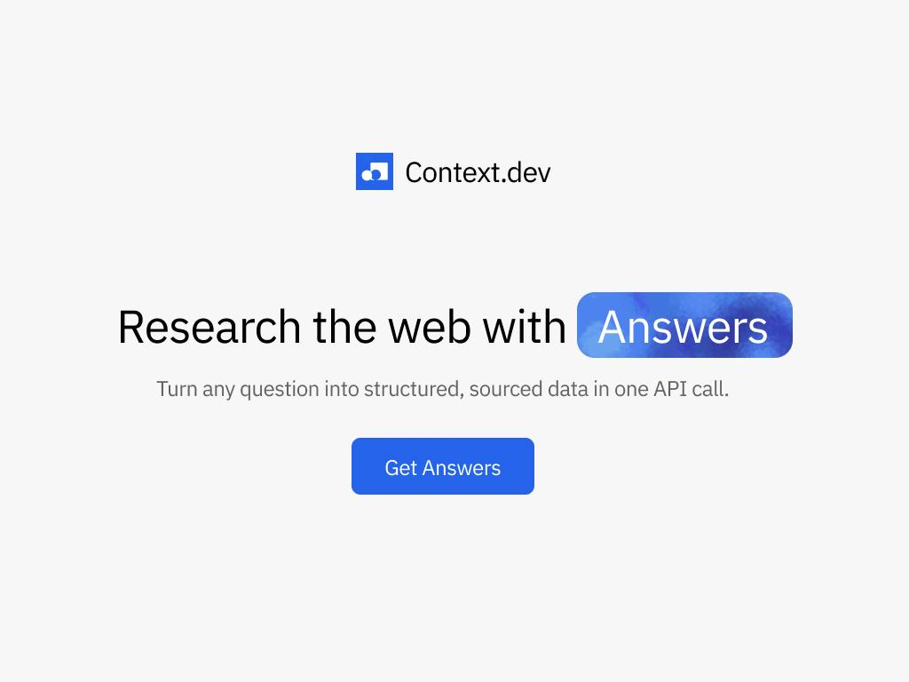
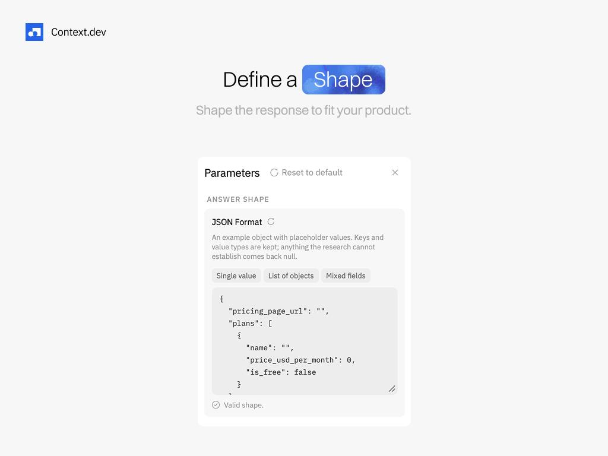
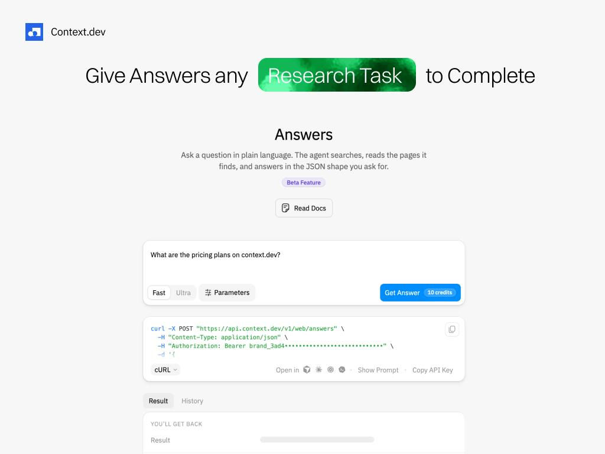

### 🎬 관련 영상
- [🎥 영상 보기](https://ph-files.imgix.net/53d4db0a-80fb-4093-8379-3bddc539a5e4.jpeg?auto=format)

---

## 4. [Morsa Signals](https://www.producthunt.com/products/morsa-signals)
**Votes**: 131 | **도입 난이도**: 하 | **신뢰도**: 상
**Tagline**: GTM and AI visibility workflows for developer tools
**서비스 링크**: https://www.producthunt.com/r/CT33HQ2HPXSVR4

**태그**: DevTool, GTM, SEO, AI, Growth, Automation, AI Tool

### 📌 이 서비스 한눈에 보기
개발자 도구 창업자와 GTM 팀을 위한 실전형 AI 검색 최적화 및 고객 발굴 워크플로우

### 🔑 주요 기능
- 타겟 개발자 발굴 및 스케일드 아웃리치(Outreach) 지원
- AI 검색 엔진(GEO)이 제품을 어떻게 이해하는지 감사 및 최적화
- 단순 데이터베이스가 아닌 제품 중심의 실행 가능한 결과물 제공

### 🙋 사용자에게 어떤 점이 좋은가
막연한 마케팅 리포트 대신, 실제 제품 데이터를 기반으로 초기 사용자 확보와 경쟁사 분석을 즉시 실행할 수 있게 돕습니다.

### ✅ 지금 바로 써볼 기능
- 잠재적 초기 사용자 및 얼리어답터 식별하기
- AI 검색 시스템의 사이트 이해도 감사하기
- 추적 가치가 있는 경쟁사 분석하기

### ⚠️ 사용 전 확인할 점
- 제공되는 데이터가 실제 타겟팅에 얼마나 정교한지 검증 필요
- 워크플로우 결과물이 실제 영업 성과로 이어지는지 확인 필요

### 🧭 확인이 더 필요한 정보
제품의 구체적인 데이터 소스 및 외부 툴과의 연동 범위에 대한 정보가 부족합니다.

### 📸 스크린샷 및 갤러리

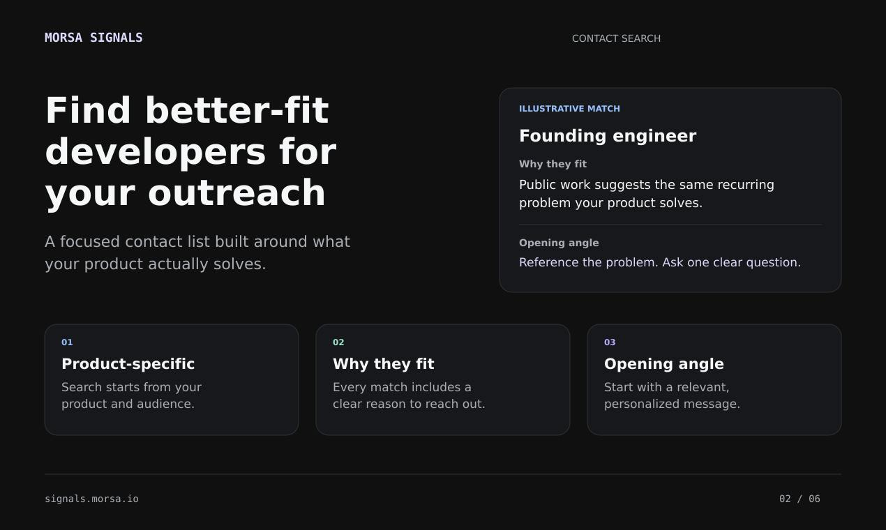
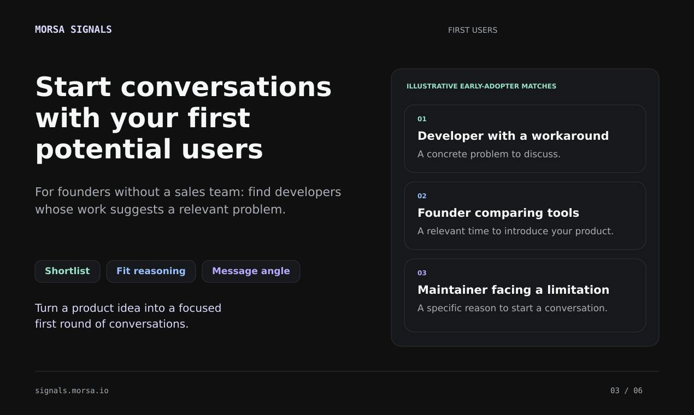

### 🎬 관련 영상
- [🎥 영상 보기](https://ph-files.imgix.net/4c3d1c2d-bac8-40dc-baa5-9f19d169a275.jpeg?auto=format)

---

## 5. [Harbor](https://www.producthunt.com/products/harbor-2)
**Votes**: 128 | **도입 난이도**: 하 | **신뢰도**: 상
**Tagline**: The Evernote alternative that puts its price in writing
**서비스 링크**: https://www.producthunt.com/r/IOKDQXULEPEW4L

**태그**: Productivity, Note-taking, Knowledge-Management, SaaS, AI Tool

### 📌 이 서비스 한눈에 보기
강력한 검색 기능과 투명한 가격 정책을 갖춘 개인용 제2의 뇌(Second Brain)

### 🔑 주요 기능
- 메모, 스캔, PDF, 녹음 등을 지원하는 통합형 개인 지식 저장소
- OCR 및 필기 인식을 포함한 강력한 검색 기능과 간편한 Evernote 데이터 가져오기
- 모든 플랫폼(Mac, Windows, Mobile, Web, CLI) 지원 및 자유로운 데이터 내보내기

### 🙋 사용자에게 어떤 점이 좋은가
Evernote의 높은 비용과 데이터 종속성이 고민인 사용자에게 안정적인 가격과 데이터 주권을 제공합니다.

### ✅ 지금 바로 써볼 기능
- Evernote 데이터 가져오기 기능 테스트
- OCR 및 필기 인식 검색 기능 확인
- 사용 중인 기기에서의 네이티브 앱 설치

### ⚠️ 사용 전 확인할 점
- 3년 후 가격 인상 캡(10%/yr) 정책 확인 필요
- 데이터 내보내기 기능이 모든 플랜에서 제공되지만, 내보내기 형식의 호환성 확인 필요

### 🧭 확인이 더 필요한 정보
구체적인 구독 플랜별 가격과 세부 기능 차이가 명시되지 않았습니다.

### 📸 스크린샷 및 갤러리
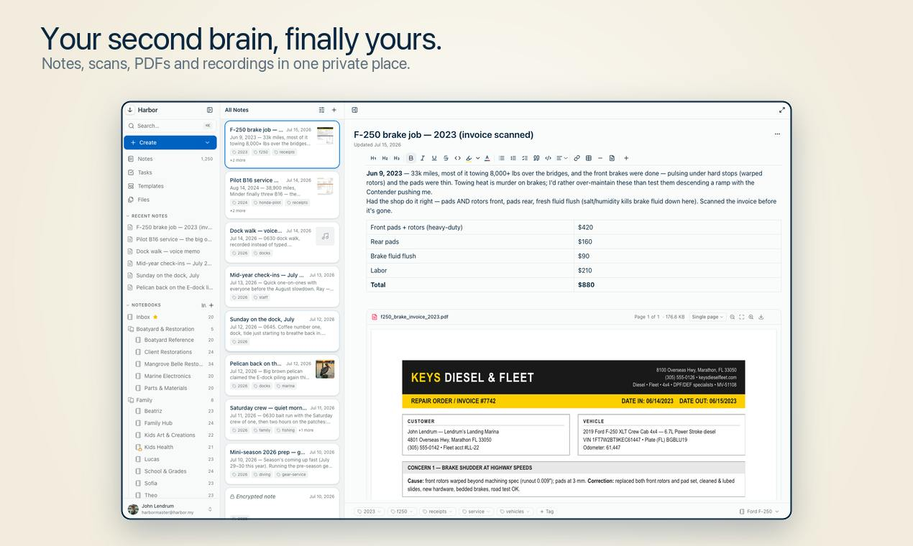
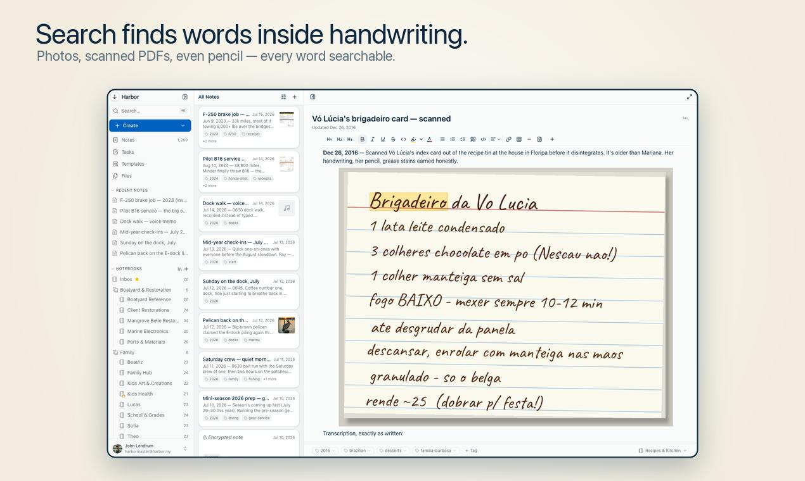
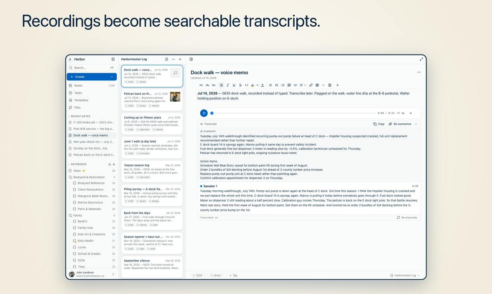

### 🎬 관련 영상
- [🎥 영상 보기](https://ph-files.imgix.net/627fbd88-2cbe-4321-8f9e-181434e7e584.jpeg?auto=format)

---

## 6. [Termphin](https://www.producthunt.com/products/termphin)
**Votes**: 115 | **도입 난이도**: 하 | **신뢰도**: 상
**Tagline**: SSH client with sessions that never drop.
**서비스 링크**: https://www.producthunt.com/r/BIYJFP53BWOFNH

**태그**: DevTool, SSH, Mobile, RemoteAccess, Agent

### 📌 이 서비스 한눈에 보기
네트워크 연결 끊김에도 세션이 유지되는 강력한 모바일 SSH 클라이언트

### 🔑 주요 기능
- 네트워크 전환(Wi-Fi ↔ 모바일 데이터) 및 기기 잠금 시에도 세션 유지
- 서버 측 에이전트를 통한 끊김 없는 쉘 환경 제공
- htop, vim 등 터미널 UI가 깨지지 않는 완벽한 렌더링

### 🙋 사용자에게 어떤 점이 좋은가
이동 중이거나 네트워크가 불안정한 환경에서도 서버 작업 중이던 화면 그대로 작업을 이어갈 수 있습니다.

### ✅ 지금 바로 써볼 기능
- 기존 서버에 에이전트 설치 및 세션 유지 테스트
- SFTP를 통한 파일 전송 및 스니펫 기능 활용
- 터미널 UI 렌더링 성능 확인

### ⚠️ 사용 전 확인할 점
- 서버 측에 별도의 에이전트를 설치해야 하므로 서버 권한이 필요할 수 있음
- 에이전트 방식이 서버 리소스에 미치는 영향 확인 필요

### 🧭 확인이 더 필요한 정보
서버 측 에이전트 설치 방식이 지원하는 OS 종류와 보안 정책에 따른 제약 사항을 확인해야 합니다.

### 📸 스크린샷 및 갤러리
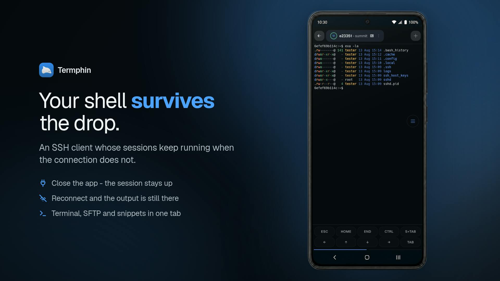
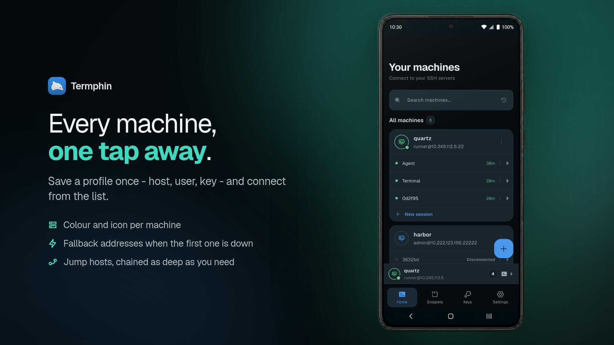
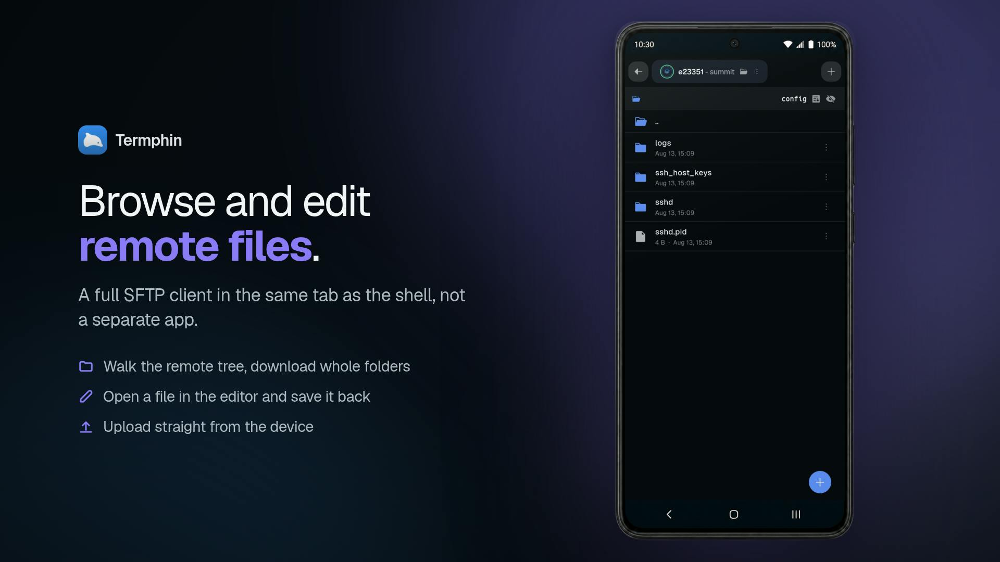

### 🎬 관련 영상
- [🎥 영상 보기](https://ph-files.imgix.net/7b86e029-30e7-4f9e-8f6b-e67c06de5a27.jpeg?auto=format)

---

## 7. [The 101 Plays Itself](https://www.producthunt.com/products/the-101-plays-itself)
**Votes**: 96 | **도입 난이도**: 하 | **신뢰도**: 상
**Tagline**: Five lanes of LA highway turned into an instrument
**서비스 링크**: https://www.producthunt.com/r/VP6G6OIHSON2PP

**태그**: CreativeCoding, DataArt, RealTime, WebAudio

### 📌 이 서비스 한눈에 보기
실시간 LA 고속도로 교통 상황을 즉흥 음악으로 변환해주는 웹 서비스

### 🔑 주요 기능
- 스튜디오 시티 US-101 고속도로의 실시간 Caltrans 카메라 데이터 활용
- 통과하는 차량을 실시간 음계로 변환하는 브라우저 기반 악기
- 실제 교통 흐름이 만드는 예측 불가능한 라이브 음악 경험

### 🙋 사용자에게 어떤 점이 좋은가
실시간 데이터가 예술로 변하는 독특한 청각적 경험을 통해 일상적인 교통 상황을 새로운 방식으로 즐길 수 있습니다.

### ✅ 지금 바로 써볼 기능
- 브라우저에서 실시간 교통 음악 감상하기
- 차량 흐름에 따른 음계 변화 관찰하기

### ⚠️ 사용 전 확인할 점
- 실시간 카메라 데이터 의존성으로 인해 교통량이 적으면 음악이 단조로울 수 있음
- 브라우저 환경에 따라 오디오 재생 환경이 다를 수 있음

### 🧭 확인이 더 필요한 정보
사용자의 브라우저 성능이나 네트워크 상태가 실시간 오디오 생성에 미치는 영향은 명시되지 않았습니다.

### 📸 스크린샷 및 갤러리

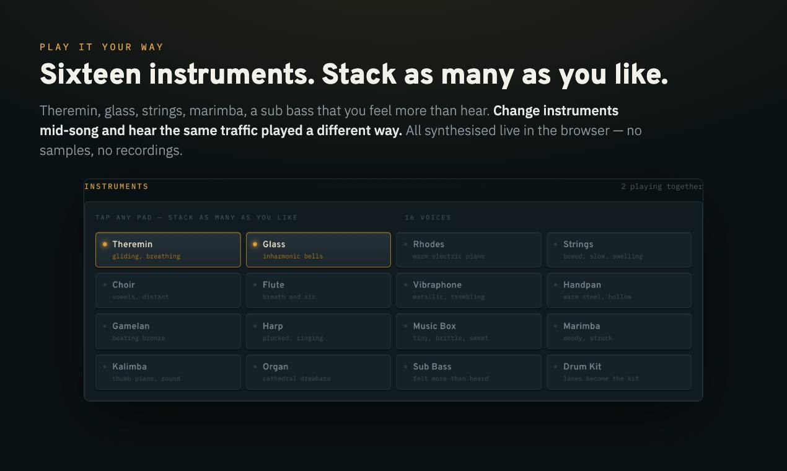

---

## 8. [ManyPI](https://www.producthunt.com/products/manypi)
**Votes**: 91 | **도입 난이도**: 중 | **신뢰도**: 상
**Tagline**: 10x your revenue by finding your ideal customers
**서비스 링크**: https://www.producthunt.com/r/2ED5RL6VLMMHIW

**태그**: Sales, Automation, LeadGeneration, Marketing, AI Tool, Email

### 📌 이 서비스 한눈에 보기
잠재 고객 발굴부터 개인화된 영업 메시지 발송까지 자동화하는 매출 증대 솔루션

### 🔑 주요 기능
- 웹상의 실시간 데이터를 기반으로 이상적인 고객 페르소나 탐색
- 이메일 검증 및 고객의 페인 포인트(Pain Points)와 구매 트리거 분석
- 분석된 신호를 바탕으로 한 초개인화된 아웃리치 자동화

### 🙋 사용자에게 어떤 점이 좋은가
타겟 고객을 찾는 수동 작업과 메시지 작성 시간을 획기적으로 줄여 영업 효율을 극대화할 수 있습니다.

### ✅ 지금 바로 써볼 기능
- 이상적인 고객 페르소나 정의하기
- 실시간 웹 데이터 기반 타겟 리스트 추출하기
- 분석된 구매 트리거를 활용한 맞춤형 메시지 발송하기

### ⚠️ 사용 전 확인할 점
- 자동화된 아웃리치로 인한 스팸 분류 가능성 주의
- 데이터 정확도 및 페르소나 일치 여부 검토 필요

### 🧭 확인이 더 필요한 정보
구체적인 타겟팅 알고리즘의 정교함과 이메일 발송량 제한 정책에 대한 정보가 필요합니다.

### 📸 스크린샷 및 갤러리
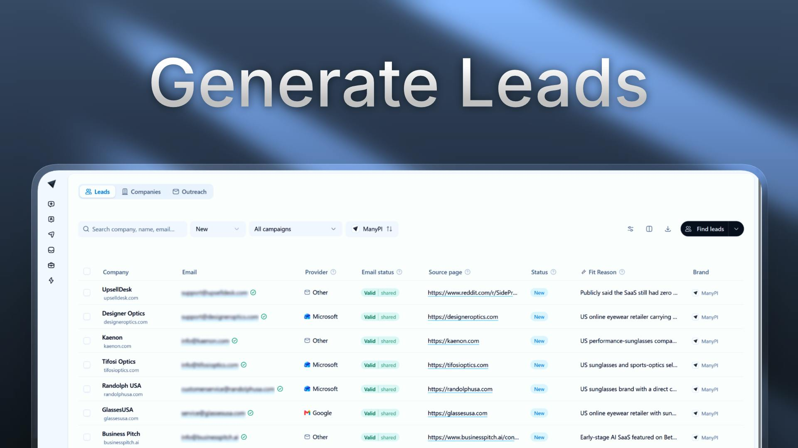

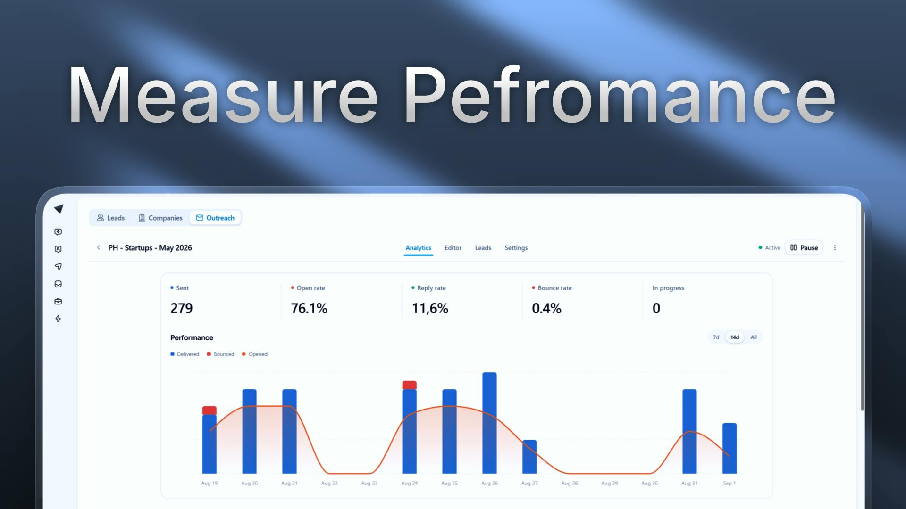

### 🎬 관련 영상
- [🎥 영상 보기](https://ph-files.imgix.net/81dd3a75-7cc0-493c-ac99-f85a3753c464.jpeg?auto=format)

---

## 9. [Launchie 1.6.1](https://www.producthunt.com/products/launchie)
**Votes**: 88 | **도입 난이도**: 하 | **신뢰도**: 상
**Tagline**: Launchpad Replacement for MacOS 27 Golden Gate
**서비스 링크**: https://www.producthunt.com/r/6NNIQRLK2ENINI

**태그**: Productivity, macOS, Utility

### 📌 이 서비스 한눈에 보기
macOS에서 사라진 Launchpad를 완벽하게 대체하는 그리드 기반 앱 관리 도구

### 🔑 주요 기능
- 사용자 맞춤형 앱 그리드 레이아웃 제공
- 무제한 폴더 생성 및 별도 페이지를 위한 Spaces 기능 지원
- 빠른 앱 실행을 위한 인스턴트 검색 기능

### 🙋 사용자에게 어떤 점이 좋은가
최신 macOS에서 제거된 Launchpad의 기능을 복구하여 직관적인 앱 관리와 빠른 실행 환경을 제공합니다.

### ✅ 지금 바로 써볼 기능
- 자신만의 앱 그리드 레이아웃 구성하기
- 무제한 폴더를 활용한 카테고리별 앱 정리
- 인스턴트 검색으로 앱 즉시 실행하기

### ⚠️ 사용 전 확인할 점
- Pro 버전은 일회성 구매가 필요한 유료 모델임
- macOS 버전(26/27)에 따른 호환성 확인 필요

### 🧭 확인이 더 필요한 정보
Pro 버전의 구체적인 기능 차이와 가격 정책에 대한 상세 정보가 필요합니다.

### 📸 스크린샷 및 갤러리
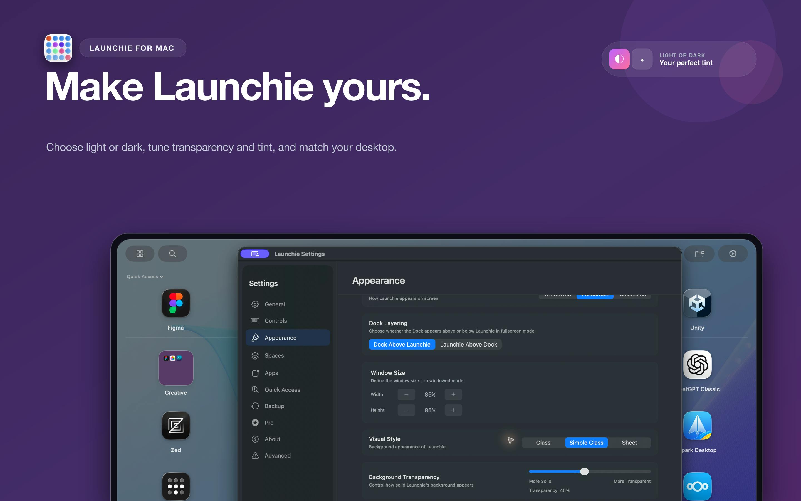
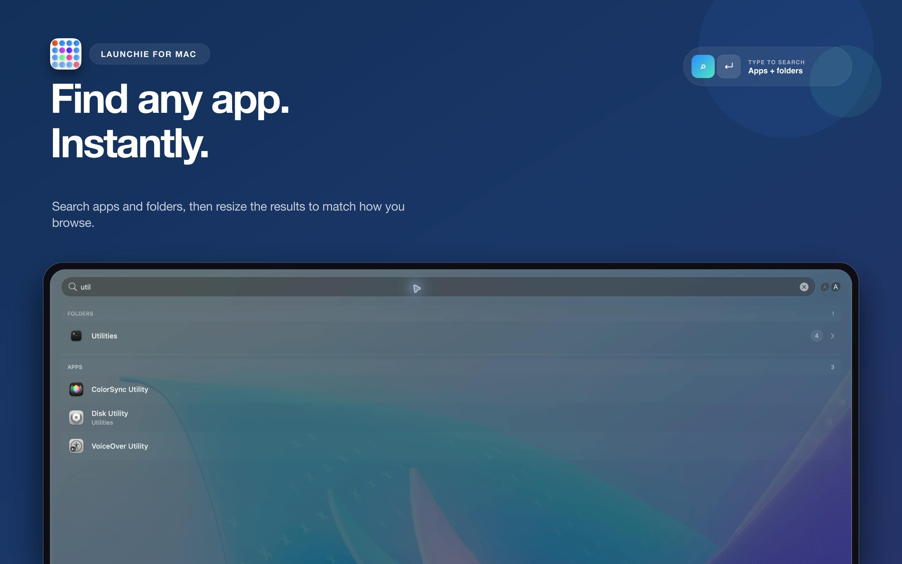
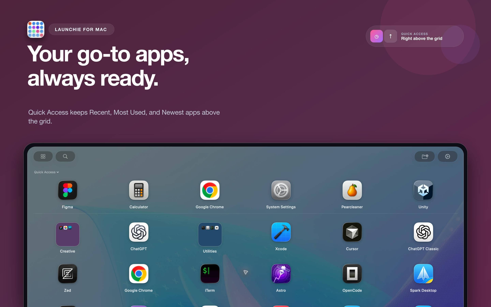

### 🎬 관련 영상
- [🎥 영상 보기](https://ph-files.imgix.net/8220f27c-5e39-4826-988f-fa4ae65586a8.jpeg?auto=format)

---

## 10. [Epismo OS](https://www.producthunt.com/products/epismo)
**Votes**: 86 | **도입 난이도**: 하 | **신뢰도**: 상
**Tagline**: Keep your work when you switch AI tools
**서비스 링크**: https://www.producthunt.com/r/BZ6U3VWQFG6UJL

**태그**: AI, Productivity, Collaboration, Workflow, AI Tool

### 📌 이 서비스 한눈에 보기
AI 도구 교체나 팀원 변경 시에도 작업 맥락을 유지하는 AI 워크플로우 관리 플랫폼

### 🔑 주요 기능
- 결과물, 결정 과정, 리뷰를 하나의 'Case'로 관리하여 작업 맥락 보존
- AI 도구를 변경하거나 팀원이 바뀌어도 재설명(re-brief)이 필요 없는 환경 제공
- 기존 결과물은 유지하면서 새로운 관점으로 검토하는 자동 리뷰 기능

### 🙋 사용자에게 어떤 점이 좋은가
AI를 활용한 협업 시 발생하는 맥락 손실을 방지하고, 도구 전환 비용을 최소화하여 업무 연속성을 높여줍니다.

### ✅ 지금 바로 써볼 기능
- Case 기능을 활용해 AI 작업 결과물과 의사결정 기록하기
- Auto review 기능을 통해 기존 작업물에 대한 새로운 피드백 받기
- 팀원 간 작업 히스토리 공유 및 인수인계에 활용하기

### ⚠️ 사용 전 확인할 점
- 지원하는 외부 AI 도구와의 연동 범위 확인 필요
- 기존 워크플로우를 Epismo OS로 옮기는 데 드는 초기 공수

### 🧭 확인이 더 필요한 정보
현재 지원하는 외부 AI 도구의 종류와 자동화 연동 수준에 대한 구체적인 정보가 필요합니다.

### 📸 스크린샷 및 갤러리
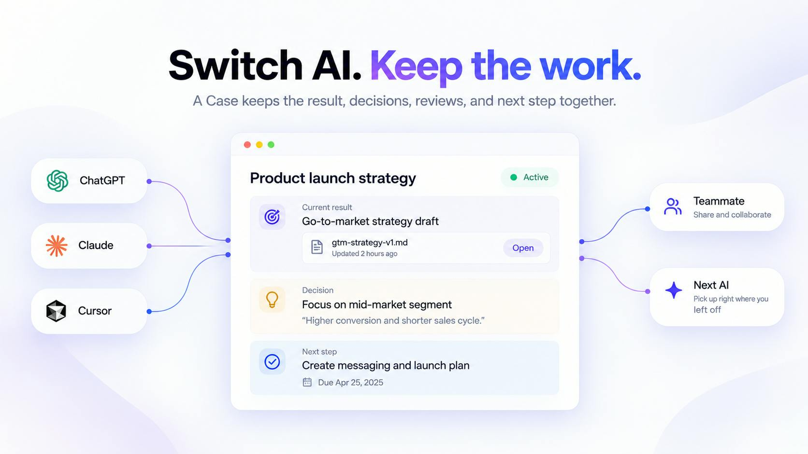
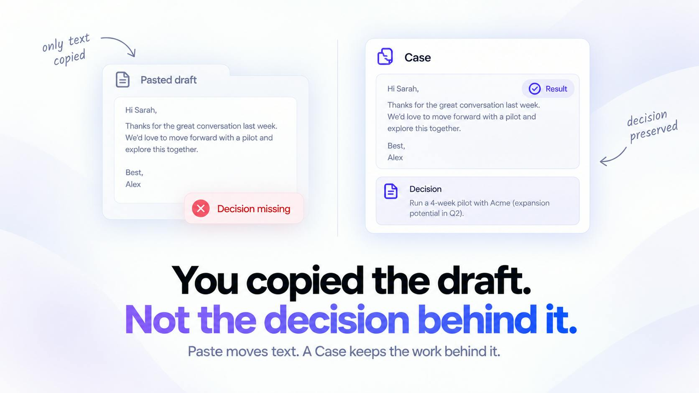
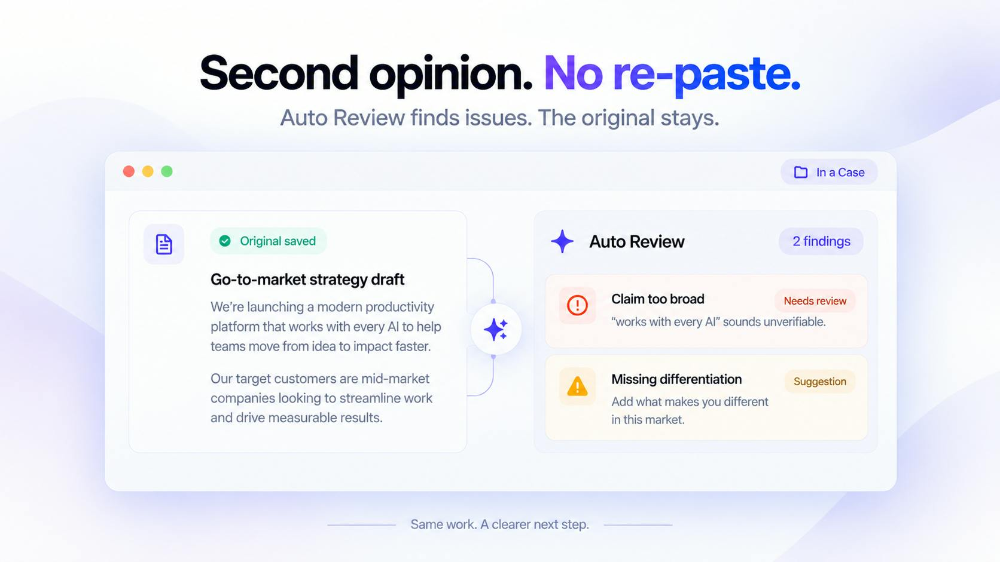

### 🎬 관련 영상
- [🎥 영상 보기](https://ph-files.imgix.net/44453a5b-56bb-4af0-9b1c-8908f3476129.jpeg?auto=format)

---

## 11. [YABAI](https://www.producthunt.com/products/yabai)
**Votes**: 80 | **도입 난이도**: 하 | **신뢰도**: 상
**Tagline**: Real Japanese slang, one giant word at a time
**서비스 링크**: https://www.producthunt.com/r/6VGJUDKFZWWBCC

**태그**: LanguageLearning, Japanese, Education, MobileApp, Agent, AI Tool, DevTool

### 📌 이 서비스 한눈에 보기
교과서 밖 진짜 일본어, 실전 슬랭과 인터넷 용어를 배우는 타이포그래피 카드 학습 도구

### 🔑 주요 기능
- 308개의 실전 일본어 슬랭, 인터넷 및 팬덤 용어 수록
- 단어의 의미, 예문, 사용 적절성(Vibe Check) 및 유래 제공
- 스트릭, 테스트, XP 없는 스트레스 없는 학습 방식

### 🙋 사용자에게 어떤 점이 좋은가
현지인들이 실제로 사용하는 생생한 언어를 배우고, 상황에 맞는 적절한 사용법을 직관적으로 익힐 수 있습니다.

### ✅ 지금 바로 써볼 기능
- 308개의 슬랭 카드 살펴보기
- 상황별 'Vibe Check' 확인하기
- 오프라인 모드로 학습하기

### ⚠️ 사용 전 확인할 점
- 학습용이 아닌 실전 슬랭 중심이므로 격식 있는 자리에서는 주의 필요
- 정식 교과서 과정과는 거리가 있음

### 🧭 확인이 더 필요한 정보
제공되는 13개 언어의 범위와 상세 기능은 제품 내에서 직접 확인이 필요합니다.

### 📸 스크린샷 및 갤러리
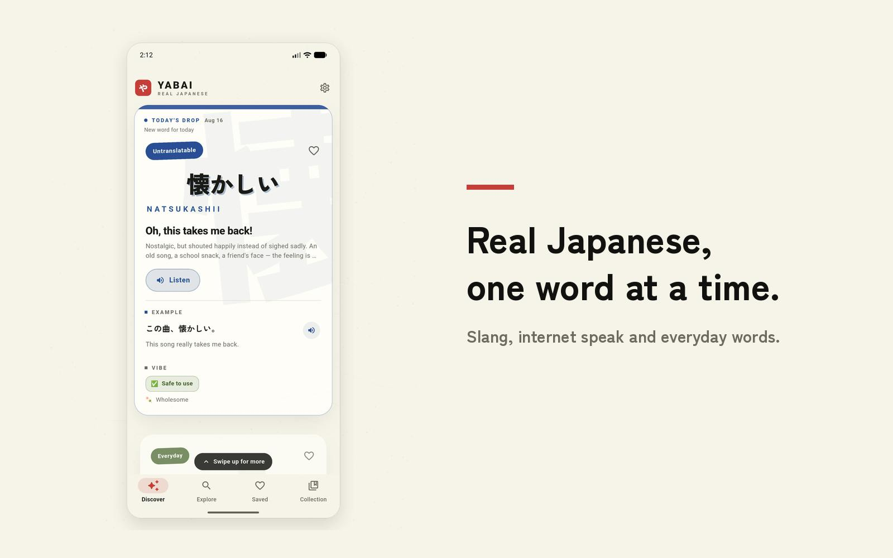

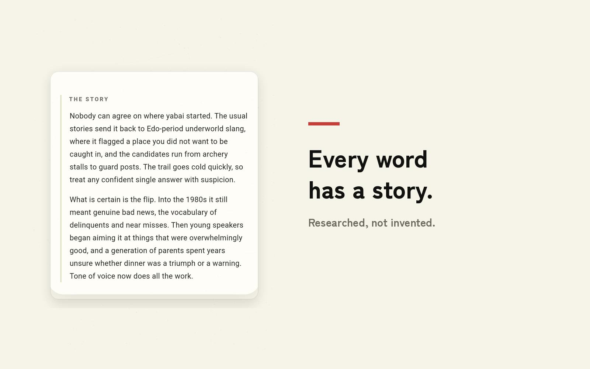

### 🎬 관련 영상
- [🎥 영상 보기](https://ph-files.imgix.net/5d664aae-53a3-4cf8-9ec6-d6e014cb265a.jpeg?auto=format)

---

## 12. [Embedful ](https://www.producthunt.com/products/embedful)
**Votes**: 74 | **도입 난이도**: 하 | **신뢰도**: 상
**Tagline**:  Launch customer dashboards in minutes
**서비스 링크**: https://www.producthunt.com/r/A4ZQCCF7CBSRDQ

**태그**: SaaS, Analytics, Embedded, Dashboard, AI Tool

### 📌 이 서비스 한눈에 보기
복잡한 인프라 구축 없이 몇 분 만에 고객용 대시보드를 제품에 내장하세요.

### 🔑 주요 기능
- 기존 데이터 소스를 연결하여 고객 맞춤형 대시보드 생성
- 자체 분석 플랫폼 구축 및 유지보수 비용 절감
- 제품 내에 보안이 유지된 개인화된 분석 기능 임베딩

### 🙋 사용자에게 어떤 점이 좋은가
SaaS 팀이 분석 기능을 직접 개발하는 대신, 기존 데이터를 활용해 고객용 대시보드를 즉시 제품에 통합할 수 있습니다.

### ✅ 지금 바로 써볼 기능
- 기존 데이터 소스 연결 테스트
- 고객용 대시보드 템플릿 생성
- 제품 내 임베딩 구현 확인

### ⚠️ 사용 전 확인할 점
- 기존 데이터 소스와의 호환성 확인 필요
- 임베딩 시 제품 UI와의 디자인 정렬 확인

### 🧭 확인이 더 필요한 정보
지원하는 구체적인 데이터 소스 종류와 보안 프로토콜에 대한 상세 정보가 필요합니다.

### 📸 스크린샷 및 갤러리
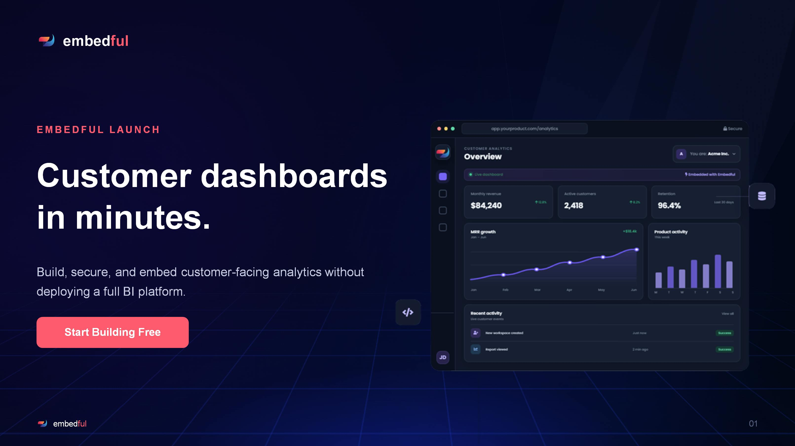
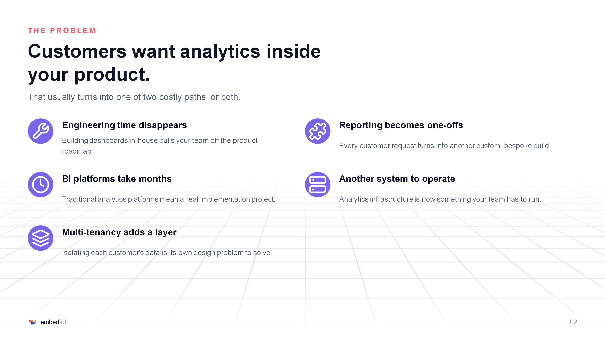
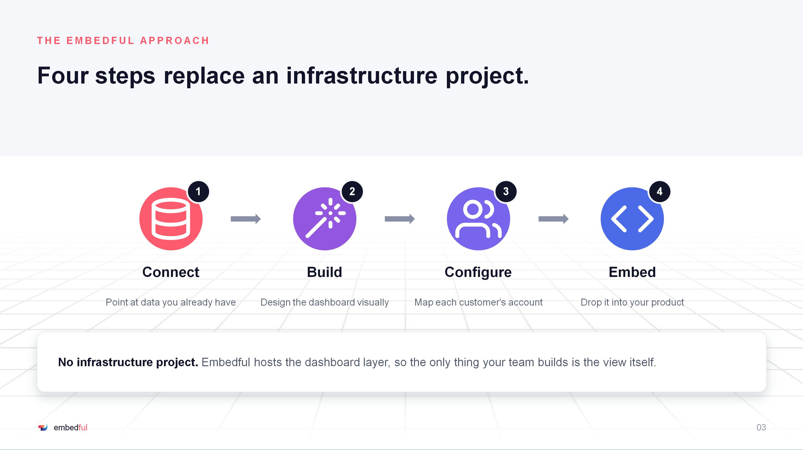

---

## 13. [Scrapboard Cloud 4](https://www.producthunt.com/products/scrapboard-cloud-4)
**Votes**: 69 | **도입 난이도**: 하 | **신뢰도**: 상
**Tagline**: Digital family refrigerator door, now pocket-sized n synced
**서비스 링크**: https://www.producthunt.com/r/54JDZBGU2WU3FL

**태그**: Productivity, Design, iOS, macOS, Family

### 📌 이 서비스 한눈에 보기
가족 냉장고 메모판의 감성을 iOS 기기로 옮겨온 디지털 게시판 서비스

### 🔑 주요 기능
- 가족 냉장고 문에 붙이는 메모판 컨셉의 디지털 게시판
- iCloud를 통한 iOS 기기 간(iPhone, iPad) 원활한 동기화
- macOS용 Scrapboard 4와 연동되는 크로스 플랫폼 환경 제공

### 🙋 사용자에게 어떤 점이 좋은가
가족이나 개인의 소중한 기록을 아날로그 감성으로 관리하면서, Apple 생태계 내에서 기기 간 경계 없이 공유할 수 있습니다.

### ✅ 지금 바로 써볼 기능
- iCloud 계정으로 로그인하여 기기 간 동기화 확인하기
- iPad와 iPhone에 설치하여 실시간 게시판 연동해보기
- macOS용 Scrapboard 4와 함께 사용하여 워크플로우 구축하기

### ⚠️ 사용 전 확인할 점
- Apple 기기(iOS, macOS) 환경에 특화되어 있어 타 OS 사용자는 이용 불가
- iCloud 계정 의존도가 높음

### 🧭 확인이 더 필요한 정보
상세한 협업 기능이나 멀티 유저 공유 방식에 대한 구체적인 설명이 부족합니다.

### 📸 스크린샷 및 갤러리

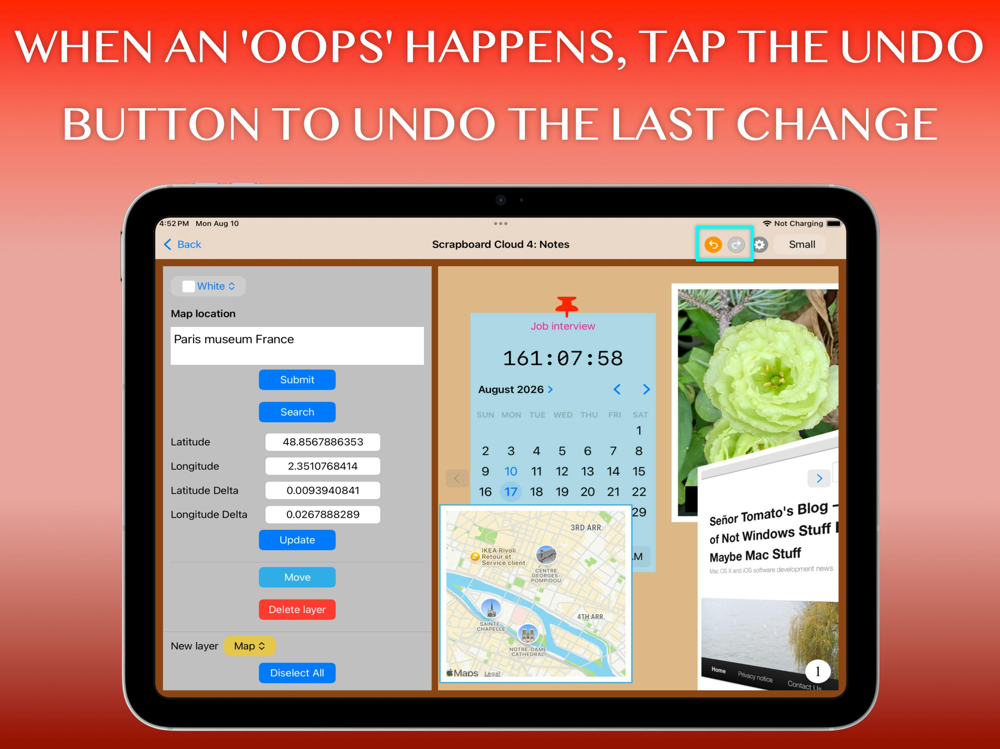

---

## 14. [SmartPause](https://www.producthunt.com/products/smartpause-2)
**Votes**: 67 | **도입 난이도**: 하 | **신뢰도**: 상
**Tagline**: The play/pause key, finally aimed at what's playing
**서비스 링크**: https://www.producthunt.com/r/WVUPSHGXZX6BF6

**태그**: macOS, Productivity, OpenSource, Automation, AI Tool

### 📌 이 서비스 한눈에 보기
현재 소리가 출력되는 앱을 정확히 찾아 재생/일시정지를 제어하는 macOS용 미디어 키 최적화 도구

### 🔑 주요 기능
- 현재 오디오를 출력 중인 앱을 자동으로 식별하여 미디어 키 연결
- 두 앱이 재생 중일 때 한 번 누르면 앱 전환, 두 번 누르면 재생/일시정지
- 메뉴 바 전용의 가벼운 오픈 소스 소프트웨어

### 🙋 사용자에게 어떤 점이 좋은가
macOS의 미디어 키가 의도치 않은 앱(예: Apple Music)을 실행하는 문제를 해결하여, 현재 듣고 있는 콘텐츠를 즉각적으로 제어할 수 있습니다.

### ✅ 지금 바로 써볼 기능
- 설치 후 메뉴 바에서 앱 실행하기
- 유튜브와 음악 앱을 동시에 띄워두고 단축키 동작 테스트하기
- 오픈 소스 코드를 통해 보안성 확인하기

### ⚠️ 사용 전 확인할 점
- macOS 시스템 환경에 따라 미디어 키 우선순위 충돌 가능성 있음
- 메뉴 바 전용 앱이므로 별도의 GUI 설정 화면이 없을 수 있음

### 🧭 확인이 더 필요한 정보
특정 macOS 버전에서의 시스템 권한 요구 사항이나 백그라운드 리소스 점유율은 명시되지 않았습니다.

### 📸 스크린샷 및 갤러리

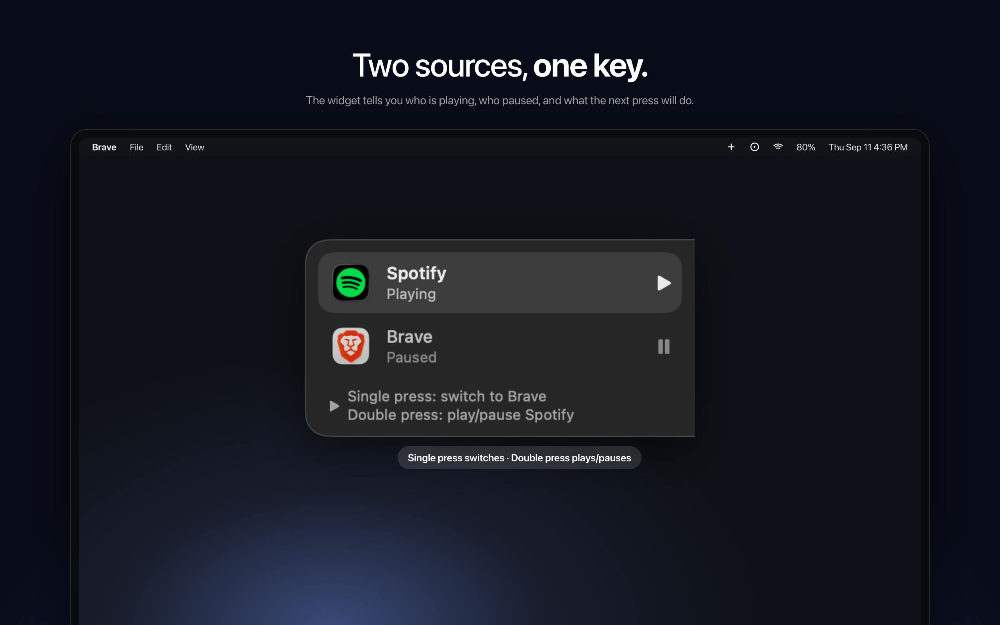
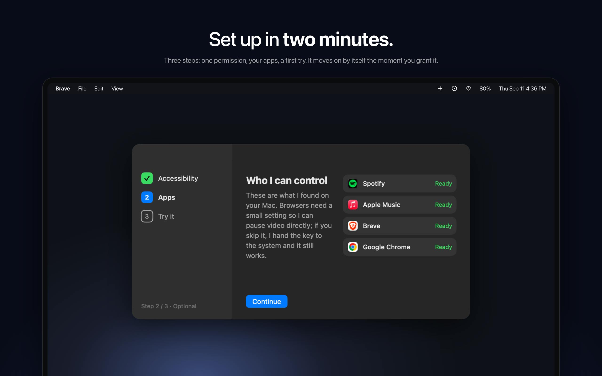

### 🎬 관련 영상
- [🎥 영상 보기](https://ph-files.imgix.net/6ab52ae1-1d4f-404c-b868-cd6e407d7e71.jpeg?auto=format)

---

## 15. [findable 2.0](https://www.producthunt.com/products/findable-3)
**Votes**: 25 | **도입 난이도**: 하 | **신뢰도**: 중
**Tagline**: Help your agency clients to #1 on ChatGPT, Google, Claude
**서비스 링크**: https://www.producthunt.com/r/JOKTSHLLIUI4ED

**태그**: Marketing, AI, SEO, Agency, Chat

### 📌 이 서비스 한눈에 보기
대행사 고객사를 위한 AI 검색 엔진 최적화(GEO) 솔루션

### 🔑 주요 기능
- ChatGPT, Claude, Gemini 등 주요 AI 모델 대상 검색 최적화 지원
- 에이전시 고객의 브랜드 노출 순위 향상 목적
- 차세대 AI 검색 엔진 시대에 맞춘 마케팅 도구

### 🙋 사용자에게 어떤 점이 좋은가
대행사 담당자가 고객사의 브랜드가 AI 답변 상단에 노출되도록 관리하여 마케팅 성과를 높일 수 있습니다.

### ✅ 지금 바로 써볼 기능
- 현재 고객사 브랜드의 AI 답변 노출 현황 점검
- 주요 LLM 모델별 검색 결과 비교
- AI 최적화 전략 수립

### ⚠️ 사용 전 확인할 점
- AI 모델의 답변 생성 로직이 가변적이므로 순위 유지의 어려움이 있을 수 있음
- 구체적인 기술적 방법론이나 작동 방식이 명시되지 않음

### 🧭 확인이 더 필요한 정보
상세한 기술적 작동 방식과 구체적인 성과 지표(KPI)에 대한 정보가 부족합니다.

### 📸 스크린샷 및 갤러리
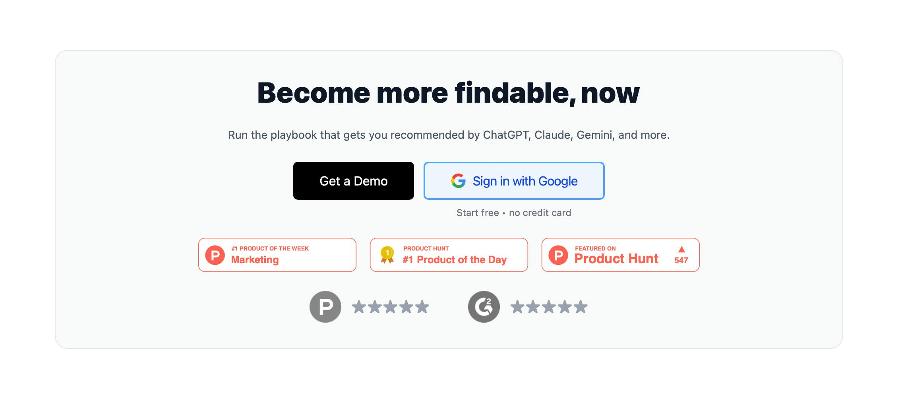

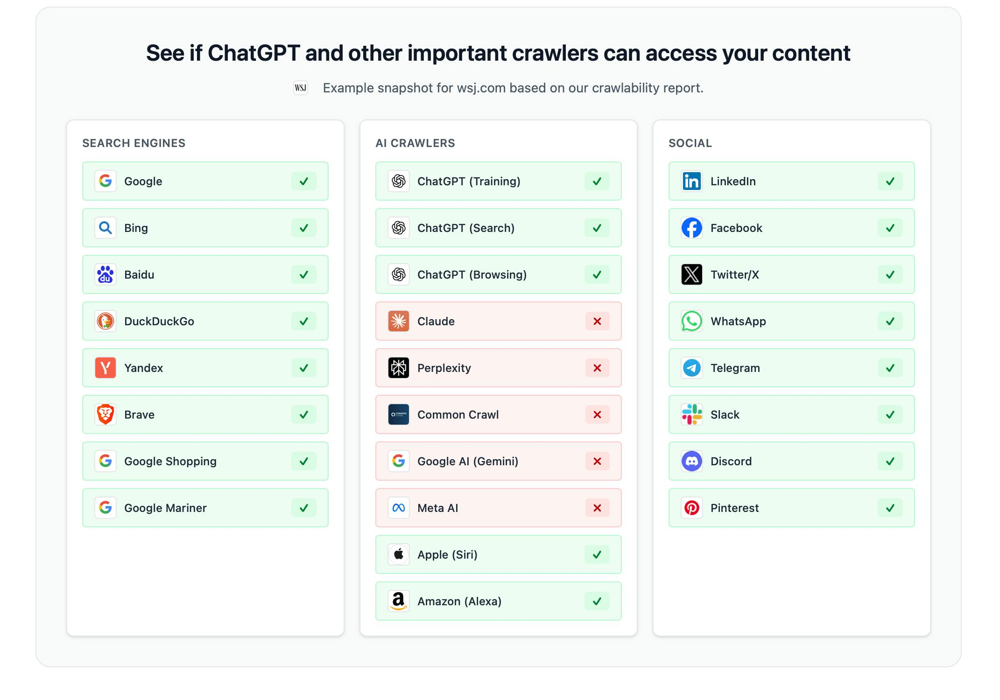

### 🎬 관련 영상
- [🎥 영상 보기](https://ph-files.imgix.net/259bc365-5b74-4fb4-9cf4-2ecd0a4b7ad0.jpeg?auto=format)

---

## 16. [Aymo AI for Chrome](https://www.producthunt.com/products/aymo-ai)
**Votes**: 15 | **도입 난이도**: 하 | **신뢰도**: 상
**Tagline**: Free AI Sidebar in Your Browser with Tools and Top AI Models
**서비스 링크**: https://www.producthunt.com/r/OGVYYA37QLEIKS

**태그**: Productivity, AI, BrowserExtension, Automation, AI Tool, Email

### 📌 이 서비스 한눈에 보기
50개 이상의 최신 AI 모델을 브라우저 사이드바에서 즉시 사용하는 올인원 AI 도구

### 🔑 주요 기능
- GPT, Claude, DeepSeek, Gemini 등 50개 이상의 최상위 AI 모델 통합 제공
- 브라우저 사이드바 형태의 UI로 웹 서핑 중 즉각적인 작업 수행 가능
- 웹 페이지 질문, 콘텐츠 생성, 이메일 작성, 소셜 미디어 대응 등 업무 최적화

### 🙋 사용자에게 어떤 점이 좋은가
여러 AI 사이트를 오갈 필요 없이 브라우저 내에서 모든 지식 작업과 콘텐츠 생성을 한 번에 해결할 수 있습니다.

### ✅ 지금 바로 써볼 기능
- 현재 읽고 있는 웹 페이지 내용에 대해 AI에게 질문하기
- 이메일 및 소셜 미디어 게시물 초안 작성 및 최적화하기
- 다양한 AI 모델을 교체하며 작업에 가장 적합한 모델 찾기

### ⚠️ 사용 전 확인할 점
- 개인정보나 민감한 데이터가 포함된 페이지 작업 시 보안 정책 확인 필요
- Chromium 기반 브라우저(Chrome, Edge 등)에서만 원활하게 작동

### 🧭 확인이 더 필요한 정보
무료 버전의 사용량 제한이나 유료 플랜의 구체적인 가격 정책은 명시되지 않았습니다.

### 📸 스크린샷 및 갤러리
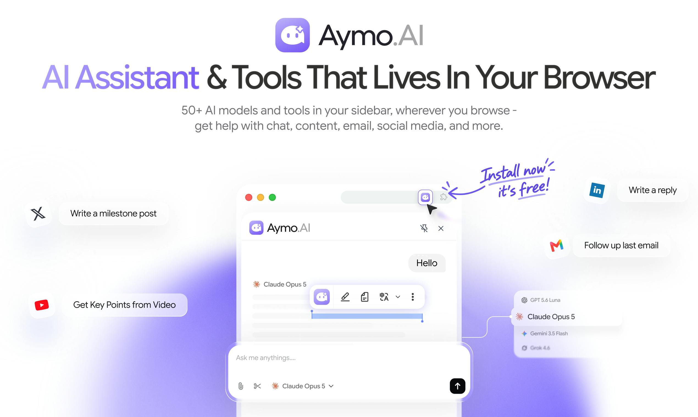
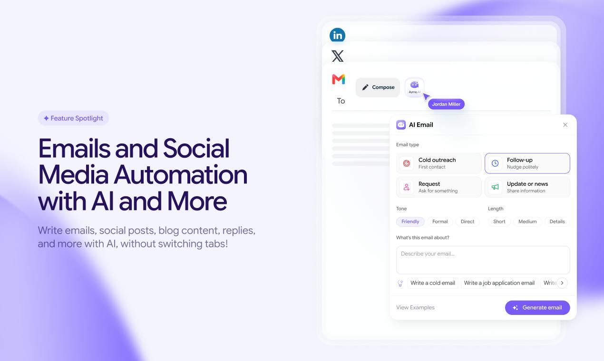
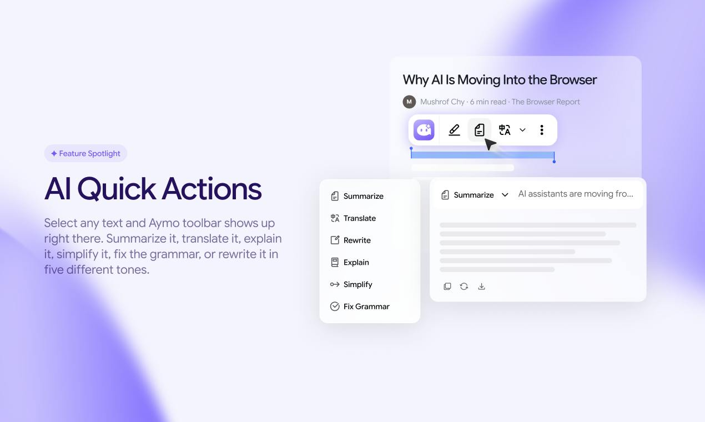

### 🎬 관련 영상
- [🎥 영상 보기](https://ph-files.imgix.net/10b82d34-b15b-488d-aa09-8ff77763dcf3.jpeg?auto=format)

---

## 17. [Awnsy](https://www.producthunt.com/products/awnsy)
**Votes**: 11 | **도입 난이도**: 하 | **신뢰도**: 상
**Tagline**: Offline AI translator for Mac. Press ⌘C twice, done.
**서비스 링크**: https://www.producthunt.com/r/3TUXRX6M47DFHC

**태그**: Productivity, macOS, Translation, AI, Privacy, AI Tool, Video, Vision, API

### 📌 이 서비스 한눈에 보기
개인정보 유출 걱정 없는 맥 전용 오프라인 AI 번역기

### 🔑 주요 기능
- 단축키(⌘C 두 번)를 통한 간편한 텍스트 번역
- 이미지, 스캔된 PDF, 영상 내 텍스트를 위한 영역 지정 번역 기능
- 로컬 모델 기반의 오프라인 작동 및 강력한 보안성

### 🙋 사용자에게 어떤 점이 좋은가
외부 서버로 데이터가 전송되지 않아 보안이 중요한 문서를 다룰 때 유용하며, 별도의 계정 생성 없이 즉시 사용할 수 있습니다.

### ✅ 지금 바로 써볼 기능
- 텍스트 선택 후 ⌘C 두 번 눌러보기
- 이미지나 PDF 영역 드래그하여 번역해보기
- 설정에서 로컬 모델 또는 클라우드 API 연동하기

### ⚠️ 사용 전 확인할 점
- 로컬 모델 사용 시 Mac의 시스템 리소스(CPU/GPU) 점유율 확인 필요
- 클라우드 API 사용 시 별도의 API 키 발급 및 비용 발생

### 🧭 확인이 더 필요한 정보
로컬 모델의 번역 품질과 하드웨어 사양에 따른 성능 차이를 확인해야 합니다.

### 📸 스크린샷 및 갤러리

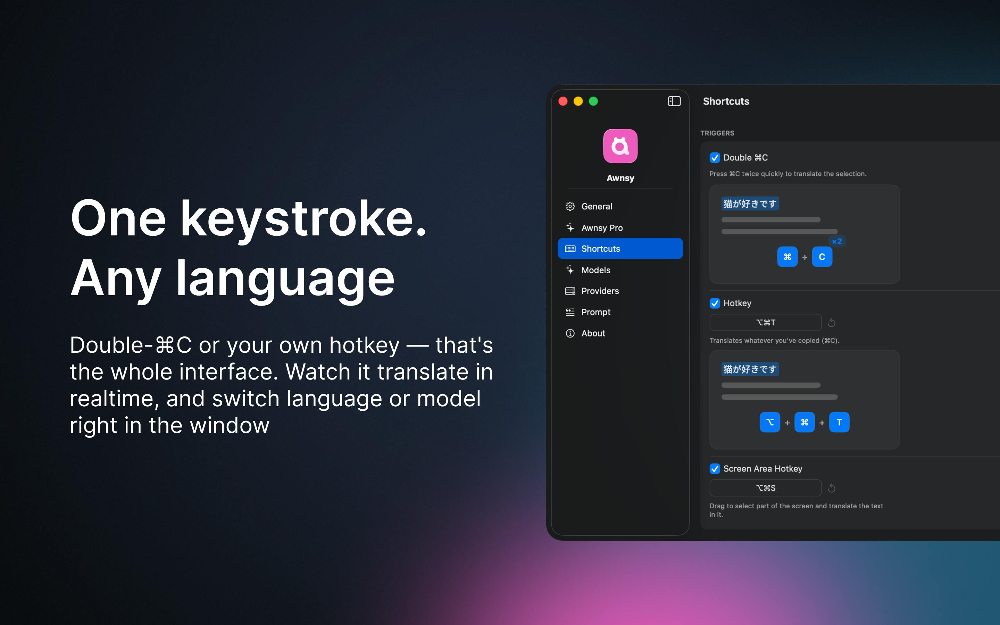
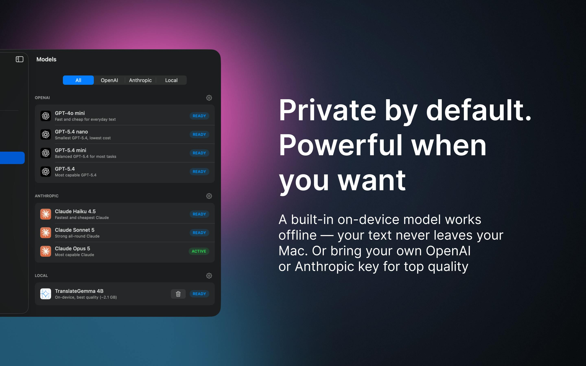

### 🎬 관련 영상
- [🎥 영상 보기](https://ph-files.imgix.net/a0e950d6-731f-4b18-bc08-bd225e2a90ed.jpeg?auto=format)

---

## 18. [Creads](https://www.producthunt.com/products/creads-2)
**Votes**: 11 | **도입 난이도**: 중 | **신뢰도**: 상
**Tagline**: Your marketing, running on its own
**서비스 링크**: https://www.producthunt.com/r/QEUFJB6H2A6K7B

**태그**: Marketing, Automation, AI Agents, Agent, Chat

### 📌 이 서비스 한눈에 보기
마케팅 기획부터 실행까지 스스로 수행하는 AI 에이전트 팀

### 🔑 주요 기능
- 광고, 유기적 성장, 리서치를 수행하는 전문 역할별 AI 에이전트 탑재
- 워크플로우 관리 대신 최종 결과물(Outcome) 중심의 자동화 제공
- 콘텐츠 생성, 게시, 최적화 과정을 자율적으로 수행

### 🙋 사용자에게 어떤 점이 좋은가
마케팅 실무 프로세스에 개입할 필요 없이, AI가 생성한 결과물을 검토하고 승인하는 방식으로 업무 효율을 극대화할 수 있습니다.

### ✅ 지금 바로 써볼 기능
- 3일 무료 체험을 통한 에이전트 성능 테스트
- 역할별 에이전트 설정 및 목표(Goal) 부여
- 생성된 마케팅 결과물 검토 및 최적화 피드백

### ⚠️ 사용 전 확인할 점
- AI가 생성한 콘텐츠의 브랜드 톤앤매너 일치 여부 확인 필요
- 자동화된 광고 집행 시 예산 관리 및 성과 모니터링 필요

### 🧭 확인이 더 필요한 정보
에이전트가 사용하는 외부 플랫폼(SNS, 광고 매체 등)과의 직접적인 연동 범위와 권한 관리 방식을 확인해야 합니다.

### 📸 스크린샷 및 갤러리

### 🎬 관련 영상
- [🎥 영상 보기](https://ph-files.imgix.net/1a0e20ba-92ad-4e20-8880-959d31f11648.jpeg?auto=format)

---

## 19. [Soar90™](https://www.producthunt.com/products/soar90)
**Votes**: 10 | **도입 난이도**: 하 | **신뢰도**: 상
**Tagline**: Personal 30-60-90 day onboarding plan for any new job
**서비스 링크**: https://www.producthunt.com/r/ZTACV4XIELYR3B

**태그**: Productivity, Career, Onboarding, Planning, AI Tool

### 📌 이 서비스 한눈에 보기
신입 사원의 성공적인 연착륙을 돕는 개인 맞춤형 90일 온보딩 플래너

### 🔑 주요 기능
- 역할별 맞춤형 30-60-90일 온보딩 트랙 제공
- 일일 과제 수행 및 성과 기록 기능
- 원클릭 성과 보고서 생성 기능

### 🙋 사용자에게 어떤 점이 좋은가
새로운 직장에서의 초기 90일을 체계적으로 관리하여 성과를 증명하고, 업무 적응도를 높일 수 있습니다.

### ✅ 지금 바로 써볼 기능
- 자신의 직무에 맞는 온보딩 트랙 선택하기
- 일일 과제 및 성과 로그 기록 시작하기
- 생성된 성과 보고서로 매니저와 면담 준비하기

### ⚠️ 사용 전 확인할 점
- 회사의 공식 온보딩 프로세스와의 정렬 필요
- 개인용 도구이므로 회사 보안 정책 준수 여부 확인 필요

### 🧭 확인이 더 필요한 정보
구체적인 역할별 트랙의 종류와 세부 커리큘럼 범위는 명시되어 있지 않습니다.

### 📸 스크린샷 및 갤러리

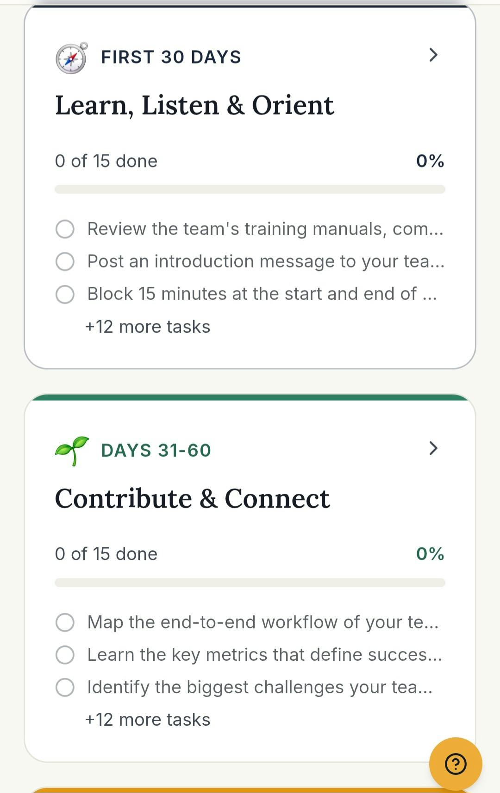

### 🎬 관련 영상
- [🎥 영상 보기](https://ph-files.imgix.net/321f33e3-43cd-4b83-a402-23a023d4cdab.jpeg?auto=format)

---

## 20. [Framedeo](https://www.producthunt.com/products/framedeo)
**Votes**: 6 | **도입 난이도**: 하 | **신뢰도**: 상
**Tagline**: Create product launch videos in minutes with AI
**서비스 링크**: https://www.producthunt.com/r/KLIY3COISCDWQD

**태그**: AI, VideoGen, Marketing, ProductLaunch, Automation, AI Tool, Video

### 📌 이 서비스 한눈에 보기
웹사이트와 스크린샷만으로 몇 분 만에 전문적인 제품 출시 영상을 만드는 AI 도구

### 🔑 주요 기능
- 웹사이트, 로고, 스크린샷을 활용한 자동 영상 생성
- 복잡한 영상 편집 과정 생략을 통한 빠른 출시 지원
- 사용자의 주의를 끄는 세련된 제품 홍보 영상 제작

### 🙋 사용자에게 어떤 점이 좋은가
제품 출시 시 영상 편집에 드는 시간과 비용을 획기적으로 줄여주며, 마케팅 효율을 높일 수 있습니다.

### ✅ 지금 바로 써볼 기능
- 보유 중인 제품 스크린샷 준비하기
- 브랜드 로고 업로드하기
- AI가 생성한 초안 확인 및 수정하기

### ⚠️ 사용 전 확인할 점
- 사용자 맞춤형 세부 편집 기능의 범위 확인 필요
- 영상 스타일의 다양성 및 템플릿 품질 확인 필요

### 🧭 확인이 더 필요한 정보
구체적인 영상 편집 자유도와 최종 결과물의 커스텀 가능 여부를 확인해야 합니다.

### 📸 스크린샷 및 갤러리
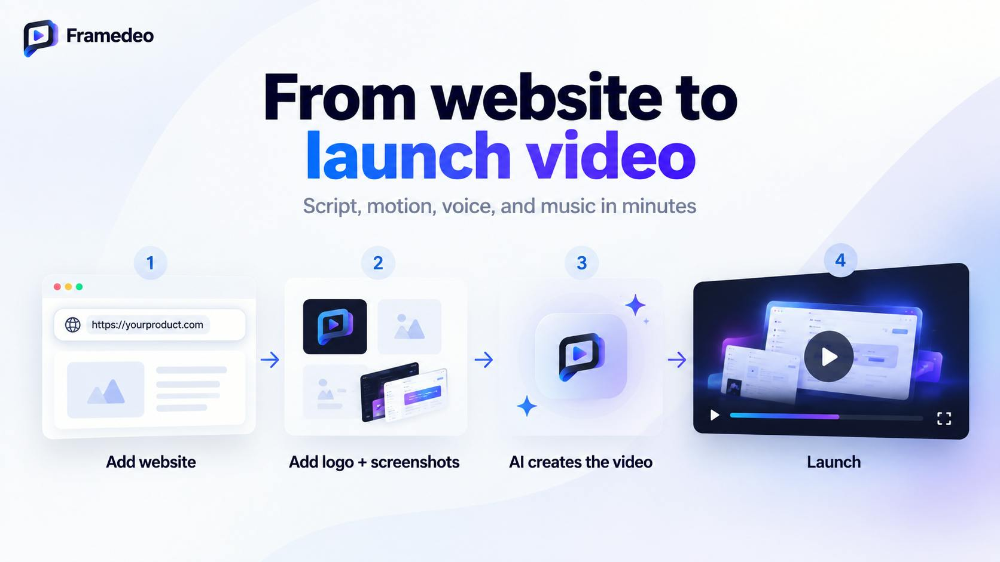
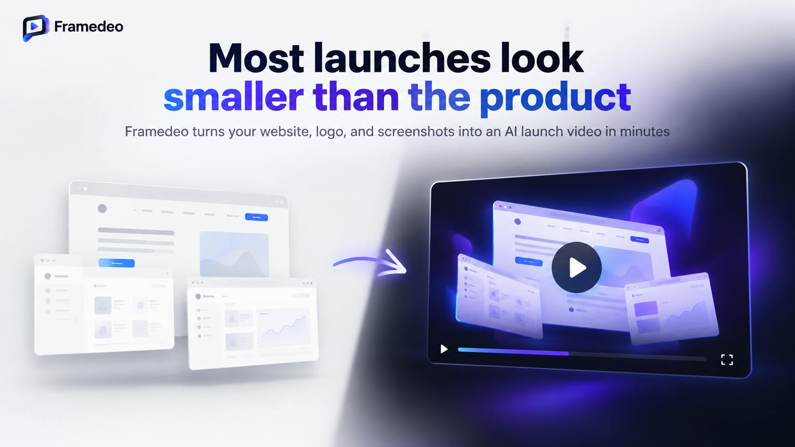

### 🎬 관련 영상
- [🎥 영상 보기](https://ph-files.imgix.net/7500b53a-ffa6-4c84-be68-06d409269a75.jpeg?auto=format)

---

## 21. [Chain Your Mac](https://www.producthunt.com/products/chain-your-mac)
**Votes**: 5 | **도입 난이도**: 하 | **신뢰도**: 상
**Tagline**: The scrolling window manager for macOS.
**서비스 링크**: https://www.producthunt.com/r/7KRQAWJU3ICAOH

**태그**: Productivity, macOS, WindowManager, AI Tool

### 📌 이 서비스 한눈에 보기
트랙패드 스와이프로 창을 관리하는 macOS용 무한 스크롤형 윈도우 매니저

### 🔑 주요 기능
- Niri나 PaperWM 스타일의 무한 스트립 방식 윈도우 관리
- 트랙패드 스와이프를 통한 직관적인 창 전환
- SIP(시스템 무결성 보호)를 해제할 필요 없는 네이티브 방식

### 🙋 사용자에게 어떤 점이 좋은가
여러 창을 겹치지 않고 하나의 긴 띠 형태로 배치하여, 트랙패드 제스처만으로 작업 공간을 매끄럽게 이동할 수 있습니다.

### ✅ 지금 바로 써볼 기능
- 라이브 데모를 통한 스크롤 방식 체감하기
- macOS 13 이상 환경에서 설치 및 실행하기
- 트랙패드 스와이프 제스처 익히기

### ⚠️ 사용 전 확인할 점
- macOS 13 이상의 운영체제 버전 필요
- 기존의 창 관리 방식(겹치기)과 다른 워크플로우 적응 필요

### 🧭 확인이 더 필요한 정보
사용자의 하드웨어 사양에 따른 성능 최적화 정도는 명시되어 있지 않습니다.

### 📸 스크린샷 및 갤러리
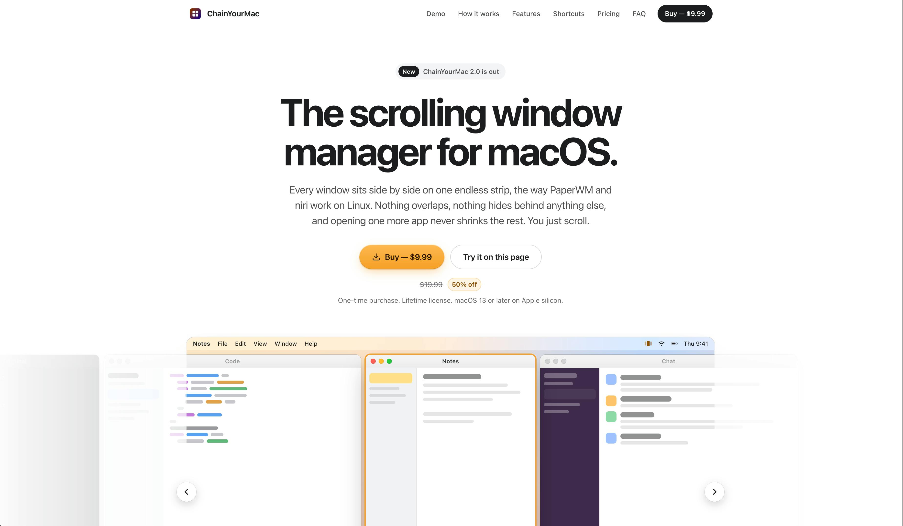

### 🎬 관련 영상
- [🎥 영상 보기](https://ph-files.imgix.net/86ad2173-11f6-4a88-bc5f-84f0edf2d359.jpeg?auto=format)

---

## 22. [Taiafox](https://www.producthunt.com/products/taiafox)
**Votes**: 5 | **도입 난이도**: 중 | **신뢰도**: 상
**Tagline**: Voice-first emergency coordination for wildfire response
**서비스 링크**: https://www.producthunt.com/r/EDQAQJYS7LR3IX

**태그**: EmergencyResponse, VoiceAI, CrisisManagement, RealTimePlanning, AI Tool

### 📌 이 서비스 한눈에 보기
산불 대응을 위한 음성 중심의 긴급 상황 조율 솔루션

### 🔑 주요 기능
- 수많은 메시지 중 핵심 정보만 선별하여 우선순위 제공
- 음성 기반의 신속한 대응 인력 조율
- 상황 변화에 따른 실시간 계획 재수립

### 🙋 사용자에게 어떤 점이 좋은가
긴박한 재난 상황에서 정보 과부하를 방지하고, 음성을 통해 현장 대응 인력 간의 의사결정 속도를 극대화합니다.

### ✅ 지금 바로 써볼 기능
- 핵심 메시지 필터링 기능 테스트
- 음성 기반 협업 워크플로우 확인
- 실시간 상황 변화에 따른 재계획 기능 검토

### ⚠️ 사용 전 확인할 점
- 음성 인식의 정확도 및 통신 환경에 따른 성능 차이 확인 필요
- 실제 재난 현장의 복잡한 변수를 완벽히 반영하는지 검증 필요

### 🧭 확인이 더 필요한 정보
실제 현장 도입 시 필요한 하드웨어 요구사항과 통신 인프라 의존도를 확인해야 합니다.

### 📸 스크린샷 및 갤러리

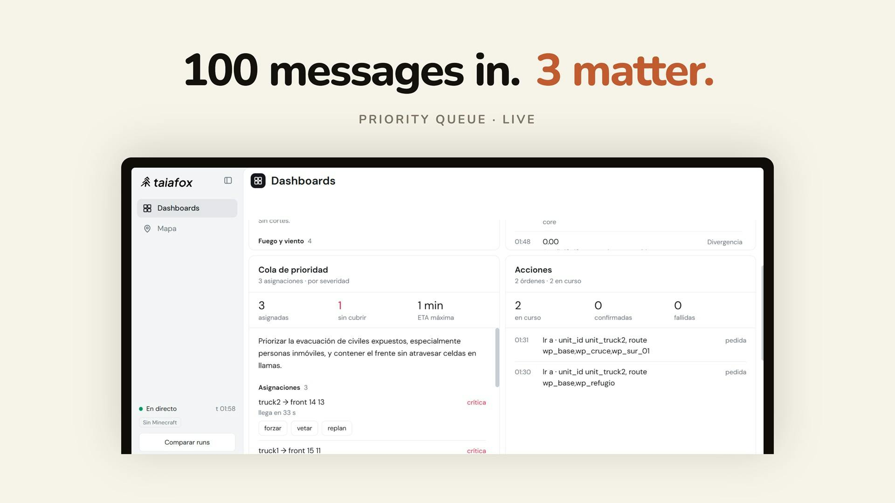
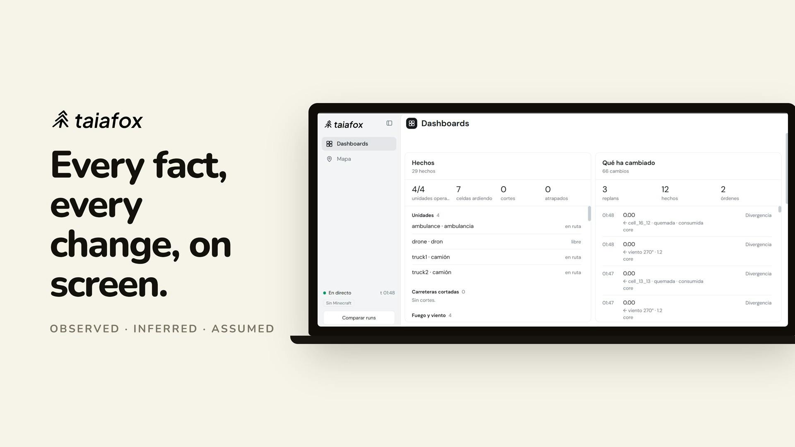

### 🎬 관련 영상
- [🎥 영상 보기](https://ph-files.imgix.net/d9606093-46fe-4154-bb7a-3ce91e9a2a81.jpeg?auto=format)

---

## 23. [Kiiboard : Keyboard for Coding](https://www.producthunt.com/products/kiiboard-keyboard-for-coding)
**Votes**: 5 | **도입 난이도**: 중 | **신뢰도**: 상
**Tagline**: A powerful keyboard built for devs and great for everyone.
**서비스 링크**: https://www.producthunt.com/r/UQDZNILPYOZKSZ

**태그**: DevTool, Productivity, Hardware, Customization, Design

### 📌 이 서비스 한눈에 보기
개발자의 작업 흐름에 최적화된 커스텀 키보드 솔루션

### 🔑 주요 기능
- 코드 작성 및 문서 작업에 특화된 전용 심볼 키와 텍스트 도구
- 사용자 맞춤형 레이아웃 편집 기능 제공
- 클립보드 관리 및 블루투스 HID 지원을 통한 높은 범용성

### 🙋 사용자에게 어떤 점이 좋은가
코딩과 문서 작업 시 반복적인 타이핑 시간을 줄이고, 작업 흐름을 끊지 않는 효율적인 입력 환경을 제공합니다.

### ✅ 지금 바로 써볼 기능
- 자신만의 작업 흐름에 맞춘 레이아웃 편집
- 빠른 커서 이동 및 텍스트 편집 도구 활용
- 클립보드 기능을 통한 효율적인 데이터 관리

### ⚠️ 사용 전 확인할 점
- 사용자 숙련도에 따라 초기 레이아웃 설정에 시간이 소요될 수 있음
- 하드웨어 제품인 경우 물리적 호환성 확인 필요

### 🧭 확인이 더 필요한 정보
제품이 소프트웨어 솔루션인지 물리적 하드웨어 키보드인지에 대한 명확한 구분이 필요합니다.

### 📸 스크린샷 및 갤러리

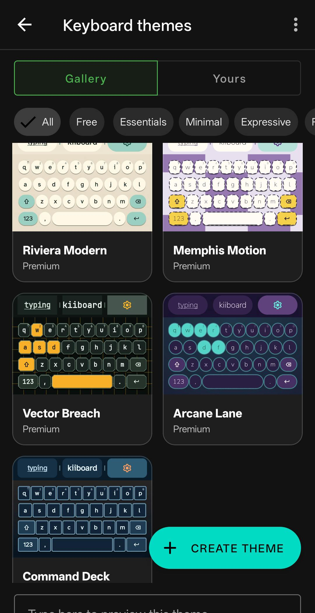
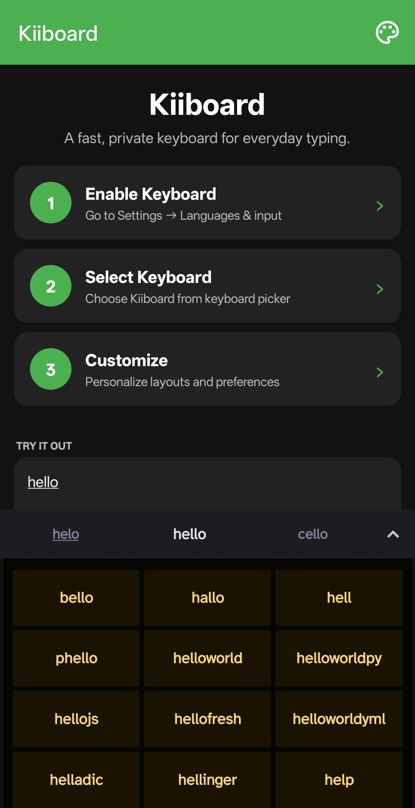

---

## 24. [PicText](https://www.producthunt.com/products/pictext)
**Votes**: 4 | **도입 난이도**: 하 | **신뢰도**: 상
**Tagline**: Spell it with your photos.
**서비스 링크**: https://www.producthunt.com/r/RR3YVNQARKZMDR

**태그**: DesignTool, PhotoEditor, Typography, Creative, AI Tool, Vision

### 📌 이 서비스 한눈에 보기
사진을 활용해 감각적인 타이포그래피 모자이크를 만드는 브라우저 기반 편집기

### 🔑 주요 기능
- 글자 모양 안에 사진을 채워 넣는 모자이크 타이포그래피 제작
- 텍스트를 이미지 피사체 뒤로 배치하는 레이어 기능
- 서버 업로드 없는 프라이빗한 브라우저 기반 작업 방식

### 🙋 사용자에게 어떤 점이 좋은가
개인 소장용 아트워크나 SNS용 감성 이미지를 만들 때, 별도의 설치 없이 브라우저에서 즉시 제작하고 투명 PNG로 저장할 수 있습니다.

### ✅ 지금 바로 써볼 기능
- 사진과 글자를 조합해 모자이크 아트 만들기
- 필터 및 타일 셔플 기능을 활용한 디자인 변형
- 투명 배경 PNG로 다운로드하여 다른 디자인에 활용하기

### ⚠️ 사용 전 확인할 점
- 브라우저 기반이므로 고해상도 대용량 작업 시 성능 제한 가능성
- 복잡한 그래픽 디자인 작업보다는 단순 모자이크 제작에 특화됨

### 🧭 확인이 더 필요한 정보
사용자의 브라우저 사양에 따른 작업 속도 및 결과물 해상도 품질을 확인해야 합니다.

### 📸 스크린샷 및 갤러리
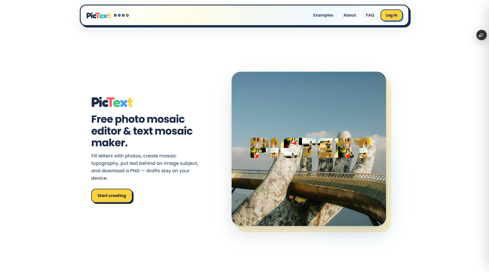

---

## 25. [The Attic Suite](https://www.producthunt.com/products/the-attic-suite)
**Votes**: 4 | **도입 난이도**: 중 | **신뢰도**: 상
**Tagline**: Pull your scattered digital life into one private place
**서비스 링크**: https://www.producthunt.com/r/ZX3N2OUDN4FYCT

**태그**: Productivity, Privacy, Data Management, Desktop App, AI Tool, Chat, Email

### 📌 이 서비스 한눈에 보기
흩어진 디지털 자산을 내 컴퓨터로 모아 관리하는 개인용 아카이브 스위트

### 🔑 주요 기능
- 이메일, 사진, 문서, 채팅, 연락처 등 5종의 로컬 데스크톱 앱 제공
- 클라우드나 계정 없이 개인 컴퓨터에 저장되는 프라이버시 중심 설계
- 중복 제거 기능을 통해 흩어진 데이터를 하나의 아카이브로 통합

### 🙋 사용자에게 어떤 점이 좋은가
여러 기기와 클라우드에 분산된 오래된 데이터들을 한곳에 안전하게 모으고 관리할 수 있습니다.

### ✅ 지금 바로 써볼 기능
- EmailAttic으로 오래된 이메일 백업 및 정리하기
- PictureAttic로 흩어진 사진 파일 통합하기
- DocAttic로 과거 문서 파일 아카이브 구축하기

### ⚠️ 사용 전 확인할 점
- 로컬 저장 방식이므로 사용자의 하드웨어 용량과 백업 관리가 필수적임
- 클라우드 서비스가 아니므로 기기 분실/고장 시 데이터 유실 위험이 있음

### 🧭 확인이 더 필요한 정보
사용자의 운영체제(OS) 지원 범위와 데이터 마이그레이션 방식에 대한 상세 정보가 필요합니다.

### 📸 스크린샷 및 갤러리

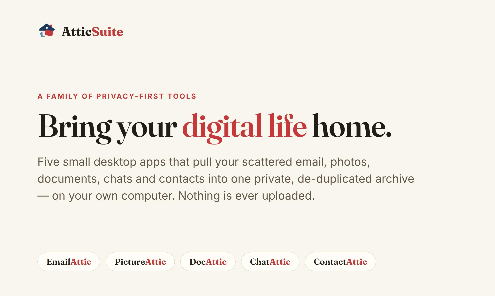

### 🎬 관련 영상
- [🎥 영상 보기](https://ph-files.imgix.net/bb5ca6be-88d9-4bbe-bd1e-6dcdaf7a421d.jpeg?auto=format)

---

## 26. [PATE](https://www.producthunt.com/products/pate)
**Votes**: 3 | **도입 난이도**: 하 | **신뢰도**: 상
**Tagline**: Other apps split the total. PATE splits the actual bill.
**서비스 링크**: https://www.producthunt.com/r/VLMA6VEEXBLIRJ

**태그**: FinTech, AI, Productivity, Lifestyle, AI Tool

### 📌 이 서비스 한눈에 보기
영수증 사진 한 장으로 먹은 만큼만 정확하게 나누는 AI 정산 서비스

### 🔑 주요 기능
- AI 영수증 스캔을 통한 개별 항목 자동 인식
- 총액 배분이 아닌 실제 소비한 항목별 정산 방식
- 복잡한 계산이나 불필요한 논쟁 없는 간편한 결제 분담

### 🙋 사용자에게 어떤 점이 좋은가
더 이상 총액을 인원수로 나누며 눈치 볼 필요 없이, 자신이 먹은 음식값만 정확하게 계산하여 깔끔하게 정산할 수 있습니다.

### ✅ 지금 바로 써볼 기능
- 영수증 촬영하여 항목 인식 테스트하기
- 개별 항목별로 친구에게 할당해보기

### ⚠️ 사용 전 확인할 점
- 수기 입력이 필요한 항목이나 복잡한 할인 적용 시 정확도 확인 필요
- 영수증 글씨체나 화질에 따른 인식 오류 가능성

### 🧭 확인이 더 필요한 정보
AI의 항목 인식 정확도와 결제/송금 기능의 직접 연동 여부에 대한 확인이 필요합니다.

### 📸 스크린샷 및 갤러리

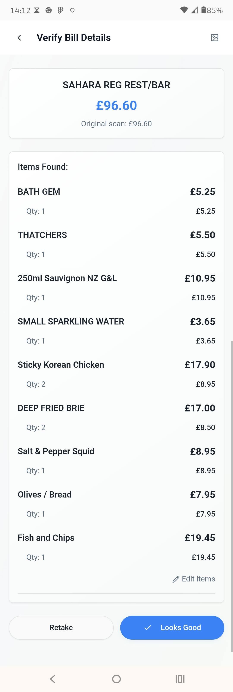

### 🎬 관련 영상
- [🎥 영상 보기](https://ph-files.imgix.net/7a1bd24a-e5fc-4a3e-a2f7-246fa7d19489.jpeg?auto=format)

---

## 27. [Waivly - Networking Done Intentionally](https://www.producthunt.com/products/waivly)
**Votes**: 3 | **도입 난이도**: 하 | **신뢰도**: 상
**Tagline**: No performances or spam, just genuine connections
**서비스 링크**: https://www.producthunt.com/r/YHFM7F44PGEKVO

**태그**: Networking, Community, Professional, AI Tool

### 📌 이 서비스 한눈에 보기
스팸 없는 진정성 있는 관계 형성을 위한 프라이빗 글로벌 네트워킹 플랫폼

### 🔑 주요 기능
- 불필요한 퍼포먼스나 스팸을 배제한 진정한 연결 지향
- 의미 있는 관계 형성을 위한 프라이빗 글로벌 네트워크 구축
- 새로운 기회 창출과 지속적인 성장을 위한 커뮤니티 환경 제공

### 🙋 사용자에게 어떤 점이 좋은가
단순한 인맥 늘리기가 아닌, 실질적인 기회와 성장을 위한 양질의 인적 네트워크를 구축할 수 있습니다.

### ✅ 지금 바로 써볼 기능
- 프라이빗 네트워크 가입 및 프로필 설정
- 관심 분야 기반의 의미 있는 연결 시도
- 네트워크 내 새로운 기회 탐색

### ⚠️ 사용 전 확인할 점
- 프라이빗 네트워크 특성상 초기 사용자 규모가 제한적일 수 있음
- 사용자 기반의 커뮤니티이므로 참여도에 따라 가치가 달라질 수 있음

### 🧭 확인이 더 필요한 정보
구체적인 가입 조건이나 네트워크의 규모, 운영 방식에 대한 상세 정보가 부족합니다.

### 📸 스크린샷 및 갤러리

---

## 28. [Builder Battles](https://www.producthunt.com/products/builder-battles)
**Votes**: 3 | **도입 난이도**: 하 | **신뢰도**: 상
**Tagline**: Head to head app showdowns from builders brave enough
**서비스 링크**: https://www.producthunt.com/r/NSHJLNRVWWLPZL

**태그**: Marketing, IndieHackers, Community, ProductLaunch, AI Tool

### 📌 이 서비스 한눈에 보기
인디 개발자들을 위한 매일 열리는 1대1 앱 대결 및 투표 플랫폼

### 🔑 주요 기능
- 매일 두 개의 앱이 맞붙는 1대1 대결 형식
- X(트위터) 또는 구글 계정을 통한 실시간 관객 투표
- 승리한 앱은 다음 대결을 위해 상단에 유지되는 챔피언 시스템

### 🙋 사용자에게 어떤 점이 좋은가
조용한 출시 대신 대중의 피드백을 즉각적으로 받을 수 있는 역동적인 마케팅 채널로 활용 가능합니다.

### ✅ 지금 바로 써볼 기능
- 참가자 풀(Fighter Pool)에 자신의 앱 등록하기
- 매일 진행되는 1대1 대결 투표 참여하기
- 승리하여 챔피언 자리를 유지하는 도전하기

### ⚠️ 사용 전 확인할 점
- 단순 투표 방식이므로 제품의 질보다 마케팅 역량에 따라 결과가 좌우될 수 있음
- 참가자 간의 경쟁적 환경이 브랜드 이미지에 미칠 영향 고려 필요

### 🧭 확인이 더 필요한 정보
참가자 풀에 등록된 앱들의 구체적인 카테고리나 경쟁 방식의 세부 규칙은 명시되지 않았습니다.

### 📸 스크린샷 및 갤러리
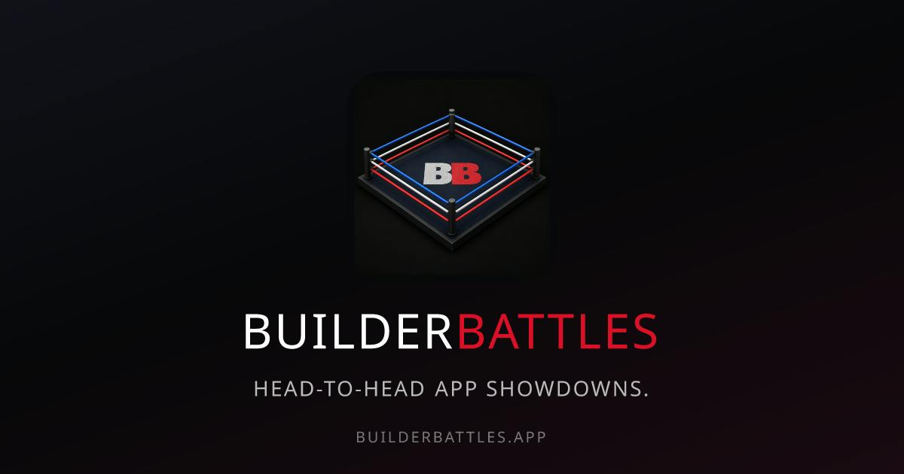

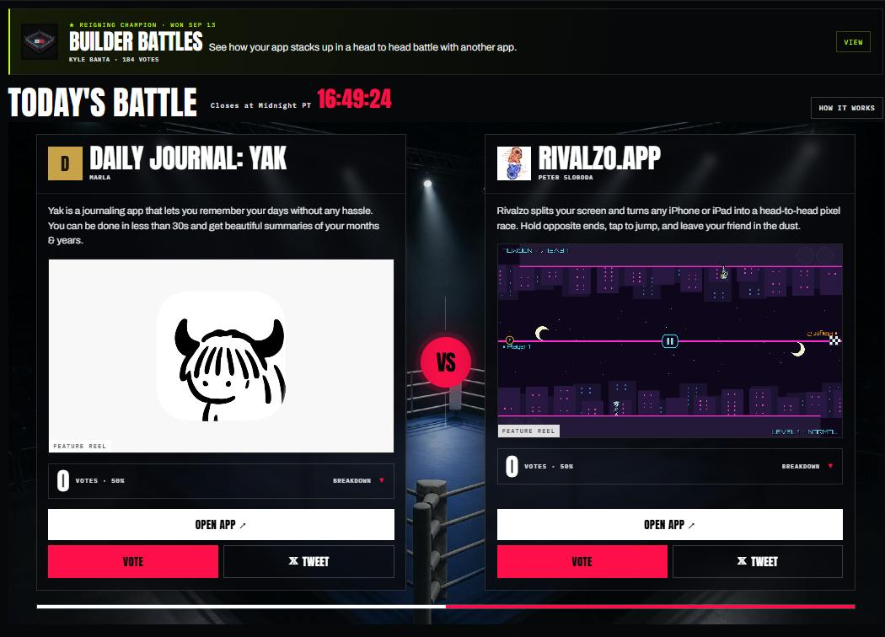

---

## 29. [Cold Mailer](https://www.producthunt.com/products/cold-mailer)
**Votes**: 3 | **도입 난이도**: 하 | **신뢰도**: 상
**Tagline**: Write once, Reach many.
**서비스 링크**: https://www.producthunt.com/r/WZI4BKD2MWK4UY

**태그**: Sales, Automation, LeadGeneration, Outreach, AI Tool, Email

### 📌 이 서비스 한눈에 보기
1만 개 이상의 테크 기업 리스트를 기반으로 개인화된 콜드 메일을 발송하는 자동화 도구

### 🔑 주요 기능
- 10,000개 이상의 테크 기업 데이터베이스 제공
- 개인화된 아웃리치 메시지 작성 기능
- 사용자 개인 이메일 제공자를 통한 직접 발송

### 🙋 사용자에게 어떤 점이 좋은가
잠재 고객 리스트 확보부터 개인화된 메시지 발송까지의 과정을 간소화하여 영업 효율을 높일 수 있습니다.

### ✅ 지금 바로 써볼 기능
- 도시별 15개 기업 리스트 탐색하기
- 무료 배치를 통한 3건의 이메일 발송 테스트
- 전체 디렉토리 잠금 해제 검토

### ⚠️ 사용 전 확인할 점
- 무료 버전은 도시별 15개 기업 제한 및 배치당 3건의 발송 제한이 있음
- 전체 디렉토리 이용 시 5달러의 일회성 비용 발생

### 🧭 확인이 더 필요한 정보
개인 이메일 제공자(SMTP/API 등)와의 구체적인 연동 방식과 데이터 업데이트 주기를 확인해야 합니다.

### 📸 스크린샷 및 갤러리
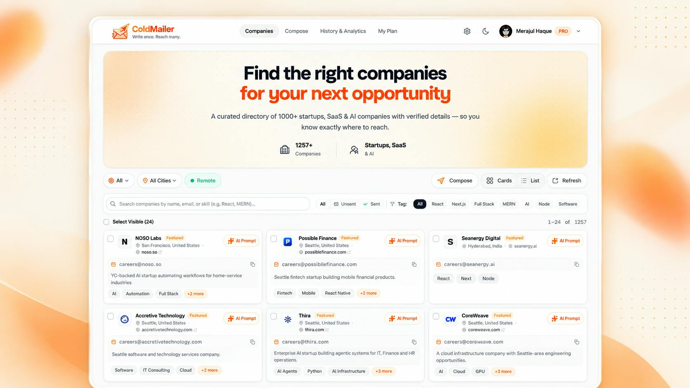
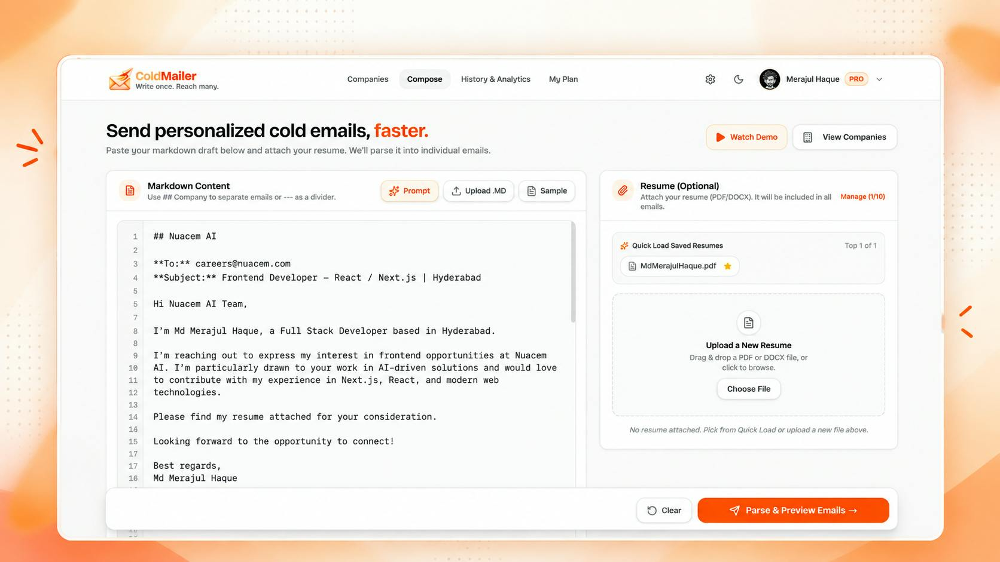
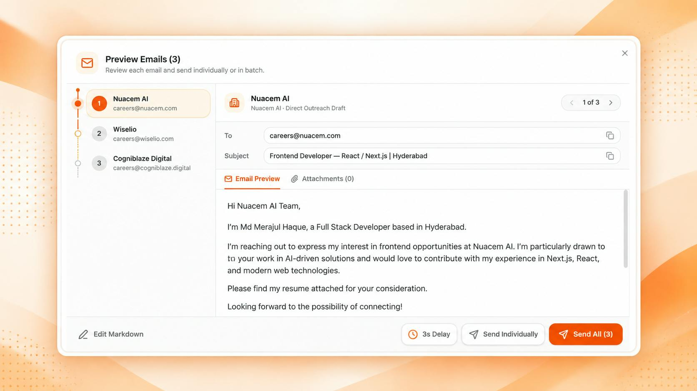

### 🎬 관련 영상
- [🎥 영상 보기](https://ph-files.imgix.net/0113ec67-5ffd-4414-a74a-4bb35a3b4a17.jpeg?auto=format)

---

## 30. [markable](https://www.producthunt.com/products/markable-4)
**Votes**: 3 | **도입 난이도**: 하 | **신뢰도**: 상
**Tagline**: Feedback right on the website — not in 40 emails.
**서비스 링크**: https://www.producthunt.com/r/PQ777GWU2NERBS

**태그**: Collaboration, DesignFeedback, ProductManagement, WebTool, AI Tool, Vision, DevTool, Email

### 📌 이 서비스 한눈에 보기
웹사이트의 특정 요소에 직접 댓글을 달아 이메일 없이 피드백을 주고받는 협업 도구

### 🔑 주요 기능
- Shift+클릭으로 웹사이트 내 특정 섹션, 텍스, 이미지에 즉시 코멘트 가능
- 클라이언트, 에디터, 개발자가 동일한 마커를 보며 실시간 소통
- 스레드 방식의 답글과 작업 완료 체크 기능 제공

### 🙋 사용자에게 어떤 점이 좋은가
이메일이나 메신저로 피드백을 주고받을 때 발생하는 위치 혼선을 방지하고, 작업의 맥락을 명확하게 유지할 수 있습니다.

### ✅ 지금 바로 써볼 기능
- Shift+클릭으로 웹 요소에 피드백 남겨보기
- 스레드 기능을 활용해 팀원과 답변 주고받기
- 완료된 작업 항목 체크하여 관리하기

### ⚠️ 사용 전 확인할 점
- 웹사이트의 특정 영역에만 국한된 피드백 방식인지 확인 필요
- 협업 대상자(클라이언트 등)의 접근 권한 및 계정 필요 여부 확인 필요

### 🧭 확인이 더 필요한 정보
사용자 권한 관리 방식과 외부 클라이언트 공유 방식에 대한 상세 정보가 필요합니다.

### 📸 스크린샷 및 갤러리
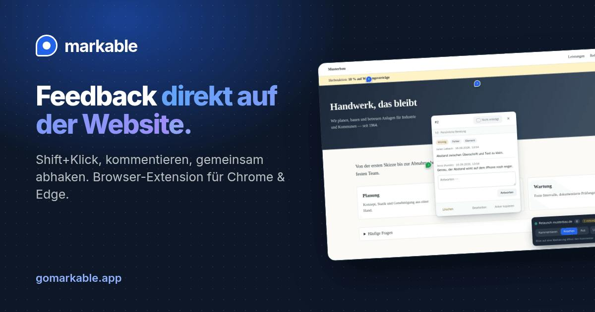

---

