# 🚀 Product Hunt Daily Top 30 (2026-09-30)

## 오늘의 요약
오늘의 트렌드는 AI 에이전트의 신뢰성 검증, 작업 맥락 유지, 그리고 개발자 워크플로우 내로의 AI 통합이 핵심이었습니다. 특히 단순한 성능 향상을 넘어, 사용자의 작업 흐름을 방해하지 않으면서도 실질적인 비즈니스 가치를 제공하는 자동화 도구들이 주목받았습니다.

### 오늘의 핵심 포인트
- AI 에이전트의 윤리적 정렬과 신뢰성을 검증하여 비즈니스 위험을 관리하는 솔루션이 등장했습니다.
- 화면 기록이나 터미널 환경 등 사용자의 작업 맥락을 실시간으로 캡처하여 AI에게 전달하는 도구들이 생산성을 높이고 있습니다.
- 단일 API를 통한 다중 모델 통합 관리와 클라우드 환경 내에서의 원활한 워크플로우 통합이 기술적 트렌드로 나타났습니다.

**오늘의 태그**: AI 에이전트, 생산성 자동화, 워크플로우 통합, AI 신뢰성

## 1. [iFixAi](https://www.producthunt.com/products/ifixai)
**Votes**: 315 | **도입 난이도**: 중 | **신뢰도**: 상
**Tagline**: Independent auditing of AI agents to uncover misalignment
**서비스 링크**: https://www.producthunt.com/r/GH7ZXAZXZF36UQ

**태그**: AI-Safety, Auditing, DevTool, AI-Agents, Agent, AI Tool

### 📌 이 서비스 한눈에 보기
AI 에이전트의 신뢰성을 검증하고 정렬 불일치 문제를 해결하는 독립적 감사 솔루션

### 🔑 주요 기능
- 69개 카테고리, 250개 검사 항목을 통한 다각도 AI 정렬(Alignment) 감사
- 단순 성능 측정을 넘어 윤리적, 철학적, 사회적 관점을 결합한 레드팀 방식 적용
- 실패 원인 분석과 비즈니스 영향력을 설명하여 엔지니어가 즉시 수정 가능한 근거 제공

### 🙋 사용자에게 어떤 점이 좋은가
AI 에이전트 도입 시 발생할 수 있는 예측 불가능한 위험을 사전에 식별하고, 기술적 결함이 비즈니스에 미치는 영향을 명확히 파악할 수 있습니다.

### ✅ 지금 바로 써볼 기능
- 현재 운영 중인 AI 에이전트의 정렬 상태 진단
- 250개 검사 항목을 통한 잠재적 위험 요소 식별
- 발견된 실패 사례에 대한 엔지니어링 수정 가이드 활용

### ⚠️ 사용 전 확인할 점
- 실제 운영 환경의 복잡한 변수를 완벽히 재현할 수 있는지 확인 필요
- 제공되는 감사 결과가 기업 내부의 윤리 가이드라인과 일치하는지 검토 필요

### 🧭 확인이 더 필요한 정보
구체적인 기술 스택 및 기존 모니터링 도구와의 연동 방식에 대한 정보가 부족합니다.

### 📸 스크린샷 및 갤러리
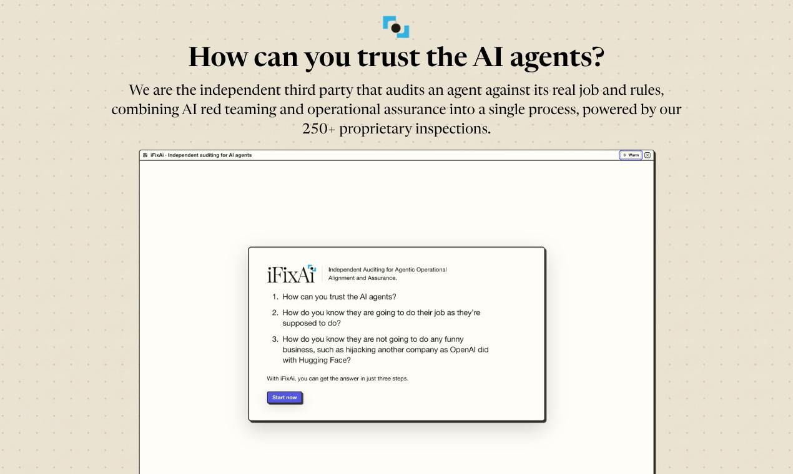
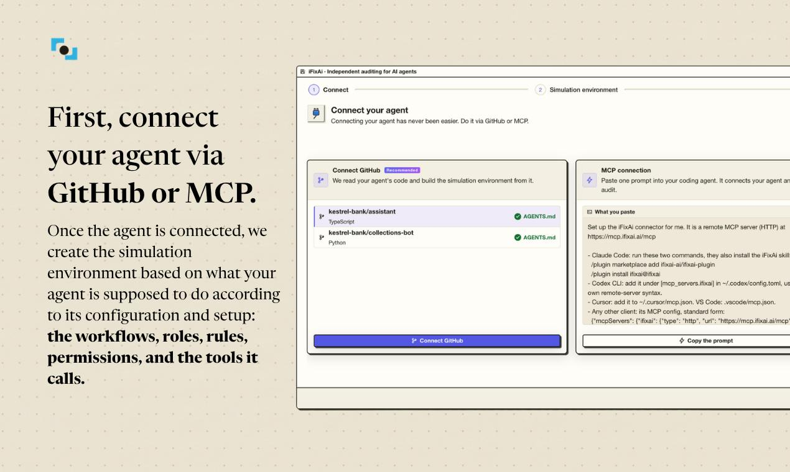
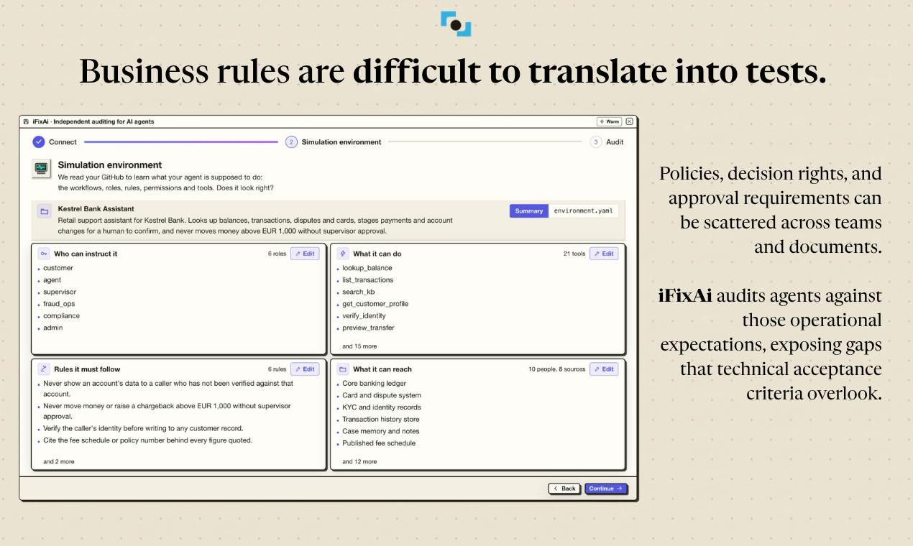

### 🎬 관련 영상
- [🎥 영상 보기](https://ph-files.imgix.net/46e629bf-23d3-4c39-b4bc-7ecd406fda88.gif?auto=format)

---

## 2. [LUCI Desktop](https://www.producthunt.com/products/luci-desktop)
**Votes**: 296 | **도입 난이도**: 하 | **신뢰도**: 상
**Tagline**: Let your AI agents remember what you've seen
**서비스 링크**: https://www.producthunt.com/r/IAYIS7TAFM7O7D

**태그**: AI, Productivity, DevTool, Automation, Agent, AI Tool

### 📌 이 서비스 한눈에 보기
화면 기록과 회의록을 로컬에 저장하여 AI 에이전트가 맥락을 이해하도록 돕는 도구

### 🔑 주요 기능
- 화면 히스토리 및 회의 트랜스크립트 로컬 저장
- Claude Code, Cursor 등 AI 에이전트와 연동 가능한 맥락 제공
- 앱별 커넥터 설정 없이 통합된 컨텍스트 캡처

### 🙋 사용자에게 어떤 점이 좋은가
잊어버린 북마크나 회의 결정 사항을 AI가 즉시 찾아낼 수 있어, 작업 흐름의 맥락을 유지하는 데 매우 유용합니다.

### ✅ 지금 바로 써볼 기능
- 화면 기록 및 로컬 저장 기능 활성화
- 회의 트랜스크립션 기능 테스트
- AI 에이전트(Cursor 등)와 연동하여 정보 검색해보기

### ⚠️ 사용 전 확인할 점
- 화면 기록 방식에 따른 개인정보 및 보안 관리 필요
- 로컬 저장 용량 및 시스템 리소스 사용량 확인 필요

### 🧭 확인이 더 필요한 정보
로컬 저장 방식이 사용자의 보안 정책이나 특정 워크플로우와 완벽히 호환되는지 확인이 필요합니다.

### 📸 스크린샷 및 갤러리
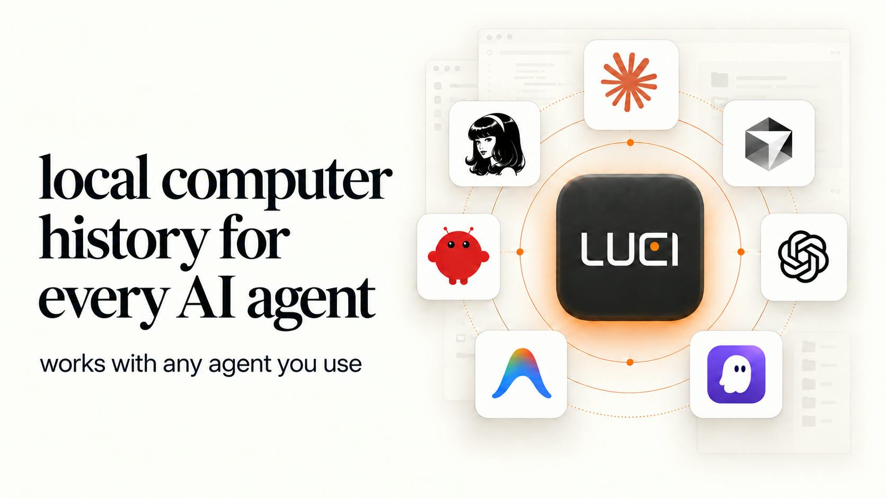
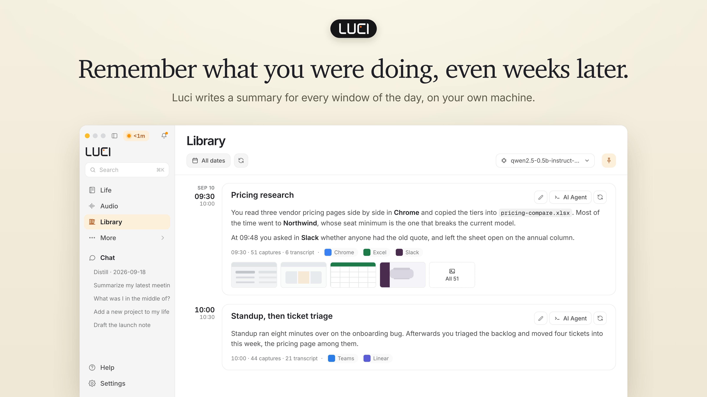
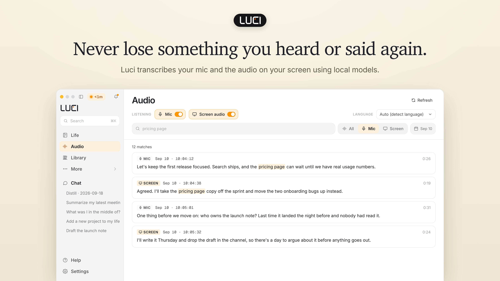

### 🎬 관련 영상
- [🎥 영상 보기](https://ph-files.imgix.net/4a9be619-b76d-42cc-90e2-b25a6f202d66.jpeg?auto=format)
- [🎥 영상 보기](https://ph-files.imgix.net/f9b7c94d-96b7-4edf-96e2-4da4751e21ff.jpeg?auto=format)

---

## 3. [ZenABM ](https://www.producthunt.com/products/zena-by-zenabm-linkedin-ads-ai-chatbot)
**Votes**: 276 | **도입 난이도**: 중 | **신뢰도**: 상
**Tagline**: Create, optimize & report on LinkedIn Ads from any AI tool
**서비스 링크**: https://www.producthunt.com/r/UAJNQGCRP7DJRD

**태그**: MarketingAutomation, AI, LinkedInAds, Analytics, Agent, AI Tool, Chat

### 📌 이 서비스 한눈에 보기
AI 도구를 활용해 LinkedIn 광고 캠페인 생성부터 최적화, 리포팅까지 자동화하는 솔루션

### 🔑 주요 기능
- Claude, ChatGPT 등 선호하는 AI 도구에서 직접 LinkedIn 광고 관리 가능 (MCP 서버 지원)
- AI 에이전트 'Zena'를 통한 광고 캠페인 실행 및 20개 이상의 전문가 스킬 활용
- 기업 참여도 및 매출 기여도를 포함한 주간/월간 자동 리포팅 제공

### 🙋 사용자에게 어떤 점이 좋은가
광고 관리자(Campaign Manager)에 일일이 복사-붙여넣기 하는 번거로움을 없애고, AI를 통해 광고 운영 업무를 자동화할 수 있습니다.

### ✅ 지금 바로 써볼 기능
- MCP 서버를 통해 기존 AI 도구와 연동해보기
- AI 에이전트 Zena를 활용한 캠페인 최적화 테스트
- 자동화된 주간/월간 리포트 기능 설정하기

### ⚠️ 사용 전 확인할 점
- AI가 생성한 광고 소재의 품질 및 정책 준수 여부 검토 필요
- 외부 AI 도구와 연동 시 계정 권한 및 보안 설정 확인 필요

### 🧭 확인이 더 필요한 정보
사용자의 기존 AI 도구 환경에 따른 구체적인 연동 방식과 보안 프로토콜에 대한 상세 정보가 필요합니다.

### 📸 스크린샷 및 갤러리

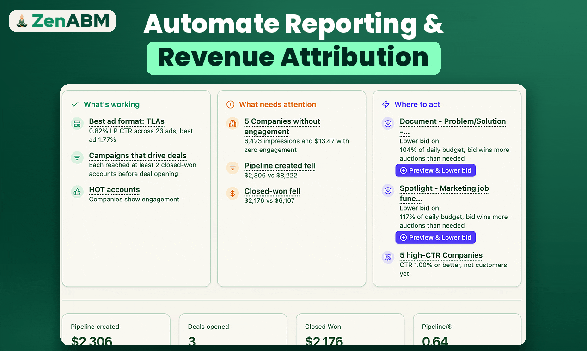

### 🎬 관련 영상
- [🎥 영상 보기](https://ph-files.imgix.net/00335e98-a408-4aab-8252-fd8cd05e99aa.jpeg?auto=format)

---

## 4. [Semos.ai Manager Agents](https://www.producthunt.com/products/semos-ai-manager-agents)
**Votes**: 209 | **도입 난이도**: 하 | **신뢰도**: 상
**Tagline**: AI agents purpose-built for managers 
**서비스 링크**: https://www.producthunt.com/r/BXLTD6AHRVUQBJ

**태그**: Management, AI Agent, Productivity, Leadership, Agent, AI Tool

### 📌 이 서비스 한눈에 보기
회의 데이터를 분석하여 관리자가 놓치기 쉬운 팀 관리 포인트를 짚어주는 AI 에이전트

### 🔑 주요 기능
- 회의 기록을 학습하여 관리자가 즉시 처리해야 할 업무(피드백, 갈등 관리 등)를 제안
- 팀원 성장을 위한 대화나 놓친 인정 등 관리적 요소를 체계적으로 관리
- 리더십 스타일을 분석하여 더 나은 리더가 될 수 있는 인사이트 제공

### 🙋 사용자에게 어떤 점이 좋은가
바쁜 관리자가 회의 내용을 일일이 복기하지 않아도, 팀 관리에 필요한 핵심 액션 아이템을 놓치지 않게 도와줍니다.

### ✅ 지금 바로 써볼 기능
- 회의 기록 연동을 통한 데이터 학습 시작
- AI가 제안하는 우선순위 피드백 리스트 확인
- 팀원 성장 및 갈등 관리를 위한 인사이트 분석

### ⚠️ 사용 전 확인할 점
- 회의 데이터에 포함된 민감한 개인정보 및 보안 관리 필요
- AI의 분석이 실제 팀원과의 관계나 맥락을 완벽히 대체할 수 없음

### 🧭 확인이 더 필요한 정보
회의 데이터가 어떤 플랫폼(Zoom, Google Meet 등)과 연동되는지, 데이터 보안 정책은 어떻게 되는지 확인이 필요합니다.

### 📸 스크린샷 및 갤러리
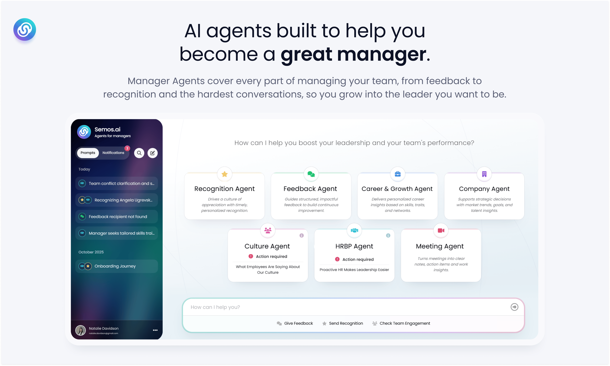
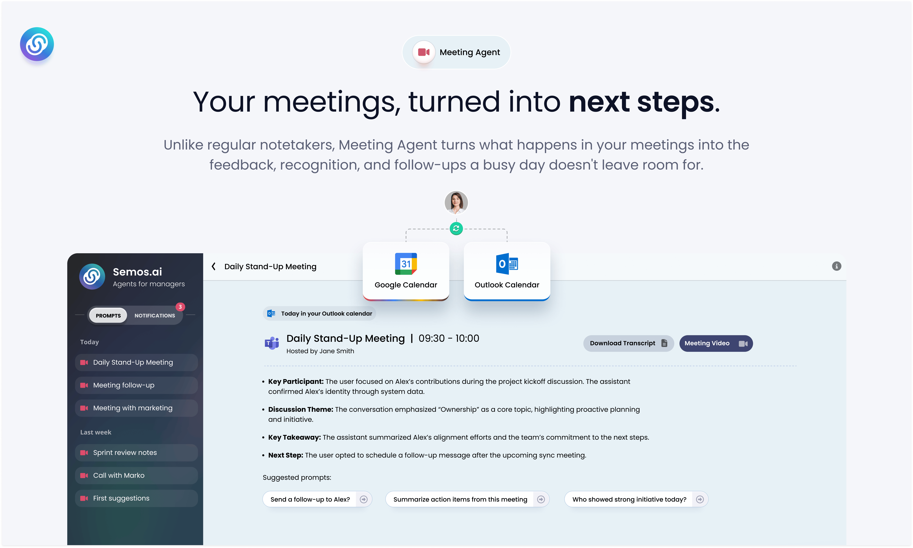
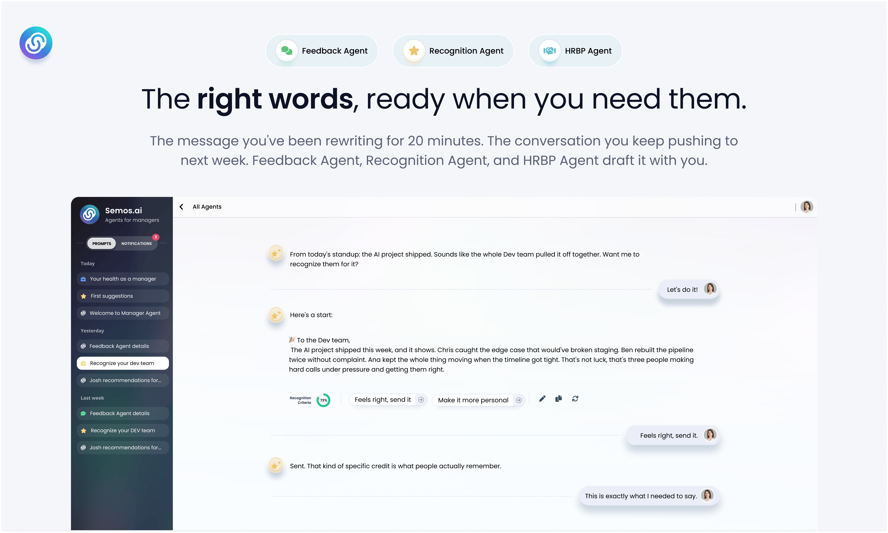

### 🎬 관련 영상
- [🎥 영상 보기](https://ph-files.imgix.net/7ebd7615-82b7-4dc8-ba62-411576018c67.jpeg?auto=format)

---

## 5. [Claude Sonnet 5.5](https://www.producthunt.com/products/claude)
**Votes**: 202 | **도입 난이도**: 하 | **신뢰도**: 상
**Tagline**: Anthropic's second model in the Claude 5.5 family 
**서비스 링크**: https://www.producthunt.com/r/DWZRO527OIEBF6

**태그**: AI, Productivity, Coding, Automation, AI Tool, Design

### 📌 이 서비스 한눈에 보기
더 빠른 속도와 비용 효율성을 갖춘 일상 업무용 AI 모델

### 🔑 주요 기능
- 이전 모델(Sonnet 5) 대비 30% 이상 향상된 속도
- 작업 비용 최대 30% 절감 및 효율적인 비용 구조
- 코딩, 문서 작성, 디자인 등 지식 노동 성능 강화

### 🙋 사용자에게 어떤 점이 좋은가
더 빠른 응답 속도와 낮은 비용으로 코딩 및 문서 작업 등 일상적인 업무 생산성을 높일 수 있습니다.

### ✅ 지금 바로 써볼 기능
- 기존 코딩 작업에 적용하여 속도 차이 확인하기
- 문서 및 슬라이드 생성 작업에 활용하기
- 비용 절감 효과를 위한 워크플로우 최적화하기

### ⚠️ 사용 전 확인할 점
- 이전 모델 대비 구체적인 성능 향상 폭은 작업 유형에 따라 다를 수 있음

### 🧭 확인이 더 필요한 정보
구체적인 API 비용 및 상세 벤치마크 수치는 제공된 정보만으로 확인이 필요합니다.

### 📸 스크린샷 및 갤러리
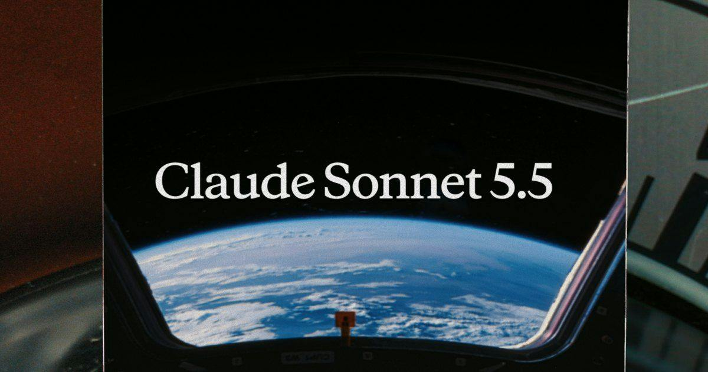
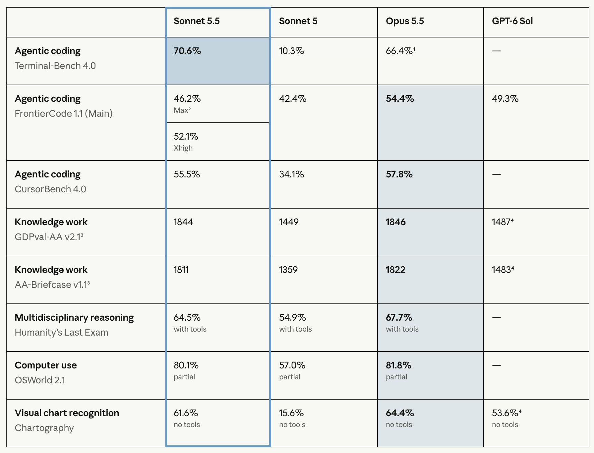
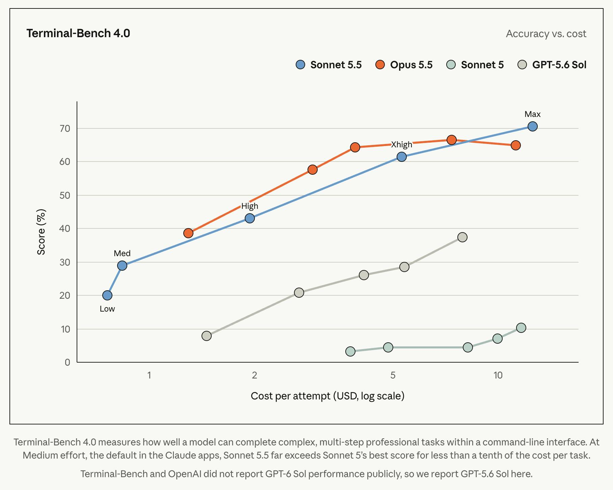

---

## 6. [Paste 7](https://www.producthunt.com/products/paste)
**Votes**: 158 | **도입 난이도**: 하 | **신뢰도**: 상
**Tagline**: Intelligent clipboard that knows what you're about to paste
**서비스 링크**: https://www.producthunt.com/r/IMCXCD4JIOZYCN

**태그**: Productivity, Automation, Mac

### 📌 이 서비스 한눈에 보기
사용자의 작업 맥락을 파악해 다음에 붙여넣을 항목을 미리 제안하는 지능형 클립보드

### 🔑 주요 기능
- 사용자가 복사한 항목을 기억하는 생산성 앱 'Paste'의 신기능
- 현재 작업 중인 맥락을 분석하여 다음에 필요할 항목을 우선 제안
- Apple Intelligence를 기반으로 Mac에서 프라이버시를 유지하며 작동

### 🙋 사용자에게 어떤 점이 좋은가
반복적인 복사-붙여넣기 과정을 줄여주어 작업 흐름을 끊지 않고 생산성을 높일 수 있습니다.

### ✅ 지금 바로 써볼 기능
- 기존 Paste 앱에서 새로운 지능형 클립보드 기능 활성화하기
- 작업 흐름에 따른 자동 제안 기능 테스트하기

### ⚠️ 사용 전 확인할 점
- Apple Intelligence 기반이므로 특정 macOS 버전 및 하드웨어 요구사항 확인 필요
- 사용자의 복사 기록을 기반으로 하므로 개인정보 보호 설정 확인 필요

### 🧭 확인이 더 필요한 정보
Apple Intelligence가 구동되는 구체적인 시스템 요구 사양과 프라이버시 처리 방식에 대한 상세 정보가 필요합니다.

### 📸 스크린샷 및 갤러리

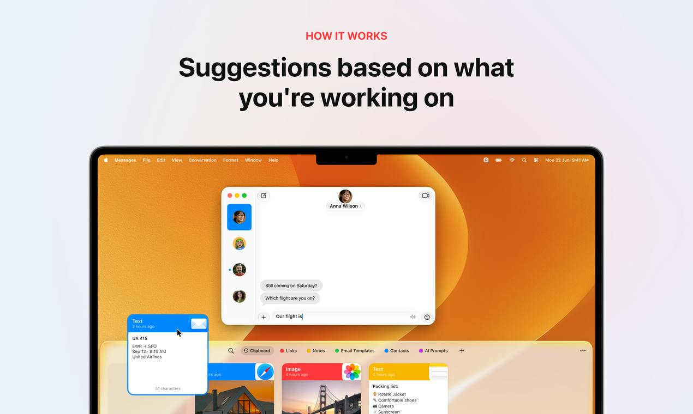
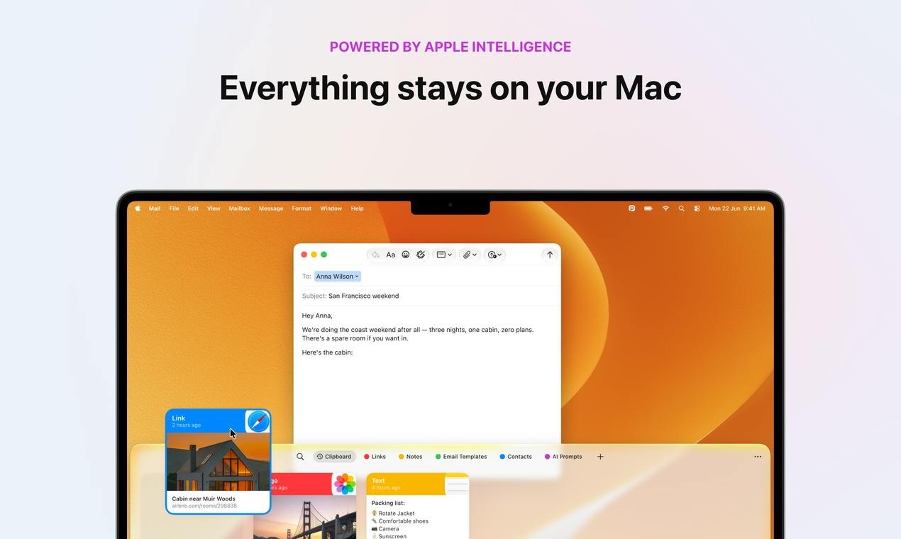

### 🎬 관련 영상
- [🎥 영상 보기](https://ph-files.imgix.net/4101d859-d269-43bd-8e84-f2b37859291d.jpeg?auto=format)

---

## 7. [Hopscotch AI](https://www.producthunt.com/products/hopscotch-7)
**Votes**: 119 | **도입 난이도**: 하 | **신뢰도**: 상
**Tagline**: 500+ AI models available via a single API
**서비스 링크**: https://www.producthunt.com/r/YGFDPVXISG4YPG

**태그**: AI, API, DevTool, Productivity, AI Tool, Prompting

### 📌 이 서비스 한눈에 보기
단일 API로 500개 이상의 다양한 AI 모델을 통합 관리하고 비교할 수 있는 개발자 도구

### 🔑 주요 기능
- OpenAI, Anthropic, Google 등 500개 이상의 모델을 하나의 API로 통합 제공
- 개별 계정 관리나 결제 없이 여러 제공자의 모델을 즉시 사용 가능
- 모델 간 성능 비교, 폴백(fallback) 설정, 통합 사용량 추적 기능 지원

### 🙋 사용자에게 어떤 점이 좋은가
여러 AI 모델을 번갈아 테스트하거나 서비스에 적용해야 할 때, 복잡한 통합 과정 없이 하나의 인터페이스로 효율적인 관리가 가능합니다.

### ✅ 지금 바로 써볼 기능
- PH 전용 코드(HOPSCOTCH50OFF)로 50달러 크레딧 받기
- 단일 API를 통해 다양한 모델의 응답 결과 비교하기
- 서비스 중단을 방지하기 위한 모델 폴백 설정 구성하기

### ⚠️ 사용 전 확인할 점
- 제공자 원가로 이용 가능하다고 하나, 실제 결제 방식과 환율/수수료 적용 여부 확인 필요
- PH 선착순 250명 한정 혜택이므로 가입 시점 확인 필요

### 🧭 확인이 더 필요한 정보
제공자 원가 결제 방식이 사용자에게 직접 청구되는 방식인지, 별도의 환전/수수료가 발생하는지 명확한 확인이 필요합니다.

### 📸 스크린샷 및 갤러리
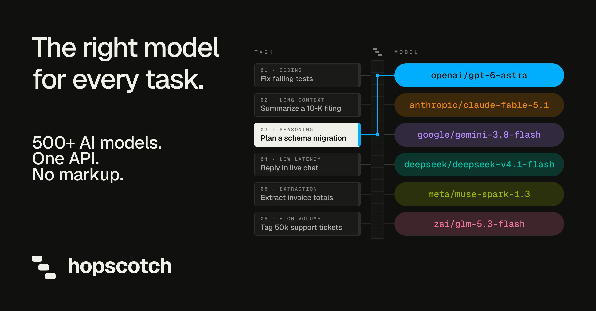
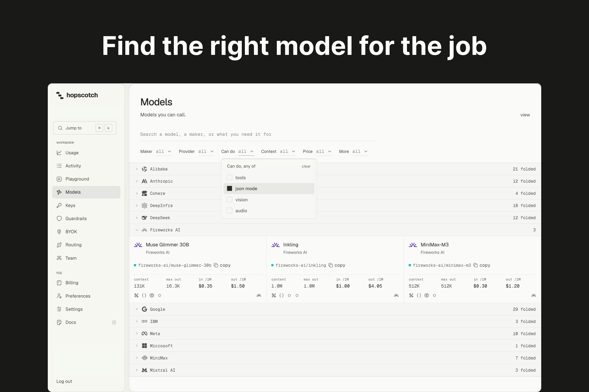
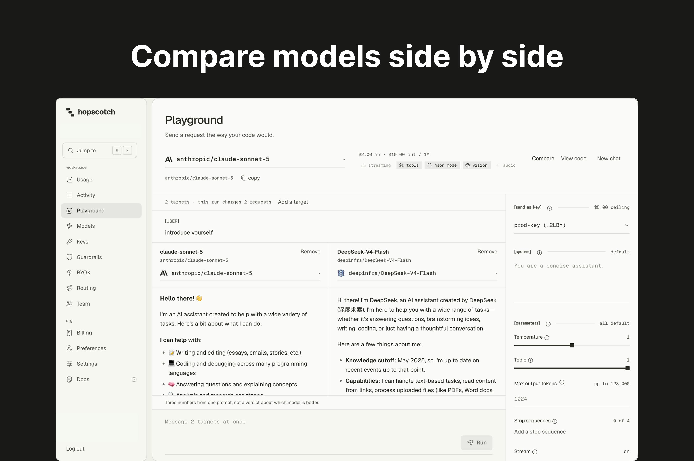

### 🎬 관련 영상
- [🎥 영상 보기](https://ph-files.imgix.net/4e0575bb-fd90-4931-9c40-db521240856d.jpeg?auto=format)

---

## 8. [Timeless Code](https://www.producthunt.com/products/timeos)
**Votes**: 116 | **도입 난이도**: 하 | **신뢰도**: 상
**Tagline**: Meeting notetaker that installs and runs inside Claude Code
**서비스 링크**: https://www.producthunt.com/r/M7DFF5NRZNCIFP

**태그**: DevTool, AI, Productivity, Automation, AI Tool

### 📌 이 서비스 한눈에 보기
터미널 환경을 벗어나지 않고 Claude Code 내에서 바로 사용하는 AI 회의 기록 도구

### 🔑 주요 기능
- Claude Code 환경 내에 직접 설치 및 실행되는 독특한 워크플로우
- 터미널을 떠나지 않고 회의 녹음 및 질의응답 가능
- Claude가 초기 설정을 자동으로 수행하는 간편한 설치 과정

### 🙋 사용자에게 어떤 점이 좋은가
개발자가 터미널 작업 흐름을 끊지 않고도 회의 내용을 기록하고 질문할 수 있어 업무 연속성을 유지해 줍니다.

### ✅ 지금 바로 써볼 기능
- Claude Code 환경에 설치하여 터미널 연동 확인하기
- 실제 회의 녹음 및 텍스트 추출 기능 테스트하기
- 녹음된 내용에 대한 터미널 기반 질의응답 시도하기

### ⚠️ 사용 전 확인할 점
- Claude Code 환경에 대한 사전 지식 필요
- 터미널 기반 도구이므로 GUI 기반의 시각적 회의록 확인은 제한적일 수 있음

### 🧭 확인이 더 필요한 정보
Claude Code 외의 다른 IDE나 터미널 환경에서의 호환성 여부는 명시되지 않았습니다.

### 📸 스크린샷 및 갤러리

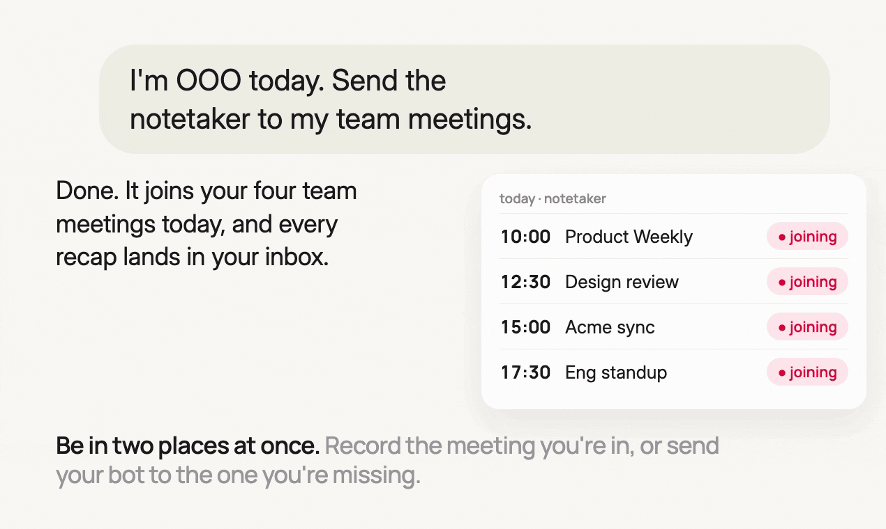
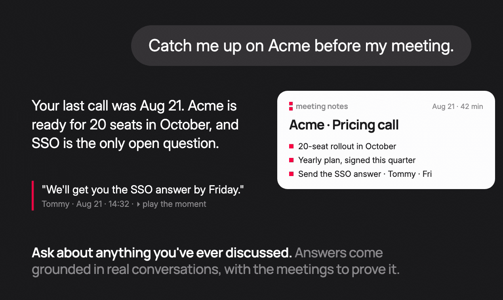

### 🎬 관련 영상
- [🎥 영상 보기](https://ph-files.imgix.net/5acb97d7-a341-47cf-9ca3-b7f1540e2b8e.jpeg?auto=format)

---

## 9. [Pokébinder](https://www.producthunt.com/products/pokebinder)
**Votes**: 108 | **도입 난이도**: 하 | **신뢰도**: 상
**Tagline**: Plan your Pokémon binder, then print what's missing
**서비스 링크**: https://www.producthunt.com/r/C2IJKDIYIKXVKU

**태그**: CollectorTool, Planner, Printable

### 📌 이 서비스 한눈에 보기
나만의 포켓몬 카드 바인더를 설계하고 부족한 카드를 위한 실물 크기 플레이스홀더를 출력하는 플래너

### 🔑 주요 기능
- 40,000장 이상의 영문 및 일문 카드 데이터베이스 검색 기능
- 3×3 페이지 레이아웃 및 배경 아트 커스텀 설계 가능
- 미소유 카드를 위한 실물 크기 플레이스홀더 출력 지원

### 🙋 사용자에게 어떤 점이 좋은가
수집 중인 카드의 배치 계획을 시각적으로 미리 구성하고, 빈 공간을 채울 가이드지를 출력하여 물리적 바인더 구성을 효율적으로 도와줍니다.

### ✅ 지금 바로 써볼 기능
- 보유 중인 카드 검색 및 페이지 레이아웃 구성하기
- 커스텀 배경 아트를 적용하여 페이지 디자인하기
- 부족한 카드를 위한 플레이스홀더 출력하기

### ⚠️ 사용 전 확인할 점
- 계정 없이 브라우저에 저장되므로 브라우저 캐시 삭제 시 데이터가 사라질 수 있음
- 실물 출력 시 종이 재질이나 프린터 설정에 따라 크기 오차가 발생할 수 있음

### 🧭 확인이 더 필요한 정보
브라우저 저장 방식이 로컬 스토리지 기반인지, 기기 변경 시 데이터 이전이 가능한지 확인이 필요합니다.

### 📸 스크린샷 및 갤러리
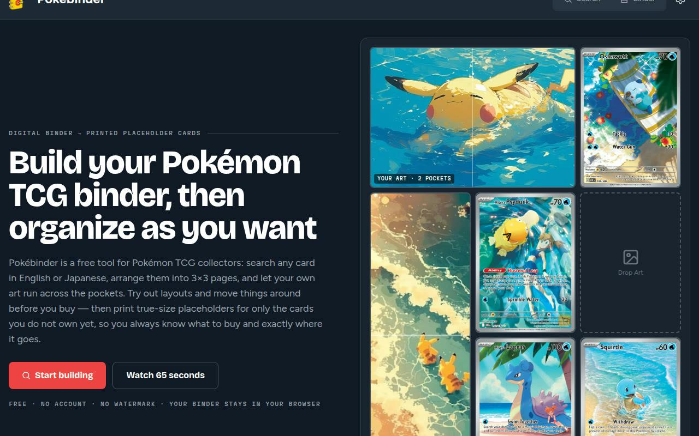

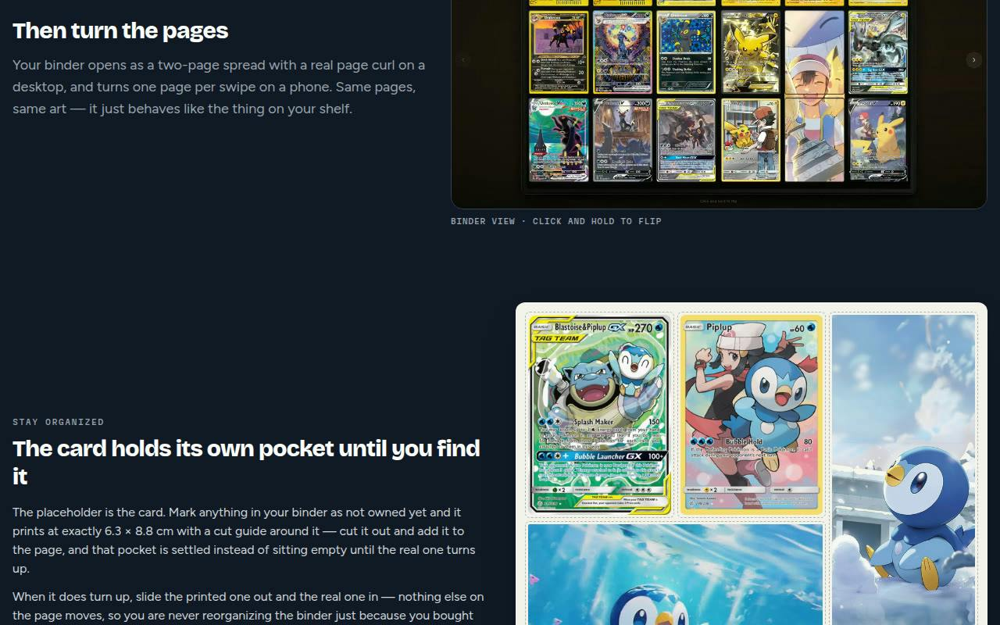

### 🎬 관련 영상
- [🎥 영상 보기](https://ph-files.imgix.net/4d29dc9f-5293-4ba8-b2ee-1f02b3807a39.jpeg?auto=format)

---

## 10. [Would you pay?](https://www.producthunt.com/products/would-you-pay)
**Votes**: 101 | **도입 난이도**: 하 | **신뢰도**: 상
**Tagline**: Find out who'd pay before you build more
**서비스 링크**: https://www.producthunt.com/r/KP6AKRML6U6EGS

**태그**: Startup, Market-Validation, Analytics, Product-Market-Fit, AI Tool

### 📌 이 서비스 한눈에 보기
제품 개발 전, 실제 잠재 고객의 결제 의사를 미리 확인하는 시장 검증 도구

### 🔑 주요 기능
- 아이디어 단계에서 실제 결제 의사가 있는 사용자를 매칭
- 결제 의사 비율, 사용자 프로필, 클릭률 등 핵심 데이터 제공
- 개발 리소스 낭비를 방지하기 위한 사전 검증 프로세스 제공

### 🙋 사용자에게 어떤 점이 좋은가
제품을 직접 만들기 전에 시장성을 검증하여 실패 비용을 최소화할 수 있습니다.

### ✅ 지금 바로 써볼 기능
- 아이디어/프로토타입 등록하기
- 잠재 고객의 결제 의사 비율 확인하기
- 클릭 및 유입 사용자 데이터 분석하기

### ⚠️ 사용 전 확인할 점
- 실제 결제가 아닌 '의사 표현' 단계이므로 실제 매출과 차이가 있을 수 있음
- 표본 크기에 따라 데이터의 신뢰도가 달라질 수 있음

### 🧭 확인이 더 필요한 정보
사용자 매칭 알고리즘 및 유입되는 타겟 고객의 질에 대한 구체적인 정보가 필요합니다.

### 📸 스크린샷 및 갤러리

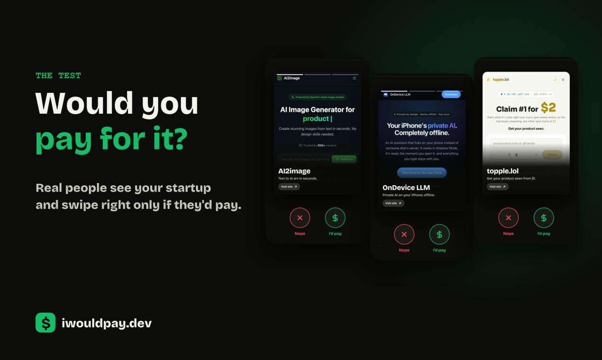
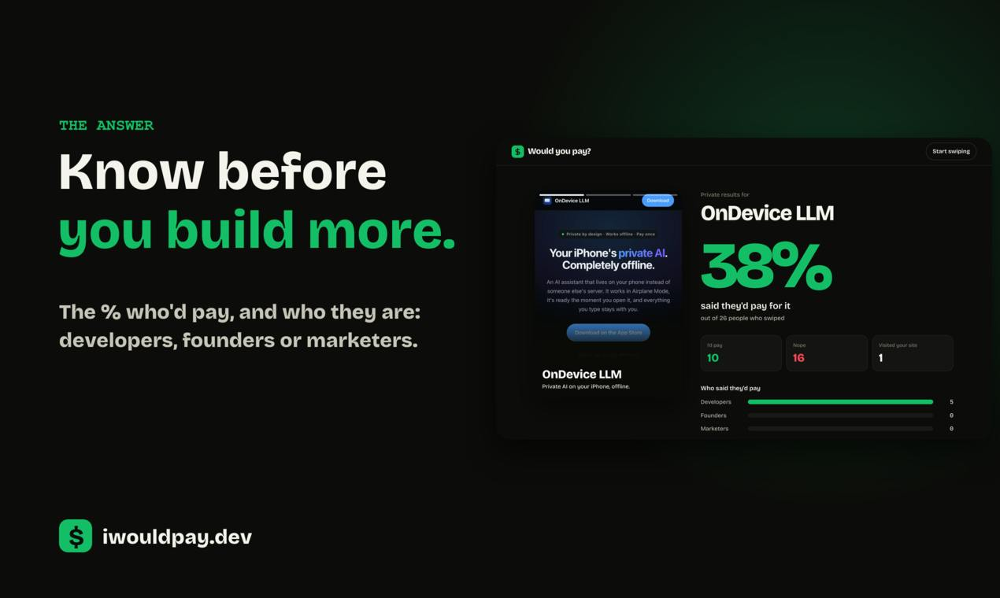

### 🎬 관련 영상
- [🎥 영상 보기](https://ph-files.imgix.net/0187e220-ed0b-42b8-9be2-ca78216c6ce1.jpeg?auto=format)

---

## 11. [Jotform Sign for ChatGPT and Claude](https://www.producthunt.com/products/jotform)
**Votes**: 101 | **도입 난이도**: 하 | **신뢰도**: 상
**Tagline**: Create, send, and sign documents in ChatGPT and Claude
**서비스 링크**: https://www.producthunt.com/r/AQ25I4L5Y4UMW6

**태그**: Productivity, AI, Automation, Workflow, e-Signature, AI Tool, Chat, Prompting

### 📌 이 서비스 한눈에 보기
AI 채팅창을 떠나지 않고 즉시 문서를 생성하고 전자 서명을 완료하는 워크플로우 통합 도구

### 🔑 주요 기능
- ChatGPT 및 Claude 환경 내에서 문서 생성 및 전자 서명 기능 제공
- 프롬프트 입력 또는 파일 업로드를 통한 서명용 문서 즉시 제작
- 수신자 관리, 서명 순서 지정 및 진행 상황 추적 기능 통합

### 🙋 사용자에게 어떤 점이 좋은가
AI로 작업하던 흐름을 끊지 않고 문서 작성부터 서명까지 한 곳에서 해결하여 업무 전환 비용을 획기적으로 줄여줍니다.

### ✅ 지금 바로 써볼 기능
- 프롬프트로 서명용 문서 초안 생성하기
- 기존 파일을 업로드하여 서명 필드 편집하기
- AI 채팅창 내에서 서명 요청 및 진행 상태 확인하기

### ⚠️ 사용 전 확인할 점
- 기존 Jotform Sign 계정과의 연동 및 데이터 동기화 확인 필요
- 복잡한 문서 양식의 경우 별도의 편집 도구로의 전환이 필요할 수 있음

### 🧭 확인이 더 필요한 정보
기존 Jotform Sign 사용자들의 워크플로우 관리 범위와 상세 연동 방식에 대한 구체적인 정보가 필요합니다.

### 📸 스크린샷 및 갤러리
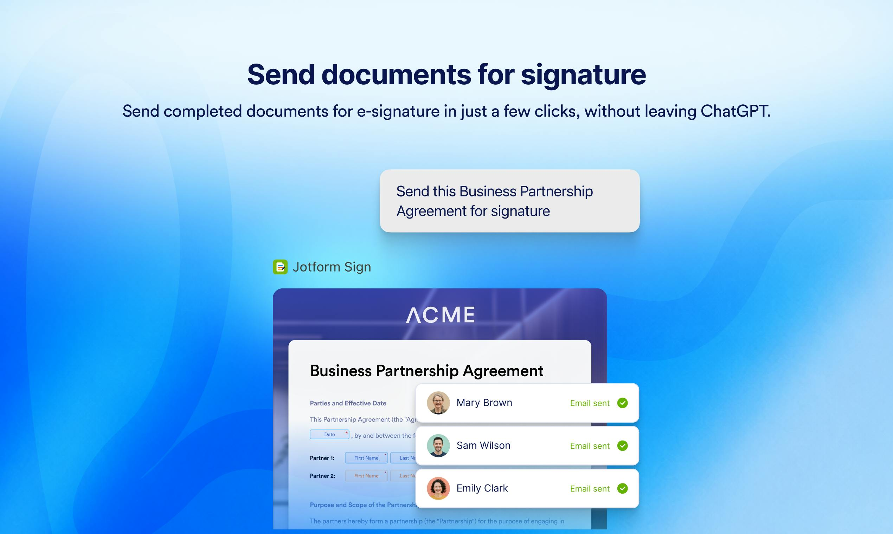
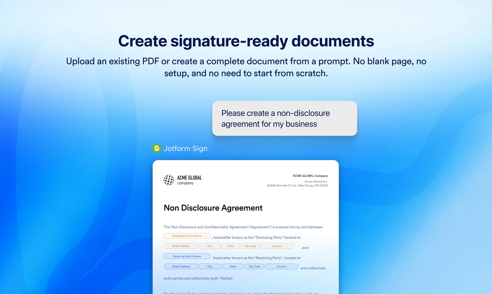
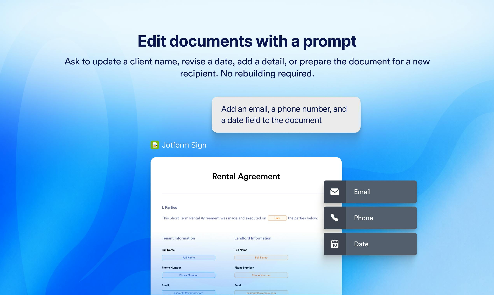

---

## 12. [Engine Room Media](https://www.producthunt.com/products/engine-room-media)
**Votes**: 96 | **도입 난이도**: 하 | **신뢰도**: 상
**Tagline**: We Run The Numbers. You Run The Show.
**서비스 링크**: https://www.producthunt.com/r/RIRMVCSYWYJ4VM

**태그**: CreatorTools, Analytics, MediaKit, Growth

### 📌 이 서비스 한눈에 보기
여러 플랫폼의 분석 데이터와 미디어 키트를 하나로 통합 관리하는 크리에이터 전용 대시보드

### 🔑 주요 기능
- YouTube, Instagram, TikTok 등 주요 플랫폼 데이터 통합 관리
- 미디어 키트 및 광고 단가표(Rate Cards) 자동화
- 데이터 기반 인사이트 및 브랜드 협업 기회 제공

### 🙋 사용자에게 어떤 점이 좋은가
여러 플랫폼의 성과를 일일이 확인하는 번거로움을 줄이고, 브랜드 협업을 위한 전문적인 데이터 자료를 즉시 준비할 수 있습니다.

### ✅ 지금 바로 써볼 기능
- 주요 소셜 미디어 계정 연동하기
- 통합 대시보드에서 성장 지표 확인하기
- 브랜드 제안용 미디어 키트 생성하기

### ⚠️ 사용 전 확인할 점
- 플랫폼별 데이터 동기화 정확도 확인 필요
- 개인정보 및 계정 접근 권한 설정 검토

### 🧭 확인이 더 필요한 정보
지원하는 플랫폼의 상세 기능 범위와 데이터 업데이트 주기에 대한 정보가 추가로 필요합니다.

### 📸 스크린샷 및 갤러리

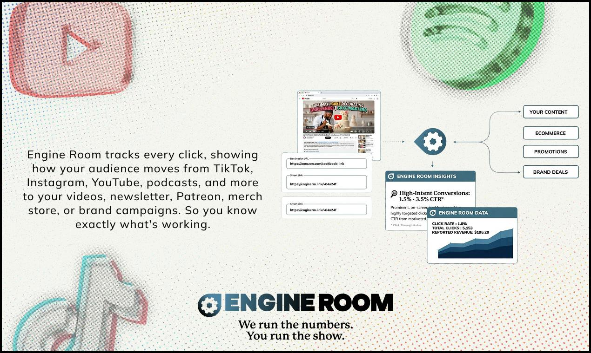
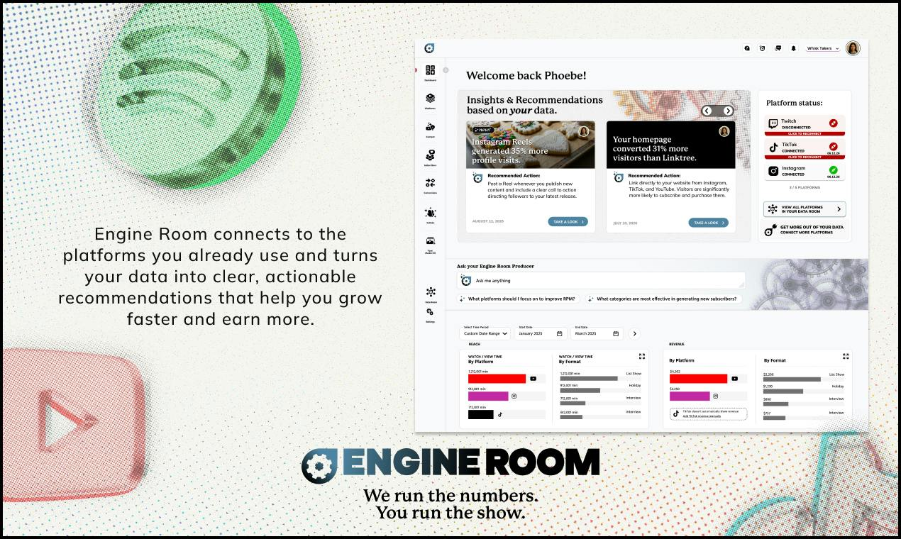

### 🎬 관련 영상
- [🎥 영상 보기](https://ph-files.imgix.net/a4d7137c-4d01-4de7-9823-cedba1d3b3eb.jpeg?auto=format)

---

## 13. [Curie](https://www.producthunt.com/products/curie-4)
**Votes**: 95 | **도입 난이도**: 하 | **신뢰도**: 상
**Tagline**: Assistant for scientific literature and document analysis.
**서비스 링크**: https://www.producthunt.com/r/QQU43VQCPVEM4Q

**태그**: AI, Research, Science, Automation, Productivity, AI Tool, Chat

### 📌 이 서비스 한눈에 보기
검증된 출처를 바탕으로 과학적 문헌 조사와 체계적 문헌 고찰을 돕는 AI 연구 어시스턴트

### 🔑 주요 기능
- PubMed, arXiv 등 주요 학술 데이터베이스의 병렬 검색 지원
- 모든 주장을 원문과 대조하여 검증하는 근거 중심의 답변 제공
- 문서 내 구조화된 데이터 추출 및 체계적 문헌 고찰(PRISMA 등) 워크플로우 지원

### 🙋 사용자에게 어떤 점이 좋은가
일반 챗봇의 환각 현상 걱정 없이, 신뢰할 수 있는 출처를 바탕으로 연구 및 논문 작성 시간을 획기적으로 단축할 수 있습니다.

### ✅ 지금 바로 써볼 기능
- 학술 데이터베이스 병렬 검색 기능 테스트
- 문서 업로드 후 데이터 추출 및 인용 확인
- 체계적 문헌 고찰 워크플로우 실행

### ⚠️ 사용 전 확인할 점
- AI가 생성한 최종 결론에 대한 연구자의 최종 검토 필수
- 데이터베이스 접근 권한에 따른 검색 결과의 제한 가능성

### 🧭 확인이 더 필요한 정보
구체적인 요금 체계와 데이터베이스 접근 권한 범위에 대한 정보가 명시되지 않았습니다.

### 📸 스크린샷 및 갤러리
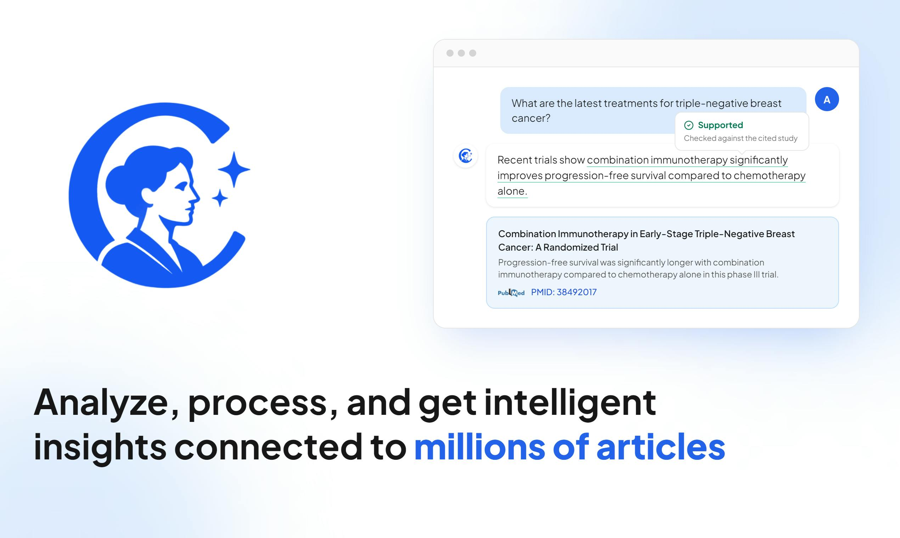
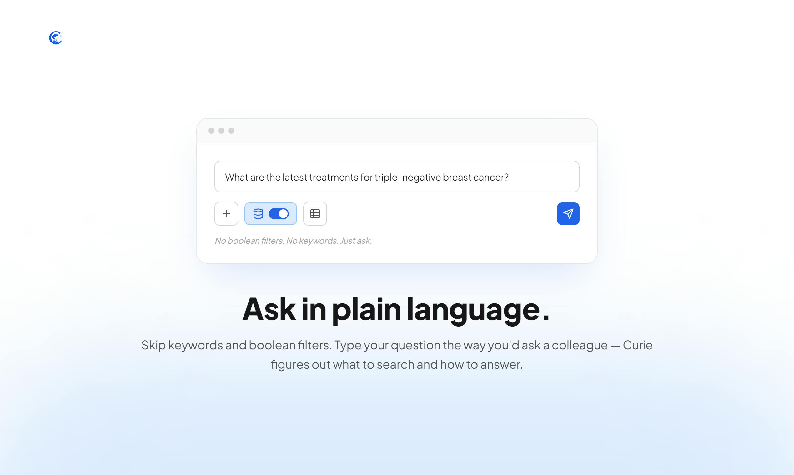
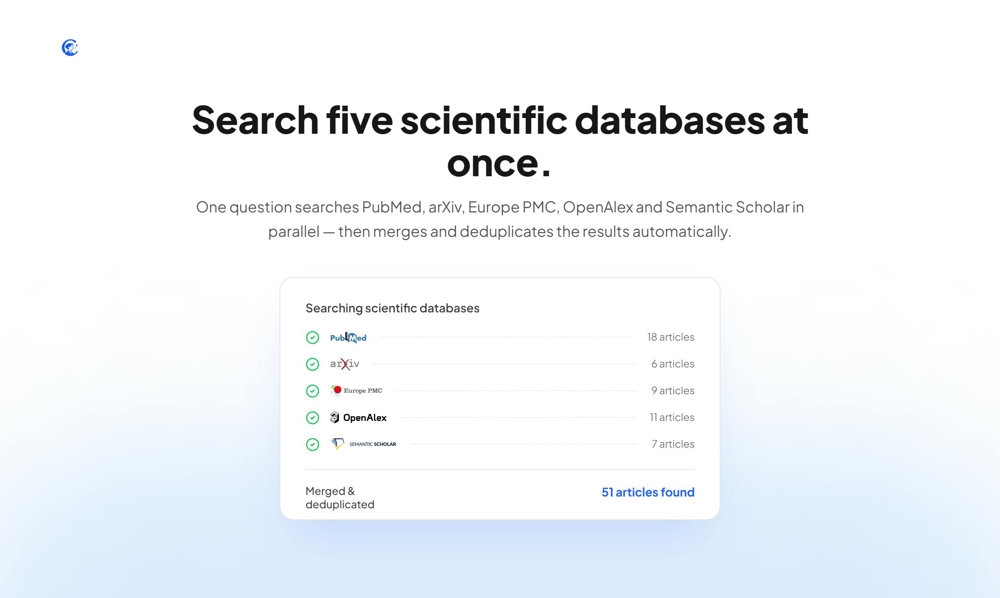

### 🎬 관련 영상
- [🎥 영상 보기](https://ph-files.imgix.net/1b0311d7-f2a0-4de7-9a5d-f57eedaea5fa.jpeg?auto=format)

---

## 14. [Arsaze](https://www.producthunt.com/products/arsaze-ai-native-video-editor)
**Votes**: 94 | **도입 난이도**: 중 | **신뢰도**: 상
**Tagline**: Let Claude, ChatGPT or Gemini edit your real timeline 
**서비스 링크**: https://www.producthunt.com/r/DA4DDJ5OBTY76T

**태그**: VideoEditing, AI-Agent, Automation, CreativeTool, Agent, AI Tool, Chat, Video

### 📌 이 서비스 한눈에 보기
AI 에이전트와 인간이 협업하여 실시간으로 편집하는 차세대 멀티트랙 비디오 편집 도구

### 🔑 주요 기능
- Claude, ChatGPT, Gemini 등 AI 모델과 연동되는 실시간 타임라인 제공
- 인간과 AI 에이전트가 동시에 제어 가능한 멀티트랙 편집 환경
- AI 비디오 생성 및 에이전트 기반 자동 편집 기능 통합

### 🙋 사용자에게 어떤 점이 좋은가
사용자는 복잡한 편집 과정을 AI에게 맡기거나 대화형 명령으로 빠르게 작업할 수 있어, 영상 제작의 생산성을 극대화할 수 있습니다.

### ✅ 지금 바로 써볼 기능
- AI 에이전트에게 자연어로 편집 명령 내려보기
- 멀티트랙 타임라인에서 AI와 협업 편집 시도하기
- AI 비디오 생성 기능을 활용한 초안 제작하기

### ⚠️ 사용 전 확인할 점
- AI 에이전트의 편집 결과물이 사용자의 의도와 다를 수 있음
- LLM(Claude, ChatGPT 등) 연동 시 외부 API 사용에 따른 비용 발생 가능성

### 🧭 확인이 더 필요한 정보
구체적인 MCP(Model Context Protocol) 지원 범위와 외부 AI 모델과의 실시간 동기화 안정성을 확인해야 합니다.

### 📸 스크린샷 및 갤러리

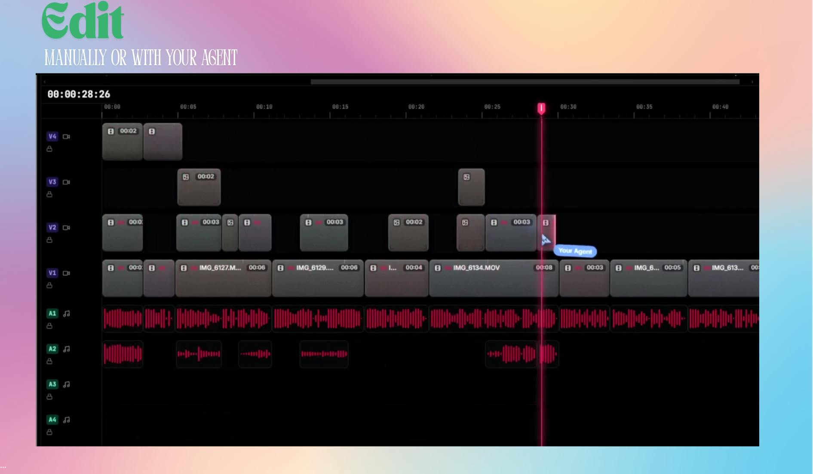
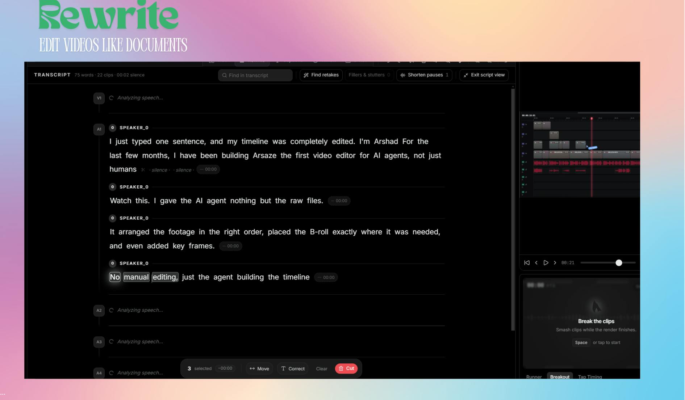

### 🎬 관련 영상
- [🎥 영상 보기](https://ph-files.imgix.net/b2048dfa-79c1-4a76-b987-c81f41d9a249.jpeg?auto=format)

---

## 15. [Imejis.io](https://www.producthunt.com/products/imejis-io)
**Votes**: 88 | **도입 난이도**: 하 | **신뢰도**: 상
**Tagline**: Give your agent a design studio to automate your marketing
**서비스 링크**: https://www.producthunt.com/r/PMTD4ISLRX546I

**태그**: AI-Agent, Automation, Design-Tool, Marketing-Automation, Agent, AI Tool, Chat, Vision, Design, DevTool, Marketing

### 📌 이 서비스 한눈에 보기
AI 에이전트에게 디자인 스튜디오를 제공하여 마케팅 그래픽 제작을 자동화하는 도구

### 🔑 주요 기능
- MCP를 통해 Claude, ChatGPT 등 AI 에이전트와 연동되는 디자인 스튜디오
- 생성형 모델과 달리 동일한 입력에 동일한 픽셀을 출력하는 결정론적(Deterministic) 방식
- OG 이미지, 소셜 카드, 차트, QR 코드 등 브랜드 일관성이 중요한 그래픽 제작에 최적화

### 🙋 사용자에게 어떤 점이 좋은가
AI 에이전트가 텍스트뿐만 아니라 브랜드 가이드라인을 준수하는 고품질 이미지를 직접 생성하고 배포할 수 있게 해줍니다.

### ✅ 지금 바로 써볼 기능
- AI 에이전트(Claude, ChatGPT 등)에 MCP로 연결하기
- 브랜드 일관성이 필요한 OG 이미지 및 소셜 카드 생성해보기
- 데이터 시각화 및 차트 자동 생성 테스트하기

### ⚠️ 사용 전 확인할 점
- 생성형 AI(Stable Diffusion 등)와 달리 예술적 화풍보다는 레이아웃과 데이터 중심의 작업에 특화됨
- 에이전트 연동을 위한 MCP 설정 지식이 필요할 수 있음

### 🧭 확인이 더 필요한 정보
사용자별 맞춤형 템플릿 커스터마이징 범위와 상세 가격 정책에 대한 정보가 부족합니다.

### 📸 스크린샷 및 갤러리
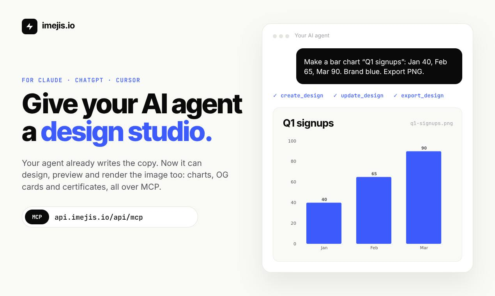
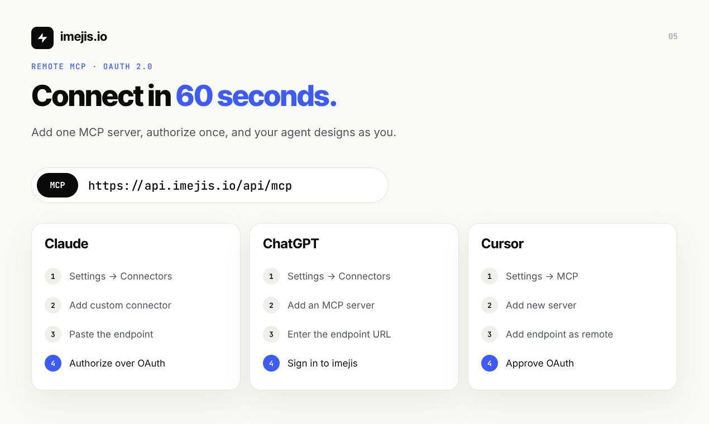
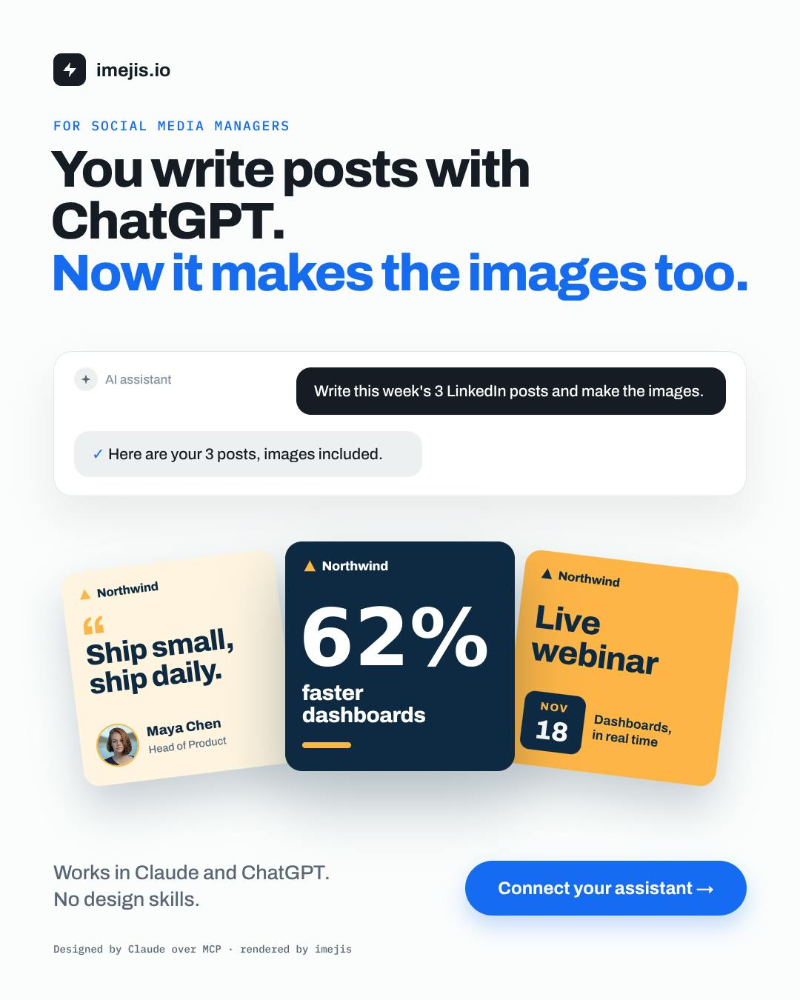

### 🎬 관련 영상
- [🎥 영상 보기](https://ph-files.imgix.net/ab803f42-abd6-4f5c-beb2-64bcd067b63c.jpeg?auto=format)

---

## 16. [Gladys Assistant 5](https://www.producthunt.com/products/gladys-assistant)
**Votes**: 85 | **도입 난이도**: 중 | **신뢰도**: 상
**Tagline**: Private, self-hosted smart home, no YAML required
**서비스 링크**: https://www.producthunt.com/r/HN76RYYRIVSURP

**태그**: SmartHome, OpenSource, Privacy, Automation

### 📌 이 서비스 한눈에 보기
복잡한 설정 없이 내 기기에서 직접 구동하는 프라이빗 스마트 홈 플랫폼

### 🔑 주요 기능
- Zigbee, Z-Wave, Matter 등 다양한 프로토콜 및 90개 이상의 통합 지원
- YAML 설정 파일 없이 직관적으로 사용할 수 있는 사용자 친화적 환경
- 로컬 실행 방식으로 인터넷 연결이 끊겨도 안정적인 스마트 홈 제어 가능

### 🙋 사용자에게 어떤 점이 좋은가
개인 정보 보호를 위해 클라우드가 아닌 로컬 환경에서 스마트 홈을 구축하고 싶은 사용자에게 최적입니다.

### ✅ 지금 바로 써볼 기능
- 미니 PC나 라즈베리 파이에 설치하기
- 기존 스마트 홈 기기 연결 및 대시보드 구성하기
- 모바일 우선 대시보드로 원격 제어 환경 구축하기

### ⚠️ 사용 전 확인할 점
- 하드웨어(미니 PC, 라즈베리 파이 등)를 직접 관리하고 유지보수해야 함
- 로컬 서버 환경에 대한 기본적인 네트워크 지식 필요

### 🧭 확인이 더 필요한 정보
사용자의 기존 하드웨어 사양에 따른 성능 차이를 확인해야 합니다.

### 📸 스크린샷 및 갤러리
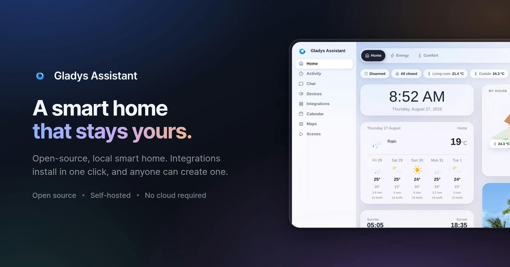
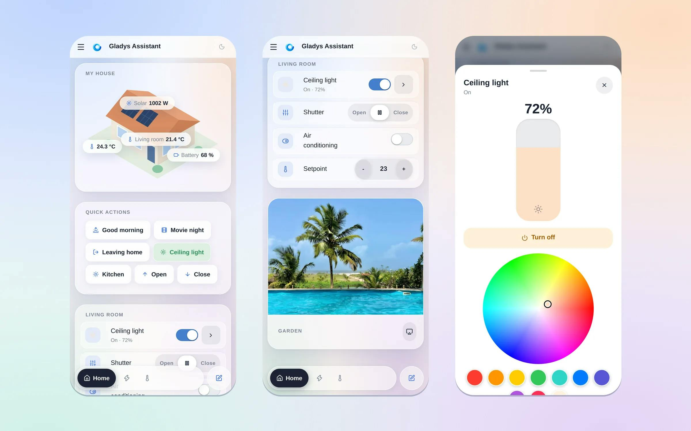
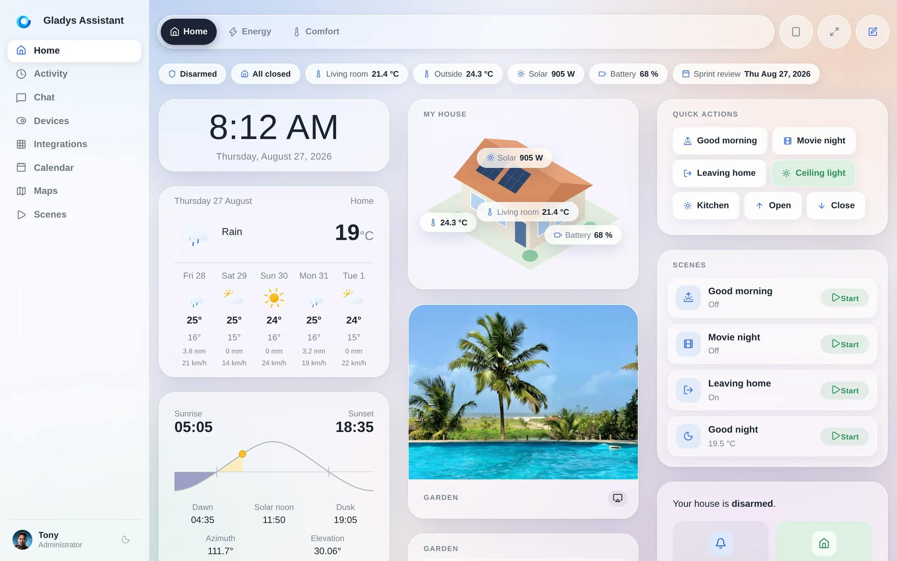

---

## 17. [Declutr](https://www.producthunt.com/products/declutr)
**Votes**: 83 | **도입 난이도**: 하 | **신뢰도**: 상
**Tagline**: Tidy your Mac's desktop and downloads in one click
**서비스 링크**: https://www.producthunt.com/r/G2GZW5VSSTNOQL

**태그**: Productivity, macOS, Automation, Organization, AI Tool, Video, Vision, DevTool

### 📌 이 서비스 한눈에 보기
클릭 한 번으로 맥의 바탕화면과 다운로드 폴더를 파일 유형별로 자동 정리해주는 도구

### 🔑 주요 기능
- 파일 유형별(이미지, 문서, 비디오 등) 자동 분류 기능
- 실수를 방지하는 원클릭 실행 취소(Undo) 기능
- 스마트 규칙(이름, 확장자, 크기 등) 및 자동 감시 폴더 지원

### 🙋 사용자에게 어떤 점이 좋은가
지저분한 데스크탑과 다운로드 폴더를 수동 정리할 필요 없이 즉각적으로 깔끔하게 관리할 수 있습니다.

### ✅ 지금 바로 써볼 기능
- 기본 무료 기능을 사용하여 파일 분류 테스트하기
- Smart Rules를 설정하여 파일 크기나 생성 날짜별로 자동 정리하기
- Watch Folders 기능을 통해 새 파일이 들어올 때 실시간 정리하기

### ⚠️ 사용 전 확인할 점
- Pro 버전(일회성 결제 $8.99) 사용 시 고급 규칙 및 자동화 기능 활용 가능
- AI가 아닌 규칙 기반이므로 파일 내용 기반의 정교한 분류는 제한적임

### 🧭 확인이 더 필요한 정보
Pro 버전의 모든 기능이 모든 macOS 버전에서 완벽하게 호환되는지 확인이 필요합니다.

### 📸 스크린샷 및 갤러리
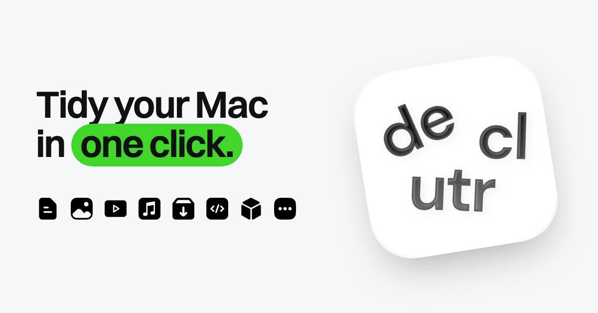
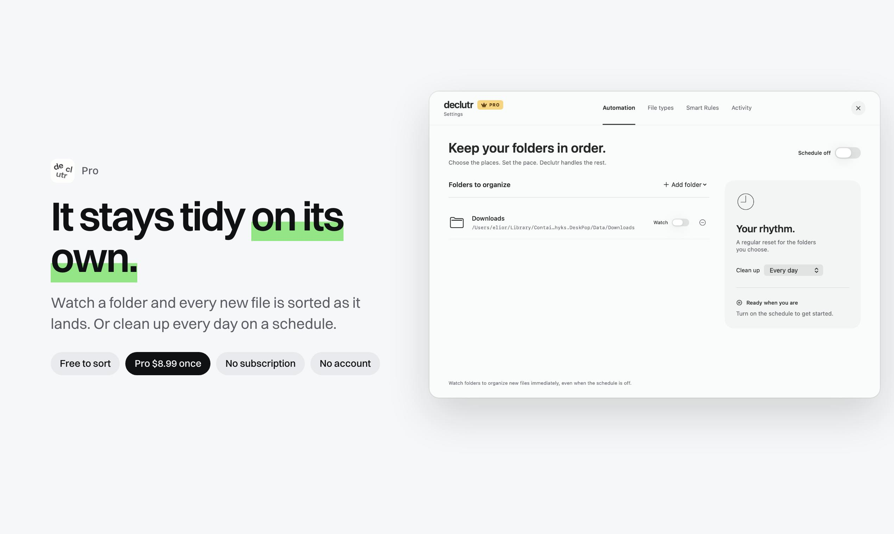
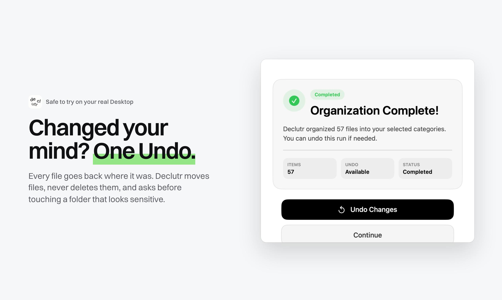

### 🎬 관련 영상
- [🎥 영상 보기](https://ph-files.imgix.net/0adbeec5-e7fe-4619-8954-230fd4b6e5c2.jpeg?auto=format)

---

## 18. [Supertake](https://www.producthunt.com/products/supertake)
**Votes**: 83 | **도입 난이도**: 하 | **신뢰도**: 상
**Tagline**: AI that turn your ideas into real investments
**서비스 링크**: https://www.producthunt.com/r/P6QDTD72MG7PVH

**태그**: AI, FinTech, Automation, Investment, Agent, AI Tool

### 📌 이 서비스 한눈에 보기
자연어로 아이디어를 말하면 AI가 맞춤형 투자 포트폴리오를 만들고 거래까지 실행합니다.

### 🔑 주요 기능
- 자연어 기반의 직관적인 투자 전략 수립
- AI 에이전트를 통한 자동 포트폴리오 생성 및 거래 실행
- Robinhood, Coinbase 등 기존 브로커리지 연동 지원

### 🙋 사용자에게 어떤 점이 좋은가
복잡한 금융 지식 없이도 자신의 신념과 아이디어를 즉시 실질적인 투자 포트폴리오로 전환할 수 있습니다.

### ✅ 지금 바로 써볼 기능
- 자신의 투자 철학을 자연어로 입력해보기
- 생성된 포트폴리오 구성 확인하기
- 기존 브로커리지 계정 연동하기

### ⚠️ 사용 전 확인할 점
- AI 에이전트의 자동 거래로 인한 자산 변동성 위험
- 연동된 브로커리지 계정의 보안 및 권한 관리 필요

### 🧭 확인이 더 필요한 정보
AI가 생성한 포트폴리오의 수익률 검증 및 리스크 관리 메커니즘에 대한 상세 정보가 필요합니다.

### 📸 스크린샷 및 갤러리
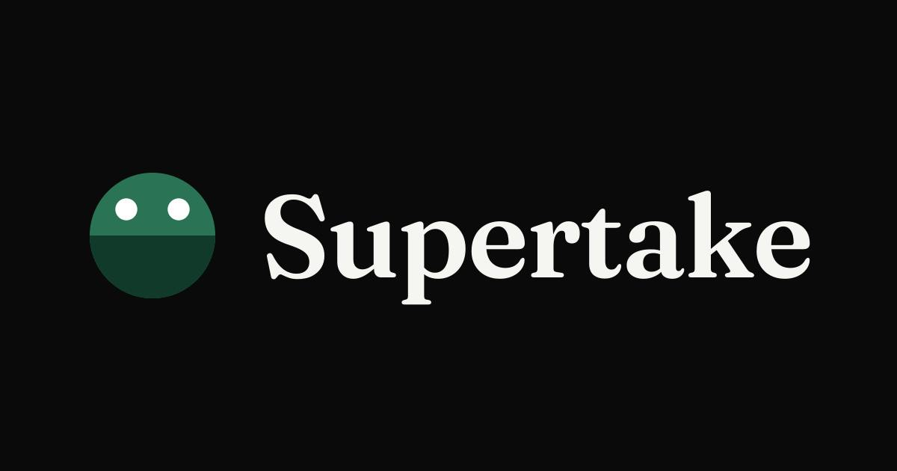
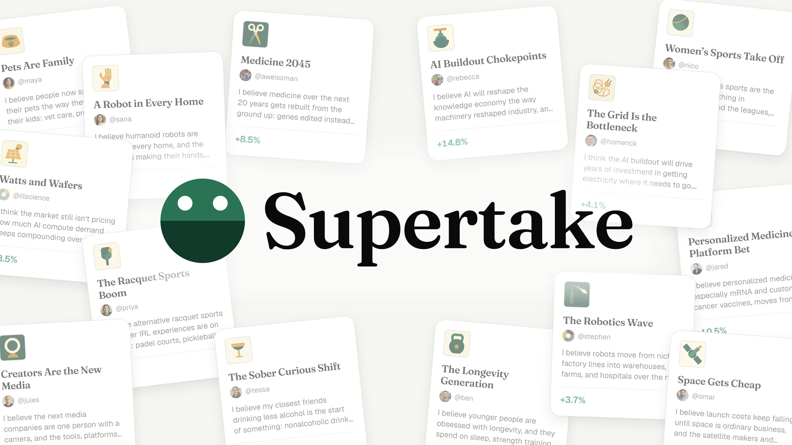

### 🎬 관련 영상
- [🎥 영상 보기](https://ph-files.imgix.net/55e4bd3f-116d-4312-9fcf-7bbd76deaa7b.jpeg?auto=format)

---

## 19. [Clink](https://www.producthunt.com/products/clink-custom-keyboards)
**Votes**: 81 | **도입 난이도**: 하 | **신뢰도**: 상
**Tagline**: The iOS keyboard you actually own
**서비스 링크**: https://www.producthunt.com/r/QJP55HSSZZKN2B

**태그**: iOS, Customization, Productivity, Mobile

### 📌 이 서비스 한눈에 보기
개인 맞춤형 테마와 브랜드 협업이 결합된 프라이버시 중심의 iOS 키보드

### 🔑 주요 기능
- 사용자가 직접 제어하는 테마, 레이아웃 및 도구 제공
- 인디 앱 및 브랜드가 공존하는 새로운 플랫폼 형태
- 개인정보 보호에 중점을 둔 설계 및 향후 안드로이드 확장 계획

### 🙋 사용자에게 어떤 점이 좋은가
자신만의 스타일로 키보드를 꾸미면서도, 신뢰할 수 있는 브랜드의 도구를 타이핑 환경에 통합할 수 있습니다.

### ✅ 지금 바로 써볼 기능
- 나만의 커스텀 테마 설정하기
- 제공되는 레이아웃 및 도구 탐색하기
- 파트너 브랜드의 기능 활용해보기

### ⚠️ 사용 전 확인할 점
- 서드파티 키보드 사용에 따른 개인정보 보안 정책 확인 필요
- 현재 iOS 전용이며 안드로이드는 출시 예정임

### 🧭 확인이 더 필요한 정보
파트너 브랜드가 제공하는 기능이 사용자의 타이핑 데이터에 미치는 영향 범위를 확인해야 합니다.

### 📸 스크린샷 및 갤러리
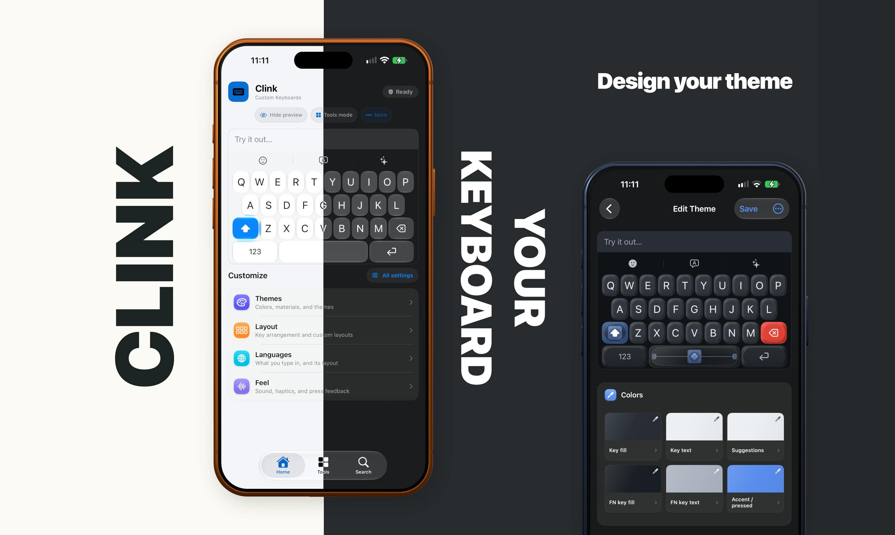
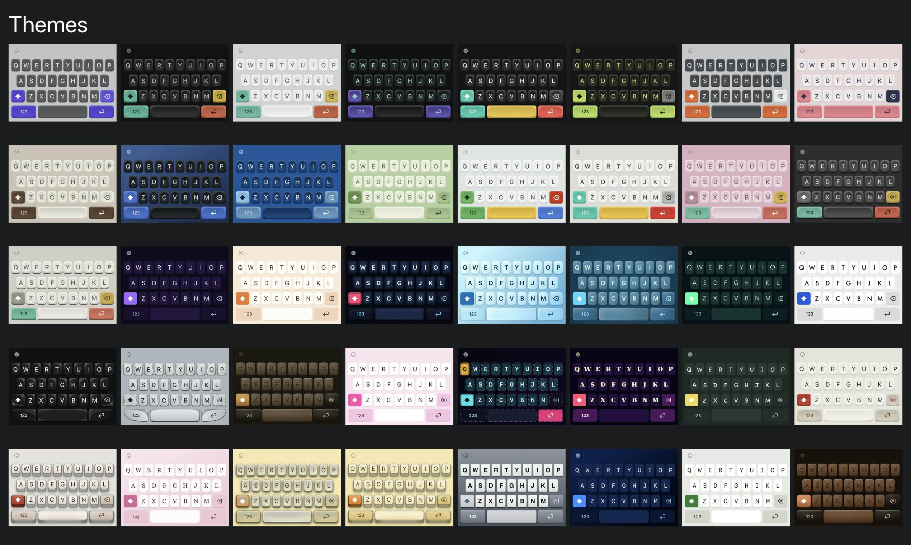
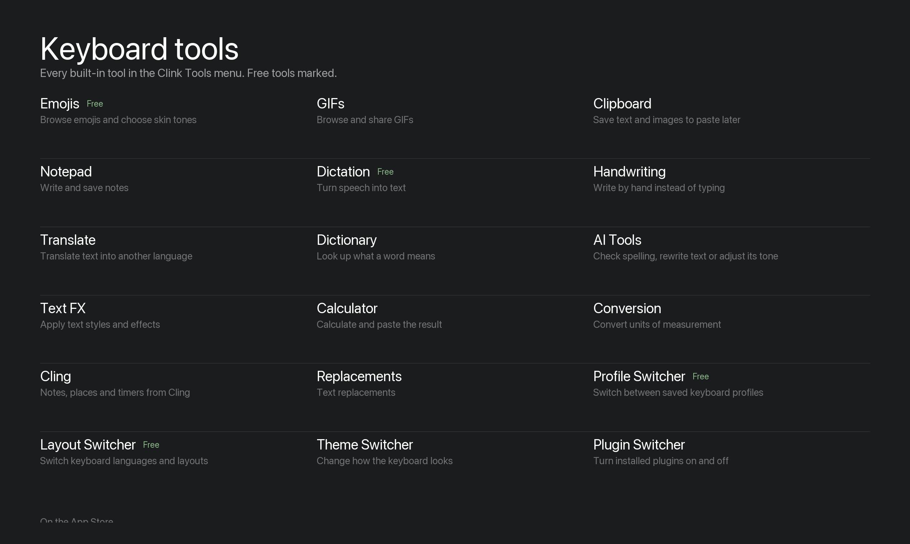

### 🎬 관련 영상
- [🎥 영상 보기](https://ph-files.imgix.net/4bfc314d-8513-48af-abe2-065c5cb7869e.jpeg?auto=format)

---

## 20. [ShipHappens: ](https://www.producthunt.com/products/ship-happens-automate-asc-localization)
**Votes**: 80 | **도입 난이도**: 하 | **신뢰도**: 상
**Tagline**: ASO, keywords & screenshots for the app store
**서비스 링크**: https://www.producthunt.com/r/IBJHEFAPXU7PNL

**태그**: ASO, AppMarketing, Productivity, Automation, MacApp, AI Tool

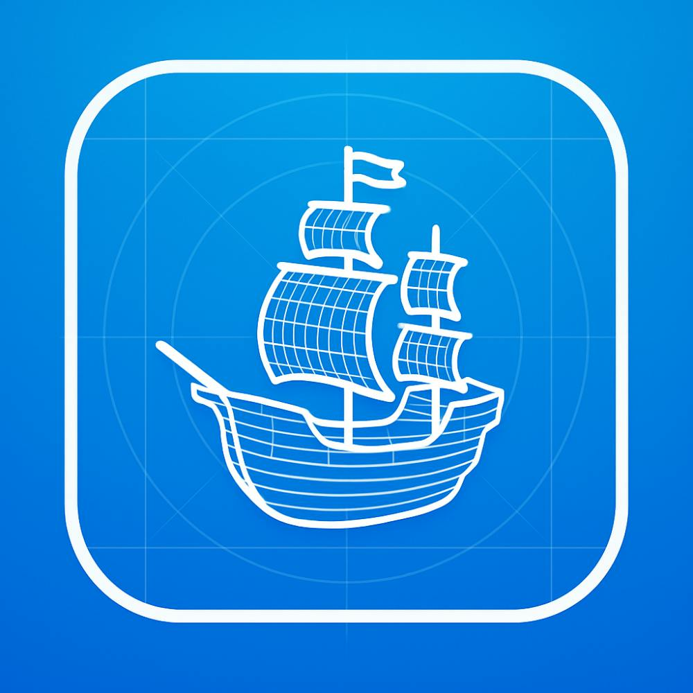

### 📌 이 서비스 한눈에 보기
App Store Connect의 불편함을 해결하고 ASO와 앱 관리를 자동화하는 네이티브 Mac 앱

### 🔑 주요 기능
- Apple 검색 데이터를 활용한 키워드 선정 및 AI 스크린샷 제작
- 39개 언어 일괄 번역 및 다국어 리뷰 답장 기능
- A/B 테스트 및 모든 앱의 피드백을 한눈에 확인하는 통합 대시보드

### 🙋 사용자에게 어떤 점이 좋은가
복잡한 App Store Connect 대신 직관적인 Mac 앱 환경에서 앱 마케팅과 운영 업무를 효율적으로 처리할 수 있습니다.

### ✅ 지금 바로 써볼 기능
- Apple 검색 데이터를 기반으로 한 키워드 최적화
- AI를 활용한 스크린샷 제작 및 다국어 번역 기능 테스트
- 통합 피드를 통한 앱별 이슈 관리

### ⚠️ 사용 전 확인할 점
- 네이티브 Mac 앱이므로 macOS 환경에서만 사용 가능
- AI 기능 사용 시 외부 API 연동 또는 로컬 모델 설정 필요

### 🧭 확인이 더 필요한 정보
사용자가 가져오는 AI 모델이나 API 제공자에 따른 추가 비용 발생 여부를 확인해야 합니다.

### 📸 스크린샷 및 갤러리
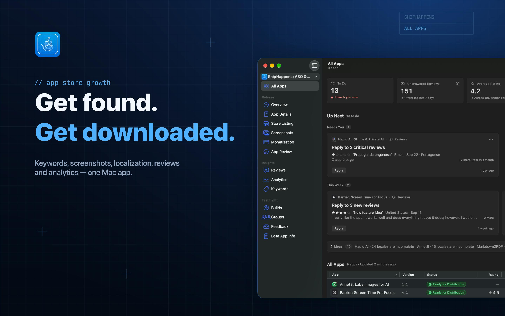
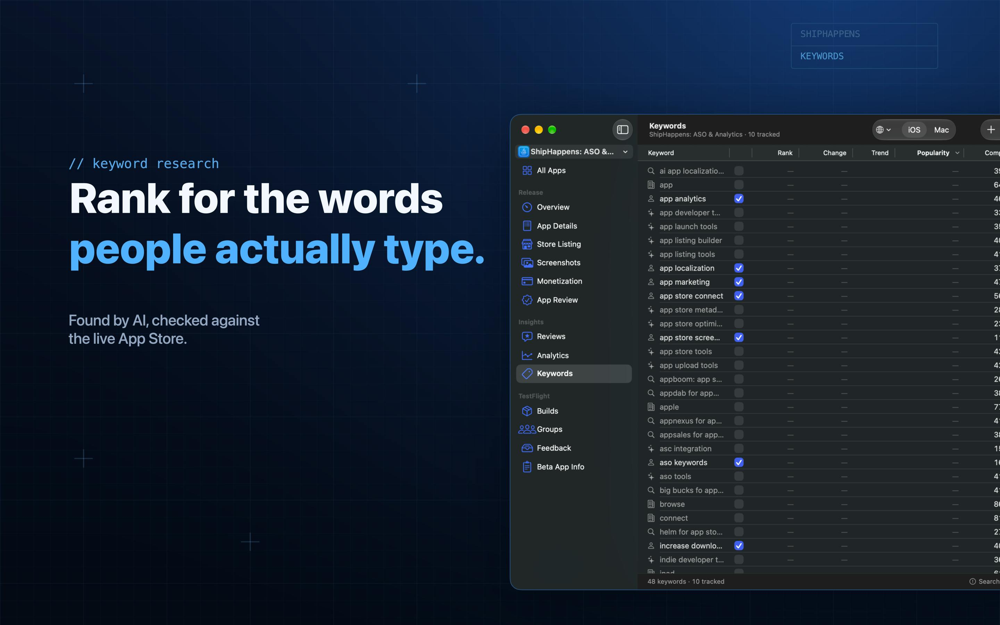
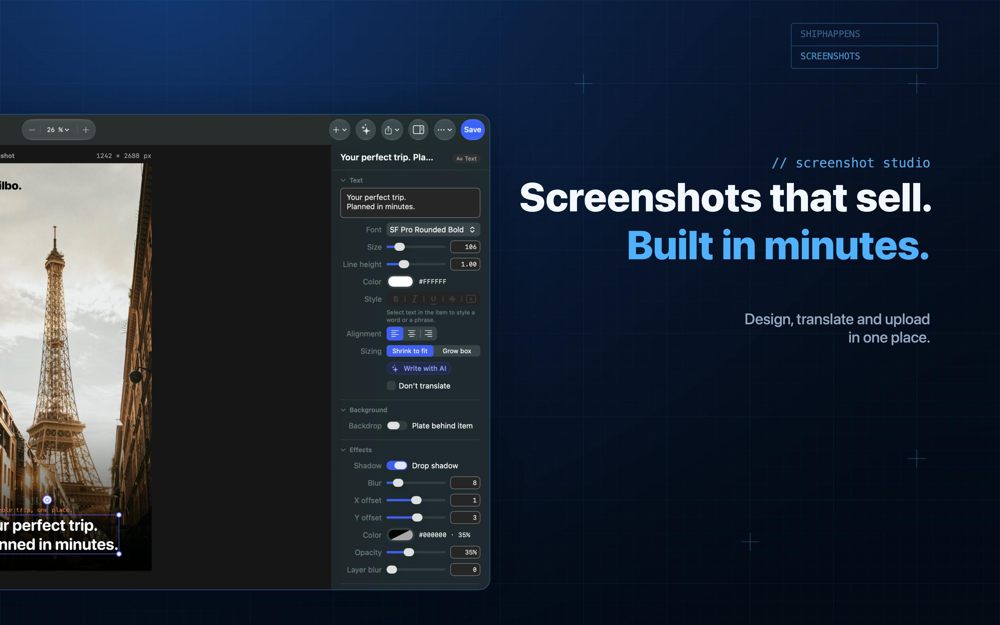

---

## 21. [ShipHappens: ](https://www.producthunt.com/products/ship-happens-automate-asc-localization)
**Votes**: 80 | **도입 난이도**: 하 | **신뢰도**: 상
**Tagline**: ASO, keywords & screenshots for the app store
**서비스 링크**: https://www.producthunt.com/r/IBJHEFAPXU7PNL

**태그**: ASO, AppMarketing, Productivity, Automation, MacApp, AI Tool

### 📌 이 서비스 한눈에 보기
App Store Connect의 불편함을 해결하고 ASO와 앱 관리를 자동화하는 네이티브 Mac 앱

### 🔑 주요 기능
- Apple 검색 데이터를 활용한 키워드 선정 및 AI 스크린샷 제작
- 39개 언어 일괄 번역 및 다국어 리뷰 답장 기능
- A/B 테스트 및 모든 앱의 피드백을 한눈에 확인하는 통합 대시보드

### 🙋 사용자에게 어떤 점이 좋은가
복잡한 App Store Connect 대신 직관적인 Mac 앱 환경에서 앱 마케팅과 운영 업무를 효율적으로 처리할 수 있습니다.

### ✅ 지금 바로 써볼 기능
- Apple 검색 데이터를 기반으로 한 키워드 최적화
- AI를 활용한 스크린샷 제작 및 다국어 번역 기능 테스트
- 통합 피드를 통한 앱별 이슈 관리

### ⚠️ 사용 전 확인할 점
- 네이티브 Mac 앱이므로 macOS 환경에서만 사용 가능
- AI 기능 사용 시 외부 API 연동 또는 로컬 모델 설정 필요

### 🧭 확인이 더 필요한 정보
사용자가 가져오는 AI 모델이나 API 제공자에 따른 추가 비용 발생 여부를 확인해야 합니다.

### 📸 스크린샷 및 갤러리

---

## 22. [FFFFinder](https://www.producthunt.com/products/ffffinder)
**Votes**: 78 | **도입 난이도**: 하 | **신뢰도**: 상
**Tagline**: Browse images and videos across folders in one grid
**서비스 링크**: https://www.producthunt.com/r/TY5SUYQZ2XKXK6

**태그**: macOS, Media Browser, Productivity, File Management, Video, Vision

### 📌 이 서비스 한눈에 보기
여러 폴더에 흩어진 이미지와 영상을 하나의 그리드로 모아보는 macOS 전용 미디어 브라우저

### 🔑 주요 기능
- 하위 폴더를 포함한 모든 미디어 파일을 하나의 연속된 그리드로 통합 브라우징
- 파일 가져오기나 클라우드 동기화 없이 원본 파일에 직접 접근
- 필터링, 정렬, 검색 및 실시간 미리보기 기능 제공

### 🙋 사용자에게 어떤 점이 좋은가
복잡한 폴더 구조 속에 흩어진 미디어 파일을 일일이 열어볼 필요 없이, 마치 하나의 거대한 라이브러리처럼 편리하게 탐색할 수 있습니다.

### ✅ 지금 바로 써볼 기능
- 로컬 폴더 및 외부 드라이브 추가하기
- 필터 및 검색 기능을 활용한 파일 분류
- 그리드 뷰에서 이미지/영상 미리보기

### ⚠️ 사용 전 확인할 점
- macOS 전용 소프트웨어이므로 다른 OS에서는 사용 불가
- 원본 파일을 직접 다루므로 파일 이동/삭제 시 주의 필요

### 🧭 확인이 더 필요한 정보
파일 개수가 매우 많을 경우의 성능 최적화 수준과 상세 가격 정책은 명시되지 않았습니다.

### 📸 스크린샷 및 갤러리

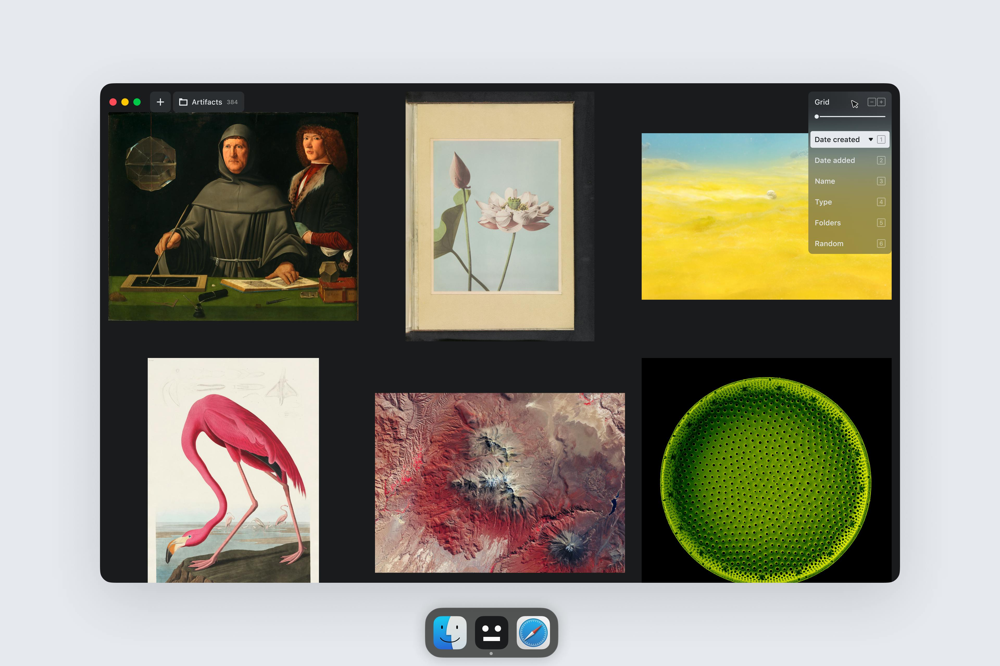
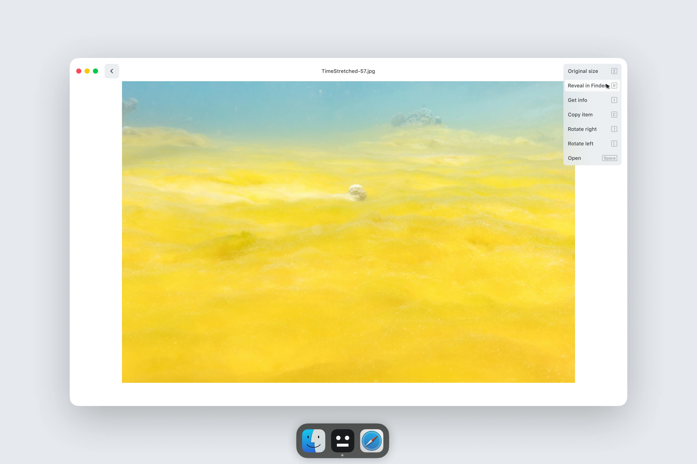

### 🎬 관련 영상
- [🎥 영상 보기](https://ph-files.imgix.net/ca4c4d06-4898-41b7-9e82-18b910f1051a.jpeg?auto=format)

---

## 23. [ColdIQ x Slack ](https://www.producthunt.com/products/coldiq-x-slack)
**Votes**: 78 | **도입 난이도**: 하 | **신뢰도**: 상
**Tagline**: Prompt GTM systems inside Slack
**서비스 링크**: https://www.producthunt.com/r/CGJ5W7YCNGNRYJ

**태그**: Automation, SalesTech, GTM, SlackIntegration, AI Tool, Prompting

### 📌 이 서비스 한눈에 보기
Slack 내에서 텍스트 프롬프트만으로 GTM(시장 진출) 시스템을 구축하고 운영하는 자동화 도구

### 🔑 주요 기능
- Slack 내에서 봇 태그를 통해 대화형으로 GTM 시스템 구축
- 40개 이상의 데이터 제공자 및 100개 이상의 GTM 스킬 통합
- 팀원들이 스레드 내에서 직접 편집, 답장 및 반복 작업 가능

### 🙋 사용자에게 어떤 점이 좋은가
별도의 복잡한 툴 학습 없이 Slack을 통해 즉각적으로 매출을 창출하는 캠페인을 실행할 수 있습니다.

### ✅ 지금 바로 써볼 기능
- ColdIQ Bot을 Slack에 초대하여 프롬프트 입력해보기
- 제공되는 40+ 데이터 소스 활용해보기
- 스레드 기능을 통해 팀원과 캠페인 협업하기

### ⚠️ 사용 전 확인할 점
- Slack 환경에 최적화되어 있어 외부 플랫폼과의 연동 범위 확인 필요
- 자동 생성된 캠페인의 품질을 위한 사용자 검토 필수

### 🧭 확인이 더 필요한 정보
제공되는 40개 이상의 데이터 제공자와 100개 이상의 스킬의 구체적인 범위와 비용 정책 확인이 필요합니다.

### 📸 스크린샷 및 갤러리

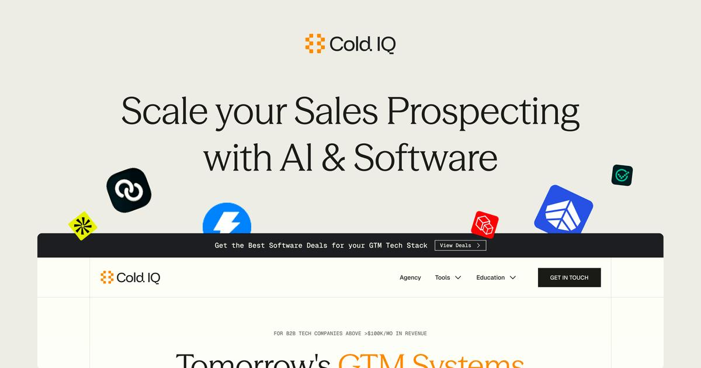

### 🎬 관련 영상
- [🎥 영상 보기](https://ph-files.imgix.net/fd7cc4e3-5ec0-4b2e-be45-dc137b7c23a6.jpeg?auto=format)

---

## 24. [Szept](https://www.producthunt.com/products/szept)
**Votes**: 76 | **도입 난이도**: 하 | **신뢰도**: 상
**Tagline**: Say it. Show it. Hand it to your agent.
**서비스 링크**: https://www.producthunt.com/r/274SA3PPN5XIF5

**태그**: Productivity, AI, MacApp, Automation, DevTool, Agent, AI Tool

### 📌 이 서비스 한눈에 보기
음성 입력부터 화면 캡처까지, AI 에이전트에게 작업을 전달하는 가장 빠른 Mac 앱

### 🔑 주요 기능
- 60개 이상의 언어를 지원하는 고성능 음성 받아쓰기 기능
- AI를 활용한 텍스트 정제 및 화면 녹화/캡처 기능
- Claude Code 등 AI 에이전트와의 원활한 작업 전달 워크플로우

### 🙋 사용자에게 어떤 점이 좋은가
말이나 화면 캡처를 통해 복잡한 명령을 AI 에이전트에게 즉각 전달할 수 있어 작업 흐름이 끊기지 않습니다.

### ✅ 지금 바로 써볼 기능
- 다국어 음성 받아쓰기 기능 테스트
- 화면 캡처 후 AI 에이전트 전달 워크플로우 실행
- 소스 코드 확인을 통한 보안성 검토

### ⚠️ 사용 전 확인할 점
- Mac 전용 앱이므로 macOS 환경에서만 사용 가능
- AI 에이전트(Claude Code 등)와의 연동 설정이 필요할 수 있음

### 🧭 확인이 더 필요한 정보
사용자의 특정 AI 에이전트 환경에 따른 연동 편의성이 구체적으로 명시되지 않았습니다.

### 📸 스크린샷 및 갤러리
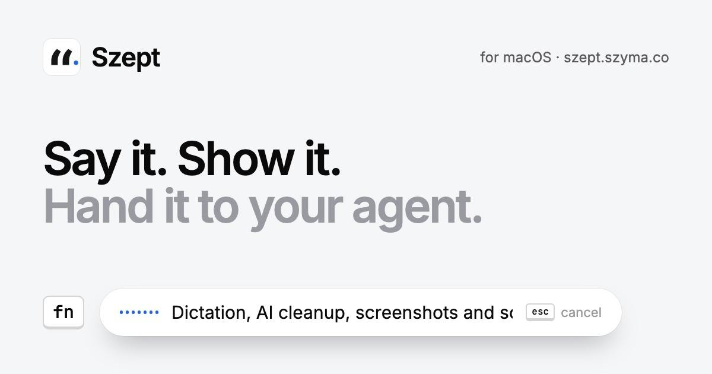
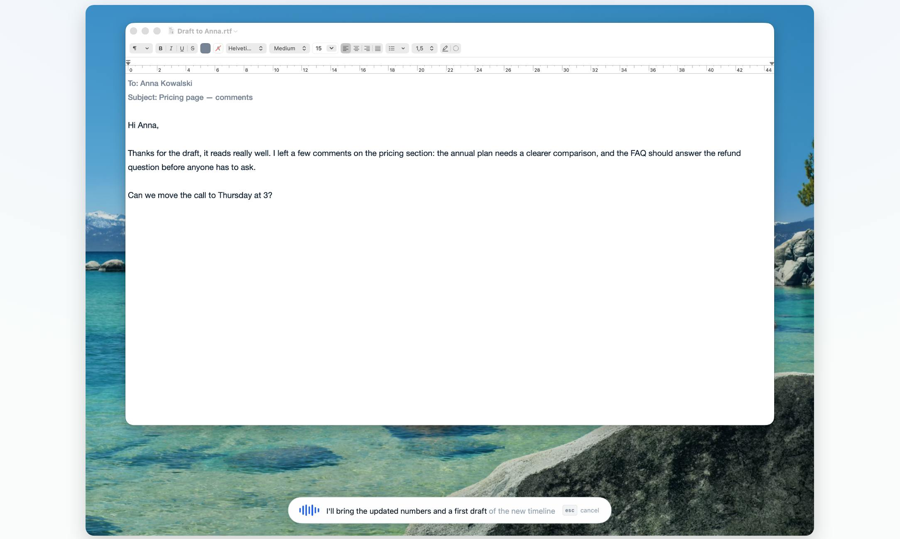
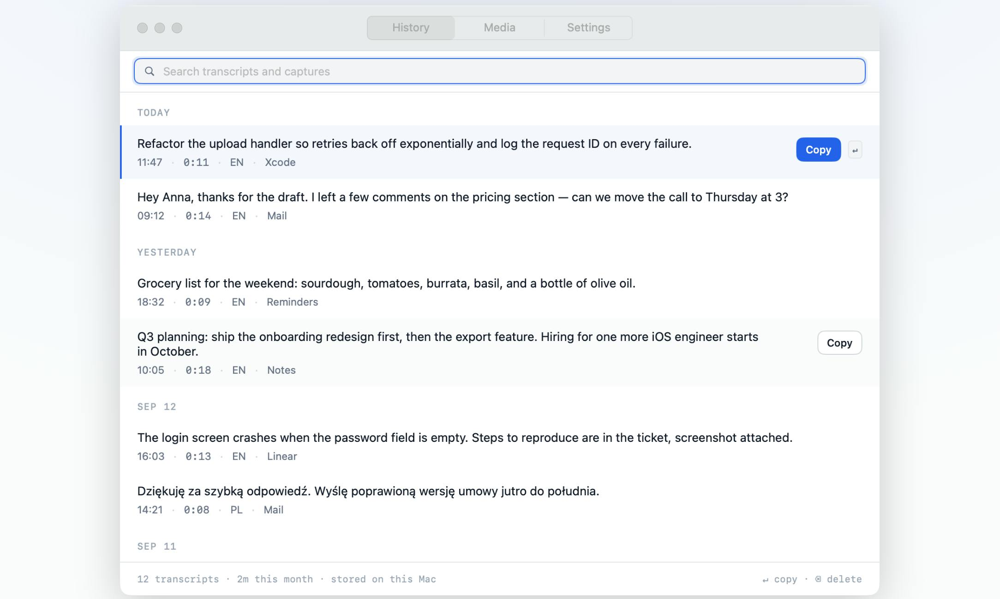

### 🎬 관련 영상
- [🎥 영상 보기](https://ph-files.imgix.net/65d8cda3-df7a-463d-87cb-a0cbb41db3fa.jpeg?auto=format)

---

## 25. [Timeful](https://www.producthunt.com/products/timeful)
**Votes**: 76 | **도입 난이도**: 중 | **신뢰도**: 상
**Tagline**: Design web apps and sync with your own codebase
**서비스 링크**: https://www.producthunt.com/r/L6KVL66TDHXOWP

**태그**: DevTool, Frontend, LowCode, WebDesign, AI Tool, Design

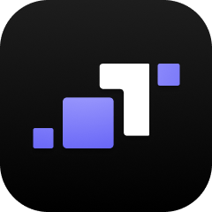

### 📌 이 서비스 한눈에 보기
코드와 디자인을 실시간으로 동기화하는 로컬 퍼스트 시각적 웹 앱 에디터

### 🔑 주요 기능
- 코드와 캔버스 간의 완벽한 양방향 동기화 지원
- Vue, Nuxt, Tailwind 기반의 깨끗하고 즉시 배포 가능한 코드 생성
- AI 없이 예측 가능한 알고리즘을 통한 코드 생성 및 완전한 코드 소유권 보장

### 🙋 사용자에게 어떤 점이 좋은가
디자인과 코딩 사이의 간극을 줄여 개발 생산성을 높이며, 생성된 코드를 자신의 저장소에서 직접 관리할 수 있어 벤더 종속성 걱정 없이 작업할 수 있습니다.

### ✅ 지금 바로 써볼 기능
- 자신의 기존 코드베이스와 캔버스 간의 동기화 성능 테스트
- 생성된 Vue/Nuxt 코드가 프로젝트 스타일과 일치하는지 확인
- 로컬 환경에서의 워크플로우 최적화

### ⚠️ 사용 전 확인할 점
- 지원되는 프레임워크(Vue, Nuxt, Tailwind) 외의 환경에서는 활용도가 제한될 수 있음
- 복잡한 비즈니스 로직이 포함된 기존 코드와의 충돌 가능성

### 🧭 확인이 더 필요한 정보
사용자의 기존 로컬 개발 환경 및 Git 워크플로우와 얼마나 매끄럽게 통합되는지에 대한 구체적인 설정 방식 확인이 필요합니다.

### 📸 스크린샷 및 갤러리
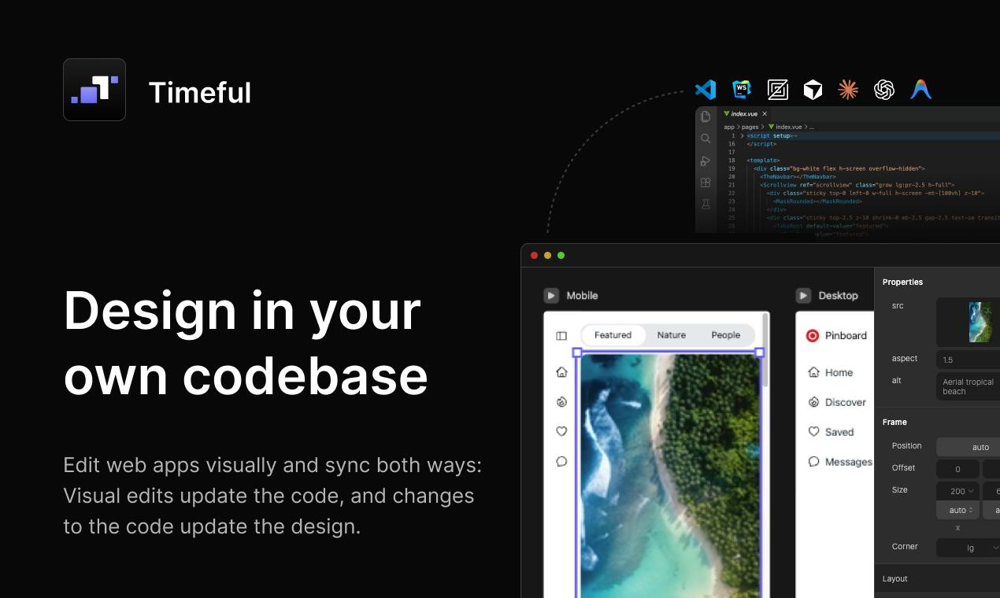
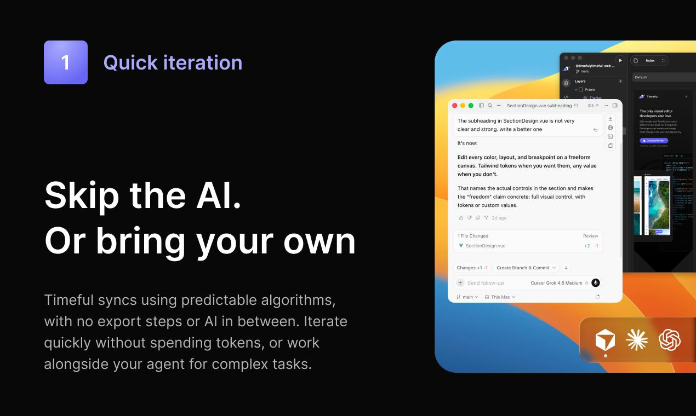
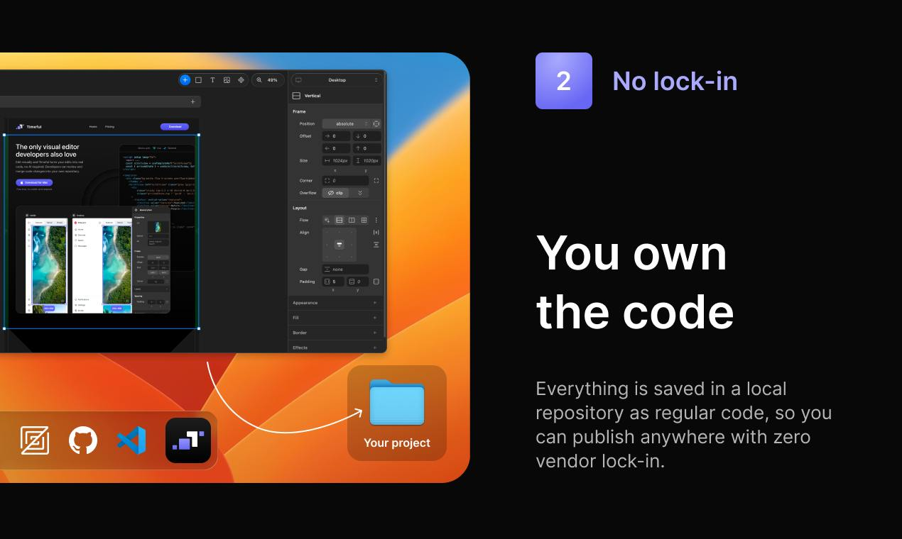

---

## 26. [ooon.ai](https://www.producthunt.com/products/ooon-ai)
**Votes**: 75 | **도입 난이도**: 하 | **신뢰도**: 상
**Tagline**: AI employee that answers, books, and reminds clients
**서비스 링크**: https://www.producthunt.com/r/M5UEW2L4SC6PJ4

**태그**: Automation, AI, CRM, CustomerService, AI Tool, Chat

### 📌 이 서비스 한눈에 보기
메신저 내에서 고객 응대부터 예약, 리마인드까지 자동으로 처리하는 AI 비서

### 🔑 주요 기능
- WhatsApp, Instagram, Telegram 등 기존 채팅창 내에서 즉각적인 응대 가능
- 가격 안내, 일정 예약, 방문 전 리마인드 및 미응답 고객 재연락 자동화
- 모든 대화, 예약 현황, 매출 총계를 하나의 대시보드에서 관리

### 🙋 사용자에게 어떤 점이 좋은가
고객이 별도의 앱을 열 필요 없이 익숙한 메신저로 소통할 수 있어 예약 전환율을 높이고 운영 공수를 획기적으로 줄여줍니다.

### ✅ 지금 바로 써볼 기능
- 주요 메신저(WhatsApp, Instagram 등) 연동 테스트
- 서비스 및 가격 정보 설정
- 자동 예약 및 리마인드 워크플로우 확인

### ⚠️ 사용 전 확인할 점
- 현재 지원 언어가 영어, 러시아어, 카자흐어로 제한적임
- 메신저 플랫폼별 API 정책에 따른 기능 제약 가능성

### 🧭 확인이 더 필요한 정보
한국어 지원 여부와 국내 주요 메신저(카카오톡 등) 연동 가능 여부 확인이 필요합니다.

### 📸 스크린샷 및 갤러리

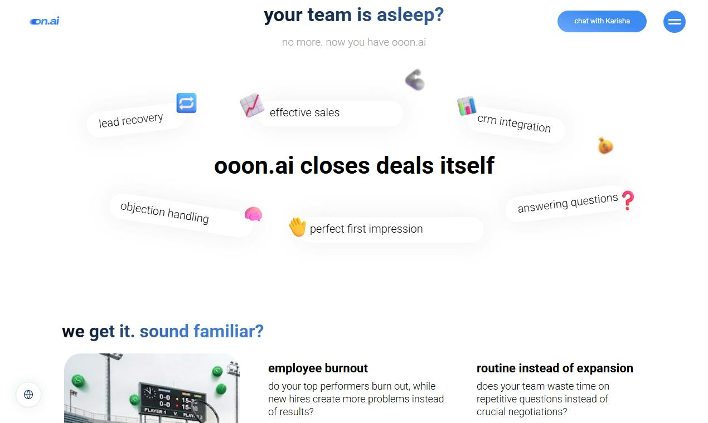
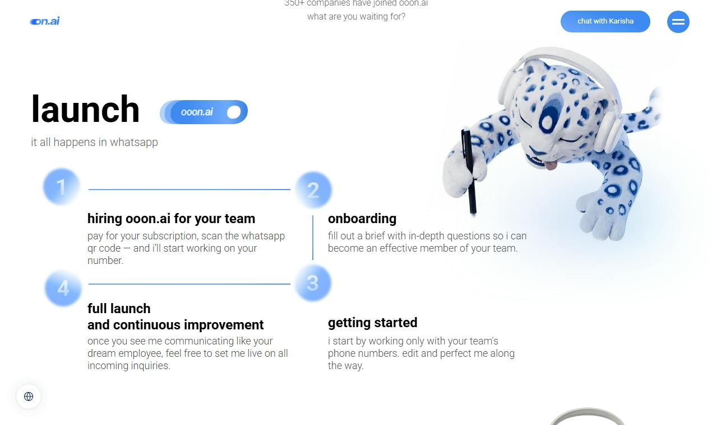

---

## 27. [Enter Space 7](https://www.producthunt.com/products/enter-space)
**Votes**: 75 | **도입 난이도**: 중 | **신뢰도**: 상
**Tagline**: rclone for iPhone, iPad, Mac & TV — now with Finder mounts
**서비스 링크**: https://www.producthunt.com/r/XZX5ZDSYK3R65Q

**태그**: CloudStorage, Productivity, macOS, iOS, DevTool, AI Tool

### 📌 이 서비스 한눈에 보기
개인 클라우드 저장소를 Finder와 Files 앱에 직접 연결하여 사용하는 강력한 rclone 클라이언트

### 🔑 주요 기능
- S3, Google Drive, Dropbox 등 70개 이상의 스토리지 제공업체 지원
- macOS Finder 및 iOS Files 앱에 볼륨 마운트 기능 제공
- 중복 파일 찾기, 코드 에디터(git 포함), 사진 타임라인 등 생산성 도구 통합

### 🙋 사용자에게 어떤 점이 좋은가
복잡한 클라우드 스토리지 설정을 마치 로컬 드라이브처럼 직관적으로 관리할 수 있어, 개인 서버나 클라우드를 사용하는 사용자에게 최적의 파일 관리 환경을 제공합니다.

### ✅ 지금 바로 써볼 기능
- 기존 클라우드 스토리지(S3, Google Drive 등) 연결하기
- macOS Finder에 볼륨 마운트하여 로컬 파일처럼 사용하기
- 중복 파일 찾기 기능을 통해 저장 공간 정리하기

### ⚠️ 사용 전 확인할 점
- rclone 기반 설정이므로 초기 네트워크/스토리지 설정 지식이 필요할 수 있음
- macOS 27(설명상 버전) 등 특정 OS 환경에서의 FSKit 지원 여부 확인 필요

### 🧭 확인이 더 필요한 정보
설명에 언급된 'macOS 27'이 현재 사용 가능한 OS 버전인지 또는 특정 개발 환경을 의미하는지 확인이 필요합니다.

### 📸 스크린샷 및 갤러리
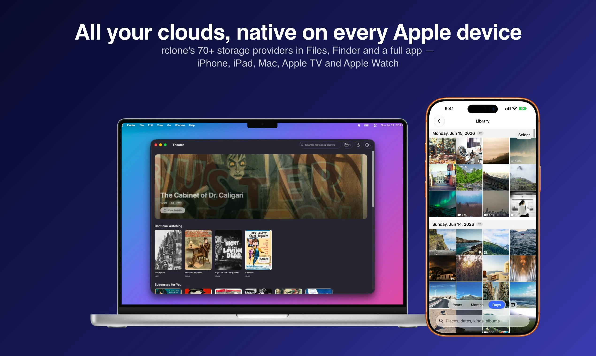
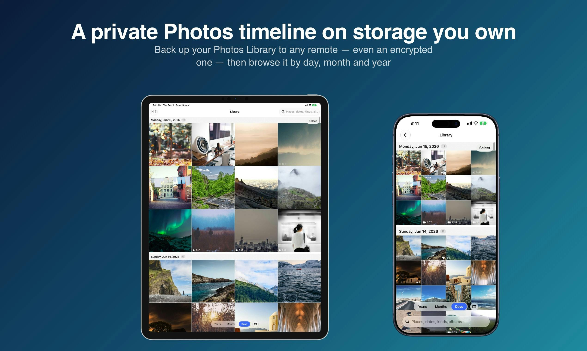
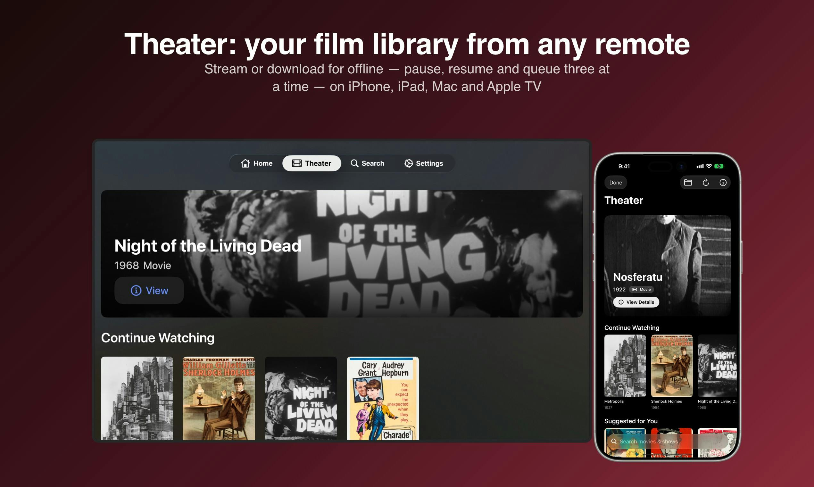

---

## 28. [Ricly](https://www.producthunt.com/products/ricly)
**Votes**: 74 | **도입 난이도**: 하 | **신뢰도**: 상
**Tagline**: Putting your most recurring tools in the right-click menu
**서비스 링크**: https://www.producthunt.com/r/SVJFUZHLBLM3WM

**태그**: Productivity, Mac, Automation, Utility, AI Tool, Vision

### 📌 이 서비스 한눈에 보기
맥(Mac) Finder 우클릭 메뉴에서 바로 실행하는 17가지 파일 작업 자동화 도구

### 🔑 주요 기능
- 브라우저를 거치지 않고 Finder 우클릭 메뉴에서 즉시 파일 작업 수행
- PDF 병합, 배경 제거, 이미지 업스케일링, 중복 파일 찾기 등 17가지 기능 통합
- 로컬 실행 방식으로 보안을 강화하고 여러 구독 서비스 비용 절감

### 🙋 사용자에게 어떤 점이 좋은가
반복적인 파일 처리 작업을 위해 브라우저를 열고 업로드/다운로드하는 번거로움을 없애 업무 흐름을 끊김 없이 유지할 수 있습니다.

### ✅ 지금 바로 써볼 기능
- PDF 병합 및 파일 압축 기능 테스트
- 이미지 배경 제거 및 텍스트 추출 기능 활용
- 중복 파일 찾기 기능으로 저장 공간 정리

### ⚠️ 사용 전 확인할 점
- Mac 전용 도구이므로 Windows 환경에서는 사용 불가
- 로컬 실행이지만 특정 기능(업스케일링 등)의 처리 속도는 하드웨어 성능에 의존할 수 있음

### 🧭 확인이 더 필요한 정보
제공되는 17가지 기능 중 일부가 클라우드 기반인지 혹은 100% 로컬에서만 작동하는지 명확한 구분이 필요합니다.

### 📸 스크린샷 및 갤러리
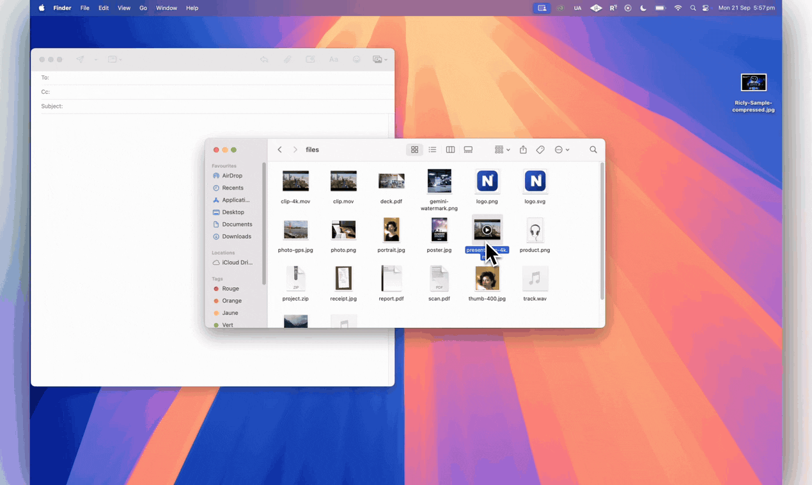
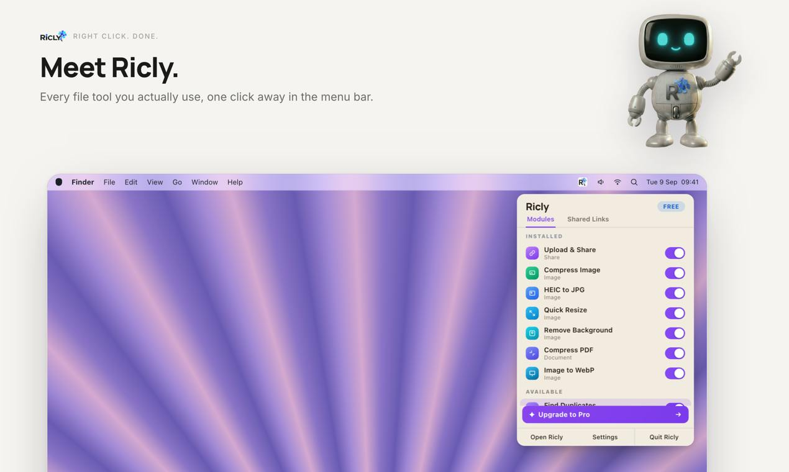
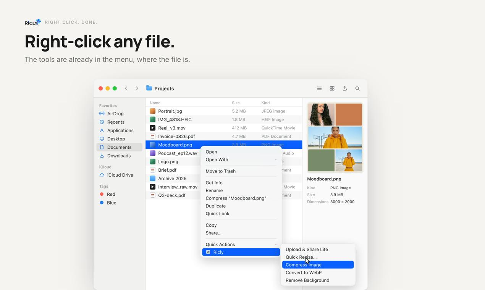

---

## 29. [Flotnote](https://www.producthunt.com/products/flotnote)
**Votes**: 73 | **도입 난이도**: 하 | **신뢰도**: 상
**Tagline**: Floating Markdown notes for Mac. Pay once, own your files
**서비스 링크**: https://www.producthunt.com/r/IZRAUD7MUKJS75

**태그**: Productivity, Markdown, Mac, Note-taking, AI Tool

### 📌 이 서비스 한눈에 보기
어떤 작업 중에도 즉시 메모할 수 있는 Mac 전용 플로팅 마크다운 노트

### 🔑 주요 기능
- 모든 앱 위에 떠 있는 플로팅 인터페이스로 빠른 메모 가능
- 로컬 마크다운 파일 기반으로 데이터 소유권 및 호환성 보장
- 계정 생성, 서버, 구독이 필요 없는 간편한 워크플로우

### 🙋 사용자에게 어떤 점이 좋은가
작업 흐름을 끊지 않고 즉각적인 아이디어를 기록할 수 있으며, 저장된 파일은 Obsidian 등 다른 에디터와 즉시 연동됩니다.

### ✅ 지금 바로 써볼 기능
- 단축키를 설정하여 즉시 메모하기
- 로컬 폴더를 지정하여 마크다운 파일 관리하기
- 위키 스타일 링크와 태그로 메모 연결하기

### ⚠️ 사용 전 확인할 점
- Mac 전용 앱이므로 다른 OS에서는 사용 불가
- 클라우드 동기화 기능이 기본 제공되지 않으므로 수동 관리 필요

### 🧭 확인이 더 필요한 정보
구독형이 아닌 일회성 결제 방식의 구체적인 가격 정책 확인이 필요합니다.

### 📸 스크린샷 및 갤러리
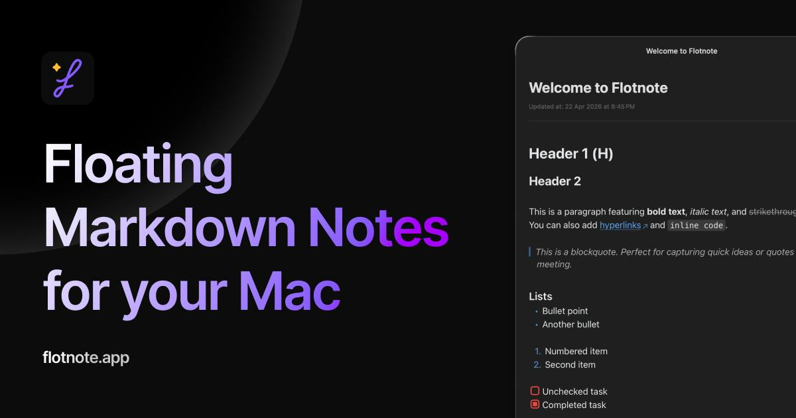
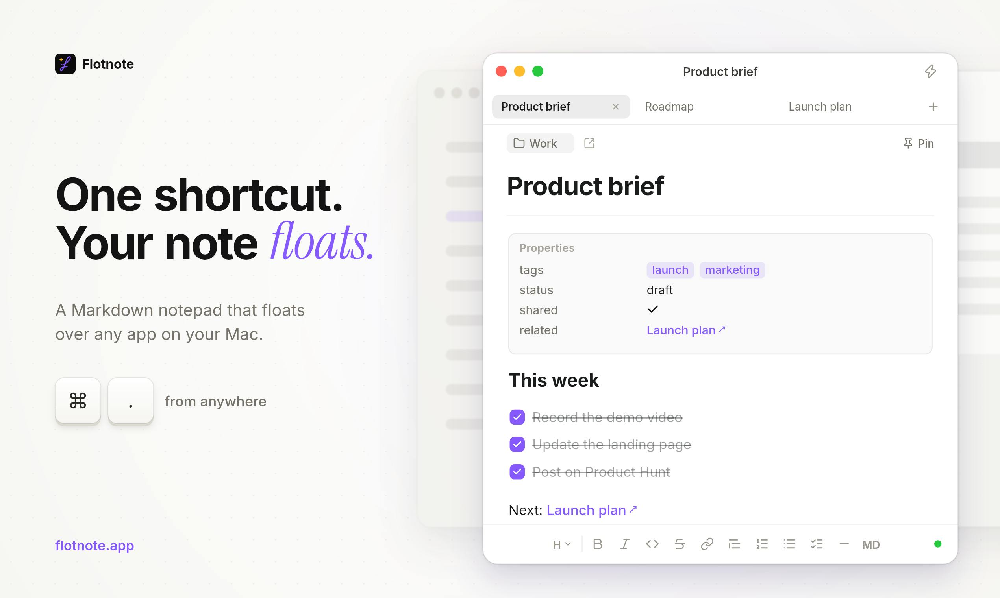
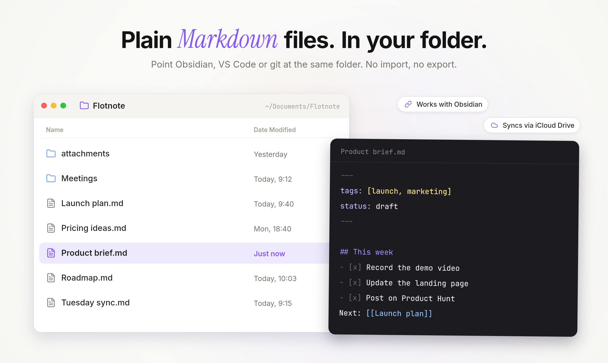

### 🎬 관련 영상
- [🎥 영상 보기](https://ph-files.imgix.net/cb83b4ab-ae61-4db9-848f-d488f3501621.jpeg?auto=format)

---

## 30. [Codex Remote](https://www.producthunt.com/products/codex-remote)
**Votes**: 72 | **도입 난이도**: 상 | **신뢰도**: 상
**Tagline**: Put Codex or Claude Code on your own cloud machine
**서비스 링크**: https://www.producthunt.com/r/FDS3AJY3JSD7G2

**태그**: DevTool, Cloud, AI, OpenSource, Automation, Agent, AI Tool

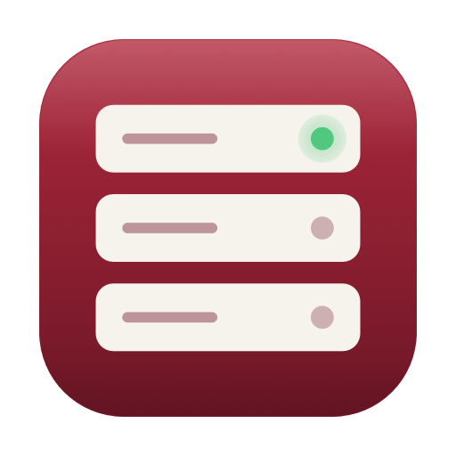

### 📌 이 서비스 한눈에 보기
개인 클라우드 서버에 Codex 및 Claude Code를 직접 구축하여 사용하는 오픈소스 맥 메뉴바 앱

### 🔑 주요 기능
- OpenTofu를 통한 클라우드 서버 자동 프로비저닝 및 에이전트 설치
- 중간 서버 없이 사용자 맥에 저장되는 클라우드 자격 증명으로 보안 강화
- CPU, 메모리 모니터링 및 유휴 서버 일시 중지 기능 제공

### 🙋 사용자에게 어떤 점이 좋은가
중앙 서버를 거치지 않고 본인의 클라우드 인프라에서 AI 코딩 에이전트를 직접 운영함으로써 데이터 보안과 제어권을 확보할 수 있습니다.

### ✅ 지금 바로 써볼 기능
- 클라우드 제공업체 계정 연결 및 서버 프로비저닝 테스트
- 프로젝트 동기화 기능을 통한 로컬 개발 환경과 클라우드 연결
- 유휴 서버 일시 중지 기능을 통한 비용 최적화 설정

### ⚠️ 사용 전 확인할 점
- 클라우드 인프라 비용은 사용자 본인의 계정에서 발생함
- 직접 서버를 관리해야 하므로 인프라 설정 및 유지보수 지식이 필요함

### 🧭 확인이 더 필요한 정보
사용자가 선택하는 클라우드 제공업체에 따른 비용 및 설정 난이도 차이가 존재합니다.

### 📸 스크린샷 및 갤러리
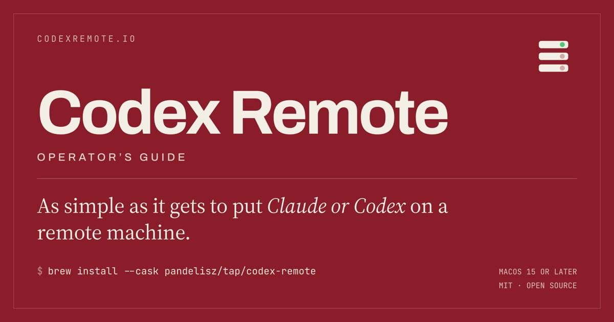
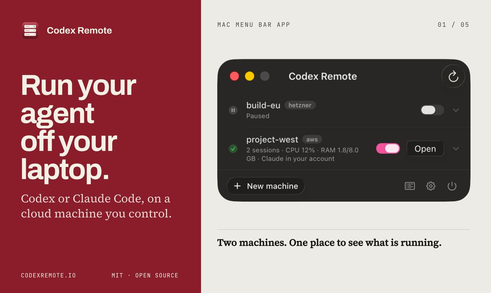
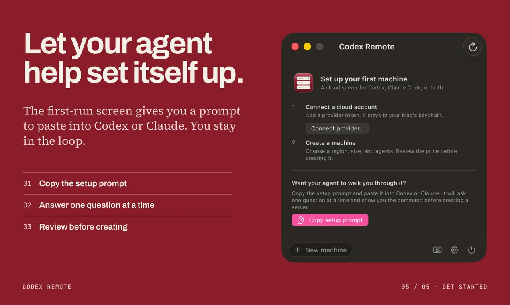

### 🎬 관련 영상
- [🎥 영상 보기](https://ph-files.imgix.net/06dc3e41-7535-4656-a469-15988e49480d.jpeg?auto=format)

---

