# 🚀 Product Hunt Daily Top 30 (2026-10-02)

## 오늘의 요약
오늘의 트렌드는 기존의 데이터베이스나 SaaS 환경을 AI 에이전트가 즉시 활용할 수 있도록 연결하는 'AI 에이전트 인프라'와 '자동화'가 주도했습니다. 특히 사용자의 개입 없이도 업무를 수행하거나 장애를 복구하는 등, 단순한 보조를 넘어 독립적인 실행력을 갖춘 에이전트 솔루션들이 주목받았습니다.

### 오늘의 핵심 포인트
- 기존 레거시 데이터와 SaaS 환경을 AI 에이전트가 즉시 사용할 수 있는 API 및 인터페이스로 변환하는 기술이 강조되었습니다.
- 사용자가 잠든 사이에도 업무를 수행하거나 장애를 분석하여 수정 코드를 제안하는 등 자율적인 워크플로우 자동화가 핵심입니다.
- AI 검색 최적화(GEO)나 맞춤형 헬프 센터 구축처럼 특정 비즈니스 목적에 특화된 AI 에이전트 서비스들이 등장했습니다.

**오늘의 태그**: AI 에이전트, 업무 자동화, SaaS 인프라, LLM 통합

## 1. [Monospace from Directus](https://www.producthunt.com/products/directus)
**Votes**: 359 | **도입 난이도**: 중 | **신뢰도**: 상
**Tagline**: The governed API layer for every app, person, and agent
**서비스 링크**: https://www.producthunt.com/r/OROVPQZ3Y6HPUR

**태그**: DevTool, Data Management, AI, API, LowCode, Agent, AI Tool

### 📌 이 서비스 한눈에 보기
기존 데이터베이스를 재구축 없이 즉시 활용 가능한 API 레이어로 변환하는 거버넌스 솔루션

### 🔑 주요 기능
- 데이터 복제나 이동 없이 기존 데이터 소스에 직접 연결
- 개발자, 비즈니스 팀, AI 에이전트를 위한 통합 읽기/쓰기 권한 관리
- 레거시 데이터베이스 스키마를 실시간으로 분석하여 인터페이스 자동 생성

### 🙋 사용자에게 어떤 점이 좋은가
데이터를 옮기거나 새로 구축할 필요 없이, 기존 데이터베이스를 현대적인 앱이나 AI 에이전트가 즉시 사용할 수 있는 API로 만들어줍니다.

### ✅ 지금 바로 써볼 기능
- 기존 데이터 소스 연결 및 스키마 인트로스펙션 확인
- 세분화된 권한 모델 설정 테스트
- 생성된 API를 통한 AI 에이전트 연동 테스트

### ⚠️ 사용 전 확인할 점
- 레거시 데이터베이스의 성능이 API 응답 속도에 직접적인 영향을 줄 수 있음
- 데이터 이동이 없으므로 원본 데이터베이스의 부하 및 보안 설정 확인 필요

### 🧭 확인이 더 필요한 정보
지원하는 데이터베이스 종류와 구체적인 보안 프로토콜 범위에 대한 상세 정보가 필요합니다.

### 📸 스크린샷 및 갤러리
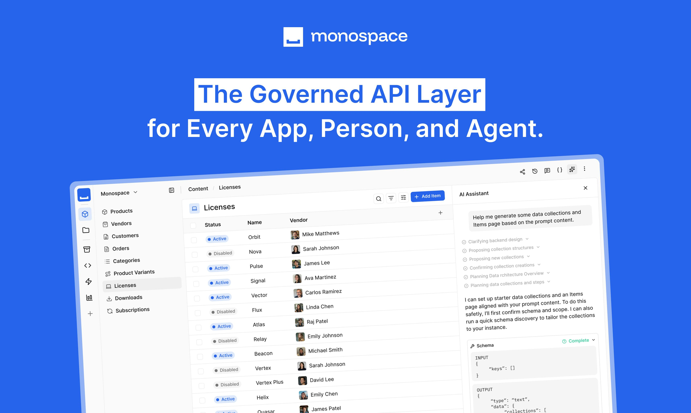
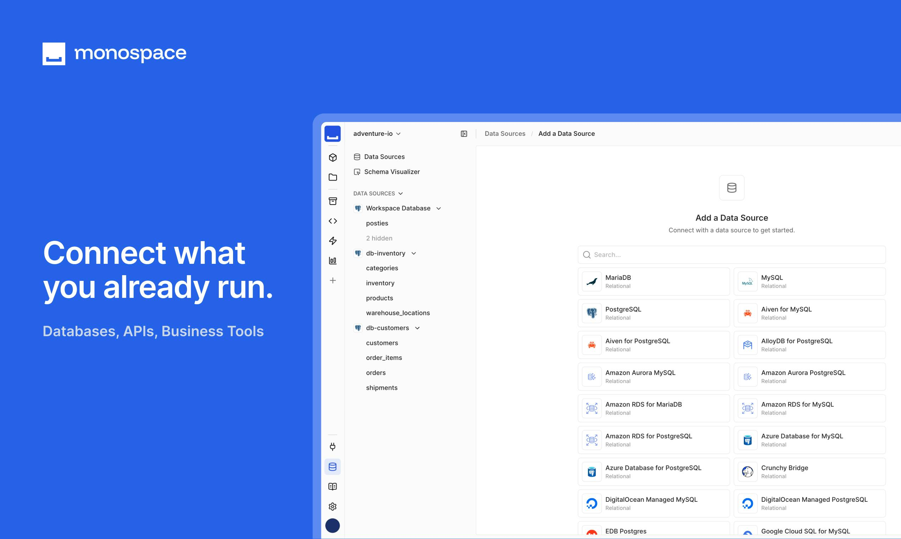
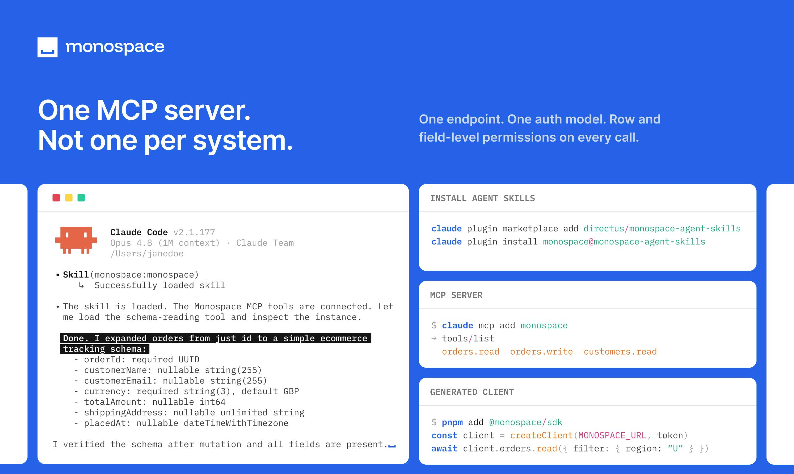

### 🎬 관련 영상
- [🎥 영상 보기](https://ph-files.imgix.net/56e3e562-bc1f-40f7-a56c-ff858622fd2f.jpeg?auto=format)

---

## 2. [Yedric.ai](https://www.producthunt.com/products/yedric-ai)
**Votes**: 240 | **도입 난이도**: 하 | **신뢰도**: 상
**Tagline**: Let users control your SaaS with natural language
**서비스 링크**: https://www.producthunt.com/r/DCVAH43A532K2G

**태그**: AI-Agent, SaaS, DevTool, UX, Automation, Agent, AI Tool

### 📌 이 서비스 한눈에 보기
자연어 명령만으로 SaaS 기능을 실행할 수 있는 임베디드 AI 에이전트

### 🔑 주요 기능
- 사용자가 복잡한 UI를 학습할 필요 없이 자연어로 기능 실행 가능
- 기존 SaaS에 30분 이내로 AI 에이전트 기능 임베딩 가능
- 사용자의 요청을 제품이 이해할 수 있는 액션으로 자동 변환

### 🙋 사용자에게 어떤 점이 좋은가
개발자는 복잡한 AI 에이전트를 직접 구축할 필요 없이 기존 제품을 AI 네이티브로 전환할 수 있으며, 사용자는 제품 사용법을 익히는 수고를 덜 수 있습니다.

### ✅ 지금 바로 써볼 기능
- 기존 SaaS 제품의 핵심 액션과 연동 테스트
- 임베디드 에이전트의 UI/UX 적합성 검토

### ⚠️ 사용 전 확인할 점
- 기존 제품의 기능이 에이전트의 액션으로 변환 가능한 범위인지 확인 필요
- 자연어 해석 오류로 인한 의도치 않은 액션 실행 가능성

### 🧭 확인이 더 필요한 정보
기존 SaaS의 API나 백엔드 시스템과 어떻게 구체적으로 연동되는지에 대한 기술적 상세 정보가 필요합니다.

### 📸 스크린샷 및 갤러리
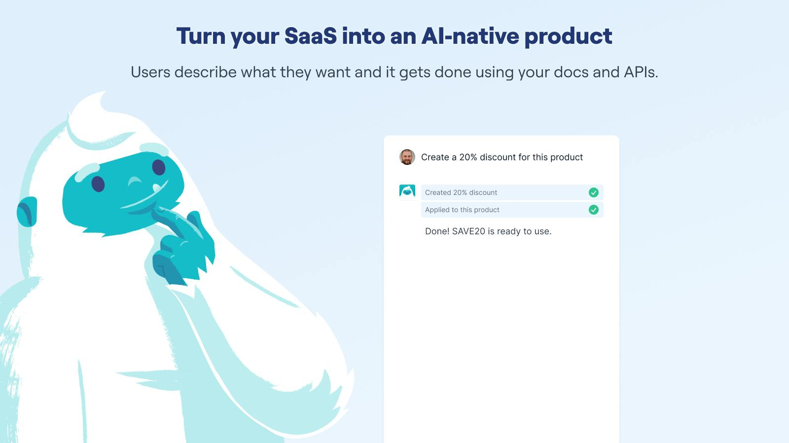
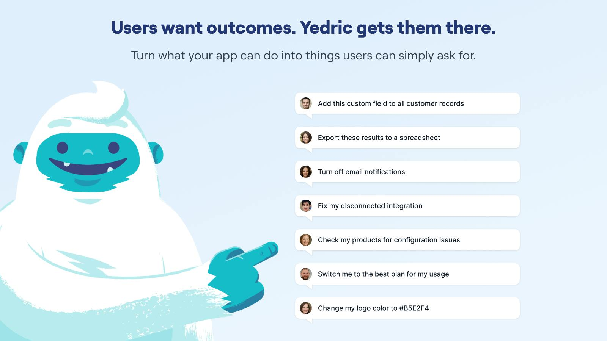

### 🎬 관련 영상
- [🎥 영상 보기](https://ph-files.imgix.net/93a751c5-c021-43a4-84a8-3619449787b2.jpeg?auto=format)

---

## 3. [Dots by OpenAI](https://www.producthunt.com/products/dots-by-openai)
**Votes**: 230 | **도입 난이도**: 중 | **신뢰도**: 상
**Tagline**: Always on agents built to handle everything
**서비스 링크**: https://www.producthunt.com/r/IMIJETJFC5TCPY

**태그**: Automation, AI Agent, Productivity, SaaS, Agent, AI Tool, Chat

### 📌 이 서비스 한눈에 보기
24시간 가동되는 개인용 AI 에이전트로 복잡한 업무를 자동화하고 결과물을 전달받으세요.

### 🔑 주요 기능
- GPT-6 Astra 기반의 상시 가동형 AI 에이전트
- 독립적인 클라우드 컴퓨터와 브라우저를 통한 4,000개 이상의 앱 연동
- ChatGPT, Slack, Teams를 통한 다양한 채널에서의 메시지 및 통화 지원

### 🙋 사용자에게 어떤 점이 좋은가
사용자가 잠든 시간에도 AI가 목표를 향해 업무를 수행하며, 완성된 결과물만 검토하면 되는 효율적인 워크플로우를 제공합니다.

### ✅ 지금 바로 써볼 기능
- ChatGPT에서 메시지나 통화로 작업 지시하기
- Slack 또는 Teams에 에이전트 연결하여 협업하기
- Custom Rules를 설정하여 개인화된 작업 규칙 적용하기

### ⚠️ 사용 전 확인할 점
- Pro 및 Business Premium 플랜 사용자 대상 우선 출시
- 에이전트가 외부 앱과 연동되어 작업하므로 보안 및 권한 설정 확인 필요

### 🧭 확인이 더 필요한 정보
GPT-6 Astra 모델의 구체적인 성능과 4,000개 앱 연동의 안정성은 실제 사용 환경에 따라 다를 수 있습니다.

### 📸 스크린샷 및 갤러리
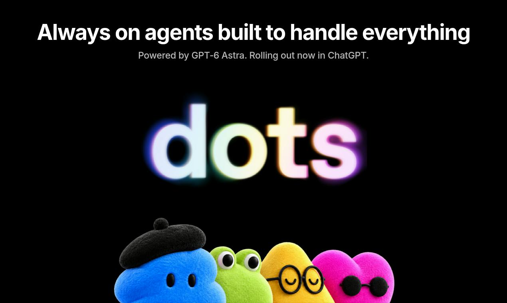
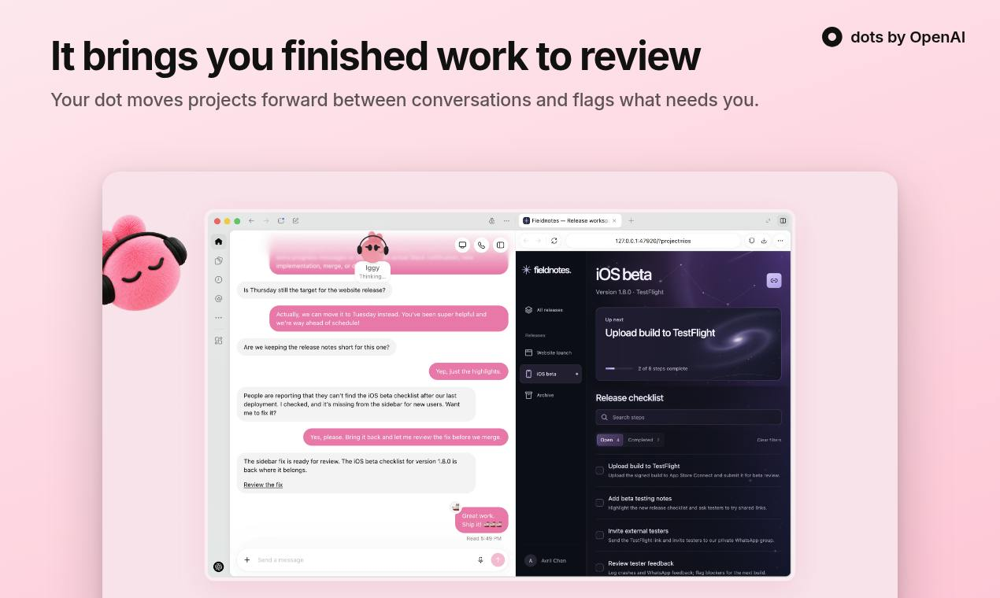
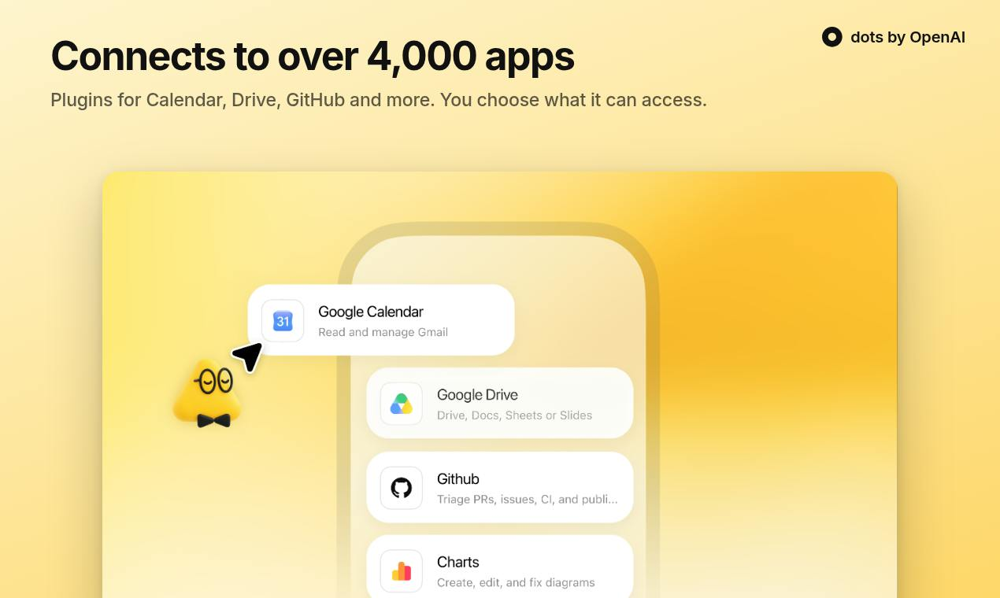

### 🎬 관련 영상
- [🎥 영상 보기](https://ph-files.imgix.net/28e14662-4df8-4b79-b4e0-6edf4906f7c1.jpeg?auto=format)

---

## 4. [Omnia Agent](https://www.producthunt.com/products/omnia-2)
**Votes**: 173 | **도입 난이도**: 하 | **신뢰도**: 상
**Tagline**: The AI Agent that does 95% of your GEO work
**서비스 링크**: https://www.producthunt.com/r/KWE7TOKRKBWP42

**태그**: AI, Marketing, Automation, SEO, Agent, AI Tool, Prompting

### 📌 이 서비스 한눈에 보기
전문가 없이도 AI 검색 최적화(GEO)를 자동화하는 AI 에이전트

### 🔑 주요 기능
- 경쟁사가 우위를 점하고 있는 AI 검색 프롬프트를 자동으로 식별
- GEO(Generative Engine Optimization)에 특화된 기술로 검색 결과 점유
- 기존 워크플로우에 연결되어 승인된 작업이 즉시 반영되는 자동화

### 🙋 사용자에게 어떤 점이 좋은가
GEO 전문가를 고용하지 않고도 브랜드가 AI 검색 결과에 효과적으로 노출될 수 있도록 돕습니다.

### ✅ 지금 바로 써볼 기능
- 경쟁사 노출 현황 분석 기능 실행
- 기존 업무 도구와 연동 설정
- AI 생성 콘텐츠 승인 및 배포 프로세스 테스트

### ⚠️ 사용 전 확인할 점
- 자동화된 작업이 브랜드의 톤앤매너와 일치하는지 확인 필요
- 기존 도구와의 연동 시 데이터 보안 및 권한 설정 확인

### 🧭 확인이 더 필요한 정보
현재 사용 중인 도구들과의 구체적인 연동 범위와 데이터 동기화 방식에 대한 상세 정보가 필요합니다.

### 📸 스크린샷 및 갤러리
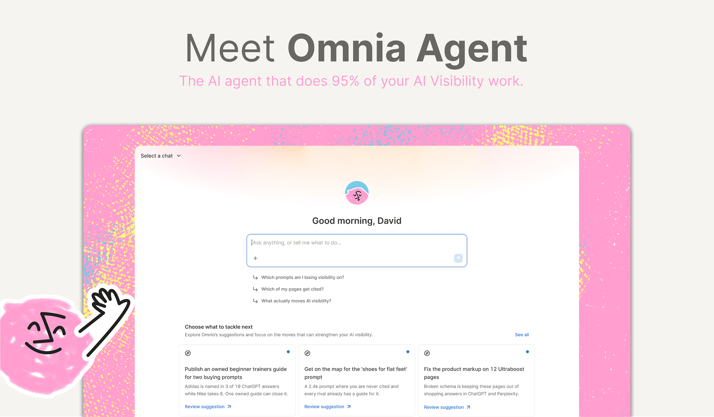
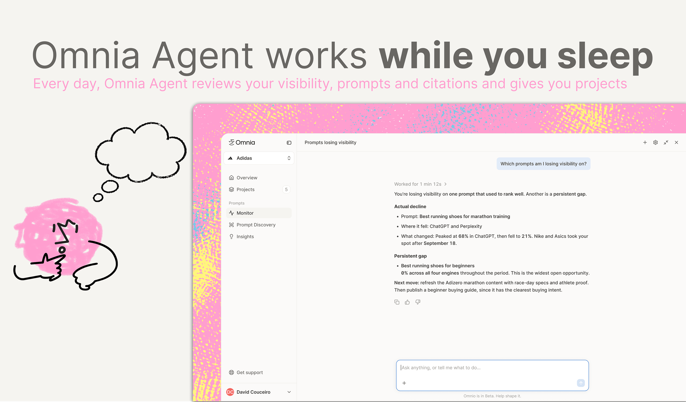
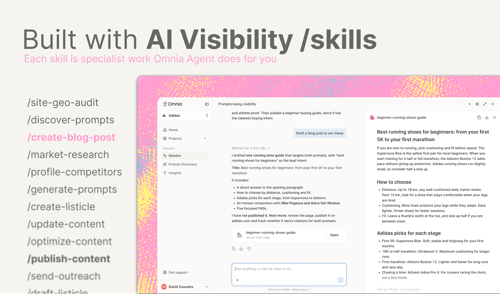

### 🎬 관련 영상
- [🎥 영상 보기](https://ph-files.imgix.net/2cc60e2c-49cf-4c28-baa2-6574e1af5abe.jpeg?auto=format)

---

## 5. [Polylane](https://www.producthunt.com/products/polylane)
**Votes**: 156 | **도입 난이도**: 중 | **신뢰도**: 상
**Tagline**: AI agents that fix production before you wake up
**서비스 링크**: https://www.producthunt.com/r/FQMZCQAIVIIJTE

**태그**: DevOps, AI, Automation, SRE, Agent, AI Tool, DevTool

### 📌 이 서비스 한눈에 보기
장애 발생 시 자동으로 원인을 분석하고 수정 코드까지 제안하는 AI 에이전트

### 🔑 주요 기능
- 코드, 인프라, 관측성 데이터를 통합하여 장애 조사 자동화
- 문제 해결을 위한 Pull Request(PR) 자동 생성
- 코드 수정이 불가능한 경우 근본 원인 분석 및 권장 해결책 제공

### 🙋 사용자에게 어떤 점이 좋은가
온콜(On-call) 대기 시간을 획기적으로 줄여주며, 장애 발생 시 수동 조사 대신 자동화된 수정 제안을 통해 빠른 복구를 지원합니다.

### ✅ 지금 바로 써볼 기능
- 기존 인프라 및 관측성 도구와의 연동성 확인
- 자동 생성된 PR의 코드 품질 및 보안 검토
- 장애 탐지 및 자동 분석 워크플로우 테스트

### ⚠️ 사용 전 확인할 점
- AI가 생성한 수정 코드가 운영 환경에 미칠 영향 검토 필요
- 복잡한 아키텍처에서의 근본 원인 파악 정확도 확인

### 🧭 확인이 더 필요한 정보
현재 제공되는 구체적인 인프라/관측성 도구 지원 목록과 보안 정책에 대한 정보가 필요합니다.

### 📸 스크린샷 및 갤러리

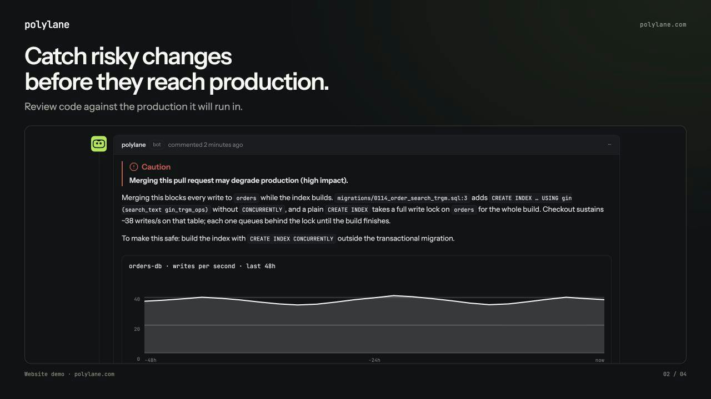
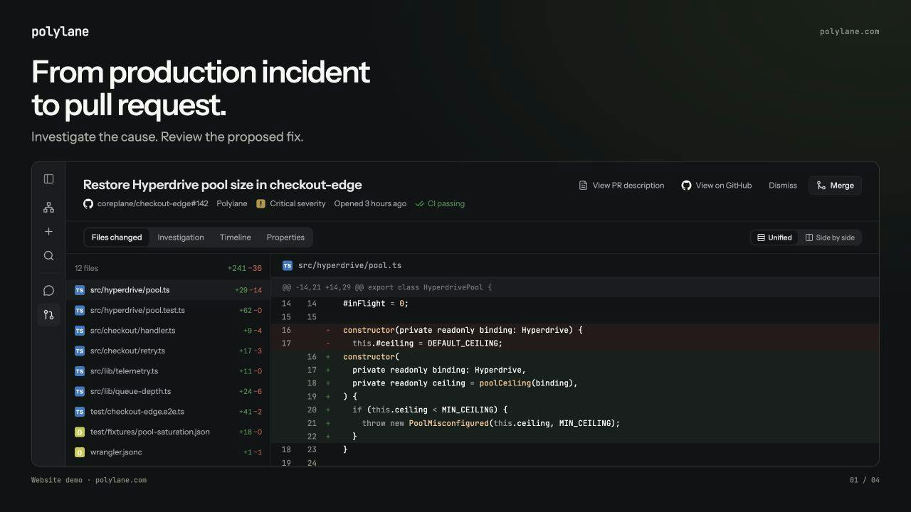

### 🎬 관련 영상
- [🎥 영상 보기](https://ph-files.imgix.net/d4cfe750-5e8b-4be0-832a-7d3ef868175d.jpeg?auto=format)

---

## 6. [DSH Desktop](https://www.producthunt.com/products/deepseek)
**Votes**: 151 | **도입 난이도**: 하 | **신뢰도**: 상
**Tagline**: Official app for DeepSeek’s open-source agent harness
**서비스 링크**: https://www.producthunt.com/r/YC57NDYO5VZR64

**태그**: DevTool, Automation, AI, Productivity, Agent

### 📌 이 서비스 한눈에 보기
DeepSeek의 오픈소스 에이전트 기능을 데스크톱 환경에서 편리하게 실행하는 공식 앱

### 🔑 주요 기능
- Mac 및 Windows를 지원하는 공식 데스크톱 애플리케이션
- CLI와 동일한 플러그인 시스템 제공
- 로컬 환경에서의 업무, 코딩 및 스케줄링 작업 수행

### 🙋 사용자에게 어떤 점이 좋은가
터미널 작업 없이도 GUI 환경에서 DeepSeek 에이전트를 활용해 코딩 및 자동화 작업을 직관적으로 수행할 수 있습니다.

### ✅ 지금 바로 써볼 기능
- 데스크톱 앱 설치 및 로그인
- 기존 CLI 플러그인 호환성 확인
- 로컬 자동화 작업 스케줄링 설정

### ⚠️ 사용 전 확인할 점
- 로컬 리소스 사용량에 따른 시스템 성능 영향 확인 필요
- 플러그인 시스템의 GUI 환경 안정성 검토

### 🧭 확인이 더 필요한 정보
상세한 시스템 요구 사양 및 플러그인 호환 범위에 대한 구체적인 정보가 필요합니다.

### 📸 스크린샷 및 갤러리

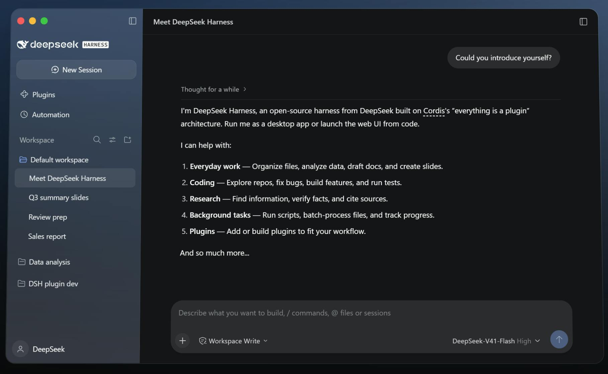
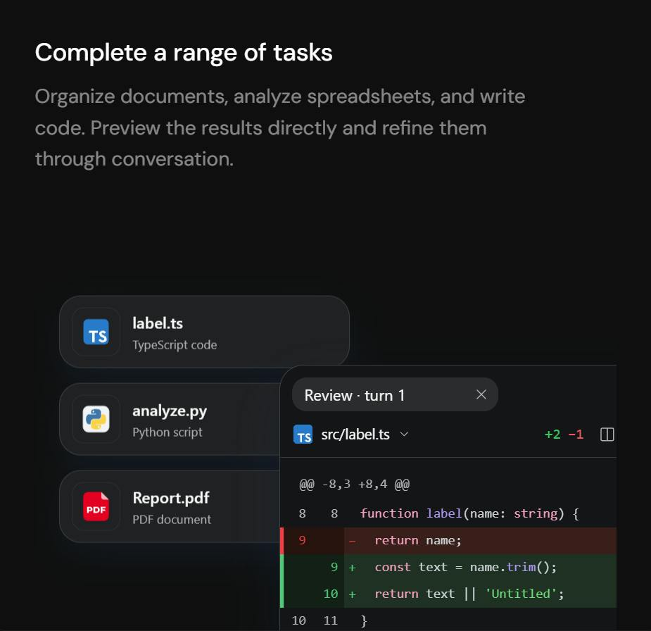

---

## 7. [statusbar](https://www.producthunt.com/products/statusbar)
**Votes**: 121 | **도입 난이도**: 하 | **신뢰도**: 중
**Tagline**: a statusbar for any terminal
**서비스 링크**: https://www.producthunt.com/r/SHKMUGXA7CK2KH

**태그**: DevTool, CLI, Terminal

### 📌 이 서비스 한눈에 보기
어떤 터미널 환경에서도 사용할 수 있는 범용 상태 표시줄

### 🔑 주요 기능
- 터미널 환경에 상태 표시줄 기능 제공
- 다양한 터미널 애플리케이션과의 호환성 지향
- 터미널 작업 중 실시간 정보 확인 가능

### 🙋 사용자에게 어떤 점이 좋은가
터미널 작업 중 시선을 분산시키지 않고도 필요한 상태 정보를 직관적으로 확인할 수 있습니다.

### ✅ 지금 바로 써볼 기능
- 현재 사용 중인 터미널에 설치 및 적용
- 상태 표시줄 레이아웃 커스텀 설정
- 필요한 정보 항목 구성

### ⚠️ 사용 전 확인할 점
- 터미널 종류에 따른 호환성 여부 확인 필요
- 상태 표시줄이 터미널 화면 영역을 차지할 수 있음

### 🧭 확인이 더 필요한 정보
제공되는 상세 기능과 설정 방법, 터미널별 호환 범위에 대한 구체적인 정보가 부족합니다.

### 📸 스크린샷 및 갤러리
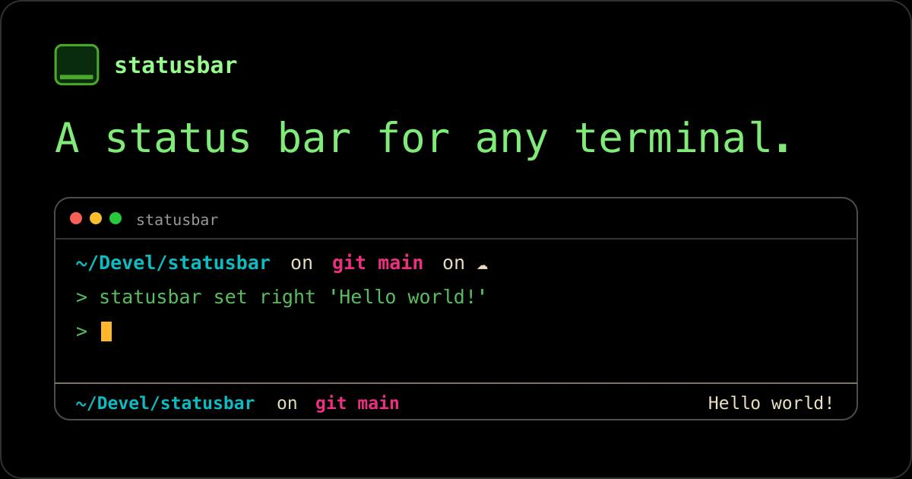

### 🎬 관련 영상
- [🎥 영상 보기](https://ph-files.imgix.net/27952e38-486c-4843-9354-47cbd8ee36fa.jpeg?auto=format)

---

## 8. [Chat.sh](https://www.producthunt.com/products/chat-sh)
**Votes**: 111 | **도입 난이도**: 하 | **신뢰도**: 상
**Tagline**: The help center I built after Intercom's search broke
**서비스 링크**: https://www.producthunt.com/r/QZFWCHS3EBGAVT

**태그**: AI, CustomerSupport, SaaS, NoCode, AI Tool, LLM, Chat, DevTool

### 📌 이 서비스 한눈에 보기
구독료 부담 없이 내 사이트에 직접 설치하는 AI 기반 지식 베이스 및 헬프 센터

### 🔑 주요 기능
- 출처를 명시하며 답변을 생성하는 AI 검색 기능
- 서브도메인이 아닌 사용자 사이트 내 폴더(yoursite.com/help) 형태로 운영 가능
- 모든 페이지를 마크다운 형식으로 제공하여 LLM 학습에 최적화

### 🙋 사용자에게 어떤 점이 좋은가
매달 나가는 구독료 부담 없이, AI가 직접 답변을 작성해주는 고도화된 고객 지원 센터를 내 도메인에 즉시 구축할 수 있습니다.

### ✅ 지금 바로 써볼 기능
- PHLAUNCH 코드를 사용하여 평생 라이선스 할인 혜์ 적용하기
- 기존 도움말 문서를 마크다운 형식으로 변환하여 업로드하기
- 자사 사이트의 특정 경로에 헬프 센터 연동하기

### ⚠️ 사용 전 확인할 점
- 현재는 헬프 센터 기능 중심이며, 채팅 메신저 및 지원 인박스 기능은 향후 출시 예정임
- 일회성 결제 프로모션이 특정 날짜(10월 2일)에 종료됨

### 🧭 확인이 더 필요한 정보
향후 출시될 채팅 메신저 및 지원 인박스 기능의 구체적인 가격 정책은 아직 공개되지 않았습니다.

### 📸 스크린샷 및 갤러리
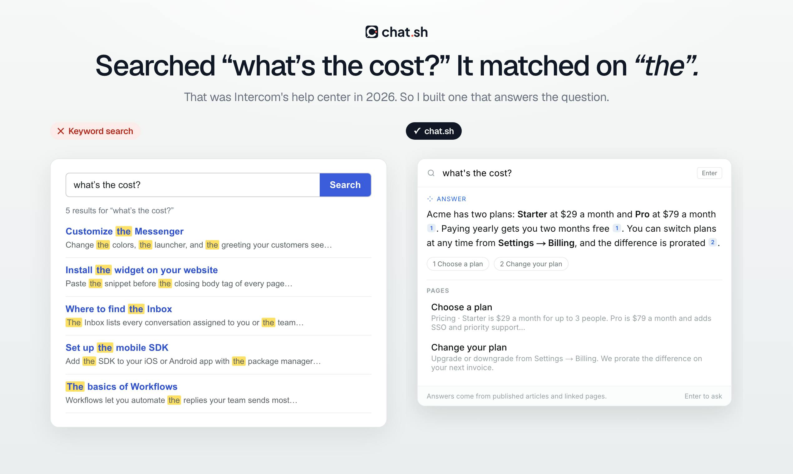
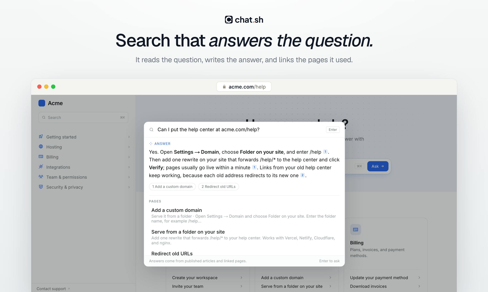
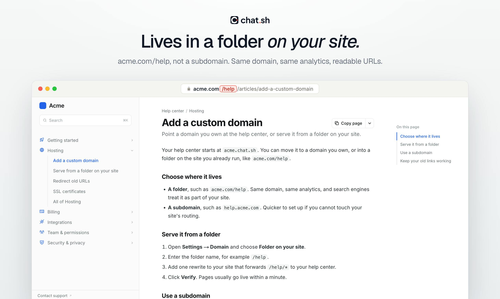

### 🎬 관련 영상
- [🎥 영상 보기](https://ph-files.imgix.net/e07d37ab-8cb5-435f-af56-ba8645e0c98a.jpeg?auto=format)

---

## 9. [Bracket](https://www.producthunt.com/products/bracket-2027)
**Votes**: 102 | **도입 난이도**: 하 | **신뢰도**: 상
**Tagline**: The memory layer for your business
**서비스 링크**: https://www.producthunt.com/r/YAOKSFHFNADYUT

**태그**: Productivity, Automation, KnowledgeManagement, AI, AI Tool

### 📌 이 서비스 한눈에 보기
업무 도구 간의 대화를 실시간으로 기록하여 비즈니스 지식 저장소로 만드는 자동 메모 레이어

### 🔑 주요 기능
- Gmail, Slack, Figma, GitHub 등 주요 협업 도구와 연동하여 대화 내용 자동 캡처
- 회의록, 요구사항, 결정 사항, 마감일 등을 수동 입력 없이 자동으로 정리
- 축적된 맥락을 바탕으로 질문에 답하거나 답변 초안 생성 가능

### 🙋 사용자에게 어떤 점이 좋은가
별도의 관리 도구를 업데이트할 필요 없이, 업무 과정에서 발생하는 모든 맥락을 자동으로 자산화하여 정보 탐색 시간을 줄여줍니다.

### ✅ 지금 바로 써볼 기능
- 기존 협업 툴(Slack, GitHub 등) 연동하기
- 회의록 및 트랜스크립트 업로드하여 데이터 축적하기
- 축적된 맥락을 바탕으로 질문 및 답변 생성 기능 테스트하기

### ⚠️ 사용 전 확인할 점
- 다양한 플랫폼의 데이터를 수집하므로 데이터 보안 및 개인정보 보호 정책 확인 필요
- 자동 캡처된 내용의 정확성을 검토하는 과정이 필요할 수 있음

### 🧭 확인이 더 필요한 정보
지원하는 외부 서비스의 범위와 데이터 보안 수준에 대한 상세 정보 확인이 필요합니다.

### 📸 스크린샷 및 갤러리
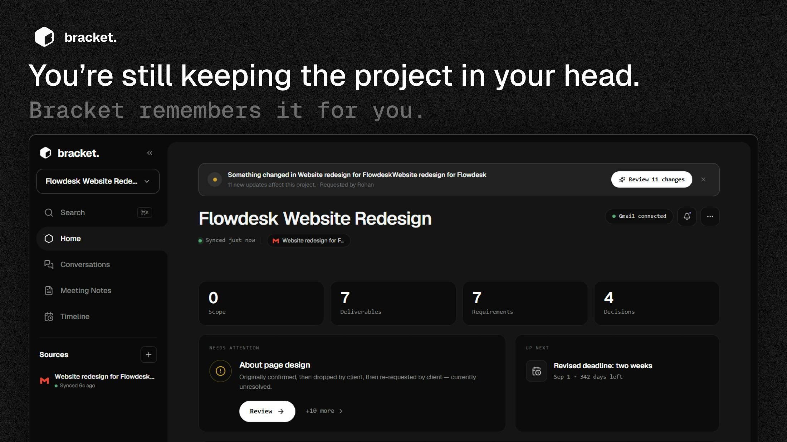
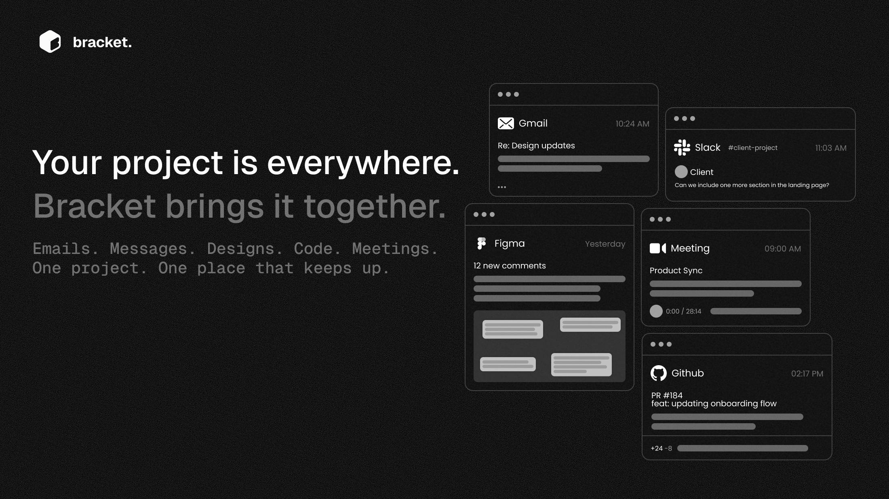
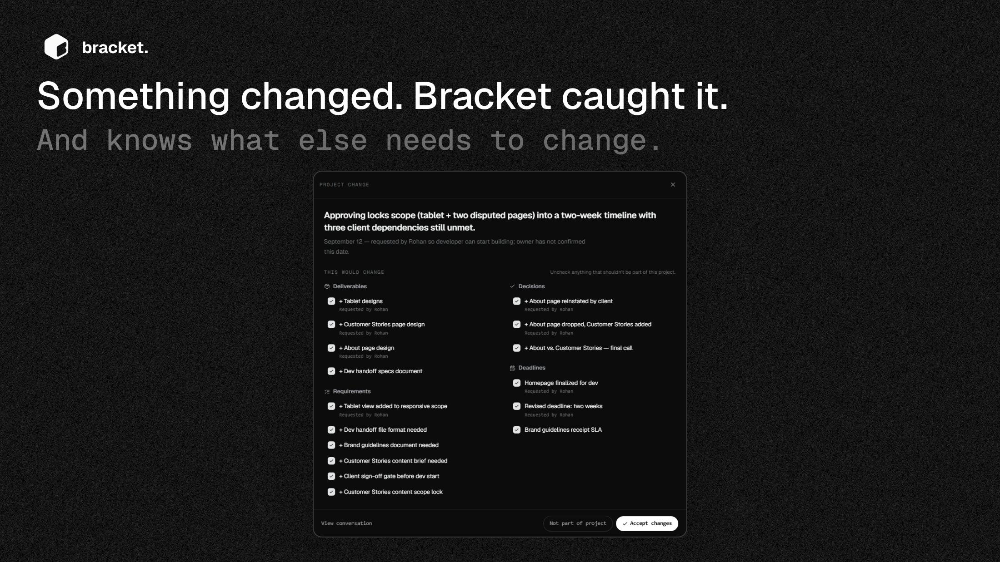

---

## 10. [Cura](https://www.producthunt.com/products/cura-3)
**Votes**: 98 | **도입 난이도**: 하 | **신뢰도**: 상
**Tagline**: Your AI travel agent that plans, books, and adapts
**서비스 링크**: https://www.producthunt.com/r/6QZW4MRIOA7EMT

**태그**: Travel, AI, Automation, Personal Assistant, Agent, AI Tool

### 📌 이 서비스 한눈에 보기
여행 계획부터 예약, 일정 변경까지 알아서 처리하는 AI 개인 여행 비서

### 🔑 주요 기능
- 사용자 취향을 학습하여 맞춤형 일정 및 항공/숙소 제안
- 단순 정보 제공을 넘어 예약 및 체크인 등 실질적인 액션 수행
- 복잡한 상황 발생 시 전문 인간 여행 어드바이저 연결 지원

### 🙋 사용자에게 어떤 점이 좋은가
여행 계획에 드는 시간을 획기적으로 줄여주며, 예약 관리와 일정 변경의 번거로움을 자동화로 해결해 줍니다.

### ✅ 지금 바로 써볼 기능
- 가고 싶은 목적지를 입력하여 맞춤형 일정 생성해보기
- 제안된 항공 및 숙소의 추천 사유 확인하기
- 여행 중 발생하는 일정 변경 기능 테스트하기

### ⚠️ 사용 전 확인할 점
- AI의 자동 예약 과정에서 발생할 수 있는 결제 및 개인정보 보안 확인 필요
- 인간 어드바이저 개입 시 추가 비용 발생 여부 확인 필요

### 🧭 확인이 더 필요한 정보
실제 예약 결제 프로세스의 완전 자동화 범위와 서비스 이용 요금 체계에 대한 정보가 부족합니다.

### 📸 스크린샷 및 갤러리
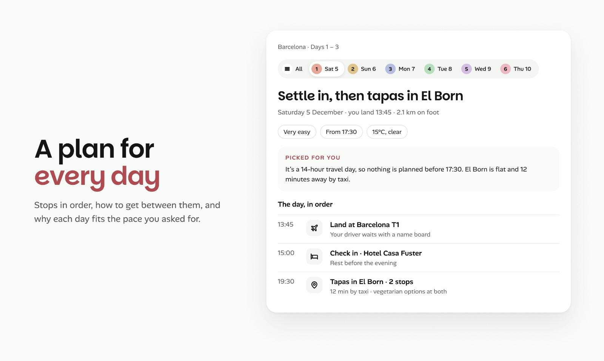
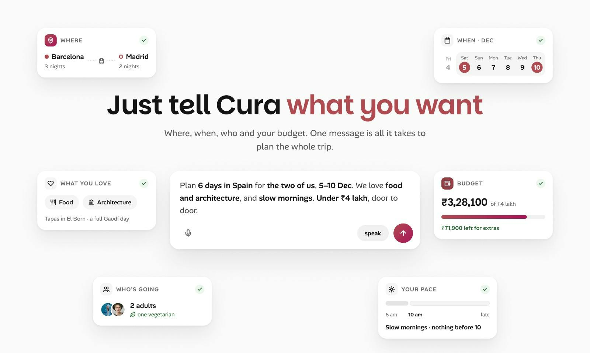
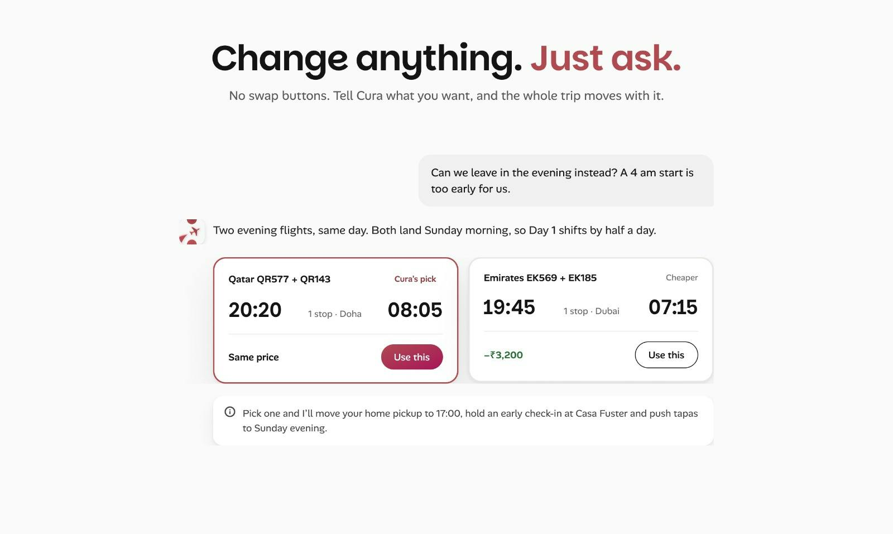

### 🎬 관련 영상
- [🎥 영상 보기](https://ph-files.imgix.net/a5cf9ab6-1c82-4c82-9ef5-9c000b6b3074.jpeg?auto=format)

---

## 11. [America.gov](https://www.producthunt.com/products/america-gov)
**Votes**: 96 | **도입 난이도**: 하 | **신뢰도**: 상
**Tagline**: Whatever you need from government, start here.
**서비스 링크**: https://www.producthunt.com/r/7FOZUEKVF5FBT7

**태그**: Government, Search, Information, AI Tool, Chat, Design

### 📌 이 서비스 한눈에 보기
미국 정부의 모든 정보를 한곳에서 쉽고 빠르게 찾는 통합 정보 서비스

### 🔑 주요 기능
- 여러 정부 기관 사이트를 돌아다닐 필요 없는 통합 검색 기능
- 일상적인 언어로 질문하면 명확한 답변을 제공하는 직관적 인터페이스
- 영어, 프랑스어, 스페인어 지원 및 향후 신청/추적 기능 확장 예정

### 🙋 사용자에게 어떤 점이 좋은가
복잡한 정부 웹사이트를 개별적으로 탐색하는 번거로움을 줄이고, 필요한 정보를 즉각적으로 얻을 수 있습니다.

### ✅ 지금 바로 써볼 기능
- 일상 언어로 정부 정보 질문해보기
- 필요한 정부 정보 검색해보기
- 지원되는 언어 설정 확인하기

### ⚠️ 사용 전 확인할 점
- 현재는 정보 제공 중심이며, 실제 신청이나 등록 기능은 향후 업데이트 예정임
- 질문에 대한 답변의 정확성을 반드시 공식 기관 사이트에서 재확인해야 함

### 🧭 확인이 더 필요한 정보
향후 도입될 신청 및 추적 기능의 구체적인 구현 방식과 보안 정책을 확인해야 합니다.

### 📸 스크린샷 및 갤러리

---

## 12. [Buddy Drop](https://www.producthunt.com/products/buddy)
**Votes**: 95 | **도입 난이도**: 하 | **신뢰도**: 상
**Tagline**: Drop the files, get a live URL in seconds
**서비스 링크**: https://www.producthunt.com/r/YRBSE3VIURGQHU

**태그**: DevTool, Hosting, Deployment, NoCode, AI Tool

### 📌 이 서비스 한눈에 보기
파일 드롭만으로 즉시 웹사이트를 배포하는 초간편 호스팅 서비스

### 🔑 주요 기능
- 폴더나 ZIP 파일을 드래그 앤 드롭하여 즉시 온라인 배포
- 가입 절차 없이 바로 사용 가능한 빠른 워크플로우
- 무료 도메인 제공 및 사용자 정의 도메인 연결 지원

### 🙋 사용자에게 어떤 점이 좋은가
복잡한 설정 없이 아이디어를 즉시 웹상에 공개하고 싶을 때 매우 유용합니다.

### ✅ 지금 바로 써볼 기능
- 로컬 프로젝트 폴더를 드래그하여 즉시 배포해보기
- 제공되는 무료 도메인으로 라이브 URL 생성하기
- 버전 관리 기능을 통해 변경 사항 확인하기

### ⚠️ 사용 전 확인할 점
- 가입 없이 사용하므로 데이터 영속성 및 관리 방식 확인 필요
- 무료 도메인의 제약 사항 및 커스텀 도메인 연결 설정 확인 필요

### 🧭 확인이 더 필요한 정보
가입 없이 사용 시 데이터 보관 기간 및 보안 정책에 대한 상세 정보가 필요합니다.

### 📸 스크린샷 및 갤러리
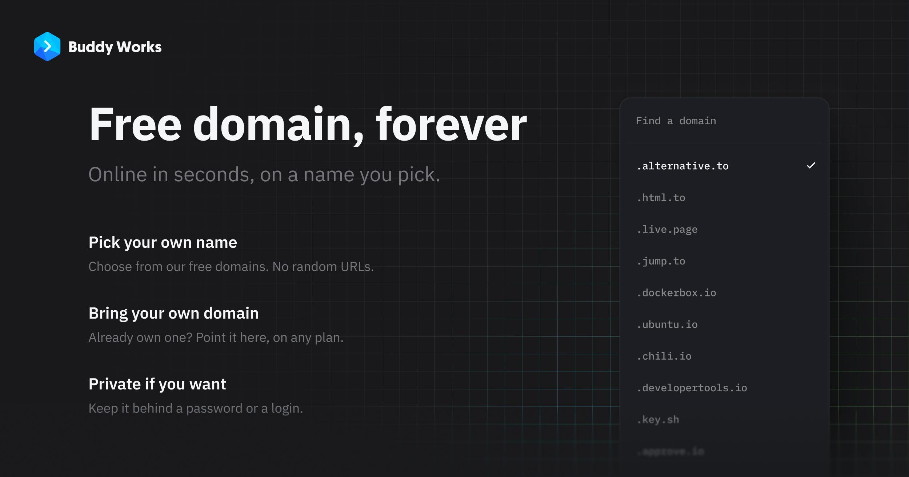
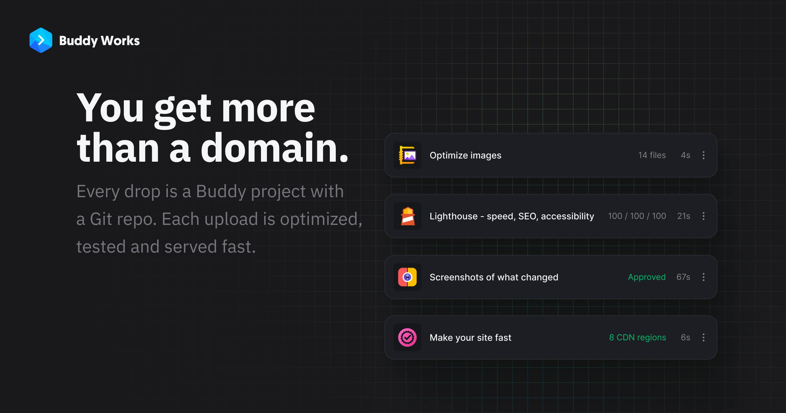
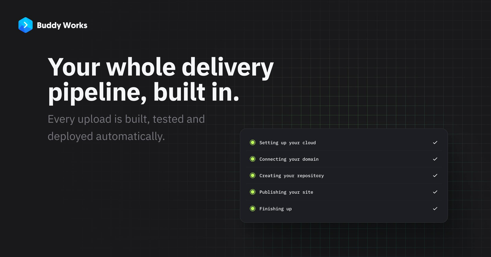

### 🎬 관련 영상
- [🎥 영상 보기](https://ph-files.imgix.net/86c886ee-d353-4a17-84ba-c3dab4f35bed.jpeg?auto=format)

---

## 13. [Starlie](https://www.producthunt.com/products/starlie)
**Votes**: 92 | **도입 난이도**: 하 | **신뢰도**: 상
**Tagline**: A fast, native Jira client for Mac
**서비스 링크**: https://www.producthunt.com/r/GAZJIPGQR23AZU

**태그**: DevTool, Productivity, Mac, Jira, Design, Analytics

### 📌 이 서비스 한눈에 보기
Mac 환경에 최적화된 빠르고 직관적인 네이티브 Jira 클라이언트

### 🔑 주요 기능
- Mac 네이티브 앱으로 구현된 매끄러운 Kanban 드래그 앤 드롭 및 빠른 필터링
- JQL 자동 완성, 커스텀 필드, Quick Look 등 생산성 중심의 기능 제공
- 개인정보 보호를 최우선으로 하는 설계 (분석 및 추적 기능 없음)

### 🙋 사용자에게 어떤 점이 좋은가
웹 브라우저 기반의 Jira보다 훨씬 빠르고 가벼운 작업 환경을 제공하며, 개발자 워크플로우에 최적화된 인터페이스를 통해 업무 전환 비용을 줄여줍니다.

### ✅ 지금 바로 써볼 기능
- ⌘K 단축키를 활용한 최근 이슈 빠른 탐색
- Kanban 보드에서의 드래그 앤 드롭 작업
- Claude Code/Codex를 통한 이슈 맥락 기반 코딩

### ⚠️ 사용 전 확인할 점
- Mac 전용 클라이언트이므로 Windows나 Linux 사용자는 사용 불가
- Jira Cloud 및 Self-hosted 환경과의 호환성 확인 필요

### 🧭 확인이 더 필요한 정보
사용자의 구체적인 Jira 권한 설정에 따른 기능 제한 여부는 명시되지 않았습니다.

### 📸 스크린샷 및 갤러리
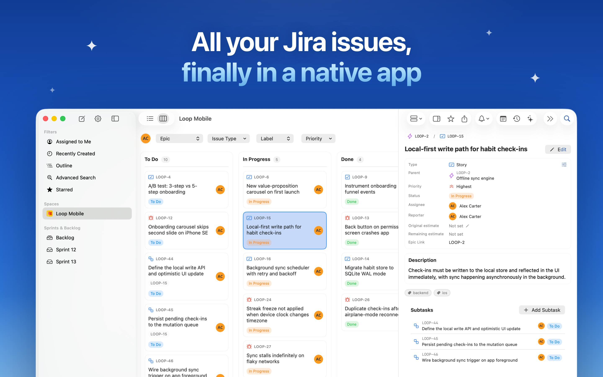
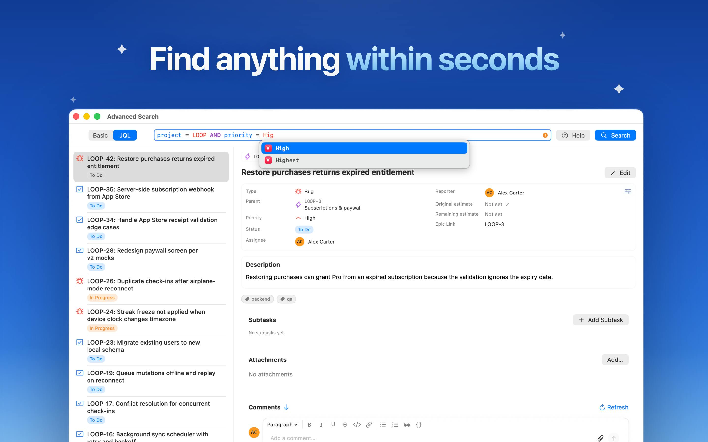
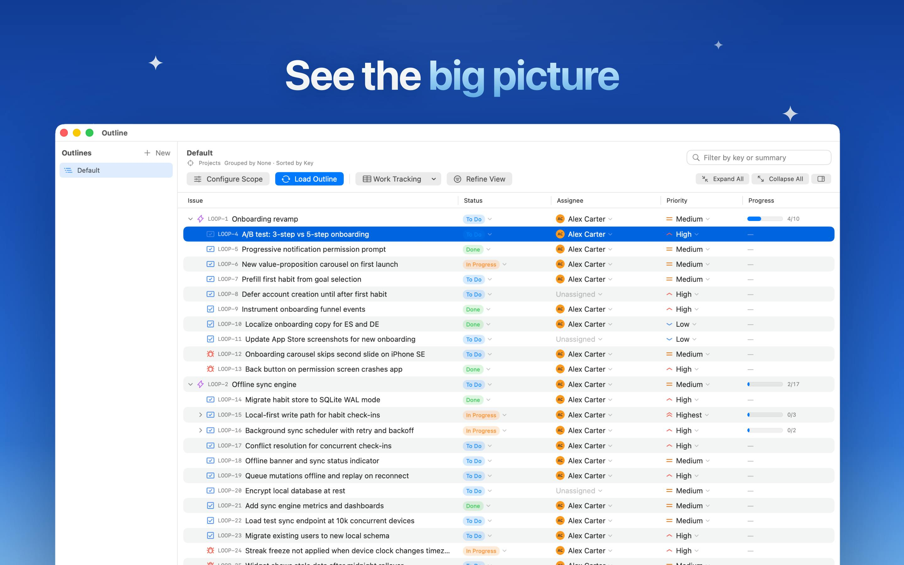

---

## 14. [Phare C1®](https://www.producthunt.com/products/phare-c1)
**Votes**: 86 | **도입 난이도**: 하 | **신뢰도**: 상
**Tagline**: A smoke alarm that detects fire, not toast. 
**서비스 링크**: https://www.producthunt.com/r/CQAQJHEYAXKOLB

**태그**: Smart Home, Safety, IoT, Security, AI Tool

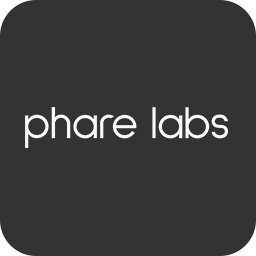

### 📌 이 서비스 한눈에 보기
오작동 없는 정확한 화재 감지와 스마트 홈 보안을 결합한 차세대 연기 경보기

### 🔑 주요 기능
- 멀티 센서 어레이와 학습 알고리즘을 통한 오작동(음식 조리 등) 최소화
- 화재 및 일산화탄소(CO) 조기 감지 및 실시간 앱 알림
- 공기 질 모니터링 및 침입자 감지 등 확장된 스마트 기능

### 🙋 사용자에게 어떤 점이 좋은가
불필요한 가짜 알람으로 인한 스트레스를 줄이면서, 화재와 침입으로부터 집을 더 안전하게 보호할 수 있습니다.

### ✅ 지금 바로 써볼 기능
- 정확한 화재 감지 기능 테스트
- 실시간 공기 질 모니터링 확인
- 침입자 감지 및 야간 조명 기능 활용

### ⚠️ 사용 전 확인할 점
- Nest Protect와 같은 기존 스마트 홈 생태계와의 호환성 확인 필요
- 센서 정밀도 및 알고리즘의 실제 성능 검증 필요

### 🧭 확인이 더 필요한 정보
제품의 구체적인 설치 방법 및 기존 스마트 홈 플랫폼(HomeKit, Google Home 등)과의 연동 여부를 확인해야 합니다.

### 📸 스크린샷 및 갤러리

### 🎬 관련 영상
- [🎥 영상 보기](https://ph-files.imgix.net/ddd7a00e-722f-4bba-8f48-d3db0c0cbfb6.jpeg?auto=format)

---

## 15. [Helo](https://www.producthunt.com/products/helo-2)
**Votes**: 80 | **도입 난이도**: 중 | **신뢰도**: 상
**Tagline**: An independent email API from former Postmark folks
**서비스 링크**: https://www.producthunt.com/r/RFUC3OFNIQ4657

**태그**: DevTool, EmailAPI, SaaS, Backend, AI Tool, API, Email

### 📌 이 서비스 한눈에 보기
고객 대신 이메일을 발송하는 플랫폼을 위한 멀티 테넌트 특화 이메일 API

### 🔑 주요 기능
- 고객별 도메인 발송 및 테넌트별 데이터(통계, 수신거부, 인증 정보) 분리 기능
- 악성 발신자를 격리하여 전체 도메인 평판 저하 방지
- REST API, SMTP, 다양한 언어의 SDK 및 트랜잭션/브로드캐스트 인프라 분리 제공

### 🙋 사용자에게 어떤 점이 좋은가
고객을 대신해 이메일을 보내는 SaaS 개발자가 고객별로 격리된 환경에서 안전하고 효율적으로 이메일 서비스를 운영할 수 있게 해줍니다.

### ✅ 지금 바로 써볼 기능
- 고객별 도메인 설정 및 격리 기능 테스트
- 사용 중인 언어의 SDK 호환성 확인
- 사용량 기반 요금제(건당 $0.00035~) 적용 시뮬레이션

### ⚠️ 사용 전 확인할 점
- 멀티 테넌트 환경에 최적화되어 있어 단일 사용자용으로는 오버스펙일 수 있음
- Postmark 출신 팀의 신규 서비스로 초기 안정성 및 레퍼런스 확인 필요

### 🧭 확인이 더 필요한 정보
상세한 SDK 지원 범위와 특정 언어/프레임워크의 호환성 여부를 확인해야 합니다.

### 📸 스크린샷 및 갤러리
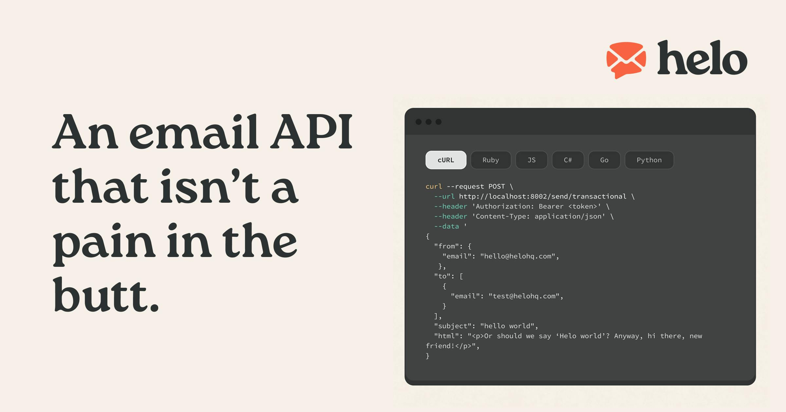
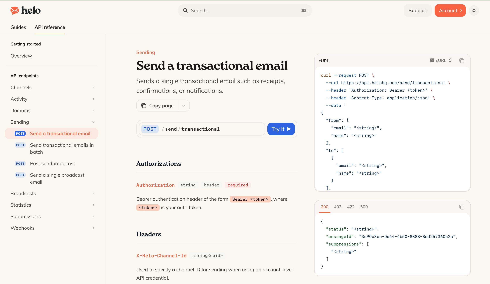
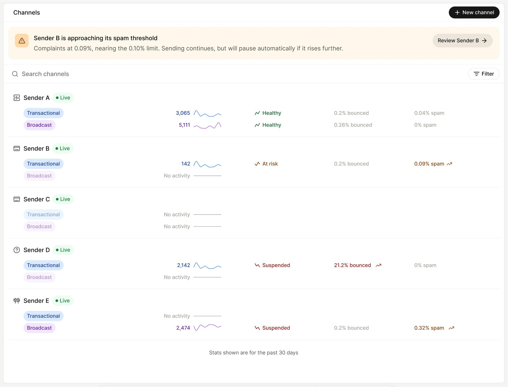

---

## 16. [Vitra.ai ](https://www.producthunt.com/products/vitra-ai-agentic-content-platform)
**Votes**: 80 | **도입 난이도**: 중 | **신뢰도**: 상
**Tagline**: Agentic content platform to create and localize content
**서비스 링크**: https://www.producthunt.com/r/REQ3EWB5N2MXPJ

**태그**: Automation, ContentCreation, Localization, AI-Agents, Marketing, Agent, AI Tool, Video, Vision, Design

### 📌 이 서비스 한눈에 보기
콘텐츠 제작부터 현지화까지 한 곳에서 해결하는 에이전트 기반 통합 콘텐츠 운영 플랫폼

### 🔑 주요 기능
- 영상, 이미지, 문서, 오디오를 100개 이상의 언어로 생성 및 현지화
- 립싱크 더빙, 디자인 도구(Figma, Canva, Adobe) 연동 및 사이즈 자동 최적화
- AI 에이전트(Vitra Flow)를 통한 엔드 투 엔드 워크플로우 자동화

### 🙋 사용자에게 어떤 점이 좋은가
여러 도구를 번갈아 사용할 필요 없이 하나의 플랫폼에서 글로벌 콘텐츠 제작과 배포를 자동화하여 작업 시간을 획기적으로 단축할 수 있습니다.

### ✅ 지금 바로 써볼 기능
- Vitra Flow를 활용한 워크플로우 자동화 설정
- 기존 디자인(Figma, Canva 등)의 자동 번역 및 사이즈 변환 테스트
- 립싱크 기능을 활용한 영상 현지화 결과물 확인

### ⚠️ 사용 전 확인할 점
- AI 생성 콘텐츠의 품질이 브랜드 가이드라인과 일치하는지 검토 필요
- 복잡한 워크플로우 설정 시 초기 학습 곡선이 존재할 수 있음

### 🧭 확인이 더 필요한 정보
제공되는 12개 도구의 구체적인 기능 목록과 상세 가격 정책에 대한 정보가 필요합니다.

### 📸 스크린샷 및 갤러리

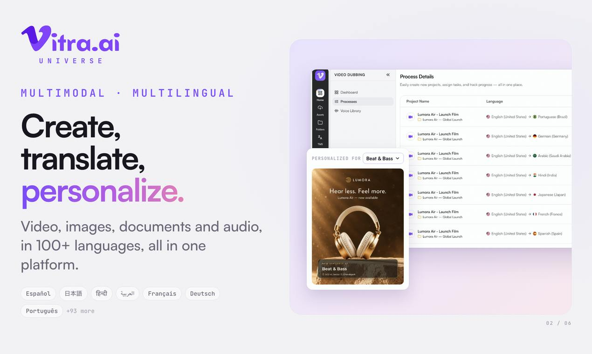
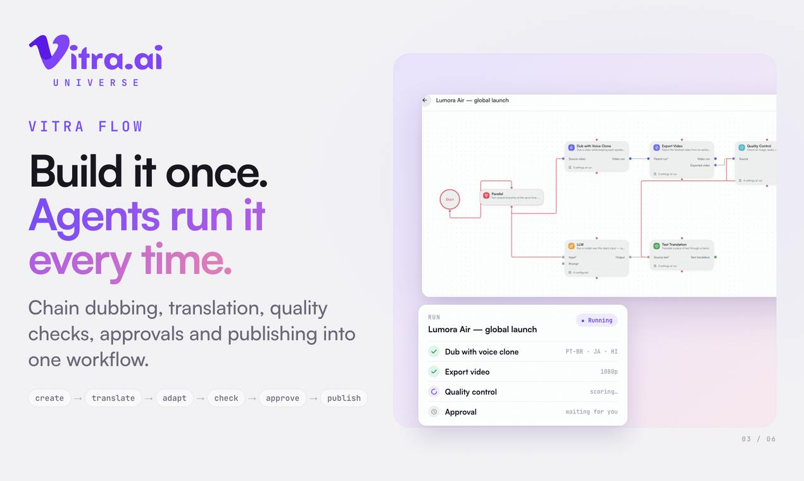

### 🎬 관련 영상
- [🎥 영상 보기](https://ph-files.imgix.net/7d0cdb19-c54d-41d1-bcca-71615f6a8e22.jpeg?auto=format)

---

## 17. [NotchMind](https://www.producthunt.com/products/notchmind)
**Votes**: 79 | **도입 난이도**: 하 | **신뢰도**: 상
**Tagline**: Put your MacBook notch to work: music, files, timers & more
**서비스 링크**: https://www.producthunt.com/r/FWAHM22Y2VJCWT

**태그**: Productivity, macOS, Utility

### 📌 이 서비스 한눈에 보기
맥북 노치 공간을 활용해 음악, 파일, 타이머 등 28가지 도구를 사용하는 생산성 앱

### 🔑 주요 기능
- 맥북 노치 영역을 활용한 직관적인 인터페이스
- 음악 컨트롤, 클립보드 히스토리, 타이머 등 28가지 유틸리티 제공
- 한 번의 구매로 평생 사용하는 네이티브 macOS 앱

### 🙋 사용자에게 어떤 점이 좋은가
데스크탑 공간을 차지하지 않고 맥북 상단 노치 영역을 활용해 일상적인 작업 흐름을 효율적으로 관리할 수 있습니다.

### ✅ 지금 바로 써볼 기능
- 노치 영역을 통한 음악 컨트롤 기능 사용해보기
- 클립보드 히스토리 및 파일 관리 기능 활용하기
- 28가지 다양한 유틸리티 도구 탐색하기

### ⚠️ 사용 전 확인할 점
- 노치 디자인이 없는 구형 맥북 모델에서는 활용도가 낮을 수 있음
- 상단 영역을 상시 점유하므로 화면 가독성에 영향을 줄 수 있음

### 🧭 확인이 더 필요한 정보
28가지 도구의 구체적인 목록과 세부 기능은 제품 설명에 명시되지 않았습니다.

### 📸 스크린샷 및 갤러리
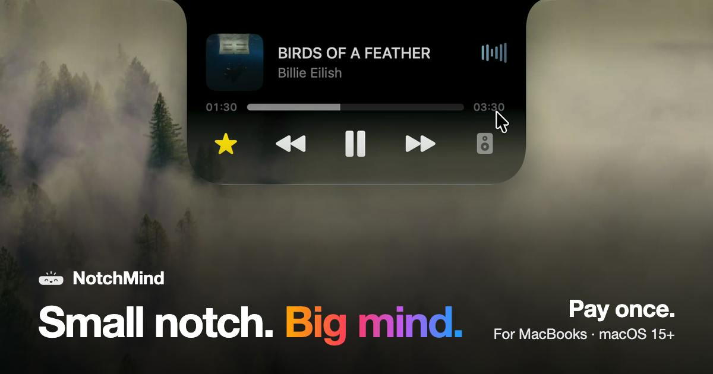

### 🎬 관련 영상
- [🎥 영상 보기](https://ph-files.imgix.net/def3f83a-4f68-4702-9bb5-29dc642dfa10.jpeg?auto=format)

---

## 18. [Basedash chat dashboard preview](https://www.producthunt.com/products/basedash)
**Votes**: 79 | **도입 난이도**: 하 | **신뢰도**: 상
**Tagline**: One prompt. A whole dashboard, live in your chat.
**서비스 링크**: https://www.producthunt.com/r/AI4M3NUYJE5A4O

**태그**: AI, Analytics, Dashboard, Productivity, NoCode, Chat, Prompting, Sales

### 📌 이 서비스 한눈에 보기
채팅창에 한 줄만 입력하면 즉시 생성되는 대화형 데이터 대시보드

### 🔑 주요 기능
- 단일 프롬프트로 KPI, 차트, 테이블, 필터가 포함된 대시보드 자동 생성
- 채팅창 내에서 실시간 미리보기 및 즉각적인 데이터 확인 가능
- 필터 변경 및 탭 전환 등 대화형 인터페이스를 통한 데이터 탐색

### 🙋 사용자에게 어떤 점이 좋은가
복잡한 대시보드 구축 과정 없이 자연어로 원하는 지표를 즉시 시각화하여 의사결정 속도를 높일 수 있습니다.

### ✅ 지금 바로 써볼 기능
- 원하는 지표를 포함한 대시보드 생성 요청하기
- 생성된 대시보드의 필터 및 탭 기능 테스트하기
- 채팅창 내 미리보드를 전체 대시보드로 확장하여 확인하기

### ⚠️ 사용 전 확인할 점
- 프롬프트의 구체성에 따라 생성되는 대시보드의 품질이 달라질 수 있음
- 복잡한 데이터 관계나 특수한 비즈니스 로직 반영 여부 확인 필요

### 🧭 확인이 더 필요한 정보
사용자의 기존 데이터 소스(DB, SaaS 등)와의 연동 방식 및 보안 수준에 대한 정보가 필요합니다.

### 📸 스크린샷 및 갤러리
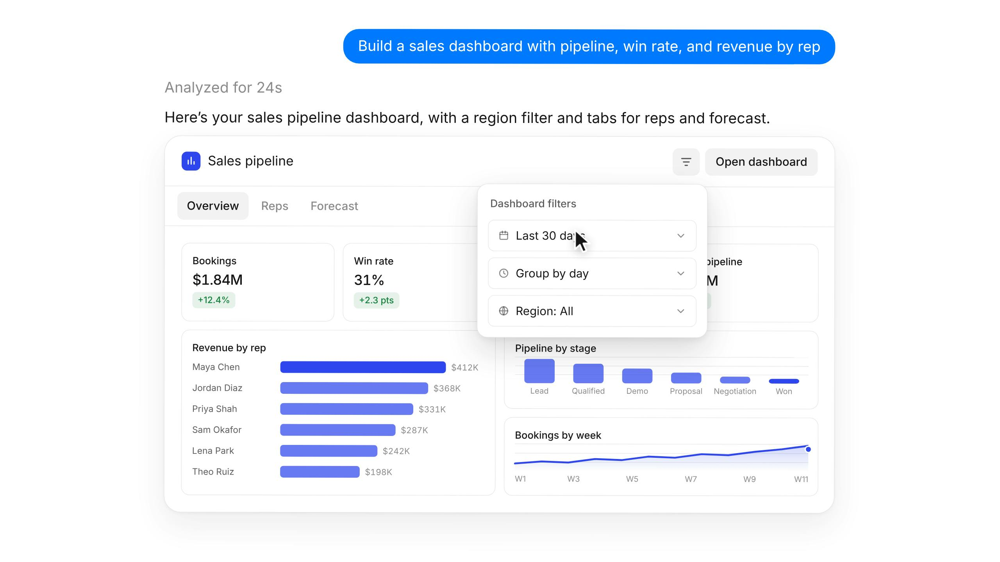
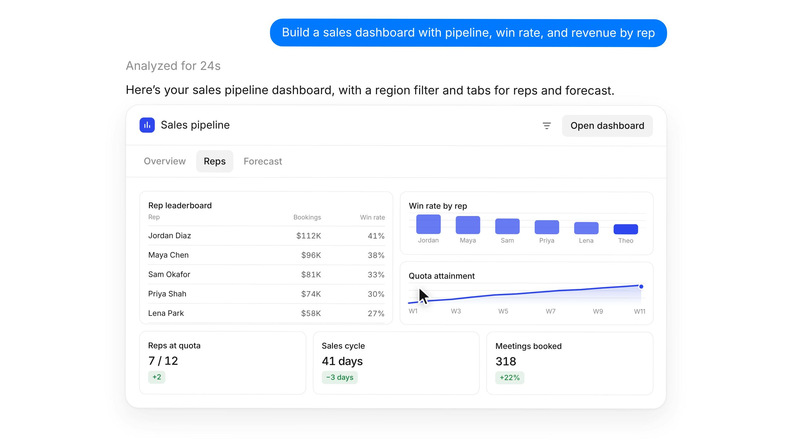
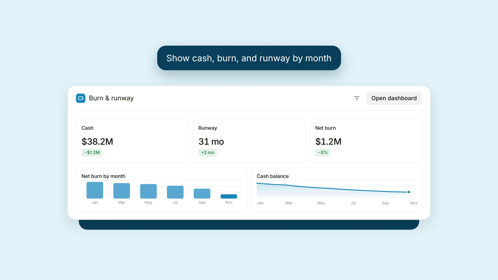

### 🎬 관련 영상
- [🎥 영상 보기](https://ph-files.imgix.net/cc7d5dd4-5328-4b98-b4f8-e05e353464a6.jpeg?auto=format)

---

## 19. [JevGPT](https://www.producthunt.com/products/jevgpt)
**Votes**: 78 | **도입 난이도**: 하 | **신뢰도**: 상
**Tagline**: A chatbot built on a model that can't write
**서비스 링크**: https://www.producthunt.com/r/D3HRN34FKUFSJT

**태그**: AI, OpenSource, LLM, Experimental, Chat

### 📌 이 서비스 한눈에 보기
의사결정 모델을 기반으로 한 독특한 방식의 객관식형 챗봇

### 🔑 주요 기능
- 텍스트 생성이 아닌 선택(Choice)에 특화된 Jev 모델 기반
- 매 답변을 객관식 단어 선택 방식으로 생성하는 실험적 구조
- 오픈 소스로 공개된 실험적 프로젝트

### 🙋 사용자에게 어떤 점이 좋은가
기존 LLM의 텍스트 생성 방식에서 벗어나, 의사결정 모델이 어떻게 대화에 적용되는지 실험해 볼 수 있습니다.

### ✅ 지금 바로 써볼 기능
- Jev 모델의 답변 방식 경험하기
- 오픈 소스 코드 분석하기

### ⚠️ 사용 전 확인할 점
- 텍스트 생성 능력이 부족하여 일반적인 대화에는 부적합할 수 있음
- 실험적 성격이 강해 안정적인 서비스 활용은 어려움

### 🧭 확인이 더 필요한 정보
모델의 구체적인 의사결정 알고리즘과 성능 지표에 대한 정보가 부족합니다.

### 📸 스크린샷 및 갤러리
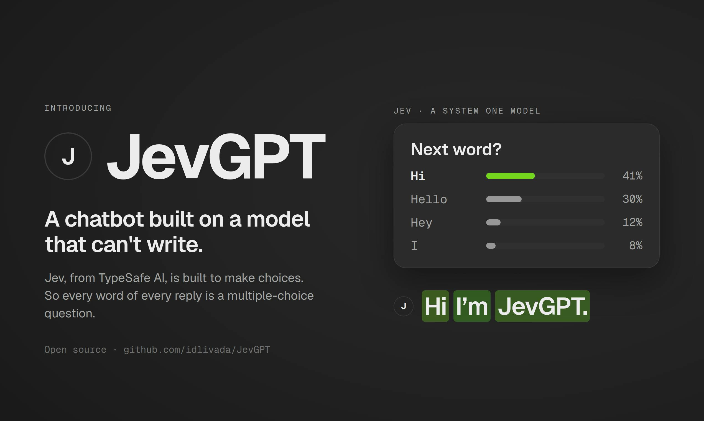
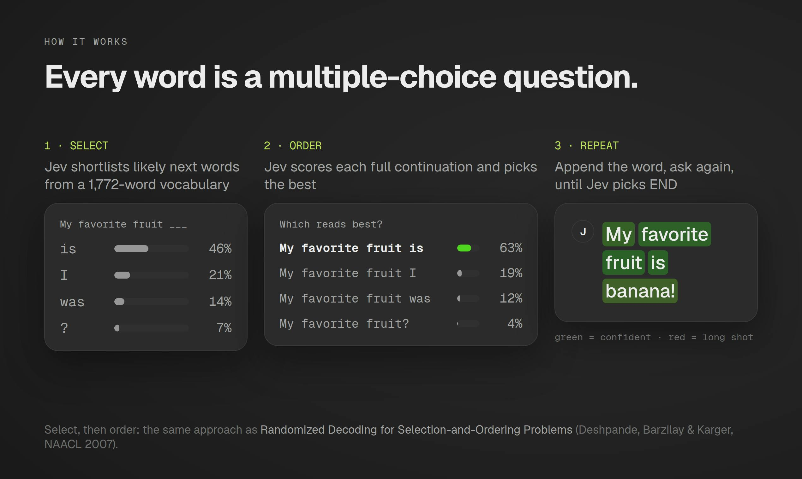
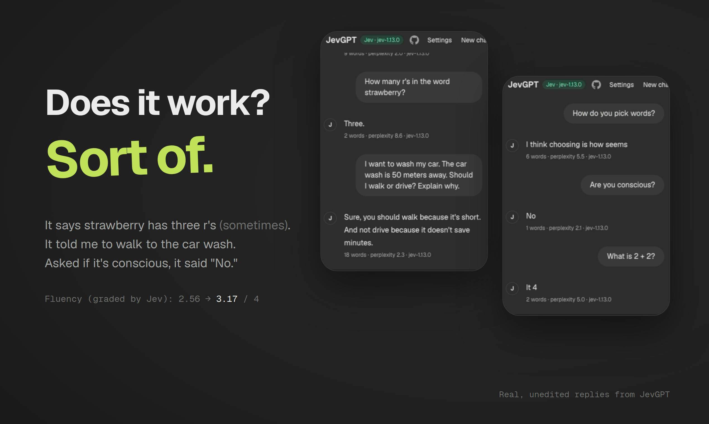

### 🎬 관련 영상
- [🎥 영상 보기](https://ph-files.imgix.net/2a0d15a6-d662-49bd-bb42-fef7925beb9f.jpeg?auto=format)

---

## 20. [Clarity](https://www.producthunt.com/products/kugelaudio)
**Votes**: 77 | **도입 난이도**: 중 | **신뢰도**: 상
**Tagline**: Mute the room, keep the speaker, in real time
**서비스 링크**: https://www.producthunt.com/r/GM7XYUENHWDSFU

**태그**: AI, Audio, Voice-Agent, Real-time, Agent

### 📌 이 서비스 한눈에 보기
실시간 음성 향상 및 타겟 화자 추출 기술로 통화 중 배경 소음과 주변 소음을 제거합니다.

### 🔑 주요 기능
- 실시간 음성 향상 및 타겟 화자 추출 기능 제공
- 배경 소음 및 주변 대화 소리를 제거하여 특정 화자 음성만 추출
- 오디오가 도착하는 즉시 스트리밍 방식으로 작동

### 🙋 사용자에게 어떤 점이 좋은가
음성 에이전트나 콜센터 환경에서 주변 소음 없이 통화 상대방의 목소리만 깨끗하게 전달받을 수 있습니다.

### ✅ 지금 바로 써볼 기능
- 웹사이트에서 제공하는 Before/After 비교 기능 체험하기
- 실시간 스트리밍 환경에서의 지연 시간 확인하기

### ⚠️ 사용 전 확인할 점
- 실시간 처리에 따른 컴퓨팅 자원 소모량 확인 필요
- 특정 환경에서의 화자 분리 정확도 검증 필요

### 🧭 확인이 더 필요한 정보
API 제공 방식, 가격 정책 및 구체적인 기술 스택에 대한 정보가 명시되지 않았습니다.

### 📸 스크린샷 및 갤러리

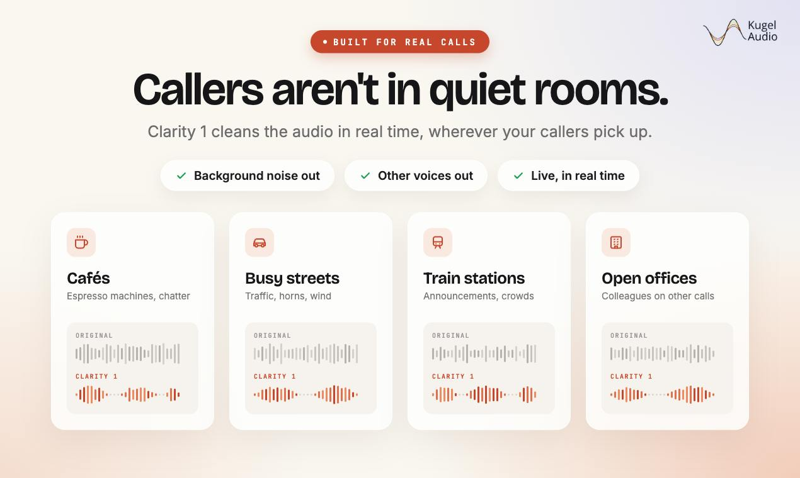

### 🎬 관련 영상
- [🎥 영상 보기](https://ph-files.imgix.net/42085392-0ff8-47fb-bc4f-26554d85915a.jpeg?auto=format)

---

## 21. [Firetower](https://www.producthunt.com/products/firetower)
**Votes**: 76 | **도입 난이도**: 상 | **신뢰도**: 상
**Tagline**: Run coding agents on your own servers, from anywhere
**서비스 링크**: https://www.producthunt.com/r/QXRRB3RAQVN4JU

**태그**: DevTool, AI, OpenSource, SelfHosted, Rust, Agent

### 📌 이 서비스 한눈에 보기
자체 서버에서 코딩 에이전트를 실행하여 어디서든 제어할 수 있는 오픈소스 도구

### 🔑 주요 기능
- Claude Code, Codex와 같은 코딩 에이전트 지원
- 사용자가 직접 제어하는 인프라에서 실행 가능
- 데스크톱 및 모바일 환경에서 원격 관리 지원

### 🙋 사용자에게 어떤 점이 좋은가
자신의 서버를 활용해 보안과 제어권을 유지하면서, 장소에 구애받지 않고 강력한 AI 코딩 에이전트를 운용할 수 있습니다.

### ✅ 지금 바로 써볼 기능
- 자체 서버에 Firetower 설치 및 환경 구축
- Claude Code 등 선호하는 코딩 에이전트 연결
- 데스크톱/모바일 환경에서의 원격 제어 테스트

### ⚠️ 사용 전 확인할 점
- 직접 서버를 관리해야 하므로 인프라 설정 및 유지보수 역량 필요
- 자체 서버의 보안 설정 및 네트워크 환경에 따른 접근성 차이 발생 가능

### 🧭 확인이 더 필요한 정보
사용자의 서버 사양에 따른 에이전트 성능 및 구체적인 모바일 인터페이스 수준은 확인이 필요합니다.

### 📸 스크린샷 및 갤러리
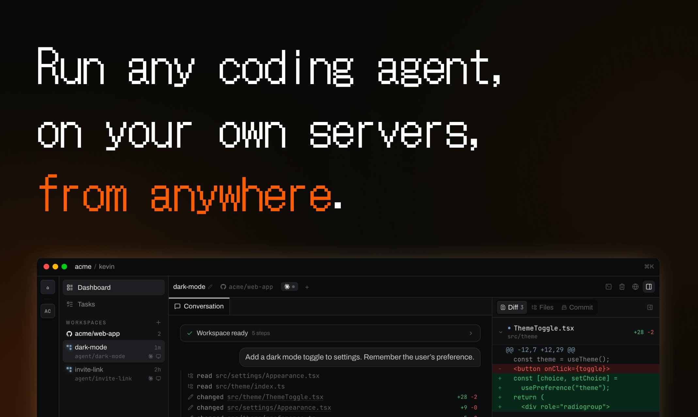
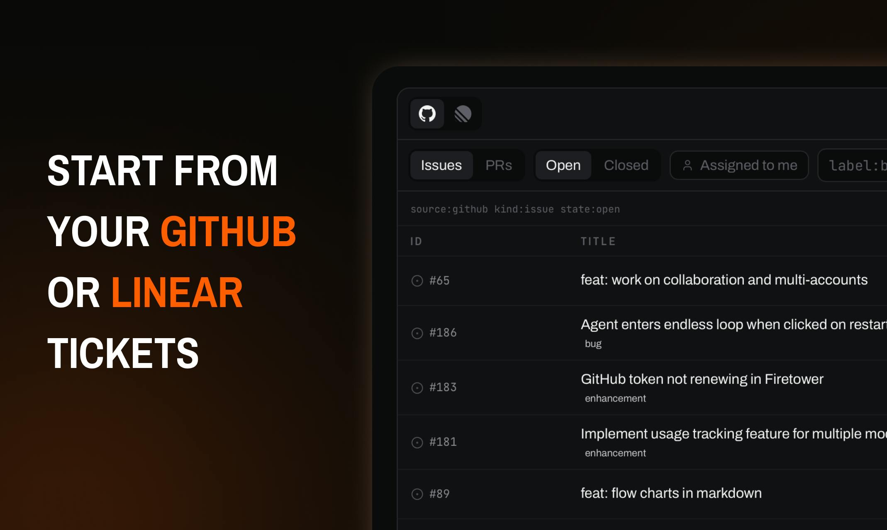
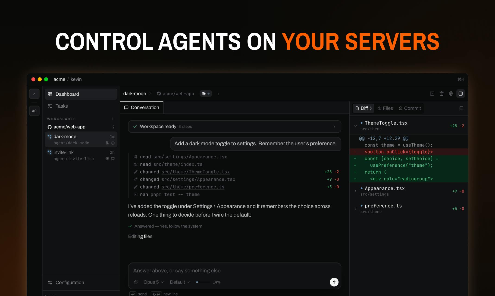

### 🎬 관련 영상
- [🎥 영상 보기](https://ph-files.imgix.net/e98bc2f9-7ff8-41fe-8868-9d48c60e60c1.jpeg?auto=format)

---

## 22. [Rate.fm](https://www.producthunt.com/products/rate-fm)
**Votes**: 71 | **도입 난이도**: 하 | **신뢰도**: 상
**Tagline**: Letterboxd for music, on iPhone
**서비스 링크**: https://www.producthunt.com/r/2GDFE6NYMDA27J

**태그**: Music, Social, iOS, Lifestyle, AI Tool

### 📌 이 서비스 한눈에 보기
음악 감상 기록과 리뷰를 즐기는 이들을 위한 iOS 전용 음악 소셜 플랫폼

### 🔑 주요 기능
- 곡 및 앨범 평점 부여와 리뷰 작성 기능
- 친구 및 전문가를 팔로우하는 소셜 피드 제공
- Apple Music 및 Spotify 연동과 실시간 가사/위젯 지원

### 🙋 사용자에게 어떤 점이 좋은가
자신만의 음악 감상 일기를 기록하고, 친구나 전문가의 취향을 실시간으로 공유하며 음악적 교감을 나눌 수 있습니다.

### ✅ 지금 바로 써볼 기능
- Apple Music 또는 Spotify 계정 연동하기
- 좋아하는 곡에 평점과 리뷰 남기기
- 친구 팔로우하여 실시간 피드 확인하기

### ⚠️ 사용 전 확인할 점
- iOS 전용 앱이므로 안드로이드 사용자는 이용 불가
- 일부 고급 기능은 구독형 모델(Badge subscription)로 제공될 수 있음

### 🧭 확인이 더 필요한 정보
구독 모델의 구체적인 가격 체계와 기능 차이는 명시되어 있지 않습니다.

### 📸 스크린샷 및 갤러리

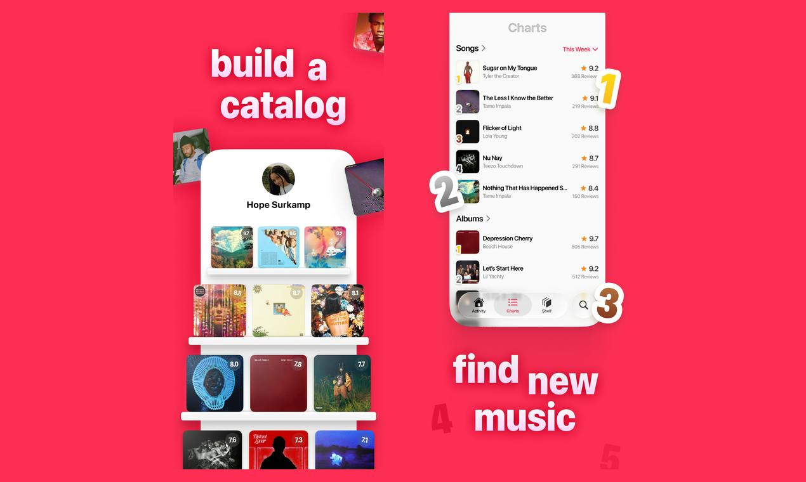

---

## 23. [Lume ](https://www.producthunt.com/products/lume-floating-notes-for-windows)
**Votes**: 71 | **도입 난이도**: 하 | **신뢰도**: 상
**Tagline**: Notes that appear with a mouse shake
**서비스 링크**: https://www.producthunt.com/r/W56NCO2G6WHY6Y

**태그**: Productivity, Windows, Note-taking, Minimalism

### 📌 이 서비스 한눈에 보기
마우스 흔들기만으로 즉시 나타났다 사라지는 초경량 윈도우 메모장

### 🔑 주요 기능
- 마우스 흔들기 또는 단축키로 즉시 실행되는 직관적인 UI
- 수식 계산, 자유로운 드로잉, 로컬 우선 저장 방식 지원
- Electron 없이 WinUI 3로 제작된 가볍고 빠른 네이티브 앱

### 🙋 사용자에게 어떤 점이 좋은가
복잡한 메모 앱을 켜는 번거로움 없이, 아이디어가 떠오르는 순간 즉시 기록하고 깔끔하게 정리할 수 있습니다.

### ✅ 지금 바로 써볼 기능
- 마우스 흔들기 동작으로 메모장 호출해보기
- 수식 입력 시 자동 계산 기능 테스트하기
- 자유로운 드로잉 기능 활용해보기

### ⚠️ 사용 전 확인할 점
- 무료 버전은 최대 20개의 노트까지만 생성 가능
- 윈도우 전용 앱이므로 다른 OS에서는 사용 불가

### 🧭 확인이 더 필요한 정보
20개 이상의 노트를 사용하기 위한 유료 플랜의 상세 가격 정책은 명시되지 않았습니다.

### 📸 스크린샷 및 갤러리

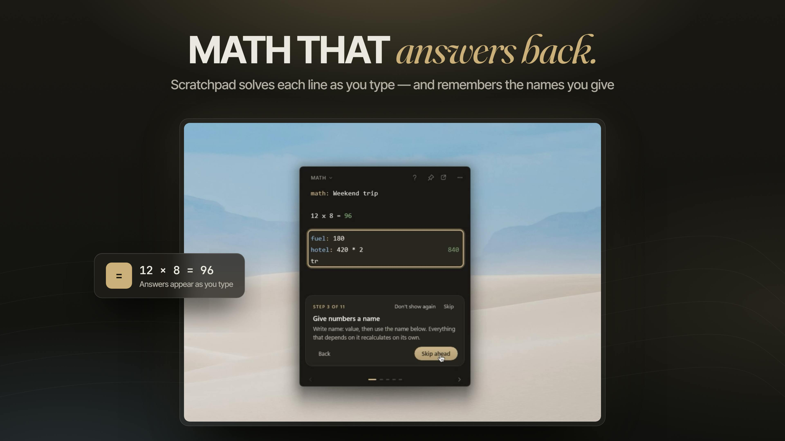
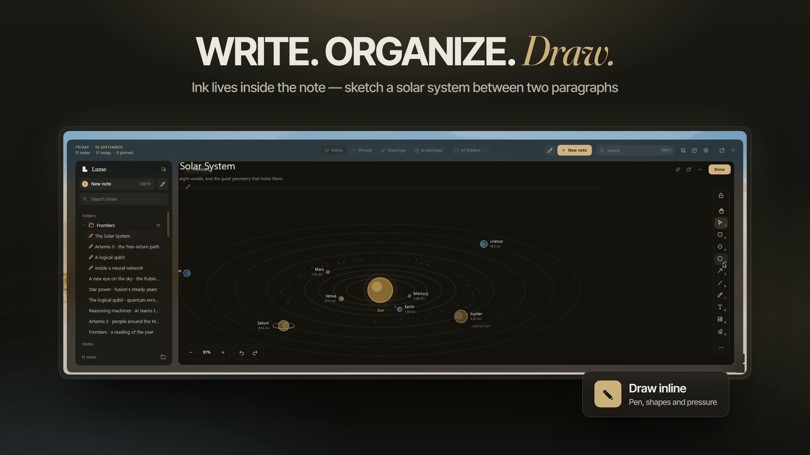

---

## 24. [Otter Vault](https://www.producthunt.com/products/otter-vault)
**Votes**: 70 | **도입 난이도**: 하 | **신뢰도**: 상
**Tagline**: Catch API keys the moment they appear, encrypted locally
**서비스 링크**: https://www.producthunt.com/r/E64OJ4TEEQMO5F

**태그**: DevTool, Security, Automation, API

### 📌 이 서비스 한눈에 보기
새로 생성되는 API 키를 실시간으로 포착하여 로컬에 안전하게 암호화 저장하는 도구

### 🔑 주요 기능
- API 키 생성 즉시 자동 감지 및 포착
- 사용자 기기 내 로컬 암호화 저장으로 보안 강화
- 별도의 계정 생성 없이 즉시 사용 가능

### 🙋 사용자에게 어떤 점이 좋은가
개발 과정에서 발생하는 API 키를 놓치지 않고 안전하게 관리할 수 있으며, 클라우드가 아닌 로컬에 저장되어 보안성이 높습니다.

### ✅ 지금 바로 써볼 기능
- 데모 영상을 통해 작동 방식 확인하기
- 로컬 암호화 저장 방식 검토하기
- 계정 생성 없이 바로 설치 및 테스트하기

### ⚠️ 사용 전 확인할 점
- 로컬 저장 방식이므로 기기 분실 시 데이터 복구 여부 확인 필요
- 어떤 방식으로 API 키를 감지하는지에 대한 기술적 메커니즘 확인 필요

### 🧭 확인이 더 필요한 정보
API 키를 감지하는 구체적인 기술적 방식과 지원하는 플랫폼 범위에 대한 정보가 부족합니다.

### 📸 스크린샷 및 갤러리
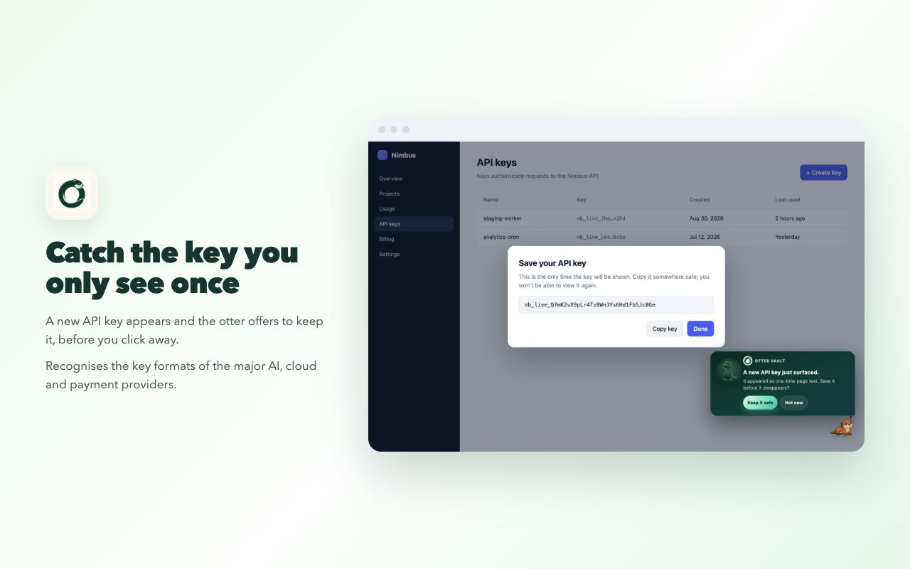
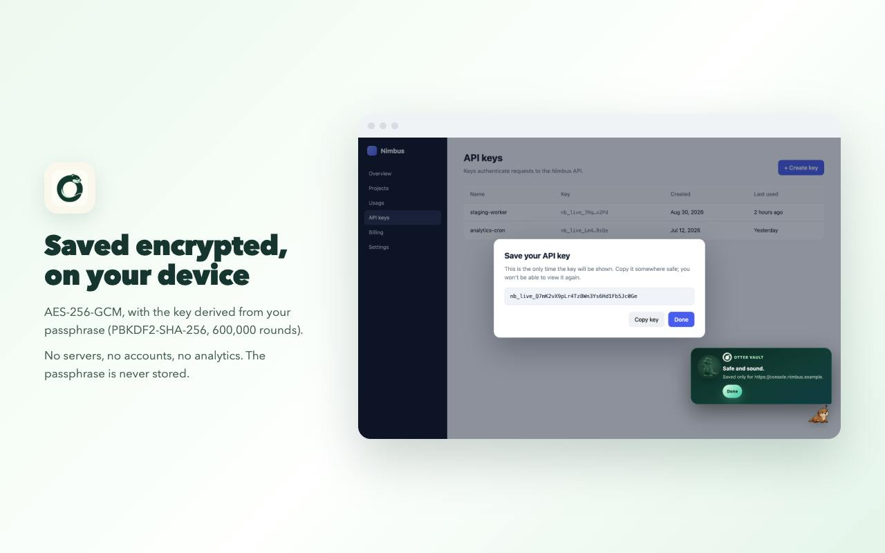
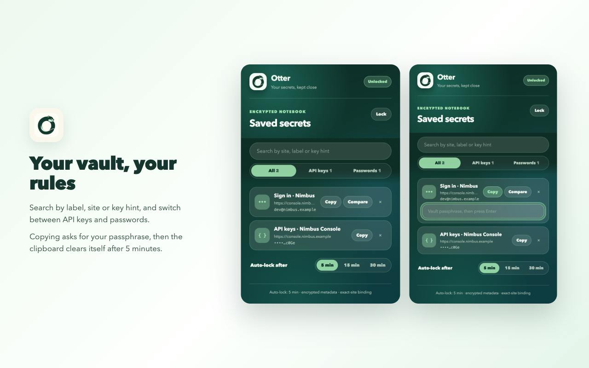

### 🎬 관련 영상
- [🎥 영상 보기](https://ph-files.imgix.net/86769a46-bd13-4b7a-a0f3-da503aacb6de.jpeg?auto=format)

---

## 25. [Twin](https://www.producthunt.com/products/twin-2)
**Votes**: 70 | **도입 난이도**: 중 | **신뢰도**: 상
**Tagline**: a tiny buddy that lives on your Mac
**서비스 링크**: https://www.producthunt.com/r/ETJG4OL523HJB4

**태그**: AI, Productivity, Privacy, Mac, OpenSource, AI Tool

### 📌 이 서비스 한눈에 보기
개인 정보 유출 걱정 없이 맥 데스크탑에서 일상을 관리하는 로컬 퍼스트 AI 비서

### 🔑 주요 기능
- 로컬 DuckDB를 활용한 온디바이스 데이터 저장 (클라우드/계정 불필요)
- 텍스트 요약, 일정 관리, 음성 대화 및 알림 기능 제공
- 사용자 개인 API 키(Claude, GPT, Gemini, Grok)를 직접 연결하여 사용

### 🙋 사용자에게 어떤 점이 좋은가
데이터가 클라우드에 저장되지 않아 보안이 뛰어나며, 데스크탑 위에서 실시간으로 일정과 메시지를 관리할 수 있습니다.

### ✅ 지금 바로 써볼 기능
- 자신의 LLM API 키를 연결하여 개인 맞춤형 비서 설정하기
- 데스크탑 플로팅 위젯을 통해 실시간 알림 및 음성 대화 기능 테스트하기

### ⚠️ 사용 전 확인할 점
- 사용자가 직접 LLM API 키를 보유하고 있어야 함
- 로컬 데이터베이스(DuckDB) 관리 및 백업 책임이 사용자에게 있음

### 🧭 확인이 더 필요한 정보
사용자의 API 키 사용량에 따른 비용 발생 구조와 로컬 데이터 백업 방식에 대한 상세 정보가 필요합니다.

### 📸 스크린샷 및 갤러리
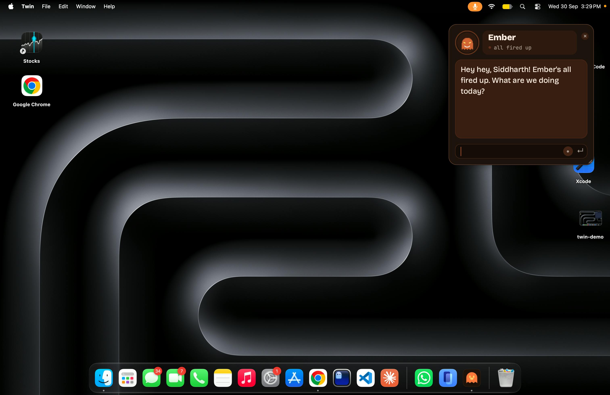
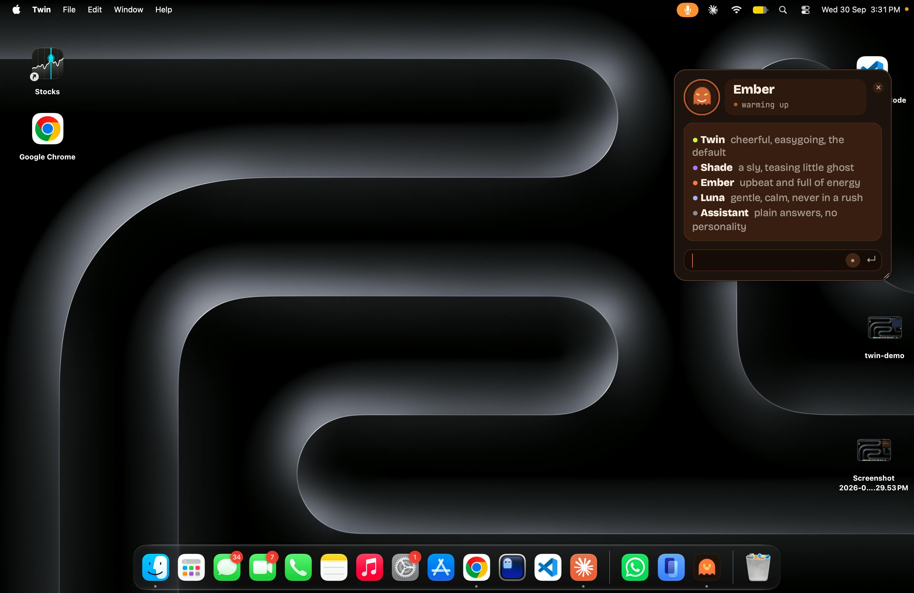
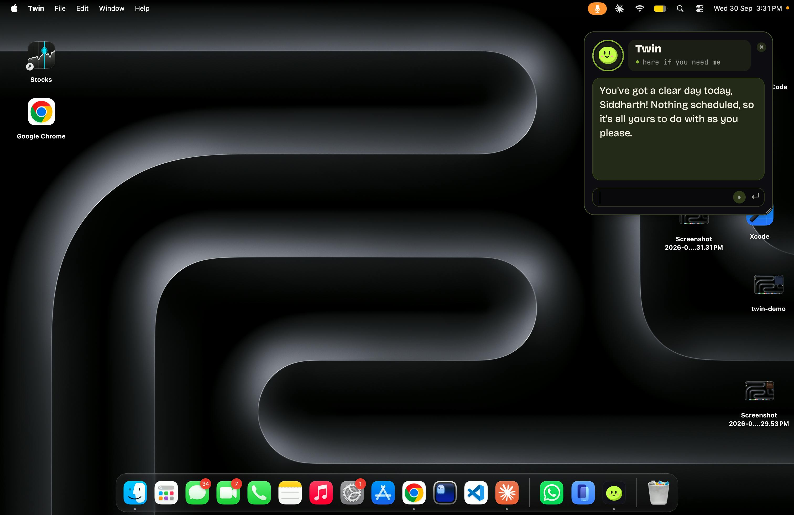

### 🎬 관련 영상
- [🎥 영상 보기](https://ph-files.imgix.net/3a576c96-d994-4a91-93c2-993059c32b55.jpeg?auto=format)

---

## 26. [Formalini](https://www.producthunt.com/products/formalini)
**Votes**: 70 | **도입 난이도**: 하 | **신뢰도**: 상
**Tagline**: Docs to Data, BI, Personal Finance, Huge Dev Platform.Try it
**서비스 링크**: https://www.producthunt.com/r/FP7LL5I44PSZNZ

**태그**: Automation, DataExtraction, AI, Productivity, SaaS, Agent, AI Tool, Sales

### 📌 이 서비스 한눈에 보기
문서와 사진을 즉시 구조화된 데이터로 변환하는 AI 자동화 플랫폼

### 🔑 주요 기능
- 수기 노트, 사진, 스캔본을 JSON/Excel 등 정형 데이터로 자동 변환
- 개인용 Vault를 통한 영수증 및 중요 문서의 자동 정리 및 관리
- 기업용 워크플로우(SAP, Salesforce 등) 및 AI 에이전트(MCP) 연동 지원

### 🙋 사용자에게 어떤 점이 좋은가
복잡한 문서 입력 작업을 자동화하여 데이터 정리 시간을 줄이고, 추출된 데이터를 즉시 비즈니스 분석이나 개인 자산 관리에 활용할 수 있습니다.

### ✅ 지금 바로 써볼 기능
- 영수증이나 수기 노드를 업로드하여 데이터 추출 정확도 테스트하기
- 추출된 데이터를 Excel이나 JSON 형식으로 내보내기 기능 확인하기
- 개인용 Vault에 중요 문서 업로드하여 자동 정리 기능 경험하기

### ⚠️ 사용 전 확인할 점
- 개인정보 및 민감한 문서 데이터의 보안/프라이버시 정책 확인 필요
- 복잡한 서식이나 악필의 경우 데이터 추출 정확도가 낮을 수 있음

### 🧭 확인이 더 필요한 정보
문서의 보안 저장 방식과 데이터 암호화 수준에 대한 상세 정보 확인이 필요합니다.

### 📸 스크린샷 및 갤러리
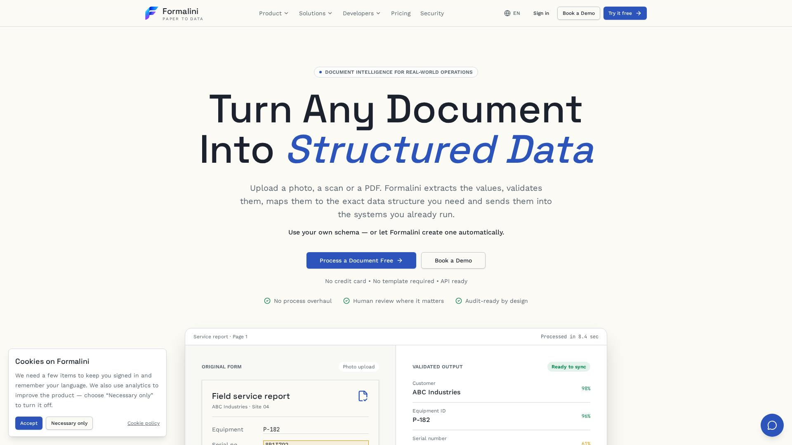
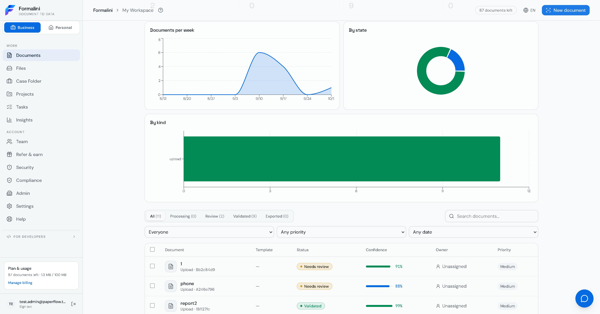
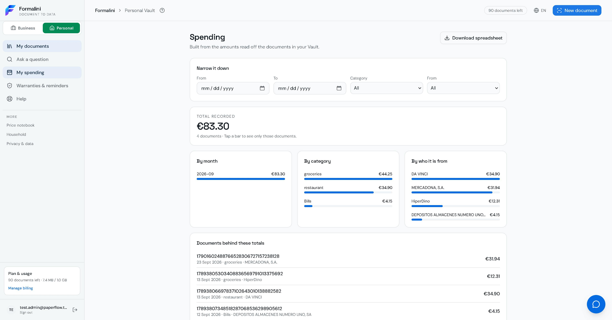

---

## 27. [Vorker](https://www.producthunt.com/products/vorker-ai)
**Votes**: 70 | **도입 난이도**: 하 | **신뢰도**: 중
**Tagline**: AI Coworker Running Your Small Business
**서비스 링크**: https://www.producthunt.com/r/XGTDWRB43MFP6F

**태그**: Automation, Productivity, SmallBusiness, AI, AI Tool

### 📌 이 서비스 한눈에 보기
소규모 비즈니스 운영을 자동화하고 생산성을 높여주는 AI 동료 서비스

### 🔑 주요 기능
- 소규모 비즈니스 운영 프로세스 효율화
- 업무 자동화를 통한 생산성 향상
- 실질적인 업무 수행을 목적으로 하는 AI 에이전트

### 🙋 사용자에게 어떤 점이 좋은가
반복적인 운영 업무를 AI에게 맡겨 핵심 비즈니스 성장에 더 집중할 수 있습니다.

### ✅ 지금 바로 써볼 기능
- 비즈니스 운영 워크플로우 등록
- AI 동료의 업무 수행 능력 테스트
- 반복 업무 자동화 설정

### ⚠️ 사용 전 확인할 점
- 구체적인 지원 업무 범위 확인 필요
- 기존 비즈니스 툴과의 연동성 확인 필요

### 🧭 확인이 더 필요한 정보
제공되는 AI의 구체적인 기능 범위와 지원하는 업무 분야가 명시되지 않았습니다.

### 📸 스크린샷 및 갤러리
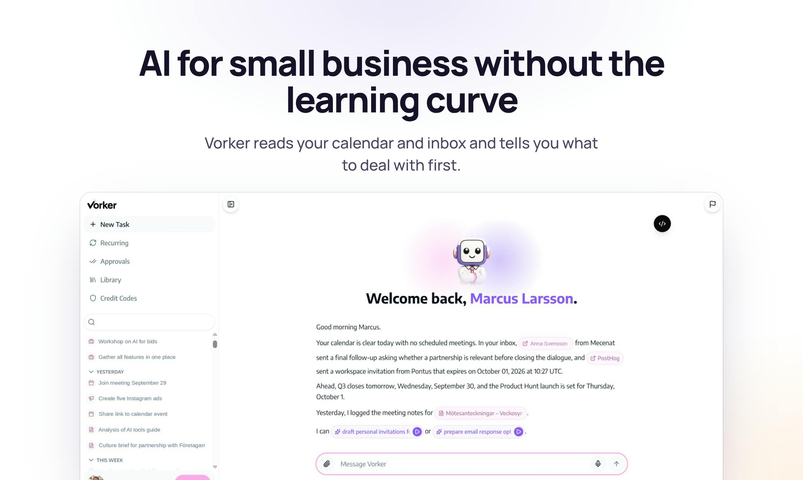
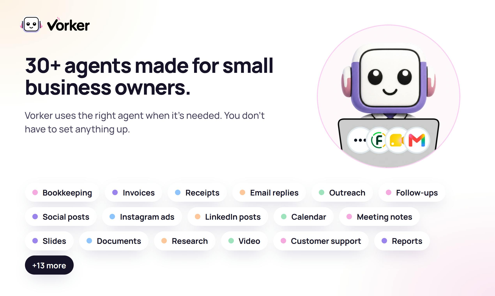
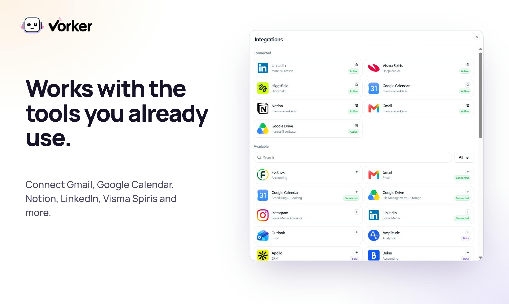

### 🎬 관련 영상
- [🎥 영상 보기](https://ph-files.imgix.net/0d1d2f94-e4f2-4489-93ac-7d996b080b3c.jpeg?auto=format)

---

## 28. [StayLokal](https://www.producthunt.com/products/staylokal)
**Votes**: 69 | **도입 난이도**: 하 | **신뢰도**: 상
**Tagline**: Private file tools that run on your device.
**서비스 링크**: https://www.producthunt.com/r/CTIIJXXVED3TLA

**태그**: Productivity, Privacy, FileManagement, LocalFirst, Video, Vision

### 📌 이 서비스 한눈에 보기
개인정보 유출 걱정 없이 내 기기에서 직접 실행되는 로컬 우선 파일 관리 도구

### 🔑 주요 기능
- 로컬 우선(Local-first) 방식의 파일 처리
- PDF, 이미지, 비디오, 오디오 등 다양한 파일 형식 지원
- 기기 내에서 실행되는 프라이빗 파일 유틸리티

### 🙋 사용자에게 어떤 점이 좋은가
파일을 클라우드에 업로드하지 않고 내 기기에서 직접 처리하므로 보안이 중요한 민감한 문서를 다룰 때 유용합니다.

### ✅ 지금 바로 써볼 기능
- 개인적인 PDF 문서 편집 및 관리
- 민감한 이미지/영상 파일 처리
- 로컬 환경에서의 파일 변환 및 유틸리티 활용

### ⚠️ 사용 전 확인할 점
- 로컬 실행 방식이므로 기기 성능에 따라 처리 속도가 달라질 수 있음
- 클라우드 동기화 기능 포함 여부에 따라 기기 간 협업에 제한이 있을 수 있음

### 🧭 확인이 더 필요한 정보
지원하는 구체적인 파일 편집/변환 기능의 범위와 상세 기능 목록이 명시되지 않았습니다.

### 📸 스크린샷 및 갤러리
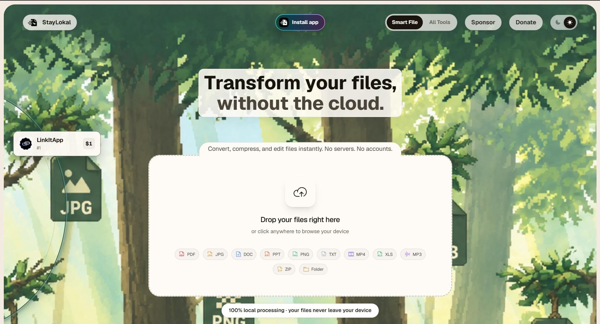
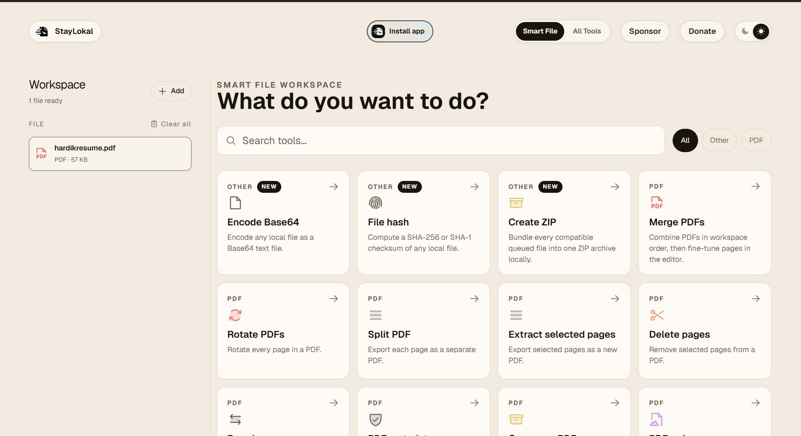
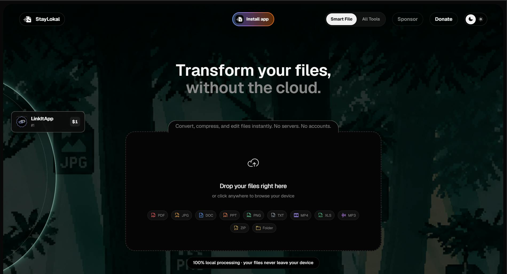

---

## 29. [Stardrift for iOS](https://www.producthunt.com/products/stardrift-for-ios)
**Votes**: 67 | **도입 난이도**: 하 | **신뢰도**: 상
**Tagline**: The AI travel assistant in your pocket
**서비스 링크**: https://www.producthunt.com/r/WSI6KQHJM45Z2O

**태그**: Travel, AI, iOS, Planning, AI Tool

### 📌 이 서비스 한눈에 보기
여행 계획부터 현지 일정 관리까지 도와주는 AI 개인 여행 비서

### 🔑 주요 기능
- 일자별 맞춤형 여행 일정 계획 및 위시리스트 구축
- 여행 중 위치 기반 주변 장소 추천 기능
- 여행에 필요한 모든 물류 및 세부 정보를 한곳에서 관리

### 🙋 사용자에게 어떤 점이 좋은가
여행 전 복잡한 계획 수립부터 여행 중 실시간 일정 관리까지 하나의 앱으로 해결할 수 있어 여행의 편의성을 높여줍니다.

### ✅ 지금 바로 써볼 기능
- AI를 활용한 일자별 여행 일정 생성해보기
- 가고 싶은 장소들을 위시리스트에 담아보기
- 여행 중 실시간 주변 장소 추천 기능 활용하기

### ⚠️ 사용 전 확인할 점
- iOS 전용 앱이므로 Android 사용자는 사용 불가
- AI 추천의 정확도나 현지 실시간 상황 반영 여부 확인 필요

### 🧭 확인이 더 필요한 정보
구체적인 요금 체계(무료/유료) 및 지원되는 언어 범위에 대한 정보가 명시되지 않았습니다.

### 📸 스크린샷 및 갤러리
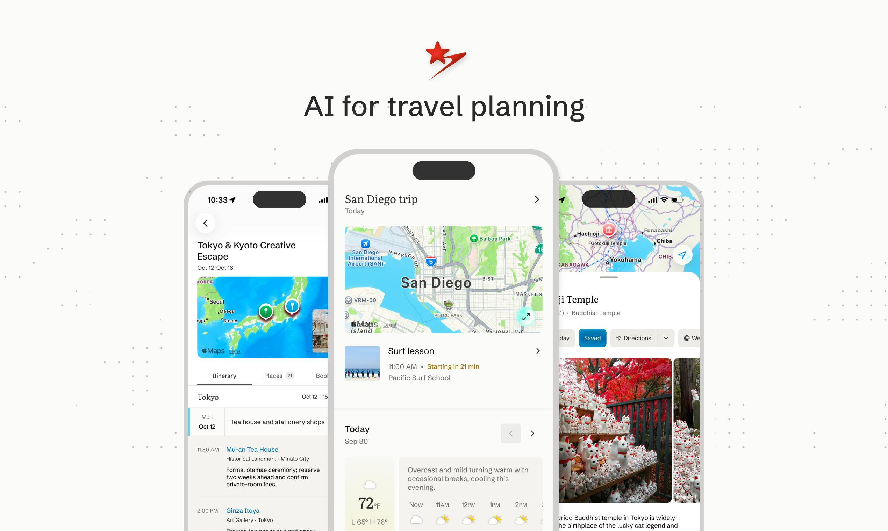
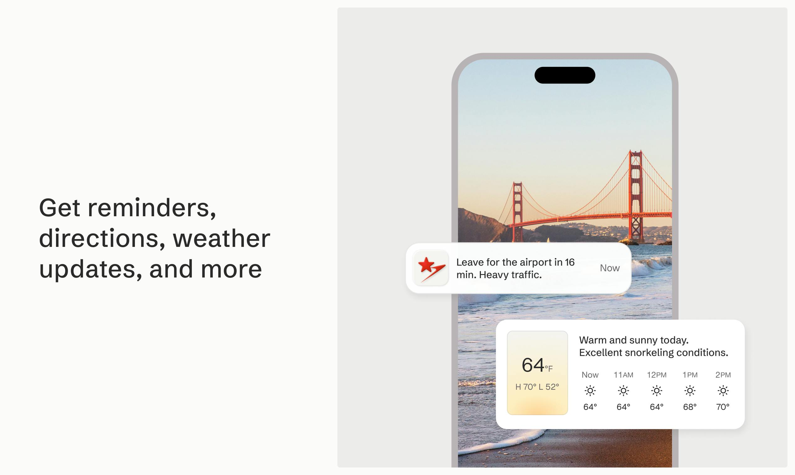
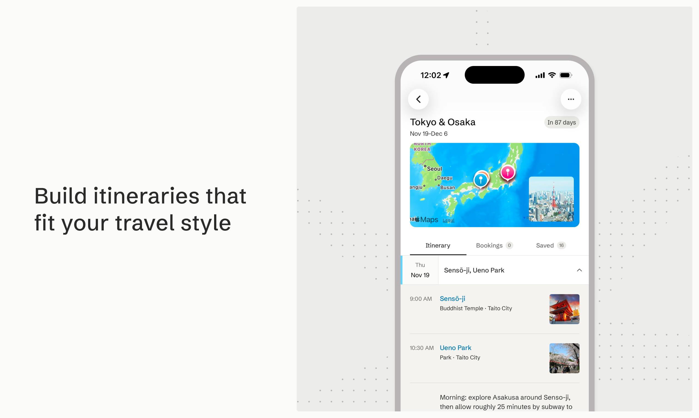

### 🎬 관련 영상
- [🎥 영상 보기](https://ph-files.imgix.net/f414bb19-8bb8-4651-9e71-dd9239f37f20.jpeg?auto=format)

---

## 30. [AuthMonster](https://www.producthunt.com/products/authmonster)
**Votes**: 67 | **도입 난이도**: 하 | **신뢰도**: 상
**Tagline**: The 2FA app you actually enjoy using
**서비스 링크**: https://www.producthunt.com/r/ANG5ZCXF6QD7DN

**태그**: Security, Productivity, UX, AI Tool

### 📌 이 서비스 한눈에 보기
사용자 경험과 브랜드 감성을 결합한 즐거운 2FA 인증 앱

### 🔑 주요 기능
- 기존 대기업 앱의 불편함을 개선한 사용자 중심의 UX 디자인
- Google Authenticator 및 LastPass로부터의 간편한 데이터 마이그레이션
- 생체 인식 잠금 기능 및 기부 기반의 합리적인 모델

### 🙋 사용자에게 어떤 점이 좋은가
기존 2FA 앱의 딱딱하고 불편한 UI 대신, 귀여운 캐릭터와 매끄러운 사용자 경험을 통해 보안 인증 과정을 즐겁게 바꿀 수 있습니다.

### ✅ 지금 바로 써볼 기능
- 기존 2FA 계정 마이그레이션 시도
- 생체 인식 잠금 기능 설정
- Toki 캐릭터와 함께하는 UI 탐색

### ⚠️ 사용 전 확인할 점
- 기존 서비스(Google, Microsoft 등)와의 호환성 및 데이터 이전 안정성 확인 필요
- 기부 기반 모델이므로 향0 기능 확장 시 비용 발생 가능성 고려

### 🧭 확인이 더 필요한 정보
기존 인증 데이터 마이그레이션의 완전한 자동화 여부와 보안 수준에 대한 상세 기술 사양 확인이 필요합니다.

### 📸 스크린샷 및 갤러리
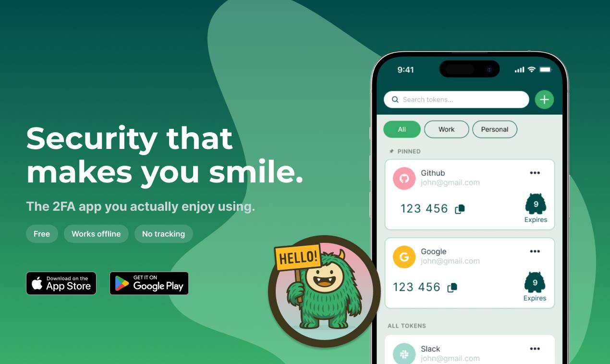
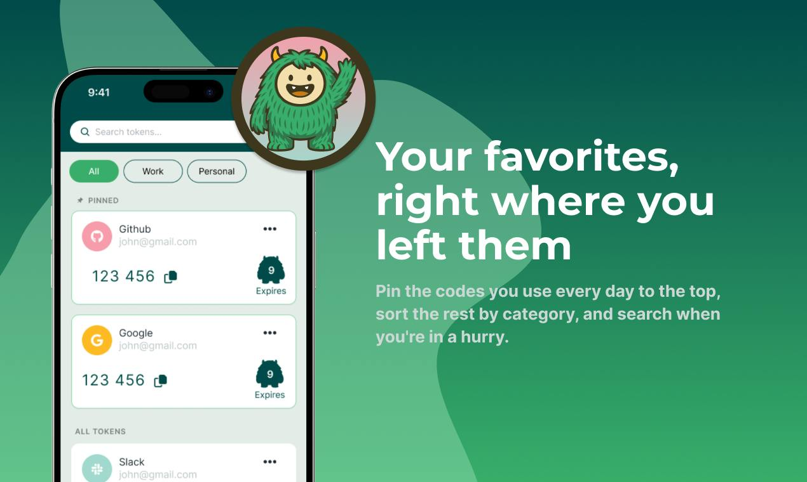

---

