# 🚀 Product Hunt Daily Top 30 (2026-10-04)

## 오늘의 요약
오늘의 트렌드는 AI 에이전트의 작업 과정을 시각화하거나 관리하는 도구와, 전문가의 지식을 AI로 전환하는 솔루션이 주를 이루었습니다. 또한, AI 검색 최적화(AEO)와 같은 새로운 검색 환경에 대응하거나 메시징 앱을 통한 서비스 통합 등 AI 기술의 실질적인 활용과 관리 측면이 강조되었습니다.

### 오늘의 핵심 포인트
- AI 에이전트의 작업 과정을 직관적인 UI로 시각화하거나 저장된 메모리를 안전하게 관리하는 도구들이 주목받았습니다.
- 전문가의 노하우를 AI로 변환하거나 AI 검색 엔진 최적화(AEO)를 통해 브랜드 노출을 자동화하는 등 실무 중심의 솔루션이 등장했습니다.
- 하드웨어 제작 키트나 메시징 앱 기반의 예약 서비스처럼 AI를 물리적 기기나 일상적인 대화 환경에 결합하려는 시도가 나타났습니다.

**오늘의 태그**: AI 에이전트, AEO, 자동화, 생산성 도구, 하드웨어

## 1. [ZooWork](https://www.producthunt.com/products/zoowork)
**Votes**: 261 | **도입 난이도**: 중 | **신뢰도**: 상
**Tagline**: The AI agent delivery platform for FDEs and domain experts
**서비스 링크**: https://www.producthunt.com/r/EIW66MPSNX7TY2

**태그**: AI Agent, NoCode/LowCode, DevOps, Automation, B2B, Agent, AI Tool, DevTool, API

### 📌 이 서비스 한눈에 보기
전문 지식을 AI 에이전트로 변환하여 팀과 고객에게 즉시 배포할 수 있는 플랫폼

### 🔑 주요 기능
- 전문가용 빌더 UI와 개발자용 관리형 API 제공
- 도메인 전문가의 지식을 비즈니스 운영용 AI 솔루션으로 전환
- AI 에이전트의 구축부터 배포까지 통합 워크플로우 지원

### 🙋 사용자에게 어떤 점이 좋은가
도메인 전문가의 노하우를 코딩 부담 없이 AI로 구현하고, 개발자는 이를 API를 통해 서비스에 쉽게 통합할 수 있습니다.

### ✅ 지금 바로 써볼 기능
- Builder UI를 통한 AI 에이전트 프로토타이핑
- Managed Agent API를 활용한 기존 시스템 연동 테스트
- 전문 지식 기반의 워크플로우 설계

### ⚠️ 사용 전 확인할 점
- 전문가와 개발자 간의 협업 워크플로우 숙련도 필요
- 복잡한 비즈니스 로직 구현 시 API 커스터마이징 범위 확인 필요

### 🧭 확인이 더 필요한 정보
구체적인 배포 환경(클라우드/온프레미스) 및 보안 정책에 대한 정보가 부족합니다.

### 📸 스크린샷 및 갤러리
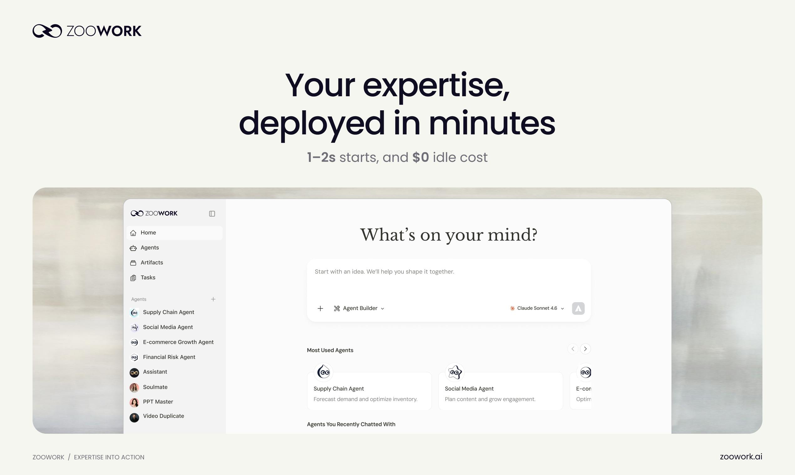
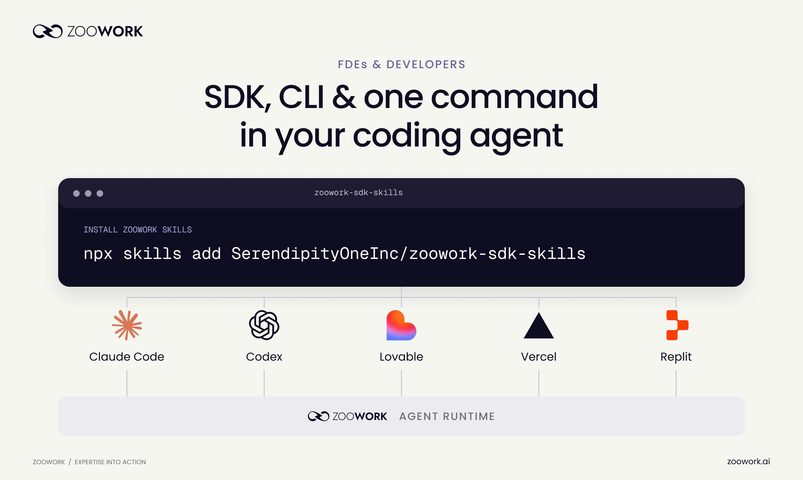
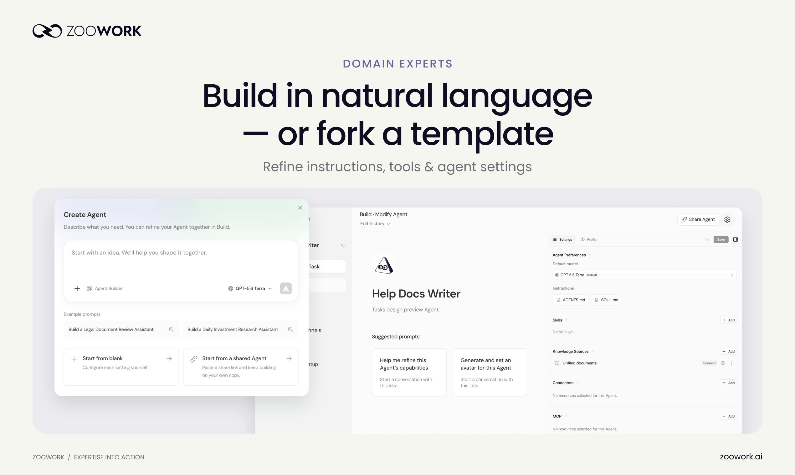

### 🎬 관련 영상
- [🎥 영상 보기](https://ph-files.imgix.net/04bae135-5c2e-468b-9d9f-cb2e321786f8.jpeg?auto=format)

---

## 2. [miso.com](https://www.producthunt.com/products/miso-com)
**Votes**: 189 | **도입 난이도**: 하 | **신뢰도**: 상
**Tagline**: Book flights and hotels through iMessage
**서비스 링크**: https://www.producthunt.com/r/RV2QIX6I3EB5JC

**태그**: AI, Travel, Automation, Productivity, Agent, AI Tool

### 📌 이 서비스 한눈에 보기
iMessage 대화만으로 항공권과 호텔 예약을 끝내는 AI 여행 에이전트

### 🔑 주요 기능
- iMessage 내에서 텍text 기반으로 여행 일정 검색 및 예약 가능
- 사용자의 여행 취향을 학습하여 개인화된 옵션 제공
- 항공사 직접 연결 및 24/7 고객 지원 제공

### 🙋 사용자에게 어떤 점이 좋은가
여러 웹사이트를 오갈 필요 없이 메시지 창 하나로 복잡한 여행 예약 과정을 간소화할 수 있습니다.

### ✅ 지금 바로 써볼 기능
- iMessage에서 Miso 서비스 연결하기
- 가고 싶은 목적지와 날짜를 메시지로 보내기
- 제시된 실시간 항공 및 호텔 옵션 확인하기

### ⚠️ 사용 전 확인할 점
- iMessage 환경에 의존적이므로 타 플랫폼 사용 시 제약이 있을 수 있음
- 개인정보 및 결제 정보가 메시지 기반으로 처리되는 방식에 대한 보안 확인 필요

### 🧭 확인이 더 필요한 정보
iMessage 외의 다른 메신저 지원 여부와 구체적인 결제 보안 방식에 대한 정보가 필요합니다.

### 📸 스크린샷 및 갤러리

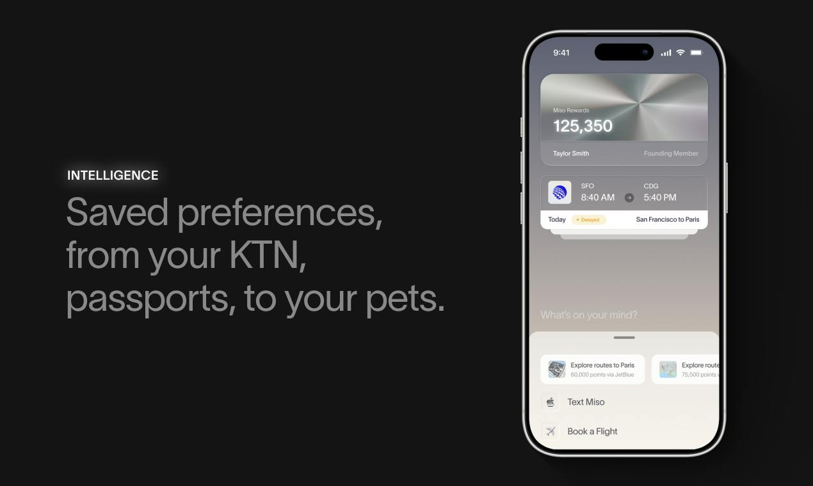

### 🎬 관련 영상
- [🎥 영상 보기](https://ph-files.imgix.net/1ff8840f-b554-47c2-bef5-9f400ce58790.jpeg?auto=format)

---

## 3. [Prefer](https://www.producthunt.com/products/prefer-2)
**Votes**: 147 | **도입 난이도**: 중 | **신뢰도**: 상
**Tagline**: The execution layer for AEO
**서비스 링크**: https://www.producthunt.com/r/7BOKASBUEQX4KI

**태그**: AEO, AI-Search, Automation, Marketing-Tech, Agent, AI Tool, Chat

### 📌 이 서비스 한눈에 보기
AI 검색 엔진 최적화(AEO)를 위한 분석 및 자동 실행 솔루션

### 🔑 주요 기능
- ChatGPT, Claude, Gemini, Perplexity 등 주요 AI 모델의 브랜드 언급 분석
- 단순 대시보드를 넘어 가시성 개선을 위한 실행 단계 지원
- AI 검색 인사이트를 실제 액션으로 전환하는 자율 에이전트 활용

### 🙋 사용자에게 어떤 점이 좋은가
브랜드가 AI 답변에서 어떻게 다뤄지는지 파악하고, 검색 노출을 높이기 위한 실질적인 조치를 자동화할 수 있습니다.

### ✅ 지금 바로 써볼 기능
- 주요 AI 모델별 브랜드 언급 현황 모니터링
- 부족한 정보 식별 및 개선 포인트 도출
- 자율 에이전트를 통한 가시성 개선 작업 실행

### ⚠️ 사용 전 확인할 점
- 에이전트의 자동 실행 기능이 브랜드 이미지에 미칠 영향 검토 필요
- AI 모델별 알고리즘 차이에 따른 결과값의 변동성

### 🧭 확인이 더 필요한 정보
자율 에이전트가 구체적으로 어떤 방식으로 실행(Action)을 수행하는지에 대한 상세 프로세스 확인이 필요합니다.

### 📸 스크린샷 및 갤러리

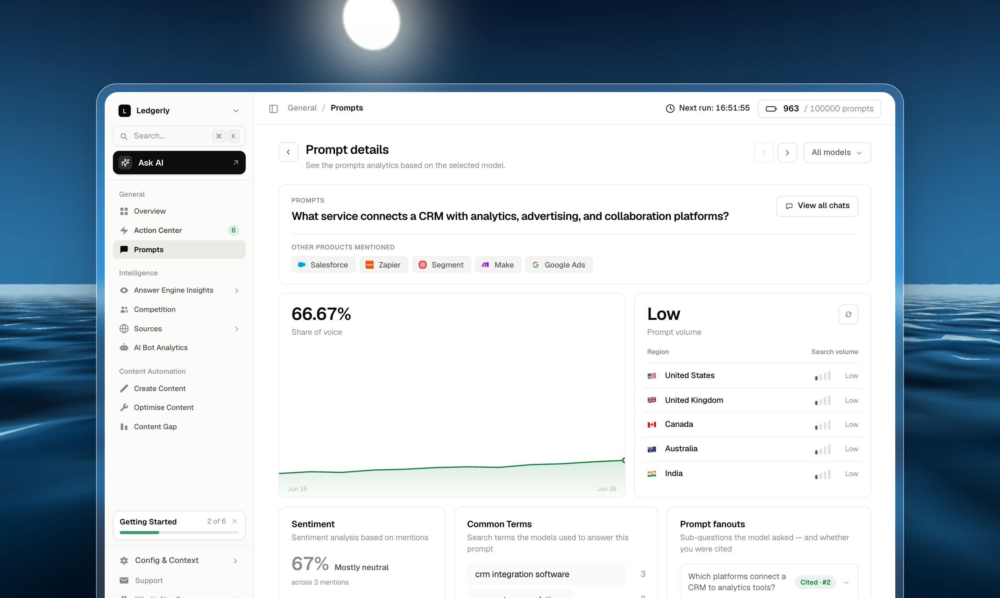
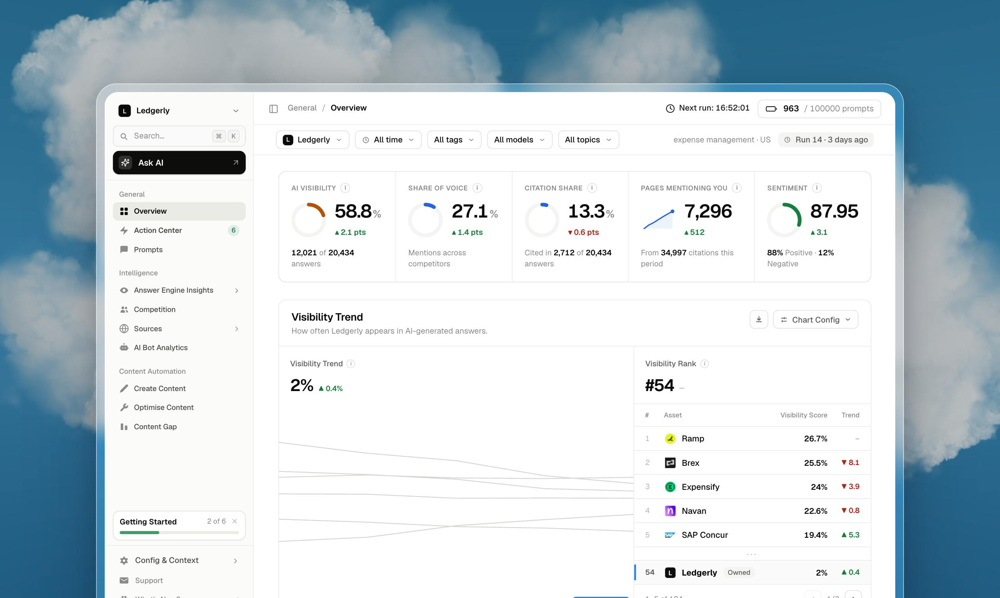

### 🎬 관련 영상
- [🎥 영상 보기](https://ph-files.imgix.net/f58b510d-b6e6-4406-a796-4a709e55a413.jpeg?auto=format)

---

## 4. [Muse Gadgets](https://www.producthunt.com/products/muse-22)
**Votes**: 142 | **도입 난이도**: 상 | **신뢰도**: 상
**Tagline**: Meta's open-source kit for building your own AI gadgets
**서비스 링크**: https://www.producthunt.com/r/4J7IZNCDREAZMO

**태그**: Hardware, AI, OpenSource, IoT, Maker, AI Tool

### 📌 이 서비스 한눈에 보기
나만의 맞춤형 AI 하드웨어를 제작할 수 있는 Meta의 오픈소스 키트

### 🔑 주요 기능
- ESP32, Raspberry Pi 등 다양한 하드웨어와 연동 가능한 오픈소스 툴킷
- 디스플레이, 마이크, 스피커, 센서 등을 결합해 물리적 AI 기기 구현 가능
- Apache 2.0 라이선스 기반의 자유로운 SDK 및 펌웨어 활용

### 🙋 사용자에게 어떤 점이 좋은가
사용자가 원하는 형태의 AI 동반자, 스마트 홈 컨트롤러, 정보 디스플레이 등을 직접 설계하고 제작할 수 있습니다.

### ✅ 지금 바로 써볼 기능
- ESP32 또는 Raspberry Pi 하드웨어 준비하기
- 오픈소스 SDK 및 펌웨어 환경 구축하기
- 아이디어에 맞는 센서 및 출력 장치 연결 테스트하기

### ⚠️ 사용 전 확인할 점
- 하드웨어 제작 역량이 필요한 전문 개발자용 도구임
- 물리적 부품(센서, 디스플레이 등)을 별도로 준비해야 함

### 🧭 확인이 더 필요한 정보
사용자의 하드웨어 숙련도에 따라 구현 난이도가 크게 달라질 수 있습니다.

### 📸 스크린샷 및 갤러리

---

## 5. [Kindle 2026](https://www.producthunt.com/products/kindle-2026)
**Votes**: 126 | **도입 난이도**: 하 | **신뢰도**: 상
**Tagline**: A smaller, faster Kindle with a flush-front display
**서비스 링크**: https://www.producthunt.com/r/2FVYYMWPUAJ4O6

**태그**: E-reader, Amazon, Hardware, Reading, Design

### 📌 이 서비스 한눈에 보기
더 작고 빨라진 디자인과 플랫 디스플레이를 갖춘 차세대 6인치 킨들

### 🔑 주요 기능
- 더 작고 가벼워진 6인치 폼팩터 설계
- 도서 실행 속도 30% 향상
- 세련된 플랫 프런트 디스플레이 및 신규 32GB 알루미늄 모델 도입

### 🙋 사용자에게 어떤 점이 좋은가
휴대성이 극대화되어 어디서든 가볍게 독서를 즐길 수 있으며, 더 빠른 반응 속도로 쾌적한 독서 환경을 제공합니다.

### ✅ 지금 바로 써볼 기능
- 새로운 32GB 알루미늄 모델의 디자인 확인
- 향상된 속도와 휴대성 체감하기
- 기존 킨들과의 크기 및 무게 비교

### ⚠️ 사용 전 확인할 점
- 6인치 소형 사이즈로 인한 화면 크기 제약
- 알루미늄 모델의 가격대 확인 필요

### 🧭 확인이 더 필요한 정보
상세한 배터리 수명 및 디스플레이 패널 종류에 대한 정보는 명시되지 않았습니다.

### 📸 스크린샷 및 갤러리

---

## 6. [Cubicle](https://www.producthunt.com/products/cubicle-2)
**Votes**: 107 | **도입 난이도**: 하 | **신뢰도**: 상
**Tagline**: A live office for your AI agents, read-only by design
**서비스 링크**: https://www.producthunt.com/r/PSQ4HWY5PXORPM

**태그**: DevTool, AI, Visualization, Automation, Agent, AI Tool, Design

### 📌 이 서비스 한눈에 보기
AI 에이전트의 작업 과정을 실시간 사무실 환경처럼 시각화하여 관찰하는 읽기 전용 대시보드

### 🔑 주요 기능
- AI 에이전트(Claude Code, Gemini 등)의 작업 과정을 생생한 사무실 테마로 시각화
- npx 명령어로 의존성 없이 즉시 실행 가능한 간편한 설치 방식
- 읽기 전용 설계로 안전하게 관찰하며, 텔레그램을 통한 선택적 상호작용 지원

### 🙋 사용자에게 어떤 점이 좋은가
복잡한 터미널 로그 대신 직관적인 UI를 통해 AI 에이전트의 작업 상태를 한눈에 파악하고 관리할 수 있습니다.

### ✅ 지금 바로 써볼 기능
- npx 명령어를 통한 즉각적인 환경 구축
- 텔레그램 알림 설정을 통한 실시간 질문 수신
- 사용자 취향에 맞는 테마(Pixel/HD) 및 로고 적용

### ⚠️ 사용 전 확인할 점
- 읽기 전용 설계이므로 에이전트의 작업을 직접 수정하는 기능은 제한적임
- 에이전트의 작업 로그를 시각화하는 도구이므로 실제 에이전트 실행 환경이 별도로 필요함

### 🧭 확인이 더 필요한 정보
사용자의 로컬 환경이나 특정 에이전트 도구와의 호환성 세부 사항은 추가 확인이 필요합니다.

### 📸 스크린샷 및 갤러리

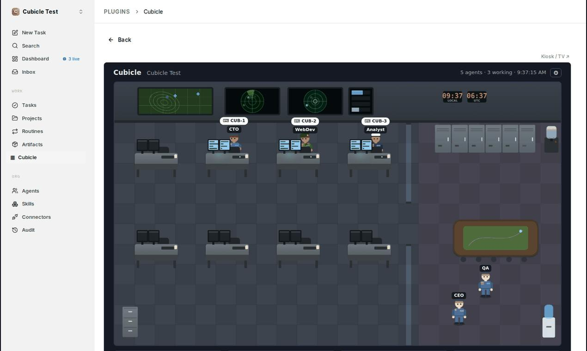
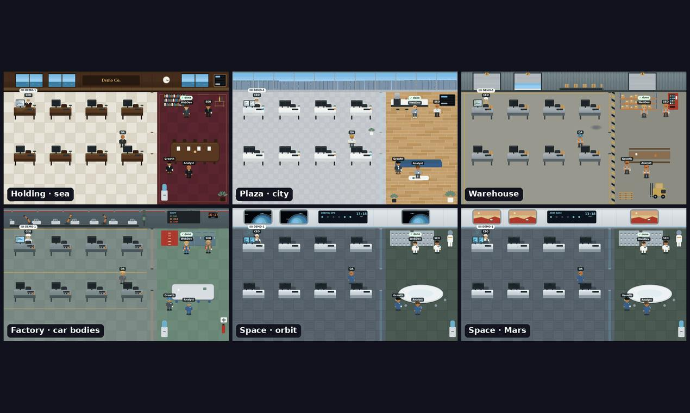

---

## 7. [SCMD ](https://www.producthunt.com/products/scmd)
**Votes**: 87 | **도입 난이도**: 하 | **신뢰도**: 상
**Tagline**: Manage what Claude Remembers and Keeps as Memory.
**서비스 링크**: https://www.producthunt.com/r/USKITC5YZNVI3N

**태그**: DevTool, AI, Privacy, OpenSource

### 📌 이 서비스 한눈에 보기
Claude Code가 저장한 개인화된 메모리를 로컬에서 직접 관리하고 검토하는 도구

### 🔑 주요 기능
- Claude가 저장한 프로젝트 및 개인 메모리 검토/수정/삭제 기능 제공
- 로컬 실행 방식(npx/scmd:run)으로 데이터 보안 및 프라이버시 강화
- 스테이징 시스템과 휴지통 기능을 통한 안전한 메모리 관리

### 🙋 사용자에게 어떤 점이 좋은가
Claude가 나에 대해 기억하는 정보를 투명하게 관리할 수 있어, 불필요한 정보 유출을 막고 프로젝트 맥락을 정교하게 제어할 수 있습니다.

### ✅ 지금 바로 써볼 기능
- npx를 통해 즉시 실행하여 현재 저장된 메모리 확인하기
- 불필요하게 저장된 메모리 삭제 및 스테이징 기능 테스트하기
- 메모리 삭제 시 휴지통 기능을 통한 복구 가능 여부 확인하기

### ⚠️ 사용 전 확인할 점
- Claude Code 환경에서만 작동하는 전용 도구임
- 로컬 환경 설정 및 터미널 사용 숙련도 필요

### 🧭 확인이 더 필요한 정보
Claude Code와의 연동 방식 및 구체적인 로컬 저장소 구조에 대한 상세 정보는 공식 문서를 통한 확인이 필요합니다.

### 📸 스크린샷 및 갤러리
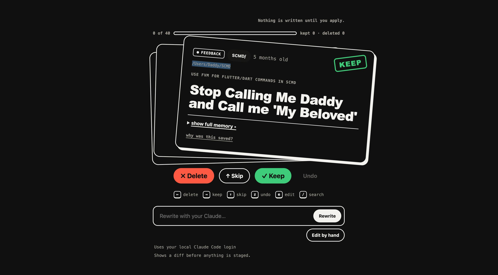
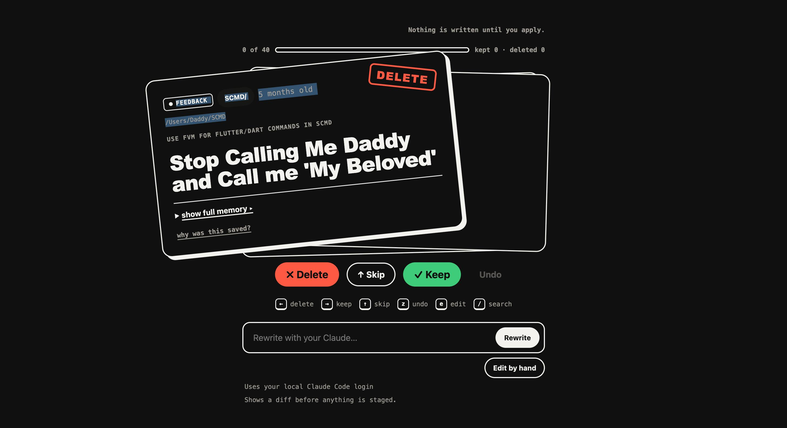
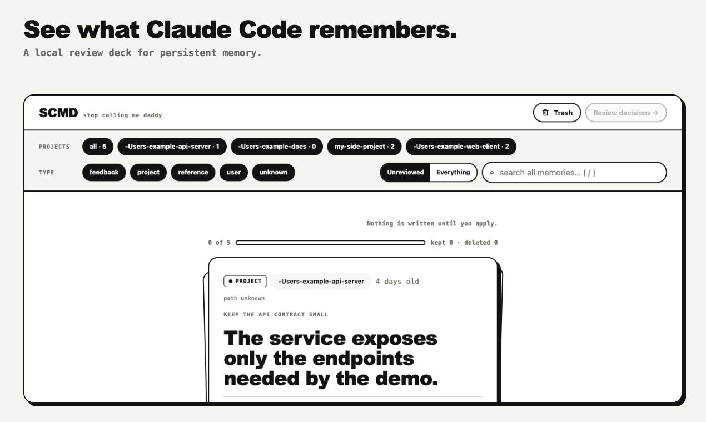

---

## 8. [FoundrRadio](https://www.producthunt.com/products/foundrradio)
**Votes**: 81 | **도입 난이도**: 하 | **신뢰도**: 상
**Tagline**: Pick a frequency, launch your radio station and go on air
**서비스 링크**: https://www.producthunt.com/r/L5ORNWNVOEL6S5

**태그**: Radio, Community, Content Creation, Social, AI Tool

### 📌 이 서비스 한눈에 보기
나만의 주파수를 설정하여 나만의 라디오 스테이션을 운영할 수 있는 인터넷 라디오 플랫폼

### 🔑 주요 기능
- 개인 맞춤형 라디오 스테이션 구축 및 온에어 기능
- 창업자 및 커뮤니티 중심의 콘텐츠 공유
- 향수와 커뮤니티를 결합한 디지털 공간 제공

### 🙋 사용자에게 어떤 점이 좋은가
자신만의 목소리나 콘텐츠를 전달할 수 있는 독자적인 온라인 채널을 확보할 수 있습니다.

### ✅ 지금 바로 써볼 기능
- 나만의 주파수 선택하기
- 라디오 스테이션 개설 및 방송 시작하기
- 커뮤니티 청취자들과 소통하기

### ⚠️ 사용 전 확인할 점
- 인터넷 기반 플랫폼이므로 네트워크 환경에 따른 방송 품질 차이 발생 가능
- 콘텐츠 저작권 및 방송 규정 준수 여부 확인 필요

### 🧭 확인이 더 필요한 정보
구체적인 방송 기술 사양 및 수익 창출 모델에 대한 정보가 부족합니다.

### 📸 스크린샷 및 갤러리
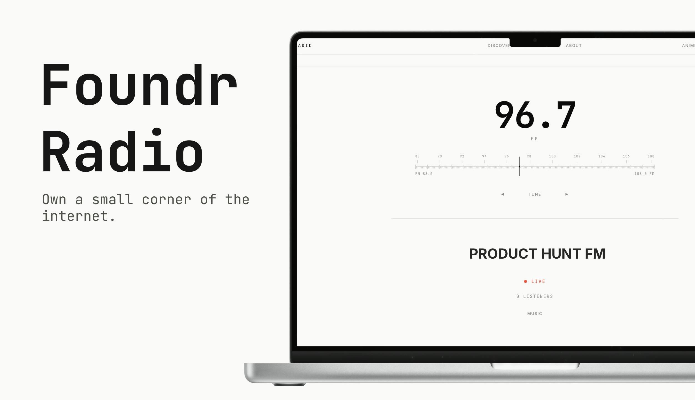
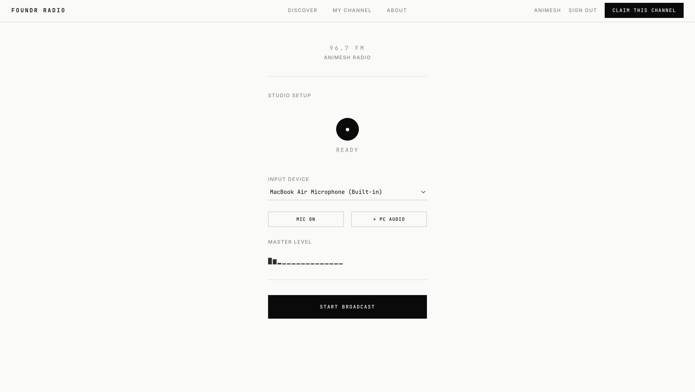
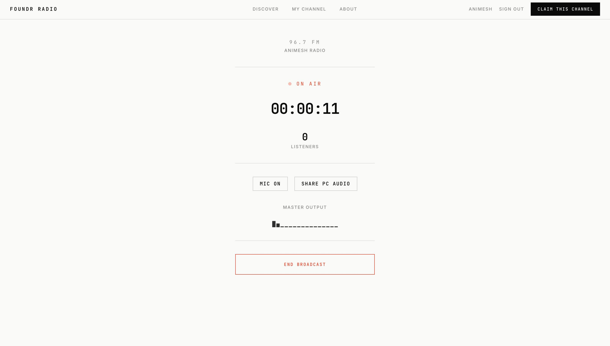

---

## 9. [Notchware](https://www.producthunt.com/products/notchware)
**Votes**: 78 | **도입 난이도**: 하 | **신뢰도**: 상
**Tagline**: Music and AI agent alerts in your MacBook notch
**서비스 링크**: https://www.producthunt.com/r/OUQTPBUOJZO4W6

**태그**: Productivity, macOS, AI-Agent, DevTool, Agent, AI Tool, Analytics

### 📌 이 서비스 한눈에 보기
맥북 노치를 실시간 상태 알림 및 AI 에이전트 제어 센터로 변환하는 도구

### 🔑 주요 기능
- 맥북 노치 영역을 활용한 실시간 미디어 컨트롤 및 시스템 상태(배터리, Wi-Fi 등) 표시
- Pro 버전 사용 시 Claude Code, Cursor 등 AI 에이전트의 작업 완료 및 승인 알림 제공
- SwiftUI 기반의 네이티브 앱으로 계정 생성이나 클라우드 없이 개인정보 보호 중심 설계

### 🙋 사용자에게 어떤 점이 좋은가
터미널을 계속 주시하지 않아도 노치를 통해 AI 에이전트의 상태를 즉각 확인하고, 미디어 컨트롤을 직관적으로 관리할 수 있습니다.

### ✅ 지금 바로 써볼 기능
- 기본 버전으로 미디어 및 시스템 상태 표시 기능 테스트
- Pro 버전 도입을 통한 AI 코딩 에이전트 알림 워크플로우 검토

### ⚠️ 사용 전 확인할 점
- macOS 14.6 이상의 운영체제 버전 필요
- Pro 기능(AI 에이전트 알림)은 별도의 유료 결제 필요

### 🧭 확인이 더 필요한 정보
AI 에이전트 알림 기능이 사용자의 특정 터미널 환경이나 IDE와 어떻게 연동되는지에 대한 상세 설정 방식은 확인이 필요합니다.

### 📸 스크린샷 및 갤러리

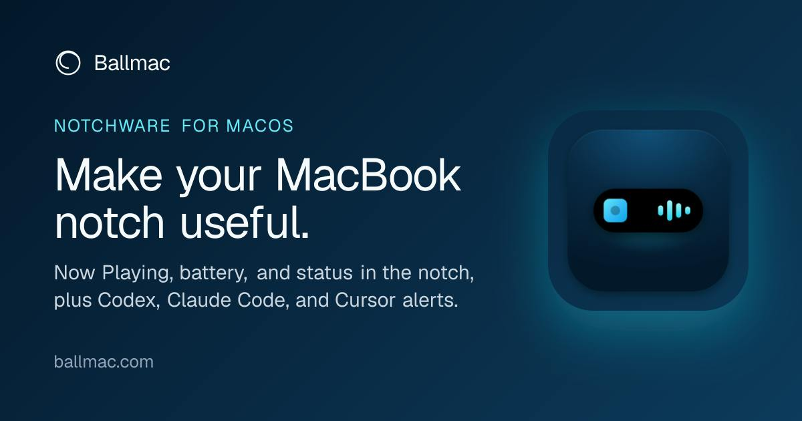

### 🎬 관련 영상
- [🎥 영상 보기](https://ph-files.imgix.net/1271ca72-baa7-4286-9866-fb8ae57543b2.jpeg?auto=format)

---

## 10. [FeelMyMac](https://www.producthunt.com/products/feelmymac)
**Votes**: 76 | **도입 난이도**: 하 | **신뢰도**: 상
**Tagline**: Lets you feel different textures through your Mac’s trackpad
**서비스 링크**: https://www.producthunt.com/r/32YLQDB3IIGVYX

**태그**: Productivity, Mac, UX, Haptics

### 📌 이 서비스 한눈에 보기
맥 트랙패드에서 다양한 질감을 느낄 수 있는 혁신적인 햅틱 피드백 도구

### 🔑 주요 기능
- 커서 이동 및 스크롤 시 실제 표면을 만지는 듯한 시뮬레이션 질감 제공
- 클릭 시뿐만 아니라 움직임 전반에 걸친 햅틱 피드백 적용
- 커스텀 강도 조절 및 몰입감을 더하는 사운드 효과 포함

### 🙋 사용자에게 어떤 점이 좋은가
단순한 클릭 피드백을 넘어 시각적 움직임에 촉각적 경험을 더해 트랙패드 조작의 재미와 몰입감을 높여줍니다.

### ✅ 지금 바로 써볼 기능
- 다양한 재질의 텍스처 설정해보기
- 햅틱 강도와 사운드 효과 조합 최적화하기
- 키보드 사운드 기능 활성화하여 피드백 경험 확장하기

### ⚠️ 사용 전 확인할 점
- 트랙패드 하드웨어(Taptic Engine) 사양에 따라 체감 효과가 다를 수 있음
- 지속적인 햅틱 사용 시 배터리 소모량 증가 가능성

### 🧭 확인이 더 필요한 정보
사용 중인 맥 모델의 트랙패드 하드웨어 호환성 및 배터리 영향도를 확인해야 합니다.

### 📸 스크린샷 및 갤러리

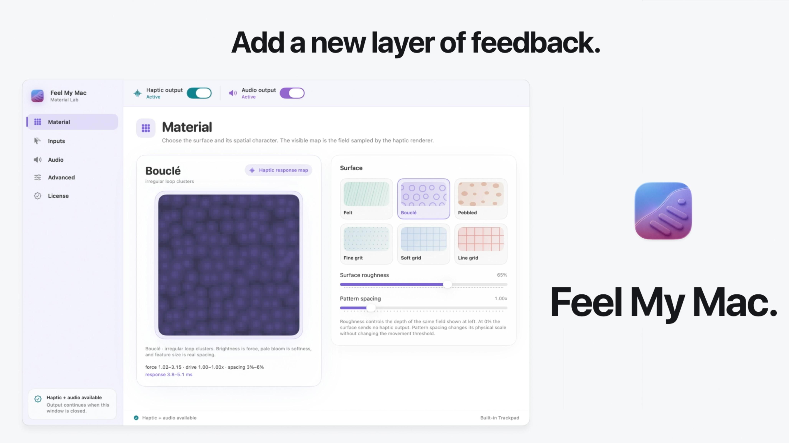

### 🎬 관련 영상
- [🎥 영상 보기](https://ph-files.imgix.net/d3b190b2-9f8a-4ad7-8ed1-1710a95234fa.jpeg?auto=format)

---

## 11. [una mano](https://www.producthunt.com/products/una-mano)
**Votes**: 75 | **도입 난이도**: 하 | **신뢰도**: 상
**Tagline**: A familiar iPhone keyboard that moves to your thumb
**서비스 링크**: https://www.producthunt.com/r/CZOFFDIYELKC44

**태그**: Productivity, iOS, Mobile App

### 📌 이 서비스 한눈에 보기
한 손 타이핑을 위해 키보드 위치를 자유롭게 옮길 수 있는 아이폰용 키보드 앱

### 🔑 주요 기능
- 사용자 손 위치에 맞춰 키보드를 왼쪽, 중앙, 오른쪽으로 이동 가능
- 위치 제어 기능 또는 스와이프 동작을 통한 직관적인 이동
- Full Access 권한 없이도 핵심 타이핑 기능 사용 가능

### 🙋 사용자에게 어떤 점이 좋은가
한 손으로 스마트폰을 조작할 때 키보드 위치를 조절하여 타이핑 편의성을 극대화할 수 있습니다.

### ✅ 지금 바로 써볼 기능
- Position control로 키보드 위치 변경해보기
- 스와이프 동작으로 키보드 이동 테스트하기
- 14일간 제공되는 Plus 기능 체험하기

### ⚠️ 사용 전 확인할 점
- 기존 키보드 레이아웃과 익숙해지는 데 시간이 필요할 수 있음
- Plus 기능은 14일 체험 기간 이후 유료 전환이 필요할 수 있음

### 🧭 확인이 더 필요한 정보
14일 체험 기간 종료 후의 구체적인 유료 플랜 가격 정책은 명시되지 않았습니다.

### 📸 스크린샷 및 갤러리

### 🎬 관련 영상
- [🎥 영상 보기](https://ph-files.imgix.net/8754a2e7-45c2-4f27-9030-df48681a9109.jpeg?auto=format)

---

## 12. [WattMate](https://www.producthunt.com/products/wattmate)
**Votes**: 74 | **도입 난이도**: 하 | **신뢰도**: 상
**Tagline**: Which app is draining your Mac, in watts and minutes saved
**서비스 링크**: https://www.producthunt.com/r/SRKTIQHJD7LOZR

**태그**: Productivity, macOS, Utility, Battery, AI Tool

### 📌 이 서비스 한눈에 보기
실시간 전력 소모량과 앱 종료 시 절약되는 시간을 알려주는 Mac 배터리 관리 도구

### 🔑 주요 기능
- 메뉴 바에서 실시간 앱별 전력 소모량(W) 확인 가능
- 특정 앱 종료 시 확보 가능한 배터리 시간(분) 계산
- 앱 종료 후 실제 배터리 효율 변화를 2분 뒤 재측정하여 검증

### 🙋 사용자에게 어떤 점이 좋은가
어떤 앱이 배터리를 가장 많이 소모하는지 직관적으로 파악하여, 배터리 수명을 효율적으로 관리할 수 있습니다.

### ✅ 지금 바로 써볼 기능
- 메뉴 바에 앱을 설치하여 실시간 전력 소모량 모니터링하기
- 배터리 소모가 큰 앱을 찾아 종료 후 절약되는 시간 확인하기

### ⚠️ 사용 전 확인할 점
- Apple Silicon 및 macOS 14 이상 환경에서만 작동함
- 앱 종료 직후가 아닌 2분 뒤에 최종 결과가 측정됨

### 🧭 확인이 더 필요한 정보
사용자의 하드웨어 사양에 따른 정확한 전력 측정 오차 범위는 명시되지 않았습니다.

### 📸 스크린샷 및 갤러리
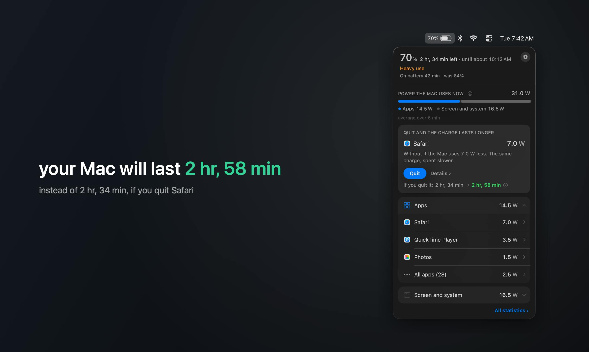
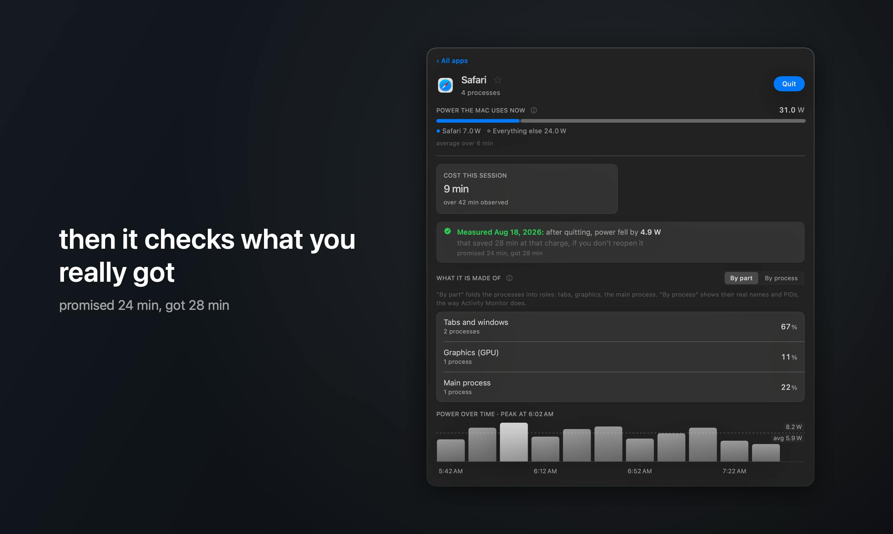
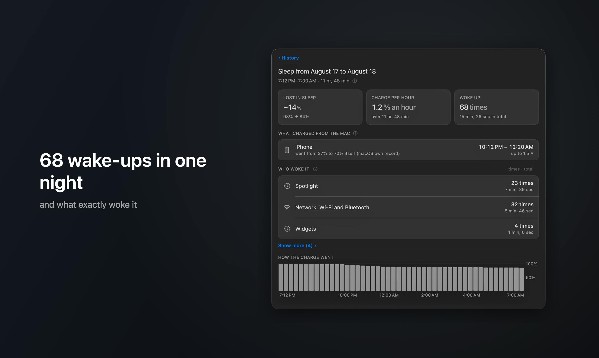

---

## 13. [eu/jev](https://www.producthunt.com/products/bevel-software)
**Votes**: 74 | **도입 난이도**: 하 | **신뢰도**: 상
**Tagline**: The first Jev-like model hosted in the EU
**서비스 링크**: https://www.producthunt.com/r/XR4IKWICY53AEO

**태그**: AI, Data Privacy, LLM, DevTool, Prompting

### 📌 이 서비스 한눈에 보기
GDPR 준수와 데이터 주권을 보장하는 유럽 기반의 Jev 스타일 AI 모델 서비스

### 🔑 주요 기능
- 독일 Hetzner GPU 기반의 유럽 내 호스팅으로 데이터 주권 확보
- 완벽한 GDPR 준수 및 프롬프트/답변 저장 불가 정책
- 기존 Jev와 동일한 방식 및 가격 정책(무료 출력 토큰) 제공

### 🙋 사용자에게 어떤 점이 좋은가
데이터 보안 및 GDPR 규제가 중요한 기업 사용자가 기존 Jev 모델의 성능을 유지하면서도 안심하고 업무에 활용할 수 있습니다.

### ✅ 지금 바로 써볼 기능
- 기존 Jev API 호출 방식 그대로 적용해보기
- 데이터 보안 요구사항에 부합하는지 기술 문서 검토하기

### ⚠️ 사용 전 확인할 점
- 독일 서버 위치로 인한 특정 지역에서의 네트워크 지연 가능성
- Jev와 동일한 가격 정책의 세부 유지 조건 확인 필요

### 🧭 확인이 더 필요한 정보
Jev와 완전히 동일한 API 엔드포인트 및 호환성을 제공하는지에 대한 기술적 세부 사항 확인이 필요합니다.

### 📸 스크린샷 및 갤러리
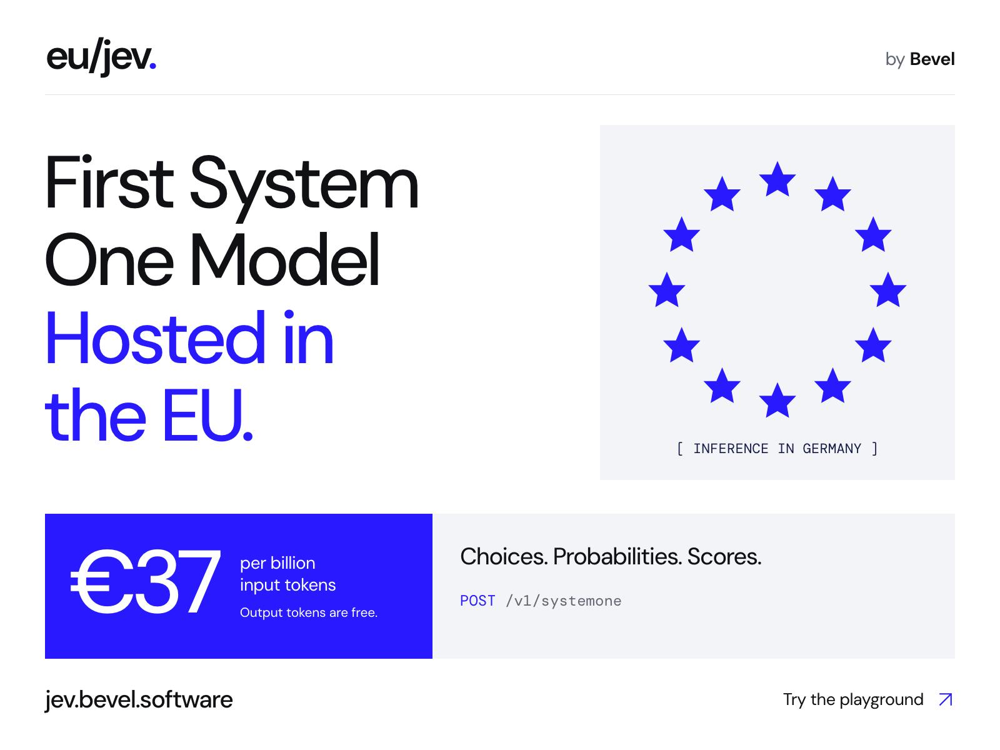

### 🎬 관련 영상
- [🎥 영상 보기](https://ph-files.imgix.net/e9b3de69-9f24-4778-a118-36bc580aa5a7.jpeg?auto=format)

---

## 14. [MacCam](https://www.producthunt.com/products/maccam)
**Votes**: 73 | **도입 난이도**: 하 | **신뢰도**: 상
**Tagline**: The camera app Apple never shipped for the Mac
**서비스 링크**: https://www.producthunt.com/r/X6HLAZC54JJGKI

**태그**: macOS, Photography, Productivity, Apple Ecosystem, AI Tool, Prompting, Video

### 📌 이 서비스 한눈에 보기
macOS 환경에 최적화된 네이티브 카메라 앱으로, 사진과 영상을 Apple Photos로 즉시 저장합니다.

### 🔑 주요 기능
- macOS 네이티브 앱으로 iPhone 및 웹캠과 연동 가능
- 촬영 결과물이 Apple Photos로 직접 저장되는 편리한 워크플로우
- Portrait, Studio Light 등 전문적인 조명 효과 및 Photo Booth 효과 제공

### 🙋 사용자에게 어떤 점이 좋은가
별도의 복잡한 설정 없이 Mac의 카메라를 활용해 고품질 사진과 영상을 찍고, Apple 생태계 내에서 즉시 관리할 수 있습니다.

### ✅ 지금 바로 써볼 기능
- 기본 카메라 기능 및 조명 효과 테스트
- iPhone 및 웹캠 연동 확인
- Pro 기능(텔레프롬프터 등) 선점 기회 확인

### ⚠️ 사용 전 확인할 점
- Pro 기능(텔레프롬프터, 아이컨택 등)은 유료 전환 가능성 있음
- 초기 10만 명 사용자에게만 Pro 기능 무료 제공 정책 확인 필요

### 🧭 확인이 더 필요한 정보
Pro 기능의 무료 제공 범위와 향ely 유료 전환 정책에 대한 상세 조건 확인이 필요합니다.

### 📸 스크린샷 및 갤러리
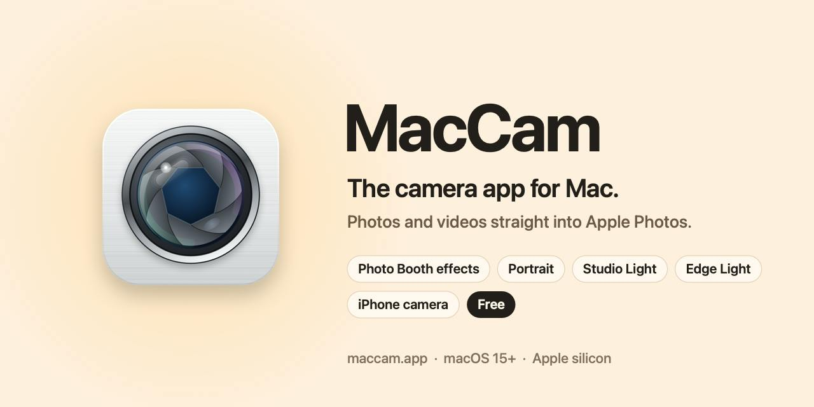

---

## 15. [Deskcord.chat](https://www.producthunt.com/products/deskcord-chat)
**Votes**: 72 | **도입 난이도**: 하 | **신뢰도**: 상
**Tagline**: A widget to chat with customers from your Discord server
**서비스 링크**: https://www.producthunt.com/r/M7CNIM6FUUPGZO

**태그**: CustomerSupport, SaaS, Discord, NoCode, AI Tool, Chat

### 📌 이 서비스 한눈에 보기
디스코드 서버를 강력한 고객 지원 데스크로 변환해주는 위젯 서비스

### 🔑 주요 기능
- 웹사이트 위젯을 통해 고객 문의를 디스코드 스레드로 즉시 연결
- 5분 내 빠른 임베딩 및 설정 가능
- 무제한 계정 및 도메인 지원으로 소규모 팀에 최적화

### 🙋 사용자에게 어떤 점이 좋은가
고가의 고객 지원 도구 대신 익숙한 디스코드 환경에서 고객과 직접 소통하며 운영 비용을 절감할 수 있습니다.

### ✅ 지금 바로 써볼 기능
- 웹사이트에 채팅 위젯 임베딩하기
- 디스코드 서버와 연동하여 스레드 생성 확인하기
- 고객 문의가 디스코드 채널로 들어오는지 테스트하기

### ⚠️ 사용 전 확인할 점
- 디스코드 사용 환경에 익숙하지 않은 고객에게는 생소할 수 있음
- 대규모 엔터프라이즈급 기능(CRM 연동 등)은 부족할 수 있음

### 🧭 확인이 더 필요한 정보
상세한 요금제 체계와 기능별 제한 사항에 대한 구체적인 정보가 명시되지 않았습니다.

### 📸 스크린샷 및 갤러리

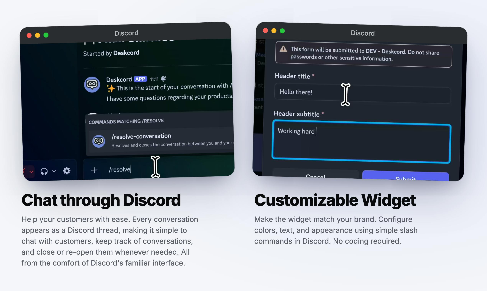
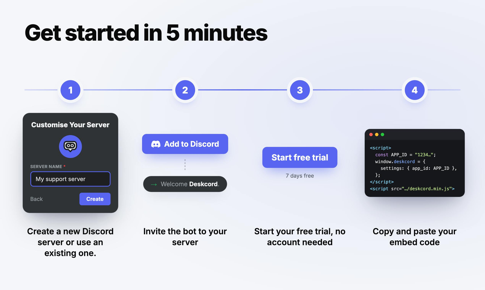

### 🎬 관련 영상
- [🎥 영상 보기](https://ph-files.imgix.net/7139aca6-439e-4023-b1a4-631c31ab9d24.jpeg?auto=format)

---

## 16. [Agent Activity](https://www.producthunt.com/products/agent-activity)
**Votes**: 70 | **도입 난이도**: 하 | **신뢰도**: 상
**Tagline**: See what your AI agents do behind
**서비스 링크**: https://www.producthunt.com/r/EUFQCR2QN6DAEQ

**태그**: DevTool, AI, macOS, Observability, Agent, AI Tool

### 📌 이 서비스 한눈에 보기
AI 코딩 에이전트의 작업 과정을 실시간으로 모니터링하는 macOS 전용 도구

### 🔑 주요 기능
- AI 에이전트의 세션, 빌드, 테스트 실행 및 스크린샷 실시간 확인
- Claude Code 및 Xcode 작업 로그/디스크 데이터 기반의 가시성 제공
- 사용자 승인 하에 진행되는 개인정보 보호 중심의 데이터 수집

### 🙋 사용자에게 어떤 점이 좋은가
AI 에이전트가 백그라운드에서 어떤 작업을 수행하는지 투명하게 확인하여 디버깅과 작업 흐름 파악을 용이하게 합니다.

### ✅ 지금 바로 써볼 기능
- 에이전트 작업 로그와 스크린샷 대조하기
- 에이전트별 세션 및 빌드 기록 확인하기
- 로컬 디스크 데이터 기반의 작업 결과 검증하기

### ⚠️ 사용 전 확인할 점
- macOS 26 및 Xcode 27 이상의 특정 환경 필요
- 로컬 디스크의 사용량 및 크래시 데이터에 접근하므로 보안 설정 확인 필요

### 🧭 확인이 더 필요한 정보
명시된 macOS 및 Xcode 버전이 미래의 특정 버전을 지칭하는 것인지 확인이 필요합니다.

### 📸 스크린샷 및 갤러리
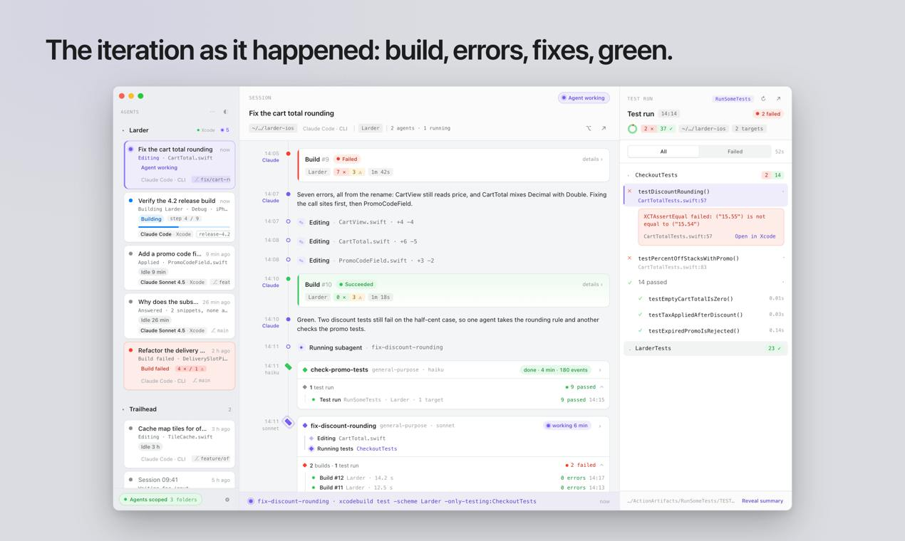
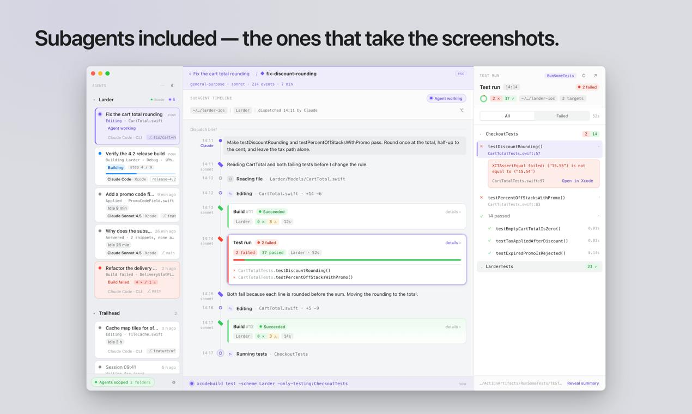
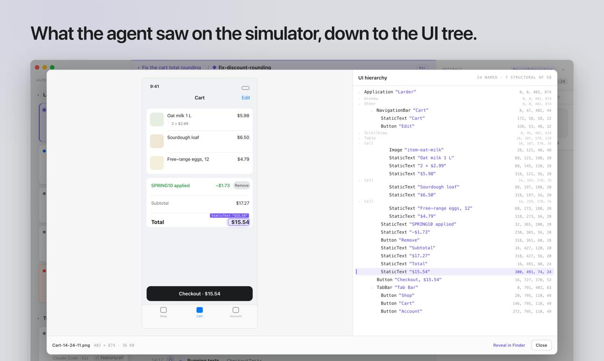

### 🎬 관련 영상
- [🎥 영상 보기](https://ph-files.imgix.net/6fa930c3-4fd2-44e3-9199-736127556d90.jpeg?auto=format)

---

## 17. [Crowny! ](https://www.producthunt.com/products/crowny-2)
**Votes**: 69 | **도입 난이도**: 하 | **신뢰도**: 상
**Tagline**: Claude Code, Codex, music, your day & 20+ apps in your notch
**서비스 링크**: https://www.producthunt.com/r/ZSJ4W2VEFK4O7P

**태그**: Productivity, AI, MacBook, Utility, Agent, AI Tool, DevTool

### 📌 이 서비스 한눈에 보기
맥북 노치 영역에서 AI 에이전트, 음악, 일정 등 다양한 앱을 한눈에 관리하는 다이내믹 노치 앱

### 🔑 주요 기능
- 맥북 노치 영역을 활용한 직관적인 대시보드 제공
- Claude Code, Codex, Grok 등 AI 에이전트와의 실시간 연동
- 음악, 타이머, 캘린더, 클립보드 등 생산성 도구 통합

### 🙋 사용자에게 어떤 점이 좋은가
화면 공간을 효율적으로 활용하면서도 AI 에이전트의 알림과 일상적인 작업들을 노치에서 즉각적으로 확인할 수 있습니다.

### ✅ 지금 바로 써볼 기능
- 노치 영역에 주요 AI 에이전트 연결하기
- 캘린더 및 리마인더 설정으로 일정 관리하기
- 음악 및 타이머 기능을 통한 작업 환경 구축하기

### ⚠️ 사용 전 확인할 점
- 초기 사용자 대상의 유료 가격 정책 확인 필요
- 노치 영역 점유로 인한 화면 가독성 변화 확인 필요

### 🧭 확인이 더 필요한 정보
제공되는 20개 이상의 앱 기능과 구체적인 AI 에이전트 연동 방식에 대한 상세 정보가 필요합니다.

### 📸 스크린샷 및 갤러리
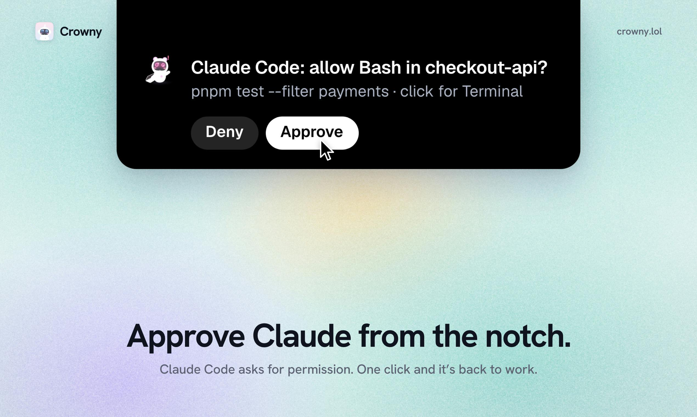
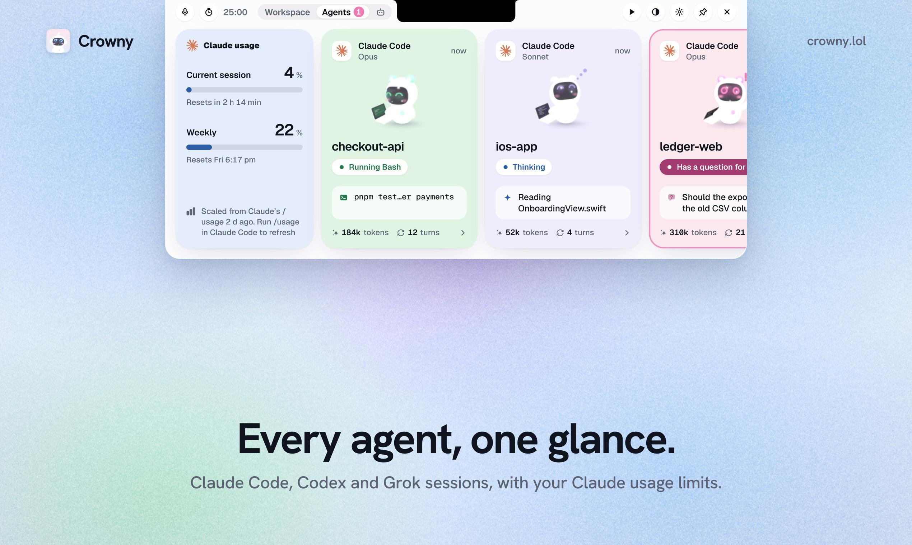
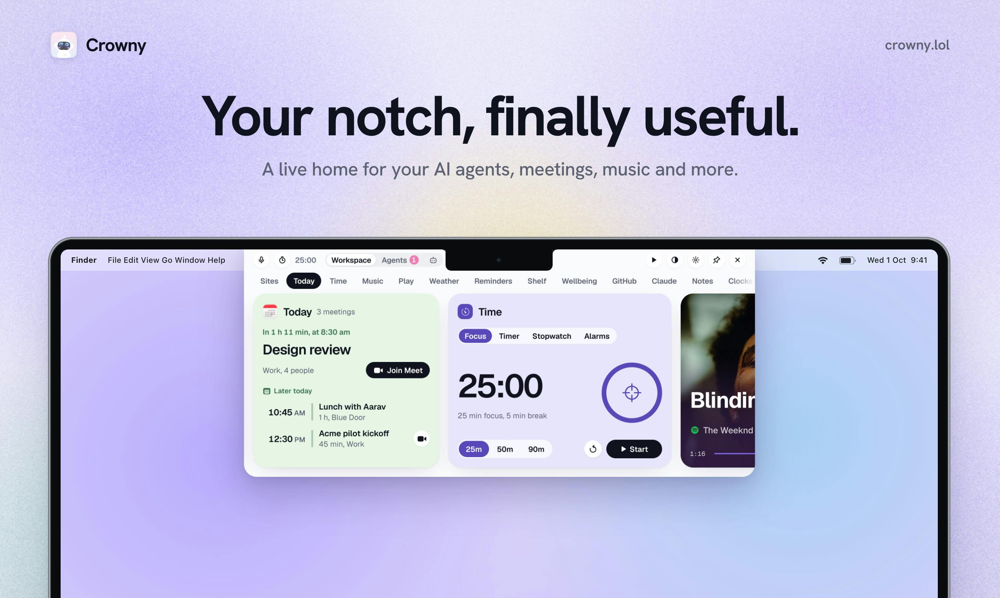

### 🎬 관련 영상
- [🎥 영상 보기](https://ph-files.imgix.net/fbdaf33c-151d-4a0a-a9a0-12e807e4de09.jpeg?auto=format)

---

## 18. [bmux](https://www.producthunt.com/products/bmux)
**Votes**: 66 | **도입 난이도**: 중 | **신뢰도**: 상
**Tagline**: Browser multiplexer for the agentic era
**서비스 링크**: https://www.producthunt.com/r/VE3OLXN5QRXGJR

**태그**: Automation, Productivity, Browser, OpenSource, AI-Agent, Agent

### 📌 이 서비스 한눈에 보기
에이전트 자동화와 수동 브라우징을 동시에 수행할 수 있는 멀티패널 브라우저

### 🔑 주요 기능
- 분할 창, 이름 지정 세션, 개별 프로필을 지원하는 멀티패널 브라우저
- CLI를 통해 백그라운드에서 에이전트가 작업하는 동안 사용자는 다른 작업을 수행 가능
- 키보드 단축키 중심의 효율적인 브라우징 환경 제공

### 🙋 사용자에게 어떤 점이 좋은가
사용자가 직접 브라우징하는 동안 AI 에이전트가 백그라운드에서 작업을 수행하게 하여, 작업 흐름을 끊지 않고 자동화 결과물을 실시간으로 확인할 수 있습니다.

### ✅ 지금 바로 써볼 기능
- 분할 창 기능을 활용한 멀티태스킹 환경 구축
- CLI를 통한 백그라운드 에이전트 작업 실행
- 세션 및 프로필 분리를 통한 작업 환경 격리

### ⚠️ 사용 전 확인할 점
- CLI 기반 에이전트 제어에 대한 기술적 숙련도 필요
- 백그라운드 작업과 수동 작업 간의 리소스 충돌 가능성

### 🧭 확인이 더 필요한 정보
에이전트가 백그라운드에서 수행하는 작업의 구체적인 자동화 범위와 보안 수준에 대한 확인이 필요합니다.

### 📸 스크린샷 및 갤러리
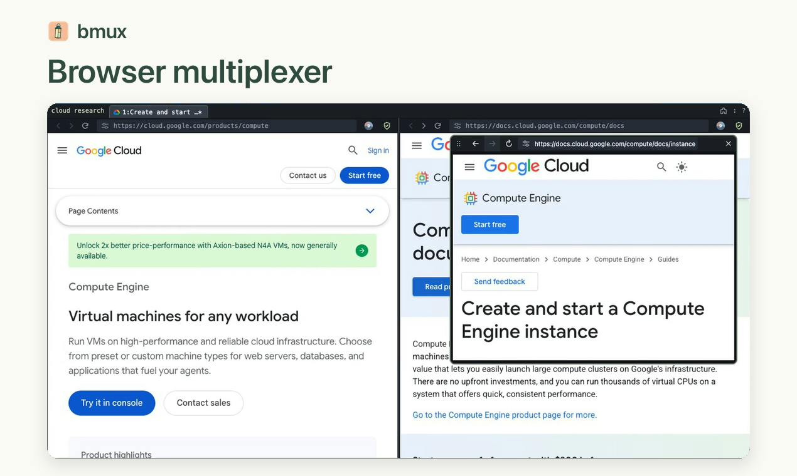

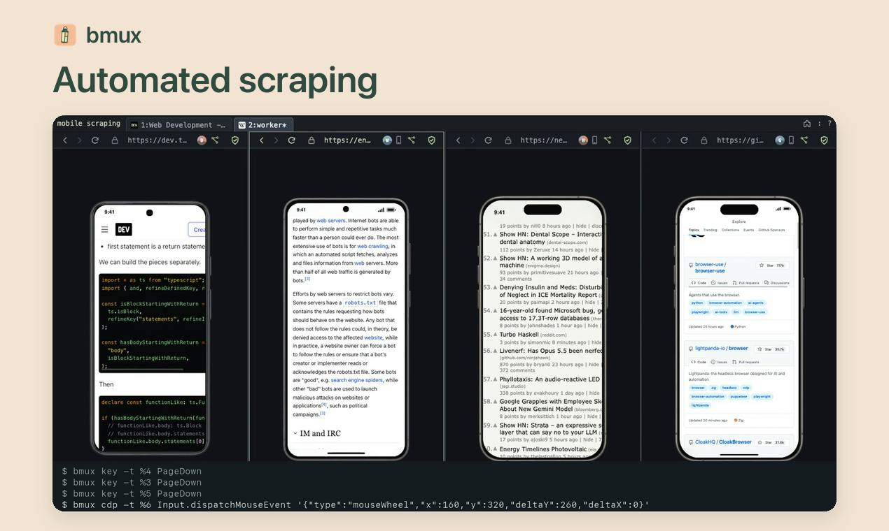

### 🎬 관련 영상
- [🎥 영상 보기](https://ph-files.imgix.net/4209de69-ed53-4a1b-a480-b7120f6ef6fb.jpeg?auto=format)

---

## 19. [Singularity](https://www.producthunt.com/products/singularity-2)
**Votes**: 65 | **도입 난이도**: 하 | **신뢰도**: 상
**Tagline**: Run AI coding agents in parallel, one ticket at a time
**서비스 링크**: https://www.producthunt.com/r/MQ7EA6OP27U4DA

**태그**: DevTool, AI-Agent, Git, Productivity, Agent, AI Tool, Chat

### 📌 이 서비스 한눈에 보기
채팅 방식의 한계를 넘어, 개별 티켓 단위로 AI 코딩 에이전트를 병렬 실행하는 워크플로우 도구

### 🔑 주요 기능
- 채팅 대신 원자적(Atomic) 티켓 단위로 작업 범위와 컨텍스트를 분리
- 격리된 Git 워크트리를 사용하여 여러 에이전트를 병렬로 실행 가능
- 로컬 우선(Local-first) 방식 및 사용자 개인 API 키 사용

### 🙋 사용자에게 어떤 점이 좋은가
AI와 대화하며 컨텍스트를 소모하는 대신, 명확한 작업 단위로 에이전트를 돌려 코드 차이(diff)만 검토하고 병합할 수 있어 생산성이 높아집니다.

### ✅ 지금 바로 써볼 기능
- 개인 API 키 설정하기
- 작은 규모의 티켓 생성하여 병렬 실행 테스트하기
- 생성된 Git 워크트리에서 코드 차이 검토하기

### ⚠️ 사용 전 확인할 점
- 사용자 개인 API 키를 직접 관리해야 하므로 보안 및 비용 관리 필요
- 로컬 환경의 리소스 사용량 확인 필요

### 🧭 확인이 더 필요한 정보
사용자의 로컬 환경 사양에 따른 병렬 실행 성능 및 안정성 확인이 필요합니다.

### 📸 스크린샷 및 갤러리
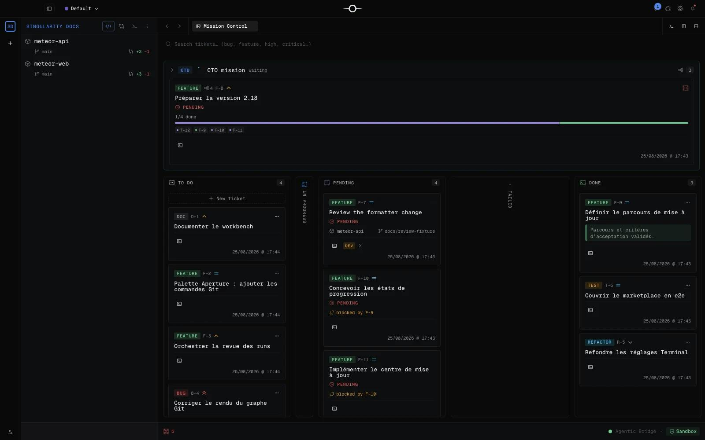
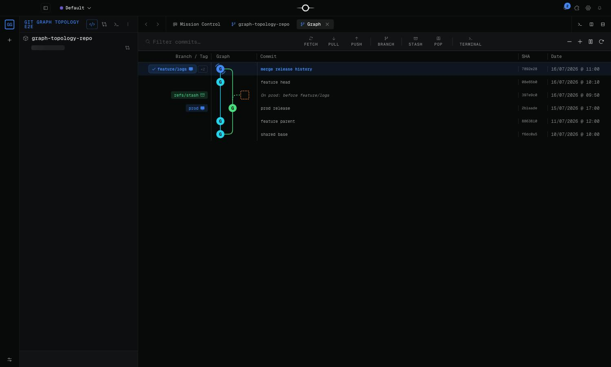
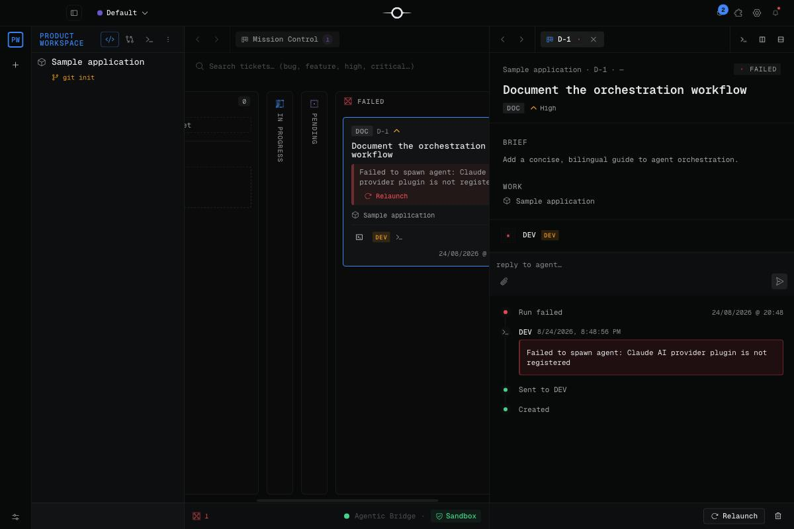

### 🎬 관련 영상
- [🎥 영상 보기](https://ph-files.imgix.net/a458966b-c877-4781-a36c-b45d248ba38a.jpeg?auto=format)

---

## 20. [Kilo](https://www.producthunt.com/products/kilo)
**Votes**: 64 | **도입 난이도**: 하 | **신뢰도**: 상
**Tagline**: Your agentic fitness coach in iMessage
**서비스 링크**: https://www.producthunt.com/r/JPHYBSG2BUBTU5

**태그**: Fitness, AI, Productivity, Mobile, Agent, AI Tool

### 📌 이 서비스 한눈에 보기
iMessage를 통해 개인 맞춤형 운동 프로그램을 제공하는 AI 피트니스 코치

### 🔑 주요 기능
- iMessage 기반의 간편한 코칭 인터페이스
- 사용자 로그 및 체크인을 바탕으로 한 맞춤형 운동 추천
- 훈련 프로그램 설계부터 운동 기록까지 통합 관리

### 🙋 사용자에게 어떤 점이 좋은가
별도의 복잡한 앱을 실행할 필요 없이 메시지 창에서 바로 운동 프로그램을 받고 기록할 수 있어 접근성이 매우 높습니다.

### ✅ 지금 바로 써볼 기능
- 프라이빗 베타 참여 신청하기
- iMessage를 통한 운동 프로그램 생성 테스트
- 로그 기록을 통한 맞춤형 추천 기능 확인

### ⚠️ 사용 전 확인할 점
- 현재 프라이빗 베타 단계로 서비스 범위가 제한적일 수 있음
- iMessage 환경에 의존적인 인터페이스

### 🧭 확인이 더 필요한 정보
현재 프라이빗 베타 단계이므로 정식 출시 시의 기능 범위와 비용 정책은 미정입니다.

### 📸 스크린샷 및 갤러리
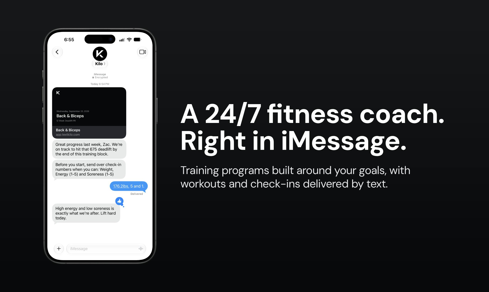
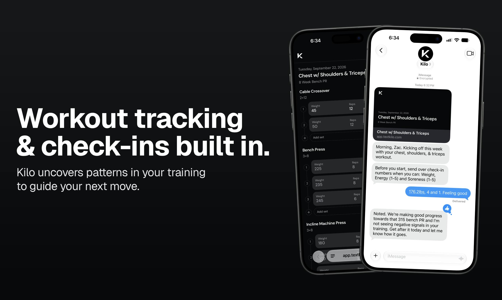
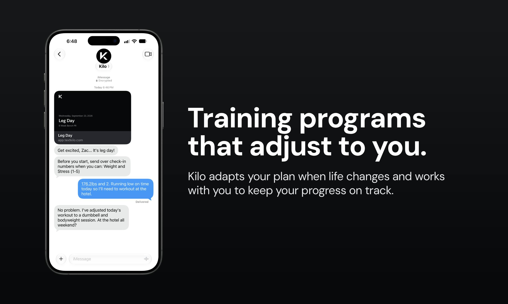

---

## 21. [bawkterm](https://www.producthunt.com/products/bawkterm-an-open-source-ssh-sftp-client)
**Votes**: 64 | **도입 난이도**: 하 | **신뢰도**: 상
**Tagline**: A desktop client for SSH, SFTP, Docker over SSH
**서비스 링크**: https://www.producthunt.com/r/4TZU6UBRQRRAHI

**태그**: DevTool, SSH, Docker, RemoteAccess, Linux

### 📌 이 서비스 한눈에 보기
SSH, SFTP, Docker 관리를 하나로 통합한 데스크톱 클라이언트

### 🔑 주요 기능
- SSH, SFTP, Docker over SSH 및 원격 데스크톱 통합 지원
- Windows 및 Linux 운영체제 호환
- 개발자 및 시스템 관리자를 위한 올인원 터미널 환경 제공

### 🙋 사용자에게 어떤 점이 좋은가
여러 도구를 번갈아 사용할 필요 없이 터미널 작업부터 파일 전송, 컨테이너 관리까지 하나의 클라이언트에서 효율적으로 처리할 수 있습니다.

### ✅ 지금 바로 써볼 기능
- SSH 접속 및 터미널 환경 설정
- SFTP를 통한 원격 파일 전송 테스트
- Docker over SSH를 이용한 컨테이너 관리

### ⚠️ 사용 전 확인할 점
- Windows 및 Linux 환경에 최적화되어 있어 macOS 지원 여부 확인 필요
- 오픈소스 프로젝트이므로 보안 및 안정성 검증 필요

### 🧭 확인이 더 필요한 정보
현재 제공되는 기능 외에 GUI 기반의 추가적인 관리 기능이나 상세한 보안 프로토콜 지원 범위는 확인이 필요합니다.

### 📸 스크린샷 및 갤러리
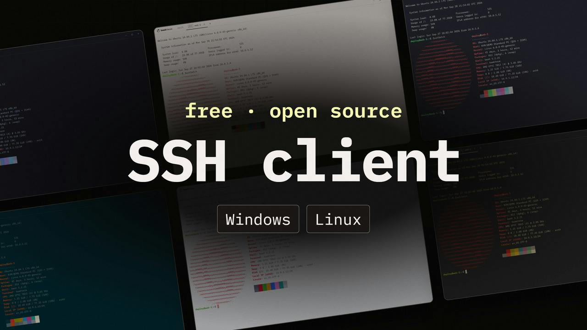
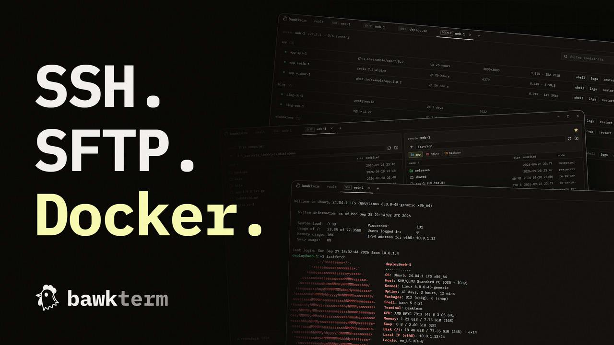
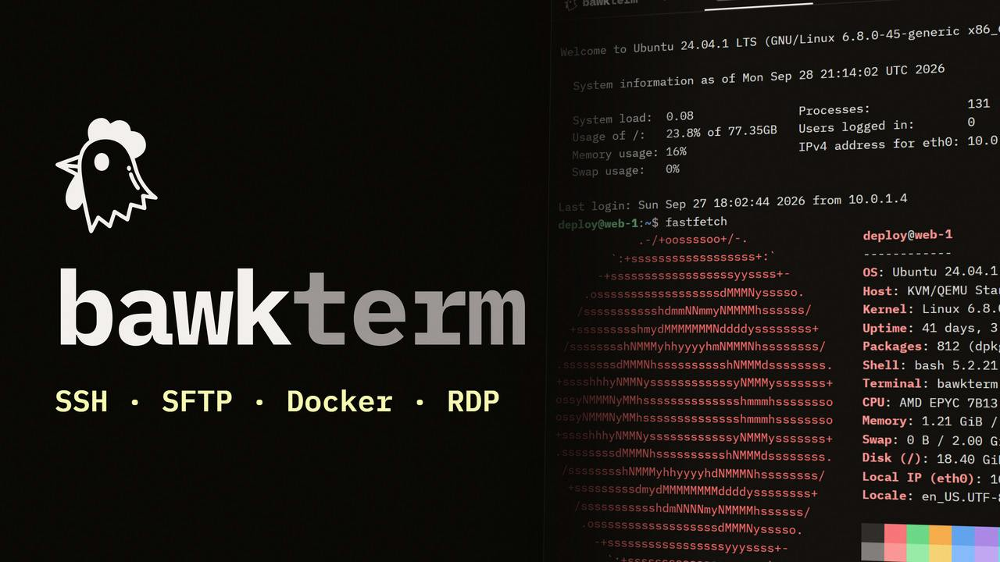

### 🎬 관련 영상
- [🎥 영상 보기](https://ph-files.imgix.net/1a02edbe-5a27-4db0-beb7-4c77c55ce254.jpeg?auto=format)

---

## 22. [OTPfill](https://www.producthunt.com/products/otpfill)
**Votes**: 64 | **도입 난이도**: 하 | **신뢰도**: 상
**Tagline**: Autofill OTP codes from your email on Mac
**서비스 링크**: https://www.producthunt.com/r/JMNPSULALAOPSC

**태그**: Productivity, Automation, MacApp, Security, AI Tool, DevTool, Email

### 📌 이 서비스 한눈에 보기
이메일로 받은 OTP 코드를 맥 메뉴바에서 클릭 한 번으로 자동 입력하는 도구

### 🔑 주요 기능
- 맥 메뉴바에서 작동하는 간편한 인터페이스
- 이메일로 수신된 인증 코드를 감지하여 입력창에 제안
- 복사 및 붙여넣기 과정을 생략하는 자동 채우기 기능

### 🙋 사용자에게 어떤 점이 좋은가
매번 이메일을 열어 코드를 복사하고 다시 브라우저로 돌아오는 번거로운 과정을 획기적으로 줄여줍니다.

### ✅ 지금 바로 써볼 기능
- 메뉴바 앱 설치 및 권한 설정
- 이메일 수신 후 'Fill' 버튼 클릭 테스트
- 주요 웹사이트 로그인 시 자동 채우기 기능 활용

### ⚠️ 사용 전 확인할 점
- 이메일 접근 권한에 따른 보안 및 개인정보 보호 검토 필요
- 웹 브라우저와의 호환성 및 입력창 인식 여부 확인 필요

### 🧭 확인이 더 필요한 정보
이메일 계정 연동 방식 및 데이터 보안 처리 방식에 대한 상세 정보가 필요합니다.

### 📸 스크린샷 및 갤러리
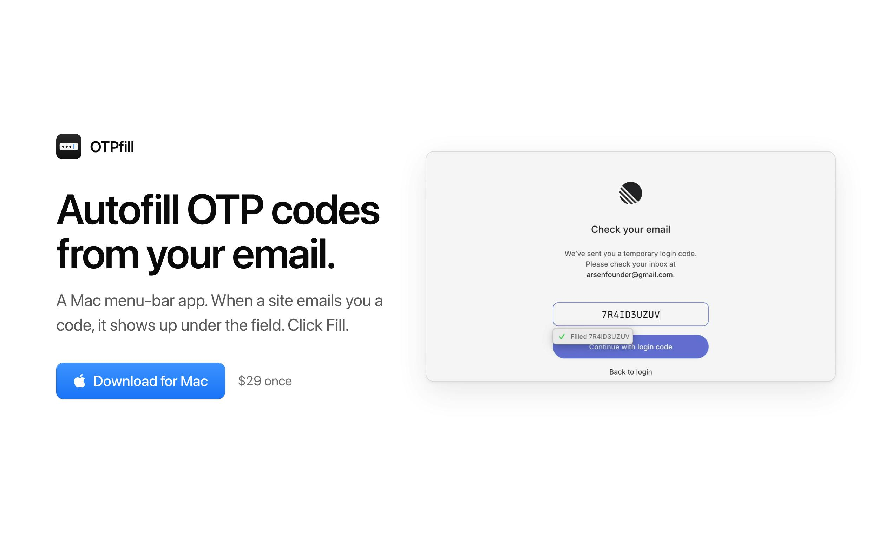
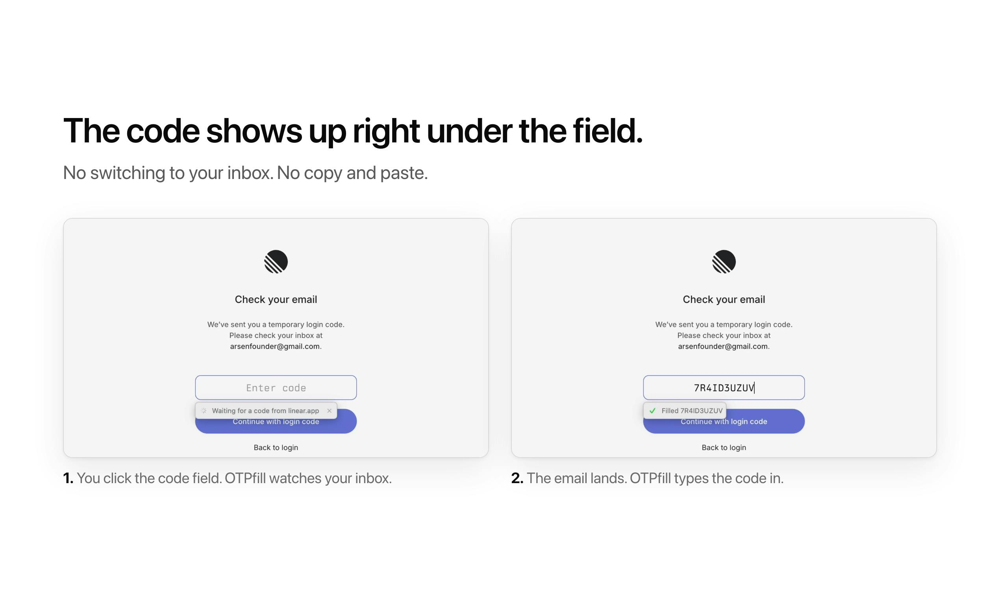
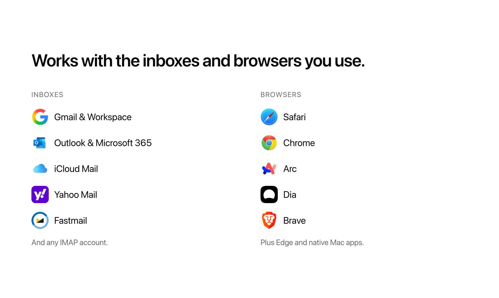

### 🎬 관련 영상
- [🎥 영상 보기](https://ph-files.imgix.net/873469f8-1985-4746-9caf-ba0c3847a74b.jpeg?auto=format)

---

## 23. [Sapien](https://www.producthunt.com/products/sapien-4)
**Votes**: 63 | **도입 난이도**: 하 | **신뢰도**: 상
**Tagline**: AI market research with synthetic populations
**서비스 링크**: https://www.producthunt.com/r/WZ6VBDQSPLZ3ZM

**태그**: Market Research, AI, Strategy, Analytics, AI Tool, API, Marketing

### 📌 이 서비스 한눈에 보기
가상 인구 집단을 활용한 AI 기반 시장 조사 및 전략 검증 도구

### 🔑 주요 기능
- 시뮬레이션된 가상 타겟 오디언스 구축
- 제품 컨셉, 마케팅 전략, 가격 정책 비교 분석
- 상호작용 가능한 결과 리포트 및 세그먼트별 비교 기능

### 🙋 사용자에게 어떤 점이 좋은가
실제 고객을 대상으로 하기 전, 가상 인구를 통해 아이디어를 빠르게 테스트하고 시장 반응을 예측할 수 있습니다.

### ✅ 지금 바로 써볼 기능
- 비즈니스 질문 입력하여 가상 응답 탐색하기
- 세그먼트별 비교 기능을 통한 타겟 분석하기
- 심층 분석을 위한 후속 질문 던지기

### ⚠️ 사용 전 확인할 점
- 실제 인간이 아닌 시뮬레이션된 데이터이므로 실제 시장 반응과 차이가 있을 수 있음
- 가상 인구 모델의 편향성이 결과에 영향을 미칠 수 있음

### 🧭 확인이 더 필요한 정보
시뮬레이션된 인구 집단이 실제 인구 통계적 특성을 얼마나 정밀하게 반영하는지 확인이 필요합니다.

### 📸 스크린샷 및 갤러리

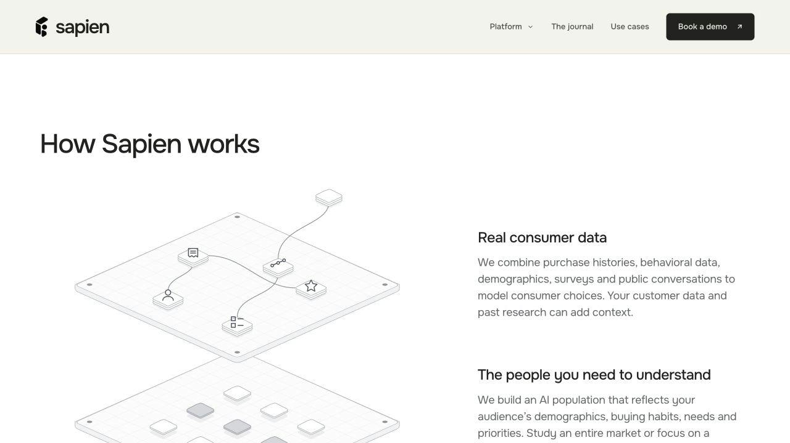

---

## 24. [Yubi](https://www.producthunt.com/products/yubi-2)
**Votes**: 62 | **도입 난이도**: 하 | **신뢰도**: 상
**Tagline**: Talk to your Mac and let Yubi do the typing
**서비스 링크**: https://www.producthunt.com/r/QHYX6JTMZIQJXN

**태그**: Productivity, Mac, Voice-to-Text, Automation, AI Tool, Email

### 📌 이 서비스 한눈에 보기
음성만으로 Mac에서 타이핑과 화면 제어를 수행하는 초경량 생산성 도구

### 🔑 주요 기능
- 우측 Option 키를 누른 채 말하면 커서 위치에 즉시 텍스트 입력
- 우측 Command 키를 통해 화면상의 도움(제어) 기능 제공
- 사용자의 음성이 외부로 유출되지 않는 온디바이스(On-device) 방식

### 🙋 사용자에게 어떤 점이 좋은가
키보드를 직접 치지 않고도 음성으로 텍스트를 입력할 수 있어 작업 흐름을 유지하면서도 손의 피로를 줄일 수 있습니다.

### ✅ 지금 바로 써볼 기능
- Option 키를 활용한 음성 타이핑 테스트
- Command 키를 통한 화면 제어 기능 확인
- 이메일 로그인을 통한 무료 버전 사용

### ⚠️ 사용 전 확인할 점
- 음성 인식 정확도는 Mac의 마이크 성능 및 주변 소음에 영향을 받을 수 있음
- 무료 버전 사용 시 기능 제한이나 향후 유료 전환 정책 확인 필요

### 🧭 확인이 더 필요한 정보
무료 버전의 구체적인 기능 제한 범위와 유료 플랜의 상세 내용이 명시되지 않았습니다.

### 📸 스크린샷 및 갤러리

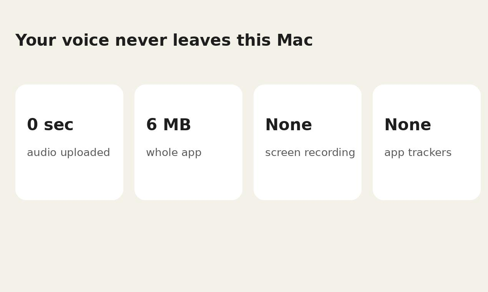

---

## 25. [Thanor AI](https://www.producthunt.com/products/thanor-ai)
**Votes**: 61 | **도입 난이도**: 하 | **신뢰도**: 상
**Tagline**: Make your AI-built sites look expensive and not like slop
**서비스 링크**: https://www.producthunt.com/r/6OMCK4EXP6CPA3

**태그**: DesignTool, AI, WebDev, Productivity, AI Tool, Chat, Prompting, Design

### 📌 이 서비스 한눈에 보기
AI로 제작한 웹사이트의 디자인 퀄리티를 전문가 수준으로 끌어올리는 디자인 가이드 도구

### 🔑 주요 기능
- AI 생성 사이트 특유의 단조로운 디자인(Slop) 해결
- Claude, ChatGPT, Cursor 등 주요 AI 도구와 호환되는 정교한 디자인 프롬프트 제공
- 팔레트, 타이포그래피, 모션, 구조 등 섹션별 상세 설계 지원

### 🙋 사용자에게 어떤 점이 좋은가
AI로 웹사이트를 빠르게 구축하면서도 디자인 완성도를 높이고 싶은 개발자와 창업자에게 유용합니다.

### ✅ 지금 바로 써볼 기능
- 기존 AI 생성 사이트의 프롬프트에 Thanor 가이드 적용해보기
- MCP 서버를 활용해 개발 에디터에 디자인 프롬프트 연동하기
- 매주 업데이트되는 새로운 프롬프트와 컴포넌트 확인하기

### ⚠️ 사용 전 확인할 점
- 직접적인 코드 생성 도구가 아닌 디자인 가이드/프롬프트 중심의 도구임
- 사용자의 디자인 감각이나 프롬프트 활용 능력에 따라 결과물 차이 발생 가능

### 🧭 확인이 더 필요한 정보
사이트 클로닝 기능과 같은 일부 핵심 기능은 향후 출시 예정입니다.

### 📸 스크린샷 및 갤러리

### 🎬 관련 영상
- [🎥 영상 보기](https://ph-files.imgix.net/9ae49273-c459-4198-a2bb-2dc563f8e8eb.jpeg?auto=format)

---

## 26. [Snail Walk](https://www.producthunt.com/products/snail-walk)
**Votes**: 32 | **도입 난이도**: 하 | **신뢰도**: 상
**Tagline**: Keep walking or Bob (the snail) is gonna get ya! 🐌
**서비스 링크**: https://www.producthunt.com/r/KKX2KHHV6LYTV2

**태그**: Fitness, Gamification, Health, AI Tool

### 📌 이 서비스 한눈에 보기
실제 걸음 수로 게임을 진행하는 몰입형 워킹 피트니스 게임

### 🔑 주요 기능
- 실제 걸음 수와 연동되는 게임 플레이 방식
- Apple Health 및 Health Connect를 통한 단계 동기화
- 거대 달팽이로부터 도망치며 목표를 달성하는 게임성

### 🙋 사용자에게 어떤 점이 좋은가
일상적인 걷기를 게임의 진행 요소로 전환하여 운동 동기를 부여하고 재미를 제공합니다.

### ✅ 지금 바로 써볼 기능
- Apple Health 또는 Health Connect 연동하기
- 실제 걷기를 통해 게임 내 진행도 높이기

### ⚠️ 사용 전 확인할 점
- 스마트폰의 걸음 수 측정 기능에 의존하므로 기기 환경에 따라 차이가 있을 수 있음

### 🧭 확인이 더 필요한 정보
게임의 구체적인 콘텐츠 볼륨과 추가적인 보상 체계에 대한 정보가 부족합니다.

### 📸 스크린샷 및 갤러리

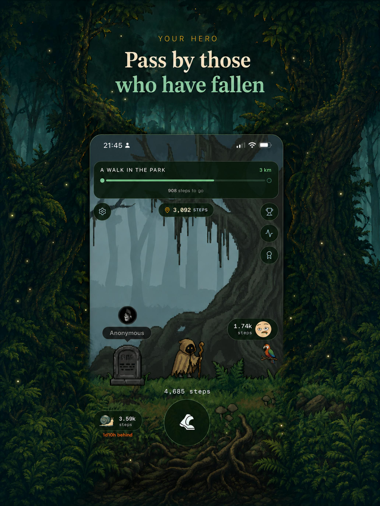

### 🎬 관련 영상
- [🎥 영상 보기](https://ph-files.imgix.net/8cb899af-8ed5-4147-9568-e729093e009e.jpeg?auto=format)

---

## 27. [Botscope](https://www.producthunt.com/products/botscope-2)
**Votes**: 25 | **도입 난이도**: 하 | **신뢰도**: 상
**Tagline**: See every bot and AI agent. Then decide who gets in.
**서비스 링크**: https://www.producthunt.com/r/6DXJ2IEUN27OAV

**태그**: Security, AI, DevTool, Analytics, Agent, AI Tool

### 📌 이 서비스 한눈에 보기
AI 에이전트와 봇의 유입을 식별하고 제어할 수 있는 통합 보안 및 관찰 플랫폼

### 🔑 주요 기능
- 모든 요청을 인간, 크롤러, 스크래퍼, AI 에이전트로 자동 분류 및 이유 제공
- 관찰 모드 우선 제공으로 서비스 중단 없이 유입 경로 및 모델 식별 가능
- WordPress, Cloudflare, DNS 등 다양한 방식으로 간편한 적용 및 정책 집행

### 🙋 사용자에게 어떤 점이 좋은가
웹사이트에 유입되는 AI 봇과 크롤러를 명확히 구분하여, 검색 엔진 최적화(SEO)는 유지하면서 무분별한 데이터 스크래핑은 효과적으로 차단할 수 있습니다.

### ✅ 지금 바로 써볼 기능
- 스크립트 태그를 통한 즉각적인 관찰 모드 시작
- 유입되는 AI 모델별 데이터 및 인용 페이지 분석
- 분석된 데이터를 바탕으로 차단/허용 정책 설정

### ⚠️ 사용 전 확인할 점
- 월 10만 이벤트 초과 시 비용 발생 가능성 확인 필요
- 적용 방식(Cloudflare, DNS 등)에 따른 네트워크 설정 영향도 검토

### 🧭 확인이 더 필요한 정보
사용자의 특정 기술 스택(WordPress, PHP 등)에 따른 구체적인 구현 난이도와 성능 영향은 별도 확인이 필요합니다.

### 📸 스크린샷 및 갤러리
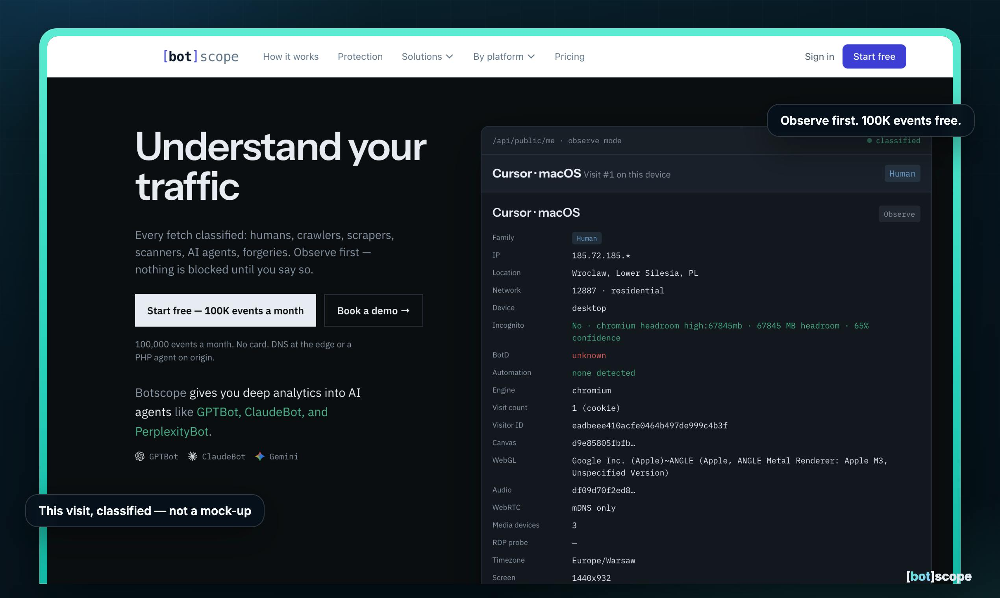
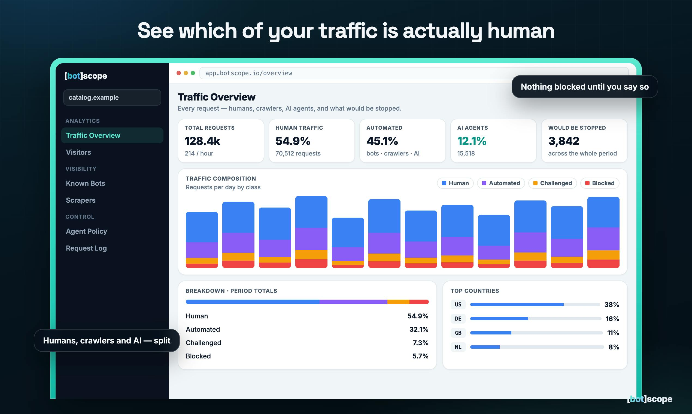
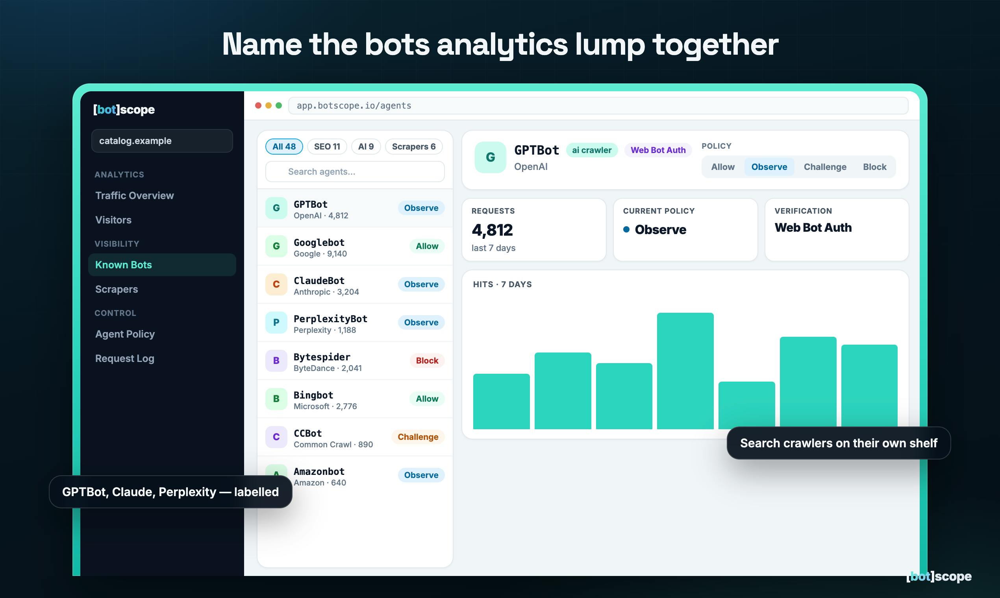

### 🎬 관련 영상
- [🎥 영상 보기](https://ph-files.imgix.net/6c6372dc-0f9c-450d-99c9-fdb39b627da1.jpeg?auto=format)

---

## 28. [BeanRitual](https://www.producthunt.com/products/beanritual)
**Votes**: 18 | **도입 난이도**: 하 | **신뢰도**: 상
**Tagline**: AI assistant that helps you dial in your best espresso shot
**서비스 링크**: https://www.producthunt.com/r/AIOY77BUMPK7S7

**태그**: Coffee, Productivity, AI, Mobile, AI Tool

### 📌 이 서비스 한눈에 보기
최적의 에스프레소 추출 레시피를 기록하고 관리하는 AI 커피 어시스턴트

### 🔑 주요 기능
- 커피 봉투 사진 촬영을 통한 자동 라벨 인식
- 도징량, 분쇄도, 추출 시간, 수율 등 상세 레시피 기록
- 원두별 최적의 추출 설정 저장 및 관리

### 🙋 사용자에게 어떤 점이 좋은가
매번 달라지는 원두 상태에 맞춰 최적의 맛을 찾고, 이를 기록하여 언제든 동일한 맛을 재현할 수 있게 도와줍니다.

### ✅ 지금 바로 써볼 기능
- 커피 봉투 사진 찍어 등록하기
- 추출 데이터(도징, 분쇄도, 시간 등) 기록하기
- 성공적인 레시피 별표(Star) 표시하기

### ⚠️ 사용 전 확인할 점
- 현재 iPhone용 베타 버전으로 제공됨
- 계정 없이 사용 가능하나 베타 참여를 위한 초대 필요

### 🧭 확인이 더 필요한 정보
현재 베타 단계이므로 모든 iOS 기기에서의 호환성 및 향후 정식 출시 여부를 확인해야 합니다.

### 📸 스크린샷 및 갤러리

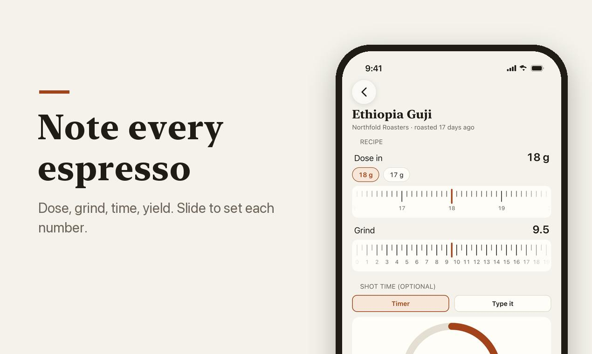

### 🎬 관련 영상
- [🎥 영상 보기](https://ph-files.imgix.net/c7746acd-97f9-4403-91bd-0dccb52ea7f7.jpeg?auto=format)

---

## 29. [WikiFix for Confluence](https://www.producthunt.com/products/wikifix)
**Votes**: 15 | **도입 난이도**: 하 | **신뢰도**: 상
**Tagline**: Find and fix issues in your knowledge base
**서비스 링크**: https://www.producthunt.com/r/PBKWXEHN464ZLF

**태그**: KnowledgeBase, Automation, Confluence, Productivity, AI Tool

### 📌 이 서비스 한눈에 보기
Confluence 지식 베이스의 모순, 중복, 고립된 페이지를 자동으로 찾아 해결하는 도구

### 🔑 주요 기능
- 지식 베이스 내 상충되는 페이지 및 중복 콘텐츠 감지
- 연결이 끊긴 고립된 페이지(Orphans) 식별
- 승인 후 클릭 한 번으로 문제 해결 기능 제공

### 🙋 사용자에게 어떤 점이 좋은가
팀원들이 신뢰할 수 있는 깨끗한 지식 베이스를 유지함으로써, 정보 혼선을 방지하고 AI 답변의 정확도를 높일 수 있습니다.

### ✅ 지금 바로 써볼 기능
- 현재 Confluence 내 중복/모순 콘텐츠 스캔하기
- 식별된 이슈에 대한 원클릭 수정 기능 테스트하기

### ⚠️ 사용 전 확인할 점
- 자동 수정 기능 적용 전 반드시 검토 및 승인 절차 필요
- Confluence 내 데이터 구조에 따른 탐지 정확도 차이 가능성

### 🧭 확인이 더 필요한 정보
Confluence의 어떤 규모나 권한 수준까지 지원하는지에 대한 상세 정보가 필요합니다.

### 📸 스크린샷 및 갤러리

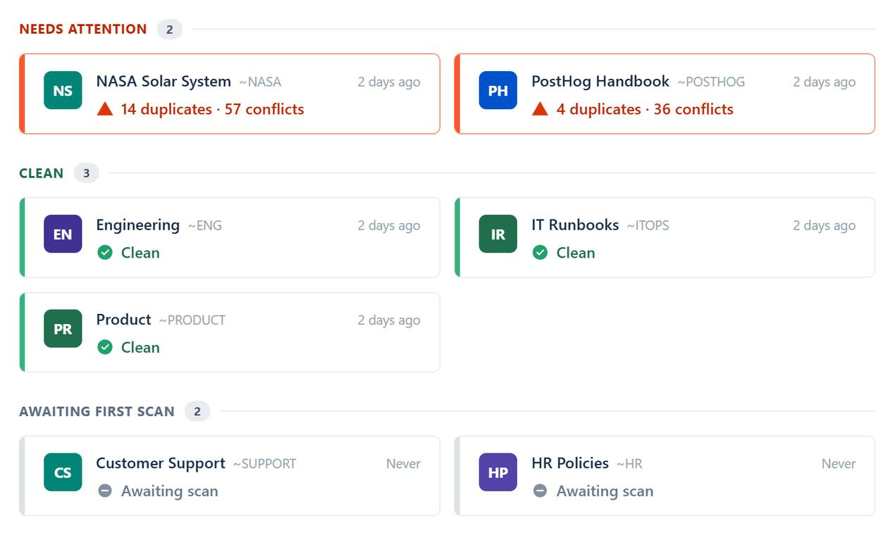
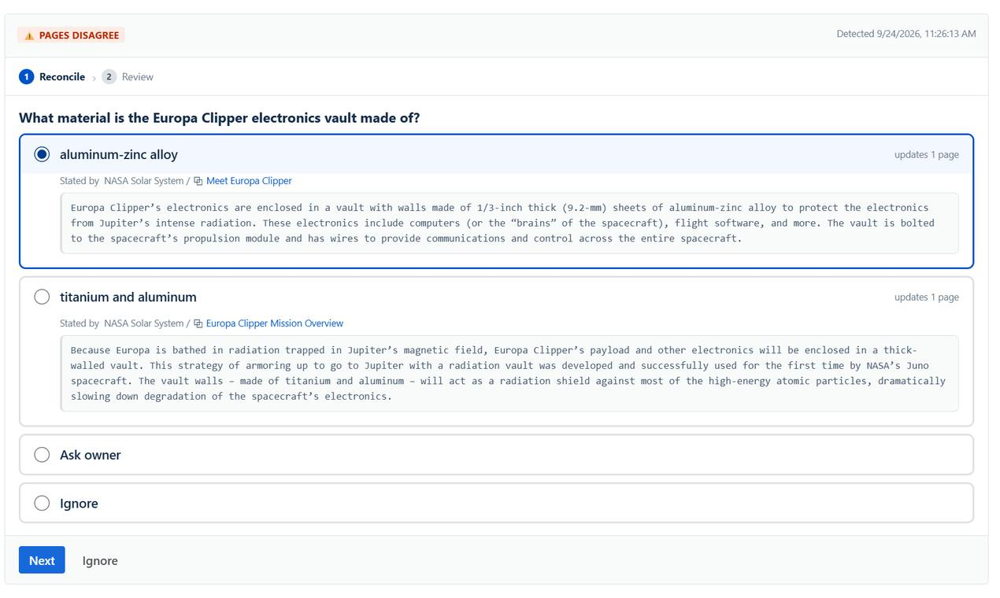

### 🎬 관련 영상
- [🎥 영상 보기](https://ph-files.imgix.net/b0c7d97f-ea5f-4473-9b01-5f8bb989f648.jpeg?auto=format)

---

## 30. [Reassign](https://www.producthunt.com/products/reassign)
**Votes**: 11 | **도입 난이도**: 중 | **신뢰도**: 상
**Tagline**: Your day, shaped into a story. The planner for makers
**서비스 링크**: https://www.producthunt.com/r/UQ6XVJYTN5EBK3

**태그**: Productivity, AI, Planner, TimeManagement, AI Tool

### 📌 이 서비스 한눈에 보기
AI 기반의 24시간 원형 타임 블로킹 플래너로 복잡한 일정을 직관적으로 재구성합니다.

### 🔑 주요 기능
- 24시간 원형 인터페이스를 통한 직관적인 시간 블로킹 및 드래그 앤 드롭
- AI 커맨드 팔레트를 활용한 브레인덤 및 실시간 일정 재구성 기능
- Google Calendar, Outlook, Todoist, Linear 등 외부 도구와의 양방향 동기화

### 🙋 사용자에게 어떤 점이 좋은가
변동성이 큰 업무 환경에서 AI를 통해 일정을 즉각적으로 재배치하고, 여러 도구에 흩어진 일정을 한 곳에서 통합 관리할 수 있습니다.

### ✅ 지금 바로 써볼 기능
- 원형 다이얼을 이용한 시간 블로킹 기능 테스트
- AI 커맨드 팔레트에 브레인덤 입력하여 일정 자동 생성해보기
- 기존 캘린더 및 할 일 관리 도구(Todoist, Linear 등) 연동하기

### ⚠️ 사용 전 확인할 점
- 원형 UI 방식이 기존 리스트형 스케줄러 사용자에게 생소할 수 있음
- 외부 서비스와의 양방향 동기화 시 데이터 충돌 가능성 확인 필요

### 🧭 확인이 더 필요한 정보
제공된 정보에는 모바일 앱 지원 여부와 상세한 AI 알고리즘 작동 방식이 명시되어 있지 않습니다.

### 📸 스크린샷 및 갤러리
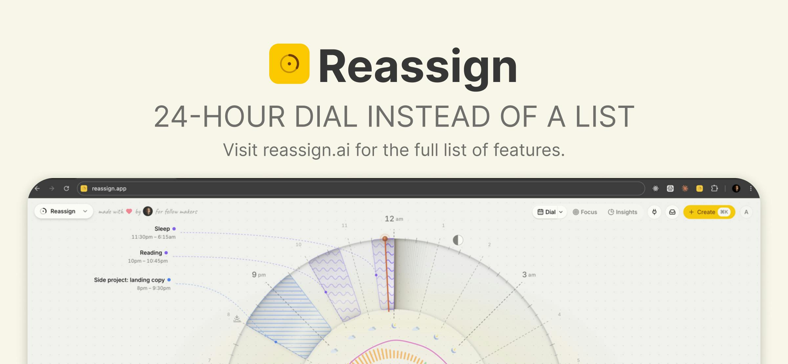

### 🎬 관련 영상
- [🎥 영상 보기](https://ph-files.imgix.net/b2b91674-ab7f-41cd-8bc0-17ef1d99c5bf.jpeg?auto=format)

---

